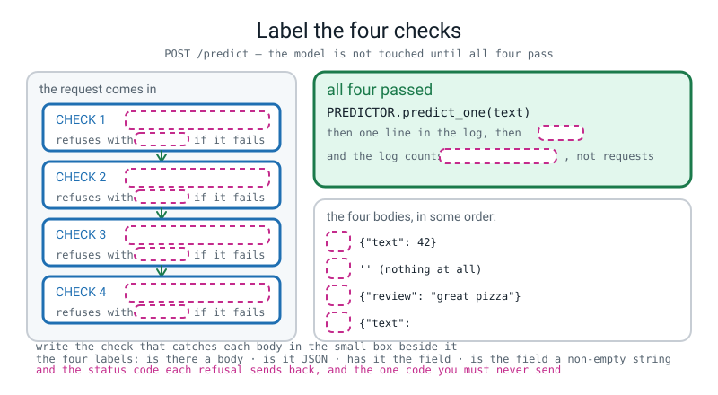
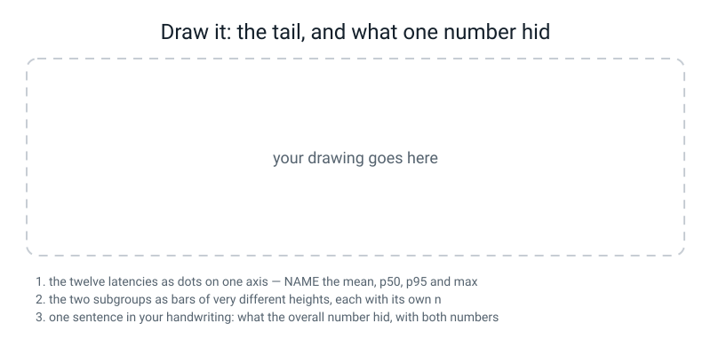

# Workbook — Week 35: Ship It, Part 2: The Service, the Log, and the Card

**Name:** ________________________________  **Date:** ______________

[⬅ Week 34](week-34.md) · [📖 Read the chapter first](../student-guide/week-35.md) · [Course Home](../README.md) · [Next ➡](week-36.md)

> **Your teacher's mark scheme calls these pages 35.1 to 35.8.** **35.1** is prediction P1, **35.3** is M1 of *Do the Maths by Hand*, and **35.2, 35.4, 35.5, 35.6, 35.7** and the stretch **35.8** are the numbered steps of 🛠️ **Build It**. **This is the biggest homework of the year — four of your seven capstone milestones.**

---

## ✅ Warm-Up (5 min)

Five quick questions about **last week**.

**W1.** Your `LATEST` file is **13 bytes**. **Write the sum, and the one command that rolls a model back.**

______ + ______ = ______   command: ________________________________________

**W2.** `json.dump(f, meta)` gives a traceback. **Write its last line and the fix, in the right order.**

last line: ________________________________________________  fix: ______________________

**W3.** A golden test sits at `p = 0.6502` and your threshold is `0.65`. **Why is that not a test?**

________________________________________________________________

**W4.** Two stopwatch numbers from your own project: the cold start ______ ms and one prediction ______ ms. **What is the one thing you must never do with those two numbers?** ______________________

**W5.** `grep -rnE "\.fit\(" serve/` printed nothing. **Finish the sentence:** "That blank line is ______________, not ______________."

---

## 🔢 Do the Maths by Hand

**Calculator only. No code on this page.** There is no new maths this week — the p95 is this week's one piece of arithmetic and it is on page 35.3, so **M1 is that page** and M2 pushes it until it breaks.

---

**M1 — a p95 by hand, on five latencies (page 35.3).**

Five latencies, unsorted, exactly as they came out of the classroom log:

```
3.27    0.38    0.31    0.27    0.27
```

**(a) Sort them and number the positions from ZERO.**

```
values:    ______   ______   ______   ______   ______
positions:   0        1        2        3        4
```

**(b) Find the position of the p95.**

```
0.95 × ( ______ − 1 )  =  0.95 × ______  =  ________
```

**(c) That lands between two positions. Go the right fraction of the way.**

```
gap  =  ________ − ________  =  ________

p95  =  ________ + ________ × ________  =  ________ + ________  =  ________
```

**(d) The p50, which comes out exact.** `0.50 × ______ = ______`, a whole position, so the p50 is the value at position ______ = ________

**(e) The mean, for comparison.** ( ______ + ______ + ______ + ______ + ______ ) ÷ ______ = ________

> **⚠️ Watch out:** the commonest error is dividing by **5** instead of **4**. The positions run 0 to 4, so the **span** is 4. The second commonest is sorting the wrong way round.

---

**M2 — the same method on eight latencies, and the number that moves.**

```
0.24    0.31    1.88    0.22    0.27    0.26    0.29    0.25
```

**(a) sorted:** ______ ______ ______ ______ ______ ______ ______ ______

**(b)** `0.95 × ( ______ − 1 ) = ________`  **between positions** ______ **and** ______

**(c)** `gap = ______ − ______ = ______`  so  `p95 = ______ + ______ × ______ = ________`

**(d) the p50:** `0.50 × 7 = ______`, which lands between positions ______ and ______, so p50 = ( ______ + ______ ) ÷ 2 = ________

**(e) the mean:** ______ ÷ 8 = ________  **the max:** ________

**(f)** Now cross out the `1.88` and redo the p95 on the seven that are left: ________

**(g) In one sentence: why did removing ONE number out of eight move the p95 that far?**

________________________________________________________________

---

**M3 — precision, recall and accuracy for three subgroups, by hand.**

Here are **28 labelled rows** — your 16 held-out reviews followed by the 12 negation traps — with what the model said about each. `1` means positive.

```
row       1  2  3  4  5  6  7  8  9 10 11 12 13 14 15 16 | 17 18 19 20 21 22 23 24 25 26 27 28
truth     1  1  0  0  0  1  1  1  1  1  0  0  0  0  1  0 |  0  0  0  0  0  0  1  1  1  1  1  1
model     1  0  0  0  0  1  1  1  1  0  0  0  0  0  0  0 |  0  1  0  0  0  0  0  0  0  0  0  0
negation  .  .  .  .  .  .  .  .  .  .  .  N  .  .  .  . |  N  N  N  N  N  N  N  N  N  N  N  N
```

**(a) The 16 test reviews (rows 1–16). Count the four cells.**

```
TP = ______   FP = ______   FN = ______   TN = ______      check: ____ + ____ + ____ + ____ = 16

accuracy  = ( ______ + ______ ) ÷ ______ = ________
precision = ______ ÷ ( ______ + ______ ) = ______ ÷ ______ = ________
recall    = ______ ÷ ( ______ + ______ ) = ______ ÷ ______ = ________
```

**(b) The 12 traps (rows 17–28).**

```
TP = ______   FP = ______   FN = ______   TN = ______

accuracy  = ______ ÷ 12 = ________      precision = ______ ÷ ______ = ________      recall = ______ ÷ ______ = ________
```

**(c) The 13 rows with a negation word (the `N`s).**

```
accuracy = ______ ÷ 13 = ________      recall = ______ ÷ ______ = ________
```

**(d) The 15 rows with no negation word.**

```
accuracy = ______ ÷ 15 = ________      precision = ______ ÷ ______ = ________      recall = ______ ÷ ______ = ________
```

---

**M4 — the two checks that stop a subgroup table lying.**

**(a) The sizes must add up.** ______ + ______ = 28  ✅  and the row counts: ______ + ______ = 18 correct out of 28.

**(b) The overall row must be recoverable.** ______ ÷ ______ = ________ — **and it must equal the accuracy of all 28 rows computed straight.** Does it? ______

**(c) One flip.** Suppose one more of the 13 negation rows had come out right. The accuracy goes from ______ ÷ 13 = ________ to ______ ÷ 13 = ________.

**(d) So write the one-sentence caveat that belongs on the page beside `0.462`:**

________________________________________________________________

---

## 🔎 Predict the Output

**In pen, before you run anything.**

### P1 — predict the four replies (page 35.1)

Your service is running on port 8017. Four pieces of deliberate rubbish go in. **Predict the status code AND the message for each**, then send them and record the truth.

| # | what you send | my predicted code | my predicted message |
|---|---|---|---|
| 1 | `-d ''` | ______ | ________________________________ |
| 2 | `-d '{"text": '` | ______ | ________________________________ |
| 3 | `-d '{"review": "great pizza"}'` | ______ | ________________________________ |
| 4 | `-d '{"text": 42}'` | ______ | ________________________________ |

**Then the fifth knock, which is the actual test:** `curl -s http://127.0.0.1:8017/health`

my prediction: ______  **and** `wc -l logs/predictions.jsonl` **before and after the four attacks:** ______ and ______

**The truth, pasted:**

```text

```

**How many of the four crashed the service?** ______  **How many log lines did the four produce?** ______  **Why?** ______________________

---

### P2 — three percentiles and one typo

```python
import numpy as np
lat = [0.20, 0.30, 0.40, 2.00]
print("sorted        :", sorted(lat))
print("p95 position  :", 0.95 * (len(lat) - 1))
print("np p95        :", np.percentile(lat, 95))
print("np p50        :", np.percentile(lat, 50))
print("np p75        :", np.percentile(lat, 75))
print("np 0.95 (!)   :", np.percentile(lat, 0.95))
print("np p100       :", np.percentile(lat, 100), " max:", max(lat))
```

my `p95 position` ____________  my `p95` ____________  my `p50` ____________  my `p75` ____________

my `np.percentile(lat, 0.95)` ____________  my `p100` ____________

**The truth:** p95 ____________  p50 ____________  p75 ____________  `0.95` ____________

**The line with the `(!)` is a real bug that people ship. Say in one sentence what `np.percentile(lat, 0.95)` actually asks for, and why the answer looks completely plausible:**

________________________________________________________________

---

### P3 — the log that silently is not there

**Three programs. Predict the line count each one prints.**

```python
# (a)
logging.basicConfig(filename=p, format="%(message)s")
logging.info(json.dumps({"label": "positive", "probability": 0.6857}))
print("lines in the file:", sum(1 for _ in open(p)))

# (b)
logging.basicConfig(filename=p, level=logging.INFO, format="%(message)s")
logging.info(json.dumps({"label": "positive", "probability": 0.6857}))
print("lines in the file:", sum(1 for _ in open(p)))

# (c)
logging.basicConfig(filename=p, level=logging.INFO)     # no format=
logging.info(json.dumps({"label": "positive"}))
line = open(p).read().strip()
print("the line as written:", line)
json.loads(line)
```

(a) ______  (b) ______  (c) prints ________________________________ **then raises** ______________________

**(a) printed a number and no error at all. Which single word fixes it, and why does Python stay silent?**

________________________________________________________________

**In (c), what does `char 0` in the error message tell you, without reading the file?** ______________________

---

### P4 — one digit arrives as 64 numbers in a JSON body

```python
"""tensorpath.py - a digit arrives as 64 numbers in a JSON body. Get it to the model.

`model` is your trained Week 26 digits network, loaded above this line.
"""
import json

import numpy as np
import torch

body = json.dumps({"pixels": list(range(64))})
pixels = json.loads(body)["pixels"]
print("1. from JSON      :", type(pixels).__name__, "of", len(pixels))

a = np.array(pixels, dtype=np.float64).reshape(8, 8) / 16.0
print("2. as an 8x8 grid :", a.shape, a.dtype)

t = torch.from_numpy(a).float()
print("3. as a tensor    :", tuple(t.shape), t.dtype)

t4 = t.unsqueeze(0).unsqueeze(0)
print("4. batch of one   :", tuple(t4.shape))

with torch.no_grad():
    logits = model(t4)
print("5. logits         :", tuple(logits.shape))
print("6. the answer     :", int(logits.argmax(dim=1).item()))

try:
    model(t.unsqueeze(0))
except Exception as e:
    print("7. one unsqueeze short ->", type(e).__name__)
    print("  ", str(e).splitlines()[0])
```

`model` is the Week 26 digits network: `Conv2d(1,8,3,padding=1) ReLU MaxPool2d(2) Conv2d(8,16,3,padding=1) ReLU MaxPool2d(2) Flatten Linear(64,10)`.

**Predict all seven lines. Shapes in brackets.**

1 ____________________  2 ____________________  3 ____________________  4 ____________________

5 ____________________  6 ____________________  7 ____________________________________________

**Line 7 is the interesting one. Two predictions:**

**(a) Which layer raises it?** ______________  **(b) Where do the numbers `16` and `4` in the message come from?**

________________________________________________________________

**And one more:** if you drop the `.float()` on line 3, which layer complains and what does it say?

______________  ________________________________________________

---

## ✍️ Practice Set A — Read It

**Everything in this set uses one 12-line log file.** Copy it into `logs/demo.jsonl` exactly as printed, or take it from your teacher. (`tiny_v1` and `tiny_v2` are small toy models with their own threshold of `0.55`. They are not `sentiment_v1`, whose shipped threshold from Week 34 is `0.65`.)

```text
{"model_version": "tiny_v1", "input": "hot delicious pizza", "label": "positive", "probability": 0.6857, "threshold": 0.55, "latency_ms": 3.27, "input_chars": 19}
{"model_version": "tiny_v1", "input": "rude slow driver", "label": "negative", "probability": 0.28, "threshold": 0.55, "latency_ms": 0.31, "input_chars": 16}
{"model_version": "tiny_v1", "input": "quick friendly service", "label": "positive", "probability": 0.7562, "threshold": 0.55, "latency_ms": 0.27, "input_chars": 22}
{"model_version": "tiny_v1", "input": "a lovely note and a cold pizza", "label": "negative", "probability": 0.4614, "threshold": 0.55, "latency_ms": 0.24, "input_chars": 30}
{"model_version": "tiny_v1", "input": "stale bread and hot coffee", "label": "negative", "probability": 0.4418, "threshold": 0.55, "latency_ms": 0.29, "input_chars": 26}
{"model_version": "tiny_v1", "input": "cold soggy awful bread", "label": "negative", "probability": 0.275, "threshold": 0.55, "latency_ms": 0.22, "input_chars": 22}
{"model_version": "tiny_v1", "input": "the pizza was not delicious", "label": "positive", "probability": 0.6331, "threshold": 0.55, "latency_ms": 0.25, "input_chars": 27}
{"model_version": "tiny_v1", "input": "fresh crisp salad", "label": "positive", "probability": 0.7427, "threshold": 0.55, "latency_ms": 0.41, "input_chars": 17}
{"model_version": "tiny_v1", "input": "terrible rude staff", "label": "negative", "probability": 0.3403, "threshold": 0.55, "latency_ms": 0.23, "input_chars": 19}
{"model_version": "tiny_v2", "input": "hot delicious pizza", "label": "positive", "probability": 0.5736, "threshold": 0.55, "latency_ms": 0.26, "input_chars": 19}
{"model_version": "tiny_v2", "input": "cold soggy awful bread", "label": "negative", "probability": 0.4079, "threshold": 0.55, "latency_ms": 0.28, "input_chars": 22}
{"model_version": "tiny_v2", "input": "the pizza was not delicious", "label": "positive", "probability": 0.5518, "threshold": 0.55, "latency_ms": 0.24, "input_chars": 27}
```

**A1. Match the word to the thing.** Write the letter.

| Word | | Description |
|---|---|---|
| **endpoint** | ______ | (i) Inputs slowly stopping looking like your training data |
| **request / response** | ______ | (ii) The time 95 percent of requests came in under |
| **prediction log** | ______ | (iii) One path on a server that does one job |
| **p95 latency** | ______ | (iv) The same metric computed separately per group, with `n` on every row |
| **subgroup metrics** | ______ | (v) A method, a path, headers and a body — and a code, headers and a body back |
| **drift** | ______ | (vi) One complete record per line, appended and never rewritten |

**A2. Read one log line.**

Take line 7. **Answer without a computer.**

**(a)** Which model answered? ______________  **(b)** What was it compared to? ________

**(c)** Distance from the threshold: ________ − ________ = ________

**(d)** The label says `positive`. **Read the input. Is the label right?** ______  **And in one sentence, what does that tell you about this model that no accuracy number would?**

________________________________________________________________

**(e)** `input_chars` is `27` and the input printed is 27 characters. **Name the one situation where those two numbers would differ, and why both are logged.**

________________________________________________________________

**A3. Spot the bug in each. Two print no error.**

```python
(1)  rows = [json.loads(line) for line in LOG.read_text().split("\n")]

(2)  band = 0
     for r in rows:
         if r["probability"] >= 0.45 and r["probability"] <= 0.65:
             band = band + 1
     print("band rate: %.1f%%" % (100.0 * band / 115))

(3)  negated = [r for r in rows if "Not" in r["input"].split()]
     print("subgroup n =", len(negated))
```

(1) ________________________________________________________________

(2) ________________________________________________________________

(3) ________________________________________________________________

**Which one gives a traceback, and what is its last line?** ______________________

**A4. Read the subgroup table and say what the headline hid.**

```text
subgroup                     n   accuracy  precision  recall
ALL 28 labelled rows        28    0.643      0.833     0.357
the 16 test reviews         16    0.812      1.000     0.625
the 12 negation traps       12    0.417      0.000     0.000
contains a negation word    13    0.462      0.000     0.000
no negation word            15    0.800      1.000     0.625
```

**(a)** The card says `0.812`. **Which row is that, and how many rows was it measured on?** ______________  ______

**(b)** Which row shows the failure? ______________________  **and the recall there is** ________ **, meaning it found** ______ **of the** ______ **positive ones.**

**(c)** `13 + 15 = ______` ✅ and `0.643 × 28 = ______` correct answers. **Do the two numbers you just wrote agree with the table?** ______

**(d)** Precision is `0.000` on the negation row. **With TP = 0, what must FP be for precision to be a number at all rather than a division by zero?** ______  **and what does `zero_division=0` actually do?** ______________________

**(e)** **One sentence that a careful reader would add before believing the `0.417`:**

________________________________________________________________

**A5. Four status codes, four meanings.**

| code | what it means | whose fault | a request that gets it |
|---:|---|---|---|
| `200` | ________________________ | ____________ | ____________________________ |
| `400` | ________________________ | ____________ | ____________________________ |
| `404` | ________________________ | ____________ | ____________________________ |
| `500` | ________________________ | ____________ | ____________________________ |

**Which one is today's goal never to send?** ______  **And which code does `curl -s -X POST .../predict -d '{"text": "x" × 150000}'` get?** ______

**A6. Label the diagram.**


*Figure W35.1 — Label the four checks. The four malformed bodies are listed out of order.*

Fill in every blank, then answer the two ordering questions:

**(a) Why can check 3 not come before check 2?** ______________________

**(b) Why can check 4 not come before check 3?** ______________________

---

## ✍️ Practice Set B — Write It

### B1 — one line

Print the p95 of the twelve latencies in `logs/demo.jsonl`, to four decimal places.

**Expected output:** one number, bigger than the p50 and smaller than the max.
**Done looks like:** `1.6970`

### B2 — your own p95, about 14 lines

Write `my_p95(values)` **without using `np.percentile`**: sort, find `0.95 × (n − 1)`, take the whole part and the fraction, and interpolate. Then print your answer and numpy's answer side by side for the twelve latencies and for the five from M1.

**Expected output:** two pairs of numbers.
**Done looks like:** your number and numpy's agree to at least four decimal places, and you can say why they are not *identical* strings.

> **💡 Try this:** make `my_p95` work for any percentile, then check `my_p95(v, 50)` against `np.percentile(v, 50)` too. If the p50 disagrees, your "fraction of the gap" step is wrong, not your sorting.

### B3 — the four checks, with no server attached, about 20 lines

Write `check(raw)` that takes a request body **as a string** and returns `(code, message)`, doing the four checks **in the right order**. Then run it over these seven bodies and print one line each:

```python
BODIES = ['', '{"text": ', '{"review": "great pizza"}', '{"text": 42}',
          '{"text": "   "}', '["text"]', '{"text": "hot delicious pizza"}']
```

**Done looks like:** six `400`s and one `200`, and the `got_type` in the message is `int` for one of them, `str` for another and `list` for a third.

> **⚠️ Watch out:** `'{"text": "   "}'` is the sneaky one. Three spaces is a string, and it has length 3. **Only `.strip()` catches it.**

### B4 — the subgroup report, about 22 lines

Type the 28 rows from M3 into a file as three lists (`TRUTH`, `PRED`, `NEGATION`) plus a `GROUP` list of `"test"`/`"trap"`. Write `report(name, keep)` where `keep` is a list of `True`/`False`, one per row, and have it print the name, **`n`**, accuracy, precision and recall — with the words `<- too small to conclude from` appended automatically when `n < 10`.

Then print the five rows from A4.

**Done looks like:** your five rows match A4's table **to three decimal places**, `n` is on every row, and you can point at the four lines of code that print the caveat.

### B5 — the monitoring number, about 25 lines

Two numbers can be computed from your log **with no labels at all**. Write `monitor.py` that prints both:

1. the **band rate** — the share of predictions whose probability is between 0.45 and 0.65,
2. the **out-of-vocabulary rate** — for each logged input, the share of its tokens that are **not** in the model's vocabulary, and the mean over the whole log.

Then print the OOV rate for two inputs from a different world: `the biryani was absolutely banging fam no cap` and `lorem ipsum dolor sit amet`.

**Done looks like:** a band rate as `k of n = xx.x%`, a mean OOV rate, and **two drifted inputs whose OOV rate is far above your baseline.** Finish by printing whether `not` is in your vocabulary at all.

---

## 🐞 Fix the Broken Program

**Three bugs: one that stops it dead, one shape error later on, and one that prints a perfectly plausible latency that is arithmetically impossible.**

```python
"""broken35.py - read the log back. THREE BUGS."""
import json
from pathlib import Path

import numpy as np

LOG = Path("logs/demo.jsonl")

rows = []
for line in LOG.read_text().split("\n"):
    rows.append(json.loads(line))

lat = np.array([r["latency_ms"] for r in rows])
prob = np.array([r["probability"] for r in rows]).reshape(-1, 1)

print("requests            : %d" % len(rows))
print("latency mean        : %.4f ms" % lat.mean())
print("latency p50         : %.4f ms" % np.percentile(lat, 50))
print("latency p95         : %.4f ms" % np.percentile(lat, 0.95))
print("latency max         : %.4f ms" % lat.max())

band = (prob >= 0.45) & (prob <= 0.65)
print("in the 0.45-0.65 band: %d of %d" % (band.sum(), len(rows)))
print("their latencies      :", lat[band])
```

**The first real run:**

```text
Traceback (most recent call last):
  File "/private/tmp/wb35/broken35.py", line 11, in <module>
    rows.append(json.loads(line))
  File "/.../json/__init__.py", line 346, in loads
    return _default_decoder.decode(s)
  File "/.../json/decoder.py", line 355, in raw_decode
    raise JSONDecodeError("Expecting value", s, err.value) from None
json.decoder.JSONDecodeError: Expecting value: line 1 column 1 (char 0)
```

**Bug 1.** `char 0` is the clue. **What is in the list that is not a log line, where did it come from, and what is the one-word method that fixes it?**

________________________________________________________________

**Fix it and run again:**

```text
requests            : 12
latency mean        : 0.5225 ms
latency p50         : 0.2650 ms
latency p95         : 0.2210 ms
latency max         : 3.2700 ms
in the 0.45-0.65 band: 4 of 12
Traceback (most recent call last):
  File "/private/tmp/wb35/broken35_step2.py", line 24, in <module>
    print("their latencies      :", lat[band])
IndexError: too many indices for array: array is 1-dimensional, but 2 were indexed
```

**Bug 2.** **Which two shapes are fighting? Write both.** `lat` is ____________ and `band` is ____________

**And the four characters to delete:** ______________

**Bug 3 is printed in that output and it never raises anything. Find it.**

**(a)** Look at the p50 and the p95. **Write the impossibility as an inequality:** ________ < ________ **, and a p95 can never be** ______________________

**(b) What did `np.percentile(lat, 0.95)` actually ask for?** Position `0.0095 × 11 = ________`, which is essentially ______________________

**(c) The fix:** ______________________

**(d)** The fixed program prints:

```text
latency p95         : 1.6970 ms
their latencies      : [0.24 0.25 0.26 0.24]
```

**Why is the correct p95 of these twelve requests such a bad headline number anyway?** ______________________

---

## 🧩 Puzzle of the Week

### The Check That Can Never Fire

Your four checks, in the order the chapter put them:

```
1.  is there a body at all, and is it a sane size?          (reads Content-Length)
2.  is it actually JSON?                                    (json.loads)
3.  is it an object with a 'text' field?                     ("text" in payload)
4.  is 'text' a non-empty string?                            (isinstance + .strip())
```

Four students each shuffled them. For each shuffle, say **what happens** — does a check become unreachable, does a good request get refused, or does the program crash on rubbish it was supposed to refuse politely?

**(a) 1, 3, 2, 4** — check 3 now runs on the raw body, which is **bytes**.

what happens: ________________________________________________________

the real error: ________________________________________________________

**(b) 1, 2, 4, 3** — check 4 asks about a field before anything has checked the field exists.

what happens: ________________________________________________________

the real error: ________________________________________________________

**(c) 2, 1, 3, 4** — JSON parsing happens before the "is there a body" check.

what happens on an empty body: ____________________________________________

and **is the reply still a `400`?** ______  **is it still a *useful* `400`?** ______  **why does that matter?**

________________________________________________________________

**(d) 1, 2, 3, 4 but with check 4 written as `if not isinstance(text, str) or text == "":`**

what gets through that should not: ____________________________________________

**Part 2 — the general rule.** Finish the sentence in your own words:

"Each check is only safe because ________________________________________, which is why the order is ______________________ and not ______________________."

---

## 🤔 Think Deeper

**T1.** Somebody says: *"your service made 115 requests and 111 predictions, so just log all 115 — then the numbers match and nothing is confusing."*

**Answer them in a paragraph.** Then go further: if you *did* log the four refusals, **what would you have to add to every line to keep the log honest**, and which of your numbers would you then have to compute two ways?

________________________________________________________________

________________________________________________________________

________________________________________________________________

________________________________________________________________

**T2.** Your monitoring plan watches the band rate. A friend says: *"just watch the accuracy — it's the number everybody cares about."*

**Write the one question that ends the argument.** Then the harder half: your friend replies *"fine, I'll label a hundred of the log lines myself each week."* **Say what they have actually just proposed, what it costs, and one thing that would go wrong with it that has nothing to do with effort.**

________________________________________________________________

________________________________________________________________

________________________________________________________________

________________________________________________________________

---

## 🛠️ Build It — the service, the log, the card and the plan

### Step checklist

- [ ] `serve/service.py` runs, bound to `127.0.0.1`, and `GET /health` answers
- [ ] all **four** malformed requests get a clear `400` and the service stays up
- [ ] **35.2** — the findings card, four rows, every "did it stay up?" cell filled
- [ ] **35.4** — 100+ log lines generated, read back, four latency numbers written down
- [ ] **35.5** — the subgroup table, `n` on every row, and the sentence about what was hidden
- [ ] **35.6** — the model card, six headings plus the paragraph on what I log
- [ ] **35.7** — the monitoring plan, one page, with a number I can compute with no labels
- [ ] **35.8** (stretch) — thirty requests from a different world, and the OOV climb

---

### 35.2 — The findings card

**Write the four attacks BEFORE you send them.** An unwritten attack is a competition; a written one is a diagnosis.

| # | what I sent | predicted code | actual code | the message that came back | did `GET /health` still answer? |
|---|---|---:|---:|---|---|
| 1 | ____________________ | ______ | ______ | ____________________________ | ______ |
| 2 | ____________________ | ______ | ______ | ____________________________ | ______ |
| 3 | ____________________ | ______ | ______ | ____________________________ | ______ |
| 4 | ____________________ | ______ | ______ | ____________________________ | ______ |

**Findings raised against somebody else's service:** ______  **Findings raised against mine:** ______

**Signed off after the fix by the finder:** ______________  **The word banned from this card is:** ______________

---

### 35.4 — A hundred log lines, and the four numbers

```text
$ wc -l logs/predictions.jsonl
```

**lines:** ______  **requests I actually sent:** ______  **and if those differ, why:** ______________________

| number | mine | what it is for |
|---|---:|---|
| mean | ________ ms | pulled around by the tail; never report it alone |
| p50 | ________ ms | the middle request; blind to the tail |
| **p95** | ________ ms | **nearly everybody's experience — the headline** |
| max | ________ ms | **the one request somebody actually noticed** |

**by version:** ________________________  **by label:** ________________________  **check:** ______ + ______ = ______

**One sentence: which number would a user notice, and why?**

________________________________________________________________

**And which request was the max? Quote the log line:**

```text

```

---

### 35.5 — The subgroup metrics table

| subgroup | n | accuracy | precision | recall | note |
|---|---:|---:|---:|---:|---|
| ALL labelled rows | ______ | ________ | ________ | ________ | |
| ____________________________ | ______ | ________ | ________ | ________ | |
| ____________________________ | ______ | ________ | ________ | ________ | |
| ____________________________ | ______ | ________ | ________ | ________ | |
| ____________________________ | ______ | ________ | ________ | ________ | |

**`n` on every single row?** ______  **Anything under 10 labelled *too small to conclude from*?** ______

**My worst group:** ____________________  **its recall:** ________ **, which means it found** ______ **of** ______

**One sentence: what was the overall number hiding?**

________________________________________________________________

**And if any group is adversarial — written by me on purpose to be hard — say so here:**

________________________________________________________________

---

### 35.6 — The model card

**1 · INTENDED USE** (who, for what, and the sentence *this outputs a suggestion, not a decision*)

________________________________________________________________

**2 · TRAINING DATA** (how many rows, who wrote them, when, the split — **and what is not represented**)

________________________________________________________________

**3 · METRICS** (the number, its `n`, the threshold, the **baseline**, and what one row is worth)

________________________________________________________________

**4 · METRICS BY SUBGROUP** (point at 35.5, then name the worst group and its number)

________________________________________________________________

**5 · KNOWN FAILURE MODES — three, each with a real input, the wrong output, and a mechanism**

(a) input ____________________________ → ____________ at `p =` ________ because ______________________

(b) input ____________________________ → ____________ at `p =` ________ because ______________________

(c) input ____________________________ → ____________ at `p =` ________ because ______________________

> **⚠️ Watch out:** *"it struggles with negation"* is not a failure mode. A failure mode names **an input, the wrong output, and why.**

**6 · OUT-OF-SCOPE USES** (two, and one of them must be genuinely tempting)

________________________________________________________________

**7 · WHAT I LOG, AND WHAT I DON'T** (what is in each line, how much of the input you keep, and **why you chose that limit**)

________________________________________________________________

---

### 35.7 — The monitoring plan, one page

**The number I watch:** ________________________________________

**How I measure it with NO labels at all:** ________________________________________

**My measured baseline, from my own log:** ______ of ______ = ________ **%**

**Alarm level:** ________  **and why that level and not another:** ______________________

**Why this number degrades for MY model specifically** (the mechanism, not the metric):

________________________________________________________________

**What I do when it trips, in order:** 1 ____________________ 2 ____________________ 3 ____________________

**One thing I would deliberately NOT do:** ________________________________________

**What would make me retire it entirely:** ________________________________________

---

### 35.8 — Stretch: watch the drift

| input | tokens unknown | of | OOV rate | what it means |
|---|---:|---:|---:|---|
| one normal request from my log | ______ | ______ | ________ | ____________________ |
| ____________________________ | ______ | ______ | ________ | ____________________ |
| ____________________________ | ______ | ______ | ________ | ____________________ |
| **mean over my whole log** | — | — | ________ | **this is what "normal" looks like for my traffic** |

**I guessed the accuracy would start falling at an OOV rate of** ________ **. I hand-labelled** ______ **drifted inputs and it was actually** ________ **.**

---

## 🎨 Draw It


*Figure W35.2 — The tail, and what one number hid.*

**What a good answer looks like:** across the top, **one axis with all twelve latencies as dots on it**, and here is the thing that makes the drawing work — **draw it to scale.** Eleven dots huddle between 0.22 and 0.41, and one sits miles away at 3.27. Then mark and **name** four positions: the mean at `0.5225` (which lands in the empty space where **no request actually was**), the p50 at `0.2650`, the p95 at `1.6970`, and the max at `3.2700`. A drawing where the mean sits inside the huddle is a drawing of the wrong data.

Underneath, **two bars for the two subgroups**: `0.800` tall on 15 rows, `0.462` short on 13 rows, **with the `n` written inside each bar**, not beside it. Then the row that earns the marks: **`recall 0 of 6`** written under the short bar in large figures.

**And one sentence in your own handwriting**, containing both numbers, saying what the overall figure was hiding.

**My four named positions:** mean ________ · p50 ________ · p95 ________ · max ________

**Which of the four lands where no real request was?** ______________

**My two bar heights and their n:** ________ (n = ______) and ________ (n = ______)

---

## 📊 Self-Check

| I can... | 😀 | 🙂 | 😕 |
|---|---|---|---|
| say what the four parts of an HTTP request are | | | |
| explain `127.0.0.1` against `0.0.0.0` with the **reason**, not just the string | | | |
| write `do_GET` and `do_POST` with the capitals right | | | |
| send a reply in the right order: response, headers, `end_headers`, body | | | |
| name the four checks **in order** and say why each order matters | | | |
| write an error message that says what to send instead | | | |
| say which status code is my fault and which is the sender's | | | |
| get `logging` to actually write a line, and say why it silently might not | | | |
| read my own log back as data and count its lines first | | | |
| work out a p95 by hand and check it against numpy | | | |
| say why a p95 on twelve requests is nearly meaningless | | | |
| report four latency numbers and say what each is for | | | |
| explain why the log counts predictions, not requests | | | |
| compute accuracy, precision and recall for a subgroup by hand | | | |
| put `n` on every row of a table without being told | | | |
| say what my headline number was hiding, with both numbers | | | |
| name a monitoring number that needs **no labels** | | | |
| measure its baseline from my own traffic rather than guessing | | | |
| say one thing I would deliberately not do | | | |

**The one thing I would ask about if I could ask one question:**

________________________________________________________________

---

## ✅ Answers

<details>
<summary>Check your answers</summary>

### Warm-Up

**W1.** `12 + 1 = 13` — twelve characters plus one newline. The command: `echo "sentiment_v2" > model/artifacts/LATEST`.

**W2.** `TypeError: Object of type TextIOWrapper is not JSON serializable`. The fix is `json.dump(meta, f)` — **data first, file second.** `TextIOWrapper` is Python's name for an open file.

**W3.** Because it sits `0.0002` above the threshold, so it will flip on a retrain, a library upgrade or a rounding difference between two machines. **That is an alarm that cries wolf, not a test** — and the first thing anybody does with an alarm that cries wolf is stop listening to it.

**W4.** **Never add them, and never report only one of them.** The cold start is paid once at start-up; the latency is paid every single prediction. One number is an answer that has hidden something.

**W5.** "That blank line is **evidence**, not **a promise**."

---

### Do the Maths by Hand

**M1 — a p95 on five latencies.**

**(a)**

```
values:    0.27   0.27   0.31   0.38   3.27
positions:   0      1      2      3      4
```

**(b)** `0.95 × (5 − 1) = 0.95 × 4 = 3.8`

**(c)** 3.8 sits between position 3 and position 4, **eight tenths of the way along**:

```
gap  =  3.27 − 0.38  =  2.89
p95  =  0.38 + 0.80 × 2.89  =  0.38 + 2.312  =  2.692
```

**Checked against numpy:** `np.percentile([3.27, 0.38, 0.31, 0.27, 0.27], 95)` → `2.6919999999999993`. **Your `2.692` and numpy's tail of nines are the same number**; the difference is floating-point wobble, exactly as in Week 17.

**(d)** `0.50 × 4 = 2.0`, a whole position, so the p50 is the value at position 2: **0.31**.

**(e)** `(0.27 + 0.27 + 0.31 + 0.38 + 3.27) ÷ 5 = 4.50 ÷ 5 = 0.90`. **Look at that: the mean is 0.90, and four of the five requests came in under 0.38.** The mean is describing a request that never happened.

**M2 — eight latencies.**

**(a)** `0.22  0.24  0.25  0.26  0.27  0.29  0.31  1.88`

**(b)** `0.95 × (8 − 1) = 0.95 × 7 = 6.65` — between positions **6** and **7**.

**(c)** `gap = 1.88 − 0.31 = 1.57`, so `p95 = 0.31 + 0.65 × 1.57 = 0.31 + 1.0205 = 1.3305`. Numpy says `1.3304999999999991`.

**(d)** `0.50 × 7 = 3.5`, between positions 3 and 4, so `p50 = (0.26 + 0.27) ÷ 2 = 0.265`.

**(e)** `3.72 ÷ 8 = 0.465`. **max = 1.88.**

**(f)** Without the `1.88`: seven values, `0.95 × 6 = 5.7`, between `0.29` and `0.31`, so `0.29 + 0.7 × 0.02 = 0.304`. **The p95 fell from 1.3305 to 0.304 — a factor of more than four — because one number out of eight was removed.**

**(g)** Because **95% of eight numbers is 7.6 numbers**, so the single slow request is an eighth of the data and the p95 reaches most of the way up to it. **A percentile is a claim about a proportion, so what it means depends entirely on how many numbers you have.** With 111 requests that same slow one is one part in 111 and the p95 never gets near it. **This is why you print the count beside the p95, always.**

**M3 — the three subgroups by hand.**

**(a) the 16 test reviews.** Eight rows are truth 1 (rows 1, 2, 6, 7, 8, 9, 10, 15) and the other eight are truth 0. The model's row differs from the truth row in exactly three places: rows 2, 10 and 15, all truth 1 and all called 0.

```
TP = 5   FP = 0   FN = 3   TN = 8        check: 5 + 0 + 3 + 8 = 16 ✅

accuracy  = (5 + 8) ÷ 16 = 13 ÷ 16 = 0.8125 → 0.812
precision = 5 ÷ (5 + 0) = 5 ÷ 5 = 1.000
recall    = 5 ÷ (5 + 3) = 5 ÷ 8 = 0.625
```

**Accuracy comes out at 0.812 here, and that is exactly the headline the card prints.** It looks respectable, and it is not a certificate; the next two groups are where it stops being true.

**(b) the 12 traps.** Rows 17–22 are truth 0; row 18 was called 1 and the other five were called 0. Rows 23–28 are truth 1 and all six were called 0.

```
TP = 0   FP = 1   FN = 6   TN = 5

accuracy  = 5 ÷ 12 = 0.4167 → 0.417
precision = 0 ÷ (0 + 1) = 0 ÷ 1 = 0.000
recall    = 0 ÷ (0 + 6) = 0 ÷ 6 = 0.000
```

**(c) the 13 negation rows** = the 12 traps plus row 12 (`i would not order from here again`), which is truth 0 and was called 0 — one more correct answer and nothing else.

```
accuracy = 6 ÷ 13 = 0.4615 → 0.462
recall   = 0 ÷ 6  = 0.000
```

**(d) the 15 rows with no negation word** = the 16 test rows except row 12. Row 12 was a TN, so removing it changes the correct count and nothing else.

```
accuracy  = 12 ÷ 15 = 0.8000 → 0.800
precision = 5 ÷ 5 = 1.000
recall    = 5 ÷ 8 = 0.625
```

**M4.**

**(a)** `13 + 15 = 28` ✅ and `6 + 12 = 18` correct out of 28.

**(b)** `18 ÷ 28 = 0.6429 → 0.643`, **which is exactly the ALL row.** If it were not, one of your groups has a row in it twice or none at all — and that is the single commonest silent error in a report like this.

**(c)** From `6 ÷ 13 = 0.462` to `7 ÷ 13 = 0.5385 → 0.538`.

**(d) The caveat:** *"Both the 13-row and the 15-row groups are only just above the ten-row line, and **one row flipping moves the negation group from 0.462 to 0.538** — so these numbers show that the mechanism exists, they do not estimate how often it bites."*

---

### Predict the Output

**P1 — the real replies, run against a real service.**

```text
$ curl -s -X POST http://127.0.0.1:8017/predict -d ''
{"error": "empty body; expected {\"text\": \"...\"}"}

$ curl -s -X POST http://127.0.0.1:8017/predict -d '{"text": '
{"error": "invalid JSON: Expecting value: line 1 column 10 (char 9)"}

$ curl -s -X POST http://127.0.0.1:8017/predict -d '{"review": "great pizza"}'
{"error": "expected a JSON object with a 'text' field", "example": {"text": "the pizza was hot"}}

$ curl -s -X POST http://127.0.0.1:8017/predict -d '{"text": 42}'
{"error": "'text' must be a non-empty string", "got_type": "int"}

$ curl -s http://127.0.0.1:8017/health
{"status": "ok", "model_version": "tiny_v1", "threshold": 0.55, "classes": ["negative", "positive"]}
```

**All four are `400`. The health check is `200`.** And three more, all real:

```text
$ curl -s -X POST http://127.0.0.1:8017/predict -d '{"text": "   "}'
{"error": "'text' must be a non-empty string", "got_type": "str"}

$ curl -s -X POST http://127.0.0.1:8017/predict -d '["text"]'
{"error": "expected a JSON object with a 'text' field", "example": {"text": "the pizza was hot"}}

$ curl -s http://127.0.0.1:8017/predikt
{"error": "not found", "routes": ["GET /health", "POST /predict"]}
```

**Crashes: zero. Log lines produced by the four: zero.** Nothing was *predicted*, so there was nothing to log. **The log counts predictions, not requests** — and next week somebody will ask you how many predictions your service has made, so know the difference.

**The thing to notice about reply 2:** it forwarded the JSON parser's own words, `line 1 column 10 (char 9)`. **You did not write that. You wrote `%s` and let the exception describe itself.** When a library gives you a good message, pass it on.

**P2 — the real run.**

```text
sorted        : [0.2, 0.3, 0.4, 2.0]
p95 position  : 2.8499999999999996
np p95        : 1.7599999999999993
np p50        : 0.35
np p75        : 0.8
np 0.95 (!)   : 0.20285
np p100       : 2.0  max: 2.0
```

Check the p95 by hand: position `0.95 × 3 = 2.85`, between `0.4` and `2.0`, gap `1.6`, so `0.4 + 0.85 × 1.6 = 0.4 + 1.36 = 1.76` ✅.

**The `(!)` line.** `np.percentile` wants the percentile as a number **out of 100**, so `0.95` means *the zero-point-nine-fifth percentile* — position `0.0095 × 3 = 0.0285`, which is a whisker above the **smallest** value. It returns `0.20285`. **And that is why this bug ships: `0.20285` looks exactly like a plausible fast latency.** Nothing is out of range, nothing raises, and the number is wrong by a factor of nine. **The tell is always the same: a p95 must sit between the p50 and the max.**

**P3 — the three real runs.**

```text
(a) lines in the file: 0
(b) lines in the file: 1
    {"label": "positive", "probability": 0.6857}
(c) the line as written: INFO:root:{"label": "positive"}
    JSONDecodeError: Expecting value: line 1 column 1 (char 0)
```

**(a)** The word is **`level=logging.INFO`**. Python's default logging level is `WARNING`, and `INFO` is *below* it, so `logging.info(...)` threw the line away. Python stays silent because **discarding a message below the level is exactly what a logging level is for** — it is not an error, it is the feature working. Which is precisely why it is so dangerous: no error, no warning, no file contents.

**The defence is the one from all year: predict a number you can check.** You sent one request, so you expect one line, so `wc -l` is the first thing you type.

**(c)** `char 0` means it failed on the **very first character**, which almost always means *the line does not start with `{`*. Here the logger's default prefix `INFO:root:` is still on it. You can diagnose that without opening the file.

**P4 — the real run.**

```text
1. from JSON      : list of 64
2. as an 8x8 grid : (8, 8) float64
3. as a tensor    : (8, 8) torch.float32
4. batch of one   : (1, 1, 8, 8)
5. logits         : (1, 10)
6. the answer     : 9
7. one unsqueeze short -> RuntimeError
   mat1 and mat2 shapes cannot be multiplied (16x4 and 64x10)
```

> **⚠️ Line 6 is the one line here that is allowed to differ.** Lines 1 to 5 and line 7 are shapes,
> dtypes and an error message, so they are the same on every machine. **Line 6 is a prediction**, and
> `list(range(64))` is a ramp, not a handwritten digit — so which of the ten classes your own Week 26
> weights pick for it depends on your own training run. **If you got a different digit on line 6 and
> everything else matches, you are right and so is the book.** Write down what *yours* said.

**(a)** The **`Linear`** layer raises it — the very last one. **Every layer before it was perfectly happy**, which is what makes this error confusing the first time.

**(b)** With a `(1, 8, 8)` input, `Conv2d` treats the tensor as **one unbatched image with 1 channel**, so it flows through to `(16, 2, 2)` after the second pool. Then `Flatten` does what it always does: **it keeps dimension 0 as the batch** and flattens the rest. So `(16, 2, 2)` becomes `(16, 4)` — **sixteen "rows" of four numbers** — and `Linear(64, 10)` wants rows of 64. Hence `16x4 and 64x10`. **The missing batch dimension turned the channels into the batch.**

**And the dtype one:** `Conv2d` complains, first layer, immediately:

```text
RuntimeError: Input type (double) and bias type (float) should be the same
```

`torch.from_numpy` keeps numpy's `float64`; every layer in PyTorch holds `float32`. **`.float()` is not decoration.**

---

### Practice Set A

**A1.** endpoint **(iii)** · request / response **(v)** · prediction log **(vi)** · p95 latency **(ii)** · subgroup metrics **(iv)** · drift **(i)**.

**A2.**

**(a)** `tiny_v1`. **(b)** `0.55`.

**(c)** `0.6331 − 0.55 = 0.0831`.

**(d)** **No — the label is wrong.** `the pizza was not delicious` is a negative review and the model called it positive. What this tells you that no accuracy number would: **accuracy is an average over rows you chose, and this row is evidence about a mechanism.** The model has no representation of word order and (as you can check with B5) `not` is not even in its vocabulary, so what reached the classifier was effectively `pizza delicious`. **One log line with its input in it is a post-mortem; a number without inputs is not.**

**(e)** They differ **when the input was longer than the logging limit and got truncated** — the chapter keeps the first 300 characters. Both are logged so that a truncated input is never silently pretended to be short: `input` is what you can read, `input_chars` is what actually arrived. **It is also the one number that would tell you somebody is sending you 100-kilobyte bodies.**

**A3.**

**(1) A traceback.** `split("\n")` on a file that ends in a newline gives a final empty string, and `json.loads("")` fails:

```text
json.decoder.JSONDecodeError: Expecting value: line 1 column 1 (char 0)
```

Fix: `.splitlines()`, or skip lines where `line.strip() == ""`.

**(2) Silent, and it is a lie.** The divisor is hard-coded as `115` — the number of **requests** — while `rows` holds **predictions**. With 16 band rows out of 111 predictions the honest rate is `16 ÷ 111 = 14.4%`, and this program prints `16 ÷ 115 = 13.9%` — about half a percentage point low, against an alarm level of 40%, and nothing anywhere says so. **Divide by `len(rows)`, every time.** Hard-coding a count you could compute is how a report gets out of date without changing.

**(3) Silent, and prints `n = 0`.** `"Not"` with a capital never matches `not`, and the log's inputs are lowercase. **A subgroup of zero is a filter bug, not a finding** — which is why you print `n` on every row: a zero jumps out, a wrong number does not. Fix: `r["input"].lower().split()`.

**A4.**

**(a)** `the 16 test reviews`, measured on **16** rows — a respectable `0.812`.

**(b)** `contains a negation word`. Recall there is `0.000`, meaning it found **0** of the **6** positive ones.

**(c)** `13 + 15 = 28` ✅ and `0.643 × 28 = 18.0` correct answers. **Both agree** — `18 ÷ 28 = 0.643`.

**(d)** FP must be **at least 1** (here it is 1). With TP = 0 **and** FP = 0, precision is `0 ÷ 0`, which is undefined — and `zero_division=0` tells scikit-learn to **report 0 instead of raising**. Worth knowing exactly what it does: it is a *choice about how to present an undefined number*, not a calculation. A `0.000` precision could mean "it got every positive prediction wrong" or "it never predicted positive at all", **and those are very different models.** Print the counts beside the metric.

**(e)** *"Twelve of those twelve trap rows were written by me on purpose to be hard, so `0.417` shows the mechanism exists — it does not estimate how often this happens on real traffic."*

**A5.**

| code | what it means | whose fault | example |
|---:|---|---|---|
| `200` | here is your answer | nobody | `{"text": "hot pizza"}` |
| `400` | you sent it wrong, and here is what to send instead | the sender's | any of the four malformed bodies |
| `404` | that door does not exist; here are the ones that do | the sender's | `GET /predikt` |
| `500` | **I broke** | **mine** | an unhandled exception in my own code |

**Today's goal is never to send a `500`.** And a 150,000-byte body gets **`413`** — *body too large* — because the limit is 100,000 and check 1 catches it before anything is read.

**A6.** Check 1 *is there a body at all, and is it a sane size* → `400` (or `413` if too big) · Check 2 *is it actually JSON* → `400` · Check 3 *has it the field the contract promised* → `400` · Check 4 *is that field a non-empty string* → `400`. The four bodies map as: empty body → check 1 · unfinished object → check 2 · `{"review": ...}` → check 3 · `{"text": 42}` → check 4. **The log counts predictions, not requests.**

**(a)** You cannot look for a field **inside something that is not an object yet** — at that point you still have raw bytes.

**(b)** You cannot ask a field's **type** before knowing it **exists**; `payload["text"]` raises `KeyError: 'text'` first.

---

### Practice Set B

**B1 — one line.**

```python
print("%.4f" % np.percentile([json.loads(l)["latency_ms"] for l in open("logs/demo.jsonl")], 95))
```

```text
1.6970
```

**B2 — `my_p95`.**

```python
"""myp95.py - a percentile from scratch, then checked."""
import numpy as np


def my_percentile(values, q):
    v = sorted(values)
    pos = (q / 100.0) * (len(v) - 1)
    low = int(pos)                       # the whole part
    frac = pos - low                     # how far past it
    if low + 1 >= len(v):
        return v[low]
    return v[low] + frac * (v[low + 1] - v[low])


twelve = [3.27, 0.31, 0.27, 0.24, 0.29, 0.22, 0.25, 0.41, 0.23, 0.26, 0.28, 0.24]
five = [3.27, 0.38, 0.31, 0.27, 0.27]
for name, v in [("twelve", twelve), ("five", five)]:
    print("%-7s mine p95 %.6f   numpy %.6f   mine p50 %.6f   numpy %.6f"
          % (name, my_percentile(v, 95), np.percentile(v, 95),
             my_percentile(v, 50), np.percentile(v, 50)))
```

```text
twelve  mine p95 1.697000   numpy 1.697000   mine p50 0.265000   numpy 0.265000
five    mine p95 2.692000   numpy 2.692000   mine p50 0.310000   numpy 0.310000
```

**Why they are not identical strings.** `np.percentile(five, 95)` prints as `2.6919999999999993` if you print it raw, and yours prints `2.692`. **Both are the closest a computer can get to the same real number**, and they differ in the sixteenth decimal place because the two programs did the multiplications in a different order. `np.allclose` says they agree. **This is Week 17's lesson arriving one last time: two correct programs can disagree in the last digit, and "same" means `allclose`, not `==`.**

**B3 — `check(raw)`.**

```python
"""checks.py - the four checks, with no server attached."""
import json

BODIES = ['', '{"text": ', '{"review": "great pizza"}', '{"text": 42}',
          '{"text": "   "}', '["text"]', '{"text": "hot delicious pizza"}']


def check(raw):
    if len(raw) == 0:
        return 400, "empty body"
    try:
        payload = json.loads(raw)
    except Exception as e:
        return 400, "invalid JSON: %s" % e
    if not isinstance(payload, dict) or "text" not in payload:
        return 400, "expected a JSON object with a 'text' field"
    text = payload["text"]
    if not isinstance(text, str) or text.strip() == "":
        return 400, "'text' must be a non-empty string, got_type=%s" % type(text).__name__
    return 200, "predicted on %d characters" % len(text)


for raw in BODIES:
    code, message = check(raw)
    print("%-30s -> %d  %s" % (repr(raw), code, message))
```

```text
''                             -> 400  empty body
'{"text": '                    -> 400  invalid JSON: Expecting value: line 1 column 10 (char 9)
'{"review": "great pizza"}'    -> 400  expected a JSON object with a 'text' field
'{"text": 42}'                 -> 400  'text' must be a non-empty string, got_type=int
'{"text": "   "}'              -> 400  'text' must be a non-empty string, got_type=str
'["text"]'                     -> 400  expected a JSON object with a 'text' field
'{"text": "hot delicious pizza"}' -> 200  predicted on 19 characters
```

**`'["text"]'` is worth a moment.** It is perfectly valid JSON, so check 2 lets it through — and check 3 catches it, because `isinstance(payload, dict)` is `False`. **Without that `isinstance`, `"text" not in payload` would be `True` for a list containing the string `"text"`, and a list would walk straight into your model.**

**B4 — the subgroup report.**

```python
"""subgroups.py - one model, measured separately per group."""
from sklearn.metrics import accuracy_score, precision_score, recall_score

TRUTH = [1, 1, 0, 0, 0, 1, 1, 1, 1, 1, 0, 0, 0, 0, 1, 0,  0, 0, 0, 0, 0, 0, 1, 1, 1, 1, 1, 1]
PRED = [1, 0, 0, 0, 0, 1, 1, 1, 1, 0, 0, 0, 0, 0, 0, 0,  0, 1, 0, 0, 0, 0, 0, 0, 0, 0, 0, 0]
NEGATION = [False] * 11 + [True] + [False] * 4 + [True] * 12
GROUP = ["test"] * 16 + ["trap"] * 12


def report(name, keep):
    yt = [TRUTH[i] for i in range(len(TRUTH)) if keep[i]]
    yp = [PRED[i] for i in range(len(PRED)) if keep[i]]
    if len(yt) == 0:
        return
    note = "   <- too small to conclude from" if len(yt) < 10 else ""
    print("%-26s %3d    %.3f      %.3f     %.3f%s"
          % (name, len(yt), accuracy_score(yt, yp), precision_score(yt, yp, zero_division=0),
             recall_score(yt, yp, zero_division=0), note))


print("subgroup                     n   accuracy  precision  recall")
report("ALL 28 labelled rows", [True] * 28)
report("the 16 test reviews", [g == "test" for g in GROUP])
report("the 12 negation traps", [g == "trap" for g in GROUP])
report("contains a negation word", NEGATION)
report("no negation word", [not n for n in NEGATION])
```

```text
subgroup                     n   accuracy  precision  recall
ALL 28 labelled rows        28    0.643      0.833     0.357
the 16 test reviews         16    0.812      1.000     0.625
the 12 negation traps       12    0.417      0.000     0.000
contains a negation word    13    0.462      0.000     0.000
no negation word            15    0.800      1.000     0.625
```

**Every number matches your hand-worked M3 and M4 exactly.** The four lines that print the caveat are the `if len(yt) == 0: return`, the `note = ...` line, and the `%s` at the end of the format string. **Four lines, and they are the most honest thing in the file** — because `n = 4` with an accuracy of `1.000` will otherwise sit in your table looking like your best result.

**B5 — `monitor.py`.**

```python
"""monitor.py - two numbers you can watch with no labels at all."""
import json

import numpy as np

# vec is the fitted TfidfVectorizer out of your own artifact
vocab = set(vec.get_feature_names_out())
analyzer = vec.build_analyzer()
rows = [json.loads(line) for line in open("logs/demo.jsonl") if line.strip()]

prob = np.array([r["probability"] for r in rows])
band = int(((prob >= 0.45) & (prob <= 0.65)).sum())
print("vocabulary size  :", len(vocab))
print("band rate        : %d of %d = %.1f%%" % (band, len(rows), 100.0 * band / len(rows)))

rates = []
for r in rows:
    toks = analyzer(r["input"])
    unknown = [t for t in toks if t not in vocab]
    rates.append(len(unknown) / len(toks))
    print("%-32s %d of %2d unknown  OOV=%.4f  %s"
          % (r["input"], len(unknown), len(toks), rates[-1], unknown))
print("mean OOV over the log: %.4f" % np.mean(rates))
for extra in ["the biryani was absolutely banging fam no cap", "lorem ipsum dolor sit amet"]:
    toks = analyzer(extra)
    unknown = [t for t in toks if t not in vocab]
    print("%-46s %d of %d  OOV=%.4f" % (extra, len(unknown), len(toks), len(unknown) / len(toks)))
print("'not' in vocabulary:", "not" in vocab)
```

**Real output against the 29-word vocabulary of the tiny model that produced the demo log:**

```text
vocabulary size  : 29
band rate        : 4 of 12 = 33.3%
hot delicious pizza              0 of  3 unknown  OOV=0.0000  []
rude slow driver                 0 of  3 unknown  OOV=0.0000  []
quick friendly service           0 of  3 unknown  OOV=0.0000  []
a lovely note and a cold pizza   0 of  5 unknown  OOV=0.0000  []
stale bread and hot coffee       0 of  5 unknown  OOV=0.0000  []
cold soggy awful bread           0 of  4 unknown  OOV=0.0000  []
the pizza was not delicious      3 of  5 unknown  OOV=0.6000  ['the', 'was', 'not']
fresh crisp salad                1 of  3 unknown  OOV=0.3333  ['crisp']
terrible rude staff              0 of  3 unknown  OOV=0.0000  []
hot delicious pizza              0 of  3 unknown  OOV=0.0000  []
cold soggy awful bread           0 of  4 unknown  OOV=0.0000  []
the pizza was not delicious      3 of  5 unknown  OOV=0.6000  ['the', 'was', 'not']
mean OOV over the 12 logged requests: 0.1278
the biryani was absolutely banging fam no cap   8 of  8  OOV=1.0000
lorem ipsum dolor sit amet                      5 of  5  OOV=1.0000
```

**Three things worth reading twice.**

**`'not' in vocabulary: False`.** Not because a setting removed it — **because not one training review contained the word.** So `the pizza was not delicious` arrives, three of its five tokens are silently deleted, and what reaches the classifier is effectively `pizza delicious`. It comes back `positive` at `0.6331`. **Week 31 predicted that failure from theory; this printout is the evidence.**

**`crisp` is unknown** even though the corpus contains `fresh crisp salad and a polite driver` — because that review landed in the **test** half, and the vocabulary may only come from the training rows. A perfectly ordinary English word that your model cannot see.

**Both drifted inputs are `1.0000`.** Nothing at all of them is visible, so the answer is the model's prior with a confident-looking decimal point on it.

**Your numbers will differ from these**, because your vocabulary is yours. **The shape will not:** near-zero for your own traffic, near-one for language you never typed.

---

### Fix the Broken Program

**Bug 1 — runtime.** `read_text().split("\n")` on a file that ends with a newline produces a final **empty string**, and `json.loads("")` raises. `char 0` says it failed on the very first character, which means the line does not begin with `{` — and the emptiest possible way not to begin with `{` is to be empty. **The fix is `.splitlines()`**, which drops the trailing empty piece, and belt-and-braces is to skip any line where `line.strip() == ""`. Logs get blank lines in them for all sorts of reasons; **a log reader that cannot survive one is a log reader that will fail at the worst moment.**

**Bug 2 — shape.** `lat` is **`(12,)`** and `band` is **`(12, 1)`**, because of the `.reshape(-1, 1)`. A boolean mask has to have the same shape as the thing it is selecting from, and numpy says so precisely: *array is 1-dimensional, but 2 were indexed.* **Delete the 13 characters `.reshape(-1, 1)`** and both are `(12,)`.

**And notice how far this got before it failed.** `band.sum()` printed `4 of 12`, which is the *right answer*, because summing a `(12,1)` array of booleans gives the same total. **The shape error only surfaced one line later, when the mask was used for what masks are for.** That is the Level 3 pattern: the wrong shape produces a right-looking number first.

**Bug 3 — silent, and the one that matters.**

```text
latency p50         : 0.2650 ms
latency p95         : 0.2210 ms
```

**(a)** `0.2210 < 0.2650`, and **a p95 can never be smaller than a p50** — 95% of the data cannot come in under a time that half the data already exceeds. It is not "unlikely", it is arithmetically impossible, and that is what makes it findable in one glance.

**(b)** `np.percentile(lat, 0.95)` asks for the **0.95th** percentile: position `0.0095 × 11 = 0.1045`, which is essentially **the fastest request in the log**. Not the 95th percentile. The percentile argument is a number out of 100.

**(c)** `np.percentile(lat, 95)`.

**(d)** Because there are only twelve requests. `0.95 × 11 = 10.45`, which lands between the 11th value (`0.41`) and the 12th (`3.27`) — **so the p95 is dragged 45% of the way up to the single slow outlier and lands at `1.6970`, a time no request actually took.** Eleven of the twelve came in under `0.41`. **So report the count with it, report the max beside it, and do not put a p95 of twelve requests on a slide as though it described your service.** Get past a hundred requests and it starts to mean something.

The fixed program:

```text
requests            : 12
latency mean        : 0.5225 ms
latency p50         : 0.2650 ms
latency p95         : 1.6970 ms
latency max         : 3.2700 ms
in the 0.45-0.65 band: 4 of 12
their latencies      : [0.24 0.25 0.26 0.24]
```

---

### Puzzle of the Week

**(a) 1, 3, 2, 4 — check 3 on raw bytes.** It **crashes on a request it was supposed to refuse politely**, and worse, it crashes on *good* requests too. `"text" in raw` where `raw` is bytes gives

```text
TypeError: a bytes-like object is required, not 'str'
```

and if you instead wrote `raw["text"]` you get

```text
TypeError: byte indices must be integers or slices, not str
```

**An unhandled `TypeError` in a handler is exactly how you end up sending a `500`** — the thing this week says you must never do.

**(b) 1, 2, 4, 3 — check 4 before check 3.** `text = payload["text"]` on a body that has no `text` field raises

```text
KeyError: 'text'
```

so `{"review": "great pizza"}` — the third of the four classic attacks — **crashes instead of getting its helpful 400 with the worked example.** Check 3 has not become unreachable; it has become *too late*.

**(c) 2, 1, 3, 4 — JSON before "is there a body".** An empty body is not valid JSON, so `json.loads("")` fails and check 2 catches it. **The reply is still a `400`** — but the message is now `invalid JSON: Expecting value: line 1 column 1 (char 0)` instead of `empty body; expected {"text": "..."}`. **So it is a correct `400` and a useless one.** It matters because the whole point of the four checks is that each refusal **says what to send instead**. A person who sent nothing does not need to be told about column 1; they need to be told to send a body. **The order of the checks is the quality of the error messages.**

**(d) `text == ""` instead of `text.strip() == ""`.** `{"text": "   "}` gets through — three spaces, a perfectly real string of length 3 — and **the model cheerfully scores it and returns a confident-looking answer about nothing.** No error, ever. It is the sneakiest of all the attacks, and it costs six characters to stop.

**Part 2 — the rule.** *"Each check is only safe because **the one above it already passed**, which is why the order is **cheapest and most structural first — does it exist, is it parseable, has it the field, is the field usable** — and not **whichever order you thought of them in.**"*

---

### Think Deeper

**T1 — model answer.**

> "Logging the refusals would not make the numbers match; it would make them **mean something different**. The log's job is to let me explain a prediction later, and a refusal has no prediction in it — no probability, no threshold, no label, no latency worth measuring. If I put all 115 lines in one file, then every number I compute off it is a blend of two populations, and the first casualty is the p95: four rows with no latency would either be counted as zero, which drags the p95 down and flatters me, or skipped, which means the file's line count is no longer the divisor for anything.
>
> If I did want the refusals recorded — and there is a real argument for it, because a sudden burst of malformed requests is a thing I would want to see — **I would add a `kind` field to every line, `prediction` or `refusal`, and a `status` field**, and then I would have to compute every number twice: `115` for *traffic* and `111` for *predictions*, and say which is which every single time. That is the honest version. What I would not do is quietly merge them so that one count is easier to say."

**T2 — model answer.**

> "The question that ends it: **who tells you the right answer in production?** Nobody does. A comment goes through, gets a label, and no truth ever arrives. So accuracy is a number I can never compute on live traffic, and a plan built on it is a plan nobody can run.
>
> When they offer to label a hundred lines a week, they have just proposed **building a test set out of production traffic** — which is a genuinely good idea and is what real teams do. The cost is about an hour a week, forever, and it stops being done in week three. But the thing that goes wrong has nothing to do with effort: **they will be labelling the model's own outputs, in the order the model chose to show them.** If the model only ever flags the obvious cases, those are the hundred they will label, and the accuracy they measure will be an accuracy on easy rows that goes **up** while the model gets worse on everything it never flagged. To avoid that they would have to label a **random** sample, including things the model was confident about and things it ignored — and then a hundred rows a week on 1% positives will take months to say anything at all. **That is why the monitoring number comes from inputs and outputs, and the hand-labelling is a separate, slower project.**"

---

### Build It

**35.2 — the findings card.** All four rows, and **the "did it stay up?" column filled in every time** — that column *is* the objective. Four status codes with a blank last column is a card from somebody who forgot the point. Every finding raised against somebody else's service gets **signed off by the finder after the fix**. **The banned word on this card is "failure".** They are findings.

**35.4 — the reference project's numbers.** Yours will not match these and must not be expected to; **latency is the one measurement in this course that does not reproduce.**

```text
$ wc -l logs/predictions.jsonl
     111 logs/predictions.jsonl

$ python3 eval/read_logs.py
requests        : 111
by version      : {'sentiment_v1': 111}
by label        : {'negative': 76, 'positive': 35}
latency mean    : 0.26 ms
latency p50     : 0.23 ms
latency p95     : 0.27 ms
latency max     : 3.27 ms
mean probability: 0.4546
in the 0.45-0.65 uncertainty band: 16 of 111 (14.4%)
```

`76 + 35 = 111` ✅. **The sentence:** *"A user would notice the `3.27 ms` — it was request number one, before anything was warm, and it is twelve times the p95. I would report the p95 of `0.27 ms` as the headline with the max beside it, because with only 111 requests a single slow one sits above the 95th percentile and the p95 cannot see it."*

**A student who reports only a mean has not met the objective.**

**35.5 — the reference project's table** is the one in A4, with two more rows:

```text
short (5 words or fewer)     9    0.556      0.667     0.400   <- too small to conclude from
longer (6 words or more)    19    0.684      1.000     0.333
```

**The sentence:** *"The `0.812` on my card was measured on the 16 held-out reviews only. Split by whether a review contains one of seven negation words, the model scores `0.800` on the 15 rows without one and **`0.462` on the 13 rows with one, where its recall on the positive class is `0.000` — it found none of the six positive ones.** The mechanism is the one Week 31 predicted: bag-of-words throws away word order, so `not` cannot flip `delicious`. And 12 of those 13 rows are traps I wrote on purpose to be hard, so `0.462` demonstrates that the mechanism exists rather than estimating how often it bites."*

**`n` on every row, or the page does not pass.**

**35.6 — the model card.** **Section 5 is the whole card.** The bar for a failure mode:

> **(a)** `not boring for a single minute` → `negative` at `p = 0.4887`. It is a positive review. Not one of its words is in the model's vocabulary, so nothing reaches the classifier and `0.4887` is just the model's starting prior, which is under the `0.65` threshold. A word the model cannot see cannot be flipped by a negation either.
> **(b)** `not fresh and not hot` → `positive` at `p = 0.7992`. It is a negative review. `fresh` (weight `+1.200`) and `hot` (weight `+1.198`) are two of the strongest positive features, and `not` is not in the vocabulary at all, so it cannot flip either of them.
> **(c)** Anything in language it has not seen. `the biryani was absolutely banging fam no cap` has an OOV rate of `0.8667` — 13 of 15 tokens invisible, so the answer comes from the remaining two.

**A card whose section 5 says "struggles with negation and sarcasm" scores nothing on section 5.** Section 6's *tempting* use — "not for measuring whether the forum's mood is improving week to week, because 14% of its answers sit in the uncertain middle band" — is the second-hardest mark on the page.

**35.7 — the monitoring plan.** Three things, and the first is pass/fail.

> **The number:** the uncertainty-band rate — the share of predictions between 0.45 and 0.65.
> **Measured with no labels:** straight out of `logs/predictions.jsonl`; `read_logs.py` already prints it. **No truth ever has to arrive.**
> **Baseline, measured:** **16 of 111 = 14.4%.** (On the 16 test reviews it is 3 of 16 = **18.8%** — different, because that is different traffic. **A baseline has to come from the traffic you are going to watch**, which is why this number could not be written until the service had run.)
> **Alarm:** a weekly mean above **40%**, or any week more than **10 points** above the week before.
> **Why it degrades for this model:** it is TF-IDF, so a word the vectorizer has never seen contributes exactly nothing and is silently dropped. Unfamiliar language becomes a vector that is mostly zeros, which pushes the probability toward the middle. **A rising band rate means a rising share of every input is invisible to me.**
> **Action:** (1) pull the 16 requests inside the band out of the log; (2) read them — fifteen minutes usually explains everything; (3) if they are a genuine new subject, hand-label 40 and train a `v3`, keeping `v1` live until the new model beats it **on the same test set**; (4) if they are rubbish or an attack, add input validation instead of retraining.
> **What I would deliberately NOT do:** retrain on my own predictions. Those log lines are the model's opinions, not labels, **and a model trained on its own opinions learns its own mistakes and gets more confident about them — which looks exactly like improvement.**
> **What would retire it:** a band rate that settled above 50% and stayed there. It would be guessing on half its traffic, and a coin flip with a confident number attached is worse than no model.

**The equally good alternative** is the **out-of-vocabulary rate** — `0.1111` for normal traffic, `0.8667` for a different world, `1.0000` for Latin, mean `0.1795` over the 111 logged requests. Same mechanism, same actions, and it spots a new subject **one step earlier**, because the words go missing before the probability drifts.

**If a plan says "watch the accuracy", hand it straight back with one question: who tells you the right answer in production?**

**35.8 — the stretch.** Full marks needs the sentence **"I guessed X and it was actually Y"**. Most people guess the model collapses at an OOV rate of 0.5; in practice it often survives much higher, **because the few words it can still see are frequently the sentiment-bearing ones.** Being surprised by that is the whole value of the page.

---

### Draw It

A full-mark drawing has three things. **The dots to scale** — eleven huddled, one far out — with the **mean landing in the empty gap where no request was**, which is the single most useful thing a picture can show you about a mean. **Two subgroup bars with the `n` inside them**, and `recall 0 of 6` written large under the short one. And **one handwritten sentence** with both numbers in it.

**The commonest mistake** is drawing the twelve dots evenly spaced. **Even spacing is a drawing of a different log**, and it makes the p95 look sensible — which is exactly the misunderstanding the figure exists to prevent.

---

### Self-Check answers

No right answers, but three rows are worth checking honestly. **"Say why a p95 on twelve requests is nearly meaningless"** — if you cannot say the words *95% of twelve is 11.4 numbers*, that is a 😕. **"Name a monitoring number that needs no labels"** — if your answer is accuracy, go back to 35.7. **"Say one thing I would deliberately not do"** — almost nobody writes this unprompted, and it is the clearest sign in the whole week that somebody has thought rather than read.

</details>

---

[⬅ Week 34](week-34.md) · [📖 The chapter](../student-guide/week-35.md) · [Course Home](../README.md) · [Next ➡](week-36.md)
