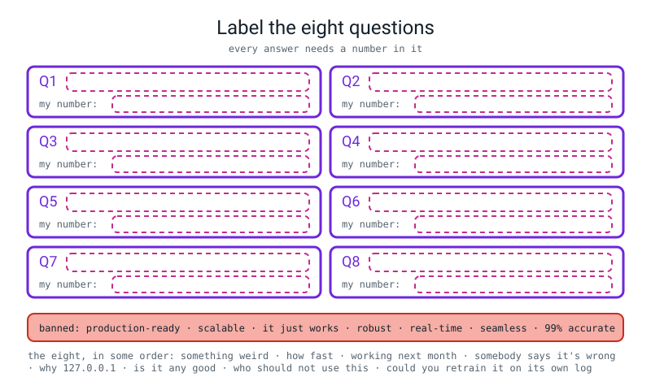
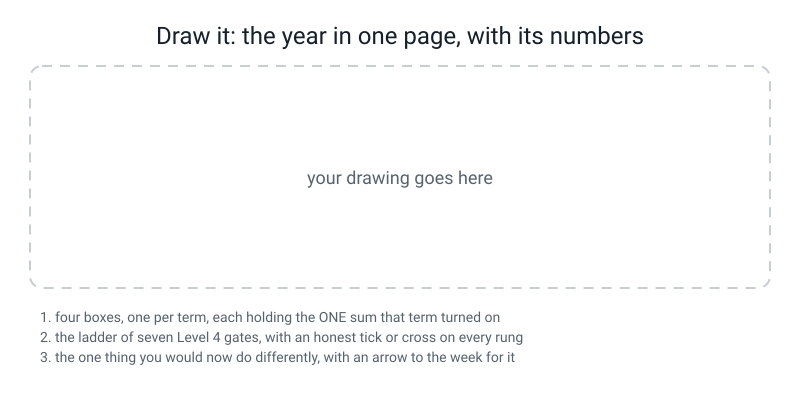

# Workbook — Week 36: Showcase Day and the Final Paper

**Name:** ________________________________  **Date:** ______________

[⬅ Week 35](week-35.md) · [📖 Read the chapter first](../student-guide/week-36.md) · [Course Home](../README.md) · [Glossary](../../glossary.md)

> **Your teacher's mark scheme calls these pages 36.1 to 36.7.** **36.1** and **36.2** are the first two steps of 🛠️ **Build It**, and **36.6** and **36.7** are the last two. **Pages 36.3, 36.4 and 36.5 are the written paper itself** — your teacher hands those out on the day, and they are deliberately not in this book. **Everything here is the rehearsal.**

> **⚠️ Watch out:** nothing in this week is new. That is what makes it hard. **Every question below is something you have already done at least once**, which means the only way to get it wrong is to have half-learned it. Work through it with a pen and no notes, and treat every blank you cannot fill as a gift: it is a thing you found out about yourself the day *before* it mattered.

---

## ✅ Warm-Up (5 min)

Five quick questions about **last week**.

**W1.** Your service was sent **115** requests and the log has **111** lines. **Why, in one sentence?**

________________________________________________________________

**W2.** `logging.basicConfig(filename=p, format="%(message)s")` and then `logging.info(...)`. **How many lines land in the file, and which single word fixes it?**

______  ______________________

**W3.** The p95 was `0.27 ms` and the max was `3.27 ms`. **Why did the p95 not catch the max?**

________________________________________________________________

**W4.** Write the four checks, in order, in four words each.

1 ____________________ 2 ____________________ 3 ____________________ 4 ____________________

**W5.** `0.800` on 15 rows and `0.462` on 13 rows. **What single number was hiding both, and what is the one thing every row of a subgroup table must carry?**

________  ______________

---

## 🔢 Do the Maths by Hand

**There is no new maths this week**, so this page is **the four pieces of arithmetic the paper will ask you for** — the p95 from last week, and three from earlier in the year. **Calculator only. No code on this page.** If you can do these four cold, Part A of the paper cannot hurt you.

---

**M1 — the p95 (Week 35).** Six latencies from a log, unsorted:

```text
0.24    2.10    0.28    0.22    0.31    0.26
```

```text
sorted:      ______  ______  ______  ______  ______  ______
positions:     0       1       2       3       4       5

p95 position  =  0.95 × ( ______ − 1 )  =  ________      between positions ______ and ______

gap  =  ______ − ______  =  ______       p95  =  ______ + ______ × ______  =  ________

p50 position  =  0.50 × ______ = ______   so p50 = ( ______ + ______ ) ÷ 2 = ________

mean = ______ ÷ 6 = ________     max = ________
```

**Which of those four numbers would you put on a slide, and which one goes beside it?** ______ and ______

---

**M2 — four cells, five metrics (Weeks 8, 9, 10).** A fraud model on 6,000 held-out rows:

```text
TN = 5941      FP = 2      FN = 53      TP = 4
```

```text
(a) how many rows?        ______ + ______ + ______ + ______ = ________
(b) how many are fraud?   ______ + ______ = ______        the positive rate = ______ ÷ ______ = ________
(c) accuracy   = ( ______ + ______ ) ÷ ______ = ________
(d) precision  = ______ ÷ ( ______ + ______ ) = ______ ÷ ______ = ________
(e) recall     = ______ ÷ ( ______ + ______ ) = ______ ÷ ______ = ________
(f) F1         = 2 × ______ × ______ ÷ ( ______ + ______ ) = ________ ÷ ________ = ________
(g) the plain average of precision and recall, for comparison = ( ______ + ______ ) ÷ 2 = ________
```

**(h) F1 is much closer to which of the two, and what is the name of the kind of average that does that?** ______  ______________

**(i) A miss costs 500 and a false alarm costs 10. Write the cost of this confusion matrix as a sum:**

______ × ______ + ______ × ______ = ________ + ________ = ________

---

**M3 — shapes and how many numbers (Weeks 17, 25, 26).**

**(a)** A batch of `(4, 2)` goes into a layer whose weight grid is `(2, 3)`. Output shape: ____________  **and the rule, said out loud:** `( ____ , ____ ) @ ( ____ , ____ ) → ( ____ , ____ )`

**(b)** An `8 × 8` image into `nn.Conv2d(1, 16, kernel_size=3, stride=2, padding=1)`:

```text
( ______ + 2 × ______ − ______ ) ÷ ______ + 1  =  ______ ÷ ______ + 1  =  ______ + 1  =  ________
```

**(c)** Price the Week 26 digit network, one layer at a time:

```text
Conv2d(1, 8, 3)    :  ____ × ____ × ____ × ____  +  ____  =  ______ + ____ =  ______
Conv2d(8, 16, 3)   :  ____ × ____ × ____ × ____  +  ____  =  ______ + ____ =  ______
Linear(64, 10)     :          ____ × ____  +  ____                          =  ______
                                                                    total  =  ______
```

**(d) Where did the `64` in `Linear(64, 10)` come from?** ______ × ______ × ______ = ______

**(e)** Now change the second convolution to 32 filters. **Two things change, not one.** The conv becomes `8 × 3 × 3 × 32 + 32 =` ________ and the `Linear` becomes `Linear(` ______ `, 10)` = ________. **New total:** ________

---

**M4 — slopes, one step, and the 42 (Weeks 12, 15, 18).**

**(a)** For `f(w) = (w − 3)² + 1`, measure the slope at `w = 5` with `h = 0.001`:

```text
f(5.001) = ( ______ )² + 1 = ________          f(4.999) = ( ______ )² + 1 = ________

slope = ( ________ − ________ ) ÷ ( 2 × 0.001 ) = ________ ÷ ________ = ________
```

**(b)** And the rule says the slope is `2(w − 3)`. At `w = 5` that is ______. **Do they agree?** ______

**(c)** One descent step from `w = 5` with a learning rate of `0.1`:

```text
w  ←  ______ − ______ × ______  =  ______ − ______  =  ________
```

**(d) Did `w` move towards 3 or away from it?** ______________  **And what would `w += lr × slope` have given?** ________

**(e)** Nudging `w` moves `z` **3** times as much. Nudging `z` moves the loss **14** times as much. **So nudging `w` moves the loss** ______ × ______ = ______ **times as much.**

**(f) In one sentence, why is that number convincing rather than just a rule you were told?**

________________________________________________________________

---

## 🔎 Predict the Output

**In pen, before you run anything.** Four programs, one from each term.

### P1 — a slope, and a step

Read this program, then fill in the table below it.

```python
def f(w):
    return (w - 3) ** 2 + 1

h = 0.001
for w in [0.0, 1.0, 3.0, 5.0]:
    slope = (f(w + h) - f(w - h)) / (2 * h)
    print("w=%.1f  f(w)=%6.3f  numeric slope=%9.6f   2(w-3)=%5.1f   w - 0.1 x slope = %7.4f"
          % (w, f(w), slope, 2 * (w - 3), w - 0.1 * slope))
```

| w | f(w) | numeric slope | 2(w−3) | w after one step |
|---:|---:|---:|---:|---:|
| 0.0 | ______ | ____________ | ______ | ____________ |
| 1.0 | ______ | ____________ | ______ | ____________ |
| 3.0 | ______ | ____________ | ______ | ____________ |
| 5.0 | ______ | ____________ | ______ | ____________ |

**Two predictions that are really about understanding, not arithmetic:**

**(a)** At `w = 3.0`, what happens to `w` after the step, and why? ______________________

**(b)** The numeric slopes come out as `-6.000000` and not `-5.999999`. **Does `h = 0.001` give the exact answer, or does something about this particular `f` make it come out exact?**

________________________________________________________________

---

### P2 — two grids, and one that refuses

Read this program, then write down what each line prints.

```python
import numpy as np
A = np.array([[1, 2], [3, 4], [5, 6]])
B = np.array([[10, 20, 30, 40], [50, 60, 70, 80]])
print("A", A.shape, " B", B.shape)
C = A @ B
print("C", C.shape)
print("C[0,0] = 1x10 + 2x50 =", C[0, 0])
print(C)
try:
    B @ A
except ValueError as e:
    print("B @ A ->", e)
print("(B.T @ A.T).shape =", (B.T @ A.T).shape)
print("allclose to C.T? ", np.allclose(B.T @ A.T, C.T))
```

`A` ____________  `B` ____________  `C` ____________  `C[0,0]` ______

**All twelve numbers of `C`, in pen:**

```text
______  ______  ______  ______
______  ______  ______  ______
______  ______  ______  ______
```

`B @ A` raises: ________________________________________  `(B.T @ A.T).shape` = ____________  `allclose` = ______

---

### P3 — shapes through the digit network

Read this program, using the layer definitions beneath it, and fill in each shape.

```python
x = torch.zeros(32, 1, 8, 8)
print("in           ", tuple(x.shape))
a = pool(torch.relu(conv1(x)))
print("after conv1+pool", tuple(a.shape))
b = pool(torch.relu(conv2(a)))
print("after conv2+pool", tuple(b.shape))
flat = b.view(b.size(0), -1)
print("after view   ", tuple(flat.shape))
print("logits       ", tuple(fc(flat).shape))
print("argmax(dim=1)", tuple(fc(flat).argmax(dim=1).shape))
print("16 x 2 x 2 =", 16 * 2 * 2)
```

`conv1 = nn.Conv2d(1, 8, 3, padding=1)` · `conv2 = nn.Conv2d(8, 16, 3, padding=1)` · `pool = nn.MaxPool2d(2)` · `fc = nn.Linear(64, 10)`

in ____________________  after conv1+pool ____________________  after conv2+pool ____________________

after view ____________________  logits ____________________  argmax ____________________

**Two questions:**

**(a) Which of those six shapes would change if the batch were 64 instead of 32, and which would not?** ______________________

**(b) Where does the `-1` in `b.view(b.size(0), -1)` get its value from, and what number does it become here?** ______________________

---

### P4 — one shape, fifteen times the loss

Read this program, then fill in the shapes and both losses.

```python
import torch
import torch.nn as nn

pred = torch.tensor([[0.9], [0.1], [0.8], [0.2]])
y = torch.tensor([1.0, 0.0, 1.0, 0.0])
print("pred", tuple(pred.shape), " y", tuple(y.shape))
print("(pred - y).shape =", tuple((pred - y).shape))
print(pred - y)
wrong = nn.MSELoss()(pred, y)
right = nn.MSELoss()(pred, y.unsqueeze(1))
print("loss with y as (4,)  : %.6f" % wrong.item())
print("loss with y as (4,1) : %.6f" % right.item())
```

`pred` ____________  `y` ____________  `(pred - y).shape` = ____________

**loss with `y` as `(4,)`:** ____________  **loss with `y` as `(4,1)`:** ____________

**(a) How many numbers did the first loss average over, and how many did the second?** ______ and ______

**(b) PyTorch prints something before either loss appears. What kind of message is it, and why is a message rather than an error exactly the wrong way round for a beginner?**

________________________________________________________________

**(c) Which of the two numbers would a training loop happily minimise for two hundred epochs?** ____________

---

## ✍️ Practice Set A — Read It

This set is for reading code and output closely. Nothing here asks you to run anything.

**A1. The year in fifteen words.** Match each to its one-line meaning.

| Word | | Meaning |
|---|---|---|
| **baseline** | ______ | (i) The grid of numbers a layer multiplies by; its shape decides the output width |
| **target leakage** | ______ | (ii) How much the loss moves when I nudge one knob |
| **recall** | ______ | (iii) One number per row saying how surprised the model was |
| **threshold** | ______ | (iv) A column only filled in *because* the outcome already happened |
| **gradient** | ______ | (v) What a model with no features at all would score |
| **weights** | ______ | (vi) Of the things that really were positive, the share I found |
| **log loss** | ______ | (vii) The dial that turns a probability into a label |
| **inertia** | ______ | (viii) Total squared distance from each point to its own cluster centre |
| **explained variance ratio** | ______ | (ix) How much of the total spread one new axis carries |
| **idf** | ______ | (x) Turn the volume down on a word that is in nearly every document |

**A2. Read the output and answer the three questions.**

```text
$ python3 three_questions.py
question 2 - class balance : 28 of 1800 positive = 0.0156
question 1 - the baseline  : accuracy 0.9844
             and its recall: 0.0000  <- it caught 0 of the 28 frauds
             and its AUC   : 0.5000  <- a coin flip is 0.5000
```

**(a)** There is no trained model anywhere in that program. **What produced the `0.9844`?** ______________________

**(b)** `0.9844 × 1800 = ______` rows right, and `1800 − 28 = ______`. **Do those agree?** ______

**(c)** Somebody shows you a real model that scores `0.9844` on this test set. **Write the two sentences you say next**, and each must contain a number.

________________________________________________________________

________________________________________________________________

**(d)** The AUC is exactly `0.5000`, not `0.4987` or `0.5013`. **Why exactly?** ______________________

**A3. Spot the bug in each. None of these five raises anything at all.**

Read each snippet below, then write its bug on the matching line.

```python
(1)  model = nn.Sequential(nn.Linear(2, 16), nn.Linear(16, 1))

(2)  model = nn.Sequential(nn.Linear(64, 32), nn.ReLU(), nn.Linear(32, 10), nn.Softmax(dim=1))
     loss_fn = nn.CrossEntropyLoss()

(3)  for epoch in range(200):
         logits = model(X)
         loss = loss_fn(logits, y)
         loss.backward()
         opt.step()

(4)  X = StandardScaler().fit_transform(X)
     X_tr, X_te, y_tr, y_te = train_test_split(X, y, random_state=0)

(5)  km = KMeans(n_clusters=k, n_init=10, random_state=0).fit(X)
     best_k = the k with the smallest km.inertia_
```

(1) ________________________________________________________________

(2) ________________________________________________________________

(3) ________________________________________________________________

(4) ________________________________________________________________

(5) ________________________________________________________________

**Which one of the five would you find first, and what number would give it away?** ______________________

**A4. Read the sweep and answer the question nobody expects.**

A logistic regression on a table that is **1.1% positive**, on 1,000 held-out rows:

```text
highest probability the model ever gave: 0.0907
t=0.50  TN= 989 FP=  0 FN=11 TP= 0  precision=0.0000 recall=0.0000
t=0.20  TN= 989 FP=  0 FN=11 TP= 0  precision=0.0000 recall=0.0000
t=0.10  TN= 989 FP=  0 FN=11 TP= 0  precision=0.0000 recall=0.0000
t=0.05  TN= 979 FP= 10 FN= 8 TP= 3  precision=0.2308 recall=0.2727
t=0.02  TN= 858 FP=131 FN= 5 TP= 6  precision=0.0438 recall=0.5455
```

Its **accuracy** is `0.9890` and its **ROC-AUC** is `0.6485`. Its **average precision** is `0.2125`.

**(a)** At `t = 0.50` it catches nothing at all. **What single fact in the output above explains why, in five words?**

________________________________________________________________

**(b)** Its accuracy is `0.9890` — **exactly** what a `DummyClassifier` scores here. **So is the model worthless?** ______  **and the number that proves your answer:** ______________

**(c)** The AP baseline on this table is ________ (write where that number comes from), so an AP of `0.2125` is about ______ **times baseline.**

**(d)** So the model is not worthless, but it is unusable **as shipped**. **Name the one thing you would change, and say which pile you would choose it on.**

________________________________________________________________

**(e)** Going from `t = 0.05` to `t = 0.02`, recall goes `0.2727 → 0.5455` and precision goes `0.2308 → 0.0438`. **Say what that trade is in the language of somebody being phoned about their bank card.**

________________________________________________________________

**A5. Trace a shape through a whole network, and find where it dies.**

This network is fed a batch of images. Fill in the shape after each lettered layer.

```python
model = nn.Sequential(
    nn.Conv2d(1, 8, 3, padding=1),   # a
    nn.ReLU(),                       # b
    nn.MaxPool2d(2),                 # c
    nn.Conv2d(8, 16, 3, padding=1),  # d
    nn.ReLU(),                       # e
    nn.MaxPool2d(2),                 # f
    nn.Flatten(),                    # g
    nn.Linear(32, 10),               # h   <-- note the 32
)
out = model(torch.zeros(16, 1, 8, 8))
```

| after | shape |
|---|---|
| in | ____________________ |
| a | ____________________ |
| c | ____________________ |
| d | ____________________ |
| f | ____________________ |
| g | ____________________ |
| h | ____________________ |

**It raises. Write the error's last line as exactly as you can**, including both shapes:

________________________________________________________________

**And the one-character-ish fix:** `nn.Linear(` ______ `, 10)`

**A6. Label the diagram.**


*Figure W36.1 — Label the eight questions. The eight are listed underneath, out of order.*

Write each question in its box and **your own number** underneath it. Then:

**(a) Which question has no number available in any of your files?** ______  **(b) Which is answered worst, every year?** ______  **(c) Why?** ______________________

---

## ✍️ Practice Set B — Write It

This set is for writing short programs of your own. Each task ends with a **Done looks like** line you can check.

### B1 — one line

Print the p95 latency and the max latency of your own prediction log, in one line, to four decimal places, **with the request count in the same string.**

**Expected output:** one line with three numbers in it.
**Done looks like:** `p95 1.6970 ms, max 3.2700 ms over 12 requests` — and the p95 sits between your p50 and your max.

### B2 — gate 3: the five-line loop, from a blank file, timed

**Close every file. Start a stopwatch. Blank file, no notes, under three minutes.** Write a program that makes 200 random two-feature points, labels them by whether `x0 + x1 > 0`, trains `Linear(2,8) → ReLU → Linear(8,1)` with `BCEWithLogitsLoss` and `SGD(lr=0.1)` for 200 epochs, prints the loss every 50, then prints the final accuracy **inside `torch.no_grad()`**.

**Expected output:** five lines, a falling loss and an accuracy above 0.95.
**Done looks like:** it ran first time, it took under three minutes to type, and **you did not look anything up.** Write your time here: ______ **and whether you looked anything up:** ______

> **⚠️ Watch out:** the five lines of the inner loop go in one order and one order only, and the first of them is the one everybody forgets. If your accuracy comes out near 0.5, check for it before you check anything else.

### B3 — the three-questions drill on a table you have never seen

Make a 4,000-row table with `make_classification(n_samples=4000, n_features=6, weights=[0.995, 0.005], random_state=0)`, split it `test_size=0.25, stratify=y, random_state=0`, and print, for a `DummyClassifier` **and** a `LogisticRegression`: accuracy, recall, ROC-AUC and average precision.

**Done looks like:** the two models have the **same accuracy and the same recall**, and two of the four numbers tell them apart. **Write which two, and by how much.**

### B4 — `answers8.py`, about 25 lines

Extend the chapter's `answers.py` so it prints **all eight** answers, not four. Four come out of your files. The other four are sentences you type — **and each one must still contain a number.**

**Done looks like:** eight numbered lines, every one with a digit in it, printed by a program you can run from a cold terminal in front of the room.

### B5 — `gatecheck.py`, about 25 lines

Write a program that checks the Level 4 gates **a program can check** and prints PASS or `not yet` for each, with the evidence beside it. Five of them:

1. there is a `LATEST` file and it names a versioned artifact,
2. there is a metadata file and it has a `threshold` in it,
3. the log has 100 or more lines,
4. the first log line carries all six required fields,
5. `grep` finds no training code in `serve/`.

Finish with a count and `sys.exit(1 if failed else 0)`.

**Done looks like:** five rows with evidence, a tally, and a last line that says out loud that **the other four gates are you, not a program.**

---

## 🐞 Fix the Broken Program

This section is for finding bugs by reading a program and its three runs.

**Three bugs. One kills your demo in front of the room, one only appears when somebody passes a flag, and one prints a number you would have said out loud with pride.**

```python
"""broken36.py - print the demo answers from your own files. THREE BUGS."""
import argparse
import json
from pathlib import Path

import numpy as np

ART = Path("model/artifacts")
LOG = Path("logs/demo.jsonl")

ap = argparse.ArgumentParser(description="Print the demo answers.")
ap.add_argument("--threshold", default=None)
args = ap.parse_args()

version = (ART / "LATEST").read_text().strip()
with open(ART / (version + ".metadata.json")) as f:
    meta = json.load(f)
threshold = args.threshold if args.threshold is not None else meta["threshold"]

rows = []
for line in LOG.read_text().splitlines():
    if line.strip() != "":
        rows.append(json.loads(line))
lat = np.array([r["latency_ms"] for r in rows])
prob = np.array([r["probability"] for r in rows])

print("model            : %s   (threshold %s)" % (version, threshold))
print("Q6 any good      : %.3f on %d held-out rows, baseline %.3f"
      % (meta["test_accuracy"], meta["n_test"], 0.500))
print("Q2 how fast      : %.2f ms" % (meta["load_ms"] + lat.mean()))
print("Q4 got it wrong  : %d log lines, each with input, probability, threshold, version"
      % len(rows))
near = (prob >= threshold - 0.10) & (prob <= threshold + 0.10)
print("Q3 still working : %d of %d within 0.10 of the threshold" % (near.sum(), len(rows)))
```

**Run A — from the project folder, which is how you tested it:**

```text
model            : tiny_v1   (threshold 0.55)
Q6 any good      : 1.000 on 10 held-out rows, baseline 0.500
Q2 how fast      : 659.14 ms
Q4 got it wrong  : 12 log lines, each with input, probability, threshold, version
Q3 still working : 4 of 12 within 0.10 of the threshold
```

**Run B — from a fresh terminal, which is how the demo starts:**

```text
$ cd /
$ python3 /tmp/wb36/demo/broken36.py
Traceback (most recent call last):
  File "/tmp/wb36/demo/broken36.py", line 15, in <module>
    version = (ART / "LATEST").read_text().strip()
FileNotFoundError: [Errno 2] No such file or directory: 'model/artifacts/LATEST'
```

**Bug 1.** **It worked for weeks. Why does it break here, and what is the one line that fixes both paths?**

________________________________________________________________

`ROOT = ` ________________________________________

**Run C — somebody in the audience asks "what if the threshold were 0.6?":**

```text
$ python3 broken36.py --threshold 0.6
model            : tiny_v1   (threshold 0.6)
Q6 any good      : 1.000 on 10 held-out rows, baseline 0.500
Q2 how fast      : 659.14 ms
Q4 got it wrong  : 12 log lines, each with input, probability, threshold, version
Traceback (most recent call last):
  File "/private/tmp/wb36/demo/broken36.py", line 33, in <module>
    near = (prob >= threshold - 0.10) & (prob <= threshold + 0.10)
TypeError: unsupported operand type(s) for -: 'str' and 'float'
```

**Bug 2.** **Which two types are fighting?** ______ and ______  **Where did the string come from?** ______________________

**The fix, and it is one keyword:** ______________________

**And the tell that was printed four lines earlier, if anybody had looked:** ______________________

**Bug 3 — it is in all three runs, it never raises, and it is the answer to question 2.**

**(a) Quote the line:** ________________________________________

**(b) What two quantities has it added together, and what is wrong with adding them?**

________________________________________________________________

**(c) `659.14` is a number you would have said with a straight face. Say what it actually claims, and why nobody in the room would notice:**

________________________________________________________________

**(d) Write the replacement line, and say how many numbers it must print:**

________________________________________________________________

---

## 🧩 Puzzle of the Week

This puzzle is for checking a claim with arithmetic before you believe it.

### Seven Claims. Five of Them Are Impossible.

Each of these is one sentence from somebody's demo. **Five are impossible — not unlikely, but arithmetically impossible. Two are true and only sound wrong.** Find the five, prove each with a line of arithmetic, and say why the other two are fine.

```text
1.  "Accuracy 0.90 on my 16 held-out rows."

2.  "Latency: p50 0.31 ms, p95 0.22 ms, max 3.27 ms."

3.  "Precision 0.70, recall 0.50, F1 0.62."

4.  "My service took 115 requests and my log has 118 lines in it,
     and the log only records predictions."

5.  "My model scores 0.9844 accuracy and 0.0000 recall on the same test set."

6.  "I changed the second convolution from 16 filters to 32, so my network
     went from 1,898 learnable numbers to 1,914."

7.  "My average precision is 0.19 on a table that is 0.95% positive,
     and that is roughly twenty times baseline."
```

| # | impossible? | the arithmetic that settles it |
|---:|---|---|
| 1 | ______ | ________________________________________ |
| 2 | ______ | ________________________________________ |
| 3 | ______ | ________________________________________ |
| 4 | ______ | ________________________________________ |
| 5 | ______ | ________________________________________ |
| 6 | ______ | ________________________________________ |
| 7 | ______ | ________________________________________ |

**And the bonus, which is the real skill:** for each of the **two true** claims, write the **one question** you would ask next.

claim ______ → ________________________________________________

claim ______ → ________________________________________________

---

## 🤔 Think Deeper

These two questions ask for written paragraphs, in your own words, from what you remember of the year.

**T1.** Your demo has ten minutes and stop 6 is *"here is where it breaks"* — you predict a failure out loud and then run it.

**Write a paragraph defending that choice to somebody who says you are sabotaging your own presentation.** Then answer the harder half: **what exactly does a predicted failure prove that a working demo cannot?** Your answer must name something about *you*, not about the model.

________________________________________________________________

________________________________________________________________

________________________________________________________________

________________________________________________________________

**T2.** Look back at Week 1. The whole year started with one line of code that hid five decisions.

**Name the five decisions that line hid** — as best you can from memory — and then answer this: **which of the five would you now say is the one most likely to be hiding in somebody else's code, and how would you check it in under a minute?**

1 ____________________ 2 ____________________ 3 ____________________

4 ____________________ 5 ____________________

________________________________________________________________

________________________________________________________________

________________________________________________________________

---

## 🛠️ Build It — the demo, the eight answers, the gate and the letter

### Step checklist

- [ ] **36.1** — the run sheet, filled in **in pen, the day before**, with my own number at every stop
- [ ] every number on the run sheet is one I can point at in a file
- [ ] I have rehearsed the cold start in a terminal I opened thirty seconds earlier
- [ ] **36.2** — all eight answers written out, **each containing a number**
- [ ] I have said all eight out loud once, with the banned-words list in front of me
- [ ] my stop-6 failure is chosen, predicted in advance, and reproducible
- [ ] **36.6** — the Level 4 gate self-check, with at least one honest blank
- [ ] **36.7** — the letter to myself

---

### 36.1 — The demo run sheet

| at | for | stop | the number I must say | mine |
|---:|---:|---|---|---|
| 0:00 | 1 min | **The contract** — what one prediction is about, and what the two mistakes cost | the threshold, and that it is not 0.5 | ____________ |
| 1:00 | 1 min | **The cold start** — brand-new terminal, one command, one answer, then the Rule 1 `grep` | the whole command's wall clock · the grep prints ____ lines | ____________ |
| 2:00 | 2 min | **The service** — start it, `GET /health`, one good prediction | **two** numbers: loaded once, and per request | ______ / ______ |
| 4:00 | 2 min | **Break it, live** — four malformed requests, then `/health` again | four ______s, then a ______. **Zero crashes.** | ____________ |
| 6:00 | 1.5 min | **The log** — `wc -l`, then the reader | lines · p50 · p95 · max — **and which request the max was** | ____________ |
| 7:30 | 1.5 min | **Where it breaks** — the subgroup table, then one failure live | the two accuracies and the recall as `___ of ___` | ____________ |
| 9:00 | 1 min | **The monitoring number** | its value now, its alarm level, and *computable with no labels* | ____________ |

**The three ways a demo dies, and what I have done about each:**

| the death | my defence |
|---|---|
| the warm terminal | ________________________________________ |
| the wrong folder | ________________________________________ |
| the six-minute apology | ________________________________________ |

**My first seven words, written down so I cannot start with "so, um":**

________________________________________________________________

**My stop-6 failure, predicted in advance:** input ____________________________ → I say it will come back ____________ at about `p =` ________ **because** ______________________

---

### 36.2 — The eight questions, with my number

| # | the question | my answer — **must contain a number** |
|---:|---|---|
| 1 | "What if I send it something weird?" | ____________________________________________ |
| 2 | "How fast is it?" | ____________________________________________ |
| 3 | "How do you know it still works next month?" | ____________________________________________ |
| 4 | "Somebody says it got their comment wrong. What do you do?" | ____________________________________________ |
| 5 | "Why `127.0.0.1` and not `0.0.0.0`?" | ____________________________________________ |
| 6 | "Is it any good?" | ____________________________________________ |
| 7 | "Who should not use this?" | ____________________________________________ |
| 8 | "Could you just retrain it on what it has seen?" | ____________________________________________ |

**Tick every answer that contains a digit:** ______ of 8. **If it is not 8, go back.**

**The seven banned words, written out so I can hear myself saying one:**

________________  ________________  ________________  ________________

________________  ________________  ________________

**For each of three of them, what I say instead:**

| instead of | I say |
|---|---|
| "robust" | ________________________________________ |
| "real-time" | ________________________________________ |
| "99% accurate" | ________________________________________ |

---

### 36.6 — The Level 4 gate self-check

**"I could do it with the notes open" is not a tick.** An honest blank is worth more than a hopeful tick, because a blank comes with a fortnight that fixes it.

| # | gate | the honest standard | me |
|---:|---|---|---|
| 1 | **The paper** | 49+ of 70, no single term holding 4+ wrong, **13+ of 26 on Part C** | ______ |
| 2 | **The capstone, finished** | artifact loads in a fresh process · `predict.py` · a running service · a log with latencies · a card with a subgroup table · a monitoring plan | ______ |
| 3 | **The five-line loop** | from a **blank file**, from memory, **under three minutes**, and it runs | ______ |
| 4 | **Backprop** | a 2-layer network on paper, no notes, what each of the five lines does — and **the 42** | ______ |
| 5 | **The three questions** | shown any score, the first three things out of my mouth | ______ |
| 6 | **Shapes** | `(n, d) @ (d, h) → (n, h)` out loud, and any layer's output shape **before** running it | ______ |
| 7 | **Embeddings** | what one is, and why **cosine similarity** is the usual way to compare two | ______ |

**My score:** ______ of 7.  **Is at least one of them an honest blank?** ______

**The two I would most want to revisit, and the evidence that made me pick them:**

1. gate ______ because ________________________________________________

2. gate ______ because ________________________________________________

**And for each, the specific fortnight that would fix it:**

1. ________________________________________________________________

2. ________________________________________________________________

> **💡 Try this:** five of seven is not a fail — **it is a map.** Gate 3 is a typing-fluency problem and ten days of a five-minute drill fixes it. Gate 2 has no shortcut, because Level 4's evaluation work is built directly on the capstone. *"Not yet, and here is the fortnight that fixes it"* is a far better outcome than being waved through.

---

### 36.7 — The letter to yourself

**One side. Three things, and the third one is the whole point.**

**(a) What I want to build next, specifically** — not "AI stuff":

________________________________________________________________

________________________________________________________________

**(b) One thing from this year I would now do differently, and why.** The best answers are **structural** — about the order you did things in, not about working harder:

________________________________________________________________

________________________________________________________________

________________________________________________________________

**(c) One number I am proud of, with its arithmetic beside it:**

________________ **because** ________ ______ ________ = ________

**And one line to the person who opens this in a year:**

________________________________________________________________

---

## 🎨 Draw It


*Figure W36.2 — The year in one page, with its numbers.*

**What a good answer looks like:** **four boxes, one per term, and inside each box the ONE sum that term turned on** — written out in full, not named. Term 1: `4 ÷ 57 = 0.070`, with `accuracy 0.9908` written beside it and a line through the accuracy. Term 2: `3.0 ÷ 0.5 = 6` and `3 × 14 = 42`. Term 3: `1 × 10 + 2 × 50 = 110` and `80 + 1168 + 650 = 1898`. Term 4: `ln(5 ÷ 2) + 1 = 1.916` and your own `0.8125 on 16 rows`.

Down the right-hand side, **the ladder of seven gates with an honest tick or cross on every rung** — and a drawing with seven ticks is a drawing nobody will believe.

**And the thing that makes it yours:** somewhere on the page, **the one thing you would now do differently, with an arrow pointing back to the week you would move it to.** The strongest version of that arrow anybody draws is usually *"write the contract in Week 33, not Week 34"* — because you built the model before you knew what one prediction was about.

**My four sums, one per term:**

T1 ________________________  T2 ________________________

T3 ________________________  T4 ________________________

**My gate ladder:** ______ ticks and ______ crosses out of 7.

**My arrow points from week** ______ **back to week** ______ **and it says:** ______________________

---

## 📊 Self-Check

| I can... | 😀 | 🙂 | 😕 |
|---|---|---|---|
| start a demo from a terminal I opened thirty seconds ago | | | |
| say the seven stops of the route in order without the sheet | | | |
| give two timing numbers for question 2 and never add them | | | |
| send four malformed requests live without being nervous | | | |
| walk to my log when somebody says it got theirs wrong | | | |
| say why `127.0.0.1`, with the reason and not the string | | | |
| quote my headline number with its `n` and its baseline | | | |
| say what one row of my test set is worth, as a percentage | | | |
| predict a failure out loud and then reproduce it | | | |
| name a monitoring number I can compute with no labels | | | |
| answer all eight questions with a number in every answer | | | |
| get through ten minutes without one banned word | | | |
| say "I don't know, and here is how I would find out" | | | |
| work out a p95 by hand | | | |
| work out precision, recall and F1 from four cells | | | |
| predict a layer's output shape before running it | | | |
| measure a slope numerically and check it against the rule | | | |
| write the five-line loop from a blank file in under three minutes | | | |
| explain backprop with the 42 in it | | | |
| spot a bug that prints a number instead of crashing | | | |
| be handed an unfamiliar model and a confident number, and say whether to believe it | | | |

**The two things I would most want to revisit before Level 4:**

1. ________________________________________________________________

2. ________________________________________________________________

---

## ✅ Answers

<details>
<summary>Check your answers</summary>

### Warm-Up

**W1.** The four malformed requests never produced a prediction, so there was nothing to log. **The log counts predictions, not requests** — and `115` would be a lie.

**W2.** **Zero lines**, and no error. The word is `level=logging.INFO`: Python's default level is `WARNING`, and `INFO` is below it.

**W3.** Because one request in 111 sits up above the 99th percentile, and **a p95 cannot see above itself.** So you print the max as well, and say why.

**W4.** 1 *is there a body* · 2 *is it JSON* · 3 *has it the field* · 4 *is the field a non-empty string*.

**W5.** The `0.643` overall (`18 ÷ 28`) — or the `0.8125` on the card, depending which one they quoted. Every row of a subgroup table must carry its **`n`**.

---

### Do the Maths by Hand

**M1.**

```text
sorted:      0.22   0.24   0.26   0.28   0.31   2.10
positions:     0      1      2      3      4      5

p95 position = 0.95 × (6 − 1) = 0.95 × 5 = 4.75      between positions 4 and 5

gap = 2.10 − 0.31 = 1.79     p95 = 0.31 + 0.75 × 1.79 = 0.31 + 1.3425 = 1.6525

p50 position = 0.50 × 5 = 2.5   so p50 = (0.26 + 0.28) ÷ 2 = 0.27

mean = 3.41 ÷ 6 = 0.5683        max = 2.10
```

**On a slide: the p95, with the max beside it.** With six requests the p95 is dragged three quarters of the way up to a single outlier, so **you also say "six requests" out loud**, because that is the fact that makes the number meaningful or meaningless.

**M2.**

```text
(a) 5941 + 2 + 53 + 4 = 6000
(b) 53 + 4 = 57 fraud rows       positive rate = 57 ÷ 6000 = 0.0095
(c) accuracy  = (5941 + 4) ÷ 6000 = 5945 ÷ 6000 = 0.9908
(d) precision = 4 ÷ (4 + 2) = 4 ÷ 6 = 0.6667
(e) recall    = 4 ÷ (4 + 53) = 4 ÷ 57 = 0.0702
(f) F1        = 2 × 0.6667 × 0.0702 ÷ (0.6667 + 0.0702)
              = 0.09360 ÷ 0.7369 = 0.1270
(g) plain average = (0.6667 + 0.0702) ÷ 2 = 0.3685
```

**(h)** F1 is far closer to the **recall**, `0.0702`. `0.127` against a plain average of `0.3685`. The kind of average that does that is the **harmonic mean**, and it drags a lopsided pair down towards the smaller number — which is exactly what you want from a summary of a model that found 4 frauds out of 57.

**(i)** `500 × 53 + 10 × 2 = 26,500 + 20 = 26,520`.

**And the sentence to remember:** accuracy here is `0.9908` and it is hiding a catastrophe. **Four of fifty-seven.**

**M3.**

**(a)** `(4, 3)`. The rule: `(n, d) @ (d, h) → (n, h)` — **the inner numbers must match, and then they vanish.**

**(b)** `(8 + 2 × 1 − 3) ÷ 2 + 1 = 7 ÷ 2 + 1 = 3 + 1 = 4`, so `4 × 4`, **rounding down.**

**(c)**

```text
Conv2d(1, 8, 3)    :  1 × 3 × 3 × 8  +  8   =    72 +  8  =    80
Conv2d(8, 16, 3)   :  8 × 3 × 3 × 16 + 16   =  1152 + 16  =  1168
Linear(64, 10)     :          64 × 10 + 10              =    650
                                                  total  =  1898
```

**(d)** `16 × 2 × 2 = 64` — sixteen feature maps, each `2 × 2` after the second pool.

**(e)** The conv becomes `8 × 3 × 3 × 32 + 32 = 2304 + 32 = 2336`. And **the `Linear` changes too**, because the flatten length changes: `32 × 2 × 2 = 128`, so `Linear(128, 10) = 128 × 10 + 10 = 1290`. **New total `80 + 2336 + 1290 = 3706`** — checked in PyTorch, `sum(p.numel() ...)` gives exactly `3706`.

**This is the part people get wrong:** changing a convolution changes **two** layers' worth of numbers, because the layer after the flatten has the picture size welded into it.

**M4.**

**(a)**

```text
f(5.001) = (2.001)² + 1 = 4.004001 + 1 = 5.004001
f(4.999) = (1.999)² + 1 = 3.996001 + 1 = 4.996001

slope = (5.004001 − 4.996001) ÷ 0.002 = 0.008 ÷ 0.002 = 4
```

**(b)** `2(5 − 3) = 2 × 2 = 4`. **They agree exactly.**

**(c)** `w ← 5 − 0.1 × 4 = 5 − 0.4 = 4.6`

**(d)** **Towards 3** — the bottom of the bowl. `w += lr × slope` would give `5 + 0.4 = 5.4`, **away** from the bottom: that is the sign error, and its symptom is a loss that rises even at a tiny learning rate. **The gradient points uphill; you subtract it to go down.**

**(e)** `3 × 14 = 42`.

**(f)** Because it was measured **both ways** — stage by stage (nudge `w`, watch `z`; nudge `z`, watch the loss) and then straight through (nudge `w`, watch the loss) — **and the two agreed exactly.** It is not a rule somebody asserted; it is a measurement that came out twice.

---

### Predict the Output

**P1 — the real run.**

```text
w=0.0  f(w)=10.000  numeric slope=-6.000000   2(w-3)= -6.0   w - 0.1 x slope =  0.6000
w=1.0  f(w)= 5.000  numeric slope=-4.000000   2(w-3)= -4.0   w - 0.1 x slope =  1.4000
w=3.0  f(w)= 1.000  numeric slope= 0.000000   2(w-3)=  0.0   w - 0.1 x slope =  3.0000
w=5.0  f(w)= 5.000  numeric slope= 4.000000   2(w-3)=  4.0   w - 0.1 x slope =  4.6000
```

**(a)** At `w = 3.0` the slope is exactly `0`, so `w − 0.1 × 0 = 3.0` — **it does not move.** That is not the algorithm failing; that is **the bottom**, and it is what "converged" means.

**(b)** The `h` term cancels for this particular function. For any `f(w) = (w − c)² + k`, the central difference `(f(w+h) − f(w−h)) ÷ 2h` works out to exactly `2(w − c)` — **the `h²` terms are equal on both sides and subtract away.** On a curvier function you would see a small error in the last decimal places. **So this is not evidence that `h = 0.001` is always exact; it is evidence that a central difference is much better than a one-sided one, which is why the course uses it.**

**P2 — the real run.**

```text
A (3, 2)  B (2, 4)
C (3, 4)
C[0,0] = 1x10 + 2x50 = 110
[[110 140 170 200]
 [230 300 370 440]
 [350 460 570 680]]
B @ A -> matmul: Input operand 1 has a mismatch in its core dimension 0, with gufunc signature (n?,k),(k,m?)->(n?,m?) (size 3 is different from 4)
(B.T @ A.T).shape = (4, 3)
allclose to C.T?  True
```

Check one more cell by hand: `C[2,3] = 5 × 40 + 6 × 80 = 200 + 480 = 680` ✅.

**The error message is worth reading slowly.** `(n?,k),(k,m?)->(n?,m?)` **is the rule written in numpy's own notation** — the `k` appears in both inputs and in neither output, which is exactly "the inner numbers must match and then vanish". And `size 3 is different from 4` names the two numbers that failed to match: `B` is `(2,4)` so its inner number is 4, and `A` is `(3,2)` so its outer is 3.

**And `(B.T @ A.T)` being `C.T`** is the identity you used in Week 18's backward pass. It is not a trick; it is the reason `A.T @ dZ` appears in every backprop you have written.

**P3 — the real run.**

```text
in            (32, 1, 8, 8)
after conv1+pool (32, 8, 4, 4)
after conv2+pool (32, 16, 2, 2)
after view    (32, 64)
logits        (32, 10)
argmax(dim=1) (32,)
16 x 2 x 2 = 64
```

**(a)** **Only the first number changes** — every shape becomes `64, ...` instead of `32, ...`. The `8`, `16`, `4`, `2`, `64` and `10` are all fixed by the architecture and have nothing to do with how many pictures you sent. **That is the whole point of the batch dimension being first.**

**(b)** `-1` means *work it out from the others*. `b` holds `32 × 16 × 2 × 2 = 2048` numbers, dimension 0 is pinned at 32, so the `-1` becomes `2048 ÷ 32 = 64`. **The same 64 that is welded into `Linear(64, 10)`** — and that is why Week 25 mattered.

**P4 — the real run.**

```text
UserWarning: Using a target size (torch.Size([4])) that is different to the input size
(torch.Size([4, 1])). This will likely lead to incorrect results due to broadcasting.
Please ensure they have the same size.
pred (4, 1)  y (4,)
(pred - y).shape = (4, 4)
tensor([[-0.1000,  0.9000, -0.1000,  0.9000],
        [-0.9000,  0.1000, -0.9000,  0.1000],
        [-0.2000,  0.8000, -0.2000,  0.8000],
        [-0.8000,  0.2000, -0.8000,  0.2000]])
loss with y as (4,)  : 0.375000
loss with y as (4,1) : 0.025000
```

**(a)** The first averaged over **16** numbers (a `(4,4)` grid of every prediction minus every label), the second over **4**. `0.375` against `0.025` — **fifteen times bigger**, and both are "a loss".

**(b)** It is a **`UserWarning`**, not an error. It is the wrong way round for a beginner because a warning scrolls past, does not stop the program, and in a training loop **prints once and then never again** — so by epoch two there is nothing on screen at all. **A bug that announces itself once and then goes quiet is worse than one that crashes.**

**(c)** **Both.** A training loop will minimise `0.375` perfectly happily for two hundred epochs, and the loss will fall, and the model will learn something — the wrong thing, on a `(4,4)` grid of comparisons that mean nothing. **This is the shape of every Level 3 bug: it runs, it improves, and it is wrong.** The defence is one line: print the shapes of `pred` and `y` before the first loss.

---

### Practice Set A

**A1.** baseline **(v)** · target leakage **(iv)** · recall **(vi)** · threshold **(vii)** · gradient **(ii)** · weights **(i)** · log loss **(iii)** · inertia **(viii)** · explained variance ratio **(ix)** · idf **(x)**.

**A2.**

**(a)** `DummyClassifier(strategy="most_frequent")` — it predicts the majority class for every single row. **There is no model in the program at all.**

**(b)** `0.9844 × 1800 = 1771.9`, and `1800 − 28 = 1772`. **They agree** (the rounding in `0.9844` accounts for the `.9`). Every non-fraud row right, every fraud row wrong.

**(c)** *"What is the baseline? On this test set a constant answer scores `0.9844`, so your number is the baseline."* and *"What is the class balance? It is `28 of 1800`, which is `0.0156`, so accuracy cannot see the 1.6% that matters — show me recall, or AP against a `0.0156` baseline."*

**(d)** Because the dummy gives **every row the same probability**, so there is no ranking at all — and ROC-AUC measures nothing but ranking. With every row tied, the area is exactly half. **Not approximately: exactly.**

**A3.**

**(1)** Two `Linear` layers with **no activation between them.** Two grids multiplied together are just another grid, so this is **exactly equivalent to a single linear layer** — no curved boundary is possible. The shapes compose perfectly so nothing raises. **The tell: it scores precisely what logistic regression scored.**

**(2)** `nn.Softmax(dim=1)` on the end **and** `nn.CrossEntropyLoss()`, which applies log-softmax itself. **The squash happens twice**, the gradients flatten, and the model learns more slowly. End the model with a bare `nn.Linear`.

**(3)** No `opt.zero_grad()`. Gradients **accumulate** across every batch, so each update uses the sum of every earlier gradient (with plain SGD the step balloons; with Adam it is rescaled but stale). Nothing raises and every batch does train — all of them with a corrupted, growing gradient. **`zero_grad` is the first line of the inner loop, always.**

**(4)** `fit_transform` on the **whole** table before the split: the scaler learned its mean and standard deviation from rows that are about to become the test set. **Preprocessing leakage.** Reported score too high, sometimes absurdly — Week 6 scored 75% on a table of pure noise this way. **Split first, then put the scaler inside a `Pipeline`.**

**(5)** Inertia **falls monotonically** as `k` rises, so picking the smallest inertia always picks the largest `k` you tried, and at `k = n` it reaches zero with every point its own cluster. **You want the bend, cross-checked with the silhouette — and if there is no bend, you say so.**

**Which would you find first?** **(3)**, and the number that gives it away is the **accuracy** — it comes out far worse than it should, or the loss jumps around wildly, on a problem you know is easy. The general answer is the one that matters: **you find all five by predicting the number you expect before you run it.**

**A4.**

**(a)** *"It never predicts above 0.0907."* The highest probability the model ever produces is `0.0907`, so **every threshold of 0.10 or more produces zero positives, necessarily.**

**(b)** **No, it is not worthless.** The number that proves it: **ROC-AUC `0.6485`** against a coin flip's `0.5000` — and **AP `0.2125`**. It is ranking the frauds above the non-frauds better than chance; it just never crosses 0.5, so the default `predict()` throws all of that ranking away. **One honest caveat:** there are only 11 positive rows, so `0.6485` is suggestive, not proven — resampling the same 1,000 rows gives an AUC anywhere from about 0.4 to 0.9. Say the `11` out loud beside the `0.6485`.

**(c)** The AP baseline is the **positive rate**, `11 ÷ 1000 = 0.0110`. So `0.2125 ÷ 0.0110 ≈ 19` — about **19 times baseline.**

**(d)** Change the **threshold**, and choose it on the **validation** pile with a cost sweep — never on the test pile. At `t = 0.05` you get recall `0.2727` at precision `0.2308`, which is a usable system where `predict()` was not.

**(e)** *"At 0.05, of the people we phone about a suspicious payment, about one in four really has a problem, and we catch about one fraud in four. At 0.02 we catch more than half the frauds, but now **twenty-two of every twenty-three people we phone have done nothing wrong** — 131 false alarms against 6 real ones. Which is right depends on what a phone call costs and what a missed fraud costs, and that is a decision somebody has to write down."*

**A5.**

| after | shape |
|---|---|
| in | `(16, 1, 8, 8)` |
| a | `(16, 8, 8, 8)` |
| c | `(16, 8, 4, 4)` |
| d | `(16, 16, 4, 4)` |
| f | `(16, 16, 2, 2)` |
| g | `(16, 64)` |
| h | **it raises here** |

```text
RuntimeError: mat1 and mat2 shapes cannot be multiplied (16x64 and 32x10)
```

**`16x64` is your data — 16 pictures, 64 numbers each. `32x10` is the layer's weight grid.** The inner numbers, 64 and 32, do not match. The fix: `nn.Linear(64, 10)`, and the 64 is `16 × 2 × 2`.

**A6.** Q1 *something weird* · Q2 *how fast* · Q3 *still working next month* · Q4 *somebody says it got theirs wrong* · Q5 *why 127.0.0.1* · Q6 *is it any good* · Q7 *who should not use this* · Q8 *could you retrain it on its own log*.

**(a) and (b) are both question 3.** **(c)** Because it is the only one whose answer cannot be read off a metrics table — every other answer is a number you already measured or a sentence you already wrote. **The hardest question about a model is the one about next month.**

---

### Practice Set B

**B1 — one line.**

```python
print("p95 %.4f ms, max %.4f ms over %d requests" % (np.percentile(lat, 95), lat.max(), len(lat)))
```

```text
p95 1.6970 ms, max 3.2700 ms over 12 requests
```

**The request count is in the string on purpose.** A p95 without its `n` is a number nobody can judge.

**B2 — gate 3.**

```python
# gate3.py - the whole of Level 3 in 16 lines.
import torch
import torch.nn as nn

torch.manual_seed(0)
X = torch.randn(200, 2)
y = (X[:, 0] + X[:, 1] > 0).float().unsqueeze(1)

model = nn.Sequential(nn.Linear(2, 8), nn.ReLU(), nn.Linear(8, 1))
loss_fn = nn.BCEWithLogitsLoss()
opt = torch.optim.SGD(model.parameters(), lr=0.1)

for epoch in range(200):
    opt.zero_grad()                 # 1. empty the gradient bucket
    logits = model(X)               # 2. forward
    loss = loss_fn(logits, y)       # 3. how wrong
    loss.backward()                 # 4. one slope per knob
    opt.step()                      # 5. one step downhill
    if epoch % 50 == 0:
        print("epoch %3d  loss %.4f" % (epoch, loss.item()))

with torch.no_grad():
    acc = (((model(X) > 0).float()) == y).float().mean().item()
print("final loss %.4f   accuracy %.3f" % (loss.item(), acc))
```

```text
epoch   0  loss 0.8374
epoch  50  loss 0.3956
epoch 100  loss 0.2226
epoch 150  loss 0.1597
final loss 0.1298   accuracy 0.990
```

**Runtime: about one second.** Three details that are gate 3 and not style: `.unsqueeze(1)` on `y` so it is `(200,1)` and not `(200,)` (P4 is what happens without it) · `zero_grad` **first**, not last · and the accuracy computed inside `torch.no_grad()` with `model(X) > 0`, because `BCEWithLogitsLoss` means the model outputs **logits**, so the cut is at 0, not 0.5.

**If you had to look anything up, that is gate 3 unticked** — and the fix is five minutes a day for ten days, not a whole term.

**B3 — the drill on a new table.**

```text
class balance  : 11 of 1000 positive = 0.0110
baseline acc   : 0.9890
baseline recall: 0.0000
baseline AUC   : 0.5000
baseline AP    : 0.0110  <- equals the positive rate
model acc      : 0.9890
model recall   : 0.0000
model AUC      : 0.6485
model AP       : 0.2125
```

**The two numbers that tell them apart: AUC and AP.** AUC goes `0.5000 → 0.6485`, and AP goes `0.0110 → 0.2125`, which is about **19 times its baseline**. Accuracy and recall are **identical** for the two models — `0.9890` and `0.0000` — which is the single most useful thing this drill shows you: **the two metrics people quote first cannot tell a real model from no model at all on this table.**

**B4 — `answers8.py`.**

```text
model : tiny_v1  (threshold 0.55)
Q1 weird input   : four 400s then a 200 on /health; body limit 100000 bytes, which is 1800x my longest training review
Q2 how fast      : 659 ms ONCE at start-up; p95 1.6970 ms, max 3.2700 ms over 12 requests
Q3 next month    : band rate 4 of 12 = 33.3%, alarm at 40%, no labels needed
Q4 got it wrong  : 12 log lines, each with input, probability, threshold, version
Q5 why 127.0.0.1 : no authentication and no rate limit, so 0.0.0.0 would expose it to everybody on the network
Q6 any good      : 1.000 on 10 held-out rows, baseline 0.500, 1 row = 10.00 points
Q7 who must not  : not for deciding who gets banned or muted - recall 0 of 6 on negated positives
Q8 auto-retrain  : no - those 12 lines are the model's own opinions, not labels; it would learn its own mistakes
```

**Every line has a digit in it, including the four that are "just sentences".** `100000 bytes`, `1800x`, `0.0.0.0`, `0 of 6`, `12 lines`. **That is the discipline: the number is not decoration, it is the difference between a claim and a boast.**

**B5 — `gatecheck.py`.**

```python
"""gatecheck.py - check the gates a program CAN check. The other four are you."""
import json
import subprocess
import sys
from pathlib import Path

ROOT = Path(__file__).resolve().parent
checks = []


def gate(name, ok, detail):
    checks.append((name, ok, detail))


art = ROOT / "model" / "artifacts"
latest = art / "LATEST"
gate("an artifact with a version in its name", latest.exists(),
     latest.read_text().strip() if latest.exists() else "no LATEST file")

meta_path = art / ((latest.read_text().strip() if latest.exists() else "none") + ".metadata.json")
has_meta = meta_path.exists()
meta = json.load(open(meta_path)) if has_meta else {}
gate("a metadata file with a threshold in it", has_meta and "threshold" in meta,
     "threshold = %s" % meta.get("threshold"))

log = ROOT / "logs" / "demo.jsonl"
n = len([l for l in log.read_text().splitlines() if l.strip()]) if log.exists() else 0
gate("a log with 100+ prediction lines", n >= 100, "%d lines" % n)

fields = {"model_version", "input", "label", "probability", "threshold", "latency_ms"}
first = json.loads(log.read_text().splitlines()[0]) if n else {}
missing = sorted(fields - set(first.keys()))
gate("every log line carries all six fields", first != {} and missing == [],
     "all six present" if first and not missing else "missing %s" % missing)

grep = subprocess.run(["grep", "-rnE", r"\.fit\(|train_test_split|optimizer", str(ROOT / "serve")],
                      capture_output=True, text=True)
gate("no training code in serve/", grep.stdout.strip() == "",
     "%d matching lines" % len(grep.stdout.strip().splitlines()))

failed = 0
for name, ok, detail in checks:
    print("%-42s %-5s %s" % (name, "PASS" if ok else "not yet", detail))
    if not ok:
        failed = failed + 1
print()
print("%d of %d automatic gates pass. The other four gates are you, not a program."
      % (len(checks) - failed, len(checks)))
sys.exit(1 if failed else 0)
```

**Run against the twelve-line demo log:**

```text
an artifact with a version in its name     PASS  tiny_v1
a metadata file with a threshold in it     PASS  threshold = 0.55
a log with 100+ prediction lines           not yet 12 lines
every log line carries all six fields      PASS  all six present
no training code in serve/                 PASS  0 matching lines

4 of 5 automatic gates pass. The other four gates are you, not a program.
```

**`exit=1`**, because one gate is not met. Notice that the program **reports the evidence next to every row** — `12 lines`, not just `not yet`. A checker that says "failed" and nothing else is a checker you will start ignoring. And the last line is the honest one: **a program can check that a file exists; it cannot check whether you can write the five-line loop from memory.**

---

### Fix the Broken Program

**Bug 1 — the classic demo-day death.** `Path("model/artifacts")` is **relative to whatever folder you happen to be standing in.** It worked for weeks because you always ran it from the project folder. A fresh terminal starts in your home directory, and the demo starts with a fresh terminal. The fix:

```python
ROOT = Path(__file__).resolve().parent
ART = ROOT / "model" / "artifacts"
LOG = ROOT / "logs" / "demo.jsonl"
```

**`__file__` is the path of the running script and `.resolve()` makes it absolute**, so the program stops caring where you were standing. **A path relative to the folder you happen to be in is a path that depends on a fact you never wrote down.**

**Bug 2 — the flag with no type.** `str` and `float` are fighting. The string came from `argparse`: **`ap.add_argument("--threshold", default=None)` has no `type=float`, so everything off the command line arrives as text.** The fix is one keyword:

```python
ap.add_argument("--threshold", type=float, default=None)
```

**And the tell was printed four lines earlier:** `(threshold 0.6)` — with the `%s` format hiding it. If that line had used `%.2f` it would have crashed *immediately* and said so, instead of at line 33 in the middle of the demo. **Formatting a number with `%s` is how a type error gets to travel.**

**Bug 3 — the silent one, and it is question 2's answer.**

```python
print("Q2 how fast      : %.2f ms" % (meta["load_ms"] + lat.mean()))
```

**(b)** It has added the **cold start** — paid once, at start-up, while nothing is being served — to the **mean per-request latency**, paid every single prediction. They measure different things, at different times, for different reasons. **Adding them produces a quantity that nothing in the world corresponds to.**

**(c)** `659.14 ms` claims, if it claims anything, that a prediction takes about two thirds of a second — **2,500 times the truth.** Nobody would notice because it is one plausible-looking number in a list of plausible-looking numbers, and because **the mistake makes the system sound slower, not faster**, so it does not trip anybody's "too good to be true" alarm. **This is the bug this whole term was about: it runs, it prints, and it is wrong.**

**(d)**

```python
print("Q2 how fast      : %.0f ms ONCE at start-up; then p95 %.4f ms, max %.4f ms over %d requests"
      % (meta["load_ms"], np.percentile(lat, 95), lat.max(), len(rows)))
```

**It must print at least three numbers, and two of them must never be added: the load, and the p95.** The max and the count are what make the p95 readable.

**The fixed program, run from `/`:**

```text
model            : tiny_v1   (threshold 0.55)
Q6 any good      : 1.000 on 10 held-out rows, baseline 0.500, 1 row = 10.00 points
Q2 how fast      : 659 ms ONCE at start-up; then p95 1.6970 ms, max 3.2700 ms over 12 requests
Q4 got it wrong  : 12 log lines, each with input, probability, threshold, version
Q3 still working : 4 of 12 = 33.3% within 0.10 of the threshold
```

and with the flag, which now works:

```text
model            : tiny_v1   (threshold 0.60)
```

---

### Puzzle of the Week

| # | impossible? | why |
|---:|---|---|
| 1 | **impossible** | An accuracy on 16 rows can only be a multiple of `1 ÷ 16 = 0.0625`. `14 ÷ 16 = 0.875` and `15 ÷ 16 = 0.9375`; **there is nothing at 0.90.** Somebody has rounded, or measured on a different pile than they said. |
| 2 | **impossible** | `0.22 < 0.31`, and **a p95 can never be below a p50** — 95% of requests cannot come in under a time that half of them already exceed. This is `np.percentile(lat, 0.95)` instead of `95`, every time. |
| 3 | **impossible** | `F1 = 2 × 0.70 × 0.50 ÷ (0.70 + 0.50) = 0.70 ÷ 1.20 = 0.5833`. It is not a matter of opinion — F1 is **determined** by the other two. And more generally the harmonic mean can never exceed the plain average, which is `0.60`, so **anything above 0.60 is impossible whatever they measured.** |
| 4 | **impossible** | Every logged line came from a prediction, and every prediction came from a request, so **log lines ≤ requests**, always. `118 > 115`. Either the log is not being truncated between runs, or it holds lines from a previous session — and either way every number computed off it is wrong. |
| 5 | **TRUE** | This is `DummyClassifier` on a table that is 1.56% positive: right on all 1,772 non-frauds, wrong on all 28 frauds. `1772 ÷ 1800 = 0.9844` and `0 ÷ 28 = 0.0000`. **Both numbers are correct and the model is worthless, which is the whole point of Week 8.** |
| 6 | **impossible** | Changing that convolution changes **two** layers. The conv goes to `8 × 3 × 3 × 32 + 32 = 2336`, and the flatten length goes from `16 × 2 × 2 = 64` to `32 × 2 × 2 = 128`, so the `Linear` goes to `128 × 10 + 10 = 1290`. Total `80 + 2336 + 1290 = 3706`, **not 1,914** — PyTorch agrees. `1,914` is what you get if you forget that the layer after the flatten has the picture size welded into it. |
| 7 | **TRUE** | Average precision's no-skill baseline is **the positive rate**, not 0.5. `0.19 ÷ 0.0095 = 20`, so this really is about twenty times baseline. It sounds terrible because we read every score against 0.5 out of habit. **Always print the positive rate next to an AP.** |

**The two true ones, and the question to ask next.**

**Claim 5 → *"What is the baseline, and what is the class balance?"*** Both numbers are real; the sentence is only misleading because it was offered as good news. Ask for AUC or AP against the positive rate and the whole picture arrives in one line.

**Claim 7 → *"How many positive rows is that measured on?"*** `0.95%` of a small test set can be a handful of rows, and an AP computed on nine positives moves enormously if one of them ranks differently. The claim is correct and its **`n`** is the thing that decides whether it means anything.

**And the question that would have caught all five impossible ones is the same every time: *"which pile was that measured on, and can I see the counts?"*** Every one of the five would have been caught by printing the raw counts beside the metric. **That is the habit: a metric with its counts beside it cannot lie to you by accident.**

---

### Think Deeper

**T1 — model answer.**

> "Showing the failure is the strongest thing in the demo, and the reason is that **anybody can hide one.** A demo where everything works tells the room one fact: that I chose the inputs. A demo where I say *'this is a positive review, it will call it negative, at about 0.49, because `boring` is a strong negative feature and `not` is nearly weightless'* — and then it does — tells them something else entirely.
>
> **What it proves is about me, not the model: that I know where the edges are.** A model with a known failure is usable, because you can work around a thing you can name. A model with an unknown failure is a trap, and the person who will fall into it is whoever trusted me. Predicting the failure *in advance* is the part that does the work: it turns 'I found a bug' into 'I understand the mechanism well enough to forecast it', and there is no way to fake that in front of a room."

**T2 — model answer.** The five decisions hidden in Week 1's one line:

1. **which rows** you kept (and the duplicates and missing values you did not look at),
2. **which column** is the label, and what the label actually means in the real world,
3. **which rows are for training and which for testing**, and whether anything was computed before that split,
4. **what "good" means** — the metric, and the baseline it must beat,
5. **what a mistake costs**, which is the threshold, and which nobody chooses until they are forced to.

> "The one most likely to be hiding in somebody else's code is **number 3** — something fitted before the split. It is invisible, it is cheap to do by accident, and it makes the reported score better, so nobody investigates. **I would check it in under a minute with one search: `grep -n "fit_transform" *.py` and then look at whether `train_test_split` appears above or below it.** If a scaler, an imputer or a vectorizer is fitted above the split, the number they are proud of is measuring something that will never happen again."

---

### Build It

**36.1 — the run sheet.** **Present or absent, and the marked part is stop 3 having two separate numbers on two separate lines.** A run sheet with one time on stop 3 predicts exactly which answer will be lost on question 2 — and it can be fixed in ten seconds before the demo starts.

**36.2 — the eight answers.** Eight lines, each containing at least one number. **The commonest blank is question 3**, the monitoring number, because it is the only answer that cannot be read off a metrics table. A blank there before the demo is a gift: go back to Week 35's page 35.7 for two minutes.

**The three replacements:**

| instead of | say |
|---|---|
| "robust" | "it survived **four** malformed requests and answered a fifth time" |
| "real-time" | "the **p95 is 0.28 ms** over 111 logged requests" |
| "99% accurate" | **nothing. Say a real number with its `n` and its baseline.** |

**"99% accurate" is the one that should make you wince**, because on a table that is 1% positive, predicting "no" every single time scores 99%. **99% can be the number you get for doing nothing.** And note that **"accurate" *with* a number is fine** — `0.8125 on 16 held-out rows` is a good sentence. The test for any phrase: **could somebody check it?**

**36.6 — the gate self-check.** There is no right answer to mark against; there is a right **behaviour**. Three things a marker looks at. **One — is there at least one honest blank?** A sheet with seven ticks is either a remarkable student or an unread sheet. **Two — do the two "things I would revisit" match the evidence?** Naming gate 5 after scoring badly on Part C is reading your own result correctly, and that is the skill. **Three — gate 2 is the one that can be verified from Weeks 34 and 35**, and it is the one that matters most for Level 4, because Level 4's evaluation work is built directly on the capstone.

**36.7 — the letter.** Not marked for quality. Three boxes. **Is the "build next" specific** rather than "AI stuff"? **Is the "do differently" structural?** The best ones always are — *"I would write the contract in Week 33 instead of Week 34, because I built the model before I knew what one prediction was about"* — and "I would work harder" is a blank with handwriting on it. **Does the number have its arithmetic beside it?** If it does, the habit has stuck, **and that habit is the whole deliverable of Level 3.**

---

### Draw It

A full-mark drawing has **sums, not topics.** "Term 2: gradient descent" earns nothing; `0 − 1.0 × (−0.5) = +0.5` earns everything, because the sum is the thing you understood and the topic is the thing you were told. Seven gate rungs with **honest** marks, and an arrow from a week to an earlier week with a specific sentence on it.

**And here is the thing to notice about your own four sums, whichever four you chose.** Every one of them you worked out **by hand first**, and checked against the computer afterwards. **Not once the other way round.** That is not a study technique — it is the difference between using a tool and understanding one, **and it is the only reason you can now be handed an unfamiliar model and a confident number and say whether to believe it.**

Very few adults can do that.

---

### Self-Check answers

No right answers, but the last row is the one that matters: **"be handed an unfamiliar model and a confident number, and say whether to believe it."** If that row is a 😀, the year did its job. If it is a 🙂, look at which of the three questions you would forget to ask — baseline, class balance, or was anything fitted before the split — and write that one on the inside cover of whatever you use for Level 4.

</details>

---

[⬅ Week 35](week-35.md) · [📖 The chapter](../student-guide/week-36.md) · [Course Home](../README.md) · [Glossary](../../glossary.md)
