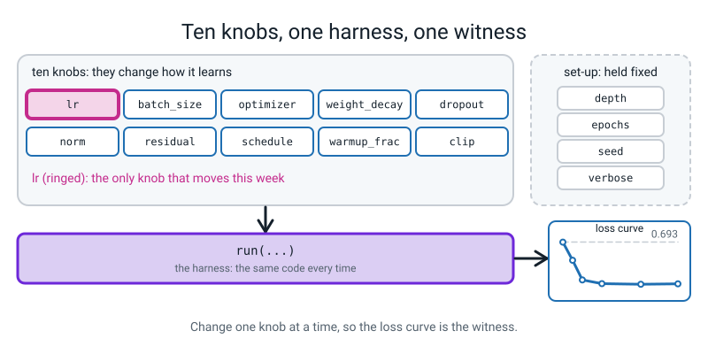
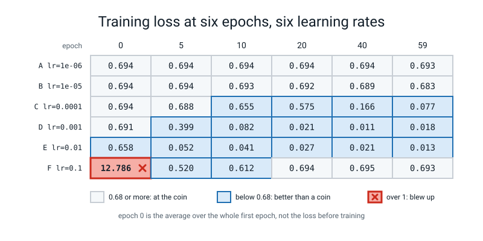

# Week 1 — One Loop, Ten Knobs

[⬅ Course Home](../README.md) · [Next ➡ Week 2](week-02.md) · [Workbook](../workbook/week-01.md)

---

> ### This week in one sentence
> **The final loss tells you where a run ended; only the curve tells you what happened.**
>
> **By the end of this chapter you will be able to:**
> - **Name most of the ten knobs** of the training harness by reading one function signature
> - **Run six learning rates** and read the result as a table of numbers
> - **Label six curves in your own words**, and prove each label with a number
> - **State the loss of a two-class model that is guessing: 0.693**, and say why in one sentence
> - **Explain what the `*` in a function signature does**, and read the error you get when you ignore it
>
> **New maths:** **none.** You use `ln` once, on one number, which you met in Level 3.
>
> **New syntax:** `torch.set_num_threads(1)` · keyword-only `*` in `def run(*, lr, ...)` · `nn.GELU()`
>
> **Reading time:** about 30 minutes. **Homework:** about 60 minutes.

> **📌 About the code blocks.** Each block carries on from the one above it, so each `import` is typed once, in the first block that needs it. If you paste a block on its own and get `NameError`, that is why; nothing is broken. The blocks marked **DELIBERATE MISTAKE** are broken on purpose. Every output shown was printed by a real run on a CPU with a seed set. Your numbers should match to every digit shown. The one exception is the core count in Step 1, which is your own machine's.

---


*Figure 1.0 — Where this fits: week 1 of 36 sits in term 1, "train it on purpose"; the tiles still dashed are the weeks to come.*

## 🪝 Start Here

Here is the last line a training run printed:

```text
final loss: 0.693
```

And here is the last line of a second run, with different settings:

```text
final loss: 0.693
```

Same number to three decimal places. Last year, a loss that fell to here might have made you happy.

**What would you need to know before you could say whether either of these models learned anything?**

Write down your answers in your Bug Log before you read on. (If you have not kept a Bug Log since Level 3, start a fresh page now.)

There is one thing you need that is not on the screen: **what would a model that learned nothing score?** Nobody can read a loss without that number. Today you find it.

And a warning. Later today you will meet a third run that also ended at exactly 0.693, after first going to a loss of **twelve**. Three runs, one final number, three different stories. Level 4 is about telling those stories apart: by the end of the year you will look at a curve and say what is wrong and which knob to turn.

---

## 🧠 The Big Idea

In this section you meet the ten knobs of the training harness, the data you will train on, the three new lines of syntax, and the one number every loss must be compared with.

### 1. Last year's loop has ten knobs nobody named

Last year you wrote this loop and watched it work. It is the starting point for everything this year:

```python
for epoch in range(60):
    opt.zero_grad()
    loss = loss_fn(model(X), y)
    loss.backward()
    opt.step()
```

The loss went down, and that was the right thing to be proud of last year.

This year the question changes. It stops being *"does it learn?"* and becomes *"when it does not, which knob do I turn, and how do I know before I turn it?"* A network that is not learning does not tell you why. It prints the same number over and over, and the number looks like a number. **Your job this year is to read what that number is saying.**

Take `opt.step()`. It moves every weight a little. How *much* is a number you chose last year, probably without thinking. It is the **learning rate**, written `lr`. That is one decision. How many examples did you average before taking a step? That is another. Whether the step is plain or cleverer? Another.

All of these decisions are named in one place: the signature of a function called `run`, in the course's shared kit, `l4lib/spirals.py`. Open that file in an editor and find `def run`. The signature looks like this (this is a reading exercise, not something to type):

```text
def run(tag, *, depth=4, lr=3e-3, batch_size=64, epochs=60, optimizer="adamw",
        weight_decay=0.0, dropout=0.0, norm="none", residual=False,
        schedule="none", warmup_frac=0.0, clip=None, seed=0, verbose=True):
```

Four of those are **set-up, not knobs**: `depth` (how many blocks), `epochs` (how long), `seed` (which random start) and `verbose` (whether to print). Count what is left.

> **✏️ Do this in your Bug Log before reading on.** Write down every name in that signature that you think is a **knob**, meaning something that changes *how the model learns*, and in a few words what you think each one does. There are ten. Guess the ones you do not recognise: wrong guesses are useful.

Two or three of the names will be unfamiliar. That is intended. Each knob gets a week of its own later in the year, turned **alone**. The word the field uses for a knob is **hyperparameter**. This course says *knob*.

**Today only `lr` moves.** Every other argument stays at its default. That is the design of the whole year: *one knob alone, so the curve is the witness.*


*Figure 1.3 — One harness, ten knobs: this week only `lr` moves, so the loss curve is the witness.*

Two words you will use all day:

- A **harness** is a small piece of code that runs an experiment the same way every time, so the only difference between two runs is the thing you changed on purpose. `run` is our harness.
- A **loss curve** is the loss plotted (or printed) once per **epoch**, where one epoch is one full pass through the training data.

### 2. The data

Nothing downloads. The data is **two interleaved spirals** of points, generated by numpy with a seed: 1,200 points, split 840 for training and 360 for validation, standardised using the training half only. The model has to say which spiral each point is on. It is small enough that one run takes well under a second.

### 3. The three new lines of syntax

There are exactly three, and none is difficult.

**`torch.set_num_threads(1)`.** Your laptop has many CPU cores, and PyTorch will happily spread its arithmetic across all of them. Adding numbers in a different *order* can give results that differ in the last digits, because computers round after every addition. One thread means one fixed order, so the same code prints the same digits every time, and **the digits in this book match the digits on your screen.** On a network this small the answer is the same either way; today it is insurance, and the habit matters for bigger models later. Rule: **put it near the top of the file, once, before any training.**

Create a file called `week01.py` in the `36-week-course/` folder and type this to see the thread count before and after the call:

```python
import torch
print("threads before:", torch.get_num_threads())
torch.set_num_threads(1)
print("threads after: ", torch.get_num_threads())
```
```text
threads before: 18
threads after:  1
```

Look at the two numbers. The first is *your* machine's core count, so yours will differ. The second must be `1`.

**The keyword-only `*`.** In a function definition, a lone `*` means *"everything after this must be passed by name."* Here it is on a toy function with the same shape as the real harness. Add this to the same file and run it:

```python
def run_toy(*, lr, batch_size, seed):
    return f"lr={lr}  batch_size={batch_size}  seed={seed}"

print(run_toy(lr=0.001, batch_size=64, seed=0))
print(run_toy(seed=0, batch_size=64, lr=0.001))     # any order is fine, because every one is named
```
```text
lr=0.001  batch_size=64  seed=0
lr=0.001  batch_size=64  seed=0
```

Look at the two output lines: both calls give the same result, whatever the order.

Why does the harness insist on names? A sweep calls it hundreds of times with different knobs. A call like `run(0.001, 64, 0)` is unreadable, and it silently swaps two numbers the day someone reorders the signature. With the `*`, a wrong or missing name stops the program, loudly, on the line that is wrong.

Watch what happens if you forget the names. Save this as its own file, `mistake1.py`, and run it:

```python
# DELIBERATE MISTAKE 1: no names. This is the call that "keyword-only" exists to stop.
def run_toy(*, lr, batch_size, seed):
    return f"lr={lr}  batch_size={batch_size}  seed={seed}"

print(run_toy(0.001, 64, 0))
```
```text
Traceback (most recent call last):
  File "/tmp/s1/mistake1.py", line 5, in <module>
    print(run_toy(0.001, 64, 0))
TypeError: run_toy() takes 0 positional arguments but 3 were given
```

Read the last line: *takes 0 positional arguments but 3 were given*. It means "I wanted names, you gave me bare numbers." (Your file path will differ from the one shown.) This is a **good** error: it points at the exact line that is wrong.

**`nn.GELU()`.** An **activation function** is the bend in the middle of a layer; without it, stacked layers collapse into one straight-line layer (Level 3). You know ReLU: a hard corner, zero for negative inputs and the input itself for positive ones. **GELU is the same idea with the corner rounded off.** Here are real numbers. This block passes seven values through both functions and prints the results side by side:

```python
import torch.nn as nn
x = torch.tensor([-3.0, -1.0, -0.5, 0.0, 0.5, 1.0, 3.0])
print("x     ", x.tolist())
print("ReLU  ", nn.ReLU()(x).tolist())
print("GELU  ", [round(v, 4) for v in nn.GELU()(x).tolist()])
```
```text
x      [-3.0, -1.0, -0.5, 0.0, 0.5, 1.0, 3.0]
ReLU   [0.0, 0.0, 0.0, 0.0, 0.5, 1.0, 3.0]
GELU   [-0.004, -0.1587, -0.1543, 0.0, 0.3457, 0.8413, 2.996]
```

Look at the `-1.0` column. ReLU says exactly `0.0`. GELU says `-0.1587`, a small leak below zero. You do not need a formula for it. GELU sits inside every block of the harness, and you will use it deliberately later in the year. Today you only need to recognise it when you see it.

---

### 4. The coin, by hand

Here is the number the opening was missing. Imagine a model that has learned *nothing*. It cannot tell the two classes apart. What probability does it give the right answer, for every example? **One half.**

In Level 3 you learned that surprise is *minus ln of the probability*. So what is the surprise of a one-in-two event? Work it out, then check it with this block, which prints the natural log of two, a check that `e` to that power gives it back, and minus the natural log of one half:

```python
import math
print("ln 2          =", round(math.log(2), 4))
print("e ** 0.693    =", round(math.exp(0.693), 4))
print("-ln(0.5)      =", round(-math.log(0.5), 4))
```
```text
ln 2          = 0.6931
e ** 0.693    = 1.9997
-ln(0.5)      = 0.6931
```

Look at the first and third lines: they agree. So the loss of a model that has learned nothing, on two classes, is **0.693**. Write it down and underline it.

> **A curve that starts at 0.693 and stays there is a model that has learned nothing. A curve that starts at 0.693 and falls is a model getting better than a coin.**

Now go back to the two lines at the top of this chapter. Both said `0.693`. Did either model learn something? Think about it before you move on.

---

## 💻 Try It Yourself — the sweep

In this section you run the same model at six learning rates and read the results as numbers and as curves.

### Predict first

You are about to run the same model six times. Everything is identical except the learning rate. The six values, from smallest to biggest:

| Run | Learning rate |
|:--:|---|
| A | one millionth: `1e-6` |
| B | one hundred-thousandth: `1e-5` |
| C | one ten-thousandth: `1e-4` |
| D | one thousandth: `1e-3` |
| E | one hundredth: `1e-2` |
| F | one tenth: `1e-1` |

> **✏️ Before you run anything**, write in your Bug Log: for each of the six, what do you think the *final loss* will be: **coin**, **low**, or **in between**? And which one do you think wins? Do not peek ahead. Being wrong costs nothing; skipping this costs the lesson.

### Step 1 — one real run

Add this block to `week01.py`. It loads the data, does one real run at a learning rate of one thousandth, and inspects the result. Run the file from the `36-week-course/` folder, the one that *contains* `l4lib`.

```python
from l4lib.spirals import run, get_data
Xtr, ytr, Xva, yva = get_data()
print("train class counts:", ytr.bincount().tolist(), "  val class counts:", yva.bincount().tolist())
h = run("adamw lr=0.001", lr=1e-3)
print(sorted(h.keys()))
print("epochs recorded:", len(h["train"]))
```
```text
train class counts: [431, 409]   val class counts: [169, 191]
adamw lr=0.001               train 0.018  val 0.026  acc  99.4%
['acc', 'gnorm', 'lr', 'train', 'val']
epochs recorded: 60
```

Look at the `adamw` line. You import the kit; you never copy it. One run: train loss at the end 0.018, validation loss 0.026, accuracy 99.4%. `h` is a dictionary of five lists, one number per epoch. (Keep the class counts in mind: you will need them in a few minutes.)

### Step 2 — two more deliberate mistakes, on the real harness

Each block below is a deliberate mistake. Save each as its own file, run it, and read only the **last line** of the error.

```python
# DELIBERATE MISTAKE 2: a misspelt name, on the real harness.
from l4lib.spirals import run
run("typo", lrate=1e-3)
```
```text
Traceback (most recent call last):
  File "/tmp/s1/m2.py", line 3, in <module>
    run("typo", lrate=1e-3)
TypeError: run() got an unexpected keyword argument 'lrate'
```

It does not suggest the right word; it only says which word it did not recognise. Compare `lrate` with the signature, character by character.

```python
# DELIBERATE MISTAKE 3: the real harness, one bare number after the tag.
from l4lib.spirals import run
run("positional", 1e-3)
```
```text
Traceback (most recent call last):
  File "/tmp/s1/m3.py", line 3, in <module>
    run("positional", 1e-3)
TypeError: run() takes 1 positional argument but 2 were given
```

Same family, different wording. The one thing `run` accepts bare is `tag`, the label. Everything else must be named.

> **If you see `ModuleNotFoundError: No module named 'l4lib'`:** your terminal is in the wrong folder. `cd` to the folder that contains `l4lib` and check with `ls`. Do not copy `l4lib` next to your file.

### Step 3 — the six runs

Back in `week01.py`. This block makes a list of pairs (a letter and a learning rate) and loops over it, running the harness once per pair:

```python
LRS = [("A", 1e-6), ("B", 1e-5), ("C", 1e-4), ("D", 1e-3), ("E", 1e-2), ("F", 1e-1)]
curves = {}
for letter, lr in LRS:
    curves[letter] = run(f"{letter}  lr={lr:g}", lr=lr, epochs=60)
```
```text
A  lr=1e-06                  train 0.693  val 0.692  acc  53.1%
B  lr=1e-05                  train 0.683  val 0.679  acc  55.3%
C  lr=0.0001                 train 0.077  val 0.063  acc  98.1%
D  lr=0.001                  train 0.018  val 0.026  acc  99.4%
E  lr=0.01                   train 0.013  val 0.059  acc  99.2%
F  lr=0.1                    train 0.693  val 0.702  acc  46.9%
```

Look down the last column. Which two runs look alike? Same final loss, same story? Now print what happened *during* each run, with this block showing the training loss at six chosen epochs:

```python
print("epoch      " + "".join(f"{e:>9}" for e in (0, 5, 10, 20, 40, 59)))
for letter, lr in LRS:
    row = "".join(f"{curves[letter]['train'][e]:>9.3f}" for e in (0, 5, 10, 20, 40, 59))
    print(f"{letter}  lr={lr:<6g}" + row)
```
```text
epoch              0        5       10       20       40       59
A  lr=1e-06     0.694    0.694    0.694    0.694    0.694    0.693
B  lr=1e-05     0.694    0.694    0.693    0.692    0.689    0.683
C  lr=0.0001    0.694    0.688    0.655    0.575    0.166    0.077
D  lr=0.001     0.691    0.399    0.082    0.021    0.011    0.018
E  lr=0.01      0.658    0.052    0.041    0.027    0.021    0.013
F  lr=0.1      12.786    0.520    0.612    0.694    0.695    0.693
```

Look at the **first** column, epoch zero. That number is the *average* loss over the whole first epoch, not the loss before any training. Every run begins near 0.694, but during F's first epoch some steps were so large that the average came to **12.786**. A's first epoch averages 0.694.

Compare the last column with the first one before you read on.


*Figure 1.4 — The same table, shaded: the cells at the coin, the cells below it, and the one cell that blew up.*

> **The final loss tells you where it ended. The curve tells you what happened.**


*Figure 1.1 — Three runs that end near 0.693 tell three different stories; only the curve shows which.*

### Step 4 — the curves, in text

A table of numbers is hard to see as a shape. This block defines a small function, `sketch`, that draws one character per epoch (a space for a high loss, `@` for a low one), then draws all six runs:

```python
def sketch(values, lo=0.0, hi=0.8, width=60):
    """One character per epoch: how high the loss sits between lo and hi."""
    marks = " .:-=+*#%@"
    out = ""
    for v in values[:width]:
        v = min(max(v, lo), hi)
        out += marks[int((hi - v) / (hi - lo) * (len(marks) - 1))]
    return out

print("loss 0.8 -> 0.0 shown as '@' (low) .. ' ' (high);  60 epochs left to right")
for letter, lr in LRS:
    print(f"{letter} lr={lr:<6g}|{sketch(curves[letter]['train'])}|")
```
```text
loss 0.8 -> 0.0 shown as '@' (low) .. ' ' (high);  60 epochs left to right
A lr=1e-06 |............................................................|
B lr=1e-05 |............................................................|
C lr=0.0001|...............:::::::::------====++****###############%%%%%|
D lr=0.001 |...:-=*##%%%%%%%%%%%%%%%%%%%%%%%%%%%%%%%%%%%%%%%%%%%%%%%%%%%|
E lr=0.01  |.-*#%%%%%%%%%%%%%%%%%%%%%%%%%%%%%%%%%%%%%%%%%%%%%%%%%%%%%%%%|
F lr=0.1   |  ::--:.:.:::.  ............................................|
```

That is six curves in text. Now go back to your predictions from earlier and check each one against the table. Nobody has to have been right. You made a prediction, you checked it, and now you hold a number you can trust more than your guess. That is the habit.

### Step 5 — the two constant guessers

Accuracy needs a baseline too. Suppose a "model" ignores its input and always gives the same answer. This block computes what the two possible constant answers score on the validation set, then prints each run's final numbers:

```python
print("the two constant guessers on the validation set:")
share_1 = yva.float().mean().item()
print(f"  always say class 1 -> accuracy {share_1*100:.1f}%")
print(f"  always say class 0 -> accuracy {(1-share_1)*100:.1f}%")
print()
for letter, lr in LRS:
    h = curves[letter]
    print(f"{letter} lr={lr:<6g} final val loss {h['val'][-1]:.3f}   final val accuracy {h['acc'][-1]*100:5.1f}%")
```
```text
the two constant guessers on the validation set:
  always say class 1 -> accuracy 53.1%
  always say class 0 -> accuracy 46.9%

A lr=1e-06  final val loss 0.692   final val accuracy  53.1%
B lr=1e-05  final val loss 0.679   final val accuracy  55.3%
C lr=0.0001 final val loss 0.063   final val accuracy  98.1%
D lr=0.001  final val loss 0.026   final val accuracy  99.4%
E lr=0.01   final val loss 0.059   final val accuracy  99.2%
F lr=0.1    final val loss 0.702   final val accuracy  46.9%
```

Compare the last column with the two constant-guesser lines. Which runs sit exactly on one of them? (The class counts you printed in Step 1 explain where 53.1% and 46.9% come from: 191 of 360 and 169 of 360.)


*Figure 1.2 — A model that ends on a constant guesser's accuracy has learned nothing.*

---

## 🎲 Your Turn — label the six curves

In this section you turn the numbers into your own words, with a number behind every word.

You now have the table (Step 3), the text curves (Step 4), and the guesser baseline (Step 5). Use six index cards labelled A to F, or six boxes in your Bug Log.

**For each of the six runs, write three things:**

1. **A label in your own words** saying what the curve is *doing*.
2. **One number from the table that proves it.**
3. **Would you keep this learning rate?** Yes or no.

Invent your own words. "Stuck", "lazy", "crashes", "perfect" and "good but wobbly" are all fine. Nobody is checking your vocabulary; what matters is that **every word you write has a number behind it.**

**Then, on the back of card F, write one sentence:**

> A model for two classes is guessing. What is its loss, and *why that number*?

Your sentence needs two ingredients: the probability the guessing model gives each class, and the link from that to `ln`.

---

## 🔑 Wrap Up

This section checks that the main idea stuck and gives you the sentence to keep.

Answer these three before you close the laptop:

1. A run's loss is 0.693 at epoch 0 and 0.693 at epoch 59. Can you name **two completely different reasons**?
2. What did the `*` in the signature do for you today?
3. What do you want to know about this next? Write it in your Parking Lot. (If it is "why does F behave like that?", you are asking the right question, and Week 2 begins answering the optimizer side of it.)

Then write this sentence in your Bug Log, in your own handwriting:

> **"0.693 is what a coin scores, and the final loss alone cannot tell a stuck model from a crashed one."**

---

## 📝 Vocabulary

These are the words introduced this week.

| Word | Meaning |
|---|---|
| **knob** | A setting you choose that changes how a model learns. The field says "hyperparameter". |
| **learning rate** (`lr`) | How big a step each update takes. |
| **epoch** | One full pass through the training data. |
| **loss curve** | The loss, recorded once per epoch. |
| **harness** | A small program that runs experiments the same way every time, so only your change differs. |
| **guessing loss** | The loss of a model that has learned nothing. For two classes: `ln 2` = 0.693. |
| **keyword-only argument** | An argument after a lone `*` in a `def`; it must be passed by name. |
| **activation function** | The bend in the middle of a layer. ReLU has a hard corner; GELU has a rounded one. |

---

## 🏠 Homework

This section lists the workbook tasks, which repeat today's experiments on your own machine.

Workbook Week 1 (about 60 minutes). Everything you write down must come from **your own run, printed on your own screen, with a seed set, in the last 24 hours**, not from this chapter.

1. **The six-curve grid.** Run the six learning rates. For each, write a label and one number.
2. **Predict, then run.** The harness default is `lr=3e-3`. Will it look more like D or E? Write your prediction, then run it and say what you saw.
3. **The coin, by hand.** Compute `-ln(0.5)` on a calculator. Then compute `-ln(1/3)` and say what a **three-class** guesser would score.
4. **The constant guesser.** Count class 0 and class 1 in `yva`. Work out 169/360 and 191/360 by hand. Which learning rates in the sweep match them?
5. **Break the star.** Call `run` with a bare number after the tag. Paste the last line of the error into your Bug Log. Then fix the call.
6. **Same seed, twice.** Run `lr=1e-3` twice with `verbose=False` and prove the two `train` lists are equal with `==`. Then change `seed=` on one of them and say what changed.
7. **Self-check.** In one sentence: why is 0.693 the loss of a guessing two-class model?

**The one line to write in your Bug Log tonight:** *"The same final loss can hide opposite stories. Look at the first epoch."*

---

## 🔮 Next Week

A preview of what comes next and what to keep until then.

This week every run used the same optimizer. Next week changes only the optimizer, and the result is startling: two rules, the same learning rate, the same spirals, and one finishes as useless as a coin while the other finishes nearly perfect. The one new idea is a running average of past numbers, which you will do by hand on five numbers before any code.

**Before then:** keep `week01.py` exactly as it is. Next week starts by re-running its sweep. Keep your six cards too.

---

[⬅ Course Home](../README.md) · [Next ➡ Week 2](week-02.md) · [Workbook](../workbook/week-01.md)
