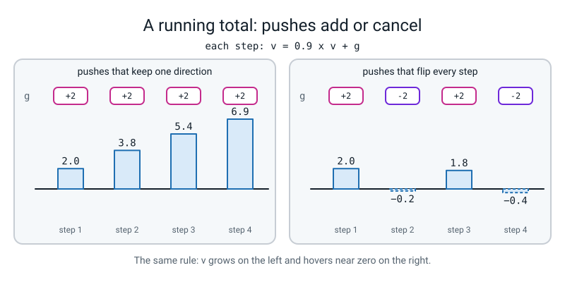
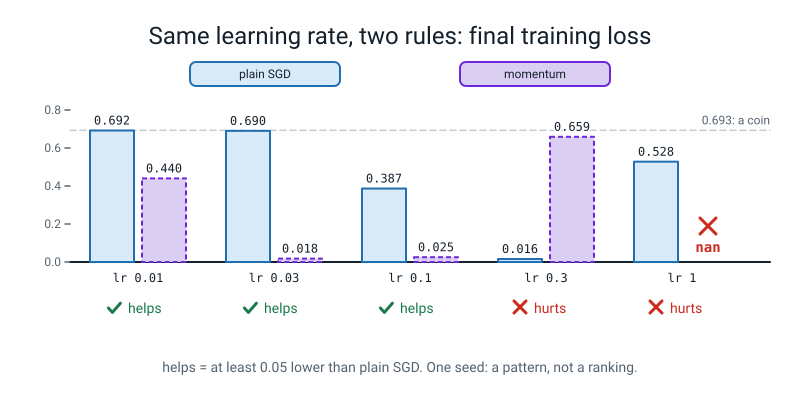

# Week 2 — Momentum: A Running Average of Where You Were Going

[⬅ Week 1](week-01.md) · [Course Home](../README.md) · [Next ➡ Week 3](week-03.md) · [Workbook](../workbook/week-02.md)

---

> ### This week in one sentence
> **A step that remembers the last few steps rolls through bumps that stop a step with no memory, and the memory is a running average.**
>
> **By the end of this chapter you will be able to:**
> - **Compute a running average by hand** on five numbers, and watch an old value fade by the same share every step
> - **Do three steps of plain SGD and three of SGD with momentum** on paper, then check both against `torch.optim`
> - **Say what `zero_grad(set_to_none=True)` and `.norm()` do**
> - **Find a learning rate where momentum helps and one where it hurts**, with one number for each
> - **Say the "trolley sentence"** about what momentum remembers and what it does with it
>
> **New maths:** **one idea: the exponential moving average.** *New average = 0.9 x old average + 0.1 x new value.* You meet it on five numbers on paper before any code.
>
> **New syntax:** `torch.optim.SGD(..., momentum=0.9)` · `optimizer.zero_grad(set_to_none=True)` · `tensor.norm()`
>
> **Reading time:** about 35 minutes. **Homework:** about 60-75 minutes.

> **📌 About the code blocks.** Each block carries on from the one above it, so each `import` is typed once, in the first block that needs it. If you paste a block on its own and get `NameError`, that is why; nothing is broken. Blocks marked **DELIBERATE MISTAKE** are broken (or quietly wrong) on purpose. Every output shown was printed by a real run on a CPU with a seed set, using one thread. The small by-hand blocks match to every digit shown. The spirals runs should match within 0.005 on a loss and 0.5 points on an accuracy. Open your terminal in the `36-week-course/` folder (the one that contains `l4lib/`) and keep everything in one file, `week02.py`.

---


*Figure 2.0 — Where this fits: week 2 of 36 sits in term 1, "train it on purpose"; the tiles still dashed are the weeks to come.*

## 🪝 Start Here

Last week you turned one knob, the learning rate. The list of ten knobs had another one that you were told to ignore: `optimizer`. Today you turn it.

Same data. Same starting weights. Same learning rate, `0.03`. Two runs. Only one word differs.

**Before you look at the next block, write two numbers in your Bug Log: your guess for each run's final training loss.** Remember what a coin scores.

Now the runs (you will type this code properly later; for now just read):

```text
sgd lr=0.03                  train 0.690  val 0.690  acc  52.8%
momentum lr=0.03             train 0.018  val 0.034  acc  98.6%
```

The first is a coin. The second is 98.6% correct. **One word changed:** `optimizer="sgd"` became `optimizer="momentum"`.

**What does `"momentum"` have that `"sgd"` lacks?** Write your guess in the Bug Log. Any guess is fair: a bigger step, faster, smarter, something else. By the end of this chapter you will have built the answer yourself, on paper, with five numbers, and then watched PyTorch agree with your paper.

---

## 🧠 The Big Idea

This section explains what plain SGD forgets, builds the one new maths idea on small numbers, and turns it into the momentum rule. You need it before the code, so that every number in the code has a meaning.

### 1. Last year's step has no memory

Last year you updated a weight like this:

```text
w = w - lr x grad
```

That rule looks only at the slope under your feet **right now**. It forgets every slope it has ever seen. That causes two problems on a real loss surface:

- In a narrow valley, the slope points mostly at the valley wall, so the steps zig-zag from side to side.
- On a long gentle slope, each step is tiny, so you crawl.

**Momentum** is the same rule, but the step comes from a *running average of recent gradients* instead of only the latest one. It costs one extra number per weight, kept between steps.

### 2. The one new maths idea: an exponential moving average

An **exponential moving average** (EMA) is *a running average that counts recent values more and forgets old values by a fixed share every step.* Here is the rule, for a share of 0.9:

```text
new average = 0.9 x old average + 0.1 x new value
```

That is the whole idea. The word "exponential" only means that the old stuff gets multiplied by the same number again and again. You store nothing except the one current average.

**Do this on paper first, with a calculator.** The average starts at `0`. Five values arrive: `10, 0, 0, 0, 0`. Work out the average after each one. Then look at what you notice about each number compared with the one before it.

Now check it in code. Open `week02.py` and type this. It loads PyTorch, fixes it to one thread so results match, and prints the version:

```python
import torch
torch.set_num_threads(1)
print("threads:", torch.get_num_threads(), " torch", torch.__version__)
```
```text
threads: 1  torch 2.2.1
```

Look at the first line: it reports one thread. (Your `torch` version might differ. Small differences in a spirals number later would be a version difference, not a mistake.)

This loop applies the rule to the five values, one per step, and prints the average each time:

```python
old = 0.0
for step, value in enumerate([10, 0, 0, 0, 0], start=1):
    old = 0.9 * old + 0.1 * value
    print(f"step {step}: value {value:>2}   average {old:.4f}")
```
```text
step 1: value 10   average 1.0000
step 2: value  0   average 0.9000
step 3: value  0   average 0.8100
step 4: value  0   average 0.7290
step 5: value  0   average 0.6561
```

Look at the average column: each number is exactly 0.9 times the one before. **The single `10` that arrived at step 1 loses a tenth of its say every step.** That "fade by a fixed share" is the only thing to take from this block.

Now feed it the same value every time. **Predict the last line before you run it.**

```python
old = 0.0
for step, value in enumerate([10, 10, 10, 10, 10], start=1):
    old = 0.9 * old + 0.1 * value
    print(f"step {step}: value {value:>2}   average {old:.4f}")
```
```text
step 1: value 10   average 1.0000
step 2: value 10   average 1.9000
step 3: value 10   average 2.7100
step 4: value 10   average 3.4390
step 5: value 10   average 4.0951
```

The average is heading for 10 but has not arrived after five steps. Why isn't it 10 yet? Write one sentence in your Bug Log. (Hint: look at what it started as.)

### 3. The half-life of 0.9

How many steps until that early `10` counts for only half of what it did at first? Multiply by 0.9 again and again. This loop prints what share of the first value is left after each step:

```python
share = 1.0
for n in range(1, 9):
    share = share * 0.9
    print(f"after {n} step(s) the first value still counts for {share:.3f}")
```
```text
after 1 step(s) the first value still counts for 0.900
after 2 step(s) the first value still counts for 0.810
after 3 step(s) the first value still counts for 0.729
after 4 step(s) the first value still counts for 0.656
after 5 step(s) the first value still counts for 0.590
after 6 step(s) the first value still counts for 0.531
after 7 step(s) the first value still counts for 0.478
after 8 step(s) the first value still counts for 0.430
```

It crosses one half between step 6 and step 7. Call it **about 7 steps**. That is the **half-life** of 0.9 (the word is borrowed from physics: how long until half of something is gone). The exact crossing point, if you are curious, is a one-liner. It asks how many times you must apply the fade to reach one half:

```python
import math
print("steps until the first value counts for half:", round(math.log(0.5) / math.log(0.9), 2))
```
```text
steps until the first value counts for half: 6.58
```

You do not need `math.log`; the number is here so that 6.58 is a real result and not a guess.


*Figure 2.1 — A running average forgets old values by the same share each step; for 0.9 the half-life is 6.58 steps.*

### 4. From the average to momentum

Momentum keeps one number for each weight, the **velocity** `v`: *the running total of recent gradients.* The rule is:

```text
v = 0.9 x v + g            g = the gradient this step
w = w - lr x v
```

Compare it with the average from section 2. It is **the moving average with the `0.1` left off.** That makes the velocity exactly **ten times** the running average of the gradients. Hold on to "ten times"; it pays off at the end of the lesson.

Here is why a running total is useful. Compare two kinds of slope:

```text
steady:   g =  +2  +2  +2  +2      v =  2.0  3.8  5.4  6.9   (grows)
flipping: g =  +2  -2  +2  -2      v =  2.0 -0.2  1.8 -0.4   (hovers near 0)
```

When the slope keeps pointing the same way, the running total grows, so you speed up. When the slope flips every step, the running total cancels, so you stop zig-zagging. **Steady pushes add up; flip-flops cancel.** That is the whole intuition.


*Figure 2.3 — The velocity is a running total: pushes in one direction add, alternating pushes cancel.*

Which of those two rows looks like a zig-zag in a narrow valley? Write it in the Bug Log.

### 5. The three new lines of syntax

**`torch.optim.SGD(..., momentum=0.9)`.** The same `SGD` optimizer you used in Level 3, with the memory switched on. The default is `momentum=0`, which is plain SGD. Internally PyTorch keeps the velocity for each weight under the name `"momentum_buffer"`, and you will peek at it below.

**`optimizer.zero_grad(set_to_none=True)`.** Before each `backward()` the old gradients must be cleared, or new ones get added on top. Last year you wrote `opt.zero_grad()`. The new argument says *how* to clear: `set_to_none=False` writes zeros; `set_to_none=True` removes the gradient entirely, so the slot reads `None`. A `None` is easy to spot; a zero that quietly stayed is not. You will see all three forms below.

**`tensor.norm()`.** *The length of a tensor, as if it were an arrow: square every entry, add them up, take the square root.* The tensor `[6, 8]` has length `sqrt(36 + 64) = 10`: the 3-4-5 triangle you know, doubled.

---

## 💻 Try It Yourself

In this section you do the momentum rule by hand, check it against PyTorch, and then test it on the spirals data. Do each step on paper first wherever it says so.

### Step 1 — the by-hand table

Take `f(w) = w * w`. Start at `w = 1.0` with `lr = 0.1`. The slope is `2w` (you know this from Level 3). **Fill in this table on paper before you run anything.** Three steps, both rules.

**Plain SGD:** `w = w - 0.1 x g`

| step | w before | g = 2w | step = 0.1 g | w after |
|:--:|:--:|:--:|:--:|:--:|
| 1 | 1.0000 | | | |
| 2 | | | | |
| 3 | | | | |

**Momentum:** `v = 0.9 v + g`, then `w = w - 0.1 v`. The velocity `v` starts at 0.

| step | w before | g = 2w | v = 0.9 v + g | step = 0.1 v | w after |
|:--:|:--:|:--:|:--:|:--:|:--:|
| 1 | 1.0000 | | | | |
| 2 | | | | | |
| 3 | | | | | |

Now check yourself in code. First momentum, four steps. **Before you run it, predict: after step 4, is `w` still positive?**

```python
w, v = 1.0, 0.0
for step in range(1, 5):
    g = 2 * w
    v = 0.9 * v + g
    w = w - 0.1 * v
    print(f"step {step}: g {g:7.4f}  v {v:7.4f}  w {w:8.4f}")
```
```text
step 1: g  2.0000  v  2.0000  w   0.8000
step 2: g  1.6000  v  3.4000  w   0.4600
step 3: g  0.9200  v  3.9800  w   0.0620
step 4: g  0.1240  v  3.7060  w  -0.3086
```

Then plain SGD, same four steps:

```python
w = 1.0
for step in range(1, 5):
    g = 2 * w
    w = w - 0.1 * g
    print(f"step {step}: g {g:7.4f}  w {w:8.4f}")
```
```text
step 1: g  2.0000  w   0.8000
step 2: g  1.6000  w   0.6400
step 3: g  1.2800  w   0.5120
step 4: g  1.0240  w   0.4096
```

Compare your paper table with both. Notice three things:

- Both rules agree after step 1 (`0.8000`), because `v` starts at zero. They part company at step 2.
- After step 3, momentum is at `0.0620` and plain SGD is at `0.5120`. Momentum has arrived much sooner.
- At step 4 momentum goes from `0.0620` to `-0.3086`: it went **past** zero. That is called an **overshoot**: *going past the target because you are still carrying the old steps.* Plain SGD creeps and never overshoots.

That is the trade: **momentum arrives sooner, and overshoots.**


*Figure 2.2 — Momentum arrives sooner because it carries old steps, and for the same reason it overshoots.*

Last week's parking-lot question was "why does a big learning rate blow up?" Here is the one-knob version. A step that is too long jumps over the target, and if it lands farther away than it started, every jump is bigger than the last:

```python
# why a step that is too long overshoots: plain SGD on f(w) = w*w with lr = 1.1
w = 1.0
for step in range(1, 7):
    w = w - 1.1 * (2 * w)
    print(f"step {step}: w {w:9.4f}")
```
```text
step 1: w   -1.2000
step 2: w    1.4400
step 3: w   -1.7280
step 4: w    2.0736
step 5: w   -2.4883
step 6: w    2.9860
```

With `lr = 1.1` the first step lands on `-1.2`, farther from zero than `1.0`, and it keeps growing. This is what one of last week's curves did inside a network with many weights. Note that this is checked only on this one-weight toy; for the network itself, read its curve.

### Step 2 — the same thing in PyTorch

Does `torch.optim.SGD` do what your paper did? The function below runs four steps with whatever momentum you give it:

```python
def steps(momentum):
    w = torch.tensor([1.0], requires_grad=True)
    opt = torch.optim.SGD([w], lr=0.1, momentum=momentum)
    out = []
    for _ in range(4):
        opt.zero_grad(set_to_none=True)
        loss = (w ** 2).sum()
        loss.backward()
        opt.step()
        out.append(round(w.item(), 4))
    return out
print("plain SGD   :", steps(0.0))
print("momentum 0.9:", steps(0.9))
```
```text
plain SGD   : [0.8, 0.64, 0.512, 0.4096]
momentum 0.9: [0.8, 0.46, 0.062, -0.3086]
```

Read it line by line:

- `w = torch.tensor([1.0], requires_grad=True)` is one weight, as in Level 3.
- `torch.optim.SGD([w], lr=0.1, momentum=momentum)` is the new argument. `momentum=0.0` means no memory, which is plain SGD.
- `opt.zero_grad(set_to_none=True)` says "clear the stored slope before measuring a new one".

Your paper and PyTorch agree to four places. So `momentum=0.9` is exactly the rule you wrote.

Now peek at the velocity PyTorch keeps. This block reads it from the optimizer's `state` after each step:

```python
w = torch.tensor([1.0], requires_grad=True)
opt = torch.optim.SGD([w], lr=0.1, momentum=0.9)
for step in range(1, 4):
    opt.zero_grad(set_to_none=True)
    (w ** 2).sum().backward()
    opt.step()
    v = opt.state[w]["momentum_buffer"]
    print(f"step {step}: w {w.item():.4f}  v {v.item():.4f}")
```
```text
step 1: w 0.8000  v 2.0000
step 2: w 0.4600  v 3.4000
step 3: w 0.0620  v 3.9800
```

The `v` column is the `v` column of your hand table.

### Step 3 — the three ways to clear a gradient

This block calls `backward()` three times and clears the gradient a different way each time, printing `w.grad` after each clear:

```python
w = torch.tensor([3.0, 4.0], requires_grad=True)
opt = torch.optim.SGD([w], lr=0.1)
(w ** 2).sum().backward()
opt.zero_grad(set_to_none=False); print("set_to_none=False ->", w.grad)
(w ** 2).sum().backward()
opt.zero_grad(set_to_none=True);  print("set_to_none=True  ->", w.grad)
(w ** 2).sum().backward()
opt.zero_grad();                  print("no argument       ->", w.grad)
```
```text
set_to_none=False -> tensor([0., 0.])
set_to_none=True  -> None
no argument       -> None
```

Look at the three printed results: `False` leaves zeros; the other two remove the gradient. On this version of PyTorch the default already is `True`, so writing it out changes nothing except that it makes the choice visible.

### Step 4 — the length of a gradient

This block prints a gradient before and after `backward()`, its `.norm()`, and the same length worked out by hand:

```python
w = torch.tensor([3.0, 4.0], requires_grad=True)
print("grad before any backward:", w.grad)
(w ** 2).sum().backward()
print("grad after backward     :", w.grad)
print("its length (norm)       :", w.grad.norm())
print("by hand sqrt(6*6+8*8)   :", (6**2 + 8**2) ** 0.5)
w.grad = None
print("after set to None       :", w.grad)
```
```text
grad before any backward: None
grad after backward     : tensor([6., 8.])
its length (norm)       : tensor(10.)
by hand sqrt(6*6+8*8)   : 10.0
after set to None       : None
```

This length is the number the harness recorded in `h["gnorm"]` last week. From now on you can say what it is.

### Step 5 — two deliberate mistakes

Save each of these as its own file and run it. Both are broken on purpose. Read the output, then write the last line in your Bug Log.

```python
# DELIBERATE MISTAKE 1: reading the length of a gradient that was removed
import torch
w = torch.tensor([3.0, 4.0], requires_grad=True)
opt = torch.optim.SGD([w], lr=0.1)
(w ** 2).sum().backward()
opt.zero_grad(set_to_none=True)
print("gradient length:", w.grad.norm())
```
```text
Traceback (most recent call last):
  File "week02_mistake1.py", line 6, in <module>
    print("gradient length:", w.grad.norm())
AttributeError: 'NoneType' object has no attribute 'norm'
```

Read the last line first. `w.grad` is `None`, and `None` has no `.norm`. Use the gradient **before** you clear it. The fix is to put the `print` above the `zero_grad`.

The second one runs without any error, and that is the problem:

```python
# DELIBERATE MISTAKE 2: the average form against torch
# hand table with the AVERAGE form: v = 0.9*v + 0.1*g. Does it match torch?
import torch
w_hand, v = 1.0, 0.0
for step in range(1, 4):
    g = 2 * w_hand
    v = 0.9 * v + 0.1 * g
    w_hand = w_hand - 0.1 * v
    print(f"by hand (average form) step {step}: w {w_hand:.4f}")
w = torch.tensor([1.0], requires_grad=True)
opt = torch.optim.SGD([w], lr=0.1, momentum=0.9)
for step in range(1, 4):
    opt.zero_grad(set_to_none=True)
    (w ** 2).sum().backward()
    opt.step()
    print(f"torch                  step {step}: w {w.item():.4f}")
```
```text
by hand (average form) step 1: w 0.9800
by hand (average form) step 2: w 0.9424
by hand (average form) step 3: w 0.8897
torch                  step 1: w 0.8000
torch                  step 2: w 0.4600
torch                  step 3: w 0.0620
```

The two columns disagree, and no error tells you so. Before reading further, find the difference between the hand loop and the rule in section 4 of this chapter. (Answer, so you do not get stuck: PyTorch's velocity is `0.9 v + g`, with no `0.1`. The hand loop above kept the `0.1`, so its velocity is a tenth of the real one. When a hand calculation and PyTorch disagree, suspect your hand number first.)

### Step 6 — the spirals

Now the real test. The Week 1 harness takes `optimizer="sgd"` or `optimizer="momentum"`. (Inside `l4lib/spirals.py` the second builds exactly `torch.optim.SGD(..., momentum=0.9)` like the one you typed.) **Import it; never copy it.**

Before you run anything, make a prediction table in your Bug Log. For each of these six learning rates, write **helps, hurts, or same** for momentum against plain SGD:

`0.003`, `0.01`, `0.03`, `0.1`, `0.3`, `1.0`

Hint: a momentum step can be up to **ten times longer** than a plain SGD step. Then run three learning rates, both rules (about 3 seconds):

```python
from l4lib.spirals import run
H = {}
for name in ("sgd", "momentum"):
    for lr in (0.003, 0.03, 0.3):
        H[(name, lr)] = run(f"{name} lr={lr:g}", lr=lr, optimizer=name)
```
```text
sgd lr=0.003                 train 0.693  val 0.694  acc  46.9%
sgd lr=0.03                  train 0.690  val 0.690  acc  52.8%
sgd lr=0.3                   train 0.016  val 0.041  acc  98.9%
momentum lr=0.003            train 0.690  val 0.690  acc  56.7%
momentum lr=0.03             train 0.018  val 0.034  acc  98.6%
momentum lr=0.3              train 0.659  val 0.691  acc  46.9%
```

Then the five-row verdict table. The rule for the last column: a difference of more than 0.05 in final training loss counts; a smaller difference is "about equal".

```python
for lr in (0.01, 0.03, 0.1, 0.3, 1.0):
    H[("sgd", lr)] = run(f"sgd lr={lr:g}", lr=lr, optimizer="sgd", verbose=False)
    H[("momentum", lr)] = run(f"momentum lr={lr:g}", lr=lr, optimizer="momentum", verbose=False)
print(f"{'lr':>6} | {'sgd final':>10} {'sgd acc':>8} | {'mom final':>10} {'mom acc':>8} | verdict")
for lr in (0.01, 0.03, 0.1, 0.3, 1.0):
    a, b = H[("sgd", lr)], H[("momentum", lr)]
    verdict = "momentum helps" if b["train"][-1] < a["train"][-1] - 0.05 else ("momentum hurts" if not b["train"][-1] <= a["train"][-1] + 0.05 else "about equal")
    print(f"{lr:>6g} | {a['train'][-1]:>10.3f} {a['acc'][-1]*100:>7.1f}% | {b['train'][-1]:>10.3f} {b['acc'][-1]*100:>7.1f}% | {verdict}")
```
```text
    lr |  sgd final  sgd acc |  mom final  mom acc | verdict
  0.01 |      0.692    46.9% |      0.440    59.2% | momentum helps
  0.03 |      0.690    52.8% |      0.018    98.6% | momentum helps
   0.1 |      0.387    80.0% |      0.025    99.2% | momentum helps
   0.3 |      0.016    98.9% |      0.659    46.9% | momentum hurts
     1 |      0.528    66.4% |        nan    46.9% | momentum hurts
```


*Figure 2.4 — The verdict table as bars: momentum helps where plain SGD was stuck and hurts where a longer step overshoots.*

Compare the table with your predictions. Two things to notice:

- Momentum rescued some learning rates that plain SGD could not use, and it wrecked one that plain SGD handled well. Both have the same cause: a momentum step is up to ten times longer.
- `nan` means "not a number" (what you get from infinity minus infinity). The weights blew up and the loss became `nan`. The harness kept going, so the row is honest. In your table, write `nan`, not `0`.

### Step 7 — the "ten times" link

Remember the hint from the velocity rule? On a steady slope, momentum behaves like plain SGD with a learning rate ten times bigger. Test it on the spirals: momentum at `lr = 0.03` against plain SGD at `lr = 0.3`.

```python
# the ten-times story: momentum at lr L against plain SGD at lr 10 x L
A = run("momentum lr=0.03", lr=0.03, optimizer="momentum")
B = run("sgd      lr=0.3 ", lr=0.3, optimizer="sgd")
```
```text
momentum lr=0.03             train 0.018  val 0.034  acc  98.6%
sgd      lr=0.3              train 0.016  val 0.041  acc  98.9%
```

The same result, from a learning rate ten times smaller. Someone might say "momentum is just a bigger learning rate." On this steady part of the ride, that is nearly right. When the slope flips, it is not: momentum cancels a flip, where a bigger learning rate would amplify it.

---

## 🎲 Your Turn — helps or hurts?

This section turns the spirals runs into your own evidence. Make a two-column table in your Bug Log from **your own screen** (not from this chapter), five rows, one per learning rate `0.01, 0.03, 0.1, 0.3, 1.0`.

1. **Fill in the five rows:** final training loss and accuracy for plain SGD, and for momentum. Write **helps / hurts / about equal** per row, using the 0.05 rule.
2. **Circle one learning rate where momentum helps and one where it hurts.**
3. **Say why in one sentence**, using the words "longer steps" or "ten times".
4. **Place two new cards** beside your six A-F cards from Week 1: where does "sgd at 0.03" go? Where does "momentum at 0.3" go?

Optional, if you finish early: compare the first few epochs for the `momentum lr=0.3` run and the `sgd lr=1` run, and see whether their start looks like any of your A-F cards.

---

## 🔑 Wrap Up

This section fixes the two sentences to keep from the chapter. Say this sentence aloud, then write it in your Bug Log in your own handwriting:

> **"Momentum keeps a running average of past steps, so steps that keep pointing the same way add up and steps that flip-flop cancel."**

Then add this line underneath:

> **"Momentum's velocity is ten times the running average, so SGD at `lr = 0.3` matches momentum at `lr = 0.03`."**

---

## 📝 Vocabulary

The new words of this chapter, each with its meaning.

| Word | Meaning |
|---|---|
| **exponential moving average** (EMA) | A running average: new average = 0.9 x old + 0.1 x new. Old values fade by a fixed share each step. |
| **momentum** | SGD where the step comes from a running total of recent gradients instead of only the latest |
| **velocity** (`v`) | The running total momentum keeps, one number per weight: `v = 0.9 v + g` |
| **half-life** | How many steps until an old value counts for half; about 7 for 0.9 |
| **overshoot** | Going past the target because of carried-over steps |
| **gradient length (norm)** | `sqrt` of the sum of squares of a gradient's numbers; `tensor.norm()` |

---

## 🏠 Homework

Workbook Week 2 (about 60-75 minutes). Everything you write down must come from **your own run, printed on your own screen, with a seed set, in the last 24 hours**, not from this chapter.

1. **The hand table.** Three steps of SGD and of momentum on `f(w) = w * w`, `w = 1.0`, `lr = 0.1`. Then check against `torch.optim`.
2. **Helps or hurts.** The two-column table over five learning rates, with a word per row.
3. **The EMA on your own five numbers.** Pick five numbers that are not `10, 0, 0, 0, 0`. Compute the average by hand, then in code.
4. **One helps, one hurts.** Find a learning rate where momentum helps and one where it hurts on your own run, and paste the two lines.
5. **Break it on purpose.** Pick one of the two mistakes from Step 5. Reproduce it, paste the last line into your Bug Log, then fix it.
6. **The x10.** Run momentum at `lr = 0.03` and SGD at `lr = 0.3`. Say in one sentence why they match.
7. **Self-check.** In one sentence: what does momentum remember, and what does it do with it?

**The one line to write in your Bug Log tonight:** *"Momentum is ten times a running average; longer steps help a crawler and wreck a sprinter."*

---

## 🔮 Next Week

Momentum fixed the **direction** problem: the step remembers where it was going. It did not fix the **size** problem. Some knobs have gradients near 0.0001 and others near 10, and one learning rate cannot be right for both. Next week each knob gets its own step size, based on a running "typical size" of its own gradient. The new maths idea is a way of measuring that typical size, met on two small lists of numbers first.

**Before then:** keep `week02.py` exactly as it is. Next week re-runs its momentum row. Keep your A-F cards and the two new ones.

---

[⬅ Week 1](week-01.md) · [Course Home](../README.md) · [Next ➡ Week 3](week-03.md) · [Workbook](../workbook/week-02.md)
