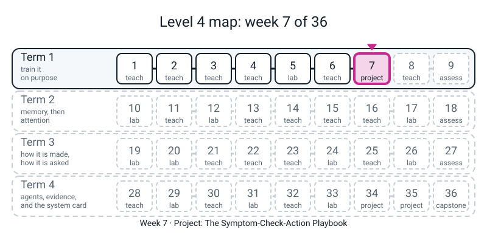
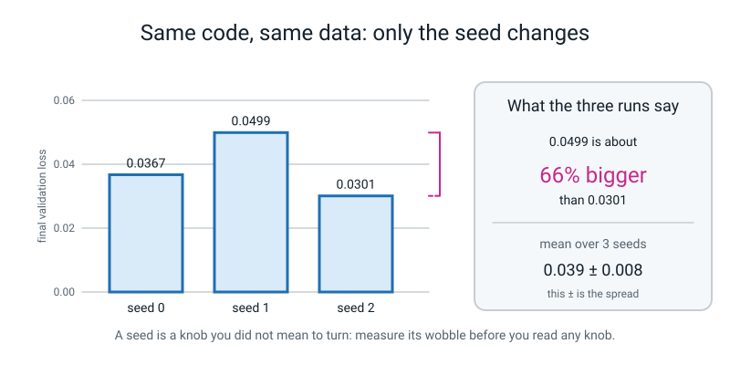
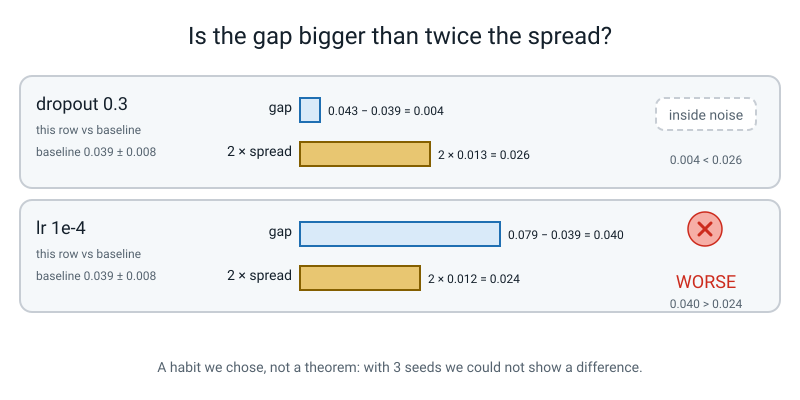
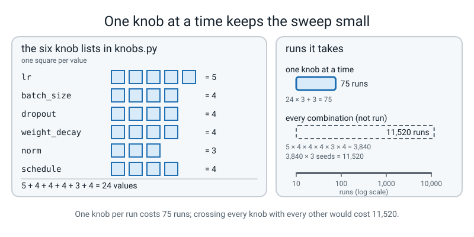
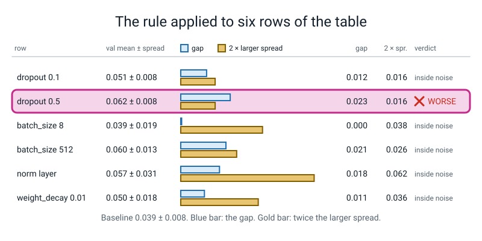

# Week 7 — Project: The Symptom-Check-Action Playbook

[⬅ Week 6](week-06.md) · [Course Home](../README.md) · [Week 8 ➡](week-08.md) · [Workbook](../workbook/week-07.md)

---

> ### This week in one sentence
> **A difference only counts if it is bigger than the wobble you get for free.**
>
> **By the end of this chapter you will be able to:**
> - **Write a sweep** with `itertools.product` that runs every value of one knob under three seeds, changing exactly one knob per run
> - **Print a table of mean ± spread** for six knobs and say, row by row, whether the gap from the baseline is bigger than twice the spread
> - **Read a loss-curve snapshot** and pick a cheap check that would tell two look-alike curves apart
> - **Write a playbook** of SYMPTOM → CHECK → ACTION rules, each backed by a number from your own table
>
> **New maths:** **none.** You use mean and spread over repeats (Level 3) and plain counting.
>
> **New syntax:** `itertools.product` (one construct)
>
> **Reading time:** about 30 minutes. **In class:** about 70 minutes. **Homework (the write-up):** about 60-75 minutes.

> **📌 About the code blocks.** This week you build a small working folder of files that import each other. Each file is shown whole, with its name in the first line. Type them into **one folder, next to `l4lib/`**, and run every command from that folder. Every output shown was printed by a real run on a CPU with seeds set, and your numbers should match to every digit shown. The exceptions are the lines that report **seconds**, which depend on your machine. Blocks marked **DELIBERATE MISTAKE** are broken on purpose. Nothing this week needs the internet, and there is no language model and no stand-in anywhere: the network is real PyTorch on your CPU.

---


*Figure 7.0 — Week 7 is the project that closes the stretch on training on purpose: the sweep, the table and the playbook.*

## 🪝 Start Here

For six weeks you turned six knobs, one at a time: learning rate, batch size, dropout, weight decay, normalisation, schedule. Each time you ran **one** run, looked at **one** number and drew a conclusion.

Today you find out which of those conclusions survive a repeat.

**Before you open the laptop**, take workbook page 7.1 (the prediction card). For each of the six knobs it asks: *on the spirals, at 60 epochs, which values will be worse than the baseline, which better, and which about the same?* It also asks which knob matters most. Answer in pen. **There is no wrong answer today.** The card is kept face-down and you score it later.

Three words to keep in mind as you work:

- The **baseline** is the run with every knob at its default. Every other run is judged as a difference from it.
- A **seed** picks the random starting weights and the order of the mini-batches. It does not change the data.
- A **sweep** is a set of runs that walks one knob through a list of values.

---

## 🧠 The Big Idea

This section shows that the same code gives different results under different seeds, then builds the rule and the tools you need to tell a real difference from noise.

### 1. The same code, three seeds

Here is the baseline, run three times. The code is identical. The data is identical. The learning rate is identical. **Only the seed changes.**

First we need the files that hold the baseline. You will meet every line of them below, so for now type this exactly as the first file of the week.

**File 1 — `knobs.py`** (no training happens here)

```python
# knobs.py - the baseline, the six knob lists, and three small helpers. No training happens here.
import torch

torch.set_num_threads(1)
from l4lib.spirals import run

SEEDS = [0, 1, 2]
EPOCHS = 60                 # on a slow laptop use 30 - see the guide

BASE = {"lr": 3e-3, "batch_size": 64, "dropout": 0.0, "weight_decay": 0.0,
        "norm": "none", "schedule": "none", "warmup_frac": 0.0}

KNOBS = {
    "baseline":     ["defaults"],
    "lr":           [1e-5, 1e-4, 1e-3, 1e-2, 1e-1],
    "batch_size":   [8, 32, 128, 512],
    "dropout":      [0.0, 0.1, 0.3, 0.5],
    "weight_decay": [0.0, 0.01, 0.1, 1.0],
    "norm":         ["none", "batch", "layer"],
    "schedule":     ["none", "cosine", "cosine+warmup", "step"],
}


def copy_of(d):
    """A real copy: a new dict holding the same entries."""
    c = {}
    for k in d:
        c[k] = d[k]
    return c


FROZEN = copy_of(BASE)      # a second copy, so we can prove BASE was never touched


def settings(knob, value):
    """A COPY of BASE with exactly one knob changed."""
    s = copy_of(BASE)
    if knob == "baseline":
        return s
    if knob == "schedule" and value == "cosine+warmup":
        s["schedule"] = "cosine"         # one named value of the schedule knob,
        s["warmup_frac"] = 0.05          # which happens to need two settings
    else:
        s[knob] = value
    return s


def how_many_knobs_changed(s):
    """Count the knobs that differ from BASE. A legal run has 0 or 1."""
    n = 0
    for k in s:
        if s[k] != BASE[k] and k != "warmup_frac":      # warmup rides along with schedule
            n = n + 1
    return n


def train_one(s, seed):
    """One run from a settings dict. Returns the history dict."""
    return run("", seed=seed, epochs=EPOCHS, verbose=False,
               lr=s["lr"], batch_size=s["batch_size"], dropout=s["dropout"],
               weight_decay=s["weight_decay"], norm=s["norm"],
               schedule=s["schedule"], warmup_frac=s["warmup_frac"])
```

A few things to notice as you type, not to memorise:

- `torch.set_num_threads(1)` is from Week 1: one thread, so the digits in this book match the digits on your screen.
- `BASE` is the baseline: the settings every run starts from.
- `KNOBS` is a dictionary from a knob's name to the list of values we will try. Count the values: 5, 4, 4, 4, 3 and 4.
- `cosine+warmup` is one named value of the schedule knob that happens to need two settings (`schedule="cosine"` and `warmup_frac=0.05`). It is still one knob, the schedule.
- `copy_of` builds a **new** dictionary holding the same entries. The next section says why that matters.
- `how_many_knobs_changed` counts how many knobs differ from `BASE`. A legal run has 0 or 1. It is the program refusing to let you cheat on "one knob per run".
- `train_one` passes every setting to `run()` **by name**, on purpose, so nothing is hidden.

Now a tiny file, `hook.py`, that runs the baseline for three seeds. Type it, then run it:

```python
# hook.py - the same run three times. Only the seed changes.
from knobs import settings, train_one

s = settings("baseline", "defaults")
for seed in [0, 1, 2]:
    h = train_one(s, seed)
    print(f"seed {seed}: final validation loss {h['val'][-1]:.4f}")
```
```text
seed 0: final validation loss 0.0367
seed 1: final validation loss 0.0499
seed 2: final validation loss 0.0301
```

Look at the three numbers: same code, same data, same learning rate. The biggest of those numbers (0.0499) is about **66% bigger** than the smallest (0.0301).

> **✏️ Write in your Bug Log.** Suppose last term you had run seed 1 for dropout 0.3 and seed 2 for the baseline, and reported that dropout made things worse. Would that have been true? What would you really have been measuring?

That is the lesson of the week. When you compare two runs you are comparing their knobs **and** their seeds. To see the knob, you must first know how big the seed wobble is.

The size of the wobble is the **spread**: run the same experiment several times, and ask how far the results scatter around their mean. You met this in Level 3. This week the spread is computed with `std` and `ddof=0` (divide by 3), exactly as last year.


*Figure 7.1 — The seed alone moves the result: same code and data, and 0.0499 is about 66% bigger than 0.0301.*

### 2. The rule of the experiment

Four rules go on the wall:

1. **One knob changes per run.** Everything else is the baseline.
2. **Every configuration runs under three seeds: 0, 1, 2.** We report **mean ± spread**.
3. **A difference counts only if it is bigger than twice the spread.** This rule is a habit we chose, not a theorem. Spelled out:

```text
gap     = (mean validation loss of this row) - (mean validation loss of the baseline)
spread  = the larger of the two standard deviations (this row's, the baseline's)
verdict = "inside noise"        if |gap| < 2 x spread
          "WORSE" / "better"    otherwise
```

4. **No number, no rule.** Every line of your playbook cites a row of your own table.

**Worked by hand, before any code.** Two rows, with real numbers from the table you are about to make:

| Row | This row's val loss | Baseline's |
|---|---|---|
| dropout 0.3 | 0.043 ± 0.013 | 0.039 ± 0.008 |
| lr 1e-4 | 0.079 ± 0.012 | 0.039 ± 0.008 |

For each row, work out the gap, then twice the larger spread, then decide. (Workbook page 7.3 has room, and you will check yourself with code afterwards.)

> **What this rule does and does not say.** "Inside noise" does **not** mean "equal to the baseline". It means *with three seeds we could not show a difference*. Three seeds give a very rough spread. This is a screening habit that stops us fooling ourselves; the grown-up version of it needs ideas outside this course.


*Figure 7.2 — A difference counts only when the gap is longer than twice the larger spread.*

### 3. The symptom, the check, the action

A doctor sees a fever. "Fever" is the **symptom**. A cheap test, a swab, separates one cause from another. The **action** depends on the swab, not on the fever.

```text
SYMPTOM  ->  CHECK  ->  ACTION
what you     one cheap     one change,
SEE          thing to      and the
(a number)   look at       number that
                           backs it
```

Your checks are cheap too: print the learning rate, look at the loss in **epoch 0**, look at whether the loss is **still falling** at the end, print the gradient length. A list of these rules, each backed by a number you printed, is a **playbook**. Building one is today's project.

### 4. The one new construct: `itertools.product`

`itertools.product` builds every combination of several lists, which is what a sweep needs. Here is the smallest use of it:

```python
import itertools

pairs = list(itertools.product([1e-3, 1e-2], [0, 1, 2]))
```

Read it as: *"give me every way of picking one thing from the first list and one thing from the second."* Two learning rates times three seeds is six pairs. The **last list changes fastest**, like the seconds on a clock.

In a `for` loop it replaces two nested loops:

```python
for value, seed in itertools.product(values, SEEDS):
    ...
```

means exactly the same as

```python
for value in values:
    for seed in SEEDS:
        ...
```

**File 2 — `grid.py`** (what `product` does, and how big the grid we are *not* running would be). Predict first: how many pairs does `product([1e-3, 1e-2], SEEDS)` make?

```python
# grid.py - what itertools.product does, small first, then the size of the grid we are NOT running.
import itertools

from knobs import KNOBS, SEEDS

pairs = list(itertools.product([1e-3, 1e-2], SEEDS))
print(len(pairs), "pairs:")
for p in pairs:
    print("  ", p)

sizes = {}
total_values = 0
full = 1
for knob, values in KNOBS.items():
    if knob != "baseline":
        sizes[knob] = len(values)
        total_values = total_values + len(values)
        full = full * len(values)
print("values per knob:", sizes)
print("one knob at a time x 3 seeds:", total_values * len(SEEDS), "runs")
print("every combination of all six:", full, "configs x 3 seeds =", full * len(SEEDS), "runs")
```
```text
6 pairs:
   (0.001, 0)
   (0.001, 1)
   (0.001, 2)
   (0.01, 0)
   (0.01, 1)
   (0.01, 2)
values per knob: {'lr': 5, 'batch_size': 4, 'dropout': 4, 'weight_decay': 4, 'norm': 3, 'schedule': 4}
one knob at a time x 3 seeds: 72 runs
every combination of all six: 3840 configs x 3 seeds = 11520 runs
```

Look at the last two lines. Crossing every value of every knob with every other is **3,840 configurations**, or **11,520 runs** with three seeds. At about 0.4 seconds a run on a machine like the author's, that is about 77 minutes. (That time is arithmetic from the measured 30 seconds for 75 runs, **not** a run anyone did.) One knob at a time is **72 runs**.


*Figure 7.4 — One knob at a time is 75 runs; crossing every knob with every other would be 11,520.*

> **✏️ Bug Log.** Doing one knob at a time is cheap. What does it make us unable to see? Write your answer. It will go at the top of your playbook as a limitation.

### 5. Two traps, on purpose

`product(...)` does **not** give you a list. It gives you a **one-shot iterator**. Run both of these, each as its own file.

```python
# DELIBERATE MISTAKE 1: look at what product() hands back.
import itertools
from knobs import SEEDS

grid = itertools.product([1e-3, 1e-2], SEEDS)
print(len(grid))
```
```text
Traceback (most recent call last):
  File "/home/you/l4/bad1.py", line 6, in <module>
    print(len(grid))
TypeError: object of type 'itertools.product' has no len()
```

Your file path will differ. Read the last line: `len()` needs something that knows its own length, and `product` makes the combinations on demand, one at a time.

```python
# DELIBERATE MISTAKE 2: walk the same product twice.
import itertools
from knobs import SEEDS

grid = itertools.product([1e-3, 1e-2], SEEDS)
count = 0
for pair in grid:
    count = count + 1
print("first pass:", count)
count = 0
for pair in grid:
    count = count + 1
print("second pass:", count)
```
```text
first pass: 6
second pass: 0
```

There is **no error** this time. Nothing complains. Explain in your Bug Log, in one sentence, where the six pairs went, and what you would do to a `product` if you needed to walk it twice.

### 6. A copy is not a copy

Here is the other trap of the week. Predict what it prints before you run it.

```python
# DELIBERATE MISTAKE 3: s = BASE is not a copy.
import knobs
from knobs import BASE, FROZEN, train_one

def bad_settings(knob, value):
    s = BASE              # <-- look at this line
    s[knob] = value
    return s

for knob, value in [("lr", 1e-3), ("lr", 0.1), ("dropout", 0.1), ("norm", "layer")]:
    s = bad_settings(knob, value)
    h = train_one(s, 0)
    print(f"{knob:<8}{str(value):<8} val {h['val'][-1]:.3f}   lr actually used: {s['lr']}")
print("BASE now:  ", BASE)
print("FROZEN was:", FROZEN)
```
```text
lr      0.001    val 0.026   lr actually used: 0.001
lr      0.1      val 0.702   lr actually used: 0.1
dropout 0.1      val 0.707   lr actually used: 0.1
norm    layer    val 0.703   lr actually used: 0.1
BASE now:   {'lr': 0.1, 'batch_size': 64, 'dropout': 0.1, 'weight_decay': 0.0, 'norm': 'layer', 'schedule': 'none', 'warmup_frac': 0.0}
FROZEN was: {'lr': 0.003, 'batch_size': 64, 'dropout': 0.0, 'weight_decay': 0.0, 'norm': 'none', 'schedule': 'none', 'warmup_frac': 0.0}
```

No error, and every run finished. Look at the `lr actually used` column and at `BASE now`, then answer in your Bug Log:

1. What learning rate did the dropout row *really* use?
2. What would someone reading only the `val` column conclude about dropout and layer norm?
3. Why can't `how_many_knobs_changed(s)` catch this, given that it compares `s` with `BASE`?

This is why `knobs.py` has `copy_of` and keeps a second copy, `FROZEN`: `sweep.py` checks that `BASE` is still equal to it when it finishes. (`BASE.copy()` also makes a real copy. We wrote the loop so you can see what a copy is.)

---

## 💻 Try It Yourself

In this section you run the sweep, build the table and read four numbers off a curve. These are the evidence your playbook will cite.

### Step 1 — one row by hand

In a terminal, from your working folder:

```python
from knobs import settings, how_many_knobs_changed, train_one
s = settings("lr", 0.1)
print(how_many_knobs_changed(s))
print(round(train_one(s, 0)["val"][-1], 3))
```
```text
1
0.702
```

One knob changed. The final validation loss is 0.702. What number from Week 1 is that close to? What does it mean?

### Step 2 — the sweep

**File 3 — `sweep.py`.** Read the loop slowly: for each knob, for each (value, seed) pair, make the settings, check that at most one knob changed, train, record.

```python
# sweep.py - Week 7: one knob at a time, every value, three seeds.
# Run it from the folder that contains l4lib/ and knobs.py.
import itertools
import time

import pandas as pd

from knobs import BASE, FROZEN, KNOBS, SEEDS, settings, how_many_knobs_changed, train_one

t0 = time.perf_counter()
rows = []
for knob, values in KNOBS.items():
    for value, seed in itertools.product(values, SEEDS):
        s = settings(knob, value)
        if how_many_knobs_changed(s) > 1:
            print("ILLEGAL ROW, skipped:", knob, value)
        else:
            h = train_one(s, seed)
            rows.append({"knob": knob, "value": str(value), "seed": seed,
                         "train": h["train"][-1], "val": h["val"][-1], "acc": h["acc"][-1]})

if BASE != FROZEN:
    print("WARNING: BASE was modified during the sweep - every row after that is suspect")
df = pd.DataFrame(rows)
df.to_csv("sweep_rows.csv", index=False)
print(len(df), "runs,", round(time.perf_counter() - t0, 1), "seconds, saved sweep_rows.csv")
```

`time.perf_counter()` reads a clock in seconds, so the difference between two readings is how long the sweep took.

**Before you run it**, work out how many rows should come out. Then run `python3 sweep.py`. Your seconds will differ.

```text
75 runs, 30.3 seconds, saved sweep_rows.csv
```

The count is 24 values × 3 seeds, plus the baseline × 3 seeds; 24 is 5 + 4 + 4 + 4 + 3 + 4. Open `sweep_rows.csv`. It is one row per run. This is your evidence; everything from here is reading it.

### Step 3 — the table

**File 4 — `table.py`.** It reads the CSV, computes mean ± spread over three seeds for every row, and applies the twice-the-spread rule.

```python
# table.py - the sweep table: mean +/- spread over 3 seeds, and a verdict against the baseline.
import pandas as pd

df = pd.read_csv("sweep_rows.csv", dtype={"value": str})

base = df[df["knob"] == "baseline"]
b_mean = base["val"].mean()
b_sd = base["val"].std(ddof=0)          # ddof=0: divide by n, as in Level 3
print(f"BASELINE (all defaults, 3 seeds): val {b_mean:.3f} +/- {b_sd:.3f}\n")
print(f"{'knob':<13}{'value':<15}{'train':>14}{'val':>14}{'acc %':>13}   verdict")

for knob in df["knob"].unique():        # unique() keeps first-seen order
    if knob != "baseline":
        for value in df[df["knob"] == knob]["value"].unique():
            r = df[(df["knob"] == knob) & (df["value"] == value)]
            gap = r["val"].mean() - b_mean
            spread = max(r["val"].std(ddof=0), b_sd)
            if abs(gap) < 2 * spread:
                verdict = "inside noise"
            elif gap > 0:
                verdict = "WORSE"
            else:
                verdict = "better"
            print(f"{knob:<13}{value:<15}"
                  f"{r['train'].mean():>8.3f}+/-{r['train'].std(ddof=0):.3f}"
                  f"{r['val'].mean():>8.3f}+/-{r['val'].std(ddof=0):.3f}"
                  f"{r['acc'].mean()*100:>8.1f}+/-{r['acc'].std(ddof=0)*100:.1f}   {verdict}")
```

Before you run it, turn over your prediction card and look at it one more time. Run `python3 table.py`. `train` is the training loss at the end, `val` is the validation loss at the end, `acc %` is validation accuracy. All at 60 epochs, seeds 0, 1, 2.

```text
BASELINE (all defaults, 3 seeds): val 0.039 +/- 0.008

knob         value                   train           val        acc %   verdict
lr           1e-05             0.682+/-0.001   0.680+/-0.003    58.7+/-4.1   WORSE
lr           0.0001            0.100+/-0.017   0.079+/-0.012    96.9+/-0.9   WORSE
lr           0.001             0.011+/-0.005   0.033+/-0.006    99.3+/-0.1   inside noise
lr           0.01              0.010+/-0.004   0.096+/-0.033    98.7+/-0.5   inside noise
lr           0.1               0.694+/-0.001   0.696+/-0.004    49.0+/-2.9   WORSE
batch_size   8                 0.018+/-0.007   0.039+/-0.019    98.9+/-0.4   inside noise
batch_size   32                0.011+/-0.001   0.038+/-0.004    98.9+/-0.0   inside noise
batch_size   128               0.009+/-0.002   0.039+/-0.007    99.2+/-0.2   inside noise
batch_size   512               0.054+/-0.019   0.060+/-0.013    98.2+/-0.3   inside noise
dropout      0.0               0.007+/-0.001   0.039+/-0.008    99.0+/-0.1   inside noise
dropout      0.1               0.025+/-0.007   0.051+/-0.008    98.8+/-0.1   inside noise
dropout      0.3               0.028+/-0.004   0.043+/-0.013    99.1+/-0.3   inside noise
dropout      0.5               0.059+/-0.007   0.062+/-0.008    98.4+/-0.1   WORSE
weight_decay 0.0               0.007+/-0.001   0.039+/-0.008    99.0+/-0.1   inside noise
weight_decay 0.01              0.008+/-0.001   0.050+/-0.018    99.0+/-0.1   inside noise
weight_decay 0.1               0.010+/-0.001   0.051+/-0.018    99.1+/-0.3   inside noise
weight_decay 1.0               0.025+/-0.004   0.038+/-0.004    98.9+/-0.2   inside noise
norm         none              0.007+/-0.001   0.039+/-0.008    99.0+/-0.1   inside noise
norm         batch             0.085+/-0.023   0.024+/-0.005    99.4+/-0.0   inside noise
norm         layer             0.014+/-0.002   0.057+/-0.031    98.8+/-0.3   inside noise
schedule     none              0.007+/-0.001   0.039+/-0.008    99.0+/-0.1   inside noise
schedule     cosine            0.004+/-0.001   0.034+/-0.003    99.2+/-0.0   inside noise
schedule     cosine+warmup     0.005+/-0.002   0.035+/-0.007    99.1+/-0.1   inside noise
schedule     step              0.009+/-0.001   0.033+/-0.001    99.1+/-0.1   inside noise
```

Here are six of those rows with the rule worked out beside each, using the 3-decimal numbers above.


*Figure 7.5 — Of these six rows only dropout 0.5 has a gap longer than twice the larger spread.*

Now:

1. **Score your prediction card.** A tick or a cross per knob. No judgement: which of your guesses survived?
2. **Fill in the wall table** (or a page in your notebook): `knob | value | val mean ± spread | inside noise? | one-line note`.
3. **For any row you point at, answer three questions in order:** which row and how many seeds; is the gap bigger than twice the spread (compute it, do not eyeball it); and what would you say if someone told you that row was the baseline in disguise?

That last one is not a joke. Look at the four rows `dropout 0.0`, `weight_decay 0.0`, `norm none`, `schedule none`. They are the same experiment as the baseline. Check it:

**File 5 — `seeds.py`**

```python
# seeds.py - the three baseline runs, one per seed, and the four rows that are the baseline in disguise.
import pandas as pd

df = pd.read_csv("sweep_rows.csv", dtype={"value": str})
print(df[df["knob"] == "baseline"][["seed", "train", "val", "acc"]].round(4).to_string(index=False))
print()
disguised = df[((df["knob"] == "dropout") & (df["value"] == "0.0")) |
               ((df["knob"] == "weight_decay") & (df["value"] == "0.0")) |
               ((df["knob"] == "norm") & (df["value"] == "none")) |
               ((df["knob"] == "schedule") & (df["value"] == "none"))]
print("distinct val values among the 4 disguised rows, per seed (1 means identical):")
print(disguised.groupby("seed")["val"].nunique().to_string())
```
```text
 seed  train    val    acc
    0 0.0073 0.0367 0.9889
    1 0.0061 0.0499 0.9917
    2 0.0071 0.0301 0.9889

distinct val values among the 4 disguised rows, per seed (1 means identical):
seed
0    1
1    1
2    1
```

A `1` means all four disguised rows gave exactly the same number for that seed. So the wobble in your table is caused by the **seed**, not by the code being random.

### Step 4 — four numbers off a curve

The table gives final numbers. A curve gives more. **File 6 — `snap.py`** prints four numbers from each of five runs' training curves, plus the gradient length and the learning rate at the end.

```python
# snap.py - the CHECK column made concrete: four numbers off a curve, plus gradient size and lr.
from l4lib.spirals import run
from knobs import settings

CASES = [("healthy (defaults)", "baseline", "defaults"),
         ("lr = 1e-5", "lr", 1e-5),
         ("lr = 0.1", "lr", 0.1),
         ("batch_size = 512", "batch_size", 512),
         ("norm = batch", "norm", "batch")]

print(f"{'run':<20}{'train ep0':>10}{'ep10':>8}{'ep30':>8}{'ep59':>8}{'val ep59':>10}{'gnorm59':>9}{'lr59':>8}")
for tag, knob, value in CASES:
    s = settings(knob, value)
    h = run("", seed=0, verbose=False, lr=s["lr"], batch_size=s["batch_size"],
            norm=s["norm"])                                     # 60 epochs, seed 0
    t = h["train"]
    print(f"{tag:<20}{t[0]:>10.3f}{t[10]:>8.3f}{t[30]:>8.3f}{t[59]:>8.3f}"
          f"{h['val'][59]:>10.3f}{h['gnorm'][59]:>9.3f}{h['lr'][59]:>8.0e}")
```
```text
run                  train ep0    ep10    ep30    ep59  val ep59  gnorm59    lr59
healthy (defaults)       0.675   0.028   0.030   0.007     0.037    0.026   3e-03
lr = 1e-5                0.694   0.693   0.691   0.683     0.679    0.049   1e-05
lr = 0.1                12.786   0.612   0.698   0.693     0.702    0.025   1e-01
batch_size = 512         0.694   0.629   0.239   0.027     0.079    0.163   3e-03
norm = batch             0.423   0.187   0.065   0.117     0.019    1.111   3e-03
```

`gnorm59` is the gradient length on the last mini-batch of the last epoch, **one batch only**, so treat it as a rough size, not a precise reading. `ln 2` = 0.693 is the loss of a coin-flip two-class model, as in Week 1. The learning-rate column is `lr` at epoch 59, so a schedule would show up there.

For each of the five rows, write in your Bug Log:

- Which of the six shapes A to F (listed on workbook page 7.4; these letters are not the Week 1 learning-rate cards) does it most look like, and which number tells you?
- Two rows end at nearly the same final loss. Which cheap check separates them?
- One row has validation loss clearly **below** training loss (and one more, `lr = 1e-5`, is below it by a hair). Name one cheap check you would run before trusting that.

---

## 🎲 Your Turn — The Playbook Court

This section explains how your playbook rules are judged, so you know what each rule must contain.

You are the lawyer, and your rules are the cases. Whoever is judging (your teacher) asks three fixed questions of each rule:

1. **Which row, how many seeds, at how many epochs?**
2. **Is the gap bigger than twice the spread?**
3. **Did you check, or did you guess the cause?**

A rule that fails a question is not thrown out. It is sent back with the missing piece named. A rule with **no number** gets a red line through it.

**The playbook page.** Rule a page into four columns:

| SYMPTOM | CHECK | ACTION | EVIDENCE (row, seeds, epochs) |
|---|---|---|---|

**Rule format.** Use this frame if it helps:

> *When I see ___, I check ___, and if ___ I will ___. In my run, ___ gave ___ ± ___ and the baseline gave ___ ± ___, at 60 epochs, 3 seeds.*

**Rules of the court:**

- One line in each column, one cited row.
- If the cause is a guess, the CHECK column must say how to **test** the guess, and the SYMPTOM column must not state the cause as a fact.
- Everything is about *this network on the two spirals*: 840 training points, width 64, depth 4, AdamW. Nothing here says what dropout does on a language model. Say "on the spirals" every time.
- Every claim states its epoch budget. The learning-rate rows are AdamW rows.
- Seeds change the starting weights and the batch order, **not** the data. So your spread does not include "what if the spiral points had been different". The real wobble is probably bigger.

**In class: three rules** from your table and your `snap.py` rows, each surviving the three questions. Then stop. Polishing is homework.

Ideas for cases, if you are stuck: a curve that is flat from epoch 0; two different curves with the same final number; a run that is still falling when the epochs run out (think about how many update steps `840 // batch_size` × epochs gives); a validation loss below the training loss; a row with a big mean but a huge spread; and **one thing you expected that the table did not show**.

---

## 🔑 Wrap Up

These questions pull the week together. Answer them in your Bug Log before you start the homework.

1. Return to the prediction card. Which of your guesses surprised you most?
2. Last term dropout and weight decay were your tools against overfitting. Count how many of their eight rows beat the baseline in your table. If the answer is "none", is that because they do not work? Write what you can and cannot claim, in one sentence, with the words "on the spirals".
3. Why does the baseline row stay at the top of the table?

Then write this sentence in your Bug Log in your own handwriting:

> **"One change, three seeds, a spread, and a number in the sentence."**

**A look ahead.** Next week the network learns to read in order, one word at a time. The habit you built today carries into every table you make for the rest of the year.

---

## 📤 Homework

The write-up is your playbook, built only from numbers your own run printed.

1. **Finish the playbook.** At least **six** SYMPTOM → CHECK → ACTION rules. Each must have: a cited row (knob, value); the mean ± spread over three seeds; the baseline's mean ± spread; the epoch count; and a sentence saying whether the gap is bigger than twice the spread.
2. **At least one rule must be one where your data contradicted what you wrote on the prediction card**, and you must say so.
3. **Add a limitations line** to the top of the page: one knob at a time, three seeds, this dataset.
4. **Hand in** the printed output of `table.py` and the one-page playbook.
5. **Every number must have been printed by your own run in the last 24 hours.** Not your neighbour's, not this book's.
6. **Do not state a cause as a fact unless you ran a check for it.** Write "our guess" and say how you would test it.

**Optional.** Change `EPOCHS` in `knobs.py` to 30 (and change the CSV name in `sweep.py` and `table.py` so you keep both), re-run, and write down which verdicts changed. A claim without its epoch count is not a claim.

**Optional.** Plot the baseline's three-seed training curves with matplotlib and save the PNG in your own folder.

---

## 📖 Words from this week

| Word | Meaning |
|---|---|
| **sweep** | a set of runs that walks one knob through a list of values |
| **baseline** | the run with every knob at its default |
| **seed spread** | how far the same experiment scatters when only the seed changes |
| **inside noise** | the gap from the baseline is smaller than twice the spread (not shown to be different; not shown to be equal) |
| **symptom / check / action** | what you see / one cheap thing to look at / one change, backed by a number |
| **playbook** | your list of symptom-check-action rules, each citing a row of your own table |
| **`itertools.product`** | every combination of several lists, handed out one at a time |

---

[⬅ Week 6](week-06.md) · [Course Home](../README.md) · [Week 8 ➡](week-08.md) · [Workbook](../workbook/week-07.md)
