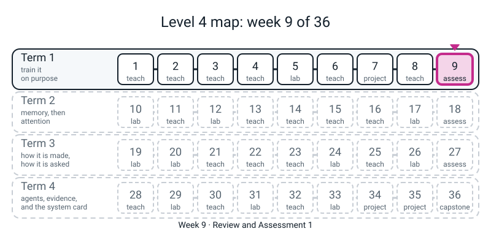
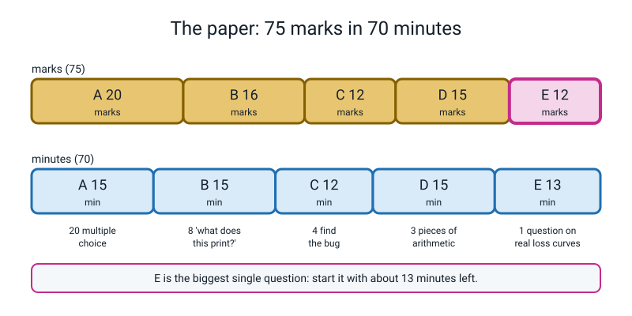
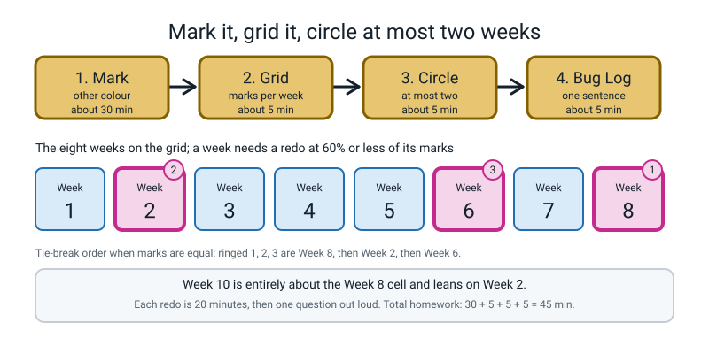

# Week 9 — Review and Assessment 1: What Did Eight Weeks Leave Behind?

[⬅ Week 8](week-08.md) · [Course Home](../README.md) · [Week 10 ➡](week-10.md) · [Workbook](../workbook/week-09.md)

---

> ### This week in one sentence
> **Today's paper is not a grade; it is an X-ray. It shows, week by week, what stuck and what did not, so you can redo the right page before Term 2 builds on it.**
>
> **By the end of this chapter you will be able to:**
> - **Read a loss curve** from a printed table and say what it is doing in one plain sentence, quoting a number
> - **Do an optimizer step by hand** (SGD, momentum, the first Adam step) and **name the norm that fails** at a batch of one
> - **Unroll a three-step recurrent cell** with a calculator and say why the order of the inputs matters
> - **Decide whether a gap is bigger than the spread**, using the twice-the-spread rule from Week 7
> - **Mark your own paper honestly**, fill in the per-week grid, and circle **at most two weeks** to redo
>
> **New maths:** **none.** **New syntax:** **none.** **New words:** **none.** Everything on the paper is something you have already done with your own hands.
>
> **Reading time:** about 20 minutes (the night before). **In class:** 75 minutes (70 for the paper). **Homework:** about 45 minutes of marking.

> **📌 About the code blocks.** There are only four small files this week, and they are for **before** the paper. Each is a whole file with its name in the first line. Type them into **one folder** and run them from there. Every output shown was printed by a real run on a CPU, with no randomness in any of them (no random weights, no seeds needed). They use **practice numbers that are not the paper's numbers**, so they check your method without handing you the answers. **You run no code during the paper.** Nothing this week needs the internet. There is no language model and no stand-in anywhere.

---


*Figure 9.0 — Week 9 is the first review: an X-ray of Weeks 1 to 8 before Term 2 builds on them.*

## 🪝 Start Here

You have spent eight weeks turning one knob at a time. Some of it is probably solid and some of it is probably soft. **You do not know which is which yet.** That is exactly what today finds out.

Three promises about the paper:

1. **It is on paper, with a calculator.** No computer, no notes, no internet.
2. **Every question is about something you did with your own hands.** There are no tricks and nothing from next term.
3. **"Don't know" is a good answer.** Write it. It tells you (and the grid) where to look. A lucky guess hides the problem; an honest "don't know" shows it.

Say this to yourself before you start: *"This is the X-ray, not the grade. Nobody is keeping score but me."*

---

## 🗺️ What is on the paper

The paper is **75 marks** and you get **70 minutes**.

| Section | What it asks | Marks | About how long |
|:--:|---|:--:|:--:|
| **A** | 20 multiple choice, circle one letter | 20 | 15 min |
| **B** | 8 "what does this print?" (you write the exact output) | 16 | 15 min |
| **C** | 4 "find the bug" (say what the bug is, what happens, write the fix) | 12 | 12 min |
| **D** | 3 pieces of arithmetic (show every line of working) | 15 | 15 min |
| **E** | 1 longer question about real loss curves | 12 | 13 min |

**Show your working** in B to E. A wrong number with the right working still earns most of the marks. A right number with no working earns fewer.

**Section E is the biggest single question** (12 marks) and the last one. Start it when you have about thirteen minutes left, not later.

**Your teacher will say only five things during the paper** (the time-checks), and will answer questions with one of three sentences: *"Read it again."* / *"Write what you do know."* / *"I can't help with that one, move on."* That is not unkindness; it is what keeps the X-ray clean.


*Figure 9.1 — The paper is 75 marks in 70 minutes, and Section E, the biggest question, needs its own 13 minutes.*

---

## 🧰 The night before: what to be able to do

Go down this list. For each line, ask: **could I do this right now with only a pen and a calculator?** Tick the ones you could. For any you could not, open the workbook page named and do it again, **for 20 minutes at most**. Do not try to learn everything the night before; just find out which lines are soft.

| Week | You should be able to... | Workbook pages to look at |
|:--:|---|---|
| 1 | Say what loss a two-class model has when it is guessing (and why). Tell what two runs did by comparing their **whole curves from epoch 1**, not their final losses. Use a keyword-only function. | 1.1, 1.3 |
| 2 | Take steps by hand with plain SGD and with **PyTorch's momentum** (`v = 0.9·v + g`, then move by `lr × v`). Say what a running average with 0.9 does and roughly how long it remembers. | 2.1, 2.8 |
| 3 | Compute a **root-mean-square** (square, average, root). Say what Adam's **first** step looks like and what AdamW changes. | Week 3 by-hand page |
| 4 | Say what a `LambdaLR` multiplier does after each `scheduler.step()`. Count optimizer steps from examples, batch size and epochs. | 4.3, 4.4 |
| 5 | Name the cure for overfitting that costs nothing. Say what a dropout layer does in eval mode. Say why a snapshot of the best weights needs `copy.deepcopy`. | Week 5 overfit-and-cure table |
| 6 | Say why batch norm leans on the other examples in a batch. Find the slope of `x + f(x)` by nudging. Say what `clip_grad_norm_` does and what it returns. | Week 6 by-hand page |
| 7 | Say whether a gap is bigger than twice the spread. Use `itertools.product` to list a grid. Write one row of the playbook: SYMPTOM → CHECK → ACTION. | 7.3, 7.4 |
| 8 | Say why a bag of words cannot tell two orders apart. Give the shapes of `x`, `out` and `h_n`. Unroll a cell by hand. | 8.3, 8.4 |

> **Do not** stay up late. A tired head does the arithmetic worse than a rested one, and one night cannot teach you what eight weeks did not.

---

## 🔥 Warm-ups (optional, 20 minutes, the night before)

These four files check the *method* of four of the by-hand ideas on **practice numbers that are not on the paper**. The rule is the one you use for the paper: **do it by hand first, write your answer down, then run the file.** If you run it first you learn nothing about yourself.

### Warm-up 1 — SGD and momentum by hand

On paper: `f(w) = w²`, so the gradient is `g = 2w`. Start at `w = 3.0`, `lr = 0.05`. Fill in **three** steps of plain SGD, and **three** steps of momentum (`v = 0.9·v + g`, with `v` starting at 0, then `w = w − 0.05·v`). Then run:

```python
# warm1.py - Week 9 warm-up 1: check your PRACTICE hand-arithmetic (not the paper's numbers).
# Practice problem: f(w) = w*w, gradient g = 2w. Start w = 3.0, lr = 0.05, three steps.
import torch

w_sgd = torch.tensor([3.0], requires_grad=True)
w_mom = torch.tensor([3.0], requires_grad=True)
sgd = torch.optim.SGD([w_sgd], lr=0.05)
mom = torch.optim.SGD([w_mom], lr=0.05, momentum=0.9)

for step in range(1, 4):
    for w, opt in [(w_sgd, sgd), (w_mom, mom)]:
        opt.zero_grad()
        (w * w).sum().backward()
        opt.step()
    print(step, round(w_sgd.item(), 4), round(w_mom.item(), 4))
```

```text
1 2.7 2.7
2 2.43 2.16
3 2.187 1.458
```

Each line is: step, SGD's `w`, momentum's `w`. Compare with your table. Did the two rows agree at step 1? Did they part at step 2? Write down in your Bug Log *why* before you check your answer in workbook page 2.1.

### Warm-up 2 — typical size and Adam's first step

On paper: the root-mean-square of `[5, -12]` (square, average, root). Then, with `lr = 0.02`, a weight at `1.0`, and a **first** gradient of `2.0`, where does Adam put the weight after one step? What if the first gradient is `2000.0`? Write your guesses. Then run:

```python
# warm2.py - Week 9 warm-up 2: typical size, and the first Adam step. Practice numbers only.
import torch

x = torch.tensor([5.0, -12.0])
print("rms of [5, -12]:", round(torch.sqrt((x * x).mean()).item(), 4))

for g in [2.0, 2000.0]:
    p = torch.tensor([1.0], requires_grad=True)
    opt = torch.optim.Adam([p], lr=0.02)
    (g * p).sum().backward()        # the gradient of g*p is exactly g
    opt.step()
    print("gradient", g, "-> moved by", round(1.0 - p.item(), 4))
```

```text
rms of [5, -12]: 9.1924
gradient 2.0 -> moved by 0.02
gradient 2000.0 -> moved by 0.02
```

If your guesses for the two gradients were different from each other, look again at the Week 3 chapter. What is the step divided by?

### Warm-up 3 — the cell, with different weights

On paper: `new note = tanh(2.0 × x + 0.5 × old note)`, start note `0`. This is **not** the cell from class (the first weight is 2.0, not 1.0). For the inputs `1, 0, 1` write the note after each step. Then for the inputs `1, 1, 0` write the last note. Then run:

```python
# warm3.py - Week 9 warm-up 3: a three-step cell with DIFFERENT weights from the ones in class.
# new note = tanh(2.0 * x + 0.5 * old note), start note 0.
import math

def final_note(xs):
    note = 0.0
    for x in xs:
        note = math.tanh(2.0 * x + 0.5 * note)
        print("  x =", x, " note =", round(note, 4))
    return note

print("order 1, 0, 1")
a = final_note([1, 0, 1])
print("order 1, 1, 0")
b = final_note([1, 1, 0])
print("same final note?", round(a, 4) == round(b, 4))
```

```text
order 1, 0, 1
  x = 1  note = 0.964
  x = 0  note = 0.4479
  x = 1  note = 0.9769
order 1, 1, 0
  x = 1  note = 0.964
  x = 1  note = 0.9861
  x = 0  note = 0.4566
same final note? False
```

(`math.tanh` is the same `tanh` you used in Level 3.) The inputs add up to 2 both times. What does the pair of final notes say about a bag of words?

### Warm-up 4 — is the gap bigger than the spread?

On paper: two sets of three validation losses, `[0.052, 0.061, 0.043]` and `[0.049, 0.040, 0.058]`. Write the two means, the gap, and your verdict. Remember Week 7's spread is the **larger of the two standard deviations**, each divided by `n`. Then run:

```python
# warm4.py - Week 9 warm-up 4: is a gap bigger than the spread? Practice numbers only.
import numpy as np

a = [0.052, 0.061, 0.043]
b = [0.049, 0.040, 0.058]
mean_a, mean_b = np.mean(a), np.mean(b)
spread = max(np.std(a), np.std(b))
gap = abs(mean_a - mean_b)
print("means", round(mean_a, 3), round(mean_b, 3))
print("gap", round(gap, 4), " twice the larger spread", round(2 * spread, 4))
print("bigger than noise?", gap > 2 * spread)
```

```text
means 0.052 0.049
gap 0.003  twice the larger spread 0.0147
bigger than noise? False
```

Remember what Week 7 said: this is a **screening rule we chose**, not a proper statistical test. It tells you when a gap is *obviously* inside the noise.

---

## 🎲 During the paper

A few habits, in order of how many marks they save.

1. **Do Section A first and fast.** It is 20 one-mark questions; do not spend five minutes on one of them. Circle your best guess and move on. A blank earns nothing.
2. **In Section B, work it out, don't "see" it.** Run the program in your head one line at a time and write each intermediate value beside the code. Rounding happens inside the code, so write the number exactly as the program would print it, including a trailing zero.
3. **In Section C, answer all three parts.** (i) what the bug is, (ii) what happens when it runs (an error, and what its last line means, or a wrong result), (iii) the fixed line. Each part is worth a share of the 3 marks.
4. **In Section D, write every line.** The marks are for the working. Four decimal places, as the paper says.
5. **In Section E, quote a number.** "It is bad" earns little. "The validation loss goes from 0.143 to 0.684 between two epochs" earns the mark. Name which curve you are describing; use the label (P, Q, R, S).
6. **If you finish early,** go back and check each answer against your own working, **starting from the end**. Do not leave, and do not start next week.
7. **If you get stuck,** write *"did not get it"* beside the question and go on. That is the most useful thing you can write.

> **If you feel panicky:** put the pen down, breathe for a minute, and say so. A calm minute costs a mark or two and gives them back.

---

## 📤 Homework: mark your own paper

You will be given the **marking sheet** (the short answers only) and a pen of a **different colour** from the one you used on the paper. Do this the same evening.

1. **Mark your paper in the other colour.** In A, B and C the answers are checkable, so be strict. In D and E, mark the **working**, not only the final answer: the sheet tells you how many marks each step earns. *(About 30 minutes.)*
2. **Fill in the per-week grid.** For each of the eight weeks, write the marks you earned, the marks available, and the percentage. The sheet tells you which questions belong to which week. *(About 5 minutes.)*
3. **Circle at most two weeks** in the remediation table below. Choose the **lowest percentages**. If there is a tie, go in this order: **Week 8, then Week 2, then Week 6** (those three are the ones Weeks 10 to 13 lean on directly). Write a day and a time for each redo next to the circle. *(About 5 minutes.)*
4. **One sentence in your Bug Log:** *"The answer I was most surprised to get wrong was ___, because I thought ___."* *(About 5 minutes.)*

**Why at most two?** Because a list of eight redos is a list nobody does. Two is a plan.

**A week needs a redo when you scored 60% or less of its marks.** The marking sheet says the exact number of marks for each week.

### The remediation table

Each redo is **20 minutes**, followed by your teacher asking you one question out loud (no paper) to check it landed.

| Week | Redo this (20 min) | Why Term 2 needs it |
|:--:|---|---|
| 1 | Workbook **page 1.3** (the coin, by hand) and the six-curve grid, **page 1.1** | Every Term 2 lab starts by reading a curve. |
| 2 | Workbook **page 2.1** (the hand table) and **page 2.8** (a second hand table with new numbers) | The running update returns as the gate in Week 11. |
| 3 | The Week 3 by-hand page: root-mean-square on a small list, then on a list 100 times bigger; Adam's first step for a small and a huge gradient | Adam is the default optimizer for every later lab. |
| 4 | Workbook **page 4.3** (the schedule by hand) and **page 4.4** (counting steps) | Every later comparison asks "what did I hold fixed?" |
| 5 | The Week 5 overfit-and-cure table: re-read the four cures, then redo the `copy.deepcopy` snapshot | Early stopping and `eval()` appear in every training script from now on. |
| 6 | The Week 6 by-hand page: the slope of `x + f(x)` by nudging, and batch norm at a batch of 2 | The residual highway is Week 11's gate. |
| 7 | Workbook **page 7.3** (is it noise?) and **page 7.4** (read four curves) | Every lab from here reports mean ± spread. |
| 8 | Workbook **page 8.3** (unroll the cell by hand) and **page 8.4** (shapes) | **Week 10 is entirely about this cell.** |

Bring to the next class: **the marked paper, the filled grid, and the circled table.** No new code. If you have already redone a page, lovely; nobody requires it.

> **A word on a low mark.** If the total is lower than you hoped, look at the *pattern*, not the number. One week with 30% and seven with 90% is a very different X-ray from eight weeks at 65%, and it is a much easier fix.
>
> **A word on things you wrote that are from later.** If you wrote "vanishing gradient" or "LSTM" in an answer because you have read ahead, that is not wrong and not extra; it is from next term. Your teacher will say so on the sheet.


*Figure 9.2 — Marks become a plan of at most two redos; if marks tie, Week 8 goes first, then Week 2, then Week 6.*

---

## 📖 What carries into next week

**Week 10 trains the cell from Week 8 for real** and measures what happens to the gradient at the *first* word as the sentence gets longer. The only new idea is **compounding**: a number multiplied by itself many times. It leans directly on three things from today's paper: the clean unroll (Week 8), the running update (Week 2), and the slope of `x + f(x)` (Week 6). **If your grid shows Week 8 or Week 2 under 60%, those are the two redos to do first.** Nothing else from Term 1 is on the critical path.

---

## 📖 Words from this week

There are none. No word is new today. If you met a word on the paper that you did not recognise, write it in your Bug Log with the question number: that is a finding for the grid.

---

[⬅ Week 8](week-08.md) · [Course Home](../README.md) · [Week 10 ➡](week-10.md) · [Workbook](../workbook/week-09.md)
