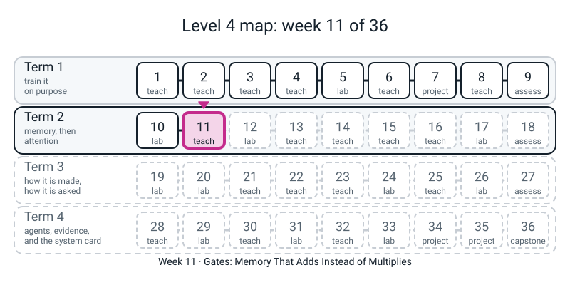
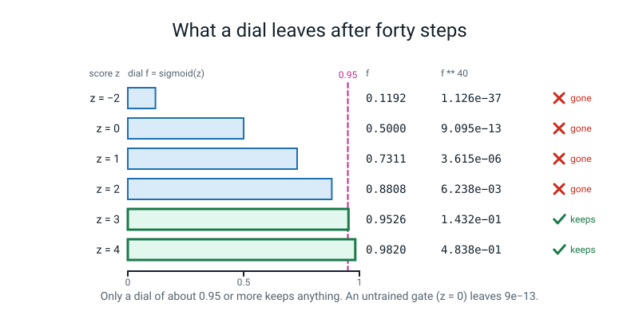
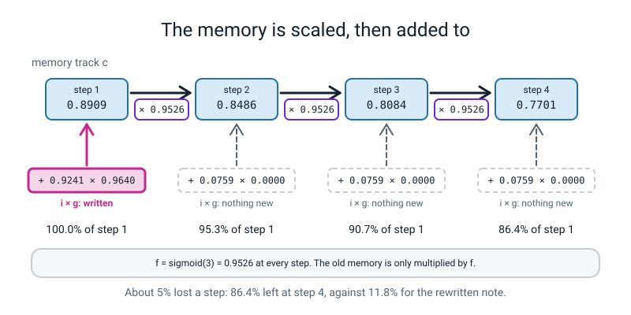
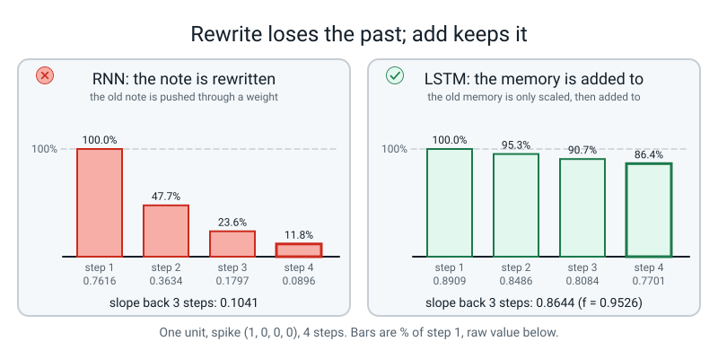
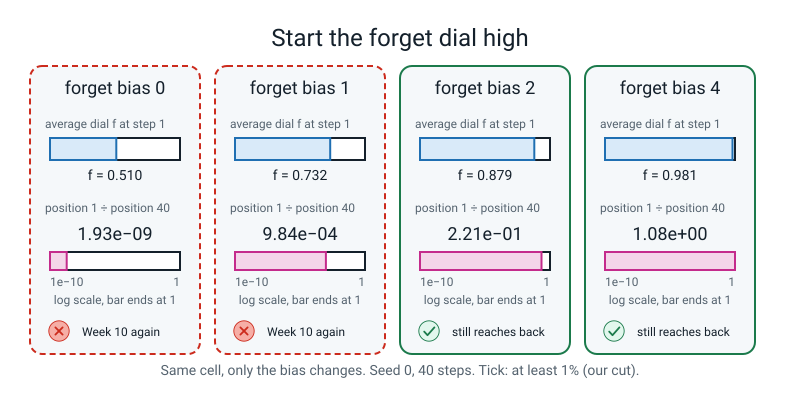

# Week 11 — Gates: Memory That Adds Instead of Multiplies

[⬅ Week 10](week-10.md) · [Course Home](../README.md) · [Week 12 ➡](week-12.md) · [Workbook](../workbook/week-11.md)

---

> ### This week in one sentence
> **An LSTM keeps a second track of memory and updates it by *adding*, so the slope back along that track is a single dial called the forget gate; a dial near 1 is Week 6's highway written as a loop, but the dial starts near one half, so it must be set, and setting it is not learning.**
>
> **By the end of this chapter you will be able to:**
> - **Say what a gate is**: a dial between 0 and 1, made by a sigmoid, that multiplies something
> - **Say why the memory track survives** when the note does not, in one sentence that uses the word "adds"
> - **Write one LSTM step** out of `@`, slices, `torch.sigmoid` and `torch.tanh`, and show it agrees with PyTorch's own `nn.LSTMCell`
> - **Measure** how much the end of a sequence cares about the first word for a plain RNN, a GRU and an LSTM, at four lengths and over three seeds, and read the table honestly
> - **Turn the forget dial** before any training, predict the direction, and say what it changed and what it did **not** show
>
> **New maths:** **none.** Three old ideas come back and are used, not re-taught: the sigmoid squasher (Level 3), compounding (Week 10) and the slope of a sum (Week 6).
>
> **New syntax:** `nn.LSTMCell` · `nn.LSTM` / `nn.GRU` · `tensor.fill_(x)` (in place, on a whole tensor and on a slice of a bias, under `no_grad`)
>
> **Reading time:** about 30 minutes. **In class:** about 70 minutes. **Homework (the workbook):** about 60-70 minutes.

> **📌 About the code blocks.**
> - Type the seven blocks below into **one file, `week11.py`**, one under the other with no gap, and run the file after adding each block. Later blocks use names defined by earlier ones.
> - The output under each block is what **that block** prints, from a real run on a CPU with the seeds shown.
> - The calculator numbers (`0.1432`, `0.4838`, `0.8644`) match to every digit. The very small numbers (like `2.05e-09`) can differ in their second digit on a different PyTorch version or CPU; their sizes, and the shape of every table, will not.
> - Blocks marked **DELIBERATE** are written on purpose to go wrong.
> - Nothing this week needs the internet, and nothing imports `l4lib`. There is no language model and no stand-in anywhere. Every cell and layer is **real PyTorch with untrained weights** (seeded random numbers), and the inputs are seeded random numbers too. **Nothing is trained today.** Week 12 is where a gated cell meets real text.

---


*Figure 11.0 — Week 11 gives the loop gates, so memory can be added to instead of rewritten.*

## 🪝 Start Here

Last week: forty people in a line, each passing on 95% of what they heard. You found what arrives: `0.95 ** 40` is about `0.13`.

New rule. **Every person has a KEEP dial from 0 to 1.** They keep that share of what they were told and pass it on. All forty people have the same dial.

**Your job: find the dial setting that leaves half of the message at the end.**

Write a guess on a card first: `0.9`? `0.95`? `0.99`? Then use your calculator (`dial ^ 40`) and home in. Try `0.9`, `0.95`, `0.99`, then try numbers between the two that are closest. When you have three decimal places, write it down.

Now the other way. **Suppose nobody sets the dial, and it starts in the middle: 0.5.** What arrives after forty people? Press `0.5 ^ 40`. You have seen that number before.

Words to keep in mind:

- A **gate** is a dial between 0 and 1 that multiplies something, to decide how much of it gets through.
- A **sigmoid** is the squasher from Level 3 that turns any number into a number between 0 and 1. Today it makes every dial.
- A **running average** (Week 2) was `average = keep * old + (1 - keep) * new`. Keep that line in your head.

---

## 🧠 The Big Idea

This section builds the LSTM one piece at a time: the dial, the add-not-rewrite rule, one unit by hand, the ready-made PyTorch cell, and the forget dial.

### 1. A dial is a squashed score

A network cannot have one dial fixed at `0.983` for ever, because sometimes it needs to forget. So the dial has to be a **number the network computes**. It takes a score, any number at all, and squashes it with the sigmoid into a dial setting between 0 and 1.

Type block 1 into `week11.py`. It shows six scores, the dial each one gives, and what that dial leaves after forty steps. Before you run it, guess one cell: what is `f ** 40` for the score `z = 3`?

**Block 1**

```python
# dial.py - Week 11: a gate is a dial between 0 and 1. The squasher (sigmoid) turns any score into a dial setting. No torch yet.
import math

def sigmoid(z):
    return 1 / (1 + math.exp(-z))

print("score z -> dial f = sigmoid(z) -> what f multiplied by itself 40 times leaves")
for z in [-2, 0, 1, 2, 3, 4]:
    f = sigmoid(z)
    print(f"  z = {z:2d}   f = {f:.4f}   f ** 40 = {f ** 40:.3e}")
```

```text
score z -> dial f = sigmoid(z) -> what f multiplied by itself 40 times leaves
  z = -2   f = 0.1192   f ** 40 = 1.126e-37
  z =  0   f = 0.5000   f ** 40 = 9.095e-13
  z =  1   f = 0.7311   f ** 40 = 3.615e-06
  z =  2   f = 0.8808   f ** 40 = 6.238e-03
  z =  3   f = 0.9526   f ** 40 = 1.432e-01
  z =  4   f = 0.9820   f ** 40 = 4.838e-01
```

Read the shape. A score of 0 gives a dial of exactly `0.5`, and an untrained gate has a score near 0. Forty halves leave `9e-13`: Week 10's number. The last column is the whole story: **only a dial of about 0.95 or more keeps anything.** Compare it with the number from your card in the Start Here. And the sigmoid only gets close to 1 for a *large positive* score.


*Figure 11.5 — Only a dial near 1 leaves a real share after forty multiplications; a dial of one half leaves 9e-13.*

### 2. Rewrite versus add

Last week's cell **rewrote** its note at every step: `note = tanh(W x + W note)`. The old note had to go through a weight and a `tanh` to get into the new one. That is the multiplication, and forty of them left nothing.

An LSTM keeps **two** things between steps, not one: the note `h`, and a second track `c` called the **memory** (or **cell state**). The memory is not rewritten. It is scaled, and then something is **added**:

```text
c = f * c_old + i * g
```

Four pieces, each made from the same input:

- `f` is the **forget gate**: how much of the old memory to keep.
- `i` is the **input gate**: how much of the new candidate to let in.
- `g` is the **candidate**: what *could* be written (made with `tanh`, so it can be negative).
- `o` is the **output gate**: how much of the memory to read out as the note `h`, with `h = o * tanh(c)`.

`f`, `i` and `o` come from a sigmoid; `g` comes from `tanh`. Four scores from the same input means four times the weights: an LSTM of this size holds **1408** numbers, against the plain RNN's 352. **More weights did nothing by themselves today**; you will see that in block 6.

Now the slope. In Week 6, `x + f(x)` had slope `1 + f'(x)`: the path through the `+` had slope exactly 1 before anything else was added. Here, the old memory `c_old` appears in only one place: multiplied by `f`. So the slope of the new memory with respect to the old memory is **`f`**.

> **Say it in one line:** *the slope back one step along the memory track is the forget dial, so a dial near 1 is Week 6's highway written as a loop, and a dial near one half is Week 10's disease all over again.*


*Figure 11.4 — Each step the memory is multiplied by the forget dial and a new part is added; at x = 0 nothing is added and the memory only shrinks by the dial.*


*Figure 11.1 — A memory that is scaled and added to keeps its past; a note that is rewritten at every step loses it.*

### 3. One LSTM unit, by hand

Here is one unit run for four steps on Week 8's spike (`1, 0, 0, 0`). The dials are **set by hand**: the forget dial is held at `sigmoid(3)`, the input dial is wide open for a 1 and nearly shut for a 0. Type block 2 under block 1.

**Block 2**

```python
# unit.py - Week 11: ONE LSTM unit by hand on Week 8's spike (1, 0, 0, 0). The dials are set by hand, as on the page.
f = sigmoid(3.0)                 # forget dial: stuck near "keep", whatever the input
o = sigmoid(1.0)                 # output dial
c = 0.0                          # the memory track starts empty
memory = []
print("step  x    i       g       c       h")
for t, x in enumerate([1, 0, 0, 0], start=1):
    i = sigmoid(5 * x - 2.5)     # input dial: wide open for a 1, nearly shut for a 0
    g = math.tanh(2 * x)         # the candidate: what COULD be written
    c = f * c + i * g            # THE line: keep some of the old memory, ADD some of the new
    h = o * math.tanh(c)
    memory.append(c)
    print(f"  {t}   {x}   {i:.4f}  {g:.4f}  {c:.4f}  {h:.4f}")

notes = [0.7616, 0.3634, 0.1797, 0.0896]          # Week 8's four notes (the RNN)
print("LSTM memory as % of step 1:", [round(100 * m / memory[0], 1) for m in memory])
print("RNN  note   as % of step 1:", [round(100 * n / notes[0], 1) for n in notes])
print("slope back through 3 steps of the memory track: f ** 3 =", round(f ** 3, 4), "   (the RNN's was 0.1041)")
print("slope back through 40 steps:                    f ** 40 =", round(f ** 40, 4))
```

```text
step  x    i       g       c       h
  1   1   0.9241  0.9640  0.8909  0.5204
  2   0   0.0759  0.0000  0.8486  0.5047
  3   0   0.0759  0.0000  0.8084  0.4889
  4   0   0.0759  0.0000  0.7701  0.4730
LSTM memory as % of step 1: [100.0, 95.3, 90.7, 86.4]
RNN  note   as % of step 1: [100.0, 47.7, 23.6, 11.8]
slope back through 3 steps of the memory track: f ** 3 = 0.8644    (the RNN's was 0.1041)
slope back through 40 steps:                    f ** 40 = 0.1432
```

Read the `c` column against Week 8's note column: the memory loses about 5% a step (`0.8909, 0.8486, 0.8084, 0.7701`), the note lost half (`0.7616, 0.3634, 0.1797, 0.0896`). The line `c = f * c + i * g` has **no `tanh` around the old `c`**: the old memory is only multiplied by `f`. At `x = 0` the input dial is small (`0.0759`) and the candidate is `0.0000`, so nothing new is written, and the memory just decays by `f`.

### 4. One LSTM step in PyTorch, checked

PyTorch has this step ready-made: **`nn.LSTMCell(D, H)`** is *one* LSTM step as an object, with `D` numbers in and `H` numbers of memory and of note. Its state is a **pair**: it goes in as `(h, c)` and comes out as `(h, c)`.

Its numbers come in four stacked groups of `H`, in the order **input, forget, candidate, output**. We will write the step out ourselves with `@` and slices, and then check it against the ready-made one. If we got the order wrong, the check would fail.

Before you run block 3, say the shapes aloud: `weight_ih` has `D = 4` columns and four groups of 16 rows. What is the number of rows?

**Block 3**

```python
# cell.py - Week 11: one LSTM step written out with @ and slices, checked against nn.LSTMCell.
import torch
import torch.nn as nn
torch.set_num_threads(1)

D, H = 4, 16
torch.manual_seed(0)
cell = nn.LSTMCell(D, H)         # ONE step of an LSTM: 4 numbers in, 16 numbers of memory and 16 of note
print("weight_ih:", tuple(cell.weight_ih.shape), "  weight_hh:", tuple(cell.weight_hh.shape), "  bias_ih:", tuple(cell.bias_ih.shape))

def lstm_step(cell, x, h, c):
    z = cell.weight_ih @ x + cell.bias_ih + cell.weight_hh @ h + cell.bias_hh    # 64 scores: four groups of 16
    i = torch.sigmoid(z[0:H])              # input dial   (first 16)
    f = torch.sigmoid(z[H:2 * H])          # forget dial  (second 16)
    g = torch.tanh(z[2 * H:3 * H])         # candidate    (third 16)
    o = torch.sigmoid(z[3 * H:4 * H])      # output dial  (last 16)
    c_new = f * c + i * g
    h_new = o * torch.tanh(c_new)
    return h_new, c_new, f

x = torch.randn(5, D)                      # five steps of input
mine_h, mine_c = torch.zeros(H), torch.zeros(H)
ref_h, ref_c = torch.zeros(H), torch.zeros(H)
for t in range(5):
    mine_h, mine_c, f = lstm_step(cell, x[t], mine_h, mine_c)
    ref_h, ref_c = cell(x[t], (ref_h, ref_c))              # the state goes in, and comes out, as a PAIR
    print(f"step {t + 1}: biggest gap in h = {(mine_h - ref_h).abs().max().item():.1e}   in c = {(mine_c - ref_c).abs().max().item():.1e}")
print("same answer:", torch.allclose(mine_h, ref_h), torch.allclose(mine_c, ref_c))
print("numbers in the cell:", sum([p.numel() for p in cell.parameters()]), "= 4 x (16x4 + 16x16 + 16 + 16)")
```

```text
weight_ih: (64, 4)   weight_hh: (64, 16)   bias_ih: (64,)
step 1: biggest gap in h = 0.0e+00   in c = 0.0e+00
step 2: biggest gap in h = 7.5e-09   in c = 1.5e-08
step 3: biggest gap in h = 3.7e-09   in c = 7.5e-09
step 4: biggest gap in h = 3.7e-09   in c = 7.5e-09
step 5: biggest gap in h = 1.5e-08   in c = 3.0e-08
same answer: True True
numbers in the cell: 1408 = 4 x (16x4 + 16x16 + 16 + 16)
```

`(64, 4)` is four groups of 16 scores for the 4-number input; `(64, 16)` is four groups for the 16-number note. The gaps are `0.0` at step 1 and at most `3.0e-08` later. That is not a bug: the two versions add the same numbers in a different order, and float32 has only about seven digits. `True True` says the two agree. The function returns `f` as well as `h` and `c`; the next block needs it.

### 5. The highway: the slope back **is** the forget dial

Now the claim from section 2, measured. We run the cell for 40 steps and ask the **memory** track how much the end cares about each step, using `retain_grad()` from Week 10, now on `c`.

To make the claim clean we first build a cell whose dials look **only at the input**, by setting every recurrent weight to zero. That needs the second new construct:

- **`tensor.fill_(x)`** overwrites every number in a tensor, in place. The trailing underscore means "change it where it stands" instead of returning a new tensor. On a tensor that PyTorch is tracking (a layer's knob), it must sit inside `with torch.no_grad():`, which you know from Level 3. Here it means "I am editing, not learning".

**Block 4**

```python
# highway.py - Week 11: run the cell for 40 steps and ask the MEMORY track how much the end cares about each step.
def run_lstm(cell, x):
    h, c = torch.zeros(H), torch.zeros(H)
    cs, fs = [], []
    for t in range(len(x)):
        h, c, f = lstm_step(cell, x[t], h, c)
        c.retain_grad()                    # Week 10's line, now on the memory track c
        cs.append(c)
        fs.append(f)
    h.sum().backward()                     # the "loss": add up the 16 numbers of the LAST h
    return cs, fs

torch.manual_seed(1)
x40 = torch.randn(40, D)

# First a cell whose dials look ONLY at the input: every recurrent weight is set to 0.
torch.manual_seed(0)
quiet = nn.LSTMCell(D, H)
with torch.no_grad():
    quiet.weight_hh.fill_(0.0)             # fill_ (new): overwrite every number in the tensor, in place
cs, fs = run_lstm(quiet, x40)
gaps = [(cs[p].grad / cs[p + 1].grad - fs[p + 1]).abs().max().item() for p in range(39)]
print("slope of step p+1 back to step p, minus the forget dial f: biggest gap over 39 steps =", f"{max(gaps):.1e}")
print("so with no recurrent weights, the slope back through the memory track IS f:")
print("   step 31 -> 30, first three units: slope", [round(v, 4) for v in (cs[29].grad / cs[30].grad)[:3].tolist()], " f", [round(v, 4) for v in fs[30][:3].tolist()])
g = [c.grad.norm().item() for c in cs]
for p in [40, 30, 20, 10, 1]:
    print(f"   position {p:2d}: {g[p - 1]:.2e}")
```

```text
slope of step p+1 back to step p, minus the forget dial f: biggest gap over 39 steps = 6.0e-08
so with no recurrent weights, the slope back through the memory track IS f:
   step 31 -> 30, first three units: slope [0.6677, 0.5753, 0.6577]  f [0.6677, 0.5753, 0.6577]
   position 40: 1.82e+00
   position 30: 3.16e-03
   position 20: 9.46e-06
   position 10: 2.97e-08
   position  1: 2.15e-10
```

The first printed line says that, for every one of the 39 steps, the slope back one step equals the forget dial, to about `6e-08`. **That is exact for this stripped-down cell.** In a real cell the dials also read the old note, and the old note was made from the old memory, so there are extra, smaller paths. We did not measure how much they add, so for a real cell say "the main path", not "exactly".

Then the honest part. That cell's dial is about one half (the first three units at step 31 were `0.6677, 0.5753, 0.6577`), so forty of them still leave `2.15e-10` at position 1 against `1.82` at position 40. **"The slope is `f`" and "`f` is about one half" are both true, and together they are Week 10 again.**

### 6. Turn the dial up

At the start of training the forget score is near 0, so the forget dial is near `0.5`. The fix is to start the forget score high. The forget scores are the **second group of 16** out of the 64, so we fill only that slice of the bias. `fill_` works on a slice too: `bias[16:32]` is a *view* of the same numbers, so filling it changes the bias itself.

A layer has **two** biases (`bias_ih` and `bias_hh`); their scores are added. We put the chosen number in the first and `0` in the second, so the two add up to the chosen number. That number is called the **forget bias**. It is ours: a setting we write in before any training, not something found in a trained model.

**Block 5**

```python
# dial.py - Week 11: turn the forget dial up BEFORE training. Only the forget group of the bias (the second 16 of 64) is touched.
def make_lstm_cell(forget_bias, seed=0):
    torch.manual_seed(seed)
    cell = nn.LSTMCell(D, H)
    with torch.no_grad():
        cell.bias_ih[H:2 * H].fill_(forget_bias)     # fill_ on a SLICE: 16 of the 64 bias numbers
        cell.bias_hh[H:2 * H].fill_(0.0)             # the layer has two biases; zero the other one's forget group
    return cell

print("forget bias | average f at step 1 | memory-track gradient at positions 40, 20, 1 | position 1 / position 40")
for fb in [0.0, 1.0, 2.0, 4.0]:
    cs, fs = run_lstm(make_lstm_cell(fb), x40)
    g = [c.grad.norm().item() for c in cs]
    print(f"   {fb:3.1f}      |       {fs[0].mean().item():.3f}         |   {g[39]:.2e}   {g[19]:.2e}   {g[0]:.2e}   |   {g[0] / g[39]:.2e}")
```

```text
forget bias | average f at step 1 | memory-track gradient at positions 40, 20, 1 | position 1 / position 40
   0.0      |       0.510         |   1.83e+00   6.89e-05   3.52e-09   |   1.93e-09
   1.0      |       0.732         |   1.74e+00   3.20e-02   1.71e-03   |   9.84e-04
   2.0      |       0.879         |   1.43e+00   3.26e-01   3.16e-01   |   2.21e-01
   4.0      |       0.981         |   5.59e-01   3.20e-01   6.05e-01   |   1.08e+00
```

Same cell, same weights, **one number different** in the bias. At forget bias 0 the dial is about `0.51` and position 1 keeps `1.9e-09` of position 40: Week 10's disease. At 2 the dial is `0.879` and position 1 keeps `0.22`. At 4 the dial is `0.981` and the ratio is `1.08`. (A ratio above 1 means that for this one random input, the first step mattered slightly more than the last. We did not look into why; it is not a bug.) Note that `make_lstm_cell` with bias `0.0` is not identical to block 4's default cell, whose biases are small random numbers.


*Figure 11.2 — One number in the bias, set before training, decides whether the first step can still reach the last.*

---

## 🎲 Your Turn

This section is for measuring: you predict a grid, run a plain RNN, a GRU and an LSTM, and compare your predictions with the printed numbers.

### The Dial Grid

Now the comparison the week is about: a plain RNN, a GRU and an LSTM, all run on the same kind of input.

**The GRU** has two dials instead of four. The one that matters is `z`, and in PyTorch it writes `new note = z * old note + (1 - z) * candidate`. Where have you seen that shape? Week 2: `average = keep * old + (1 - keep) * new`. A GRU is a running average whose keep-dial is chosen by the network at every step. (The LSTM's `f` and `i` are two separate dials that need **not** add to 1, so the LSTM is a looser cousin.)

**The three new names in one place:**

- **`nn.RNN`, `nn.GRU`, `nn.LSTM`** are the whole-sequence layers: they run the cell `T` times for you and hand back every note, like `nn.RNN` in Week 8. Give them a `(T, 4)` input and `out` has shape `(T, 16)`.
- `nn.RNN` and `nn.GRU` return `(out, h_n)`, with `h_n` one note. **`nn.LSTM` returns `(out, (h_n, c_n))`: its second answer is itself a pair.**

**Do this before you run block 6.** Open workbook page 11.4. It has a grid: four rows (rnn, gru, lstm, lstm with forget bias 2), four columns (`T` = 10, 20, 40, 80). Each cell is going to hold "how much the last output cares about the first word, as a fraction of how much it cares about the last word". **Before you run anything, put one letter in each of the 16 cells:**

- **T** (tiny): below `1e-6`
- **S** (small): `1e-6` up to `1e-2`
- **L** (level): above `1e-2`

Use one pen colour for predictions and another for measurements. The score is not the point; the *pattern* of your misses is. (The cut-offs are ours, not nature's.)

**Block 6**

```python
# layers.py - Week 11: the whole-sequence layers. nn.RNN, nn.GRU and nn.LSTM take the same input and give the same first answer.
def make_layer(kind, seed=0, forget_bias=None):
    torch.manual_seed(seed)
    layer = {"rnn": nn.RNN, "gru": nn.GRU, "lstm": nn.LSTM}[kind](D, H)
    if forget_bias is not None:              # only meaningful for the LSTM (see block 7)
        with torch.no_grad():
            layer.bias_ih_l0[H:2 * H].fill_(forget_bias)
            layer.bias_hh_l0[H:2 * H].fill_(0.0)
    return layer

for kind in ["rnn", "gru", "lstm"]:
    layer = make_layer(kind)
    out, last = layer(torch.randn(5, D))     # five steps in
    size = sum([p.numel() for p in layer.parameters()])
    print(f"{kind:4s}: numbers {size:5d}   out {tuple(out.shape)}")
out, h_n = make_layer("gru")(torch.randn(5, D))
print("the GRU's second answer is ONE note, h_n:", tuple(h_n.shape))
out, last = make_layer("lstm")(torch.randn(5, D))
h_n, c_n = last                              # the LSTM's second answer is a PAIR: the note AND the memory track
print("the LSTM's second answer is a pair: h_n", tuple(h_n.shape), " c_n", tuple(c_n.shape))

def reach(layer, T, seed=0):
    torch.manual_seed(100 + seed)
    x = torch.randn(T, D, requires_grad=True)        # the words themselves are tracked, so x.grad will exist
    out, last = layer(x)
    out[-1].sum().backward()                         # the "loss": the 16 numbers of the LAST output
    return [row.norm().item() for row in x.grad]     # how much the end cares about the word at each position

print("pull of the FIRST word as a fraction of the pull of the LAST (seed 0):")
print("kind          |     T=10      T=20      T=40      T=80")
for kind in ["rnn", "gru", "lstm"]:
    row = []
    for T in [10, 20, 40, 80]:
        sizes = reach(make_layer(kind), T)
        row.append(sizes[0] / sizes[-1])
    print(f"{kind:13s} |" + "".join(f"  {v:8.2e}" for v in row))
```

```text
rnn : numbers   352   out (5, 16)
gru : numbers  1056   out (5, 16)
lstm: numbers  1408   out (5, 16)
the GRU's second answer is ONE note, h_n: (1, 16)
the LSTM's second answer is a pair: h_n (1, 16)  c_n (1, 16)
pull of the FIRST word as a fraction of the pull of the LAST (seed 0):
kind          |     T=10      T=20      T=40      T=80
rnn           |  6.72e-03  1.77e-05  1.99e-10  6.48e-20
gru           |  2.84e-02  1.49e-04  1.36e-08  6.71e-18
lstm          |  7.65e-03  2.53e-04  2.05e-09  6.64e-16
```

Copy each measured number **in full, exponent included**: `2.05e-09` is `0.00000000205`, and a dropped exponent changes the answer by a factor of a billion. Colour in which predictions were right.

`352, 1056, 1408` is `1x, 3x, 4x`: one group of scores for each dial. Read the table one row at a time. **All three fall by the same kind of amount; between `T = 20` and `T = 40` each loses a factor of roughly 10,000 to 120,000.** At default settings, gates alone did not open the highway. (We divide by the last word's pull because that pull is different for each layer; the ratio puts the three on one scale. That is a choice we made.) The `reach` probe measures the gradient on the *word*, one step earlier than Week 10's gradient on the *note*, so these numbers are the same disease measured a step earlier, **not the same numbers** as page 10.4.

### Three seeds, and the dial

One seed could be luck. Block 7 runs five rows at `T = 40` over seeds 0, 1 and 2, and then the forget dial at four lengths. The `forget_bias` only applies to the LSTM.

**Block 7**

```python
# compare.py - Week 11: three seeds, and the forget dial. Same recipe as block 6, one seed at a time.
def ratio(kind, T, seed, forget_bias=None):
    sizes = reach(make_layer(kind, seed, forget_bias), T, seed)
    return sizes[0] / sizes[-1]

print("T = 40, first word / last word, seeds 0, 1, 2:")
for label, kind, fb in [("rnn", "rnn", None), ("gru", "gru", None), ("lstm", "lstm", None), ("lstm, forget bias 0", "lstm", 0.0), ("lstm, forget bias 2", "lstm", 2.0)]:
    print(f"  {label:20s}", [f"{ratio(kind, 40, seed, fb):.1e}" for seed in range(3)])

print("the forget dial, seed 0 (sigmoid of the bias in brackets):")
print("forget bias |     T=10      T=20      T=40      T=80")
for fb in [0.0, 1.0, 2.0, 4.0]:
    row = [ratio("lstm", T, 0, fb) for T in [10, 20, 40, 80]]
    print(f"  {fb:3.1f} ({sigmoid(fb):.3f}) |" + "".join(f"  {v:8.2e}" for v in row))
```

```text
T = 40, first word / last word, seeds 0, 1, 2:
  rnn                  ['2.0e-10', '6.3e-11', '3.1e-10']
  gru                  ['1.4e-08', '1.5e-09', '8.9e-10']
  lstm                 ['2.0e-09', '7.1e-08', '6.8e-09']
  lstm, forget bias 0  ['9.8e-10', '4.3e-09', '4.2e-09']
  lstm, forget bias 2  ['5.8e-02', '1.3e-01', '2.2e-01']
the forget dial, seed 0 (sigmoid of the bias in brackets):
forget bias |     T=10      T=20      T=40      T=80
  0.0 (0.500) |  7.20e-03  4.86e-05  9.83e-10  3.92e-17
  1.0 (0.731) |  1.07e-01  2.95e-02  3.52e-04  1.44e-06
  2.0 (0.881) |  3.54e-01  3.10e-01  5.77e-02  3.37e-02
  4.0 (0.982) |  7.23e-01  8.46e-01  3.52e-01  1.61e-01
```

Read the first five lines. The last two rows (`lstm, forget bias 0` against `lstm, forget bias 2`) are the same layer and the same seeds, with **one number different in the bias**, and they are **about eight orders of magnitude apart** (bias 2 is roughly sixty million times bias 0). Inside any one row, the seeds differ by a factor of only 4 to 35. Three seeds are enough to see that the dial matters far more than the seed; they are **not** enough to say which of RNN, GRU and LSTM is best at default settings.

Now the second table. Bias 0 falls at the same rate as the RNN. Bias 1 falls, more slowly. Bias 2 and 4 stay within a factor of about 30 (bias 2) or 6 (bias 4) of the last word's pull all the way to `T = 80`. **The dial does not stop the fall; it slows it from "a factor of 10,000 or more every twenty steps" to "a factor of a few".**

Fill in the fourth row of page 11.4 from the bias-2 line of the second table.

### The question that makes the activity

We set the forget bias by hand. **Did anything learn?**

Write your answer before you read on.

> No. Nothing was trained; we only looked at the *starting point* of untrained layers on random numbers, with a toy "loss" (the sum of the last output). A real model has a loss at every position. The bias is a number we wrote in; it is not something a trained model found.

If a bias of 2 is good, is 10 better? On a calculator `sigmoid(10)` is `0.99995`. The memory would almost never forget, so it would also almost never clear old things. Block 7 already shows bias 4 at a ratio near 1. We did not test bias 10, so we do not know what it does; you may try it (see Homework).

---

## 🔬 Break It On Purpose

This section is for reading two real error messages, so you can recognise them when they happen by accident.

Two blocks, both **DELIBERATE**. Add each below block 7 in a scratch copy of `week11.py`. Predict what each will do before you run it.

**1. The state is a pair.** `nn.LSTMCell` opens its state as `(h, c)`. What happens if it is handed only `h`?

```python
# DELIBERATE MISTAKE 1: the LSTM's state is a PAIR (h, c). Only h was handed over.
cell = make_lstm_cell(2.0)
h = torch.zeros(H)
h = cell(x40[0], h)
```

```text
Traceback (most recent call last):
  File "/home/you/l4/bad1.py", line 4, in <module>
    h = cell(x40[0], h)
  ... frames inside torch (elided) ...
ValueError: LSTMCell: Expected hx[0] to be 1D or 2D, got 0D instead
```

(Your file name and line numbers will differ, and the long middle of a torch traceback is replaced here by one line. The last line is the real, complete last line.) Read the last line, slowly. `hx[0]` is the first thing in the state. What was it, and what did the cell expect? Fix it so a 16-number note **and** a 16-number memory go in and come out, and write the fix in your Bug Log.

**2. `fill_` on a knob PyTorch is tracking.**

```python
# DELIBERATE MISTAKE 2: fill_ on a parameter without no_grad. PyTorch refuses to change a tracked knob behind its back.
lstm = nn.LSTM(D, H)
lstm.bias_ih_l0[H:2 * H].fill_(2.0)
```

```text
Traceback (most recent call last):
  File "/home/you/l4/bad3.py", line 3, in <module>
    lstm.bias_ih_l0[H:2 * H].fill_(2.0)
RuntimeError: a view of a leaf Variable that requires grad is being used in an in-place operation.
```

Read the last line. Which word says what the slice is? Compare with blocks 4 and 5, which did the same `fill_` without an error. What is the one line of difference? Fix it, and say in your own words what "I am editing, not learning" means.

---

## 🔑 Wrap Up

This section is for checking, in your own words, what you can and cannot claim from today's measurements.

1. Say from memory, in your own words: (1) what the LSTM adds that the plain RNN does not have, (2) what the forget dial does to the slope back, (3) why the LSTM at default settings is not better than the RNN.
2. "The LSTM has four of everything, so it remembers more." What is wrong with that, and which two rows of block 7 answer it?
3. "A gate decides what is important." Nothing is trained today. What can you honestly say a gate *does*? (Hint: it is one word.)
4. At `T = 80` the forget-bias-2 row still shows a healthy `3.4e-02`. Does that mean a layer with that bias could *learn* to remember the first word at `T = 80`? Write what you can claim from a number measured at the start, and what you cannot.

**What we did not do.** We looked at untrained layers, on random numbers, with a toy loss. We did not train anything, and we did not show that any of these remembers anything in a real sentence. And none of this is a result about language models. The dial does not stop the fall for ever either: `0.95 ** 400` is about `1.2e-09`, so even a well-set dial runs out at hundreds of steps. Week 12 trains an LSTM for real on 231 names.

Then write this sentence in your Bug Log in your own handwriting:

> **"An LSTM has a highway; whether the highway is open at the start depends on where the dial is set, and setting it is not learning."**

---

## 📤 Homework

Complete workbook pages 11.1 to 11.6 in order, and **write predictions before running anything**. Every number in your write-up must have been printed by your own run in the last 24 hours (or your own calculator), with the seed stated.

**Optional.** Set the forget bias to 10 and run `ratio("lstm", 80, 0, 10.0)` in `week11.py`. What is `sigmoid(10)` on the calculator? Write a guess about the ratio first, and report what you measure. We did not run it for you.

---

## 📖 What carries into next week

Week 12 puts an LSTM to work on something real: **231 names**, learned letter by letter, so it can invent new ones. Bring the completed grid from page 11.4 and your sentence from the Wrap Up. Nothing from today is trained yet.

---

## 📖 Words from this week

| Word | Meaning |
|---|---|
| **gate** | a dial between 0 and 1 (made by a sigmoid) that multiplies something to decide how much of it gets through |
| **cell state** / **memory track** (`c`) | the second thing an LSTM keeps between steps; updated by adding, `c = f * c_old + i * g` |
| **forget gate** (`f`) | the dial on the old memory; the slope back along the memory track is `f` |
| **input gate** (`i`) | the dial on the new candidate |
| **output gate** (`o`) | the dial on how much of the memory is read out as the note |
| **candidate** (`g`) | what *could* be written to the memory; made with `tanh` |
| **GRU** | a cell with two dials; its update dial `z` makes a running average whose keep-share the network chooses |
| **forget bias** | the number written into the forget scores before any training; it sets where the forget dial starts |
| **sigmoid** | (from Level 3) the squasher to between 0 and 1 |
| **vanishing gradient** | (from Week 6) slopes below 1 multiply to almost nothing |

---

[⬅ Week 10](week-10.md) · [Course Home](../README.md) · [Week 12 ➡](week-12.md) · [Workbook](../workbook/week-11.md)
