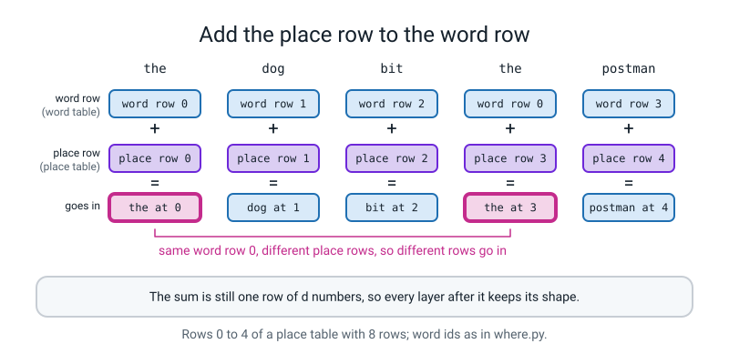
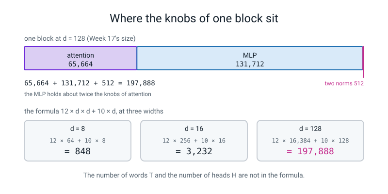

# Week 16 — Where Am I? Positions and the Transformer Block

[⬅ Week 15](week-15.md) · [Course Home](../README.md) · [Week 17 ➡](week-17.md) · [Workbook](../workbook/week-16.md)

---


*Figure 16.0 — Week 16 of 36, the position and block week, sits in term 2 (memory, then attention); weeks 1 to 15 are done and weeks 17 to 36 are still ahead.*

> ### This week in one sentence
> **Attention looks at all the words at once and cannot tell where any of them sits, so we add a "place vector" to every word; then attention plus a small per-word network, each wrapped in a residual add and a layer norm, make one *block*, and a GPT is a stack of blocks.**
>
> **By the end of this chapter you will be able to:**
> - **Show that attention without places cannot tell order**: shuffle the words, attend, and get the same rows, shuffled the same way
> - **Add places and show the blindness go away**, and say what shape `torch.arange(T)` has and why the place table needs one row per place
> - **Name the parts of one block in order** and say what each is for in one sentence
> - **Count the knobs of one block by hand** (width 8, 2 heads) and check the count against PyTorch
> - **Say what `register_buffer` and `nn.ModuleList` are for**
>
> **New maths:** **none.** The only arithmetic is softmax on three numbers (Level 3 Week 13) and *counting* (multiplying and adding).
>
> **New syntax:** `nn.ModuleList` · `register_buffer` · `torch.arange`
>
> **Reading time:** about 35 minutes. **In class:** about 70 minutes. **Homework (the workbook):** about 60-75 minutes.

> **📌 About the code blocks.** Each block is a whole file, with its name in the first line. Type the files into **one folder, next to `l4lib/`**, and run them from that folder. Every output shown was printed by a real run on a CPU with seeds set. The random numbers (from `torch.manual_seed(0)`) may differ on a different PyTorch version; the `True`/`False` lines, the **shapes** and the **counts** will not. **Nothing is trained this week.** Every weight is a seeded random number, or a number we type in, so a result here says what the machinery *can or cannot do before it learns*, never what a network "understands". Blocks marked **DELIBERATE** are written on purpose to go wrong. Nothing this week needs the internet. There is no language model and no stand-in anywhere.

---

## 🪝 Start Here

In Week 8 you met two sentences that a bag of words cannot tell apart:

```text
the dog bit the postman
the postman bit the dog
```

A recurrent cell could tell them apart, because it read the words in order. Since Week 14 you have a different reader: **attention**, which looks at *every* word in one go. Here is a question to argue about before you type anything:

> *Does attention do better than a bag of words at telling these two sentences apart?*

Most people say yes, because "it sees everything". Write your guess on a card. Then write three more guesses, for `blind.py` below:

1. In "the dog bit the postman", will the first `the` and the second `the` get the **same** answer from attention?
2. Will `dog` get the same answer in "the dog bit the postman" as in "the postman bit the dog"?
3. If I **shuffle** the five words first and then attend, is that the same as attending first and then shuffling the answers?

Hold on to those guesses. By the end of the next section, three of them will have an answer.

---

## 🧠 The Big Idea

This section shows what attention does and does not know about word order, how a place vector is added, and how attention and an MLP combine into one block. Each part has a file to run.

### 1. Attention sees who is in the room, not where they sit

Picture five people in a room. Each holds a card (a word vector). Each person's answer is **a blend of everybody's cards**, weighted by how well their own card matches the others.

Now read the recipe again. Your answer is built from *your card* and from *the set of cards in the room*. **Nothing in the recipe says who sits where.**

So two things must be true:

- Two people holding the same card get the same answer.
- If you swap the seats, nothing changes except *who is holding which answer*.

In symbols, the second one is: **shuffle, then attend = attend, then shuffle.**

Run this file to test both. The `attend` function is the Week 14 and 15 recipe (scores, divide by the square root of the width, softmax, blend) **with no mask**, so that the blindness is exact.

Type and run `blind.py`.

**`blind.py`**

```python
# blind.py - Week 16: attention cannot tell where a word is. Same words, any order, same rows.
import torch
import torch.nn as nn
import torch.nn.functional as F

torch.set_num_threads(1)
torch.manual_seed(0)

d = 4                                   # numbers per word
emb = nn.Embedding(4, d)                # ids: the = 0, dog = 1, bit = 2, postman = 3
Wq = nn.Linear(d, d, bias=False)
Wk = nn.Linear(d, d, bias=False)
Wv = nn.Linear(d, d, bias=False)


def attend(x):
    """Attention from Weeks 14-15 with no mask: x is (T, d), the answer is (T, d)."""
    q, k, v = Wq(x), Wk(x), Wv(x)
    scores = q @ k.transpose(-2, -1) / d ** 0.5
    weights = F.softmax(scores, dim=-1)
    return weights @ v


a = torch.tensor([0, 1, 2, 0, 3])       # the dog bit the postman
b = torch.tensor([0, 3, 2, 0, 1])       # the postman bit the dog
out_a = attend(emb(a))
out_b = attend(emb(b))

print("output shape:", tuple(out_a.shape))
print("first 'the' and second 'the' get the same row:", torch.allclose(out_a[0], out_a[3], atol=1e-6))
print("'dog' in a (row 1) vs 'dog' in b (row 4):      ", torch.allclose(out_a[1], out_b[4], atol=1e-6))
print("   distance between those two rows:", round((out_a[1] - out_b[4]).norm().item(), 4))

# Shuffle the five words, then attend. Compare with attending, then shuffling the answer.
perm = torch.tensor([4, 2, 0, 3, 1])
shuffled_in = attend(emb(a[perm]))
shuffled_out = attend(emb(a))[perm]
print("shuffle then attend == attend then shuffle:    ", torch.allclose(shuffled_in, shuffled_out, atol=1e-6))
print("size of the difference:", round((shuffled_in - shuffled_out).abs().max().item(), 6))
```

```text
output shape: (5, 4)
first 'the' and second 'the' get the same row: True
'dog' in a (row 1) vs 'dog' in b (row 4):       True
   distance between those two rows: 0.0
shuffle then attend == attend then shuffle:     True
size of the difference: 0.0
```

Compare with your guesses. All three lines are `True`. The two `the`s get the same row. The dog is at distance `0.0` from itself in the other sentence: **attention cannot tell who bit whom.** Shuffling the input only shuffles the output, by the same shuffle (`size of the difference: 0.0`).

This is not luck with one set of random weights. It is what the recipe does: each row of the answer is built from that word's own vector and the *set* of all the vectors, and a shuffle does not change the set. (We ran it with one seed and one shuffle; the reason, not a long list of runs, is why we believe it.)

### 2. The fix: tell each word its place

If attention cannot see seats, **tell it the seat**. Give every seat a second card, the *place vector*, and add it to the word's card:

```text
what goes in  =  word row (from the word table)  +  place row (from the place table)
```

The place table is Week 8's `nn.Embedding` again, just used for a different job. It has **one row per place**, so `nn.Embedding(8, d)` has rows for places `0, 1, ..., 7`. The place *numbers* `0, 1, 2, ...` are only labels, like word ids. The place **vector** is the row of `d` numbers that the label picks out. (Today's rows are random. Whether a *trained* table ends up smooth or meaningful we have not looked at.)

To make the labels `0, 1, 2, ...` we need our first new construct.

**New construct 1: `torch.arange(n)`.** Read it as: *"`range`, but the answer is a tensor."*

```python
import torch

places = torch.arange(5)          # tensor([0, 1, 2, 3, 4])
places = torch.arange(2, 6)       # tensor([2, 3, 4, 5])   start, then stop (the stop is not included)
```

For a sentence of `T` words, `torch.arange(T)` gives `T` whole numbers, one label per word. Say `T` out loud as *the length of the sentence*, not the number of sentences. Because the numbers are whole, the tensor is a tensor of whole numbers, which is exactly what `nn.Embedding` asks for (Week 8).

Why **add** the place to the word, instead of sticking it on the end? Adding keeps the width at `d`, so every layer after it keeps the same shape. (We did not test joining them, so we do not claim either one is better.)

Here is the adding drawn for the five words of the dog sentence, so you can see which row is shared and which is not.


*Figure 16.3 — The same word at two seats has the same word row but different place rows, so it goes in as two different rows.*

Type and run `where.py`. It is `blind.py` with the place table added.

**`where.py`**

```python
# where.py - Week 16: add a position vector to every word, and the blindness goes away.
import torch
import torch.nn as nn
import torch.nn.functional as F

torch.set_num_threads(1)
torch.manual_seed(0)

d = 4
emb = nn.Embedding(4, d)                # what the word is
pos_table = nn.Embedding(8, d)          # where the word is: one row per place, 0..7
Wq = nn.Linear(d, d, bias=False)
Wk = nn.Linear(d, d, bias=False)
Wv = nn.Linear(d, d, bias=False)


def attend(x):
    q, k, v = Wq(x), Wk(x), Wv(x)
    scores = q @ k.transpose(-2, -1) / d ** 0.5
    weights = F.softmax(scores, dim=-1)
    return weights @ v


def with_positions(ids):
    places = torch.arange(len(ids))     # 0, 1, 2, ... one place number per word
    return emb(ids) + pos_table(places)


print("torch.arange(5):", torch.arange(5))

a = torch.tensor([0, 1, 2, 0, 3])       # the dog bit the postman
b = torch.tensor([0, 3, 2, 0, 1])       # the postman bit the dog
out_a = attend(with_positions(a))
out_b = attend(with_positions(b))

print("first 'the' and second 'the' get the same row:", torch.allclose(out_a[0], out_a[3], atol=1e-6))
print("'dog' in a (row 1) vs 'dog' in b (row 4):      ", torch.allclose(out_a[1], out_b[4], atol=1e-6))
print("   distance between those two rows:", round((out_a[1] - out_b[4]).norm().item(), 4))

perm = torch.tensor([4, 2, 0, 3, 1])
shuffled_in = attend(with_positions(a[perm]))
shuffled_out = attend(with_positions(a))[perm]
print("shuffle then attend == attend then shuffle:    ", torch.allclose(shuffled_in, shuffled_out, atol=1e-6))
print("size of the difference:", round((shuffled_in - shuffled_out).abs().max().item(), 4))

# The same two words in the same order, but at different places, are no longer the same input either.
x1 = emb(torch.tensor([0, 1])) + pos_table(torch.arange(0, 2))
x2 = emb(torch.tensor([0, 1])) + pos_table(torch.arange(3, 5))
print("same two words, places 0-1 vs places 3-4, equal inputs:", torch.allclose(x1, x2))
```

```text
torch.arange(5): tensor([0, 1, 2, 3, 4])
first 'the' and second 'the' get the same row: False
'dog' in a (row 1) vs 'dog' in b (row 4):       False
   distance between those two rows: 0.1529
shuffle then attend == attend then shuffle:     False
size of the difference: 0.6169
same two words, places 0-1 vs places 3-4, equal inputs: False
```

The same three lines that printed `True` now print `False`. The two `the`s get different rows, the two dogs are `0.1529` apart, and shuffling the words no longer just shuffles the answers. The last line shows the same two words at places 0-1 and at places 3-4 are not equal inputs either.

Read the `0.1529` carefully. It came from random tables and means nothing by itself. The point is that it is **not zero**. Same words, same weights; the only thing we added is a place.


*Figure 16.1 — Attention alone cannot tell where a word sits; adding a place row makes the same words give different answers.*

### 3. One block: attention gathers, the MLP thinks

Attention is one half of the machine. The other half is a small network that works on each word **on its own** (an "MLP", a multi-layer perceptron: `Linear`, bend, `Linear`, which you have built since Level 3). Put the two halves together and you have a **block**:

```text
        x  (a sentence of T words, each d numbers wide)
        |
        +-----------------+
        |                 |
   layer norm             |
        |                 |
   attention  (words look at each other, behind the mask)
        |                 |
        +------- ( + ) ---+            <- residual add
        |
        +-----------------+
        |                 |
   layer norm             |
        |                 |
   MLP: d -> 4d -> d   (each word on its own)
        |                 |
        +------- ( + ) ---+            <- residual add
        |
        out  (same shape as x)
```

- **Attention gathers.** It is the *only* place where words talk to each other.
- **The MLP thinks.** It widens each word to four times the width, bends it (GELU) and narrows it again. It never looks at a neighbour.
- **The adds keep the road open.** Each half sits on a side road: the `+` adds the half's answer to what came in, so the straight road down the left is never cut. You met that in Week 6. The layer norm is Week 6 too.

The output has the **same shape as the input**. That is why blocks can be chained, and **a GPT is a stack of these blocks.** (The "4 times" is a convention, and the norm sitting *before* each half is the choice this course uses. We did not try other choices.)

### 4. Two containers PyTorch must be told about

A stack of blocks and a mask bring two problems, and two new constructs.

**New construct 2: `self.register_buffer("mask", tensor)`.** Read it as: *"keep this tensor with the model: save it when the model is saved, carry it when the model moves, but never train it."* The mask of Week 15 is a grid of ones and zeros. It is not something to learn, but it belongs to the block. PyTorch calls such a tensor a **buffer**.

**New construct 3: `nn.ModuleList([...])`.** Read it as: *"a Python list, except the model knows that the things in it are its own layers."* A block holds several layers; a stack holds several blocks. PyTorch can only find knobs (to count them, to hand them to the optimizer) in things it has been told about, and a `ModuleList` is how you tell it about a list.

Type and run `buffers.py`.

**`buffers.py`**

```python
# buffers.py - Week 16: two containers PyTorch needs to be told about.
import torch
import torch.nn as nn

torch.set_num_threads(1)
torch.manual_seed(0)


# --- (1) register_buffer: a tensor that belongs to the model but is not a knob
class WithBuffer(nn.Module):
    def __init__(self):
        super().__init__()
        self.lin = nn.Linear(3, 3)
        self.register_buffer("mask", torch.tril(torch.ones(3, 3)))   # saved with the model, never trained


m = WithBuffer()
print("knobs (parameters):", sum(p.numel() for p in m.parameters()))
print("saved entries     :", list(m.state_dict().keys()))
print("the mask:")
print(m.mask)

# --- (2) nn.ModuleList: a list PyTorch can see inside
class Tower(nn.Module):
    def __init__(self, n):
        super().__init__()
        self.layers = nn.ModuleList([nn.Linear(3, 3) for _ in range(n)])

    def forward(self, x):
        for layer in self.layers:
            x = torch.tanh(layer(x))
        return x


tower = Tower(4)
print("Tower(4) knobs:", sum(p.numel() for p in tower.parameters()), " = 4 x (3x3 + 3) =", 4 * (3 * 3 + 3))
print("Tower output shape:", tuple(tower(torch.ones(2, 3)).shape))
print("saved entries:", list(tower.state_dict().keys())[:4], "...")
```

```text
knobs (parameters): 12
saved entries     : ['mask', 'lin.weight', 'lin.bias']
the mask:
tensor([[1., 0., 0.],
        [1., 1., 0.],
        [1., 1., 1.]])
Tower(4) knobs: 48  = 4 x (3x3 + 3) = 48
Tower output shape: (2, 3)
saved entries: ['layers.0.weight', 'layers.0.bias', 'layers.1.weight', 'layers.1.bias'] ...
```

Before you run, answer: how many knobs does `WithBuffer` have? The mask has 9 numbers, so is the answer 21? Then compare.

The model has **12** knobs, the `Linear`'s `3 x 3 + 3`, and *none* of them is the mask, yet `state_dict()` lists `'mask'` first: it is saved with the model. The `Tower` of four layers has `4 x (3 x 3 + 3) = 48` knobs, and its saved entries are named `layers.0.weight`, `layers.0.bias`, and so on, which is proof that PyTorch can see inside the list.

(One honest limit: the main reason buffers matter is moving a model to a GPU. This course runs on a CPU only, so we did not test that. Read it as "the buffer is the tensor that follows the model".)

### 5. The block as code

Here is a whole block, written **flat**: it holds `nn.LayerNorm`, `nn.Linear` and `nn.GELU` as attributes and writes the attention inside `forward`. Read it top to bottom. The attention half is Weeks 14 and 15, and you know it. Two lines are new: `.transpose(1, 2).reshape(B, T, d)` glues the heads back side by side, and `x = x + ...` is the residual add, twice.

Before you run it, do the count in the next section (or at least make a guess) and write it down. The file prints `knobs in one block:`.

Type and run `block.py`.

**`block.py`**

```python
# block.py - Week 16: one transformer block, written flat. Attention + 4x MLP, each wrapped in layer norm and a residual.
import torch
import torch.nn as nn
import torch.nn.functional as F

torch.set_num_threads(1)
torch.manual_seed(0)


class Block(nn.Module):
    def __init__(self, d, H, T):
        super().__init__()
        self.H = H
        self.ln1 = nn.LayerNorm(d)
        self.q = nn.Linear(d, d, bias=False)
        self.k = nn.Linear(d, d, bias=False)
        self.v = nn.Linear(d, d, bias=False)
        self.proj = nn.Linear(d, d)                                   # blends the heads back together
        self.register_buffer("mask", torch.tril(torch.ones(T, T)))    # the Week 15 mask, kept with the block
        self.ln2 = nn.LayerNorm(d)
        self.up = nn.Linear(d, 4 * d)                                 # the 4x MLP: widen,
        self.act = nn.GELU()                                          # bend,
        self.down = nn.Linear(4 * d, d)                               # narrow again

    def forward(self, x):
        B, T, d = x.shape
        dh = d // self.H
        h = self.ln1(x)
        q = self.q(h).view(B, T, self.H, dh).transpose(1, 2)          # (B, H, T, dh)
        k = self.k(h).view(B, T, self.H, dh).transpose(1, 2)
        v = self.v(h).view(B, T, self.H, dh).transpose(1, 2)
        scores = q @ k.transpose(-2, -1) / dh ** 0.5
        scores = scores.masked_fill(self.mask[:T, :T] == 0, float("-inf"))
        weights = F.softmax(scores, dim=-1)
        mixed = (weights @ v).transpose(1, 2).reshape(B, T, d)        # heads side by side again
        x = x + self.proj(mixed)                                      # residual 1: attention
        x = x + self.down(self.act(self.up(self.ln2(x))))             # residual 2: MLP
        return x


d, H, T = 8, 2, 6
block = Block(d, H, T)
x = torch.randn(1, T, d)
y = block(x)
print("in :", tuple(x.shape), " out:", tuple(y.shape))

knobs = sum(p.numel() for p in block.parameters())
print("knobs in one block:", knobs)
print("mask is a knob?   :", any(p.shape == (T, T) for p in block.parameters()))
print("saved entries     :", len(block.state_dict()), "(13 knob tensors + the mask)")

# Who talks to whom? Nudge the word at place 3 and see which places' answers move.
nudge = torch.zeros(1, T, d)
nudge[0, 3, 0] = 2.0
x_nudged = x + nudge
whole = [t for t in range(T) if not torch.allclose(block(x)[0, t], block(x_nudged)[0, t])]
mlp_only = lambda z: block.down(block.act(block.up(block.ln2(z))))
alone = [t for t in range(T) if not torch.allclose(mlp_only(x)[0, t], mlp_only(x_nudged)[0, t])]
print("nudge place 3 -> places that change in the whole block:", whole)
print("nudge place 3 -> places that change in the MLP alone  :", alone)

# The residual road: switch both "add-ons" off and the block hands x straight back.
with torch.no_grad():
    block.proj.weight.fill_(0.0)
    block.proj.bias.fill_(0.0)
    block.down.weight.fill_(0.0)
    block.down.bias.fill_(0.0)
print("add-ons zeroed, block(x) equals x:", torch.allclose(block(x), x))

# A stack: two blocks in an nn.ModuleList, the output of one is the input of the next.
blocks = nn.ModuleList([Block(d, H, T), Block(d, H, T)])
z = x
for b in blocks:
    z = b(z)
print("two blocks: out", tuple(z.shape), " knobs", sum(p.numel() for p in blocks.parameters()), "= 2 x", knobs)

# The size the TinyGPT of Week 17 will use: width 128, 4 heads, room for 64 positions.
big = Block(128, 4, 64)
print("one block at d = 128:", sum(p.numel() for p in big.parameters()))

# Real characters from the shared kit: letters -> ids -> (word row + place row) -> two blocks. Nothing is trained.
from l4lib.corpus import CORPUS

chars = sorted(set(CORPUS))
stoi = {c: i for i, c in enumerate(chars)}
text = "the sun rose over"
ids = torch.tensor([[stoi[c] for c in text]])                 # (1, 17): one sentence of 17 characters
tok_emb = nn.Embedding(len(chars), d)
pos_emb = nn.Embedding(32, d)                                 # room for 32 places
x = tok_emb(ids) + pos_emb(torch.arange(ids.shape[1]))        # (1, 17, 8) + (17, 8)
for b in nn.ModuleList([Block(d, H, 32), Block(d, H, 32)]):
    x = b(x)
print("characters in the corpus:", len(chars), " text length:", ids.shape[1], " out:", tuple(x.shape))
```

```text
in : (1, 6, 8)  out: (1, 6, 8)
knobs in one block: 848
mask is a knob?   : False
saved entries     : 14 (13 knob tensors + the mask)
nudge place 3 -> places that change in the whole block: [3, 4, 5]
nudge place 3 -> places that change in the MLP alone  : [3]
add-ons zeroed, block(x) equals x: True
two blocks: out (1, 6, 8)  knobs 1696 = 2 x 848
one block at d = 128: 197888
characters in the corpus: 28  text length: 17  out: (1, 17, 8)
```

Read the output line by line.

- `in` and `out` have the **same shape**, which is why blocks stack.
- The mask is **not** a knob, but it is one of the 14 saved entries (13 knob tensors and the mask).
- **Nudge the word at place 3** (add 2.0 to one of its eight numbers). In the whole block the answers at places `[3, 4, 5]` change: attention carries the change forward, and the mask hides place 3 from places 0, 1 and 2. In the **MLP alone** only place `[3]` changes, because the MLP never looks at a neighbour. That is "attention gathers, the MLP thinks", measured.
- With both add-ons switched off (zero weights in `proj` and `down`), the block hands its input straight back (`True`). That is the **residual road**: the block can be made to do nothing at all.
- Two blocks in a `ModuleList` have `1696 = 2 x 848` knobs. One block at the size Week 17 will use (width 128) has 197,888.
- The last part sends 17 real characters of the shared kit's corpus through letters, then ids, then word row plus place row, then two blocks. Nothing is trained; the point is that the shapes work: `(1, 17, 8)` out.

The nudge used one feature only, on purpose. If you nudge *all eight* numbers by the same amount, you will see something different. That is a real result, and a good one to think about: what does layer norm (Week 6) throw away?

---

## 🔢 Count the Knobs

This section gives you the counting rules for each layer type, so you can total one block by hand before PyTorch does it.

For each layer, count *numbers*:

| Layer | Count | Why |
|---|:--:|---|
| `nn.Linear(a, b)` | `a x b + b` | a grid of weights, plus one bias per output (no `+ b` if `bias=False`) |
| `nn.LayerNorm(d)` | `2 x d` | one scale and one shift per feature |
| `nn.GELU()` | `0` | a fixed curve, nothing to learn |
| `nn.Embedding(V, d)` | `V x d` | one row per entry |

In our block the `q`, `k` and `v` layers have **no bias**; `proj` has one; there are two layer norms; `up` goes from `d` to `4d` and `down` from `4d` back to `d`, both with a bias.

**Fill in the nine rows for `d = 8` on workbook page 16.4 before you run `count.py`.** Then run it.

Type and run `count.py`.

**`count.py`**

```python
# count.py - Week 16: count the knobs of one block by hand, then let PyTorch check each part.
import torch.nn as nn

d = 8
parts = [
    ("ln1   LayerNorm(d)          ", nn.LayerNorm(d),            "2 x d"),
    ("q     Linear(d, d), no bias ", nn.Linear(d, d, bias=False), "d x d"),
    ("k     Linear(d, d), no bias ", nn.Linear(d, d, bias=False), "d x d"),
    ("v     Linear(d, d), no bias ", nn.Linear(d, d, bias=False), "d x d"),
    ("proj  Linear(d, d)          ", nn.Linear(d, d),            "d x d + d"),
    ("ln2   LayerNorm(d)          ", nn.LayerNorm(d),            "2 x d"),
    ("up    Linear(d, 4d)         ", nn.Linear(d, 4 * d),        "d x 4d + 4d"),
    ("act   GELU()                ", nn.GELU(),                  "nothing to learn"),
    ("down  Linear(4d, d)         ", nn.Linear(4 * d, d),        "4d x d + d"),
]
total = 0
for name, layer, how in parts:
    n = sum(p.numel() for p in layer.parameters())
    total = total + n
    print(f"{name} {how:<18} {n:5d}")
print("total", total)

# The same count as one formula, and a check at three widths.
for width in [8, 16, 128]:
    print(f"d = {width:3d}:  12 x d x d + 10 x d =", 12 * width * width + 10 * width)

# Where the knobs live at the Week 17 size (d = 128): attention against MLP.
D = 128
attention = 4 * D * D + D
mlp = 8 * D * D + 5 * D
norms = 4 * D
print("d = 128  attention", attention, " MLP", mlp, " two norms", norms, " one block", attention + mlp + norms)

# The whole TinyGPT of Week 17, by arithmetic only (28 characters, 64 places, 4 blocks):
tok, pos = 28 * D, 64 * D
final_norm, head = 2 * D, D * 28 + 28
print("whole model:", tok + pos + 4 * (attention + mlp + norms) + final_norm + head)
```

```text
ln1   LayerNorm(d)           2 x d                 16
q     Linear(d, d), no bias  d x d                 64
k     Linear(d, d), no bias  d x d                 64
v     Linear(d, d), no bias  d x d                 64
proj  Linear(d, d)           d x d + d             72
ln2   LayerNorm(d)           2 x d                 16
up    Linear(d, 4d)          d x 4d + 4d          288
act   GELU()                 nothing to learn       0
down  Linear(4d, d)          4d x d + d           264
total 848
d =   8:  12 x d x d + 10 x d = 848
d =  16:  12 x d x d + 10 x d = 3232
d = 128:  12 x d x d + 10 x d = 197888
d = 128  attention 65664  MLP 131712  two norms 512  one block 197888
whole model: 807196
```

The nine parts add up to **848**, and the formula `12 x d x d + 10 x d` agrees at three widths. Notice what is **not** in the formula: the number of words `T` and the number of heads `H`. More words, or more heads, cost no extra knobs (heads just cut `d` into pieces). At width 128, attention has 65,664 knobs and the MLP has 131,712: **two thirds of a block's knobs are in the MLP.**

The last line is the whole TinyGPT of Week 17, computed by arithmetic only: 28 characters, 64 places, 4 blocks, width 128. **807,196** knobs. Next week you write that model, and PyTorch will be asked whether it agrees.


*Figure 16.2 — One block is attention then an MLP, each on a residual road, and its nine parts add to 848 knobs.*

Here is where the knobs of a block sit at the width Week 17 will use, and the formula at three widths.


*Figure 16.4 — The MLP holds about twice the knobs of attention, and 12 d d + 10 d counts a block at any width.*

---

## 🎲 Your Turn

Three short tasks: play attention by hand, count a block by hand, and design your own shuffle test.

### The Seat Swap

You play attention for three cards, with a calculator, so that you have *been* the blind reader and then the reader who is told where each card sits. Your teacher lays out three index cards and follows **the card `2`**. The rules:

1. Each card is its own query, key and value: `q = k = v = the number on the card`. The width is 1, so there is nothing to divide by.
2. **score** = (my card) x (their card), for each of the three cards.
3. **weight** = `e^score` divided by the sum of the three `e^score` values, so the three weights add to 1.
4. **answer** = sum of (weight x their card). Carry **four decimals** all the way.
5. In the last two rounds, each *seat* has a stamp under it, and you **add the stamp to the card** before doing anything else. The stamp belongs to the seat, not to the card. The attention may not look at which seat a card is in, *except through the stamp.*

Rounds 1 and 2 use no stamps and two different seatings of the same three cards; rounds 3 and 4 add stamps. The numbers are on workbook page 16.2 and your teacher has them.

Here is a **practice** version with only two cards, `1` and `0` (not the class cards), so you can see the method. Follow the card `1`:

Type and run `seat_mini.py`.

**`seat_mini.py`**

```python
# seat_mini.py - Week 16: a PRACTICE Seat Swap with two cards (1 and 0), following the card 1.
import math


def answer_for(cards, me):
    """cards: the numbers (already stamped, if stamps are used). me: index of the card we follow."""
    scores = [cards[me] * c for c in cards]                 # score = my card x their card
    es = [math.exp(s) for s in scores]
    weights = [e / sum(es) for e in es]
    return weights, sum(weights[i] * cards[i] for i in range(len(cards)))


w, a = answer_for([1.0, 0.0], 0)
print("order 1,0  no stamps : weights", [round(x, 4) for x in w], " answer", round(a, 4))
w, a = answer_for([0.0, 1.0], 1)
print("order 0,1  no stamps : weights", [round(x, 4) for x in w], " answer", round(a, 4))

w, a = answer_for([1.0 + 0.0, 0.0 + 0.5], 0)                # stamps 0 and 0.5 added to the seats
print("order 1,0  stamps 0,0.5: weights", [round(x, 4) for x in w], " answer", round(a, 4))
w, a = answer_for([0.0 + 0.0, 1.0 + 0.5], 1)
print("order 0,1  stamps 0,0.5: weights", [round(x, 4) for x in w], " answer", round(a, 4))
```

```text
order 1,0  no stamps : weights [0.7311, 0.2689]  answer 0.7311
order 0,1  no stamps : weights [0.2689, 0.7311]  answer 0.7311
order 1,0  stamps 0,0.5: weights [0.6225, 0.3775]  answer 0.8112
order 0,1  stamps 0,0.5: weights [0.0953, 0.9047]  answer 1.357
```

The same card `1` gets the same answer wherever it sits, until a stamp is added; then it depends on the seat. (There is no "right" answer here: we chose the stamps, and nothing has been trained. It just *depends on the seat* now.)

Now answer, in your own words: **in the two rounds with no stamps, if I had told you only the three numbers on the cards, and not the order, could you have given a different answer for each round?**

### The count

Do the nine-row count by hand (page 16.4), run `count.py`, and get 848. Then use the formula for `d = 16` before you run the line that checks it.

### Your own shuffle test

In `where.py`, change the ids in `a` to another sentence of your choosing (ids `0` to `3`, five words) and change `perm`. Which shuffle gives `True` even *with* places? Hint: there is one that is boring.

---

## 🔬 Break It On Purpose

This section makes one error happen so you can read it.

**DELIBERATE.** The place table has eight rows, places `0` to `7`. Before you run this, write down what you expect when a sentence has **ten** words.

Run `bad_long.py`.

**`bad_long.py`**

```python
# DELIBERATE: a sentence longer than the position table. The table has places 0..7 only.
import torch
import torch.nn as nn

torch.manual_seed(0)
pos_table = nn.Embedding(8, 4)             # eight places
ids = torch.arange(10)                     # a sentence ten words long -> places 0..9
vectors = pos_table(ids)
```

```text
Traceback (most recent call last):
  File "bad_long.py", line 8, in <module>
    vectors = pos_table(ids)
  ... frames inside torch (elided) ...
IndexError: index out of range in self
```

Did it tell you which place was the problem? Count the rows and the places asked for. Write in your Bug Log what the number of rows in a place table limits in a model. (Hint: this limit has a name, the model's *context length*. In Week 17 it is 64.)

---

## 🚀 Optional: Does Attention With Places Read the Order? `flyer.py`

Week 8's task again: in every sentence the dog appears exactly once, as the biter or the bitten, and the label says which. This file **really trains** two small models for 300 steps each (under a second): attention with no places, and attention with places. Same data, same seed. Training is Week 17's story in full; here it is only a test of whether the machinery can read order.

Type and run `flyer.py`.

**`flyer.py`**

```python
# flyer.py - Week 16 (optional, for the fast student): is the dog the biter? Week 8's task, now with attention.
# Attention alone is blind to order; attention plus positions can read it. Same data, same seed, 300 steps each.
import torch
import torch.nn as nn
import torch.nn.functional as F

torch.set_num_threads(1)
torch.manual_seed(0)

nouns = ["dog", "cat", "baker", "postman", "girl", "boy", "teacher", "fisherman"]
verbs = ["bit", "saw", "chased", "helped", "found", "called"]
vocab = ["the"] + nouns + verbs
ids = {w: i for i, w in enumerate(vocab)}

sentences, labels = [], []
for other in nouns[1:]:
    for v in verbs:
        sentences.append(f"the dog {v} the {other}")
        labels.append(1.0)                      # 1 = the dog did it
        sentences.append(f"the {other} {v} the dog")
        labels.append(0.0)                      # 0 = it was done to the dog

X = torch.tensor([[ids[w] for w in s.split()] for s in sentences])      # (84, 5)
y = torch.tensor(labels)
g = torch.Generator()
g.manual_seed(0)
order = torch.randperm(len(sentences), generator=g)
train_i, val_i = order[:60], order[60:]
train_set = set(train_i.tolist())
print("val sentences whose mirror is in train:", sum(1 for i in val_i.tolist() if (i + 1 if i % 2 == 0 else i - 1) in train_set))


class Reader(nn.Module):
    def __init__(self, use_positions):
        super().__init__()
        self.use_positions = use_positions
        self.emb = nn.Embedding(len(vocab), 8)
        self.pos = nn.Embedding(5, 8)
        self.q = nn.Linear(8, 8, bias=False)
        self.k = nn.Linear(8, 8, bias=False)
        self.v = nn.Linear(8, 8, bias=False)
        self.head = nn.Linear(8, 1)

    def forward(self, batch):                   # batch: (B, 5) word ids
        x = self.emb(batch)
        if self.use_positions:
            x = x + self.pos(torch.arange(batch.shape[1]))
        scores = self.q(x) @ self.k(x).transpose(-2, -1) / 8 ** 0.5
        x = x + F.softmax(scores, dim=-1) @ self.v(x)       # attention, no mask, plus the residual
        return self.head(x.mean(dim=1)).reshape(-1)         # average over the words, one number out


def accuracy(logits, target):
    return ((logits > 0).float() == target).float().mean().item()


for use_positions in [False, True]:
    torch.manual_seed(0)
    model = Reader(use_positions)
    opt = torch.optim.AdamW(model.parameters(), lr=0.01)
    for step in range(300):
        opt.zero_grad()
        loss = F.binary_cross_entropy_with_logits(model(X[train_i]), y[train_i])
        loss.backward()
        opt.step()
    label = "attention + positions" if use_positions else "attention, no positions"
    print(f"{label:<24}: train {accuracy(model(X[train_i]), y[train_i]):.3f}  val {accuracy(model(X[val_i]), y[val_i]):.3f}")
```

In the training loop, `F.binary_cross_entropy_with_logits` is the loss for yes/no labels: it takes the model's raw scores and the yes/no targets and returns one number that is smaller when the scores agree better with the labels.

```text
val sentences whose mirror is in train: 18
attention, no positions : train 0.650  val 0.125
attention + positions   : train 1.000  val 1.000
```

Read these numbers carefully, and do not over-read them.

- Without places the model gets `0.125` on the held-out sentences. That is not a typo. The 84 sentences come in mirror pairs with the same words and the opposite label, and for 18 of the 24 held-out sentences the mirror is in the training half. Without places a mirror pair gets *exactly the same answer*, so what the model learned from the training half is the wrong label for the partner. This is Week 8's `0.333` again.
- With places it gets 24 out of 24. That is one seed, on a toy task with two possible answers. It shows a model *with places can* do this; it is **not** a result about language.

---

## 🧭 What was shown, and what was not

This section separates what this week's runs established from what they did not.

**Shown:**
- Attention with no mask gives the same rows for the same words in any order (one seed; the reason is structural).
- Adding place vectors makes the answer depend on the seat.
- A block is attention plus a per-word MLP with two residual adds and two layer norms; one block at width 8 has 848 knobs; the mask is not a knob.
- A stack of blocks keeps its shape, and a `ModuleList` lets PyTorch count every block's knobs.

**Not shown:**
- We trained nothing about places. What a *trained* place table looks like, we did not inspect.
- "A transformer cannot tell order without places" is **not** quite true. It is true of attention *without a mask*. A GPT hides the future (Week 15's mask), and a mask is itself a weak clue about position: the first word can see only itself, the last can see everyone. So the right sentence is: **attention on its own is blind to order, and places are how a GPT is told the order on purpose.** (You can see the leak yourself in the extension below.)
- We did not test other choices for the block (a different multiple than 4, the norm placed after the halves, other kinds of place vectors).
- This is the same *kind* of block that large chat models stack, but at a vastly bigger width and trained on vastly more text. Today's block has 848 knobs.

### Extension for the fast: `masked.py`

Does a mask alone break the blindness? Predict the four lines, then run.

Type and run `masked.py`.

**`masked.py`**

```python
# masked.py - Week 16 (teacher's honest limit, and the fast student's extension):
# a CAUSAL mask leaks a little order, even with no position vectors at all.
import torch
import torch.nn as nn
import torch.nn.functional as F

torch.set_num_threads(1)
torch.manual_seed(0)

d = 4
emb = nn.Embedding(4, d)
Wq = nn.Linear(d, d, bias=False)
Wk = nn.Linear(d, d, bias=False)
Wv = nn.Linear(d, d, bias=False)


def attend_masked(x):
    T = x.shape[0]
    q, k, v = Wq(x), Wk(x), Wv(x)
    scores = q @ k.transpose(-2, -1) / d ** 0.5
    allowed = torch.tril(torch.ones(T, T))
    scores = scores.masked_fill(allowed == 0, float("-inf"))
    return F.softmax(scores, dim=-1) @ v


a = torch.tensor([0, 1, 2, 0, 3])       # the dog bit the postman
b = torch.tensor([0, 3, 2, 0, 1])       # the postman bit the dog
out_a = attend_masked(emb(a))
out_b = attend_masked(emb(b))
print("masked, no positions: first 'the' == second 'the':", torch.allclose(out_a[0], out_a[3], atol=1e-6))
print("masked, no positions: 'dog' in a == 'dog' in b:   ", torch.allclose(out_a[1], out_b[4], atol=1e-6))

perm = torch.tensor([4, 2, 0, 3, 1])
print("masked, no positions: shuffle-then-attend == attend-then-shuffle:",
      torch.allclose(attend_masked(emb(a[perm])), attend_masked(emb(a))[perm], atol=1e-6))

# Why: the first word can only look at itself, so the masked rows are NOT interchangeable.
print("row 0 only sees itself, so its answer is Wv(x0):", torch.allclose(out_a[0], Wv(emb(a))[0], atol=1e-6))
```

```text
masked, no positions: first 'the' == second 'the': False
masked, no positions: 'dog' in a == 'dog' in b:    False
masked, no positions: shuffle-then-attend == attend-then-shuffle: False
row 0 only sees itself, so its answer is Wv(x0): True
```

The first word can only look at itself, so its answer is exactly `Wv(x0)`, and the masked rows are **not** interchangeable.

---

## 🔑 Wrap Up

Use these questions to check yourself before the homework.

1. Three things we did. One: attention alone cannot tell where a word is, so shuffling the words only shuffles the answers. Two: we add a place vector to each word and then it can. Three: a block is attention plus a per-word MLP, each with a residual add, and a GPT is a stack of blocks. What did we **not** do?
2. How many knobs in a block at width 8? Do the number of words or the number of heads change it?
3. Why is the place vector *added* to the word, and what would happen to the shapes if it were stuck on the end?
4. What is the difference between a knob and a buffer? Name one of each from `block.py`.
5. In the nudge test, why did place 3 change the answers at places 4 and 5 but not at 0, 1 and 2? And why did the MLP alone change only place 3?

Then write this sentence in your Bug Log in your own handwriting:

> **"Attention sees who is in the room, not where they sit; a place vector tells it, and I count the knobs before I trust the shapes."**

**A look ahead.** Next week you write the whole GPT out of today's parts, train it on real text, and check the count: **807,196**.

---

## 📤 Homework

The workbook pages below are the homework; the time estimate is in the header.

Complete workbook pages 16.1 to 16.6. Write your **predictions before you run anything**: a guess written after the run is not a guess. The Seat Swap on page 16.2 and the count on page 16.4 are the two to do carefully by hand. Every number you write must have come from your own calculator or your own run.

**Optional.** In `where.py`, make `pos_table` smaller than the sentence on purpose, predict what will happen, and write what you saw in the Bug Log.

---

## 📖 Words from this week

The new words of the week, for reference.

| Word | Meaning |
|---|---|
| **place vector** (position embedding) | a row of numbers, picked from a table by the place number, added to a word's row to say where it sits |
| **place / position** | the number `0, 1, 2, ...` of a word in its sentence; a label, not an amount |
| **permutation** | a reshuffling of the same items |
| **block** | one unit of a transformer: layer norm, attention, add, layer norm, MLP, add |
| **MLP** (feed-forward layer) | `Linear`, bend, `Linear`, applied to each word on its own; in our block `d -> 4d -> d` |
| **residual stream** | the straight road through a block that each half adds its answer onto |
| **stack** | blocks one after another, the output of one the input of the next |
| **buffer** | a tensor that belongs to a model and is saved with it, but is not a knob |
| **`nn.ModuleList`** | a list PyTorch can look inside, so its layers' knobs are counted and trained |
| **`torch.arange(n)`** | the whole numbers `0` to `n-1` as a tensor |
| **context length** | the number of places a model has rows for; the longest text it can read |

---

[⬅ Week 15](week-15.md) · [Course Home](../README.md) · [Week 17 ➡](week-17.md) · [Workbook](../workbook/week-16.md)
