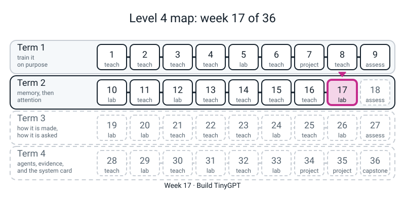
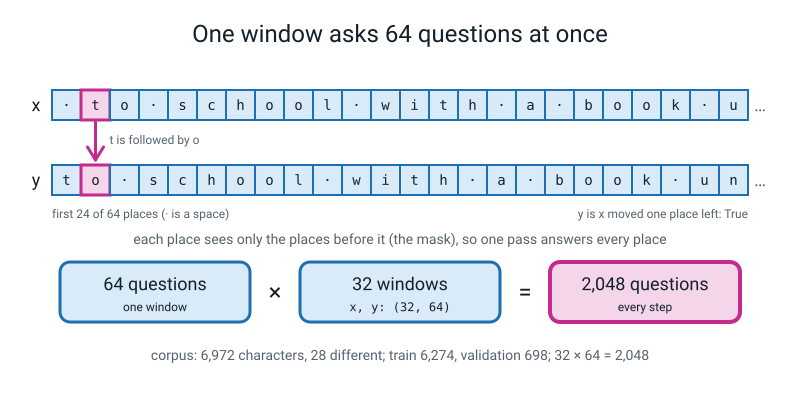
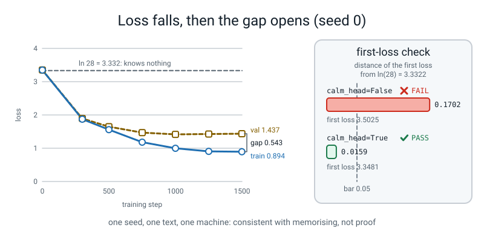

# Week 17 — Build TinyGPT

[⬅ Week 16](week-16.md) · [Course Home](../README.md) · [Week 18 ➡](week-18.md) · [Workbook](../workbook/week-17.md)

---


*Figure 17.0 — Week 17 of 36, the TinyGPT lab, sits in term 2 (memory, then attention); weeks 1 to 16 are done and weeks 18 to 36 are still ahead.*

> ### This week in one sentence
> **You build a whole GPT out of last week's block, check its size and its very first loss *before* you trust it, train it on 6,972 typed characters for about a minute and a half, and then say what the gap between its score on text it studied and text it never saw really tells you.**
>
> **By the end of this chapter you will be able to:**
> - **Say what one training step asks**: 32 windows of 64 characters are 2,048 questions, *what comes next?*, and the answers are the same windows moved one place left
> - **Assemble `TinyGPT`** from a character table, a place table, four `Block`s in an `nn.ModuleList`, a last layer norm and an output layer, and say what "a module inside a module" means
> - **Predict the size and the first loss, then check both**: 807,196 knobs, and a first loss within 0.05 of `ln(28) = 3.332`
> - **Train it and report the run honestly**: the step time, three samples from three moments, the train loss, the validation loss and the gap
> - **Say what the gap means in two sentences, and what it does not mean**
>
> **New maths:** **none.** The loss is `-ln(p)` (Week 1, now with `ln 28`), and the rest is counting (Week 16) and one division.
>
> **New syntax:** `torch.randint` batching · `@torch.no_grad()` (you type it, you do not write one) · a nested `nn.Module`
>
> **New words:** window · batch · context length · decoder-only · first-loss check · checkpoint · train loss and validation loss · gap
>
> **Reading time:** about 40 minutes. **In class:** about 70 minutes. **Homework (the workbook):** about 60-75 minutes.

> **📌 About the code blocks.** Each block is a whole file, with its name in the first line. Type the files into **one folder, next to `l4lib/`**, and run them from that folder. Every output shown was printed by a real run on a CPU, one thread, with `torch.manual_seed(0)`. The **knob counts, shapes and `ln 28`** will match on your machine exactly. The **losses and samples** matched on repeat runs here, but a different PyTorch version can change the digits, and **the step time will differ**. **This week something is really trained**: `train.py` runs for about 80-95 seconds. The model is real, the loop is real, the text is real (typed by the course author); the model is a toy because the text is only 6,972 characters. There is **no scripted backend and no stand-in anywhere this week.** Nothing needs the internet. Blocks marked **DELIBERATE** go wrong on purpose.

---

## 🪝 Start Here

Last week you counted the knobs of one block, by hand, at width 8, and finished with a promise: *next week you write the whole GPT and the count comes out at 807,196.* Today you keep it.

Before you type anything, write three guesses on a card.

1. A model that knows **nothing** about the text gives all 28 characters the same chance. What loss should it score on its first try? (Hint: Week 1 had a coin-flip model at `-ln(0.5) = 0.693`.)
2. After about 80 seconds of training, will the model score **better on the text it studied, or on text it never saw**? By how much?
3. Will the writing it produces be **English**?

Keep the card. We come back to it at the end.

---

## 🧠 The Big Idea

### 1. One question, asked 2,048 times

The training text is one long string of 6,972 characters with 28 different ones (letters, space, full stop, new line). A **window** is a run of 64 of them. Take a window `x`, and make `y` the same window **moved one place to the left**:

```text
x =  " to school with a book u"
y =  "to school with a book un"
```

Read down the two rows: at every place, `y` is *the character that came next*. Because of the mask you met in Week 15, each place in `x` sees only what came before it, so **one pass through the model answers all 64 questions in a window at once**: *given the characters so far, what comes next?* A **batch** is 32 windows. So one step asks `32 x 64 = 2,048` questions.

How do we pick 32 windows? We choose the places where they start **at random**. That is the first new piece of syntax.


*Figure 17.1 — Moving the window one place left gives a next-character answer at every place, so one step asks 2,048 questions.*

### 2. New syntax: `torch.randint`

`torch.randint(high, (n,))` gives you `n` random whole numbers from `0` up to `high - 1`. Like `range`, **the top number is not included**. Read it as *"roll `n` dice that go from 0 to `high - 1`"*. The same number can come up twice. In the batch-maker you will write, it chooses where each window starts: a start `s` gives `x = text[s : s + T]` and `y = text[s + 1 : s + T + 1]`.

Predict first: the last start that still leaves room for `y` is which number, in a text of 10 characters with a window of 4? Then run this. The second half is **DELIBERATE**: it gets the top number wrong.

**`randint_demo.py`**

```python
# randint_demo.py - Week 17: torch.randint draws whole numbers; the top number is NOT included.
import torch

torch.manual_seed(0)
text = torch.arange(100, 110)             # ten pretend characters, numbered 100..109
T = 4                                     # a window of four characters

# The right top: a start s needs room for text[s + 1 : s + T + 1], so the last start is len - T - 1.
starts = torch.randint(len(text) - T, (4,))          # four whole numbers, each from 0 to 5
print("starts:", starts.tolist())
for s in starts:
    x = text[s:s + T]
    y = text[s + 1:s + T + 1]
    print("start", int(s), " x", x.tolist(), " y", y.tolist())

# DELIBERATE: the top one too big. Watch the window that starts at the very end.
starts = torch.randint(len(text), (4,))
print("starts:", starts.tolist())
for s in starts:
    x = text[s:s + T]
    y = text[s + 1:s + T + 1]
    print("start", int(s), " x", x.tolist(), " y", y.tolist())
```
```text
starts: [2, 3, 5, 0]
start 2  x [102, 103, 104, 105]  y [103, 104, 105, 106]
start 3  x [103, 104, 105, 106]  y [104, 105, 106, 107]
start 5  x [105, 106, 107, 108]  y [106, 107, 108, 109]
start 0  x [100, 101, 102, 103]  y [101, 102, 103, 104]
starts: [3, 9, 7, 3]
start 3  x [103, 104, 105, 106]  y [104, 105, 106, 107]
start 9  x [109]  y []
start 7  x [107, 108, 109]  y [108, 109]
start 3  x [103, 104, 105, 106]  y [104, 105, 106, 107]
```

In the first half, `x` and `y` are both four long, and `y` is `x` moved one place. In the second half (the deliberate one) the start `9` gives `x` of length 1 and a `y` with nothing in it. Nothing crashed *here*, but you could not stack those into a batch of equal rows. The top number must be `len(text) - T`. You will see the same arithmetic in the real `get_batch` below.

---

## 🏗️ Build It

### 3. The model: a module inside a module

Open `block.py` from Week 16. The `Block` below is **exactly that block**: nothing changed. New is the class around it. `TinyGPT` holds:

| Part | What it is | Shape idea |
|---|---|---|
| `tok` | an `nn.Embedding`: one row of 128 numbers per character | which character |
| `pos` | an `nn.Embedding`: one row per place `0..63` | which place (Week 16) |
| `blocks` | **four `Block`s** in an `nn.ModuleList` | the thinking |
| `ln_f` | one last `nn.LayerNorm` | tidy up |
| `head` | an `nn.Linear` from 128 numbers to **28 scores**, one per character | the answer |

That is the second new piece: **a nested `nn.Module`**. `TinyGPT` is a module whose parts are modules, and some of those are *your own class*. It is a tree: `TinyGPT` holds four `Block`s, and each `Block` holds its own layers. `model.parameters()` walks the whole tree, so one optimizer trains every knob in it. Two rules keep the tree visible to PyTorch:

1. `super().__init__()` must be the **first line** of `__init__`.
2. The blocks go in an `nn.ModuleList` (Week 16), not a plain Python list.

`TinyGPT` *contains* blocks; it is not a *kind of* block.

The third piece is one line above `generate`: **`@torch.no_grad()`**. You have written `with torch.no_grad():` since Level 3 Week 21, to say *"I am only looking, not learning."* Put `@torch.no_grad()` on the line directly above `def` and it says the same thing for **the whole function**, with no extra indent. **You type the line; you do not write a decorator today.** Treat it as a label that says *"no learning in here."* Generating text is only looking, so it belongs there.

One more line needs a word. The head's weights are multiplied by `0.1` inside `with torch.no_grad():`. That makes the 28 scores start close to zero, so all 28 characters start nearly equal. You will see why in a moment, when you run the first-loss check. (`calm_head=True` switches it on.)

**`tinygpt.py`** (it prints nothing; the other files import it)

```python
# tinygpt.py - Week 17: the whole TinyGPT. Block is YOUR Week 16 block, unchanged; TinyGPT holds four of them.
import torch
import torch.nn as nn
import torch.nn.functional as F

torch.set_num_threads(1)


class Block(nn.Module):
    def __init__(self, d, H, T):
        super().__init__()
        self.H = H
        self.ln1 = nn.LayerNorm(d)
        self.q = nn.Linear(d, d, bias=False)
        self.k = nn.Linear(d, d, bias=False)
        self.v = nn.Linear(d, d, bias=False)
        self.proj = nn.Linear(d, d)
        self.register_buffer("mask", torch.tril(torch.ones(T, T)))
        self.ln2 = nn.LayerNorm(d)
        self.up = nn.Linear(d, 4 * d)
        self.act = nn.GELU()
        self.down = nn.Linear(4 * d, d)

    def forward(self, x):
        B, T, d = x.shape
        dh = d // self.H
        h = self.ln1(x)
        q = self.q(h).view(B, T, self.H, dh).transpose(1, 2)
        k = self.k(h).view(B, T, self.H, dh).transpose(1, 2)
        v = self.v(h).view(B, T, self.H, dh).transpose(1, 2)
        scores = q @ k.transpose(-2, -1) / dh ** 0.5
        scores = scores.masked_fill(self.mask[:T, :T] == 0, float("-inf"))
        weights = F.softmax(scores, dim=-1)
        mixed = (weights @ v).transpose(1, 2).reshape(B, T, d)
        x = x + self.proj(mixed)
        x = x + self.down(self.act(self.up(self.ln2(x))))
        return x


class TinyGPT(nn.Module):
    """Nested module: a model whose parts include four of our own Blocks."""

    def __init__(self, V, d, H, L, T, calm_head=True):
        super().__init__()
        self.T = T                                                         # the context length: how many places
        self.tok = nn.Embedding(V, d)                                      # which character
        self.pos = nn.Embedding(T, d)                                      # which place (Week 16)
        self.blocks = nn.ModuleList([Block(d, H, T) for _ in range(L)])   # L Blocks inside this module
        self.ln_f = nn.LayerNorm(d)                                        # one last norm
        self.head = nn.Linear(d, V)                                        # d numbers -> one score per character
        if calm_head:
            with torch.no_grad():
                self.head.weight *= 0.1                                    # start the scores near zero (see check_init.py)

    def forward(self, idx, targets=None):
        B, T = idx.shape
        x = self.tok(idx) + self.pos(torch.arange(T))
        for blk in self.blocks:
            x = blk(x)
        logits = self.head(self.ln_f(x))                                   # (B, T, V)
        loss = None
        if targets is not None:
            loss = F.cross_entropy(logits.reshape(B * T, -1), targets.reshape(B * T))
        return logits, loss

    @torch.no_grad()
    def generate(self, idx, n_new, temperature=1.0):
        for _ in range(n_new):
            logits, _ = self(idx[:, -self.T:])                             # never more than T places
            probs = F.softmax(logits[:, -1, :] / temperature, dim=-1)      # the LAST place's scores
            idx = torch.cat([idx, torch.multinomial(probs, 1)], dim=1)
        return idx
```

### 4. Check before you trust

A model that gives every character the same chance scores `-ln(1/28) =` **`ln(28) = 3.3322`**. A model that knows nothing *must* start there. If yours starts far from that, either it starts out confidently wrong or something is broken. That is a **first-loss check**, and it is a thing you *run*, not a thing you hope.

The bar: **within 0.05 of `ln(28)`.** The second check is the size: the number you predicted last week.

Before running, write down your prediction for the knob count, using last week's formula with a vocabulary of 28:

```text
28 x 128  +  64 x 128  +  4 x (12 x 128^2 + 10 x 128)  +  2 x 128  +  (128 x 28 + 28)
```

**`check_init.py`**

```python
# check_init.py - Week 17: the data, the batches, the size, and the first-loss check. Nothing is trained.
import math
import torch
from tinygpt import TinyGPT
from l4lib.corpus import TEXT

torch.manual_seed(0)

chars = sorted(set(TEXT))                                # every distinct character, in order
V = len(chars)
stoi = {c: i for i, c in enumerate(chars)}
itos = {i: c for i, c in enumerate(chars)}
data = torch.tensor([stoi[c] for c in TEXT])
n = int(0.9 * len(data))
train_data, val_data = data[:n], data[n:]
print("characters:", len(TEXT), " vocab:", V, " train:", len(train_data), " val:", len(val_data))
print(f"ln(vocab) = ln({V}) = {math.log(V):.4f}")

d, H, L, T, B = 128, 4, 4, 64, 32


def get_batch(split):
    src = train_data if split == "train" else val_data
    starts = torch.randint(len(src) - T, (B,))           # B random places to start a window
    x = torch.stack([src[s:s + T] for s in starts])
    y = torch.stack([src[s + 1:s + T + 1] for s in starts])
    return x, y


x, y = get_batch("train")
print("x", tuple(x.shape), " y", tuple(y.shape))
print("x[0][:24] = |" + "".join(itos[int(i)] for i in x[0][:24]) + "|")
print("y[0][:24] = |" + "".join(itos[int(i)] for i in y[0][:24]) + "|")
print("y is x moved one place left:", bool((x[:, 1:] == y[:, :-1]).all()))

for calm in (False, True):
    torch.manual_seed(0)
    model = TinyGPT(V, d, H, L, T, calm_head=calm)
    with torch.no_grad():
        _, loss = model(x, y)
    gap = abs(loss.item() - math.log(V))
    verdict = "PASS" if gap < 0.05 else "FAIL"
    print(f"calm_head={calm}: first loss {loss.item():.4f}   distance from ln(V) {gap:.4f}   {verdict}")

parts = {"tok": model.tok, "pos": model.pos, "blocks": model.blocks, "ln_f": model.ln_f, "head": model.head}
for name, part in parts.items():
    print(f"  {name:<6}", sum(p.numel() for p in part.parameters()))
predicted = V * d + T * d + L * (12 * d * d + 10 * d) + 2 * d + (d * V + V)
actual = sum(p.numel() for p in model.parameters())
print("predicted knobs:", predicted, " actual:", actual, " match:", predicted == actual)
print(f"knobs per training character: {actual / len(train_data):.1f}")
```
```text
characters: 6972  vocab: 28  train: 6274  val: 698
ln(vocab) = ln(28) = 3.3322
x (32, 64)  y (32, 64)
x[0][:24] = | to school with a book u|
y[0][:24] = |to school with a book un|
y is x moved one place left: True
calm_head=False: first loss 3.5025   distance from ln(V) 0.1702   FAIL
calm_head=True: first loss 3.3481   distance from ln(V) 0.0159   PASS
  tok    3584
  pos    8192
  blocks 791552
  ln_f   256
  head   3612
predicted knobs: 807196  actual: 807196  match: True
knobs per training character: 128.7
```

Read these lines slowly.

- `y is x moved one place left: True`. The question and its answer line up.
- `calm_head=False` is PyTorch's default output layer: it starts **0.1702** from `ln(28)` and prints `FAIL`. `calm_head=True` shrinks that layer by `0.1` and starts **0.0159** away: `PASS`. The number to watch is the *distance*, and the bar is 0.05.
- `match: True`: your hand count and the machine's count are the same 807,196. Last week's formula was right.
- 128.7 knobs for every character it will be trained on. Hold on to that number.

A `FAIL` here is a flag to look, not proof that the model is broken. Ask why it failed before you decide it is a bug.

### 5. The tree, by name

A quick look at the tree you just built. Predict `knobs in the 4 blocks` before you run (it is one of the lines of the size table above).

**`nested.py`**

```python
# nested.py - Week 17: a module that holds modules. Walk the tree and count.
import torch
from tinygpt import TinyGPT, Block

torch.manual_seed(0)
model = TinyGPT(28, 128, 4, 4, 64)

print("children of the model  :", [name for name, _ in model.named_children()])
print("first block's class    :", type(model.blocks[0]).__name__)
print("children of one block  :", [name for name, _ in model.blocks[0].named_children()])
print("knobs in the 4 blocks  :", sum(p.numel() for p in model.blocks.parameters()))
print("knobs in the whole tree:", sum(p.numel() for p in model.parameters()))
```
```text
children of the model  : ['tok', 'pos', 'blocks', 'ln_f', 'head']
first block's class    : Block
children of one block  : ['ln1', 'q', 'k', 'v', 'proj', 'ln2', 'up', 'act', 'down']
knobs in the 4 blocks  : 791552
knobs in the whole tree: 807196
```

The four blocks hold 791,552 of the 807,196 knobs, almost all of them. The line `first block's class    : Block` is the quickest way to see that the list holds *your* class.

---

## 🏃 Train It

### 6. The run

`train.py` uses only parts you already own: `AdamW` (Week 3), a warm-up then cosine schedule with `LambdaLR` (Week 4), gradient clipping (Week 6), `cross_entropy` on the flattened scores (Week 12), and `time.perf_counter()` for the step time. New are `get_batch` (with `torch.randint`) and the decorator on `estimate`.

Three **checkpoints**, at step 0, 300 and 1499, each print the train loss, the validation loss, a sample of text, and the share of "real words" in a long sample. A "real word" here means a space-separated piece that appears somewhere in the training text. It is a crude score: it rewards copying a phrase and says nothing about meaning.

**Run `check_init.py` first and see `PASS` and `match: True`. Only then start this one.** The first output appears after a second or two (it scores 40 batches before it prints step 0), and the next line arrives at step 250, about 15 seconds in. It is not stuck.

**`train.py`**

```python
# train.py - Week 17: train the TinyGPT on the typed corpus (1,500 steps, CPU, one thread), and watch it learn.
import math
import time
import torch
from tinygpt import TinyGPT
from l4lib.corpus import TEXT

torch.manual_seed(0)

chars = sorted(set(TEXT))
V = len(chars)
stoi = {c: i for i, c in enumerate(chars)}
itos = {i: c for i, c in enumerate(chars)}
data = torch.tensor([stoi[c] for c in TEXT])
n = int(0.9 * len(data))
train_data, val_data = data[:n], data[n:]

d, H, L, T, B = 128, 4, 4, 64, 32
STEPS, WARMUP = 1500, 100


def get_batch(split):
    src = train_data if split == "train" else val_data
    starts = torch.randint(len(src) - T, (B,))
    x = torch.stack([src[s:s + T] for s in starts])
    y = torch.stack([src[s + 1:s + T + 1] for s in starts])
    return x, y


@torch.no_grad()
def estimate(split, batches=20):
    total = 0.0
    for _ in range(batches):
        x, y = get_batch(split)
        _, loss = model(x, y)
        total += loss.item()
    return total / batches


known = set(TEXT.split())                                # every whitespace-separated word of the training text


def real_word_share(text):
    words = text.split()
    return sum(w in known for w in words) / len(words)


def sample(prompt, n_new=200, temperature=0.8):
    idx = torch.tensor([[stoi[c] for c in prompt]])
    out = model.generate(idx, n_new, temperature)[0].tolist()
    return "".join(itos[i] for i in out)


model = TinyGPT(V, d, H, L, T)
print("knobs:", sum(p.numel() for p in model.parameters()))

opt = torch.optim.AdamW(model.parameters(), lr=3e-4, weight_decay=0.1)
sched = torch.optim.lr_scheduler.LambdaLR(opt, lambda s: (s + 1) / WARMUP if s < WARMUP
                                          else 0.5 * (1 + math.cos(math.pi * (s - WARMUP) / (STEPS - WARMUP))))

CHECKPOINTS = (0, 300, STEPS - 1)
spent = 0.0                                              # seconds spent inside training steps only
for step in range(STEPS):
    if step in CHECKPOINTS:
        print(f"\n--- step {step}: train {estimate('train'):.3f}  val {estimate('val'):.3f} ---")
        print(sample("t").replace("\n", " / "))
        print(f"real words in a 1,000-character sample: {100 * real_word_share(sample('t', 1000)):.0f}%")
    t0 = time.perf_counter()
    x, y = get_batch("train")
    _, loss = model(x, y)
    opt.zero_grad(set_to_none=True)
    loss.backward()
    torch.nn.utils.clip_grad_norm_(model.parameters(), 1.0)
    opt.step()
    sched.step()
    spent += time.perf_counter() - t0
    if step % 250 == 0 and step > 0:
        print(f"step {step:4d}  train {estimate('train'):.3f}  val {estimate('val'):.3f}")

train_loss, val_loss = estimate("train"), estimate("val")
print(f"\nFINAL  train {train_loss:.3f}  val {val_loss:.3f}  gap {val_loss - train_loss:.3f}")
print(f"step time: {1000 * spent / STEPS:.0f} ms   total training: {spent:.0f} s")
print(f"passes over the training text: {STEPS * B * T / len(train_data):.0f}")
print()
print(sample("the ", 300))
```
```text
knobs: 807196

--- step 0: train 3.349  val 3.351 ---
thsneqol.hupmxzcgos aelb / mx / g mrrt.elt hfiiuyb /  / txmqga gs / ulosn gyyfzdkeluyle vhxmvfpvfurxhyeduagl uyaq.xirvcopuxmbo / z.papupplwtryshrbheibn.imo.nzrvfybcmkf / hwlups.mgqyneupogtoirwnsm / mvforlzbf.wbqnmomdr
real words in a 1,000-character sample: 0%
step  250  train 1.964  val 1.944

--- step 300: train 1.873  val 1.892 ---
the man adid ing sa theand and the fowit therothe ond rd and wise bofn therld care henoshe finerinbr thake berd tut the casand an helisaked d hewand cangh ad med theand herot thed dren ldat bold thefow
real words in a 1,000-character sample: 17%
step  500  train 1.558  val 1.647
step  750  train 1.181  val 1.470
step 1000  train 0.999  val 1.417
step 1250  train 0.905  val 1.427

--- step 1499: train 0.894  val 1.437 ---
the seay. / the old man mem menthy witer. / the birds wenthe baker backer wat or hiold every. / the sthe old man the boird sang thald sthem all. / the bauger and sun watt did nown. / the old man bothered to the.
real words in a 1,000-character sample: 60%

FINAL  train 0.907  val 1.447  gap 0.540
step time: 54 ms   total training: 81 s
passes over the training text: 490

the girl class and wither.
the cat quiester bonerray mand asking the board and to the werong.
the river roster and and the went wat did not nos ney cogke the rope maker not.
the ropened the buper sun the weent flob ordone oard did not.
the oacher wat or wat on the wall rose.
the ring eftouse is and not 
```

(The `step time` line changes from machine to machine, and a little from run to run. Everything else matched on repeated runs here.) `train.py` ends with the model's text, and the prompt `the ` starts it off.

### 7. Reading the run

**The three samples are in order of training.** Step 0 is random characters. Step 300 has `the`, `and`, `an` all over it but no sentence. Step 1499 has lines that begin with `the`, end in a full stop, and are made mostly of real words joined to near-words (`menthy`, `witer`, `boird`). The real-word share went 0%, then 17%, then 60%.

**The losses, as a table:**

| Step | Train | Validation | Gap (val - train) |
|:--:|:--:|:--:|:--:|
| 0 | 3.349 | 3.351 | 0.002 |
| 300 | 1.873 | 1.892 | 0.019 |
| 500 | 1.558 | 1.647 | 0.089 |
| 750 | 1.181 | 1.470 | 0.289 |
| 1000 | 0.999 | 1.417 | 0.418 |
| 1250 | 0.905 | 1.427 | 0.522 |
| 1499 | 0.894 | 1.437 | 0.543 |

Both start within 0.02 of `ln(28)`, so the first-loss check from `check_init.py` holds for the real run. The **gap** is about zero while the model is still bad at everything, then opens at every later checkpoint.

**What the gap says, and what it does not.** The last lines say: *0.9 on text it studied, 1.4 on text it did not.* The validation text is the last tenth of the typed corpus (698 characters) and the model never trains on it. Here is a reading that fits the numbers, and nothing stronger:

- The model made 490 passes over the 6,274 training characters (`1,500 x 2,048 / 6,274`), and it has 128.7 knobs for each one. It had plenty of room to learn that text **and** to learn its quirks. The gap starts at nothing and grows as training goes on. That is **consistent with memorising**.
- It is **not a proof**. We did not run the control (more text, less training, or dropout). We ran one seed, on one text, on one machine.
- It does **not** mean "the model is good". It means *better on what it saw than on what it did not*.

Two more cautions about the numbers. Each validation loss is an average of 20 random windows from only 698 characters, so it is noisy: the `step 1499` line and the `FINAL` line are two estimates of the **same** model and differ by 0.010. **Differences of about 0.02 are not information.** And the lowest validation number printed was 1.417, at step 1000, with a slight rise after: too small, and too noisy, to teach you where to stop.

**How good is 1.4?** A model that knows nothing scores 3.332. Your teacher will put two more rungs of a ladder on the board, models that *only count* letters, and the TinyGPT goes on the same ladder. It is a measuring stick, not a competition.


*Figure 17.2 — Training loss keeps falling while validation flattens, and a calm output layer starts within 0.05 of ln 28.*

---

## 🎲 Your Turn

### Beat the Ladder

You play the game the model plays, on real places in the text. Your teacher reads you a card with the last letter hidden, for example `the cat sat on the m_`. You:

1. Write **up to three letters** and how sure you are of each. The numbers must add up to 1 or less.
2. **You may not give any letter a probability of 0.** Nothing is impossible to a reader who has not seen the rest.
3. Everything you did not list shares what is left equally.
4. Your score is `-ln(p)` of the share on the **true** letter. Lower is better.

`ladder.py` scores a practice guess (not a class card) and prints the look-up table to keep next to you.

**`ladder.py`**

```python
# ladder.py - Week 17: score a Beat-the-Ladder guess. Practice card: "the cat sat on the m", true next letter "a".
import math

guess = {"a": 0.5, "o": 0.2, "u": 0.1}             # my three letters and how sure I am
true_letter = "a"

listed = sum(guess.values())
others = 28 - len(guess)                           # the 28 characters, minus the ones I listed
share = (1 - listed) / others                      # everything I did not list shares what is left
p = guess.get(true_letter, share)
print(f"left over {1 - listed:.2f} shared by {others} letters = {share:.4f} each")
print(f"p on the true letter = {p}   score = -ln(p) = {-math.log(p):.3f}")

print()
for p in [0.9, 0.5, 0.25, 0.1, 0.01]:
    print(f"p = {p:<5}  -ln(p) = {-math.log(p):.3f}")
print(f"p = 1/28   -ln(p) = {-math.log(1 / 28):.3f}   (knows nothing)")
```
```text
left over 0.20 shared by 25 letters = 0.0080 each
p on the true letter = 0.5   score = -ln(p) = 0.693

p = 0.9    -ln(p) = 0.105
p = 0.5    -ln(p) = 0.693
p = 0.25   -ln(p) = 1.386
p = 0.1    -ln(p) = 2.303
p = 0.01   -ln(p) = 4.605
p = 1/28   -ln(p) = 3.332   (knows nothing)
```

Six cards is a very small sample: one bad card moves your average a lot. After six, average your scores. Then answer:

- *A model that counts only the previous letter sees one character. You see the whole phrase. What did you give the true letter on a card where the earlier letters helped you? Why could you give more?*
- *Which card was hardest? What did you give the true letter? Could anybody have known?*
- *Your average is one sample of six. Would it still beat the counting models with six more?* Nobody knows; say so.

### Order the checkpoints

Your teacher gives you the three samples (step 0, step 300, step 1499) **shuffled** and labelled A, B, C. Put them in order of training and write **one piece of evidence per card**. Then look at the real-word shares (0%, 17%, 60%) and write what that number can tell you and what it cannot.

### Predict, then run

In `train.py`, change `STEPS` to `600` and predict, before you run it, whether the gap will be **bigger** or **smaller**. Write the prediction down first. Report what you measure; do not borrow anyone else's number.

---

## 🔬 Break It On Purpose

**DELIBERATE.** Write down what you expect when a model that holds Blocks forgets its very first line.

**`bad_init.py`**

```python
# bad_init.py - DELIBERATE: a model that holds Blocks but forgets super().__init__() on its first line.
import torch.nn as nn
from tinygpt import Block


class BadGPT(nn.Module):
    def __init__(self):
        self.blocks = nn.ModuleList([Block(16, 2, 8) for _ in range(2)])


model = BadGPT()
```
```text
Traceback (most recent call last):
  File "bad_init.py", line 11, in <module>
    model = BadGPT()
  File "bad_init.py", line 8, in __init__
    self.blocks = nn.ModuleList([Block(16, 2, 8) for _ in range(2)])
  ... frames inside torch (elided) ...
AttributeError: cannot assign module before Module.__init__() call
```

Did the message tell you what to do? Write in your Bug Log which line the error points at and what rule from section 3 it is.

---

## 🧭 What was shown, and what was not

**Shown:**
- A GPT is Week 16's block stacked four times with a character table, a place table, a last norm and an output layer around it. It has 807,196 knobs, the number the formula predicted.
- An untrained model must start near `ln(28) = 3.332`; the calm head starts 0.0159 away. That was a check we ran.
- After 1,500 steps (490 passes, about 80 seconds) the samples go from random characters to the shape of sentences, the train loss ends near 0.9 and the validation loss near 1.4, and the gap opens as training goes on.

**Not shown:**
- That the model **understands** anything. It has learned which character tends to follow which prefix *in this text*. The words it invents (`menthy`, `witer`) say so.
- That the gap is **caused** by memorising. We did not run the control.
- Where to stop training. One seed, a noisy validation number, and differences of a few hundredths.
- That the output layer's shrinking helps training. It makes the *first loss honest*; we did not test more.
- That this is how a chat model is trained. It is the same next-character question, on a far smaller model and a far smaller text. Later weeks look at what changes with scale.

---

## 🔑 Wrap Up

1. One training step asks 2,048 questions. Where does the number come from, and what is `y` in terms of `x`?
2. What should the first loss of a model that knows nothing be, with a vocabulary of 28? What was yours, and how far off? Why did we check that *before* training?
3. What is the difference between a module that is **a kind of** block and one that **contains** blocks? What does `model.parameters()` do with the second?
4. Say in two sentences what the gap between 0.9 and 1.4 means, and one thing it does not mean.
5. Go back to your three cards from Start Here. What did you get right? What surprised you?

Then write this sentence in your Bug Log in your own handwriting:

> **"A model that knows nothing starts at ln(vocab); I check that before I train, and a gap between train and validation says where it has been, not that it is good."**

**A look ahead.** Next week is Review and Assessment 2 (Weeks 9-17). Week 19 then takes this very model apart on purpose, deleting the mask, the places, the residuals and the norms one at a time, and measures what each one was worth.

---

## 📤 Homework

Complete workbook pages 17.1 to 17.6. Write your **predictions before you run anything**: a guess written after the run is not a guess. Every number you write must have come from your own calculator or your own run.

**Optional.** In `check_init.py`, change `0.05` to `0.02` and see which `calm_head` setting passes. Then write in your Bug Log: *is a failing check always a bug?*

---

## 📖 Words from this week

| Word | Meaning |
|---|---|
| **window** | a run of consecutive characters cut from the text (here 64 long) |
| **batch** | several windows handled in one step (here 32) |
| **context length** | the most characters the model can look at at once: the number of places in its place table (here 64) |
| **decoder-only** | a model that reads the characters so far and predicts the next one, with a mask hiding the future; the kind of transformer a GPT is |
| **first-loss check** | before training, confirm the loss is close to `ln(vocab)`, the loss of a model that knows nothing |
| **checkpoint** | a moment in training at which you stop and measure or sample |
| **train loss** | the loss on text the model trains on |
| **validation loss** | the loss on text the model never trains on |
| **gap** | validation loss minus train loss; a measure of how much better the model does on what it has seen |
| **nested module** | an `nn.Module` whose parts are themselves modules |
| **`torch.randint(high, (n,))`** | `n` random whole numbers from `0` to `high - 1` |
| **`@torch.no_grad()`** | a line above `def` that turns learning off for the whole function |

---

[⬅ Week 16](week-16.md) · [Course Home](../README.md) · [Week 18 ➡](week-18.md) · [Workbook](../workbook/week-17.md)
