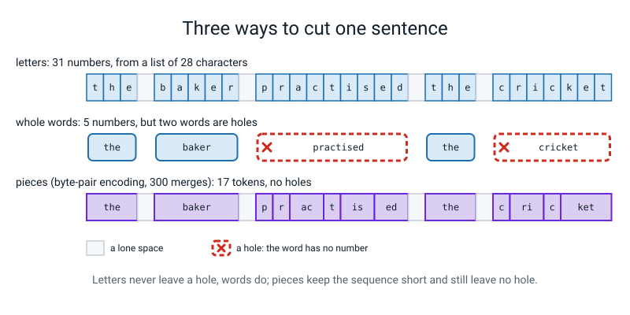
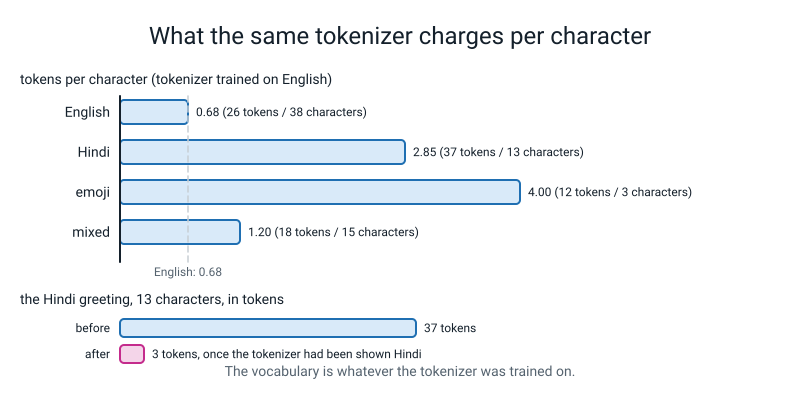

# Week 20 — Tokenizers: BPE From Scratch

[⬅ Week 19](week-19.md) · [Course Home](../README.md) · [Week 21 ➡](week-21.md) · [Workbook](../workbook/week-20.md)

---

> ### This week in one sentence
> **Your TinyGPT has read one character at a time. Today you write the program that cuts text into better pieces, 63 lines of real code that start from raw bytes and glue the most common neighbours together, then you test it two different ways and find out that one of the two tests is much weaker than it looks.**
>
> **By the end of this chapter you will be able to:**
> - **Say why neither letters nor words will do**, with numbers from your own corpus
> - **Run byte-pair encoding by hand** on a card of four words: count pairs, glue the commonest, count again
> - **Write `bpe.py`** (`chunks`, `merge`, `train`, `encode`, `decode`) and pass round-trip tests on English, Hindi, emoji and the empty string
> - **Say what a round trip proves and what it does not**
> - **Diff your tokenizer against a production trainer** that you run on your own computer, and read the result carefully
> - **Read a bytes-per-token chart** and say what it does not tell you
> - **Say who pays** when a tokenizer meets a script it was never shown
>
> **New maths:** **none.** Counting and dividing (bytes divided by tokens). **New syntax:** **four**: `collections.Counter`, `text.encode("utf-8")`, `re.compile(...).findall`, and the `tokenizers` library's `BpeTrainer` (you read that one; you do not type it). **Two small mirrors ride along**, flagged below: `bytes.decode` and `b"".join`.
>
> **Reading time:** about 25 minutes. **In class:** 70 minutes. **Homework:** about 60 to 75 minutes (workbook pages 20.1 to 20.6).

> **📌 About the code blocks.** Every file has its name in its first line. Type them into **one folder, next to your `l4lib/` folder**, and run them from that folder. Every output shown was printed by a real run on a CPU. **Nothing this week is random**, so there is no seed and your numbers should match exactly; **only the timings in brackets, like `(12.2 s)`, change from computer to computer.** There is **no neural network, no scripted backend and no stand-in** anywhere this week: a tokenizer is a small program that counts and glues. It sits in front of a model; it is not a model. Nothing needs the internet. The `tokenizers` library (used in two files) is **already installed**; it trains on text you give it and downloads nothing.


*Figure 20.0 — Week 20, Tokenizers, is where the course stops feeding the model letters and starts cutting text into counted pieces.*

---

## 🪝 Start Here

Here is a sentence your TinyGPT has never seen: `the baker practised the cricket`. Your model would read it as 31 numbers, each from a list of 28 characters. Before you read on, write down three guesses on a card. There is no penalty for being wrong.

1. If you cut it into **whole words**, how many numbers is that, and what would the list need to contain?
2. Your Week 17 corpus is 6,972 characters. About how many **different words** do you think it has? About how many of those appear **only once**?
3. A pizza emoji is one character. How many **bytes** do you think the computer needs to store it?

Keep the card. You will check it before the end.

---

## 🧠 The Big Idea

### 1. Three ways to cut a sentence

**Letters.** Nothing is ever missing: any word can be spelled. But the sequence is long, and the model has to relearn that `t`, `h`, `e` belong together every single time.

**Words.** The sequence is short. But there are far too many words, and any word the model never saw is a **hole**: it has no number, so it cannot be written at all. `practised` is a hole if the corpus never contains it.

**Pieces.** Something in the middle: common things get one piece, rare things are spelled from smaller pieces. The question is how to *choose* the pieces. The answer today is surprisingly simple: **count**.



*Figure 20.3 — Letters never leave a hole and words do; pieces keep the sequence short without leaving one.*

### 2. A byte is a number from 0 to 255

A computer does not store letters. It stores numbers from 0 to 255 called **bytes**. The letter `h` is the number 104. A pizza emoji is **four** bytes (240, 159, 141, 149). A Devanagari letter is **three**. The way text is turned into bytes is called **UTF-8**.

If every piece we ever make is built out of bytes, then **nothing can ever be a hole**: any text in any script is a list of numbers from 0 to 255. So the smallest set of pieces we could start from is the 256 bytes. That is where byte-pair encoding begins.

### 3. The rule: byte-pair encoding

> **Start from the 256 bytes. Find the most common pair of neighbours. Glue them into one new piece with the next free number. Repeat.**

Each time you glue, you write down the pair you glued. That list of **merges**, **in the order they were learned**, *is* the tokenizer. Nothing else is stored. A **token** is one piece. The **vocabulary** is every piece: the 256 bytes plus one new piece per merge, so 300 merges give a vocabulary of 256 + 300 = **556**.

Here is a tiny text so you can see it by hand, using letters instead of numbers:

```text
low low low low low lower lower widest widest widest
```

Count every neighbouring pair of letters **inside** each word (never across a space). `l o` appears 7 times: five in `low`, two in `lower`. `o w` also appears 7 times. `w i` appears 3 times. The commonest pair is glued, and then you recount with the new piece in place, because the glued piece can now have neighbours too.

Two details you will meet in the code:

- **Chunks.** Before counting, the text is cut at spaces (the spaces become chunks of their own), so a piece like `e t` across two words can never be glued. A **chunk** is a run of spaces, or a run of anything that is not a space.
- **Ties.** Two pairs can have the same count. Any rule for choosing works, but there must be *a rule*, so that two people get the same tokenizer. Ours: on a tie, the pair with the smaller numbers wins.


*Figure 20.1 — Byte-pair encoding is count, glue, repeat; the ordered list of merges is the whole tokenizer, and it can write words it never saw.*

### 4. The new syntax

**`Counter`.** `from collections import Counter`. A dictionary that counts. `Counter(["a", "b", "a"])` is `{"a": 2, "b": 1}`. Writing `counter[key] += 1` works even when the key is not there yet (an ordinary dictionary would raise `KeyError`). `.most_common(10)` lists the ten commonest.

**`text.encode("utf-8")`.** Text to bytes. `list("h".encode("utf-8"))` is `[104]`. The number of characters and the number of bytes are **different things**, and bytes-per-token uses bytes.

**`re.compile(pattern).findall(text)`.** You met `re.findall` in Level 3. `compile` just means "build the pattern once and keep it". `\s+` means a run of white space (spaces, tabs, newlines), `\S+` means a run of anything else, and `\s+|\S+` means "one or the other". Our chunks, joined together, give back the text exactly.

**The `tokenizers` library's `BpeTrainer`.** A professional BPE trainer. You do **not** type it. Two files this week contain a function that sets it up (`make_theirs`, `their_tokenizer`); you read them and use them. The one line that matters is `Split(Regex(r"\s+|\S+"), behavior="isolated")`: it is *your chunk rule*, written for the library.

**Two mirrors, flagged (not counted):**
- **`bytes.decode("utf-8")`** is `encode` run backwards. *Encode goes to bytes; decode comes back.*
- **`bytes([104])`** is the one-byte string `b'h'`, and **`b"".join([...])`** glues byte strings together. They appear only in `make_vocab` and `decode`: "the way to write a list of numbers as bytes".

---

## 🏗️ Build It

This section is for typing and testing the whole tokenizer, one piece at a time, and then training it on your corpus.

### 5. `samples.py` (given, you do not type it)

This file supplies the test strings used from here on. It holds Devanagari and emoji, which are awkward on a keyboard. Create it by copying it exactly.

```python
# samples.py - Week 20 (GIVEN to the student, not typed): strings from three scripts, and some tricky ones.
ENGLISH = "The cricket team practised on Tuesday."
HINDI = "नमस्ते दुनिया"            # "hello, world" in Devanagari
EMOJI = "I love 🍕 and 🙂!"
MIXED = "chai चाय 🍵 tea"
EDGE = ["", " ", "\n\n", "a", "   leading and trailing   ", "tabs\tand\nnewlines", "é ñ ü", "😀😀😀"]
```

### 6. `bpe.py`: the whole tokenizer

Type it in **five pieces**, and test after each. The finished file is below; build it in this order.

1. `CHUNK`, `chunks` and `merge`.
2. `train`. This is the big one.
3. `make_vocab`.
4. `encode_chunk` and `encode`.
5. `decode`.

```python
# bpe.py - Week 20: a byte-level BPE tokenizer, in functions. Nothing here needs a network.
import re
from collections import Counter

# A chunk is a run of spaces/newlines OR a run of anything else. Merges never cross a chunk edge.
CHUNK = re.compile(r"\s+|\S+")


def chunks(text):
    return CHUNK.findall(text)


def merge(ids, pair, new_id):
    """Replace every adjacent `pair` in the list `ids` by the single number `new_id`."""
    out = []
    i = 0
    while i < len(ids):
        if i < len(ids) - 1 and ids[i] == pair[0] and ids[i + 1] == pair[1]:
            out.append(new_id)
            i += 2
        else:
            out.append(ids[i])
            i += 1
    return out


def train(text, n_merges, verbose=False):
    """Learn up to n_merges merges. Returns a dict {(a, b): new_id}, in the order learned."""
    counts = Counter(chunks(text))                       # chunk -> how many times it occurs
    words = [list(c.encode("utf-8")) for c in counts]    # each distinct chunk, as byte numbers
    freqs = list(counts.values())
    merges = {}
    for m in range(n_merges):
        pair_counts = Counter()
        for word, f in zip(words, freqs):
            for pair in zip(word, word[1:]):
                pair_counts[pair] += f
        if len(pair_counts) == 0:
            break
        # most frequent pair; on a tie, the pair with the smaller numbers
        best = max(pair_counts, key=lambda p: (pair_counts[p], -p[0], -p[1]))
        if pair_counts[best] < 2:
            break                                        # nothing left that happens twice
        new_id = 256 + m
        merges[best] = new_id
        words = [merge(w, best, new_id) for w in words]
        if verbose:
            print("merge", m + 1, best, "->", new_id, "count", pair_counts[best])
    return merges


def make_vocab(merges):
    """id -> the bytes that id stands for."""
    vocab = {i: bytes([i]) for i in range(256)}
    for (a, b), new_id in merges.items():
        vocab[new_id] = vocab[a] + vocab[b]
    return vocab


def encode_chunk(chunk, merges):
    ids = list(chunk.encode("utf-8"))
    while len(ids) >= 2:
        pairs = list(zip(ids, ids[1:]))
        best = min(pairs, key=lambda p: merges.get(p, float("inf")))   # earliest-learned first
        if best not in merges:
            break
        ids = merge(ids, best, merges[best])
    return ids


def encode(text, merges):
    ids = []
    for c in chunks(text):
        ids = ids + encode_chunk(c, merges)
    return ids


def decode(ids, merges):
    vocab = make_vocab(merges)
    raw = b"".join([vocab[i] for i in ids])
    return raw.decode("utf-8")
```

Four lines in `bpe.py` deserve a second look.

- **`pair_counts[pair] += f`.** A chunk that occurs 234 times counts 234 times. Each *distinct* chunk is stored once, with how often it occurs in `freqs`.
- **`key=lambda p: (pair_counts[p], -p[0], -p[1])`** is the tie-break. It says "largest count; on a tie, the smaller numbers".
- **`if pair_counts[best] < 2: break`** means "do not glue a pair that happens only once". It is why asking for too many merges gives you fewer.
- **`min(pairs, key=lambda p: merges.get(p, float("inf")))`** picks the pair whose merge was **learned earliest**. A pair you never learned sorts last, as `inf`.

One idea you may not have met: **a loop that changes the data it loops over.** In `train`, `words` is rebuilt at the end of every round. Picture a conveyor belt: counts come off the belt, the belt is rewritten, and the belt comes round again.

Test piece 1 right away. Create `merge_check.py` and run it:

```python
# merge_check.py - Week 20: try merge() on a tiny list before you trust it.
from bpe import merge, chunks

print(merge([1, 2, 3, 1, 2], (1, 2), 9))
print(chunks("the baker  practised"))
print("".join(chunks("the baker  practised")) == "the baker  practised")
```

```text
[9, 3, 9]
['the', ' ', 'baker', '  ', 'practised']
True
```

`merge` replaced both `(1, 2)` pairs by the single number 9 and left the 3 alone. The two spaces in `baker  practised` stayed together as one chunk, and the chunks joined give back the text.

### 7. Check it on a text small enough to do by hand

This step runs `train` with `verbose=True` on the tiny text from the rule above, so you can compare the printed merges with your pencil count. Create `trace.py` and run it:

```python
# trace.py - Week 20: the whole algorithm on a text small enough to do by hand. Then: what is a byte?
from bpe import train, encode, decode, make_vocab

tiny = "low low low low low lower lower widest widest widest"
merges = train(tiny, 8, verbose=True)
vocab = make_vocab(merges)
ids = encode("lowest", merges)
print(ids, [vocab[i] for i in ids])
print(decode(ids, merges))

print("the letter h is the number", list("h".encode("utf-8")))
print("a pizza is", len("🍕"), "character and", list("🍕".encode("utf-8")))
print("a Devanagari word is", len("चाय"), "characters and", len("चाय".encode("utf-8")), "bytes:", list("चाय".encode("utf-8")))
```

```text
merge 1 (108, 111) -> 256 count 7
merge 2 (256, 119) -> 257 count 7
merge 3 (100, 101) -> 258 count 3
merge 4 (105, 258) -> 259 count 3
merge 5 (115, 116) -> 260 count 3
merge 6 (119, 259) -> 261 count 3
merge 7 (261, 260) -> 262 count 3
merge 8 (101, 114) -> 263 count 2
[257, 101, 260] [b'low', b'e', b'st']
lowest
the letter h is the number [104]
a pizza is 1 character and [240, 159, 141, 149]
a Devanagari word is 3 characters and 9 bytes: [224, 164, 154, 224, 164, 190, 224, 164, 175]
```

Compare the eight merges with the pencil count you just did on `low low low ...`. `[257, 101, 260]` is `lowest`, written as the pieces `low`, `e`, `st`: the word `lowest` is not in the text, and it still comes out. Then the last three lines: a pizza is **one character and four bytes**; a three-letter Devanagari word is **nine bytes**.

### 8. The round-trip tests

This section is for testing `bpe.py` on awkward strings. A **round trip** is `decode(encode(s))`. For any text `s` it must give back exactly `s`. Create `test_bpe.py` and run it:

```python
# test_bpe.py - Week 20: the round-trip tests. decode(encode(s)) must give back s, for ANY s.
from bpe import train, encode, decode
from samples import ENGLISH, HINDI, EMOJI, MIXED, EDGE
from l4lib.corpus import TEXT

merges = train(TEXT, 300)
cases = [ENGLISH, HINDI, EMOJI, MIXED] + EDGE + [TEXT]
passed = 0
for s in cases:
    ids = encode(s, merges)
    back = decode(ids, merges)
    ok = back == s
    passed = passed + ok
    print("ok  " if ok else "FAIL", repr(s[:28]).ljust(32), len(s), "chars", len(s.encode("utf-8")), "bytes", len(ids), "tokens")
print(passed, "of", len(cases), "round trips passed")
print("empty string gives", encode("", merges))
```

```text
ok   'The cricket team practised o'   38 chars 38 bytes 26 tokens
ok   'नमस्ते दुनिया'                  13 chars 37 bytes 37 tokens
ok   'I love 🍕 and 🙂!'                15 chars 21 bytes 18 tokens
ok   'chai चाय 🍵 tea'                 14 chars 23 bytes 21 tokens
ok   ''                               0 chars 0 bytes 0 tokens
ok   ' '                              1 chars 1 bytes 1 tokens
ok   '\n\n'                           2 chars 2 bytes 2 tokens
ok   'a'                              1 chars 1 bytes 1 tokens
ok   '   leading and trailing   '     26 chars 26 bytes 17 tokens
ok   'tabs\tand\nnewlines'            17 chars 17 bytes 12 tokens
ok   'é ñ ü'                          5 chars 8 bytes 8 tokens
ok   '😀😀😀'                            3 chars 12 bytes 12 tokens
ok   'the sun rose over the quiet '   6972 chars 6972 bytes 3227 tokens
13 of 13 round trips passed
empty string gives []
```

Read it line by line before you move on. Why is the empty string zero tokens? Why is the pizza twelve tokens for three characters? Why is the Hindi greeting **37 tokens for 13 characters**?

Now a question to hold on to: **if this printed `13 of 13` for a tokenizer that had learned nothing at all, would you know?**

### 9. What does it learn?

This section trains `bpe.py` on your corpus and prints what the merges look like. Create `text_merges.py` and run it:

```python
# text_merges.py - Week 20: what three kinds of "token" do to the Week 17 corpus, then what BPE learns from it.
from collections import Counter
from bpe import train, encode, decode, make_vocab
from l4lib.corpus import TEXT

words = TEXT.split()
seen = Counter(words)
print("characters:", len(TEXT), " distinct characters:", len(set(TEXT)))
print("words:", len(words), " distinct words:", len(seen), " words that occur once:", sum([1 for w in seen if seen[w] == 1]))
print("ten commonest words:", seen.most_common(10))

merges = train(TEXT, 300)
vocab = make_vocab(merges)
print("merges learned:", len(merges), " vocabulary:", 256 + len(merges))
pieces = [vocab[new_id].decode("utf-8") for new_id in merges.values()]
print("first 30 merges: ", pieces[:30])
print("merges 271-300:  ", pieces[270:300])

ids = encode(TEXT, merges)
print("tokens:", len(ids), " bytes per token:", round(len(TEXT.encode("utf-8")) / len(ids), 3))

sentence = "the baker practised the cricket"
print("words of the new sentence the corpus never saw:", [w for w in sentence.split() if w not in seen])
print("new sentence, pieces:", [vocab[i].decode("utf-8") for i in encode(sentence, merges)])

print("merges asked for -> merges learned -> bytes per token")
for n in [0, 10, 50, 100, 200, 300, 500, 1000]:
    m = train(TEXT, n)
    k = len(encode(TEXT, m))
    print(f"{n:6d} {len(m):6d} {len(TEXT.encode('utf-8')) / k:8.2f}")
```

```text
characters: 6972  distinct characters: 28
words: 1389  distinct words: 362  words that occur once: 189
ten commonest words: [('the', 234), ('and', 84), ('a', 49), ('old', 21), ('man', 21), ('is', 19), ('it', 18), ('not', 18), ('river', 17), ('in', 17)]
merges learned: 300  vocabulary: 556
first 30 merges:  ['he', 'the', 'an', 'er', 'and', 'in', 'ed', 'ro', 'is', 'or', 'th', 'at', 'ld', 'on', 'ver', 'en', 'ri', 'her', 'to', 'ad', 'ar', 'ing', 'as', 'man', 'bo', 'no', 'it', 'un', 'old', 'id']
merges 271-300:   ['ber', 'but', 'cro', 'cold', 'card', 'ched', 'came', 'day', 'e.', 'el', 'flo', 'g.', 'gu', 'gan', 'grew', 'ghed', 'has', 'ice', 'ken', 'lau', 'lain', 'm.', 'mo', 'mak', 'mac', 'mber', 'ng.', 'ol', 'oar', 'ool']
tokens: 3227  bytes per token: 2.161
words of the new sentence the corpus never saw: ['practised', 'cricket']
new sentence, pieces: ['the', ' ', 'baker', ' ', 'p', 'r', 'ac', 't', 'is', 'ed', ' ', 'the', ' ', 'c', 'ri', 'c', 'ket']
merges asked for -> merges learned -> bytes per token
     0      0     1.00
    10     10     1.20
    50     50     1.49
   100    100     1.69
   200    200     1.99
   300    300     2.16
   500    400     2.30
  1000    400     2.30
```

Read the first thirty merges aloud. Many are English words (`the`, `and`, `old`, `man`) or English endings (`er`, `ing`, `ed`), though **nobody told the counter anything about English**. Others (`ro`, `ld`, `ad`) are not words or endings at all. The late merges (`flo`, `grew`, `cold`, `e.`) are **your corpus**. **BPE does not find spelling or grammar; it finds what is common.** Counting made some of it look like English because English is made of those pairs.

Three more things in that output:

- The new sentence `the baker practised the cricket` contains two words your corpus never saw, and **it can still be written**: `practised` is spelled from six pieces (`p r ac t is ed`) and `cricket` from four (`c ri c ket`). No holes.
- Of the 3,227 tokens, **1,277 are lone spaces**. That is 40%. Every space is a chunk of its own and nothing ever glues to it. It is a real weakness of our chunk rule. Hold on to it for the next section.
- **Training stopped by itself at 400 merges** (`500 400` and `1000 400`). When no pair is left that occurs twice, there is nothing worth gluing. The vocabulary is limited by *the text*, not by what you ask for.


*Figure 20.2 — More merges shorten the text until no pair occurs twice; asking for 500 or 1,000 merges still learns only 400.*

---

## 🔬 Break It On Purpose

This section is for testing a tokenizer that has learned nothing, to see what a round-trip test can and cannot tell you.

**Deliberate.** This tokenizer is trained with **zero merges**. It learns nothing.

```python
# nomerges.py - Week 20: a tokenizer that learned NOTHING. Is it right? Is it good?
from bpe import train, encode, decode
from samples import ENGLISH, HINDI, EMOJI
from l4lib.corpus import TEXT

none = train(TEXT, 0)
print("merges learned:", len(none))
for s in [ENGLISH, HINDI, EMOJI, TEXT]:
    ids = encode(s, none)
    print(decode(ids, none) == s, len(s.encode("utf-8")), "bytes ->", len(ids), "tokens")
```

```text
merges learned: 0
True 38 bytes -> 38 tokens
True 37 bytes -> 37 tokens
True 21 bytes -> 21 tokens
True 6972 bytes -> 6972 tokens
```

Every round trip is `True`. The tokenizer is perfectly correct and does absolutely nothing: one token per byte. **A round trip tests whether anything was lost. It does not test whether the tokens are any good.** The two ways to test quality are to **count the tokens** (3,227 for 300 merges against 6,972 for none) and to **compare against a known good tokenizer**. That is what comes next.

---

## 🎲 Your Turn

Three tasks: merge by hand on paper, diff against the library, and measure what a tokenizer costs in different scripts.

### Merge by Hand (about 8 minutes, pencil and paper)

```text
Four words, with how many times each occurs:

    the x 5      then x 2      than x 2      hat x 3

Rules:  count pairs of neighbouring letters INSIDE each word (weighted by how many times the word occurs).
        glue the commonest pair into one new piece. Recount with the new piece in place.
        On a tie, choose the pair that comes first in the alphabet (letters before made-up pieces).

   1. Fill in the first count table. Which pair wins? Glue it.
   2. Write the four words with the glue applied. Count again. Repeat until you have FOUR merges.
   3. Write your four merges in order.
   4. At merge 5, three pairs tie. Which did you choose? Does it change the tokens of "then"?
   5. Encode the made-up word  thathen  using your merges, earliest first.
```

Do it first on paper. Then, **only after your card is finished**, check it with the code. This file prints the first four merges of the same card and the encoding of `thathen`:

```python
# card_check.py - Week 20: check your Merge by Hand card with the code.
from bpe import train, encode, make_vocab

card = "the the the the the then then than than hat hat hat"
merges = train(card, 4, verbose=True)
vocab = make_vocab(merges)
print("pieces:", [vocab[i].decode() for i in merges.values()])
print("thathen ->", [vocab[i].decode() for i in encode("thathen", merges)])
```

The output is not printed here on purpose: it would hand you the card. In the printout, `(116, 104)` means the letters `t` and `h` (bytes 116 and 104). If the code and your card disagree, find the first merge where they differ and recount that round, weighting each word by how often it occurs.

### Does the library agree with you?

`make_theirs` is **given**: read it, do not type it. Before you run it, write down: *will the production trainer give exactly your tokens?*

```python
# compare.py - Week 20: my BPE against the production trainer in the `tokenizers` library, trained HERE on the same local text.
from bpe import train, encode, decode, make_vocab
from l4lib.corpus import TEXT
from samples import HINDI, EMOJI
from tokenizers import Tokenizer, models, trainers, pre_tokenizers, decoders, Regex

N = 300

def make_theirs(text, split_like_mine):
    tk = Tokenizer(models.BPE())
    if split_like_mine:
        # cut the text into the same chunks mine uses, then turn each chunk into bytes
        tk.pre_tokenizer = pre_tokenizers.Sequence([
            pre_tokenizers.Split(Regex(r"\s+|\S+"), behavior="isolated"),
            pre_tokenizers.ByteLevel(add_prefix_space=False, use_regex=False)])
    else:
        # the library's default byte-level cutting (the GPT-2 style: a space sticks to the word after it)
        tk.pre_tokenizer = pre_tokenizers.ByteLevel(add_prefix_space=False)
    tk.decoder = decoders.ByteLevel()
    trainer = trainers.BpeTrainer(vocab_size=256 + N, min_frequency=2, show_progress=False,
                                  initial_alphabet=pre_tokenizers.ByteLevel.alphabet())
    tk.train_from_iterator([text], trainer)
    return tk

merges = train(TEXT, N)
mine = encode(TEXT, merges)
print("mine:                         ", len(mine), "tokens")

same_cut = make_theirs(TEXT, True)
print("tokenizers, same chunk rule:  ", len(same_cut.encode(TEXT).ids), "tokens")

vocab = make_vocab(merges)
mine_pieces = [vocab[i] for i in mine]
their_pieces = [same_cut.decoder.decode([t]).encode("utf-8") for t in same_cut.encode(TEXT).tokens]
print("pieces that differ, position by position:", sum([1 for a, b in zip(mine_pieces, their_pieces) if a != b]))

default_cut = make_theirs(TEXT, False)
print("tokenizers, its default cut:  ", len(default_cut.encode(TEXT).ids), "tokens")
print("  'the baker' with mine:          ", [vocab[i] for i in encode("the baker", merges)])
print("  'the baker' with their default: ", default_cut.encode("the baker").tokens)

for s in [HINDI, EMOJI]:
    back = same_cut.decode(same_cut.encode(s).ids)
    print("round trip through tokenizers:", back == s, repr(back))
```

```text
mine:                          3227 tokens
tokenizers, same chunk rule:   3227 tokens
pieces that differ, position by position: 0
tokenizers, its default cut:   2111 tokens
  'the baker' with mine:           [b'the', b' ', b'baker']
  'the baker' with their default:  ['the', 'Ġbaker']
round trip through tokenizers: True 'नमस्ते दुनिया'
round trip through tokenizers: True 'I love 🍕 and 🙂!'
```

When both are told to cut the text into the same chunks, the library gives **3,227 tokens and 0 differing pieces**, position by position. Your 63 lines do what the library does. With its own default cutting, a space sticks to the word after it (`the`, `Ġbaker`, where `Ġ` is how the library writes a leading space) and it gives **2,111 tokens**. Neither is wrong; they are two different tokenizers. **Only a diff on equal settings tells you your code does what the library does.** And the library also round-trips Hindi and emoji, because its starting alphabet is the 256 bytes too.

### Bytes per token as the text grows

**Bytes per token** is `bytes / tokens`. With no merges it is 1.00. Higher means each token carries more text. This file trains on more and more of Python's own source files (already on your computer; `module.__file__` tells you where each one lives) and measures on 30,000 characters of `argparse.py` that no tokenizer trained on. It takes about 20 to 25 seconds, and nearly all of it is the last row. `their_tokenizer` is **given**.

```python
# grow.py - Week 20: bytes per token on text the tokenizer has NEVER seen, as the training text grows.
import time
import textwrap, string, random, calendar, heapq, queue, csv, glob, pprint, gettext, fractions, statistics, shutil, argparse
import matplotlib
matplotlib.use("Agg")
import matplotlib.pyplot as plt
from bpe import train, encode
from tokenizers import Tokenizer, models, trainers, pre_tokenizers, decoders, Regex

# Python's own source files are already on this computer. A module's __file__ says where its source lives.
training_modules = [textwrap, string, random, calendar, heapq, queue, csv, glob, pprint, gettext, fractions, statistics, shutil]
pool = ""
for module in training_modules:
    pool = pool + open(module.__file__, encoding="utf-8").read()
test = open(argparse.__file__, encoding="utf-8").read()[:30000]
print("pool:", len(pool), "characters   test:", len(test), "characters")

def their_tokenizer(text, n_merges):
    tk = Tokenizer(models.BPE())
    tk.pre_tokenizer = pre_tokenizers.Sequence([
        pre_tokenizers.Split(Regex(r"\s+|\S+"), behavior="isolated"),
        pre_tokenizers.ByteLevel(add_prefix_space=False, use_regex=False)])
    tk.decoder = decoders.ByteLevel()
    trainer = trainers.BpeTrainer(vocab_size=256 + n_merges, min_frequency=2, show_progress=False,
                                  initial_alphabet=pre_tokenizers.ByteLevel.alphabet())
    tk.train_from_iterator([text], trainer)
    return tk

test_bytes = len(test.encode("utf-8"))
sizes = [2000, 5000, 10000, 20000, 50000, 100000, len(pool)]
mine_bpt, their_bpt = [], []
for n in sizes:
    piece = pool[:n]
    t0 = time.perf_counter(); merges = train(piece, 1000); t_mine = time.perf_counter() - t0
    t0 = time.perf_counter(); tk = their_tokenizer(piece, 1000); t_their = time.perf_counter() - t0
    a = test_bytes / len(encode(test, merges))
    b = test_bytes / len(tk.encode(test).ids)
    mine_bpt.append(a); their_bpt.append(b)
    print(f"train on {n:7d}: merges {len(merges):3d}  mine {a:.3f}  tokenizers {b:.3f}   ({t_mine:.1f} s, {t_their:.2f} s)")

fig, ax = plt.subplots()
ax.plot(sizes, mine_bpt, "o-", label="mine")
ax.plot(sizes, their_bpt, "x--", label="tokenizers")
ax.set_xscale("log")
ax.set_xlabel("characters of training text (log scale)")
ax.set_ylabel("bytes per token on unseen text")
ax.legend()
fig.savefig("bytes_per_token.png")
print("saved bytes_per_token.png")
```

```text
pool: 323880 characters   test: 30000 characters
train on    2000: merges 218  mine 1.728  tokenizers 1.728   (0.0 s, 0.03 s)
train on    5000: merges 458  mine 1.927  tokenizers 1.927   (0.1 s, 0.03 s)
train on   10000: merges 665  mine 2.131  tokenizers 2.131   (0.3 s, 0.05 s)
train on   20000: merges 1000  mine 2.441  tokenizers 2.441   (0.8 s, 0.07 s)
train on   50000: merges 1000  mine 2.628  tokenizers 2.628   (2.0 s, 0.10 s)
train on  100000: merges 1000  mine 2.708  tokenizers 2.708   (4.1 s, 0.10 s)
train on  323880: merges 1000  mine 2.761  tokenizers 2.761   (11.6 s, 0.18 s)
saved bytes_per_token.png
```

Before you open `bytes_per_token.png`, **predict**: as the training text grows, does bytes per token on unseen text go up, down or stay flat? Then look. You will see **one line**. The dashed line is underneath the solid one, because the two columns are identical at every point. That *is* the result. (To make the second line visible, change the markers; it is why they are `"o-"` and `"x--"`.)

The curve climbs fast and then flattens: 2.628 to 2.761 for a six-fold increase of training text. It is limited by the text the vocabulary came from. Look at the time column too: at the biggest size, pure Python takes about 12 seconds and the library about 0.2. Why? We do not know; we did not read the library. A guess: it does not recount every pair every round the way ours does. Treat that as a guess.

### Who pays?

Before you run it, write down a guess: how many tokens will `नमस्ते दुनिया` (13 characters) take? And the three emoji `🍕🙂🍵`?

```python
# cost.py - Week 20: a tokenizer trained on English, asked to read other scripts. Tokens per character.
from bpe import train, encode
from l4lib.corpus import TEXT
from samples import ENGLISH, HINDI, EMOJI

merges = train(TEXT, 300)
print("script      characters  bytes  tokens  bytes/token  tokens per character")
for name, s in [("English", ENGLISH), ("Hindi", HINDI), ("emoji", "🍕🙂🍵"), ("mixed", EMOJI)]:
    k = len(encode(s, merges))
    print(f"{name:10s} {len(s):8d} {len(s.encode('utf-8')):7d} {k:7d} {len(s.encode('utf-8')) / k:11.2f} {k / len(s):14.2f}")

# the same question for a tokenizer that HAS seen Hindi: train on English plus a Hindi passage
hindi_text = (HINDI + " ") * 60
both = train(TEXT + hindi_text, 300)
k_before = len(encode(HINDI, merges))
k_after = len(encode(HINDI, both))
print("Hindi greeting: tokens before", k_before, " after training on Hindi too", k_after)
```

```text
script      characters  bytes  tokens  bytes/token  tokens per character
English          38      38      26        1.46           0.68
Hindi            13      37      37        1.00           2.85
emoji             3      12      12        1.00           4.00
mixed            15      21      18        1.17           1.20
Hindi greeting: tokens before 37  after training on Hindi too 3
```

**Tokens per character** is `tokens / characters`. English costs **0.68** tokens per character, Hindi **2.85**, emoji **4.00**. That is about 4.2 times as many tokens per character for Hindi as for English. But look at the last line: after the tokenizer was shown the Hindi greeting (repeated 60 times, a contrived case), the same 13 characters cost **3 tokens**. So the Hindi was not "harder". The tokenizer had simply never been shown it. **The vocabulary is whatever the tokenizer was trained on, and whoever trained it decided what that was.**



*Figure 20.4 — The same tokenizer charges 0.68 tokens per character for English and 2.85 for Hindi, until it has been shown Hindi.*

---

## 🧭 What was shown, and what was not

This section separates what this week's runs measured from what they did not.

**Shown:**
- Byte-pair encoding is a counting rule and a glue rule; the list of merges, in order, is the tokenizer. It starts from the 256 bytes, so anything can be written.
- On your 6,972-character corpus, 300 merges give **3,227 tokens (2.16 bytes per token)**, a vocabulary of 556. Training stopped by itself at 400 merges.
- Your tokenizer round-trips 13 of 13 test texts, **and so does one that learned nothing**.
- When told to cut the same chunks as yours, the production trainer, run locally, gives **identical tokens** for the corpus and for seven sizes of source text.
- Bytes per token on unseen text climbs and flattens as the training text grows (1.73 up to 2.76).
- A tokenizer trained on English only spent **37 tokens on 13 characters of Hindi**, and one token per byte on emoji. That is a fact about *this* tokenizer.

**Not shown:**
- That these tokens make a **language model better**. We never trained a model on them. Fewer tokens makes the sequence shorter; that is all we measured.
- That the merges are **morphemes** or that BPE finds the structure of a language. It finds common pairs.
- Anything about **any named product's tokenizer**. We did not measure one. Quotes such as "production tokenizers get much higher bytes per token" are things you may have read; we did not reproduce them.
- The **best vocabulary size**. 300 and 1,000 are round numbers. We tried no others.
- That our **chunk rule** is a good one. 40% of the tokens are lone spaces. We tried no other rule.
- That the curve is the same for other held-out text. It is one curve, from one file.
- That the library's match holds for every possible tie. It held on the texts we ran.

---

## 🔑 Wrap Up

Use these questions to check the week, then copy the sentence into your Bug Log.

1. Go back to your three guesses on the card. What did you get right? What surprised you?
2. What is the vocabulary of a tokenizer with 300 merges, and why?
3. A tokenizer passes every round-trip test. What two other checks could you run to find out whether it is any good?
4. Why does your tokenizer give the same tokens as the library only after you set the chunk rule?
5. A tokenizer was trained on English and meets Hindi. Say what was measured, and one thing it does not show.

Then write this sentence in your Bug Log in your own handwriting:

> **"A round trip tests that nothing was lost; counting the tokens and diffing against a known good tokenizer test whether it is any good."**

**A look ahead.** Next week asks what happens when you train on much more text with much more compute. The first thing to count is tokens.

---

## 📤 Homework

Complete workbook pages 20.1 to 20.6. Write your **predictions before you run anything**: a guess written after the run is not a guess. Every number you write must have been printed by your own run in the last 24 hours. There is no seed to state, because nothing is random.

**Optional.** In `bpe.py`, change the chunk rule on the first line of the file to `re.compile(r" ?\S+|\s+")` (a space sticks to the word after it). **Predict** the token count for `train(TEXT, 300)` before you run it. Then write: does a smaller token count prove the new tokenizer is better?

---

## 📖 Words from this week

| Word | Meaning |
|---|---|
| **token** | one piece of text, as a number, that a tokenizer produces |
| **tokenizer** | the program that cuts text into tokens and glues them back |
| **byte** | a number from 0 to 255; all text is stored as bytes |
| **UTF-8** | the way text is turned into bytes; `h` is one byte, a pizza is four, a Devanagari letter is three |
| **merge** | one learned rule: "this pair of pieces becomes one new piece" |
| **vocabulary** | every piece the tokenizer knows: 256 bytes plus one per merge |
| **chunk** | a run of spaces or a run of non-spaces; merges never cross a chunk edge |
| **round trip** | `decode(encode(s))`; it must give back `s` exactly |
| **bytes per token** | bytes divided by tokens; higher means each token carries more text |
| **tokens per character** | tokens divided by characters; the cost of a script for one tokenizer |
| **`Counter`** | a dictionary that counts how often each item appears |
| **`text.encode("utf-8")`** | text to bytes (and `bytes.decode("utf-8")` is the way back) |
| **`re.compile(...).findall`** | build a pattern once, then list every match in a text |
| **`tokenizers` `BpeTrainer`** | the production BPE trainer, used here on local text only |

---

[⬅ Week 19](week-19.md) · [Course Home](../README.md) · [Week 21 ➡](week-21.md) · [Workbook](../workbook/week-20.md)
