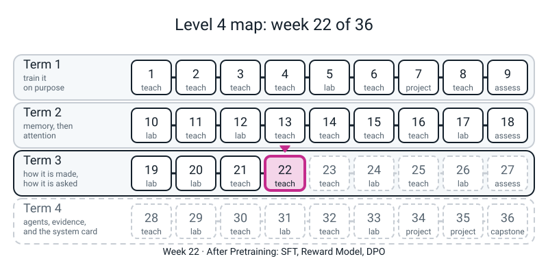
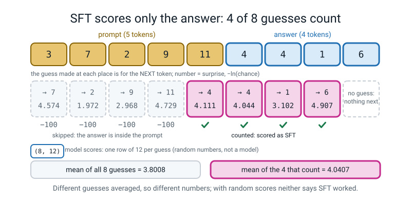
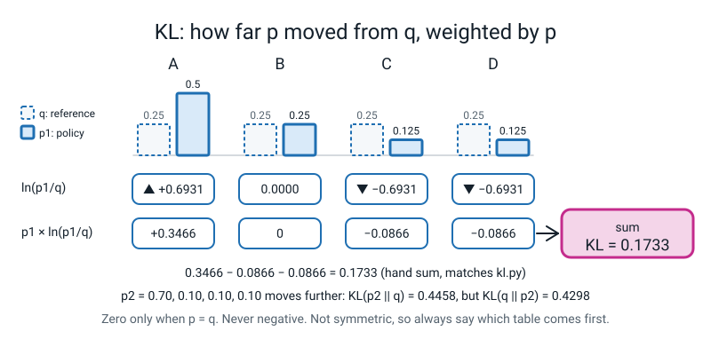

# Week 22 — After Pretraining: SFT, Reward Model, DPO

[⬅ Week 21](week-21.md) · [Course Home](../README.md) · [Week 23 ➡](week-23.md) · [Workbook](../workbook/week-22.md)

---

> ### This week in one sentence
> **A model that has finished pretraining only carries text on; three cheap steps turn it into one that answers the way people prefer, and you build the smallest working version of each (score only the answer, learn a score from pairs, move the model's own chances on a leash) and learn to read the one number that says how far it travelled.**
>
> **By the end of this chapter you will be able to:**
> - **Say why SFT scores only the answer**, build the mask by hand with `log_softmax` and `gather`, and count how many guesses it keeps (for a 5-token prompt, the first **4** guesses are skipped)
> - **Train a reward model from ten judgements**, read its five weights as "what the judges liked", and find the weight that an answer can be built to exploit
> - **Say why a feature that never differs inside a pair gets weight exactly 0**, and what that says about what a reward model "knows"
> - **Work out a KL divergence on paper** for two tables of four chances, and say why it is not symmetric
> - **Run DPO at two values of `beta`**, read the KL beside the loss, and say why the smaller loss belongs to the model that moved less
>
> **New maths:** **KL divergence**, the average of `ln(p / q)` over four outcomes, each weighted by `p`'s own chance. You do it with a calculator before any code runs it.
>
> **New syntax:** `F.logsigmoid` · `F.log_softmax` · `torch.gather` · `tensor.detach()`
>
> **New words:** SFT · demonstration · loss mask · preference pair · reward model · Bradley-Terry loss · reward hacking · reference model · DPO · `beta` · KL divergence
>
> **Reading time:** about 45 minutes. **In class:** about 70 minutes. **Homework (the workbook):** about 60-75 minutes.

> **📌 About the code blocks.** Seven small files, each a whole file with its name in the first line. Type them into **one folder** and run them from there. **Run them in order, in one Python session, for the last three:** `hack.py` uses names made by `reward.py`, and `sweep.py` (homework) uses `run_dpo` from `dpo.py`. The easiest way is `python3 -i`, or `exec(open("name.py").read())` one after another. **Nothing this week imports `l4lib`, and nothing needs the internet.** Every output shown was printed by a real run on a CPU, with the seeds in the files, so your numbers should match (the last digit of a loss can move on a different PyTorch build). **There is no language model anywhere this week.** The "model output" is random numbers, the "reward model" is five weights, the "policy" is four numbers. Each toy shows a *mechanism*; **none of them says anything about what happens to a real assistant.**

---


*Figure 22.0 — Week 22 is the fourth lesson of Term 3: what is done to a model after pretraining.*

## 🪝 Start Here

Last week you fitted a straight line through four training runs and saw that pretraining is "the Week 17 loss, at a scale". Today the model is **finished pretraining**. What now?

Ask a pretrained model `q: what runs past the town?` and it does not answer. It *carries on the text*: maybe with another question, maybe with a quiz. Predicting the next character is all it was ever asked to do.

Before you type anything, write three guesses on a card.

1. A model is scored on eight guesses, but you decide only the last four count. Will the score go **up**, **down**, or **stay the same**?
2. You teach a scorer from ten "A is better than B" judgements. If one feature (say, "has numbered steps") is in almost all of the winners, what will the scorer think of an answer that is *only* numbered steps and says nothing?
3. Two models are trained on the same preferences, one on a short leash and one on a long leash. The one on the short leash ends with the **smaller loss**. Which do you expect moved further from where it started?

Keep the card. We come back to it at the end.

---

## 🧠 The Big Idea

Three cheap steps turn "carries on" into "answers the way people prefer".

1. **SFT (supervised fine-tuning).** Keep training with the next-character loss you already know, but on **demonstrations**: a prompt and the answer a person would like. Score the model **only on the answer**. The prompt is still read; it is just not marked.
2. **A reward model.** It is hard to write the perfect answer, but easy to say *which of two answers is better*. So learn a scoring function from pairs: a **preference pair** is a *chosen* answer and a *rejected* one.
3. **DPO.** Skip the separate scorer and move the model's **own chances** directly toward the chosen answers, measured against a **frozen copy of where it started** (the **reference model**). A number called **`beta`** is the leash. A second number, **KL divergence**, says how far the model travelled.

> **Everything today is a toy on purpose.** Four numbers, five weights, random scores. It shows the machinery clearly. It does not tell you what happens to a real assistant, and nobody has shown you one.

You already own most of the parts. **Cross-entropy, sigmoid, `ignore_index`, Adam and "the log-chance of the right answer"** are from Level 3 and Weeks 3 and 12. Only four pieces of syntax and one idea from maths are new.

### 1. The four new pieces of syntax

You meet them one at a time, each with a prediction first. Here they all are on numbers small enough to read. Predict before you run: what will `torch.log(torch.sigmoid(x))` give at `x = -200`?

**`constructs.py`**

```python
# constructs.py - Week 22: the four new constructs, each on numbers small enough to read.
import torch
import torch.nn.functional as F

torch.set_num_threads(1)

# (a) F.logsigmoid: the log of a sigmoid, kept safe when the sigmoid is tiny
x = torch.tensor([2.0, 0.0, -2.0, -50.0, -200.0])
print("torch.log(torch.sigmoid(x)):", [round(v, 3) for v in torch.log(torch.sigmoid(x)).tolist()])
print("F.logsigmoid(x)            :", [round(v, 3) for v in F.logsigmoid(x).tolist()])

# (b) F.log_softmax: log-chances over the last axis (one row per position)
scores = torch.tensor([[1.0, 2.0, 3.0],
                       [0.0, 0.0, 0.0]])
logp = F.log_softmax(scores, dim=-1)
print("\nlog-chances, row 0:", [round(v, 4) for v in logp[0].tolist()])
print("log-chances, row 1:", [round(v, 4) for v in logp[1].tolist()])
print("chances add to 1 per row:", F.softmax(scores, dim=-1).sum(dim=1).tolist())

# (c) torch.gather: in each row, pick the column named by the index
pick = torch.tensor([[2], [0]])                 # row 0: column 2, row 1: column 0
print("\ngather:", [round(v, 4) for v in logp.gather(1, pick).reshape(-1).tolist()], " (row 0 col 2, row 1 col 0)")
print("same by indexing:", [round(logp[0, 2].item(), 4), round(logp[1, 0].item(), 4)])

# (d) .detach(): the same numbers, cut off from the graph
a = torch.tensor([1.0, 2.0], requires_grad=True)
b = a * 2
c = b.detach()
print("\nb needs a gradient:", b.requires_grad, "  c = b.detach() needs one:", c.requires_grad, "  same numbers:", c.tolist())
```

```text
torch.log(torch.sigmoid(x)): [-0.127, -0.693, -2.127, -50.0, -inf]
F.logsigmoid(x)            : [-0.127, -0.693, -2.127, -50.0, -200.0]

log-chances, row 0: [-2.4076, -1.4076, -0.4076]
log-chances, row 1: [-1.0986, -1.0986, -1.0986]
chances add to 1 per row: [1.0, 1.0]

gather: [-0.4076, -1.0986]  (row 0 col 2, row 1 col 0)
same by indexing: [-0.4076, -1.0986]

b needs a gradient: True   c = b.detach() needs one: False   same numbers: [2.0, 4.0]
```

Read them like this.

- **`F.logsigmoid(x)`** is `ln(sigmoid(x))`, computed so it does not break. Doing it in two steps gives `-inf` at `x = -200`, because the sigmoid rounds to exactly `0` and `ln 0` has no answer. `F.logsigmoid` stays correct. Every loss about preferences today is `-F.logsigmoid(something).mean()`, **and the minus sign matters.**
- **`F.log_softmax(scores, dim=-1)`** is Week 13's softmax followed by `ln`, in one safe step. `dim=-1` means "across the tokens, one row at a time". It gives the **log-chance of every token**.
- **`logp.gather(1, index)`**: in each row, pick the column named by the index. `index` must have the same number of dimensions as `logp`, so a *column* of column-numbers, shape `(2, 1)`, not a flat list. The last line of (c) shows `gather` agrees with the indexing you already know; the reason to learn it is that it works on a whole batch of rows at once.
- **`tensor.detach()`** gives the same numbers, cut off from the graph: a gradient will never flow *through* it. In DPO this is how we **freeze a copy** of the model as it was at the start.

### 2. SFT: score only the answer

The model's guess at place `t` is for the token at place `t + 1`. So if the prompt is 5 tokens long, the guesses at places 0 to 3 are all for tokens *still inside the prompt*, and only the guesses from place 4 on are for the answer. We mark the skipped guesses with **`-100`**, which is PyTorch's default `ignore_index`: the same mechanism as the padding mask of Week 12, under a different number.

Below, the "model output" is **random numbers** (`torch.manual_seed(0)`), not a model. The point is only the scoring. Predict first: will the score over the last four guesses be higher or lower than over all eight? Then run.

**`sftmask.py`**

```python
# sftmask.py - Week 22: the same model output, scored two ways. Only the second is SFT.
import torch
import torch.nn.functional as F

torch.set_num_threads(1)
torch.manual_seed(0)

V = 12                                     # pretend vocabulary size
logits = torch.randn(1, 9, V)              # pretend model output for 9 positions (random, NOT a model)
tokens = torch.tensor([[3, 7, 2, 9, 11, 4, 4, 1, 6]])
PROMPT_LEN = 5                             # the first 5 tokens are the prompt

preds = logits[:, :-1, :]                  # the answer at position t is a guess for token t+1
targets_all = tokens[:, 1:].clone()        # what each position should have guessed

# Route 1: F.cross_entropy, as in Week 12 (ignore_index skips rows)
loss_all = F.cross_entropy(preds.reshape(-1, V), targets_all.reshape(-1))

targets_sft = targets_all.clone()
targets_sft[:, :PROMPT_LEN - 1] = -100     # -100 means "skip this row"
loss_sft = F.cross_entropy(preds.reshape(-1, V), targets_sft.reshape(-1), ignore_index=-100)

print("targets_all:", targets_all.tolist())
print("targets_sft:", targets_sft.tolist())
print(f"loss over all 8 predictions   : {loss_all.item():.4f}")
print(f"loss over 4 response positions: {loss_sft.item():.4f}")

# Route 2: by hand, with log_softmax and gather.
rows = preds.reshape(-1, V)                       # (8, 12): one row of scores per position
logp = F.log_softmax(rows, dim=-1)                # each row becomes log-chances (they sum to 1 after exp)
want = targets_all.reshape(-1, 1)                 # (8, 1): the column we want in each row
picked = logp.gather(1, want)                     # (8, 1): log-chance of the right token, one per row
per_position = -picked.reshape(-1)                # (8,): the surprise at each position
print("\nper-position surprise:", [round(x, 3) for x in per_position.tolist()])
print("mean of all 8          :", round(per_position.mean().item(), 4))
print("mean of the last 4     :", round(per_position[PROMPT_LEN - 1:].mean().item(), 4))
print("same as cross_entropy? :", torch.allclose(per_position.mean(), loss_all),
      torch.allclose(per_position[PROMPT_LEN - 1:].mean(), loss_sft))
print("shapes:", tuple(logp.shape), tuple(want.shape), tuple(picked.shape))
```

```text
targets_all: [[7, 2, 9, 11, 4, 4, 1, 6]]
targets_sft: [[-100, -100, -100, -100, 4, 4, 1, 6]]
loss over all 8 predictions   : 3.8008
loss over 4 response positions: 4.0407

per-position surprise: [4.574, 1.972, 2.968, 4.729, 4.111, 4.044, 3.102, 4.907]
mean of all 8          : 3.8008
mean of the last 4     : 4.0407
same as cross_entropy? : True True
shapes: (8, 12) (8, 1) (8, 1)
```

Three things to take from it.

- **The masked loss (`4.0407`) is higher than the unmasked (`3.8008`).** That is not "worse" and not "cleaner". It is the average over a *different set of guesses*. These scores are random, so this says nothing about SFT working. **A loss can only be compared with another loss from the same setup.**
- The mask does **not** remove the prompt from the *input*. The model still reads it. Only the *scoring* of the prompt's own tokens is blanked. Look at `targets_sft`: only the right answers were replaced.
- The by-hand route and `F.cross_entropy` agree (`True True`). `gather` has no "ignore" option, which is why the by-hand route takes the *unmasked* targets and drops the prompt rows by slicing.

Now the same idea on characters. The prompt and answer below are **typed by us; no model reads them**. Predict: how many of the 41 guesses count?

**`pairs.py`**

```python
# pairs.py - Week 22: an SFT example made of characters, with its mask. The prompt is typed by us, not a model.
import torch

PROMPT = "q: what runs past the town?\na:"      # what the user said
ANSWER = " the river.\n"                        # the ideal reply, typed by a person
text = PROMPT + ANSWER
chars = sorted(set(text))
stoi = {c: i for i, c in enumerate(chars)}
ids = torch.tensor([stoi[c] for c in text])

targets = ids[1:].clone()                       # the guess at place t is for place t+1
targets[:len(PROMPT) - 1] = -100                # skip every guess whose right answer is still inside the prompt
print("characters:", len(text), " prompt:", len(PROMPT), " answer:", len(ANSWER))
print("guesses that count:", int((targets != -100).sum()), "of", len(targets))
print("the first guess that counts is for the character:", repr(text[len(PROMPT)]))
kept = [text[i + 1] for i in range(len(targets)) if targets[i] != -100]
print("the characters it is scored on:", "".join(kept).replace("\n", "\\n"))

late = ids[1:].clone()
late[:len(PROMPT)] = -100                       # DELIBERATE slip, for comparison: the mask one place too long
print("if the mask started one place late:", int((late != -100).sum()), "guesses would count")
```

```text
characters: 42  prompt: 30  answer: 12
guesses that count: 12 of 41
the first guess that counts is for the character: ' '
the characters it is scored on:  the river.\n
if the mask started one place late: 11 guesses would count
```

The last line is **DELIBERATE**, there for comparison. Why is it `12 of 41`, and not `12 of 42`? Write your reason before you read on: there is one fewer guess than there are characters, because the last character has nothing after it to be a guess *for*.


*Figure 22.1 — SFT averages only the guesses whose right answer is in the answer, so its mean (4.0407) is over different guesses than the full mean (3.8008).*

### 3. 🔢 The new maths: KL divergence

Each of the next two pieces of code rests on the same idea, so meet it now, on paper, with a calculator.

You already use `-ln(chance)` as a *surprise meter*. Now take **two tables** of chances for the same four outcomes: `q`, the **reference** (where we started), and `p`, the **policy** (where we are now). The **log-ratio** of one outcome is `ln(p / q)`. It is `0` if the outcome has the same chance in both tables, positive if it became more likely, negative if less. Nothing else.

**KL divergence is the average of the log-ratio, where "average" means weighted by `p`:**

`KL(p || q) = p1 x ln(p1/q1) + p2 x ln(p2/q2) + p3 x ln(p3/q3) + p4 x ln(p4/q4)`

Read it aloud: *"go through the outcomes; for each, how much more likely did it get, in logs; weight that by how often the new table actually picks it; add up."* Here is one worked by hand. Use natural logs and keep 4 decimals.

```text
          A      B      C      D
   q   0.25   0.25   0.25   0.25      the reference
   p1  0.50   0.25   0.125  0.125     moved a little
   p2  0.70   0.10   0.10   0.10      moved a lot
```

| Outcome | `q` | `p1` | `p1 / q` | `ln(p1/q)` | `p1 x ln(p1/q)` |
|:--:|:--:|:--:|:--:|:--:|:--:|
| A | 0.25 | 0.50 | 2 | `+0.6931` | `0.5 x 0.6931 = +0.3466` |
| B | 0.25 | 0.25 | 1 | `0.0000` | `0` |
| C | 0.25 | 0.125 | 0.5 | `-0.6931` | `0.125 x -0.6931 = -0.0866` |
| D | 0.25 | 0.125 | 0.5 | `-0.6931` | `-0.0866` |

Add the last column: `0.3466 - 0.0866 - 0.0866 =` **`0.1733`**. **Now you do `p2` against the same `q`**, on paper, *before* the code below. Write your answer down. (Then it goes on workbook page 22.3.)

Here are the four things to know about KL, and `kl.py` prints each.

- **`KL = 0` exactly when `p = q`**, and it is never negative. That is why it can stand for "distance moved".
- **It is weighted by `p`.** The plain average of the four log-ratios of `p1` is a *negative* number. That is not KL.
- **It is not symmetric.** `KL(p || q)` and `KL(q || p)` are different numbers, so "distance" is a loose word. Say "how far `p` has moved from `q`", and **always say which comes first**. In every KL below, the policy is first and the reference is second.
- In the code, `kl` is written with `torch.log(p)`, which is fine for the tables here (no chance is 0).

**`kl.py`**

```python
# kl.py - Week 22: KL divergence is arithmetic on two tables of chances. No training.
import torch

torch.set_num_threads(1)


def kl(p, q):
    """How far p has moved from q: the average of ln(p/q), averaged with p's own chances."""
    return (p * (torch.log(p) - torch.log(q))).sum().item()


q = torch.tensor([0.25, 0.25, 0.25, 0.25])     # the reference: four outcomes, all equally likely
p1 = torch.tensor([0.50, 0.25, 0.125, 0.125])  # a policy that has moved a little
p2 = torch.tensor([0.70, 0.10, 0.10, 0.10])    # a policy that has moved a lot

for name, p in [("p1", p1), ("p2", p2), ("q itself", q)]:
    logratio = (torch.log(p) - torch.log(q)).tolist()
    print(f"{name:9s} ln(p/q) per outcome: {[round(x, 4) for x in logratio]}   KL = {kl(p, q):.4f}")

# Two things to notice.
print("\nKL(p2 || q) =", round(kl(p2, q), 4), "   KL(q || p2) =", round(kl(q, p2), 4), "  (not the same number)")
unweighted = (torch.log(p1) - torch.log(q)).mean().item()
print("the plain average of ln(p1/q) (NOT weighted by p1):", round(unweighted, 4), " <- can be zero or negative; it is not KL")
```

```text
p1        ln(p/q) per outcome: [0.6931, 0.0, -0.6931, -0.6931]   KL = 0.1733
p2        ln(p/q) per outcome: [1.0296, -0.9163, -0.9163, -0.9163]   KL = 0.4458
q itself  ln(p/q) per outcome: [0.0, 0.0, 0.0, 0.0]   KL = 0.0000

KL(p2 || q) = 0.4458    KL(q || p2) = 0.4298   (not the same number)
the plain average of ln(p1/q) (NOT weighted by p1): -0.1733  <- can be zero or negative; it is not KL
```

Did the code agree with your paper for `p1` and `p2`? If not, find which log-ratio or product you got differently before moving on.


*Figure 22.2 — KL is the log-ratio of each outcome weighted by the new table's own chances; for p1 it adds to 0.1733.*

### 4. A reward model from ten judgements

Here is a scorer small enough to see inside. Each candidate answer is written as **five 0/1 features**: does it have numbered steps, does it give a direct answer, does it hedge a lot, is it over 400 characters, does it refuse. The scorer is **five weights**, one per feature; the reward of an answer is `features @ weights`. Ten judgements say which answer of a pair won.

The chance that answer `w` beats answer `l` is `sigmoid(reward(w) - reward(l))`, and the **Bradley-Terry loss** is `-ln` of that:

`loss = -F.logsigmoid(reward_winner - reward_loser)`

Only the **difference** matters: add 100 to every reward and no chance changes, so a reward has no zero and you should never read one answer's reward alone. With all weights `0` both rewards are equal, the chance is `0.5`, and the loss is `-ln 0.5 = 0.6931`. Predict: what will step 1 print?

> **Honesty box.** The five features, the six answers and the ten judgements were **invented by the course author**. **There are no raters and no real preference data in this course.** This reward model is five numbers, not a transformer.

**`reward.py`**

```python
# reward.py - Week 22: teach a tiny reward model from ten judgements. Five features, five knobs.
import torch
import torch.nn.functional as F

torch.set_num_threads(1)
torch.manual_seed(1)

FEATS = ["has_numbered_steps", "gives_direct_answer", "hedges_a_lot", "over_400_chars", "refuses"]

POOL = {                        # six candidate answers, each written as five 0/1 features
    "r1": [1, 1, 0, 0, 0],      # numbered steps, direct, short
    "r2": [0, 1, 0, 0, 0],      # direct and short, no structure
    "r3": [0, 1, 1, 1, 0],      # direct but hedgy and long
    "r4": [0, 0, 1, 0, 0],      # hedgy and evasive
    "r5": [0, 0, 0, 0, 1],      # refuses a harmless question
    "r6": [1, 1, 0, 1, 0],      # numbered steps, direct, but long
}

# Ten hand-made judgements: (winner, loser)
PAIRS = [("r1", "r4"), ("r1", "r5"), ("r2", "r4"), ("r6", "r3"), ("r1", "r3"),
         ("r2", "r5"), ("r1", "r2"), ("r6", "r4"), ("r2", "r3"), ("r3", "r5")]

X = {name: torch.tensor(v, dtype=torch.float32) for name, v in POOL.items()}
w = torch.zeros(5, requires_grad=True)             # the reward model: one weight per feature
opt = torch.optim.Adam([w], lr=0.1)

for step in range(1, 501):
    # Bradley-Terry: -log sigmoid( reward(winner) - reward(loser) ), averaged over the pairs
    losses = [-F.logsigmoid(X[a] @ w - X[b] @ w) for a, b in PAIRS]
    loss = torch.stack(losses).mean()
    opt.zero_grad()
    loss.backward()
    opt.step()
    if step in (1, 100, 500):
        print(f"step {step:4d}  BT loss {loss.item():.4f}")

print("\nlearned reward weights:")
for f, wi in zip(FEATS, w.detach()):
    print(f"  {f:22s} {wi:+.3f}")

scores = {k: (X[k] @ w).item() for k in POOL}
print("\nranking of every candidate:")
for k, v in sorted(scores.items(), key=lambda kv: -kv[1]):
    print(f"  {k}  reward {v:+.3f}   {POOL[k]}")
agree = sum(scores[a] > scores[b] for a, b in PAIRS)
print(f"\ntrain-pair agreement: {agree}/{len(PAIRS)}")

# The hack: an answer that is ONLY numbered steps (no direct answer at all).
POOL["r9"] = [1, 0, 0, 0, 0]
X["r9"] = torch.tensor(POOL["r9"], dtype=torch.float32)
scores["r9"] = (X["r9"] @ w).item()
print(f"\nr9 numbered steps, answers nothing: reward {scores['r9']:+.3f}  vs r2 direct and short: {scores['r2']:+.3f}")
print("r9 beats r2?", scores["r9"] > scores["r2"])
```

```text
step    1  BT loss 0.6931
step  100  BT loss 0.0135
step  500  BT loss 0.0017

learned reward weights:
  has_numbered_steps     +5.047
  gives_direct_answer    +4.578
  hedges_a_lot           -2.794
  over_400_chars         -2.534
  refuses                -6.091

ranking of every candidate:
  r1  reward +9.625   [1, 1, 0, 0, 0]
  r6  reward +7.091   [1, 1, 0, 1, 0]
  r2  reward +4.578   [0, 1, 0, 0, 0]
  r3  reward -0.750   [0, 1, 1, 1, 0]
  r4  reward -2.794   [0, 0, 1, 0, 0]
  r5  reward -6.091   [0, 0, 0, 0, 1]

train-pair agreement: 10/10

r9 numbered steps, answers nothing: reward +5.047  vs r2 direct and short: +4.578
r9 beats r2? True
```

Read it with care. The loss starts at `0.6931` (`ln 2`: "no idea which is better") and falls to `0.0017`; the scorer gets all ten judgements right. The **biggest weight is for formatting**, not for being helpful. The invented answer `r9`, which is *only* numbered steps and answers nothing, scores higher than the short direct answer `r2`. That is **reward hacking**: an optimizer that chases this reward is pushed toward exactly what the scorer over-rewards. The biggest weight is not "the most important feature"; it is the feature the ten judgements most reliably agreed on.

Here is a second blind spot. Add a sixth feature, `is_factually_correct`, that is `1` for every answer the judges rated. What will its weight be? Predict, then run. (This needs `POOL` and `PAIRS` from `reward.py`, so run it in the same session.)

**`hack.py`**

```python
# hack.py - Week 22: a feature that never varies inside a pair cannot be learned. (Needs reward.py's names: run it in the same session, or paste it below reward.py.)
import torch
import torch.nn.functional as F

torch.set_num_threads(1)
torch.manual_seed(1)

FEATS6 = ["has_numbered_steps", "gives_direct_answer", "hedges_a_lot", "over_400_chars", "refuses", "is_factually_correct"]
POOL6 = {name: v + [1] for name, v in POOL.items() if name != "r9"}   # every rated answer happened to be correct
POOL6["r7"] = [1, 1, 0, 0, 0, 1]      # same as r1, and correct
POOL6["r8"] = [1, 1, 0, 0, 0, 0]      # same as r1, and WRONG
X6 = {name: torch.tensor(v, dtype=torch.float32) for name, v in POOL6.items()}

w6 = torch.zeros(6, requires_grad=True)
opt6 = torch.optim.Adam([w6], lr=0.1)
for step in range(500):
    loss6 = torch.stack([-F.logsigmoid(X6[a] @ w6 - X6[b] @ w6) for a, b in PAIRS]).mean()
    opt6.zero_grad()
    loss6.backward()
    opt6.step()

for f, wi in zip(FEATS6, w6.detach()):
    print(f"  {f:22s} {wi:+.3f}")
print(f"\nr7 (correct)   reward {(X6['r7'] @ w6).item():+.3f}")
print(f"r8 (incorrect) reward {(X6['r8'] @ w6).item():+.3f}")
```

```text
  has_numbered_steps     +5.047
  gives_direct_answer    +4.578
  hedges_a_lot           -2.794
  over_400_chars         -2.534
  refuses                -6.091
  is_factually_correct   +0.000

r7 (correct)   reward +9.625
r8 (incorrect) reward +9.625
```

The weight is exactly `0`, and the correct answer and the wrong answer get the same reward. That is **not** because facts don't matter. It is because, in every pair, both answers had the same value of that feature, so **the data never asked.** A feature that never differs inside a pair cannot be learned. A reward model knows what its judgements agreed on, and nothing else.

### 5. DPO: move the chances, on a leash

DPO skips the separate scorer. The model's own chances for its answers are the thing that moves. Keep three ideas.

- **The reference.** Before training, take a copy of the model's log-chances and `.detach()` it. That copy never changes. This is the **frozen reference model**.
- **How far each answer moved:** `moved = logp_now - logp_reference`.
- **The loss for a pair:** `margin = beta x (moved_chosen - moved_rejected)`, and `loss = -ln sigmoid(margin)`.

Work one pair by hand first. The reference log-chances for (chosen, rejected) are `(-20.0, -18.0)`. The policy now has `(-19.0, -19.5)`. The chosen answer moved `+1.0` and the rejected one moved `-1.5`, a gap of `2.5`. At `beta = 0.1` the margin is `0.25`, `sigmoid(0.25) = 0.5622`, and the loss is `0.5759`. At `beta = 5` the **same movement** gives margin `12.5`, and the loss is `0.000004`. **Same movement; a loss more than 100,000 times smaller.** A big `beta` is satisfied by a small movement, so the gradient goes quiet early and the model stops early. That is the whole of what `beta` does. **`beta` is a dial inside the loss.** The KL is a *measurement we take afterwards*; the loss never contains it.

In the toy, the "model" is **four numbers**: the scores of four possible answers. (This is a bare tensor of knobs: `nn.Parameter` comes in Week 31.) Six preferences say A beats everything and D loses to everything. The preferences are invented and perfectly consistent, unlike real raters. **It has no words and no prompt.**

Predict before you run: after 300 steps at `beta = 0.1`, roughly what chance will answer A have? And will `beta = 5` be above or below it?

**`dpo.py`**

```python
# dpo.py - Week 22: DPO on a four-outcome toy policy. The "model" is four scores; nothing else.
import torch
import torch.nn.functional as F

torch.set_num_threads(1)

RESPONSES = ["A: numbered recipe, 6 lines, no filler",
             "B: correct recipe buried in 3 paragraphs of preamble",
             "C: vague answer that never lists ingredients",
             "D: refuses a harmless cooking question"]
START = [0.4, 0.6, 1.2, 0.8]                       # the SFT model's four scores
DPAIRS = [(0, 3), (0, 2), (0, 1), (1, 2), (1, 3), (2, 3)]   # (chosen, rejected), as answer numbers
chosen = torch.tensor([a for a, b in DPAIRS])
rejected = torch.tensor([b for a, b in DPAIRS])


def run_dpo(beta, steps, lr=0.05, trace=False):
    policy_logits = torch.tensor(START, requires_grad=True)          # the policy starts AS the reference
    ref_logp = F.log_softmax(policy_logits, dim=-1).detach()         # freeze a copy: no graph, no gradient
    opt = torch.optim.Adam([policy_logits], lr=lr)
    for s in range(1, steps + 1):
        logp = F.log_softmax(policy_logits, dim=-1)                  # log-chances of all four answers
        moved_up = logp - ref_logp                                   # how far each answer has moved from the reference
        margin = beta * (moved_up.gather(0, chosen) - moved_up.gather(0, rejected))
        loss = -F.logsigmoid(margin).mean()
        opt.zero_grad()
        loss.backward()
        opt.step()
        if trace and s in (1, 50, 150, 300):
            p = F.softmax(policy_logits, dim=-1).detach()
            print(f"  step {s:4d}  loss {loss.item():.4f}   probs " +
                  " ".join(f"{RESPONSES[i][0]}={p[i]:.3f}" for i in range(4)))
    p = F.softmax(policy_logits, dim=-1).detach()
    logp = F.log_softmax(policy_logits, dim=-1).detach()
    kl = (p * (logp - ref_logp)).sum().item()                        # the same KL as kl.py, policy against reference
    return p, kl, loss.item()


ref_p = F.softmax(torch.tensor(START), dim=-1)
print("reference policy:", " ".join(f"{RESPONSES[i][0]}={ref_p[i]:.3f}" for i in range(4)))
print("\nbeta = 0.2, 300 steps:")
run_dpo(0.2, 300, trace=True)

print("\ntwo leashes, 300 steps each:")
for b in [0.1, 5.0]:
    p, k, l = run_dpo(b, 300)
    print(f"  beta {b:4.2f}  " + " ".join(f"{RESPONSES[i][0]}={p[i]:.3f}" for i in range(4)) +
          f"   KL(pi||ref)={k:.3f}  loss={l:.4f}")
```

```text
reference policy: A=0.168 B=0.206 C=0.375 D=0.251

beta = 0.2, 300 steps:
  step    1  loss 0.6931   probs A=0.179 B=0.219 C=0.361 D=0.242
  step   50  loss 0.4529   probs A=0.519 B=0.461 C=0.013 D=0.006
  step  150  loss 0.2526   probs A=0.946 B=0.054 C=0.000 D=0.000
  step  300  loss 0.1424   probs A=0.997 B=0.003 C=0.000 D=0.000

two leashes, 300 steps each:
  beta 0.10  A=0.997 B=0.003 C=0.000 D=0.000   KL(pi||ref)=1.760  loss=0.2560
  beta 5.00  A=0.589 B=0.236 C=0.144 D=0.032   KL(pi||ref)=0.566  loss=0.0020
```

Read it in this order.

1. The reference puts only `0.168` on A. Step 1 prints `0.6931`, as for the reward model: nothing has moved yet, so "no idea".
2. With `beta = 0.2` the chance of A climbs to `0.997`, and every other answer except B is squeezed to about `0`.
3. **The two leashes.** `beta = 0.1` moved far (`A = 0.997`, KL `1.760`). `beta = 5` moved much less (`A = 0.589`, KL `0.566`). And yet `beta = 5` has the **smaller loss** (`0.0020` against `0.2560`). The loss was satisfied early, so it went quiet. **The smaller loss belongs to the model that moved less. Never compare losses across different `beta`.** Compare the chance of the preferred answer and the KL.
4. "A = 0.997 and everything else near 0" is a fact about **this toy under these pairs**. Say "the toy collapsed onto one answer", not "DPO collapses models". And "moved further" does not mean "better": `0.997` means *very sure*, not *right*.

---

## 🎲 Your Turn

### The Leash

You do the arithmetic first, so the two numbers the code prints are *predictions confirmed* rather than surprises. Use natural logs (`ln`, not `log10`) and 4 decimals, and a calculator for `ln` only. Write the four log-ratios first, then multiply each by the policy's own chance, then add. The reference `q` is always the **second** table.

| Round | Policy | Reference | Your answer |
|:--:|---|---|:--:|
| 1 | `p1` | `q` | (you did it in section 3) |
| 2 | `p2` | `q` | |
| 3 | `q` | `q` | |
| 4 | `q` | `p2` (the swap!) | |
| 5 | **a table of your own** (four chances that add to 1) | `q` | |

Before round 3, guess the answer. Before round 4, guess whether it will be bigger or smaller than round 2. Before round 5, guess whether yours will be bigger or smaller than `0.4458`. Then check all five by changing the tables at the top of `kl.py`.

Then the DPO pair, with the same four numbers at both `beta`s (write the margin, the sigmoid and the loss for each):

```text
   reference log-chance (chosen, rejected) = (-20.0, -18.0)
   policy now                               = (-19.0, -19.5)
```

Answer out loud, to your teacher or your Bug Log:

- *The movement is the same in both lines. Only `beta` changed. Which line still wants the model to move?*
- *So which model ends up further from the reference after the same number of steps?*
- *Is the model that moved further better?*

### Predict, then run

Write the prediction first. In `dpo.py`, try `beta` values `0.02` and `0.5` (300 steps each). Which has the bigger KL? You will have a surprise waiting if you expect "the smaller `beta`, the longer the leash" to hold at only 300 steps. That is for the homework.

---

## 🔬 Break It On Purpose

**DELIBERATE.** You just saw that `F.cross_entropy` skips rows marked `-100`. Does `gather` do the same? Write down what you expect before you run.

**`bad_gather.py`**

```python
# bad_gather.py - DELIBERATE: gather with the masked targets. -100 is not a column of the table.
import torch
import torch.nn.functional as F

torch.manual_seed(0)
V = 12
rows = torch.randn(8, V)
targets = torch.tensor([-100, -100, -100, -100, 4, 4, 1, 6])     # already masked for cross_entropy
logp = F.log_softmax(rows, dim=-1)
picked = logp.gather(1, targets.reshape(-1, 1))
print(picked.shape)
```

```text
Traceback (most recent call last):
  File "/home/you/l4/bad_gather.py", line 10, in <module>
    picked = logp.gather(1, targets.reshape(-1, 1))
RuntimeError: index -100 is out of bounds for dimension 1 with size 12
```

Did the message tell you what to do? Write in your Bug Log what `gather` wants the numbers in its index to be, and how `sftmask.py` gets around it.

---

## 🧭 What was shown, and what was not

**Shown:**
- The masked loss is the loss over a *chosen subset* of guesses: `3.8008` over all eight, `4.0407` over the last four, on the same random numbers. The by-hand route with `log_softmax` and `gather` matches `F.cross_entropy`.
- A reward model of five weights can get all ten invented judgements right (loss `0.6931` down to `0.0017`), and its biggest weight was for formatting. A feature that never differs inside a pair gets weight `0.000`.
- KL on paper: `0.1733` and `0.4458` against a uniform reference; `0` for a table against itself; `0.4458` against `0.4298` when the order is swapped.
- A four-answer policy trained with DPO at two leashes: `beta = 0.1` gave `A = 0.997`, KL `1.760`, loss `0.2560`; `beta = 5` gave `A = 0.589`, KL `0.566`, loss `0.0020`.

**Not shown:**
- **Any language model.** Not one token of generated text today. The masked loss is on random scores; the reward model on five typed features; DPO on four numbers.
- That SFT teaches a model to follow instructions. We showed the mask, the single detail that makes SFT SFT. We fine-tuned nothing.
- That the reward model "knows what is good". It knows what ten invented judgements agreed on. Nothing here measures bias, safety or alignment.
- That DPO is better or worse than the older reinforcement-learning route (RLHF, with a method called PPO). That route is described in the reference module and was neither run nor measured here.
- That this is how any product was made. The reference module says the real recipe has these three stages at a vastly bigger scale. We built the smallest version of each stage that fits on a laptop. We did not check how any product was built.
- Anything with real raters. Real raters disagree. A DPO loss that sits at `0.6931` is telling you about your labels, not your optimizer.

---

## 🔑 Wrap Up

1. Why does SFT set the first four guesses of a five-token prompt to `-100`? Why not three or five? What stays unchanged, the input or the scoring?
2. Why is the masked loss `4.0407` higher than the unmasked `3.8008`, and does that mean the masked one is worse?
3. In `reward.py`, which weight is biggest, and why is that a problem? What is a feature the judges never varied, and what weight does it get?
4. What is `KL(p || q)` in one sentence, and why does it matter which table goes first?
5. Same movement, two values of `beta`: which one still wants the model to move, and why does the other have the smaller loss?
6. Go back to your three cards from Start Here. What did you get right? What surprised you?

Then write this sentence in your Bug Log in your own handwriting:

> **"A loss is only comparable with another loss from the same setup; to judge how far a model moved, I look at the KL and the chance of the preferred answer, not at the loss."**

**A look ahead.** Next week is Prompting as engineering: a prompt is a test suite. From Week 23 the course uses a scripted stand-in for a model, always labelled "stand-in, not a model". Today has none.

---

## 📤 Homework

Complete workbook pages 22.1 to 22.6. Write your **predictions before you run anything**: a guess written after the run is not a guess. Every number you write must have come from your own calculator or your own run.

**Optional (fast students).** Type `sweep.py` below, in the same session as `dpo.py`. Predict first: at 300 steps, does `beta = 0.02` end with a bigger KL than `beta = 0.1`, or a smaller one? And at 3,000 steps?

**`sweep.py`**

```python
# sweep.py - Week 22 (workbook / fast student): the beta sweep, then the same sweep run 10 times longer.
# Needs dpo.py's run_dpo in the same session.
import time
t0 = time.time()
print("300 steps:")
for b in [0.02, 0.1, 0.5, 1.0, 5.0]:
    p, k, l = run_dpo(b, 300)
    print(f"  beta {b:4.2f}  " + " ".join(f"{RESPONSES[i][0]}={p[i]:.3f}" for i in range(4)) + f"   KL={k:.3f}  loss={l:.4f}")
print("3000 steps:")
for b in [0.02, 0.1, 0.5, 1.0, 5.0]:
    p, k, l = run_dpo(b, 3000)
    print(f"  beta {b:4.2f}  " + " ".join(f"{RESPONSES[i][0]}={p[i]:.3f}" for i in range(4)) + f"   KL={k:.3f}  loss={l:.4f}")
print(f"seconds: {time.time() - t0:.1f}")
```

```text
300 steps:
  beta 0.02  A=0.782 B=0.218 C=0.000 D=0.000   KL=1.213  loss=0.5317
  beta 0.10  A=0.997 B=0.003 C=0.000 D=0.000   KL=1.760  loss=0.2560
  beta 0.50  A=0.987 B=0.013 C=0.000 D=0.000   KL=1.709  loss=0.0513
  beta 1.00  A=0.950 B=0.047 C=0.003 D=0.000   KL=1.557  loss=0.0204
  beta 5.00  A=0.589 B=0.236 C=0.144 D=0.032   KL=0.566  loss=0.0020
3000 steps:
  beta 0.02  A=1.000 B=0.000 C=0.000 D=0.000   KL=1.782  loss=0.1310
  beta 0.10  A=1.000 B=0.000 C=0.000 D=0.000   KL=1.782  loss=0.0160
  beta 0.50  A=1.000 B=0.000 C=0.000 D=0.000   KL=1.781  loss=0.0014
  beta 1.00  A=0.999 B=0.001 C=0.000 D=0.000   KL=1.772  loss=0.0005
  beta 5.00  A=0.802 B=0.150 C=0.043 D=0.004   KL=1.095  loss=0.0000
seconds: 0.8
```

(The `seconds:` line varies.) Read the two blocks side by side. At 300 steps the KL is **not** in order of `beta`. At 3,000 steps it is close to it. The run mixes "how far the model *wants* to go" with "how *fast* it gets there". So "a smaller `beta` is a longer leash" is true only once the run is long enough. The top of the range is `-ln(0.16839) = 1.7815`, the most KL this toy can reach (all the chance on A).

---

## 📖 Words from this week

| Word | Meaning |
|---|---|
| **SFT** | supervised fine-tuning: keep training with the next-token loss on prompt-and-answer pairs |
| **demonstration** | one prompt with the answer a person would like, used as a training example |
| **loss mask** | marking some guesses as `-100` so they are not scored (the prompt's own tokens, in SFT) |
| **preference pair** | a chosen answer and a rejected one for the same prompt |
| **reward model** | a scorer learned from preference pairs; here, five weights |
| **Bradley-Terry loss** | `-ln sigmoid(reward of winner - reward of loser)` |
| **reward hacking** | getting a high reward by exploiting what the scorer likes rather than doing what was wanted |
| **reference model** | a frozen copy of the model as it was before training, kept to measure movement against |
| **DPO** | a way to move the model's own chances toward the chosen answers, measured against the reference |
| **`beta`** | the scale on the margin in DPO: a bigger one is satisfied by a smaller movement |
| **KL divergence** | `KL(p \|\| q)`: the average of `ln(p / q)` weighted by `p`; how far `p` has moved from `q` (not symmetric) |
| **`F.logsigmoid(x)`** | `ln(sigmoid(x))`, computed so it stays safe when the sigmoid is tiny |
| **`F.log_softmax(x, dim=-1)`** | the log-chances of every token in one safe step |
| **`t.gather(1, index)`** | in each row, pick the column named by the index (a column of column-numbers) |
| **`t.detach()`** | the same numbers, cut off from the graph so no gradient flows through them |

---

[⬅ Week 21](week-21.md) · [Course Home](../README.md) · [Week 23 ➡](week-23.md) · [Workbook](../workbook/week-22.md)
