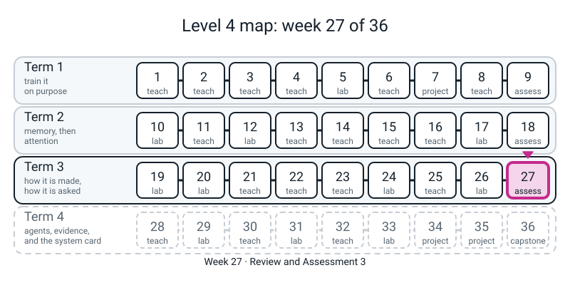
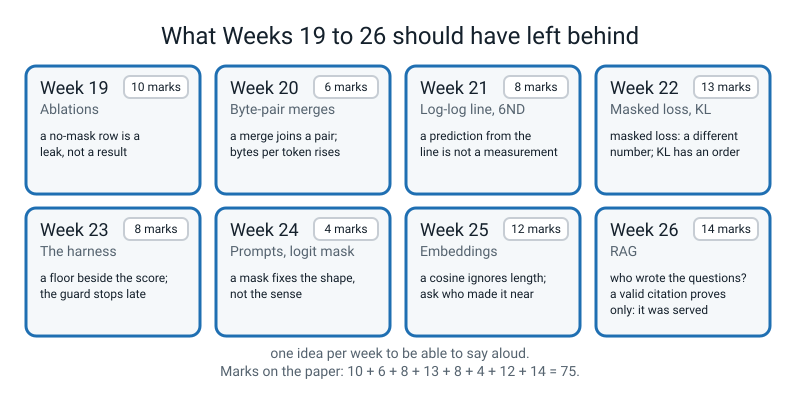
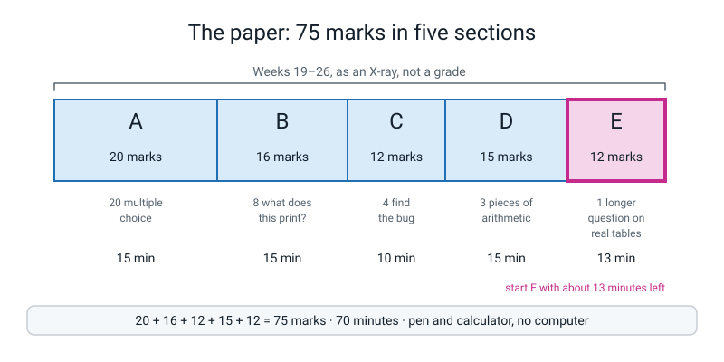
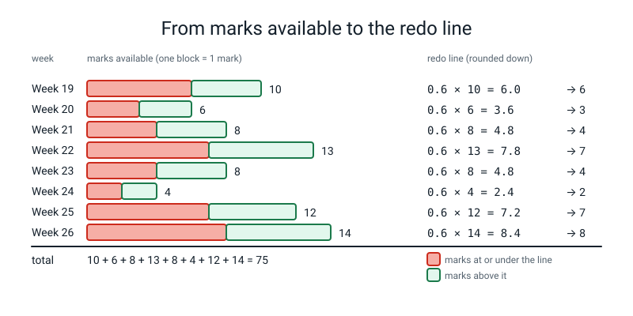
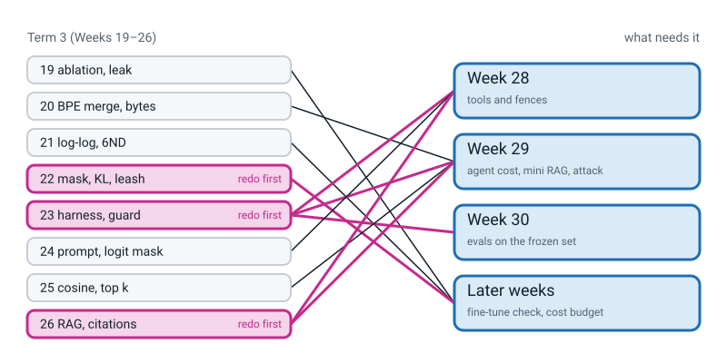

# Week 27 — Review and Assessment 3: What Did Term 3 Leave Behind?

[⬅ Week 26](week-26.md) · [Course Home](../README.md) · [Week 28 ➡](week-28.md) · [Workbook](../workbook/week-27.md)

---

> ### This week in one sentence
> **Today's paper is not a grade; it is an X-ray of Weeks 19 to 26. It shows, week by week, what stuck and what did not, so you can redo the right page before Week 28 gives your model hands and tools.**
>
> **By the end of this chapter you will be able to:**
> - **Read an ablation table honestly**, and say which row cannot be ranked and why
> - **Say what one BPE merge does** and work out bytes per token
> - **Use a log-log line and `C = 6ND`** without calling a prediction a measurement
> - **Read the fine-tuning toys**: a masked loss, a pair loss, a KL number and a leash
> - **Treat a harness as an instrument**: a floor, a frozen set, a guard, and a stand-in that proves nothing about real models
> - **Do a cosine by hand, pick the top k, and read recall** with the question "who wrote the questions?", and say what a valid citation does and does not prove
> - **Mark your own paper honestly**, fill in the per-week grid, and circle **at most two weeks** to redo
>
> **New maths:** **none.** **New syntax:** **none.** **New words:** **none.** Everything on the paper is something you have already done with your own hands.
>
> **Reading time:** about 20 minutes (the night before). **In class:** 75 minutes (70 for the paper). **Homework:** about 45 minutes of marking, plus 15 minutes at the computer.

> **📌 About the code blocks.** There are four small warm-up files for **before** the paper and one short file for the **homework**. Each is a whole file with its name in the first line. The warm-ups do not need `l4lib/` and use no randomness, so no seed is needed and your numbers should match. They use **practice numbers that are not the paper's numbers**, so they check your method without handing you the answers. The homework file needs `l4lib/`, the `notes/` folder from Week 26, and `questions.py` from Week 26. Every output shown was printed by a real run on a CPU. **You run no code during the paper.** Nothing this week needs the internet.
>
> **⚠️ Two things on the paper are stand-ins, not models.** Week 23's scripted client (`FakeClient`) and Week 26's sentence-copying writer are rules you can read. If the paper mentions them, it says "stand-in, not a model", and nothing scored against them says anything about a real model.


*Figure 27.0 — Week 27 is the assessment tile that closes the third lane: an X-ray of Weeks 19 to 26 before the agents of Term 4.*


---

## 🪝 Start Here

For eight weeks you have taken a model apart, cut text into pieces, drawn a line through losses, taught a toy to prefer one answer, weighed a prompt on a scale, and built a search that cites its sources. Some of it is probably solid and some of it is probably soft. **You do not know which is which yet.** That is exactly what today finds out.

Three promises about the paper:

1. **It is on paper, with a calculator.** No computer, no notes, no internet.
2. **Every question is about something you did with your own hands.** There are no tricks and nothing from next term.
3. **"Don't know" is a good answer.** Write it. It tells you (and the grid) where to look. A lucky guess hides the problem; an honest "don't know" shows it.

Say this to yourself before you start: *"This is the X-ray, not the grade. Nobody is keeping score but me."*

Why bother before Term 4? Because **Weeks 28 and 29 build an agent out of parts you made this term**: the harness and its budget guard (Week 23), the chunks, citations and the rule "retrieved text is data" (Week 26), and underneath those the cosine (Week 25) and the token count (Week 20). If one of them is soft, the agent is built on it.


*Figure 27.3 — One idea to say aloud for each of the eight weeks, and the marks each carries on the paper.*

---

## 🗺️ What is on the paper

This section is for knowing the shape of the paper before you sit it: its sections, marks and timing.

The paper is **75 marks** and you get **70 minutes**.

| Section | What it asks | Marks | About how long |
|:--:|---|:--:|:--:|
| **A** | 20 multiple choice, circle one letter | 20 | 15 min |
| **B** | 8 "what does this print?" (you write the exact output) | 16 | 15 min |
| **C** | 4 "find the bug" (say what the bug is, what happens, write the fix) | 12 | 10 min |
| **D** | 3 pieces of arithmetic (show every line of working) | 15 | 15 min |
| **E** | 1 longer question about real tables | 12 | 13 min |

**Show your working** in B to E. A wrong number with the right working still earns marks. A right number with no working earns fewer.

**In Section C the programs are broken on purpose.** Say what the bug is, what the program does (an error, or a wrong answer with no error at all), and write the fix.

**Section E is the biggest single question** (12 marks) and the last one. Start it when you have about thirteen minutes left, not later. It uses **real tables** printed from this course's own runs: the TinyGPT ablation of Week 19 and the recall tables of Week 26. The tables are on the paper as numbers, so you do not need to remember them.

**The paper is spread unevenly over the eight weeks.** Some weeks have only a few marks on them. If a thin week comes out low, that is one or two questions, so treat it as a question to ask yourself, not as a verdict.

**Your teacher will say only five things during the paper** (the time-checks), and will answer questions with one of three sentences: *"Read it again."* / *"Write what you do know."* / *"I can't help with that one, move on."* That is not unkindness; it is what keeps the X-ray clean.


*Figure 27.1 — The paper is 75 marks in five sections (20 + 16 + 12 + 15 + 12), and the biggest single question is last.*


---

## 🧰 The night before: what to be able to do

Go down this list. For each line, ask: **could I do this right now with only a pen and a calculator?** Tick the ones you could. For any you could not, reopen the page named and do it again, **for 20 minutes at most**. Do not try to learn everything the night before; just find out which lines are soft.

| Week | You should be able to... | Look at |
|:--:|---|---|
| 19 | Say what an **ablation** changes and what it keeps the same. Say why the no-mask row is a leak and not a result. Say what a switch-off test adds to the name of a head. Say why one small model on two seeds is a reason for care, not for a rule. | The Week 19 chapter |
| 20 | Say what one BPE merge does. Say what happens to bytes per token as merges are learned, and work it out from two counts. Say why decoding an encoded text gives the text back. | The Week 20 chapter |
| 21 | Read the slope of a straight line on log-log paper from two points. Say what a prediction from that line is and is not. Use `C = 6ND`, and say what doubling `D` does. | The Week 21 chapter |
| 22 | Say why a masked loss is a *different* number and not a worse model. Say what only the **differences** between rewards mean. Work a KL divergence by hand. Say what `beta` holds back. | Workbook **pages 22.1, 22.2, 22.3** |
| 23 | Say why the test cases are frozen. Say what the floor is and why a score needs to be set beside it. Say why the guard stops one call late. Say what a stand-in can and cannot tell you. | Workbook **pages 23.1, 23.2, 23.5** |
| 24 | Say what examples in the prompt do and do not change. Say what a logit mask guarantees and what it does not. | The Week 24 chapter |
| 25 | Do a cosine by hand. Say why a plain dot product rewards length and what fixes it. Pick the top k with `np.argsort(-scores)[:k]`. Say what the word table cannot see. | Workbook **pages 25.1, 25.4** |
| 26 | Say who wrote the questions, every time you read a recall number. Say what a chunk size trades. Say what a passing citation check proves and what it does not. Say why there is no threshold with zero mistakes. | Workbook **pages 26.1, 26.3, 26.4** |

> **Do not** stay up late. A tired head does the arithmetic worse than a rested one, and one night cannot teach you what eight weeks did not.

---

## 🔥 Warm-ups (optional, 25 minutes, the night before)

These four files check the *method* of the by-hand ideas on **practice numbers that are not on the paper**. The rule is the one you use for the paper: **do it by hand first, write your answer down, then run the file.** If you run it first you learn nothing about yourself.

### Warm-up 1 — cosine and the top k

On paper: `a = [1, 0, 1]`, `b = [1, 1, 0]`, `c = [2, 0, 2]`. Work out `cos(a, b)` and `cos(a, c)` as dot product over the product of the two lengths. Which of `b` and `c` is nearer to `a`? Then: scores `[0.1, 0.7, 0.3, 0.9]`, which are the ids of the best two? Then run:

```python
# warm1.py - Week 27 warm-up 1: cosine and the top k. PRACTICE numbers, not the paper's.
import math
import numpy as np

def cosine(x, y):
    return sum(a * b for a, b in zip(x, y)) / (math.sqrt(sum(a * a for a in x)) * math.sqrt(sum(b * b for b in y)))

a = [1, 0, 1]
b = [1, 1, 0]
c = [2, 0, 2]
print("cos(a, b):", round(cosine(a, b), 3))
print("cos(a, c):", round(cosine(a, c), 3))
scores = np.array([0.1, 0.7, 0.3, 0.9])
print("top 2 ids:", np.argsort(-scores)[:2].tolist())
```

```text
cos(a, b): 0.5
cos(a, c): 1.0
top 2 ids: [3, 1]
```

Look at `c`: it is twice as long as `a` and points the same way. Length is divided out, which is the whole reason for a cosine. If you wrote ids `[1, 3]`, you listed the right ones in the wrong order, and the order is what a ranking is.

### Warm-up 2 — KL divergence and the pair loss

On paper: `p = [0.5, 0.25, 0.25]`, `q = [0.4, 0.4, 0.2]`. KL of `p` from `q` is the sum of `p × ln(p / q)` over the three places. Write the three terms, add them, and say what the KL of `p` from `p` must be before you compute it. Then: a pair loss is `-ln(sigmoid(gap))`. Is it bigger when the winner is ahead by `1`, or behind by `1`? Then run:

```python
# warm2.py - Week 27 warm-up 2: KL divergence and the pair loss. PRACTICE numbers, not the paper's.
import math
import torch
import torch.nn.functional as F

p = [0.5, 0.25, 0.25]
q = [0.4, 0.4, 0.2]
kl_pq = sum(x * math.log(x / y) for x, y in zip(p, q))
kl_qp = sum(y * math.log(y / x) for x, y in zip(p, q))
print("KL(p from q):", round(kl_pq, 4), " KL(q from p):", round(kl_qp, 4), " KL(p from p):", round(sum(x * math.log(x / x) for x in p), 4))
gap = torch.tensor(1.0)
print("pair loss at gap 1.0:", round((-F.logsigmoid(gap)).item(), 4), " at gap -1.0:", round((-F.logsigmoid(-gap)).item(), 4))
```

```text
KL(p from q): 0.0499  KL(q from p): 0.0541  KL(p from p): 0.0
pair loss at gap 1.0: 0.3133  at gap -1.0: 1.3133
```

The two KLs are close but **not equal**, which is why we say "KL of this from that" and keep the order. The pair loss is smaller when the winner is ahead.

### Warm-up 3 — bytes per token, a log-log slope, and `6ND`

On paper: 1000 bytes become 400 tokens; after more merges the same 1000 bytes become 320 tokens. Bytes per token before and after? Then: a model with `N = 10^5` scores loss `10.0` and one with `N = 10^6` scores `2.0`. The slope on log-log paper is the change in `log10(loss)` over the change in `log10(N)`. Then: what loss would the line *predict* at `N = 10^7`, and is that a measurement? Finally `C = 6ND` for `N = 2 x 10^6`, `D = 5 x 10^6`. Then run:

```python
# warm3.py - Week 27 warm-up 3: bytes per token, a log-log slope, and 6ND. PRACTICE numbers, not the paper's.
import math

print("bytes per token before:", 1000 / 400, " after merges:", 1000 / 320)
slope = (math.log10(2.0) - math.log10(10.0)) / (math.log10(1e6) - math.log10(1e5))
print("slope between (1e5, 10.0) and (1e6, 2.0):", round(slope, 3))
print("prediction at N = 1e7:", round(2.0 * 10 ** slope, 3), " (a prediction, not a measurement)")
print("C = 6ND for N = 2e6, D = 5e6:", f"{6 * 2e6 * 5e6:.1e}")
```

```text
bytes per token before: 2.5  after merges: 3.125
slope between (1e5, 10.0) and (1e6, 2.0): -0.699
prediction at N = 1e7: 0.4  (a prediction, not a measurement)
C = 6ND for N = 2e6, D = 5e6: 6.0e+13
```

The `0.4` is a prediction. The only way to turn it into a measurement is to train that model. `6.0e+13` is `6 x 10^13`.

### Warm-up 4 — counting against a floor, and the citation check

On paper: a prompt gets 15 of 24 fields right; the constant answer gets 10 of 24. Write both as a percentage and say how many fields apart they are. Then: a writer cited `{"1", "3", "3"}` and the notes served were `{"1", "2", "3"}`. What is the set of cited ids? Is it inside the served set? Then run:

```python
# warm4.py - Week 27 warm-up 4: counting against a floor, and the citation check. PRACTICE numbers, not the paper's.
fields, right, floor = 24, 15, 10
print("score:", round(right / fields * 100, 1), "%  floor:", round(floor / fields * 100, 1), "%  difference:", right - floor, "fields")
cited = {"1", "3", "3"}
served = {"1", "2", "3"}
print("cited:", sorted(cited), " inside served:", cited <= served, " not served:", cited - served)
cited2 = {"1", "4"}
print("cited:", sorted(cited2), " inside served:", cited2 <= served, " not served:", cited2 - served)
```

```text
score: 62.5 %  floor: 41.7 %  difference: 5 fields
cited: ['1', '3']  inside served: True  not served: set()
cited: ['1', '4']  inside served: False  not served: {'4'}
```

A set keeps each id once, so the repeated `3` counts once. And a check that says `True` only says the ids were handed over. It cannot say the answer is right.

---

## 🎲 During the paper

A few habits, in order of how many marks they save.

1. **Do Section A first and fast.** It is 20 one-mark questions; do not spend five minutes on one of them. Circle your best guess and move on. A blank earns nothing.
2. **In Section B, work it out, don't "see" it.** Run the program in your head one line at a time and write each intermediate value beside the code. Write the number exactly as the program would print it, including a trailing zero and the brackets of a list or a set.
3. **In Section C, answer all three parts.** (i) what the bug is, (ii) what happens when it runs (an error, and what its last line means, or a wrong result), (iii) the fixed line. Some bugs here print an answer without any error. Ask what should be *true* of the output, and check it.
4. **In Section D, write every line.** The marks are for the working. Four decimal places, as the paper says.
5. **In Section E, quote a number.** "It is bad" earns little. "The validation loss goes from 1.673 to 1.478" earns the mark. Name which table and which row you are describing. When a question asks what a score *measures and does not measure*, say both halves. And ask, of every recall number, **who wrote the questions**.
6. **If you finish early,** go back and check each answer against your own working, **starting from the end**. Do not leave, and do not start next week.
7. **If you get stuck,** write *"did not get it"* beside the question and go on. That is the most useful thing you can write.

> **💡 Why:** if you feel panicky, put the pen down, breathe for a minute, and say so. A calm minute costs a mark or two and gives them back.

---

## 📤 Homework: mark your own paper

You will be given the **marking sheet** (the answers, with working) and a pen of a **different colour** from the one you used on the paper. Do this the same evening.

1. **Mark your paper in the other colour.** In A, B and C the answers are checkable, so be strict. In D and E, mark the **working**, not only the final answer: the sheet tells you how many marks each step earns. *(About 30 minutes.)*
2. **Fill in the per-week grid.** For each of the eight weeks (19 to 26), write the marks you earned, the marks available, and the percentage. The sheet tells you which questions belong to which week. *(About 5 minutes.)*
3. **Circle at most two weeks** in the remediation table below. Choose the **lowest percentages**. If there is a tie, go in this order: **Week 23, then Week 26, then Week 22** (Weeks 28 and 29 lean on those directly). Write a day and a time for each redo next to the circle. *(About 5 minutes.)*
4. **One sentence in your Bug Log:** *"The answer I was most surprised to get wrong was ___, because I thought ___."* *(About 5 minutes.)*
5. **One small job at the computer: the recall table at cuts Week 26 did not use** (below). *(About 15 minutes.)*

**Why at most two?** Because a list of eight redos is a list nobody does. Two is a plan.

**A week needs a redo when you scored 60% or less of its marks.** The marking sheet says the exact number for each week. Weeks with few marks are thin: a flag on one of them means "ask yourself the spoken check first".


*Figure 27.4 — A week's redo line is 60% of its marks, rounded down; the hand sums sit beside the bars.*

### The remediation table

Use this table to turn your circled weeks into a concrete redo plan.

Each redo is **20 minutes**, followed by your teacher asking you one question out loud (no paper) to check it landed. The question is in the third column; the answer is for you to say, not to read.

| Week | Redo this (20 min) | The spoken check | Why Term 4 needs it |
|:--:|---|---|---|
| 19 | Reread the Week 19 chapter: the ablation table and the head cards | *The no-mask model scores 0.077. Is the mask a bad idea?* | The leak and the switch-off test are how a later week decides a fine-tune "worked". |
| 20 | Reread the Week 20 chapter and merge by hand on a short string | *What does one merge do, and what happens to bytes per token as merges are learned?* | Week 29's cost arithmetic counts tokens. |
| 21 | Reread the Week 21 chapter: the log-log line and `6ND` | *Losses 9, 3, 1 at steps of x10: what is the line, and is a prediction a measurement?* | The capstone's cost budget uses `6ND`. |
| 22 | Workbook **page 22.1** (the mask) and **page 22.3** (KL on paper, and one pair) | *A masked loss is higher than the unmasked one. Is that worse?* | A later week fine-tunes with a leash and watches for a regression. |
| 23 | Workbook **page 23.2** (the floor, by hand) and **page 23.5** (the guard) | *A prompt scores 50% and the constant answer 43.8%: what have you shown, and why does the guard stop one call late?* | **Week 28's fences and Week 29's cost both reuse the guard; Week 30's evals reuse the frozen set.** |
| 24 | Reread the Week 24 chapter: examples in the prompt, and the logit mask | *A mask forces valid JSON. What can still be wrong?* | Week 28's argument check makes the same promise. |
| 25 | Workbook **page 25.1** (cosine cards) and **page 25.4** (recall and the control) | *Why does a long vector beat a close one on a plain dot product, and what fixes it?* | Week 29's mini RAG uses cosine. |
| 26 | Workbook **page 26.1** (Citation Court), **page 26.3** (your own questions) and **page 26.4** (chunking) | *Recall is 1.00. What is your first question? Then: a valid citation proves what?* | **Week 29 is Week 26's "retrieved text is data" turned into an attack.** |


*Figure 27.2 — Weeks 22, 23 and 26 are the ones Term 4 leans on hardest, so they are the first redos.*


### The computer job: three new cuts

Week 26 cut the notebook at 30, 60, 120 and 250 words. Cut it at **20, 45 and 90 words** (overlaps of 5, 10 and 20) and read the same table.

**Before you run anything, write down two predictions:** as the window grows, does recall@1 go up or down? And does the share of the notebook sent at `k = 3` go up or down? Then run the file in the same session where you ran Week 26's `load.py` and `questions.py` (so `QUESTIONS` exists, and you are in the folder that holds `l4lib/`).

```python
# sweep.py - Week 27 homework: Week 26's chunking table at three cuts it did not use. Needs questions.py from Week 26 run first.
from l4lib import rag

def flat(text):
    return " ".join(text.split())

def recall_phrase(index, k):
    hits = 0
    for question, gid, phrase in QUESTIONS:
        hits += any(phrase in flat(h.text) for h in index.search(question, k))
    return hits / len(QUESTIONS)

total_words = len(rag.NOTEBOOK.split())
print(f"{'cut':28s}{'n':>4s}{'r@1':>6s}{'r@3':>6s}{'r@5':>6s}{'% of notebook @k=3':>20s}")
for size, over in [(20, 5), (45, 10), (90, 20)]:
    cs = rag.chunk_fixed(rag.NOTEBOOK, size, over)
    cix = rag.VectorIndex(cs, rag.TfidfEmbedder())
    sent = sum(sum(len(h.text.split()) for h in cix.search(qq, 3)) for qq, _, _ in QUESTIONS) / len(QUESTIONS)
    r = [recall_phrase(cix, k) for k in (1, 3, 5)]
    print(f"fixed {size} words, overlap {over:<3d}   {len(cs):4d}{r[0]:6.2f}{r[1]:6.2f}{r[2]:6.2f}{sent / total_words * 100:19.0f}%")
```

The output has this shape; **your rows are yours to read and are not printed here**, because the prediction is the exercise.

```text
cut                            n   r@1   r@3   r@5  % of notebook @k=3
```

Then write **two sentences**: one on what your table shows, and one on what ten questions **cannot** tell you. (Hint: how big is one question?)

Bring to the next class: **the marked paper, the filled grid, the circled table, and the new chunk table with your two sentences.** A redo done early is welcome but not required.

> **A word on a low mark.** If the total is lower than you hoped, look at the *pattern*, not the number. One week with 30% and seven with 90% is a very different X-ray from eight weeks at 65%, and it is a much easier fix.
>
> **A word on Section E.** Whatever you wrote, keep this for later: a recall of 1.00 is a statement about the questions that were asked, and one run on one small model is one sample. That is why the questions ask what you would check *next*.

---

## 📖 What carries into next week

This section is for seeing which parts of this paper next week builds on.

**Week 28 gives the model tools.** An agent loop calls functions, and every call passes through fences that you build: what arguments are allowed, how many calls, how much money. It leans directly on three things from this paper: the harness and the budget guard (Week 23), the rule that a mask or a check guarantees shape and not sense (Weeks 24 and 26), and "retrieved text is data" (Week 26). **If your grid shows Week 23, 26 or 22 under 60%, those are the redos to do first.** Nothing else from Term 3 is on the critical path.

---

## 📖 Words from this week

There are none. No word is new today. If you met a word on the paper that you did not recognise, write it in your Bug Log with the question number: that is a finding for the grid.

---

[⬅ Week 26](week-26.md) · [Course Home](../README.md) · [Week 28 ➡](week-28.md) · [Workbook](../workbook/week-27.md)
