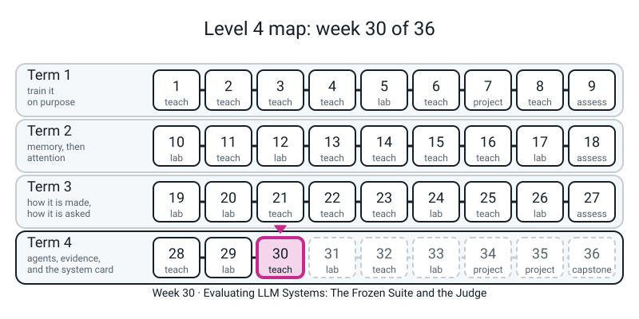
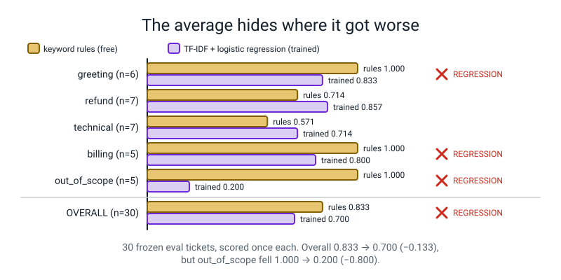
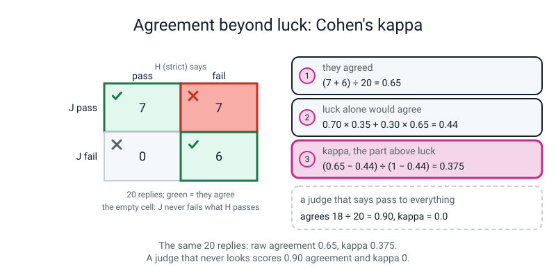

# Week 30 — Evaluating LLM Systems: The Frozen Suite and the Judge

[⬅ Week 29](week-29.md) · [Course Home](../README.md) · [Week 31 ➡](week-31.md) · [Workbook](../workbook/week-30.md)

---

> ### This week in one sentence
> **Freeze the test before you build, beat the cheap baseline before you trust anything fancy, keep the test out of the training data, and then check the judge itself: take luck out of its agreement with kappa, and ask it every question twice, in both orders.**
>
> **By the end of this chapter you will be able to:**
> - **Freeze a 30-ticket test set** with a fingerprint, and see the fingerprint catch a one-character edit
> - **Score three cheap systems on the same 30 tickets** (a floor, free keyword rules, a small trained classifier) and read a table that shows every category, not just the average
> - **Compute a Jaccard overlap by hand** with `&` and `|`, run a scan that keeps test tickets out of training, and say what it cannot see
> - **Compute Cohen's kappa by hand on 20 ratings**, then check it with the library, and say why raw agreement is a poor number
> - **Catch a judge with a hidden flaw** by asking each question twice with the order swapped
> - **Say why one run of a small test is one draw**, not a verdict
>
> **New maths:** **Cohen's kappa.** Agreement with the agreement-by-luck taken out: `κ = (p_o − p_e) / (1 − p_e)`.
>
> **New syntax:** `cohen_kappa_score(y1, y2)` (after you have done it by hand) · set intersection `A & B` and union `A | B` · `rng.choice([...])` (you will meet it when the sealed file is opened, at the end)
>
> **Reading time:** about 35 minutes. **In class:** 70 minutes. **Homework:** about 55 minutes (workbook pages 30.1 to 30.3).

> **📌 About the code blocks.** Eight of the blocks are **files** with a name in their first comment line (`evalset.py`, `traindata.py`, `dedup.py`, `scorer.py`, `compare.py`, `baselines.py`, `replies.py`, `mystery.py`). Save each one in your folder under that name. `traindata.py`, `scorer.py`, `compare.py`, `baselines.py` and `replies.py` are **handed over**: read them, do not retype them. `mystery.py` is **sealed**: you will be given the file but you must **not open it** until the end of section 9. The other blocks go, in order, into **one file**, `eval_suite.py` (or into one Python session), run from the folder that holds those eight files. Later blocks use names made by earlier ones. Every output shown was printed by a real run on a CPU. **Everything that looks random is seeded**, so your numbers should match. Nothing needs the internet, and no block takes more than about a second.

> **⚠️ There is no language model in this chapter.** Today you build a *ruler*. Four things get measured or scripted, and none of them is a model of language: a floor (always says one thing), free keyword rules, a small classifier you train from scratch on 64 tickets, and a **judge in `mystery.py` that is a stand-in, not a model** (it reads a rubric score, not language, and has a number typed into it). The 30 test tickets and the 66 training tickets were typed by the course author; they are short, tidy and invented, and look nothing like a real support queue. **Every number about the judge is a fact about a number typed into a file. It says nothing about how often a real judge model behaves any way at all.** What transfers is the *method*.

---


*Figure 30.0 — Week 30 of 36, term 4: how we decide whether any of it worked, before the system card in the last weeks.*

## 🪝 Start Here

Somebody tells you: **"Our new bot scores 90 percent."** Before any code, write three questions on a card. For each one, say what you would need to be told.

1. **"90 percent of what?"** Which tickets, how many, and from which categories?
2. **"Compared with what?"** A bot that always says one thing? A list of ten keywords?
3. **"Who marked it?"** The team that built the bot? A program? Another model?

Then a fourth: *who has the most reason not to look closely at the answer?*

Keep the card. We come back to it at the end.

---

## 🧠 The Big Idea

You have spent twenty-nine weeks building things and looking at whether they worked. Today you build the thing that decides *whether they worked*. Four ideas, in the order you will meet them.

**1. Freeze first.** A test written after you have seen the outputs is written to make them look good. So you write the test **first** and record a **fingerprint** of it (Week 21's `md5`, this time over the test data). If anybody changes a ticket, the fingerprint no longer matches and the program shouts. The fingerprint does not stop editing. It makes editing **loud**.

**2. Baseline first.** A fancy system has to beat the rung below it, not the floor.

```text
   floor        always give one answer
   free rules   ten keywords and ten minutes
   trained      a small model you train yourself
```

**3. Keep the test out of the lessons.** If the exam questions are in the textbook, a high mark means memory. The overlap of the two sets of tickets is called **contamination**. You will measure it with a word-overlap number, and you will see that it finds copies and misses rewordings.

**4. A judge is an instrument, and instruments get checked.** When an answer is a sentence, something has to mark it: a program with a **rubric**, a person, or another model. The marker is called a **judge**. Two checks for a judge:

- **Do two raters agree *beyond luck*?** That is Cohen's kappa.
- **Does the judge change its answer when I only swap the order of the two things it compares?** If it does, it is telling you about *position*, not about the things.

### 🔢 The new maths: Cohen's kappa

Two raters, **H** (strict) and **J** (lenient), each say *pass* or *fail* to the same 20 replies. Count the four kinds of pair:

```text
                      H says pass    H says fail
   J says pass            7              7          -> J passes 14 of 20
   J says fail            0              6          -> J fails   6 of 20
                      H passes 7     H fails 13
```

**Step 1: how often did they agree?** The agreeing cells are "both pass" (7) and "both fail" (6). `p_o = (7 + 6) / 20 = 0.65`. (`p_o` is the agreement that was *observed*.)

**Step 2: how often would two raters agree by luck?** Suppose each kept their own *habit* (J says pass 14 times in 20, H says pass 7 times in 20) and neither looked at the reply. Both say pass with chance `0.70 × 0.35 = 0.245`. Both say fail with chance `0.30 × 0.65 = 0.195`. Luck alone agrees `p_e = 0.245 + 0.195 = 0.44` of the time. (`p_e` is the agreement *expected* by luck.)

> *"We agreed 65 percent of the time. Two people who never read the replies and just stuck to their habits would have agreed 44 percent of the time. So the real agreement is the part above 44."*

**Step 3: the part above luck, as a share of what was available.** Above luck we got `0.65 − 0.44 = 0.21`. The most that could be above luck is `1 − 0.44 = 0.56`. So

```text
κ = (p_o − p_e) / (1 − p_e) = 0.21 / 0.56 = 0.375
```

`κ = 1` is perfect agreement. `κ = 0` is no better than luck. It can go negative (worse than luck). People often attach names to bands (0.2 to 0.4 "fair", 0.4 to 0.6 "moderate", 0.6 to 0.8 "substantial"). That is a **convention**, not a law; the right number depends on what a wrong verdict costs.

**Why not just report the agreement?** A person passes 18 of 20 replies. A lazy judge says "pass" to all 20. Agreement is `18/20 = 0.90`. Luck: the judge passes always (`1.0`) and the person passes `0.90`, so `p_e = 1.0 × 0.90 + 0.0 × 0.10 = 0.90`, and `κ = (0.90 − 0.90) / (1 − 0.90) = 0`. **Ninety percent agreement, zero skill.** Raw agreement rewards a judge that never looks whenever almost everything passes.

**Direction matters.** In the grid, one off-diagonal cell is 7 and the other is 0: J never fails a reply that H passes, and passes 7 replies that H fails. Kappa squeezes that into one number. The two cells tell you which way the judge leans.

---

## 1. The three new pieces of syntax

**`cohen_kappa_score(y1, y2)`.** From `sklearn.metrics`. It takes two lists of labels of the same length, one per rater, in the same item order, and returns kappa. Here the lists hold `1` (pass) and `0` (fail). It does the arithmetic above. You type it only **after** you have done the hand calculation, as a check.

**Set intersection `A & B` and union `A | B`.** You met sets in Week 26 (checking that cited ids were a subset of served ids). A set holds each item once and forgets order: `set(["a", "b", "a"])` is `{"a", "b"}`. `A & B` is the items in **both**. `A | B` is the items in **either**. Then

```text
Jaccard overlap  =  len(A & B) / len(A | B)
```

is "words shared, divided by different words in either". Identical tickets score `1.0`; tickets with no word in common score `0.0`.

**`rng.choice([...])`.** On a `random.Random(seed)` (Week 24): it picks one item of a list, reproducibly. You will see it inside the sealed file, breaking a tie. Its sibling on the same object, `rng.random()` (a float from 0 up to but not including 1), is "another method on the same generator"; you will see that too.

Everything else today is old: `hashlib.md5` and `.hexdigest()` (Week 21), `re.findall` (Week 20), `Counter` (Week 20), f-strings, `lambda` as a `key=`, comprehensions, `zip`, `enumerate`.

---

## 2. Freeze the test first

Type this file **before** anything else is built. Type the first eight tickets and the freeze lines at the bottom yourself; paste the other twenty-two. Typing them adds nothing.

The freeze is the last part of the file. Here is how to fill it in. First leave `FROZEN = ""` and the last two lines out, run `print(fingerprint(EVAL))`, copy the 32 characters it prints, paste them into `FROZEN`, and then add the two `assert`s. After that, the file checks itself every time it is imported.

```python
# evalset.py - the FROZEN eval set. Written 2026-09-01, before any training. Do not edit.
# Each case is (text, gold_label). Here the category is the label itself.
import hashlib

LABELS = ["greeting", "refund", "technical", "billing", "out_of_scope"]

EVAL = [
    # ---- greeting (6) ----
    ("hey! quick one for you",                                  "greeting"),
    ("good afternoon, are you there?",                          "greeting"),
    ("hiya",                                                    "greeting"),
    ("hello - first time using this",                           "greeting"),
    ("morning, got a sec?",                                     "greeting"),
    ("hi, hope this is the right place",                        "greeting"),
    # ---- refund (7) ----
    ("these shoes are the wrong colour, how do I send them back?", "refund"),
    ("I'd like my money returned for order 55301",              "refund"),
    ("is there a time limit on sending items back?",            "refund"),
    ("package never arrived, I want reimbursing",               "refund"),
    ("do I pay postage to return something?",                   "refund"),
    ("cancel order 7781 and put the money back on my card",     "refund"),
    ("opened it, hated it - can I still send it back?",         "refund"),
    # ---- technical (7) ----
    ("clicking save does absolutely nothing",                   "technical"),
    ("everything is blank after I sign in",                     "technical"),
    ("the android version force closes on launch",              "technical"),
    ("my csv download has headers but no rows",                 "technical"),
    ("reset email never turns up in my inbox",                  "technical"),
    ("charts stopped rendering yesterday afternoon",            "technical"),
    ("keeps saying 'network error' on a perfect connection",    "technical"),
    # ---- billing (5) ----
    ("took the money twice on the 3rd",                         "billing"),
    ("swap me onto the yearly plan",                            "billing"),
    ("need a proper tax invoice for accounting",                "billing"),
    ("what am I paying per month right now?",                   "billing"),
    ("card expired, where do I put the new one?",               "billing"),
    # ---- out_of_scope (5) ----
    ("what's a good recipe for dosa?",                          "out_of_scope"),
    ("how tall is Mount Kilimanjaro?",                          "out_of_scope"),
    ("write my sister a birthday message",                      "out_of_scope"),
    ("explain quantum entanglement",                            "out_of_scope"),
    ("should I buy bitcoin?",                                   "out_of_scope"),
]

assert len(EVAL) == 30


# ---- the freeze: a fingerprint of the 30 cases, written down the day they were written ----
def fingerprint(cases):
    return hashlib.md5("\n".join(f"{t}|{y}" for t, y in cases).encode("utf-8")).hexdigest()


FROZEN = "73b33debbc8d8c4241051bc5670ef4dd"
assert len(EVAL) == 30
assert fingerprint(EVAL) == FROZEN, "the frozen eval set was edited"
```

The training tickets were written **after** the eval set. This file is handed over; read it, do not retype it.

```python
# traindata.py - training tickets, written AFTER the eval set.
TRAIN_RAW = [
    # ---- greeting (14) ----
    ("hi there", "greeting"), ("hello", "greeting"),
    ("hey, anyone around?", "greeting"), ("good morning", "greeting"),
    ("hi, hope you're well", "greeting"), ("yo", "greeting"),
    ("hello, is this the support chat?", "greeting"), ("hey team", "greeting"),
    ("good evening", "greeting"), ("hi again", "greeting"),
    ("morning!", "greeting"), ("hello there, quick question coming", "greeting"),
    ("hey, thanks for picking up", "greeting"), ("greetings", "greeting"),
    # ---- refund (14 + 1 planted duplicate) ----
    ("I want my money back", "refund"),
    ("how do I return this order?", "refund"),
    ("the jacket doesn't fit, can I send it back?", "refund"),
    ("please refund order 41822", "refund"),
    ("I was charged for something I returned last week", "refund"),
    ("can I get a refund if I opened the box?", "refund"),
    ("I'd like to cancel and be reimbursed", "refund"),
    ("the item arrived broken, I want a refund", "refund"),
    ("return label please", "refund"),
    ("how long do refunds take to show up?", "refund"),
    ("I changed my mind, refund me", "refund"),
    ("sent the wrong size, want my money back", "refund"),
    ("can I exchange instead of a refund?", "refund"),
    ("refund status for order 90210", "refund"),
    ("is there a time limit on sending items back?", "refund"),
    # ---- technical (14) ----
    ("the app crashes when I open settings", "technical"),
    ("I can't log in, it says invalid token", "technical"),
    ("the page is stuck loading forever", "technical"),
    ("export to CSV produces an empty file", "technical"),
    ("notifications stopped working after the update", "technical"),
    ("getting a 500 error on checkout", "technical"),
    ("the mobile app won't sync", "technical"),
    ("my dashboard shows no data since Tuesday", "technical"),
    ("search returns nothing for any query", "technical"),
    ("two-factor codes are never arriving", "technical"),
    ("the site looks broken in Safari", "technical"),
    ("uploading a photo fails at 90 percent", "technical"),
    ("I keep getting logged out every few minutes", "technical"),
    ("dark mode toggle does nothing", "technical"),
    # ---- billing (14 + 1 planted near-duplicate) ----
    ("I was charged twice this month", "billing"),
    ("how do I update my credit card?", "billing"),
    ("what plan am I on?", "billing"),
    ("can I switch to annual billing?", "billing"),
    ("my invoice for March is missing", "billing"),
    ("why did my price go up?", "billing"),
    ("cancel my subscription please", "billing"),
    ("do you offer a student discount?", "billing"),
    ("I need a VAT receipt", "billing"),
    ("when is my next payment due?", "billing"),
    ("the payment failed but money left my account", "billing"),
    ("how much is the pro tier?", "billing"),
    ("add a second seat to my account", "billing"),
    ("change the billing email address", "billing"),
    ("what am I paying each month right now?", "billing"),
    # ---- out_of_scope (8 -- deliberately under-represented) ----
    ("what's the weather in Chennai tomorrow?", "out_of_scope"),
    ("write me a poem about cricket", "out_of_scope"),
    ("who won the world cup in 2018?", "out_of_scope"),
    ("can you do my maths homework?", "out_of_scope"),
    ("what is the capital of Peru?", "out_of_scope"),
    ("tell me a joke", "out_of_scope"),
    ("translate 'good night' into French", "out_of_scope"),
    ("what stocks should I buy?", "out_of_scope"),
]
```

Now the first run. It counts the data, checks the fingerprint, and runs a contamination scan that you have not read yet (it lives in `dedup.py`, section 5). Save `dedup.py` (below) first.

Here is `dedup.py`. Type it, with the explanation of `&` and `|` from section 1 fresh in your mind.

```python
# dedup.py - run this BEFORE training, every single time.
import re
from evalset import EVAL
from traindata import TRAIN_RAW


def words(s):
    return set(re.findall(r"[a-z0-9]+", s.lower()))


def jaccard(a, b):
    A, B = words(a), words(b)
    return len(A & B) / len(A | B) if (A | B) else 0.0


def decontaminate(train, evalset, threshold=0.70, verbose=True):
    clean, removed = [], []
    for i, (t, y) in enumerate(train):
        worst = max(((jaccard(t, e), j, e) for j, (e, _) in enumerate(evalset)), key=lambda x: x[0])
        if worst[0] >= threshold:
            removed.append((i, t, worst))
        else:
            clean.append((t, y))
    if verbose:
        print(f"contamination scan: {len(train)} train x {len(evalset)} eval")
        for i, t, (sim, j, e) in removed:
            kind = "EXACT" if sim >= 0.999 else "NEAR "
            print(f"  {kind} train#{i:<3d} {t!r}\n        eval#{j:<3d} {e!r}   Jaccard {sim:.3f}")
        print(f"  removed {len(removed)}, kept {len(clean)}")
    return clean, removed
```

`words(s)` lower-cases the ticket, keeps letters and digits, and makes a **set**. One quirk: `"doesn't"` becomes two words, `doesn` and `t`, because the apostrophe is not a letter. `jaccard(a, b)` is the formula from section 1, with a guard: if both tickets have no words at all, `A | B` is empty and dividing by its length would crash, so it returns `0.0`. `decontaminate` compares every training ticket against every eval ticket, keeps the biggest overlap, and **removes** the training ticket if that overlap is at least `threshold`.

Before you run the next block, write on a card: *which category can we say the least about?* Then run it.

```python
# p1_check.py - Week 30: what is in the frozen set, its fingerprint, and one run of the scan.
from collections import Counter
from evalset import EVAL, LABELS, FROZEN, fingerprint
from traindata import TRAIN_RAW
from dedup import decontaminate

print("eval cases:", len(EVAL), " per label:", dict(Counter(y for _, y in EVAL)))
print("fingerprint:", fingerprint(EVAL))
print("same as the one written down at freeze time:", fingerprint(EVAL) == FROZEN)
print("raw training tickets:", len(TRAIN_RAW), " per label:", dict(Counter(y for _, y in TRAIN_RAW)))
TRAIN, removed = decontaminate(TRAIN_RAW, EVAL)
print("kept per label:", dict(Counter(y for _, y in TRAIN)))
```

```text
eval cases: 30  per label: {'greeting': 6, 'refund': 7, 'technical': 7, 'billing': 5, 'out_of_scope': 5}
fingerprint: 73b33debbc8d8c4241051bc5670ef4dd
same as the one written down at freeze time: True
raw training tickets: 66  per label: {'greeting': 14, 'refund': 15, 'technical': 14, 'billing': 15, 'out_of_scope': 8}
contamination scan: 66 train x 30 eval
  EXACT train#28  'is there a time limit on sending items back?'
        eval#8   'is there a time limit on sending items back?'   Jaccard 1.000
  NEAR  train#57  'what am I paying each month right now?'
        eval#23  'what am I paying per month right now?'   Jaccard 0.778
  removed 2, kept 64
kept per label: {'greeting': 14, 'refund': 14, 'technical': 14, 'billing': 14, 'out_of_scope': 8}
```

The fingerprint printed is the one in `FROZEN`, so `True`. The scan found two tickets you never pointed at. We read how it did that in sections 4 and 5. **Indices are zero-based**, as Python prints them.

---

## 3. Three rungs, scored on the same thirty

Two files are handed over: `scorer.py` (exact match after tidying the answer, with a per-category breakdown) and `baselines.py` (three cheap systems). Read them. Notice three things:

- `score(preds, name)` returns a **dict** with `overall`, `correct`, `n`, `per_category` and `wrong`. Week 31 reads exactly these keys.
- The floor, `majority_predict`, answers with the commonest training label.
- `RULES` is a list of keyword lists in a fixed order. The **first** list with a hit wins. If nothing matches, the answer is `out_of_scope`.

```python
# scorer.py - exact match after normalising, plus a per-category breakdown.
import re
from evalset import EVAL, LABELS

SYNONYMS = {                        # plausible phrasings mapped onto the canonical labels
    "tech": "technical", "technical support": "technical", "support": "technical",
    "return": "refund", "returns": "refund", "refunds": "refund",
    "payment": "billing", "payments": "billing", "invoice": "billing",
    "greetings": "greeting", "hello": "greeting", "smalltalk": "greeting",
    "other": "out_of_scope", "off-topic": "out_of_scope", "none": "out_of_scope",
    "out of scope": "out_of_scope", "unrelated": "out_of_scope",
}


def normalise(pred):
    p = "".join(re.findall(r"[a-z_ -]", str(pred).lower())).strip()
    p = SYNONYMS.get(p, p)
    return p if p in LABELS else "UNPARSEABLE"


def score(preds, name="system"):
    """preds: a list of 30 raw predictions, in the same order as EVAL."""
    assert len(preds) == len(EVAL), "prediction count must match the frozen eval set"
    per = {cat: [0, 0] for cat in LABELS}           # category -> [correct, total]
    wrong = []
    for (text, gold), raw in zip(EVAL, preds):
        p = normalise(raw)
        per[gold][1] += 1
        if p == gold:
            per[gold][0] += 1
        else:
            wrong.append((text, gold, p))
    total_ok = sum(c for c, t in per.values())
    return {"name": name, "overall": total_ok / len(EVAL), "correct": total_ok, "n": len(EVAL),
            "per_category": {k: (c, t, c / t) for k, (c, t) in per.items()},
            "wrong": wrong}


def report(res):
    print(f"\n=== {res['name']} ===  overall {res['correct']}/{res['n']} = {res['overall']:.3f}")
    for cat in LABELS:
        c, t, a = res["per_category"][cat]
        print(f"  {cat:14s} {c}/{t}  {a:.3f}  {'#' * round(a * 20)}")
    for text, gold, pred in res["wrong"]:
        print(f"    x {text[:48]:50s} gold={gold:13s} pred={pred}")
```

```python
# baselines.py - the cheap systems a fancier system must beat. None of them understands language.
from collections import Counter
from sklearn.feature_extraction.text import TfidfVectorizer
from sklearn.linear_model import LogisticRegression

RULES = [
    ("greeting",  ["hi", "hiya", "hello", "hey", "morning", "afternoon", "evening"]),
    ("refund",    ["refund", "return", "send them back", "send it back", "money back",
                   "reimburs", "postage"]),
    ("billing",   ["invoice", "plan", "paying", "charge", "card", "billing",
                   "subscription", "twice"]),
    ("technical", ["error", "crash", "blank", "csv", "loading", "sync", "closes",
                   "rendering", "nothing", "inbox"]),
]


def rules_predict(text):
    low = text.lower()
    for label, keys in RULES:
        if any(k in low for k in keys):
            return label
    return "out_of_scope"


def majority_predict(train):
    """The dumbest baseline: always answer the commonest training label."""
    return Counter(y for _, y in train).most_common(1)[0][0]


def tfidf_fit_predict(train, texts):
    """A small classifier trained from scratch on the training tickets. Week 25's TF-IDF plus Level 2's logistic regression."""
    vec = TfidfVectorizer(ngram_range=(1, 2), sublinear_tf=True)
    X = vec.fit_transform([t for t, _ in train])
    clf = LogisticRegression(max_iter=1000, C=10, random_state=0).fit(X, [y for _, y in train])
    return list(clf.predict(vec.transform(texts)))
```

**Predict first.** On a sticky note, put the three systems (floor, free rules, trained classifier) in the order you expect them to score, best first. Then run this.

```python
# p2_baselines.py - Week 30: three cheap systems on the frozen eval.
from scorer import score, report
from baselines import rules_predict, majority_predict, tfidf_fit_predict

texts = [t for t, _ in EVAL]
answer = majority_predict(TRAIN)
r_floor = score([answer] * 30, f"always say {answer!r}")
r_rules = score([rules_predict(t) for t in texts], "keyword rules (free)")
r_tfidf = score(tfidf_fit_predict(TRAIN, texts), "TF-IDF + logistic regression")
for r in (r_floor, r_rules, r_tfidf):
    print(f"{r['name']:32s} {r['correct']:2d}/30 = {r['overall']:.3f}")
best_constant = max(Counter(y for _, y in EVAL).values())
print(f"best possible constant answer on this eval: {best_constant}/30 = {best_constant / 30:.3f}")
report(r_rules)
```

```text
always say 'greeting'             6/30 = 0.200
keyword rules (free)             25/30 = 0.833
TF-IDF + logistic regression     21/30 = 0.700
best possible constant answer on this eval: 7/30 = 0.233

=== keyword rules (free) ===  overall 25/30 = 0.833
  greeting       6/6  1.000  ####################
  refund         5/7  0.714  ##############
  technical      4/7  0.571  ###########
  billing        5/5  1.000  ####################
  out_of_scope   5/5  1.000  ####################
    x is there a time limit on sending items back?       gold=refund        pred=out_of_scope
    x do I pay postage to return something?              gold=refund        pred=greeting
    x clicking save does absolutely nothing              gold=technical     pred=greeting
    x everything is blank after I sign in                gold=technical     pred=greeting
    x charts stopped rendering yesterday afternoon       gold=technical     pred=greeting
```

Did your order survive? The trained one has to be compared with the *rules*, not with the floor. Read the rules' five misses aloud. `"hi"` is a greeting key, and `"hi"` sits inside `something`, `nothing` and `everything`, and `afternoon` is itself a greeting key, so the greeting rule grabs three technical and one refund ticket before their own rules get a turn. (A key matched inside a longer word is a classic bug of keyword rules.)

Now the table that tells the truth: the average, then **every category**. `compare.py` is handed over; read the table it prints.

```python
# compare.py - the table that tells the truth: an average, then every category.
from evalset import LABELS


def compare(before, after, min_n=5, drop_threshold=0.10):
    print(f"\n{'category':14s} {'n':>3s} {'before':>8s} {'after':>8s} {'delta':>8s}")
    print("-" * 46)
    regressions = []
    for cat in LABELS:
        cb, n, ab = before["per_category"][cat]
        ca, _, aa = after["per_category"][cat]
        d = aa - ab
        flag = ""
        if n >= min_n and d <= -drop_threshold:
            flag = "  <-- REGRESSION"
            regressions.append((cat, n, ab, aa, d))
        print(f"{cat:14s} {n:3d} {ab:8.3f} {aa:8.3f} {d:+8.3f}{flag}")
    print("-" * 46)
    d_all = after["overall"] - before["overall"]
    print(f"{'OVERALL':14s} {before['n']:3d} {before['overall']:8.3f} "
          f"{after['overall']:8.3f} {d_all:+8.3f}")

    print("\ncontribution of each category to the overall delta:")
    for cat in LABELS:
        cb, n, ab = before["per_category"][cat]
        _, _, aa = after["per_category"][cat]
        print(f"  {cat:14s} (n/N = {n}/{before['n']}) x {aa - ab:+.3f} = {n / before['n'] * (aa - ab):+.4f}")

    if regressions:
        print(f"\n{len(regressions)} REGRESSION(S) - do not ship on the average alone:")
        for cat, n, ab, aa, d in regressions:
            print(f"   {cat}: {ab:.3f} -> {aa:.3f} ({d:+.1%} on n={n})")
    else:
        print("\nno category with n>=5 dropped by more than 10 points")
    return regressions
```

```python
# p10_compare.py - Week 30: Week 31's table, with Week 30's two baselines.
from compare import compare

compare(r_rules, r_tfidf)
```

```text

category         n   before    after    delta
----------------------------------------------
greeting         6    1.000    0.833   -0.167  <-- REGRESSION
refund           7    0.714    0.857   +0.143
technical        7    0.571    0.714   +0.143
billing          5    1.000    0.800   -0.200  <-- REGRESSION
out_of_scope     5    1.000    0.200   -0.800  <-- REGRESSION
----------------------------------------------
OVERALL         30    0.833    0.700   -0.133

contribution of each category to the overall delta:
  greeting       (n/N = 6/30) x -0.167 = -0.0333
  refund         (n/N = 7/30) x +0.143 = +0.0333
  technical      (n/N = 7/30) x +0.143 = +0.0333
  billing        (n/N = 5/30) x -0.200 = -0.0333
  out_of_scope   (n/N = 5/30) x -0.800 = -0.1333

3 REGRESSION(S) - do not ship on the average alone:
   greeting: 1.000 -> 0.833 (-16.7% on n=6)
   billing: 1.000 -> 0.800 (-20.0% on n=5)
   out_of_scope: 1.000 -> 0.200 (-80.0% on n=5)
```

Ask the table two questions. Where does the gap come from? (Look at `out_of_scope`.) Why is the rules' `out_of_scope` perfect? (Think about what the rules say when nothing matches.) Then read the last block: three categories fell by more than ten points, and the average fell by four tickets. A single average would have hidden which categories broke.


*Figure 30.1 — The average fell 0.133, but one category fell 0.800: read every category before you ship.*

---

## 4. Overlap, by hand

Two tickets, as sets, with `&` and `|` doing the work.

```python
# p3_jaccard.py - Week 30: Jaccard overlap, worked on the near-copy the scan found.
from dedup import words, jaccard

a = "what am I paying each month right now?"          # a training ticket
b = "what am I paying per month right now?"           # an eval ticket
A, B = words(a), words(b)
print("A:", sorted(A))
print("B:", sorted(B))
print("in both (A & B):", sorted(A & B), "->", len(A & B))
print("in either (A | B):", sorted(A | B), "->", len(A | B))
print(f"Jaccard = {len(A & B)}/{len(A | B)} = {len(A & B) / len(A | B):.3f}  (function says {jaccard(a, b):.3f})")
print("two tickets about the same thing, worded apart:",
      f"{jaccard('could you tell me my current monthly charge?', b):.3f}")
```

```text
A: ['am', 'each', 'i', 'month', 'now', 'paying', 'right', 'what']
B: ['am', 'i', 'month', 'now', 'paying', 'per', 'right', 'what']
in both (A & B): ['am', 'i', 'month', 'now', 'paying', 'right', 'what'] -> 7
in either (A | B): ['am', 'each', 'i', 'month', 'now', 'paying', 'per', 'right', 'what'] -> 9
Jaccard = 7/9 = 0.778  (function says 0.778)
two tickets about the same thing, worded apart: 0.000
```

`7 / 9 = 0.778`, and the function agrees. The last line matters: a ticket that asks the *same thing* in *different words* scores `0.000`. **The scan compares words, not meaning.**

---

## 5. What the scan protected, and what it cannot see

Here is the experiment. Train the same classifier three ways and score each on the same 30 tickets:

1. the 64 tickets the scan kept
2. all 66, with the two copies left in
3. the 64 plus five **paraphrases** of eval tickets (same question, new words)

```python
# p4_leak.py - Week 30: score the same classifier with and without the scan, then with five paraphrases the scan misses.
SNEAKY = [
    ("how many days do I have to post an unwanted product?",      "refund"),      # eval#8
    ("could you tell me my current monthly charge?",              "billing"),     # eval#23
    ("pressing the save button has no effect whatsoever",         "technical"),   # eval#13
    ("what is the elevation of Africa's highest peak?",           "out_of_scope"),# eval#26
    ("you debited my account two times earlier this month",       "billing"),     # eval#20
]
r_raw = score(tfidf_fit_predict(TRAIN_RAW, texts), "trained on all 66 (no scan)")
r_sneaky = score(tfidf_fit_predict(TRAIN + SNEAKY, texts), "trained on 64 + 5 paraphrases")
for r in (r_tfidf, r_raw, r_sneaky):
    print(f"{r['name']:32s} {r['correct']:2d}/30 = {r['overall']:.3f}")
_, caught = decontaminate(TRAIN + SNEAKY, EVAL, verbose=False)
print("paraphrases the scan caught:", len(caught))
for t, _ in SNEAKY:
    best = max(jaccard(t, e) for e, _ in EVAL)
    print(f"  highest Jaccard against any eval ticket: {best:.3f}   {t[:46]}")
```

```text
TF-IDF + logistic regression     21/30 = 0.700
trained on all 66 (no scan)      22/30 = 0.733
trained on 64 + 5 paraphrases    23/30 = 0.767
paraphrases the scan caught: 0
  highest Jaccard against any eval ticket: 0.200   how many days do I have to post an unwanted pr
  highest Jaccard against any eval ticket: 0.083   could you tell me my current monthly charge?
  highest Jaccard against any eval ticket: 0.143   pressing the save button has no effect whatsoe
  highest Jaccard against any eval ticket: 0.143   what is the elevation of Africa's highest peak
  highest Jaccard against any eval ticket: 0.077   you debited my account two times earlier this 
```

Read it slowly. Leaving the exact copy in was worth one ticket (`22` against `21`). Five paraphrases were worth two more (`23`). The scan caught **none** of the five, because their highest overlap with any eval ticket is tiny. So is `23` better than `21`? No. It measures memory of the paraphrases. **A scan with a threshold is a dial**: set it lower and it removes harmless tickets too; set it at `0.95` and it leaves the near-copy in.

---

## 6. Replies, a rubric and two raters

Before this section, do **Page 30.2 (Agreement on Paper)** from the "Your Turn" section below. Twenty ratings, tallied by hand into the grid. Then come back and check your arithmetic against the code.

Thirty tickets each have two candidate replies, from an old bot (`v1`) and a new bot (`v2`). **A script built the replies from fixed templates; no model wrote them.** A **rubric** gives each reply up to three points: it is short (25 words or fewer), it names the right route, and it makes no promise. The rubric is a short function, so it can act as an answer key.

```python
# replies.py - canned replies for the 30 eval tickets, and a rubric a program can apply. NOT written by a model.
from evalset import EVAL, LABELS

ROUTE = {"greeting": "a greeting", "refund": "a refund request", "technical": "a technical fault",
         "billing": "a billing question", "out_of_scope": "something outside this shop"}
PROMISES = ["within", "guarantee", "definitely"]
PROMISE = " It will definitely be fixed within 24 hours."
FILLER = " We really do appreciate you getting in touch with us today and we hope your week is going well."
V1_KINDS = ["good", "promise", "bad", "promise", "good", "bad"]      # the old bot, repeating every 6 tickets
V2_KINDS = ["promise", "good", "good", "good", "long", "long"]       # the new bot


def make_reply(label, kind):
    other = LABELS[(LABELS.index(label) + 1) % len(LABELS)]
    good = f"This looks like {ROUTE[label]}, so I am passing it on."
    wrong = f"This looks like {ROUTE[other]}, so I am passing it on."
    return {"good": good, "promise": good + PROMISE, "wrong": wrong,
            "bad": wrong + PROMISE, "long": good + FILLER}[kind]


def rubric(reply, label):
    """Three checks, one point each: short (25 words or fewer), names the right route, makes no promise."""
    short = len(reply.split()) <= 25
    routed = ROUTE[label] in reply
    no_promise = not any(p in reply.lower() for p in PROMISES)
    return int(short) + int(routed) + int(no_promise)


def make_pairs():
    """One (ticket, label, v1 reply, v2 reply) per eval ticket."""
    return [(text, label, make_reply(label, V1_KINDS[i % 6]), make_reply(label, V2_KINDS[i % 6]))
            for i, (text, label) in enumerate(EVAL)]
```

```python
# p5_pairs.py - Week 30: 30 pairs of canned replies, and what the rubric says about them.
from replies import make_pairs, rubric

pairs = make_pairs()
for text, label, r1, r2 in pairs[:3]:
    print(f"ticket: {text!r} (gold {label})")
    print(f"  v1 [{rubric(r1, label)}/3] {r1}")
    print(f"  v2 [{rubric(r2, label)}/3] {r2}")
v1_better = sum(rubric(r1, l) > rubric(r2, l) for _, l, r1, r2 in pairs)
v2_better = sum(rubric(r1, l) < rubric(r2, l) for _, l, r1, r2 in pairs)
print("rubric says: v1 better in", v1_better, "pairs, v2 better in", v2_better, "pairs, tied in", 30 - v1_better - v2_better)
```

```text
ticket: 'hey! quick one for you' (gold greeting)
  v1 [3/3] This looks like a greeting, so I am passing it on.
  v2 [2/3] This looks like a greeting, so I am passing it on. It will definitely be fixed within 24 hours.
ticket: 'good afternoon, are you there?' (gold greeting)
  v1 [2/3] This looks like a greeting, so I am passing it on. It will definitely be fixed within 24 hours.
  v2 [3/3] This looks like a greeting, so I am passing it on.
ticket: 'hiya' (gold greeting)
  v1 [1/3] This looks like a refund request, so I am passing it on. It will definitely be fixed within 24 hours.
  v2 [3/3] This looks like a greeting, so I am passing it on.
rubric says: v1 better in 10 pairs, v2 better in 20 pairs, tied in 0
```

Now the two raters. **H** passes a reply only with 3 of 3. **J** passes at 2 of 3. Both are programs, not models of language. First the table and the tally, then the arithmetic by hand, and only then the library.

```python
# p6_kappa.py - Week 30: Cohen's kappa, by hand first and then with the library.
items = [(text, label, r1) for text, label, r1, r2 in pairs[:20]]      # the old bot's reply to tickets 0-19
H = [1 if rubric(r, l) == 3 else 0 for _, l, r in items]               # strict: pass only with 3 of 3
J = [1 if rubric(r, l) >= 2 else 0 for _, l, r in items]               # lenient: pass with 2 of 3
print(" #  score  H  J   ticket")
for i, ((text, l, r), h, j) in enumerate(zip(items, H, J)):
    print(f"{i:2d}    {rubric(r, l)}    {h}  {j}   {text[:40]}")

both_pass = sum(h == 1 and j == 1 for h, j in zip(H, J))
j_pass_h_fail = sum(h == 0 and j == 1 for h, j in zip(H, J))
j_fail_h_pass = sum(h == 1 and j == 0 for h, j in zip(H, J))
both_fail = sum(h == 0 and j == 0 for h, j in zip(H, J))
print("\nboth pass", both_pass, "| J pass, H fail", j_pass_h_fail, "| J fail, H pass", j_fail_h_pass, "| both fail", both_fail)

n = 20
p_o = (both_pass + both_fail) / n                       # how often they agree
j_rate = (both_pass + j_pass_h_fail) / n                # how often J says pass
h_rate = (both_pass + j_fail_h_pass) / n                # how often H says pass
p_e = j_rate * h_rate + (1 - j_rate) * (1 - h_rate)     # how often they would agree by luck
kappa = (p_o - p_e) / (1 - p_e)
print(f"p_o = {p_o:.4f}   J passes {j_rate:.2f}, H passes {h_rate:.2f}   p_e = {p_e:.4f}")
print(f"kappa = ({p_o:.4f} - {p_e:.4f}) / (1 - {p_e:.4f}) = {kappa:.4f}")

from sklearn.metrics import cohen_kappa_score
print("library says:", round(cohen_kappa_score(H, J), 4))
```

```text
 #  score  H  J   ticket
 0    3    1  1   hey! quick one for you
 1    2    0  1   good afternoon, are you there?
 2    1    0  0   hiya
 3    2    0  1   hello - first time using this
 4    3    1  1   morning, got a sec?
 5    1    0  0   hi, hope this is the right place
 6    3    1  1   these shoes are the wrong colour, how do
 7    2    0  1   I'd like my money returned for order 553
 8    1    0  0   is there a time limit on sending items b
 9    2    0  1   package never arrived, I want reimbursin
10    3    1  1   do I pay postage to return something?
11    1    0  0   cancel order 7781 and put the money back
12    3    1  1   opened it, hated it - can I still send i
13    2    0  1   clicking save does absolutely nothing
14    1    0  0   everything is blank after I sign in
15    2    0  1   the android version force closes on laun
16    3    1  1   my csv download has headers but no rows
17    1    0  0   reset email never turns up in my inbox
18    3    1  1   charts stopped rendering yesterday after
19    2    0  1   keeps saying 'network error' on a perfec

both pass 7 | J pass, H fail 7 | J fail, H pass 0 | both fail 6
p_o = 0.6500   J passes 0.70, H passes 0.35   p_e = 0.4400
kappa = (0.6500 - 0.4400) / (1 - 0.4400) = 0.3750
library says: 0.375
```

Compare with your Page 30.2. Then the lopsided case:

```python
# p7_constant.py - Week 30: a judge that never looks, on a lopsided set.
H2 = [1] * 18 + [0] * 2                 # the human passes 18 of 20
Z = [1] * 20                            # the judge says pass to everything
agree = sum(h == z for h, z in zip(H2, Z)) / 20
print("raw agreement:", agree, "  kappa:", round(cohen_kappa_score(H2, Z), 4))
print("our lenient J against strict H:  raw agreement", p_o, "  kappa", round(cohen_kappa_score(H, J), 4))
```

```text
raw agreement: 0.9   kappa: 0.0
our lenient J against strict H:  raw agreement 0.65   kappa 0.375
```

Ninety percent agreement, kappa zero. Ask the direction question of the lenient judge, too: which off-diagonal cell is empty?


*Figure 30.2 — Kappa is the agreement left over once luck is taken out: 0.65 raw becomes 0.375.*

---

## 7. The sealed judge: ask everything twice

`mystery.py` holds a **pairwise judge** with a flaw planted in it. Do not open it. The judge is told the ticket's label and two replies, `A` and `B`, and answers `"A"` or `"B"`. We cannot see inside, but we can ask each question **twice**, once with `v1` shown first and once with `v2` shown first. An honest judge gives the same *winner* both times.

`bias_test` runs every pair in both orders and counts:

- `first_wins`: how often the reply shown first won (of 60 answers; a judge with no position habit gives 30)
- `flips`: pairs where the winner changed when only the order changed
- `naive_v1`: how many times `v1` won when `v1` was shown first, which is what a single run would have told you
- `v1_cons`, `v2_cons`: pairs where the same reply won both times

Note the comment: **one** generator is made once, outside the loop, and shared by every call. The last section shows why.

```python
# p8_bias.py - Week 30: ask a pairwise judge each question twice, in both orders, and count what changes.
import random
from mystery import judge_pair


def bias_test(pairs, seed):
    rng = random.Random(seed)                  # ONE generator for the whole test (see Break It On Purpose)
    first_wins = flips = v1_cons = v2_cons = naive_v1 = 0
    for text, label, r1, r2 in pairs:
        fwd = judge_pair(label, r1, r2, rng)   # v1 shown first (position A)
        rev = judge_pair(label, r2, r1, rng)   # v2 shown first
        naive_v1 += fwd == "A"
        first_wins += (fwd == "A") + (rev == "A")
        w_fwd = "v1" if fwd == "A" else "v2"
        w_rev = "v2" if rev == "A" else "v1"
        if w_fwd != w_rev:
            flips += 1
        elif w_fwd == "v1":
            v1_cons += 1
        else:
            v2_cons += 1
    return {"n": len(pairs), "first_wins": first_wins, "flips": flips, "v1_cons": v1_cons,
            "v2_cons": v2_cons, "naive_v1": naive_v1}


t = bias_test(pairs, 0)
n = t["n"]
print(f"first-position wins: {t['first_wins']}/{2 * n} = {t['first_wins'] / (2 * n):.3f}   (a judge with no position habit: 0.500)")
print(f"flips when the order is swapped: {t['flips']}/{n} = {t['flips'] / n:.3f}")
print(f"naive, v1 shown first only: v1 wins {t['naive_v1']}/{n} = {t['naive_v1'] / n:.3f}")
c = t["v1_cons"] + t["v2_cons"]
print(f"consistent pairs only: {c} pairs, v1 {t['v1_cons']}, v2 {t['v2_cons']}  ->  v1 wins {t['v1_cons'] / c:.3f}")
print(f"the rubric says v1 is better in {v1_better} of {n} = {v1_better / n:.3f}")
print(f"estimate of the planted bias (the flip rate): {t['flips'] / n:.3f}")
```

```text
first-position wins: 38/60 = 0.633   (a judge with no position habit: 0.500)
flips when the order is swapped: 8/30 = 0.267
naive, v1 shown first only: v1 wins 16/30 = 0.533
consistent pairs only: 22 pairs, v1 8, v2 14  ->  v1 wins 0.364
the rubric says v1 is better in 10 of 30 = 0.333
estimate of the planted bias (the flip rate): 0.267
```

Read it against the rubric's own count from section 6 (`v1` better in 10 of 30). The single-order run says `v1` wins `16` of `30`. That is wrong, and it is wrong in a particular direction. The consistent pairs, where swapping changed nothing, say `v1` wins `0.364`, close to the rubric's `0.333`. And the flip rate is an estimate of how strong the planted habit is.

**One run is one draw.** Repeat the whole test with twenty different seeds, then open the sealed file.

```python
# p9_seeds.py - Week 30: repeat the whole test with 20 different seeds, then open the sealed file.
import numpy as np
import mystery

est = [bias_test(pairs, s)["flips"] / 30 for s in range(20)]
print("20 estimates of the bias:", [round(e, 2) for e in est])
print(f"smallest {min(est):.2f}  largest {max(est):.2f}  average {np.mean(est):.3f}")
naive = [bias_test(pairs, s)["naive_v1"] for s in range(20)]
print("v1 'wins' in the naive run, out of 30, on each seed:", naive)
print(f"the sealed file says BIAS = {mystery.BIAS}")
```

```text
20 estimates of the bias: [0.27, 0.47, 0.4, 0.37, 0.4, 0.47, 0.47, 0.57, 0.6, 0.67, 0.4, 0.37, 0.5, 0.6, 0.37, 0.43, 0.7, 0.47, 0.5, 0.5]
smallest 0.27  largest 0.70  average 0.475
v1 'wins' in the naive run, out of 30, on each seed: [16, 19, 18, 15, 16, 19, 20, 20, 25, 23, 17, 18, 20, 22, 18, 17, 22, 20, 20, 21]
the sealed file says BIAS = 0.5
```

Twenty estimates of the same number, from `0.27` to `0.70`. Thirty pairs is a small test, so the answer wobbles. In the naive runs, `v1` "wins" more than half the time on nineteen of the twenty seeds, while the rubric says `v2` is better in 20 pairs out of 30.

**Now open `mystery.py`.** Here it is:

```python
# mystery.py - a SCRIPTED pairwise judge with a planted flaw. STAND-IN, NOT A MODEL: it reads a rubric score, not language.
from replies import rubric

BIAS = 0.5          # the planted flaw: how often it answers "A" without looking at the replies


def judge_pair(label, a, b, rng, bias=BIAS):
    """Answer "A" or "B". With chance `bias` it says "A" without looking; otherwise it compares rubric scores."""
    if rng.random() < bias:
        return "A"
    sa, sb = rubric(a, label), rubric(b, label)
    if sa == sb:
        return rng.choice(["A", "B"])
    return "A" if sa > sb else "B"
```

`rng.random() < bias` is "with chance `bias`": the judge says `"A"` without looking. Otherwise it compares rubric scores, and `rng.choice(["A", "B"])` breaks a tie. `BIAS = 0.5` is a number somebody typed. Your first run estimated it at `0.267`, and the twenty seeds averaged `0.475`. **The test found the number; it says nothing about how real judges behave.**

---

## 🎲 Your Turn

Three pages, pen only. Do **Page 30.1** and **Page 30.2** before the code of sections 4 to 6; keep **Page 30.3** for after section 7, and check it against the output of `bias_test`.

### Overlap, Agreement and Flips on Paper

```text
Page 30.1  Overlap on Paper               Name: ____________   Date: ________

A ticket is turned into a SET of words: lower case, letters and digits only,
each word once. "doesn't" becomes two words, "doesn" and "t".
Jaccard = (words in BOTH sets) / (words in EITHER set).

(a) Fill in. Show the two sets.
    1.  "what stocks should I buy?"      and   "should I buy bitcoin?"
        in both: ____________________   in either: ____________________
        Jaccard = ___ / ___ = ______
    2.  "what am I paying each month right now?"  and  "what am I paying per
        month right now?"
        in both (count): ___    in either (count): ___     Jaccard = ______
    3.  "the jacket doesn't fit, can I send it back?"  and
        "opened it, hated it - can I still send it back?"
        in both: ____________________   in either (count): ___
        Jaccard = ___ / ___ = ______

(b) The scan removes a training ticket when its Jaccard against any eval
    ticket is at least the THRESHOLD.
    Threshold 0.70 removes pair(s): ______      Threshold 0.50 removes pair(s): ______
    Which removal at 0.50 do you think is a mistake, and what does it cost
    a category that has only 8 training tickets? ______________________________

(c) "could you tell me my current monthly charge?" and "what am I paying per
    month right now?"  Your eye says ____________________.
    Jaccard says ______.   Why? ______________________________________

(d) The free keyword rules contain the words "rendering" and "inbox".
    Find a ticket on your eval list that contains each: ____________________
    Neither word is in any training ticket. What does that suggest about
    WHEN the rules were written? __________________________________________
    Is 0.833 then a fair score for "free rules on tickets nobody has seen"?
    ____________________________________________________________________
```

```text
Page 30.2  Agreement on Paper
Twenty replies by the old bot. Each has a rubric score out of 3.
Rater H passes a reply only if it scores 3.  Rater J passes if it scores 2 or 3.

  #  score  H  J   ticket                     #  score  H  J   ticket
  1    3    _  _   hey! quick one for you     11   3    _  _   do I pay postage to return...
  2    2    _  _   good afternoon, are you... 12   1    _  _   cancel order 7781 and put...
  3    1    _  _   hiya                       13   3    _  _   opened it, hated it - can...
  4    2    _  _   hello - first time using.. 14   2    _  _   clicking save does absolut...
  5    3    _  _   morning, got a sec?        15   1    _  _   everything is blank after...
  6    1    _  _   hi, hope this is the rig.. 16   2    _  _   the android version force...
  7    3    _  _   these shoes are the wrong.. 17   3    _  _   my csv download has header...
  8    2    _  _   I'd like my money returned 18   1    _  _   reset email never turns up..
  9    1    _  _   is there a time limit on.. 19   3    _  _   charts stopped rendering...
 10    2    _  _   package never arrived, I.. 20   2    _  _   keeps saying 'network erro...

(a) Write 1 for pass and 0 for fail under H and under J for every row.
(b) Tally:        H pass   H fail
        J pass     ____     ____
        J fail     ____     ____
(c) Agreement  p_o = (both pass + both fail) / 20 = ______
(d) J passes ___ of 20 = ____     H passes ___ of 20 = ____
(e) Luck: p_e = (J pass rate x H pass rate) + (J fail rate x H fail rate)
          = (____ x ____) + (____ x ____) = ______
(f) kappa = (p_o - p_e) / (1 - p_e) = (____ - ____) / (1 - ____) = ______
(g) Look at the two off-diagonal cells. Which way does J lean?  ____________
(h) A lazy judge says "pass" to all 20 replies, on a set where a person passes
    18 of 20.   p_o = ______   p_e = ______   kappa = ______
    Write one sentence about why raw agreement is a poor number. ____________
```

```text
Page 30.3  Flips on Paper
A sealed judge is asked each question twice.  Column A: v1 was shown first.
Column B: v2 was shown first.  The judge answers "A" (the reply shown first) or
"B" (the reply shown second).

 pair  ticket                              A: said   B: said   winner    winner    same?
                                                              in A      in B
  11   do I pay postage to return somethi    A         B
  12   cancel order 7781 and put the mone    B         A
  13   opened it, hated it - can I still     A         A
  14   clicking save does absolutely noth    A         A
  15   everything is blank after I sign i    B         A
  16   the android version force closes o    A         A
  17   my csv download has headers but no    A         B
  18   reset email never turns up in my i    B         A
  19   charts stopped rendering yesterday    A         A
  20   keeps saying 'network error' on a     B         A

(a) In column A, "A" means the winner is v1 and "B" means v2. In column B,
    "A" means the winner is v2 (it was shown first) and "B" means v1.
    Fill the two "winner" columns and write yes/no under "same?".
(b) Flips (same? = no): ____ of 10.    Estimate of the bias = flips / 10 = ______
(c) How many of the 20 answers were "A"? ____  A judge with no habit would
    say "A" about ____ times in 20.
(d) Of the pairs that did NOT flip, how many had v1 as the winner? ____  v2? ____
(e) If you had only run column A, how many of the ten would say v1 wins? ____
    What would you have concluded? ____________________________________
(f) One sentence: why is one run of ten pairs a shaky measurement, and what
    would you do to make it steadier? ____________________________________
```

The ratings on Page 30.2 are the real output of section 6 (two programs, `H` and `J`). The letters on Page 30.3 are the real output of the stand-in judge on pairs 11 to 20 (seed 0).

---

## 🔬 Break It On Purpose

**DELIBERATE, and in a scratch session only.** Two short experiments. Predict what each prints *before* you run it. Both need the names from section 7 (`EVAL`, `fingerprint`, `FROZEN`, `judge_pair`, `pairs`, `random`).

**Experiment 1: "the wording was unfair, so I fixed one ticket."** Ticket 2 is `hiya`. Add one character.

```python
# DELIBERATE: edit one frozen ticket "to be fair". The fingerprint written at freeze time notices.
edited = list(EVAL)
edited[2] = ("hiya!", "greeting")                        # ticket 2 was "hiya"; one character added
print("fingerprint of the edited set:", fingerprint(edited))
print("fingerprint written at freeze time:", FROZEN)
assert fingerprint(edited) == FROZEN, "the frozen eval set was edited"
```

```text
fingerprint of the edited set: e631aa8f7f9650e1a38f1510c8c6fdb3
fingerprint written at freeze time: 73b33debbc8d8c4241051bc5670ef4dd
Traceback (most recent call last):
  File "/home/you/l4/M11.py", line 6, in <module>
    assert fingerprint(edited) == FROZEN, "the frozen eval set was edited"
AssertionError: the frozen eval set was edited
```

Adding one `!` changed the whole 32-character fingerprint. The assertion carries the message we wrote. The same assertion sits at the bottom of `evalset.py`, so **importing the file is enough to trip it**: nobody can score against an edited test without seeing the message. If the wording really was unfair, add a *new* ticket to a *new* file and leave the old one failing with a note. *A frozen set you can edit is a set you will edit.*

**Experiment 2: a test that cannot fail.** Now the bias test again, but with a brand-new `random.Random(0)` made inside the loop, for every single call.

```python
# DELIBERATE: a brand-new random.Random(0) inside the loop. Every call makes the same draw.
def bias_test_fresh(pairs):
    first_wins = flips = 0
    for text, label, r1, r2 in pairs:
        fwd = judge_pair(label, r1, r2, random.Random(0))
        rev = judge_pair(label, r2, r1, random.Random(0))
        first_wins += (fwd == "A") + (rev == "A")
        flips += (fwd == "A") == (rev == "A")
    return first_wins, flips


fw, fl = bias_test_fresh(pairs)
print(f"first-position wins {fw}/60, flips {fl}/30  ->  'no position bias found'")
print("the first number random.Random(0).random() gives:", round(random.Random(0).random(), 4), "(above 0.5, so the judge always looks)")
```

```text
first-position wins 30/60, flips 0/30  ->  'no position bias found'
the first number random.Random(0).random() gives: 0.8444 (above 0.5, so the judge always looks)
```

Nothing crashes, and the result looks like a clean bill of health. Explain to yourself why `0.8444 < 0.5` being false matters here. The instrument has been wired so that it cannot see the thing it is for. *A test that cannot fail has not passed.*

---

## 🧭 What was shown, and what was not

**Shown:**
- A test written first and fingerprinted catches a one-character edit.
- The free rules beat a trained classifier on this test (`25/30` against `21/30`), and nearly all the gap was one category (`out_of_scope`, `1.000` to `0.200`). An average alone would not have said so.
- The scan removed an exact copy and a near-copy (Jaccard `1.000` and `0.778`) and could not see five rewordings (highest overlap `0.200`), which were still worth two tickets to the score.
- Kappa by hand on 20 ratings (`0.375`), matched by the library; and a judge that never looks can score `0.90` agreement and `κ = 0`.
- Asking a pairwise judge every question in both orders found `8` flips in `30`, and the single-order run gave the wrong winner. Twenty seeds gave estimates from `0.27` to `0.70`.

**Not shown:**
- **Any language model, and any real judge.** The flip rate is a fact about the number `0.5` typed into `mystery.py`. The true sentence about real judges is: *people who test them report position effects, and the swap test is how; I have not measured one in this course.*
- That the free rules are a *clean* baseline. The course author wrote them with the test tickets in view, so `0.833` is generous for "free rules on tickets nobody has seen". Homework 1 measures that.
- That swapping finds every flaw. A judge that is **consistently wrong** (always prefers the longer reply, in both orders) never flips, and passes the swap test. The companion check is kappa against labels you trust.
- That the scan protects you. It protects you from **copies**, not from rewordings. A dense-embedding scan might catch some rewordings; it is not built here, and nothing in this course measures how well it would work.
- That the labels are right. Kappa against a sloppy rater is kappa against a sloppy rater.
- That 30 tickets is enough. One ticket is `0.033` overall and `0.200` in a five-ticket category.

---

## 🔑 Wrap Up

1. Turn to your card. Answer the three questions about "90 percent" for the system you built today.
2. Why does the fingerprint not *stop* an edit, and why is it still worth having?
3. The trained classifier scored lower than free rules. Is something wrong with the code? What would you do next?
4. What did the scan remove, and what could it not see?
5. Two raters agree 90 percent of the time. What else do you need to know before you call that good?
6. A pairwise judge is run once and says "v1 wins". Why not believe it?
7. What does the stand-in judge tell you about a real model?

Then write this sentence in your Bug Log in your own handwriting:

> **"The eval was written first and fingerprinted, the free rules beat my model, my scan cannot see a paraphrase, kappa puts the lenient judge at only 0.375 on a scale where 0 is luck and 1 is perfect, and the pairwise judge changed its mind when I swapped the order, so I do not trust a single-order verdict. The judge is a stand-in, so its habit says nothing about a real model."**

**A look ahead.** Week 31 puts something under this ruler: a tiny model that read a pile of sentences once, then was adjusted on 64 tickets in two ways. You will need `evalset.py`, `traindata.py`, `dedup.py`, `scorer.py` and `compare.py` from this week. Check that `python -c "import evalset"` succeeds in your folder.

---

## 📤 Homework

Complete workbook pages 30.1 to 30.3 (about 55 minutes: 25 of pen and paper, 30 at the computer). Write your **predictions before you run anything.** Every number you write must have come from your own run. Stay inside the stand-ins and your own folder.

1. **A second set (page 30.1).** Write **ten** new support tickets, two per category, in your own words, *without* looking at `RULES` while you write. Save them in a new file `second_set.py` with its own fingerprint (do not touch `evalset.py`). Score the free rules on them, run the scan against the frozen eval, and compare with `25/30`. Write two sentences: what the gap says, and why ten tickets is a small set.
2. **A lenient, a middle and a strict judge (page 30.2).** Rater `J` passes a reply at a score of 1, 2 or 3 (out of 3). For each, work out the agreement with `H` and the kappa (by hand for the 2 case; `cohen_kappa_score` for the others), and say which cases are degenerate and why.
3. **How small a bias can thirty pairs see? (page 30.3).** `judge_pair` takes a `bias=` keyword. For `bias` of `0.1` and `0.25`, run the bias test for twenty seeds each, report the smallest, largest and average of the flip rates, and say which of the two you would be willing to call "found" from one run. Finish with three sentences: what the swap test shows, what it cannot, and what today says about a real judge.

**Optional (fast students).** Write a second judge of your own, in your own folder, whose flaw is "prefers the longer reply", and show what the swap test says about it.

---

## 📖 Words from this week

| Word | Meaning |
|---|---|
| **eval set** | the fixed list of test cases a system is scored on |
| **frozen** | written first, with a fingerprint recorded at freeze time so any edit is loud |
| **baseline** | a cheap system a fancier one must beat: a floor, free rules, a small trained model |
| **per-category score** | the score inside each label, shown beside the average |
| **contamination** | test cases that also appear, or nearly appear, in the training data |
| **near-duplicate** | a ticket with most of its words shared with another |
| **Jaccard overlap** | words in both divided by words in either: `len(A & B) / len(A | B)` |
| **rubric** | a short, fixed list of checks that gives a reply a score |
| **judge** | whatever marks an answer that is a sentence: a program, a person or a model |
| **rater** | one marker producing a list of pass/fail ratings |
| **agreement by chance** | how often two raters would agree if each kept a habit and never looked (`p_e`) |
| **Cohen's kappa** | agreement with luck taken out: `(p_o − p_e) / (1 − p_e)` |
| **position bias** | a judge's habit of favouring the answer shown first (or last) |
| **flip rate** | the share of pairs whose winner changes when only the order is swapped |
| **consistent pair** | a pair where the same reply wins in both orders |
| **stand-in** | a script imitating a model; measures nothing about a real one |

---

[⬅ Week 29](week-29.md) · [Course Home](../README.md) · [Week 31 ➡](week-31.md) · [Workbook](../workbook/week-30.md)
