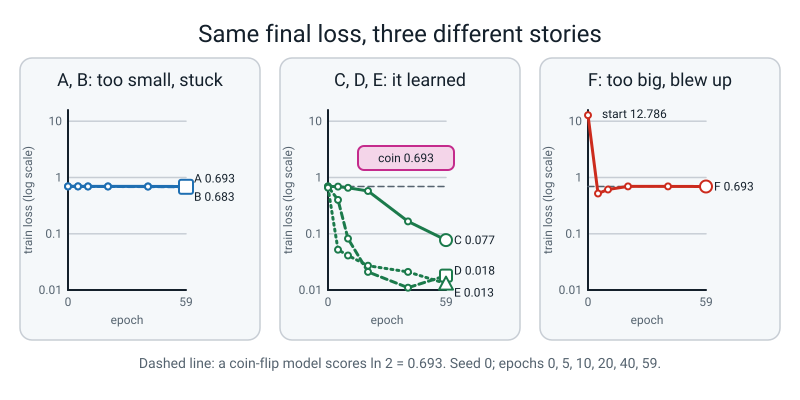
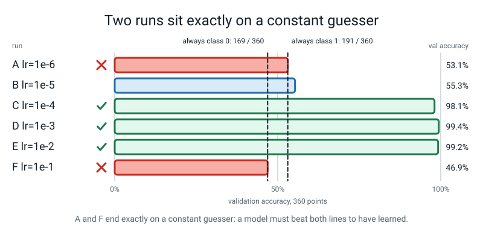

# Week 1 — One Loop, Ten Knobs

[⬅ Start Here](../README.md) · [Course Home](../README.md) · [Week 2 ➡](week-02.md) · [Student Guide](../student-guide/week-01.md) · [Workbook](../workbook/week-01.md)

---


*Figure 1.0 — Where this fits: week 1 of 36 sits in term 1, "train it on purpose"; the tiles still dashed are the weeks to come.*

## 📋 At a Glance

| | |
|---|---|
| **Duration** | 70 minutes |
| **Type** | 🟦 Teach — the first week of Level 4. One model, one dataset, one knob turned. |
| **Big idea** | The `w -= lr * grad` loop the student wrote all last year has **ten knobs nobody named**. This year each is turned alone, on data they generate, with a loss curve as the witness. And **0.693 is the number that says "no better than a coin."** |
| **New vocabulary** | knob (the field says "hyperparameter") · loss curve · epoch · learning rate · harness · guessing loss (`ln 2`) |
| **New maths** | **None.** `ln` as a surprise meter is Level 3 Week 14. This week uses it once, on one number, to explain why a coin scores 0.693. |
| **New syntax** | `torch.set_num_threads(1)` · keyword-only `*` in `def run(*, lr, ...)` · `nn.GELU()` |
| **Dataset** | Two interleaved spirals, **generated by numpy** (`make_spirals`, seed 0): 1,200 points, 840 train / 360 validation. Nothing downloads. |
| **Code** | Everything imports from `l4lib/` (the Shared Kit). **The student imports it. Nobody copies it.** |
| **Materials** | A notebook (the **Bug Log**, carried over from Level 3 if they kept it) · a pen · six index cards labelled A–F · printed workbook page 1.1 (the six-curve grid) |
| **Tech needed** | The Level 3 laptop. **Level 4 installs nothing new.** No GPU. No internet, ever. |
| **Prep time** | 20 minutes the night before · 5 minutes on the day |
| **Real runtime** | One training run is well under a second. The six-run sweep is about 3 seconds on one CPU thread (measured on an 18-core Mac with `set_num_threads(1)`). Nothing waits. |

> **⚠️ Watch out:** the temptation this week is to explain *why* a large learning rate fails, or to start hunting for "the best" setting. Resist both. Week 1 is about **looking at a curve and saying what it is doing, in one honest sentence.** The mechanisms start next week. A student who leaves able to say *"this one is flat, this one is learning, this one blew up and then settled at a coin"* has had exactly the right lesson.

---

## 🎯 Lesson Objectives

By the end of the lesson the student can:

1. **Name at least six of the ten knobs** of the training harness by reading the signature of `run(tag, *, lr, ...)` — without being told which are which.
2. **Run the six-learning-rate sweep** and read its output as a table of numbers: first-epoch loss, final train loss, final validation accuracy.
3. **Label six curves A–F in plain words** (flat · barely moving · slow but learning · healthy · healthy and a little rough · blew up then stuck) and justify each label with a number.
4. **State the loss of a two-class model that is guessing — 0.693 — and say why**, in one sentence, using `ln 2`.
5. **Explain what the `*` in a function signature does**, and show the error you get when you ignore it.

Observable evidence: six labelled cards on the table, each with the final loss written on the back; a sweep that prints the same digits twice in a row; the sentence *"0.693 is what a coin scores, because the model gives each class probability one half and ln 2 is the surprise of a one-in-two event"*; and workbook page 1.1 filled in.

---

## 🧑‍🏫 What YOU Need to Know First

> **📌 About the code blocks in this guide.** Outside the **🧰 Prep Checklist**, the **🐞 Debugging Clinic** and the **🔑 Answer Key**, the blocks are **illustrations, not files**. Each carries on from the one above it, so the `import` lines are typed once, in the first block that needs them. **The complete runnable sequence is in the Prep Checklist.** If you paste an illustration on its own and get `NameError`, that is why, and nothing is broken. Every block here was run, in order, in one Python session, on a CPU, with a seed set, and every output shown is what it printed.

**You do not need to know any deep learning to teach this week.** You need to be able to read one table of numbers and say which row is a coin. That takes about twenty minutes and this section is all of it.

### 1. Why this week exists

Last year the student wrote this loop, said what each line does, and watched PyTorch agree with their hand calculation:

```python
for epoch in range(60):
    opt.zero_grad()
    loss = loss_fn(model(X), y)
    loss.backward()
    opt.step()
```

It worked. The loss went down. That was the right thing to be proud of last year.

**This year the question changes from "does it learn?" to "when it does not, which knob do I turn, and how do I know *before* I turn it?"** A handful of numbers decide whether that loop produces a model or an expensive random-number generator, and nobody tells you which handful until you have wasted an afternoon.

Here is the sentence that frames the whole year, and it is worth saying almost word for word:

> "A network that is not learning does not tell you why. It prints the same number, over and over, and the number looks like a number. Your whole job this year is to learn to read what that number is *saying*."

The ten knobs, so you can name them. They are keyword arguments of the harness in `l4lib/spirals.py`:

| # | Knob | Plain meaning | Week it is turned alone |
|:--:|---|---|:--:|
| 1 | `lr` | How big a step each update takes | **1 (today)** |
| 2 | `batch_size` | How many examples are averaged before one step | 7 |
| 3 | `optimizer` | The rule that turns a gradient into a step (`sgd`, `momentum`, `adam`, `adamw`) | 2–3 |
| 4 | `weight_decay` | A small shrink applied to every weight each step | 3 |
| 5 | `schedule` | Whether `lr` changes over the run (`none`, `cosine`, `step`) | 4 |
| 6 | `warmup_frac` | The share of the run spent ramping `lr` up from nearly zero | 4 |
| 7 | `dropout` | The share of activations randomly zeroed while training | 5 |
| 8 | `norm` | Whether each block normalises its input (`none`, `batch`, `layer`) | 6 |
| 9 | `residual` | Whether each block adds its input back to its output | 6 |
| 10 | `clip` | A ceiling on how long a gradient may be | 6 |

Four more arguments are **set-up, not knobs**: `depth` (how many blocks), `epochs` (how long), `seed` (which random start) and `verbose` (whether to print). A student may call `depth` a knob. That is fine; say "yes, that too — these ten are the ones that *change how it learns*," and move on.

**Today only knob 1 moves.** Everything else stays at the harness default (the default optimizer is `adamw` with `weight_decay=0.0`, which the student can treat as "Adam", a name they already know). That is the whole design: *one knob alone, so the curve is the witness.*

### 2. What a "loss" is, and why a coin scores 0.693

Level 3 Week 14 taught the student that `ln` is a **surprise meter**: the surprise of an event with probability `p` is `-ln(p)`. A near-certain event costs almost nothing. A near-impossible one costs a lot. A one-in-two event costs `-ln(0.5)`.

The training loss for a two-class model is the average of that surprise over the examples, where `p` is the probability the model gave to the **true** class.

So what does a model that has learned **nothing** do? It cannot tell the classes apart, so it says "50-50" about every point. Every example costs `-ln(0.5)`. Check it:

```python
import math
print("ln 2          =", round(math.log(2), 4))
print("e ** 0.693    =", round(math.exp(0.693), 4))
print("-ln(0.5)      =", round(-math.log(0.5), 4))
```
```text
ln 2          = 0.6931
e ** 0.693    = 1.9997
-ln(0.5)      = 0.6931
```

And PyTorch agrees. Give the loss function logits that are all zero (both classes score the same, so after softmax each has probability one half) and ask for the cross-entropy:

```python
import torch
import torch.nn.functional as F
logits = torch.zeros(4, 2)              # a model with no opinion: both classes score 0
labels = torch.tensor([0, 1, 0, 1])
print(F.cross_entropy(logits, labels))
```
```text
tensor(0.6931)
```

**That is the whole idea of the week.** `0.693` is not "bad". It is the exact number that means *the model is guessing*. A curve that starts at 0.69 and stays there is a model that has learned nothing; a curve that starts at 0.69 and falls is a model getting better than a coin.

The same arithmetic gives the answer for any number of equally likely classes:

```python
import math
for k in (2, 3, 10):
    print(f"{k:>2} equally likely classes -> a guesser's loss is ln {k} = {math.log(k):.4f}")
```
```text
 2 equally likely classes -> a guesser's loss is ln 2 = 0.6931
 3 equally likely classes -> a guesser's loss is ln 3 = 1.0986
10 equally likely classes -> a guesser's loss is ln 10 = 2.3026
```

> **🧑‍🏫 If a student asks:** *"Is 0.693 the number for every model?"* — **No. It is the number for two equally likely classes.** Three classes: 1.0986. Ten (like digits): 2.3026. And the spirals are *almost* but not exactly balanced (431 against 409 in training), so a smarter guesser that gave the commoner class a slightly higher probability could do very slightly better than 0.693 (about 0.6928 on the training set). For this week "about 0.69" is the right reading.

### 3. The six runs, and what each one is going to say

You will run the harness six times, changing only `lr`. The rates are `1e-6, 1e-5, 1e-4, 1e-3, 1e-2, 1e-1`: six steps, each ten times the last. The student labels them **A–F**. Here is the real result, so you know what you are steering toward.

| Run | `lr` | First-epoch loss | Final train loss | Final val loss | Final val accuracy | What the curve is doing |
|:--:|:--:|:--:|:--:|:--:|:--:|---|
| A | `1e-6` | 0.694 | 0.693 | 0.692 | 53.1% | **Flat.** Starts at the coin and never leaves. |
| B | `1e-5` | 0.694 | 0.683 | 0.679 | 55.3% | **Barely moving.** Drifts down by about 0.011 in 60 epochs. |
| C | `1e-4` | 0.694 | 0.077 | 0.063 | 98.1% | **Slow but learning.** Sits near the coin for ten epochs, then falls steadily and has not finished. |
| D | `1e-3` | 0.691 | 0.018 | 0.026 | 99.4% | **Healthy.** Falls fast, then flattens. |
| E | `1e-2` | 0.658 | 0.013 | 0.059 | 99.2% | **Healthy, a little rough.** Falls fastest, but its validation loss is already higher than D's. |
| F | `1e-1` | **12.786** | 0.693 | 0.702 | 46.9% | **Blew up, then settled at a coin.** The first epoch's average is 12.8; it ends where A started. |

**Read the two ends of that table together, because they are the lesson.** Run A and run F both finish at 0.69 and both are useless — **for opposite reasons.** One never moved. One moved so far it wrecked itself. The *final* number cannot tell them apart. Only the *curve* can. That is why Term 1 is about reading curves, and why the student is about to draw six.


*Figure 1.1 — Three runs that end near 0.693 tell three different stories; only the curve shows which.*

Three things the student is likely to notice. Have an answer ready:

- **"E has the lower train loss but D has the lower validation loss — which is better?"** Today: *D, because validation is the number that counts and D's is lower (0.026 against 0.059).* One seed is not a verdict (see 🚫 below); Week 7 does this properly.
- **"Run F's accuracy is 46.9% — that's worse than a coin!"** It is not. The validation set has 169 examples of class 0 and 191 of class 1. A model that always says "class 0" scores 169/360 = **46.9%**, and one that always says "class 1" scores 191/360 = **53.1%**. Run F's accuracy is *exactly the always-class-0 rate*, which is evidence it has collapsed into a constant guesser. Run A's 53.1% is exactly the other one. (The block that prints this is in the Prep Checklist.)
- **"Why does F end at 0.693 and not at infinity?"** Honest answer: *we measured that it does, and the accuracy matches a constant guesser; why it gets there is Week 2 and 3 material.* **Do not invent a mechanism today.** "The weights got huge and the units died" sounds right and has not been checked.


*Figure 1.2 — A model that ends on a constant guesser's accuracy has learned nothing.*

### 4. Every new line of syntax, explained to someone who has never seen it

There are exactly three, and none is difficult.

**`torch.set_num_threads(1)`.** A laptop has many CPU cores, and PyTorch will happily spread a matrix multiply over all of them. Adding numbers in a different *order* can give results that differ in the last digits (computers round after every addition). One thread means one fixed order, so the same code prints the same digits every run and **the digits in the book match the digits on the screen**. On this tiny network we checked and the answer is identical with 1 thread or 4, so today it is insurance, not a necessity; the habit is for later weeks with bigger models. Rule: **it goes near the top of the file, once, before any training.**

```python
import torch
print("threads before:", torch.get_num_threads())
torch.set_num_threads(1)
print("threads after: ", torch.get_num_threads())
```
```text
threads before: 18
threads after:  1
```

*(The first number is machine-dependent: yours will be your own core count. The second must be 1.)*

**The keyword-only `*`.** In a function definition, a lone `*` means *"everything after this must be passed by name."* Here it is on a toy function with the same shape as the real harness:

```python
def run_toy(*, lr, batch_size, seed):
    return f"lr={lr}  batch_size={batch_size}  seed={seed}"

print(run_toy(lr=0.001, batch_size=64, seed=0))
print(run_toy(seed=0, batch_size=64, lr=0.001))     # any order is fine, because every one is named
```
```text
lr=0.001  batch_size=64  seed=0
lr=0.001  batch_size=64  seed=0
```

Why does the harness insist? Because a sweep calls it hundreds of times with different knobs, and `run(0.001, 64, 0)` is a call nobody can read, and one that silently swaps two numbers the day someone reorders the signature. With the `*`, the swap is impossible: **a wrong or missing name stops the program, loudly, on the line that is wrong.** The Debugging Clinic shows the real tracebacks. They are *good* errors.

**`nn.GELU()`.** An activation function is the bend in the middle of a layer; without it, stacked layers collapse into one straight-line layer (Level 3). ReLU, which the student knows, is a hard corner: zero for negative inputs, the input itself for positive ones. **GELU is the same idea with the corner rounded off.** Real numbers:

```python
import torch.nn as nn
x = torch.tensor([-3.0, -1.0, -0.5, 0.0, 0.5, 1.0, 3.0])
print("x     ", x.tolist())
print("ReLU  ", nn.ReLU()(x).tolist())
print("GELU  ", [round(v, 4) for v in nn.GELU()(x).tolist()])
```
```text
x      [-3.0, -1.0, -0.5, 0.0, 0.5, 1.0, 3.0]
ReLU   [0.0, 0.0, 0.0, 0.0, 0.5, 1.0, 3.0]
GELU   [-0.004, -0.1587, -0.1543, 0.0, 0.3457, 0.8413, 2.996]
```

Look at the `-1.0` entry: ReLU says exactly `0.0`; GELU says `-0.1587`, a small leak below zero. The student does not need the formula. If one asks: *GELU(x) is x multiplied by the chance that a bell-curve number falls below x.* Check it at `x = 1` (this block uses `math.erf`, which is **teacher background only** — do not show it to the student):

```python
# TEACHER BACKGROUND ONLY - not shown to the student this week.
import math
# GELU(x) = x * (chance that a standard bell-curve number is below x)
below_1 = 0.5 * (1 + math.erf(1 / math.sqrt(2)))
print("chance a bell-curve number is below 1:", round(below_1, 4))
print("so GELU(1) = 1 * that              :", round(1 * below_1, 4))
```
```text
chance a bell-curve number is below 1: 0.8413
so GELU(1) = 1 * that              : 0.8413
```

That matches GELU's `0.8413` in the table above. **Keep it in your pocket and offer it only if asked.** GELU is *used* from Week 16 on (inside TinyGPT); the student meets it today only because it sits inside every block of the harness, and you point at it in the model printout. Do not teach it as a topic.

### 5. The misconceptions you will actually meet

| Student says | Why it is wrong | What to say |
|---|---|---|
| **"Bigger learning rate = learns faster."** | Run F is ten times bigger than E and learns nothing. | "Faster up to a point. Then a cliff. Where is the cliff for this model?" (Between 0.01 and 0.1, on this data. Not a rule.) |
| **"The loss ended at 0.693, so it worked a bit."** | 0.693 is the coin. | "What number is a coin? ... So what did this run learn?" |
| **"Accuracy 46.9% is worse than guessing, so the model is anti-learning."** | An always-class-1 guesser gets 53.1% here and an always-class-0 guesser gets 46.9%. Accuracy near 50% in *either* direction means *constant guesser*. | "How many class-0 points are in validation? 169 of 360. What does that divide to?" |
| **"1e-3 is the best learning rate."** | It is the best of the six **for this network, on this data, from one seed**. | See the 🚫 box. |

### 6. How deep to go, and where to stop

Today you go **one level down and no further.** You can say *"a loss is the average surprise at the right answer"* and *"each curve is one training run at one learning rate."* You stop before: why a big step overshoots (Week 2, with momentum), what Adam does differently (Week 3), what the shape of overfitting looks like (Week 5). When the student asks, write the question in the **Parking Lot** column of the Bug Log, with the week it will be answered in. They will find the list satisfying. Do it every week this year.

### 7. 🧭 Real vs Stand-in

> **Everything this week is real.** The network is a real PyTorch network, trained by real gradient descent, on a real (generated) dataset. **Nothing is scripted. There is no stand-in this week.**
>
> What *is* artificial is the **data**: two interleaved spirals made by a numpy formula. They are chosen because they are hard enough that tuning matters and small enough that a CPU trains in under a second. They are not "like real data" in any sense a student should repeat to a friend.
>
> The harness (`l4lib/spirals.py::run`) is the Shared Kit's: the Module 1 harness, pinned to CPU, with a `depth` argument. **The student imports it. They do not copy it, and you do not either.** If you need to see what is inside, `grep -n "def " l4lib/spirals.py`.

### 8. 🚫 What you must NOT claim

Toy results demonstrate a mechanism, not a rate. Do not say:

- ❌ *"1e-3 is the right learning rate for neural networks."* It is the best of six for **one** 16,962-parameter network, **one** seed, **one** dataset. A different network has a different cliff.
- ❌ *"Large learning rates always make the loss infinite or NaN."* Today's run F **did not**: it went to 12.8 on average in its first epoch and came back to 0.693. Some runs on other machines do go to `nan`; this one did not.
- ❌ *"GELU is better than ReLU."* Nothing in Week 1 compares them.
- ❌ *"0.693 is the loss of a bad model."* It is the loss of a **two-class guesser**. A ten-class model that scores 0.693 is doing very well (a ten-class guesser scores 2.303).
- ❌ *"These digits will be the same on every computer."* They are the same on **this** machine, on **CPU**, with **one thread**, with **PyTorch 2.2.1**. A different PyTorch version or CPU can move the third decimal. The *shapes* will not move. If a student's digits differ by one in the third place, **say so and continue**: the tolerance in the answer key is ±0.005 on losses and ±0.5 percentage points on accuracy, and an exact match is **not** the test.
- ❌ *"A and B are 'dead'."* They might simply be slow: C is ten times faster than B and it learns. Whether a flat curve is dead or slow is a question for the weeks ahead.

### 9. 🔢 The maths you need — taught to you first

**There is no new maths this week.** Your one maths task is in section 2: *`ln 2 = 0.693`, and `e` raised to 0.693 gives 2.* Do it by hand once with the student on paper:

1. "If the model says 50-50, what probability did it give the right answer?" → 0.5.
2. "The surprise of that is `-ln(0.5)`." Write `-ln(0.5) = ln(2)`, because `ln(0.5)` is the same as `-ln(2)`.
3. "`ln 2` asks: *what power of `e` gives 2?*" → the answer is about 0.693, and the block in section 2 shows `e ** 0.693 = 1.9997`. That is close enough for a student to believe it.

If that stumbles, the fallback is: *"Log loss at a coin is 0.693, and we have already met this number in Level 3. You only need to recognise it."* **Recognising it is the objective. Deriving it is a bonus.**

---

## 🧰 Prep Checklist

### 20 minutes the night before

**☐ 1. Smoke test (1 minute).** Open a terminal **in the `36-week-course/` folder** — the folder that *contains* `l4lib/`, not the folder inside it. Run:

```python
import numpy, pandas, matplotlib, sklearn, torch
print(torch.__version__)
```
```text
2.2.1
```

*(Your version number may differ; any 2.x is fine.)* If a `pip` command returns **403** anywhere this year, that is the proxy and it is **not an error**: nothing needs installing, close the terminal and carry on. (This guide did not run `pip`; the network is blocked. The 403 behaviour is as the course README states it.) `torchvision` is not installed and cannot be.

**☐ 2. Check you are in the right folder (30 seconds).** `ls` should list `l4lib`, `README.md`, `teacher-guide`. If it does not, `cd` there. *This is the single commonest error of the week* (Clinic, error 4).

**☐ 3. Run the blocks below, in order, in one file.** Save it as `week01.py` in `36-week-course/`. It takes about **4 seconds**. Every number in this guide came from it. Check yours against ours within the stated tolerance.

**Block P1 — set-up and the data**

```python
import torch
print("threads before:", torch.get_num_threads())
torch.set_num_threads(1)
print("threads after: ", torch.get_num_threads())
```

```python
from l4lib.spirals import make_spirals, get_data
X, y = make_spirals(n=600, noise=0.22, seed=0)
print("X", X.shape, X.dtype, "  y", y.shape, y.dtype)
print("first three points:")
print(X[:3].round(3))
print("first three labels:", y[:3])
Xtr, ytr, Xva, yva = get_data()
print("train", tuple(Xtr.shape), " val", tuple(Xva.shape))
print("train class counts:", ytr.bincount().tolist(), "  val class counts:", yva.bincount().tolist())
```
```text
X (1200, 2) float32   y (1200,) int64
first three points:
[[ 2.734  0.764]
 [ 1.194 -0.843]
 [-3.124 -1.111]]
first three labels: [0 1 1]
train (840, 2)  val (360, 2)
train class counts: [431, 409]   val class counts: [169, 191]
```

**What to check:** `(840, 2)` train and `(360, 2)` validation. Class counts `[431, 409]` and `[169, 191]`. If those differ, **stop**: the generator or the seed has changed and every other number in the lesson will be wrong. (The first x-coordinate, `2.734`, is an extra fingerprint.)

**Block P2 — the model the harness builds**

```python
import torch
from l4lib.spirals import make_model
torch.manual_seed(0)
model = make_model()
print(model)
print("parameters:", sum(p.numel() for p in model.parameters()))
```
```text
MLP(
  (stem): Linear(in_features=2, out_features=64, bias=True)
  (blocks): Sequential(
    (0): Block(
      (fc): Linear(in_features=64, out_features=64, bias=True)
      (act): GELU(approximate='none')
      (drop): Dropout(p=0.0, inplace=False)
      (norm): Identity()
    )
    (1): Block(
      (fc): Linear(in_features=64, out_features=64, bias=True)
      (act): GELU(approximate='none')
      (drop): Dropout(p=0.0, inplace=False)
      (norm): Identity()
    )
    (2): Block(
      (fc): Linear(in_features=64, out_features=64, bias=True)
      (act): GELU(approximate='none')
      (drop): Dropout(p=0.0, inplace=False)
      (norm): Identity()
    )
    (3): Block(
      (fc): Linear(in_features=64, out_features=64, bias=True)
      (act): GELU(approximate='none')
      (drop): Dropout(p=0.0, inplace=False)
      (norm): Identity()
    )
  )
  (head): Linear(in_features=64, out_features=2, bias=True)
)
parameters: 16962
```

**What to check:** `GELU(approximate='none')` appears four times (once per block); `Dropout(p=0.0)` and `Identity()` are there but inert today; **16,962 parameters**. *This is where the student meets `nn.GELU()`. Pointing at the printout is enough.*

**Block P3 — one run, and what it returns**

```python
from l4lib.spirals import run
h = run("adamw lr=0.001", lr=1e-3)
print(sorted(h.keys()))
print("epochs recorded:", len(h["train"]))
```
```text
adamw lr=0.001               train 0.018  val 0.026  acc  99.4%
['acc', 'gnorm', 'lr', 'train', 'val']
epochs recorded: 60
```

Each run returns a dictionary of five lists with one number per epoch: `train` and `val` loss, `acc` (validation accuracy), `lr` (the learning rate at the end of that epoch) and `gnorm` (gradient length, a **Week 2** idea — ignore it today).

**Block P4 — the sweep**

```python
LRS = [("A", 1e-6), ("B", 1e-5), ("C", 1e-4), ("D", 1e-3), ("E", 1e-2), ("F", 1e-1)]
curves = {}
for letter, lr in LRS:
    curves[letter] = run(f"{letter}  lr={lr:g}", lr=lr, epochs=60)
```
```text
A  lr=1e-06                  train 0.693  val 0.692  acc  53.1%
B  lr=1e-05                  train 0.683  val 0.679  acc  55.3%
C  lr=0.0001                 train 0.077  val 0.063  acc  98.1%
D  lr=0.001                  train 0.018  val 0.026  acc  99.4%
E  lr=0.01                   train 0.013  val 0.059  acc  99.2%
F  lr=0.1                    train 0.693  val 0.702  acc  46.9%
```

**What to check** (against the table in section 3): A at 0.693, B at 0.683, C at 0.077, D at 0.018, E at 0.013, F at 0.693. F's accuracy `46.9%` is the sign it has collapsed.

**Block P5 — the same data as one table, then as a sketch**

```python
print("epoch      " + "".join(f"{e:>9}" for e in (0, 5, 10, 20, 40, 59)))
for letter, lr in LRS:
    row = "".join(f"{curves[letter]['train'][e]:>9.3f}" for e in (0, 5, 10, 20, 40, 59))
    print(f"{letter}  lr={lr:<6g}" + row)
```
```text
epoch              0        5       10       20       40       59
A  lr=1e-06     0.694    0.694    0.694    0.694    0.694    0.693
B  lr=1e-05     0.694    0.694    0.693    0.692    0.689    0.683
C  lr=0.0001    0.694    0.688    0.655    0.575    0.166    0.077
D  lr=0.001     0.691    0.399    0.082    0.021    0.011    0.018
E  lr=0.01      0.658    0.052    0.041    0.027    0.021    0.013
F  lr=0.1      12.786    0.520    0.612    0.694    0.695    0.693
```

Note the F row. `12.786` in the first column is the **average training loss across the whole first epoch**: the harness reports an average, so F's first epoch contains some enormous early steps and then recovers. By epoch 5 it is at 0.520 (briefly *better* than a coin), then it climbs back to about 0.69 and sits there.

```python
def sketch(values, lo=0.0, hi=0.8, width=60):
    """One character per epoch: how high the loss sits between lo and hi."""
    marks = " .:-=+*#%@"
    out = ""
    for v in values[:width]:
        v = min(max(v, lo), hi)
        out += marks[int((hi - v) / (hi - lo) * (len(marks) - 1))]
    return out

print("loss 0.8 -> 0.0 shown as '@' (low) .. ' ' (high);  60 epochs left to right")
for letter, lr in LRS:
    print(f"{letter} lr={lr:<6g}|{sketch(curves[letter]['train'])}|")
```
```text
loss 0.8 -> 0.0 shown as '@' (low) .. ' ' (high);  60 epochs left to right
A lr=1e-06 |............................................................|
B lr=1e-05 |............................................................|
C lr=0.0001|...............:::::::::------====++****###############%%%%%|
D lr=0.001 |...:-=*##%%%%%%%%%%%%%%%%%%%%%%%%%%%%%%%%%%%%%%%%%%%%%%%%%%%|
E lr=0.01  |.-*#%%%%%%%%%%%%%%%%%%%%%%%%%%%%%%%%%%%%%%%%%%%%%%%%%%%%%%%%|
F lr=0.1   |  ::--:.:.:::.  ............................................|
```

This is a text picture for the case where a plot will not draw. `@` is a low loss, a blank is a high one, and the scale is clipped at 0.8, which is why the start of F's row is blank (it is off the top). **You can also draw the real plot:**

```python
import matplotlib
matplotlib.use("Agg")
import matplotlib.pyplot as plt

fig, ax = plt.subplots(figsize=(7, 4))
for letter, lr in LRS:
    ax.plot(curves[letter]["train"], label=f"{letter}: lr={lr:g}")
ax.axhline(0.693, color="grey", linestyle="--")
ax.text(40, 0.72, "ln 2 = 0.693: a coin", color="grey")
ax.set_ylim(0, 1.0)
ax.set_xlabel("epoch")
ax.set_ylabel("training loss")
ax.legend()
fig.savefig("w01_curves.png", dpi=100)
print("saved w01_curves.png")
```
```text
saved w01_curves.png
```

`w01_curves.png` is an ordinary image file in the folder. (The table is the evidence this week; a plot is for the student who wants to see six lines.)

**Block P6 — the coin check (the one that closes the argument)**

```python
print("the two constant guessers on the validation set:")
share_1 = yva.float().mean().item()
print(f"  always say class 1 -> accuracy {share_1*100:.1f}%")
print(f"  always say class 0 -> accuracy {(1-share_1)*100:.1f}%")
print()
for letter, lr in LRS:
    h = curves[letter]
    print(f"{letter} lr={lr:<6g} final val loss {h['val'][-1]:.3f}   final val accuracy {h['acc'][-1]*100:5.1f}%")
```
```text
the two constant guessers on the validation set:
  always say class 1 -> accuracy 53.1%
  always say class 0 -> accuracy 46.9%

A lr=1e-06  final val loss 0.692   final val accuracy  53.1%
B lr=1e-05  final val loss 0.679   final val accuracy  55.3%
C lr=0.0001 final val loss 0.063   final val accuracy  98.1%
D lr=0.001  final val loss 0.026   final val accuracy  99.4%
E lr=0.01   final val loss 0.059   final val accuracy  99.2%
F lr=0.1    final val loss 0.702   final val accuracy  46.9%
```

**What to check:** A and F sit exactly on the two constant guessers (53.1% and 46.9%). B is at 55.3%, **barely better than a guesser**: do not let the student call B "learning". C, D and E are all above 98%.

**Block P7 — the first epoch, and reproducibility**

```python
print("average training loss over the very first epoch")
for letter, lr in LRS:
    print(f"  {letter} lr={lr:<6g} {curves[letter]['train'][0]:.3f}")
h_big = run("G  lr=1.0 (bonus)", lr=1.0, epochs=60, verbose=False)
print(f"  G lr=1      {h_big['train'][0]:.1f}   ...and by epoch 10: {h_big['train'][10]:.3f}")
```
```text
average training loss over the very first epoch
  A lr=1e-06  0.694
  B lr=1e-05  0.694
  C lr=0.0001 0.694
  D lr=0.001  0.691
  E lr=0.01   0.658
  F lr=0.1    12.786
  G lr=1      7837888.5   ...and by epoch 10: 0.759
```

*G, `lr=1`, is a bonus run for a student who asks "what if I go even bigger?" Its first-epoch average is 7.8 million. This is **not an error**: the loss really did go that high, and by epoch 10 it is back at 0.759. It does not generalise, which is why it is a bonus and not the lesson.*

```python
a = run("repeat 1", lr=1e-3, verbose=False)
b = run("repeat 2", lr=1e-3, verbose=False)
print("same curve twice:", a["train"] == b["train"])
print("final train loss, both runs:", a["train"][-1], b["train"][-1])
```
```text
same curve twice: True
final train loss, both runs: 0.018484133488247886 0.018484133488247886
```

**This block earns `set_num_threads(1)` and the seed their place:** run it twice and the lists are *identical*, not close, identical, to every digit.

**☐ 4. Run the five deliberate mistakes (5 minutes).** The five complete files are in the 🐞 Debugging Clinic with their real tracebacks. Run them once so you recognise the messages on sight. **Do not fix them in advance.**

**☐ 5. Print workbook page 1.1** (the six-curve grid) **and label six index cards A–F.** Write the learning rate on the *back* of each card, not the front: the student places curves first and checks second.

**☐ 6. Decide where the Bug Log lives.** Same notebook as Level 3 if they kept it. Draw a line under the last Level 3 entry and write **"Level 4"**. The first entry is today's. Add a **Parking Lot** column.

### 5 minutes on the day

- Open a terminal in `36-week-course/`. Type `ls`. See `l4lib`.
- Run `week01.py` once. Check three numbers: **F's accuracy is 46.9%, D's final train loss is 0.018, B's is 0.683.**
- Put the six cards face down, A to F, in a row.

### Fallback if the laptop fails

Everything this week is reproduced in the **table in section 3** and in **Block P5**. If the laptop will not run, **hand the student the printed table (without the "what the curve is doing" column) and do the lesson on paper**: they label A–F from the numbers, compute 169/360 and 191/360 by hand, and work through `ln 2`. It loses the typing and none of the thinking. Do not teach from a laptop whose data fingerprint differs from the one above: stop and fix that first.

---

## ⏱️ The Lesson, Minute by Minute

| Segment | Minutes | Running total | What happens |
|---|---|---|---|
| 🪝 Hook — The Number That Means Nothing | 7 | 7 | A loss of 0.693 on the board. Good or bad? What would you need to know? |
| 🧠 Concept — Ten Knobs, and the Coin | 18 | 25 | The ten knobs found in a signature. `ln 2` by hand. Six cards predicted before any run. |
| 💻 Live-Code Together — the sweep | 22 | 47 | Three deliberate mistakes, then the sweep. Cards checked against the table. |
| 🎲 Their Turn — label A–F | 16 | 63 | The student labels six curves, with numbers. |
| 🔑 Wrap & Assign | 7 | 70 | The coin sentence said aloud. Homework. |

---

### 🪝 Hook — The Number That Means Nothing (7 minutes)

**Do this:** Laptops closed. Write on the board, big, and nothing else:

```text
final loss: 0.693
```

**Say this:**

> "This is the last number a training run printed. Last year, a loss that went down to here — would that have made you happy, or worried?"

**Do this:** Let them answer. Most say *"low, so good?"* or *"it depends."* Both are fine. **Write down whatever they say.**

> "Now a second run, different settings."

Write under it:

```text
final loss: 0.693
```

> "Same number to three decimal places. One question: **what would you need to know to say whether either of these models learned anything?**"

**Do this:** Collect answers on the board: *the starting loss · the accuracy · how many classes · what the curve looked like · what a bad model would score.* The last one is the key. If nobody says it, say it:

> "'What would a model that learned nothing score?' Nobody can read a loss without that number. Today we find it. And we will meet a third run that ended at exactly 0.693 after first going to a loss of twelve. Three runs, one final number, three different stories."

> "Level 4 is about telling those stories apart. By the end of the year you will look at a curve and say what is wrong and which knob to turn. Today we start with the knob everyone turns first."

**Why this works:** it opens with a number rather than a lecture, it creates the exact question the lesson answers, and it plants the idea that the *final* number is not enough. **Do not tell them 0.693 is a coin yet.** They find that out in about ten minutes and it lands harder.

---

### 🧠 Concept — Ten Knobs, and the Coin (18 minutes)

#### Part A — Last year's loop, and the ten things in it (6 minutes)

**Do this:** On the board, write the five-line loop from section 1. Ask the student to read it aloud and say what each line does. They should be able to. (If they cannot, that is information: note it, and revisit the Level 3 training-loop weeks before Week 3.)

**Say this:**

> "`opt.step()` moves every weight a little. How *much* is a number you chose last year, probably without thinking. What was it called?"

*(Learning rate; `lr`.)*

> "That is one decision. How many examples did you average before you stepped? Another. Whether the step is plain or smarter? Another. I count ten. Let's find them."

**Do this:** Open `l4lib/spirals.py` in an editor. Scroll to the signature of `run`. **Read it aloud**, slowly:

```text
def run(tag, *, depth=4, lr=3e-3, batch_size=64, epochs=60, optimizer="adamw",
        weight_decay=0.0, dropout=0.0, norm="none", residual=False,
        schedule="none", warmup_frac=0.0, clip=None, seed=0, verbose=True):
```

> "Everything after the little star has to be named. Count the knobs. Hint: `depth`, `epochs`, `seed` and `verbose` are set-up, not knobs."

**Do this:** Have them write their list in the Bug Log, then reveal the table in section 1. Most students find 7–9 of the ten on their own; **the ones they usually miss are `warmup_frac` and `clip`**, because the words are unfamiliar. Do not explain them. Say: *"Two of these you have never heard of. You will meet each one alone, in a week of its own."*

**Check understanding:** *"Which of the ten are we turning today?"* — one: `lr`.

#### Part B — The coin, by hand (7 minutes)

**Say this:**

> "Here is the number the board was missing. Imagine a model that has learned *nothing*. It cannot tell the two classes apart. What probability does it give the right answer, for every example?"

*(One half.)*

> "Last year you learned that surprise is `minus ln of the probability`. What is the surprise of one chance in two?"

**Do this:** Let them reach for a calculator or the laptop. Then run:

```python
import math
print("ln 2          =", round(math.log(2), 4))
print("e ** 0.693    =", round(math.exp(0.693), 4))
print("-ln(0.5)      =", round(-math.log(0.5), 4))
```
```text
ln 2          = 0.6931
e ** 0.693    = 1.9997
-ln(0.5)      = 0.6931
```

> "So the loss of a model that has learned nothing, on two classes, is 0.693. Write that down and underline it.
>
> **A curve that starts at 0.693 and stays there is a model that has learned nothing. A curve that starts at 0.693 and falls is a model getting better than a coin.**"

**Check understanding:** *"Back to the two 0.693s on the board. Did either model learn something?"* — **Not as far as that number can tell us: both are exactly what a coin scores.** Both runs could be failures, and the number alone cannot show which kind. That is the hook closing.

#### Part C — Predict before you run (5 minutes)

**Do this:** Put the six cards face down in a row. Say:

> "I am going to run this model six times. Everything the same except the learning rate. From smallest to biggest: one millionth, one hundred-thousandth, one ten-thousandth, one thousandth, one hundredth, one tenth. Each is ten times the last. Cards A to F.
>
> **Before I run anything:** on your page, for each of the six, write what you think the *final loss* will be: *coin*, *low*, or *in between*. And tell me which one you think wins."

**Do this:** Collect the predictions. **Do not comment.** Most students predict that bigger is better and pick F or E. A minority pick the middle. **Both are fine.** The prediction is the thing; it is checked in twenty minutes.

---

### 💻 Live-Code Together — the sweep (22 minutes)

**Setup (2 minutes).** Terminal in `36-week-course/`. New file `week01.py`. The student types; you do not.

#### Step 1 — set-up, and the first `*` (4 minutes)

**Type together:**

```python
import torch
print("threads before:", torch.get_num_threads())
torch.set_num_threads(1)
print("threads after: ", torch.get_num_threads())
```

> "This makes the computer use one core, so we all get the same digits. The first number is *your* machine's cores. The second must be 1."

**Then** type the keyword-only demonstration on a toy function, so the star is seen before it bites:

```python
def run_toy(*, lr, batch_size, seed):
    return f"lr={lr}  batch_size={batch_size}  seed={seed}"

print(run_toy(lr=0.001, batch_size=64, seed=0))
print(run_toy(seed=0, batch_size=64, lr=0.001))     # any order is fine, because every one is named
```
```text
lr=0.001  batch_size=64  seed=0
lr=0.001  batch_size=64  seed=0
```

> "The little star means: after me, you must say the name. Watch what happens if you forget."

**Do this:** The first **deliberate mistake**. Save and run this *whole file* as `mistake1.py`:

```python
# DELIBERATE MISTAKE 1: no names. This is the call that "keyword-only" exists to stop.
def run_toy(*, lr, batch_size, seed):
    return f"lr={lr}  batch_size={batch_size}  seed={seed}"

print(run_toy(0.001, 64, 0))
```

```text
Traceback (most recent call last):
  File "/private/tmp/w1/mistake1.py", line 5, in <module>
    print(run_toy(0.001, 64, 0))
TypeError: run_toy() takes 0 positional arguments but 3 were given
```

> "Read me the last line. `takes 0 positional arguments but 3 were given`. It means: *I wanted names, you gave me bare numbers.* The error is on the line the mistake is on. The star exists so that this cannot silently go wrong."

#### Step 2 — one real run (4 minutes)

**Type together:**

```python
from l4lib.spirals import run
h = run("adamw lr=0.001", lr=1e-3)
print(sorted(h.keys()))
print("epochs recorded:", len(h["train"]))
```
```text
adamw lr=0.001               train 0.018  val 0.026  acc  99.4%
['acc', 'gnorm', 'lr', 'train', 'val']
epochs recorded: 60
```

> "One run. Train loss at the end 0.018, validation loss 0.026, accuracy 99.4%. `h` is a dictionary of five lists, one number per epoch."

**Do this:** The second **deliberate mistake**, a typo on the real harness:

```python
# DELIBERATE MISTAKE 2: a misspelt name, on the real harness.
from l4lib.spirals import run
run("typo", lrate=1e-3)
```

```text
Traceback (most recent call last):
  File "/private/tmp/w1/mistake2.py", line 3, in <module>
    run("typo", lrate=1e-3)
TypeError: run() got an unexpected keyword argument 'lrate'
```

> "`lrate` is not a name it knows. It does not suggest the right one: it just says which word it did not recognise. Compare, character by character, with the signature we read."

*(`lrate` vs `lr`.)*

**Then, the third (30 seconds):** the real harness with a bare number.

```python
# DELIBERATE MISTAKE 3: the real harness, one bare number after the tag.
from l4lib.spirals import run
run("positional", 1e-3)
```

```text
Traceback (most recent call last):
  File "/private/tmp/w1/mistake3.py", line 3, in <module>
    run("positional", 1e-3)
TypeError: run() takes 1 positional argument but 2 were given
```

> "Same family, different wording: `takes 1 positional argument but 2 were given`. The one thing it accepts bare is `tag`, the label. Everything else must be named."

#### Step 3 — the sweep (6 minutes)

**Say this:**

> "Now the six. A list of pairs, a letter and a learning rate, and a loop."

**Type together:**

```python
LRS = [("A", 1e-6), ("B", 1e-5), ("C", 1e-4), ("D", 1e-3), ("E", 1e-2), ("F", 1e-1)]
curves = {}
for letter, lr in LRS:
    curves[letter] = run(f"{letter}  lr={lr:g}", lr=lr, epochs=60)
```
```text
A  lr=1e-06                  train 0.693  val 0.692  acc  53.1%
B  lr=1e-05                  train 0.683  val 0.679  acc  55.3%
C  lr=0.0001                 train 0.077  val 0.063  acc  98.1%
D  lr=0.001                  train 0.018  val 0.026  acc  99.4%
E  lr=0.01                   train 0.013  val 0.059  acc  99.2%
F  lr=0.1                    train 0.693  val 0.702  acc  46.9%
```

**Pause. Let it sit for ten seconds.** Then:

> "Look down the last column. Which two are the same?"

*(A and F: both 53.1% / 46.9% accuracy, both final loss 0.693.)*

> "A and F. Same final loss. Same story?"

**Do this:** Let them argue. Then show the table:

```python
print("epoch      " + "".join(f"{e:>9}" for e in (0, 5, 10, 20, 40, 59)))
for letter, lr in LRS:
    row = "".join(f"{curves[letter]['train'][e]:>9.3f}" for e in (0, 5, 10, 20, 40, 59))
    print(f"{letter}  lr={lr:<6g}" + row)
```
```text
epoch              0        5       10       20       40       59
A  lr=1e-06     0.694    0.694    0.694    0.694    0.694    0.693
B  lr=1e-05     0.694    0.694    0.693    0.692    0.689    0.683
C  lr=0.0001    0.694    0.688    0.655    0.575    0.166    0.077
D  lr=0.001     0.691    0.399    0.082    0.021    0.011    0.018
E  lr=0.01      0.658    0.052    0.041    0.027    0.021    0.013
F  lr=0.1      12.786    0.520    0.612    0.694    0.695    0.693
```

> "Look at the **first** column, epoch zero. A starts at 0.694. F starts at **twelve point seven eight six.** One did not move; one went somewhere terrible and came back to the same place. You could not tell from the last column."

**Say this** (the sentence of the week, once, slowly):

> "The final loss tells you where it ended. The curve tells you what happened."

#### Step 4 — the sketch, and the check (6 minutes)

**Type together** (the sketch function is short; students enjoy it):

```python
def sketch(values, lo=0.0, hi=0.8, width=60):
    """One character per epoch: how high the loss sits between lo and hi."""
    marks = " .:-=+*#%@"
    out = ""
    for v in values[:width]:
        v = min(max(v, lo), hi)
        out += marks[int((hi - v) / (hi - lo) * (len(marks) - 1))]
    return out

print("loss 0.8 -> 0.0 shown as '@' (low) .. ' ' (high);  60 epochs left to right")
for letter, lr in LRS:
    print(f"{letter} lr={lr:<6g}|{sketch(curves[letter]['train'])}|")
```
```text
loss 0.8 -> 0.0 shown as '@' (low) .. ' ' (high);  60 epochs left to right
A lr=1e-06 |............................................................|
B lr=1e-05 |............................................................|
C lr=0.0001|...............:::::::::------====++****###############%%%%%|
D lr=0.001 |...:-=*##%%%%%%%%%%%%%%%%%%%%%%%%%%%%%%%%%%%%%%%%%%%%%%%%%%%|
E lr=0.01  |.-*#%%%%%%%%%%%%%%%%%%%%%%%%%%%%%%%%%%%%%%%%%%%%%%%%%%%%%%%%|
F lr=0.1   |  ::--:.:.:::.  ............................................|
```

> "That is six curves, in text. A and B: a long row of dots. C: dots, then a slow climb to the high-score character. D and E: up fast. F: blank, then some marks, then dots."

**Do this:** Turn the cards over. **Check the predictions** from Part C. Most students expected F or E to win; D has the lowest validation loss (0.026; E's is 0.059, more than twice as high). Say **nothing** about who was wrong:

> "Nobody has to have been right. You made a prediction, you checked it, and now you hold a number you can trust more than your guess. That is the habit."

**Then the coin check:**

```python
print("the two constant guessers on the validation set:")
share_1 = yva.float().mean().item()
print(f"  always say class 1 -> accuracy {share_1*100:.1f}%")
print(f"  always say class 0 -> accuracy {(1-share_1)*100:.1f}%")
print()
for letter, lr in LRS:
    h = curves[letter]
    print(f"{letter} lr={lr:<6g} final val loss {h['val'][-1]:.3f}   final val accuracy {h['acc'][-1]*100:5.1f}%")
```
```text
the two constant guessers on the validation set:
  always say class 1 -> accuracy 53.1%
  always say class 0 -> accuracy 46.9%

A lr=1e-06  final val loss 0.692   final val accuracy  53.1%
B lr=1e-05  final val loss 0.679   final val accuracy  55.3%
C lr=0.0001 final val loss 0.063   final val accuracy  98.1%
D lr=0.001  final val loss 0.026   final val accuracy  99.4%
E lr=0.01   final val loss 0.059   final val accuracy  99.2%
F lr=0.1    final val loss 0.702   final val accuracy  46.9%
```

> "There are two ways to be a constant guesser on this validation set: always say class 0 and you get 46.9%, always say class 1 and you get 53.1%. Look at A and F."

*(Both exactly on a guesser.)*

> "A never learned anything. F learned something, then lost it. Which would you rather debug?"

*(No right answer. F has an obvious cause visible in epoch 0. A might simply be slow: C is ten times faster than B and it learns. Telling "dead" from "slow" is a real skill; next week starts it.)*

---

### 🎲 Their Turn — Label A–F (16 minutes)

**Setup:** the student has the six cards, the table (on the board or screen) and printed workbook page 1.1.

**Say this:**

> "For each of the six runs, **three things** on the card. One: a label in your own words, what the curve is *doing*. Two: a number from the table that proves it. Three: would you keep this learning rate, yes or no."

**Do this:** Give 10 minutes alone. Walk over only at the end. **Do not supply the vocabulary**: let the student invent words. "Stuck", "lazy", "crashes", "perfect", "good but wobbly" are all excellent. You are looking for *a number that supports each word*, not particular words.

**What good looks like:**

| Run | A label that earns full credit | The number that proves it |
|:--:|---|---|
| A | "stuck / flat / hasn't moved" | final loss 0.693; accuracy 53.1% = a constant guesser |
| B | "barely moving / crawling" | 0.694 to 0.683 over 60 epochs; accuracy 55.3% |
| C | "slow but learning / late starter" | 0.694 to 0.077, still falling (0.166 at epoch 40); accuracy 98.1% |
| D | "healthy / fast then flat" | 0.691 to 0.018; accuracy 99.4% |
| E | "fast, a bit rough" | 0.052 by epoch 5; val loss 0.059 against D's 0.026 |
| F | "blew up and crashed back to a coin" | first epoch 12.786; final 0.693; accuracy 46.9% |

**Then the written question (5 minutes, on the back of card F):**

> "**Write one sentence.** A model for two classes is guessing. What is its loss, and *why that number*?"

**A full-marks answer:** *"0.693. It gives each class probability one half, and the surprise of a one-in-two event is `-ln(0.5)`, which is `ln 2`, which is 0.693."* **Accept** any version that has *one half* (or 50-50) **and** the link to `ln` or "surprise". **Do not accept** "0.693 is the lowest possible loss" or "0.693 is when it's 100% wrong": both are common and both are false.

---

### 🔑 Wrap & Assign (7 minutes)

**Do this:** Three questions, one at a time. Let them answer before you speak.

1. *"A run's loss is 0.693 at epoch 0 and 0.693 at epoch 59. Name two completely different reasons."* — (Never moved because `lr` is too small; or blew up and collapsed because `lr` is too big. One is a full answer; both is exceptional.)
2. *"What did the `*` in the signature do for us today?"* — (Forced the name; turned three easy mistakes into error messages that point at the line.)
3. *"What would you like to know about this next?"* — **Write it in the Parking Lot.** (Typically "why does F blow up?" Answer: Week 2.)

**Then the sentence, said aloud by the student and written in the Bug Log:**

> **"0.693 is what a coin scores — and the final loss alone cannot tell a stuck model from a crashed one."**

**Assign homework** (full text under 📤 below).

---

## 🎲 The Activity, In Full

### Setup

- Six cards A–F, the learning rate on the back.
- Printed workbook page 1.1: six boxes, each with room for a word, a number and yes/no.
- The terminal output of the sweep, on a screen or printed.

### Part 1 — predict (5 minutes; Concept Part C)

### Part 2 — check (6 minutes)

Run the sweep. The student turns over the cards and writes the actual final loss on the back of each.

### Part 3 — label and justify (16 minutes; Their Turn)

### What "finished" looks like

Six cards, each with **a word, a number and a keep-or-not**, and one sentence about `ln 2` on the back of F.

### If you have 2–6 students

Each student takes **two** of the six cards and presents them to the group as if explaining to someone who missed the lesson. Then the group places the six in order from "worst" to "best" and argues about where A, B and F go. **The argument is the lesson**: F is worse than A in epoch 0 and identical at the end, and the group will not agree which is "worse". Let them not agree.

### Variation — easier

Give the table with the "what the curve is doing" column **already filled in**. The student's task is only to *find the number that proves each one*. Give "0.693 is a coin" as a fact to **recognise**, and revisit the derivation in Week 2's warm-up.

### Variation — harder

1. **The bonus run.** `lr=1.0`. Predict first: *"will the first-epoch loss be above or below F's 12.8?"* Real answer: **about 7.8 million**, back to 0.759 by epoch 10 (Block P7). Ask *"does that tell us F was 'about to explode'?"* — it tells us the cliff has no wall.
2. **Three seeds.** Run `lr=1e-3` with `seed=0, 1, 2`:

```python
# FLYING-STUDENT EXTENSION: one learning rate, three seeds. (Week 7 does this properly.)
for s in (0, 1, 2):
    run(f"lr=0.001 seed={s}", lr=1e-3, seed=s)
```
```text
lr=0.001 seed=0              train 0.018  val 0.026  acc  99.4%
lr=0.001 seed=1              train 0.006  val 0.040  acc  99.2%
lr=0.001 seed=2              train 0.008  val 0.032  acc  99.2%
```

   The learning rate is the same; the starting weights and the shuffling are not. The final train loss moves from 0.006 to 0.018 — a factor of three. That is real, and it is *why the course stops trusting single runs in Week 7.* Do **not** conclude that seed 1 is "best".
3. **The honest question.** *"D's validation loss (0.026) is lower than E's (0.059), but E's training loss is lower (0.013 against 0.018). What could that gap mean?"* **Do not answer it.** Write it in the Parking Lot against Week 5. If the student volunteers "E is memorising", say *"maybe — what would you measure to find out?"* and stop.

---

## 🐞 The Debugging Clinic

Every traceback below came from running the file shown, on the real harness. The path in your traceback will be **your** path. **Read the last line first; then find the line with your own file name.** Files 2–5 need `l4lib` importable, so run them from `36-week-course/` (and run file 4 from anywhere else on purpose).

### Error 1 — the keyword-only star, on a toy

```python
# DELIBERATE MISTAKE 1: no names. This is the call that "keyword-only" exists to stop.
def run_toy(*, lr, batch_size, seed):
    return f"lr={lr}  batch_size={batch_size}  seed={seed}"

print(run_toy(0.001, 64, 0))
```

```text
Traceback (most recent call last):
  File "/private/tmp/w1/mistake1.py", line 5, in <module>
    print(run_toy(0.001, 64, 0))
TypeError: run_toy() takes 0 positional arguments but 3 were given
```

**Means:** "this function accepts only named values; you gave me three bare numbers." **Cause:** no names. **Fix:** `run_toy(lr=0.001, batch_size=64, seed=0)`.

### Error 2 — a misspelt knob

```python
# DELIBERATE MISTAKE 2: a misspelt name, on the real harness.
from l4lib.spirals import run
run("typo", lrate=1e-3)
```

```text
Traceback (most recent call last):
  File "/private/tmp/w1/mistake2.py", line 3, in <module>
    run("typo", lrate=1e-3)
TypeError: run() got an unexpected keyword argument 'lrate'
```

**Means:** "there is no knob called `lrate`." **Cause:** a word that is close but not exact. **Fix:** `lr=`. **Teach:** the message quotes exactly what you typed; compare it with the signature character by character. It does not tell you the right name. The signature does.

### Error 3 — a bare number after the tag

```python
# DELIBERATE MISTAKE 3: the real harness, one bare number after the tag.
from l4lib.spirals import run
run("positional", 1e-3)
```

```text
Traceback (most recent call last):
  File "/private/tmp/w1/mistake3.py", line 3, in <module>
    run("positional", 1e-3)
TypeError: run() takes 1 positional argument but 2 were given
```

**Means:** "I accept one positional value (the tag) and you gave me two." **Fix:** `run("positional", lr=1e-3)`.

### Error 4 — the wrong folder (the commonest error this week)

```python
# DELIBERATE MISTAKE 4: right code, wrong folder.
from l4lib.spirals import run
```

```text
Traceback (most recent call last):
  File "/private/tmp/w1/wrong/mistake4.py", line 2, in <module>
    from l4lib.spirals import run
ModuleNotFoundError: No module named 'l4lib'
```

**Means:** "Python looked where it looks and found no package named `l4lib`." **Cause:** the terminal is not in `36-week-course/` (we reproduced it by running the file from an unrelated folder). **Fix:** `cd` to the folder that *contains* `l4lib` and check with `ls`. **Do not** tell the student to copy `l4lib` next to their file: that is exactly what "import it; never copy it" prohibits.

### Error 5 — forgetting the tag

```python
# DELIBERATE MISTAKE 5: a learning rate with no keyword AND no tag - the harness wants a label first.
from l4lib.spirals import run
run(lr=1e-3)
```

```text
Traceback (most recent call last):
  File "/private/tmp/w1/mistake5.py", line 3, in <module>
    run(lr=1e-3)
TypeError: run() missing 1 required positional argument: 'tag'
```

**Means:** "`run` needs a label as its first value and you gave me none." **Cause:** `tag` is the one non-keyword argument; it labels the printed line. **Fix:** `run("my label", lr=1e-3)`.

### Silent mistakes (no traceback — these matter more)

| What the student does | What happens | What to say |
|---|---|---|
| Reads the **final** column only and calls A and F "the same" | Both print 0.693; they are opposite failures | "Look at epoch 0." |
| Calls B "learning" because its loss went down | It dropped about 0.011 in 60 epochs and its accuracy (55.3%) is two points above a guesser | "How much better than the guesser's 53.1%?" |
| Forgets `set_num_threads(1)` | On this network, nothing visible (we checked: identical digits at 1 and 4 threads) | Say so honestly. "It is a habit for later weeks." |
| Changes `seed=` and expects the book's digits | The numbers move; the shapes do not | "Is the *shape* the same? Then it is fine." |
| Types `10e-3` meaning 0.001 | `10e-3` is **0.01**: a factor of ten off | `1e-3` and `1e-2` are one step apart on the sweep. |

> **If you see `ModuleNotFoundError: No module named 'torch'`:** the student is on a different Python from Level 3's. Run `which python3` and compare with last year. Do not install anything.

---

## ❓ Questions Students Ask This Week

**"Why six learning rates and not ten?"** — Six is enough to see the whole story: stuck, crawling, learning, healthy, rough, crashed. Ten would be the same story with more rows.

**"Why is the first loss 0.694 and not exactly 0.693?"** — A freshly built network does not say *exactly* 50-50; its random starting weights lean very slightly. We measured the untrained model (seed 0) on the training set and got 0.6940. Same story.

**"Is validation the same as test?"** — No, and Level 3 is where the student learned why. Validation is used to **choose**; test is opened once at the end. Here we only have validation and we are choosing among six learning rates, which makes the numbers slightly flattering. Note it and move on.

**"What is an epoch?"** — One full pass through the training data. The harness runs 60.

**"What does `verbose` do?"** — Prints the one-line summary. `verbose=False` is used in the bonus runs so they stay quiet.

**"Why does it say `approximate='none'` after GELU?"** — There are two ways to compute GELU: exactly (the default, what we use) or with a cheaper approximation. It is telling you which. Nothing to do.

**"Can I use a GPU?"** — The harness is pinned to CPU on purpose (`DEVICE = "cpu"`) so that the digits in the book match the digits on the screen. A GPU would give slightly different digits and teach nothing extra.

**"Why is the data spirals?"** — A network that cannot bend cannot separate them, and they are hard enough that the knobs matter. A simpler table would make every knob look unimportant.

**"My loss for F is `nan`."** — Possible on a different PyTorch or machine, and a *legitimate* result, not a bug. Say so. **Do not tell them it should have been 12.786.**

**"Is 99.4% good?"** — On *this* validation set, from *this* seed, yes. Say "ask me again in Week 7" and stop.

---

## ⚠️ Where This Lesson Goes Wrong

1. **The teacher explains why a high learning rate overshoots.** You will want to. The picture of a ball bouncing across a valley is lovely and it is **Week 2**. Draw it today and the student believes they understand F and stops looking at the curve. *Write the question in the Parking Lot.*
2. **The student sees the answer ("1e-3 wins") before predicting.** Part C is the lesson; skip it and the table is homework instead of discovery. Keep the cards face down until the numbers are on screen.
3. **The hook is dropped because "it's obvious".** It is not. A student who does not feel *"same number, different stories"* will not care about curves.
4. **Digits are compared to the last place.** Say the tolerance (±0.005, ±0.5 points) in the first minute of live-code. A student who spends fifteen minutes hunting a 0.001 difference has lost the lesson.
5. **The sweep is run before the mistakes.** The three `TypeError`s are one connected idea (the star). After the sweep they feel like a detour; before it, they *are* the explanation.
6. **"Hyperparameter" becomes a vocabulary test.** Say it once ("the field calls these hyperparameters"), do not test it. "Knob" is this course's word.
7. **Accuracy is treated as the main number.** The loss is the main number this term. Accuracy appears today only to catch constant guessers.

---

## 🧭 Differentiation

### If the student is struggling

- **Cut the code, keep the table.** Give the printed section-3 table and do everything but the live coding on paper. They label A–F from numbers.
- **Give the three-word vocabulary:** *stuck, learning, crashed.* Six runs, three words; B and C need a sentence.
- **Replace `ln 2` with "a coin".** They need to recognise 0.693, not derive it. Revisit in Week 2's warm-up.
- **Do the 169/360 division by hand,** once, with a pencil. It makes the constant guesser real.

### If the student is flying

- **The bonus run (`lr=1.0`) first,** as a prediction: *above or below F's first-epoch loss?*
- **The three-seed block,** and the question *"which of those three results would you put in a report?"* Good answers say "all three, with the spread": Week 7's thesis, arrived at by themselves.
- **Ask them to predict, from the signature, what `run(..., depth=12)` will do** and *not* run it. (Depth is a Week 6–7 matter.)
- **The 8-example sanity check.** *"Take eight training points and try to drive the loss to about 0 on just those."* This is the Module's single best check that code is not buggy. It is an extension, not today's work: if they try it, write it in the Parking Lot and use it in Week 7.

### If the student won't engage today

- **Start from the punchline.** Show F's row. *"Twelve point seven eight six, in the first epoch. That is eighteen times worse than a coin. What do you think happened?"* Let them guess for two minutes. The guesses are the engagement.
- **Let them break it.** *"Find a learning rate that makes it worse than F."* (`lr=1.0`.) Competitive students like finding the bigger number.
- Skip the by-hand `ln 2` and do it in Week 2.

---

## ✅ Assessing Understanding

Three quick checks, none of which is a test.

1. **The coin.** *"A model for two classes is guessing. What is its loss, and why?"* **Full:** 0.693; each class gets 1/2; `-ln(0.5) = ln 2`. **Partial:** 0.693 with no reason. **Not yet:** any other number, or "zero".
2. **Same number, different stories.** *"Runs A and F both end at 0.693. How do you tell them apart?"* **Full:** look at the curve or the first epoch: A never moves, F starts at 12.8. **Partial:** "their accuracies differ" (true: 53.1% against 46.9%; give credit and ask about the curve). **Not yet:** "they are the same".
3. **The star.** *"What does `*` do in `def run(tag, *, lr, ...)`?"* **Full:** everything after it must be passed by name. **Partial:** "makes it safer". **Not yet:** "multiplies".

### Mastery scale for this week

| Level | The student can... |
|---|---|
| **Not yet** | Read a final loss but cannot say what 0.693 means. Needs the table and a hint on each card. |
| **Getting there** | Labels A–F correctly but cannot explain 0.693; or explains 0.693 but labels B as "learning". |
| **Secure** | Labels all six with a number each; says 0.693 = guessing with the `ln 2` reason; explains the `*`. |
| **Beyond** | Notices the two constant-guesser accuracies are the class shares of the validation set; asks about seeds unprompted. |

---

## 📤 Homework to Assign

**Workbook Week 1** (about 60–75 minutes). The workbook file is authored in a later stage; the pages it must carry, so that it matches today, are:

| Page | Task | What it checks |
|:--:|---|---|
| 1.1 | **The six-curve grid.** Run the harness at the six learning rates. For each, write a label and one number. | Objective 3 |
| 1.2 | **Predict, then run.** Predict whether `lr=3e-3` (the harness default) will look more like D or E. Then run it and say what you saw. | Prediction habit |
| 1.3 | **The coin, by hand.** Compute `-ln(0.5)` on a calculator; then `-ln(1/3)` and say what a three-class guesser scores. | `ln 2`; recognising 1.0986 |
| 1.4 | **The constant guesser.** Count class-0 and class-1 examples in `yva`. Compute 169/360 and 191/360 by hand. Say which learning rates in the sweep match them. | Reading accuracy honestly |
| 1.5 | **Break the star.** Call `run` with a bare number. Paste the last line of the error into the Bug Log. Then fix it. | The `*`; reading an error |
| 1.6 | **Same seed, twice.** Run `lr=1e-3` twice and prove the two `train` lists are equal with `==`. Change `seed=` and say what changed. | Reproducibility |
| 1.7 | **Self-check:** *In one sentence, why is 0.693 the loss of a guessing two-class model?* | The week's objective |

**The one line the student writes in the Bug Log tonight:** *"The same final loss can hide opposite stories. Look at the first epoch."*

> **Reminder for you:** under course rule 6, **any number the student writes in a report this year must have been printed by their own run, with a seed, in the last 24 hours.** Tonight's numbers should come from their own screen, not from this guide.

---

## 🔑 Answer Key

### Page 1.1 — The six curves

| Run | `lr` | Label (any equivalent) | Proving number (±0.005 / ±0.5 pts) | Keep? |
|:--:|:--:|---|---|:--:|
| A | `1e-6` | Flat, stuck | final train 0.693; val acc 53.1% (constant guesser) | No |
| B | `1e-5` | Barely moving | 0.694 to 0.683; val acc 55.3% | No (too slow) |
| C | `1e-4` | Slow but learning | 0.694 to 0.077, still falling; val acc 98.1% | Maybe (needs more epochs) |
| D | `1e-3` | Healthy | 0.691 to 0.018; val 0.026; acc 99.4% | **Yes** |
| E | `1e-2` | Healthy but rougher | 0.658 first epoch, 0.013 final; val 0.059; acc 99.2% | Maybe |
| F | `1e-1` | Blew up, then collapsed to a coin | first epoch 12.786; final 0.693; acc 46.9% | No |

The sweep's own output, for checking:

```text
A  lr=1e-06                  train 0.693  val 0.692  acc  53.1%
B  lr=1e-05                  train 0.683  val 0.679  acc  55.3%
C  lr=0.0001                 train 0.077  val 0.063  acc  98.1%
D  lr=0.001                  train 0.018  val 0.026  acc  99.4%
E  lr=0.01                   train 0.013  val 0.059  acc  99.2%
F  lr=0.1                    train 0.693  val 0.702  acc  46.9%
```

### Page 1.2 — Predict `lr=3e-3`

Either answer is accepted *if the student predicted before running*. The point is the habit. (For reference: the ledger's run of the Module's own copy of the harness at `adamw lr=0.003` gave train 0.007, val 0.037, acc 98.9%. `l4lib`'s copy can differ in the third decimal. **Do not mark a third-decimal difference wrong.** This guide did not re-run `3e-3` on `l4lib`; the student's own run is the number to use.)

### Page 1.3 — The coin by hand

`-ln(0.5) = 0.693`; `-ln(1/3) = 1.0986`: a three-class guesser scores **1.099**. Ten classes: 2.3026 (extension). The pattern a strong student may state: **`ln` of the number of classes.**

### Page 1.4 — The constant guesser

| | Count | Share |
|---|:--:|:--:|
| Validation class 0 | 169 | 169/360 = **0.4694**, i.e. 46.9% |
| Validation class 1 | 191 | 191/360 = **0.5306**, i.e. 53.1% |

Run F's accuracy (46.9%) equals the share of class 0; run A's (53.1%) equals the share of class 1. Both are constant guessers. **Common wrong answer:** "F's accuracy is below 50%, so F is worse than guessing." It is not; see section 5.

### Page 1.5 — Break the star

Any of the errors in the Clinic is acceptable, *if* the student pasted the **last line** (not the whole traceback) and fixed it. Typical:

```text
TypeError: run() takes 1 positional argument but 2 were given
```

Fix: `run("label", lr=1e-3)`.

### Page 1.6 — Same seed, twice

Output for `lr=1e-3`:

```text
same curve twice: True
final train loss, both runs: 0.018484133488247886 0.018484133488247886
```

`a["train"] == b["train"]` prints `True`. With a different seed the final train loss changes (the three-seed block gave 0.018, 0.006, 0.008 for seeds 0, 1, 2). **Do not mark a student's number wrong if it is within 0.005**; if it is further out, ask whether `set_num_threads(1)` was called before the run, and whether the same PyTorch version is installed.

### Page 1.7 — The one sentence

Full marks: *"A guessing two-class model gives each class probability 1/2; the surprise of a one-in-two event is -ln(0.5) = ln 2 = 0.693."* "0.693 is `ln 2`" without the one-half reason is partial.

### Answers to every question posed in the lesson

- *"Did either of the two 0.693 runs learn something?"* The number alone cannot say: both are exactly a coin.
- *"Which of the ten knobs are we turning today?"* One: `lr`.
- *"Why six and not ten learning rates?"* Six shows the whole shape; ten repeats it.
- *"Does a bigger learning rate learn faster?"* Up to a point (E against D), then it falls off a cliff (F).
- *"Why does F end at 0.693 and not infinity?"* Measured: it does, and its accuracy equals a constant guesser. The mechanism is Week 2–3 material and was **not** checked today.
- *"Is 0.693 always the number?"* No: `ln` of the number of equally likely classes (0.693, 1.099, 2.303 for 2, 3, 10).
- *"Would you rather debug A or F?"* No right answer; F has an obvious cause visible in epoch 0, A might just be slow.
- *"E's training loss is lower than D's but its validation loss is higher. What could that mean?"* Possibly the start of overfitting. Not checked today. Parking Lot, Week 5.

---

## 🔮 Next Week Preview

Next week takes the one line of the loop that today stayed fixed — `w -= lr * grad` — and asks what happens if the step **remembers**. Today every run used the same optimizer, `adamw`. Next week's opening result changes only the optimizer: the same learning rate, `0.03`, on the same spirals, given to two different rules. **Plain SGD finishes at a loss of 0.690, accuracy 52.8% — a coin. SGD with momentum finishes at a loss of 0.018, accuracy 98.6%.** (Both measured on this harness, CPU, seed 0.) Nothing was added except a running average of past gradients, and the model went from useless to nearly perfect. That is Week 2.

The one new idea is the **exponential moving average**, met on five numbers on paper before any code: *new average = 0.9 × old average + 0.1 × new value*. Watch a single early number fade by a fixed share each step. Nothing about it is hard; it only has to be done by hand once.

**Prep early:** two things, neither an install. **Keep today's `week01.py` exactly as it is**: Week 2 starts by re-running its sweep, and if digits drift it is easier to see today. **Keep the six cards**: Week 2 asks the student to place plain SGD and momentum as new cards next to them.

---

[⬅ Start Here](../README.md) · [Course Home](../README.md) · [Week 2 ➡](week-02.md) · [Student Guide](../student-guide/week-01.md) · [Workbook](../workbook/week-01.md) · [Glossary](../../glossary.md)
