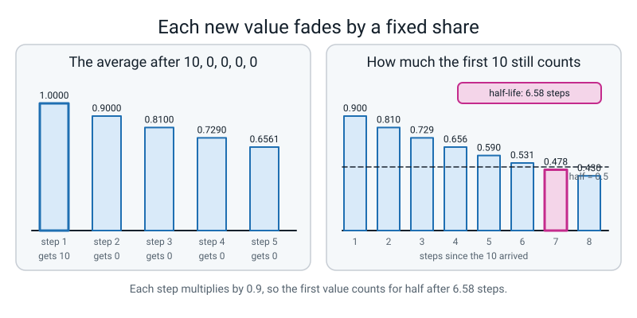
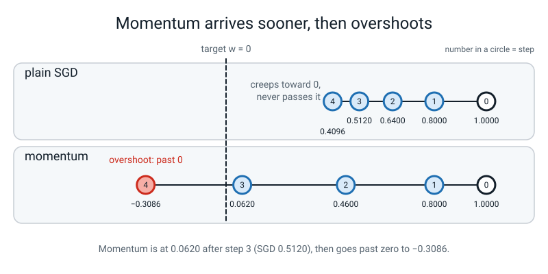

# Week 2 — Momentum: A Running Average of Where You Were Going

[⬅ Week 1](week-01.md) · [Course Home](../README.md) · [Week 3 ➡](week-03.md) · [Student Guide](../student-guide/week-02.md) · [Workbook](../workbook/week-02.md)

---


*Figure 2.0 — Where this fits: week 2 of 36 sits in term 1, "train it on purpose"; the tiles still dashed are the weeks to come.*

## 📋 At a Glance

| | |
|---|---|
| **Duration** | 70 minutes |
| **Type** | 🟦 Teach — the second week of Level 4. One optimizer rule changed, one running average met on paper first. |
| **Big idea** | A step that **remembers the last few steps** rolls through bumps that stop plain SGD. The memory is a **running average**. On the Week 1 spirals, at the *same* learning rate `0.03`, plain SGD ends at a coin (loss 0.690) and SGD with momentum ends at 0.018. |
| **New vocabulary** | exponential moving average (EMA) · momentum · velocity · half-life · overshoot · gradient length (norm) |
| **New maths** | **One idea: the exponential moving average.** *New average = 0.9 × old average + 0.1 × new value.* Met on **five numbers on paper** before any code. The "half-life" of 0.9 is found by repeated multiplication, not by a formula. |
| **New syntax** | `torch.optim.SGD(..., momentum=0.9)` · `optimizer.zero_grad(set_to_none=True)` · `tensor.norm()` |
| **Dataset** | Two tiny by-hand problems (`f(w) = w * w` from `w = 1.0`, and a steep valley `a*a + 25*b*b`), then the Week 1 spirals (`make_spirals`, seed 0: 840 train / 360 validation). Nothing downloads. |
| **Code** | Spirals and the `run(...)` harness import from `l4lib/spirals.py`. **The student imports it. Nobody copies it.** Everything else this week is 3–8 lines typed live. |
| **Materials** | The Bug Log · a pen · the six A–F cards from Week 1 · printed workbook page 2.1 (the hand table) · a calculator (phone is fine) |
| **Tech needed** | The Level 3 laptop. **Nothing new to install.** No GPU. No internet, ever. |
| **Prep time** | 20 minutes the night before · 5 minutes on the day |
| **Real runtime** | Every by-hand block is instant. The spirals runs take about 4 seconds in total (measured, one CPU thread). Nothing waits. |

> **⚠️ Watch out:** this week has one real idea (a running average) and one trap. **The trap is the word "average".** PyTorch's `momentum=0.9` does **not** compute `0.9 × old + 0.1 × new`. It computes `0.9 × old + new` (no `0.1`), which is **exactly ten times** the running average. A student who codes the average form "to check PyTorch" gets `0.9800` where PyTorch says `0.8000` and decides one of them is broken (Clinic, error 6). Teach the average first, *then* say the ×10 out loud once, on purpose, in the live-code segment, and use it (block P19) to explain why momentum at `lr = 0.03` matches plain SGD at `lr = 0.3`.

---

## 🎯 Lesson Objectives

By the end of the lesson the student can:

1. **Compute an exponential moving average by hand** on five numbers, using *new average = 0.9 × old average + 0.1 × new value*, and show a single early value fading by a fixed share (×0.9) each step.
2. **Do three steps of plain SGD and three of SGD with momentum** on `f(w) = w * w` from `w = 1.0` with `lr = 0.1`, on paper, and get `0.512` and `0.062`.
3. **Confirm both by-hand tables with `torch.optim.SGD`** (with and without `momentum=0.9`) and say what `zero_grad(set_to_none=True)` and `.norm()` do.
4. **Find a learning rate where momentum helps and one where it hurts** on the spirals, with one number each, and say which it is from the table.
5. **Say the trolley sentence:** *"Momentum keeps a running average of past steps, so steps that keep pointing the same way add up and steps that flip-flop cancel."*

Observable evidence: a filled hand table whose last column matches the `torch.optim` printout; a two-column SGD-versus-momentum table with a "helps / hurts" word per row; the sentence above, in the student's own words; the Bug Log entry for one deliberate error.

---

## 🧑‍🏫 What YOU Need to Know First

> **📌 About the code blocks in this guide.** The **🧰 Prep Checklist** holds the complete runnable sequence, blocks **P1–P21**, in order, in one file. Later sections refer to those blocks by number rather than repeating them. The **🐞 Debugging Clinic** blocks are **deliberately broken** and each is a separate file. Every output shown was printed by the code beside it, on a CPU, with a seed, in one session (torch 2.2.1, one thread). Numbers in the prose were checked against those outputs.

**You do not need to know any deep learning to teach this week.** You need to be able to multiply by 0.9 four times and read a two-column table. This section is all of it.

### 1. Why this week exists

Week 1 turned one knob (`lr`) and left everything else fixed, including the rule that decides *what a step is*: `w = w - lr * grad`. That rule looks only at the slope **under the student's feet right now**. It has no memory. On a real loss surface that is a problem in two ways: in a narrow valley the slope points mostly at the valley wall (so plain SGD zig-zags), and on a long gentle slope the steps are tiny (so plain SGD crawls).

**Momentum** is *the same rule, but the step is a running average of recent gradients instead of the latest one*. It is one extra number per weight, kept between steps. The student has seen the result already: Week 1's `optimizer=` knob was the one thing they were told to ignore.

### 2. The one new maths idea: an exponential moving average

An **exponential moving average (EMA)** is *a running average that counts recent values more and forgets old values by a fixed share each step*. The rule, for a share of 0.9:

```text
new average = 0.9 x old average + 0.1 x new value
```

That is the whole idea. The word "exponential" only means **the old stuff is multiplied by the same number again and again**. Nothing is stored except the one current average.

**Meeting it, in the order the lesson uses:** five numbers on paper. The first case is a single `10` followed by zeros, so the student watches the `10` fade:

```python
old = 0.0
for step, value in enumerate([10, 0, 0, 0, 0], start=1):
    old = 0.9 * old + 0.1 * value
    print(f"step {step}: value {value:>2}   average {old:.4f}")
```
```text
step 1: value 10   average 1.0000
step 2: value  0   average 0.9000
step 3: value  0   average 0.8100
step 4: value  0   average 0.7290
step 5: value  0   average 0.6561
```

Every step the average is exactly 0.9 times the step before: 1.0000, 0.9000, 0.8100, 0.7290, 0.6561. **The one early value loses a tenth of its weight every step.** That "fade by a fixed share" is the only thing the student has to see.

The second case keeps feeding the same value, so they see the average **climb toward it**:

```python
old = 0.0
for step, value in enumerate([10, 10, 10, 10, 10], start=1):
    old = 0.9 * old + 0.1 * value
    print(f"step {step}: value {value:>2}   average {old:.4f}")
```
```text
step 1: value 10   average 1.0000
step 2: value 10   average 1.9000
step 3: value 10   average 2.7100
step 4: value 10   average 3.4390
step 5: value 10   average 4.0951
```

The average heads for 10 but has not arrived after five steps (4.0951). **Do not explain why it starts low.** It starts low because the average began at 0, and the student's eyes will tell them that. (The name for fixing it is a Week 3 topic. Do not say it today.)

**The half-life of 0.9.** How long until the early value counts for half of what it did?

```python
share = 1.0
for n in range(1, 9):
    share = share * 0.9
    print(f"after {n} step(s) the first value still counts for {share:.3f}")
```
```text
after 1 step(s) the first value still counts for 0.900
after 2 step(s) the first value still counts for 0.810
after 3 step(s) the first value still counts for 0.729
after 4 step(s) the first value still counts for 0.656
after 5 step(s) the first value still counts for 0.590
after 6 step(s) the first value still counts for 0.531
after 7 step(s) the first value still counts for 0.478
after 8 step(s) the first value still counts for 0.430
```

Between step 6 (0.531) and step 7 (0.478) it crosses one half. So: **about 7 steps.** The exact crossing is 6.58:

```python
import math
print("steps until the first value counts for half:", round(math.log(0.5) / math.log(0.9), 2))
```
```text
steps until the first value counts for half: 6.58
```

**Say "half-life" and move on.** It is borrowed from physics (how long until half of something is gone). The student does **not** need `math.log`; it is in the Prep Checklist so the 6.58 is real, not guessed. The tolerance for the student's answer is "6 or 7 or about 7".


*Figure 2.1 — A running average forgets old values by the same share each step; for 0.9 the half-life is 6.58 steps.*

**If asked "what if it were 0.99 instead of 0.9?"** — the old value fades by one hundredth per step instead of one tenth, so the memory is much longer. Say "longer memory". The number of steps was not run in this guide; do not quote one.

### 3. From the average to momentum

Momentum keeps one number, the **velocity** `v` (*the running total of recent gradients*; the student met "gradient" in Level 3), for each weight:

```text
v = 0.9 x v + g            g = the gradient this step
w = w - lr x v
```

**It is the moving average with the `0.1` left off.** That makes it exactly **ten times** the average of the gradients:

```text
velocity = 10 x (the running average with 0.9 / 0.1)
```

That is why `lr = 0.1` with momentum takes bigger steps than `lr = 0.1` without it. Here is the proof on a slope that is always `2.0` (the same gradient every step). `avg` is the EMA from section 2, `v` is the momentum velocity:

```python
# steady slope: gradient always 2.0. Velocity v versus 10 x the running average
v, avg = 0.0, 0.0
for step in range(1, 31):
    v = 0.9 * v + 2.0
    avg = 0.9 * avg + 0.1 * 2.0
    if step in (1, 2, 3, 5, 10, 20, 30):
        print(f"step {step:>2}: v {v:7.4f}   avg {avg:.4f}   10*avg {10*avg:7.4f}")
```
```text
step  1: v  2.0000   avg 0.2000   10*avg  2.0000
step  2: v  3.8000   avg 0.3800   10*avg  3.8000
step  3: v  5.4200   avg 0.5420   10*avg  5.4200
step  5: v  8.1902   avg 0.8190   10*avg  8.1902
step 10: v 13.0264   avg 1.3026   10*avg 13.0264
step 20: v 17.5685   avg 1.7568   10*avg 17.5685
step 30: v 19.1522   avg 1.9152   10*avg 19.1522
```

The columns `v` and `10*avg` are **identical to four decimals at every step**. (They are identical in exact arithmetic, since both start at zero.) On a steady slope the velocity climbs toward `20 = 10 x 2.0`. After 30 steps it is at 19.15. So on a steady slope **momentum with `lr = L` behaves like plain SGD with `lr = 10 x L`** once it has warmed up. Hold onto that; block P19 shows it on real data.

And when the gradient flips sign every step, the running total cancels:

```python
v = 0.0
for step, g in enumerate([2.0, -2.0, 2.0, -2.0, 2.0, -2.0], start=1):
    v = 0.9 * v + g
    print(f"step {step}: g {g:+.1f}  v {v:+.4f}")
```
```text
step 1: g +2.0  v +2.0000
step 2: g -2.0  v -0.2000
step 3: g +2.0  v +1.8200
step 4: g -2.0  v -0.3620
step 5: g +2.0  v +1.6742
step 6: g -2.0  v -0.4932
```

The gradient is `+2, -2, +2, -2`, and the velocity hovers near zero (`-0.2`, `+1.82`, `-0.36`, `+1.67`...). **Steady pushes add up; flip-flops cancel.** That is the trolley, and it is the only intuition the lesson needs.

**Scope note.** In a real valley the two directions are different weights, and momentum treats each weight separately. The student does not need that. The two-number valley in block P16 shows the effect without mentioning it.

### 4. The by-hand table the whole lesson hangs on

`f(w) = w * w`, start `w = 1.0`, `lr = 0.1`. The gradient is `2w` (the student knows: slope of `w squared`, Level 3). **Three steps, both rules, every number:**

**Plain SGD** (`w = w - 0.1 x g`):

| step | w before | g = 2w | step = 0.1 g | w after |
|:--:|:--:|:--:|:--:|:--:|
| 1 | 1.0000 | 2.0000 | 0.2000 | **0.8000** |
| 2 | 0.8000 | 1.6000 | 0.1600 | **0.6400** |
| 3 | 0.6400 | 1.2800 | 0.1280 | **0.5120** |

**Momentum** (`v = 0.9 v + g`, then `w = w - 0.1 v`; `v` starts at 0):

| step | w before | g = 2w | v = 0.9 v + g | step = 0.1 v | w after |
|:--:|:--:|:--:|:--:|:--:|:--:|
| 1 | 1.0000 | 2.0000 | 0.9 x 0 + 2.0 = 2.0000 | 0.2000 | **0.8000** |
| 2 | 0.8000 | 1.6000 | 0.9 x 2.0 + 1.6 = 3.4000 | 0.3400 | **0.4600** |
| 3 | 0.4600 | 0.9200 | 0.9 x 3.4 + 0.92 = 3.9800 | 0.3980 | **0.0620** |

Note that the two rules agree after step 1 (both reach 0.8000, because `v` starts at 0) and part company at step 2: the momentum track carries the earlier speed, so its gradient at step 3 is smaller (0.92, not 1.28) and its step bigger.

**The answer the student should reach: SGD 0.512, momentum 0.062.** Momentum is about 8 times closer to zero after three steps. The fourth step is where it goes wrong, and it is the most instructive row:

```python
w, v = 1.0, 0.0
for step in range(1, 5):
    g = 2 * w
    v = 0.9 * v + g
    w = w - 0.1 * v
    print(f"step {step}: g {g:7.4f}  v {v:7.4f}  w {w:8.4f}")
```
```text
step 1: g  2.0000  v  2.0000  w   0.8000
step 2: g  1.6000  v  3.4000  w   0.4600
step 3: g  0.9200  v  3.9800  w   0.0620
step 4: g  0.1240  v  3.7060  w  -0.3086
```

Step 4 moves `w` from `0.0620` to `-0.3086`: it **overshot** zero (*went past the target because it was still carrying the old steps*). Plain SGD, same four steps:

```python
w = 1.0
for step in range(1, 5):
    g = 2 * w
    w = w - 0.1 * g
    print(f"step {step}: g {g:7.4f}  w {w:8.4f}")
```
```text
step 1: g  2.0000  w   0.8000
step 2: g  1.6000  w   0.6400
step 3: g  1.2800  w   0.5120
step 4: g  1.0240  w   0.4096
```

SGD creeps (0.5120, then 0.4096) and never overshoots. That is the whole trade: **momentum arrives sooner, and overshoots.** On real, bumpy losses the overshoot is usually worth it. On a loss that is already smooth and a step that is already big, it is not (block P18 shows a row where it hurts).


*Figure 2.2 — Momentum arrives sooner because it carries old steps, and for the same reason it overshoots.*

**Week 1's parking lot.** Last week the student was told "why a big learning rate blows up is Week 2". The one-line answer is in block P12: a step that is **too long** jumps over the target to the far side, and if it lands farther away than it started, each jump is bigger than the last.

```python
# why a step that is too long overshoots: plain SGD on f(w) = w*w with lr = 1.1
w = 1.0
for step in range(1, 7):
    w = w - 1.1 * (2 * w)
    print(f"step {step}: w {w:9.4f}")
```
```text
step 1: w   -1.2000
step 2: w    1.4400
step 3: w   -1.7280
step 4: w    2.0736
step 5: w   -2.4883
step 6: w    2.9860
```

With `lr = 1.1` the step from `w = 1.0` lands on `-1.2`, farther from zero than it started, and it keeps growing: `-1.2`, `1.44`, `-1.728`... each one 1.2 times the previous size. (A fade share greater than 1 is a growth share.) This is what row F of Week 1 was doing in a 64-knob network. **Say it once and then let it go.** The mechanism is checked only on this one-knob toy; the network's own behaviour is read from its curve, not from this argument.

### 5. The three new constructs

**`torch.optim.SGD(..., momentum=0.9)`.** The same optimizer as Level 3's `SGD`, with the memory switched on. Internally PyTorch stores the velocity for each weight under the name `"momentum_buffer"`. The student can *see* it (block P9): after step 3 the buffer reads `3.9800`, the same `v` as the hand table. Default is `momentum=0` (no memory), which is plain SGD.

**`optimizer.zero_grad(set_to_none=True)`.** Before each `backward()` the stored gradients must be cleared, or they **add up** (Clinic, error 7). Last year the student wrote `opt.zero_grad()`. The new argument says *how* to clear: `set_to_none=False` writes zeros; `set_to_none=True` removes the gradient entirely so the slot reads `None`. **One thing the course README does not say and you should know:** in torch 2.2.1 the default already **is** `True`, so `zero_grad()` and `zero_grad(set_to_none=True)` behave the same here. The reason to write it out is to make the choice visible, and because `None` is easier to spot than a zero that quietly stayed (block P14 shows all three).

```python
import torch
w = torch.tensor([3.0, 4.0], requires_grad=True)
opt = torch.optim.SGD([w], lr=0.1)
(w ** 2).sum().backward()
opt.zero_grad(set_to_none=False); print("set_to_none=False ->", w.grad)
(w ** 2).sum().backward()
opt.zero_grad(set_to_none=True);  print("set_to_none=True  ->", w.grad)
(w ** 2).sum().backward()
opt.zero_grad();                  print("no argument       ->", w.grad)
```
```text
set_to_none=False -> tensor([0., 0.])
set_to_none=True  -> None
no argument       -> None
```

**`tensor.norm()`.** *The length of a tensor as if it were an arrow: square every entry, add, take the square root.* `[6, 8]` has length `sqrt(36 + 64) = 10` (the 3-4-5 triangle the student knows, doubled). Block P13 does this on a gradient. Block P15 (teacher-only: it uses `clip_grad_norm_`, which is a Week 6 construct) does it on a whole network's gradient to check the harness's `gnorm`.

```python
import torch
w = torch.tensor([3.0, 4.0], requires_grad=True)
print("grad before any backward:", w.grad)
(w ** 2).sum().backward()
print("grad after backward     :", w.grad)
print("its length (norm)       :", w.grad.norm())
print("by hand sqrt(6*6+8*8)   :", (6**2 + 8**2) ** 0.5)
w.grad = None
print("after set to None       :", w.grad)
```
```text
grad before any backward: None
grad after backward     : tensor([6., 8.])
its length (norm)       : tensor(10.)
by hand sqrt(6*6+8*8)   : 10.0
after set to None       : None
```

### 6. What the spirals show (the only training this week)

The Week 1 harness takes `optimizer="sgd"` or `optimizer="momentum"` (lines 105–107 of `l4lib/spirals.py` build `torch.optim.SGD(..., momentum=0.9)` exactly as the student types it in block P9). Same data, same seed, same starting weights. **Only the rule changes.**

| `lr` | SGD final train loss | SGD val acc | Momentum final train loss | Momentum val acc | Verdict |
|:--:|:--:|:--:|:--:|:--:|---|
| 0.003 | 0.693 | 46.9% | 0.690 | 56.7% | both stuck (a coin) |
| 0.01 | 0.692 | 46.9% | 0.440 | 59.2% | momentum helps |
| 0.03 | 0.690 | 52.8% | 0.018 | 98.6% | **momentum helps a lot** |
| 0.1 | 0.387 | 80.0% | 0.025 | 99.2% | momentum helps |
| 0.3 | 0.016 | 98.9% | 0.659 | 46.9% | **momentum hurts** |
| 1.0 | 0.528 | 66.4% | `nan` | 46.9% | momentum hurts |

(Rows 0.01–1.0 are block P18's verbatim output; the 0.003 row is from block P17. Read "both stuck" with the 0.693 rule: 0.690 and 0.693 are a coin.)

Two sentences cover it. **Momentum rescues learning rates that are too small for plain SGD, within limits** (0.01 to 0.1 here; at 0.003 even momentum is still stuck). It **wrecks the learning rate that was already as big as plain SGD could bear.** Both come from the same cause: a momentum step is up to ten times longer.

**`nan` is a result, not a crash.** At `lr = 1.0` momentum's weights blow up in the fourth epoch (block P21) and the loss becomes `nan` ("not a number", what you get from infinity minus infinity). The harness kept going; the row is honest. The student should write `nan`, not `0`, and say "it blew up".

### 7. Common misconceptions to listen for

| The student says | What is going on | What you say |
|---|---|---|
| "Momentum is just a bigger learning rate." | True on a steady slope (ten times), which is why `0.03` and `0.3` match in P19. False when the gradient flips: momentum cancels the flip, a bigger `lr` amplifies it. | "On a straight road, yes. Round a zig-zag, no. Which did the valley have?" |
| "The average form and PyTorch should match." | They differ by exactly a factor of ten in `v`. | "PyTorch leaves off the 0.1. Multiply yours by ten and they agree." |
| "Momentum always wins." | It lost at 0.3 and 1.0. | "Point at row 0.3." |
| "`nan` means my code is wrong." | `nan` means the numbers blew up. The code did what it was told. | "Which earlier number was already too big?" |
| "Why does the velocity start at 0?" | Nothing has happened yet. Step 1 equals plain SGD (both land on 0.8000). | "Look at step 1 in both columns." |

### 8. Vocabulary (defined before use)

| Word | Meaning for this course | First met |
|---|---|---|
| **exponential moving average** | New average = 0.9 x old + 0.1 x new. Old values fade by a fixed share. | Concept A |
| **momentum** | SGD where the step is a running total of recent gradients | Concept B |
| **velocity** (`v`) | The running total momentum keeps, one number per weight | Concept B |
| **half-life** | Steps until an old value counts for half; about 7 for 0.9 | Concept A |
| **overshoot** | Going past the target because of carried-over steps | Live-code step 3 |
| **gradient length / norm** | `sqrt` of the sum of squares of all the gradient's numbers | Live-code step 4 |

**Not used today, on purpose:** *Adam*, *RMS*, *bias correction*, *epsilon*, *weight decay*, *schedule*, *batch size* (all later weeks), and *Nesterov* (never, in this course).

---

## 🧰 Prep Checklist

### 20 minutes the night before

**☐ 1. Right folder (30 seconds).** Open a terminal **in the `36-week-course/` folder** (the one that *contains* `l4lib/`). `ls` should list `l4lib`, `README.md`, `teacher-guide`. If not, `cd` there. (Week 1's commonest error; it is the Week 1 Clinic's error 4.)

**☐ 2. Keep Week 1's file.** `week01.py` from last week should still be there and should still print the same six rows. Nothing in Week 2 depends on it, but a digit that changed between weeks is something you want to know **tonight**.

**☐ 3. Run the blocks below, in order, in one file.** Save as `week02.py` in `36-week-course/`. It takes about **5 seconds**. Every number in this guide came from it. Tolerance: **±0.005 on losses and ±0.5 points on accuracy.** The by-hand blocks (P2–P15) are exact to the printed digits on any machine.

**Block P1 — set-up**

```python
import torch
torch.set_num_threads(1)
print("threads:", torch.get_num_threads(), " torch", torch.__version__)
```
```text
threads: 1  torch 2.2.1
```

**Block P2 — the average fades (10, then zeros)**

```python
old = 0.0
for step, value in enumerate([10, 0, 0, 0, 0], start=1):
    old = 0.9 * old + 0.1 * value
    print(f"step {step}: value {value:>2}   average {old:.4f}")
```
```text
step 1: value 10   average 1.0000
step 2: value  0   average 0.9000
step 3: value  0   average 0.8100
step 4: value  0   average 0.7290
step 5: value  0   average 0.6561
```

**Block P3 — the average climbs (all tens)**

```python
old = 0.0
for step, value in enumerate([10, 10, 10, 10, 10], start=1):
    old = 0.9 * old + 0.1 * value
    print(f"step {step}: value {value:>2}   average {old:.4f}")
```
```text
step 1: value 10   average 1.0000
step 2: value 10   average 1.9000
step 3: value 10   average 2.7100
step 4: value 10   average 3.4390
step 5: value 10   average 4.0951
```

**Block P4 — the half-life, by repeated multiplication**

```python
share = 1.0
for n in range(1, 9):
    share = share * 0.9
    print(f"after {n} step(s) the first value still counts for {share:.3f}")
```
```text
after 1 step(s) the first value still counts for 0.900
after 2 step(s) the first value still counts for 0.810
after 3 step(s) the first value still counts for 0.729
after 4 step(s) the first value still counts for 0.656
after 5 step(s) the first value still counts for 0.590
after 6 step(s) the first value still counts for 0.531
after 7 step(s) the first value still counts for 0.478
after 8 step(s) the first value still counts for 0.430
```

**Block P5 — the half-life, exactly**

```python
import math
print("steps until the first value counts for half:", round(math.log(0.5) / math.log(0.9), 2))
```
```text
steps until the first value counts for half: 6.58
```

**Block P6 — momentum by hand on f(w) = w*w**

```python
w, v = 1.0, 0.0
for step in range(1, 5):
    g = 2 * w
    v = 0.9 * v + g
    w = w - 0.1 * v
    print(f"step {step}: g {g:7.4f}  v {v:7.4f}  w {w:8.4f}")
```
```text
step 1: g  2.0000  v  2.0000  w   0.8000
step 2: g  1.6000  v  3.4000  w   0.4600
step 3: g  0.9200  v  3.9800  w   0.0620
step 4: g  0.1240  v  3.7060  w  -0.3086
```

**Block P7 — plain SGD by hand**

```python
w = 1.0
for step in range(1, 5):
    g = 2 * w
    w = w - 0.1 * g
    print(f"step {step}: g {g:7.4f}  w {w:8.4f}")
```
```text
step 1: g  2.0000  w   0.8000
step 2: g  1.6000  w   0.6400
step 3: g  1.2800  w   0.5120
step 4: g  1.0240  w   0.4096
```

**Block P8 — torch.optim agrees with the paper**

```python
import torch
def steps(momentum):
    w = torch.tensor([1.0], requires_grad=True)
    opt = torch.optim.SGD([w], lr=0.1, momentum=momentum)
    out = []
    for _ in range(4):
        opt.zero_grad(set_to_none=True)
        loss = (w ** 2).sum()
        loss.backward()
        opt.step()
        out.append(round(w.item(), 4))
    return out
print("plain SGD   :", steps(0.0))
print("momentum 0.9:", steps(0.9))
```
```text
plain SGD   : [0.8, 0.64, 0.512, 0.4096]
momentum 0.9: [0.8, 0.46, 0.062, -0.3086]
```

**Block P9 — peeking at the velocity PyTorch keeps**

```python
w = torch.tensor([1.0], requires_grad=True)
opt = torch.optim.SGD([w], lr=0.1, momentum=0.9)
for step in range(1, 4):
    opt.zero_grad(set_to_none=True)
    (w ** 2).sum().backward()
    opt.step()
    v = opt.state[w]["momentum_buffer"]
    print(f"step {step}: w {w.item():.4f}  v {v.item():.4f}")
```
```text
step 1: w 0.8000  v 2.0000
step 2: w 0.4600  v 3.4000
step 3: w 0.0620  v 3.9800
```

**Block P10 — velocity is ten times the average**

```python
# steady slope: gradient always 2.0. Velocity v versus 10 x the running average
v, avg = 0.0, 0.0
for step in range(1, 31):
    v = 0.9 * v + 2.0
    avg = 0.9 * avg + 0.1 * 2.0
    if step in (1, 2, 3, 5, 10, 20, 30):
        print(f"step {step:>2}: v {v:7.4f}   avg {avg:.4f}   10*avg {10*avg:7.4f}")
```
```text
step  1: v  2.0000   avg 0.2000   10*avg  2.0000
step  2: v  3.8000   avg 0.3800   10*avg  3.8000
step  3: v  5.4200   avg 0.5420   10*avg  5.4200
step  5: v  8.1902   avg 0.8190   10*avg  8.1902
step 10: v 13.0264   avg 1.3026   10*avg 13.0264
step 20: v 17.5685   avg 1.7568   10*avg 17.5685
step 30: v 19.1522   avg 1.9152   10*avg 19.1522
```

**Block P11 — a flip-flopping gradient cancels**

```python
v = 0.0
for step, g in enumerate([2.0, -2.0, 2.0, -2.0, 2.0, -2.0], start=1):
    v = 0.9 * v + g
    print(f"step {step}: g {g:+.1f}  v {v:+.4f}")
```
```text
step 1: g +2.0  v +2.0000
step 2: g -2.0  v -0.2000
step 3: g +2.0  v +1.8200
step 4: g -2.0  v -0.3620
step 5: g +2.0  v +1.6742
step 6: g -2.0  v -0.4932
```

**Block P12 — why a step that is too long overshoots**

```python
# why a step that is too long overshoots: plain SGD on f(w) = w*w with lr = 1.1
w = 1.0
for step in range(1, 7):
    w = w - 1.1 * (2 * w)
    print(f"step {step}: w {w:9.4f}")
```
```text
step 1: w   -1.2000
step 2: w    1.4400
step 3: w   -1.7280
step 4: w    2.0736
step 5: w   -2.4883
step 6: w    2.9860
```

**Block P13 — what a gradient is before and after backward, and its length**

```python
w = torch.tensor([3.0, 4.0], requires_grad=True)
print("grad before any backward:", w.grad)
(w ** 2).sum().backward()
print("grad after backward     :", w.grad)
print("its length (norm)       :", w.grad.norm())
print("by hand sqrt(6*6+8*8)   :", (6**2 + 8**2) ** 0.5)
w.grad = None
print("after set to None       :", w.grad)
```
```text
grad before any backward: None
grad after backward     : tensor([6., 8.])
its length (norm)       : tensor(10.)
by hand sqrt(6*6+8*8)   : 10.0
after set to None       : None
```

**Block P14 — the three ways to clear a gradient**

```python
w = torch.tensor([3.0, 4.0], requires_grad=True)
opt = torch.optim.SGD([w], lr=0.1)
(w ** 2).sum().backward()
opt.zero_grad(set_to_none=False); print("set_to_none=False ->", w.grad)
(w ** 2).sum().backward()
opt.zero_grad(set_to_none=True);  print("set_to_none=True  ->", w.grad)
(w ** 2).sum().backward()
opt.zero_grad();                  print("no argument       ->", w.grad)
```
```text
set_to_none=False -> tensor([0., 0.])
set_to_none=True  -> None
no argument       -> None
```

**Block P15 — gradient length of a whole network (teacher-only check)**

```python
import torch.nn as nn
from l4lib.spirals import make_model, get_data
Xtr, ytr, Xva, yva = get_data()
torch.manual_seed(0)
model = make_model()
loss = nn.CrossEntropyLoss()(model(Xtr[:64]), ytr[:64])
loss.backward()
total = 0.0
for p in model.parameters():
    total = total + p.grad.norm() ** 2
print("by hand  :", round(float(total ** 0.5), 4))
print("by torch (Week 6 tool, teacher-only check):", round(float(torch.nn.utils.clip_grad_norm_(model.parameters(), float("inf"))), 4))
```
```text
by hand  : 0.0811
by torch (Week 6 tool, teacher-only check): 0.0811
```

**Block P16 — the valley (optional, flying student)**

```python
# the trolley: a narrow steep valley, f(a, b) = a**2 + 25 * b**2, start (1, 1), lr 0.003
def valley(use_momentum, lr=0.003):
    p = torch.tensor([1.0, 1.0], requires_grad=True)
    opt = torch.optim.SGD([p], lr=lr, momentum=0.9 if use_momentum else 0.0)
    out = []
    for step in range(60):
        opt.zero_grad(set_to_none=True)
        f = p[0] ** 2 + 25 * p[1] ** 2
        f.backward()
        opt.step()
        out.append(f.item())
    return out
plain, mom = valley(False), valley(True)
print("step      " + "".join(f"{s:>9}" for s in (0, 5, 10, 20, 40, 59)))
print("plain     " + "".join(f"{plain[s]:>9.4f}" for s in (0, 5, 10, 20, 40, 59)))
print("momentum  " + "".join(f"{mom[s]:>9.4f}" for s in (0, 5, 10, 20, 40, 59)))
```
```text
step              0        5       10       20       40       59
plain       26.0000   5.8635   1.8556   0.8236   0.6179   0.4916
momentum    26.0000   4.0244   4.0216   0.2258   0.3524   0.0034
```

**Block P17 — SGD against momentum at three learning rates**

```python
from l4lib.spirals import run
H = {}
for name in ("sgd", "momentum"):
    for lr in (0.003, 0.03, 0.3):
        H[(name, lr)] = run(f"{name} lr={lr:g}", lr=lr, optimizer=name)
```
```text
sgd lr=0.003                 train 0.693  val 0.694  acc  46.9%
sgd lr=0.03                  train 0.690  val 0.690  acc  52.8%
sgd lr=0.3                   train 0.016  val 0.041  acc  98.9%
momentum lr=0.003            train 0.690  val 0.690  acc  56.7%
momentum lr=0.03             train 0.018  val 0.034  acc  98.6%
momentum lr=0.3              train 0.659  val 0.691  acc  46.9%
```

**Block P18 — the five-row verdict table**

```python
for lr in (0.01, 0.03, 0.1, 0.3, 1.0):
    H[("sgd", lr)] = run(f"sgd lr={lr:g}", lr=lr, optimizer="sgd", verbose=False)
    H[("momentum", lr)] = run(f"momentum lr={lr:g}", lr=lr, optimizer="momentum", verbose=False)
print(f"{'lr':>6} | {'sgd final':>10} {'sgd acc':>8} | {'mom final':>10} {'mom acc':>8} | verdict")
for lr in (0.01, 0.03, 0.1, 0.3, 1.0):
    a, b = H[("sgd", lr)], H[("momentum", lr)]
    verdict = "momentum helps" if b["train"][-1] < a["train"][-1] - 0.05 else ("momentum hurts" if not b["train"][-1] <= a["train"][-1] + 0.05 else "about equal")
    print(f"{lr:>6g} | {a['train'][-1]:>10.3f} {a['acc'][-1]*100:>7.1f}% | {b['train'][-1]:>10.3f} {b['acc'][-1]*100:>7.1f}% | {verdict}")
```
```text
    lr |  sgd final  sgd acc |  mom final  mom acc | verdict
  0.01 |      0.692    46.9% |      0.440    59.2% | momentum helps
  0.03 |      0.690    52.8% |      0.018    98.6% | momentum helps
   0.1 |      0.387    80.0% |      0.025    99.2% | momentum helps
   0.3 |      0.016    98.9% |      0.659    46.9% | momentum hurts
     1 |      0.528    66.4% |        nan    46.9% | momentum hurts
```

**Block P19 — the ten-times link**

```python
# the ten-times story: momentum at lr L against plain SGD at lr 10 x L
A = run("momentum lr=0.03", lr=0.03, optimizer="momentum")
B = run("sgd      lr=0.3 ", lr=0.3, optimizer="sgd")
```
```text
momentum lr=0.03             train 0.018  val 0.034  acc  98.6%
sgd      lr=0.3              train 0.016  val 0.041  acc  98.9%
```

**Block P20 — gradient lengths (optional)**

```python
g = H[("momentum", 0.03)]["gnorm"]
s = H[("sgd", 0.3)]["gnorm"]
print("epoch      " + "".join(f"{e:>9}" for e in (0, 1, 5, 20, 59)))
print("momentum   " + "".join(f"{g[e]:>9.3f}" for e in (0, 1, 5, 20, 59)))
print("sgd (10x)  " + "".join(f"{s[e]:>9.3f}" for e in (0, 1, 5, 20, 59)))
```
```text
epoch              0        1        5       20       59
momentum       0.072    0.033    0.016    0.328    0.087
sgd (10x)      0.053    0.027    0.017    0.327    0.150
```

**Block P21 — how momentum blew up at lr = 1**

```python
h = H[("momentum", 0.3)]
print("momentum lr=0.3 train loss, epochs 0 1 2 5 10 20 59:")
print([round(h["train"][e], 3) for e in (0, 1, 2, 5, 10, 20, 59)])
h = H[("momentum", 1.0)]
print("momentum lr=1 train loss, first 4 epochs:", [round(x, 3) if x == x else x for x in h["train"][:4]])
h = H[("sgd", 1.0)]
print("sgd lr=1 train loss epochs 0 1 2 5 10 59:", [round(h["train"][e], 3) for e in (0,1,2,5,10,59)])
```
```text
momentum lr=0.3 train loss, epochs 0 1 2 5 10 20 59:
[0.697, 0.694, 0.667, 0.469, 0.712, 0.658, 0.659]
momentum lr=1 train loss, first 4 epochs: [0.705, 0.648, 0.702, nan]
sgd lr=1 train loss epochs 0 1 2 5 10 59: [0.694, 0.695, 0.689, 0.574, 0.701, 0.528]
```


**☐ 4. What to check.** Three fingerprints that tell you everything else is right:

- P6 ends on `w  -0.3086` (momentum overshoots at step 4).
- P8 prints `[0.8, 0.64, 0.512, 0.4096]` and `[0.8, 0.46, 0.062, -0.3086]`: **torch agrees with the hand table.**
- P17 prints `momentum lr=0.03 ... train 0.018 ... acc  98.6%` (and Week 1's preview promised `0.018` / `98.6%`).

If `nan` does not appear for `momentum lr=1`, or appears at a different epoch (P21 shows it in the fourth epoch, index 3), that is a **different PyTorch or CPU**, not a mistake. Say so to the student; do not say it "should" be `nan`. The guide's `nan` is from torch 2.2.1 on the machine named above.

**☐ 5. Print workbook page 2.1** (the hand table in section 4, with the answer columns blank), and lay out the six A–F cards from Week 1.

### 5 minutes on the day

- Open the terminal in the right folder; run `python3 -c "import torch; print(torch.__version__)"`.
- Put `0.690  vs  0.018` **face down** on the board. It is the hook.
- Have the Bug Log open.

---

## ⏱️ The Lesson, Minute by Minute

| Segment | Minutes | Running total | What happens |
|---|---|---|---|
| 🪝 Hook — Same Rate, Opposite Fates | 7 | 7 | SGD and momentum at `lr = 0.03`: a coin, and 98.6%. What changed? |
| 🧠 Concept — A Number That Remembers | 17 | 24 | Five numbers on paper (the EMA). Momentum as "the average, times ten". Predict which `lr` momentum helps. |
| 💻 Live-Code Together | 26 | 50 | Hand table, then `torch.optim`, then `.norm()`, then two deliberate mistakes, then the spirals. |
| 🎲 Their Turn — helps or hurts? | 14 | 64 | The student fills the two-column table and marks each row. |
| 🔑 Wrap & Assign | 6 | 70 | The trolley sentence aloud. Homework. |

---

### 🪝 Hook — Same Rate, Opposite Fates (7 minutes)

**Do this:** Laptops open. Last week's Bug Log on the desk. Say:

> "Last week you turned one knob, the learning rate. There was one more knob in the list that I told you to ignore: `optimizer`. Today we turn it. Same data, same starting weights, same learning rate, 0.03. Two runs. Before I run them: what do you expect? **Write a number for each final loss.** Remember what a coin scores."

**Do this:** Let them write two numbers. **Do not comment.** Then run block P17's first lines live (only the two 0.03 lines; or run the whole block and point):

```text
sgd lr=0.03                  train 0.690  val 0.690  acc  52.8%
momentum lr=0.03             train 0.018  val 0.034  acc  98.6%
```

> "One of these is a coin. One is 98.6%. **I changed one word.** What does `optimizer="momentum"` have that `optimizer="sgd"` lacks?"

**Do this:** Collect guesses: *a bigger step; it goes faster; it is smarter; it remembers.* Any of these is a fair guess. Say:

> "'It remembers' is what we are going to build. By the end of the hour you will do it on paper with five numbers, and then you will watch PyTorch agree with your paper."

**Why this works:** it uses the Week 1 skill (recognise 0.690 as a coin) on the very first screen, and it asks a question (what changed?) that the lesson answers. **Do not explain yet.** They will try to; let them. If they say "it is just a bigger step", write it on the board as a hypothesis. It is *half* right and gets tested in P19.

**Why not start from the theory:** a student who has not seen 0.690 against 0.018 will not care that a step can have memory.

---

### 🧠 Concept — A Number That Remembers (17 minutes)

#### Part A — Five numbers on paper (7 minutes)

**Say this:**

> "Here is a trick for keeping a running tally without storing the past. You keep **one number**, the average so far. Each time a new value arrives, you do this." *(Write it big.)*

```text
new average = 0.9 x old average + 0.1 x new value
```

> "The average starts at 0. Five values arrive: ten, zero, zero, zero, zero. Work out the average after each one. Calculator allowed."

**Do this:** Let them do it. Expected: `1.0000, 0.9000, 0.8100, 0.7290, 0.6561`. (You can check against block P2.) Give it about 3 minutes.

**Check understanding:** *"What do you notice about each number compared with the one before?"* — **It is 0.9 times it, every time.** If they say "it goes down", ask "by how much?".

**Say this:**

> "That 10 arrived once. Every step it loses a tenth of its say. After one step it counts for 0.9 of what it did. After two, 0.81. **How many steps until it counts for half?**"

**Do this:** Give them the calculator and let them multiply by 0.9 repeatedly. The answer is **about 7** (0.531 after 6, 0.478 after 7). Write "half-life about 7" and underline it. If they jump to the formula, that is fine; the number is the point.

**Say this:**

> "This is called an **exponential moving average**. 'Moving' because it keeps up with new values. 'Exponential' because the old stuff is multiplied by 0.9 again and again. That is all the word means."

**Then** the second set: ten, ten, ten, ten, ten. Expect `1.0, 1.9, 2.71, 3.439, 4.0951` (block P3).

**Check understanding:** *"The values were all ten. Why isn't the average ten yet?"* — **It began at 0 and 0.9 of the old number is still being counted.** Accept any phrasing of "it started at zero and hasn't caught up". Do not say more; the fix is next week.

#### Part B — The step that remembers (6 minutes)

**Say this:**

> "Last year's step was: look at the slope, step a little bit downhill. Now imagine we don't step by *the slope*. We step by *a running tally of recent slopes*. Steady slope: the tally grows and we speed up. Slope flips every step: the tally cancels and we stop zig-zagging."

**Do this:** Write the rule, labelled:

```text
v = 0.9 x v + g          (v: the running tally, called the velocity)
w = w - lr x v
```

> "This is the average from before, **but with the 0.1 left off**. That makes it ten times bigger than the average. Hold on to that 'ten times': it will matter in about forty minutes."

**Do this:** Draw on the board, in ASCII, the slope that is steady and the one that flips. Something like:

```text
steady:   g =  +2  +2  +2  +2      v =  2.0  3.8  5.4  6.9   (grows)
flipping: g =  +2  -2  +2  -2      v =  2.0 -0.2  1.8 -0.4   (hovers near 0)
```

**Check understanding:** *"Which of those two is a zig-zag in a narrow valley?"* — The second. *"And which does momentum fix?"* — The second (it cancels); the first it speeds up. Both are good things.

#### Part C — Predict before you run (4 minutes)

**Say this:**

> "We will run SGD and momentum at six learning rates: 0.003, 0.01, 0.03, 0.1, 0.3, 1.0. Momentum takes steps up to **ten times longer**. For each learning rate, write: **helps, hurts, or same**. Then I run it."

**Do this:** Collect predictions in a two-column table in the Bug Log. **Do not comment.** Common guesses: "momentum helps everywhere" (most common, and the data will push back), and a minority who notice "ten times longer" and predict "hurts at the top". **Praise the second group's reasoning, not the answer.**

---

### 💻 Live-Code Together (26 minutes)

**Setup (1 minute).** Terminal in `36-week-course/`. New file `week02.py`. The student types; you do not. Tell them the tolerance in the first minute: *by-hand blocks are exact; spirals blocks within ±0.005 and ±0.5 points.*

#### Step 1 — set-up and the average in code (4 minutes)

**Type together:** block **P1**, then **P2** (the fade). Expect the five numbers from the paper. Then **P3** (the climb). Ask them to make a prediction about the last line first (`4.0951`) and *then* run it.

> "The code is the same five numbers you did on paper. Nothing new happened."

#### Step 2 — the by-hand table, in code (6 minutes)

**Say this:**

> "Now the function `f(w) = w times w`. Start at `w = 1.0`, learning rate 0.1. The slope is `2w`. Fill the table first, on paper, for both rules; three steps."

**Do this:** Hand out the printed workbook page 2.1 (the table in section 4, blanks on the last columns). Give 3 minutes. Then type **P7** (plain SGD) and **P6** (momentum) and compare. Expect `0.5120` and `0.0620` after step 3.

**Check understanding:** *"After step 3, which is closer to zero, and by how much?"* — **Momentum, about 8 times closer (0.062 against 0.512).** Then ask them to **predict step 4 for momentum before scrolling**: *does it stay positive?* Most say yes. It prints `-0.3086`.

> "It went past zero. That is called an **overshoot**. The tally still has the old speed in it. Plain SGD never did that. That is the price."

Mention the Week 1 parking-lot item here, **once**: type **P12** (`lr = 1.1`). Expect `-1.2, 1.44, -1.728...`. *"A step too long overshoots so far that it lands further away. Last week's row F is this, in a 64-knob network."*

#### Step 3 — the same thing in PyTorch (6 minutes)

**Say this:**

> "Now the real thing. Does `torch.optim.SGD` give what your paper gave?"

**Type together:** block **P8**. This introduces `momentum=0.9` and `opt.zero_grad(set_to_none=True)`. Walk the function line by line:

- `w = torch.tensor([1.0], requires_grad=True)` — one weight, the student knows this (Level 3).
- `opt = torch.optim.SGD([w], lr=0.1, momentum=momentum)` — the function takes the momentum as its one argument: `steps(0.0)` is plain SGD and `steps(0.9)` is the rule from the board. `momentum=0.0` means no memory.
- `opt.zero_grad(set_to_none=True)` — *"clear the stored slope before measuring a new one"*.

Expect:

```text
plain SGD   : [0.8, 0.64, 0.512, 0.4096]
momentum 0.9: [0.8, 0.46, 0.062, -0.3086]
```

> "Your paper and PyTorch agree to four places. So `momentum=0.9` is exactly the rule we wrote."

**Then** block **P9** to peek at the velocity PyTorch keeps: `3.9800` after step 3, the same as the hand table.

**Then** block **P14** (the three `zero_grad` forms). Do not dwell: `set_to_none=False` gives zeros, the other two give `None`. *"The default happens to be `None` on this version. We write it out so the choice is visible."*

#### Step 4 — the length of a gradient (3 minutes)

**Type together:** block **P13**. Say: *"`.norm()` is the length of an arrow: square, add, square-root. `[6, 8]` is a 3-4-5 triangle doubled. Length 10."* (Block **P15** repeats this over a whole network's gradients and checks it against PyTorch's own `clip_grad_norm_`, `0.0811` both ways. **That function is Week 6; it is for you, and for the flying student, not for everyone.**)

> "This number, the gradient's length, is what the harness recorded in `h['gnorm']` last week. From now on we can read it."

#### Step 5 — two deliberate mistakes (3 minutes)

**Say this:**

> "Two things people get wrong the first time. I will do each on purpose."

Run Clinic errors **1** (`None` has no `.norm`) and **6** (the average form against torch). They are short and they are the two confusions the week produces. The rest wait for the Clinic. **Have the student write the last line of each in the Bug Log.**

#### Step 6 — the spirals (3 minutes of typing, then the table)

**Type together:** block **P17** (SGD and momentum at three learning rates), then **P18** (the five-row verdict table). The student compares with their predictions in the Bug Log.

> "Row 0.03: a coin against 98.6%. Row 0.3: the other way round. **Momentum did not get 'better'. It got ten times longer steps.** Where ten times longer helps, it helps. Where it was already too long, it breaks."

**Then** block **P19**: momentum at `lr = 0.03` against plain SGD at `lr = 0.3`.

```text
momentum lr=0.03             train 0.018  val 0.034  acc  98.6%
sgd      lr=0.3              train 0.016  val 0.041  acc  98.9%
```

> "There is your 'ten times'. The same result, from a learning rate that is ten times smaller, because the velocity is ten times the average. Remember the student who said 'momentum is just a bigger learning rate'? *On this steady part of the ride, yes.*"

Leave **P16** (the valley) and **P20** (gradient lengths) for the flying student or for the homework; both are in the Differentiation section.

---

### 🎲 Their Turn — helps or hurts? (14 minutes)

**Do this:** Give the student the blank table (workbook page 2.2) and have them run **P18** themselves if they have not. Three tasks:

1. **Fill in the five rows** (final train loss and accuracy for each rule) from their own screen, and write **helps / hurts / about equal** per row.
2. **Find one `lr` where momentum helps and one where it hurts** and circle them. (Any of 0.01, 0.03, 0.1 for helps; 0.3 or 1.0 for hurts.)
3. **Say why in one sentence**, using the words "longer steps" or "ten times".

**Rule for "helps / hurts":** a difference of more than 0.05 in final train loss counts; smaller is "about equal". (This is the same rule block P18 uses.)

**Do this:** As they work, watch for these, and respond with a question, not an answer:

| What you see | Say |
|---|---|
| Writes `0` for the `nan` row | "What was the loss just before? Where did `nan` come from?" |
| "Momentum is better" | "Better at which row? Read me row 0.3." |
| Compares val accuracy only | "Which number did Week 1 say was the main one?" (Loss.) |
| Finishes quickly | Give the flying extension (Differentiation). |

**Close (2 minutes).** Ask: *"Put plain SGD and momentum next to your six A–F cards. Where does 'sgd at 0.03' go? Where does 'momentum at 0.3' go?"* — **A (flat, stuck) and F (collapsed to a coin)** respectively. `sgd lr=0.03` finishes at 0.690, which is Week 1's A/B story; `momentum lr=0.3` finishes near 0.659 and is a cousin of F (not the same: it did not start at 12.8; its first epoch is 0.697). That nuance is a bonus, not a requirement.

---

### 🔑 Wrap & Assign (6 minutes)

**Say this (student says it back):**

> "Momentum keeps a running average of past steps. Steps that keep pointing the same way add up and steps that flip-flop cancel. In PyTorch it is ten times the average, so at the same `lr` the steps are up to ten times longer: a big help when plain SGD was crawling, and a problem when it was already as fast as it could stand."

**Do this:** Have the student write it in the Bug Log, then the single line: *"Momentum's velocity is ten times the running average; SGD at `lr = 0.3` matches momentum at `lr = 0.03`."*

**Homework** (next section). Mention Week 3: *"Momentum fixed the direction. Next week we fix the size: each weight gets its own step size."* Do not elaborate.

---

## 🎲 The Activity, In Full

The activity is "Their Turn" above. **Materials:** the printed workbook pages 2.1 and 2.2, a calculator, the Bug Log, the six A–F cards.

**Instructions in order (for the record):**

1. Fill page 2.1 (hand table) for SGD and momentum, three steps, from `w = 1.0`, `lr = 0.1`. Check against block P8.
2. Run block P18 and copy five rows into page 2.2.
3. Mark each row **helps / hurts / about equal** using the 0.05 rule.
4. Write the one-sentence reason.
5. Place two new cards (SGD 0.03, momentum 0.3) beside A–F.

**Time.** 14 minutes in the lesson; the rest is homework.

---

## 🐞 The Debugging Clinic

Each error below is **deliberate**: a mistake this week reliably produces. The block in each is a **separate file** (called `week02_mistakeN.py`) and is meant to fail (or, in two cases, to run quietly and be wrong). The tracebacks are the real ones from torch 2.2.1 on the machine named above; file paths in them have been shortened, and where the traceback runs through PyTorch's own files those middle frames are replaced by one line saying so (the last line is the real, untouched one). **Teach the student to read the last line first.**

### Error 1 — Reading the length of a gradient that was removed

```python
# DELIBERATE MISTAKE 1: Reading the length of a gradient that was removed
import torch
w = torch.tensor([3.0, 4.0], requires_grad=True)
opt = torch.optim.SGD([w], lr=0.1)
(w ** 2).sum().backward()
opt.zero_grad(set_to_none=True)
print("gradient length:", w.grad.norm())
```
```text
Traceback (most recent call last):
  File "week02_mistake1.py", line 6, in <module>
    print("gradient length:", w.grad.norm())
AttributeError: 'NoneType' object has no attribute 'norm'
```

Clear the gradient only **after** you have used it. `set_to_none=True` makes the slot `None`, and `None` has no `.norm`. Also happens if you call `.norm()` before any `backward()` (then `w.grad` was never filled). **Fix:** `backward()`, then `.norm()`, then `zero_grad`.

### Error 2 — Forgetting the brackets on `.norm`

```python
# DELIBERATE MISTAKE 2: Forgetting the brackets on `.norm`
import torch
w = torch.tensor([3.0, 4.0], requires_grad=True)
(w ** 2).sum().backward()
print("gradient length:", w.grad.norm)
```
```text
gradient length: <bound method Tensor.norm of tensor([6., 8.])>
```

**Silent.** No error: it prints a description of the *method*, not a number. Rule: a thing you ask to do work needs `()`. **Fix:** `w.grad.norm()`.

### Error 3 — Taking the length of whole numbers

```python
# DELIBERATE MISTAKE 3: Taking the length of whole numbers
import torch
g = torch.tensor([6, 8])
print("length:", g.norm())
```
```text
Traceback (most recent call last):
  File "week02_mistake3.py", line 3, in <module>
    print("length:", g.norm())
  ... (frames inside PyTorch omitted) ...
RuntimeError: linalg.vector_norm: Expected a floating point or complex tensor as input. Got Long
```

`torch.tensor([6, 8])` holds integers; lengths need decimals. **Fix:** `torch.tensor([6.0, 8.0])`, the `.0` matters.

### Error 4 — Handing the optimizer a tensor, not a list

```python
# DELIBERATE MISTAKE 4: Handing the optimizer a tensor, not a list
import torch
w = torch.tensor([1.0], requires_grad=True)
opt = torch.optim.SGD(w, lr=0.1, momentum=0.9)
```
```text
Traceback (most recent call last):
  File "week02_mistake4.py", line 3, in <module>
    opt = torch.optim.SGD(w, lr=0.1, momentum=0.9)
  ... (frames inside PyTorch omitted) ...
TypeError: params argument given to the optimizer should be an iterable of Tensors or dicts, but got torch.FloatTensor
```

`SGD` wants *a list of the things to adjust*, even for one. **Fix:** `[w]`.

### Error 5 — A negative momentum

```python
# DELIBERATE MISTAKE 5: A negative momentum
import torch
w = torch.tensor([1.0], requires_grad=True)
opt = torch.optim.SGD([w], lr=0.1, momentum=-0.9)
```
```text
Traceback (most recent call last):
  File "week02_mistake5.py", line 3, in <module>
    opt = torch.optim.SGD([w], lr=0.1, momentum=-0.9)
  ... (frames inside PyTorch omitted) ...
ValueError: Invalid momentum value: -0.9
```

PyTorch checks the value before doing anything. `momentum` is a share between 0 and 1. **Fix:** `momentum=0.9`.

### Error 6 — The average form against torch (the week's trap)

```python
# DELIBERATE MISTAKE 6: The average form against torch (the week's trap)
# hand table with the AVERAGE form: v = 0.9*v + 0.1*g. Does it match torch?
import torch
w_hand, v = 1.0, 0.0
for step in range(1, 4):
    g = 2 * w_hand
    v = 0.9 * v + 0.1 * g
    w_hand = w_hand - 0.1 * v
    print(f"by hand (average form) step {step}: w {w_hand:.4f}")
w = torch.tensor([1.0], requires_grad=True)
opt = torch.optim.SGD([w], lr=0.1, momentum=0.9)
for step in range(1, 4):
    opt.zero_grad(set_to_none=True)
    (w ** 2).sum().backward()
    opt.step()
    print(f"torch                  step {step}: w {w.item():.4f}")
```
```text
by hand (average form) step 1: w 0.9800
by hand (average form) step 2: w 0.9424
by hand (average form) step 3: w 0.8897
torch                  step 1: w 0.8000
torch                  step 2: w 0.4600
torch                  step 3: w 0.0620
```

**Silent.** The hand loop uses `v = 0.9 v + 0.1 g`. PyTorch uses `v = 0.9 v + g`. The hand velocity is a tenth of the real one, so every step is a tenth as long. **Fix:** drop the `0.1`, or multiply the hand velocity by 10. Suspect the hand number first.

### Error 7 — Forgetting to clear the gradient

```python
# DELIBERATE MISTAKE 7: Forgetting to clear the gradient
# forgot zero_grad entirely
import torch
w = torch.tensor([1.0], requires_grad=True)
opt = torch.optim.SGD([w], lr=0.1)
for step in range(1, 4):
    (w ** 2).sum().backward()
    opt.step()
    print(f"step {step}: w {w.item():.4f}   stored gradient {w.grad.item():.4f}")
```
```text
step 1: w 0.8000   stored gradient 2.0000
step 2: w 0.4400   stored gradient 3.6000
step 3: w -0.0080   stored gradient 4.4800
```

**Silent.** Without `zero_grad`, each `backward()` *adds* to the stored slope: 2.0, then 3.6, then 4.48, where the true slopes would be 1.6 and 0.88. So the steps are wrong from step 2 and `w` ends at `-0.0080`. **Fix:** `opt.zero_grad(set_to_none=True)` before `backward()`.

### Error 8 — A misspelt optimizer name on the harness

```python
# DELIBERATE MISTAKE 8: A misspelt optimizer name on the harness
import torch
torch.set_num_threads(1)
from l4lib.spirals import run
h = run("typo: momentun lr=0.03", lr=0.03, optimizer="momentun")
h = run("spelt right: momentum", lr=0.03, optimizer="momentum")
h = run("what the typo really ran", lr=0.03, optimizer="adamw")
```
```text
typo: momentun lr=0.03       train 0.658  val 0.684  acc  46.9%
spelt right: momentum        train 0.018  val 0.034  acc  98.6%
what the typo really ran     train 0.658  val 0.684  acc  46.9%
```

**Silent.** The harness's `else` branch catches any name it does not know and quietly builds AdamW. The run finishes, prints a line, and is a *different experiment*: the first and third lines match. Compare with the properly spelt line. **Fix:** spell it `"momentum"`. (Open `l4lib/spirals.py` lines 103 to 112 and read the branch.)

### Error 9 — A bare number where the harness wants names (the Week 1 star)

```python
# DELIBERATE MISTAKE 9: A bare number where the harness wants names (the Week 1 star)
# forgot the star: the harness wants names
from l4lib.spirals import run
run("A", 0.03)
```
```text
Traceback (most recent call last):
  File "week02_mistake9.py", line 3, in <module>
    run("A", 0.03)
TypeError: run() takes 1 positional argument but 2 were given
```

Week 1's `*` again: everything after the tag must be named. **Fix:** `run("A", lr=0.03)`.

### How to use the Clinic

- **Errors 1 and 6** are run live in the lesson. **Errors 2, 6, 7 and 8 are silent**: they print or run and do not crash. Give those the most time, because the student will not know anything is wrong.
- The habit to build: **when a hand number and a torch number disagree, suspect the hand number first** (error 6), and **when a run finishes but the curve looks like a coin, check the spelling of every string knob** (error 8).

---

## ❓ Questions Students Ask This Week

**"Why 0.9?"** — It is the common default. 0.9 forgets by a tenth each step (half-life about 7). Smaller forgets faster; larger remembers longer. Nothing in this week tested other values; do not claim one is best.

**"Is `v` really ten times the average, or just about?"** — Exactly, when `v` starts at zero (block P10 shows four decimals equal at every step).

**"Why does step 1 equal plain SGD?"** — The velocity starts at 0, so `v = 0.9 x 0 + g = g`. Row 1 of the two tables matches.

**"Can momentum make a run get worse?"** — Yes; it did at `lr` 0.3 and 1.0 in this harness. It is the same long step that helps elsewhere.

**"Why `nan`?"** — The weights grew until the computer ran out of digits. It is a report that the run blew up, not a bug in the harness.

**"What does `set_to_none` do if the default is already True?"** — Nothing different on this version. It makes the choice explicit. On an older version, the default was `False`.

**"What is a 'buffer'?"** — Memory that is not a weight. The optimizer keeps the velocity in one (`momentum_buffer`).

**"Is this what Adam does?"** — Adam has a running average of the gradient in it, yes, plus something more. That is Week 3. Say nothing more today.

**"Why is the ball/trolley picture backwards for `nan`?"** — It is not a perfect picture. A trolley does not blow up. Keep the picture for *direction* (steady adds, flip-flop cancels) and use the table for *size*.

**"Does momentum cost more computer time?"** — One extra number per weight, kept between steps. Not measured this week; do not quote a time.

---

## ⚠️ Where This Lesson Goes Wrong

1. **The teacher calls momentum "a running average" and the student codes the average.** The student's `0.9800` then contradicts PyTorch's `0.8000`. Say the "ten times" sentence in Concept B, **before** the student types anything.
2. **The by-hand table is skipped because "we have PyTorch".** The lesson is the table. A student who has not done `0.512` against `0.062` on paper will not believe the `0.690` against `0.018`.
3. **The spirals come first.** The hook uses them, which is fine, but the *explanation* must come from the five numbers, not from the curve. Keep the hook to 7 minutes.
4. **"Momentum is better" gets written in the Bug Log.** Row 0.3 contradicts it. Make them point at the row.
5. **`nan` is explained as a mystery.** It is the step-too-long story from P12 at the extreme. Connect them.
6. **The valley (P16) is run live and the student sees momentum *behind* for ten steps.** It is: 4.02 against 1.86 at step 10. Momentum is slower off the line, then wins by step 59. If you run it, say so before they notice.
7. **Half-life becomes a formula.** The number 7 comes from multiplying by 0.9 seven times. If the student reaches for `log`, let them, but do not teach it.
8. **Sliding into Adam.** Every "and the step is scaled per weight" is Week 3. Parking Lot.

---

## 🧭 Differentiation

### If the student is struggling

- **Cut the code, keep the table.** Do Concept A and B and the hand table on paper. Give the printed P18 table and have them mark helps / hurts from numbers.
- **Use three words:** *speeds up, cancels, overshoots.* Three ideas, three words.
- **Shrink the average.** Use only `[10, 0, 0]` and three steps (1.0, 0.9, 0.81) for the EMA. Do the half-life as "it loses a tenth each step, so about seven steps".
- **Skip P12, P14 and P15.** They are enrichment.
- **Reframe the trolley:** a trolley you push the same way three times is going faster than one you pushed once.

### If the student is flying

- **The valley, block P16.** `f(a, b) = a*a + 25*b*b`, start `(1, 1)`, `lr = 0.003`, 60 steps:

  ```text
step              0        5       10       20       40       59
plain       26.0000   5.8635   1.8556   0.8236   0.6179   0.4916
momentum    26.0000   4.0244   4.0216   0.2258   0.3524   0.0034
```

  Ask: *"At which step is momentum first better? Why is it worse at step 10?"* (It overshoots: 4.0216 against 1.8556.) It finishes 0.0034 against 0.4916. This is the trolley zig-zag made of numbers.
- **The gradient lengths, block P20.** Momentum at `lr = 0.03` and SGD at `lr = 0.3` have gradient lengths that track each other at some epochs (0.016 and 0.017 at epoch 5; 0.328 and 0.327 at epoch 20) and not at others (0.087 and 0.150 at epoch 59). The harness records the length for the last batch of each epoch only, so it is noisy: say so. Ask for a reason the first two agree. (Steps of similar size, ten times apart in `lr`.)

  ```text
epoch              0        1        5       20       59
momentum       0.072    0.033    0.016    0.328    0.087
sgd (10x)      0.053    0.027    0.017    0.327    0.150
```
- **Find the best momentum learning rate** between 0.03 and 0.3 and defend it. **Caution:** one seed. Week 7's thesis (three seeds, mean and spread) is the right answer to "is it the best"; say so.
- **Change the fade share.** Rewrite P2 with `0.5 * old + 0.5 * value` and `0.99 * old + 0.01 * value`. What happens to the half-life?

### If the student won't engage today

- **Start from the punchline.** Show `0.690` and `0.018` and ask *"what did I change?"* Give them 2 minutes to guess. The guesses are the engagement.
- **Let them break it.** *"Find a learning rate that makes momentum give `nan`."* (1.0.) They will go searching.
- **Keep the paper table,** drop the EMA. Momentum can be done as "a tally" without the word "average".

---

## ✅ Assessing Understanding

Four quick checks, none of which is a test.

1. **The fade.** *"An average uses 0.9 × old + 0.1 × new. One value of 10 arrives, then zeros. What is the average after 3 steps?"* **Full:** 0.81. **Partial:** describes the fade without the number. **Not yet:** 0 or 10.
2. **The hand step.** *"Momentum, `w = 1`, `lr = 0.1`, `g = 2w`. What is `w` after step 2?"* **Full:** 0.46. **Partial:** 0.64 (used the SGD column). **Not yet:** anything that ignores the velocity.
3. **Helps or hurts.** *"At `lr = 0.3` does momentum help?"* **Full:** no, 0.659 against 0.016, because the steps are ten times longer. **Partial:** "no" with no number. **Not yet:** "yes".
4. **Read `nan`.** *"What does a `nan` loss tell you?"* **Full:** the numbers blew up (a step that was too long, repeated). **Partial:** "it broke". **Not yet:** "zero".

### Mastery scale for this week

| Level | The student can... |
|---|---|
| **Not yet** | Does the EMA but cannot connect it to a step; or confuses the average with velocity. |
| **Getting there** | Gets 0.512 and 0.062 with hints; marks helps/hurts correctly but not why. |
| **Secure** | Gets both tables alone, matches torch, finds helps and hurts rows with numbers, says the trolley sentence. |
| **Beyond** | States the ×10 relation, uses it to predict that `momentum lr=0.03` will match `sgd lr=0.3`, and notes it is only true on a steady slope. |

---

## 📤 Homework to Assign

**Workbook Week 2** (about 60–75 minutes). The workbook file is authored in a later stage; the pages it must carry, so that it matches today, are:

| Page | Task | What it checks |
|:--:|---|---|
| 2.1 | **The hand table.** Three steps of SGD and of momentum on `f(w) = w*w`, `w = 1.0`, `lr = 0.1`. Then check against `torch.optim`. | Objectives 2, 3 |
| 2.2 | **Helps or hurts.** The two-column table over five learning rates, with a word per row. | Objective 4 |
| 2.3 | **The EMA on your own five numbers.** Pick five numbers (not 10, 0, 0, 0, 0). Compute the average by hand, then in code. | Objective 1 |
| 2.4 | **Find one `lr` where momentum helps and one where it hurts** on your own run, and paste the two lines. | Objective 4 |
| 2.5 | **Break it on purpose.** Pick one Clinic error. Reproduce it, paste the last line into the Bug Log, then fix it. | Reading errors |
| 2.6 | **The x10.** Run momentum at `lr = 0.03` and SGD at `lr = 0.3`. Say in one sentence why they match. | The week's link |
| 2.7 | **Self-check:** *In one sentence, what does momentum remember, and what does it do with it?* | Objective 5 |

**The one line the student writes in the Bug Log tonight:** *"Momentum is ten times a running average; longer steps help a crawler and wreck a sprinter."*

> **Reminder for you:** under course rule 6, **any number the student writes in a report this year must have been printed by their own run, with a seed, in the last 24 hours.**

---

## 🔑 Answer Key

### Page 2.1 — The hand table

| step | SGD g | SGD w after | Momentum g | v | step (0.1 v) | Momentum w after |
|:--:|:--:|:--:|:--:|:--:|:--:|:--:|
| 1 | 2.0000 | 0.8000 | 2.0000 | 2.0000 | 0.2000 | 0.8000 |
| 2 | 1.6000 | 0.6400 | 1.6000 | 3.4000 | 0.3400 | 0.4600 |
| 3 | 1.2800 | 0.5120 | 0.9200 | 3.9800 | 0.3980 | 0.0620 |
| 4 (extension) | 1.0240 | 0.4096 | 0.1240 | 3.7060 | 0.3706 | -0.3086 |

Torch check: `[0.8, 0.64, 0.512, 0.4096]` and `[0.8, 0.46, 0.062, -0.3086]` (block P8). Accept the student's figures within 0.0001; the exact tables are from blocks P6 and P7.

### Page 2.2 — Helps or hurts

| `lr` | SGD loss / acc | Momentum loss / acc | Verdict |
|:--:|---|---|---|
| 0.01 | 0.692 / 46.9% | 0.440 / 59.2% | helps |
| 0.03 | 0.690 / 52.8% | 0.018 / 98.6% | helps (a lot) |
| 0.1 | 0.387 / 80.0% | 0.025 / 99.2% | helps |
| 0.3 | 0.016 / 98.9% | 0.659 / 46.9% | hurts |
| 1.0 | 0.528 / 66.4% | `nan` / 46.9% | hurts |

The verbatim block:

```text
    lr |  sgd final  sgd acc |  mom final  mom acc | verdict
  0.01 |      0.692    46.9% |      0.440    59.2% | momentum helps
  0.03 |      0.690    52.8% |      0.018    98.6% | momentum helps
   0.1 |      0.387    80.0% |      0.025    99.2% | momentum helps
   0.3 |      0.016    98.9% |      0.659    46.9% | momentum hurts
     1 |      0.528    66.4% |        nan    46.9% | momentum hurts
```

Accept any student table within ±0.005 on losses and ±0.5 points on accuracy; an exact `nan` row is the one that matters. If a student has `lr = 1.0` momentum **not** `nan` on their machine, that is a different PyTorch or CPU: mark the reasoning (it blew up or it hovered near a coin) rather than the word. **The 0.05 rule can flip a borderline row**; none of the five rows above is borderline.

### Page 2.3 — The EMA on your own numbers

No single answer. Check: (a) first average is `0.1 x first number` (because it started at 0); (b) each step is `0.9 x previous + 0.1 x new`; (c) the hand and code agree to four places. **Common wrong answer:** starting the average at the first value (which is a legitimate choice, but then their numbers differ from the guide's); accept it if they said so.

### Page 2.4 — One helps, one hurts

Any of 0.01, 0.03, 0.1 for "helps"; 0.3 or 1.0 for "hurts". **The pair that matters most:** 0.03 (helps, 0.690 to 0.018) and 0.3 (hurts, 0.016 to 0.659).

### Page 2.5 — Break it on purpose

Any of the Clinic errors with the last line pasted and a fix. Typical:

```text
AttributeError: 'NoneType' object has no attribute 'norm'
```

Fix: call `.norm()` **after** `backward()` and **before** `zero_grad(set_to_none=True)`.

### Page 2.6 — The x10

Momentum `lr = 0.03`: train 0.018, val 0.034, acc 98.6%. SGD `lr = 0.3`: train 0.016, val 0.041, acc 98.9%. Explanation: on a steady slope the velocity is ten times the average gradient, so the step is like plain SGD with a learning rate ten times larger.

### Page 2.7 — The one sentence

Full marks: *"It remembers a running average of its past steps (as a running total, ten times the average) and steps by that, so steady pushes add and flip-flops cancel."* Partial: "it remembers past gradients" with no "add / cancel".

### Answers to every question posed in the lesson

- *"What would you expect for the two final losses?"* No wrong answers; the check is that they predicted.
- *"What changed between the two runs?"* The optimizer's rule: momentum keeps a memory.
- *"What do you notice about each average compared with the one before?"* It is 0.9 times the previous one.
- *"How many steps until it counts for half?"* About 7 (0.531 after 6, 0.478 after 7; exact 6.58).
- *"The values were all ten. Why isn't the average ten yet?"* It started at 0 and still carries 0.9 of the old average.
- *"Which of those is a zig-zag in a narrow valley?"* The flipping one. Momentum cancels it.
- *"After step 3, which is closer to zero, and by how much?"* Momentum, about 8 times (0.062 against 0.512).
- *"Does `w` stay positive after step 4 for momentum?"* No: `-0.3086`.
- *"Which row, which rule?"* See page 2.2.
- *"Where does 'sgd at 0.03' go among the cards?"* With A (stuck at a coin). *"Momentum at 0.3?"* Near F's story (collapse to a coin), with a less dramatic start.

---

## 🔮 Next Week Preview

Momentum fixed the **direction** problem: the step remembers where it was going. It did not fix the **size** problem. Some knobs have gradients near 0.0001 and others near 10, and one learning rate cannot be right for both. Next week's opening claim: **divide each knob's step by a running "typical size" of its own gradient, and the very first step is `lr` (to within a tiny `epsilon`) whatever the scale.** The new maths idea is **root-mean-square**, the "typical size" of a list of numbers that ignores sign, met on `[3, -4]` and then `[300, -400]`.

The one connection to make tonight: the running average the student did today **is** half of Adam. Do not say more; let the student discover it in Week 3.

**Prep early:** keep `week02.py` as it is (Week 3 re-runs its momentum row). Keep the A–F cards and the two new SGD/momentum cards. Nothing to install.

---

[⬅ Week 1](week-01.md) · [Course Home](../README.md) · [Week 3 ➡](week-03.md) · [Student Guide](../student-guide/week-02.md) · [Workbook](../workbook/week-02.md) · [Glossary](../../glossary.md)
