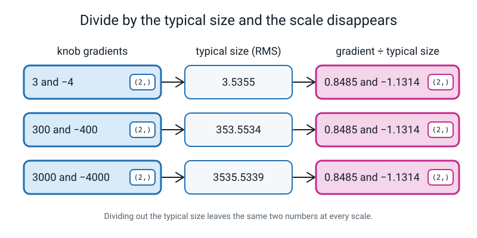
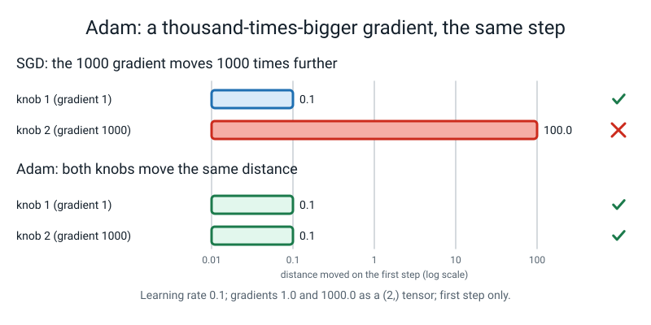

# Week 3 — Adam: Every Knob Gets Its Own Step Size

[⬅ Week 2](week-02.md) · [Course Home](../README.md) · [Week 4 ➡](week-04.md) · [Student Guide](../student-guide/week-03.md) · [Workbook](../workbook/week-03.md)

---


*Figure 3.0 — Where this fits: week 3 of 36 sits in term 1, "train it on purpose"; the tiles still dashed are the weeks to come.*

## 📋 At a Glance

| | |
|---|---|
| **Duration** | 70 minutes |
| **Type** | 🟦 Teach — the third of the "who steers the step" weeks. Week 2 fixed the *direction*; today fixes the *size*. One new maths idea, met on two numbers before any code. |
| **Big idea** | Divide each knob's step by a running **"typical size" of its own gradient**, and the very first step is `lr` (to within a tiny epsilon) **whatever the scale of the gradient**: gradients of 1 and of 1000 both move the weight by 0.1. **AdamW** fixes a quiet bug in how weight decay is done. On the Week 1 spirals, at `lr = 0.003`, plain SGD ends at a coin (loss 0.693) and Adam ends at 0.007. |
| **New vocabulary** | root-mean-square (RMS) · epsilon · Adam · per-knob step size · bias correction (named once) · weight decay · AdamW |
| **New maths** | **One idea: root-mean-square.** *Square every number, average the squares, take the square root.* The "typical size" of a list, ignoring sign. Met on `[3, -4]` (answer 3.5355) and then `[300, -400]` (answer 353.55) **before any code**. Plus a tiny number, **epsilon**, added so you never divide by zero. |
| **New syntax** | `torch.optim.Adam` · `torch.optim.AdamW` · `weight_decay=` · `torch.sqrt` |
| **Dataset** | Two tiny by-hand problems (`f(w) = w * w` from `w = 1.0`, and a loss whose gradients are 1 and 1000), then the Week 1 spirals (`make_spirals`, seed 0: 840 train / 360 validation). Nothing downloads. |
| **Code** | The spirals and the `run(...)` harness import from `l4lib/spirals.py`. **The student imports it. Nobody copies it.** Everything else is 3–10 lines typed live. |
| **Materials** | The Bug Log · a pen · a calculator (phone is fine) · the A–F cards and the two Week 2 cards · printed workbook page 3.1 (the three-optimizer table) · Week 2's `week02.py` still on the laptop |
| **Tech needed** | The Level 3 laptop. **Nothing new to install.** No GPU. No internet, ever. |
| **Prep time** | 20 minutes the night before · 5 minutes on the day |
| **Real runtime** | Every by-hand block is instant. The whole prep file (blocks P1–P19) takes about **7 seconds** on one CPU thread (measured). Each spirals run takes well under a second; nothing waits. |

> **⚠️ Watch out:** this week has one real idea (RMS) and **two traps**. **Trap 1 is the learning rate.** Adam's `lr` is *not on the same scale* as SGD's. The rate that was Week 2's winner (`0.03` for momentum, `0.3` for SGD) is a **coin** for Adam (0.658 and 0.701), and the rate that was a coin for SGD (`0.003`) is Adam's best (0.007). A student who carries "a good lr" from one rule to the next will say "Adam is broken" (Clinic, error 7). **Trap 2 is the word `weight_decay`.** It exists on `Adam` and on `AdamW` with the same name and does *different things*. On the spirals, `Adam(weight_decay=0.1)` finishes at a coin (0.693) and `AdamW(weight_decay=0.1)` at 0.011 (Clinic, error 8). Teach the by-hand table first, say both traps out loud once, on purpose, and let the numbers do the arguing.

---

## 🎯 Lesson Objectives

By the end of the lesson the student can:

1. **Compute a root-mean-square by hand** on `[3, -4]` (3.5355) and on `[300, -400]` (353.55), and say what it measures in one phrase: *"the typical size of the numbers, ignoring sign"*.
2. **Fill Adam's by-hand table for four steps** on `f(w) = w * w` from `w = 1.0` with `lr = 0.1` (`0.9000, 0.8004, 0.7016, 0.6039`), next to the SGD and momentum columns from Week 2, and **match all three against `torch.optim`**.
3. **Show that Adam's first step is `lr`** for a gradient of 1 and for a gradient of 1000 (0.1 and 0.1, where SGD moves 0.1 and 100), and say what the tiny `epsilon` is for.
4. **Say what AdamW changes:** weight decay is applied to the weight directly, not fed through the step-size division. With no decay the two are identical (same numbers to three decimals); with decay they part.
5. **Say the sentence:** *"Adam divides each knob's step by the typical size of that knob's own gradient, so every knob moves about `lr` per step, whatever its gradient's scale."*

Observable evidence: a filled three-column table whose last column matches the `torch.optim` printout; two numbers (0.1 and 0.1) for the gradients-of-1-and-1000 test; the sentence above in the student's own words; the Bug Log entry for one deliberate error.

---

## 🧑‍🏫 What YOU Need to Know First

> **📌 About the code blocks in this guide.** The **🧰 Prep Checklist** holds the complete runnable sequence, blocks **P1–P19**, in order, in one file. Later sections refer to those blocks by number rather than repeating them (a few short ones are shown in place because the explanation needs them; they are the same text). The **🐞 Debugging Clinic** blocks are **deliberately broken** and each is a separate file. Every output shown was printed by the code beside it, on a CPU, with a seed, in one session (torch 2.2.1, one thread). Numbers in the prose were checked against those outputs.

**You do not need to know any deep learning to teach this week.** You need to be able to square a number, average two numbers, take a square root on a calculator, and read a table. This section is all of it.

### 1. Why this week exists

Week 2 gave the step a memory of its *direction*. It did not touch the step's *size*. The size is still `lr × (something proportional to the gradient)`, so a knob whose gradient is 1000 times bigger moves 1000 times further. Two things follow from that.

- **One learning rate has to suit every knob at once.** In the spirals network the biggest weight matrix (`head.weight`) and the smallest-gradient one (`stem.weight`) get very different gradients. Block **P17** (teacher-only) measures the biggest move of any number in each weight matrix after one plain-SGD step at `lr = 0.003`: from **0.000001** (`stem.weight`) to **0.000016** (`head.weight`). The spread between knobs is in the numbers; nobody chose it.
- **The right `lr` depends on the gradient's scale,** which depends on the loss, the width, the depth. That is why Week 1's winning rates and Week 2's winning rates were different numbers.

**Adam** is *the rule where each knob's step is divided by the typical size of that knob's own recent gradients*. The result (block **P17**, same network, same first batch, `lr = 0.003`): under Adam **every** weight matrix's biggest move is **0.003000**, which is `lr`. The scale has been divided out. That is the whole week.

### 2. The one new maths idea: root-mean-square

The **root-mean-square (RMS)** of a list is *the typical size of its numbers, ignoring sign*. Three steps, in this order, and the order is the name read backwards:

```text
1. square every number        (so the signs vanish: -4 becomes 16)
2. take the mean of the squares
3. take the square root of that     (so we are back in the original units)
```

**Meeting it, in the order the lesson uses:** two numbers, `[3, -4]`.

```python
import torch
g = torch.tensor([3.0, -4.0])
print("plain mean      :", g.mean().item())
print("squares         :", (g ** 2).tolist())
print("mean of squares :", (g ** 2).mean().item())
print("root of that    :", round(torch.sqrt((g ** 2).mean()).item(), 4))
```
```text
plain mean      : -0.5
squares         : [9.0, 16.0]
mean of squares : 12.5
root of that    : 3.5355
```

Three things to point at.

- **The plain mean is `-0.5`.** A list that contains a 3 and a -4 has, by the plain mean, a "typical size" of nearly nothing. The signs cancelled. That is why we square first. (Clinic error 2 is exactly the forgotten square.)
- **`3.5355` sits between 3 and 4,** which is where a "typical size" of a 3 and a 4 should sit. It is a little closer to the bigger one, because squaring makes big numbers count for more.
- **The student has met the cousin of this before.** Week 2's `.norm()` of `[6, 8]` was `sqrt(36 + 64) = 10`. The RMS does the same squares and the same square root but **divides by how many numbers** first. So RMS = norm ÷ √(how many). Do not say this unless they ask; `[3, -4]` has norm 5 and RMS 3.5355 (5 ÷ 1.4142), which is a nice check for a quick student.

Then the point of the idea, which is the second case: **the same list, a hundred and a thousand times bigger.**

```python
for scale in [1, 100, 1000]:
    g = torch.tensor([3.0, -4.0]) * scale
    rms = torch.sqrt((g ** 2).mean())
    print(f"list {g.tolist()}  rms {rms.item():.4f}  list / rms {[round(x, 4) for x in (g / rms).tolist()]}")
```
```text
list [3.0, -4.0]  rms 3.5355  list / rms [0.8485, -1.1314]
list [300.0, -400.0]  rms 353.5534  list / rms [0.8485, -1.1314]
list [3000.0, -4000.0]  rms 3535.5339  list / rms [0.8485, -1.1314]
```

The RMS grows exactly as the list grows (3.5355, 353.5534, 3535.5339). **The list divided by its RMS does not change at all** (`0.8485, -1.1314`, three times). That last line is the week's whole trick: *divide by the typical size and the scale disappears.*


*Figure 3.1 — Dividing by the typical size cancels the scale, so a thousand-times-bigger knob looks the same.*

**Say "typical size" and move on.** Do not say "standard deviation" (the student knows it from Level 3 and it is a close relative, but it subtracts the mean first and RMS does not; mixing them costs ten minutes). If the student says "that's standard deviation", answer: *"Close cousin. Standard deviation measures the spread around the average. This measures the size around zero. For numbers whose average is near zero they come out close."* and stop. **Not measured in this guide:** how close.

**Epsilon.** What if every number in the list is zero? Then the RMS is 0 and `0 / 0` is not a number. The fix is to add a tiny number to the thing you divide by, called **epsilon** (written `eps`, and in Adam it is `0.00000001`, i.e. `1e-8`). It is there so you never divide by zero. It should be too small to change any normal answer. Block **P10** shows where it stops being too small:

```text
   gradient     first step (lr = 0.1)
        1000     0.100000
           1     0.100000
       0.001     0.099999
       1e-06     0.099010
       1e-08     0.050000
       1e-09     0.009091
```

For every gradient a student will meet in a real run, the first step is `lr` to five decimals. It only stops being `lr` when the gradient itself is as small as epsilon: at `1e-08` the step is **half** of `lr` (0.05), because the gradient and epsilon are equal and the division is `g / (g + g)`. **That is what epsilon is for and what it costs.** Say both.

### 3. From the RMS to Adam

Adam keeps **two running averages per knob**, both of them exponential moving averages the student already knows from Week 2:

```text
m = 0.9   x old m + 0.1   x g        the average of the gradient        (direction; this is Week 2)
s = 0.999 x old s + 0.001 x g*g      the average of the gradient SQUARED (size; this is "mean of squares")
```

`m` is Week 2 exactly. `s` is the same trick on the *squares*, which is the first two steps of RMS, and with `0.999` instead of `0.9` the memory is much longer (the first value fades by 0.001 per step; the half-life is **692.8 steps**, block **P19**, against Week 2's 6.58 for 0.9). Then the step:

```text
step = lr x m / (sqrt(s) + eps)
```

`sqrt(s)` is the third step of RMS. So **Adam's step is `lr` times the average gradient divided by the running RMS of the gradient.** A knob whose gradients are huge has a huge `sqrt(s)`, which cancels the huge `m`. A knob whose gradients are tiny has a tiny `sqrt(s)`, which also cancels. Either way, when the gradient is steady, the ratio is about 1, and the step is about `lr` (smaller when the gradient is noisy and the average washes out).

**The "arrived" fix (the thing Week 2 said not to say).** Week 2 Concept A ended with: *"the average of ten, ten, ten, ten, ten is 1.0, 1.9, 2.71 ... why isn't it ten yet?" — because it started at 0.* Adam has the same problem twice, and it is worse for `s` (the 0.999 one). Block **P4** fixes it on the student's own Week 2 numbers:

```python
avg = 0.0
for t in range(1, 6):
    avg = 0.9 * avg + 0.1 * 10
    arrived = 1 - 0.9 ** t
    print(f"step {t}: average {avg:.4f}   arrived {arrived:.4f}   average / arrived {avg / arrived:.4f}")
```
```text
step 1: average 1.0000   arrived 0.1000   average / arrived 10.0000
step 2: average 1.9000   arrived 0.1900   average / arrived 10.0000
step 3: average 2.7100   arrived 0.2710   average / arrived 10.0000
step 4: average 3.4390   arrived 0.3439   average / arrived 10.0000
step 5: average 4.0951   arrived 0.4095   average / arrived 10.0000
```

"Arrived" is **how much of the average has actually come in so far**: after `t` steps that is `1 - 0.9^t` (0.1, 0.19, 0.271, ...). Divide the average by it and the start-at-zero droop vanishes: ten, ten, ten. The name for this is **bias correction**; say the name **once**, write it in the vocabulary list, and otherwise call it "divide by how much has arrived". **This is not a second new maths idea.** It is a division by a number the student can compute from Week 2's own 0.9 (the same `0.9 ^ t` as the half-life table); the ladder's one idea this week is RMS. If a student balks at `1 - 0.9 ** t`, point at the column of 0.1, 0.19, 0.271 and let them see it is "the share that has come in".

For Adam the two "arrived" numbers are `1 - 0.9^t` for `m` and `1 - 0.999^t` for `s`. At step 1 they are 0.1 and 0.001. Without the fix, `m` is a tenth of the gradient and `sqrt(s)` is `sqrt(0.001) = 0.0316` of it: the step would be wrong by a factor of 3.16, in the wrong direction of "too big" (Clinic error 6 measures it: 0.6838 against 0.9). **With** the fix, `m` becomes exactly `g`, `s` becomes exactly `g*g`, `sqrt(s)` becomes exactly `|g|`, and the ratio is exactly ±1, so **the first step is exactly `lr`**.

**The hand table** the whole lesson hangs on (block **P5**, every number printed by the code; the student fills the same columns on paper):

```python
w, m, s, lr, eps = 1.0, 0.0, 0.0, 0.1, 1e-8
print("step      g         m          s      m/arrived  s/arrived  rms-root    step      w")
for t in range(1, 5):
    g = 2 * w
    m = 0.9 * m + 0.1 * g
    s = 0.999 * s + 0.001 * g * g
    m_fix = m / (1 - 0.9 ** t)
    s_fix = s / (1 - 0.999 ** t)
    root = s_fix ** 0.5
    step = lr * m_fix / (root + eps)
    w = w - step
    print(f"{t:>4} {g:>8.4f} {m:>10.6f} {s:>10.7f} {m_fix:>10.4f} {s_fix:>10.4f} {root:>9.4f} {step:>9.5f} {w:>8.4f}")
```
```text
step      g         m          s      m/arrived  s/arrived  rms-root    step      w
   1   2.0000   0.200000  0.0040000     2.0000     4.0000    2.0000   0.10000   0.9000
   2   1.8000   0.360000  0.0072360     1.8947     3.6198    1.9026   0.09959   0.8004
   3   1.6008   0.484082  0.0097914     1.7863     3.2671    1.8075   0.09883   0.7016
   4   1.4032   0.575991  0.0117505     1.6749     2.9420    1.7152   0.09765   0.6039
```

(This block uses `** 0.5` for the square root because it is the student's own hand arithmetic; `torch.sqrt` is for tensors, and is used in blocks P2 and P3. `s_fix ** 0.5` and `torch.sqrt(s_fix)` give the same number.) Walk row 1 slowly: `g = 2.0`, `m = 0.2`, `s = 0.004`; divide by the arrived shares (0.1 and 0.001) to get 2.0 and 4.0; the root of 4.0 is 2.0; the ratio is 1.0; the step is `0.1`; `w` lands on `0.9000`. These match the reference module's hand table (0.9000, 0.8004, 0.7016); row 4 (0.6039) is new to this course and was printed by the code above.

**The three-optimizer table** (block **P6**). The student puts Adam next to the two columns they already have from Week 2. All three columns are computed by hand-style code, no `torch.optim`:

```text
step |    SGD   | momentum |   Adam
   1 |   0.8000 |   0.8000 |   0.9000
   2 |   0.6400 |   0.4600 |   0.8004
   3 |   0.5120 |   0.0620 |   0.7016
   4 |   0.4096 |  -0.3086 |   0.6039
```

**Read the table with the student. It is the honest picture, and it is not flattering to Adam.** On this one-knob toy, Adam is the *slowest* (0.6039 after four steps against SGD's 0.4096), because its step is a fixed ~0.1 from the first step and the gradient here is a gentle one. **Do not pretend otherwise.** What Adam has that the other columns lack is in the step sizes: SGD's shrink (0.200, 0.160, 0.128, 0.102), momentum's swing (0.200, 0.340, 0.398, 0.371), Adam's stay put (0.1000, 0.0996, 0.0988, 0.0977). The toy has *one* knob; the use of Adam is when there are thousands and their gradients differ. That is block P9 and the spirals.

### 4. AdamW and the quiet bug

**Weight decay** is *shrinking every weight a little on every step*, to discourage the model from leaning on any one large weight. The construct is `weight_decay=` on the optimizer. (Weight decay as a *reason to use* is Week 5's; today it is a keyword and a bug.) For plain SGD the rule is simple: each step, every weight also loses `lr × weight_decay × weight`. Block **P11** shows it with nothing else pulling (a loss that does not depend on `w`, so its gradient is zero):

```text
no decay           after 10 steps: [1.0, 100.0]
weight_decay=0.1   after 10 steps: [0.9044, 90.4382]
```

Both weights lose the **same share** per step (`1 - 0.1 × 0.1 = 0.99`, ten times: 0.9044 of each). The 100 lost more in absolute terms (9.56) than the 1 (0.096). That is what decay should do: a big weight gets a big pull.

**The quiet bug.** On `torch.optim.Adam`, `weight_decay=` is done the old way: it is added to the *gradient* (`g = g + weight_decay × w`) and then the whole thing goes through the Adam machinery, including the division by RMS. The division divides the decay away. Block **P12** runs the identical loss-free setup:

```text
Adam  weight_decay=0.1  after 10 steps: [0.0762, 99.0003]
AdamW weight_decay=0.1  after 10 steps: [0.9044, 90.4382]
```

Read the two rows. Under **Adam** the small weight is nearly destroyed (1.0 to **0.0762**) and the big weight barely moves (100 to **99.0003**): every weight is pushed by about `lr` per step (ten steps of 0.1 is 1.0 in total, so the 1.0 is wiped out and the 100 loses 1.0 of 100). The RMS division has turned "decay in proportion to the weight" into "decay by a fixed amount". Under **AdamW** the two weights lose the same *share* (0.9044 and 90.4382, exactly the SGD numbers): the decay is applied to the weight **directly**, outside the division. That is the whole fix. The reference module's claim is that noisy-gradient weights get decayed less than clean-gradient ones under Adam; the block above is the cleanest version of the same mechanism (a weight's decay is divided by its own gradient scale), measured on two weights with no loss at all. **It is not a measurement of a real network's weights.** Do not claim one.

**On the spirals** (block **P16**, `lr = 0.003`):

```text
adam  wd=0                   train 0.007  val 0.037  acc  98.9%
adamw wd=0                   train 0.007  val 0.037  acc  98.9%
adam  wd=0.1                 train 0.693  val 0.694  acc  46.9%
adamw wd=0.1                 train 0.011  val 0.077  acc  98.9%
adam  wd=0.01                train 0.693  val 0.695  acc  46.9%
adamw wd=0.01                train 0.009  val 0.051  acc  98.9%
```

With no decay the two rules give the **identical** line (that is the first thing to show: it is the same optimizer until decay is switched on). With any decay, `Adam` finishes at a coin and `AdamW` finishes near its no-decay number. One seed, one dataset. Consistent with P12 (a fixed-size pull on every weight, every step: 13 steps per epoch × 60 epochs = 780 steps at about `lr = 0.003` each is roughly 2.3 of total pull on every weight), but **that arithmetic is a plausibility check, not a measurement** of what the network's weights did. The advice the student takes away is a habit, not a theory: *if you want weight decay with an adaptive optimizer, use `AdamW`.* Whether decay helps a model is Week 5's question, and on the spirals `adamw wd=0.1` is *worse* than `wd=0` on validation (0.077 against 0.037), which is a fair thing to point out if the student assumes decay is free.

### 5. The four new constructs

**`torch.optim.Adam(params, lr=...)`.** The same shape as `SGD` from Week 2: a list of things to adjust, and a learning rate. It keeps two numbers per weight (the student can see them: block **P8**) and ignores the gradient's scale. The two shares (`0.9` and `0.999`) and `eps=1e-8` are the **defaults**; the student never types them this week. (They are set with `betas=` and `eps=`, which are not on the ladder; say "there are dials, we leave them alone" and stop. Clinic error 3 types `eps=0.0` as a mistake, and that is as far as it goes.)

```python
w = torch.tensor([1.0], requires_grad=True)
opt = torch.optim.Adam([w], lr=0.1)
trace(w, opt, steps=3)
print("after 3 steps, Adam's memory for w:")
print("  exp_avg    (my m):", round(opt.state[w]["exp_avg"].item(), 5))
print("  exp_avg_sq (my s):", round(opt.state[w]["exp_avg_sq"].item(), 7))
print("  step count       :", int(opt.state[w]["step"].item()))
```
```text
after 3 steps, Adam's memory for w:
  exp_avg    (my m): 0.48408
  exp_avg_sq (my s): 0.0097914
  step count       : 3
```

PyTorch calls them `exp_avg` and `exp_avg_sq`. They are **the student's `m` and `s` from the hand table, row 3** (0.484082 and 0.0097914). This is the moment the student should believe the table. `opt.state[w]` is a dictionary keyed by the weight (Week 2 showed `"momentum_buffer"` the same way); `int(... .item())` is only there because the step count is stored as a float and would print `3.0`.

**`torch.optim.AdamW(params, lr=..., weight_decay=...)`.** Adam with decay done outside the division. Exact same arguments.

**`weight_decay=`.** The strength of the shrinking. Default `0.0` for `Adam` and `SGD`; **the default on `AdamW` is `0.01`, not zero** (this is PyTorch's choice; the reference module's `run()` harness always passes it explicitly, as does `l4lib/spirals.py`, so it does not bite on the spirals, but a student who writes `torch.optim.AdamW([w], lr=0.1)` with no `weight_decay` gets decay). Checked once by printing `torch.optim.AdamW([w]).defaults` in torch 2.2.1 (`'weight_decay': 0.01`; `Adam`'s is `0`); not a prep-file block.

**`torch.sqrt(x)`.** The square root of every element of a **tensor**. It needs a tensor, not a bare number (Clinic error 1), and it returns `nan` for a negative input without complaint (Clinic error 2).

### 6. What the spirals show (the only training this week)

The Week 1 harness takes `optimizer="sgd"`, `"momentum"`, `"adam"` or `"adamw"` (lines 103 to 111 of `l4lib/spirals.py` build each). Same data, same seed, same starting weights. **Only the rule and the rate change.**

| `lr` | SGD | Momentum | Adam |
|:--:|:--:|:--:|:--:|
| 0.003 | 0.693 / 46.9% | 0.690 / 56.7% | **0.007 / 98.9%** |
| 0.03 | 0.690 / 52.8% | **0.018 / 98.6%** | 0.658 / 46.9% |

(Final train loss / validation accuracy. Rows are blocks **P13** and **P14**; the `0.3` SGD line, 0.016 / 98.9%, is in block **P18**.) The two sentences that cover it: **each rule has its own good learning rate**, and **the good rates are a factor of 10 apart, and 100 from end to end** (SGD 0.3, momentum 0.03, Adam 0.003). Block **P18**, each at its own rate:

```text
sgd lr=0.3                   train 0.016  val 0.041  acc  98.9%
momentum lr=0.03             train 0.018  val 0.034  acc  98.6%
adam lr=0.003                train 0.007  val 0.037  acc  98.9%
adamw lr=0.003               train 0.007  val 0.037  acc  98.9%
```

**All three reach about the same place on this problem.** Adam reaches it at the lowest train loss (0.007), but the validation numbers are 0.041, 0.034 and 0.037, so **do not say Adam is best**: it is not distinguishable from the others here, on one seed. What Adam buys is in the *sweep* (block **P15**): it finds a good answer over a wide range of rates.

```text
adam lr=0.0001               train 0.077  val 0.063  acc  98.1%
adam lr=0.001                train 0.018  val 0.026  acc  99.4%
adam lr=0.003                train 0.007  val 0.037  acc  98.9%
adam lr=0.01                 train 0.013  val 0.059  acc  99.2%
adam lr=0.03                 train 0.658  val 0.684  acc  46.9%
adam lr=0.1                  train 0.693  val 0.702  acc  46.9%
adam lr=0.3                  train 0.701  val 0.723  acc  46.9%
```

Four rates in a row, from `0.0001` to `0.01` (a factor of 100), all give 98.1% or better. SGD in Week 2 had **one** good rate out of the six tried (0.3), with the two neighbours (0.1 and 1.0) at 80.0% and 66.4%. **That is what "the learning rate means something" buys.** It is still a knob: 0.03 and above fail, and `lr = 0.3` is **not** "Adam's step is small so it is safe" (Clinic error 7). Don't say Adam has no rate to tune. Say it has a *wider* good range and *a different one*.

Two honest limits. **(1) One seed.** The "wider good range" is for this network on this data at seed 0. Week 7's three seeds are the correct place to ask whether a gap is real. **(2) Adam here has not been compared to tuned SGD on a long run**; the reference module says tuned SGD can generalise slightly better on vision models. That claim was not measured in this course. If the student asks why people still use SGD, say so.

### 7. Common misconceptions to listen for

| The student says | What is going on | What you say |
|---|---|---|
| "Adam is just momentum." | Adam contains Week 2's average (`m`), but divides it by the RMS of the gradient. The division is the new thing. | "Half of Adam is last week. What is the other half? Find the division in P5." |
| "Adam's step is always exactly `lr`." | Only on the first step, and about `lr` after. Row 4 is 0.09765, not 0.1. And it drops when the gradient is as small as epsilon (P10). | "First step, yes. Read me the step column." |
| "Adam has no learning rate to tune." | It has one, on a different scale. 0.03 is a coin for Adam. | "Point at the 0.03 row in P15." |
| "Adam is better than SGD." | On this network all three end within 0.007 of each other on validation. | "Read me the three validation losses in P18." |
| "`weight_decay` is the same in Adam and AdamW." | Same name, different behaviour (P12, P16). | "Run P12 and read the first weight." |
| "Epsilon is a setting that matters." | It matters only when the gradient is about as small as epsilon. It is there to prevent `0 / 0`. | "Which row of P10 does epsilon show up in?" |
| "RMS is the average." | The average of `[3, -4]` is -0.5. The RMS is 3.5355. | "Say the three steps. Which one kills the sign?" |
| "The by-hand Adam is wrong, torch gives a different number." | Nearly always a missing 'arrived' division (Clinic error 6), or `0.9` typed where `0.999` goes. | "Divide by what has arrived. Check both shares." |

### 8. Vocabulary (defined before use)

| Word | Meaning for this course | First met |
|---|---|---|
| **root-mean-square (RMS)** | Square every number, average the squares, take the root: the typical size of a list, ignoring sign | Concept A |
| **epsilon** (`eps`) | A tiny number added to what you divide by so you never divide by zero; `1e-8` in Adam | Concept A, then P10 |
| **per-knob step size** | Each weight's step is scaled by its own gradient's typical size, not by one shared rule | Concept B |
| **Adam** | Momentum's average of the gradient, divided by the running RMS of the gradient | Concept B |
| **bias correction** | Dividing a start-at-zero average by how much of it has arrived; said once | Concept B |
| **weight decay** | Shrinking every weight a little each step | Live-code step 6 |
| **AdamW** | Adam with weight decay applied to the weight directly, outside the division | Live-code step 6 |

**Not used today, on purpose:** *schedule*, *warmup*, *batch size* (Week 4; if the student asks why Adam's first steps might be unreliable, that is Week 4's warmup: Parking Lot), *dropout*, *early stopping* (Week 5), *layer norm*, *gradient clipping* (Week 6), *Nesterov*, *RMSProp* by name, and *second moment* (all never, or not in this course). Do not mention `betas` beyond "defaults you don't type".

---

## 🧰 Prep Checklist

### 20 minutes the night before

**☐ 1. Right folder (30 seconds).** Open a terminal **in the `36-week-course/` folder** (the one that *contains* `l4lib/`). `ls` should list `l4lib`, `README.md`, `teacher-guide`. If not, `cd` there. (Week 1's commonest error.)

**☐ 2. Keep Week 2's file.** `week02.py` should still print the same rows. Week 3's P13/P14/P18 re-run two of its lines (SGD and momentum); a digit that changed between weeks is something you want to know **tonight**.

**☐ 3. Run the blocks below, in order, in one file.** Save as `week03.py` in `36-week-course/`. It takes about **7 seconds**. Every number in this guide came from it. Tolerance: **±0.005 on losses and ±0.5 points on accuracy.** The by-hand blocks (P2–P12, P19) are exact to the printed digits on any machine. **Blocks P17 and P19 are teacher-only** (P17 uses `named_parameters`, `zip` and `.detach()` to look inside the network; P19 uses `math.log`): the student never types them.

**☐ 4. Print the workbook page 3.1** (the blank three-optimizer table: four rows, three columns, plus a step-size row) and the blank 'first step' table (gradient 1 / gradient 1000, SGD / Adam).

**☐ 5. Decide your two sentences.** The *two-traps* sentence (see Watch out, above) and the *ten times* callback from Week 2: SGD at `lr = 0.3` matched momentum at `lr = 0.03`. Today's version: *"Adam at `lr = 0.003` matches both. Three rules, three rates, one place."*

**Block P1 — set-up**

```python
import torch
torch.set_num_threads(1)
print("threads:", torch.get_num_threads(), " torch", torch.__version__)
```
```text
threads: 1  torch 2.2.1
```

**Block P2 — root-mean-square of `[3, -4]`, one step at a time**

```python
g = torch.tensor([3.0, -4.0])
print("plain mean      :", g.mean().item())
print("squares         :", (g ** 2).tolist())
print("mean of squares :", (g ** 2).mean().item())
print("root of that    :", round(torch.sqrt((g ** 2).mean()).item(), 4))
```
```text
plain mean      : -0.5
squares         : [9.0, 16.0]
mean of squares : 12.5
root of that    : 3.5355
```

**Block P3 — the same list, 100 and 1000 times bigger**

```python
for scale in [1, 100, 1000]:
    g = torch.tensor([3.0, -4.0]) * scale
    rms = torch.sqrt((g ** 2).mean())
    print(f"list {g.tolist()}  rms {rms.item():.4f}  list / rms {[round(x, 4) for x in (g / rms).tolist()]}")
```
```text
list [3.0, -4.0]  rms 3.5355  list / rms [0.8485, -1.1314]
list [300.0, -400.0]  rms 353.5534  list / rms [0.8485, -1.1314]
list [3000.0, -4000.0]  rms 3535.5339  list / rms [0.8485, -1.1314]
```

**Block P4 — why an average that starts at 0 starts low, and the fix**

```python
avg = 0.0
for t in range(1, 6):
    avg = 0.9 * avg + 0.1 * 10
    arrived = 1 - 0.9 ** t
    print(f"step {t}: average {avg:.4f}   arrived {arrived:.4f}   average / arrived {avg / arrived:.4f}")
```
```text
step 1: average 1.0000   arrived 0.1000   average / arrived 10.0000
step 2: average 1.9000   arrived 0.1900   average / arrived 10.0000
step 3: average 2.7100   arrived 0.2710   average / arrived 10.0000
step 4: average 3.4390   arrived 0.3439   average / arrived 10.0000
step 5: average 4.0951   arrived 0.4095   average / arrived 10.0000
```

**Block P5 — Adam by hand, four steps on `f(w) = w * w` from `w = 1.0` with `lr = 0.1`**

```python
w, m, s, lr, eps = 1.0, 0.0, 0.0, 0.1, 1e-8
print("step      g         m          s      m/arrived  s/arrived  rms-root    step      w")
for t in range(1, 5):
    g = 2 * w
    m = 0.9 * m + 0.1 * g
    s = 0.999 * s + 0.001 * g * g
    m_fix = m / (1 - 0.9 ** t)
    s_fix = s / (1 - 0.999 ** t)
    root = s_fix ** 0.5
    step = lr * m_fix / (root + eps)
    w = w - step
    print(f"{t:>4} {g:>8.4f} {m:>10.6f} {s:>10.7f} {m_fix:>10.4f} {s_fix:>10.4f} {root:>9.4f} {step:>9.5f} {w:>8.4f}")
```
```text
step      g         m          s      m/arrived  s/arrived  rms-root    step      w
   1   2.0000   0.200000  0.0040000     2.0000     4.0000    2.0000   0.10000   0.9000
   2   1.8000   0.360000  0.0072360     1.8947     3.6198    1.9026   0.09959   0.8004
   3   1.6008   0.484082  0.0097914     1.7863     3.2671    1.8075   0.09883   0.7016
   4   1.4032   0.575991  0.0117505     1.6749     2.9420    1.7152   0.09765   0.6039
```

**Block P6 — the three-optimizer table, by hand, four steps**

```python
w_sgd = 1.0
w_mom, v = 1.0, 0.0
print("step |    SGD   | momentum |   Adam")
w_adam, m, s = 1.0, 0.0, 0.0
for t in range(1, 5):
    w_sgd = w_sgd - 0.1 * (2 * w_sgd)
    v = 0.9 * v + 2 * w_mom
    w_mom = w_mom - 0.1 * v
    g = 2 * w_adam
    m = 0.9 * m + 0.1 * g
    s = 0.999 * s + 0.001 * g * g
    w_adam = w_adam - 0.1 * (m / (1 - 0.9 ** t)) / ((s / (1 - 0.999 ** t)) ** 0.5 + 1e-8)
    print(f"{t:>4} | {w_sgd:>8.4f} | {w_mom:>8.4f} | {w_adam:>8.4f}")
```
```text
step |    SGD   | momentum |   Adam
   1 |   0.8000 |   0.8000 |   0.9000
   2 |   0.6400 |   0.4600 |   0.8004
   3 |   0.5120 |   0.0620 |   0.7016
   4 |   0.4096 |  -0.3086 |   0.6039
```

**Block P7 — the same three, with `torch.optim`**

```python
def trace(w, opt, steps=4):
    out = []
    for _ in range(steps):
        opt.zero_grad(set_to_none=True)
        (w * w).sum().backward()
        opt.step()
        out.append(round(w.item(), 4))
    return out

w = torch.tensor([1.0], requires_grad=True)
print("SGD     ", trace(w, torch.optim.SGD([w], lr=0.1)))
w = torch.tensor([1.0], requires_grad=True)
print("momentum", trace(w, torch.optim.SGD([w], lr=0.1, momentum=0.9)))
w = torch.tensor([1.0], requires_grad=True)
print("Adam    ", trace(w, torch.optim.Adam([w], lr=0.1)))
```
```text
SGD      [0.8, 0.64, 0.512, 0.4096]
momentum [0.8, 0.46, 0.062, -0.3086]
Adam     [0.9, 0.8004, 0.7016, 0.6039]
```

**Block P8 — what Adam keeps inside: the two averages from the hand table**

```python
w = torch.tensor([1.0], requires_grad=True)
opt = torch.optim.Adam([w], lr=0.1)
trace(w, opt, steps=3)
print("after 3 steps, Adam's memory for w:")
print("  exp_avg    (my m):", round(opt.state[w]["exp_avg"].item(), 5))
print("  exp_avg_sq (my s):", round(opt.state[w]["exp_avg_sq"].item(), 7))
print("  step count       :", int(opt.state[w]["step"].item()))
```
```text
after 3 steps, Adam's memory for w:
  exp_avg    (my m): 0.48408
  exp_avg_sq (my s): 0.0097914
  step count       : 3
```

**Block P9 — gradients of 1 and 1000, one first step**

```python
for name in ["SGD ", "Adam"]:
    w = torch.tensor([0.0, 0.0], requires_grad=True)
    if name == "SGD ":
        opt = torch.optim.SGD([w], lr=0.1)
    else:
        opt = torch.optim.Adam([w], lr=0.1)
    loss = (torch.tensor([1.0, 1000.0]) * w).sum()
    loss.backward()
    opt.step()
    print(name, "gradients", w.grad.tolist(), "   first step moved", [round(-x, 4) for x in w.tolist()])
```
```text
SGD  gradients [1.0, 1000.0]    first step moved [0.1, 100.0]
Adam gradients [1.0, 1000.0]    first step moved [0.1, 0.1]
```


*Figure 3.2 — Adam divides each knob's step by its own gradient size, so both knobs move the same distance.*

**Block P10 — epsilon: the first step for smaller and smaller gradients**

```python
print("   gradient     first step (lr = 0.1)")
for c in [1000.0, 1.0, 0.001, 1e-6, 1e-8, 1e-9]:
    w = torch.tensor([0.0], requires_grad=True)
    opt = torch.optim.Adam([w], lr=0.1)
    (c * w).sum().backward()
    opt.step()
    print(f"{c:>12g}     {-w.item():.6f}")
```
```text
   gradient     first step (lr = 0.1)
        1000     0.100000
           1     0.100000
       0.001     0.099999
       1e-06     0.099010
       1e-08     0.050000
       1e-09     0.009091
```

**Block P11 — weight decay with nothing else pulling: SGD**

```python
for name in ["no decay", "weight_decay=0.1"]:
    w = torch.tensor([1.0, 100.0], requires_grad=True)
    if name == "no decay":
        opt = torch.optim.SGD([w], lr=0.1)
    else:
        opt = torch.optim.SGD([w], lr=0.1, weight_decay=0.1)
    for _ in range(10):
        opt.zero_grad(set_to_none=True)
        (w * 0).sum().backward()
        opt.step()
    print(f"{name:<18} after 10 steps:", [round(x, 4) for x in w.tolist()])
```
```text
no decay           after 10 steps: [1.0, 100.0]
weight_decay=0.1   after 10 steps: [0.9044, 90.4382]
```

**Block P12 — Adam vs AdamW: the same decay, two very different behaviours**

```python
for name in ["Adam ", "AdamW"]:
    w = torch.tensor([1.0, 100.0], requires_grad=True)
    if name == "Adam ":
        opt = torch.optim.Adam([w], lr=0.1, weight_decay=0.1)
    else:
        opt = torch.optim.AdamW([w], lr=0.1, weight_decay=0.1)
    for _ in range(10):
        opt.zero_grad(set_to_none=True)
        (w * 0).sum().backward()
        opt.step()
    print(f"{name} weight_decay=0.1  after 10 steps:", [round(x, 4) for x in w.tolist()])
```
```text
Adam  weight_decay=0.1  after 10 steps: [0.0762, 99.0003]
AdamW weight_decay=0.1  after 10 steps: [0.9044, 90.4382]
```

**Block P13 — the spirals: four rules at `lr = 0.003`**

```python
from l4lib.spirals import run
for opt_name in ["sgd", "momentum", "adam", "adamw"]:
    run(f"{opt_name} lr=0.003", lr=0.003, optimizer=opt_name)
```
```text
sgd lr=0.003                 train 0.693  val 0.694  acc  46.9%
momentum lr=0.003            train 0.690  val 0.690  acc  56.7%
adam lr=0.003                train 0.007  val 0.037  acc  98.9%
adamw lr=0.003               train 0.007  val 0.037  acc  98.9%
```

**Block P14 — the spirals: four rules at `lr = 0.03`**

```python
for opt_name in ["sgd", "momentum", "adam", "adamw"]:
    run(f"{opt_name} lr=0.03", lr=0.03, optimizer=opt_name)
```
```text
sgd lr=0.03                  train 0.690  val 0.690  acc  52.8%
momentum lr=0.03             train 0.018  val 0.034  acc  98.6%
adam lr=0.03                 train 0.658  val 0.684  acc  46.9%
adamw lr=0.03                train 0.658  val 0.684  acc  46.9%
```

**Block P15 — Adam's learning-rate sweep**

```python
for lr in [0.0001, 0.001, 0.003, 0.01, 0.03, 0.1, 0.3]:
    run(f"adam lr={lr}", lr=lr, optimizer="adam")
```
```text
adam lr=0.0001               train 0.077  val 0.063  acc  98.1%
adam lr=0.001                train 0.018  val 0.026  acc  99.4%
adam lr=0.003                train 0.007  val 0.037  acc  98.9%
adam lr=0.01                 train 0.013  val 0.059  acc  99.2%
adam lr=0.03                 train 0.658  val 0.684  acc  46.9%
adam lr=0.1                  train 0.693  val 0.702  acc  46.9%
adam lr=0.3                  train 0.701  val 0.723  acc  46.9%
```

**Block P16 — Adam and AdamW agree when there is no decay, and part when there is**

```python
run("adam  wd=0", lr=0.003, optimizer="adam")
run("adamw wd=0", lr=0.003, optimizer="adamw")
run("adam  wd=0.1", lr=0.003, optimizer="adam", weight_decay=0.1)
run("adamw wd=0.1", lr=0.003, optimizer="adamw", weight_decay=0.1)
run("adam  wd=0.01", lr=0.003, optimizer="adam", weight_decay=0.01)
run("adamw wd=0.01", lr=0.003, optimizer="adamw", weight_decay=0.01)
```
```text
adam  wd=0                   train 0.007  val 0.037  acc  98.9%
adamw wd=0                   train 0.007  val 0.037  acc  98.9%
adam  wd=0.1                 train 0.693  val 0.694  acc  46.9%
adamw wd=0.1                 train 0.011  val 0.077  acc  98.9%
adam  wd=0.01                train 0.693  val 0.695  acc  46.9%
adamw wd=0.01                train 0.009  val 0.051  acc  98.9%
```

**Block P17 — (teacher only) how far does each tensor move on the very first step**

```python
from l4lib.spirals import make_model, get_data
Xtr, ytr, Xva, yva = get_data()
for name in ["sgd", "adam"]:
    torch.manual_seed(0)
    model = make_model()
    before = []
    for pname, p in model.named_parameters():
        before.append(p.detach().clone())
    if name == "sgd":
        opt = torch.optim.SGD(model.parameters(), lr=0.003)
    else:
        opt = torch.optim.Adam(model.parameters(), lr=0.003)
    loss = torch.nn.functional.cross_entropy(model(Xtr[:64]), ytr[:64])
    loss.backward()
    opt.step()
    print(name, "- biggest move of any number, per weight matrix:")
    for (pname, p), old in zip(model.named_parameters(), before):
        if pname.endswith("weight"):
            print(f"   {pname:<22} {(p - old).abs().max().item():.6f}")
```
```text
sgd - biggest move of any number, per weight matrix:
   stem.weight            0.000001
   blocks.0.fc.weight     0.000001
   blocks.1.fc.weight     0.000001
   blocks.2.fc.weight     0.000002
   blocks.3.fc.weight     0.000002
   head.weight            0.000016
adam - biggest move of any number, per weight matrix:
   stem.weight            0.003000
   blocks.0.fc.weight     0.003000
   blocks.1.fc.weight     0.003000
   blocks.2.fc.weight     0.003000
   blocks.3.fc.weight     0.003000
   head.weight            0.003000
```

**Block P18 — each rule at its own good learning rate**

```python
for opt_name, lr in [("sgd", 0.3), ("momentum", 0.03), ("adam", 0.003), ("adamw", 0.003)]:
    run(f"{opt_name} lr={lr}", lr=lr, optimizer=opt_name)
```
```text
sgd lr=0.3                   train 0.016  val 0.041  acc  98.9%
momentum lr=0.03             train 0.018  val 0.034  acc  98.6%
adam lr=0.003                train 0.007  val 0.037  acc  98.9%
adamw lr=0.003               train 0.007  val 0.037  acc  98.9%
```

**Block P19 — (teacher note) the half-life of the slow average**

```python
import math
print("0.9   :", round(math.log(0.5) / math.log(0.9), 2))
print("0.999 :", round(math.log(0.5) / math.log(0.999), 1))
```
```text
0.9   : 6.58
0.999 : 692.8
```

**☐ 6. Check the three numbers the lesson stands on.** `0.6039` (P5 row 4, P7 Adam), `0.1 and 0.1` (P9 Adam line), `0.693 vs 0.007` (P13, SGD vs Adam at `lr = 0.003`). If all three match, the rest will.

**☐ 7. Read the Clinic once, aloud, in your head.** Errors 2, 3, 6, 7 and 8 are **silent**: they run and print something wrong. Those are the ones that matter.

### 5 minutes on the day

- Open the terminal in the right folder; run `python3 -c "import torch; print(torch.__version__)"`.
- Put `0.693  vs  0.007` **face down** on the board. It is the hook.
- Have the Bug Log open and the two Week 2 cards (SGD 0.03, momentum 0.3) out.

---

## ⏱️ The Lesson, Minute by Minute

| Segment | Minutes | Running total | What happens |
|---|---|---|---|
| 🪝 Hook — Same Rate, Opposite Fates, Again | 6 | 6 | SGD and Adam at `lr = 0.003`: a coin, and 98.9%. Then Adam at `0.03`: a coin again. |
| 🧠 Concept — Divide by the Typical Size | 16 | 22 | RMS on `[3, -4]`, then `[300, -400]`. The step that divides. Predict gradients of 1 and 1000. |
| 💻 Live-Code Together | 28 | 50 | RMS, the fix, the hand table, `torch.optim`, the scale test, weight decay, the spirals, two deliberate mistakes. |
| 🎲 Their Turn — fill the table | 14 | 64 | The student fills the three-optimizer table by hand, checks against torch, then does the gradients-of-1-and-1000 test. |
| 🔑 Wrap & Assign | 6 | 70 | The sentence aloud. Homework. |

---

### 🪝 Hook — Same Rate, Opposite Fates, Again (6 minutes)

**Do this:** Laptops open. Last week's Bug Log on the desk, the two Week 2 cards out. Say:

> "Last week, same learning rate, two rules, two different fates. Today I'll do it again, with a third rule. Learning rate 0.003 for everyone. Before I run anything: SGD at 0.003 was a coin last week. What do you expect from the new one? **Write a number for its final loss.** Remember what a coin scores."

**Do this:** Let them write one number. **Do not comment.** Then run block P13's first and third lines live (or run the whole block and point):

```text
sgd lr=0.003                 train 0.693  val 0.694  acc  46.9%
adam lr=0.003                train 0.007  val 0.037  acc  98.9%
```

> "A coin, and 98.9%. Same rate, same data, same starting weights. **I changed one word.** Now watch." *(Run `adam lr=0.03`.)*

```text
adam lr=0.03                 train 0.658  val 0.684  acc  46.9%
```

> "0.03 was last week's winner for momentum. For this rule it's a coin. So the new rule has a learning rate that **means something different**. By the end of the hour you'll know why, and you'll do it on paper with two numbers first."

**Do this:** Collect guesses for "what does Adam have?": *it is faster; it remembers; it is smarter; it has a bigger step.* Any is fair. If they say "it remembers", say "half right: that's last week". Write "it does something to the size of the step" on the board as a hypothesis.

**Why this works:** it repeats Week 2's hook, which the student liked, with a twist that *breaks* last week's rule of thumb ("pick the rate that worked"). The second run is a surprise they can't explain yet, and the lesson answers it.

**Why not start from the theory:** a student who has not seen 0.693 against 0.007 will not care that a step can be divided by anything.

---

### 🧠 Concept — Divide by the Typical Size (16 minutes)

#### Part A — The typical size of `[3, -4]` (6 minutes)

**Say this:**

> "Here are two gradients from two knobs: 3 and minus 4. I want **one number that says how big they typically are, ignoring sign.** What would you try?"

**Do this:** Let them try. Expected: "the average", which is `-0.5`; they will notice it's silly. Someone may try "add them without the signs" (3.5 by averaging 3 and 4): accept it as a sensible cousin and say "that is a different average, with a cost we don't need today". Now give the recipe, big on the board:

```text
1. square each number          3 -> 9      -4 -> 16
2. average the squares         (9 + 16) / 2 = 12.5
3. take the square root        sqrt(12.5) = 3.5355
```

> "That's it. **Root-mean-square**, read backwards: square, mean, root. Calculator on: check 3.5355."

**Check understanding:** *"Why square first?"* — **To get rid of the minus sign.** If they say "to make it bigger", ask what -4 becomes. *"Is 3.5355 a sensible 'typical size' for a 3 and a 4?"* — Between them, yes.

**Then the key move:**

> "Now the knobs got bigger: 300 and minus 400. Work out the typical size."

**Do this:** Let them. Expected `353.55`. Give them 2 minutes. Then:

> "Now divide each number by its typical size. 300 over 353.55. Minus 400 over 353.55. What do you get?" *(0.8485 and -1.1314, the same as for 3 and -4.)*

**Say this:**

> "**Divide by the typical size and the scale disappears.** A knob with gradients around 3 and a knob with gradients around 300 look the same after dividing. That's today's whole trick."

If they are quick, ask for `[3000, -4000]`. (It is the third line of block P3: 3535.5339.)

#### Part B — The step that divides (6 minutes)

**Say this:**

> "Last week the step was: `lr` times a running average of the gradient. Now **divide that by the typical size of the gradient,** also as a running thing. The gradient is big? The typical size is big too, and it cancels. The gradient is tiny? Same." *(Write it.)*

```text
step = lr  x  (average of recent gradients)  /  (typical size of recent gradients)
```

**Say this (the fix, briefly):**

> "One snag you already met. Last week the average of ten, ten, ten, ten, ten started at 1.0 instead of 10, because it started at zero. Same snag here, worse. The fix: divide by **how much has arrived**. After one step a tenth has arrived; after two, 0.19. Do ten, ten, ten with it." *(Expected: 10, 10, 10, as in P4. Give them a minute with the calculator for the first two rows.)*

**Say this:**

> "There's a name for that fix. **Bias correction.** Don't memorise it. 'Divide by what has arrived.'"

**Do this:** Have them do the **first step only** of the Adam rule on `f(w) = w * w` from `w = 1.0`: `g = 2.0`, average gradient after the fix `= 2.0`, typical size after the fix `= 2.0`, ratio `1.0`, step `0.1 × 1.0 = 0.1`, `w = 0.9`.

**Check understanding:** *"The gradient was 2. The step was 0.1. If the gradient had been 2000, what would the step have been?"* — **0.1.** If they say 100 (SGD's answer), that's the misconception the lesson is about. *"Why?"* — Divide by the typical size; it's 2000; it cancels.

#### Part C — Predict before you run (4 minutes)

**Say this:**

> "Two knobs. Knob one has gradient 1. Knob two has gradient 1000. Learning rate 0.1. **First step.** How far does each knob move under SGD? How far under Adam? Write four numbers."

**Do this:** Collect predictions. SGD: 0.1 and 100 (easy, from Week 1). Adam: most will say 0.1 and 100 again, or 0.1 and 1. **Do not comment.** Praise anyone who writes "0.1 and 0.1" for the reasoning, not the answer.

> "Now, the other question. What if a gradient is 0.00000001?" *(Pause. Do not answer.)* "We'll see what happens when the typical size is almost nothing."

---

### 💻 Live-Code Together (28 minutes)

**Setup (1 minute).** Terminal in `36-week-course/`. New file `week03.py`. The student types; you do not. Tell them the tolerance in the first minute: *by-hand blocks are exact; spirals blocks within ±0.005 and ±0.5 points.*

#### Step 1 — set-up and the RMS in code (2 minutes)

**Type together:** block **P1**, then **P2** (the four prints on `[3, -4]`), then **P3** (the scale loop). Ask them to predict the `plain mean` line first (`-0.5`) and *then* run it.

> "The code is the same four steps you did on paper. **The one new word is `torch.sqrt`:** the square root of every number in a tensor. It needs a tensor, not a bare number, which is error 1 in the Clinic."

#### Step 2 — the fix, in code (2 minutes)

**Type:** block **P4**. Expect `10.0000` down the last column. Ask: *"What is the first column of 'average'? Where have you seen it?"* (Week 2's climb: 1.0, 1.9, 2.71.)

#### Step 3 — the by-hand table, in code (6 minutes)

**Type together:** block **P5**. It is the longest block of the day; type it in two halves (the three lines that update `g`, `m`, `s`, then the three that fix and step). Have the student point at each column in the output and at the line that made it.

Walk row 1 together: `m = 0.2`, `s = 0.004`, divide by the arrived shares (0.1 and 0.001) → `2.0` and `4.0`, root `2.0`, step `0.10000`, `w = 0.9000`. Then **let them find the row where the step is smaller than `lr`.** It is row 2 (0.09959). Ask why: the second gradient (1.8) is smaller than the running typical size (1.9026). **Don't push it.**

**Then P6** (the three columns side by side). Read the table aloud; say the uncomfortable thing once: *"On this toy, Adam is the slowest. Its steps don't shrink, don't grow. One knob, gentle gradient: nothing for Adam to fix. Wait for the next block."*

#### Step 4 — the same thing in PyTorch (4 minutes)

**Type:** block **P7**. The `trace` function wraps the five lines they know (clear, backward, step, record) so they do not write them three times. Point at the three results: **they match P6 to four decimals.**

> "Three optimizers, three columns. You did them on paper. PyTorch agrees."

**Then P8** (what Adam keeps inside): `exp_avg 0.48408` and `exp_avg_sq 0.0097914` are **row 3 of their own table**. Let them find rows 3's `m` and `s` in the P5 output: `0.484082` and `0.0097914`. (`exp_avg` is the student's `m`; `exp_avg_sq` is the student's `s`.)

#### Step 5 — the scale test (4 minutes)

**Type:** block **P9** (the 1-and-1000 test). Before they run it, ask them for the four numbers again from their Part C predictions. Then:

```text
SGD  gradients [1.0, 1000.0]    first step moved [0.1, 100.0]
Adam gradients [1.0, 1000.0]    first step moved [0.1, 0.1]
```

> "**The knob with the thousand-times-bigger gradient moves the same distance.** That's it. That's Adam."

**Then P10** (epsilon): run it, point at the last three rows. Read `1e-08 → 0.050000` aloud and ask: *"What is epsilon doing there?"* (Gradient and epsilon are equal, so half of the denominator is epsilon, so the step is half.) *"Would a real run ever have a gradient that small?"* — "Some weights, late in training, maybe. **Not measured in this course.** Don't guess." Move on.

#### Step 6 — weight decay, and the bug (4 minutes)

**Say this:** *"One more keyword, on both Adam and AdamW: `weight_decay=`. It shrinks every weight a little each step. Type P11 first, so you can see what decay should do."* Type **P11**. Read it: both weights lose 0.99 of themselves per step.

**Then P12:** *"Same thing. Two optimizers. Same keyword. Same number."* Run it, let them read the first weight before you say anything.

```text
Adam  weight_decay=0.1  after 10 steps: [0.0762, 99.0003]
AdamW weight_decay=0.1  after 10 steps: [0.9044, 90.4382]
```

> "Adam wipes out the small weight and barely touches the big one. AdamW shrinks both by the same share. **The division by the typical size divided the decay away,** so Adam's decay doesn't look like the decay you asked for. AdamW puts the decay outside the division. That's the whole difference, and the only reason AdamW exists."

#### Step 7 — the spirals (3 minutes of typing, then the table)

**Type:** `from l4lib.spirals import run`, then **P13** and **P14** (or the single P18 if time is short: it's the "each at its own rate" block). Then P16's first four lines. Let the student copy the lines into the Bug Log as they appear.

**Say this:** *"With no decay, Adam and AdamW are the same optimizer. Watch the first two lines of P16 come out identical. Only when decay is on do they part."*

#### Step 8 — two deliberate mistakes (2 minutes)

Run Clinic errors **2** (forgetting to square: `nan`) and **6** (forgetting the 'arrived' division: 0.6838 against 0.9) live. Both are quick, both are silent or near-silent, and both are the ones the student is most likely to make at the keyboard. The others are homework reading.

---

### 🎲 Their Turn — fill the table (14 minutes)

**Do this:** Give the student workbook page 3.1 (the blank three-optimizer table). Three tasks:

1. **Fill the Adam column for four steps on paper** (the SGD and momentum columns are last week's; copy them). They may use the P5 column headings as a guide and a calculator. **Expected:** `0.9000, 0.8004, 0.7016, 0.6039`. Accept within 0.0001.
2. **Run `torch.optim.Adam` on it** (P7) and tick each cell that matches.
3. **Show Adam's first step is `lr` for a gradient of 1 and for a gradient of 1000,** with code (P9's second line, or their own version): `0.1` and `0.1`. Then one sentence saying why.

**Do this:** As they work, watch for these, and respond with a question, not an answer:

| What you see | Say |
|---|---|
| Gets `0.6838` for step 1 | "What have you not divided by?" (Clinic 6: the 'arrived' shares.) |
| Gets `0.8` or `0.9` for step 1 and `0.64` or `0.8` for step 2 | "Which column did you copy from?" (SGD or momentum.) |
| Writes `0` for a `nan` | "Where did the square root get a negative number?" |
| Finishes quickly | Give the flying extension (Differentiation). |
| Says "Adam is best" | "Read me the three validation losses in P18." |

**Close (2 minutes).** Ask: *"Put Adam next to your cards. Where do 'adam lr=0.003' and 'adam lr=0.03' go?"* — **The first is a good run; the second is a coin.** Where exactly the coin sits among Week 1's A–F shapes was not plotted this week, so do not force a letter. That is a bonus question for a curious student, not a requirement.

---

### 🔑 Wrap & Assign (6 minutes)

**Say this (student says it back):**

> "Adam divides each knob's step by the typical size of that knob's own gradient, so every knob moves about `lr` per step, whatever its gradient's scale. That makes the learning rate mean the same thing for every knob, but it's a different scale from SGD's: 0.003 for Adam where SGD needed 0.3. And when you want weight decay with Adam, use AdamW, because Adam's version gets divided away."

**Do this:** Have the student write it in the Bug Log, then the single line: *"RMS: square, mean, root. Adam's first step is `lr` for any gradient. AdamW for decay."*

**Homework** (next section). Mention Week 4: *"The step's size is now `lr` per knob. But should it be `lr` the whole run? Next week: start small, end small, and what changes when you look at 8 examples at a time or 512."* Do not elaborate.

---

## 🎲 The Activity, In Full

The activity is "Their Turn" above. **Materials:** the printed workbook pages 3.1 and 3.2, a calculator, the Bug Log, the cards.

**Instructions in order (for the record):**

1. Fill page 3.1 (the three-optimizer table), four steps, from `w = 1.0`, `lr = 0.1`. Check against block P7.
2. Run block P9. Fill page 3.2 (gradient 1 and gradient 1000, SGD and Adam).
3. Write the one sentence: why is the Adam first step the same for both?
4. Place two new cards (adam 0.003, adam 0.03) beside the Week 2 cards.

**Time.** 14 minutes in the lesson; the rest is homework.

---

## 🐞 The Debugging Clinic

Each error below is **deliberate**: a mistake this week reliably produces. The block in each is a **separate file** (called `week03_mistakeN.py`) and is meant to fail (or, in five cases, to run quietly and be wrong). The tracebacks are the real ones from torch 2.2.1 on the machine named above; file paths in them have been shortened, and where the traceback runs through PyTorch's own files the middle frames are kept as printed except that directory prefixes are abbreviated (the last line is the real, untouched one). **Teach the student to read the last line first.** Errors 2, 3, 6, 7 and 8 are run from `36-week-course/` with the kit on the path (`PYTHONPATH=.`) where they import `l4lib`.

### Error 1 — A plain number handed to `torch.sqrt`

```python
# DELIBERATE MISTAKE 1: A plain number handed to torch.sqrt
import torch
mean_of_squares = 12.5
print("rms:", torch.sqrt(mean_of_squares))
```
```text
Traceback (most recent call last):
  File "week03_mistake1.py", line 4, in <module>
    print("rms:", torch.sqrt(mean_of_squares))
TypeError: sqrt(): argument 'input' (position 1) must be Tensor, not float
```

`torch.sqrt` works on tensors. `12.5` is a Python float. **Fix:** `torch.sqrt(torch.tensor(12.5))`, or keep the value a tensor from the start (`(g ** 2).mean()` is already one, which is why P2 works), or use `12.5 ** 0.5` for a plain number.

### Error 2 — Forgetting to square before averaging

```python
# DELIBERATE MISTAKE 2: Forgetting to square before averaging
import torch
g = torch.tensor([3.0, -4.0])
print("mean          :", g.mean().item())
print("sqrt of mean  :", torch.sqrt(g.mean()).item())
print("what it should be:", torch.sqrt((g ** 2).mean()).item())
```
```text
mean          : -0.5
sqrt of mean  : nan
what it should be: 3.535533905029297
```

**Silent.** No exception: `torch.sqrt` of a negative number returns `nan`. The plain mean of `[3, -4]` is `-0.5`, and you cannot take a real square root of that. **This is the reason RMS squares first.** Rule: *if you see `nan`, look for a square root or a division just before it.* **Fix:** square, then mean, then root.

### Error 3 — Epsilon of zero, gradient of zero

```python
# DELIBERATE MISTAKE 3: epsilon set to zero, gradient zero
import torch
w = torch.tensor([1.0], requires_grad=True)
opt = torch.optim.Adam([w], lr=0.1, eps=0.0)
(w * 0).sum().backward()          # a gradient of exactly 0
opt.step()
print("w after one step:", w.item())
```
```text
w after one step: nan
```

**Silent.** The weight became `nan`. With a gradient of exactly 0, Adam's step is `0 / (0 + 0)`, and `0 / 0` is not a number. **This is what epsilon is for.** The default `1e-8` turns it into `0 / 0.00000001 = 0`. **Fix:** leave `eps` alone. (The student is not meant to type `eps=` this week; the mistake is here so the number has a face.)

### Error 4 — A negative weight decay

```python
# DELIBERATE MISTAKE 4: A negative weight decay
import torch
w = torch.tensor([1.0], requires_grad=True)
opt = torch.optim.AdamW([w], lr=0.1, weight_decay=-0.1)
```
```text
Traceback (most recent call last):
  File "week03_mistake4.py", line 4, in <module>
    opt = torch.optim.AdamW([w], lr=0.1, weight_decay=-0.1)
  File ".../torch/optim/adamw.py", line 39, in __init__
    raise ValueError(f"Invalid weight_decay value: {weight_decay}")
ValueError: Invalid weight_decay value: -0.1
```

A "shrink" that grows the weights has no sense, and PyTorch refuses. The error message names the keyword and the value. **Fix:** `weight_decay=0.1` (or `0.01`). The student who typed a minus usually meant a small number such as `1e-1`.

### Error 5 — A misspelt optimizer class

```python
# DELIBERATE MISTAKE 5: A misspelt optimizer class
import torch
w = torch.tensor([1.0], requires_grad=True)
opt = torch.optim.adamw([w], lr=0.1)
```
```text
Traceback (most recent call last):
  File "week03_mistake5.py", line 4, in <module>
    opt = torch.optim.adamw([w], lr=0.1)
AttributeError: module 'torch.optim' has no attribute 'adamw'. Did you mean: 'AdamW'?
```

Python is case-sensitive and the class is `AdamW`. This torch even suggests the fix. **Fix:** `torch.optim.AdamW`. (Compare with the *harness* spelling in Week 2's error 8, where the string `"adamw"` is lower case and a typo there is *silent*; a class name fails loudly, a string name quietly builds AdamW. Say the contrast out loud.)

### Error 6 — Adam by hand, without dividing by what has arrived

```python
# DELIBERATE MISTAKE 6: Adam by hand without dividing by "arrived"
import torch
torch.set_num_threads(1)
w_hand, m, s = 1.0, 0.0, 0.0
w = torch.tensor([1.0], requires_grad=True)
opt = torch.optim.Adam([w], lr=0.1)
(w * w).sum().backward()
opt.step()
g = 2 * w_hand
m = 0.9 * m + 0.1 * g
s = 0.999 * s + 0.001 * g * g
w_hand = w_hand - 0.1 * m / (s ** 0.5 + 1e-8)        # no "arrived" correction
print("my hand step 1 :", round(w_hand, 4))
print("torch step 1   :", round(w.item(), 4))
```
```text
my hand step 1 : 0.6838
torch step 1   : 0.9
```

**Silent, and this week's trap for the paper table.** No error: two numbers that should agree, don't. Without the division, `m` is 0.2 (a tenth of the gradient) and `sqrt(s)` is 0.0632 (the root of 0.004), so the step is `0.1 × 0.2 / 0.0632 = 0.316` instead of 0.1. **Rule from Week 2, repeated:** when a hand number and a torch number disagree, suspect the hand number first. **Fix:** divide `m` by `1 - 0.9 ** t` and `s` by `1 - 0.999 ** t` before the step (P5).

### Error 7 — Adam at the learning rate that was best for SGD

```python
# DELIBERATE MISTAKE 7: Adam with the learning rate that was best for SGD
import torch
torch.set_num_threads(1)
from l4lib.spirals import run
run("sgd  lr=0.3  (its best)", lr=0.3, optimizer="sgd")
run("adam lr=0.3  (borrowed)", lr=0.3, optimizer="adam")
run("adam lr=0.003 (its own)", lr=0.003, optimizer="adam")
```
```text
sgd  lr=0.3  (its best)      train 0.016  val 0.041  acc  98.9%
adam lr=0.3  (borrowed)      train 0.701  val 0.723  acc  46.9%
adam lr=0.003 (its own)      train 0.007  val 0.037  acc  98.9%
```

**Silent.** The run finishes, prints a line, and the line is a coin (0.701, a little above the 0.693 'guessing' line). Nothing crashed, so nothing tells the student the *rate* is wrong. Each rule has its own rate scale (P18: 0.3, 0.03, 0.003). Compare with the third line. **Fix:** sweep Adam's rate (P15); start near `0.001` to `0.003`. Teach the habit: *"a loss near 0.693 is a reason to check the learning rate first (and the weight decay too)."*

### Error 8 — `weight_decay` on Adam, expecting AdamW

```python
# DELIBERATE MISTAKE 8: weight_decay on Adam, expecting AdamW
import torch
torch.set_num_threads(1)
from l4lib.spirals import run
run("adam  wd=0.1 (what I typed)", lr=0.003, optimizer="adam", weight_decay=0.1)
run("adamw wd=0.1 (what I meant)", lr=0.003, optimizer="adamw", weight_decay=0.1)
```
```text
adam  wd=0.1 (what I typed)  train 0.693  val 0.694  acc  46.9%
adamw wd=0.1 (what I meant)  train 0.011  val 0.077  acc  98.9%
```

**Silent, and the second trap of the week.** The keyword is accepted by both; it does different things. The student who read "add weight decay" and typed it onto `Adam` gets a coin. **Fix:** `optimizer="adamw"` (or `torch.optim.AdamW`). Rule: *weight decay goes with AdamW.* Point at P12 for the reason.

### Error 9 — Giving the optimizer the model, not its parameters

```python
# DELIBERATE MISTAKE 9: Giving the optimizer the model, not its parameters
import torch
from l4lib.spirals import make_model
model = make_model()
opt = torch.optim.Adam(model, lr=0.003)
```
```text
Traceback (most recent call last):
  File "week03_mistake9.py", line 5, in <module>
    opt = torch.optim.Adam(model, lr=0.003)
  File ".../torch/optim/adam.py", line 45, in __init__
    super().__init__(params, defaults)
  File ".../torch/optim/optimizer.py", line 271, in __init__
    param_groups = list(params)
TypeError: 'MLP' object is not iterable
```

An optimizer wants the list of things to adjust, not the whole model. The traceback says it: it tried `list(params)` and the model is not a list. **Fix:** `model.parameters()`. (Easy to do when `Adam(` is new to the student's fingers.)

### Error 10 — Reading Adam's memory before any step

```python
# DELIBERATE MISTAKE 10: Reading Adam's memory before any step has happened
import torch
w = torch.tensor([1.0], requires_grad=True)
opt = torch.optim.Adam([w], lr=0.1)
print(opt.state[w]["exp_avg"])
```
```text
Traceback (most recent call last):
  File "week03_mistake10.py", line 5, in <module>
    print(opt.state[w]["exp_avg"])
KeyError: 'exp_avg'
```

Adam creates its two averages on the **first** `opt.step()`. Before that, the record for `w` is empty, so `"exp_avg"` is not a key. **Fix:** run at least one step (P8 runs three through `trace`) before looking.

### How to use the Clinic

- **Errors 2 and 6 are run live** in the lesson. **Errors 2, 3, 6, 7 and 8 are silent:** they print or run and do not crash. Give those the most time, because the student will not know anything is wrong.
- The habits to build: **(a) a `nan` is a square root or a division upstream,** (error 2 and 3); **(b) when a hand number and a torch number disagree, suspect the hand number first** (error 6); **(c) a loss of 0.69 is about the learning rate before it is about anything else** (error 7); **(d) a keyword that exists on two classes is not the same keyword** (error 8).
- Each is a Bug Log entry: the last line, what it meant, the fix. One per student per week is plenty.

---

## ❓ Questions Students Ask This Week

**"Why is it called Adam?"** — It comes from "adaptive moment estimation". The course does not use "moment"; say "it's a name" and move on.

**"Why 0.999 and not 0.9 for the second average?"** — The typical size of a gradient should be a steadier number than its direction. 0.999 remembers for a long time (half-life 692.8 steps, P19); 0.9 forgets in about 7. Nothing in this week tested other values; do not claim one is best.

**"Is RMS the same as standard deviation?"** — A close cousin. Standard deviation measures spread *around the average*; RMS measures size *around zero*. If a list's average is about zero they come out close. Not measured on gradients in this course.

**"Is the first step really exactly `lr`?"** — Up to epsilon: 0.1 to five decimals for every gradient from 1000 down to 0.001 (P10). It falls off only when the gradient is as small as epsilon.

**"Can Adam's step be bigger than `lr`?"** — In this course nothing measured a step above `lr`; in P5 all four steps are at or below 0.1. The question is a good one for a flying student to test (see Differentiation); do not say "never".

**"Why is Adam slower than SGD in the table?"** — On a one-knob toy with a gentle gradient, nothing needs rescaling. The gain is on networks with many knobs of different scales: the spirals' sweep (P15).

**"Why did Adam fail at 0.03?"** — The step is about `0.03` per knob per step, for all knobs at once, and the network probably overshot (loss 0.658 at the end). Not plotted this week; a curve would show it, and Week 1's harness already records one. Do not claim more.

**"What's the difference between `Adam` and `AdamW` if I don't use weight decay?"** — None. The two rows of P16 with `wd=0` are identical.

**"Which should I use?"** — `AdamW`, at `lr` around `0.001`–`0.003` on this network. That is the course's working default, taken from the measurements above and from the reference module. It is not a law.

**"Why does `AdamW` have a default decay and `Adam` doesn't?"** — It is PyTorch's choice. Check `weight_decay=` is written explicitly, in every experiment, so the student always knows what they ran.

**"Does Adam cost more memory?"** — Two numbers per weight (`exp_avg`, `exp_avg_sq`), so twice as much optimizer memory as SGD with momentum would use. Sizes were not measured in this week.

---

## ⚠️ Where This Lesson Goes Wrong

1. **The RMS is taught as a formula.** The student copies "square, mean, root" and cannot say what it is for. Do `[3, -4]` and `[300, -400]` on paper first, and make them say what *didn't* change (the list divided by its RMS).
2. **The 'arrived' division becomes a second maths lesson.** It is not new maths; it is Week 2's 0.9 ^ t. Keep it to the one column of 0.1, 0.19, 0.271 and the sentence "divide by what has arrived". If the student says "why isn't that just the real average?", answer "that is exactly what it does".
3. **The by-hand table is skipped because "we have PyTorch".** The lesson is the table. A student who hasn't done `0.9, 0.8004, 0.7016` on paper will not believe `0.693` against `0.007`.
4. **"Adam is better" gets written in the Bug Log.** P18 shows all three rules within 0.007 of each other on validation, at their own rates. Make them read it.
5. **The student carries a learning rate across rules.** Error 7. Say "each rule has its own rate scale" before they run P14.
6. **`weight_decay` goes onto `Adam`.** Error 8. Say "AdamW for decay" as a rule, then show P12 as the reason.
7. **The toy table makes Adam look bad and the lesson stops there.** Finish with P9 and P15 before anyone leaves with "0.6039 is slower, so Adam is worse".
8. **Sliding into warmup, batch size, schedules.** "Why would the first steps be unreliable?" is Week 4. Parking Lot. (Week 4 has a short note on this.)
9. **Claiming a mechanism for the spirals' weight-decay failure that was not measured.** The P12 toy is a mechanism. The network run is a result. The link between them is plausible and untested; say so.

---

## 🧭 Differentiation

### If the student is struggling

- **Cut the weight decay,** keep the first-step story. Do the RMS, the hand table (the Adam column only, two rows: 0.9000, 0.8004) and P9. Give AdamW as one sentence: "if you want decay, use AdamW".
- **Use three words:** *square, mean, root* for RMS; *divide the scale away* for Adam.
- **Shrink the hand table** to two rows. The second is the first one you cannot do with "it's just `lr`".
- **Skip P8, P10, P12, P17.** They are enrichment.
- **Reframe RMS:** "Imagine two kids, one shouting 3 and one shouting -4. How loud is the room? Not the average of 3 and -4."

### If the student is flying

- **Steps bigger than `lr`?** Change P5 to start at `w = 1.0` with a gradient that grows (for example, `f(w) = w ** 4` or feeding a 10-times-bigger gradient on step 2) and ask whether any step exceeds 0.1. Do not say "no": the answer was not measured in this guide. Ask them to find out and print the numbers.
- **The epsilon cliff.** Extend P10 with `1e-7`, `1e-10` and `0`. Where does the first step pass half of `lr`? (`1e-8` is exactly half: when the gradient equals epsilon. Ask why 'exactly'.)
- **Where do the weights move the same?** Block **P17** (teacher-only; give it to a strong student). After one step at `lr = 0.003` every matrix moves 0.003000 under Adam, while SGD moves 0.000001 to 0.000016. Ask: *"Which rule would want a different learning rate for the head than for the stem? Why?"* (SGD: its biggest moves run from 0.000001 to 0.000016, so the two differ by roughly a factor of ten or more; have them compute the ratio from the printed numbers, remembering the printout is rounded to six decimals.)
- **AdamW decay strength.** Sweep `weight_decay` over 0, 0.001, 0.01, 0.1 on `AdamW` at `lr = 0.003` (P16 has two of the four). **Caution:** one seed. Week 7's three-seed habit is the right answer to "is it best".
- **Two averages, one at a time.** Build a hand version of **RMSProp** (divide by the running RMS, but keep the raw gradient as the numerator) and compare its four steps with Adam's. Not in this course's ladder; a bonus only, and the student must print its numbers.

### If the student won't engage today

- **Start from the punchline.** Show `0.693` and `0.007` and ask *"what did I change?"* Give them 2 minutes to guess. The guesses are the engagement.
- **Let them break it.** *"Find a learning rate that makes Adam a coin."* (0.03 and above.) They will go searching, and will find P15 by themselves.
- **Keep the paper table,** drop the 'arrived' division for a first pass: give them the already-fixed `m` and `s` columns from P5 and have them do only the last three columns.

---

## ✅ Assessing Understanding

Four quick checks, none of which is a test.

1. **The RMS.** *"What's the root-mean-square of 6 and -8?"* Work: squares 36 and 64, mean 50, root 7.0711. **Full:** 7.07 (they may say "about 7.1"). **Partial:** describes the three steps but slips on the arithmetic. **Not yet:** -1, or 7 (the average of the absolute values).
2. **The first step.** *"Gradient 5, `lr = 0.2`. How far does Adam move the weight on its first step? And SGD?"* **Full:** Adam 0.2 (to within epsilon), SGD 1.0. **Partial:** Adam 0.2 with no reason, or SGD right only. **Not yet:** both 1.0.
3. **The rule's rate.** *"Why does `adam lr=0.03` give a coin when `momentum lr=0.03` gave 98.6%?"* **Full:** each rule has its own rate scale; Adam's step is about `lr` per knob regardless of gradient, so 0.03 is too big for it. **Partial:** "different optimizers". **Not yet:** "Adam is worse".
4. **AdamW.** *"Why use `AdamW` instead of `Adam(weight_decay=...)`?"* **Full:** Adam divides the decay by the gradient's typical size, so it isn't the decay you asked for; AdamW applies it to the weight directly. **Partial:** "AdamW is the better one". **Not yet:** "they're the same".

### Mastery scale for this week

| Level | The student can... |
|---|---|
| **Not yet** | Does the RMS but cannot say why it is used; or cannot get Adam's first step. |
| **Getting there** | Gets `0.9000` and `0.8004` with hints; recites "AdamW for decay" without the reason. |
| **Secure** | Gets all four Adam rows alone, matches torch, shows 0.1 and 0.1 for gradients 1 and 1000, and says the sentence. |
| **Beyond** | Explains why Adam's toy column is slowest and the spirals' sweep is widest, or predicts that `lr = 0.3` will fail for Adam from the first-step rule alone. |

---

## 📤 Homework to Assign

**Workbook Week 3** (about 60–75 minutes). The workbook file is authored in a later stage; the pages it must carry, so that it matches today, are:

| Page | Task | What it checks |
|:--:|---|---|
| 3.1 | **The three-optimizer table.** Four steps each of SGD, momentum and Adam on `f(w) = w*w`, `w = 1.0`, `lr = 0.1`. Then check against `torch.optim`. | Objective 2 |
| 3.2 | **The first step.** Gradient 1 and gradient 1000, SGD and Adam. Four numbers, one sentence. | Objective 3 |
| 3.3 | **RMS on your own list.** Pick three numbers (not 3 and -4). Work out the RMS by hand, then in code. Then multiply the list by 100 and show list / RMS has not changed. | Objective 1 |
| 3.4 | **Adam's rate.** Run Adam at four rates of your choice and write "good" or "coin" against each, from your own screen. | Trap 1 |
| 3.5 | **Break it on purpose.** Pick one Clinic error. Reproduce it, paste the last line into the Bug Log, then fix it. | Reading errors |
| 3.6 | **AdamW.** Run Adam and AdamW with `weight_decay=0.1` on the two-weight test (P12 pattern) and say in one sentence which weight each one hurt. | Objective 4 |
| 3.7 | **Self-check:** *In one sentence, what does Adam divide by, and why does that make every knob move about the same distance?* | Objective 5 |

**The one line the student writes in the Bug Log tonight:** *"Adam = Week 2's average, divided by the running RMS of the gradient; first step is lr; its lr is on a smaller scale than SGD's; decay goes with AdamW."*

> **Reminder for you:** under course rule 6, **any number the student writes in a report this year must have been printed by their own run, with a seed, in the last 24 hours.** In particular, the "good" and "coin" labels on page 3.4 come from their screen, not from this guide.

---

## 🔑 Answer Key

### Page 3.1 — The three-optimizer table

| step | SGD w after | Momentum w after | Adam m | Adam s | Adam step | Adam w after |
|:--:|:--:|:--:|:--:|:--:|:--:|:--:|
| 1 | 0.8000 | 0.8000 | 0.200000 | 0.0040000 | 0.10000 | 0.9000 |
| 2 | 0.6400 | 0.4600 | 0.360000 | 0.0072360 | 0.09959 | 0.8004 |
| 3 | 0.5120 | 0.0620 | 0.484082 | 0.0097914 | 0.09883 | 0.7016 |
| 4 | 0.4096 | -0.3086 | 0.575991 | 0.0117505 | 0.09765 | 0.6039 |

Torch check: `[0.8, 0.64, 0.512, 0.4096]`, `[0.8, 0.46, 0.062, -0.3086]`, `[0.9, 0.8004, 0.7016, 0.6039]` (block P7). Accept the student's figures within 0.0001; the exact tables are blocks P5 and P6. Intermediate columns: the `m/arrived`, `s/arrived` and `rms-root` values (P5) are 2.0000 / 4.0000 / 2.0000, 1.8947 / 3.6198 / 1.9026, 1.7863 / 3.2671 / 1.8075, 1.6749 / 2.9420 / 1.7152.

### Page 3.2 — The first step

| Knob gradient | SGD moves | Adam moves |
|:--:|:--:|:--:|
| 1 | 0.1 | 0.1 |
| 1000 | 100.0 | 0.1 |

The sentence (full marks): *"Adam divides by the typical size of that knob's own gradient, so the gradient's size cancels; the step is `lr`."* Partial: "Adam normalises the gradient" with no reference to the division.

### Page 3.3 — RMS on your own list

No single answer. Check: (a) squares first, so the signs are gone; (b) the mean is divided by the count of numbers; (c) the root is last; (d) hand and code agree to four places; (e) multiplying the list by 100 multiplies the RMS by 100 **and leaves list / RMS unchanged.** **Common wrong answers:** the plain mean (signs cancel; error 2); dividing by `sqrt(n)` at the wrong moment; leaving out the root (that is the mean square, 12.5 for `[3, -4]`, not 3.5355). A sample to check their method: `[6, -8]` has RMS 7.0711.

### Page 3.4 — Adam's rate

Using block P15 as the reference (student's own run should match within ±0.005 and ±0.5 points): good at `0.0001`, `0.001`, `0.003`, `0.01`; coin at `0.03`, `0.1`, `0.3`. Accept any four rates with correct labels from their own screen. **The pair that matters most:** 0.003 (good, 0.007) and 0.03 (coin, 0.658).

### Page 3.5 — Break it on purpose

Any of the Clinic errors with the last line pasted and a fix. Typical:

```text
AttributeError: module 'torch.optim' has no attribute 'adamw'. Did you mean: 'AdamW'?
```

Fix: `torch.optim.AdamW` (capital A, capital W).

### Page 3.6 — AdamW

Expected (P12): Adam `[0.0762, 99.0003]`, AdamW `[0.9044, 90.4382]`. Sentence: under **Adam** the small weight (1.0) was hurt most, almost wiped out, and the big weight (100) barely touched; under **AdamW** both lose the same share (about 10%), so the big one loses most in absolute terms. Full marks: names which weight each hurt **and** says why (the division cancels the decay's size, under Adam). Partial: the numbers only.

### Page 3.7 — The one sentence

Full marks: *"It divides the average gradient by the running root-mean-square of the gradient, so the size cancels and every knob moves about `lr`."* Partial: "it adapts the step size" with no "divide".

### Answers to every question posed in the lesson

- *"What do you expect for Adam's final loss at 0.003?"* No wrong answers; the check is that they predicted.
- *"What changed between the two runs?"* The rule: Adam does something to the size of the step.
- *"What would you try for one number that says how big 3 and -4 typically are?"* Any; the plain mean fails (-0.5).
- *"Why square first?"* To remove the signs.
- *"Is 3.5355 sensible for a 3 and a 4?"* Yes, between them.
- *"The typical size of 300 and -400?"* 353.55.
- *"300 / 353.55 and -400 / 353.55?"* 0.8485 and -1.1314, the same as for 3 and -4.
- *"If the gradient had been 2000, what would the first step have been?"* 0.1.
- *"Knob gradients 1 and 1000, lr 0.1, first step: SGD? Adam?"* SGD 0.1 and 100; Adam 0.1 and 0.1.
- *"What is epsilon doing at `1e-08`?"* Gradient and epsilon are equal, so the denominator is twice the gradient and the step is half (0.05).
- *"Where have you seen the 'average' column before?"* Week 2's climb: 1.0, 1.9, 2.71, 3.439, 4.0951.
- *"Which row has a step smaller than `lr`?"* Row 2 (0.09959): the new gradient (1.8) is smaller than the running typical size (1.9026).
- *"Where do 'adam lr=0.003' and 'adam lr=0.03' go?"* A good run, and a coin (0.658). Not plotted; no letter forced.

---

## 🔮 Next Week Preview

Adam fixed the **size** problem per knob. It did not ask whether the step should be `lr` for the *whole run*. Next week's opening claim: **the right step size changes during a run (start small, then shrink), and the batch you average over changes both the noise in the gradient and how many steps you get.** There is no new maths idea. The new syntax is the first `lambda` of the course: a function written in one line, used to describe how the learning rate changes with the step number.

The one connection to make tonight: today, P8 showed that Adam has an estimate of the typical size of each gradient and that it starts at **zero**. The student has met the fix ("divide by what has arrived"). A student who asks *"is the first step of a real run always a good one?"* has just asked Week 4's warmup question. Write it in the Parking Lot and say nothing more.

**Prep early:** keep `week03.py` as it is (Week 4 re-runs its Adam line). Keep the cards. Nothing to install.

---

[⬅ Week 2](week-02.md) · [Course Home](../README.md) · [Week 4 ➡](week-04.md) · [Student Guide](../student-guide/week-03.md) · [Workbook](../workbook/week-03.md) · [Glossary](../../glossary.md)
