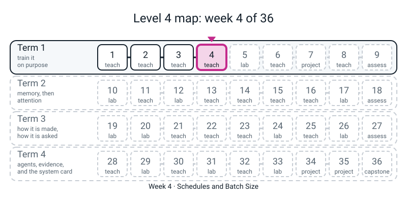
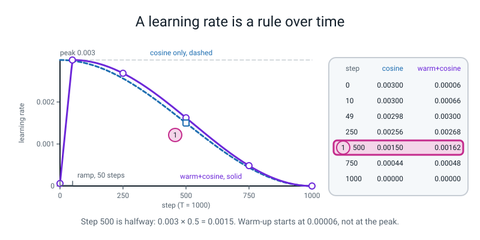
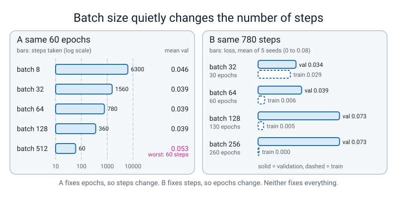

# Week 4 — Schedules and Batch Size

[⬅ Week 3](week-03.md) · [Course Home](../README.md) · [Week 5 ➡](week-05.md) · [Student Guide](../student-guide/week-04.md) · [Workbook](../workbook/week-04.md)

---


*Figure 4.0 — Where this fits: week 4 of 36 sits in term 1, "train it on purpose"; the tiles still dashed are the weeks to come.*

## 📋 At a Glance

| | |
|---|---|
| **Duration** | 70 minutes |
| **Type** | 🟦 Teach — the last of the three "who steers the step" weeks (momentum W2, Adam W3, schedule and batch W4) |
| **Big idea** | The right step size is not one number. It changes during a run — small at first, big in the middle, tiny at the end — and the batch you average over changes both how noisy each step is *and how many steps you get*. Both are easy to measure and easy to misread. |
| **New vocabulary** | learning-rate schedule · multiplier · warmup · cosine decay · scheduler · batch · steps per epoch · confound |
| **New maths** | **None.** (The ladder row for Week 4 is empty on purpose.) You will use three pieces of arithmetic the student already owns: a straight-line ramp, a table of cosine values read off a calculator, and whole-number division with a remainder (`840 // 64`). See 🔢 below. |
| **New syntax** | `lambda step: ...` · `torch.optim.lr_scheduler.LambdaLR` · `scheduler.step()` · `scheduler.get_last_lr()` — four, the ladder maximum |
| **Dataset** | The two interleaved spirals from Week 1: 1,200 points, 840 train, 360 validation, via `l4lib.spirals` (`make_spirals`, `get_data`, `run`). Nothing is downloaded. |
| **Materials** | Graph paper · a calculator with a cosine key (a phone is fine) · printed workbook pages 4.1–4.5 · the Bug Log · a coin (for the polling demonstration in section 6) |
| **Tech needed** | Laptop with Python 3, numpy, torch, matplotlib. `l4lib/` importable (see Prep step 1). **No new install. No network.** |
| **Prep time** | 20 minutes the night before · 5 minutes on the day |
| **Expected runtime** | `schedules.py` under 1 second · `minitrain.py` about 1 second · `hook.py` about 20 seconds · `batches.py` about 30 seconds (start it, then talk while it runs) · `hwgrid.py` about 15 seconds |

> **⚠️ Watch out:** this is the week where a student first **produces a plausible-looking explanation that the data does not support.** "Bigger batch, worse result" and "warmup helps" are both stories the textbooks tell, and on this small problem the honest measurement either does not show them or shows something more interesting. The teaching move of the week is not a formula; it is the sentence **"what did I hold fixed?"** said out loud, twice.

---

## 🎯 Lesson Objectives

By the end of the lesson the student can:

1. **Compute a learning rate for any step by hand** from a multiplier rule (`peak × multiplier(step)`), for both cosine decay and warmup-plus-cosine, and read the same number back with `scheduler.get_last_lr()`.
2. **Write a `lambda` and say what it is** — a function with no name, written in one line — and hand one to `LambdaLR`.
3. **State the order of the two calls** (`opt.step()` and *then* `scheduler.step()`) and what `get_last_lr()` is really reporting right after `scheduler.step()` (the rate the *next* step will use).
4. **Work out how many optimizer steps a run takes** from the batch size (`840 // batch`, times epochs), and say why "same epochs" and "same steps" are two different experiments.
5. **Report a result with its sample size** — "five seeds" — and say what a single seed can and cannot show.

Observable evidence: a graph-paper table of step → learning rate for both schedules that agrees with `LambdaLR` to the printed digits; the sentence *"`get_last_lr()` after `scheduler.step()` is the next step's rate"*; and a written paragraph naming **which quantity was held fixed** in each of the two batch-size experiments.

---

## 🧑‍🏫 What YOU Need to Know First

Read this section once, slowly. It is about ten minutes. Everything here is arithmetic and plain English; there is no calculus and no statistics beyond "do it five times and look at the spread".

### 1. Why this week exists

Weeks 1–3 turned the update `w -= lr * grad` into three different rules for *which direction* and *how far*. All three used one number, `lr`, that never changed. That is not how anyone trains a real model. Two reasons, both in plain words:

- **At the start you are lost, at the end you are nearly there.** Far from a good answer, big steps cover ground. Near a good answer, big steps bounce you back and forth over it. A rate that *falls* during the run gives you both.
- **At the very start the optimizer is guessing.** Adam (Week 3) builds its "typical size" of each gradient from the steps it has seen so far. On step one it has seen one. A tiny first step, growing over the first few percent of the run, is the cautious version of "don't trust your first estimate". That is **warmup**.

The second half of the week is about the **batch**: how many training examples you average before taking one step. The student has used `batch_size=64` since Week 1 without being told it was a choice. It is a choice with a trap in it, and the trap is arithmetic: on 840 training points, batch 64 gives 13 steps per epoch and batch 512 gives **one**. A "bigger batch is worse" result at a fixed number of epochs is *also* a "fewer steps" result. You cannot tell them apart unless you design the second experiment.

> **🧑‍🏫 If you remember one sentence from this section:** *the learning rate and the batch size are not two knobs, they are four things — how big each step is, how noisy each step is, how many steps there are, and how many times the same data is revisited. Changing one knob moves several of those at once.*

### 2. 🧭 REAL vs STAND-IN — what everything this week is

| Thing on the screen | Real model or stand-in? |
|---|---|
| Every training run (`run(...)`, `minitrain.py`) | **Real.** A small fully-connected network (stem, four blocks, head) trained for real, on a CPU, with AdamW, on the 840-point spiral training set. Seeded. |
| `LambdaLR` and `get_last_lr()` | **Real PyTorch.** Nothing is simulated. |
| The 1,000-step schedule traces | **Real**, but on a *dummy* one-number "model" (`nn.Parameter(torch.zeros(1))`) whose only job is to give the scheduler something to attach to. Say so aloud: *"this is not training anything; it is only watching the clock."* |
| Any LLM, transformer, or API | **None this week.** Nothing here is a stand-in because nothing here is a language model. |

**What you must NOT claim.** These are the four sentences that will be tempting, and each one is false or unproven on what the student measures this week.

1. **"Warmup stops training from blowing up."** The reference module says transformers go to NaN without it. Nothing measured this week shows that. On this network at `lr=0.03`, *warmup alone* helped seeds 0, 1 and 2 only partly (99.2%, 67.5% and 76.4% accuracy) and hurt seed 4 (97.2% to 86.7%). What rescued every seed was the **decay**. Warmup's real home is the transformer in Weeks 14–19 and what Adam's early estimate looks like; say so and move on.
2. **"Small batches regularise / generalise better."** The module's table (batch 8 best) is **seed 0 only**. Over five seeds, batch 8 has a *worse* mean validation loss (0.046) than batches 32, 64 and 128 (all 0.039). The claim that gradient noise helps is a published idea in much bigger settings; a 840-point toy does not confirm or refute it.
3. **"Double the batch, double the learning rate."** The module states this as a rule. On this problem, at equal steps, scaling the rate helped batch 128 (mean val 0.073 → 0.053) and *hurt* batch 256 (0.073 → 0.092). It is not a law the student has evidence for.
4. **"Schedules matter a lot."** At the gentle Week 1 rate (`lr=0.003`) all four schedules land between 0.035 and 0.043 mean validation loss, with seed-to-seed spread (0.029 to 0.057) as big as the gap between them. They matter when the peak rate is *too big* — and that is exactly what the hook shows.

> **Honest framing to say aloud, in your own words:** *"A toy result shows a mechanism, not a rate. What we can say is what happened on these 840 points with these five seeds."*

### 3. 🔢 THE MATHS YOU NEED, TAUGHT TO YOU FIRST

The ladder adds no new mathematical idea this week. You still need three small things, each by hand, so that nothing the student sees is a surprise.

**A. A multiplier.** A schedule here is a rule that gives a number between 0 and 1, called the **multiplier**, for each step. The learning rate at a step is `peak × multiplier(step)`. If the peak is 0.003 and the multiplier is 0.5, the rate is 0.0015. That is all `LambdaLR` does: *multiply the starting `lr` by your function of the step.* Everything below is "what rule produces the multiplier".

**B. The warmup ramp is a straight line.** Pick a number of warmup steps, `W`. At step `s` (counting from 0) the multiplier is `(s + 1) / W`. With `W = 10`: step 0 → 0.1, step 4 → 0.5, step 9 → 1.0. The `+ 1` is so the very first step is not exactly zero (a zero rate does nothing, and then a step is wasted). From step `W` onward, the ramp is over.

**C. The cosine curve, as a table, not a formula.** The student does not need to know where cosine comes from. They need this one sentence: *"cosine of an angle starts at 1, drifts down through 0, and ends at −1, smoothly, as the angle goes from 0 to half a turn."* The decay multiplier is

```
multiplier(s) = 0.5 * (1 + cos( pi * s / T ))
```

where `T` is the total number of steps. **Read it as three checkpoints**, which you can do with no calculator:

| Where in the run | `s / T` | angle `pi * s / T` | cosine of it | multiplier `0.5 * (1 + cos)` |
|---|:--:|---|:--:|:--:|
| Start | 0 | 0 | 1 | `0.5 * 2 = 1` (the full rate) |
| Halfway | 0.5 | half of half a turn | 0 | `0.5 * 1 = 0.5` |
| End | 1 | half a turn | −1 | `0.5 * 0 = 0` |

Then the calculator fills in the in-between ones. For `T = 100`: step 25 gives a multiplier of 0.8536 (so a quarter of the way through you have lost about 15%, not 25%); step 75 gives 0.1464. **The shape to name aloud:** *it falls slowly at first, fastest in the middle, slowly again at the end.* A straight line down would lose 25% at step 25. That "slow at first" is the whole point of preferring it.

**D. Whole-number division with a remainder.** `840 // 64` is `13`, because 13 batches of 64 use 832 points and 8 are left. The harness (`l4lib.spirals.run`) *drops* that last short batch and reshuffles every epoch, so the 8 left-overs are different points each epoch. So: steps per epoch = `840 // batch`; steps in a run = that times epochs. Students trip on `//` (it throws away the remainder). Say: *"two slashes means 'how many whole ones fit'."*

### 4. Every new line of this week's code, explained to someone who has never seen it

**`lambda s: 0.5 * (1 + np.cos(np.pi * s / T))`** — a function with no name, written in one line. It means exactly what

```python
def mult(s):
    return 0.5 * (1 + np.cos(np.pi * s / T))
```

means. Read `lambda s:` as *"the function that takes `s` and gives back…"*. Rule: it can only hold **one expression** (no `if`/`for` lines — use a `def` for warmup, which needs an `if`). Students will ask why bother; the honest answer is *"because `LambdaLR` wants a function as an argument, and for a one-liner it is shorter than a `def`."*

**`torch.optim.lr_scheduler.LambdaLR(opt, mult)`** — attaches to an optimizer. It *remembers the starting `lr`* and, every time you call `.step()`, sets `lr = starting_lr × mult(number_of_steps_so_far)`. The optimizer then uses that `lr` on its next step. Two consequences you will see in the mistakes: (i) `mult` must return a **multiplier**, not a rate, or you multiply twice; (ii) `mult` must be a **function**, not a number.

**`scheduler.step()`** — *advances the clock by one.* It does **not** update any weights. That is `opt.step()`'s job. The pair, in order, every training step:

```py
opt.step()      # move the weights, using the lr as it is right now
sched.step()    # then move the clock, so the next step gets the next lr
```

**`scheduler.get_last_lr()`** — reads the current learning rate back **as a list** (one entry per parameter group; we have one, so `[0.003]`). To get the number: `sched.get_last_lr()[0]`. **Right after `sched.step()` it shows the rate the *next* step will use**, not the one the step you just finished used. That off-by-one is the single most confusing thing about the tool, and it is why `minitrain.py` below prints a first line of `0.000500`, not `0.000250`.

### 5. The batch, in plain words

A **batch** is the handful of training examples whose gradients are averaged for one step. *Why average?* One example's gradient is a rough guess at "which way is downhill for everybody". An average of 64 is a better guess than an average of 8.

**Demonstration for the student: the poll.** (Optional, 90 seconds, uses the coin.) Flip a coin 8 times and write the fraction of heads; flip it 64 times (or have the laptop do it) and write that fraction. The 64-flip answer sits closer to 0.5. *A batch is a poll of the training set.* Do **not** write `1/sqrt(B)` on the board. The reason that rate appears (variances add) has its own week, **Week 15**. This week the student *measures* it:

| Batch size | Average distance of one batch's gradient from the full-data gradient |
|:--:|:--:|
| 8 | 0.196 |
| 32 | 0.104 |
| 128 | 0.050 |
| 512 | 0.018 |

(Teacher-run demo, `noise_demo.py` below; the student sees the table only, because it uses `rng.permutation` which is not on the ladder yet.) Read it as: *"each time the batch gets four times bigger, the noise about halves"* — 0.196 → 0.104 → 0.050 — *and the last row drops faster because 512 is already most of the 840 points.* That is an observation. The formula behind it is Week 15's.

### 6. The two confounds this week is built around

A **confound** is two things that changed at once, so you cannot say which one caused the result. Level 3 already taught the student *"change one thing at a time"*; this week shows that **sometimes you cannot, because the knob you turn drags a second knob with it.** The batch size is the clean example:

| You change the batch from 64 to 512 and keep… | …what else silently changed |
|---|---|
| **60 epochs** | 780 steps became **60** steps. You tested "bigger batch *and* 13× fewer steps". |
| **780 steps** | 60 epochs became **780** epochs' worth of passes — the model sees the same 840 points far more often, so it can *memorise* them. You tested "bigger batch *and* far more repeats". |

Both fixes are legitimate. **Neither is "the neutral one".** The measured result:

- Same **epochs** (60): validation loss is flat from batch 32 to 128 (all 0.039 mean) and worse at 512 (0.053) — which *looks* like "bigger batch worse" but 512 also got 60 steps instead of 780.
- Same **steps** (780): batches 128 and 256 are now clearly worse (0.073 each) than 32 (0.034) and 64 (0.039). Their *training* loss (0.005 and 0.000) is lower. They memorised: 260 passes over 840 points.

> **The honest conclusion the student should land on:** *"On this problem, batches from 32 to 128 are about the same when each gets 60 epochs. Pushing the batch bigger looks worse, but I cannot separate 'fewer steps' from 'more repeats of the same points' with the two experiments I ran."* A good report says that, not "bigger batch = worse".

### 7. The three misconceptions you will actually meet

1. **"Decay means the rate goes to zero, so it stops learning."** By the end it is nearly zero *on purpose*: the model has settled and a tiny step polishes instead of bouncing. Show the step-1000 row of the table (0.00000) and the loss in `minitrain.py` that is already flat by then.
2. **"`scheduler.step()` trains the model."** It only moves the clock. If they forget it (mistake 5 below) nothing crashes and the rate never changes. This is the silent one. The antidote is the habit of printing `get_last_lr()` once.
3. **"The batch size is a memory setting, not a learning setting."** On a big GPU it is mostly chosen for memory. But as section 6 shows, it also sets how many steps you take. When someone says "we doubled the batch for speed", the next question is "and what happened to the number of steps and the learning rate?"

### 8. How deep to go, and where to stop

Go as far as: *"the rate is a rule over time; I can compute it; I can read it back; and the batch size changes the step count."* Stop before: why cosine and not something else (nobody knows; it is empirical), the linear scaling rule (measured here as inconclusive), AdamW's decoupled decay interacting with schedules, and gradient accumulation. If the student asks about any, the answer is *"good question, not measured yet, write it in the Bug Log's 'later' column."*

### 9. 🧭 Where this fits (text version — the figure pass comes later)

```
 TERM 1 — THE TEN KNOBS
 W1  learning rate, one at a time            ✔ done
 W2  momentum  (running average)             ✔ done
 W3  Adam / AdamW  (per-knob step size)      ✔ done
 W4  schedule + batch size                   ◀ you are here
 W5  four ways to stop memorising            next: the same 840 points,
 W6  normalisation, clipping                       and what repeats do to them
 W7  the sweep (all knobs, one grid)         schedule and batch return here
```

Two minutes at the end of the lesson: ask *"which knob did today move that was not the learning rate?"* (The batch.) *"And what does it secretly change?"* (The number of steps.) Say only that Week 5's overfitting is today's "260 passes over 840 points" with a name on it, and leave it there.

---

## 🧰 Prep Checklist

### 20 minutes the night before

**1. (3 min) Make `l4lib` importable and check the folder.** `l4lib/` sits inside `36-week-course/`. Python only finds it if that folder is on the path. Pick one:

```bash
# from inside the 36-week-course folder, once per terminal:
export PYTHONPATH="$PWD"
python3 -c "import torch, numpy, matplotlib; print(torch.__version__, numpy.__version__)"
python3 -c "from l4lib.spirals import get_data; a, b, c, d = get_data(); print(a.shape, c.shape)"
```

You want a torch version, a numpy version, and `torch.Size([840, 2]) torch.Size([360, 2])`. The numbers in this guide were produced with torch 2.2.1 and numpy 1.26.4 on a CPU. A different torch version may differ in the last digit of a loss; see "If a number does not match" below.

**2. (4 min) Run the schedule script.** Create `schedules.py` and run it. This is the code the student will type in minutes 26–35.

```python
import numpy as np
import torch
import torch.nn as nn

PEAK = 0.003
T = 1000
WARM = 50

def cosine_mult(s):
    return 0.5 * (1 + np.cos(np.pi * s / T))

def warm_cosine_mult(s):
    if s < WARM:
        return (s + 1) / WARM
    prog = (s - WARM) / (T - WARM)
    return 0.5 * (1 + np.cos(np.pi * min(1.0, prog)))

print("step   cosine    warm+cosine")
for s in [0, 10, 49, 50, 250, 500, 750, 1000]:
    print(f"{s:>4}   {PEAK * cosine_mult(s):.5f}   {PEAK * warm_cosine_mult(s):.5f}")

print()
for s in range(0, 1001, 100):
    bar = "#" * int(40 * warm_cosine_mult(s))
    print(f"{s:>4} {bar}")

def trace(mult):
    w = nn.Parameter(torch.zeros(1))
    opt = torch.optim.SGD([w], lr=PEAK)
    sched = torch.optim.lr_scheduler.LambdaLR(opt, mult)
    seen = []
    for s in range(T + 1):
        seen.append(sched.get_last_lr()[0])
        opt.step()
        sched.step()
    return np.array(seen)

print()
for name, mult in [("cosine", cosine_mult), ("warm+cosine", warm_cosine_mult)]:
    by_hand = np.array([PEAK * mult(s) for s in range(T + 1)])
    print(f"{name:<12} biggest gap vs LambdaLR: {np.abs(trace(mult) - by_hand).max():.1e}")
```

Real output:

```text
step   cosine    warm+cosine
   0   0.00300   0.00006
  10   0.00300   0.00066
  49   0.00298   0.00300
  50   0.00298   0.00300
 250   0.00256   0.00268
 500   0.00150   0.00162
 750   0.00044   0.00048
1000   0.00000   0.00000

   0 
 100 #######################################
 200 #####################################
 300 #################################
 400 ############################
 500 #####################
 600 ###############
 700 #########
 800 ####
 900 #
1000 

cosine       biggest gap vs LambdaLR: 0.0e+00
warm+cosine  biggest gap vs LambdaLR: 0.0e+00
```

Check three things yourself. (a) Step 500 of cosine is exactly `0.00150`: the halfway checkpoint, half the peak. (b) Warm+cosine at step 0 is `0.00006` = `0.003 / 50`: the first rung of the ramp. (c) The "gap" line is exactly zero because `LambdaLR` is doing the same multiplication you did; the point of the check is that *the clock lines up* (step 0 uses multiplier(0)), not that two different formulas agree.

**3. (3 min) Run the scheduler inside a real training loop.** Create `minitrain.py`:

```python
import torch
import torch.nn as nn
import numpy as np
from l4lib.spirals import get_data, make_model

torch.set_num_threads(1)
Xtr, ytr, Xva, yva = get_data()
torch.manual_seed(0)
model = make_model()
opt = torch.optim.AdamW(model.parameters(), lr=0.003)
lossf = nn.CrossEntropyLoss()

TOTAL, WARM = 120, 12
def mult(s):
    if s < WARM:
        return (s + 1) / WARM
    prog = (s - WARM) / (TOTAL - WARM)
    return 0.5 * (1 + np.cos(np.pi * min(1.0, prog)))

sched = torch.optim.lr_scheduler.LambdaLR(opt, mult)
g = torch.Generator().manual_seed(0)
for step in range(TOTAL):
    idx = torch.randperm(len(Xtr), generator=g)[:64]
    loss = lossf(model(Xtr[idx]), ytr[idx])
    opt.zero_grad(set_to_none=True)
    loss.backward()
    opt.step()
    sched.step()
    if step % 20 == 0 or step == TOTAL - 1:
        print(f"step {step:>3}  lr {sched.get_last_lr()[0]:.6f}  loss {loss.item():.3f}")
```

Real output:

```text
step   0  lr 0.000500  loss 0.692
step  20  lr 0.002949  loss 0.598
step  40  lr 0.002497  loss 0.381
step  60  lr 0.001717  loss 0.092
step  80  lr 0.000866  loss 0.065
step 100  lr 0.000223  loss 0.066
step 119  lr 0.000000  loss 0.095
```

**Read the first line carefully; it is the lesson's off-by-one.** Step 0 *used* a rate of `0.003 × 1/12 = 0.00025`. After `sched.step()` the printout says `0.000500`, which is `0.003 × 2/12`: **the rate step 1 will use.** (`torch.randperm` with a generator and `torch.set_num_threads` are Week 5 and Week 1 constructs; here they live only in this teacher-typed loop. The student *reads* it and uses it, as they have used `run()` since Week 1. Do not ask the student to write `randperm` today.)

**4. (3 min) Run the hook.** This is the 7-minute hook. Create `hook.py` (the second half is the "gentle rate" counter-check; you may run it in the lesson or hold it for the wrap):

```python
import torch
torch.set_num_threads(1)
import numpy as np
from l4lib.spirals import run

variants = [
    ("constant",      dict()),
    ("warmup only",   dict(warmup_frac=0.05)),
    ("cosine only",   dict(schedule="cosine")),
    ("warmup+cosine", dict(schedule="cosine", warmup_frac=0.05)),
]
print("AdamW, lr=0.03 (ten times the Week 1 default), final validation accuracy %, seeds 0-4")
for name, kw in variants:
    accs = []
    for seed in range(5):
        h = run("x", lr=0.03, seed=seed, verbose=False, **kw)
        accs.append(h["acc"][-1] * 100)
    row = " ".join(f"{a:5.1f}" for a in accs)
    print(f"{name:<14} {row}   mean {np.mean(accs):5.1f}")
```

Real output (about 12 seconds):

```text
AdamW, lr=0.03 (ten times the Week 1 default), final validation accuracy %, seeds 0-4
constant        46.9  50.6  53.1  98.1  97.2   mean  69.2
warmup only     99.2  67.5  76.4  98.1  86.7   mean  85.6
cosine only     98.9  98.9  98.9  98.9  98.9   mean  98.9
warmup+cosine   99.2  98.9  98.9  98.9  98.9   mean  98.9
```

```python
print()
print("Same four schedules at the Week 1 default lr=0.003: mean final validation loss, seeds 0-4")
for name, kw in variants:
    vals = [run("x", lr=0.003, seed=seed, verbose=False, **kw)["val"][-1] for seed in range(5)]
    print(f"{name:<14} {np.mean(vals):.3f}  (lowest {min(vals):.3f}, highest {max(vals):.3f})")
```

Real output:

```text

Same four schedules at the Week 1 default lr=0.003: mean final validation loss, seeds 0-4
constant       0.039  (lowest 0.030, highest 0.050)
warmup only    0.043  (lowest 0.031, highest 0.057)
cosine only    0.035  (lowest 0.032, highest 0.040)
warmup+cosine  0.037  (lowest 0.029, highest 0.045)
```

Read the two tables together, because the lesson lives in the contrast. **At a rate ten times too big, a constant rate *ends* above 97% on 2 seeds of 5 (98.1% and 97.2%) and has collapsed to a coin flip (46.9% to 53.1%) on the other 3. Add cosine decay and all five seeds reach 98.9% or more.** Warmup alone does not rescue it (67.5% and 76.4% still appear). **At the gentle rate all four land within the seed-to-seed noise.** Notice `46.9%` and `53.1%` are the two "always predict one class" scores: the validation set is 46.9% one class and 53.1% the other. A run that *ends* near them has collapsed to "always answer one class", the Week 1 coin. It did not necessarily learn nothing: measured with the same seeds, all five constant-rate runs reached 99.2% to 99.4% validation accuracy at some epoch (epochs 10 to 41) before three of them diverged back to chance. The table reports the final epoch only.

**5. (4 min) Run the batch script and read its two tables.** Create `batches.py`:

```python
import torch
torch.set_num_threads(1)
import numpy as np
from l4lib.spirals import run

N_TRAIN = 840
print("batch  steps/epoch  steps in 60 epochs")
for bs in [8, 32, 64, 128, 256, 512]:
    per = N_TRAIN // bs
    print(f"{bs:>5}  {per:>11}  {per * 60:>18}")

print()
print("A) same 60 epochs: validation loss, seeds 0-4")
for bs in [8, 32, 64, 128, 512]:
    v = [run("x", batch_size=bs, seed=s, verbose=False)["val"][-1] for s in range(5)]
    print(f"bs {bs:>3} steps {N_TRAIN // bs * 60:>5}  " + " ".join(f"{x:.3f}" for x in v) + f"   mean {np.mean(v):.3f}")

print()
print("B) same 780 steps: validation loss, seeds 0-4")
for bs in [32, 64, 128, 256]:
    ep = 780 // (N_TRAIN // bs)
    hs = [run("x", batch_size=bs, epochs=ep, seed=s, verbose=False) for s in range(5)]
    v = [h["val"][-1] for h in hs]
    tr = np.mean([h["train"][-1] for h in hs])
    print(f"bs {bs:>3} epochs {ep:>3}  " + " ".join(f"{x:.3f}" for x in v) + f"   mean val {np.mean(v):.3f}  mean train {tr:.3f}")
```

Real output (about 30 seconds):

```text
batch  steps/epoch  steps in 60 epochs
    8          105                6300
   32           26                1560
   64           13                 780
  128            6                 360
  256            3                 180
  512            1                  60

A) same 60 epochs: validation loss, seeds 0-4
bs   8 steps  6300  0.027 0.024 0.066 0.070 0.040   mean 0.046
bs  32 steps  1560  0.043 0.034 0.038 0.027 0.050   mean 0.039
bs  64 steps   780  0.037 0.050 0.030 0.042 0.039   mean 0.039
bs 128 steps   360  0.049 0.034 0.035 0.029 0.052   mean 0.039
bs 512 steps    60  0.079 0.050 0.051 0.025 0.061   mean 0.053

B) same 780 steps: validation loss, seeds 0-4
bs  32 epochs  30  0.045 0.031 0.037 0.030 0.028   mean val 0.034  mean train 0.029
bs  64 epochs  60  0.037 0.050 0.030 0.042 0.039   mean val 0.039  mean train 0.006
bs 128 epochs 130  0.048 0.055 0.060 0.056 0.148   mean val 0.073  mean train 0.005
bs 256 epochs 260  0.075 0.072 0.067 0.073 0.076   mean val 0.073  mean train 0.000
```

What to take from it. In table A the bs 512 *mean* (0.053) is worse than the rest, but one of its five seeds (0.025) is the best number on the page: **the spread inside a row is as big as many gaps between rows.** In table B, bs 128 has one seed at 0.148 that drags its mean; its other four are 0.048 to 0.060. Say *"mean of five seeds"* aloud every time you quote a number from these tables. The sentence **"which quantity did I hold fixed?"** answers table A ("epochs") and table B ("steps") and is the whole lesson.

**6. (2 min) Optional teacher demo, the noise table in section 5.** Only if you want to see it yourself; the student sees the table, not the code. Create `noise_demo.py`:

```python
# TEACHER DEMO ONLY. Uses rng.permutation, which the student has not met.
import numpy as np
import torch
import torch.nn as nn
from l4lib.spirals import get_data, make_model

torch.set_num_threads(1)
Xtr, ytr, Xva, yva = get_data()
torch.manual_seed(0)
model = make_model()
lossf = nn.CrossEntropyLoss()

def grad(idx):
    model.zero_grad(set_to_none=True)
    lossf(model(Xtr[idx]), ytr[idx]).backward()
    return torch.cat([p.grad.flatten() for p in model.parameters()])

full = grad(torch.arange(len(Xtr)))
rng = np.random.default_rng(0)
print("size of the full-data gradient:", round(full.norm().item(), 3))
print("batch  average distance of a batch gradient from the full-data gradient (200 batches)")
for B in [8, 32, 128, 512]:
    d = [(grad(torch.tensor(rng.permutation(len(Xtr))[:B])) - full).norm().item() for _ in range(200)]
    print(f"{B:>5}  {np.mean(d):.3f}")
```

Real output:

```text
size of the full-data gradient: 0.031
batch  average distance of a batch gradient from the full-data gradient (200 batches)
    8  0.196
   32  0.104
  128  0.050
  512  0.018
```

(The model is the untrained, seed-0 network, so the full-data gradient is tiny. The *distances* are what matter.)

### 5 minutes on the day

- Open a terminal in the folder with `l4lib` importable (`echo $PYTHONPATH`).
- Run `python3 schedules.py` once so the first lines are cached and you know it works.
- Write on the board: `lr = peak × multiplier(step)` and nothing else.
- Put the coin on the table. Have graph paper ready for the hand table.

### If a number does not match this guide

1. Is `torch.set_num_threads(1)` in the script, and is the seed set? (`run()` pins threads and seeds from its `seed=` argument; your own loops need both.)
2. Which torch version? Compare in the last digit only. A loss that differs in the **third** decimal on a *single seed* is within what a different torch build does; compare the five-seed *mean* and the *ordering* instead.
3. Wrong batch? `batches.py` uses `N_TRAIN = 840`. If `get_data` printed a different shape in Prep step 1, something upstream changed.
4. If it still disagrees: use the number *on your screen*, never the one in this guide, and tell the student why. (This is the Level 4 rule: any number a student writes in a report must have been printed by their own run, with a seed, in the last 24 hours.)

### Fallback if the laptops fail

This week degrades well, because the heart of it is a table and a subtraction.

| If this fails | Do this instead |
|---|---|
| `ModuleNotFoundError: No module named 'l4lib'` | `PYTHONPATH` is not set in this terminal. Re-run the `export` in Prep step 1 from the `36-week-course` folder. Do not debug for more than two minutes; do the hand table (Workbook 4.3) first, it needs no computer. |
| `torch` will not import | Everything in the concept segment is numpy + paper: `schedules.py` minus the `trace` function. Do the whole hand table, then the steps-per-epoch table (4.4), and read the pre-printed tables from this guide as "data from my laptop at home". Say so out loud. |
| `batches.py` is too slow | Run table A for `[32, 128, 512]` and seeds `range(3)`; say "three seeds, not five" in the report line. Never run one seed and report it. |
| Projector fails | Read numbers aloud and have the student write them. This lesson is a table-filling lesson. |

---

## ⏱️ The Lesson, Minute by Minute

| Segment | Minutes | Running total | What happens |
|---|---|---|---|
| 🪝 Hook — The Same Network, Ten Times Too Fast | 8 | 8 | Run `hook.py`. Three of five seeds end at a coin flip (they diverge late, after reaching about 99%); with a falling rate none do. |
| 🧠 Concept & Maths — A Rate Is a Rule Over Time | 17 | 25 | Multiplier, ramp, cosine as three checkpoints, a hand table, the `lambda` |
| 💻 Live-Code Together — `schedules.py`, `minitrain.py`, two mistakes | 18 | 43 | Compare to the hand table; read the clock; break it twice on purpose |
| 🎲 Their Turn — Steps per Epoch, and Two Experiments | 20 | 63 | Count steps on paper; run `batches.py` in the background; fill "what did I hold fixed" |
| 🔑 Wrap & Assign | 7 | 70 | Five sentences, the gentle-rate counter-check, homework |

---

### 🪝 Hook — The Same Network, Ten Times Too Fast (8 minutes)

**Do this:** Write on the board, large:

```
peak lr = 0.03     (Week 1's default was 0.003)
same network · same data · same seeds · same optimizer (AdamW)
the ONLY thing that differs: how lr changes over the run
```

> **Say this:** "Last month you found that a learning rate of 0.03 was too big. Today I'm going to run exactly that rate five times with five different starting points — five seeds — and then run it five times again with one change: the rate isn't allowed to stay at 0.03. It's allowed to start there and fall.
>
> Before I run it, write down a prediction: out of five seeds, how many reach more than 90% accuracy with the rate held constant at 0.03? And how many with the falling rate?"

Let them write two numbers. **Do this:** Run `hook.py` (only the first print block; about 12 seconds). Start it, then say: "while it runs, write down which row you think will be the best."

**Output they should see** (from the Prep checklist, step 4):

```
constant        46.9  50.6  53.1  98.1  97.2   mean  69.2
warmup only     99.2  67.5  76.4  98.1  86.7   mean  85.6
cosine only     98.9  98.9  98.9  98.9  98.9   mean  98.9
warmup+cosine   99.2  98.9  98.9  98.9  98.9   mean  98.9
```

**Ask this:**

| Ask | Answer you want | If they say something else |
|---|---|---|
| "Look at the `constant` row. What does 46.9% mean?" | It is the "always answer the same class" score (one class is 46.9% of the validation set; the other is 53.1%): the run *ended* having collapsed to a constant answer (it may have learned earlier and then diverged; the table shows only the last epoch). The Week 1 `ln 2` coin in another costume. | If they say "it is 47% right so almost half": push once — *"on a two-class problem, what does a model that ignores the data score?"* |
| "How many of the five learn with a constant rate? How many with cosine?" | Two (98.1, 97.2); five. | A guess of "three" is a misread of 46.9/50.6/53.1 as "learning a bit". Those runs finished at chance level. |
| "Which row would you have picked as the best *before* you saw the numbers?" | Honest answers vary. The point is that the intuition "warmup is the safe one" is not what the table says. | Do not explain warmup yet. Say "keep that thought, we will come back to it." |
| "Is this a result about every network and every problem?" | No — one small network, one dataset, five seeds, one bad learning rate. | If they say "it proves schedules work": agree it shows a mechanism, then say *"and what do you notice about the row that is best?"* (`cosine only`, no warmup.) |

> **Say this:** "So the rate that wrecked three of five runs was fine for the first few hundred steps and then bounced instead of settling. Letting it fall fixed all five. Today is about how to write that falling rule in four lines, and then about a second knob, the batch size, where the trap is less obvious."

**Do not** talk about warmup yet. The hook's quiet surprise is that `cosine only` beats `warmup only`; you will cash that in during the wrap.

---

### 🧠 Concept & Maths — A Rate Is a Rule Over Time (17 minutes)

**Do this:** Clear the board. Write the one equation and leave it up for the rest of the lesson:

```
lr(step) = peak × multiplier(step)
```

> **Say this — part 1, the multiplier:** "Up to now the learning rate was one number. Today it's two things multiplied together. The **peak** is the biggest rate we ever use — 0.003. The **multiplier** is a number between 0 and 1 that depends on which step we're on. At step 0 it might be 0.1, in the middle 1.0, at the very end 0.0. If the peak is 0.003 and the multiplier is 0.5, what's the rate?"

*0.0015.* If they say 0.5 ask "peak times multiplier — what's peak?". Do two more: peak 0.01, multiplier 0.1 → 0.001; peak 0.003, multiplier 0 → 0.

> **Say this — part 2, warmup is a ramp:** "Let's invent the warm-up first. I want ten steps. At step 0 the multiplier is 0.1, at step 1 it's 0.2, and so on until it hits 1 at step 9. Write the rule that gives the multiplier from the step number."

Let them struggle for 60 seconds. The target is `(step + 1) / 10`. If they write `step / 10`, ask "what is the rate at step 0?" (zero — "the step does nothing"). Write `(s + 1) / W` on the board. **Do this:** fill three rows with them:

```
step  multiplier   rate (peak 0.01)
  0      0.1          0.001
  4      0.5          0.005
  9      1.0          0.010
```

> **Say this — part 3, the cosine, as three checkpoints:** "After warm-up we want to come down, slowly at first, fastest in the middle, slowly again at the end. There's a curve that does exactly that, from your maths class, called cosine. I'm not going to derive it. Here's everything we need: the number `0.5 × (1 + cos(angle))`, where the angle goes from 0 to half a turn over the whole run. At the start the cosine is 1, so the multiplier is `0.5 × 2 = 1`. Halfway the cosine is 0 so the multiplier is `0.5 × 1 = 0.5`. At the end the cosine is -1 so the multiplier is `0.5 × 0 = 0`. Start, halfway, end — one, a half, zero."

**Do this:** Have the student use the calculator to fill the quarter and three-quarter points for `T = 100` (step 25 and 75). The numbers: **0.8536 and 0.1464.** Put them next to the straight-line comparison:

```
step   straight line down   cosine
  0         1.00            1.0000
 25         0.75            0.8536     <- cosine has lost less
 50         0.50            0.5000
 75         0.25            0.1464     <- cosine has lost more
100         0.00            0.0000
```

**Ask this:**

| Ask | Answer you want | If they say something else |
|---|---|---|
| "Where is the cosine falling fastest?" | Around the middle, by 50. | If they say "at the start": have them subtract the first two rows (1 → 0.8536, a drop of 0.146) and the middle ones. |
| "Why might you want to fall slowly at the start?" | The first third of the run is still making real progress. | Any answer along the lines "you're still far from the answer" is right. |
| "What is the rate at the very last step, and is that a problem?" | Zero. Not a problem — the model has settled; a tiny step only polishes. | If they worry the model "stops learning": see misconception 1 in section 7. |

> **Say this — part 4, `lambda`:** "Here is the rule as a Python function."

**Do this:** Write on the board:

```python
def mult(s):
    return 0.5 * (1 + np.cos(np.pi * s / T))
```

> "Now watch me write the *same function* with no name."

```python
lambda s: 0.5 * (1 + np.cos(np.pi * s / T))
```

> "`lambda` is Python's word for 'a function with no name, written on one line'. Read the bit before the colon as the thing that goes in; read the bit after as the thing that comes out. It is exactly the `mult` function, minus the `def` and the `return`. The reason we need it: the tool we're about to meet, `LambdaLR`, takes a *function* as an argument, and a one-liner is the shortest way to hand one over."

**Check for understanding (30 seconds):** write `lambda x: x + 1` on the board. Ask: "what does it give back for 4?" (5.) And `lambda x: 2 * x`, for 4? (8.) If they stumble, write it as a `def` underneath.

> **Say this — part 5, transition:** "Everything we just did on paper, the computer can check. Open a file and type `schedules.py`."


*Figure 4.1 — The rate is the peak times a multiplier: warm-up ramps it up over 50 steps and cosine brings it down to zero.*

---

### 💻 Live-Code Together — `schedules.py`, `minitrain.py`, and two mistakes (18 minutes)

**Do this:** The student types; you do not. `schedules.py` has the same code as the Prep checklist, step 2. Build it in three pieces and run after each.

**Piece 1 (minutes 25–29): the two multipliers and the table.** Type from `import numpy as np` through the first `for` loop. Run it. The student's hand table must agree.

```text
step   cosine    warm+cosine
   0   0.00300   0.00006
  10   0.00300   0.00066
  49   0.00298   0.00300
  50   0.00298   0.00300
 250   0.00256   0.00268
 500   0.00150   0.00162
 750   0.00044   0.00048
1000   0.00000   0.00000
```

**Ask this:**

| Ask | Answer you want | If they say something else |
|---|---|---|
| "Why is the `warm+cosine` column at step 50 *not* exactly `0.00300` multiplied by `0.5 * (1 + cos(0))`?" | It is — at step 50 the ramp is over and the cosine is at its start: `(50 - 50) / 950 = 0`, cosine of 0 is 1, multiplier 1. Exactly `0.00300`. | If they say it is "rounded": ask for the multiplier at step 50 by hand. |
| "Find the row where the two columns differ most, in percent." | Step 0 (0.00006 vs 0.00300). After the ramp the two columns differ by only a few percent. | Use the step-250 row: `0.00268` vs `0.00256`, the warm column is *higher* because its cosine started 50 steps later and has fallen less. |

**Piece 2 (minutes 29–33): the text picture and the `LambdaLR` check.** Type the bar loop (a `"#"` times a number) and then the `trace` function. **Say:** "`trace` is not training anything. I make one dummy number, hand it to an optimizer so the scheduler has something to watch, and run the clock 1,000 times writing down the rate."

Run. The student should see the staircase of `#` shrinking and then the two gap lines at `0.0e+00`.

> **Say this:** "Zero gap, because `LambdaLR` just multiplies the peak by whatever function I give it. The check isn't that two formulas agree. It's that step 0 gets multiplier-of-step-0 and not step 1. That matters in a minute."

**Piece 3 (minutes 33–38): in a real loop, `minitrain.py`.** The student **types only the scheduler lines** (`sched = ...LambdaLR(opt, mult)`, `opt.step()`, `sched.step()`, the print); you provide the loop around them: *"the loop is yours from Level 3; the new bit is two lines and a function."* Run:

```text
step   0  lr 0.000500  loss 0.692
step  20  lr 0.002949  loss 0.598
step  40  lr 0.002497  loss 0.381
step  60  lr 0.001717  loss 0.092
step  80  lr 0.000866  loss 0.065
step 100  lr 0.000223  loss 0.066
step 119  lr 0.000000  loss 0.095
```

**Ask this:**

| Ask | Answer you want | If they say something else |
|---|---|---|
| "Step 0's line says `lr 0.000500`. The ramp says step 0 uses `0.003 × 1/12 = 0.00025`. Who is right?" | Both. `get_last_lr()` after `sched.step()` is the rate the **next** step will use: `0.003 × 2/12 = 0.0005`. | If they say "there's a bug": *"read the sentence in the guide about order: weights first, then clock."* Draw two boxes `opt.step()` → `sched.step()` and a time arrow. |
| "Find the line where the loss stops improving. What was the rate then?" | Around step 80–100, loss ≈ 0.065, rate under 0.001. | Note that the loss *flattens* as the rate falls. That is the curve working. |
| "Why is the first loss 0.692?" | Week 1: `ln 2 = 0.693`, a coin flip. | Reward the callback. |

**Piece 4 (minutes 38–43): two mistakes, on purpose.** Say: "I'm going to break it in two ways you will do within a month." The student types each; you do not hint.

**Mistake 1 — a number where a function should go (DELIBERATE ERROR):**

```python
# DELIBERATE ERROR 1: a number, not a function
import torch
import torch.nn as nn
w = nn.Parameter(torch.zeros(1))
opt = torch.optim.SGD([w], lr=0.003)
sched = torch.optim.lr_scheduler.LambdaLR(opt, lr_lambda=0.5)
```

Real message (torch 2.2.1; five frames inside torch elided, their file paths will differ on your machine):

```text
Traceback (most recent call last):
  File "week4_mistakes.py", line 5, in <module>
    sched = torch.optim.lr_scheduler.LambdaLR(opt, lr_lambda=0.5)
  ...
  File ".../torch/optim/lr_scheduler.py", line 274, in <listcomp>
    return [base_lr * lmbda(self.last_epoch)
TypeError: 'float' object is not callable
```

**Teaching move:** read the **last line** aloud. "Not callable" = *"you tried to use it like a function and it is a number."* The scheduler calls your `lr_lambda` on its first step, so the crash is at construction, not later. The fix: `lambda s: 0.5` (a function that returns 0.5 whatever the step).

**Mistake 2 — printing the list (DELIBERATE ERROR):**

```python
# DELIBERATE ERROR 2: get_last_lr() is a list
sched = torch.optim.lr_scheduler.LambdaLR(opt, lambda s: 1.0)
print(f"lr {sched.get_last_lr():.4f}")
```

```text
Traceback (most recent call last):
  File "week4_mistakes.py", line 2, in <module>
    print(f"lr {sched.get_last_lr():.4f}")
TypeError: unsupported format string passed to list.__format__
```

**Teaching move:** have them `print(sched.get_last_lr())` first: `[0.003]`. A list with one number. `[0]` takes it out. *"One entry per parameter group; we have one group."*

If time is short, drop Mistake 2 — it is the milder one. **Never** drop Mistake 1.

---

### 🎲 Their Turn — Steps per Epoch, and Two Experiments (20 minutes)

**Do this:** Start `batches.py` now, in a second terminal tab, and let it run (about 30 seconds) while the student works on paper.

**Part 1 — count the steps (7 minutes, paper only).** Give the student this table with the right-hand columns blank:

```
batch   steps per epoch (840 // batch)   steps in 60 epochs
  8
 64
 128
 512
```

They fill it in using the calculator. The answers (check against the first block of `batches.py`'s output): **105 / 6,300 · 13 / 780 · 6 / 360 · 1 / 60.**

**Ask this:**

| Ask | Answer you want | If they say something else |
|---|---|---|
| "If I train batch 8 and batch 512 for 60 epochs each, how many more times does batch 8 move the weights?" | 105 times as many (6,300 ÷ 60). | If they say "64 times" they divided the batch sizes (512 ÷ 8). Ask: *"does a bigger batch mean fewer steps *per epoch*, and by how much?"* |
| "Both have seen every point 60 times. Is that a fair comparison?" | It is fair in *epochs*. It is not fair in *steps*. | This is the hinge of the lesson; wait for it. |

**Part 2 — predict, then read (7 minutes).** Before showing table A, ask the student to **write down** their prediction for batch 512 compared to batch 64 (better, worse, same) at 60 epochs. Then show table A:

```text
A) same 60 epochs: validation loss, seeds 0-4
bs   8 steps  6300  0.027 0.024 0.066 0.070 0.040   mean 0.046
bs  32 steps  1560  0.043 0.034 0.038 0.027 0.050   mean 0.039
bs  64 steps   780  0.037 0.050 0.030 0.042 0.039   mean 0.039
bs 128 steps   360  0.049 0.034 0.035 0.029 0.052   mean 0.039
bs 512 steps    60  0.079 0.050 0.051 0.025 0.061   mean 0.053
```

> **Say this:** "Batch 512's mean is worst. A tempting story: bigger batches are worse. Before we write that down, what else is different about the 512 row?" — wait — "its *steps* column says 60. Everyone else got at least 360."

**Do this:** Ask the student to design the fix: *"how would you run the experiment so every row gets the same number of steps?"* Target: change the epochs so that `steps = (840 // batch) × epochs` is the same. Show table B:

```text
B) same 780 steps: validation loss, seeds 0-4
bs  32 epochs  30  0.045 0.031 0.037 0.030 0.028   mean val 0.034  mean train 0.029
bs  64 epochs  60  0.037 0.050 0.030 0.042 0.039   mean val 0.039  mean train 0.006
bs 128 epochs 130  0.048 0.055 0.060 0.056 0.148   mean val 0.073  mean train 0.005
bs 256 epochs 260  0.075 0.072 0.067 0.073 0.076   mean val 0.073  mean train 0.000
```

**Ask this:**

| Ask | Answer you want | If they say something else |
|---|---|---|
| "At equal steps, which batches are worse?" | 128 and 256 (0.073 each), versus 0.034 and 0.039. | If they say "so bigger batch IS worse": hold that thought one question. |
| "Look at the `mean train` column for 256. What is it, and what does it tell you?" | 0.000. It has fit the training points perfectly. It saw each of the same 840 points **260 times**. | If they do not connect it, ask "epochs for batch 256? epochs for batch 32?" (260 and 30.) |
| "So what did the second experiment change that the first did not?" | Equal steps means big batches get many more *epochs* — more repeats of the same points, more chance to memorise. | This is the "other" confound. Write: *same epochs ≠ same steps; same steps ≠ same repeats.* |

**Part 3 — "what did I hold fixed?" (6 minutes, writing).** The student writes the two-line summary the answer key shows:

```
Experiment A held ______ fixed.  It also changed ______.
Experiment B held ______ fixed.  It also changed ______.
```

Target: A held **epochs** fixed, and also changed **steps**; B held **steps** fixed, and also changed **epochs (repeats)**. Then **one honest conclusion sentence** (see section 6 in the teacher guide for the target wording). Do not accept "bigger batch is worse" as a conclusion without the word "because" and one of the two confounds.

**If you have 2–6 students:** pairs. One runs A with their own seeds `range(5, 10)`, the other runs B with `range(5, 10)`. They compare: *did they agree with the table?* Different seeds, same ordering, different numbers — that is itself the lesson about single seeds.


*Figure 4.2 — Changing the batch size changes the number of steps, so ask what each experiment held fixed.*

---

### 🔑 Wrap & Assign (7 minutes)

**Do this:** Leave the hook table and tables A and B on the board or screen. Run the second block of `hook.py` (the `lr=0.003` one) if you did not run it earlier (about 8 seconds), or read the prepared lines to them.

> **Say this — five sentences.**
>
> **One.** The learning rate is `peak × multiplier(step)`; a *schedule* is the rule for the multiplier, and `LambdaLR` applies it for you.
>
> **Two.** Cosine decay falls slowly, then fast, then slowly, to zero. Warmup is a straight ramp over the first few percent. A `lambda` is just a function with no name.
>
> **Three.** Call `opt.step()` and *then* `sched.step()`, and remember that `get_last_lr()` after `sched.step()` is the rate for the next step.
>
> **Four.** At the rate that was ten times too big, the *falling* rate rescued every seed; warmup alone did not. At the gentle rate none of the schedules differed more than the seeds did. So: a schedule can save you from a rate that is too high; it does not make a good rate better, on this problem.
>
> **Five.** Batch size changes the number of steps — `840 // batch` per epoch — so 'same epochs' and 'same steps' are two different experiments, and neither is neutral. Always say which quantity you held fixed."

**Do this:** Ask the closing question: *"What would you need to see to claim 'bigger batches are worse'?"* Target: worse in the same-epochs experiment and in the same-steps experiment (both cannot be held fixed at once, since steps = epochs × `840 // batch`), with more than one seed, ideally with the rate re-tuned per batch size. The homework supplies the extra seeds. That is the homework's hook.

Run the three checks from **✅ Assessing Understanding**, then assign the homework from **📤 Homework to Assign**.

---

## 🐞 The Debugging Clinic

Every message below was produced by running a broken version of this week's actual code (torch 2.2.1, numpy 1.26.4). Torch's own frames are elided; the last line and the line from the student's file are what they should read.

> **🧑‍🏫 If a student asks:** the rule from Week 1 stands. **Read the last line, then find the `File` line with your own filename in it.** Today's errors are `TypeError` (a thing was the wrong type), `ZeroDivisionError` (arithmetic) and two that **raise nothing at all**. The silent ones are the dangerous ones.

| What the student sees (real message) | What it means | Most likely cause | The fix |
|---|---|---|---|
| `TypeError: 'float' object is not callable` | "You gave me a number where I expected something I could call, like a function." | `LambdaLR(opt, lr_lambda=0.5)` — a number instead of `lambda s: 0.5`. | Hand it a function. (Mistake 1 above.) |
| `TypeError: unsupported format string passed to list.__format__` | "You asked me to format a list as if it were a number." | `f"{sched.get_last_lr():.4f}"` — `get_last_lr()` returns a list. | Index it: `sched.get_last_lr()[0]`. |
| `ZeroDivisionError: division by zero` (raised when `LambdaLR(...)` is built) | "Your multiplier function divided by zero on its first call." | `lambda s: s / warm` with `warm = 0`: the scheduler calls it once at construction. | Warmup of zero steps means "no warmup": guard it (`if warm > 0 and s < warm:`) or use `(s + 1) / max(1, warm)`. |
| `UserWarning: Detected call of 'lr_scheduler.step()' before 'optimizer.step()'. In PyTorch 1.1.0 and later, you should call them in the opposite order…` | Not an error: "you moved the clock before you moved the weights, and I will skip the first value of your schedule." | `sched.step()` placed above `opt.step()` in the loop. | Weights first, clock second. |
| **No error.** The rate is `0.003` forever. | The scheduler is attached but its clock never moves. | Forgot `sched.step()`. | Print `sched.get_last_lr()` once every few steps while learning. |
| **No error.** The rate falls to zero, then **climbs back up**. | You ran past `T` steps; cosine is periodic. | Cosine multiplier without `min(1.0, prog)`, and a loop longer than `T`. | Clamp the progress, as `warm_cosine_mult` does. |
| **No error.** The rate is about 300 times too small (`0.003` times `0.003`): `[9e-06]`. | You multiplied twice. | The lambda returned a *rate* (`0.003 * ...`), and `LambdaLR` multiplied that by the peak `lr=0.003` again. | `LambdaLR` wants a **multiplier**; drop the `0.003 *` from the lambda. |

The full transcripts, with the deliberate-error blocks in order:

```python
# DELIBERATE ERROR 3: warmup of zero steps
warm = 0
w = nn.Parameter(torch.zeros(1))
opt = torch.optim.SGD([w], lr=0.003)
sched = torch.optim.lr_scheduler.LambdaLR(opt, lambda s: s / warm)
```

```text
Traceback (most recent call last):
  File "week4_mistakes.py", line 5, in <module>
    sched = torch.optim.lr_scheduler.LambdaLR(opt, lambda s: s / warm)
  ...
  File "week4_mistakes.py", line 5, in <lambda>
    sched = torch.optim.lr_scheduler.LambdaLR(opt, lambda s: s / warm)
ZeroDivisionError: division by zero
```

```python
# The wrong ORDER (not an error; a warning). Run once, in a fresh interpreter.
import warnings
w = nn.Parameter(torch.zeros(1))
opt = torch.optim.SGD([w], lr=0.003)
sched = torch.optim.lr_scheduler.LambdaLR(opt, lambda s: 1.0)
with warnings.catch_warnings(record=True) as caught:
    warnings.simplefilter("always")
    sched.step()
print(len(caught), "warning:", caught[0].message)
```

```text
1 warning: Detected call of `lr_scheduler.step()` before `optimizer.step()`. In PyTorch 1.1.0 and later, you should call them in the opposite order: `optimizer.step()` before `lr_scheduler.step()`.  Failure to do this will result in PyTorch skipping the first value of the learning rate schedule. See more details at https://pytorch.org/docs/stable/optim.html#how-to-adjust-learning-rate
```

```python
# SILENT MISTAKE 5: forgot sched.step()
w = nn.Parameter(torch.zeros(1))
opt = torch.optim.SGD([w], lr=0.003)
sched = torch.optim.lr_scheduler.LambdaLR(opt, lambda s: 0.5 * (1 + np.cos(np.pi * s / 100)))
for s in range(100):
    opt.step()
print(opt.param_groups[0]["lr"], sched.get_last_lr())
```

```text
0.003 [0.003]
```

```python
# SILENT MISTAKE 6: ran past T without min()
T = 100
w = nn.Parameter(torch.zeros(1))
opt = torch.optim.SGD([w], lr=0.003)
sched = torch.optim.lr_scheduler.LambdaLR(opt, lambda s: 0.5 * (1 + np.cos(np.pi * s / T)))
lrs = []
for s in range(201):
    lrs.append(sched.get_last_lr()[0])
    opt.step()
    sched.step()
for s in [0, 50, 100, 150, 200]:
    print(s, round(lrs[s], 6))
```

```text
0 0.003
50 0.0015
100 0.0
150 0.0015
200 0.003
```

```python
# SILENT MISTAKE 7: the lambda returns a RATE, not a multiplier
w = nn.Parameter(torch.zeros(1))
opt = torch.optim.SGD([w], lr=0.003)
sched = torch.optim.lr_scheduler.LambdaLR(opt, lambda s: 0.003 * 0.5 * (1 + np.cos(np.pi * s / T)))
print(sched.get_last_lr())
```

```text
[9e-06]
```

### How to teach debugging without giving the answer

- **"Is it a number or a function?"** Mistake 1 in one question. If something says "not callable", ask what the argument is.
- **"Print it before you format it."** `print(sched.get_last_lr())` before `f"{...:.4f}"` is the whole of mistake 2.
- **"What does the rate look like at step 0, at the middle, at the end?"** Three prints catch mistakes 5, 6 and 7 at a glance: constant (5), back up (6), about 300 times too small (7).

And the sentence for this week:

> **"A scheduler without a printout is a guess. Print the rate once."**

---

## 🎲 The Activity, In Full

### Steps per Epoch, and Two Experiments

**Purpose:** make the student *feel* that `batch size` secretly sets `number of steps`, by doing the arithmetic before the code, and then defending a conclusion against two different confounds.

**Materials:** the table from Part 1, `batches.py` already running, paper.

### Part 1 — Count the steps (7 minutes)

As in the lesson. Extension for a fast student: *"what is the biggest batch where no examples are thrown away?"* (840 itself; or any divisor of 840: 8, 20, 21, 24, 28, 30, 35, 40, 42, 56, 60, 70, 84, 105, 120…) Then *"what do you lose at batch 100?"* (40 points per epoch, but a different 40 each epoch.)

### Part 2 — Two experiments (10 minutes)

As in the lesson. Insist on the **written prediction before** the table appears.

### Part 3 — The report (3 minutes)

Every report gets the template:

```
On ___ points, with ___ seeds, I held ___ fixed. The result was ___ (mean of the seeds).
That could also be because ___ changed at the same time.
```

### Variation — easier

Run table A only, with batch sizes `[32, 128, 512]` and three seeds. Spend the saved time on the hand table. Objective 4 (steps vs epochs) is still delivered by reading the *steps* column.

### Variation — harder

Ask the student to add one more experiment: **equal steps with the learning rate scaled by `batch / 64`**. They can reuse `batches.py` with `lr=3e-3 * bs / 64`. The measured result you should expect (5-seed means, equal 780 steps): bs 32 at `lr=0.0015` val 0.040 (train 0.015) vs 0.034 at `0.003`; bs 128 at `lr=0.006` val 0.053 vs 0.073; bs 256 at `lr=0.012` val 0.092 vs 0.073. **The "scale the rate with the batch" rule helps at 128, hurts at 256, and is neither proven nor refuted at this size.** The target conclusion is a *plan* ("I would need more seeds and a bigger problem"), not a verdict.

---

## ❓ Questions Students Ask This Week

**"Why is it called 'cosine'? What does it have to do with triangles?"** It is the same curve the student met in trigonometry; the learning-rate use is only that it is a smooth S-shaped way to go from 1 to 0. Do not derive it. Say: "someone tried it, it worked well, it is now the habit."

**"Is there a best schedule?"** Not that anyone has proved. On this small problem all four were within the noise at a good rate. On big models the field has settled on warmup then cosine (or a variant) by trying things. That is a convention supported by experiments at a scale we cannot run here.

**"Why does `get_last_lr()` return a list?"** An optimizer can have several parameter groups with different rates (Week 7 touches that). One entry each. Ours has one.

**"Why does the first step have a tiny rate with warmup — I thought the model needs to learn fast at the start?"** It does want to; but Adam's early estimate is noisy (Week 3). The honest answer today: *warmup is cheap insurance that this problem does not need at `lr=0.003`, and that the table did not show helping alone at `0.03`.* Do not claim more.

**"If cosine fixed the high rate, why not always use a huge rate and a decay?"** Try it: at `lr=0.1` even `warm+cosine` stayed at 46.9% (the first run of this guide: `adamw lr=0.1 warm+cos train 0.693 val 0.695 acc 46.9%`). The decay cannot rescue a rate that wrecks the first steps. That is a good student discovery; let them find it with `run("x", lr=0.1, schedule="cosine", warmup_frac=0.05)`.

**"Why does my result differ from the guide's by a little?"** Seed, torch version, thread count. See the checklist. Never copy the guide's number.

**"Why is the batch dropping the last few examples?"** The harness uses `840 // batch` full batches per epoch and reshuffles each epoch, so the leftover points differ every epoch. At batch 512, 328 points are left out of each epoch. This is one of the reasons the *steps* column is the honest one.

**"Is a bigger batch faster?"** On a GPU, per epoch, usually, because the hardware does the examples in parallel. On this laptop CPU with one thread, per *step* a bigger batch costs more. Do not generalise from a laptop; do not claim speed numbers the student has not timed.

**"Why five seeds? Why not ten?"** Five is the smallest number where a spread is visible. Ten would be better and costs twice as long. Say which you chose.

---

## ⚠️ Where This Lesson Goes Wrong

1. **The teacher explains warmup as if the table proved it.** It did not. Re-read "What you must NOT claim" before class. If the student says "warmup is useless", correct that too: *"on this problem, at this rate, alone, it was not what saved the run; that is a claim about this problem."*
2. **The hand table is skipped because it feels easy.** The off-by-one in `get_last_lr()` is only visible to someone who has worked step 0 by hand. Skipping the table makes `minitrain.py`'s first line look like a bug.
3. **Reporting one seed.** The single most common way for a clean story to appear: batch 8, seed 0 gives 0.027 and "wins". Seed 2 gives 0.066. Every number goes out with *"mean of five seeds"*.
4. **`batches.py` is still running when the discussion needs it.** Start it at the beginning of Their Turn, not the end.
5. **Treating the two experiments as "the first is wrong, the second is right".** Both are legitimate, both are confounded. The point is the *sentence*, not the winner.

---

## 🧭 Differentiation

### If the student is struggling

- Drop `lambda` as a separate idea for ten minutes: write every multiplier as a `def`, and only afterwards show the one-liner as "the same thing shorter".
- Do the warm-up ramp only (skip cosine) for the hand table, then add cosine as "the same game with a curved line, here are the numbers".
- Replace "steps vs epochs" with a pizza analogy: *"a batch is how many orders you read before you decide to change the recipe. Fewer batches, fewer recipe changes."*
- Run table A only. Say clearly: "the last row got fewer recipe changes, and that is the whole story today".

### If the student is flying

- Ask them to predict the rate at step 700 of a 1,000-step warm+cosine with `WARM=50` by hand before looking: `(700 - 50) / 950 = 0.6842`, cosine of `pi × 0.6842` is `-0.5469`, multiplier `0.2265`, rate `0.00068`. Check against `schedules.py` with `warm_cosine_mult(700)`.
- Ask for the **minimum-rate floor**: change the multiplier so the rate never falls below 10% of the peak: `0.1 + 0.9 * cosine`. Predict whether that rescues `lr=0.03`; test it with a single `run`.
- Ask them to add **a third schedule** — a staircase that cuts the rate to a tenth at one-third and two-thirds of the run (the harness has this as `schedule="step"`) — and compare it with cosine over five seeds at `lr=0.03`. Do not spoil the answer; they must measure it.

### If the student won't engage today

This lesson has a strong hook (three of five seeds end at a coin flip after reaching about 99% earlier). Lead with it and let them argue. A student who is off today can still do the steps-per-epoch table, which is a ten-line arithmetic puzzle and needs no theory.

---

## ✅ Assessing Understanding

Three checks, all oral or on paper, none requiring a computer. Do them at the end of the lesson.

**Check 1 — the multiplier (1 minute).** *"Peak rate 0.003. Cosine multiplier at the halfway point. What is the rate?"* → 0.0015. *"And at the very last step?"* → 0.

**Check 2 — the clock (1 minute).** *"I call `opt.step()` then `sched.step()` and then read `get_last_lr()`. Which step's rate am I reading?"* → the next step's. Follow with *"what happens if I forget `sched.step()`?"* → the rate never changes and nothing crashes.

**Check 3 — the confound (2 minutes).** *"A friend says: 'I trained with batch 512 and batch 64 for 60 epochs each. 512 was worse, so big batches are bad.' Give two reasons that conclusion might be wrong."* → (1) 512 took 60 steps, 64 took 780: fewer steps. (2) one seed, not several. Bonus: *what experiment would remove reason 1?* (Same number of steps, with more epochs for the big batch; and note that creates a new confound, repeats.)

### Mastery scale for this week

| Level | What you see |
|---|---|
| **Secure** | Fills the hand table unaided; explains `get_last_lr()` timing; states which quantity was held fixed in both experiments; reports means over seeds. |
| **Nearly there** | Hand table right; explains steps vs epochs when prompted; reports one seed or forgets to say which quantity was fixed. |
| **Not yet** | Cannot produce the multiplier from the rule; treats the batch size as a memory setting; concludes "bigger batch worse" from table A with no hesitation. Re-teach the table and the 105 × arithmetic next week (a five-minute opener), and re-ask Check 3. |

---

## 📤 Homework to Assign

~60–75 minutes. Workbook pages 4.1–4.5, plus the build below.

**The build.** Two scripts, both short. Everything printed must come from the student's own run, with the seeds set, in the last 24 hours.

**(a) Plot the two schedules and check them.** The student writes `plot_schedules.py`. Teacher reference version, run and checked:

```python
import numpy as np
import matplotlib.pyplot as plt

PEAK, T, WARM = 0.003, 1000, 50
steps = np.arange(T + 1)
cos_lr = PEAK * 0.5 * (1 + np.cos(np.pi * steps / T))
wc_lr = np.array([PEAK * (s + 1) / WARM if s < WARM
                  else PEAK * 0.5 * (1 + np.cos(np.pi * (s - WARM) / (T - WARM)))
                  for s in steps])
plt.plot(steps, cos_lr, label="cosine")
plt.plot(steps, wc_lr, label="warmup + cosine")
plt.xlabel("optimizer step")
plt.ylabel("learning rate")
plt.legend()
plt.savefig("w4_schedules.png")
print("saved w4_schedules.png; peak of warm+cos =", round(float(wc_lr.max()), 5), "at step", int(wc_lr.argmax()))
```

```text
saved w4_schedules.png; peak of warm+cos = 0.003 at step 49
```

They then compare their curve numerically with `LambdaLR`'s trace by importing their multipliers into a copy of `trace()` from `schedules.py`. **Done looks like:** the picture, plus the printed `0.0e+00`.

**(b) The batch-size grid, with the confound written down.** The student runs the grid below (teacher reference output), then writes the three-line report from the activity. Note the choice of `[16, 64, 256]` differs from the in-class `[32, 64, 128, 256]` so the student cannot copy the class table.

```python
import torch
torch.set_num_threads(1)
import numpy as np
from l4lib.spirals import run

N_TRAIN = 840
print("homework grid: validation loss, mean of seeds 0-2")
for bs in [16, 64, 256]:
    per = N_TRAIN // bs
    same_epochs = [run("x", batch_size=bs, seed=s, verbose=False)["val"][-1] for s in range(3)]
    ep = 780 // per
    same_steps = [run("x", batch_size=bs, epochs=ep, seed=s, verbose=False)["val"][-1] for s in range(3)]
    print(f"bs {bs:>3}  60 epochs = {per * 60:>4} steps: {np.mean(same_epochs):.3f}   "
          f"{ep:>3} epochs = {per * ep:>3} steps: {np.mean(same_steps):.3f}")
```

```text
homework grid: validation loss, mean of seeds 0-2
bs  16  60 epochs = 3120 steps: 0.026    15 epochs = 780 steps: 0.045
bs  64  60 epochs =  780 steps: 0.039    60 epochs = 780 steps: 0.039
bs 256  60 epochs =  180 steps: 0.034   260 epochs = 780 steps: 0.071
```

**The one written task:** *"Using the grid, write three sentences: (1) what you held fixed in each column, (2) what the column *also* changed, (3) one thing you can honestly conclude and one thing you cannot."* See the answer key for 4.5.

> **Teacher note on the homework numbers.** They are *three-seed* means (this grid is cheaper than class), so they will not match the five-seed table. They use different batch sizes (16, 64, 256) and three seeds, not five. Do not tell the student which column "should" be lower; let the numbers argue.

---

## 🔑 Answer Key

### Page 4.1 — Match the word to the thing

| Word | Match |
|---|---|
| **learning-rate schedule** | A rule that sets the learning rate for each step. |
| **multiplier** | A number between 0 and 1 that `peak` is multiplied by at a given step. |
| **warmup** | A short ramp of the multiplier from near zero up to one at the start. |
| **cosine decay** | A smooth fall of the multiplier from one to zero (slow, fast, slow). |
| **`lambda`** | A function with no name, written in one line. |
| **steps per epoch** | `840 // batch`, the number of whole batches that fit. |

(Distractors for a 7th and 8th row if you want them: *"the number of epochs"* → not the same as steps; *"how many examples the model has seen"* → batch × steps.)

### Page 4.2 — Predict the output (answered in pen, in class)

1. `(lambda x: 2 * x)(4)` → **8.**
2. After `sched = LambdaLR(opt, lambda s: 0.5)` with `lr=0.01`, `print(sched.get_last_lr())` → **`[0.005]`.** (`0.01 × 0.5`, in a list.)
3. `840 // 64` → **13.** `840 // 512` → **1.** `840 // 1000` → **0** (not even one full batch fits).
4. With `T = 100` and no warmup, the cosine rate at step 50 as a share of the peak → **0.5.**
5. *"A loop calls `opt.step()` 100 times and never calls `sched.step()`. The rate afterwards?"* → the starting rate; no error. (Real: `0.003 [0.003]`.)
6. *"What is the rate at step 150 if the cosine runs on past `T = 100`, with peak 0.003 and no `min`?"* → **0.0015** (it has come back up). (Real: the table in Silent Mistake 6.)

### Page 4.3 — The schedule by hand (in class, on graph paper)

Peak `0.01`, `T = 100`, warmup `W = 10`. The expected table, with a calculator (checked by `LambdaLR` in code, below):

| Step | Cosine multiplier | Cosine rate | Warm+cosine multiplier | Warm+cosine rate |
|:--:|:--:|:--:|:--:|:--:|
| 0 | 1.0000 | 0.01000 | 0.1000 | 0.00100 |
| 4 | 0.9961 | 0.00996 | 0.5000 | 0.00500 |
| 9 | 0.9801 | 0.00980 | 1.0000 | 0.01000 |
| 10 | 0.9755 | 0.00976 | 1.0000 | 0.01000 |
| 25 | 0.8536 | 0.00854 | 0.9330 | 0.00933 |
| 50 | 0.5000 | 0.00500 | 0.5868 | 0.00587 |
| 55 | 0.4218 | 0.00422 | 0.5000 | 0.00500 |
| 75 | 0.1464 | 0.00146 | 0.1786 | 0.00179 |
| 100 | 0.0000 | 0.00000 | 0.0000 | 0.00000 |

**How to get one cell, as the marker:** warm+cos at step 55: past the ramp (55 ≥ 10), progress `(55 − 10) / (100 − 10) = 0.5`, cosine of half-way is 0, multiplier `0.5 × (1 + 0) = 0.5`, rate `0.01 × 0.5 = 0.005`. At step 9 the ramp gives `(9 + 1) / 10 = 1`. At step 25: progress `15 / 90 = 0.1667`, angle `pi × 0.1667 = 0.5236`, cosine `0.8660`, multiplier `0.5 × 1.8660 = 0.9330`.

**Marking note.** Allow answers to the 3rd decimal on the multiplier and to the 5th decimal place on the rate. A student who gets `0.0000` for the ramp at step 0 forgot the `+ 1`: ask for the rate at step 0 and what the first step would do. This is the same "wrong by one" they meet in `get_last_lr()`.

Check in code, which the student can run as the "verify against `LambdaLR`" step:

```python
import numpy as np
import torch
import torch.nn as nn

PEAK, T, W = 0.01, 100, 10

def cos_mult(s):
    return 0.5 * (1 + np.cos(np.pi * s / T))

def wc_mult(s):
    if s < W:
        return (s + 1) / W
    return 0.5 * (1 + np.cos(np.pi * min(1.0, (s - W) / (T - W))))

print("step  cos-mult  cos-lr    warm+cos-mult  warm+cos-lr")
for s in [0, 4, 9, 10, 25, 50, 55, 75, 100]:
    print(f"{s:>4}  {cos_mult(s):.4f}    {PEAK*cos_mult(s):.5f}   {wc_mult(s):.4f}         {PEAK*wc_mult(s):.5f}")

w = nn.Parameter(torch.zeros(1))
opt = torch.optim.SGD([w], lr=PEAK)
sched = torch.optim.lr_scheduler.LambdaLR(opt, wc_mult)
print("right after construction:", sched.get_last_lr())
opt.step(); sched.step()
print("after one opt.step + sched.step:", sched.get_last_lr())
```

```text
step  cos-mult  cos-lr    warm+cos-mult  warm+cos-lr
   0  1.0000    0.01000   0.1000         0.00100
   4  0.9961    0.00996   0.5000         0.00500
   9  0.9801    0.00980   1.0000         0.01000
  10  0.9755    0.00976   1.0000         0.01000
  25  0.8536    0.00854   0.9330         0.00933
  50  0.5000    0.00500   0.5868         0.00587
  55  0.4218    0.00422   0.5000         0.00500
  75  0.1464    0.00146   0.1786         0.00179
 100  0.0000    0.00000   0.0000         0.00000
right after construction: [0.001]
after one opt.step + sched.step: [0.002]
```

> **Note on the last two lines.** "Right after construction" is `[0.001]`, the rate step 0 will use (`0.01 × 1/10`). After one `opt.step()` and one `sched.step()` it is `[0.002]`, the rate step 1 will use. This is the off-by-one, in numbers.

### Page 4.4 — Counting steps

1. Steps per epoch, examples used and left out, for batch 20, 100, 200, 300, 512, 840 (the harness drops the short last batch):

```python
for bs in [20, 100, 200, 300, 512, 840]:
    per = 840 // bs
    print(f"bs {bs:>3}: {per} steps/epoch, {per * bs} examples used, {840 - per * bs} left out")
print("epochs for 1000 steps at bs 128:", -(-1000 // (840 // 128)), "->", (840 // 128) * -(-1000 // (840 // 128)), "steps")
```

```text
bs  20: 42 steps/epoch, 840 examples used, 0 left out
bs 100: 8 steps/epoch, 800 examples used, 40 left out
bs 200: 4 steps/epoch, 800 examples used, 40 left out
bs 300: 2 steps/epoch, 600 examples used, 240 left out
bs 512: 1 steps/epoch, 512 examples used, 328 left out
bs 840: 1 steps/epoch, 840 examples used, 0 left out
epochs for 1000 steps at bs 128: 167 -> 1002 steps
```

2. *"How many epochs of batch 128 to get at least 1,000 steps?"* → **167** (166 epochs gives 996 steps, 167 gives 1,002). The `-(-1000 // 6)` trick rounds up; a student working on paper just says "1,000 ÷ 6 = 166.7, so 167."
3. *"Batch 512 for 60 epochs versus batch 64 for 60 epochs: how many times as many steps does the second take?"* → **13 times** (780 ÷ 60).
4. *"You want batch 256 to take 780 steps. How many epochs?"* → `780 ÷ 3 = 260`.

### Page 4.5 — Two experiments and a report

A model answer (the marker accepts any answer that has all three parts; numbers should come from the student's own run, so these are *examples* with the guide's seeds):

> *Experiment A (same 60 epochs) held **epochs** fixed. It also changed **steps**: batch 512 took 60 steps, batch 64 took 780.*
> *Experiment B (same 780 steps) held **steps** fixed. It also changed **epochs, so the number of times the same 840 points are revisited**: batch 256 ran 260 epochs.*
> *Conclusion I can make: from batch 32 to 128 at 60 epochs the mean validation loss is the same (0.039). At equal steps batches 128 and 256 are worse (0.073 against 0.034 and 0.039), with training loss near zero (0.005, 0.000), consistent with memorising. Conclusion I cannot make: that big batches are worse in general; the two experiments are confounded in different ways, I have one dataset of 840 points, and five seeds.*

**What a weak answer looks like** (and the nudge): *"bigger batch is worse because the gradient is less noisy."* Ask: "which of your two experiments says that, and what else changed?" The *less noisy* story may be true; it is not what this table tests.

**For the homework grid** (three seeds, bs 16/64/256): the expected reading is that `bs 16` at 60 epochs (0.026) beats `bs 16` at 780 steps (0.045) *only because it ran 3,120 vs 780 steps*, i.e. more updates helped; and that `bs 256` at 780 steps is worse (0.071) than `bs 256` at 60 epochs (0.034), i.e. more repeats hurt. **Both rows reverse the "equal steps" direction in opposite ways** — the neatest illustration of why neither experiment is neutral.

### Every question posed in the lesson

| Question | Answer |
|---|---|
| "Out of five seeds, how many reach >90% with a constant 0.03? with the falling rate?" | Two of five (98.1, 97.2); five of five. |
| "What does 46.9% mean?" | The score for always guessing one class — the coin flip. The run ended there (it may have reached 99% earlier and then diverged). |
| "Peak 0.003, multiplier 0.5: the rate?" | 0.0015. |
| "Write the rule that gives the multiplier from the step, ramp up in ten steps." | `(step + 1) / 10`. |
| "Where is cosine falling fastest?" | Around the middle. |
| "Why fall slowly at the start?" | You are still making real progress; there is no need to slow down yet. |
| `(lambda x: x + 1)(4)` | 5. |
| `(lambda x: 2 * x)(4)` | 8. |
| "Step 0's line says `lr 0.000500`; the ramp says 0.00025. Who is right?" | Both: `get_last_lr()` after `sched.step()` is the next step's rate. |
| "Why is the first loss 0.692?" | `ln 2`: guessing between two classes. |
| "How many more times does batch 8 move the weights than batch 512 in 60 epochs?" | 105 times (6,300 ÷ 60). |
| "Is 'same epochs' a fair comparison?" | Fair in epochs, not in steps. |
| "What else is different about the 512 row?" | 60 steps against at least 360. |
| "At equal steps, which batches are worse?" | 128 and 256. |
| "What is the `mean train` of 256, and what does it say?" | 0.000: perfect fit to the training set, from 260 repeats of 840 points — memorising. |
| "What would you need to see to claim 'bigger batches are worse'?" | Worse in both designs (same epochs and same steps; both cannot be fixed together), over more than one seed, ideally with the rate re-tuned. |

---

## 🔮 Next Week Preview

**Week 5 — Four Ways to Stop Memorising.** Today's table B had a column of training losses at `0.000` next to validation losses at `0.073`: a model that memorised. Week 5 gives that a name (overfitting) and tests four cures — early stopping, dropout, weight decay and augmentation — on 120 points, with a fixed table of best-validation-epoch, best-validation-loss and final-validation-loss. Four new constructs: `nn.Dropout`, `copy.deepcopy(model.state_dict())`, `rng.normal(0, s, size=...)` and `torch.randperm(n, generator=g)`. Ask the student to bring one sentence for Monday: *"what is the difference between a model that has learned and a model that has memorised, and how would I tell from two numbers?"*
