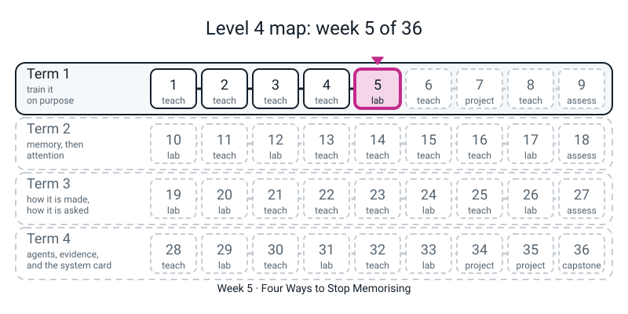
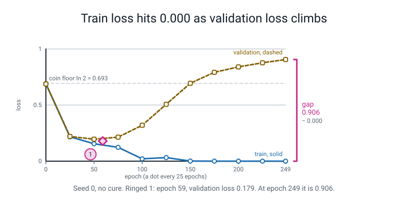
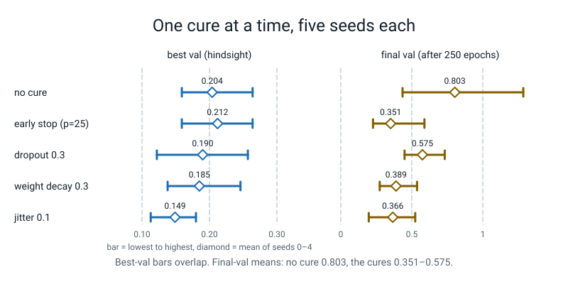

# Week 5 — Four Ways to Stop Memorising

[⬅ Week 4](week-04.md) · [Course Home](../README.md) · [Week 6 ➡](week-06.md) · [Student Guide](../student-guide/week-05.md) · [Workbook](../workbook/week-05.md)

---


*Figure 5.0 — Where this fits: week 5 of 36 sits in term 1, "train it on purpose"; the tiles still dashed are the weeks to come.*

## 📋 At a Glance

| | |
|---|---|
| **Duration** | 70 minutes |
| **Type** | 🟩 Lab — the first week where the student *manufactures a disease and then tests four cures on it* |
| **Big idea** | A network that is given too few examples does not fail by being bad at the training set. It fails by being **perfect** at it. Training loss keeps falling while validation loss turns round and climbs. Four different cures — stop early, drop units, shrink weights, jiggle the inputs — all pull the validation loss back down, and on this problem they land in roughly the same place. The cheapest one, early stopping, needs no change to the network at all. |
| **New vocabulary** | overfitting · memorise vs learn · validation loss · best epoch · patience · snapshot · dropout · weight decay · jitter · augmentation · label-preserving |
| **New maths** | **None.** (The ladder row for Week 5 is empty on purpose.) The only arithmetic is one multiplication by a number just under 1 (`1 − 0.003 × 0.3 = 0.9991`), done once, then done twice. Do **not** raise it to a power today; repeated multiplication is Week 10's idea and this week's 750-step figure is *observed*, not derived. See 🔢 below. |
| **New syntax** | `nn.Dropout(p)` · `copy.deepcopy(model.state_dict())` · `rng.normal(0, s, size=...)` · `torch.randperm(n, generator=g)` — four, the ladder maximum |
| **Dataset** | The two interleaved spirals, but **the noisier version and only 120 training points**: `get_data(600, 0.35, 1)` gives 840 train / 360 validation; the lesson keeps `Xtr[:120]` and the whole 360 for validation. Nothing is downloaded. |
| **Materials** | Paper · a calculator · printed workbook pages 5.1–5.5 · the Bug Log · a highlighter (for circling the best epoch) |
| **Tech needed** | Laptop with Python 3, numpy, torch, scikit-learn only for the optional digits extension. `l4lib/` importable (Prep step 1). **No new install. No network.** |
| **Prep time** | 20 minutes the night before · 5 minutes on the day |
| **Expected runtime** | `hook.py` about 1 second · `table.py` about 15 seconds · `jitter_sweep.py` about 15 seconds · everything else under 5 seconds each · `roll_digits.py` (optional) about 10 seconds |

> **⚠️ Watch out:** this is the first week where **four treatments compete and the honest answer is "about a tie, and here is why the tie is misleading".** The temptation is to crown a winner from one seed. Seed 0 says weight decay and jitter beat the rest; seeds 5–7 say they are all within 0.01. The teaching move of the week is reading **two columns that look alike and are not** — *best* validation loss and *final* validation loss — and knowing which one you would get to keep.

---

## 🎯 Lesson Objectives

By the end of the lesson the student can:

1. **Recognise overfitting from two numbers** — training loss near zero, validation loss far above it and rising — and say why "training loss is low" alone proves nothing.
2. **Run a training loop that keeps a snapshot** of the best weights (`copy.deepcopy(model.state_dict())`) and stops after `patience` epochs with no improvement, and say why the `deepcopy` is not optional.
3. **Switch dropout on and off correctly:** write `nn.Dropout(p)`, say what it does in `train()` mode and in `eval()` mode, and say what goes wrong if `model.eval()` is forgotten.
4. **Generate fresh jitter every epoch** with a seeded `rng.normal(0, s, size=...)` and `torch.randperm(n, generator=g)`, and say what "label-preserving" means for two spirals.
5. **Fill the four-column table** (best epoch, best validation loss, final validation loss, and *what you would ship*) for all four cures and the no-cure control, across more than one seed, and say which column tells the truth about the model you would deploy.

Observable evidence: a filled table with a stated number of seeds; the sentence *"the best epoch is only known afterwards, so the thing to keep is the snapshot"*; and a written answer to *"which column would I be allowed to brag about?"*.

---

## 🧑‍🏫 What YOU Need to Know First

Read this section once, slowly. It is about ten minutes. There is no calculus and no statistics beyond "do it five times and look at the spread".

### 1. Why this week exists

Weeks 1–4 turned the loop `w -= lr * grad` into a set of knobs for *how fast and in what direction the training loss falls*. Every one of them was judged on how low a number went. Nobody asked **which number**. Week 4's batch table left a loose thread: at equal steps, the big-batch rows had a *training* loss of 0.000 and a *validation* loss of 0.073 — a model that had seen the same 840 points 260 times and learned them by heart. Week 5 gives that a name and tests four cures.

A model that has **learned** has found something true about *all* spiral points. A model that has **memorised** has found something true about *these* 120 points, including their accidents (a point that landed on the wrong arm because the noise pushed it there). You cannot tell the two apart from training loss. You can tell them apart from **two numbers side by side**: loss on the points it trained on, and loss on points it has never seen. The second number is the validation loss.

Why 120 points? Because with 840 the network has little to memorise and the cures have nothing to cure (Week 7's sweep will show dropout and weight decay doing *nothing* at 840 points, and that is the honest result). The disease has to be manufactured first. The network has 16,962 parameters and the training set has 120 points; it can afford to remember every one.

> **🧑‍🏫 If you remember one sentence from this section:** *the four cures are four different answers to the same question — "how do I stop the network from fitting the accidents?" — and the right place to read whether they worked is the validation loss, never the training loss.*

### 2. 🧭 REAL vs STAND-IN — what everything this week is

| Thing on the screen | Real model or stand-in? |
|---|---|
| Every training run (`fit(...)` in `lab.py`) | **Real.** The Week 1 network (stem, four blocks, head; 16,962 parameters), trained for real on a CPU with AdamW, learning rate 0.003, batch 40, on 120 points. Seeded. |
| `nn.Dropout`, `AdamW(weight_decay=...)`, `copy.deepcopy` | **Real PyTorch / Python.** Nothing is simulated. |
| The jitter | **Real numpy noise**, drawn from a seeded generator. It is an *invented* extra training example, not new data — say so. |
| The "made-up" list of ten validation losses in `stopping.py` | **A made-up list of numbers on purpose**, so the rule can be done by hand. It is not from a run. It is labelled `made_up` in the code. |
| Any LLM, transformer, or API | **None this week.** Nothing here is a stand-in because nothing here is a language model. |

**What you must NOT claim.** Each of these is tempting after a lab like this, and each is false or unproven on what the student measures.

1. **"Dropout is the standard cure, so it should win."** Dropout 0.3 did *not* win here. Its best validation loss (five-seed mean 0.190) is a tie with the rest, and it is the **slowest to stop the climb**: its final validation loss (0.575) is far above weight decay's (0.389) and jitter's (0.366). At 840 points (Week 7) it does nothing. The claim that survives: *dropout slows the memorising; it did not improve the best point.*
2. **"Early stopping is free and always right."** It costs no change to the network, and the shipped model (the snapshot) is as good as the best epoch on the validation set. Two honest qualifications. (i) It *uses the validation set to choose*, so that one number is a little flattering; `honest.py` below splits the set to show it. (ii) `patience=25` stopped some seeds before a later dip: five-seed mean best validation loss is **0.212** with early stopping against **0.204** without. Cheap, not perfect.
3. **"Augmentation is the winner."** On seeds 0–4 jitter at 0.1 had the lowest mean best validation loss (**0.149**). On seeds 5–7 it did not (**0.159** against no-cure **0.154**). Do not crown it. What *is* supported: jitter's **final** validation loss is far lower than no-cure's on both sets of seeds (0.366 vs 0.803; 0.286 vs 0.914).
4. **"Weight decay of 0.3 is a sensible setting."** It is a large value picked because it works on this tiny problem. Typical values for AdamW are around 0.01–0.1. The lesson is the *mechanism*, not the number. (And `AdamW` with **no** `weight_decay=` argument is not "none": its default is 0.01. See silent mistake 5.)
5. **"Overfitting means the model is too big."** Size matters, but what the student measured is *size relative to the amount of data*. The same network does not overfit at 840 points.
6. **Anything about a language model.** A spiral classifier memorising 120 points says nothing about a large model's memorisation. Say: *"a toy result shows a mechanism, not a rate."*

> **Honest framing to say aloud, in your own words:** *"On these 120 points, with these seeds, this is what each cure did to the validation loss. The size of the differences is small compared with the spread between seeds, so I would not pick a winner from this table."*

### 3. 🔢 THE MATHS YOU NEED, TAUGHT TO YOU FIRST

The ladder adds no new mathematical idea this week. You need three small pieces of arithmetic, each by hand, so nothing on the screen is a surprise.

**A. A fee is a multiplication by a number just under 1.** Weight decay, in `AdamW`, is this and nothing more: at every step, before anything else, every weight is multiplied by `1 − lr × weight_decay`. With `lr = 0.003` and `weight_decay = 0.3`:

```
1 − 0.003 × 0.3  =  1 − 0.0009  =  0.9991
```

A weight of 1.0 becomes 0.9991 after one step. After two steps it is `0.9991 × 0.9991 = 0.9982` (to four places). That is the whole mechanism: a tiny shrink, every step, on every weight, whether or not the loss cares. Weights that the loss needs push back (their gradient wins); weights that only helped memorise an accident have nothing pushing back, so they drift towards zero. **Stop at two steps on the board.** `decay_demo.py` prints the step-10 and step-750 values (0.9910 and 0.5090); say "the loop did that, and the arithmetic for many steps is a Week 10 topic", and do not derive it.

**B. Dropout keeps a share and scales the survivors.** With `p = 0.5`, each unit is independently zeroed with probability one half; every survivor is multiplied by `1 / (1 − p) = 1 / 0.5 = 2`. So an input of ones becomes a mixture of zeros and twos, and *on average* it is still one: `0.5 × 2 + 0.5 × 0 = 1`. That scaling is the reason `model.eval()` can simply switch dropout off and the outputs stay the right size. Hand check for `p = 0.3`: survivors are multiplied by `1 / 0.7 = 1.4286`.

**C. "Patience" is a counter.** The rule (read it aloud, not as a formula): *keep the best value seen so far and the epoch it happened; after every epoch, if the best was `patience` or more epochs ago, stop.* With a list of ten made-up numbers it can be done with a pencil in two minutes. It is a counting rule, not a mathematical idea.

**And one piece of language, not maths: "label-preserving".** A jittered spiral point is a new example *only if its class is still true*. `gap_check.py` measures the room there is: among the 120 points, the *median* distance to the nearest point of the other class is about 0.57 in the standardised units the network sees, and one point in ten has a neighbour of the other class closer than 0.30. Noise of size 0.1 moves a point about 0.14 (two coordinates); noise of size 0.5 moves it about 0.7, which is more than the typical gap. `jitter_sweep.py` measures where that breaks. Ask the student, before showing the sweep: *"how big can the noise be before I am lying about the label?"*

### 4. Every new line of this week's code, explained to someone who has never seen it

**`nn.Dropout(p)`** — a layer with no weights. In `train()` mode it zeroes each incoming number with probability `p` and multiplies the rest by `1 / (1 − p)`. In `eval()` mode it does nothing at all (it passes the numbers through). The student never writes it directly in the lab: `make_model(dropout=0.3)` builds the network with a `Dropout` after every block's activation, which is the `Dropout(p=0.0, inplace=False)` lines the student saw in the Week 1 printout. Today those lines wake up. `dropout_demo.py` is the first time the student types `nn.Dropout` themselves.

**`copy.deepcopy(model.state_dict())`** — three things, read inside out. `model.state_dict()` is a dictionary from each layer's name to its tensor of weights. **It hands you the live tensors, not copies.** `copy.deepcopy(...)` makes a true, independent copy of the whole dictionary, including the tensors inside it. So: a snapshot that later training cannot overwrite. `alias_demo.py` shows it in six lines.

**`rng.normal(0, s, size=...)`** — draw random numbers from a bell curve centred on 0 with typical size `s`, using the seeded generator `rng = np.random.default_rng(seed)` the student has used since Level 3. `size=` takes a shape: `size=5` gives five numbers, `size=(2, 3)` a 2×3 grid, `size=Xs.shape` one number per coordinate of every training point. Two things to say: (i) the result is **float64**, and the network's weights are float32, so it has to be converted (`torch.tensor(noise, dtype=torch.float32)`); forgetting is deliberate error 2. (ii) `size=` must be a *shape*, not the array itself; passing the tensor is deliberate error 4.

**`torch.randperm(n, generator=g)`** — a shuffled list of the integers `0 … n−1`, drawn from a seeded generator `g = torch.Generator().manual_seed(seed)`. The student saw this line in Week 4 only inside a teacher-typed loop; today they type it. The `generator=` must be written as a keyword — `torch.randperm(120, g)` is deliberate error 3. The use: `order = torch.randperm(120, generator=g)` is this epoch's shuffled order; `order[0:40]` is batch 1, `order[40:80]` batch 2, `order[80:120]` batch 3. Nothing is dropped, because `120 // 40 = 3` exactly.

### 5. The lab protocol, in plain words

Everything the student runs this week is **one function, `fit`**, with four switches: `dropout`, `wd` (weight decay), `jitter`, and `patience` (early stopping). Everything else is identical: same 120 points, same 360 validation points, same network, same optimizer (AdamW, `lr=0.003`), batch 40 (so 3 steps per epoch, 750 in a 250-epoch run), same seed. **One switch per run** — the Week 1 rule. The table has five rows: the control and the four cures.

Three details to be ready to explain:

- **"Best val" is picked using the validation set.** The function remembers the lowest validation loss it ever saw and the epoch it happened. For a real deployment that number is optimistic; `honest.py` checks it against unseen points.
- **The early-stop row's "final val" is the loss at the epoch it *stopped*,** not what you would ship. What you would ship is the snapshot, whose validation loss is the "best val". So that row needs the extra column *shipped val*. This is where students get confused; see the answer key, Page 5.4.
- **The control's "final val" is what you get if you do nothing and just train for 250 epochs.** That is the number in the hook.

One note on numbers. The reference module (Module 1) reports `best val 0.199 @ epoch 85, final val 0.495` for this experiment. That used **batch 64 on 120 points, which is only one step per epoch over 64 of the 120 points** (`120 // 64 = 1`, a Week 4 callback). It reproduces exactly: `fit(batch=64)` prints `85 0.199 0.495` (Prep step 9). Today's lab uses batch 40 so that every point is used every epoch; its numbers differ for that reason, not because either is wrong.

### 6. The three misconceptions you will actually meet

1. **"Lower training loss is better."** The hook kills this: the final training loss is 0.000 and the model is at its worst. Keep the question *"compared with what?"* ready.
2. **"Dropout at validation time should still be on, to be consistent."** No: it is noise injected on purpose to make *training* harder. `twice.py` shows what happens if it stays on: the same model, on the same data, gives two different losses. A measuring instrument that gives a different answer each time is not an instrument.
3. **"Augmentation is cheating because it makes up data."** It makes up *inputs*, not labels, and only inputs whose label is still true. It is the only one of the four that tells the network something new about the world ("these two points are the same, really"). The honest limit is in the optional `roll_digits.py`: a label-preserving change that the real test data never contains can make things *worse*.

### 7. How deep to go, and where to stop

Go as far as: *"training loss and validation loss can part company; four cheap ways to narrow the gap; one of them needs no change to the network; I read the table by what I could ship."* Stop before: why dropout works (co-adaptation stories are plausible and mostly untested at this size), the L2-penalty-versus-decoupled-decay distinction (Week 3 touched it; do not reopen it), Bayesian readings of weight decay, double descent, and cross-validation. If the student asks about any, the answer is *"good question, not measured yet, write it in the Bug Log's 'later' column."*

### 8. 🧭 Where this fits (text version — the figure pass comes later)

```
 TERM 1 — THE TEN KNOBS
 W1  learning rate, one at a time            ✔ done
 W2  momentum  (running average)             ✔ done
 W3  Adam / AdamW  (per-knob step size)      ✔ done
 W4  schedule + batch size                   ✔ done   (its 0.000-train rows were the overfitting)
 W5  four ways to stop memorising            ◀ you are here
 W6  normalisation, residuals, clipping      next: a different kind of problem
 W7  the sweep (all knobs, one grid)         dropout and weight decay return here, at 840 points
```

Two minutes at the end of the lesson: ask *"which of the four cures changed the network, which changed the data, and which changed neither?"* (Dropout and weight decay change how the network trains; jitter changes the data; early stopping changes nothing — it chooses *when* to look.)

---

## 🧰 Prep Checklist

### 20 minutes the night before

**1. (3 min) Make `l4lib` importable and check the data.** `l4lib/` sits inside `36-week-course/`. Python only finds it if that folder is on the path.

```bash
# from inside the 36-week-course folder, once per terminal:
export PYTHONPATH="$PWD"
python3 -c "import torch, numpy; print(torch.__version__, numpy.__version__)"
```

You want a torch version and a numpy version. The numbers in this guide were produced with torch 2.2.1 and numpy 1.26.4 on a CPU, one thread. A different torch build may differ in the last digit of a loss; see "If a number does not match" below.

**2. (3 min) Create `lab.py` and run its checks.** This is the file the student will build in the Live-Code segment, in pieces. Everything else this week imports it. Type it exactly, or copy it.

```python
# lab.py
import copy
import numpy as np
import torch
import torch.nn as nn
from l4lib.spirals import get_data, make_model

torch.set_num_threads(1)

Xtr, ytr, Xva, yva = get_data(600, 0.35, 1)      # the noisier spirals, seed 1
Xs, ys = Xtr[:120], ytr[:120]                    # ONLY 120 training points

def fit(*, dropout=0.0, wd=0.0, jitter=0.0, epochs=250, patience=None, batch=40, seed=0):
    torch.manual_seed(seed)
    rng = np.random.default_rng(seed)
    g = torch.Generator().manual_seed(seed)
    model = make_model(dropout=dropout)
    opt = torch.optim.AdamW(model.parameters(), lr=3e-3, weight_decay=wd)
    lossf = nn.CrossEntropyLoss()
    train_hist, val_hist = [], []
    best_val, best_ep, best_state, stopped_at = float("inf"), -1, None, None
    for ep in range(epochs):
        model.train()
        order = torch.randperm(len(Xs), generator=g)
        X = Xs
        if jitter > 0:
            noise = rng.normal(0, jitter, size=Xs.shape)
            X = Xs + torch.tensor(noise, dtype=torch.float32)
        total = 0.0
        for i in range(len(Xs) // batch):
            idx = order[i * batch:(i + 1) * batch]
            loss = lossf(model(X[idx]), ys[idx])
            opt.zero_grad(set_to_none=True)
            loss.backward()
            opt.step()
            total += loss.item()
        model.eval()
        with torch.no_grad():
            val = lossf(model(Xva), yva).item()
        train_hist.append(total / (len(Xs) // batch))
        val_hist.append(val)
        if val < best_val:
            best_val, best_ep = val, ep
            best_state = copy.deepcopy(model.state_dict())
        if patience is not None and ep - best_ep >= patience:
            stopped_at = ep
            break
    return {"train": train_hist, "val": val_hist, "best_val": best_val, "best_ep": best_ep,
            "best_state": best_state, "stopped_at": stopped_at, "model": model}
```

```python
# checks.py
from lab import *
print(Xs.shape, ys.shape, Xva.shape, yva.shape)
print("class balance in the 120:", ys.float().mean().item())
print("parameters:", sum(p.numel() for p in make_model().parameters()))
print("steps per epoch:", len(Xs) // 40, "  steps in 250 epochs:", 250 * (len(Xs) // 40))
import torch
print(torch.__version__, np.__version__)
```

```text
torch.Size([120, 2]) torch.Size([120]) torch.Size([360, 2]) torch.Size([360])
class balance in the 120: 0.550000011920929
parameters: 16962
steps per epoch: 3   steps in 250 epochs: 750
2.2.1 1.26.4
```

Read the five lines: the 120 points are a 120 × 2 tensor; the 360 validation points are separate; **55% of the 120 are class 1**, so a model that always says "class 1" scores 55% on these points (a different baseline from Week 4's 46.9%, because the data are different); the network has 16,962 parameters, which is 141 per training point; 3 steps per epoch, 750 in a full run.

**3. (2 min) Run the hook.** This is minute 1 of the lesson.

```python
# hook.py
from lab import *

h = fit(seed=0)                      # no cure at all
print(" epoch   train    val")
for ep in list(range(0, 250, 25)) + [249]:
    bar = "#" * int(40 * min(1.0, h["val"][ep]))
    print(f"{ep:>6}   {h['train'][ep]:.3f}   {h['val'][ep]:.3f}  {bar}")
print()
print(f"best val {h['best_val']:.3f} at epoch {h['best_ep']}")
print(f"final val {h['val'][-1]:.3f}   final train {h['train'][-1]:.3f}")
print(f"gap (val - train) at the best epoch: {h['val'][h['best_ep']] - h['train'][h['best_ep']]:.3f}")
print(f"gap (val - train) at the end:        {h['val'][-1] - h['train'][-1]:.3f}")
```

```text
 epoch   train    val
     0   0.691   0.688  ###########################
    25   0.217   0.220  ########
    50   0.155   0.196  #######
    75   0.123   0.214  ########
   100   0.021   0.320  ############
   125   0.032   0.507  ####################
   150   0.001   0.694  ###########################
   175   0.000   0.792  ###############################
   200   0.000   0.840  #################################
   225   0.000   0.877  ###################################
   249   0.000   0.906  ####################################

best val 0.179 at epoch 59
final val 0.906   final train 0.000
gap (val - train) at the best epoch: 0.089
gap (val - train) at the end:        0.906
```

Look at it before class and decide which row you will point at. The important shape: **training loss falls to exactly 0.000 and stays there; validation loss bottoms out near epoch 59 at 0.179, then climbs to 0.906.** The last line of the bar chart is five times as long as the fifty-epoch line.

**4. (2 min) Run the four tiny syntax demos.** One file per new construct, each under a second, each the thing the student will type.

```python
# dropout_demo.py
import torch
import torch.nn as nn

torch.manual_seed(0)
drop = nn.Dropout(0.5)
x = torch.ones(10)

drop.train()
print("train mode:", drop(x))
print("train mode:", drop(x))
drop.eval()
print("eval mode: ", drop(x))

# the share that survives, over many draws
drop.train()
big = torch.ones(100000)
out = drop(big)
print("share kept:", (out != 0).float().mean().item())
print("value of a survivor:", out.max().item())
print("average of the output:", out.mean().item())
```

```text
train mode: tensor([0., 0., 2., 0., 0., 0., 2., 2., 0., 2.])
train mode: tensor([2., 2., 2., 0., 2., 2., 2., 2., 0., 0.])
eval mode:  tensor([1., 1., 1., 1., 1., 1., 1., 1., 1., 1.])
share kept: 0.49924999475479126
value of a survivor: 2.0
average of the output: 0.9984999895095825
```

(The exact pattern of zeros and twos is seeded; yours will match. The three facts are what matter: survivors are **2.0**, about half survive, and `eval()` returns all ones.)

```python
# alias_demo.py
import copy
import torch
import torch.nn as nn

torch.manual_seed(0)
lin = nn.Linear(1, 1, bias=False)
alias = lin.state_dict()                   # NOT a copy
snap = copy.deepcopy(lin.state_dict())     # a real copy
print("before training:  alias", round(alias["weight"].item(), 4), "  snapshot", round(snap["weight"].item(), 4))

opt = torch.optim.SGD(lin.parameters(), lr=0.5)
loss = (lin(torch.tensor([[2.0]])) - 10.0) ** 2
loss.backward()
opt.step()
print("after one step:   alias", round(alias["weight"].item(), 4), "  snapshot", round(snap["weight"].item(), 4))
print("live weight now:", round(lin.weight.item(), 4))
```

```text
before training:  alias -0.0075   snapshot -0.0075
after one step:   alias 20.0225   snapshot -0.0075
live weight now: 20.0225
```

**This is the demonstration of why `deepcopy` is not optional.** `alias` is `lin.state_dict()` taken with no copy; `snap` is the deep copy. One training step later the alias has moved to 20.0225 *with* the live weight, and the snapshot still holds −0.0075. (Here the squared error `(2w − 10)²` has slope `−40` at this start, so one step at `lr = 0.5` jumps a long way; the size is not the point.)

```python
# jitter_demo.py
import numpy as np
import torch

rng = np.random.default_rng(0)
print(rng.normal(0, 0.1, size=5))
print(rng.normal(0, 0.1, size=(2, 3)))

rng = np.random.default_rng(0)
noise = rng.normal(0, 0.3, size=100000)
print("mean", round(noise.mean(), 4), " spread", round(noise.std(), 4))

from lab import Xs
rng = np.random.default_rng(0)
jittered = Xs + torch.tensor(rng.normal(0, 0.1, size=Xs.shape), dtype=torch.float32)
print(Xs[:3])
print(jittered[:3])
print("biggest move of any coordinate:", (jittered - Xs).abs().max().item())
```

```text
[ 0.01257302 -0.01321049  0.06404227  0.01049001 -0.05356694]
[[ 0.03615951  0.1304      0.0947081 ]
 [-0.07037352 -0.12654215 -0.06232745]]
mean -0.0003  spread 0.3
tensor([[ 0.1602, -1.4562],
        [-0.8742,  0.0270],
        [ 1.8985, -0.9444]])
tensor([[ 0.1728, -1.4694],
        [-0.8102,  0.0375],
        [ 1.8450, -0.9082]])
biggest move of any coordinate: 0.31063368916511536
```

The two 5-number and 2×3 lines show what `size=` means. The last block: each coordinate of each point moved by a tenth or less, biggest move 0.31 across all 240 coordinates (three times the noise size, about what the largest of 240 draws looks like).

```python
# decay_demo.py
import torch
import torch.nn as nn

# One weight, a gradient of exactly zero, so ONLY the decay acts.
for wd in [0.0, 0.3]:
    w = nn.Parameter(torch.tensor([1.0]))
    opt = torch.optim.AdamW([w], lr=0.003, weight_decay=wd)
    for step in range(1, 751):
        w.grad = torch.zeros(1)
        opt.step()
        if step in (1, 2, 10, 750):
            print(f"wd {wd}  after {step:>3} steps: w = {w.item():.4f}")

fee = 1 - 0.003 * 0.3
print("by hand, one step:  1 - 0.003 * 0.3 =", round(fee, 4))
print("by hand, two steps: that times itself =", round(fee * fee, 4))
```

```text
wd 0.0  after   1 steps: w = 1.0000
wd 0.0  after   2 steps: w = 1.0000
wd 0.0  after  10 steps: w = 1.0000
wd 0.0  after 750 steps: w = 1.0000
wd 0.3  after   1 steps: w = 0.9991
wd 0.3  after   2 steps: w = 0.9982
wd 0.3  after  10 steps: w = 0.9910
wd 0.3  after 750 steps: w = 0.5090
by hand, one step:  1 - 0.003 * 0.3 = 0.9991
by hand, two steps: that times itself = 0.9982
```

**5. (3 min) Run the early-stopping rule.** First on ten made-up numbers (do these by hand too, for Page 5.3), then on the real curve.

```python
# patience.py
def when_to_stop(val_losses, patience):
    """Return (best_epoch, stop_epoch). stop_epoch is None if the run never stops."""
    best_val, best_ep = float("inf"), -1
    for ep, v in enumerate(val_losses):
        if v < best_val:
            best_val, best_ep = v, ep
        if ep - best_ep >= patience:
            return best_ep, ep
    return best_ep, None
```

```python
# stopping.py
from patience import when_to_stop

made_up = [0.70, 0.40, 0.30, 0.25, 0.26, 0.24, 0.27, 0.28, 0.29, 0.30]
print(when_to_stop(made_up, patience=3))
print(when_to_stop(made_up, patience=5))
print(when_to_stop(made_up, patience=1))

from lab import *
h = fit(seed=0)
print(when_to_stop(h["val"], patience=25))
print(when_to_stop(h["val"], patience=10))
print(when_to_stop(h["val"], patience=5))
```

```text
(5, 8)
(5, None)
(3, 4)
(59, 84)
(24, 34)
(24, 29)
```

Reading it: on the made-up list the best is epoch 5 (0.24); with `patience=3` the rule stops at epoch 8; with `patience=5` the list ends first (`None`: never stops); with `patience=1` it stops at epoch 4 and has only seen the best as epoch 3 (0.25), **missing the 0.24 that was one epoch away**. On the real curve: `patience=25` stops at epoch 84 having kept epoch 59; smaller patience stops sooner, with the *same* best epoch (24) for both 10 and 5 — a near-miss that is a good conversation: **a small patience can stop in a shallow dip before the real bottom.** (Here it stops at 34 and 29 with best epoch 24; the global best, epoch 59, is never reached.)

**6. (3 min) Run the table.** The lab's main result, and the thing to have in your head before class. About 15 seconds.

```python
# table.py
from lab import *

cures = [
    ("no cure",           lambda s: fit(seed=s)),
    ("early stop (p=25)", lambda s: fit(seed=s, patience=25)),
    ("dropout 0.3",       lambda s: fit(seed=s, dropout=0.3)),
    ("weight decay 0.3",  lambda s: fit(seed=s, wd=0.3)),
    ("jitter 0.1",        lambda s: fit(seed=s, jitter=0.1)),
]

print("SEED 0")
print(f"{'cure':<18} {'best epoch':>10} {'best val':>9} {'final val':>10} {'final train':>12}")
for name, go in cures:
    h = go(0)
    print(f"{name:<18} {h['best_ep']:>10} {h['best_val']:>9.3f} {h['val'][-1]:>10.3f} {h['train'][-1]:>12.3f}")

print()
print("FIVE SEEDS (0-4): mean +- spread (lowest .. highest)")
print(f"{'cure':<18} {'best val':>26} {'final val':>26}")
for name, go in cures:
    hs = [go(s) for s in range(5)]
    b = np.array([h["best_val"] for h in hs])
    f = np.array([h["val"][-1] for h in hs])
    print(f"{name:<18} {b.mean():>8.3f} ({b.min():.3f} .. {b.max():.3f})   {f.mean():>8.3f} ({f.min():.3f} .. {f.max():.3f})")
```

```text
SEED 0
cure               best epoch  best val  final val  final train
no cure                    59     0.179      0.906        0.000
early stop (p=25)          59     0.179      0.227        0.053
dropout 0.3                70     0.201      0.634        0.100
weight decay 0.3           61     0.140      0.274        0.053
jitter 0.1                 81     0.130      0.318        0.061

FIVE SEEDS (0-4): mean +- spread (lowest .. highest)
cure                                 best val                  final val
no cure               0.204 (0.159 .. 0.264)      0.803 (0.435 .. 1.285)
early stop (p=25)     0.212 (0.159 .. 0.264)      0.351 (0.227 .. 0.589)
dropout 0.3           0.190 (0.122 .. 0.257)      0.575 (0.449 .. 0.732)
weight decay 0.3      0.185 (0.138 .. 0.246)      0.389 (0.274 .. 0.537)
jitter 0.1            0.149 (0.113 .. 0.180)      0.366 (0.197 .. 0.524)
```

How to read it (you will say this in the lesson, slowly):

- **Best epoch** and **best val** are *picked with hindsight*. They say how low the curve went, not what you would have ended with.
- **Final val** is what you get if you run all 250 epochs and keep the last model. For the control it is **0.906**; nothing changed except that the run was not stopped.
- **Early stop (p=25)** repeats the control's best epoch and best value (59, 0.179) — it is the *same run*, stopped at epoch 84 — and its "final val" **0.227** is the loss at the moment it stopped, not what you ship. **What you ship is the snapshot: 0.179.**
- **Five seeds:** the ranges overlap for every "best val" (0.113 to 0.264 across cures). The *final val* column separates the cures much more: 0.803 (do nothing) · 0.575 (dropout) · 0.389 (weight decay) · 0.366 (jitter), against 0.351 for the early-stop row *at the stop*, and **0.212** for what the early-stop snapshot is worth.

**7. (2 min) Run the sweep of the jitter size and the gap check.** You will use the sweep in the "harder" variation; `gap_check.py` is **teacher-only** (it uses `cdist`, `masked_fill` and `quantile`, which the student has not met).

```python
# gap_check.py
from lab import *

dist = torch.cdist(Xs, Xs)                        # distance from every point to every point
same_class = ys[:, None] == ys[None, :]
to_other = dist.masked_fill(same_class, 1e9).min(1).values   # nearest point of the OTHER class
print("median gap to the other class:", round(to_other.median().item(), 3))
print("one point in ten is closer than:", round(to_other.quantile(0.1).item(), 3))
for s in [0.1, 0.2, 0.5]:
    print(f"noise {s}: a typical point moves about {s * 2 ** 0.5:.2f}")
```

```text
median gap to the other class: 0.569
one point in ten is closer than: 0.304
noise 0.1: a typical point moves about 0.14
noise 0.2: a typical point moves about 0.28
noise 0.5: a typical point moves about 0.71
```

```python
# jitter_sweep.py
from lab import *

print(f"{'jitter s':>9} {'best val':>26} {'final val':>26}")
for s in [0.0, 0.05, 0.1, 0.2, 0.3, 0.5]:
    hs = [fit(seed=k, jitter=s) for k in range(5)]
    b = np.array([h["best_val"] for h in hs])
    f = np.array([h["val"][-1] for h in hs])
    print(f"{s:>9} {b.mean():>8.3f} ({b.min():.3f} .. {b.max():.3f})   {f.mean():>8.3f} ({f.min():.3f} .. {f.max():.3f})")
```

```text
 jitter s                   best val                  final val
      0.0    0.204 (0.159 .. 0.264)      0.803 (0.435 .. 1.285)
     0.05    0.187 (0.159 .. 0.214)      0.609 (0.324 .. 1.049)
      0.1    0.149 (0.113 .. 0.180)      0.366 (0.197 .. 0.524)
      0.2    0.139 (0.127 .. 0.147)      0.192 (0.130 .. 0.235)
      0.3    0.193 (0.181 .. 0.207)      0.249 (0.224 .. 0.295)
      0.5    0.337 (0.309 .. 0.361)      0.416 (0.337 .. 0.443)
```

The shape to notice: a **U**. No jitter: final 0.803. Jitter 0.2: best mean 0.139 and final 0.192. Jitter 0.5: both 0.337 and 0.416 — worse than nothing on best val, because the noise is now larger than the typical gap to the other class (0.57 median; noise of 0.5 moves a point about 0.71). *More of a good thing stopped being good.* The 0.2 row has the smallest spread of any row in the week (0.127 to 0.147 for best val).

**8. (2 min) Run the two measurements that go with the misconceptions.**

```python
# twice.py
from lab import *
h = fit(dropout=0.3, seed=0, epochs=100)
model = h["model"]
lossf = nn.CrossEntropyLoss()
with torch.no_grad():
    model.train()
    print("train mode, same data, twice:", round(lossf(model(Xva), yva).item(), 4), round(lossf(model(Xva), yva).item(), 4))
    model.eval()
    print("eval mode,  same data, twice:", round(lossf(model(Xva), yva).item(), 4), round(lossf(model(Xva), yva).item(), 4))
```

```text
train mode, same data, twice: 0.3621 0.3263
eval mode,  same data, twice: 0.2807 0.2807
```

```python
# weightsize.py
from lab import *

def total_size(model):
    return sum(p.abs().sum().item() for p in model.parameters())

for name, kw in [("no cure", {}), ("weight decay 0.3", dict(wd=0.3))]:
    h = fit(seed=0, **kw)
    print(f"{name:<18} sum of |weights| = {total_size(h['model']):.1f}   final val {h['val'][-1]:.3f}")
```

```text
no cure            sum of |weights| = 1584.2   final val 0.906
weight decay 0.3   sum of |weights| = 1152.9   final val 0.274
```

In `twice.py` the same model on the same 360 points in train mode gives two different losses; in eval mode, the same loss twice. In `weightsize.py` the weight-decay model has a smaller total weight (1152.9 against 1584.2 — about 27% less), which is the "fee" showing up in the weights.

**9. (1 min) Confirm you can reproduce the module's number.**

```bash
python3 -c "from lab import *; h = fit(batch=64); print(h['best_ep'], round(h['best_val'], 3), round(h['val'][-1], 3))"
```

Expected: `85 0.199 0.495`. This matches the reference module to all printed digits; it is the check that `l4lib` and your torch agree with the ledger.

### Two more scripts to have run (optional; both used in the answer key or the variations)

```python
# honest.py
from lab import *
# Pick the stopping epoch on HALF of the validation set, report on the OTHER half.
pick_X, pick_y = Xva[:180], yva[:180]
test_X, test_y = Xva[180:], yva[180:]
lossf = nn.CrossEntropyLoss()

def one_run(seed):
    torch.manual_seed(seed)
    g = torch.Generator().manual_seed(seed)
    model = make_model()
    opt = torch.optim.AdamW(model.parameters(), lr=3e-3)
    best, best_state = float("inf"), None
    for ep in range(250):
        model.train()
        order = torch.randperm(len(Xs), generator=g)
        for i in range(3):
            idx = order[i * 40:(i + 1) * 40]
            loss = lossf(model(Xs[idx]), ys[idx])
            opt.zero_grad(set_to_none=True); loss.backward(); opt.step()
        model.eval()
        with torch.no_grad():
            v = lossf(model(pick_X), pick_y).item()
        if v < best:
            best, best_state = v, copy.deepcopy(model.state_dict())
    with torch.no_grad():
        t_best = lossf(model_from(best_state)(test_X), test_y).item()
        t_final = lossf(model(test_X), test_y).item()
    return best, t_best, t_final

def model_from(state):
    m = make_model(); m.load_state_dict(state); m.eval(); return m

print("seed  picked-on-half-A  same-model-on-half-B  final-model-on-half-B")
for seed in range(5):
    a, b, c = one_run(seed)
    print(f"{seed:>4}  {a:>16.3f}  {b:>20.3f}  {c:>21.3f}")
```

```text
seed  picked-on-half-A  same-model-on-half-B  final-model-on-half-B
   0             0.224                 0.139                  0.523
   1             0.167                 0.155                  0.334
   2             0.154                 0.098                  0.386
   3             0.270                 0.157                  0.403
   4             0.314                 0.164                  0.683
```

Read this honestly: on these 180-point halves the epoch chosen on half A gives a loss on half B that is *lower* than on half A (0.139 against 0.224 on seed 0; the same direction on every seed). Half B is simply an easier half. **Picking the epoch on the validation set did not visibly inflate the number here**, but the two halves disagree with each other by more than any difference between the cures, which is a good reminder of what 180 points can and cannot settle. Do not conclude "selecting on validation is harmless"; conclude "we did not detect a problem, with this little data".

```python
# combos.py
from lab import *
combos = [
    ("no cure",                  lambda s: fit(seed=s)),
    ("jitter 0.2",               lambda s: fit(seed=s, jitter=0.2)),
    ("jitter 0.2 + wd 0.3",      lambda s: fit(seed=s, jitter=0.2, wd=0.3)),
    ("jitter 0.2 + dropout 0.3", lambda s: fit(seed=s, jitter=0.2, dropout=0.3)),
    ("all three",                lambda s: fit(seed=s, jitter=0.2, wd=0.3, dropout=0.3)),
]
print(f"{'combination':<26} {'best val':>26} {'final val':>26}")
for name, go in combos:
    hs = [go(s) for s in range(5)]
    b = np.array([h["best_val"] for h in hs]); f = np.array([h["val"][-1] for h in hs])
    print(f"{name:<26} {b.mean():>8.3f} ({b.min():.3f} .. {b.max():.3f})   {f.mean():>8.3f} ({f.min():.3f} .. {f.max():.3f})")
```

```text
combination                                  best val                  final val
no cure                       0.204 (0.159 .. 0.264)      0.803 (0.435 .. 1.285)
jitter 0.2                    0.139 (0.127 .. 0.147)      0.192 (0.130 .. 0.235)
jitter 0.2 + wd 0.3           0.145 (0.137 .. 0.151)      0.203 (0.137 .. 0.262)
jitter 0.2 + dropout 0.3      0.155 (0.148 .. 0.165)      0.188 (0.148 .. 0.221)
all three                     0.178 (0.171 .. 0.192)      0.231 (0.177 .. 0.303)
```

The combinations do *not* add up: jitter alone (0.139 best, 0.192 final) is at least as good as jitter plus anything. Three cures together is worst of the four treated rows on best val (0.178). *Cures can get in each other's way.* This is the harder-variation discovery.

### 5 minutes on the day

- Open a terminal in the folder with `l4lib` importable (`echo $PYTHONPATH`) and `lab.py` in the working folder.
- Run `python3 hook.py` once so you know it works.
- Write on the board, large, and leave it up: `train loss  vs  val loss` with a vertical line between them.
- Put the workbook pages 5.1–5.5 and a highlighter on the desk. Have a calculator ready for `1 − 0.003 × 0.3`.

### If a number does not match this guide

1. Is `torch.set_num_threads(1)` at the top of `lab.py`, and is the seed set? (`fit` seeds `torch`, the shuffle generator and numpy's generator from its one `seed=` argument.)
2. Which torch version? Compare in the last digit only. A loss that differs in the **third** decimal on a *single seed* is within what a different torch build does; compare the five-seed *mean*, the *ordering* and the *shape* (down, then up) instead.
3. Is it `get_data(600, 0.35, 1)`? The default `get_data()` is the gentler 0.22-noise data from Weeks 1–4 and will give lower numbers and far less overfitting. Prep step 2's first line should read `torch.Size([120, 2]) ...`.
4. If it still disagrees: use the number *on your screen*, never the one in this guide, and tell the student why. (The Level 4 rule: any number a student writes in a report must have been printed by their own run, with a seed, in the last 24 hours.)

### Fallback if the laptops fail

| If this fails | Do this instead |
|---|---|
| `ModuleNotFoundError: No module named 'l4lib'` | `PYTHONPATH` is not set in this terminal. Re-run the `export` in Prep step 1 from the `36-week-course` folder. Do not debug for more than two minutes; do the by-hand pages (Workbook 5.2 and 5.3) first, they need no computer. |
| `torch` will not import | The lesson's core is one printed curve and one table. Use the printed hook and table in this guide as "data from my laptop at home" and say so out loud. The early-stopping hand trace (Page 5.3) and the weight-fee arithmetic need only paper. |
| `table.py` is too slow | Run only the seed-0 block (first 7 lines). Say "one seed" out loud and do not let the student write a verdict. |
| Projector fails | Read numbers aloud and have the student write them. This lesson is a table-filling lesson. |

---

## ⏱️ The Lesson, Minute by Minute

| Segment | Minutes | Running total | What happens |
|---|---|---|---|
| 🪝 Hook — The Curve That Turns Round | 8 | 8 | Run `hook.py`. Training loss reaches 0.000; validation loss bottoms at 0.179 and ends at 0.906. "Where would you have stopped?" |
| 🧠 Concept & Maths — Four Answers to One Question | 15 | 23 | Memorise vs learn; the fee `0.9991`; dropout ×2; patience by hand; "is the label still true?" |
| 💻 Live-Code Together — `lab.py`, in pieces, and two mistakes | 17 | 40 | Build the loop; add the snapshot; wake dropout; add jitter; break it twice on purpose |
| 🎲 Their Turn — The Four-Cure Table | 23 | 63 | Run `table.py`-style rows; fill best-epoch, best-val, final-val, shipped-val; argue which column is honest |
| 🔑 Wrap & Assign | 7 | 70 | Five sentences, the ranges-overlap counter-check, homework |

---

### 🪝 Hook — The Curve That Turns Round (8 minutes)

**Do this:** Write on the board:

```
120 training points · 360 validation points the network never trains on
same network as Weeks 1-4 · AdamW · lr 0.003 · 250 epochs · NO cure
I will print the loss on both sets every 25 epochs.
```

> **Say this:** "Up to now we only watched one number go down. Today I'm going to watch two. The first is the loss on the 120 points the network trains on. The second is the loss on 360 points it never sees. Before I run it, write down two things: what you think the training loss ends at after 250 epochs, and whether the validation loss will end lower than, the same as, or higher than where it started getting good."

Let them write two guesses. **Do this:** Run `hook.py` (about 1 second).

**Output they should see** (Prep step 3):

```text
 epoch   train    val
     0   0.691   0.688  ###########################
    25   0.217   0.220  ########
    50   0.155   0.196  #######
    75   0.123   0.214  ########
   100   0.021   0.320  ############
   125   0.032   0.507  ####################
   150   0.001   0.694  ###########################
   175   0.000   0.792  ###############################
   200   0.000   0.840  #################################
   225   0.000   0.877  ###################################
   249   0.000   0.906  ####################################

best val 0.179 at epoch 59
final val 0.906   final train 0.000
gap (val - train) at the best epoch: 0.089
gap (val - train) at the end:        0.906
```

**Ask this:**

| Ask | Answer you want | If they say something else |
|---|---|---|
| "What is the training loss doing?" | Falling, and ending at `0.000`. The network has fit the 120 points perfectly. | If they say "it's working": agree it is working at *that job*, and move to the next question. |
| "What is the validation loss doing?" | Falls to about 0.18–0.20, bottoms out around epoch 50–60, then **climbs** to 0.906. | If they read only the last row: ask "and at row 50?" |
| "At epoch 0 both losses are about 0.69. Why?" | `ln 2`. The Week 1 coin: two classes, a network that knows nothing. (0.691 and 0.688.) | If they have forgotten, this is a two-second reminder, not a lecture. |
| "If I handed you the model from epoch 249, would you be happy?" | No: 0.906 is worse than the coin's 0.693. It is **worse than knowing nothing.** | If they say "it's still 90%-ish accurate": the *loss* measures confidence too; it is confidently wrong on some points. Do not go further today. |
| "Where would you have stopped the training if you could?" | Around epoch 50–60, where validation loss is lowest. | Highlight the 0.196 row. The exact best (epoch 59, 0.179) is printed in the last block. |

> **Say this:** "The network didn't get worse at its job. Its job was to make the training loss small, and it succeeded perfectly: 0.000. The trouble is that it did that by learning things that are only true of these 120 points. We call that **memorising**, and the trouble has a name: **overfitting**. The two numbers side by side are the only way you can see it. Today has four cures and one question: which number do I believe?"

**Do not** explain any cure yet. Write the name *overfitting* and its definition on the board: *training loss low, validation loss high and rising*.


*Figure 5.1 — Training loss reaching 0.000 does not mean the model is good: validation loss turned upward after epoch 59.*

---

### 🧠 Concept & Maths — Four Answers to One Question (15 minutes)

**Do this:** Draw the picture from the hook on the board (ASCII is fine, the figure pass will replace it):

```
loss
 ▲
 │ ╲
 │  ╲            val  . . . . . . . . . . . . .•••••••••   climbing = memorising
 │   ╲. . . . • •
 │    ••••••
 │      ╲____________________________________________ train   (reaches 0.000)
 └──────────┴──────────────────────────────────────────▶ epoch
           ~59
      best val 0.179                               final val 0.906
```

> **Say this:** "Four ideas, one sentence each. **Early stopping:** keep a copy of the model at the best moment and stop when it stops improving. **Dropout:** while training, randomly switch off some of the network's numbers so that it cannot rely on any one of them. **Weight decay:** every step, make every weight a tiny bit smaller, so only weights that keep earning their place stay big. **Augmentation:** make extra training points by nudging the ones you have, as long as the label is still true. Pick one and tell me which you think will do best. Write it down."

Record their pick (it is the Bug Log's prediction column).

**Part 1 — the fee (3 minutes). Do this:** On the board:

```
every step:   w  ←  w × (1 − lr × wd)          lr = 0.003,  wd = 0.3

1 − 0.003 × 0.3  =  ?
```

The student uses the calculator: **0.9991**. Then: "A weight of 1.0 after one step?" (0.9991.) "After two steps?" (0.9991 × 0.9991 = 0.9982, to four places.) Stop there.

> **Say this:** "That is weight decay. It is a fee, taken from every weight, every step. A weight that is helping the loss gets pushed back up by the gradient; a weight that only helped the network remember an accident has nothing pushing back, so the fee wins. I'll show you the loop doing this for 750 steps in a moment; you do not need to work out 750 steps, only to believe that it keeps shrinking."

Run `decay_demo.py` (Prep step 4, last script, under 1 second). Point at the four `wd 0.3` rows: 0.9991, 0.9982, 0.9910, 0.5090. "Half its size after 750 steps, with no gradient to fight it."

**Part 2 — dropout (4 minutes). Do this:** Run `dropout_demo.py`. Ask before the second line appears: *"the input is ten ones. What do you expect out?"* Let them guess. Show the output (Prep step 4).

**Ask this:**

| Ask | Answer you want | If they say something else |
|---|---|---|
| "Why are the survivors 2, not 1?" | Half were removed, so the rest are doubled to keep the *average* at 1. `1 / (1 − 0.5) = 2`. | If they say "random": point at the printed average 0.9985 ≈ 1. |
| "What does `eval` mode return?" | All ones. Nothing is dropped and nothing is doubled. | If they say "zeros": re-read the `eval` line aloud. |
| "What would happen if I measured the validation loss with dropout still on?" | Different numbers every time I asked. (`twice.py` shows it: 0.3621 then 0.3263.) | Do not run `twice.py` now; it comes in the clinic. |

**Part 3 — patience, by hand (4 minutes). Do this:** Write the ten made-up numbers on the board:

```
epoch:  0     1     2     3     4     5     6     7     8     9
val:   0.70  0.40  0.30  0.25  0.26  0.24  0.27  0.28  0.29  0.30
```

> **Say this:** "The rule: remember the lowest number so far and its epoch. After each epoch, ask: 'was the lowest `patience` or more epochs ago?' If yes, stop. Set `patience` to 3. Walk along the list with your finger and tell me where you stop."

The student walks: best moves to epoch 3 (0.25), epoch 4 is 1 after, epoch 5 is a new best (0.24), epochs 6, 7, 8 are 1, 2, 3 after → **stop at epoch 8, keep epoch 5.** Then: "and with patience 1?" → stops at epoch 4, keeps epoch 3 (0.25): missed the 0.24 one epoch later. *"So what is the price of a small patience?"* (You can stop in a dip that was not the bottom.)

**Part 4 — "is the label still true?" (4 minutes). Do this:** Hand the student a pencil and the picture of the two spirals from Week 1 (or sketch it: two interleaved arms).

> **Say this:** "Augmentation means: make a new training point by nudging an old one. A nudged point is only a *new example* if its label is still true. If I nudge a point on the blue arm by a tiny bit, is it still blue?" (Yes.) "By a huge bit?" (It might land on the red arm — and then I have lied to the network.) "Where is the line?" — Let them guess a number, then write it: **we will measure it**.

Do not run `jitter_sweep.py` yet. The payoff is in Their Turn.

---

### 💻 Live-Code Together — `lab.py`, in pieces, and two mistakes (17 minutes)

**Do this:** The student types; you do not. The finished `lab.py` is the one in Prep step 2. Build it in four pieces and run after each. The point of the segment is that **each piece adds exactly one new construct**, and after each the student runs something and sees a result.

**Piece 1 (minutes 24–29): data, the shuffled loop, no cure.** Type from `import copy` down through `train_hist.append(...)` and `return`, but leave out `dropout`, `wd`, `jitter`, the `if val < best_val` block and `patience`. The new line is

```py
order = torch.randperm(len(Xs), generator=g)
```

Have the student say in words what `order[0:40]` is (the first batch of this epoch's shuffle), and why there are exactly three batches (`120 // 40 = 3`). Run it for 250 epochs; it should reproduce the first block of `hook.py` except that the best-epoch tracking is not there yet. Check `train_hist[-1]` is `0.000` and `val_hist[-1]` is `0.906`.

**Ask this:** *"what would change if the batch were 64?"* → `120 // 64 = 1` step per epoch, using only 64 of the 120 points (the leftover 56 are left out, reshuffled each epoch). That is why the module's number differs (Prep step 9).

**Piece 2 (minutes 29–34): the snapshot.** First, before touching `lab.py`, type and run `alias_demo.py` (Prep step 4). Let the student read the two lines aloud. Then add the three lines to the loop:

```py
if val < best_val:
    best_val, best_ep = val, ep
    best_state = copy.deepcopy(model.state_dict())
```

and the `patience` check. The new construct is `copy.deepcopy(model.state_dict())`. **Ask:** *"what would you lose if you wrote `best_state = model.state_dict()` and nothing else?"* → `best_state` would move with the live model and would always equal the latest weights. Then do **silent mistake 1** below as a demonstration; it takes 20 seconds and prints two numbers.

**Piece 3 (minutes 34–38): wake dropout.** Add nothing to the loop. Change one argument: `make_model(dropout=dropout)`. The new construct is `nn.Dropout(p)`, which the student has already typed in `dropout_demo.py`. Have them print `make_model(dropout=0.3).blocks[0].drop` and read `Dropout(p=0.3, inplace=False)`. Then note that `model.train()` at the top of the epoch and `model.eval()` before measuring the validation loss are what turn it on and off: the lines were already in Piece 1.

**Piece 4 (minutes 38–41): jitter and the two mistakes.** Add the five lines in `if jitter > 0:`. The new construct is `rng.normal(0, jitter, size=Xs.shape)`. Run `jitter_demo.py` first if the student is unsure what `size=` does.

**Now break it twice, on purpose.** Say: *"I'm going to make two mistakes. Read the last line of each error and tell me what it is asking for."*

**Deliberate error 1 — dropout as a percentage:**

```python
# err1.py
# DELIBERATE ERROR 1: dropout is a share between 0 and 1, not a percentage
import torch.nn as nn
drop = nn.Dropout(30)
```

```text
Traceback (most recent call last):
  File "err1.py", line 3, in <module>
    drop = nn.Dropout(30)
  File ".../torch/nn/modules/dropout.py", line 16, in __init__
    raise ValueError(f"dropout probability has to be between 0 and 1, but got {p}")
ValueError: dropout probability has to be between 0 and 1, but got 30
```

**Ask:** *"what range does it want?"* → between 0 and 1: a share, not a percentage. Fix: `nn.Dropout(0.3)`. (The 30 would mean "zero out 3000% of the numbers".)

**Deliberate error 2 — numpy's noise is float64:**

```python
# err2.py
# DELIBERATE ERROR 2: numpy noise is float64; the model's weights are float32
import numpy as np
import torch
from lab import Xs, make_model

rng = np.random.default_rng(0)
noisy = Xs + torch.tensor(rng.normal(0, 0.1, size=Xs.shape))
print(noisy.dtype)
model = make_model()
out = model(noisy)
```

```text
Traceback (most recent call last):
  File "err2.py", line 10, in <module>
    out = model(noisy)
  ... (torch's own frames, elided)
  File "l4lib/spirals.py", line 82, in forward
    return self.head(self.blocks(self.stem(x)))
  ... (torch's own frames, elided)
  File ".../torch/nn/modules/linear.py", line 116, in forward
    return F.linear(input, self.weight, self.bias)
RuntimeError: mat1 and mat2 must have the same dtype, but got Double and Float
```

**Ask:** *"it says Double and Float. Which one is the noise and which is the weights?"* → `torch.float64` is the noise ("Double"); the weights are float32 ("Float"). The first print already said so. Fix: `torch.tensor(noise, dtype=torch.float32)`. **Teaching point:** adding a float64 array to a float32 tensor *works silently* and gives a float64 tensor; the error only comes later, two function calls away from the cause, which is why the first `print(noisy.dtype)` matters. Habit: print the `dtype` of anything you built from numpy.

---

### 🎲 Their Turn — The Four-Cure Table (23 minutes)

**Do this:** Give the student the empty table (printed as Workbook page 5.4) and start `table.py` immediately in a second terminal tab; it takes about 15 seconds. While it runs, have the student write a prediction: *"which cure will have the lowest best validation loss on seed 0? which will have the lowest final?"*

**Part 1 — fill the seed-0 table (8 minutes).** The student writes the four columns for all five rows from the first block of the output (Prep step 6). They add a fifth column, **shipped val**: the validation loss of the model you would actually hand over.

```text
SEED 0
cure               best epoch  best val  final val  final train
no cure                    59     0.179      0.906        0.000
early stop (p=25)          59     0.179      0.227        0.053
dropout 0.3                70     0.201      0.634        0.100
weight decay 0.3           61     0.140      0.274        0.053
jitter 0.1                 81     0.130      0.318        0.061

FIVE SEEDS (0-4): mean +- spread (lowest .. highest)
cure                                 best val                  final val
no cure               0.204 (0.159 .. 0.264)      0.803 (0.435 .. 1.285)
early stop (p=25)     0.212 (0.159 .. 0.264)      0.351 (0.227 .. 0.589)
dropout 0.3           0.190 (0.122 .. 0.257)      0.575 (0.449 .. 0.732)
weight decay 0.3      0.185 (0.138 .. 0.246)      0.389 (0.274 .. 0.537)
jitter 0.1            0.149 (0.113 .. 0.180)      0.366 (0.197 .. 0.524)
```

**Ask this:**

| Ask | Answer you want | If they say something else |
|---|---|---|
| "Which row has the lowest *best* validation loss?" | Jitter (0.130) on seed 0, then weight decay (0.140). The control is 0.179 and dropout 0.201. | If they say "jitter wins": do not confirm yet. Say "write down 'seed 0'." |
| "Which row has the lowest *final* validation loss?" | Early stop (0.227) if read naively; weight decay (0.274) if read as shipped models. | Hold this for Part 2: it is the hinge. |
| "The early-stop row shows a best epoch of 59 and a final val of 0.227. Is 0.227 what I'd ship?" | No. The snapshot from epoch 59 is what I'd ship: 0.179. 0.227 is the loss at the moment it stopped (epoch 84). | This is the single most common error in the table. |
| "What does the control's final-val 0.906 tell you about 'doing nothing'?" | That doing nothing is the worst *shipped* model in the table, by a factor of 3 to 5. The thing it reached at epoch 59 was good; it kept going. | — |

**Part 2 — the five-seed table (7 minutes).** Show the second block. Ask the student to **put a pencil mark on any two rows whose ranges overlap** in the *best val* column.

**Ask this:**

| Ask | Answer you want | If they say something else |
|---|---|---|
| "Do the 'best val' ranges overlap?" | Yes, all five do (control 0.159–0.264, jitter 0.113–0.180, and so on). | If they say "no, jitter is lower": point at the range (jitter's worst seed, 0.180, is inside the control's range). |
| "Do the 'final val' ranges overlap?" | Weight decay and jitter overlap each other almost entirely (0.274–0.537 and 0.197–0.524). The control's range (0.435–1.285) only just reaches the others', and its mean (0.803) is far above all of them. | Let them say "the uncured one is mostly worse" and go on. |
| "Which column would a *reader* trust, and why?" | For a shipped model: the column that is **not picked using the answer key** — final val for the uncured rows; shipped val (= best val) for the early-stop row, with the warning that the choice used validation data. | **Do not accept "best val, because it's lowest".** |
| "So which cure is best?" | No defensible single answer on this evidence. A good report says 'early stopping and all three others land within the seed-to-seed spread on best val; the cures differ in how much they slow the climb'. | If they insist on a winner, ask for the seeds 5–7 run (homework) before they write it. |

**Part 3 — "how big can the jitter be?" (5 minutes).** Return to the prediction from Concept Part 4. Run `jitter_sweep.py` (about 15 seconds):

```text
 jitter s                   best val                  final val
      0.0    0.204 (0.159 .. 0.264)      0.803 (0.435 .. 1.285)
     0.05    0.187 (0.159 .. 0.214)      0.609 (0.324 .. 1.049)
      0.1    0.149 (0.113 .. 0.180)      0.366 (0.197 .. 0.524)
      0.2    0.139 (0.127 .. 0.147)      0.192 (0.130 .. 0.235)
      0.3    0.193 (0.181 .. 0.207)      0.249 (0.224 .. 0.295)
      0.5    0.337 (0.309 .. 0.361)      0.416 (0.337 .. 0.443)
```

Ask them to find where it becomes worse than nothing. Target: **0.5** (best val 0.337, final 0.416) is worse than 0.0 on best val (0.204). **0.2** is the bottom of the U. Then: "so is 'jitter' good or bad?" → *a dose*. Add the measured gap from `gap_check.py`: the typical distance to the other class is 0.57, and noise of 0.5 moves a point about 0.71. The arithmetic, not the plot, explains the U.

**Part 4 — the report (3 minutes).** Use the template:

```
On ___ points, with ___ seeds, I ran ___ cures, one at a time.
The best validation loss was within ___ for all of them. The final validation loss differed by ___.
What I would ship is ___ because ___.  One thing I did not test: ___.
```

**If you have 2–6 students:** pairs. One runs seeds `range(0, 5)` and the other `range(5, 10)` of the same rows. They compare: *same ordering? different numbers?* That disagreement is itself the lesson about few seeds.


*Figure 5.2 — Over five seeds the best-val bars overlap; the final-val means are what separate the cures.*

---

### 🔑 Wrap & Assign (7 minutes)

**Do this:** Leave the hook and the five-seed table on the board.

> **Say this — five sentences.**
>
> **One.** Overfitting is training loss low and validation loss high and climbing; it is the model remembering accidents. You see it only by looking at two numbers side by side.
>
> **Two.** Early stopping keeps a *snapshot* of the best weights, made with `copy.deepcopy(model.state_dict())`, because `state_dict()` alone hands you the live weights, and stops after `patience` epochs with no improvement.
>
> **Three.** Dropout zeroes a share `p` of the numbers and scales the rest up by `1 / (1 − p)` — in `train()` mode only. Weight decay multiplies every weight by `1 − lr × wd` every step. Jitter adds fresh seeded noise to the inputs every epoch, as long as the label stays true.
>
> **Four.** On these 120 points the four cures landed within the spread between seeds on *best* validation loss. They differed on *final* validation loss, which is what you get if you do not stop. Early stopping changes nothing in the network and keeps the best. Cures can also get in each other's way, and too much jitter is worse than none.
>
> **Five.** A table is only as honest as its column. Ask of any number: *could I have known to stop there before I looked?* If not, it is the best of many, not the answer."

**Do this:** Ask the closing question: *"What would you need to see to say 'jitter is the best cure'?"* Target: **more seeds, different data draws, a held-out test set you never picked anything on, and the same answer every time.** They have run one of four.

Run the three checks from **✅ Assessing Understanding**, then assign the homework from **📤 Homework to Assign**.

---

## 🐞 The Debugging Clinic

Every message below was produced by running a broken version of this week's actual code (torch 2.2.1, numpy 1.26.4). Torch's own frames are elided with `...` and file paths are shortened; the last line and the line from the student's file are what they should read.

> **🧑‍🏫 If a student asks:** the rule from Week 1 stands. **Read the last line, then find the `File` line with your own filename in it.** Today's loud errors are `ValueError` (right type, wrong range), `RuntimeError` (two tensors that do not agree) and `TypeError` (wrong kind of argument). Today's **silent** mistakes are the dangerous ones, and there are six.

| What the student sees (real message) | What it means | Most likely cause | The fix |
|---|---|---|---|
| `ValueError: dropout probability has to be between 0 and 1, but got 30` | "A probability is a share, not a percentage." | `nn.Dropout(30)` meaning 30%. | `nn.Dropout(0.3)`. (Deliberate error 1.) |
| `RuntimeError: mat1 and mat2 must have the same dtype, but got Double and Float` | "The numbers going in are float64 and the weights are float32." | Numpy noise converted with `torch.tensor(noise)` and no `dtype=`. | `torch.tensor(noise, dtype=torch.float32)`. (Deliberate error 2.) |
| `TypeError: randperm() received an invalid combination of arguments - got (int, torch._C.Generator)` | "I wanted the generator written as `generator=`." | `torch.randperm(120, g)`. | `torch.randperm(120, generator=g)`. (Deliberate error 3.) |
| `TypeError: expected a sequence of integers or a single integer, got 'tensor([[ 0.1602, ...` | "`size=` wants a shape, and you gave me the data." | `rng.normal(0, 0.1, size=Xs)`. | `size=Xs.shape`. (Deliberate error 4.) |
| **No error.** The "saved best" has the *final* weights. | `state_dict()` returned live tensors. | No `copy.deepcopy`. | `copy.deepcopy(model.state_dict())`. (Silent mistake 1.) |
| **No error.** Validation loss is different every time you ask. | Dropout is still on when measuring. | No `model.eval()` before validation. | `model.eval()`, then `torch.no_grad()`. (Silent mistake 2.) |
| **No error.** Jitter "helps" much less than it should, or hurts. | The noise was drawn once and reused. | Noise computed above the epoch loop. | Draw it inside the loop, every epoch. (Silent mistake 3.) |
| **No error.** The validation loss is higher than it should be, and nothing improves it. | Jitter was added to the validation set too. | The same `X + noise` line applied to `Xva`. | Only the training inputs get jitter. (Silent mistake 4.) |
| **No error.** "No weight decay" runs look better than the control. | `AdamW` defaults to `weight_decay=0.01`. | Left the argument out. | `weight_decay=0.0` when you mean none. (Silent mistake 5.) |
| **No error.** The numbers change every time you run it. | The generator was never seeded. | `np.random.default_rng()` with no argument. | `np.random.default_rng(seed)`. (Silent mistake 6.) |

The four loud ones, in order, are the deliberate-error blocks in the Live-Code segment (1 and 2), and these two:

```python
# err3.py
# DELIBERATE ERROR 3: the generator is keyword-only
import torch
g = torch.Generator().manual_seed(0)
order = torch.randperm(120, g)
```

```text
Traceback (most recent call last):
  File "err3.py", line 4, in <module>
    order = torch.randperm(120, g)
TypeError: randperm() received an invalid combination of arguments - got (int, torch._C.Generator), but expected one of:
 * (int n, *, torch.Generator generator, Tensor out, torch.dtype dtype, torch.layout layout, torch.device device, bool pin_memory, bool requires_grad)
 * (int n, *, Tensor out, torch.dtype dtype, torch.layout layout, torch.device device, bool pin_memory, bool requires_grad)
```

```python
# err4.py
# DELIBERATE ERROR 4: size= wants a shape, not the tensor itself
import numpy as np
from lab import Xs
rng = np.random.default_rng(0)
noise = rng.normal(0, 0.1, size=Xs)
```

```text
Traceback (most recent call last):
  File "err4.py", line 5, in <module>
    noise = rng.normal(0, 0.1, size=Xs)
  File "numpy/random/_generator.pyx", line 1220, in numpy.random._generator.Generator.normal
  File "_common.pyx", line 636, in numpy.random._common.cont
TypeError: expected a sequence of integers or a single integer, got 'tensor([[ 0.1602, -1.4562],
        [-0.8742,  0.0270],
        [ 1.8985, -0.9444],
        [ 0.2605 ...'
```

### The six silent mistakes, measured

All six are in one script. For each, the first row is the correct version and the second row is the version with the mistake. The function `fit_bug` is a cut-down copy of `fit` with the bug switchable.

```python
# silent.py
# Six SILENT mistakes. Each one runs without an error and gives a believable number.
from lab import *
lossf = nn.CrossEntropyLoss()

def fit_bug(bug, *, dropout=0.0, jitter=0.0, seed=0, epochs=250):
    torch.manual_seed(seed)
    rng = np.random.default_rng(seed)
    g = torch.Generator().manual_seed(seed)
    model = make_model(dropout=dropout)
    if bug == "default_wd":
        opt = torch.optim.AdamW(model.parameters(), lr=3e-3)                       # wd left at its default
    else:
        opt = torch.optim.AdamW(model.parameters(), lr=3e-3, weight_decay=0.0)
    fixed = Xs + torch.tensor(rng.normal(0, jitter, size=Xs.shape), dtype=torch.float32)
    best, best_ep, saved = float("inf"), -1, None
    vals = []
    for ep in range(epochs):
        model.train()
        order = torch.randperm(len(Xs), generator=g)
        if bug == "jitter_once":
            X = fixed                                   # the SAME noise every epoch
        else:
            X = Xs + torch.tensor(rng.normal(0, jitter, size=Xs.shape), dtype=torch.float32)
        for i in range(3):
            idx = order[i * 40:(i + 1) * 40]
            loss = lossf(model(X[idx]), ys[idx])
            opt.zero_grad(set_to_none=True); loss.backward(); opt.step()
        if bug != "no_eval":
            model.eval()                                # dropout OFF for validation
        with torch.no_grad():
            Xv = Xva + 0.2 * torch.randn(Xva.shape) if bug == "jitter_val" else Xva
            v = lossf(model(Xv), yva).item()
        vals.append(v)
        if v < best:
            best, best_ep = v, ep
            saved = model.state_dict() if bug == "no_deepcopy" else copy.deepcopy(model.state_dict())
    model.load_state_dict(saved)
    model.eval()
    with torch.no_grad():
        restored = lossf(model(Xva), yva).item()
    return best, best_ep, vals[-1], restored

print("S1  no deepcopy")
for bug in ["ok", "no_deepcopy"]:
    b, be, f, r = fit_bug(bug)
    print(f"   {bug:<12} best {b:.3f} @ {be}   final {f:.3f}   val after load_state_dict(saved) {r:.3f}")

print("S2  forgot model.eval()  (dropout 0.3)")
for bug in ["ok", "no_eval"]:
    b, be, f, r = fit_bug(bug, dropout=0.3)
    print(f"   {bug:<12} best {b:.3f} @ {be}   final {f:.3f}")

print("S3  jitter drawn once instead of every epoch  (s = 0.2)")
for bug in ["ok", "jitter_once"]:
    b, be, f, r = fit_bug(bug, jitter=0.2)
    print(f"   {bug:<12} best {b:.3f} @ {be}   final {f:.3f}")

print("S4  jitter added to the validation set too  (train s = 0.2)")
for bug in ["ok", "jitter_val"]:
    b, be, f, r = fit_bug(bug, jitter=0.2)
    print(f"   {bug:<12} best {b:.3f} @ {be}   final {f:.3f}")

print("S5  AdamW with weight_decay left out")
for bug in ["ok", "default_wd"]:
    b, be, f, r = fit_bug(bug)
    print(f"   {bug:<12} best {b:.3f} @ {be}   final {f:.3f}")

print("S6  unseeded generator")
a = np.random.default_rng().normal(0, 0.1, size=3)
b = np.random.default_rng().normal(0, 0.1, size=3)
print("   two unseeded draws identical?", np.array_equal(a, b))
a = np.random.default_rng(0).normal(0, 0.1, size=3)
b = np.random.default_rng(0).normal(0, 0.1, size=3)
print("   two seeded draws identical?  ", np.array_equal(a, b))
```

```text
S1  no deepcopy
   ok           best 0.179 @ 59   final 0.906   val after load_state_dict(saved) 0.179
   no_deepcopy  best 0.179 @ 59   final 0.906   val after load_state_dict(saved) 0.906
S2  forgot model.eval()  (dropout 0.3)
   ok           best 0.201 @ 70   final 0.634
   no_eval      best 0.185 @ 152   final 0.426
S3  jitter drawn once instead of every epoch  (s = 0.2)
   ok           best 0.140 @ 240   final 0.194
   jitter_once  best 0.285 @ 186   final 0.782
S4  jitter added to the validation set too  (train s = 0.2)
   ok           best 0.140 @ 240   final 0.194
   jitter_val   best 0.229 @ 102   final 0.323
S5  AdamW with weight_decay left out
   ok           best 0.179 @ 59   final 0.906
   default_wd   best 0.179 @ 59   final 0.626
S6  unseeded generator
   two unseeded draws identical? False
   two seeded draws identical?   True
```

How to read it:

1. **No `deepcopy`.** Both runs find the same best (0.179 at epoch 59) and the same final (0.906). The difference is in the last column: after `load_state_dict(saved)` the correct version gives back **0.179**, the mistake gives back **0.906**. The "saved best" silently tracked the live model to the end.
2. **No `model.eval()` with dropout 0.3.** The numbers are *different* (final 0.426 against 0.634) — and **lower**, which is the trap. A student who sees a better number will be pleased. But they are measuring a different thing: a model with units randomly off, which is not the model they would ship. `twice.py` shows the consequence: the same model and data give 0.3621 and then 0.3263.
3. **Jitter drawn once.** The correct version at `s = 0.2` gets best 0.140 and final 0.194; the drawn-once version gets best 0.285 and final 0.782. That is a fixed noisy copy of the 120 points, not an endless supply of new ones, so the network memorises the noisy copy exactly as it memorised the originals. *Fresh every epoch is the whole idea.*
4. **Jitter on the validation set.** 0.229 best and 0.323 final against 0.140 and 0.194. The measuring stick got bent. Nothing crashes; the numbers are simply about a different (noisier) validation set.
5. **`AdamW` with no `weight_decay=`.** Same best (0.179 at epoch 59), but final **0.626 against 0.906**. "No cure" was quietly a *small* cure. This is the reason the control in `lab.py` passes `weight_decay=wd` with `wd=0.0`.
6. **Unseeded generator.** Two unseeded draws differ; two seeded draws are identical. Every number in a report must come from a seeded run.

### How to teach debugging without giving the answer

- **"Is it a share or a percentage?"** Deliberate error 1 in one question.
- **"What type is it, and what type does the model want?"** Deliberate error 2: print `.dtype` of both.
- **"Did you call `eval()` before you measured?"** Silent mistake 2; also the answer to "why is my validation loss noisy?".
- **"Print the best epoch and the final epoch's loss both."** Catches mistakes 1 and 5 at a glance: a "saved best" that equals the final; a control that is suspiciously good.

And the sentence for this week:

> **"A measuring instrument that changes the thing it measures, or gives a different answer each time, is not an instrument. Put it in `eval()`, seed it, and copy the snapshot."**

---

## 🎲 The Activity, In Full

### The Four-Cure Table

**Purpose:** make the student *produce and read* the comparison table themselves, discover that the columns tell different stories, and defend a conclusion that does not overclaim.

**Materials:** the empty table (Workbook page 5.4), `table.py` already running, paper.

### Part 1 — Fill seed 0 (8 minutes)

As in the lesson. Extension for a fast student: *"the module (reference Module 1) printed `best val 0.199 @ epoch 85` for the control. Yours says 0.179 at 59. Why do the two differ?"* (Batch 64 against batch 40: one step on 64 points per epoch against three steps on all 120. Prep step 9 reproduces 0.199 at 85 with `fit(batch=64)`.)

### Part 2 — Five seeds (7 minutes)

As in the lesson. Insist on the pencil marks for overlapping ranges before any sentence about a winner.

### Part 3 — The jitter dose (5 minutes)

As in the lesson. The student must say *where* the noise starts to lie about the label, using the 0.57 gap and the 0.71 shift, before they look at the plot of the U.

### Part 4 — The report (3 minutes)

Every report gets the template:

```
On ___ points, with ___ seeds, I ran ___ cures, one at a time.
The best validation loss was within ___ for all of them. The final validation loss differed by ___.
What I would ship is ___ because ___.  One thing I did not test: ___.
```

### Variation — easier

Run seed 0 only, and only three rows (control, early stop, weight decay). Spend the saved time on the by-hand page 5.3. Objective 5 is delivered by reading the early-stop row's two different "final" numbers (0.227 at the stop; 0.179 shipped). Say "one seed" aloud and do not let the student write a winner.

### Variation — harder

Ask for **combinations**. Run `combos.py` (Prep step 7), which crosses jitter 0.2 with weight decay 0.3 and with dropout 0.3 and all three together over five seeds. The measured result: jitter alone (best 0.139, final 0.192) is as good as any pairing and better than all three together (best 0.178, final 0.231). The target conclusion is a *question* ("two cures are not twice as good; maybe each is already using up the same slack"), not a verdict. Then ask: *"how would I test that explanation?"*

---

## ❓ Questions Students Ask This Week

**"Why not just use more data?"** It is the best cure, and this week deliberately removes it (120 points, not 840). In practice data costs money and time, which is why the other four exist. Say that the student has already seen this: at 840 points in Week 4 the network barely overfit.

**"Why does dropout rescale by `1 / (1 − p)`?"** So the *average* output stays the same as when dropout is off. Point at `dropout_demo.py`: survivors are 2.0, the average is 0.9985 ≈ 1.

**"If dropout is good, why switch it off at test time?"** It is noise added on purpose to make training harder. At test time you want the network's best single answer. Show `twice.py` (0.3621 then 0.3263 in train mode; 0.2807 twice in eval mode).

**"Why is the early-stopping model not just 'the model at epoch 59'? Why keep a copy?"** Because at epoch 84, when the rule says stop, the live weights are already 25 epochs past the best. The only way to get epoch 59 back is a snapshot taken at epoch 59. (Deliberate: `alias_demo.py`.)

**"Isn't picking the best epoch on the validation set cheating?"** A fair worry, and the honest answer is "a little". You used the validation set to make a choice, so it is no longer a pure, unseen test. The clean fix is a third set you touch once at the very end. `honest.py` does a crude version with halves: on 180 points the halves disagree with each other more than they reveal selection bias. Say: "we did not see a problem, with this little data; a real project would hold out a test set."

**"Why is the weight-decay value 0.3? Everyone uses 0.01."** With `AdamW` 0.01 is typical for big models. On 120 points the network is memorising hard, so a bigger fee was needed to see an effect. `silent.py` mistake 5 shows that even the default 0.01 moved the control's final number from 0.906 to 0.626. (So 0.3 is strong medicine, not standard practice.)

**"Does jitter on the spirals work for other data?"** Only if the noise keeps the label true. Noise on a photograph of a cat is fine; adding noise to a bank balance may change what the number means. For images the standard augmentations are shifts, flips (only when flipping keeps the label: not for the letters b and d), crops. Then offer the optional `roll_digits.py`.

**"Which cure is best?"** On this evidence: no defensible winner on best validation loss (ranges overlap); jitter and weight decay slow the climb most; early stopping is free. "We tested four things on 120 points with five seeds" is the only honest frame.

**"Why does my table differ from the guide's by a little?"** Seed, torch version, thread count. See the checklist. Never copy the guide's number.

**"Does this work for language models?"** Big ones see each training sentence about once and are usually under-trained rather than over-trained, so the picture differs; small ones trained on tiny text can overfit the same way. Say: "we will see train against validation again in Week 12, with 231 names."

---

## ⚠️ Where This Lesson Goes Wrong

1. **The teacher crowns a winner from seed 0.** Seed 0 says jitter and weight decay beat everything (best val 0.130 and 0.140 against 0.179). Seeds 5–7 say all five are within 0.010 (0.150–0.160). Say the word "seeds" every time a number is read out.
2. **The early-stop row is read without the extra column.** The two "final" numbers in that row (0.227 and 0.179) are the most common confusion in the table. Insist on the column *shipped val* before Part 2.
3. **`model.eval()` is skipped "to save a line".** Dropout then corrupts the validation number silently, and the number can look *better*. Make the student say "train mode, eval mode" aloud at the top and the measuring line.
4. **`deepcopy` is dropped because it "works anyway".** With a very short run, or a run where the best epoch *is* the last epoch, the alias happens to equal the right answer. Run silent mistake 1 before the student skips it.
5. **Jitter is applied to the validation set "for consistency".** Nothing crashes. The validation loss just stops meaning what it meant. Say: *the only thing jitter is allowed to touch is the training inputs.*
6. **The arithmetic creeps towards powers.** The student asks "so after n steps it's 0.9991 to the n?" True, and Week 10's topic. Praise it, write it in the Parking Lot against Week 10, and move on.
7. **The ending is a slogan.** "Early stopping is free" is the slogan the plan carries; the honest version has a footnote (it uses validation data to choose, and `patience=25` cost 0.008 on the five-seed mean). State both.

---

## 🧭 Differentiation

### If the student is struggling

- Drop two of the cures. Keep **early stopping** (because it needs no new maths and one new line) and **jitter** (because it is visual), and leave dropout and weight decay as "next week's you'll meet them again".
- Replace "memorise vs learn" with a revision analogy: *"a student who memorises last year's exam gets 100% on last year's paper and 40% on this year's. The two numbers are the two papers."*
- Do the by-hand patience list (Page 5.3) with physical cards: one number per card, turn them over one at a time, and stop when the counter says so.
- Run the control and the early-stop row only, with the hook's picture, and end on "the snapshot is the point".

### If the student is flying

- Ask for the **reason behind the U**: "Jitter 0.5 is worse than 0. Using only `gap_check.py`'s two numbers, predict the size at which it starts to hurt." Then test it between 0.2 and 0.5 with `jitter_sweep.py`.
- Ask for **combinations** (the harder variation) and for an explanation of why three cures together are worse than one.
- Ask them to **split the validation set** themselves, into a "pick" half and a "report" half, and redo the early-stopping row. Compare their numbers with `honest.py` (they will differ by seed; the lesson is the comparison, not the digits).
- Ask them to find the **patience** that gives the best five-seed mean *shipped* val among 5, 10, 25, 50 and say what they are paying in epochs. Do not spoil the answer; it must be measured.
- Optional extension: `roll_digits.py` (below).

### If the student won't engage today

The hook is a strong one: a model that gets to a loss of **0.000** and is at its worst. Lead with it and let them argue about whether to be impressed. A student who is off today can still do the by-hand patience list and the fee arithmetic, which are both ten-minute, no-theory puzzles.

---

## ✅ Assessing Understanding

Three checks, all oral or on paper, none requiring a computer. Do them at the end of the lesson.

**Check 1 — the two numbers (1 minute).** *"Training loss 0.01, validation loss 0.60. Did the model learn or memorise?"* → memorised (overfit). *"Training loss 0.30, validation loss 0.30?"* → neither extreme; probably under-trained or a hard problem, but no gap, so not overfitting.

**Check 2 — the snapshot (1 minute).** *"`best = model.state_dict()`. Why is that not a saved copy?"* → it holds the live tensors; they change as training continues. *"What one call fixes it?"* → `copy.deepcopy(...)`.

**Check 3 — the table (2 minutes).** *"A friend says: 'I tried dropout and it had the lowest best validation loss, so dropout is best.' Give two things to ask."* → (1) how many seeds, and do the ranges overlap? (2) was it the best val (picked with hindsight) or the loss of the model they would ship? Bonus: *was anything else changed in the same run?*

### Mastery scale for this week

| Level | What you see |
|---|---|
| **Secure** | Reads overfitting off the two curves; fills the table with the early-stop row handled correctly; names which column is the honest one; says "seeds" and "ranges overlap" unprompted; uses `deepcopy`, `eval()` and a seeded `rng` without being told. |
| **Nearly there** | Table right; explains dropout's train/eval difference when prompted; reports a winner from one seed, or reads the early-stop row's 0.227 as the shipped number. |
| **Not yet** | Treats low training loss as success; treats `state_dict()` as a copy; leaves dropout on for validation and prefers the better-looking number. Re-teach the hook and the alias demo next week (a five-minute opener) and re-ask Check 2. |

---

## 📤 Homework to Assign

~60–75 minutes. Workbook pages 5.1–5.5, plus the build below.

**The build.** The student finishes their own `lab.py` (the four cures, the snapshot, the seed) and runs it on **three fresh seeds** so that nothing can be copied from class. Teacher reference (seeds 5, 6, 7; the same five rows as `table.py`, three-seed means):

```python
# homework.py
from lab import *

cures = [
    ("no cure",           lambda s: fit(seed=s)),
    ("early stop (p=25)", lambda s: fit(seed=s, patience=25)),
    ("dropout 0.3",       lambda s: fit(seed=s, dropout=0.3)),
    ("weight decay 0.3",  lambda s: fit(seed=s, wd=0.3)),
    ("jitter 0.1",        lambda s: fit(seed=s, jitter=0.1)),
]
SEEDS = [5, 6, 7]
print(f"seeds {SEEDS}, means")
print(f"{'cure':<18} {'best epoch':>10} {'best val':>9} {'final val':>10}")
for name, go in cures:
    hs = [go(s) for s in SEEDS]
    print(f"{name:<18} {np.mean([h['best_ep'] for h in hs]):>10.0f} "
          f"{np.mean([h['best_val'] for h in hs]):>9.3f} {np.mean([h['val'][-1] for h in hs]):>10.3f}")
```

```text
seeds [5, 6, 7], means
cure               best epoch  best val  final val
no cure                    42     0.154      0.914
early stop (p=25)          42     0.154      0.272
dropout 0.3               146     0.160      0.582
weight decay 0.3           47     0.150      0.340
jitter 0.1                 93     0.159      0.286
```

Second task: **pick a jitter size by measurement.** Reference version:

```python
# hw_jitter.py
from lab import *

print("jitter size, seeds 5-7, means")
print(f"{'jitter s':>9} {'best val':>9} {'final val':>10}")
for s in [0.05, 0.1, 0.3]:
    hs = [fit(seed=k, jitter=s) for k in [5, 6, 7]]
    print(f"{s:>9} {np.mean([h['best_val'] for h in hs]):>9.3f} {np.mean([h['val'][-1] for h in hs]):>10.3f}")
```

```text
jitter size, seeds 5-7, means
 jitter s  best val  final val
     0.05     0.172      0.498
      0.1     0.159      0.286
      0.3     0.179      0.249
```

**The one written task:** *"Using your table and the jitter result, write four sentences: (1) which cure had the lowest best validation loss on your seeds, (2) whether the difference is bigger than the spread between seeds, (3) which number you would ship for each row and why, and (4) one thing you did not test."* See the answer key for 5.5.

**Optional extension:** `roll_digits.py` (below), on scikit-learn's bundled digits, for a student who finishes early.

```python
# roll_digits.py
# OPTIONAL extension. Not needed for the table. Uses only scikit-learn's bundled digits.
import numpy as np, torch, torch.nn as nn
from sklearn.datasets import load_digits
torch.set_num_threads(1)
d = load_digits()
X = (d.images / 16.0).astype(np.float32)          # (1797, 8, 8), values 0..1
y = d.target
rng = np.random.default_rng(0)
order = rng.permutation(len(X))
tr, va = order[:120], order[120:120 + 600]
def flat(a): return torch.tensor(a.reshape(len(a), -1))

def train(aug, seed=0, epochs=600):
    torch.manual_seed(seed)
    r = np.random.default_rng(seed)
    model = nn.Sequential(nn.Linear(64, 64), nn.GELU(), nn.Linear(64, 10))
    opt = torch.optim.AdamW(model.parameters(), lr=3e-3, weight_decay=0.0)
    lossf = nn.CrossEntropyLoss()
    Xt, yt = X[tr], torch.tensor(y[tr])
    Xv, yv = flat(X[va]), torch.tensor(y[va])
    for ep in range(epochs):
        model.train()
        A = Xt
        if aug:
            A = np.stack([np.roll(im, (r.integers(-1, 2), r.integers(-1, 2)), axis=(0, 1)) for im in Xt])
        loss = lossf(model(flat(A)), yt)
        opt.zero_grad(set_to_none=True); loss.backward(); opt.step()
    model.eval()
    with torch.no_grad():
        out = model(Xv)
        return loss.item(), lossf(out, yv).item(), (out.argmax(1) == yv).float().mean().item()

for aug in [False, True]:
    t, v, a = train(aug)
    print(f"roll augmentation {str(aug):<5}  train {t:.3f}  val {v:.3f}  acc {a*100:.1f}%")
```

```text
roll augmentation False  train 0.001  val 0.350  acc 88.0%
roll augmentation True   train 0.142  val 0.560  acc 83.7%
```

The result goes **the wrong way**, and that is the point. A one-pixel roll of an 8×8 digit is a label-preserving change (a 3 is still a 3) but a very large one, and the test digits are all centred: the network is being trained on inputs it will never see. Val accuracy falls from 88.0% to 83.7%. The question for the student is *"label-preserving" and "useful" are different; what would make this augmentation useful?* (Test data that *is* shifted; a model built to ignore position, as in a later week; a smaller change.) Do not score it; this is for discussion.

> **Teacher note on the homework numbers.** They are *three-seed* means on seeds 5–7, so they will not match the five-seed table and they tell a different story: here all five rows have best val between 0.150 and 0.160. Do not tell the student which row "should" be lower; let the numbers argue.

---

## 🔑 Answer Key

### Page 5.1 — Match the word to the thing

| Word | Match |
|---|---|
| overfitting | training loss low, validation loss high and (usually) rising |
| validation loss | the loss on points the network never trains on |
| best epoch | the epoch at which the validation loss was lowest (known only afterwards) |
| patience | how many epochs with no improvement to wait before stopping |
| snapshot | an independent copy of the weights at the best epoch |
| dropout | zero a share `p` of the numbers during training; scale the rest by `1 / (1 − p)` |
| weight decay | multiply every weight by `1 − lr × wd` every step |
| jitter | fresh random noise added to the training inputs every epoch |
| label-preserving | a change after which the class is still true |

### Page 5.2 — Predict the output (answered in pen, in class)

1. `nn.Dropout(0.5)` in `eval()` on ten ones: **ten ones.**
2. The same layer in `train()` mode: **each entry is 0 or 2**; about half are 2; the average is about 1.
3. `nn.Dropout(0.25)`: survivors are `1 / 0.75 =` **1.3333**; the run below checks it.
4. `rng.normal(0, 0.1, size=(2, 3))`: a **2 × 3** grid of numbers, mostly between −0.2 and 0.2.
5. The dtype of that array: **float64** (which is why the model complains).
6. `alias = lin.state_dict()` then one training step: `alias["weight"]` **has moved** (it is the live weight); `snap["weight"]` has not.

```python
# key_checks.py
import torch
import torch.nn as nn
from patience import when_to_stop

torch.manual_seed(1)
survivors = nn.Dropout(0.25)(torch.ones(1000))
print("p = 0.25: survivor value", round(survivors.max().item(), 4), "  1 / 0.75 =", round(1 / 0.75, 4))

second_list = [0.90, 0.50, 0.45, 0.47, 0.44, 0.46, 0.48, 0.50, 0.52]
print("second list, patience 2:", when_to_stop(second_list, patience=2))
print("second list, patience 4:", when_to_stop(second_list, patience=4))

w = nn.Parameter(torch.tensor([2.0]))
opt = torch.optim.AdamW([w], lr=0.01, weight_decay=0.1)
w.grad = torch.zeros(1)
opt.step()
print("w = 2.0, lr 0.01, wd 0.1, one step:", round(w.item(), 4), "  by hand: 2.0 * (1 - 0.01 * 0.1) =", round(2.0 * (1 - 0.01 * 0.1), 4))

from lab import make_model
print(make_model(dropout=0.3).blocks[0].drop)
```

```text
p = 0.25: survivor value 1.3333   1 / 0.75 = 1.3333
second list, patience 2: (4, 6)
second list, patience 4: (4, 8)
w = 2.0, lr 0.01, wd 0.1, one step: 1.998   by hand: 2.0 * (1 - 0.01 * 0.1) = 1.998
Dropout(p=0.3, inplace=False)
```

(`key_checks.py` imports `when_to_stop` from `patience.py`. The last two lines are the by-hand check for 5.3 and a look at the `Dropout` layer the student met in Week 1.)

### Page 5.3 — Early stopping and the fee, by hand

**(a) The ten made-up numbers, patience 3.** Best so far by epoch: 0.70, 0.40, 0.30, 0.25, 0.25, 0.24, 0.24, 0.24, 0.24. The counter (`epoch − best epoch`): 0, 0, 0, 0, 1, 0, 1, 2, **3**. **Stop at epoch 8, keep epoch 5 (0.24).** With patience 5 it never stops. With patience 1 it stops at epoch 4 and keeps epoch 3 (0.25).

**(b) A second list**, `0.90 0.50 0.45 0.47 0.44 0.46 0.48 0.50 0.52`. The best is epoch 4 (0.44). Patience 2 stops at epoch **6** (`6 − 4 = 2`); patience 4 stops at epoch **8**. (Both verified in `key_checks.py` above.)

**(c) The fee.** `1 − 0.003 × 0.3 = 0.9991`. A weight of 1.0 becomes **0.9991** after one step and **0.9982** after two. A weight of 2.0 becomes `2 × 0.9991 =` **1.9982** after one step. With `lr = 0.01` and `wd = 0.1`, `2.0 × (1 − 0.001) =` **1.998** (verified against `AdamW` above). A weight of 0.0 stays **0.0**: the fee only bites weights that are not already zero.

**(d) Dropout.** `p = 0.5`: survivors are doubled. `p = 0.25`: survivors are `1.3333`. `p = 0.0`: survivors are multiplied by `1 / 1 = 1`, i.e. nothing happens — this is why the Week 1 printout showed `Dropout(p=0.0)` and it did no harm.

### Page 5.4 — The four-cure table (seed 0)

| Row | best epoch | best val | final val | shipped val |
|---|:--:|:--:|:--:|:--:|
| no cure | 59 | 0.179 | 0.906 | 0.906 (no snapshot kept) |
| early stop (p=25) | 59 | 0.179 | 0.227 (at the stop, epoch 84) | **0.179** (the snapshot) |
| dropout 0.3 | 70 | 0.201 | 0.634 | 0.634 |
| weight decay 0.3 | 61 | 0.140 | 0.274 | 0.274 |
| jitter 0.1 | 81 | 0.130 | 0.318 | 0.318 |

**Which column tells the truth?** *Shipped val.* Best val is a hindsight number; final val for the early-stop row is the loss at the stopping epoch, not what you would deliver. (If a cure has early stopping added on top, its shipped val is its best val.)

**Five-seed means (seeds 0–4), with the range in brackets:**

| Row | best val | final val |
|---|---|---|
| no cure | 0.204 (0.159 .. 0.264) | 0.803 (0.435 .. 1.285) |
| early stop (p=25) | 0.212 (0.159 .. 0.264) | 0.351 at the stop · 0.212 shipped |
| dropout 0.3 | 0.190 (0.122 .. 0.257) | 0.575 (0.449 .. 0.732) |
| weight decay 0.3 | 0.185 (0.138 .. 0.246) | 0.389 (0.274 .. 0.537) |
| jitter 0.1 | 0.149 (0.113 .. 0.180) | 0.366 (0.197 .. 0.524) |

**Reading, in the words to accept:** *"Every 'best val' range overlaps every other. The cures differ in the 'final val' column, which is how far the validation loss climbs if you don't stop. Early stopping is cheapest; its shipped value is a bit flattering because it used the validation set to pick the epoch."* **Do not accept** "jitter is best". If the student insists, hand them seeds 5–7 (homework), where it is not.

### Page 5.5 — The lab report

Target wording (any equivalent is fine):

```
On 120 points, with 5 seeds, I ran 4 cures, one at a time, plus a control.
The mean best validation loss was between 0.149 and 0.212 for all of them,
and every range overlaps. The mean final validation loss ranged from 0.351 (at the stop) to 0.803.
What I would ship is the early-stop snapshot (mean 0.212), because it needs no change to the
network and I know when to stop; weight decay or jitter give lower final values but I would still
want a held-out test set before trusting any of them.
One thing I did not test: a different draw of the 120 points, or a third set never used for picking.
```

**Marking points.** Does it say the number of points and of seeds? Does it say which column it used? Does it avoid "best cure"? Does it name one untested thing? **Four yes answers = secure.**

### Homework answers (seeds 5, 6, 7)

Three-seed means (reference, from `homework.py`):

| Row | best epoch | best val | final val |
|---|:--:|:--:|:--:|
| no cure | 42 | 0.154 | 0.914 |
| early stop (p=25) | 42 | 0.154 | 0.272 at the stop · 0.154 shipped |
| dropout 0.3 | 146 | 0.160 | 0.582 |
| weight decay 0.3 | 47 | 0.150 | 0.340 |
| jitter 0.1 | 93 | 0.159 | 0.286 |

**Reading.** On these seeds the best val of all five rows is between 0.150 and 0.160 — a tie. The final val column tells the same story as before (0.914 against 0.272–0.582). Jitter is **not** the lowest here. **If the student's seeds-5–7 table disagrees with the seeds-0–4 table about who is best, that is the lesson.**

**Jitter size (seeds 5–7):** 0.05 → best 0.172, final 0.498 · 0.1 → 0.159, 0.286 · 0.3 → 0.179, 0.249. The best val is lowest at 0.1 and the final val keeps falling as the noise rises: *they want different sizes*, which is why "which column?" matters. An acceptable answer for "the size I would pick": 0.1 to 0.2 with a sentence about the trade-off.

### Every question posed in the lesson

| Question | Answer |
|---|---|
| "What is the training loss doing?" | Falling to 0.000 |
| "What is the validation loss doing?" | Falling, bottoming near epoch 59 at 0.179, then climbing to 0.906 |
| "Why is epoch 0 about 0.69?" | `ln 2`, the two-class coin |
| "Would you be happy with the epoch-249 model?" | No: 0.906 is worse than the coin |
| "Why are survivors 2.0?" | `1 / (1 − 0.5)`; keeps the average at 1 |
| "What does eval mode return?" | All ones (nothing dropped, nothing scaled) |
| "Where does patience 3 stop on the made-up list?" | Epoch 8, keeping epoch 5 (0.24) |
| "What does patience 1 do?" | Stops at epoch 4 and keeps 0.25, missing the 0.24 |
| "`1 − 0.003 × 0.3`?" | 0.9991; then 0.9982 after two steps |
| "How many steps per epoch at batch 40?" | `120 // 40 = 3` |
| "At batch 64?" | `120 // 64 = 1`, using 64 of the 120 points |
| "Lowest best val on seed 0?" | Jitter 0.130 (weight decay 0.140) |
| "Is 0.227 what I'd ship for the early-stop row?" | No: the snapshot, 0.179 |
| "Do the best-val ranges overlap?" | Yes, all of them |
| "Where does jitter start to hurt?" | By 0.5 (best 0.337, final 0.416); the gap to the other class is ~0.57 and the noise moves a point ~0.71 |

---

## 🔮 Next Week Preview

**Week 6 — Norms, Residuals, and the Gradient Highway.** Today's dropout layers sat inert in Week 1 and woke up here; Week 6 adds three more layers that have been sitting in the printout as `Identity()`: `nn.LayerNorm`, `nn.BatchNorm1d` and the skip path. The question changes from *"how do I stop the network memorising?"* to *"how do I make a deep network trainable at all?"* — batch norm leans on other examples in the batch and breaks at batch size 2; a residual connection gives the gradient a road of slope exactly 1. The new maths idea is the **slope of a sum** (nudge `x` in `x + f(x)` and watch `1 + f'(x)` emerge), done numerically before it is named. Four new constructs: `nn.LayerNorm`, `nn.BatchNorm1d`, `nn.Identity`, `clip_grad_norm_`. Ask the student to bring one sentence for the next class: *"if I had to tell the network's layers apart in a printout, which ones have weights, which ones have running averages, and which ones have neither?"* (Today's `Dropout` is in the third group.)
