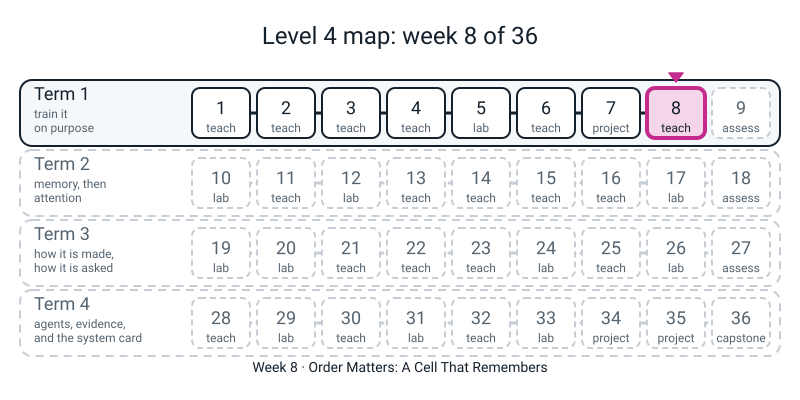
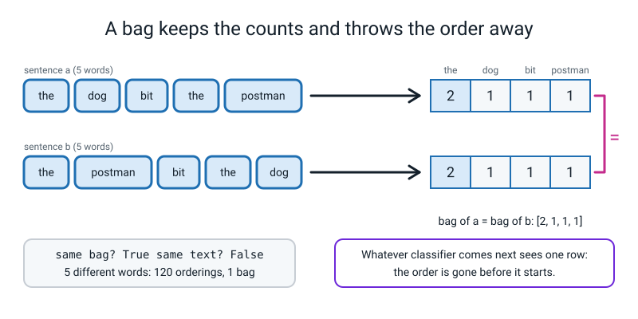
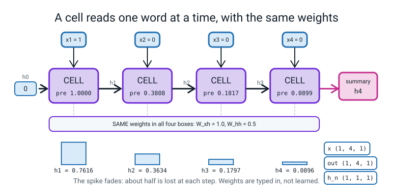

# Week 8 — Order Matters: A Cell That Remembers

[⬅ Week 7](week-07.md) · [Course Home](../README.md) · [Week 9 ➡](week-09.md) · [Student Guide](../student-guide/week-08.md) · [Workbook](../workbook/week-08.md)

---


*Figure 8.0 — Week 8 introduces the recurrent cell, the first model in the course that reads in order.*

## 📋 At a Glance

| | |
|---|---|
| **Duration** | 70 minutes in class, then the workbook (~60-75 min) |
| **Type** | 🟦 Teach — a new model family, no new maths, three new constructs |
| **Big idea** | A bag of words throws the order away, so "the dog bit the postman" and "the postman bit the dog" look identical to it. A **recurrent cell** reads the words **one at a time, in order**, and after each word rewrites a small **summary** (the *hidden state*). It is **one small net, reused at every step**. |
| **New vocabulary** | sequence · embedding · token id · hidden state · recurrent cell · unrolling · weight sharing · `batch_first` |
| **New maths** | **None.** The cell is `tanh` of a weighted sum, which is Level 3 Week 16. The only new *thinking* is "the output of one step is the input of the next". See the 🔢 box. |
| **New syntax** | `nn.Embedding(V, d)` · `nn.RNN(..., batch_first=True)` · `out, h_n = rnn(x)`. That is all three. |
| **Dataset** | Five typed words (`the dog bit postman`) and, for the optional extension, 84 sentences generated by a 10-line loop. **Nothing downloads. No internet needed.** |
| **Model** | `torch.nn.Embedding` and `torch.nn.RNN`: **real PyTorch layers**. Today they are mostly **not trained**; their weights are seeded random numbers, or weights the student types in. The one exception is the optional extension, which trains a real (tiny) model for 0.1 s. |
| **Materials** | Laptop with Python 3 and torch (nothing new to install) · the folder that contains `l4lib/` · index cards and a calculator for the relay · workbook pages 8.1-8.6 · a timer |
| **Prep time** | 25 minutes the night before · 3 minutes on the day |
| **Expected runtime of the code** | Every file below finishes in **under a second** (the nine files together take about **4 seconds** including Python start-up, on the author's CPU). If anything takes over **10 seconds** something is wrong (see Fallback). |

> **⚠️ Watch out:** the thing that goes wrong this week is a student who leaves believing *"an RNN understands word order"*. What we show today is **narrower and true**: the hidden state is a **function of the order**, so two sentences with the same bag can end in different states. In `order.py` the weights are random and untrained, so the two states are different but **mean nothing yet**. Teaching the state to mean something is the job of Weeks 10-13. Say "**can depend on the order**" every time.

---

## 🎯 Lesson Objectives

By the end of the lesson the student can:

1. **Show that a bag of words cannot separate two sentences** that have the same words in a different order, with the counts written out.
2. **Explain `nn.Embedding(V, d)` as a table** with one row per word, and say what shape the lookup returns before running it.
3. **Unroll a 4-step recurrent cell by hand** with the worked weights (`W_xh = 1.0`, `W_hh = 0.5`, no bias), and show that `nn.RNN` gives the same four numbers.
4. **State the three shapes** of `x`, `out` and `h_n` for an `nn.RNN(..., batch_first=True)`, and say which one is "the summary of the whole sentence".
5. **Show two sentences with identical bags ending in different hidden states**, and say why the parameter count does not grow when the sentence does.

Observable evidence: `hand.py` printing `match : True`; `order.py` printing `final states equal: False`; workbook page 8.3 (the hand unroll, two rows at least) matching the key; and the student's spoken answer to *"why is it one net, reused?"*

---

## 🧑‍🏫 What YOU Need to Know First

This section is your own preparation: the maths, the three new constructs, what is real and what is a stand-in, and where to stop. Read it before the Prep Checklist.

> **📌 About the code blocks in this guide.** Every block in the **🧰 Prep Checklist** is a *whole file* and every one was run, from one folder, on a CPU, with the seeds shown. Blocks in the **🐞 Debugging Clinic** are *deliberate mistakes* and each is marked. Short snippets elsewhere carry on from the files. Outputs are real. **Timing lines** (`... s`) vary run to run; **every other number repeated exactly on a second full run on the same machine.** Comparisons between two routes to the same number are shown as `True`/`False` (`allclose`), because the last decimal place can differ on another PyTorch build.

### 1. What the student is doing today, in one paragraph

Level 3 ended with a bag-of-words sentiment engine, and the student has seen it fail on word order. Today that failure gets a cure. They first **count the bag** of two sentences on paper and in five lines of Python and see it is the same. Then they meet `nn.Embedding`, which turns a word number into a short list of numbers. Then the main event: a **recurrent cell** reads those lists one at a time and keeps one summary list. They work the cell **by hand on four steps** with weights so simple a calculator does it (`W_xh = 1.0`, `W_hh = 0.5`), type those weights into a real `nn.RNN`, and watch it print the same four numbers. Last, they feed two same-bag sentences through an embedding and an RNN and see two different summaries. **Nobody trains anything today** (except the optional extension). Training a recurrent net, and what goes wrong when you do, is Weeks 10-13.

### 2. 🔢 The maths you need — taught to you first

**There is no new mathematical idea this week.** The cell is one line:

```text
new note  =  tanh( W_xh x  +  W_hh x old note  +  b )
```

In words: *take the word's numbers times a weight, add the old note times another weight, add a bias, squash with `tanh`*. The student met every piece in Level 3 Week 16 (a neuron: multiply, add, squash). The **only** new thing is that the output is **fed back in** at the next step. So before class, do this one by hand yourself. One number per word, `W_xh = 1.0`, `W_hh = 0.5`, `b = 0`, start with note `0`, and the sentence is "a spike then silence": `x = [1, 0, 0, 0]`.

| Step | x | 1.0·x + 0.5·(old note) | new note = tanh of that |
|:--:|:--:|---|---|
| 1 | 1 | 1.0×1 + 0.5×0 = **1.0000** | tanh(1.0000) = **0.7616** |
| 2 | 0 | 1.0×0 + 0.5×0.7616 = **0.3808** | tanh(0.3808) = **0.3634** |
| 3 | 0 | 0.5×0.3634 = **0.1817** | tanh(0.1817) = **0.1797** |
| 4 | 0 | 0.5×0.1797 = **0.0899** | tanh(0.0899) = **0.0896** |

`hand.py` (Prep Checklist, file 3) prints these four lines and `nn.RNN` then prints the same four numbers. Check your own calculator gives the same.

**Order matters, in numbers.** Two steps only. Spike first: `x = [1, 0]` gives notes `0.7616, 0.3634`. Spike second: `x = [0, 1]` gives `0.0, 0.7616`. The *sum* of the inputs is 1 both times (a bag would say "same"), the final notes are `0.3634` and `0.7616` (not the same). That is the entire week in four numbers; it is workbook page 8.3 d and e.

**Two things you may be asked and should not over-answer:**

- *"The note gets smaller each step. Is it forgetting?"* Yes, and today you say so plainly: in this example about half the note is lost per step (0.7616, 0.3634, 0.1797, 0.0896). **Do not** say "vanishing gradient" or "compounding". Those are Week 10, where it is measured over 40 steps. Today: *"a note that is rewritten every step fades. How fast is next month's question."*
- *"Why `tanh`?"* Same reason as Level 3: it squashes to between -1 and 1 so the note cannot run away upward. (With `W_hh` above 1 the note can grow until `tanh` caps it; workbook 8.3 g lets them see it: `w_hh = 1.0` gives a note that fades far more slowly.)

> **🚫 What you must NOT claim about the cell.**
> 1. **It does not "understand" anything today.** The weights in `order.py` are random. Different is not meaningful.
> 2. **The final note is mostly about the last few words.** In the relay (`sticky.py`) the two sentences end at `-0.7285` and `+0.7290`, and that difference is mostly "the last word was `postman` (−1.0) versus `dog` (+1.0)". A plain RNN's memory of the *start* of a long sentence is poor. Week 10 measures how poor.
> 3. **"One net reused at every step" is a statement about parameters, not about speed.** Reading five words takes five sequential steps; step 3 cannot start before step 2 ends. Mention it only if asked. (It becomes the reason attention wins, Week 14.)

### 3. 🧭 Real vs stand-in — and what you must NOT claim

| Thing | Real or stand-in? |
|---|---|
| `nn.Embedding`, `nn.RNN`, every printed shape, every `allclose` | **Real.** PyTorch on the CPU. |
| The word numbers (`the = 0, dog = 1, ...`) | **Typed by the student.** They are *ids*, labels on rows. They are not meaningful numbers (`bit = 2` does not mean "bigger than `dog`"). |
| The embedding table values in `lookup.py` / `order.py` | **Random** (seeded by `torch.manual_seed(0)`). They are not learned. |
| The hand-set weights in `hand.py` | **Chosen by us** so arithmetic is easy. They are not learned. |
| The sticky-note relay's word numbers (`sticky.py`) | **Chosen by us** (`the = 0.2, dog = 1.0, bit = -0.5, postman = -1.0`). A toy, not a model. |
| The optional extension (`flyer.py`): 84 generated sentences | **Generated** by a loop (`the dog bit the cat` and its mirror image). The RNN there is **really trained** for 200 steps, for about 0.1 seconds. It is a toy: 60 training and 24 held-out sentences, not evidence about language. |
| Any language model | **Not present today.** No scripted backend. No stand-in. |

> **Say to the student, out loud:** *"Everything today is real PyTorch. None of it has learned anything yet, except the one extra at the end, and that one learns a single thing about ten words."*

### 4. The three new constructs, for somebody who has never seen them

**(a) `nn.Embedding(V, d)` — a table, one row per word.**

```python
emb = nn.Embedding(4, 3)        # 4 words, each stored as 3 numbers
vecs = emb(torch.tensor([0, 1, 2, 0, 3]))     # pick rows 0, 1, 2, 0, 3
```

Read as: *"a grid with `V` rows and `d` columns. Give it a list of row numbers; it gives back those rows."* It does **no arithmetic**. `lookup.py` proves it: row 0 of the table is exactly the first vector, and the word `the` at position 0 and at position 3 gives the **same** numbers. The word ids must be **whole numbers** (`long`), and each must be below `V`. Both rules have a Debugging Clinic entry (2 and 3). The table's numbers are **knobs**: in training they are adjusted like any weight; for now they are random. (`V × d` knobs: 12 here.)

A likely question: *"why not just one-hot?"* A one-hot would be a long mostly-zero list, and multiplying it by a grid *is* a row lookup. The embedding is the shortcut. If they ask what the numbers mean: *"nothing yet; training will make words that behave alike end up with alike rows. We will see that in Week 25."*

**(b) `nn.RNN(input_size, hidden_size, batch_first=True)` — the recurrent layer.**

```python
rnn = nn.RNN(3, 4, batch_first=True)   # 3 numbers in per word, a 4-number note
```

Read as: *"the cell from the whiteboard, with a note of 4 numbers, that expects 3 numbers per word."* Inside it has **four** things, which you print once with `for p in rnn.parameters(): print(tuple(p.shape))` (`hand.py` does it):

| Name in PyTorch | Shape for `nn.RNN(3, 4)` | What it is |
|---|:--:|---|
| `weight_ih_l0` | (4, 3) | `W_xh`: input to note |
| `weight_hh_l0` | (4, 4) | `W_hh`: old note to new note |
| `bias_ih_l0` | (4,) | a bias |
| `bias_hh_l0` | (4,) | a **second** bias |

The two biases are redundant: only their **sum** matters (in `loop.py`, `b = bias_ih + bias_hh`). It is a quirk of the library. The thing to tell the student is: *"when we type in weights by hand, we must set **both** biases, or the leftover random one spoils the answer"* — that is Debugging Clinic mistake 6. The `l0` means "layer 0"; we only ever use one layer this year.

**`batch_first=True`** says the input is laid out as **(batch, time, features)**, i.e. *(how many sentences, how many words, how many numbers per word)*, which is how a student thinks. PyTorch's default is (time, batch, features). Forgetting it does **not** raise an error (mistake 5). **Always write `batch_first=True` and say the shape aloud.**

**(c) `out, h_n = rnn(x)` — two things come back.**

```python
out, h_n = rnn(x)
```

Read as: *"`out` is the note after **every** word; `h_n` is the note after the **last** word."* For `x` of shape (B, T, F) with a note of size H:

```text
x    (B, T, F)      sentences, words, numbers per word
out  (B, T, H)      a note for every word of every sentence
h_n  (1, B, H)      the LAST note of every sentence  (the leading 1 = "one layer")
```

and `out[:, -1]` (the last word's note) equals `h_n[0]` (drop the leading 1). `shapes.py` prints all of it. For "a summary of the whole sentence" the student uses **`h_n[0]`**. The leading `1` is the one thing students trip on; the Debugging Clinic has the `out[-1]` version (mistake 7). Keeping just one name, `out = rnn(x)`, keeps a pair and fails on the next line (mistake 1).

### 5. The other code the student types — nothing new, but note these

- A **dictionary** from word to id, `{w: i for i, w in enumerate(vocab)}` (Level 2's comprehension and `enumerate`).
- `torch.tensor([...])` with **whole numbers** for ids, and `.reshape(1, 4, 1)` to make the (batch, time, features) layout.
- `rnn.weight_ih_l0.data = torch.tensor([[1.0]])`: forcing your own numbers into a layer, exactly as `conv.weight.data = ...` in Level 3 Week 24.
- `torch.allclose(a, b)`: "equal, allowing for the last few decimal places" (used in Level 3). We never use `==` on decimals.
- `f"{x:.4f}"`: four decimals (Level 2).
- `h_n[0]`, `out[:, -1]`, `out[0, :, 0]`: indexing. Say what each is: `out[0, :, 0]` is "sentence 0, every word, feature 0".
- `@` for a grid times a vector (Level 3 Week 17), in `loop.py`.
- `math.tanh(x)`: the same `tanh`, for one plain number.

**Not used today, on purpose**, because they are later rungs on the ladder: `torch.randn`, `torch.stack` (Week 10), `nn.LSTM`, `nn.GRU` (Week 11), `nn.RNNCell`, `nn.utils.rnn.pad_sequence` and packing (Weeks 12-13), `named_parameters`. If a student has seen them elsewhere, say *"yes, in a few weeks; today we do it the long way so you can see inside."*

### 6. What the numbers will say

These are all printed by the files below. Read them before class so nothing surprises you.

- **The bag.** Both sentences give `[2, 1, 1, 1]` over `[the, dog, bit, postman]`. `same bag? True` and `same text? False`. Five different words can be lined up in `5 x 4 x 3 x 2 x 1 = 120` ways that all give one bag.
- **The hand unroll.** `0.7616, 0.3634, 0.1797, 0.0896`, and `nn.RNN` agrees: `match : True`.
- **The shapes.** For `nn.RNN(3, 5, batch_first=True)` on a (2, 4, 3) input: `out` (2, 4, 5), `h_n` (1, 2, 5), and `out[:, -1]` equals `h_n[0]`.
- **Two sentences, same bag.** With seed 0 the bag-view (mean of the word vectors) is identical for both (`[0.7301, -0.286, -1.2587]`) and the final states are different (`[0.5728, -0.0141, 0.3677, 0.1722]` against `[-0.1963, -0.0411, 0.3475, 0.6072]`), a distance of `0.8842`. Step by step the two states are **identical after word 1** (both read `the`, distance `0.0000`) and part ways at word 2.
- **Weight sharing.** `nn.RNN(3, 4)` has `4×3 + 4×4 + 4 + 4 = 36` numbers, whether the sentence has 5 words, 50 or 500.
- **The optional extension** (`flyer.py`), 84 sentences, 60 train and 24 held out: the bag-of-words linear model gets train 0.567 and **held-out 0.333**; the embedding + RNN gets 1.000 and 1.000. Explain the 0.333 honestly (see "Questions Students Ask"): it is *below* a coin flip because of how we split, and that is a lesson in itself.

### 7. The honest limits of today

1. **Random weights prove existence, not usefulness.** `order.py` shows the state *can* depend on order. It does not show that a trained state *does* carry the right information.
2. **We did not test longer sentences than 500 tokens, or anything that takes a long time.** `loop.py` checks the parameter count at T = 5, 50, 500 and nothing more.
3. **The optional extension is a 24-sentence held-out set.** A result of 1.000 there means "all 24 right", not "solved order". It is one seed. Do not quote 100% as a finding; quote it as "this toy is easy for a model that sees order".
4. **The comparison in the extension uses different optimiser settings for the two models** (`lr = 0.05` for the bag, `0.01` for the RNN; 200 steps each), chosen so each trains sensibly, not tuned to favour either. We did not sweep them; a bag of words cannot beat 0.5 over all 84 sentences in principle (on one held-out slice it can land above or below), because the two mirror sentences have the same input, so the gap does not depend on those settings.
5. **Only the untrained-weights case is shown for the full embedding → RNN pipeline.** No claim about what trained embeddings look like.

### 8. The three misconceptions you will actually meet

1. **"The RNN has a separate network for each word."** No: one set of weights, used again and again. `loop.py` uses the *same* `W_ih`, `W_hh`, `b` in all five iterations, and the parameter count does not change with sentence length. Draw the four boxes, write "SAME" under all of them.
2. **"The embedding numbers are the word."** They are a *row of a table* chosen by the id. Changing the id changes the row. Two sentences that use the same word get the same row at both places (`lookup.py` proves it).
3. **"`h_n` and `out` are two different models."** They are two views of one run: `out` is every step, `h_n` is the last one.

### 9. How deep to go, and where to stop

Stop at: *"it is a loop that rewrites one note using the same rule every time, and the loop is what gives it order."* Do **not** go into gradients through time, exploding/vanishing, LSTM gates, sequence lengths and padding, or training stability. Each has a week. If the student is already asking "but how does it *learn* what to keep?": *"That is the next three weeks; today you own the forward pass, and that is the half everything else sits on."*

### 10. 🧭 Where Week 8 sits

```text
   W1-7  one knob at a time                 W8   a model with ORDER (today)
   bag of words loses order  ----------->   one cell, reused; a note that is rewritten
   (Level 3, W33-35)
                                            W9   Review & Assessment 1 (weeks 1-8 on paper;
                                                  "unroll a cell" is on the paper)
                                            W10  training it; the note fades (compounding)
                                            W11  gates: a note that adds instead of multiplies
                                            W12-13  names, sampling
                                            W14  attention: the way out of the sticky-note limit
```

---

## 🧰 Prep Checklist

This section gets the files typed, run and checked before class, so that every printed output in this guide is one you have seen yourself.

### 25 minutes the night before

- [ ] **Confirm the stack and the shared kit.** Run from the folder that contains `l4lib/`:

```bash
python3 -c "import torch; print(torch.__version__)"
python3 -c "from l4lib.corpus import toy_sentences; print(toy_sentences(2, seed=0))"
```

You must see (the first line's digits may differ on another PyTorch version; the second comes from the shared kit, seed 0):

```text
2.2.1
['the teacher helped the dog', 'the girl found the fisherman']
```

`toy_sentences` is **not needed to run the files below**; this is only a check that the kit is in the right place. If `l4lib` is not found, you are in the wrong folder. `pip` returning 403 is expected and not an error; **nothing this week installs anything.**

- [ ] **Type the files below into one working folder** (next to `l4lib/`). Each begins with a `# file:`-style comment naming it. Run each one, in order, and compare with the output printed here.

**File 1 — `bag.py`** (no torch; the problem)

```python
# bag.py - Week 8: what a bag of words keeps, and what it throws away. No torch yet.
a = "the dog bit the postman"
b = "the postman bit the dog"

vocab = ["the", "dog", "bit", "postman"]


def bag(sentence):
    words = sentence.split()
    return [words.count(w) for w in vocab]


print("vocab      ", vocab)
print("bag of a   ", bag(a))
print("bag of b   ", bag(b))
print("same bag?  ", bag(a) == bag(b))
print("same text? ", a == b)

# How many orderings share one bag? Five different words can be lined up 5 x 4 x 3 x 2 x 1 ways.
n = 1
for k in range(1, 6):
    n = n * k
print("orderings of 5 different words:", n)
```

```text
vocab       ['the', 'dog', 'bit', 'postman']
bag of a    [2, 1, 1, 1]
bag of b    [2, 1, 1, 1]
same bag?   True
same text?  False
orderings of 5 different words: 120
```

**File 2 — `lookup.py`** (`nn.Embedding` is a table)

```python
# lookup.py - Week 8: nn.Embedding is a table with one row per word. Nothing is "computed".
import torch
import torch.nn as nn

torch.manual_seed(0)

vocab = ["the", "dog", "bit", "postman"]
ids = {w: i for i, w in enumerate(vocab)}      # word -> row number
print("ids:", ids)

emb = nn.Embedding(4, 3)                       # 4 words, each row has 3 numbers
print("table shape:", tuple(emb.weight.shape))
print("table:")
print(emb.weight.data)

x = torch.tensor([ids["the"], ids["dog"], ids["bit"], ids["the"], ids["postman"]])
print("ids of 'the dog bit the postman':", x.tolist())

vecs = emb(x)
print("lookup shape:", tuple(vecs.shape))
print(vecs.data)

# The lookup IS just row-picking: row 0 twice, and it is the same row.
print("row 0 of table == first vector:", torch.allclose(emb.weight.data[0], vecs.data[0]))
print("'the' at position 0 == 'the' at position 3:", torch.allclose(vecs.data[0], vecs.data[3]))
print("learnable numbers in the table:", emb.weight.numel())
```

```text
ids: {'the': 0, 'dog': 1, 'bit': 2, 'postman': 3}
table shape: (4, 3)
table:
tensor([[ 1.5410, -0.2934, -2.1788],
        [ 0.5684, -1.0845, -1.3986],
        [ 0.4033,  0.8380, -0.7193],
        [-0.4033, -0.5966,  0.1820]])
ids of 'the dog bit the postman': [0, 1, 2, 0, 3]
lookup shape: (5, 3)
tensor([[ 1.5410, -0.2934, -2.1788],
        [ 0.5684, -1.0845, -1.3986],
        [ 0.4033,  0.8380, -0.7193],
        [ 1.5410, -0.2934, -2.1788],
        [-0.4033, -0.5966,  0.1820]])
row 0 of table == first vector: True
'the' at position 0 == 'the' at position 3: True
learnable numbers in the table: 12
```

The table's twelve numbers are random (seeded); on another PyTorch build the random numbers may differ, but the two `True` lines and the shapes will not.

**File 3 — `hand.py`** (the four-step unroll, by hand and by `nn.RNN`)

```python
# hand.py - Week 8: the four-step unroll from the page, by hand, then by nn.RNN.
import math
import torch
import torch.nn as nn

W_xh = 1.0
W_hh = 0.5
xs = [1.0, 0.0, 0.0, 0.0]

h = 0.0
by_hand = []
for x in xs:
    pre = W_xh * x + W_hh * h
    h = math.tanh(pre)
    by_hand.append(h)
    print(f"pre = {pre:.4f}   h = {h:.4f}")

# Now the same thing with PyTorch's layer: 1 number in, 1 number remembered.
rnn = nn.RNN(1, 1, batch_first=True)
print("parameters inside nn.RNN(1, 1):")
for p in rnn.parameters():
    print("  ", tuple(p.shape))

# Put OUR weights into it. nn.RNN has TWO bias numbers; our hand version has none, so both go to 0.
rnn.weight_ih_l0.data = torch.tensor([[W_xh]])
rnn.weight_hh_l0.data = torch.tensor([[W_hh]])
rnn.bias_ih_l0.data = torch.zeros(1)
rnn.bias_hh_l0.data = torch.zeros(1)

x = torch.tensor(xs).reshape(1, 4, 1)          # (batch 1, time 4, features 1)
out, h_n = rnn(x)
print("out shape:", tuple(out.shape), " h_n shape:", tuple(h_n.shape))
print("rnn says  :", [round(v, 4) for v in out[0, :, 0].tolist()])
print("by hand   :", [round(v, 4) for v in by_hand])
print("match     :", torch.allclose(out[0, :, 0], torch.tensor(by_hand), atol=1e-6))
print("last of out == h_n:", torch.allclose(out[0, -1], h_n[0, 0]))
```

```text
pre = 1.0000   h = 0.7616
pre = 0.3808   h = 0.3634
pre = 0.1817   h = 0.1797
pre = 0.0899   h = 0.0896
parameters inside nn.RNN(1, 1):
   (1, 1)
   (1, 1)
   (1,)
   (1,)
out shape: (1, 4, 1)  h_n shape: (1, 1, 1)
rnn says  : [0.7616, 0.3634, 0.1797, 0.0896]
by hand   : [0.7616, 0.3634, 0.1797, 0.0896]
match     : True
last of out == h_n: True
```

**File 4 — `shapes.py`** (say the three shapes before you run it)

```python
# shapes.py - Week 8: the three shapes to say out loud before you run anything.
import torch
import torch.nn as nn

torch.manual_seed(0)

rnn = nn.RNN(3, 5, batch_first=True)       # 3 numbers in per step, 5 numbers remembered
x = torch.tensor([float(i) for i in range(24)]).reshape(2, 4, 3) / 10 - 1                   # 2 sentences, 4 steps each, 3 features per step
print("x    (batch, time, features):", tuple(x.shape))

out, h_n = rnn(x)
print("out  (batch, time, hidden)  :", tuple(out.shape))
print("h_n  (1, batch, hidden)     :", tuple(h_n.shape))

print("out[:, -1] is the last step:", tuple(out[:, -1].shape))
print("h_n[0]  drops the leading 1 :", tuple(h_n[0].shape))
print("out[:, -1] == h_n[0]        :", torch.allclose(out[:, -1], h_n[0]))
print("first step out[:, 0] == h_n[0]?", torch.allclose(out[:, 0], h_n[0]))
```

```text
x    (batch, time, features): (2, 4, 3)
out  (batch, time, hidden)  : (2, 4, 5)
h_n  (1, batch, hidden)     : (1, 2, 5)
out[:, -1] is the last step: (2, 5)
h_n[0]  drops the leading 1 : (2, 5)
out[:, -1] == h_n[0]        : True
first step out[:, 0] == h_n[0]? False
```

The last line is `False` **on purpose**: the note after the *first* word is not the note after the *last* one. It stops a student from believing every comparison prints `True`.

**File 5 — `order.py`** (same bag, different summary)

```python
# order.py - Week 8: same bag, different story. Embedding -> RNN -> one summary vector per sentence.
import torch
import torch.nn as nn

torch.manual_seed(0)

vocab = ["the", "dog", "bit", "postman"]
ids = {w: i for i, w in enumerate(vocab)}

a = "the dog bit the postman"
b = "the postman bit the dog"


def to_ids(sentence):
    return [ids[w] for w in sentence.split()]


x_ids = torch.tensor([to_ids(a), to_ids(b)])        # (batch 2, time 5)
print("ids:")
print(x_ids)

emb = nn.Embedding(4, 3)
rnn = nn.RNN(3, 4, batch_first=True)

vecs = emb(x_ids)                                     # (2, 5, 3)
out, h_n = rnn(vecs)
final = h_n[0]                                        # (2, 4): one summary per sentence

# The "bag" view: average the word vectors. Order is thrown away, so the two sentences agree.
bag_view = vecs.mean(dim=1)
print("bag view of a:", [round(v, 4) for v in bag_view[0].tolist()])
print("bag view of b:", [round(v, 4) for v in bag_view[1].tolist()])
print("bag views equal:", torch.allclose(bag_view[0], bag_view[1], atol=1e-6))

# The recurrent view: the final hidden state remembers the order.
print("final state of a:", [round(v, 4) for v in final[0].tolist()])
print("final state of b:", [round(v, 4) for v in final[1].tolist()])
print("final states equal:", torch.allclose(final[0], final[1], atol=1e-6))
print("size of the difference:", round((final[0] - final[1]).norm().item(), 4))

# Control: the SAME sentence twice must give the SAME state (the net is not random at run time).
same = torch.tensor([to_ids(a), to_ids(a)])
_, h_same = rnn(emb(same))
print("same sentence twice, equal:", torch.allclose(h_same[0, 0], h_same[0, 1]))

# Look at the first two words of each: the states only part ways once the orders differ.
print("step-by-step distance between the two sentences:")
for t in range(5):
    gap = (out[0, t] - out[1, t]).norm().item()
    print(f"  after word {t + 1}: {gap:.4f}")
```

```text
ids:
tensor([[0, 1, 2, 0, 3],
        [0, 3, 2, 0, 1]])
bag view of a: [0.7301, -0.286, -1.2587]
bag view of b: [0.7301, -0.286, -1.2587]
bag views equal: True
final state of a: [0.5728, -0.0141, 0.3677, 0.1722]
final state of b: [-0.1963, -0.0411, 0.3475, 0.6072]
final states equal: False
size of the difference: 0.8842
same sentence twice, equal: True
step-by-step distance between the two sentences:
  after word 1: 0.0000
  after word 2: 0.9854
  after word 3: 0.6620
  after word 4: 0.2906
  after word 5: 0.8842
```

**File 6 — `loop.py`** (what `nn.RNN` is doing inside: one set of weights, reused)

```python
# loop.py - Week 8: nn.RNN is just this loop. One set of weights, used at every step.
import torch
import torch.nn as nn

torch.manual_seed(0)

rnn = nn.RNN(3, 4, batch_first=True)
x = torch.tensor([float(i) for i in range(15)]).reshape(1, 5, 3) / 10 - 0.7       # 1 sentence, 5 steps, 3 features
out, h_n = rnn(x)

W_ih = rnn.weight_ih_l0.data          # (4, 3)
W_hh = rnn.weight_hh_l0.data          # (4, 4)
b = rnn.bias_ih_l0.data + rnn.bias_hh_l0.data

h = torch.zeros(4)
worst = 0.0
for t in range(5):
    h = torch.tanh(W_ih @ x[0, t] + W_hh @ h + b)      # the SAME W_ih, W_hh, b every time
    gap = (h - out[0, t]).abs().max().item()
    worst = max(worst, gap)
    print(f"step {t + 1}: my h = {[round(v, 3) for v in h.tolist()]}   nn.RNN says {[round(v, 3) for v in out[0, t].tolist()]}")

print("worst difference over all steps < 1e-6:", worst < 1e-6)

# The weights do not grow with the length of the sentence.
for T in [5, 50, 500]:
    xx = torch.tensor([float(i) for i in range(3 * T)]).reshape(1, T, 3) / (3 * T)
    o, _ = rnn(xx)
    print(f"T = {T:3d}  out shape {tuple(o.shape)}  parameters {sum(p.numel() for p in rnn.parameters())}")

# Count them: 4x3 + 4x4 + 4 + 4
print("by hand: 4*3 + 4*4 + 4 + 4 =", 4 * 3 + 4 * 4 + 4 + 4)
```

```text
step 1: my h = [-0.531, -0.051, -0.637, 0.011]   nn.RNN says [-0.531, -0.051, -0.637, 0.011]
step 2: my h = [-0.23, -0.085, -0.603, -0.271]   nn.RNN says [-0.23, -0.085, -0.603, -0.271]
step 3: my h = [-0.399, -0.114, -0.581, -0.191]   nn.RNN says [-0.399, -0.114, -0.581, -0.191]
step 4: my h = [-0.362, -0.3, -0.52, -0.238]   nn.RNN says [-0.362, -0.3, -0.52, -0.238]
step 5: my h = [-0.374, -0.459, -0.514, -0.237]   nn.RNN says [-0.374, -0.459, -0.514, -0.237]
worst difference over all steps < 1e-6: True
T =   5  out shape (1, 5, 4)  parameters 36
T =  50  out shape (1, 50, 4)  parameters 36
T = 500  out shape (1, 500, 4)  parameters 36
by hand: 4*3 + 4*4 + 4 + 4 = 36
```

**File 7 — `sticky.py`** (the hand-and-calculator relay, one number per word)

```python
# sticky.py - Week 8 activity: the Sticky-Note Relay with ONE number per word and ONE number on the note.
import math

table = {"the": 0.2, "dog": 1.0, "bit": -0.5, "postman": -1.0}
W_hh = 0.5                                         # how much of the old note is kept (before squashing)


def relay(sentence, show=False):
    note = 0.0
    for w in sentence.split():
        pre = table[w] + W_hh * note
        note = math.tanh(pre)
        if show:
            print(f"  read {w:8s} x = {table[w]:5.1f}   pre = {pre:7.4f}   note = {note:7.4f}")
    return note


for s in ["the dog bit the postman", "the postman bit the dog"]:
    print(s)
    final = relay(s, show=True)
    print("  final note:", round(final, 4))

bag_sum_a = sum(table[w] for w in "the dog bit the postman".split())
bag_sum_b = sum(table[w] for w in "the postman bit the dog".split())
print("sum of word numbers:", round(bag_sum_a, 4), round(bag_sum_b, 4))
```

```text
the dog bit the postman
  read the      x =   0.2   pre =  0.2000   note =  0.1974
  read dog      x =   1.0   pre =  1.0987   note =  0.8000
  read bit      x =  -0.5   pre = -0.1000   note = -0.0997
  read the      x =   0.2   pre =  0.1502   note =  0.1491
  read postman  x =  -1.0   pre = -0.9255   note = -0.7285
  final note: -0.7285
the postman bit the dog
  read the      x =   0.2   pre =  0.2000   note =  0.1974
  read postman  x =  -1.0   pre = -0.9013   note = -0.7169
  read bit      x =  -0.5   pre = -0.8585   note = -0.6955
  read the      x =   0.2   pre = -0.1477   note = -0.1467
  read dog      x =   1.0   pre =  0.9267   note =  0.7290
  final note: 0.729
sum of word numbers: -0.1 -0.1
```

**File 8 — `key.py`** (every number in the answer key; teacher only, never shown to the student)

```python
# key.py - every number in the answer key, computed. Nothing here is new teaching.
import math
import torch
import torch.nn as nn


def run(xs, w_xh=1.0, w_hh=0.5):
    h, hs = 0.0, []
    for x in xs:
        h = math.tanh(w_xh * x + w_hh * h)
        hs.append(round(h, 4))
    return hs


print("page 8.3 a  [1,0,0,0]  :", run([1, 0, 0, 0]))
print("page 8.3 b  [0,0,1,0]  :", run([0, 0, 1, 0]))
print("page 8.3 c  [1,1,0,0]  :", run([1, 1, 0, 0]))
print("page 8.3 d  [1,0]      :", run([1, 0]))
print("page 8.3 e  [0,1]      :", run([0, 1]))
print("page 8.3 f  w_hh=0 [1,0,0,0]:", run([1, 0, 0, 0], w_hh=0.0))
print("page 8.3 g  w_hh=1 [1,0,0,0]:", run([1, 0, 0, 0], w_hh=1.0))

print("page 8.5 Embedding(10,4):", nn.Embedding(10, 4).weight.numel())
r = nn.RNN(4, 6, batch_first=True)
print("page 8.5 RNN(4,6):", sum(p.numel() for p in r.parameters()), " = 6*4 + 6*6 + 6 + 6 =", 6 * 4 + 6 * 6 + 6 + 6)
print("page 8.5 both:", nn.Embedding(10, 4).weight.numel() + sum(p.numel() for p in r.parameters()))
e = nn.Embedding(10, 4)
ids = torch.zeros(3, 6, dtype=torch.long)
out, h_n = r(e(ids))
print("page 8.4 embed:", tuple(e(ids).shape), " out:", tuple(out.shape), " h_n:", tuple(h_n.shape))
```

```text
page 8.3 a  [1,0,0,0]  : [0.7616, 0.3634, 0.1797, 0.0896]
page 8.3 b  [0,0,1,0]  : [0.0, 0.0, 0.7616, 0.3634]
page 8.3 c  [1,1,0,0]  : [0.7616, 0.8811, 0.4141, 0.2041]
page 8.3 d  [1,0]      : [0.7616, 0.3634]
page 8.3 e  [0,1]      : [0.0, 0.7616]
page 8.3 f  w_hh=0 [1,0,0,0]: [0.7616, 0.0, 0.0, 0.0]
page 8.3 g  w_hh=1 [1,0,0,0]: [0.7616, 0.642, 0.5663, 0.5126]
page 8.5 Embedding(10,4): 40
page 8.5 RNN(4,6): 72  = 6*4 + 6*6 + 6 + 6 = 72
page 8.5 both: 112
page 8.4 embed: (3, 6, 4)  out: (3, 6, 6)  h_n: (1, 3, 6)
```

**File 9 — `flyer.py`** (optional extension: is the dog the biter? A bag cannot know; an RNN can.)

```python
# flyer.py - Week 8 (optional, for the fast student): is the dog the biter or the bitten?
# Every sentence has the dog exactly once, so a bag of words cannot know which. Order is the only clue.
import time
import torch
import torch.nn as nn

torch.set_num_threads(1)
torch.manual_seed(0)

nouns = ["dog", "cat", "baker", "postman", "girl", "boy", "teacher", "fisherman"]
verbs = ["bit", "saw", "chased", "helped", "found", "called"]
vocab = ["the"] + nouns + verbs
ids = {w: i for i, w in enumerate(vocab)}

sentences, labels = [], []
for other in nouns[1:]:
    for v in verbs:
        sentences.append(f"the dog {v} the {other}")
        labels.append(1.0)                      # 1 = the dog did it
        sentences.append(f"the {other} {v} the dog")
        labels.append(0.0)                      # 0 = it was done to the dog

X = torch.tensor([[ids[w] for w in s.split()] for s in sentences])      # (84, 5)
y = torch.tensor(labels)
print("sentences:", len(sentences), "  tensor shape:", tuple(X.shape), "  share with label 1:", y.mean().item())

g = torch.Generator()
g.manual_seed(0)
order = torch.randperm(len(sentences), generator=g)
train_i, val_i = order[:60], order[60:]
print("train", len(train_i), " val", len(val_i))

# Sentences 2k and 2k+1 are mirror images (same bag, opposite label). How many val sentences have their mirror in train?
train_set = set(train_i.tolist())
print("val sentences whose mirror is in train:", sum(1 for i in val_i.tolist() if (i + 1 if i % 2 == 0 else i - 1) in train_set))


def counts(batch):                               # the bag: how many of each word
    c = torch.zeros(len(batch), len(vocab))
    for r in range(len(batch)):
        for w in batch[r].tolist():
            c[r, w] = c[r, w] + 1
    return c


def accuracy(logits, target):
    return ((logits > 0).float() == target).float().mean().item()


loss_fn = nn.BCEWithLogitsLoss()

# ---- model 1: a bag of words -> one linear layer
bag_head = nn.Linear(len(vocab), 1)
opt = torch.optim.AdamW(bag_head.parameters(), lr=0.05)
t0 = time.perf_counter()
for epoch in range(200):
    opt.zero_grad()
    loss = loss_fn(bag_head(counts(X[train_i])).reshape(-1), y[train_i])
    loss.backward()
    opt.step()
bag_train = accuracy(bag_head(counts(X[train_i])).reshape(-1), y[train_i])
bag_val = accuracy(bag_head(counts(X[val_i])).reshape(-1), y[val_i])
print(f"bag of words : train {bag_train:.3f}  val {bag_val:.3f}   ({time.perf_counter() - t0:.1f} s)")

# ---- model 2: embedding -> RNN -> last state -> one linear layer
emb = nn.Embedding(len(vocab), 8)
rnn = nn.RNN(8, 16, batch_first=True)
head = nn.Linear(16, 1)
params = list(emb.parameters()) + list(rnn.parameters()) + list(head.parameters())
opt = torch.optim.AdamW(params, lr=0.01)


def predict(batch):
    out, h_n = rnn(emb(batch))
    return head(h_n[0]).reshape(-1)


t0 = time.perf_counter()
for epoch in range(200):
    opt.zero_grad()
    loss = loss_fn(predict(X[train_i]), y[train_i])
    loss.backward()
    opt.step()
rnn_train = accuracy(predict(X[train_i]), y[train_i])
rnn_val = accuracy(predict(X[val_i]), y[val_i])
print(f"embedding+RNN: train {rnn_train:.3f}  val {rnn_val:.3f}   ({time.perf_counter() - t0:.1f} s)")
```

```text
sentences: 84   tensor shape: (84, 5)   share with label 1: 0.5
train 60  val 24
val sentences whose mirror is in train: 18
bag of words : train 0.567  val 0.333   (0.2 s)
embedding+RNN: train 1.000  val 1.000   (0.0 s)
```

Timing lines (`... s`) will differ. The `0.333` for the bag is not a typo; see "Questions Students Ask".

- [ ] **Run them all once as a set**, from one folder, and check nothing fails: `for f in bag lookup hand shapes order loop sticky key flyer; do python3 $f.py > /dev/null || echo FAIL $f; done`. It should print nothing and take about 4 seconds.
- [ ] **Print** workbook pages 8.1-8.6 and the index cards for the relay (one per word: `the  0.2`, `dog  1.0`, `bit  -0.5`, `postman  -1.0`).
- [ ] **Read the Debugging Clinic** and copy the eight `bad*.py` files to a scratch folder so they are ready to plant.

### 3 minutes on the day

- [ ] Open `bag.py` and `hand.py` in the editor as **empty files**, for typing together.
- [ ] Put the four index cards, a calculator and the timer on the desk.

### Fallback if the laptops fail

| Problem | What to do |
|---|---|
| `ModuleNotFoundError: l4lib` | Only the night-before check imports `l4lib`; none of the week's nine files do. You are in the wrong folder for the check; the lesson itself is unaffected. |
| `ModuleNotFoundError: torch` | `python3 -m pip` is blocked; use a machine that already has torch. Fall back to `bag.py`, `sticky.py` and the pencil parts (pages 8.1, 8.3) which need only Python. |
| `hand.py` says `match : False` | A bias was not set to zero (Debugging Clinic 6). Re-type the four `.data =` lines. |
| A different random table on a different machine | Expected (different PyTorch builds). Nothing in the lesson depends on the particular values; use the `True`/`False` and shape lines. |
| No laptop at all | Run the lesson from the printed outputs in this guide and from the index-card relay; pages 8.1-8.5 work on paper. |

---

## ⏱️ The Lesson, Minute by Minute

This is the running order of the whole lesson. Each segment below has its own time budget; keep to it.

| Segment | Minutes | What happens |
|---|:--:|---|
| 🪝 Hook | 8 | Two sentences, one bag. The student fills the counts; the counts match. |
| 🧠 Concept | 14 | The sticky note; the loop drawn and unrolled; "SAME weights"; the hand example; the three shapes |
| 💻 Live-code | 20 | `hand.py` (first the loop, then `nn.RNN` beside it); `lookup.py`; the shapes |
| 🎲 Their turn | 23 | The Sticky-Note Relay with index cards; `order.py`; one pair of their own |
| 🔑 Wrap & assign | 5 | What was shown and what was not; homework |

### 🪝 Hook — The Dog and the Postman (8 minutes)

**Do not open the laptop yet.**

1. **(2 min) Say the two sentences aloud, one after the other.** *"The dog bit the postman. The postman bit the dog."* Ask: *"Same news?"* Let them say no, and say who you would rather be. Then: *"Last term your sentiment engine counted words. Count these."*
2. **(3 min) The count.** Hand them the grid on page 8.1 (columns `the, dog, bit, postman`). They tally both sentences. They will find `2, 1, 1, 1` twice. Say: *"The computer sees the same row twice. It cannot tell the sentences apart, however clever the classifier after it."* Then run `bag.py` only to confirm (`same bag? True`, `same text? False`). The last line, 120 orderings of five different words sharing one bag, is for the student who likes big numbers.
3. **(3 min) The question that frames the lesson.** *"What would a reader need to do that a counter does not?"* Draw out: **read in order and remember what came before**. Write on the board:

> **"A model that reads in order has to carry a summary, and it has to use the same rule for every word."**

*If the student says "just use pairs of words" (bigrams):* that is a good idea and it works for pairs. It fails for "the dog that lived next door to the baker bit the postman" where the two words that matter are seven places apart. We will come back to that in Week 10.


*Figure 8.1 — Counting words throws the order away, so a classifier cannot tell these two sentences apart.*

### 🧠 Concept — A Sticky Note and a Loop (14 minutes)

**(4 min) The sticky note.** Draw this and tell the story. *"You read a long book and you may keep one sticky note. After every page you rewrite the note, using the page and the old note. By the end, the note is all you remember."*

```text
   note starts empty (all zeros)

   read "the"  -> rewrite the note
   read "dog"  -> rewrite the note    (uses the last note AND "dog")
   read "bit"  -> rewrite the note
   ...
   the LAST note is the summary of the whole sentence
```

Then the box version of the same thing, the **unrolled** loop. Draw the four boxes and write **SAME** under every one:

```text
          x1          x2          x3          x4
           |           |           |           |
           v           v           v           v
  h0 --> [CELL] -h1-> [CELL] -h2-> [CELL] -h3-> [CELL] --> h4
          ^            ^            ^            ^
          +---- SAME weights in all four boxes ---+
```

*"Four boxes, one cell. We draw it four times so we can see the steps; there is really one."*

**(3 min) The rule.** Write it as words first, then symbols:

```text
new note = tanh( W_xh * (this word) + W_hh * (old note) + b )
```

*"Multiply, add, squash. You have done this since Week 16 of last year. The only new thing is that the answer goes back in."*

**(4 min) The example you do out loud.** One number per word, `W_xh = 1.0`, `W_hh = 0.5`, `b = 0`, the sentence is `1, 0, 0, 0` ("a spike, then quiet"). Do the first step **with** them on the whiteboard (`1.0×1 + 0.5×0 = 1.0`, `tanh(1.0) = 0.7616`). **Have them do step 2 on a calculator before you say it** (0.3634). Put the four numbers in a column: `0.7616, 0.3634, 0.1797, 0.0896`. Ask: *"what is happening to the spike?"* (It fades; about half is lost each step.) *"We will measure how fast in Week 10."* Do **not** go further.

**(3 min) Embedding, in words only.** *"Words are not numbers. The computer needs a short list of numbers for each word. `nn.Embedding` is a table: one row per word in the dictionary. You give it a word's number, it gives back that word's row. The rows start random and training will fix them."* Tell them: *"a row number is a label, not an amount. `bit = 2` does not mean `bit` is bigger than `dog`."* (Check this one: it is the second misconception you will meet.)


*Figure 8.2 — One cell with one set of weights is reused at every step, and the note it passes on fades.*

### 💻 Live-Code Together — `hand.py`, `lookup.py`, `shapes.py` (20 minutes)

The student types. You narrate. **Nobody pastes.**

**Step 1 (7 min) — the loop, by hand.** In `hand.py`, type only the top half (`W_xh`, `W_hh`, `xs`, the `for` loop). Before running, write the four expected numbers under the loop on paper. Run. *"Four numbers: the same ones we computed on the board. The computer agrees."*

**Step 2 (6 min) — the same thing in `nn.RNN`.** Type the `nn.RNN(1, 1, batch_first=True)` lines. **Stop at the parameter list** and read the four shapes printed: `(1, 1) (1, 1) (1,) (1,)`. Ask: *"Which two are our two weights?"* (The two `(1, 1)` ones.) *"And the other two? Our hand version has no bias, so what should we do with them?"* (Set them to zero.)

Type the four `.data =` lines. **Then the prediction:** *"We are about to feed it `[1, 0, 0, 0]`. What do we expect to print?"* They say `0.7616, 0.3634, 0.1797, 0.0896`.

Type the input line, say the shape aloud (*1 sentence, 4 words, 1 number per word*: `(1, 4, 1)`), and run. `match : True`.

**Step 3 (4 min) — `lookup.py`.** Type the table and lookup. **Predict the shape of `vecs` first** (5 words × 3 numbers = `(5, 3)`). Point at the rows: *"'the' is the first and fourth word. Look at the first and fourth rows."* They are identical. *"The table does no thinking. It is a lookup."*

**Step 4 (3 min) — `shapes.py`, said aloud first.** Before running, ask the student for the three shapes: `x` is `(2, 4, 3)`, so what is `out`? (`(2, 4, 5)`), and `h_n`? (`(1, 2, 5)`). **If they say `(2, 5)` for `h_n`, do not correct: run it, and let the printed `(1, 2, 5)` do the teaching.** Then show that `out[:, -1]` and `h_n[0]` are the same thing, and that `out[:, 0]` is not.

### 🎲 Their Turn — The Sticky-Note Relay (23 minutes)

The student is the **cell**; you are the **reader**. Full rules in *The Activity, In Full* below. The shape:

1. **(10 min) The relay by hand.** Index cards hold the word numbers. The student keeps a note (one number) and rewrites it after every word with a calculator, for *both* sentences. They get `-0.7285` and `0.7290`.
2. **(3 min) Run `sticky.py` and compare.** It prints every step. Any step that differs is a calculator slip; find it.
3. **(6 min) `order.py`.** Type it or read it together (it is the longest file; the pieces are all familiar). Predict before running: *"the bag view: equal or not?"* (equal) *"the final states: equal or not?"* (not). Read the step-by-step distances: `0.0000` after word 1 and then not zero.
4. **(4 min) Their own pair.** They change two sentences in `order.py` (same words, different order) and run again. **No wrong answers**; the lesson is that `final states equal: False` holds for a pair of *their* choosing. Ask for a pair that gives `True` (same sentence twice: `same sentence twice, equal: True`).

**Stop at 23 minutes.** If `order.py` has not run, show the printed output from this guide and move on. The student should leave having seen the four hand numbers match and two states differ.

### 🔑 Wrap & Assign (5 minutes)

1. **(2 min)** *"Three things we did. One: a bag of words cannot tell these sentences apart. Two: a recurrent cell reads them in order, with one set of weights, and keeps a note. Three: its note, after the last word, can depend on the order. What did we **not** do?"* (Train it.) *"Right. Next three weeks."*
2. **(1 min)** *"How many numbers does the cell have to learn if the sentence has five words? And fifty?"* (36 for the little one; the same for both.) That is the weight sharing, and the reason the cell can read a sentence of any length.
3. **(1 min)** Hand out the workbook.
4. **(1 min)** One sentence ahead: *"Next week is the first paper: weeks one to eight, no computer, and one of the questions is to unroll a cell exactly like today's."*

---

## 🐞 The Debugging Clinic

Every error below was produced by running the code. **Paths will differ on your machine**; here they are shown as `/home/you/l4/`. Tracebacks from PyTorch run through several of its own files; the long middle of those is replaced by a line reading `... frames inside torch (elided) ...`, and **the last line is the real, complete last line**. Each mistake is deliberate: you plant it, the student reads the traceback aloud, and you refuse to fix it until they have said what the last line means.

### How to teach debugging without giving the answer

1. *"Read me the last line."* (It says what went wrong; the lines above say where.)
2. *"Which of your files is on the line above it?"*
3. *"What did you expect that line to do?"*
4. Only then: *"What is different?"*

### Mistake 1 — keeping one name for a pair (loud)

```python
# DELIBERATE MISTAKE 1: nn.RNN hands back TWO things. Keeping only one name keeps a pair.
import torch
import torch.nn as nn

torch.manual_seed(0)
rnn = nn.RNN(3, 5, batch_first=True)
x = torch.tensor([float(i) for i in range(24)]).reshape(2, 4, 3) / 10 - 1

out = rnn(x)
print(out.shape)
```

```text
Traceback (most recent call last):
  File "/home/you/l4/bad1.py", line 10, in <module>
    print(out.shape)
AttributeError: 'tuple' object has no attribute 'shape'
```

**Read it:** `rnn(x)` returns **two** things, so `out` is a *tuple* (a pair), and a pair has no `.shape`. **Fix:** `out, h_n = rnn(x)`. The name `tuple` in the message is the clue.

### Mistake 2 — ids with a decimal point (loud)

```python
# DELIBERATE MISTAKE 2: the ids were made with decimals (a float tensor).
import torch
import torch.nn as nn

emb = nn.Embedding(4, 3)
ids = torch.tensor([0.0, 1.0, 2.0, 0.0, 3.0])
print(emb(ids))
```

```text
Traceback (most recent call last):
  File "/home/you/l4/bad2.py", line 7, in <module>
    print(emb(ids))
  ... frames inside torch (elided) ...
RuntimeError: Expected tensor for argument #1 'indices' to have one of the following scalar types: Long, Int; but got torch.FloatTensor instead (while checking arguments for embedding)
```

**Read it:** the last line says the ids must be `Long` or `Int` (whole numbers) and got `FloatTensor`. A row number cannot be 1.0. **Fix:** write `0, 1, 2` without decimal points, or `.long()`. This is the error a student makes when they copy the `0.0` style from the earlier weeks' tensors.

### Mistake 3 — a word the table has no row for (loud)

```python
# DELIBERATE MISTAKE 3: a word id the table has no row for (table has 4 rows: ids 0..3).
import torch
import torch.nn as nn

emb = nn.Embedding(4, 3)
ids = torch.tensor([0, 1, 2, 0, 4])
print(emb(ids))
```

```text
Traceback (most recent call last):
  File "/home/you/l4/bad3.py", line 7, in <module>
    print(emb(ids))
  ... frames inside torch (elided) ...
IndexError: index out of range in self
```

**Read it:** the table has 4 rows, numbered 0 to 3, and the ids ask for row 4. The message `index out of range in self` is terse: "self" here is the table. **Fix:** make `V` at least one more than the largest id (`len(vocab)`), or check the ids. *Ask:* "what is the largest id a 4-row table can take?" (3.)

### Mistake 4 — the cell expects a different number of features (loud)

```python
# DELIBERATE MISTAKE 4: the embedding gives 3 numbers per word, the RNN was told to expect 4.
import torch
import torch.nn as nn

torch.manual_seed(0)
emb = nn.Embedding(4, 3)
rnn = nn.RNN(4, 5, batch_first=True)
ids = torch.tensor([[0, 1, 2, 0, 3]])
out, h_n = rnn(emb(ids))
print(out.shape)
```

```text
Traceback (most recent call last):
  File "/home/you/l4/bad4.py", line 9, in <module>
    out, h_n = rnn(emb(ids))
  ... frames inside torch (elided) ...
RuntimeError: input.size(-1) must be equal to input_size. Expected 4, got 3
```

**Read it:** the **last line is the whole story**: `Expected 4, got 3`. The embedding hands over 3 numbers per word; the RNN was told to expect 4. **Fix:** the second number of `nn.Embedding(V, d)` must equal the first of `nn.RNN(d, ...)`. The habit: say both numbers out loud when you write the two lines.

### Mistake 5 — forgetting `batch_first=True` (SILENT, and the most instructive)

```python
# DELIBERATE MISTAKE 5 (SILENT): forgot batch_first=True. Nothing complains.
import torch
import torch.nn as nn

torch.manual_seed(0)
rnn = nn.RNN(3, 5)                                           # <- no batch_first=True
x = torch.tensor([float(i) for i in range(24)]).reshape(2, 4, 3) / 10 - 1              # meant: 2 sentences, 4 words, 3 numbers
out, h_n = rnn(x)
print("out shape:", tuple(out.shape), "  h_n shape:", tuple(h_n.shape))
print("I asked for 2 summaries. I got", h_n.shape[1])
```

```text
out shape: (2, 4, 5)   h_n shape: (1, 4, 5)
I asked for 2 summaries. I got 4
```

**There is no error.** Without `batch_first=True`, PyTorch reads the first axis as *time* and the second as *batch*. The student meant 2 sentences of 4 words and got "2 time steps, 4 sentences": `h_n` has 4 summaries, not 2, and every summary is only a two-step read. **Nothing complains, the shapes are plausible, the numbers are plausible.** This is the most dangerous mistake of the week precisely because nothing complains. **The habit: say the expected `h_n` shape before you run.** (Here, `(1, 2, 5)`; they got `(1, 4, 5)`.)

### Mistake 6 — one bias forgotten (SILENT)

```python
# DELIBERATE MISTAKE 6 (SILENT): set three of the four weights and forgot bias_hh_l0.
import torch
import torch.nn as nn

torch.manual_seed(0)
rnn = nn.RNN(1, 1, batch_first=True)
rnn.weight_ih_l0.data = torch.tensor([[1.0]])
rnn.weight_hh_l0.data = torch.tensor([[0.5]])
rnn.bias_ih_l0.data = torch.zeros(1)
# rnn.bias_hh_l0.data = torch.zeros(1)      <- forgotten

x = torch.tensor([1.0, 0.0, 0.0, 0.0]).reshape(1, 4, 1)
out, h_n = rnn(x)
print("rnn says  :", [round(v, 4) for v in out[0, :, 0].tolist()])
print("by hand   : [0.7616, 0.3634, 0.1797, 0.0896]")
print("leftover bias_hh_l0 is", round(rnn.bias_hh_l0.item(), 4))
```

```text
rnn says  : [0.2581, -0.5419, -0.7645, -0.8069]
by hand   : [0.7616, 0.3634, 0.1797, 0.0896]
leftover bias_hh_l0 is -0.7359
```

**No error.** `nn.RNN` has two biases. Three were set, one was not; the leftover is a random `-0.7359`, which is added at every step, so the numbers are wrong by a lot. **Fix:** set both. The habit: after typing weights by hand, check against the hand calculation (`allclose`); that is why `hand.py` ends with `match : True`.

### Mistake 7 — the wrong axis for "last" (loud)

```python
# DELIBERATE MISTAKE 7: out[-1] is the last SENTENCE of the batch, not the last WORD of a sentence.
import torch
import torch.nn as nn

torch.manual_seed(0)
rnn = nn.RNN(3, 5, batch_first=True)
x = torch.tensor([float(i) for i in range(24)]).reshape(2, 4, 3) / 10 - 1
out, h_n = rnn(x)
print(tuple(out[-1].shape), tuple(h_n.shape))
print(torch.allclose(out[-1], h_n))
```

```text
(4, 5) (1, 2, 5)
Traceback (most recent call last):
  File "/home/you/l4/bad7.py", line 10, in <module>
    print(torch.allclose(out[-1], h_n))
RuntimeError: The size of tensor a (4) must match the size of tensor b (2) at non-singleton dimension 1
```

**Read it:** `out[-1]` means "the last *sentence*" (first axis), of shape `(4, 5)` (4 words × 5 numbers), not "the last word of each sentence" (`out[:, -1]`, shape `(2, 5)`). The last line says the sizes disagree, `4` against `2`. **Fix:** `out[:, -1]`, and compare with `h_n[0]`, not `h_n`. *A tip:* the first thing to do with a shape error is to **print the two shapes** (the first `print` line here does).

### Mistake 8 — two sentences of different lengths (loud)

```python
# DELIBERATE MISTAKE 8: two sentences of different lengths cannot be one tensor.
import torch

ids = {"the": 0, "dog": 1, "bit": 2, "postman": 3}
a = "the dog bit the postman".split()
b = "the dog bit".split()
x = torch.tensor([[ids[w] for w in a], [ids[w] for w in b]])
```

```text
Traceback (most recent call last):
  File "/home/you/l4/bad8.py", line 7, in <module>
    x = torch.tensor([[ids[w] for w in a], [ids[w] for w in b]])
ValueError: expected sequence of length 5 at dim 1 (got 3)
```

**Read it:** a tensor is a rectangle. A five-word sentence and a three-word sentence cannot share one. **Fix for today:** use sentences of the same length. (The real fix, **padding**, is Week 12; if they ask, say *"we fill the short ones up with a blank id. Week 12."* Do not teach it now.)

---

## 🎲 The Activity, In Full

This section gives the complete rules, worked answers and variations for the relay used in the "Their Turn" segment.

### The Sticky-Note Relay

**What it is:** the student plays the recurrent cell for two sentences with a calculator, so that they have **been** the loop before they type it.

### Setup (2 minutes, during the live-code segment)

- Four index cards: `the 0.2`, `dog 1.0`, `bit -0.5`, `postman -1.0`.
- A "note" sheet: a strip of paper with the column headings `word | x | pre | note` and the rule written at the top:
  **`pre = x + 0.5 × (old note)`**, **`note = tanh(pre)`**, and "the note starts at 0".
- A calculator with a `tanh` key (a phone works). If there is none, the teacher reads `tanh` values from the table below.

### The rules, read out loud before round one

1. The **reader** (you) turns over one card at a time, in the sentence's order, and says the word.
2. The **cell** (the student) computes `pre`, then `note`, writes both down to **4 decimals**, and reads the note aloud.
3. The cell may not look at any card except the one just turned over. *(This is the whole point: it is what the real cell can do.)*
4. After five cards, the final note is the **summary**.

### The two rounds

| Round | Sentence | Final note | What to draw out |
|:--:|---|:--:|---|
| 1 | the dog bit the postman | `-0.7285` | The student's note swings up at `dog` (+0.8000), then down at `postman`. |
| 2 | the postman bit the dog | `0.7290` | Same cards, same rule, opposite sign. *"The cards on the desk are the same cards. What changed?"* The **order**. |

The full worked step table (from `sticky.py`, 4 decimals, so a student's slip is easy to locate):

```text
the dog bit the postman
  the       x =  0.2   pre =  0.2000   note =  0.1974
  dog       x =  1.0   pre =  1.0987   note =  0.8000
  bit       x = -0.5   pre = -0.1000   note = -0.0997
  the       x =  0.2   pre =  0.1502   note =  0.1491
  postman   x = -1.0   pre = -0.9255   note = -0.7285

the postman bit the dog
  the       x =  0.2   pre =  0.2000   note =  0.1974
  postman   x = -1.0   pre = -0.9013   note = -0.7169
  bit       x = -0.5   pre = -0.8585   note = -0.6955
  the       x =  0.2   pre = -0.1477   note = -0.1467
  dog       x =  1.0   pre =  0.9267   note =  0.7290
```

(The real `sticky.py` output is in the Prep Checklist, file 7; this is the same data laid out for marking.)

### The question that makes the activity

Add up the five word numbers for each sentence: `0.2 + 1.0 - 0.5 + 0.2 - 1.0 = -0.1` for both. *"If I had only given you the total, which sentence was it?"* (You cannot say.) *"A bag gives you the total. The note gave you a different number for each."* And the honest second half: *"Look at the final notes: `-0.7285` and `0.7290`. They mostly tell you the **last** word. Did the note remember the first word?"* (A little: `the` is the same in both, so we cannot tell here. Week 10 tests how long a note survives.)

### What "finished" looks like

Two sets of five rows, the final notes within 0.001 of the key, and the student saying "same cards, different order, different note".

### Variation — easier

Give the first two rows of round 1 filled in; the student starts at `bit`. Or use a shorter sentence of your choice, **but compute its answer with `sticky.py` before class; do not quote a figure you have not run.**

### Variation — harder

Change `W_hh` from 0.5 to 0 and redo round 1 by hand. The note then depends only on the current word: the final note is `tanh(-1.0) = -0.7616` for sentence 1 and `tanh(1.0) = 0.7616` for sentence 2, because the cell no longer uses the old note at all. (Check in `sticky.py` by setting `W_hh = 0.0`. With no memory the cell is a last-word-only model.) Then `W_hh = 1.0`: the final notes are `-0.4788` and `0.4194` (run with `W_hh = 1.0` in `sticky.py`), so the two sentences are still told apart. (We did not test what else changes.)

---

## ❓ Questions Students Ask This Week

Use these answers when a question comes up; each one stays inside what was measured today.

**"Why is the bag-of-words model only 0.333 on the held-out sentences? Isn't 50% the worst it can do?"**

In `flyer.py` every sentence has a *mirror image* (same words, opposite label) and two mirror images have an identical bag, so a bag model must give both the same answer. The split sends 60 sentences to training and 24 to held-out, and for **18 of those 24, the mirror is in the training set** (the script prints this).

The model learned the training half, and its answer for the partner is then wrong by construction. So the bag model is **below** chance on this split because of the pairing, not because it is a bad learner. The honest line: *"over all 84 sentences a bag cannot beat chance in principle; 0.333 is what the pairing does to a small split. The point is that it cannot read order, whatever the number."* We did not test other splits.

**"Is the RNN really 100%? That sounds too good."** It is 24 of 24 on a 24-sentence set with one seed, on a task with 2 possible answers per sentence that depends only on whether `dog` is first or last. It shows a model that reads in order *can* do this task. It is **not** a result about language. Say exactly that.

**"Why is the hidden state four numbers? Why not five?"** We chose it. The size of the note (`hidden_size`) is a design choice, like the width of a layer. A bigger note holds more.

**"What is `h_n`? Why not `h`?"** The `n` stands for "the last step" (step n). It is the standard name for *the note after the final word*.

**"Why does `nn.RNN` have two biases?"** A quirk of the library: only their sum matters. We set both to zero by hand, or print and add them. Nothing to learn here.

**"Is this what ChatGPT uses?"** No. Chat models use **attention** (Week 14), which was invented because of what we will measure in Week 10: a plain recurrent net's memory of early words fades. Today's cell is the ancestor, and a fair description of language modelling from about 1990 to 2017; it is not what runs today's chat models. (This is background, not something we measured.)

**"Can I just use `nn.LSTM`?"** Week 11, and only after we have seen why. If they already know the name, let them say what they know; the point of today is to see inside the simplest cell.

**"Why do we use `tanh` and not ReLU?"** `tanh` keeps the note between -1 and 1, so it cannot grow without limit as the loop repeats. We did not test ReLU in a recurrent cell. `nn.RNN` can be asked for it (`nonlinearity="relu"`), and we do not use that this year.

**"What does `l0` mean in `weight_ih_l0`?"** Layer zero. You can stack several recurrent layers; we never do.

**"Why `allclose` and not `==`?"** The two routes do the arithmetic in a slightly different order, so the last decimal place can differ (`1e-07` sized). `allclose` means "equal to within that".

**"Will my numbers match yours?"** The by-hand numbers (`0.7616 ...`) and `sticky.py` and `key.py` are plain arithmetic and will match exactly. The random tables in `lookup.py` and `order.py` come from `torch.manual_seed(0)` and matched exactly on repeat on the same machine; another PyTorch build may give a different table. The `True`/`False` lines and the shapes do not change.

---

## ⚠️ Where This Lesson Goes Wrong

These are the ways the lesson most often slips, each with the quickest repair.

1. **The student thinks the RNN "understands".** Return to the untrained weights in `order.py`: *"different is not the same as meaningful. What would make it meaningful?"* (Training. Week 10.)
2. **A hand number is off in the fourth decimal.** The student rounded each `tanh` to 2 decimals in the middle. Ask them to carry four. The answer is usually rounding.
3. **`match : False` in `hand.py`.** One of the four `.data =` lines is missing; most often the second bias (mistake 6). Have them print `rnn.bias_hh_l0`.
4. **The student makes every ID a decimal.** `torch.tensor([0.0, 1.0, ...])` from earlier weeks' habits. It is mistake 2.
5. **The `(1, B, H)` shape of `h_n` confuses.** Do not explain the "1" longer than one sentence (*"one layer; we only ever have one"*). The habit of printing `h_n.shape` is enough.
6. **The student fixes the random table "to look nicer".** Stop. The numbers in a table are meaningless until trained. Do not spend time on any one of them.
7. **The relay turns into arithmetic practice only.** After each row ask *"what did it use from the old note?"*, so the student says out loud that the rule has two inputs.
8. **A pair of their own that happens to be short** (`a b` vs `b a`) shows `0.0000` for the first step only, which they may read as "no difference". Point to the last step.
9. **The optional `flyer.py` eats the lesson.** It is for the fast student, after the main activity. If it is not reached, it is a Week 10 warm-up.

---

## 🧭 Differentiation

Use this section to adjust the lesson for a student who is struggling, flying or disengaged.

### If the student is struggling

- Do only the **two-step** example: `x = [1, 0]` gives `0.7616, 0.3634`; `x = [0, 1]` gives `0.0, 0.7616`. One calculator, four numbers, and the whole idea.
- Skip `shapes.py`; give them the three shapes on a card (`x (B,T,F)`, `out (B,T,H)`, `h_n (1,B,H)`).
- Demo mistake 5 (silent) instead of explaining `batch_first`: the shape in the output teaches it faster.

### If the student is flying

- Run **`loop.py`** and explain it: it is `nn.RNN` written out in four lines, the same `W_ih`, `W_hh`, `b` used five times.
- Run **`flyer.py`**, then ask: *"what would make the bag model succeed on this task?"* (Give it the position of each word as an extra feature. That is a hint of where positional encodings come from in Week 16. We did not run that variant; let the student find out and report what they measure.)
- Ask for the parameter count of `nn.Embedding(10, 4)` plus `nn.RNN(4, 6)`: 40 + 72 = 112 (page 8.5).

### If the student won't engage today

Play the relay with the real sentence they care about: pick any two-word pair (*"dog bites man"* and *"man bites dog"*), give the words one number each (ask them), and do the cell. The words and numbers are theirs; only the rule is yours. (**Compute the answers in `sticky.py` first, with their numbers, so you can check them.**)

---

## ✅ Assessing Understanding

Five questions, orally, during the relay. Not graded; they inform the mastery scale.

1. **"Why can't a bag of words tell these apart?"** *Pass:* it keeps the counts and throws the order away.
2. **"What does an embedding do?"** *Pass:* it looks up a row of a table by the word's number.
3. **"Why is it one net reused?"** *Pass:* the same weights are applied at every step, so it handles any length with the same number of knobs.
4. **"What is the shape of `h_n` for 3 sentences, a note of 7 numbers?"** *Pass:* `(1, 3, 7)`. (If `(3, 7)`, half marks: that is `h_n[0]`.)
5. **"Does our random RNN understand the sentences?"** *Pass:* no, its weights are random; it shows the state can depend on order.

### Mastery scale for this week

| Level | What you see |
|---|---|
| **4 — Fluent** | Unrolls the cell with a different `W_hh` unprompted; predicts the shapes before running; explains why `out[:, -1]` equals `h_n[0]`; says "can depend on order", not "understands". |
| **3 — Secure** | Gets the four hand numbers; sees `match : True`; states the three shapes; shows two same-bag sentences giving different states. |
| **2 — Developing** | Gets the hand numbers with help; mixes up `out` and `h_n`. |
| **1 — Not yet** | Cannot say what the note is, or why the order matters. Repeat the two-step example (`[1,0]` against `[0,1]`) at the start of Week 9 before the paper. |

---

## 📤 Homework to Assign

This section lists the workbook pages to set and the evidence standard for the write-up.

The workbook has eight pages (8.1-8.8), a Warm-Up and a Self-Check. The student does them in order, and writes **predictions before running anything**.

1. **8.1 Bags** (B1-B5): count the bag for two pairs, make up a pair of their own, and work out 5 x 4 x 3 x 2 x 1.
2. **8.2 Embedding** (E1-E7): ids, shapes, and which lines run or fail.
3. **8.3 Unroll by hand**: seven hand unrolls (a to g, including the order swap d/e), each checked with the code, then the Sticky-Note Relay sheet (R1-R3).
4. **8.4 Shapes** (S1-S6): six shape questions, predicted first, including the silent `batch_first` one.
5. **8.5 Count the knobs** (K1-K4): parameter counts, by hand then by code.
6. **8.6 The build**: `my_order.py`, the student's own sentence pair (same words, different order, at least five words each), the bag view and the final states printed, and one sentence about what was and was **not** shown.
7. **8.7 Break it on purpose**: eight programs, two of them silent (5 and 6).
8. **8.8 The Bug Log** and the Self-Check.

**Every number in a write-up must have been printed by the student's own run in the last 24 hours**, with the seed stated.

Estimated time: 60-75 minutes.

---

## 🔑 Answer Key

This section holds every answer for the workbook pages and for the questions posed in the lesson. It is teacher-only.

> **The workbook pages 8.1-8.8 and the Self-Check follow this order.** Where an answer is a number it comes from `key.py`, `hand.py`, `sticky.py` or `order.py`, all run from the Prep Checklist.

### Warm-Up

W1 the baseline's number and its spread (and the row's spread). W2 no: 0.004 is less than 0.016. W3 `list`. W4 a cause is a guess until a check has been run. W5 any re-ordered pair, such as "the dog bit the postman" and "the postman bit the dog".

### Page 8.1 — Bags

For the pair in class the bag over `[the, dog, bit, postman]` is `[2, 1, 1, 1]` for both. For any pair that is a reordering of the same words the bags are equal. A good "two more pairs" answer: `the cat chased the dog` / `the dog chased the cat` (bag over `[the, cat, chased, dog]` is `[2, 1, 1, 1]` for both). B1: both bags are `[2, 1, 1, 1]` (same bag, different text). B2: `[2, 1, 1, 1]` against `[2, 2, 1, 0]`, not the same: a bag tells two sentences apart when the words or counts differ, not when they are re-ordered. B4: 5 x 4 x 3 x 2 x 1 = **120** (`bag.py` prints `orderings of 5 different words: 120`). *Common error:* writing the word count instead of the list of counts. Also acceptable: a pair that is **not** a reordering has different bags, and the student can say so.

### Page 8.2 — Embedding

For `nn.Embedding(4, 3)` and `torch.tensor([0, 1, 2, 0, 3])`: the lookup has shape **(5, 3)**; the table has shape **(4, 3)** and 12 learnable numbers. The first and fourth rows are equal because they are the same id (0). E3: yes, the same id gives the same row. E4: the ids stand for *the, dog, bit, the, postman*. E5: no, ids are labels on rows, not sizes. E6: (a) biggest id 5; (b) 12 learnable numbers; (c) shape (4, 2). E7: the first line runs; float ids fail (`Expected tensor for argument #1 'indices' to have one of the following scalar types: Long, Int`); id 4 fails (`IndexError: index out of range in self`). *Errors:* floats (mistake 2); an id of 4 (mistake 3).

### Page 8.3 — Unroll by hand (from `key.py`)

With `W_xh = 1.0`, `W_hh = 0.5`, `b = 0`, note starts at 0:

| Part | x | notes, step by step |
|:--:|---|---|
| a | `[1, 0, 0, 0]` | 0.7616, 0.3634, 0.1797, 0.0896 |
| b | `[0, 0, 1, 0]` | 0.0, 0.0, 0.7616, 0.3634 |
| c | `[1, 1, 0, 0]` | 0.7616, 0.8811, 0.4141, 0.2041 |
| d | `[1, 0]` | 0.7616, 0.3634 |
| e | `[0, 1]` | 0.0, 0.7616 |
| f | `[1, 0, 0, 0]` with `W_hh = 0` | 0.7616, 0.0, 0.0, 0.0 |
| g | `[1, 0, 0, 0]` with `W_hh = 1.0` | 0.7616, 0.642, 0.5663, 0.5126 |

**Blank Figure 8.6 (workbook, part c).** Expected fill, pre then note in boxes 1 to 4: 1.0000 / 0.7616, 1.3808 / 0.8811, 0.4406 / 0.4141, 0.2071 / 0.2041.

Worked line for c, step 2: `1.0×1 + 0.5×0.7616 = 1.3808`, `tanh(1.3808) = 0.8811`. Step 3: `0 + 0.5×0.8811 = 0.4406`, `tanh(0.4406) = 0.4141`.

*What to draw out:* **d against e** (the sum of inputs is 1 in both; the final notes are 0.3634 and 0.7616). **f**: with `W_hh = 0` the cell has no memory: the spike is gone after one step. **g**: with `W_hh = 1.0` the note fades more slowly (0.5126 after four steps against 0.0896). Do not generalise: we tested one input and two values.
The `pre` values for part (a) are 1.0000, 0.3808, 0.1817, 0.0899; for (c) 1.0000, 1.3808, 0.4406, 0.2071. The note fades by about half each step (0.3634 / 0.7616 = 0.48, 0.1797 / 0.3634 = 0.49, 0.0896 / 0.1797 = 0.50); report it, do not explain it yet.
*Common errors:* using `tanh` on a value already squashed (double `tanh`); forgetting the old note in step 2; rounding each step to 2 decimals.

**The Sticky-Note Relay** (`the = 0.2`, `dog = 1.0`, `bit = -0.5`, `postman = -1.0`; pre = x + 0.5 x old note; note = tanh(pre)):

| Sentence 1 | pre | note | Sentence 2 | pre | note |
|---|:--:|:--:|---|:--:|:--:|
| the | 0.2000 | 0.1974 | the | 0.2000 | 0.1974 |
| dog | 1.0987 | 0.8000 | postman | -0.9013 | -0.7169 |
| bit | -0.1000 | -0.0997 | bit | -0.8585 | -0.6955 |
| the | 0.1502 | 0.1491 | the | -0.1477 | -0.1467 |
| postman | -0.9255 | -0.7285 | dog | 0.9267 | 0.7290 |

Final notes -0.7285 and 0.7290. R1: both totals are -0.1, so no, you could not say which sentence it was. R2: the last word (`postman` against `dog`); the first word is the same in both, so nothing can be told about it here. R3: *dog bit postman* has notes 0.7616, -0.1186, -0.7854 (final **-0.7854**); *postman bit dog* has notes -0.7616, -0.7068, 0.5694 (final **0.5694**).

### Page 8.4 — Shapes

For `nn.Embedding(10, 4)` on ids of shape (3, 6) followed by `nn.RNN(4, 6, batch_first=True)`:

| Thing | Shape |
|---|---|
| ids | (3, 6) |
| after the embedding | (3, 6, 4) |
| `out` | (3, 6, 6) |
| `h_n` | (1, 3, 6) |
| `out[:, -1]` and `h_n[0]` | both (3, 6) and equal |

S1 also asks whether `out[:, -1]` equals `h_n[0]`: yes, both are the note after the last word of each sentence. S2: `h_n` is (1, 3, 7). S3: `out` (2, 4, 5), `h_n` (1, 2, 5). S4: without `batch_first=True`, `h_n` is (1, 4, 5): 4 summaries, not the 2 asked for, and nothing complains. S5: `out[-1]` is the last *sentence* (shape (4, 5)); the last word of each sentence is `out[:, -1]`, shape (2, 5), compared with `h_n[0]`. S6: the RNN takes in what the embedding hands over; the error says `input.size(-1) must be equal to input_size. Expected 4, got 3`. (From `key.py`.) *Common error:* `h_n` as (3, 6) (that is `h_n[0]`), or `out` as (3, 4, 6) (confusing the feature size 4 with the time length).

### Page 8.5 — Count the knobs

| Layer | Count | Working |
|---|:--:|---|
| `nn.Embedding(10, 4)` | **40** | 10 × 4 |
| `nn.RNN(4, 6)` | **72** | 6×4 + 6×6 + 6 + 6 |
| both | **112** | 40 + 72 |
| `nn.RNN(3, 4)` for 5, 50 or 500 words | **36** | 4×3 + 4×4 + 4 + 4; the number of words does not appear |

(The last row is printed by `loop.py`.) K1: 4 x 3 + 4 x 4 + 4 + 4 = 36, and the count does not change for 5 or 500 words. K2: `nn.RNN(2, 3)` has 21 knobs and `nn.Embedding(6, 2)` has 12. K3: the four shapes in `nn.RNN(1, 1)` are (1, 1), (1, 1), (1,), (1,); the two `(1, 1)` are `W_xh` and `W_hh`; set both biases to zero. K4: the same weights are applied at every step, so the count does not depend on the length. *Common error:* leaving out a bias, or counting one bias not two.

### Page 8.6 — The build (model answer and rubric)

Any pair of sentences with the same words in a different order and the same length. The student's output must show, for their own run with a stated seed: the two bag views equal (`torch.allclose` is `True`), the two final states different (`False`), a distance, and the control (same sentence twice: equal). Our seed-0 run of `order.py`: bag views equal, final states `[0.5728, -0.0141, 0.3677, 0.1722]` against `[-0.1963, -0.0411, 0.3475, 0.6072]`, distance `0.8842`. Their numbers will differ if the sentences differ.

| Criterion | Marks |
|---|:--:|
| Two sentences, same words, different order, five or more words each | 1 |
| Bag view equal, printed | 1 |
| Final states different, printed, with a distance | 1 |
| The control (same sentence twice, equal) | 1 |
| A sentence that says **"the state can depend on order; the weights are untrained, so it means nothing yet"** (or equivalent) | 2 |

A write-up that says "the RNN understands the sentences" loses the last two marks regardless of the rest. **Also accept** a student who notices that the step-1 distance is `0.0000` when both sentences start with the same word.

### Page 8.7 — Break it on purpose

- **Program 1.** Error: `AttributeError: 'tuple' object has no attribute 'shape'`; `rnn(x)` returns two things; fix `out, h_n = rnn(x)`.
- **Program 2.** Error: `RuntimeError: Expected tensor for argument #1 'indices' to have one of the following scalar types: Long, Int; but got torch.FloatTensor instead (while checking arguments for embedding)`; fix whole-number ids or `.long()`.
- **Program 3.** `IndexError: index out of range in self`; a 4-row table takes ids up to 3.
- **Program 4.** `RuntimeError: input.size(-1) must be equal to input_size. Expected 4, got 3`; make the embedding's `d` and the RNN's first number equal.
- **Program 5 (silent).** Prints `out shape: (2, 4, 5)   h_n shape: (1, 4, 5)` and `I asked for 2 summaries. I got 4`. Habit: say the expected `h_n` shape, (1, 2, 5), before running.
- **Program 6 (silent).** Prints `rnn says  : [0.2581, -0.5419, -0.7645, -0.8069]` against the hand `[0.7616, 0.3634, 0.1797, 0.0896]`, and `leftover bias_hh_l0 is -0.7359`. Fix: `rnn.bias_hh_l0.data = torch.zeros(1)`. Habit: check typed weights against the hand calculation.
- **Program 7.** The first line prints `(4, 5) (1, 2, 5)`; the last line is `RuntimeError: The size of tensor a (4) must match the size of tensor b (2) at non-singleton dimension 1`; fix `out[:, -1]` and compare with `h_n[0]`.
- **Program 8.** `ValueError: expected sequence of length 5 at dim 1 (got 3)`; a tensor is a rectangle; the real fix (padding) is Week 12.

### Bug Log and Self-Check

Bug Log: any real entries with the last line copied and the fix working; the two no-traceback mistakes are Programs 5 and 6; the habit blanks are `h_n` and "the hand calculation". Self-Check: 1 a bag keeps the counts and throws the order away; 2 a table lookup by the word's number, no arithmetic; 3 the same weights are used at every step, so the knob count (36 for `nn.RNN(3, 4)`) has no number of words in it; 4 `x` (B, T, F), `out` (B, T, H), `h_n` (1, B, H), and `h_n` is the summary; 5 "the final state can depend on the order, but the weights are untrained, so it means nothing yet"; 6 a guess, with the experiment of rerunning (a) at `W_hh = 1.0` (0.5126 after four steps against 0.0896).

### Answers to every question posed in the lesson

| Question | Answer |
|---|---|
| "Same news?" (Hook) | No. |
| What do the two bag rows look like? | Identical, `[2, 1, 1, 1]`. |
| What would a reader need that a counter does not? | To read in order and remember what came before. |
| What is happening to the spike `0.7616, 0.3634, ...`? | It fades; about half is lost each step. |
| Which two of the four `nn.RNN(1, 1)` shapes are our two weights? | The two `(1, 1)` ones. |
| What should we do with the two biases? | Set both to zero, because our hand version has none. |
| Shape of `vecs` for 5 words, 3 numbers each? | `(5, 3)`. |
| Shape of `out` and `h_n` for `x` of `(2, 4, 3)` and a note of 5? | `(2, 4, 5)` and `(1, 2, 5)`. |
| Bag view of the two sentences: equal or not? | Equal. |
| Final states: equal or not? | Not equal. |
| Why is it one net reused? | The same weights are applied at every step, so the number of weights does not depend on the sentence length (36 for `nn.RNN(3, 4)` at any length). |
| What did we **not** do today? | Train it. |
| What is the largest id a 4-row table can take? | 3. |
| Does the state after the last word carry the first word? | A little, and it fades; Week 10 measures how fast. |

---

## 🔮 Next Week Preview

This section says what next week asks of the student and what you should prepare for it.

**Week 9 — Review and Assessment 1.** No new idea, no new syntax. A 75-minute paper on Weeks 1-8, no computer: read a loss curve, do one optimizer step by hand, name the normalisation that fails on a given input, and **unroll a cell** exactly like page 8.3.

**For the student:** finish the workbook, especially 8.3; do the unroll (a) and (d/e) again from a blank page the evening before.

**For you:** make sure page 8.3 d and e are solid, because they are the "order matters" question on the paper; then at the start of Week 9 reserve ten minutes for the court on any unfinished Week 7 playbook rules (the assessment's "read a curve" questions draw on them). Week 10 trains a recurrent net for the first time, and shows how fast the note fades.
