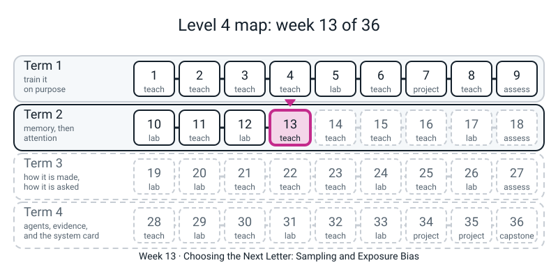
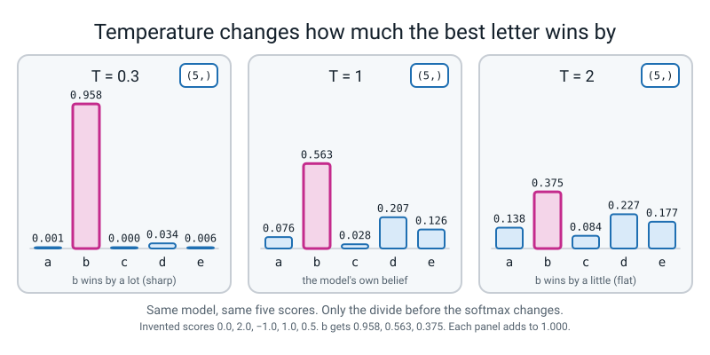
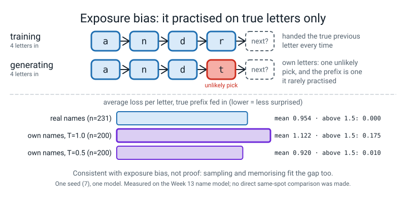

# Week 13 — Choosing the Next Letter: Sampling and Exposure Bias

[⬅ Week 12](week-12.md) · [Course Home](../README.md) · [Week 14 ➡](week-14.md) · [Student Guide](../student-guide/week-13.md) · [Workbook](../workbook/week-13.md)

---

## 📋 At a Glance

This table gives the week's size, vocabulary, syntax and run times, so you can check the load before you plan.

| | |
|---|---|
| **Duration** | 70 minutes in class, then the workbook (~60-75 min, of which about 40 seconds is the computer working on the copy-task sweep) |
| **Type** | 🟦 Teach — one trained model, four ways of choosing from its answer, and one honest measurement of what goes wrong when it reads its own output |
| **Big idea** | A language model does not output a letter. It outputs **a score for every letter**, and *you* decide how to turn scores into a choice. **Greedy** (always the top score) repeats itself: our name model says `andrei` 200 times out of 200. **Temperature** reshapes the odds before the draw. **Top-k** and **top-p** cut off the unlikely tail. And a model trained only on *true* previous letters is, at generation time, fed *its own* letters, which it never practised on. |
| **New vocabulary** | greedy · temperature · top-k · top-p (nucleus) · sampling · novelty rate · exposure bias |
| **New maths** | **None.** Softmax and `exp` are Level 3 Week 13; dividing the scores by `T` first is one extra line of arithmetic. The only new *fact* is one you compute: the biggest probability divided by the smallest is `e^(gap / T)`. See the 🔢 box. |
| **New syntax** | `F.softmax(x, dim=-1)` · `torch.multinomial` · `torch.topk` · top-p via `torch.sort` + `torch.cumsum` (counted as one). That is all four. |
| **Dataset** | The 231 typed names (`l4lib.names`, the same list Week 12 trained on) and, for the homework, a generated copy task (random symbols, a gap, the same symbols again). **Nothing downloads. No internet.** |
| **Model** | A **real, small LSTM name model** (`namelm.py`: the Week 12 model, about 800 full-batch steps, **3.5 seconds** on the author's CPU) and, for the copy task, real `nn.RNN` / `nn.LSTM` layers. **There is no scripted backend and no stand-in anywhere in this week.** The "language model" here is 231 names' worth: it is a toy and it is ours. |
| **Materials** | Laptop with Python 3 and torch (nothing new to install) · the folder that contains `l4lib/` · the printed **tasting sheet** (Activity) · a pen and a calculator · workbook pages 13.1-13.5 · a timer |
| **Prep time** | 30 minutes the night before · 3 minutes on the day |
| **Expected runtime of the code** | Every file below finishes in **under 4 seconds**, except `copytask.py` (**about 33 seconds**, ten short training runs). The whole set takes about **55 seconds**. Anything over **2 minutes** means something is wrong (see Fallback). |

> **⚠️ Watch out:** two things go wrong this week.
>
> - **"More novel" gets heard as "better".** At temperature 1.5, 118 of the 200 generated names are not in the training list, and a good share of those are `inditrr` and `nnanvir`. A new string is not a new *name*. Novelty is a count made with a loop; quality is a judgement made by reading, so the Tasting (Activity) has the student judge before seeing the count.
> - **The exposure-bias measurement is suggestive, not a proof.** The model finds its own samples more surprising than real names (1.122 against 0.954). That is what drift would look like; it is also partly what *sampling at temperature 1* looks like. Section 7 says what the number does and does not show. Say "**is consistent with**", not "**proves**".


*Figure 13.0 — Where this week fits: week 13 of 36, in term 2 (memory, then attention).*

---

## 🎯 Lesson Objectives

These are the outcomes the lesson is built around, and the evidence you can collect for each.

By the end of the lesson the student can:

1. **Say what the model actually outputs** (one score per letter) and turn scores into probabilities with `F.softmax(scores, dim=-1)`, saying out loud what `dim=-1` means (along the last axis).
2. **Predict, then measure, what temperature does:** low `T` sharpens (T=0.3 puts 0.958 on the best of five letters), high `T` flattens (T=2 puts 0.375), and `T=1` is the model's honest belief.
3. **Draw a letter** with `torch.multinomial`, and check with 10,000 draws that the shares match the probabilities.
4. **Write top-k and top-p** with `torch.topk`, `torch.sort` and `torch.cumsum`, and say what each cuts off.
5. **Count, not eyeball,** how the sampler changes distinct names and new names out of 200, and say which count is *not* a quality measure.
6. **Explain exposure bias in two sentences:** trained on true prefixes, run on its own; and quote the one measurement from today (0.954 vs 1.122 per letter) with its limits.

Observable evidence: a filled **sampler table** (distinct / new out of 200 for each sampler); the **Tasting sheet** with the student's "real or not" marks and the reveal; the predicted-then-measured **temperature table**; and, as homework, the copy-task sweep.

---

## 🧑‍🏫 What YOU Need to Know First

This section is the teacher's preparation: the maths, the new constructs, the expected numbers and the limits of the week's claims. Read it before class; none of it is for the student.

> **📌 About the code blocks in this guide.** Every block in the **🧰 Prep Checklist**, in the **🐞 Debugging Clinic** and in the **🔑 Answer Key** is a *whole file* that was run, from one folder next to `l4lib/`, on a CPU with one thread and the seeds shown; the outputs below are the real printed output. The Clinic blocks that are *deliberate mistakes* are marked and their tracebacks are real. **Timing is the only thing that varies run to run; every other number repeated exactly on a second full run on the same machine.** Different CPU or PyTorch build: the last digit of a probability can move, and a count of "new names" can move by a name or two. **Week 12 is not in this folder yet** when this guide was written, so `namelm.py` is the Week 12 name model *re-typed from the course plan and the reference module*. If your Week 12 files differ, use the student's: Week 13 needs only a trained model with `init_state(1)` and `step(tok, state)` (see section 4).

### 1. What the student is doing today, in one paragraph

Last week they trained a character model on 231 typed names, and it produced names such as `dira` and `arjav`. They never asked *how* a letter gets picked from the model's answer. Today they open that box.

They start with five invented scores and turn them into probabilities, then reshape the probabilities with a temperature and **predict each time what will happen before they run it**. They draw letters at random and check that 10,000 draws match the probabilities. They write the four pickers, plug each one into the Week 12 generator, and count what comes out: greedy gives the same name every time, high temperature gives many new strings and many bad ones, top-p sits between.

Then comes a blind tasting: forty unlabelled names from four samplers, and the student marks which they believe are real names before you reveal which sampler made which. The last ten minutes are one measurement: the model scores its own names worse than real ones, and why a model trained on the truth can still drift when it reads its own words.

### 2. 🔢 The maths you need — taught to you first

**There is no new mathematical idea.** Softmax is Level 3 Week 13: exponentiate every score, divide by the total. **Temperature** adds one step in front: **divide every score by `T` first.** Do this once by hand, before class. Five scores for the letters `a b c d e`: `0.0, 2.0, -1.0, 1.0, 0.5`, and `T = 1`:

| Letter | score | `exp(score)` | ÷ total (13.124) |
|:--:|:--:|:--:|:--:|
| a | 0.0 | 1.000 | **0.076** |
| b | 2.0 | 7.389 | **0.563** |
| c | -1.0 | 0.368 | **0.028** |
| d | 1.0 | 2.718 | **0.207** |
| e | 0.5 | 1.649 | **0.126** |

(Total: 1.000 + 7.389 + 0.368 + 2.718 + 1.649 = 13.124. The five probabilities add to 1.) `five.py` prints these. Now `T = 2`: the scores become `0.0, 1.0, -0.5, 0.5, 0.25`, the exps are `1.000, 2.718, 0.607, 1.649, 1.284`, the total is 7.258, and the probabilities are `0.138, 0.375, 0.084, 0.227, 0.177`: the best letter has gone from 0.563 to 0.375 and the worst from 0.028 to 0.084. At `T = 0.3` the scores become `0, 6.67, -3.33, 3.33, 1.67` and `b` takes 0.958.

**The one extra fact (optional for the student, a gift for the quick one).** The *ratio* of the biggest probability to the smallest does not depend on the other letters at all: it is `e^(gap / T)`, where `gap` is the biggest score minus the smallest. With a gap of 3.0: at `T = 1` the ratio is `e^3 = 20.1`; at `T = 2` it is `e^1.5 = 4.5`; at `T = 0.3` it is `e^10 = 22,026`. `key.py` checks this against the softmax. Why it matters: *temperature does not change which letter is best; it changes how much the best one wins by.* **Say that sentence. It is the whole point of the dial.** And it is why `T → 0` is greedy and `T → ∞` is a fair die, and why `T = 0` itself is an error (Clinic 7): you cannot divide by zero.

**Top-k** is "keep the `k` best, forget the rest, re-share": softmax over only the survivors' scores. With `k = 3` on the five scores above the survivors are `b, d, e` with scores `2.0, 1.0, 0.5`, and the shares are `0.629, 0.231, 0.140` (not 0.563, 0.207, 0.126: the dropped letters' 0.104 has been handed back out in proportion).

**Top-p** is "keep the smallest group of best letters whose probabilities add up to at least `p`". Sort the probabilities big to small: `0.563, 0.207, 0.126, 0.076, 0.028`. Running total: `0.563, 0.770, 0.896, 0.972, 1.000`. For `p = 0.9` you need to go to the *fourth* letter (0.896 is just under 0.9, 0.972 is over), so four letters are kept and only `c` (0.028) is dropped. **The off-by-one that catches everyone:** the test is "*the total of the letters above this one is still below `p`*", not "*the total including this one is below `p`*". With the second test, a top letter that alone holds 0.8 would be dropped for `p = 0.5` and *nothing* is left (Clinic 6). `before = running total − own probability` is the fix, and `five.py` prints the `kept` row.

**Top-p adapts; top-k does not.** When the model is sure (0.95 on one letter) top-p keeps one or two letters; when it is unsure it keeps many. Top-k with `k = 5` keeps five either way. Say that once and move on.

> **🚫 What you must NOT claim about sampling.**
> 1. **Greedy is not "the best answer".** It is the single most likely *next letter* at every step. That is not the same as the most likely *name* (a name whose first letter is slightly less likely can have a far more likely rest). Today's data cannot test that claim, so do not make it in either direction.
> 2. **A lower temperature does not make the model "more accurate".** It makes it repeat the commonest thing. At `T = 0.5`, 198 of 200 names are copies of training names. That is recitation, not accuracy.
> 3. **"New" is not "good".** The new-name count includes every misspelling. Quality needs a human, or a measured proxy, and the proxy we have (the model's own per-letter loss) is the model grading its own homework.


*Figure 13.1 — Temperature does not change which letter is best, only how much it wins by.*

### 3. 🧭 Real vs stand-in — and what you must NOT claim

| Thing | Real or stand-in? |
|---|---|
| The trained name model (`namelm.py`), every probability, every count of names | **Real.** PyTorch on the CPU, seed 0, 800 steps on 231 names. Final training loss 1.026. |
| The five scores for `a b c d e` in `five.py` | **Invented by us** to make the arithmetic readable. They are not from any model. |
| The first-letter probabilities in the Hook (`a` 0.09, `s` 0.06, ...) | **Real**, read off the trained name model. |
| The 231 names | **Typed by the course author** (not scraped, not downloaded). Every claim about "new names" is relative to *this list*, not to the world: `lora` is new to the list and is a perfectly real name. |
| `torch.multinomial` | **Real random draws**, seeded with `torch.manual_seed`. Different seed, different names. |
| The Tasting sheet | **Generated by `sheet.py`**, seeded. The student's marks are opinion; the reveal is count. |
| The copy task | **Generated** by a seeded loop: random symbols, filler, the same symbols again. The RNN and LSTM are really trained for 1,500 steps each, ten runs, about 33 seconds. |
| Any large language model | **Not present.** Nothing today is "how ChatGPT does it"; the *same four ideas* (temperature, top-k, top-p, and the train-on-truth/run-on-own-output gap) are real settings of real systems, and that is all we claim. |

> **Say to the student, out loud:** *"The model is the same in every experiment today. Only the choosing rule changes. Everything you see is the rule."*

### 4. The four new constructs, for somebody who has never seen them

**(a) `F.softmax(x, dim=-1)` — probabilities along the last axis.**

```python
import torch
import torch.nn.functional as F

scores = torch.tensor([0.0, 2.0, -1.0, 1.0, 0.5])    # the five scores from `five.py`
probs = F.softmax(scores, dim=-1)       # scores: any shape; the LAST axis becomes probabilities
print(probs)
```

(The four small snippets in this section run top to bottom in one session: each uses the names made by the ones above.)

Read as: *"turn each row of scores into a row of probabilities that adds to 1."* The student has met this idea as `torch.softmax(scores, dim=1)` in Level 3 Week 26; `F.softmax` is the same function under the `F.` name Week 12 introduced for `F.cross_entropy`. **What is new is the habit `dim=-1`:** `-1` means "the last axis", whatever the shape, so the same line works for one row of five scores and for a batch of 64 rows. Leaving out `dim` makes PyTorch guess, and it prints a `UserWarning` saying so (we saw it; it guessed the right axis for a 1-D and a 2-D input, and we did not test other shapes). **Always write it.** A *wrong* `dim` gives no warning at all and is a silent mistake (Clinic 1: the columns add to 1 and the rows do not).

**(b) `torch.multinomial(probs, n)` — a random draw, in proportion.**

```python
pick = torch.multinomial(probs, 1)                          # ONE index, as a tensor of shape (1,)
many = torch.multinomial(probs, 10000, replacement=True)    # many draws; replacement=True lets one letter repeat
print(pick, many.shape)
```

Read as: *"spin a wheel where letter `i` owns `probs[i]` of the rim."* Three things to know. **It wants probabilities, not scores** (negative numbers fail: Clinic 2). **It returns a tensor, not a plain number** (`tensor([0])`): to use it as a dictionary key or a letter id, wrap it in `int(...)` (Clinic 3). **It does not need the probabilities to add to 1**; it only needs them non-negative and not all zero. We lean on that in `top_p`, where the dropped letters are multiplied by 0 and nothing is re-divided. (If you ask the student to rely on it, say so; if it feels like magic, add a `/ kept.sum()`: the draws are the same.) With `n` larger than the number of letters you must say `replacement=True`; without it PyTorch stops with `cannot sample n_sample > prob_dist.size(-1) samples without replacement` (we ran it).

**(c) `torch.topk(scores, k)` — the `k` best, and where they were.**

```python
vals, ids = torch.topk(scores, 3)       # vals: the 3 biggest scores, biggest first; ids: their positions
print(vals, ids)
```

Read as: *"give me a pair: the k largest values, and the places they came from."* It returns **two** things, exactly like `out, h_n = rnn(x)` in Week 8 (use that: *"another pair"*). Taking the softmax of `vals` alone is the re-sharing step. `ids` is how you get back from the survivors' position to the letter. `k` larger than the number of scores is an error (Clinic 8).

**(d) `torch.sort` + `torch.cumsum` — the top-p pair (counted as one).**

```python
sorted_p, order = torch.sort(probs, descending=True)    # big to small, plus where each came from
running = torch.cumsum(sorted_p, dim=-1)                 # running total: each entry is the sum so far
print(sorted_p, order, running)
```

Read as: *"line the letters up from most to least likely, and keep a running total as you walk down."* `sort` also returns a pair (sorted values, original positions). `cumsum` is the running total: `[0.563, 0.207, 0.126]` becomes `[0.563, 0.770, 0.896]`. `order[...]` maps a position in the sorted list back to a letter id. Then one line of **boolean times number**: `sorted_p * (before < p)` — `True` counts as 1 and `False` as 0, so letters that fail the test become 0. (Boolean-times-number is new to the student in this form; say it in words: *"the test gives yes/no; yes keeps the number, no zeroes it."*)

**The helper the student receives, not types:** `next_scores` in `namelm.py` (the Week 12 generation step). It runs one step, reads the 28 scores for the next letter, and sets the padding score to `-1e9` so that padding can never be chosen. Everything in it is Week 11-12; the only thing to point at is `logits[PAD] = -1e9` ("a score so low its probability is zero").

### 5. The other code the student types — nothing new, but note these

- `lambda s: temperature(s, T=0.5)`: a one-line function (Week 4) used to **fix** a setting so every sampler looks the same to the generator: *"give me scores, I give you a letter."* This is the only trick in `namegen.py`; draw it on the board as a plug: the generator has one socket, `pick`, and each sampler is a plug that fits it.
- `int(tensor)`: tensor to plain number.
- `torch.manual_seed(seed)` before each batch of names: **every sampler gets the same seed, so the comparison is fair** (and, in `sheet.py`, a *different* seed per sampler, so no two share a random stream; the first draft of the sheet had `lora` and `olga` appear under two samplers because they shared one).
- `class NameLSTM(nn.Module)` with `__init__` and `forward` (Level 3 Week 23); `nn.LSTMCell` (Week 11); `F.cross_entropy(..., ignore_index=PAD)`, `torch.cat`, `torch.full` (Week 12); `torch.stack` (Week 10); `clip_grad_norm_` (Week 6); `AdamW` (Week 3).
- `with torch.no_grad():` (Level 3 Week 21), `model.eval()` (Level 3 Week 23; Clinic 5 is what happens without it).
- `torch.randint` (a given line, copied; its proper week is 17) in the copy task; `nn.RNN` / `nn.LSTM` as whole-sequence layers (Weeks 8 and 11); `out, _ = rnn(x)` unpacking the pair and ignoring the second half (Week 8; the underscore is a name meaning "I do not need this").
- `.float().mean()` on a True/False tensor: the share of Trues.
- **Teacher-only, flagged:** `sys.argv` and `if __name__ == "__main__"` in `copytask.py`, so you can run `python3 copytask.py rnn`. The student's version just loops over both cells.

**Not used today, on purpose**, because they are later rungs: `masked_fill`, `torch.tril` (Week 15), `torch.where` (Week 24), `@torch.no_grad()` as a decorator (Week 17), and any pretrained model. If the student asks *"how do real systems stop it saying nonsense?"*: *"temperature and top-p, the ones we just built, and a few more we will meet in Weeks 23-24."*

### 6. What the numbers will say

All printed by the files below. Read them before class so nothing surprises you.

- **The five-letter table.** `T = 0.3`: `b = 0.958`. `T = 1`: `b = 0.563`. `T = 2`: `b = 0.375`; the sums are all `1.000`. Ten draws and 10,000 draws; the 10,000-draw shares `0.073, 0.563, 0.027, 0.204, 0.132` sit within about a hundredth of `0.076, 0.563, 0.028, 0.207, 0.126`.
- **The first letter.** The model's top five first letters are `a 0.09, s 0.06, d 0.052, c 0.051, r 0.05`: a *flat* distribution. Greedy picks `a` every time with **9%** confidence. (It then walks `a`, `n`, `d`, `r`, `e`, `i` and stops: `andrei`.)
- **The sampler table (seed 0, 200 names each).** Greedy: 1 distinct, 0 new. `T = 0.5`: 111 distinct, **2** new. `T = 1.0`: 155 distinct, **32** new. `T = 1.5`: 192 distinct, **118** new. Top-k 5: 73 distinct, 18 new. Top-p 0.9: 128 distinct, 7 new. Top-p 0.9 *with* `T = 1.5`: 159 distinct, 50 new.
- **How much the new-name count moves with the seed.** `T = 1.0`, three seeds: 32, 35, 31 new of 200. So a gap of one or two names between two samplers is nothing; the table's differences (2 vs 32 vs 118) are very much more than the spread.
- **Three ways to be greedy.** Top-k with `k = 1`, top-p with `p = 0.01` and greedy all give `andrei` only; `T = 0.01` gives two names (`andrei` and `anders`: after `and` the model gives `r` 0.484 and `e` 0.474, nearly tied, and `T = 0.01` is small but not zero).
- **The Tasting.** In `sheet.py`'s seed, the number of the ten names *that are in the 231*: `T=0.5` 10/10; top-p 0.9 9/10; `T=1.0` 7/10; `T=1.5` 4/10. Teacher key and student sheet are in the Activity.
- **Exposure bias.** Real names: mean 0.954 per letter, median 0.936. The model's own `T = 1` names: mean **1.122**, median 0.957, gap **+0.167**, and **17.5%** of them score above 1.5 per letter, against **0%** of the real names. At `T = 0.5`: mean 0.920, gap **−0.035**.
- **The copy sweep** (1,500 steps, 64 hidden, chance 0.125, one seed): RNN `1.000, 0.384, 0.129, 0.127, 0.127` at gaps of 1, 5, 10, 20, 40; LSTM `0.996, 0.987, 0.959, 0.130, 0.130`.


*Figure 13.2 — The model is more surprised by its own names than by real ones; that fits exposure bias but does not prove it.*

### 7. The honest limits of today

1. **The model is tiny and so is the data.** 231 names, one seed, one model. Everything about "greedy repeats itself" is about *this* model: with only 231 names the model has half-memorised the list, which is why `T = 0.5` recites. A large model trained on a large corpus will not behave identically.
2. **Novelty is measured against 231 names, not against the world.** `lora` and `deria` count as "new" and are fine names. The new-name count is an upper bound on the number of *invented* names and a lower bound on nothing.
3. **The exposure-bias gap is not a clean test of drift.** Four things sit inside the +0.167. (i) *Drift*, as taught: one unlikely letter makes a prefix the model has not practised on, so its next prediction is worse. (ii) *Plain sampling entropy*: at `T = 1` the model deliberately picks letters it gave low probability to, and then the same model, scoring the finished name, sees those letters as low probability. (iii) *Memorisation*: at `T = 0.5` the model recites training names it has seen, and a seen name scores low (0.920 is *below* the real mean 0.954 because the model has partly learned the list). (iv) *The comparison group is the training set*: the 231 "real" names are what the model trained on (final loss 1.026), so 0.954 is a training-set score, the 0% above 1.5 is a training-set fact, and 1.122 is roughly the model's own average entropy, because the letters were sampled from the model and then scored by it. The scoring also uses the sampled prefix as context, so it never measures how errors compound. Held-out real names would be the fairer comparison.

   So **the `T = 0.5` result shrinking to −0.035 is consistent with drift but does not prove it**: shrinking also follows from (ii) and (iii). The tail does show something real: 17.5% of own names score above 1.5 per letter and no real name does.

   The measurement we did *not* make is the clean one (feed the model its own prefix and the true prefix at the same position and compare the next-letter loss), and we did not run a repeat at other seeds. Do not claim more than: **"the model is more surprised by its own names than by real ones, and a long right tail is where it is most surprised."**
4. **The median line uses the two ledgers differently.** The module's median for own names is 0.958; `exposure.py` prints 0.957. The module used numpy, whose median of an even count averages the two middle values; PyTorch's `median()` returns the *lower* of the two (the printed `tensor(2.)` for `[1, 2, 3, 4]` is the demonstration). It is a 0.001 difference and the reason is the library, not a different model.
5. **The copy task is one seed at one training budget.** The cliff (RNN at chance by gap 10, LSTM by gap 20) is a statement about *1,500 steps and hidden size 64*. We did not test longer training, a tuned forget bias, or other seeds. The reference module's own run, which uses a loop of cells instead of the whole-sequence layers used here, gives RNN `1.000, 0.438, 0.129, 0.127, 0.127` and LSTM `0.998, 0.996, 0.984, 0.130, 0.130`: the same pattern, and a difference of up to 0.054 at one point between two implementations of the same idea. **Read a difference of 0.05 in a single cell of this table as noise.**
6. **Sampling from a model is only half of "how do I get a good name".** Reranking, filtering and a human are the other half; today shows the first half and the mark of its limits.

### 8. The misconceptions you will actually meet

1. **"Temperature is how smart or how random the model is."** It changes the *odds at the moment of choosing*, and nothing about the model. Run `T = 0.3` and `T = 2` on the *same* trained model, which is what `namegen.py` does.
2. **"Greedy is the model's best guess, so it should be the best output."** It is the best guess *one letter at a time*, and it repeats: `andrei` 200 times. Do not argue it; run it.
3. **"The sampler is part of the model."** It is a rule in the generation loop. We swap it with a `lambda` without touching the weights. The weights never change today.
4. **"Top-p 0.9 means 90% of the names are good."** It means: keep the smallest set of letters that holds 90% of the probability *at each step*. It says nothing about the finished names.
5. **"A new name means the model is creative."** It means the string is not in a list of 231. See limit 2.
6. **"If I train longer the model stops drifting."** Training longer on true prefixes makes it better at true prefixes. The gap between "fed the truth" and "fed itself" is, on the standard explanation, a property of how it was trained rather than of how long. (We did not test that; it is the standard explanation, and today's evidence is only consistent with it.)

### 9. How deep to go, and where to stop

Stop at: *"the model gives scores; a rule chooses; the rule changes what comes out, and the choice you make at each step becomes the input to the next."* Do **not** go into beam search, repetition penalties, min-p, logit bias, contrastive decoding, scheduled sampling (the usual named fix for exposure bias; if the student asks, one sentence: *"let the model read some of its own letters during training; it is a research area and we do not build it"*) or anything about how it works in a chat product. If the student asks *"is there a best sampler?"*: *"There is a trade between repeating and rambling; the dial is how you choose the point. We measured the trade (distinct, new). The best point depends on what the output is for."*

### 10. 🧭 Where Week 13 sits

```text
   W8   a cell that remembers          W12  teach it names: trained on the TRUE previous letter
   W10  why memory fades               W13  choose the next letter; train-on-truth vs run-on-own (today)
   W11  gates keep it
                                       W14  attention: the softmax you wrote today is the weighting
   W9   Review & Assessment 1                (Week 14 reuses F.softmax; Week 18 asks about sampling)
```

---

## 🧰 Prep Checklist

This section lists what to set up and run before class, with every file in full and its real output.

### 30 minutes the night before

- [ ] **Confirm the stack and the shared kit.** Run from the folder that contains `l4lib/`:

```bash
python3 -c "import torch; print(torch.__version__)"
python3 -c "from l4lib.names import NAMES, VOCAB_SIZE; print(len(NAMES), VOCAB_SIZE)"
```

You must see (the first line's digits may differ on another PyTorch version; the second comes from the shared kit):

```text
2.2.1
231 28
```

If `l4lib` is not found you are in the wrong folder. `pip` returning 403 is expected and not an error; **nothing this week installs anything.**

- [ ] **Type the files below into one working folder** (next to `l4lib/`). Run each one, in order, and compare with the output printed here. `namelm.py` and `samplers.py` are *modules* the others import; they print nothing.

**File 1 — `namelm.py`** (the Week 12 model, as a module; if your Week 12 file differs, use the student's)

```python
# namelm.py - the Week 12 name model, kept as a module so Week 13 can import it.
# (If your Week 12 file is different, use yours: Week 13 needs only init_state() and step().)
import torch
import torch.nn as nn
import torch.nn.functional as F
from l4lib.names import NAMES, PAD, EOS, ITOS, VOCAB_SIZE, MAXLEN, encode, decode

torch.set_num_threads(1)

data = torch.tensor([encode(n) for n in NAMES])          # (231, 8): letters, EOS, PAD
inputs = torch.cat([torch.full((len(NAMES), 1), PAD), data[:, :-1]], dim=1)   # shift right
targets = data


class NameLSTM(nn.Module):
    def __init__(self, vocab=VOCAB_SIZE, emb=24, hidden=64, p_drop=0.3):
        super().__init__()
        self.hidden = hidden
        self.emb = nn.Embedding(vocab, emb)
        self.cell = nn.LSTMCell(emb, hidden)
        self.drop = nn.Dropout(p_drop)
        self.out = nn.Linear(hidden, vocab)

    def init_state(self, B):
        return torch.zeros(B, self.hidden), torch.zeros(B, self.hidden)

    def step(self, tok, state):
        """ONE step: a token in, scores for the next token out, and the new (h, c)."""
        state = self.cell(self.emb(tok), state)
        return self.out(self.drop(state[0])), state

    def forward(self, x):
        state, rows = self.init_state(x.shape[0]), []
        for t in range(x.shape[1]):
            logits, state = self.step(x[:, t], state)
            rows.append(logits)
        return torch.stack(rows, 1)


def train(steps=800, seed=0):
    torch.manual_seed(seed)
    model = NameLSTM()
    opt = torch.optim.AdamW(model.parameters(), lr=3e-3, weight_decay=0.1)
    for step in range(steps):
        model.train()
        logits = model(inputs)
        loss = F.cross_entropy(logits.reshape(-1, VOCAB_SIZE), targets.reshape(-1), ignore_index=PAD)
        opt.zero_grad(set_to_none=True)
        loss.backward()
        torch.nn.utils.clip_grad_norm_(model.parameters(), 1.0)
        opt.step()
    model.eval()
    return model, loss.item()


def next_scores(model, tok, state):
    """Scores for the next letter, with the padding id switched off (it is never a real answer)."""
    with torch.no_grad():
        logits, state = model.step(tok, state)
    logits = logits[0]
    logits[PAD] = -1e9
    return logits, state


def make_name(model, pick):
    """Generate one name. pick(scores) -> an int id. The model's own pick is fed back in."""
    state, tok, ids = model.init_state(1), torch.tensor([PAD]), []
    for _ in range(MAXLEN):
        scores, state = next_scores(model, tok, state)
        i = pick(scores)
        if i == EOS:
            break
        ids.append(i)
        tok = torch.tensor([i])
    return decode(ids)
```

**File 2 — `samplers.py`** (the four pickers; the student types this one in class, one function at a time)

```python
# samplers.py - the four ways to turn scores into one choice. Each takes scores, returns an int id.
import torch
import torch.nn.functional as F


def greedy(scores):
    return int(scores.argmax())


def temperature(scores, T=1.0):
    probs = F.softmax(scores / T, dim=-1)
    return int(torch.multinomial(probs, 1))


def top_k(scores, k=5, T=1.0):
    vals, ids = torch.topk(scores, k)                 # the k best scores and where they were
    probs = F.softmax(vals / T, dim=-1)               # softmax over the survivors = renormalised
    return int(ids[torch.multinomial(probs, 1)])


def top_p(scores, p=0.9, T=1.0):
    probs = F.softmax(scores / T, dim=-1)
    sorted_p, order = torch.sort(probs, descending=True)
    before = torch.cumsum(sorted_p, dim=-1) - sorted_p     # total of the letters ranked above
    kept = sorted_p * (before < p)                         # keep a letter if the ones above it had not yet reached p
    return int(order[torch.multinomial(kept, 1)])          # multinomial does not need them to add to 1
```

**File 3 — `five.py`** (the live-code file: five scores, five views)

```python
# five.py - Week 13: one set of scores for five letters, turned into probabilities five ways.
import torch
import torch.nn.functional as F

letters = "abcde"
scores = torch.tensor([0.0, 2.0, -1.0, 1.0, 0.5])      # the model's raw scores ("logits")

def show(name, p):
    print(f"{name:<12}", " ".join(f"{letters[i]}={float(p[i]):.3f}" for i in range(len(letters))), f"  sum={float(p.sum()):.3f}")

# 1. softmax: scores -> probabilities that add to 1. dim=-1 means "along the last axis".
show("T=1", F.softmax(scores, dim=-1))

# 2. temperature: divide the scores by T first.
for T in [0.3, 1.0, 2.0]:
    show(f"T={T}", F.softmax(scores / T, dim=-1))

# 3. multinomial: draw ONE index at random, in proportion to the probabilities.
torch.manual_seed(0)
p = F.softmax(scores, dim=-1)
print("ten draws :", [letters[i] for i in torch.multinomial(p, 10, replacement=True)])
draws = torch.multinomial(p, 10000, replacement=True)
print("10000 draws, share of each letter:", [round(float((draws == i).float().mean()), 3) for i in range(5)])

# 4. topk: the k biggest scores, and the places they came from.
vals, ids = torch.topk(scores, 3)
print("top 3 scores:", vals.tolist(), "at places", ids.tolist())
kept3 = F.softmax(vals, dim=-1)                          # softmax over the survivors only
print("top-3 kept  ", " ".join(f"{letters[int(ids[j])]}={float(kept3[j]):.3f}" for j in range(3)))

# 5. top-p: sort big to small, running total, stop once the letters ranked above already reach p.
sorted_p, order = torch.sort(p, descending=True)
running = torch.cumsum(sorted_p, dim=-1)
print("sorted probs :", [round(float(x), 3) for x in sorted_p])
print("running total:", [round(float(x), 3) for x in running])
print("order        :", [letters[i] for i in order])
before = running - sorted_p
print("kept at p=0.9:", [bool(b) for b in (before < 0.9)])
```

Read the output beside the page:

```text
T=1          a=0.076 b=0.563 c=0.028 d=0.207 e=0.126   sum=1.000
T=0.3        a=0.001 b=0.958 c=0.000 d=0.034 e=0.006   sum=1.000
T=1.0        a=0.076 b=0.563 c=0.028 d=0.207 e=0.126   sum=1.000
T=2.0        a=0.138 b=0.375 c=0.084 d=0.227 e=0.177   sum=1.000
ten draws : ['e', 'd', 'b', 'e', 'c', 'd', 'b', 'b', 'b', 'b']
10000 draws, share of each letter: [0.073, 0.563, 0.027, 0.204, 0.132]
top 3 scores: [2.0, 1.0, 0.5] at places [1, 3, 4]
top-3 kept   b=0.629 d=0.231 e=0.140
sorted probs : [0.563, 0.207, 0.126, 0.076, 0.028]
running total: [0.563, 0.77, 0.896, 0.972, 1.0]
order        : ['b', 'd', 'e', 'a', 'c']
kept at p=0.9: [True, True, True, True, False]
```

The `T=1` and `T=1.0` rows are the same (the first is the plain softmax; the second is the temperature loop at `T = 1`: *dividing by one changes nothing*, a free sanity check). Ten draws are one seeded sample; the 10,000-draw shares are the check that `multinomial` does what the table says. In the top-p lines: the order is `b d e a c`, and `kept at p=0.9` is `True` for the first four and `False` for the last (that is the **sorted** order: `c` is the one dropped).

**File 4 — `namegen.py`** (the trained model under seven choosing rules; about 4 seconds)

```python
# namegen.py - Week 13: the same trained model, five ways of choosing. Count, do not eyeball.
import torch
from namelm import train, make_name, NAMES
from samplers import greedy, temperature, top_k, top_p

model, final_loss = train()
print(f"trained: final loss {final_loss:.3f}")
real = set(NAMES)

def run(label, pick, n=200, seed=0):
    torch.manual_seed(seed)
    names = [make_name(model, pick) for _ in range(n)]
    new = [x for x in names if x not in real and x != ""]
    print(f"{label:<14} distinct {len(set(names)):>3}/{n}   new {len(new):>3}/{n}   first five: {names[:5]}")
    return names

run("greedy", greedy)
run("T=0.5", lambda s: temperature(s, T=0.5))
run("T=1.0", lambda s: temperature(s, T=1.0))
run("T=1.5", lambda s: temperature(s, T=1.5))
run("top-k 5", lambda s: top_k(s, k=5))
run("top-p 0.9", lambda s: top_p(s, p=0.9))
run("T=1.5 top-p .9", lambda s: top_p(s, p=0.9, T=1.5))
```

```text
trained: final loss 1.026
greedy         distinct   1/200   new   0/200   first five: ['andrei', 'andrei', 'andrei', 'andrei', 'andrei']
T=0.5          distinct 111/200   new   2/200   first five: ['sanna', 'anders', 'katya', 'rachna', 'aditi']
T=1.0          distinct 155/200   new  32/200   first five: ['serge', 'anzel', 'maren', 'arnav', 'zuri']
T=1.5          distinct 192/200   new 118/200   first five: ['ulaj', 'iris', 'wanda', 'olan', 'jadei']
top-k 5        distinct  73/200   new  18/200   first five: ['devika', 'renata', 'rachna', 'rustam', 'asha']
top-p 0.9      distinct 128/200   new   7/200   first five: ['esha', 'andrei', 'hilde', 'anders', 'kajsa']
T=1.5 top-p .9 distinct 159/200   new  50/200   first five: ['esran', 'amara', 'hilde', 'anders', 'kajsa']
```

`trained: final loss 1.026` is the check that `namelm.py` trained exactly as intended (the reference module's own LSTM run ends on 1.026). If it says anything else, the model or the seed is not the course's and the counts below will not match; the *shape* (greedy: 1 distinct; T=1.5: many new) will.

**File 5 — `exposure.py`** (the model grades its own names; about 4 seconds)

```python
# exposure.py - Week 13: how does the model score its OWN names, compared with the real ones?
import torch
import torch.nn.functional as F
from namelm import train, make_name, NAMES, PAD, VOCAB_SIZE, MAXLEN, encode
from samplers import temperature

model, _ = train()

def per_letter_loss(words):
    """Average loss per letter for each word, with the TRUE previous letters fed in (teacher forcing)."""
    out = []
    with torch.no_grad():
        for w in words:
            ids = torch.tensor([encode(w[:MAXLEN - 1])])
            x = torch.cat([torch.full((1, 1), PAD), ids[:, :-1]], dim=1)
            loss = F.cross_entropy(model(x).reshape(-1, VOCAB_SIZE), ids.reshape(-1), ignore_index=PAD)
            out.append(loss.item())
    return torch.tensor(out)

def generate(T, n=200, seed=7):
    torch.manual_seed(seed)
    names = [make_name(model, lambda s: temperature(s, T=T)) for _ in range(n)]
    return [x for x in names if x != ""]

real = per_letter_loss(NAMES)
print(f"real names     n={len(real):>3}  mean {real.mean():.3f}  median {real.median():.3f}")
for T in [1.0, 0.5]:
    own = per_letter_loss(generate(T))
    print(f"own, T={T}     n={len(own):>3}  mean {own.mean():.3f}  median {own.median():.3f}"
          f"  gap {own.mean() - real.mean():+.3f}  worst {own.max():.2f}"
          f"  share above 1.5: {float((own > 1.5).float().mean()):.3f}")
print(f"real above 1.5: {float((real > 1.5).float().mean()):.3f}")
```

```text
real names     n=231  mean 0.954  median 0.936
own, T=1.0     n=200  mean 1.122  median 0.957  gap +0.167  worst 2.74  share above 1.5: 0.175
own, T=0.5     n=200  mean 0.920  median 0.908  gap -0.035  worst 2.44  share above 1.5: 0.010
real above 1.5: 0.000
```

**File 6 — `sheet.py`** (the Tasting sheet and its key; about 4 seconds). Print the first block (the heading and the forty names) for the student; **keep the key**.

```python
# sheet.py - Week 13 activity: the Name Tasting. Ten names from each of four samplers, shuffled, unlabelled.
# TEACHER-ONLY file: uses enumerate, which is not on the student ladder. The student never types this.
import random
import torch
from namelm import train, make_name, NAMES
from samplers import temperature, top_p

model, _ = train()
real = set(NAMES)
makers = {
    "A": ("T=0.5",          lambda s: temperature(s, T=0.5)),
    "B": ("T=1.0",          lambda s: temperature(s, T=1.0)),
    "C": ("T=1.5",          lambda s: temperature(s, T=1.5)),
    "D": ("top-p 0.9",      lambda s: top_p(s, p=0.9)),
}
rows = []
for k, (tag, (label, pick)) in enumerate(makers.items()):
    torch.manual_seed(13 + k)          # a different seed per sampler, so no two share a random stream
    for _ in range(10):
        rows.append((make_name(model, pick), tag))
random.Random(13).shuffle(rows)

print("THE SHEET (student copy: numbers and names only)")
for i, (name, _) in enumerate(rows, 1):
    print(f"{i:>2}. {name}")
print()
print("TEACHER KEY (sampler, and whether the name is in the 231)")
for i, (name, tag) in enumerate(rows, 1):
    print(f"{i:>2}. {name:<8} {tag} {makers[tag][0]:<10} {'in the 231' if name in real else 'NEW'}")
print()
for tag, (label, _) in makers.items():
    mine = [n for n, t in rows if t == tag]
    print(f"{tag} {label:<10} in the 231: {sum(n in real for n in mine)}/10   shortest {min(map(len, mine))} letters")
```

The output is in 🎲 The Activity, In Full.

**File 7 — `copytask.py`** (homework, and a prep run so you know what the student will see; about 33 seconds)

```python
# copytask.py - Week 13 homework + prep: how long a gap can the memory bridge? (5 symbols, a gap, the same 5 again)
import sys
import torch
import torch.nn as nn
import torch.nn.functional as F

torch.set_num_threads(1)
L, N_SYM = 5, 8                      # copy 5 symbols; 8 different symbols; id 8 = "filler"
FILL = N_SYM

def batch(B, D):
    core = torch.randint(0, N_SYM, (B, L))                      # 5 random whole numbers 0..7 per row (copy it; Week 17 explains)
    seq = torch.cat([core, torch.full((B, D), FILL), core], dim=1)
    start = torch.full((B, 1), FILL)
    return torch.cat([start, seq[:, :-1]], dim=1), core         # shift right: teacher forcing

class Copier(nn.Module):
    def __init__(self, kind, hidden=64):
        super().__init__()
        self.emb = nn.Embedding(N_SYM + 1, 16)
        self.rnn = nn.RNN(16, hidden, batch_first=True) if kind == "rnn" else nn.LSTM(16, hidden, batch_first=True)
        self.out = nn.Linear(hidden, N_SYM + 1)

    def forward(self, x):
        h, _ = self.rnn(self.emb(x))
        return self.out(h)

def run(kind, D, steps=1500, seed=0):
    torch.manual_seed(seed)
    model = Copier(kind)
    opt = torch.optim.AdamW(model.parameters(), lr=3e-3)
    for _ in range(steps):
        x, core = batch(64, D)
        loss = F.cross_entropy(model(x)[:, -L:].reshape(-1, N_SYM + 1), core.reshape(-1))   # score only the copy
        opt.zero_grad(set_to_none=True)
        loss.backward()
        torch.nn.utils.clip_grad_norm_(model.parameters(), 1.0)
        opt.step()
    torch.manual_seed(99)
    with torch.no_grad():
        x, core = batch(512, D)
        return float((model(x)[:, -L:].argmax(dim=-1) == core).float().mean())

if __name__ == "__main__":
    for kind in sys.argv[1:] or ["rnn", "lstm"]:
        print(kind, "  ".join(f"D={D} {run(kind, D):.3f}" for D in [1, 5, 10, 20, 40]), flush=True)
```

```text
rnn D=1 1.000  D=5 0.384  D=10 0.129  D=20 0.127  D=40 0.127
lstm D=1 0.996  D=5 0.987  D=10 0.959  D=20 0.130  D=40 0.130
```

**File 8 — `key.py`** (every number in the answer key, computed; about 4 seconds)

```python
# key.py - Week 13: every number in the answer key, computed. Nothing here is new teaching.
# TEACHER-ONLY file: uses zip, which is not on the student ladder. The student never types this.
import math
import torch
import torch.nn.functional as F
from namelm import train, make_name, NAMES
from samplers import greedy, temperature, top_k, top_p

# H1: the homework distribution, five letters s t a r e.
letters = "stare"
scores = torch.tensor([1.5, 1.0, 0.0, -0.5, 2.5])
for T in [0.3, 1.0, 2.0]:
    p = F.softmax(scores / T, dim=-1)
    print(f"T={T}:", {letters[i]: round(float(p[i]), 3) for i in range(len(letters))},
          f" top/bottom ratio {float(p.max() / p.min()):.1f}  (e^({float(scores.max() - scores.min()):.1f}/{T}) = {math.exp(float(scores.max() - scores.min()) / T):.1f})")

# H2: top-k and top-p by hand on the module's scores [2, 1, 0.5, 0], T = 1.
p = F.softmax(torch.tensor([2.0, 1.0, 0.5, 0.0]), dim=-1)
print("probs      :", [round(float(x), 3) for x in p])
print("top-2 kept :", [round(float(x), 3) for x in p[:2] / p[:2].sum()])
cum = torch.cumsum(p, dim=-1)
print("running    :", [round(float(x), 3) for x in cum])
print("top-p 0.9  :", [round(float(x), 3) for x in p[:3] / p[:3].sum()], "(first three, 0.922 reaches 0.9)")
print("top-p 0.5  :", "just the first letter: before it the total is 0, and 0 < 0.5; before the second, 0.579 is not < 0.5")

# H3: the edge cases - three ways to be greedy.
model, _ = train()
def firsts(pick, n=20, seed=0):
    torch.manual_seed(seed)
    return sorted(set(make_name(model, pick) for _ in range(n)))
print("greedy        :", firsts(greedy))
print("top-k, k=1    :", firsts(lambda s: top_k(s, k=1)))
print("top-p, p=0.01 :", firsts(lambda s: top_p(s, p=0.01)))
print("T=0.01        :", firsts(lambda s: temperature(s, T=0.01)))

# H4: how much do the novelty counts move with the seed? (T=1.0, 200 names each)
real = set(NAMES)
for seed in [0, 1, 2]:
    torch.manual_seed(seed)
    names = [make_name(model, lambda s: temperature(s, T=1.0)) for _ in range(200)]
    print(f"seed {seed}: new {sum(1 for x in names if x and x not in real)}/200")

# H5: the first-letter distribution the model actually holds (what greedy throws away).
from namelm import next_scores
from l4lib.names import ITOS, PAD
scores0, _ = next_scores(model, torch.tensor([PAD]), model.init_state(1))
p0 = F.softmax(scores0, dim=-1)
vals, ids = torch.topk(p0, 5)
print("first letter, top five at T=1:", [(ITOS.get(int(i), "EOS"), round(float(v), 3)) for v, i in zip(vals, ids)])
```

```text
T=0.3: {'s': 0.034, 't': 0.006, 'a': 0.0, 'r': 0.0, 'e': 0.959}  top/bottom ratio 22026.5  (e^(3.0/0.3) = 22026.5)
T=1.0: {'s': 0.214, 't': 0.13, 'a': 0.048, 'r': 0.029, 'e': 0.58}  top/bottom ratio 20.1  (e^(3.0/1.0) = 20.1)
T=2.0: {'s': 0.234, 't': 0.182, 'a': 0.111, 'r': 0.086, 'e': 0.386}  top/bottom ratio 4.5  (e^(3.0/2.0) = 4.5)
probs      : [0.579, 0.213, 0.129, 0.078]
top-2 kept : [0.731, 0.269]
running    : [0.579, 0.792, 0.922, 1.0]
top-p 0.9  : [0.629, 0.231, 0.14] (first three, 0.922 reaches 0.9)
top-p 0.5  : just the first letter: before it the total is 0, and 0 < 0.5; before the second, 0.579 is not < 0.5
greedy        : ['andrei']
top-k, k=1    : ['andrei']
top-p, p=0.01 : ['andrei']
T=0.01        : ['anders', 'andrei']
seed 0: new 32/200
seed 1: new 35/200
seed 2: new 31/200
first letter, top five at T=1: [('a', 0.09), ('s', 0.06), ('d', 0.052), ('c', 0.051), ('r', 0.05)]
```

- [ ] **Run them all once as a set**, from one folder, and check nothing fails: `for f in five namegen exposure sheet copytask key; do python3 $f.py > /dev/null || echo FAIL $f; done`. It should print nothing and take about 55 seconds.
- [ ] **Print** workbook pages 13.1-13.5, the **student half of the Tasting sheet** (the first 40 lines of `sheet.py`'s output), and the key for yourself.
- [ ] **Read the Debugging Clinic** and copy the eight `bad*.py` files to a scratch folder so they are ready to plant (`bad5.py` imports `namelm.py` and `samplers.py`, so keep them next to it).

### 3 minutes on the day

- [ ] Open `five.py` and `samplers.py` in the editor as **empty files**, for typing together.
- [ ] Put the printed Tasting sheet, a pen and the timer on the desk. **Keep the key face down.**

### Fallback if the laptops fail

| Problem | What to do |
|---|---|
| `ModuleNotFoundError: l4lib` | You are in the wrong folder; `namelm.py` imports `l4lib.names`. Run everything from the folder that contains `l4lib/`. |
| `ModuleNotFoundError: torch` | `python3 -m pip` is blocked; use a machine that already has torch. Without torch, run the lesson from the printed outputs and the Tasting sheet, which needs only a pen. |
| `namegen.py` prints `final loss` other than 1.026 | The model or seed differs (a different Week 12 file, or the thread count). `torch.set_num_threads(1)` is at the top of `namelm.py`; keep it. Use your own numbers for the sampler table; **the pattern is what you teach**. |
| `five.py`'s 10,000-draw shares differ in the third decimal | Different PyTorch build. Fine; the lesson is that they are close to the table. |
| `copytask.py` takes over 2 minutes | An older CPU or other work running. Run `python3 copytask.py rnn` (the quarter that matters) or cut `steps` to 500: the cliff stays, the numbers move. **Say so on the page.** |
| `multinomial` raises `invalid multinomial distribution` or `inf, nan` | See the Debugging Clinic: a temperature of 0, a top-p that kept nothing, or scores given instead of probabilities. |
| No laptop at all | Run the lesson from the printed outputs in this guide; the table on page 13.1, the Tasting and the by-hand top-p work on paper. |

---

## ⏱️ The Lesson, Minute by Minute

This section is the full-lesson plan: five segments, each with the words to say and the steps to take.

| Segment | Minutes | What happens |
|---|:--:|---|
| 🪝 Hook | 6 | "Pick the best letter every time": greedy says `andrei`, 200 times out of 200. Why? |
| 🧠 Concept | 12 | Scores to probabilities; temperature as a dial; predict before you see; top-k and top-p on the board |
| 💻 Live-code | 22 | `five.py` (10 min), then `samplers.py` and a first run of `namegen.py` (12 min) |
| 🎲 Their turn | 24 | The Tasting (12 min); the exposure-bias measurement (8 min); the sampler table (4 min) |
| 🔑 Wrap & assign | 6 | The trade, the limit, the homework |

### 🪝 Hook — The Name That Came Out 200 Times (6 minutes)

**Do not open the editor yet. Open `namegen.py`'s first line of output.** (You ran it before class; have the greedy line on screen or on paper.)

1. **(2 min) Last week's question.** *"Your model made names. At every letter it had a choice. How did it choose?"* Let them answer: probably *"the most likely one"*. *"Let us find out what happens if it always does."*
2. **(2 min) The reveal.** Show: `greedy  distinct 1/200  new 0/200  first five: ['andrei', 'andrei', 'andrei', 'andrei', 'andrei']`. *"Two hundred tries. One name."* Ask: *"Is that a name generator?"* Let them say no.
3. **(2 min) The surprise inside it.** Say: *"Here is what the model believed at the very first letter."* Write on the board `a 0.09, s 0.06, d 0.052, c 0.051, r 0.05`. *"The model is not sure about the first letter. It thinks `a` is at most one chance in eleven. Greedy takes that tiny edge, every time, and then at the second letter, the third... it can never choose differently."* Write on the board:

> **"The model gives scores. Something else has to choose."**

*If the student says "just pick randomly":* that is exactly the other end of the dial. Pure random from the scores has a problem too, which we measure in ten minutes.

### 🧠 Concept — Scores, a Dial, and a Knife (12 minutes)

**(3 min) What comes out of the model.** Draw:

```text
   letters so far:  a  n  d
                    |  |  |
                [ the model ]          28 scores, one per letter (and one for "stop")
                    |
      a: 0.4   b: -1.2   ...   r: 2.1   e: 1.9   ...  stop: -0.3
```

*"It never says a letter. It says a score for every letter. Bigger is more likely. To pick, we need chances that add to 1. Level 3 Week 13: exponentiate, divide by the total. That is **softmax**."* Write `F.softmax(scores, dim=-1)` and say: *"minus one means the last axis; the scores are on the last axis."*

**(4 min) The dial, predicted first.** Write five scores on the board and **make them predict before they compute**: *"Divide every score by T first. T is 0.3, then 1, then 2. For the best letter: does its probability go up or down as T gets bigger?"* Take the answer, write `up / down` for the three, and only then run `five.py`'s table. They will get "down" (0.958, 0.563, 0.375). *"Temperature does not change which letter is best. It changes how much the best one wins by."* Draw three bar charts side by side: one tall bar and four stumps, a staircase, a short stairs with similar bars. Name them: **sharp, honest, flat**.

**(2 min) The knife: top-k.** *"Even at T = 1 the worst letters have a chance, and one wild letter can ruin a name. Top-k: keep only the k best letters, and share the chance out again among them."* Point at the five letters, cross out the two worst, divide by what is left (the `0.629 / 0.231 / 0.140` numbers).

**(3 min) A knife that adjusts: top-p.** *"But what if the model is sure, and one letter holds 95%? Keeping 5 letters keeps four useless ones. What if instead we keep the fewest letters that add up to 90%?"* Do the running-total column on the board with `0.563, 0.207, 0.126, 0.076, 0.028` and say: *"when the model is sure the list is short; when it is unsure the list is long."* **Hold back the off-by-one** (before-total vs including-total); the student will meet it in the live code and the first error is the lesson.

### 💻 Live-Code Together — `five.py`, `samplers.py`, `namegen.py` (22 minutes)

The student types. You narrate. **Nobody pastes.**

**Step 1 (4 min) — softmax and temperature in `five.py`.** Type the top through the `for T in [0.3, 1.0, 2.0]` loop. **Before running, the student says the three best-letter probabilities in order (up or down).** Run. *"Same scores. Three different chances. We changed nothing in the model."*

**Step 2 (3 min) — the draw.** Type the `multinomial` lines. Before running the 10,000 draws: *"what share of the draws should be `b`?"* (about 0.56.) Run. *"A random wheel, in proportion. A thousand times more draws and the shares match the table."* Stress that `multinomial` returns **positions**, so we look up the letter ourselves.

**Step 3 (3 min) — `topk` and the sort/cumsum pair.** Type the last two blocks. Read `top 3 scores: [2.0, 1.0, 0.5] at places [1, 3, 4]` aloud: *"the three best scores and where they were: b, d, e."* Then: before running the last block, they say which letter top-p drops at `p = 0.9` (the one with the smallest chance, `c`).

**Step 4 (8 min) — `samplers.py`.** Type it function by function. **Do not type `top_p` last without letting them try the wrong version first**: write `kept = sorted_p * (torch.cumsum(sorted_p, dim=-1) < p)` if they suggest it, and run it on a table where the top letter holds 0.81 with `p = 0.5`. It dies with `invalid multinomial distribution`, and the fix (*the total of the letters ABOVE this one*) is the Clinic 6 lesson learned the hard way. Then type the right version. Ask: *"if p is tiny, say 0.01, how many letters survive?"* (One: the top letter always passes, because nothing is above it.) *"So tiny p is greedy."* The same goes for `k = 1`; `key.py` confirms it.

**Step 5 (4 min) — `namegen.py`.** Type only the `run` function and the `lambda` lines; paste nothing. Explain the plug picture: *"the generator has one socket, `pick`. Greedy fits it. `lambda s: temperature(s, T=0.5)` is temperature with the setting fixed, so it fits it too."* **Run greedy first (everyone has already seen it), then all seven lines** and let the table appear. **Stop. Do not read it out.** Say: *"Write down which row you think makes the best names. We are going to find out."* That is the Tasting.

### 🎲 Their Turn — The Tasting, the Self-Score, the Table (24 minutes)

1. **(12 min) The Name Tasting.** The student receives the forty-name sheet (no sampler labels) and marks every name **R** (*I believe this is a real name*) or **X** (*I do not*). Full rules and the key in 🎲 The Activity, In Full. You then read out the reveal: which sampler made which name, and how many of each sampler's ten are in the 231 (A, `T=0.5`: 10; B, `T=1.0`: 7; C, `T=1.5`: 4; D, top-p 0.9: 9). Ask them to compare **their R-count per sampler** with the **new-name counts** printed in `namegen.py`. The usual finding: the low-temperature sampler gets all `R`s and is also the most boring; the high-temperature one gets many `X`s on names such as `inditrr` and `nnanvir`. The *interesting* group is top-p, which often gets nearly as many `R`s as `T=0.5` and *is not the same ten names repeated*.
2. **(8 min) The model grades itself.** Run `exposure.py` together. Before it runs: *"The model has to score a name: how surprised is it by each letter, given the true letters before it? Which scores worse on average: real names, or names the model made itself?"* Collect predictions (most say "its own names score better, because they are its own"). Run. **They are usually wrong.** Real 0.954; own, `T = 1`: 1.122. Then draw the picture:

```text
   TRAINING                          GENERATING
   gets the TRUE previous letter     gets its OWN previous letter
        a n d r _                         a n d t _
        ^ ^ ^ ^                                  ^   one wrong letter...
        always on the road                        ...and now the prefix is one it never practised on
```

Say: *"In training, someone always hands it the right letters. In generating, nobody does. One unlikely letter, and it is reading a prefix it has hardly seen. That is called exposure bias: it was only ever exposed to the truth."* Then **do not stop there**: *"Is that proved by 1.122 against 0.954? What else could make its own names score worse?"* (Let them find *"it picked unlikely letters on purpose, because T = 1"*.) Show the `T = 0.5` line (gap −0.035) and say honestly: *"the gap closes at T = 0.5. That fits the story. It also fits 'at T = 0.5 it is just reciting names it has seen'. Two stories, one number; we say what we measured."* (Section 7, limit 3.)
3. **(4 min) Fill the sampler table** on page 13.1 from `namegen.py`: sampler, distinct out of 200, new out of 200, and one sentence each: *"repeats"*, *"rambles"*, *"in between"*.

**Stop at 24 minutes.** If the Tasting overran, drop the sampler-table sentences (homework); never drop the exposure measurement.

### 🔑 Wrap & Assign (6 minutes)

1. **(2 min)** *"What are the three things we built? One: scores to chances to a choice. Two: three ways to shape the choice: dial, count, and total. Three: the model reads its own words, and nobody handed it the truth. What did we **not** do?"* (Change the model; fix exposure bias; prove it.) *"Right."*
2. **(1 min)** *"Greedy gave one name 200 times. Which sampler would you use for naming a baby, and which would you use for a spelling checker?"* Take any answer with a reason (high-ish temperature, because new names; greedy or very low `T`, because a checker wants the most likely).
3. **(2 min)** Hand out the workbook. Say the two homework tasks (the predicted-then-measured table; the copy-task sweep) and: *"The copy sweep is the one thing in this course that takes the computer 30 seconds. Read the table, not the clock."*
4. **(1 min)** One sentence ahead: *"The softmax you typed today comes back in Week 14 with a different job: deciding how much each earlier word matters. Same function, new reason."*

---

## 🐞 The Debugging Clinic

Every error below was produced by running the code. **Paths will differ on your machine**; here they are shown as `/home/you/l4/`. Each mistake is deliberate: you plant it, the student reads the traceback (or the surprising output) aloud, and you refuse to fix it until they have said what it means. **Two are silent**: the program runs and prints a wrong answer. Those are the dangerous ones, and they are marked.

### How to teach debugging without giving the answer

1. *"Read me the last line."* (It says what went wrong; the lines above say where.)
2. *"Which of your files is on the line above it?"*
3. *"What did you expect that line to do?"*
4. Only then: *"What is different?"*

For the silent mistakes: *"Does anything look wrong?"* Make them check a property that must be true (rows add to 1; T changes the answer).

### Mistake 1 — softmax over the wrong axis (SILENT)

```python
# DELIBERATE MISTAKE 1 (SILENT): softmax over the wrong axis on a batch of score rows.
import torch
import torch.nn.functional as F

scores = torch.tensor([[2.0, 1.0, 0.0],
                       [0.0, 0.0, 0.0]])        # two rows of scores: two different next-letter choices
p = F.softmax(scores, dim=0)                    # dim=0 runs DOWN the columns; we wanted dim=-1
print(p)
print("row sums:", p.sum(dim=-1))
```

```text
tensor([[0.8808, 0.7311, 0.5000],
        [0.1192, 0.2689, 0.5000]])
row sums: tensor([2.1119, 0.8881])
```

**Read it:** each *column* adds to 1 (`0.8808 + 0.1192`), but each *row* does not (`2.1119` and `0.8881`). The rows are the examples; each should add to 1. **Fix:** `dim=-1`. **Why it is silent:** every number is a perfectly good probability; it is just a probability *over the wrong thing*. With a single row of scores (as in `five.py`) the mistake cannot show itself, which is why the habit is `dim=-1` always. *The check:* `p.sum(dim=-1)` must be all ones.

### Mistake 2 — scores given to `multinomial` (loud)

```python
# DELIBERATE MISTAKE 2 (loud): multinomial was given raw scores, not probabilities.
import torch

scores = torch.tensor([2.0, 1.0, -1.0, 0.5])
print(torch.multinomial(scores, 1))
```

```text
Traceback (most recent call last):
  File "/home/you/l4/bad2.py", line 5, in <module>
    print(torch.multinomial(scores, 1))
RuntimeError: probability tensor contains either `inf`, `nan` or element < 0
```

**Read it:** the last line says an element is below 0: the score `-1.0`. `multinomial` takes **chances**, and a negative number cannot be a chance. **Fix:** `torch.multinomial(F.softmax(scores, dim=-1), 1)`. (If all four scores had been positive it would have run without complaint, and given a wrong distribution: it would have treated the scores as unnormalised chances. A reason to always pass through softmax.)

### Mistake 3 — a tensor where a number is wanted (loud)

```python
# DELIBERATE MISTAKE 3 (loud): multinomial returns a tensor; a dictionary wants a plain number.
import torch
import torch.nn.functional as F

letters = {0: "a", 1: "b", 2: "c"}
p = F.softmax(torch.tensor([2.0, 1.0, 0.0]), dim=-1)
pick = torch.multinomial(p, 1)
print("pick is", pick)
print(letters[pick])
```

```text
pick is tensor([1])
Traceback (most recent call last):
  File "/home/you/l4/bad3.py", line 9, in <module>
    print(letters[pick])
KeyError: tensor([1])
```

**Read it:** the key that was looked up is `tensor([0])`, a tensor, and the dictionary only has the plain number `0`. **Fix:** `letters[int(pick)]`. Say: *"`multinomial` hands back a tensor even when you asked for one draw; `int(...)` turns it into a plain number."*

### Mistake 4 — temperature applied after the softmax (SILENT)

```python
# DELIBERATE MISTAKE 4 (SILENT): temperature applied AFTER the softmax. T=0.3 and T=3.0 now do the same thing.
import torch
import torch.nn.functional as F

scores = torch.tensor([2.0, 1.0, 0.5, 0.0])
def pick_many(T, n=10000):
    torch.manual_seed(0)
    p = F.softmax(scores, dim=-1) / T                     # <-- divides the probabilities, not the scores
    draws = torch.multinomial(p, n, replacement=True)
    return [round(float((draws == i).float().mean()), 3) for i in range(4)]
print("T=0.3 ", pick_many(0.3))
print("T=3.0 ", pick_many(3.0))
print("right answer at T=0.3:", [round(float(x), 3) for x in F.softmax(scores / 0.3, dim=-1)])
```

```text
T=0.3  [0.574, 0.217, 0.128, 0.081]
T=3.0  [0.574, 0.217, 0.128, 0.081]
right answer at T=0.3: [0.958, 0.034, 0.006, 0.001]
```

**Read it:** `T=0.3` and `T=3.0` give *identical* shares (`0.574, 0.217, 0.128, 0.081`), and they are the `T = 1` shares, not the sharp `0.958` the last line shows is correct. **Why:** dividing every probability by the same number does nothing to their *relative* sizes, and `multinomial` only cares about relative sizes (it does not need the total to be 1, which is exactly why this mistake runs without a murmur). **Fix:** divide the **scores**, then softmax: `F.softmax(scores / T, dim=-1)`. *The check:* change `T` and see that the output changes.

### Mistake 5 — sampling with dropout still on (SILENT)

```python
# DELIBERATE MISTAKE 5 (SILENT): sampling with the model still in train mode (dropout on).
import torch
from namelm import train, make_name
from samplers import greedy

model, _ = train()
print("eval mode :", sorted(set(make_name(model, greedy) for _ in range(20))))
model.train()                                            # <-- dropout is back on, as if model.eval() had never been called
print("train mode:", sorted(set(make_name(model, greedy) for _ in range(20))))
```

```text
eval mode : ['andrei']
train mode: ['aditi', 'ahel', 'ahmed', 'amara', 'anders', 'andrei', 'anika', 'anita', 'armin', 'arnav', 'asha', 'aslan', 'astrid', 'astrin', 'elodie', 'sasha']
```

**Read it:** greedy is deterministic, so twenty calls must give one name. In eval mode it does: `['andrei']`. With dropout on, the same greedy picker gives sixteen different names, because dropout switches off a random set of numbers on every call and so the scores change from call to call. **Fix:** `model.eval()` before generating, and say so in the code. (This is Week 5's silent mistake in a new place; ask *"where have we seen this?"*) Note that `make_name` here is not at fault: the picker was greedy and the *model* was random.

### Mistake 6 — top-p keeps nothing (loud)

```python
# DELIBERATE MISTAKE 6 (loud): top-p written with "running total < p" instead of "total ABOVE it < p".
import torch
import torch.nn.functional as F

p = F.softmax(torch.tensor([3.0, 1.0, 0.0, 0.0]), dim=-1)      # the top letter alone holds about 0.8
sorted_p, order = torch.sort(p, descending=True)
print("sorted:", [round(float(x), 3) for x in sorted_p])
kept = sorted_p * (torch.cumsum(sorted_p, dim=-1) < 0.5)       # asked for the smallest set reaching 0.5
print("kept  :", kept)
print(order[torch.multinomial(kept, 1)])
```

```text
sorted: [0.81, 0.11, 0.04, 0.04]
kept  : tensor([0., 0., 0., 0.])
Traceback (most recent call last):
  File "/home/you/l4/bad6.py", line 10, in <module>
    print(order[torch.multinomial(kept, 1)])
RuntimeError: invalid multinomial distribution (sum of probabilities <= 0)
```

**Read it:** the top letter holds 0.81 on its own, the test was "the total *including* this letter is below 0.5", **no letter passes**, `kept` is all zeros, and there is nothing to draw from. **Fix:** compare the total of the letters *above* — `before = torch.cumsum(sorted_p, dim=-1) - sorted_p` — so the first letter always passes (nothing is above it). This is the off-by-one from section 2; students who skip the board explanation arrive here.

### Mistake 7 — a temperature of zero (loud)

```python
# DELIBERATE MISTAKE 7 (loud): temperature of exactly zero, to "make it greedy".
import torch
import torch.nn.functional as F

scores = torch.tensor([2.0, 1.0, 0.5, 0.0])
p = F.softmax(scores / 0.0, dim=-1)
print(p)
print(torch.multinomial(p, 1))
```

```text
tensor([nan, nan, nan, nan])
Traceback (most recent call last):
  File "/home/you/l4/bad7.py", line 8, in <module>
    print(torch.multinomial(p, 1))
RuntimeError: probability tensor contains either `inf`, `nan` or element < 0
```

**Read it:** `scores / 0.0` is infinity, softmax of infinities is `nan` ("not a number"), and `multinomial` refuses `nan`. The *printed* `p` is the real clue: a row of `nan`. **Fix:** for "greedy", call the greedy picker, not `T = 0`; for "nearly greedy", `T = 0.01` (which gives two names in `key.py`: nearly, not exactly).

### Mistake 8 — `k` bigger than the number of letters (loud)

```python
# DELIBERATE MISTAKE 8 (loud): top-k with k bigger than the number of letters.
import torch

scores = torch.tensor([2.0, 1.0, 0.5, 0.0, -1.0])
vals, ids = torch.topk(scores, 8)
print(vals)
```

```text
Traceback (most recent call last):
  File "/home/you/l4/bad8.py", line 5, in <module>
    vals, ids = torch.topk(scores, 8)
RuntimeError: selected index k out of range
```

**Read it:** you cannot ask for the eight best of five. **Fix:** `k = min(k, len(scores))` (the student already knows `min`), or keep `k` below the vocabulary size. (In the name model there are 28 scores, so `k = 5` never trips this; it bites on a tiny table such as the five letters.)

---

## 🎲 The Activity, In Full

This section gives the Name Tasting in full: setup, rules, reveal and key.

### The Name Tasting

**Purpose.** To make the student judge quality *before* seeing a count, and to find out that "new" and "good" are different columns. **Materials:** the student half of the sheet (below), a pen, your key.

### Setup (2 minutes, during the live-code segment)

Print only the first block of this output (the forty numbered names). Fold or cover the second block. The sheet is produced by `sheet.py`, seeded; every name came from the trained model, ten from each of four samplers, shuffled.

```text
THE SHEET (student copy: numbers and names only)
 1. vilma
 2. kasild
 3. marisol
 4. senna
 5. cato
 6. armun
 7. lora
 8. gemra
 9. celia
10. zaid
11. pavel
12. deria
13. tarek
14. tatiana
15. lakshmi
16. urho
17. inditrr
18. olga
19. nnanvir
20. gustav
21. magnus
22. jarl
23. gurgus
24. anika
25. valeria
26. armin
27. devika
28. brenan
29. pablo
30. javier
31. bela
32. anders
33. oorja
34. felix
35. jaden
36. kavya
37. klara
38. dara
39. rodea
40. bianca

TEACHER KEY (sampler, and whether the name is in the 231)
 1. vilma    A T=0.5      in the 231
 2. kasild   C T=1.5      NEW
 3. marisol  B T=1.0      in the 231
 4. senna    D top-p 0.9  in the 231
 5. cato     C T=1.5      in the 231
 6. armun    B T=1.0      NEW
 7. lora     B T=1.0      NEW
 8. gemra    C T=1.5      NEW
 9. celia    A T=0.5      in the 231
10. zaid     A T=0.5      in the 231
11. pavel    A T=0.5      in the 231
12. deria    D top-p 0.9  NEW
13. tarek    D top-p 0.9  in the 231
14. tatiana  C T=1.5      in the 231
15. lakshmi  D top-p 0.9  in the 231
16. urho     D top-p 0.9  in the 231
17. inditrr  C T=1.5      NEW
18. olga     A T=0.5      in the 231
19. nnanvir  C T=1.5      NEW
20. gustav   D top-p 0.9  in the 231
21. magnus   C T=1.5      in the 231
22. jarl     B T=1.0      in the 231
23. gurgus   C T=1.5      NEW
24. anika    D top-p 0.9  in the 231
25. valeria  B T=1.0      in the 231
26. armin    A T=0.5      in the 231
27. devika   D top-p 0.9  in the 231
28. brenan   C T=1.5      NEW
29. pablo    A T=0.5      in the 231
30. javier   C T=1.5      in the 231
31. bela     B T=1.0      in the 231
32. anders   A T=0.5      in the 231
33. oorja    A T=0.5      in the 231
34. felix    D top-p 0.9  in the 231
35. jaden    D top-p 0.9  in the 231
36. kavya    A T=0.5      in the 231
37. klara    B T=1.0      in the 231
38. dara     B T=1.0      in the 231
39. rodea    B T=1.0      NEW
40. bianca   B T=1.0      in the 231

A T=0.5      in the 231: 10/10   shortest 4 letters
B T=1.0      in the 231: 7/10   shortest 4 letters
C T=1.5      in the 231: 4/10   shortest 4 letters
D top-p 0.9  in the 231: 9/10   shortest 4 letters
```

### The rules, read out loud before the first mark

1. *"Forty names. Some are real names from a list, some the model invented, some are noise. You do not know which is which, or which machine made which."*
2. *"For each name write **R** if you could imagine meeting someone called that, **X** if not. One second each. Go with your gut."*
3. *"You may not look at the other sheet. You may not say anything. We reveal everything at the end."*

### The reveal (the part with the learning in it)

1. **(4 min) Group by sampler.** Read the key: for each of A, B, C, D, the student counts their own **R**s among the ten. Typical pattern: A (`T=0.5`) near 10 R; D (top-p) near 8-10 R; B (`T=1.0`) 7-8; C (`T=1.5`) 4-6. **Your student's own marks are the data; do not tell them what they should have got.** Real marks on a first run of this sheet are not recorded; the key below is the *measurement of the names*, not of the student.
2. **(3 min) The "in the 231" column** for each group: A 10/10, D 9/10, B 7/10, C 4/10. Ask: *"which group has the most names that are not in the list? Which of those did you mark R?"* (Expect `lora`, `deria` and `rodea` to draw R marks and `inditrr`, `nnanvir`, `gurgus` to draw X; your student's marks are the data.) This is the lesson: **new and good are different questions.**
3. **(3 min) The question that makes the activity:** *"A: ten names, every one a copy of a training name. Is A the best sampler?"* Let them say what A is *for* (a model that reads its list back). *"And C?"* Rambles. *"And top-p 0.9?"* Mostly known names, a few new, few junk. **Put it on the board as a trade, not a ranking.**
4. **(2 min) What would we need to say it properly?** Many more names, more than one seed, several judges. *"Ten names a sampler is a sample, not a finding."*

### The key

The teacher key is the second block printed above (`1. vilma  A T=0.5  in the 231` and so on, then the four summary lines). Key facts: **A `T=0.5` 10/10 in the 231; B `T=1.0` 7/10; C `T=1.5` 4/10; D top-p 0.9 9/10.** The new names are `kasild armun lora gemra deria inditrr nnanvir gurgus brenan rodea`.

### What "finished" looks like

A filled sheet, a per-sampler tally in the student's hand, and one sentence they wrote themselves about what *new* does and does not mean.

### Variation — easier

Ten names (the first ten lines) instead of forty; the student marks them and you reveal only the samplers (not the counts).

### Variation — harder

The student writes `sheet.py` for themselves with a *different* seed and a fifth sampler (top-k 5), swaps sheets with you, and you mark it blind. A student who finishes with time left may also repeat the sampler table over three seeds (`key.py` does this for `T=1.0`: 32, 35, 31 new of 200) and say which differences are larger than the spread.

---

## ❓ Questions Students Ask This Week

This section gives short, checked answers to the questions this lesson usually raises.

**"Why does greedy give the same name every time? Isn't there any randomness?"** There is none in greedy. The model's scores depend only on the letters so far, so the same start gives the same scores and the same top letter. The randomness is entirely in `multinomial`. (And when it appears anyway, check Clinic 5.)

**"What does `dim=-1` mean?"** The last axis. For a list of scores, that is the only axis; for a batch of rows it is the row direction. Always writing `-1` means we never have to count axes.

**"Why `replacement=True`?"** Drawing 10,000 letters from 5 means the same letter must come up again and again. Without replacement PyTorch would refuse to draw more than 5, because it would treat each letter as a ball that is used up. For the one-draw case in the sampler it does not matter.

**"Is temperature one in every model?"** `T = 1` is "no change": the model's own belief. Chat products tend to default to something near it and let the user move it. (We have not checked what any particular product uses; do not state a number.)

**"What is a 'nucleus'?"** Another name for the top-p set: the core of letters that holds most of the chance. "Top-p" and "nucleus sampling" are the same thing.

**"Which is better, top-k or top-p?"** Different. Top-k always keeps `k`; top-p keeps however many it takes. In our table at similar settings top-k 5 gives 73 distinct names and top-p 0.9 gives 128: they cut in different places. We did not tune either, and one seed does not rank them.

**"Can I use both temperature and top-p?"** Yes: the last row of `namegen.py` does (`T = 1.5` with `p = 0.9`): 159 distinct, 50 new, against `T = 1.5` alone 192 and 118. Top-p took the wild tail off the hot sampler.

**"If new names are not good, how would a computer decide a name is good?"** One proxy is the model's own per-letter loss, which is what `exposure.py` computes. The cost is that the model is marking its own homework; a name it likes is a name like its training names. A human judge is the other proxy. We use both and say which.

**"What is exposure bias fixing? Can I?"** The standard named fix is *scheduled sampling*: sometimes feed the model its own letters during training. We do not build it. Other fixes exist and we did not test any.

**"Why is the median 0.957 and the module says 0.958?"** The library: numpy averages the two middle numbers of an even-sized list, and PyTorch's `median()` returns the lower one. Section 7, limit 4.

**"Why does the LSTM fall to chance at gap 20 when people say LSTMs remember for ages?"** At 1,500 training steps and 64 units it does. We did not test longer training, other seeds or a tuned forget bias, so we can say what happened here and nothing about what LSTMs can do in general.

**"Will my numbers match yours?"** The by-hand numbers and `key.py`'s table are arithmetic and will match. The sampler counts, the Tasting and the copy sweep come from seeded random draws and matched exactly on a repeat on the same machine; another PyTorch build may move a count by a name or two or a copy accuracy by a few hundredths.

---

## ⚠️ Where This Lesson Goes Wrong

This table maps the symptoms you are likely to see to their cause and a response.

| Symptom | What is happening | What to do |
|---|---|---|
| The student reads the `new` column as a score | The count is for novelty, which the Tasting was designed to separate from quality | Go to the Tasting reveal; ask for *one* new name they marked X |
| The student says "temperature makes it smarter / dumber" | Temperature changes the odds, not the model | Run `T = 0.3` and `T = 2` on the same trained model |
| Top-p writes `cumsum < p` and everything fails | The off-by-one | Clinic 6 and the "letters *above*" sentence |
| Greedy output is different on each run | The model is in train mode | Clinic 5 |
| The exposure-bias number is quoted as proof | The gap has four ingredients | Section 7, limit 3; say "consistent with" |
| The copy sweep seems "broken" because the RNN is at 0.127 | 0.125 is chance for 8 symbols; the RNN is guessing | Say "chance is 1 in 8"; the cliff is the finding |
| The lesson overruns | The Tasting is the longest piece | Cut the second half of the live-code table narration, never the exposure measurement |

---

## 🧭 Differentiation

This section adjusts the lesson for a student who is struggling, flying or disengaged.

### If the student is struggling

Stay with five letters and one idea per pass: softmax, then temperature, then one draw. Skip top-p in the typing (show the printed running total and `kept` row) and keep top-k. The minimum viable lesson: they can say *"temperature makes the best letter win by more or less"*, they have typed `F.softmax(scores / T, dim=-1)`, and they have seen greedy give one name. Skip the self-scoring; do the Tasting only.

### If the student is flying

Give them the `e^(gap / T)` ratio (it is in `key.py`) and ask them to predict the `T = 2` ratio for a gap of 3 before computing (4.5). Then the challenge: *"write a sampler `top_p_k` that applies top-k first and then top-p to what is left, and tell me when it differs from either alone."* Then: *"the exposure-bias gap has four ingredients. Design one measurement that separates two of them"* (for instance, scoring names generated at `T = 1` after each letter is replaced with the model's top letter, or comparing the model's next-letter loss on a true prefix and on its own prefix at the *same* position). You do not have to have an answer; the point is a design.

### If the student won't engage today

Run the Tasting first. Forty names and a pen need no typing. Then: *"the machine that made C is the same machine that made A. What is different?"* That is the whole lesson, and it comes from the student's own reaction.

---

## ✅ Assessing Understanding

This section gives questions to ask aloud near the end, with what a good and a shaky answer sounds like. Do not rescue the student.

| Question | A good answer | A shaky answer |
|---|---|---|
| What does a language model output? | A score for every possible next letter | "The next letter" |
| What does temperature do? | Divides the scores first, so the best letter wins by more (low T) or less (high T). Same model. | "Makes it more creative" (no mechanism) |
| Why `dim=-1`? | The last axis is where the scores are; it works for any number of rows | "It is just what you write" |
| Why is greedy 200 copies of `andrei`? | It has no randomness, and the same start gives the same scores | "It is the best name" |
| What is the difference between top-k and top-p? | Top-k keeps a fixed number; top-p keeps however many it takes to reach `p` | Describes only one |
| Why is "new names" not a quality score? | It counts strings absent from a 231-name list, including noise | "Higher is better" |
| What is exposure bias, in a sentence? | Trained on true previous letters, it generates from its own, which it never practised on | "It is biased" |
| What can you say about the 1.122 vs 0.954? | The model is more surprised by its own names; this fits drift but does not prove it | "That proves drift" |

### Mastery scale for this week

| Level | Evidence |
|:--:|---|
| 🟥 Not yet | Cannot say what the model outputs; cannot predict the direction of T. |
| 🟨 Emerging | Predicts T correctly; runs `five.py`; cannot write top-p without help. |
| 🟩 Secure | Types top-k and top-p; predicts the table's direction; says why "new" is not "good"; quotes 0.954 vs 1.122 with "consistent with". |
| 🟦 Strong | Also explains the four ingredients in the exposure gap, or designs a cleaner test, or explains the `e^(gap / T)` ratio. |

---

## 📤 Homework to Assign

This section states what to set and how to mark the two assigned tasks.

~60-75 minutes, in the workbook, pages 13.1-13.5. The two assigned tasks:

1. **Predict, then measure (page 13.2).** Five new scores for `s t a r e` (`1.5, 1.0, 0.0, -0.5, 2.5`). **Before** running anything, the student writes, for `T = 0.3, 1, 2`, which letter will be the most likely and whether its share goes up or down, and then fills the table with `F.softmax(scores / T, dim=-1)` and checks. The key is `key.py`'s first block: `T=0.3`: `e 0.959`; `T=1`: `e 0.580`; `T=2`: `e 0.386`.
2. **The copy-task delay sweep (page 13.4), at the stated defaults:** 5 symbols out of 8, gaps `D = 1, 5, 10, 20, 40`, 1,500 steps, hidden size 64, both an `nn.RNN` and an `nn.LSTM`, one seed. About **33 seconds** in total. They report both rows, say what chance is (**0.125**) and name the gap at which each falls to chance. If their numbers differ from the answer key by about 0.05 in one cell, that is noise (limit 5).

Also on the page: the by-hand top-p on `[2, 1, 0.5, 0]` and the sampler table from class. The extension for the fast student is the 3-seed spread of novelty at `T = 1.0`.

---

## 🔑 Answer Key

This section is the teacher-only key for the workbook pages and for every question posed in the lesson.

### Page 13.1 — The sampler table (from `namegen.py`, seed 0, 200 names each)

| Sampler | distinct / 200 | new / 200 | One-word summary |
|---|:--:|:--:|---|
| greedy | 1 | 0 | repeats (`andrei` x 200) |
| T = 0.5 | 111 | 2 | recites |
| T = 1.0 | 155 | 32 | balanced |
| T = 1.5 | 192 | 118 | rambles |
| top-k 5 | 73 | 18 | narrow |
| top-p 0.9 | 128 | 7 | careful |
| T = 1.5 + top-p 0.9 | 159 | 50 | hot, with the tail cut |

Accept different one-word summaries with a number to back them. **The thing to mark is that they have the right *direction*:** more temperature, more distinct and more new; cutting the tail (top-p, top-k) at the same temperature brings both down.

### Page 13.2 — Predict, then measure (from `key.py`)

Scores `s t a r e` = `1.5, 1.0, 0.0, -0.5, 2.5`; the best letter is `e` at every `T`.

| T | s | t | a | r | e | best letter's share |
|:--:|:--:|:--:|:--:|:--:|:--:|:--:|
| 0.3 | 0.034 | 0.006 | 0.000 | 0.000 | 0.959 | **up** (vs T = 1) |
| 1.0 | 0.214 | 0.130 | 0.048 | 0.029 | 0.580 | (reference) |
| 2.0 | 0.234 | 0.182 | 0.111 | 0.086 | 0.386 | **down** |

**Part A (by hand, scores `0, 2, -1, 1, 0.5` for `a b c d e`):** at `T = 1` the `exp` total is `13.124` and the chances are `0.076, 0.563, 0.028, 0.207, 0.126`; at `T = 2` the total is `7.258` and the chances are `0.138, 0.375, 0.084, 0.227, 0.177`; the best letter `b` falls from `0.563` to `0.375`. (`T = 1` exps `1.000, 7.389, 0.368, 2.718, 1.649`; `T = 2` exps `1.000, 2.718, 0.607, 1.649, 1.284`.) Part B exps at `T = 1`: `4.4817, 2.7183, 1.0, 0.6065, 12.1825`, total `20.989`. Page 13.3 Part C: `exp` total `12.756`; worked example probabilities `0.032, 0.087, 0.644, 0.237`, top-p 0.8 keeps the first two (`0.731, 0.269`). **Part C:** 10,000 draws with `torch.manual_seed(0)` give shares `0.208, 0.131, 0.048, 0.030, 0.583` against the table's `0.214, 0.130, 0.048, 0.029, 0.580`: close, not identical. Mark the *prediction* and the *measurement* separately. Full marks for a wrong prediction that is honestly recorded and corrected. The extension: the best/worst ratio is `22,026.5` at `T = 0.3`, `20.1` at `T = 1`, `4.5` at `T = 2`, each equal to `e^(3.0 / T)` (the gap between the biggest score 2.5 and the smallest -0.5 is 3.0).

### Page 13.3 — Top-k and top-p by hand (from `key.py`; scores `[2, 1, 0.5, 0]`, `T = 1`)

Probabilities `0.579, 0.213, 0.129, 0.078`. **Top-2:** `0.731, 0.269` (drop the other two, re-share: `0.579 / 0.792` and `0.213 / 0.792`). **Running total:** `0.579, 0.792, 0.922, 1.000`. **Top-p 0.9:** the first three letters (the total *above* the third is `0.792 < 0.9`; above the fourth is `0.922`, not below), shares `0.629, 0.231, 0.140`. **Top-p 0.5:** just the first letter (nothing is above it; above the second the total is `0.579`, which is not below `0.5`). A student who answers "two letters" for top-p 0.5 used the *including* test: point at Clinic 6.

### Page 13.4 — The copy-task sweep (from `copytask.py`; chance = 0.125)

| Gap D | 1 | 5 | 10 | 20 | 40 |
|---|:--:|:--:|:--:|:--:|:--:|
| RNN | 1.000 | 0.384 | 0.129 | 0.127 | 0.127 |
| LSTM | 0.996 | 0.987 | 0.959 | 0.130 | 0.130 |

The RNN is at chance by D = 10; the LSTM holds to D = 10 and is at chance by D = 20 *at this training budget and size*. Accept the same pattern with each cell up to about 0.05 away. **Mark down** "the LSTM remembers 40 steps" (not what it showed), and "the RNN cannot remember at all" (it is perfect at D = 1). Full marks for: the two cliffs, the chance level, and one sentence of caution (one seed, 1,500 steps).

### Page 13.5 — Exposure bias in two sentences (model answer)

*"The model is trained only on true previous letters, but when it generates it is fed its own letters, which it never practised on. Measured: it scores its own `T = 1` names at 1.122 per letter against 0.954 for real names, with 17.5% of its own names above 1.5 and none of the real ones, which is consistent with drift, though sampling unlikely letters on purpose and reciting memorised names at low temperature also move the number."* Mark the first sentence for the mechanism, the second for the numbers and the caution. **Do not give full marks to "proves".**

### Page 13.4 Part B and Page 13.6 — the exposure table and the three bugs

Page 13.4 Part B (from `exposure.py`): real names mean `0.954`, own names at `T = 1.0` mean `1.122` (gap `+0.167`; share above 1.5 is `0.175`), at `T = 0.5` mean `0.920` (gap `-0.035`; share above 1.5 is `0.010`); real names above 1.5: `0.000`. Page 13.6: **A** (silent) `dim=0` gives row sums `1.3493, 1.6656, 0.9851`, fix `dim=-1`; **B** (silent) the output is `[0.836, 0.121, 0.043]` for both `T = 0.2` and `T = 5.0`, fix `F.softmax(scores / T, dim=-1)`; **C** (loud) `kept` is all zeros and `multinomial` raises `invalid multinomial distribution (sum of probabilities <= 0)`, fix `before = cumsum - sorted_p`, `kept = sorted_p * (before < 0.7)` which keeps one letter (`0.9362`). These are Clinic mistakes 1, 4 and 6; see the Debugging Clinic for the full tracebacks.

### Answers to every question posed in the lesson

- *Which letter is best at the first step, and with what confidence?* `a`, 9%. The five best are `a 0.09, s 0.06, d 0.052, c 0.051, r 0.05`.
- *Is 200 copies of `andrei` a name generator?* No: it is a recitation of one name; greedy has no randomness.
- *Does the best letter's probability go up or down as T grows?* Down: `0.958, 0.563, 0.375` for the five-letter table.
- *Which letter does top-p 0.9 drop in `five.py`?* `c` (probability 0.028, the smallest).
- *If p is tiny, how many letters survive?* One. The top letter always passes.
- *What share of 10,000 draws should be `b`?* About 0.563 (printed: 0.563).
- *Which scores worse, real names or the model's own?* The model's own, at `T = 1` (1.122 against 0.954). Most students predict the opposite.
- *What else could make its own names score worse?* Sampling unlikely letters on purpose at `T = 1`; and at `T = 0.5` the model recites names it has seen.
- *Which sampler for naming a baby, which for a spelling checker?* Any answer with a reason; the sensible pairing is a hotter or top-p sampler for names and greedy (or near-greedy) for a checker.
- *How many new names out of 200 does `T = 1.0` give, and how much does it move with the seed?* 32 (seed 0); 35 and 31 for seeds 1 and 2.

---

## 🔮 Next Week Preview

This section says how next week builds on today.

**Week 14 — Attention by Hand.** The recurrent cell carries one sticky note along the sentence, and Week 10 measured how fast the oldest part of that note fades. Attention takes the opposite approach: *look back at every earlier word and take a weighted average of what they said.* The weights are the same `F.softmax` you typed today, now deciding how much each earlier word counts. The only new maths is that weighted average: weights that add to 1, applied to values. The student does one three-word pass entirely with a pen, then in numpy, then in torch, and shows that all three agree. **Bring a pen and a calculator.**
