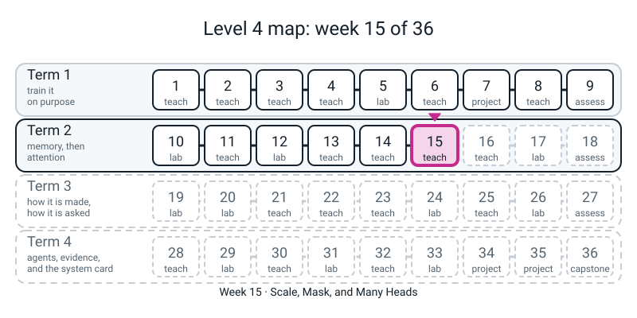
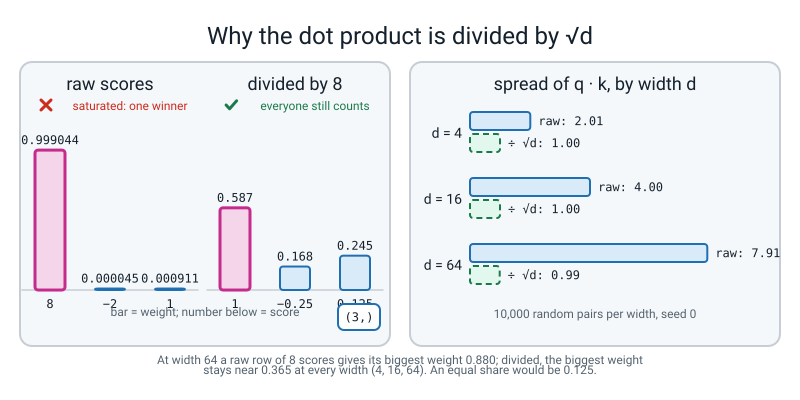
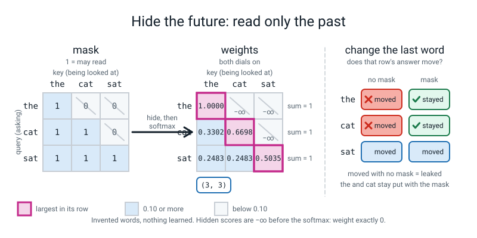

# Week 15 — Scale, Mask, and Many Heads

[⬅ Week 14](week-14.md) · [Course Home](../README.md) · [Week 16 ➡](week-16.md) · [Student Guide](../student-guide/week-15.md) · [Workbook](../workbook/week-15.md)

---

## 📋 At a Glance

| | |
|---|---|
| **Duration** | 70 minutes in class, then the workbook (~60 min: one pen pass, one page of softmax arithmetic, and about 10 minutes at the computer) |
| **Type** | 🟦 Teach — three repairs to Week 14's attention: a **divide** (so big scores do not freeze the softmax), a **mask** (so a word cannot read the future), and **heads** (so one word can share its attention more than one way) |
| **Big idea** | Week 14's pass used scores of 0, 1 and 2. Real scores come from dot products of long lists, and a long dot product has a **spread that grows with its length**: 2 at width 4, 4 at width 16, 8 at width 64. Scores that wide make the softmax pick one word and ignore the rest, so attention stops being soft. **Dividing by the square root of the width** keeps the spread at 1 at every width. Second, a model that predicts the next word must not be able to *read* the next word: **set the scores of the future to `-inf` before the softmax**. Done that way, one pass over a sentence of `T` words gives `T - 1` separate lessons at once. Third, **cut the width into heads**: the same number of knobs, shared out in several different ways at once. |
| **New vocabulary** | scale (the divide) · square root of the width · saturate · mask · causal mask · label leakage · head · head width (`dh`) |
| **New maths** | **Variances add.** Two independent wobbles of spread 3 and 4 do not make a wobble of spread 7; their *variances* add (`9 + 16 = 25`), so the spread is **5**. A dot product of `d` independent terms, each with variance 1, has variance `d` and spread `sqrt(d)`. **Measured with a seeded generator at `d` = 4, 16, 64; not proved.** See the 🔢 box. |
| **New syntax** | `scores.masked_fill(mask, float("-inf"))` · `torch.tril` · `.view(B, T, H, dh).transpose(1, 2)`. That is all three (the ladder allows four). |
| **Dataset** | None. The three invented words and tables of Week 14; random numbers from seeded generators; one typed five-word sentence for the "T lessons" print. **Nothing downloads. No internet.** |
| **Model** | **No model.** Nothing is trained. The tables with heads are **random and untrained**, to show shapes and checks. **There is no scripted backend and no stand-in anywhere in this week.** |
| **Materials** | Laptop with Python 3, numpy and torch (nothing new to install) · the student's Week 14 **Pen Pass** sheet (bring it) · the printed **Pen Pass 2** sheet (Activity) · a pen and a calculator · workbook pages 15.1-15.5 · a timer |
| **Prep time** | 25 minutes the night before · 3 minutes on the day |
| **Expected runtime of the code** | Every file below finishes in **well under 2 seconds**; the whole set about **1.5 seconds**. Anything over **30 seconds** means something is wrong (see Fallback). |

> **⚠️ Watch out:** two things go wrong this week. **First, the student takes "divide by `sqrt(d)`" as a magic trick** and will not be able to say what it is *for*. The whole point of the first half-hour is the printed table: spread **2, 4, 8** before, **1, 1, 1** after, and the softmax that stays soft. If they cannot say "the dot product gets wider as the list gets longer, and the divide gives it back a width of 1", the divide has not landed. **Second, "the mask hides the future" gets heard as "the model cannot see the future, so it is safe".** The mask is a rule about the *scores*. It is applied **before** the softmax and with `-inf`; `0` and "after the softmax" both run without an error and both give a wrong answer (Mistakes 3 and 4). Mark the *method and the checks* (each weight row adds to 1; nothing above the diagonal), not the last digit.


*Figure 15.0 — Where this week fits: week 15 of 36, in term 2 (memory, then attention).*

---

## 🎯 Lesson Objectives

By the end of the lesson the student can:

1. **Show that a softmax over wide scores freezes.** Scores `0.1, 2.0, 0.3` give weights `0.112, 0.751, 0.137`; the same scores ten times louder give `0.000, 1.000, 0.000`, and the "soft" lookup has become the hard lookup of Week 14.
2. **Say what "variances add" means and use it.** Spreads 3 and 4 add up to a spread of 5; a dot product of `d` terms has variance `d`, so its spread is `sqrt(d)`; dividing by `sqrt(d)` returns the spread to 1. They read the measured table (2, 4, 8 against 1, 1, 1).
3. **Apply the two dials by hand** to the Week 14 example and land on the reference module's numbers: the `cat` row `[0.6698, 0.3302]` and the `sat` row `[0.7517, 0.7517]`.
4. **Write the mask in torch:** `torch.tril(torch.ones(T, T))`, then `scores.masked_fill(mask == 0, float("-inf"))`, **before** `F.softmax`, and check two things afterwards: every row adds to 1, and everything above the diagonal is exactly 0.
5. **Say why `-inf` and not `0`, and why before and not after** — and show, by printing, what each wrong choice does.
6. **Say why a masked pass gives `T - 1` lessons** from one sentence, and show that changing the last word cannot move an earlier row.
7. **Cut a width into heads** with `.view(B, T, H, dh).transpose(1, 2)`, name every shape on the way, and say what `dh` is and why the knob count does not contain `H`.

Observable evidence: a filled **Pen Pass 2** sheet whose answers match the module to three places; the printed lines `the module's answer for cat is [0.6698, 0.3302]; ours: [0.6698, 0.3302]` and `head 1 alone equals head 1 of the batched version: True`; and, as homework, a second pass by hand with a changed question table.

---

## 🧑‍🏫 What YOU Need to Know First

> **📌 About the code blocks in this guide.** Every block in the **🧰 Prep Checklist**, the **🐞 Debugging Clinic** and the **🔑 Answer Key** was run on a CPU with one thread and the seeds shown, and the outputs below are the real printed output. The files `dials.py` and `hw.py` are typed one after the other **into the same file** (`dials.py`), because `hw.py` re-assigns a table and calls a function that `dials.py` defines; `scale.py`, `heads.py` and the Clinic files stand alone, and `key.py` is teacher-only. **Nothing printed below depends on timing, and every number repeated exactly on a second run.** The numbers that come from random draws (`scale.py`, `heads.py`, Mistakes 1, 2 and 9) are seeded and should match on the same numpy and PyTorch versions (numpy 2.x and torch 2.x were used); on another build the *pattern* is the same and the digits in the third decimal can move. The by-hand tables of Pen Pass 2 are arithmetic and do not depend on your laptop.

### 1. What the student is doing today, in one paragraph

Last week the student did one pass of attention on three words with a pen, in numpy and in torch. The scores were 0, 1, 2 and everything was gentle. Today the same pass is made to work for real sentences. They begin by **shouting the river question** (`0.1, 2.0, 0.3` becomes `1, 20, 3`) and watch the soft lookup collapse to the hard one: `50.0` instead of `42.77`. Then they find out *why real scores shout*: they add two independent wobbles (spread 3 and 4, giving 5, not 7), then measure the dot product of random lists of length 4, 16 and 64 and see its spread grow as `2, 4, 8`. One division by `sqrt(d)` returns it to 1 at every width, and the softmax stays soft. On paper, with **Pen Pass 2**, they redo Week 14's `the / cat / sat` pass with the divide and with the **future hidden**, and land on the reference module's `[0.6698, 0.3302]`. In code they type the two dials as switches, see the four settings side by side, and *prove* the mask works (change the last word; earlier rows do not move). They break the mask on purpose (`0` instead of `-inf`; mask after the softmax). Finally they cut a width-8 table into two **heads** with `view` and `transpose`, check head 1 against a hand-sliced copy, and see that the number of knobs has no `H` in it.

### 2. 🔢 The maths you need — taught to you first

**One new idea: variances add.** The student already owns the pieces: **spread** (standard deviation, Level 3 Week 4) and **variance** (the spread squared, Level 3 Week 29). The new fact is how spreads combine when you *add* two things that have nothing to do with each other (are **independent**).

| Thing | Spread | Variance (spread x spread) |
|---|:--:|:--:|
| `a`, a wobble | 3 | 9 |
| `b`, another, unrelated wobble | 4 | 16 |
| `a + b` | **5** (not 7) | **25** = 9 + 16 |

**Say it in one sentence:** *to add independent wobbles, add their **variances**, then take the square root.* A 3-4-5 triangle is the picture the student already knows; `scale.py` checks it with 100,000 random draws each (`spread of a + b: 5.01`, `variance ... 25.1`). Do it on the whiteboard first: spreads do **not** add, squares do.

**Now the dot product.** A score is `q . k = q1 k1 + q2 k2 + ... + qd kd`: a sum of `d` products. If the numbers in `q` and `k` are random with spread 1 and have nothing to do with each other, then each product `qi ki` has variance about **1** (`key.py` measures `0.99` over 200,000 draws; we do **not** prove it). Add `d` such terms and the variances add: the variance is **`d`** and the spread is **`sqrt(d)`**:

| Width `d` | Variance of `q . k` | Spread | After dividing by `sqrt(d)` |
|:--:|:--:|:--:|:--:|
| 4 | about 4 | about **2** (`sqrt(4)`) | 1 |
| 16 | about 16 | about **4** (`sqrt(16)`) | 1 |
| 64 | about 64 | about **8** (`sqrt(64)`) | 1 |

Dividing a list of numbers by 8 divides its spread by 8 (Level 3 Week 4: a z-score does exactly this), so dividing by `sqrt(d)` turns a spread of `sqrt(d)` into 1. **That is the whole derivation.** Do not go on to the *proof* that the product has variance 1; the student has a measurement, which is what this course promises for this idea.

**What the student must take away:** (i) the softmax of scores with a spread of 8 is nearly all on one word (`[8, -2, 1]` gives `0.999, 0.00005, 0.0009`); (ii) with the divide the same scores become `[1, -0.25, 0.125]` and give `0.587, 0.168, 0.245`; (iii) it is `sqrt(d)` and not `d`: dividing by `d` over-corrects into near-uniform weights (Mistake 2).

**By hand, the 64-wide example** (the module's own, which `scale.py` reproduces): raw scores `8, -2, 1`. `exp(8) = 2981.0`, `exp(-2) = 0.1353`, `exp(1) = 2.7183`; total `2983.8`; weights `0.99904, 0.000045, 0.00091`. Divided by 8: `1, -0.25, 0.125`; `exp` is `2.7183, 0.7788, 1.1331`; total `4.6302`; weights `0.587, 0.168, 0.245`. The ratio of biggest to smallest weight goes from about **22,000 : 1** to about **3.5 : 1**.

**The mask, as arithmetic.** `exp(-inf) = 0`, so a score of `-inf` gives a weight of exactly 0, *and the remaining weights are shared out so that they still add to 1.* A score of `0` is not "nothing": `exp(0) = 1`, a perfectly ordinary weight (Mistake 3). And zeroing the weights *after* the softmax leaves rows that add to less than 1 (Mistake 4).

**Teacher-only, the honest limit of the maths.** The argument needs the terms to be *independent*. If the 64 terms moved together (64 copies of one number), the spread of the sum would be 64, not 8. `key.py` shows it (`spread 64.16`). In a *trained* model `q` and `k` are not random and not independent, so "the spread is exactly `sqrt(d)`" is **true for random tables at the start of training and only roughly true later**. The honest claim is: *the divide gives every width the same calm start.* Do not say "it keeps the variance at 1 forever".


*Figure 15.1 — Dividing by the square root of the width keeps the softmax soft at every width.*

### 3. 🧭 Real vs stand-in — and what you must NOT claim

| Thing | Real or stand-in? |
|---|---|
| Every score, weight and output in the pen pass, `dials.py` and `scale.py` | **Real.** numpy and torch, to the digits printed. The pen version is the same arithmetic. |
| The three word vectors and three tables in `dials.py` | **Invented by us** (Week 14's, from the reference module's worked example). Not learned, not from any model. |
| The random numbers in `scale.py` and `heads.py` | **Real random numbers** from seeded generators (`default_rng(0)`, `torch.manual_seed(0)`). Used to *measure* a property. **The tables in `heads.py` are random and untrained**; the near-equal weights they give (0.15 to 0.23) say nothing about what trained heads do. |
| The five-word sentence `the baker made bread daily` | A **label on a list** for printing the `T - 1` lessons. No model reads it. |
| The reference module's 4-layer GPT, its look-back table, its heatmaps | **Not present** this week. Week 17 trains our own TinyGPT and Week 19 looks inside it. |
| Any trained model, any pretrained weights, any large language model | **Not present.** |

> **Say to the student, out loud:** *"Nothing here has learned anything. We are fixing the plumbing a learner will need: so the softmax does not freeze, so it cannot peek, and so it can look at more than one thing. The fixes are the same ones a real model uses."*

**What you must NOT claim.** (1) **Not "two heads attend to two different things".** With random tables they attend to nearly the same amount everywhere; what is true is that *they are free to differ* and that each has its own tables. Week 19 measures a trained model and says only what it finds. (2) **Not "a mask makes a model safe or honest".** It stops one leak: a word reading its own answer. (3) **Not "multi-head attention gives more knobs".** It gives the *same* knobs, cut up (`3 x d x d`, with no `H` in it).

### 4. The three new constructs, for somebody who has never seen them

Each snippet is complete and runs on its own.

```python
import torch
import torch.nn.functional as F

# (a) torch.tril: keep the lower triangle (diagonal included), zero the rest
print(torch.tril(torch.ones(3, 3)))
print(torch.tril(torch.tensor([[1.0, 2.0, 3.0], [4.0, 5.0, 6.0], [7.0, 8.0, 9.0]])))

# (b) masked_fill(mask, value): wherever mask is True, put value. The mask must be True/False.
scores = torch.tensor([[1.0, 2.0, 3.0], [4.0, 5.0, 6.0], [7.0, 8.0, 9.0]])
allowed = torch.tril(torch.ones(3, 3))
print(allowed == 0)                                     # True where the future is
print(scores.masked_fill(allowed == 0, float("-inf")))
print(F.softmax(scores.masked_fill(allowed == 0, float("-inf")), dim=-1))

# (c) view + transpose: cut the width into heads
x = torch.zeros(2, 5, 12)                               # 2 sentences, 5 words, width 12
cut = x.view(2, 5, 3, 4)                                # 3 heads of width 4
print(tuple(cut.shape), "->", tuple(cut.transpose(1, 2).shape))
print("3 heads x 4 =", 3 * 4, "= the width 12")
```

```text
tensor([[1., 0., 0.],
        [1., 1., 0.],
        [1., 1., 1.]])
tensor([[1., 0., 0.],
        [4., 5., 0.],
        [7., 8., 9.]])
tensor([[False,  True,  True],
        [False, False,  True],
        [False, False, False]])
tensor([[1., -inf, -inf],
        [4., 5., -inf],
        [7., 8., 9.]])
tensor([[1.0000, 0.0000, 0.0000],
        [0.2689, 0.7311, 0.0000],
        [0.0900, 0.2447, 0.6652]])
(2, 5, 3, 4) -> (2, 3, 5, 4)
3 heads x 4 = 12 = the width 12
```

**(a) `torch.tril` — the lower triangle.** Read as: *"keep the numbers on and below the diagonal; set the rest to zero."* `torch.tril(torch.ones(3, 3))` is the lower-triangle table of 1s: **row `i` has a 1 for every word that word `i` is allowed to read** (itself and everything before it). Call it *the allowed table*. It works on any table, as the second print shows. The reason this shape is the right one is the next paragraph.

**(b) `scores.masked_fill(mask, float("-inf"))` — write a value where a condition holds.** Read as: *"wherever `mask` is True, put `-inf` instead."* Three things to be exact about. **(i) The mask must be True/False.** `torch.tril(torch.ones(...))` is a table of `1.` and `0.` (floats), so you build the True/False table with a comparison: `allowed == 0` is **True where the future is** (print it; it is the upper triangle). Giving `masked_fill` the float table fails loudly (Mistake 5), and giving it `allowed == 1` is the wrong way round (Mistake 6). **(ii) `float("-inf")`** is minus infinity, a value smaller than every number; `float(...)` is Level 2, the string `"-inf"` is the only new thing, and it is enough to say *"the smallest number there is"*. **(iii) The order is: scores, divide, `masked_fill`, `F.softmax`.** The softmax then turns `exp(-inf) = 0` into a weight of exactly 0 and shares the rest.

**Why the lower triangle.** Row `i` is word `i` asking; column `j` is the word being read. Word `i` may read word `j` only when `j <= i`. The row for word 1 has a single allowed entry, so after the softmax it is `[1, 0, 0]` *whatever the scores say*: the first word can only look at itself.

**(c) `.view(B, T, H, dh).transpose(1, 2)` — cut the width into heads.** Read as: *"each word has `d` numbers; cut them into `H` pieces of `dh = d // H` numbers; then bring the piece-axis forward so each piece is a little attention problem of its own."* The shapes, step by step: `(B, T, d)` → `view(B, T, H, dh)` gives `(B, T, H, dh)` → `transpose(1, 2)` gives `(B, H, T, dh)`. After that `q @ k.transpose(-2, -1)` is `(B, H, T, T)`: **a `T` by `T` table of scores for every head in every sentence.** `transpose(1, 2)` swaps axes 1 and 2 (Week 14 used `-2, -1`, the last two; this one names them by number because `H` must come *forward*). `.view` is Level 3 Week 25's flatten word; here it **cuts** instead of flattening. The student must be able to say the three shapes aloud; the whole of Mistake 7 is getting the order of `T` and `H` wrong.

`view` gives the **same numbers in the same order** in a new shape; it never moves data. That is why the *order of the four axes* matters: `view(B, T, H, dh)` says "the `d` numbers of each word are the last two axes"; `view(B, H, T, dh)` does not (Mistake 7, silent).

### 5. The other code the student types — nothing new, but note these

- `scores / d ** 0.5` and `dh ** 0.5` (the square root as a power; Level 2). **Keep `d ** 0.5` and `torch.sqrt`/`np.sqrt` separate in the student's head:** a Python number goes with `** 0.5`, a tensor would need `torch.sqrt`; we divide by a plain number so `** 0.5` is enough.
- `np.random.default_rng(0)`, `rng.normal(0, 1, size=(...))`, `.std()`, `.var()`, `.sum(axis=...)`, `.mean()`, `.max(axis=1)` (Level 3 and Week 5).
- `F.softmax(x, dim=-1)` (Week 13) and `weights @ V` (Week 14).
- `def` with a default-less switch (`attend_dials(scale, hide)`) and `if scale:` (Level 2). The student writes both dials as switches so the four settings can be printed side by side.
- `bool(...)`, `.item()`, `.abs().max()`, `tuple(x.shape)` (Weeks 6 and 14); `torch.manual_seed`; `nn.Linear(d, d, bias=False)` (Week 14); slicing `t[:, :, a:b]` (Level 3).
- f-strings with a width like `{d:>7}` and `{x:6.2f}` (Level 2).

**Not used today, on purpose:** position vectors (`torch.arange`), `register_buffer`, `nn.ModuleList`, gluing the heads back with `.reshape` (all Week 16), any attention class (Week 17), `torch.where` (Week 24), `torch.triu`, `einsum`. **Teacher-only `key.py` uses `np.tril`, `np.where` and `np.inf`,** which are not on the student's ladder; it is marked. If the student asks *"how do the heads get put back together?"*: *"Next week. Today we only cut."*

### 6. What the numbers will say

All printed by the files below. Read them before class so nothing surprises you.

- **The loud river.** Scores `0.1, 2.0, 0.3`: weights `0.112, 0.751, 0.137`, answer `42.77`. Ten times louder: weights `0.000000, 1.000000, 0.000000`, answer `50.0` (the hard lookup).
- **Two wobbles.** Spreads `3.0` and `4.01`; their sum has spread `5.01`; variances `9.0`, `16.1`, `25.1`.
- **Spread of a dot product.** Raw: about **2.0, 4.0, 7.9** at `d` = 4, 16, 64 (variances `4.0, 16.0, 62.6`). After `/ sqrt(d)`: **1.00, 1.00, 0.99**.
- **Average biggest weight in a row of 8.** Raw: **0.573, 0.763, 0.880** at `d` = 4, 16, 64 (equal weights would be `0.125`). Divided: **0.372, 0.363, 0.365** — the same softness at every width. That flat row is the point.
- **The four settings** on the Week 14 example: neither `[[0.578, 0.845], [0.845, 0.578], [0.788, 0.788]]` (last week's); divide only `[[0.599, 0.802], [0.802, 0.599], [0.752, 0.752]]`; hide only `[[0, 1], [0.731, 0.269], [0.788, 0.788]]`; **both** `[[0, 1], [0.6698, 0.3302], [0.7517, 0.7517]]` — the module's answer.
- **The leak test.** Change the last word. Without the mask every output row moves (`True, True, True`). With it only the last row moves (`False, False, True`).
- **Wrong masks.** `0` instead of `-inf`: weights `0.5035, 0.2483, 0.2483` for the first word (the future still gets 0.25 each). Mask after the softmax: row sums `0.5035, 0.7517, 1.0`.
- **Heads.** `x` of shape `(1, 3, 4)` becomes `(1, 3, 2, 2)` then `(1, 2, 3, 2)`; head 0 is the first two numbers of every word, head 1 the last two. The batched run has shapes `q (2, 2, 5, 4)`, `scores (2, 2, 5, 5)`, `out (2, 2, 5, 4)`; rows add to 1; nothing above the diagonal; `192` knobs for `d = 8` whatever `H` is; head 1 recomputed from a slice equals head 1 of the batched version (`True`).

### 7. The honest limits of today

1. **Nothing is trained.** The heads in `heads.py` have random tables, so their weights are nearly equal. What is tested is *shapes and equalities*, not usefulness.
2. **"Variances add" is measured, not proved, and it assumes independence** (see the 🔢 box). The trained model's `q` and `k` are not random.
3. **`sqrt(d)` fixes the width of the scores at the start.** It does not make a trained model's attention soft, and a trained model is often sharp on purpose. Do not say "attention should be uniform".
4. **The mask is only the causal mask.** A model that *fills in blanks* (BERT-style) does not hide the future; we do not build one. The reference module says so; mention it only if asked.
5. **"T lessons from one pass" is about the signal, not the quality.** Each lesson is one prediction, scored; they are not independent lessons, since they share a sentence and the weights.
6. **The reference module's 16-head look-back table (`3.64 ... 7.35` characters) is from a trained model and is not reproduced today.** The ledger measured it; Week 19 opens our own model. Do not quote it as if the student measured it.
7. **The mask leaks a little about position.** A word in a masked model can tell it is first (its row has one entry). Week 16 takes this up; say "later" if asked.

### 8. The misconceptions you will actually meet

1. **"The divide is to make the numbers smaller."** It is to make them the *right width*. Dividing by 100 would also make them smaller and would over-correct (Mistake 2).
2. **"`sqrt(d)` because the module says so."** Push for the reason: the spread of a sum of `d` independent terms is `sqrt(d)`; the divide cancels it.
3. **"Variance and spread are the same thing."** Spread is the square root of variance. Variances add; spreads do not (3 and 4 make 5).
4. **"A big score means a good match, so big is fine."** Big *compared with the others* is what the softmax feels. The trouble is that every width of list gives a different "big".
5. **"The mask zeroes the weights."** It sets the *scores* to `-inf`; the weights become 0 as a result and the rest are re-shared to add to 1. Zeroing the weights afterwards is Mistake 4.
6. **"`0` means no contribution."** For a score it means `exp(0) = 1`.
7. **"Each head is a separate little model with its own data."** Each head reads a slice of the same words; the three tables are the same three tables, cut. The knob count does not grow.
8. **"More heads means better."** More heads with the same width means **thinner** heads (`dh = d // H`). That is a trade, not a gift.
9. **"The hidden future means the model knows nothing about position."** Partly true, see limit 7.

### 9. How deep to go, and where to stop

Stop at: *"wide dot products freeze the softmax, so we divide by the square root of the width; the mask sets the future to `-inf` before the softmax so a word cannot read what it is predicting; heads cut the width into pieces that attend separately."* Do **not** go into: why the product has variance exactly 1 (a proof), gradients through the softmax (the module mentions that a saturated softmax has a near-zero slope; the student has not met that fact, and you can say *"a frozen softmax also stops learning; Week 17 will show it"* only if you are asked), position (Week 16), the output projection `W_O` and gluing the heads (Week 16), the cost of attention growing as `T` squared (Week 17 mentions it in passing), encoder models, cross-attention, flash attention, KV caches.

### 10. 🧭 Where Week 15 sits

```text
   W13  scores -> chances; choose a letter       W15  two dials and a cut (today)
   W14  scores -> weights; blend values                 divide: big scores do not freeze the softmax
        the smallest full pass, by hand                 mask:   a word cannot read the future
                                                        heads:  the same knobs, cut into pieces
   W16  positions; the block (attention + MLP, wrapped in residuals and layer norm)
   W17  TinyGPT: the tables are learned     W18  Review 2 (redo the 3-token pass on new numbers)
   W19  ablate: take the mask / scale / positions out of a TRAINED model and watch it break
```

---

## 🧰 Prep Checklist

### 25 minutes the night before

- [ ] **Have Week 14's `attention.py` and the student's Pen Pass sheet** ready (the student is asked to bring them). Today's files are new and stand alone.
- [ ] **Type the four files below into one working folder.** `scale.py`, `dials.py` (with `hw.py` typed at its bottom) and `heads.py` each run on their own. Compare each output with what is printed here.
- [ ] **Confirm the environment.** `python3 -c "import torch, numpy; print(torch.__version__, numpy.__version__)"` prints two version numbers. Nothing new to install.

**File 1 — `scale.py`** (numpy only; why real scores shout, and what the divide does)

```python
# scale.py - Week 15: why big dot products need a divide. numpy only. Everything is seeded.
import numpy as np

rng = np.random.default_rng(0)

# ---- 0. Two independent wobbles added together: spreads 3 and 4 ----
a = rng.normal(0, 3, size=100000)
b = rng.normal(0, 4, size=100000)
print("spread of a:", round(a.std(), 2), " spread of b:", round(b.std(), 2), " spread of a + b:", round((a + b).std(), 2))
print("variance of a:", round(a.var(), 1), " of b:", round(b.var(), 1), " of a + b:", round((a + b).var(), 1), "  (9 + 16 = 25)")

# ---- 1. The Week 14 river, with the question shouted ten times louder ----
values = np.array([10.0, 50.0, 30.0])
def nice(w, places):
    """A row of weights as plain decimals (no 4.5e-05 style)."""
    return "  ".join([f"{x:.{places}f}" for x in w])

def softmax(s):
    e = np.exp(s)
    return e / e.sum()

calm = np.array([0.1, 2.0, 0.3])
loud = calm * 10
print("calm weights:", nice(softmax(calm), 3), " answer:", round((softmax(calm) * values).sum(), 2))
print("loud weights:", nice(softmax(loud), 6), " answer:", round((softmax(loud) * values).sum(), 2))

# ---- 2. The module's example: three raw scores from a 64-wide dot product ----
raw = np.array([8.0, -2.0, 1.0])
print("raw    [8, -2, 1]        ->", nice(softmax(raw), 6))
print("scaled [1, -0.25, 0.125] ->", nice(softmax(raw / 8), 3), "  (8 is the square root of 64)")

# ---- 3. Measure how wide the dot products are, at three widths ----
print("\nwidth d | spread of q.k (raw) | spread after dividing by sqrt(d)")
for d in [4, 16, 64]:
    q = rng.normal(0, 1, size=(10000, d))      # 10,000 random questions, d numbers each
    k = rng.normal(0, 1, size=(10000, d))      # 10,000 random labels
    dots = (q * k).sum(axis=1)                 # 10,000 dot products
    print(f"{d:>7} | variance {dots.var():6.2f}  spread {dots.std():5.2f} | spread {(dots / d ** 0.5).std():5.2f}")

# ---- 4. What that does to a softmax: the biggest weight in a row of 8 scores ----
print("\nwidth d | average biggest weight: raw | divided by sqrt(d)")
for d in [4, 16, 64]:
    q = rng.normal(0, 1, size=(2000, 8, d))    # 2,000 rows; each row is 1 question against 8 labels
    k = rng.normal(0, 1, size=(2000, 8, d))
    s = (q * k).sum(axis=2)                    # (2000, 8): 8 scores per row
    raw_w = np.exp(s) / np.exp(s).sum(axis=1).reshape(-1, 1)
    sc = s / d ** 0.5
    sc_w = np.exp(sc) / np.exp(sc).sum(axis=1).reshape(-1, 1)
    print(f"{d:>7} | {raw_w.max(axis=1).mean():.3f} | {sc_w.max(axis=1).mean():.3f}")
print("(a row of 8 equal weights would have a biggest weight of", 1 / 8, ")")
```

```text
spread of a: 3.0  spread of b: 4.01  spread of a + b: 5.01
variance of a: 9.0  of b: 16.1  of a + b: 25.1   (9 + 16 = 25)
calm weights: 0.112  0.751  0.137  answer: 42.77
loud weights: 0.000000  1.000000  0.000000  answer: 50.0
raw    [8, -2, 1]        -> 0.999044  0.000045  0.000911
scaled [1, -0.25, 0.125] -> 0.587  0.168  0.245   (8 is the square root of 64)

width d | spread of q.k (raw) | spread after dividing by sqrt(d)
      4 | variance   4.03  spread  2.01 | spread  1.00
     16 | variance  16.04  spread  4.00 | spread  1.00
     64 | variance  62.58  spread  7.91 | spread  0.99

width d | average biggest weight: raw | divided by sqrt(d)
      4 | 0.573 | 0.372
     16 | 0.763 | 0.363
     64 | 0.880 | 0.365
(a row of 8 equal weights would have a biggest weight of 0.125 )
```

**File 2 — `dials.py`** (the Week 14 pass with the two dials as switches; the mask proved; the two wrong masks; the `T - 1` lessons)

```python
# dials.py - Week 15: the two dials (divide, hide the future) on the Week 14 pass.
# Same three words and tables as Week 14: INVENTED, nothing learned, nothing a language model.
import torch
import torch.nn.functional as F

torch.set_num_threads(1)

X  = torch.tensor([[1.0, 0.0],
                   [0.0, 1.0],
                   [1.0, 1.0]])           # the, cat, sat
Wq = torch.tensor([[1.0, 0.0], [0.0, 1.0]])
Wk = torch.tensor([[1.0, 0.0], [0.0, 1.0]])
Wv = torch.tensor([[0.0, 1.0], [1.0, 0.0]])
Q, K, V = X @ Wq, X @ Wk, X @ Wv
d = 2

# ---- the mask: a lower-triangle table of 1s. Row i has 1s for the words that word i may read. ----
mask = torch.tril(torch.ones(3, 3))
print("mask =")
print(mask)

def rows(t, places=4):
    """Print a tensor as rounded plain numbers, one row per line."""
    for r in t.tolist():
        print([round(x, places) for x in r])

def attend_dials(scale, hide):
    """The Week 14 pass with the two dials as switches. Returns (weights, output)."""
    scores = Q @ K.transpose(-2, -1)
    if scale:
        scores = scores / d ** 0.5               # dial 1: divide by the square root of the width
    if hide:
        scores = scores.masked_fill(mask == 0, float("-inf"))     # dial 2: hide the future, BEFORE the softmax
    weights = F.softmax(scores, dim=-1)
    return weights, weights @ V

# ---- the four settings of the two dials ----
for scale, hide in [(False, False), (True, False), (False, True), (True, True)]:
    w, out = attend_dials(scale, hide)
    print("\ndivide =", scale, "  hide the future =", hide, "  -> output")
    rows(out)

w, out = attend_dials(True, True)
print("\nboth dials: weights")
rows(w)
print("row sums:", w.sum(dim=-1).tolist())
print("the module's answer for cat is [0.6698, 0.3302]; ours:", [round(x, 4) for x in out[1].tolist()])

# ---- what the masked scores look like just before the softmax ----
scores = (Q @ K.transpose(-2, -1)) / d ** 0.5
print("\nscores after the divide, after the mask:")
print(scores.masked_fill(mask == 0, float("-inf")))

# ---- the test that the future is really hidden: change the LAST word, do earlier answers move? ----
X2 = torch.tensor([[1.0, 0.0],
                   [0.0, 1.0],
                   [5.0, -3.0]])                  # the same first two words, a very different third word
def answer_for(x, hide):
    q, k, v = x @ Wq, x @ Wk, x @ Wv
    s = q @ k.transpose(-2, -1) / d ** 0.5
    if hide:
        s = s.masked_fill(mask == 0, float("-inf"))
    return F.softmax(s, dim=-1) @ v
print("\nchange the LAST word; does each row of the output move? (True = moved)")
print("  without the mask:", [(answer_for(X, False)[i] - answer_for(X2, False)[i]).abs().max().item() > 1e-6 for i in range(3)])
print("  with the mask:   ", [(answer_for(X, True)[i] - answer_for(X2, True)[i]).abs().max().item() > 1e-6 for i in range(3)])

# ---- why -inf and not 0 ----
zero_filled = (Q @ K.transpose(-2, -1) / d ** 0.5).masked_fill(mask == 0, 0.0)
print("\nhidden with 0 instead of -inf: weights =")
rows(F.softmax(zero_filled, dim=-1))
late = F.softmax((Q @ K.transpose(-2, -1) / d ** 0.5), dim=-1) * mask      # mask applied AFTER the softmax
print("mask applied after the softmax: weights =")
rows(late)
print("row sums:", [round(x, 4) for x in late.sum(dim=-1).tolist()])

# ---- one sentence, T training signals ----
words = ["the", "baker", "made", "bread", "daily"]
print("\nwith the mask, ONE pass gives", len(words) - 1, "lessons:")
for i in range(len(words) - 1):
    print(f"  reads {words[:i + 1]}  ->  must predict '{words[i + 1]}'")
```

```text
mask =
tensor([[1., 0., 0.],
        [1., 1., 0.],
        [1., 1., 1.]])

divide = False   hide the future = False   -> output
[0.5777, 0.8446]
[0.8446, 0.5777]
[0.7881, 0.7881]

divide = True   hide the future = False   -> output
[0.5989, 0.8022]
[0.8022, 0.5989]
[0.7517, 0.7517]

divide = False   hide the future = True   -> output
[0.0, 1.0]
[0.7311, 0.2689]
[0.7881, 0.7881]

divide = True   hide the future = True   -> output
[0.0, 1.0]
[0.6698, 0.3302]
[0.7517, 0.7517]

both dials: weights
[1.0, 0.0, 0.0]
[0.3302, 0.6698, 0.0]
[0.2483, 0.2483, 0.5035]
row sums: [1.0, 1.0, 1.0]
the module's answer for cat is [0.6698, 0.3302]; ours: [0.6698, 0.3302]

scores after the divide, after the mask:
tensor([[0.7071,   -inf,   -inf],
        [0.0000, 0.7071,   -inf],
        [0.7071, 0.7071, 1.4142]])

change the LAST word; does each row of the output move? (True = moved)
  without the mask: [True, True, True]
  with the mask:    [False, False, True]

hidden with 0 instead of -inf: weights =
[0.5035, 0.2483, 0.2483]
[0.2483, 0.5035, 0.2483]
[0.2483, 0.2483, 0.5035]
mask applied after the softmax: weights =
[0.4011, 0.0, 0.0]
[0.1978, 0.4011, 0.0]
[0.2483, 0.2483, 0.5035]
row sums: [0.4011, 0.5989, 1.0]

with the mask, ONE pass gives 4 lessons:
  reads ['the']  ->  must predict 'baker'
  reads ['the', 'baker']  ->  must predict 'made'
  reads ['the', 'baker', 'made']  ->  must predict 'bread'
  reads ['the', 'baker', 'made', 'bread']  ->  must predict 'daily'
```

**File 2, continued — `hw.py`** (homework check; typed at the **bottom** of `dials.py`, after the lines above. It re-assigns `Wq` and `Q`, so `attend_dials` sees the new question table.)

```python
# hw.py - Week 15 homework check. Typed at the BOTTOM of dials.py (it re-assigns Wq, Q and calls attend_dials).
Wq = torch.tensor([[0.0, 0.0], [1.0, 0.0]])        # the Week 14 H2 question table
Q = X @ Wq
w, out = attend_dials(True, True)
print("H2 weights (both dials):")
rows(w)
print("H2 output:")
rows(out)

# H1: three scores from a 16-wide dot product, before and after the divide
s = torch.tensor([4.0, -2.0, 2.0])
print("\nH1 raw:    ", [round(p, 4) for p in F.softmax(s, dim=-1).tolist()])
print("H1 divided:", [round(p, 4) for p in F.softmax(s / 16 ** 0.5, dim=-1).tolist()])

# H3: shapes for 2 sentences, 5 words, width 12, 3 heads
B, T, d, H = 2, 5, 12, 3
torch.manual_seed(0)
t = torch.randn(B, T, d).view(B, T, H, d // H).transpose(1, 2)
print("\nH3 per-head tensor:", tuple(t.shape), " scores:", tuple((t @ t.transpose(-2, -1)).shape))
```

```text
H2 weights (both dials):
[1.0, 0.0, 0.0]
[0.6698, 0.3302, 0.0]
[0.4011, 0.1978, 0.4011]
H2 output:
[0.0, 1.0]
[0.3302, 0.6698]
[0.5989, 0.8022]

H1 raw:     [0.8789, 0.0022, 0.1189]
H1 divided: [0.5465, 0.122, 0.3315]

H3 per-head tensor: (2, 3, 5, 4)  scores: (2, 3, 5, 5)
```

**File 3 — `heads.py`** (cut the width into heads; random, untrained tables)

```python
# heads.py - Week 15: cutting the width into heads with view + transpose. Random tables, seed 0: NOT trained.
import torch
import torch.nn as nn
import torch.nn.functional as F

torch.set_num_threads(1)

# ---- 1. The reshape, on numbers you can read: 1 sentence, 3 words, width 4, 2 heads ----
B, T, d, H = 1, 3, 4, 2
dh = d // H                                        # the width of ONE head: 4 // 2 = 2
x = torch.tensor([[[1.0, 2.0, 3.0, 4.0],
                   [5.0, 6.0, 7.0, 8.0],
                   [9.0, 10.0, 11.0, 12.0]]])      # (B, T, d) = (1, 3, 4)
print("x:", tuple(x.shape), " dh =", dh)
cut = x.view(B, T, H, dh)                          # cut each word's 4 numbers into H pieces of dh
print("after view(B,T,H,dh):", tuple(cut.shape))
heads = cut.transpose(1, 2)                        # bring the head axis forward
print("after transpose(1,2):", tuple(heads.shape), " = (B, H, T, dh)")
print("head 0 sees the FIRST two numbers of every word:")
print(heads[0, 0])
print("head 1 sees the LAST two numbers of every word:")
print(heads[0, 1])

# ---- 2. Full attention with heads: random tables, batch of 2 sentences ----
torch.manual_seed(0)
B, T, d, H = 2, 5, 8, 2
dh = d // H
lin_q = nn.Linear(d, d, bias=False)
lin_k = nn.Linear(d, d, bias=False)
lin_v = nn.Linear(d, d, bias=False)
x = torch.randn(B, T, d)                           # 2 sentences, 5 words, 8 numbers each
mask = torch.tril(torch.ones(T, T))

def split(t):
    """(B, T, d) -> (B, H, T, dh): H heads, each with its own slice of the width."""
    return t.view(B, T, H, dh).transpose(1, 2)

q, k, v = split(lin_q(x)), split(lin_k(x)), split(lin_v(x))
scores = q @ k.transpose(-2, -1) / dh ** 0.5       # (B, H, T, T): divide by the root of ONE head's width
scores = scores.masked_fill(mask == 0, float("-inf"))
weights = F.softmax(scores, dim=-1)
out = weights @ v                                  # (B, H, T, dh)
print("\nq:", tuple(q.shape), " scores:", tuple(scores.shape), " out:", tuple(out.shape))
print("every row adds to 1:", bool((weights.sum(dim=-1) - 1).abs().max() < 1e-6))
print("nothing above the diagonal:", bool((weights * (1 - mask)).abs().max() == 0))
print("number of knobs in the three tables:", 3 * d * d, "(no H in that number)")

# ---- 3. Are the heads really independent? Recompute head 1 alone from a slice of the width ----
h = 1
q1 = lin_q(x)[:, :, h * dh:(h + 1) * dh]           # just head 1's slice of the width: (B, T, dh)
k1 = lin_k(x)[:, :, h * dh:(h + 1) * dh]
v1 = lin_v(x)[:, :, h * dh:(h + 1) * dh]
s1 = (q1 @ k1.transpose(-2, -1) / dh ** 0.5).masked_fill(mask == 0, float("-inf"))
alone = F.softmax(s1, dim=-1) @ v1
print("\nhead 1 alone equals head 1 of the batched version:", bool((alone - out[:, h]).abs().max() < 1e-6))

# ---- 4. Two heads, two different ways of sharing attention (last word of sentence 0) ----
print("\nlast word, sentence 0: how head 0 and head 1 share attention over the 5 words")
print("  head 0:", [round(p, 3) for p in weights[0, 0, 4].tolist()])
print("  head 1:", [round(p, 3) for p in weights[0, 1, 4].tolist()])
```

```text
x: (1, 3, 4)  dh = 2
after view(B,T,H,dh): (1, 3, 2, 2)
after transpose(1,2): (1, 2, 3, 2)  = (B, H, T, dh)
head 0 sees the FIRST two numbers of every word:
tensor([[ 1.,  2.],
        [ 5.,  6.],
        [ 9., 10.]])
head 1 sees the LAST two numbers of every word:
tensor([[ 3.,  4.],
        [ 7.,  8.],
        [11., 12.]])

q: (2, 2, 5, 4)  scores: (2, 2, 5, 5)  out: (2, 2, 5, 4)
every row adds to 1: True
nothing above the diagonal: True
number of knobs in the three tables: 192 (no H in that number)

head 1 alone equals head 1 of the batched version: True

last word, sentence 0: how head 0 and head 1 share attention over the 5 words
  head 0: [0.212, 0.208, 0.18, 0.194, 0.206]
  head 1: [0.203, 0.217, 0.228, 0.149, 0.202]
```

- [ ] **Run them as a set.** From the working folder: `cat dials.py hw.py > whole.py && python3 whole.py > /dev/null && python3 scale.py > /dev/null && python3 heads.py > /dev/null && python3 key.py > /dev/null && echo fine`. It should print `fine` and take about a second and a half. (`whole.py` is a scratch file: delete it afterwards.)
- [ ] **Do Pen Pass 2 yourself, once, on the printed sheet,** with a calculator, before class. Note the two traps: `exp(1.4142)` is `4.1132` (not `4.1133`), and the `sat` output is `0.7517` by machine, `0.7518` if you add the rounded weights `0.2483 + 0.5035`. Both are correct working.
- [ ] **Read `key.py`'s output** (Answer Key) and keep it face down. It is **teacher-only**: never give the student this file.
- [ ] **Print** the Pen Pass 2 sheet (Activity, below), two copies, and workbook pages 15.1-15.5.
- [ ] **Read the Debugging Clinic** and copy the nine `bad*.py` files to a scratch folder so they are ready to plant.

### 3 minutes on the day

- [ ] Open `scale.py`, `dials.py` and `heads.py` in the editor as **empty files**, for typing together.
- [ ] Put Pen Pass 2, the student's Week 14 sheet, a pen, a calculator and the timer on the desk. **Keep the key face down.**

### Fallback if the laptops fail

| Problem | What to do |
|---|---|
| `ModuleNotFoundError: torch` | `python3 -m pip` is blocked; use a machine that already has torch. Without torch, do the Hook, the Concept and Pen Pass 2, and run `scale.py` (numpy only); show `dials.py` and `heads.py` from the printed output here. |
| `scale.py` spreads are not about `2, 4, 8` | A different numpy or the wrong seed. Anything from 1.9 to 2.1, 3.9 to 4.1 and 7.6 to 8.4 is fine. A spread of `4, 16, 64` means you printed the variance; `1, 1, 1` for the raw column means the divide is already in. |
| `RuntimeError: masked_fill_ only supports boolean masks` | The float table of 1s and 0s was passed; use `mask == 0` (Mistake 5). |
| `RuntimeError: The size of tensor a (5) must match the size of tensor b (3)` | A mask made for 3 words is used on 5 (Mistake 8); build it from `T`. |
| `nan` in the weights | A whole row of `-inf`: the mask is the wrong way round (Mistake 6). |
| `shape '[...]' is invalid for input of size ...` | `H` does not divide `d`, or `dh` was computed from the wrong number. Say `d // H` aloud and check `H x dh = d`. |
| `NameError: name 'attend_dials' is not defined` in `hw.py` | It was run alone. It belongs at the bottom of `dials.py`. |
| The pen answer differs from the key in the third decimal | Weights rounded to three places; row sum `0.999`. Ask for four places. |
| No laptop at all | The Hook, the Concept, Pen Pass 2 and the four-settings table (page 15.3) work on paper and calculator. |

---

## ⏱️ The Lesson, Minute by Minute

| Segment | Minutes | What happens |
|---|:--:|---|
| 🪝 Hook | 6 | Shout the river question: `42.77` becomes `50.0`. Soft has turned hard. Why would real scores shout? |
| 🧠 Concept | 10 | Variances add (3 and 4 make 5); a dot product of `d` terms has spread `sqrt(d)`; the divide; the mask and why `-inf`; heads as a cut |
| 🎲 Pen Pass 2 | 18 | Redo Week 14's pass with the divide and the future hidden; land on `[0.6698, 0.3302]` |
| 💻 Live-code | 26 | `scale.py` (8) · `dials.py` (10) · `heads.py` (8) |
| 🔬 Break the mask | 6 | Plant `0` for `-inf` and mask-after-softmax; check row sums and the leak test |
| 🔑 Wrap & assign | 4 | What we fixed, what we did not, the homework |

### 🪝 Hook — Shout the River Question (6 minutes)

**Do not open the editor yet.** Bring back the three index cards from Week 14 (`bread 10`, `river 50`, `rope 30`) and last week's scores `0.1, 2.0, 0.3`.

1. **(2 min) Remind.** *"Last week: scores 0.1, 2.0, 0.3, softmax, weights 0.112, 0.751, 0.137, answer 42.77. The river is loudest and the others still speak."* Have the student say the four steps of attention from memory (make, score, share, blend). Don't help.
2. **(2 min) Shout.** *"Now the question gets ten times more confident. Same cards, scores `1, 20, 3`. Predict: what are the weights? What is the answer?"* Let them write a guess. Then they compute (calculator): `exp(1) = 2.7`, `exp(20) = 485,165,195`, `exp(3) = 20.1`. The river weight is `1.000000`; the others are about five in a billion. **Answer: 50.0, exactly the hard lookup.** *"What did it cost us?"* (The soft lookup has stopped being soft; nothing but the river counts, and nothing can be nudged.)
3. **(2 min) The question for the lesson.** *"Where would scores like 20 come from? In Week 14 the biggest score was 2."* Take guesses, write them on the board, and hold the answer: *"a score is a sum of many products. The longer the list, the wilder the sum. We will measure how wild."* Write on the board:

> **"Long lists make loud scores. Loud scores freeze the softmax. Divide, and it stays soft."**

*If the student says "so just use small numbers":* that is a fair instinct and roughly right. The trouble is that **what counts as small depends on the width**, which is exactly what we are about to measure.

### 🧠 Concept — Variances Add, Then Two More Repairs (10 minutes)

**(4 min) Variances add.** Put two wobbles on the board: `a` with spread 3, `b` with spread 4, unrelated. *"What is the spread of `a + b`?"* Let them say 7. *"Try to see why 7 is too big: for `a + b` to be 7 away from the middle, both must be at their extremes in the same direction at the same moment."* Then: *"They are unrelated, so sometimes they cancel. The rule is: **square them, add, square-root.** 9 + 16 = 25, and the root is 5."* (The 3-4-5 triangle.) Say: **"spreads do not add; variances do."** Then `scale.py` part 0 later checks it on 100,000 draws.

**Then the dot product.** Write `q . k = q1 k1 + q2 k2 + ... + qd kd`. *"A score is `d` products added. Suppose each product has a variance of about 1. What is the variance of the sum of `d` of them?"* (`d`.) *"And the spread?"* (`sqrt(d)`.) Fill in the table on the board: `d = 4, 16, 64` → spread `2, 4, 8`. *"So how do we return the spread to 1?"* (Divide by `sqrt(d)`.) **Say clearly that the 'variance 1 per product' is measured, not proved**, and that we will measure the whole table in a minute.

**(2 min) The mask.** *"A language model is asked: given the words so far, what comes next? Suppose word 3 may look at word 4 while predicting word 4. What is the easiest way to score 100%?"* (Copy it.) *"That is an exam with the answer sheet on the desk."* Draw the allowed table:

```text
                 reads: the  cat  sat
   the is asking   [     1    0    0 ]       the can read only itself
   cat is asking   [     1    1    0 ]       cat can read the and cat
   sat is asking   [     1    1    1 ]       sat can read all three
```

*"Where do we apply this: to the scores, or to the weights?"* Take an answer, write it down, and **do not correct it** (they will test it live). *"And what number means 'this one must get no weight'?"* (They may say 0: that is the live test.)

**(2 min) Heads.** *"Each word has `d` numbers. One attention pass shares a word's attention in **one** way. Could a word want to share it two ways at once: who is my subject, and what is my last word?"* Draw a word as a row of 8 boxes; cut it into two rows of 4. *"Same numbers, two pieces, two separate passes. The knob count does not change. We only cut."* Say it: **"cut, attend, (next week) glue."**

**(2 min) Housekeeping.** Give the three new lines on the board and promise them in the live-code: `torch.tril`, `masked_fill(mask, float("-inf"))`, `.view(B, T, H, dh).transpose(1, 2)`. **Hold back** the Mistakes.


*Figure 15.2 — The causal mask hides later words before the softmax, so earlier answers cannot change.*

### 🎲 Their Turn — Pen Pass 2 (18 minutes)

Hand over the Pen Pass 2 sheet (🎲 The Activity, In Full) **and** ask for the student's finished Week 14 sheet beside it: they need the nine scores (`[[1,0,1],[0,1,1],[1,1,2]]`) and the `V` table (`the [0,1]`, `cat [1,0]`, `sat [1,1]`). **No laptop.** They divide, cross out the future, share each row (four places), and blend. Row `the` is a surprise: its whole row is one entry and the weight is exactly `1`, so the answer is a copy of the value. Row `cat` has two entries, row `sat` has three. You sit quietly and check row sums as they appear. **Do not tell them a number is wrong; ask "does this row add to 1?"** When they finish, they compare row `cat` and row `sat` with their Week 14 answers and write one sentence: *which number moved most, and which of the two dials moved it?* (`cat`: `0.845, 0.578` became `0.6698, 0.3302`; mostly the mask, which removed `sat` from `cat`'s view.) **Stop at 18 minutes.** A student who is stuck on step C has the exps on the sheet; one who is stuck on step B needs the allowed table from the board, not the answer.

### 💻 Live-Code Together — `scale.py`, `dials.py`, `heads.py` (26 minutes)

The student types. You narrate. **Nobody pastes.**

**Step 1 (8 min) — `scale.py`.** Type it in four pieces. **(a) Part 0, two wobbles (1 min):** before running, predict the spread of `a + b` (they said 7 on the board; now 5?). Run; point at `5.01` and the variances `9.0 + 16.1 = 25.1`. **(b) The river, calm and loud (2 min):** predict both lines first; run. The `nice` helper is a formatting convenience that avoids printing `4.5e-05`; say so. **(c) The raw `[8, -2, 1]` and the divided version (2 min):** read the two rows of weights and say "22,000 to 1, against 3.5 to 1". **(d) The measurements (3 min):** fill in the table on the board *before* running (`2, 4, 8`), then run and compare. *"`4.00` and `7.91`, not exactly 4 and 8. Why?"* (A finite number of random draws; 10,000 is not infinite.) Then the last table: *"raw, the biggest weight in a row of 8 goes from 0.57 to 0.88; divided, it stays near 0.37 at every width."* Say **"the same softness at every width"**.

**Step 2 (10 min) — `dials.py`.** **(a) The mask (3 min).** Type the setup and `mask = torch.tril(torch.ones(3, 3))`; print it; *"it is the allowed table we drew"*. Type `rows` (a plain print helper). **(b) `attend_dials(scale, hide)` (3 min).** Type it line by line, saying "step 2, score; dial 1, divide; dial 2, hide the future; step 3, share; step 4, blend". Ask: *"why is the mask applied to the scores and not to the weights?"* — they have an answer on the board; **do not comment**. Run the loop of four settings. *"Which setting is last week's answer?"* (divide False, hide False: `[0.578, 0.845]...`) *"Which is the module's?"* (both: `[0.6698, 0.3302]`, which the last print confirms.) **(c) The leak test (2 min).** Before running: *"I change only the last word. Which rows of the output should move, with the mask, if the mask works?"* (Only the last.) Run: `with the mask: [False, False, True]`. *"That is the proof that the mask hides the future, in one line of output."* **(d) The two wrong masks (2 min, or defer to Break the mask).** Run the `0` and the after-softmax blocks and leave the printed answer on the screen for the next segment.

**Step 3 (8 min) — `heads.py`.** **(a) The reshape on numbers you can read (3 min).** `x` is 3 words of 4 numbers. Draw the three shapes as they print: `(1, 3, 4)`, `(1, 3, 2, 2)`, `(1, 2, 3, 2)`. *"Head 0 is the first two numbers of every word. Head 1 is the last two. Say it back."* **(b) The full pass (3 min).** Type `split`; say the shape of `q`, then of `scores` before running (`(2, 2, 5, 5)`: two sentences, two heads, five by five). Note the divide is by `dh ** 0.5`, **the root of one head's width, not of `d`** (Mistake 9). Run; read the two check lines and `192`. *"Change `H` to 4 and run: what happens to 192?"* (Nothing.) **(c) Head 1 alone (2 min).** Type the slice and show `True`. *"Each head is just the same attention on a slice of the width. The batching is a speed-up, not new maths."* Point at the last two lines: the two heads share attention slightly differently *(random tables: the differences are small and mean nothing; they are free to differ, which is all we claim)*.

### 🔬 Break the Mask (6 minutes)

Plant Mistakes 3 and 4 (and 5 if time). For each: *"Does anything look wrong?"* Make the student check the **two properties**: every row adds to 1; nothing above the diagonal. `bad3.py`: rows add to 1, but there is weight above the diagonal (`0.2483`). `bad4.py`: the future is zero but the rows add to `0.5035, 0.7517, 1.0`. *"So we have two tests: rows add to 1, and the upper triangle is zero. Each wrong mask fails one of them. The right one passes both."* Then write on the board the rule: **"scores, divide, mask with `-inf`, then softmax."** If time, `bad5.py` for a loud failure and read the message aloud.

### 🔑 Wrap & Assign (4 minutes)

1. **(2 min)** *"What did we fix? One: wide dot products froze the softmax; we divide by the square root of the width. Two: a word could read its own answer; we set the future to `-inf` before the softmax. Three: one word shared its attention one way; now it can share it `H` ways from the same knobs. What did we not do?"* (Learn the tables; tell it the order of the words; glue the heads back; stack the layers.) *"Right. Positions and the block are next week."*
2. **(1 min)** *"Why `sqrt(d)` and not `d`?"* (Variances add; the spread of a sum of `d` terms is `sqrt(d)`.) Accept any answer with "variance adds" and "spread".
3. **(1 min)** Hand out the workbook: the softmax-by-hand sheet, a second pass with both dials and a changed question table, and a shapes page for heads. *"Your pen numbers must agree with the computer's."* One sentence ahead: *"Next week the words get places, and attention gets a partner: a small network that thinks about each word alone. Together they are one block."*

---

## 🐞 The Debugging Clinic

Every error below was produced by running the code. **Paths will differ on your machine**; here they are shown as `/home/you/l4/`. Each mistake is deliberate: you plant it, the student reads the traceback (or the surprising output) aloud, and you refuse to fix it until they have said what it means. **Seven are silent or print `nan`**: the program runs and prints something wrong. Those are the dangerous ones, and they are marked. **Two are loud.**

### How to teach debugging without giving the answer

1. *"Read me the last line."* (It says what went wrong; the lines above say where.)
2. *"Which of your files is on the line above it?"*
3. *"What did you expect that line to do?"*
4. Only then: *"What is different?"*

For the silent mistakes: *"Does anything look wrong?"* Make them check a property that must be true: **each weight row adds to 1; nothing above the diagonal; the spread of the scores is about 1 after the divide; head 1 alone equals head 1 batched.**

### Mistake 1 — the divide forgotten, at width 64 (SILENT)

```python
# DELIBERATE MISTAKE 1 (SILENT): the divide was forgotten, at width 64.
import numpy as np

rng = np.random.default_rng(0)
d = 64
q = rng.normal(0, 1, size=(8, d))                 # 8 labels and one question, all random
k = rng.normal(0, 1, size=(8, d))
scores = (q * k).sum(axis=1)                      # 8 raw scores, NOT divided
e = np.exp(scores)
weights = e / e.sum()
print("raw scores:", np.round(scores, 1))
print("weights:   ", np.round(weights, 3))
print("row adds to:", round(weights.sum(), 3))
```

```text
raw scores: [-11.6  -2.9   5.3   1.9  12.3   4.1   9.7   4. ]
weights:    [0.    0.    0.001 0.    0.932 0.    0.067 0.   ]
row adds to: 1.0
```

**Read it:** the row adds to 1 and every number is a legal weight. But the raw scores run from `-11.6` to `12.3`, and `0.932` of the weight is on one word, `0.067` on another, and `0.001` or less on each of the other six. This is the "soft" lookup of Week 14 behaving like the hard one. **Fix:** `scores / d ** 0.5`. **Why it is silent:** nothing errors and a training run still starts; it just learns badly. *The check:* the spread of the scores (`.std()`) should be near 1 after the divide; and the biggest weight in a row of 8 should be about `0.37`, not `0.88` (`scale.py`).

### Mistake 2 — divided by `d`, not `sqrt(d)` (SILENT)

```python
# DELIBERATE MISTAKE 2 (SILENT): divided by d, not by the square root of d.
import numpy as np

rng = np.random.default_rng(0)
d = 64
q = rng.normal(0, 1, size=(2000, 8, d))           # 2,000 rows of 8 scores, as in scale.py
k = rng.normal(0, 1, size=(2000, 8, d))
s = (q * k).sum(axis=2)
for name, divisor in [("sqrt(d)", d ** 0.5), ("d", d)]:
    sc = s / divisor
    w = np.exp(sc) / np.exp(sc).sum(axis=1).reshape(-1, 1)
    print(f"divide by {name:7}: spread of scores {sc.std():.3f}, average biggest weight {w.max(axis=1).mean():.3f}")
print("8 equal weights would have a biggest weight of", 1 / 8)
```

```text
divide by sqrt(d): spread of scores 0.997, average biggest weight 0.361
divide by d      : spread of scores 0.125, average biggest weight 0.149
8 equal weights would have a biggest weight of 0.125
```

**Read it:** dividing by `sqrt(d)` gives a spread of `0.997` and an average biggest weight of `0.361`. Dividing by `d` gives a spread of `0.125` and a biggest weight of `0.149`, nearly the `0.125` of eight **equal** weights: attention that barely prefers anything. **Fix:** `** 0.5`. **The lesson:** the divide has a *size*; too little freezes the softmax (Mistake 1) and too much flattens it. The spread of a sum is `sqrt(d)`, so the divide is `sqrt(d)`.

### Mistake 3 — the future hidden with `0` instead of `-inf` (SILENT)

```python
# DELIBERATE MISTAKE 3 (SILENT): the future "hidden" with 0 instead of -inf.
import torch
import torch.nn.functional as F

scores = torch.tensor([[0.7071, 0.0, 0.0],
                       [0.0, 0.7071, 0.0],
                       [0.7071, 0.7071, 1.4142]])       # Week 15 scores after the divide
mask = torch.tril(torch.ones(3, 3))
hidden = scores.masked_fill(mask == 0, 0.0)             # 0, not float("-inf")
print(F.softmax(hidden, dim=-1))
```

```text
tensor([[0.5035, 0.2483, 0.2483],
        [0.2483, 0.5035, 0.2483],
        [0.2483, 0.2483, 0.5035]])
```

**Read it:** every row adds to 1, so the usual check passes. But the first word (row 1) still puts `0.2483` on each of the two later words, and the whole table has gone back to the symmetric shape. `exp(0) = 1`, which is an ordinary weight; **a score of 0 is not "nothing", it is "average"**. **Fix:** `float("-inf")`. **Why it is silent:** the training loss would look *better*, because the model can peek. The check is the upper triangle of the weights, which must be exactly 0.

### Mistake 4 — the mask applied after the softmax (SILENT)

```python
# DELIBERATE MISTAKE 4 (SILENT): the mask applied AFTER the softmax.
import torch
import torch.nn.functional as F

scores = torch.tensor([[0.7071, 0.0, 0.0],
                       [0.0, 0.7071, 0.0],
                       [0.7071, 0.7071, 1.4142]])
mask = torch.tril(torch.ones(3, 3))
weights = F.softmax(scores, dim=-1) * mask              # softmax first, then zero the future
print(weights)
print("row sums:", weights.sum(dim=-1))
```

```text
tensor([[0.5035, 0.0000, 0.0000],
        [0.2483, 0.5035, 0.0000],
        [0.2483, 0.2483, 0.5035]])
row sums: tensor([0.5035, 0.7517, 1.0000])
```

**Read it:** the future is exactly 0, which looks right, but the rows add to `0.5035`, `0.7517`, `1.0`. The weights no longer share a whole; every output except the last row is shrunk towards zero. **Fix:** mask the scores, then softmax (the softmax re-shares what is left). **The check:** `weights.sum(dim=-1)` must be all ones.

### Mistake 5 — `masked_fill` given numbers, not True/False (loud)

```python
# DELIBERATE MISTAKE 5 (loud): masked_fill given the table of 1s and 0s instead of True and False.
import torch

scores = torch.ones(3, 3)
mask = torch.tril(torch.ones(3, 3))
print(scores.masked_fill(mask, float("-inf")))
```

```text
Traceback (most recent call last):
  File "/home/you/l4/bad5.py", line 6, in <module>
    print(scores.masked_fill(mask, float("-inf")))
RuntimeError: masked_fill_ only supports boolean masks, but got mask with dtype float
```

**Read it:** `masked_fill` wants a table of True/False ("boolean"), and `torch.tril(torch.ones(...))` is a table of `1.` and `0.` (floats). **Fix:** `mask == 0` (True where the future is). Ask: *"which cells are True in `mask == 0`?"* (The upper triangle; print it.)

### Mistake 6 — the mask the wrong way round (SILENT, prints `nan`)

```python
# DELIBERATE MISTAKE 6 (SILENT, but it prints nan): the mask the wrong way round.
import torch
import torch.nn.functional as F

scores = torch.ones(3, 3)
mask = torch.tril(torch.ones(3, 3))
hidden = scores.masked_fill(mask == 1, float("-inf"))   # hides the PAST and keeps the future
print(hidden)
print(F.softmax(hidden, dim=-1))
```

```text
tensor([[-inf, 1., 1.],
        [-inf, -inf, 1.],
        [-inf, -inf, -inf]])
tensor([[0.0000, 0.5000, 0.5000],
        [0.0000, 0.0000, 1.0000],
        [   nan,    nan,    nan]])
```

**Read it:** `mask == 1` is True on the *allowed* cells, so this hides the past and keeps the future. The last row is all `-inf`, and a softmax of nothing is `0 / 0`, which is `nan` ("not a number"). The first row looks plausible, `[0, 0.5, 0.5]`, and it attends to the words it should not read. **Fix:** `mask == 0`. **A `nan` in the weights means a row with nothing to attend to.** Note that `nan` spreads: one `nan` makes every number it touches `nan`.

### Mistake 7 — `view(B, H, T, dh)` instead of `view(B, T, H, dh).transpose(1, 2)` (SILENT)

```python
# DELIBERATE MISTAKE 7 (SILENT): view(B, H, T, dh) instead of view(B, T, H, dh) then transpose(1, 2).
import torch

x = torch.tensor([[[1.0, 2.0, 3.0, 4.0],
                   [5.0, 6.0, 7.0, 8.0],
                   [9.0, 10.0, 11.0, 12.0]]])            # (1, 3, 4): 3 words, 4 numbers each
good = x.view(1, 3, 2, 2).transpose(1, 2)
bad = x.view(1, 2, 3, 2)                                 # same four axes, right shape, wrong order
print("good:", tuple(good.shape), " bad:", tuple(bad.shape))
print("head 0, good:", good[0, 0].tolist())
print("head 0, bad: ", bad[0, 0].tolist())
```

```text
good: (1, 2, 3, 2)  bad: (1, 2, 3, 2)
head 0, good: [[1.0, 2.0], [5.0, 6.0], [9.0, 10.0]]
head 0, bad:  [[1.0, 2.0], [3.0, 4.0], [5.0, 6.0]]
```

**Read it:** both results have shape `(1, 2, 3, 2)`, so no shape error can catch this. But "head 0" of the bad version holds `[1, 2], [3, 4], [5, 6]`, which is **the first six numbers of the data in order**: parts of different words glued into one "word". The right version holds the first two numbers of *each* word (`[1, 2], [5, 6], [9, 10]`). **Fix:** `view(B, T, H, dh)` first (cut each word), then `transpose(1, 2)`. **The check:** print head 0 of a table you can read.

### Mistake 8 — a mask made for 3 words used on 5 (loud)

```python
# DELIBERATE MISTAKE 8 (loud): a mask made for 3 words, used on 5.
import torch

mask = torch.tril(torch.ones(3, 3))
scores = torch.randn(1, 2, 5, 5)                         # (B, H, T, T) with T = 5
print(scores.masked_fill(mask == 0, float("-inf")))
```

```text
Traceback (most recent call last):
  File "/home/you/l4/bad8.py", line 6, in <module>
    print(scores.masked_fill(mask == 0, float("-inf")))
RuntimeError: The size of tensor a (3) must match the size of tensor b (5) at non-singleton dimension 3
```

**Read it:** the scores are `5 x 5` in their last two axes and the mask is `3 x 3`. The message names dimension 3 (the last axis), `5` and `3`. **Fix:** build the mask from `T`: `torch.tril(torch.ones(T, T))`. Ask: *"where do `5` and `3` come from?"*

### Mistake 9 — divided by the root of the whole width, not of one head (SILENT)

```python
# DELIBERATE MISTAKE 9 (SILENT): divided by the root of the whole width d, not of one head's width dh.
import torch
import torch.nn as nn
import torch.nn.functional as F

torch.manual_seed(0)
B, T, d, H = 1, 4, 8, 2
dh = d // H
lin_q = nn.Linear(d, d, bias=False)
lin_k = nn.Linear(d, d, bias=False)
x = torch.randn(B, T, d)
q = lin_q(x).view(B, T, H, dh).transpose(1, 2)
k = lin_k(x).view(B, T, H, dh).transpose(1, 2)
right = F.softmax(q @ k.transpose(-2, -1) / dh ** 0.5, dim=-1)
wrong = F.softmax(q @ k.transpose(-2, -1) / d ** 0.5, dim=-1)
print("biggest weight, right:", round(right.max().item(), 3), " wrong:", round(wrong.max().item(), 3))
print("same weights:", bool((right - wrong).abs().max() < 1e-6))
print("gap between them:", round((right - wrong).abs().max().item(), 3))
```

```text
biggest weight, right: 0.357  wrong: 0.325
same weights: False
gap between them: 0.033
```

**Read it:** no error; weights that look like weights. But the heads are slices of width `dh = 4`, so the scores of each head have a spread of `sqrt(4) = 2`, and the divide should be `dh ** 0.5`. Dividing by `d ** 0.5 = 2.83` over-flattens by a little (`0.325` against `0.357`). At `d = 128` and `H = 4` it would be `11.3` against `5.7`. **Fix:** `dh ** 0.5`. **The check:** the equality test of `heads.py` (head alone against head batched) would print `False`.

---

## 🎲 The Activity, In Full

### Pen Pass 2

**Purpose.** To make the student *be* the attention layer with both dials on, so that `attend_dials(True, True)` is something they have already done. It reuses Week 14's scores and values so that the only new work is the divide, the crossing-out, and the row by row re-sharing. Materials: the sheet (below), the Week 14 sheet, a pen, a calculator, your key.

### Setup (2 minutes before class)

Print the sheet. The exps are given so that nobody loses the lesson to a calculator key. Make two copies: the second is for a retry, or for the homework check.

```text
PEN PASS 2 - the same three words as Week 14, now with BOTH dials.       Carry FOUR places in the weights. Round only the answer.

   From your Week 14 sheet:     scores   the [1, 0, 1]        values   V(the) = [0, 1]
                                         cat [0, 1, 1]                 V(cat) = [1, 0]
                                         sat [1, 1, 2]                 V(sat) = [1, 1]

   The width is d = 2.  sqrt(2) = 1.4142,  1 / sqrt(2) = 0.7071.
   exp(0) = 1.0000     exp(0.7071) = 2.0281     exp(1.4142) = 4.1132

STEP A  DIVIDE.  Divide every score by 1.4142 (or multiply by 0.7071). Write each to four places.
                  key:  the      cat      sat
        the      [ ____   ____   ____ ]
        cat      [ ____   ____   ____ ]
        sat      [ ____   ____   ____ ]

STEP B  HIDE THE FUTURE.  Row i may read only words 1..i. Write  X  through every score ABOVE the diagonal.
        (The crossed-out scores are -inf: they will get weight exactly 0, so do not use them again.)

STEP C  SHARE.  For each ROW, exp of each score that is LEFT, the row total, each exp / total.
        row the:  exps __          total __     weights __ __ __     (they must add to 1)
        row cat:  exps __ __       total __     weights __ __ __
        row sat:  exps __ __ __    total __     weights __ __ __

STEP D  BLEND.   output row = (weight 1) x V(the) + (weight 2) x V(cat) + (weight 3) x V(sat)
        the ->  [ ____ , ____ ]
        cat ->  [ ____ , ____ ]
        sat ->  [ ____ , ____ ]                 (four places)

CHECK   Did every weight row add to 1?  __     Is every number above the diagonal in the weights 0?  __
COMPARE Put your Week 14 output for cat and sat beside this one.
WRITE   Which number moved most, and which dial (divide or hide the future) moved it?  ______________________
```

### The rules, read out loud before the first mark

1. *"This is one pass of attention with both dials on, and you are the machine. Work in order, A to D. Carry four places."*
2. *"After step C, stop and add each weight row. If a row does not add to 1, find out why before you go on."*
3. *"You may use the calculator. You may not ask me for an answer. You may ask me whether a row adds to 1 and I will tell you only that."*

### The reveal (the part with the learning in it)

1. **(2 min) Read the key together.** Scaled scores: `the [0.7071, X, X]`, `cat [0.0000, 0.7071, X]`, `sat [0.7071, 0.7071, 1.4142]`. Weights to four places: `the [1.0000, 0, 0]`, `cat [0.3302, 0.6698, 0]`, `sat [0.2483, 0.2483, 0.5035]`. Output: `the [0.0000, 1.0000]`, `cat [0.6698, 0.3302]`, `sat [0.7517, 0.7517]` (or `0.7518` if the rounded weights are added: accept both). The student marks their own sheet in another colour.
2. **(1 min) Ask three things.** *"Why is the weight of `the` on itself exactly 1?"* (It is the only score left; a softmax of one number is 1.) *"Which row changed most from last week?"* (`the`: `[0.578, 0.845]` became `[0, 1]`.) *"Why did `sat` put less on itself than last week?"* (0.5761 became 0.5035: the divide flattened the scores `1, 1, 2` into `0.71, 0.71, 1.41`.)
3. **(1 min) The rounding trap.** If `sat` comes out `0.751`: *"Add your weights in that row."* (0.999.) *"Carry four places."*
4. **(1 min) The link to the module.** *"This is the module's worked example. Its `cat` row is 0.6698 and 0.3302. You just did a transformer's attention step by hand."* (Say "attention step", not "transformer": the student has not met one; Week 17.)

### The key

The filled sheet is the Answer Key page 15.1. Key facts: **scaled scores `0.7071, 0.0000, 1.4142`; row totals `cat 3.0281`, `sat 8.1694` (with `exp(1.4142) = 4.1132`); weights above; output `[[0, 1], [0.6698, 0.3302], [0.7517, 0.7517]]`.** All weight rows add to 1 at four places.

### What "finished" looks like

A filled sheet whose three weight rows add to 1 with zeros above the diagonal, output within `0.001` of the key, and one written sentence: *"The `cat` row moved most, from `[0.845, 0.578]` to `[0.670, 0.330]`; hiding the future did it, because `sat` was removed from what `cat` can read."*

### Variation — easier

Give the student Steps A and B filled in and have them do only Steps C and D for the row `sat`. Or drop to one dial: divide only, no crossing out (the key: `[[0.599, 0.802], [0.802, 0.599], [0.752, 0.752]]`).

### Variation — harder

Swap the question table for `[[0, 0], [1, 0]]` (homework H2) and have the student predict, before calculating, what the row `the` becomes (`[1, 0, 0]`: last week it was `[0.333, 0.333, 0.333]`, this week the mask leaves it one entry). Or ask: *"with the mask on, can changing word 3 change word 1's answer?"* (No.)

---

## ❓ Questions Students Ask This Week

**"Why `sqrt(d)` and not `d`?"** Variances add, so the sum's variance is `d` and its *spread* is `sqrt(d)`. Dividing by `d` is too much (Mistake 2).

**"Why is the per-product variance 1?"** Because we chose random numbers with spread 1 and no link between them, and `key.py` measured it. The proof uses algebra we do not need; the measurement is all we claim.

**"Is it `sqrt(d)` or `sqrt(dh)`?"** With heads, it is `dh`, the width of one head (Mistake 9). With one head `dh = d`.

**"Do trained models still have this problem?"** The divide is there so training *starts* calm. Trained attention is often very sharp on purpose. A frozen softmax at the start, though, can stop learning; Week 17 trains a model so we can look.

**"Why `-inf` and not a big negative number like `-1000`?"** A big negative number works almost the same in practice (the reference module mentions `-1e9`); `-inf` is exactly 0 after `exp` and we can test it with equality. Do not confuse the two in the row-of-all-`-inf` case: both give trouble (`nan` for `-inf`; equal weights for all-`-1000`).

**"Can the mask be applied after the softmax if I re-divide the rows?"** Yes, you can zero and re-divide by the new row sums and get the same answer. It is more work and easy to get wrong. The standard is `-inf` before.

**"Does the first word have nothing to attend to?"** It attends to itself, with weight 1. There is nothing else it can do.

**"What is `dh`?"** The width of one head: `d // H`. `d = 8` and `H = 2` give `dh = 4`.

**"Why `.view` then `.transpose`? Why not one step?"** `view` can only cut the last axis into pieces; the piece axis (`H`) then sits in the wrong place, between `T` and `dh`. `transpose(1, 2)` brings it forward so each head has its own `T` by `dh` table.

**"Why do more heads not cost more knobs?"** The three tables are still `d x d`. The heads are *slices* of their outputs. `heads.py` prints `192 = 3 x 8 x 8` whatever `H` is. (The output table `W_O` of Week 16 is a fourth `d x d`, also independent of `H`.)

**"What happens to the heads afterwards?"** Next week they are glued back together and mixed by one more table.

**"Is this what ChatGPT does?"** It is the three repairs that every GPT uses. The rest is next week and the week after, and we never use a pretrained model.

**"Will my numbers match yours?"** The pen numbers and the four-settings table are arithmetic and will match. The random-draw numbers are seeded; on the same numpy and torch versions they match to the digits printed.

---

## ⚠️ Where This Lesson Goes Wrong

| Symptom | What is happening | What to do |
|---|---|---|
| The student says "the divide makes things smaller" | They have the action, not the reason | Go back to the table: spread `2, 4, 8` before, `1, 1, 1` after |
| The student thinks spreads add (`3 + 4 = 7`) | Variance and spread are muddled | The 3-4-5 triangle; `scale.py` part 0 |
| Weight rows do not add to 1 | An exp or a total is wrong, or the mask was applied after the softmax | Ask for the row sum first; Mistake 4 |
| There is weight above the diagonal | `0` was used instead of `-inf`, or the mask is missing | Mistake 3; run the leak test |
| `nan` in the weights | A row with nothing to attend to | Mistake 6 |
| `RuntimeError: masked_fill_ only supports boolean masks` | The float mask was passed | Mistake 5 |
| The student cannot say the shapes of the heads | They are copying the line | Draw `(B, T, d)`, `(B, T, H, dh)`, `(B, H, T, dh)` and have them say each aloud; print head 0 of `x` |
| The head check prints `False` | `dh` wrong, or the slice is wrong, or the divide uses `d` | Mistake 9; recompute with `dh` |
| The student says "two heads look at two different things" | They read the untrained weights as meaning | The weights are random; what is true is that they are *free* to differ. Week 19 measures a trained model |
| The lesson overruns | Pen Pass 2 or `heads.py` is long | Drop to one dial on the sheet (Variation — easier); never drop the leak test or the spread table |

---

## 🧭 Differentiation

### If the student is struggling

Stay with the **loud river** and the **leak test**. The minimum viable lesson: they can show the softmax of `1, 20, 3` is the hard lookup (50.0); they can say that a long dot product gives a wide spread and that dividing by `sqrt(d)` fixes it (they may read the table rather than derive it); they have run `dials.py` and can point to which line is the divide and which is the mask; they say *"the mask goes on the scores, before the softmax, with `-inf`"*. Do Pen Pass 2 for the single row `cat` only (2 exps, one total). Skip `heads.py` beyond the first block (the reshape on numbers you can read), and skip the full multi-head pass; the shapes can be read from the printed lines.

### If the student is flying

Ask them to **predict, then run**: *"make the width 256 in `scale.py`; what spread do you expect before and after?"* (16 and 1.) *"Replace the random `rng.normal(0, 1, ...)` with `rng.normal(0, 2, ...)` for both `q` and `k`: what is the spread of the dot product, and does `sqrt(d)` still fix it?"* (Each product has variance 16, so the spread is `4 sqrt(d)`; dividing by `sqrt(d)` leaves 4, not 1: the fix assumed spread-1 inputs. Trained tables are not spread-1, which is why real models also use layer norm, Week 6, before attention.) Then: *"in `heads.py`, change `H` to 4 and then 8; what does `dh` become, and is `1 x 5 x 8 x 1` legal?"* Finally the teacher-only aside: *"what if the 64 numbers in the sum all moved together?"* (The spread would be 64 and not 8; `key.py`.) Do not give the answer to the layer-norm point unprompted: it is a bridge to Week 16's block.

### If the student won't engage today

Run the Hook with the cards and no screen. *"Scores 1, 20, 3: who wins?"* Then the allowed table on paper: three words, which boxes are 1? A student who can fill in the lower triangle and say "a word cannot read what it is about to predict" has the mask. The code can wait for the homework.

---

## ✅ Assessing Understanding

Ask these out loud near the end; do not rescue.

| Question | A good answer | A shaky answer |
|---|---|---|
| Why do we divide the scores by `sqrt(d)`? | A dot product of `d` terms has a spread of about `sqrt(d)`, so the raw scores get wider as the list gets longer and freeze the softmax; dividing returns the spread to 1 | "To make them smaller" |
| What does "variances add" mean? | For independent wobbles, add the squares of the spreads; the spread of the sum is the square root of that (3 and 4 make 5) | "Spreads add" |
| Where does the mask go, and with what? | On the scores, before the softmax, as `-inf` | "Zero out the weights" |
| What is wrong with `0` instead of `-inf`? | `exp(0) = 1`, an ordinary weight; the future still gets weight | "It is the same" |
| What is wrong with masking after the softmax? | The rows no longer add to 1 | "The future is still there" (it is not) |
| What two checks tell you a mask is right? | Every row adds to 1; everything above the diagonal is exactly 0 | One of the two |
| Why does the first word always get `[1, 0, 0]`? | It can read only itself; a softmax of one number is 1 | "It is the most important" |
| How many lessons does a masked pass of 5 words give? | Four: each prefix predicts the next word | "One" |
| What are the three shapes when you cut the width into heads? | `(B, T, d)`, then `(B, T, H, dh)`, then `(B, H, T, dh)` | Two of the three |
| Does `H` appear in the knob count? | No: `3 x d x d`; the heads are slices | "More heads, more knobs" |

### Mastery scale for this week

| Level | Evidence |
|:--:|---|
| 🟥 Not yet | Cannot say why the divide is there; thinks the mask zeroes the weights. |
| 🟨 Emerging | Runs `scale.py` and `dials.py`; says what the divide does but cannot say why `sqrt(d)`; needs help with the sheet. |
| 🟩 Secure | Completes Pen Pass 2 with row sums of 1 and zeros above the diagonal; says the spread table in a sentence; applies the mask before the softmax with `-inf`; names the three head shapes. |
| 🟦 Strong | Also explains why `0` and after-the-softmax both fail with a printed check for each, predicts what `sqrt(dh)` against `sqrt(d)` changes, and spots Mistake 7 or 9 unaided. |

---

## 📤 Homework to Assign

~60 minutes, in the workbook, pages 15.1-15.5. The three tasks:

1. **A softmax by hand, before and after the divide (page 15.2).** Scores `4, -2, 2` come from a dot product of width 16. Compute the three weights **raw** (`0.8789, 0.0022, 0.1189`) and **divided by `sqrt(16) = 4`** (`0.5465, 0.1220, 0.3315`), and the ratio of the biggest weight to the smallest in each (`403 : 1` raw; `4.5 : 1` divided). Say in a sentence which one is still "soft". The key is `key.py`'s H1 block.
2. **A second pass by hand with both dials (page 15.4).** Same `X`, `Wk`, `Wv` as the class, but the question table is `Wq = [[0, 0], [1, 0]]` (Week 14's H2). Compute the scaled scores, the weights (four places) and the output (three places). **Before** calculating, predict what the row `the` becomes and why (it is now `[1, 0, 0]`: last week's `0.333, 0.333, 0.333` is gone because the mask leaves it one entry). The key is `key.py`'s H2 block.
3. **The shapes of heads, and the computer check (page 15.5).** For 2 sentences of 5 words, width 12 and 3 heads: write `dh`, the shape after `.view(B, T, H, dh)`, after `.transpose(1, 2)`, and the shape of the score table (`4; (2, 5, 3, 4); (2, 3, 5, 4); (2, 3, 5, 5)`), and the knobs in the three tables (`432`). Then check Task 2 with `hw.py`. If the pen and the computer differ by more than `0.001`, find out which is wrong. The extension for the fast student: change `H` to 6 in `heads.py` and explain what happens to `dh` and to the number of knobs.

---

## 🔑 Answer Key

Every number below comes from `key.py` (teacher-only) or from the files above.

### Page 15.1 — Pen Pass 2 (class example)

| | |
|---|---|
| **Scaled scores** (after step A; step B crosses out the upper triangle) | the `[0.7071, X, X]`, cat `[0.0000, 0.7071, X]`, sat `[0.7071, 0.7071, 1.4142]` |
| **Exps of the scores that are left** | the `[2.0281]` (total 2.0281) · cat `[1.0000, 2.0281]` (total **3.0281**) · sat `[2.0281, 2.0281, 4.1132]` (total **8.1694**) |
| **Weights, four places** | the `[1.0000, 0, 0]`, cat `[0.3302, 0.6698, 0]`, sat `[0.2483, 0.2483, 0.5035]` |
| **Output, four places** | the `[0.0000, 1.0000]`, cat `[0.6698, 0.3302]`, sat `[0.7517, 0.7517]` |
| **Output, three places** | the `[0.000, 1.000]`, cat `[0.670, 0.330]`, sat `[0.752, 0.752]` |

Carrying **three** places in the weights gives `[[0, 1], [0.670, 0.330], [0.751, 0.751]]` (the `sat` row of weights adds to `0.999`): accept it. Adding the rounded four-place weights `0.2483 + 0.5035` gives `0.7518`, which is what the reference module prints: accept `0.7517` and `0.7518`. The written sentence: *"the `cat` row moved most; hiding the future did it."* Accept any sentence that names a row, a number and a dial. **Check:** every number above the diagonal in the weights is 0; every output number is between 0 and 1 (the values are 0s and 1s).

### Page 15.2 — The spread table and the softmax before and after (from `scale.py` and `key.py`)

| Question | Answer |
|---|---|
| Spread of `a + b` for spreads 3 and 4 | **5** (variances 9 + 16 = 25); not 7 |
| Spread of a dot product at `d` = 4, 16, 64 | about **2, 4, 8** (measured `2.01, 4.00, 7.91`) |
| After dividing by `sqrt(d)` | about **1** at every width (`1.00, 1.00, 0.99`) |
| Softmax of `[8, -2, 1]` | `0.99904, 0.00005, 0.00091` |
| Softmax of `[1, -0.25, 0.125]` | `0.587, 0.168, 0.245` |
| Loud river `1, 20, 3` | weights `0, 1, 0` (to six places), answer **50.0** |
| H1: softmax of `[4, -2, 2]` | `0.8789, 0.0022, 0.1189` (exps `54.598, 0.135, 7.389`, total `62.123`); biggest/smallest **403 : 1** |
| H1: softmax of `[1, -0.5, 0.5]` | `0.5465, 0.1220, 0.3315` (exps `2.7183, 0.6065, 1.6487`, total `4.9735`); biggest/smallest **4.5 : 1** |

### Page 15.3 — The four settings (from `dials.py`)

| Divide | Hide the future | Output rows: the / cat / sat |
|:--:|:--:|---|
| no | no | `[0.578, 0.845]` · `[0.845, 0.578]` · `[0.788, 0.788]` (Week 14) |
| yes | no | `[0.599, 0.802]` · `[0.802, 0.599]` · `[0.752, 0.752]` |
| no | yes | `[0.000, 1.000]` · `[0.731, 0.269]` · `[0.788, 0.788]` |
| **yes** | **yes** | **`[0.000, 1.000]` · `[0.670, 0.330]` · `[0.752, 0.752]`** (the module's) |

Leak test: without the mask `[True, True, True]`; with it `[False, False, True]`. Wrong masks: `0` for `-inf` gives weights `[0.5035, 0.2483, 0.2483]` in row 1 (the future is heard); mask after the softmax gives row sums `0.5035, 0.7517, 1.0`.

### Page 15.4 — The second pass with both dials (from `hw.py` and `key.py` H2)

With `Wq = [[0, 0], [1, 0]]`:

| | |
|---|---|
| `Q` | the `[0, 0]`, cat `[1, 0]`, sat `[1, 0]` |
| Scaled scores (before the mask) | the `[0, 0, 0]`, cat `[0.7071, 0, 0.7071]`, sat `[0.7071, 0, 0.7071]` |
| Weights (after the mask) | the `[1, 0, 0]`, cat `[0.6698, 0.3302, 0]`, sat `[0.4011, 0.1978, 0.4011]` |
| Output | the `[0.000, 1.000]`, cat `[0.330, 0.670]`, sat `[0.599, 0.802]` |

Exps for `cat`: `2.0281, 1.0000` (total 3.0281). Exps for `sat`: `2.0281, 1.0000, 2.0281` (total 5.0562). Prediction answer: last week row `the` was `[0.333, 0.333, 0.333]` because its question was all zeros; this week the mask leaves it only itself, so it is `[1, 0, 0]`. The mask changed *what the question could see*, so a zero question no longer averages the three words.

### Page 15.5 — The shapes of heads, and the computer check

For `B = 2, T = 5, d = 12, H = 3`: `dh = d // H = 4`; after `.view(B, T, H, dh)` the shape is `(2, 5, 3, 4)`; after `.transpose(1, 2)` it is `(2, 3, 5, 4)`; the score table `q @ k.transpose(-2, -1)` is `(2, 3, 5, 5)`; the three tables hold `3 x 12 x 12 = 432` knobs, and the divide is by `sqrt(4) = 2.0`, not `sqrt(12) = 3.464`. `hw.py` prints the weights and output of page 15.4, then the softmax of H1, then `H3 per-head tensor: (2, 3, 5, 4)  scores: (2, 3, 5, 5)`. The extension: `H = 6` gives `dh = 8 // 6`, which is not a whole number, so `view` fails for `d = 8` (Week 16's Mistake 9 shows that error; the habit is to check `H x dh = d`); for `d = 12` and `H = 6`, `dh = 2` and the knob count is unchanged at `432`.

### The teacher-only key: every number, and the reconciliation with the module

```python
# key.py - Week 15 TEACHER ONLY: every number in the answer key, computed. Never give this file to the student.
# It uses np.tril, np.where and np.inf, which are not on the student's ladder; everything else is Week 14-15 material.
import numpy as np

X  = np.array([[1.0, 0.0], [0.0, 1.0], [1.0, 1.0]])
Wv = np.array([[0.0, 1.0], [1.0, 0.0]])
V  = X @ Wv

def soft(sc):
    e = np.exp(sc)
    return e / e.sum(axis=1).reshape(-1, 1)

lower = np.tril(np.ones((3, 3))) == 1

# --- D1: Pen Pass 2 (class example): divide by sqrt(2), hide the future, by the sheet ---
print("sqrt(2), 1/sqrt(2):", round(2 ** 0.5, 4), round(2 ** -0.5, 4))
print("exp(0.7071), exp(1.4142):", round(float(np.exp(0.7071)), 4), round(float(np.exp(1.4142)), 4))
sc = (X @ X.T) / 2 ** 0.5
print("scaled scores:", np.round(sc, 4).tolist())
e_cat = [1.0, float(np.exp(0.7071))]
e_sat = [float(np.exp(0.7071)), float(np.exp(0.7071)), float(np.exp(1.4142))]
print("row cat exps:", np.round(e_cat, 4).tolist(), " total:", round(sum(e_cat), 4))
print("row sat exps:", np.round(e_sat, 4).tolist(), " total:", round(sum(e_sat), 4))
W = soft(np.where(lower, sc, -np.inf))
print("weights (4 dp):", np.round(W, 4).tolist())
print("output (4 dp):", np.round(W @ V, 4).tolist())
print("output (3 dp):", np.round(W @ V, 3).tolist())
W3 = np.round(W, 3)
print("output from 3-dp weights:", np.round(W3 @ V, 3).tolist(), " row sums of the 3-dp weights:", W3.sum(axis=1).tolist())

# --- the four settings, for the reconciliation table ---
print("\nneither:", np.round(soft(X @ X.T) @ V, 3).tolist())
print("divide :", np.round(soft(sc) @ V, 3).tolist())
print("hide   :", np.round(soft(np.where(lower, X @ X.T, -np.inf)) @ V, 3).tolist())

# --- D2: H1 by hand: scores [4, -2, 2] from a 16-wide dot product ---
s = np.array([[4.0, -2.0, 2.0]])
print("\nH1 exps raw:", np.round(np.exp(s[0]), 3).tolist(), " total:", round(float(np.exp(s[0]).sum()), 3))
print("H1 raw weights:", np.round(soft(s)[0], 4).tolist())
print("H1 divided scores:", (s[0] / 4).tolist(), " exps:", np.round(np.exp(s[0] / 4), 4).tolist(), " total:", round(float(np.exp(s[0] / 4).sum()), 4))
print("H1 divided weights:", np.round(soft(s / 4)[0], 4).tolist())
print("H1 top-to-bottom ratio raw:", round(float(np.exp(6)), 1), " divided:", round(float(np.exp(1.5)), 2))

# --- H2: the pass with Wq = [[0,0],[1,0]], both dials ---
Q2 = X @ np.array([[0.0, 0.0], [1.0, 0.0]])
sc2 = (Q2 @ X.T) / 2 ** 0.5
print("\nH2 scaled scores:", np.round(sc2, 4).tolist())
W2 = soft(np.where(lower, sc2, -np.inf))
print("H2 weights:", np.round(W2, 4).tolist())
print("H2 output:", np.round(W2 @ V, 3).tolist())
print("H2 exps row sat:", np.round(np.exp(sc2[2]), 4).tolist(), " total:", round(float(np.exp(sc2[2]).sum()), 4))
print("H2 exps row cat:", np.round(np.exp(sc2[1][:2]), 4).tolist(), " total:", round(float(np.exp(sc2[1][:2]).sum()), 4))

# --- H3: shapes ---
B, T, d, H = 2, 5, 12, 3
print("\nH3: dh =", d // H, " per-head:", (B, H, T, d // H), " scores:", (B, H, T, T), " knobs in three tables:", 3 * d * d)
print("H3 scaled by sqrt(dh) =", round((d // H) ** 0.5, 3), " not sqrt(d) =", round(d ** 0.5, 3))

# --- TEACHER-ONLY: why the variance of one product is 1, by simulation; and what else 'd' does ---
rng = np.random.default_rng(1)
p = rng.normal(0, 1, size=200000) * rng.normal(0, 1, size=200000)
print("\nvariance of ONE product q_i * k_i (200,000 draws):", round(float(p.var()), 3), " mean:", round(float(p.mean()), 3))
for dd in [1, 2, 4, 16, 64, 256]:
    dots = (rng.normal(0, 1, size=(20000, dd)) * rng.normal(0, 1, size=(20000, dd))).sum(axis=1)
    print(f"d={dd:>3}: variance {dots.var():7.2f}   spread {dots.std():6.2f}   sqrt(d) {dd ** 0.5:6.2f}")
# the rule is for INDEPENDENT terms; if the terms move together the spread grows like d, not sqrt(d)
z = rng.normal(0, 1, size=(20000, 1))
same = np.repeat(z, 64, axis=1).sum(axis=1)
print("64 copies of ONE number added: spread", round(float(same.std()), 2), "(= 64, not 8: the terms are not independent)")

# --- the mask keeps a full row at 1 only if at least one entry survives ---
print("\nexp(-inf) =", float(np.exp(-np.inf)), "; a whole row of -inf gives 0/0:", end=" ")
with np.errstate(invalid="ignore"):
    e = np.exp(np.full(3, -np.inf)); print(e / e.sum())
```

```text
sqrt(2), 1/sqrt(2): 1.4142 0.7071
exp(0.7071), exp(1.4142): 2.0281 4.1132
scaled scores: [[0.7071, 0.0, 0.7071], [0.0, 0.7071, 0.7071], [0.7071, 0.7071, 1.4142]]
row cat exps: [1.0, 2.0281]  total: 3.0281
row sat exps: [2.0281, 2.0281, 4.1132]  total: 8.1694
weights (4 dp): [[1.0, 0.0, 0.0], [0.3302, 0.6698, 0.0], [0.2483, 0.2483, 0.5035]]
output (4 dp): [[0.0, 1.0], [0.6698, 0.3302], [0.7517, 0.7517]]
output (3 dp): [[0.0, 1.0], [0.67, 0.33], [0.752, 0.752]]
output from 3-dp weights: [[0.0, 1.0], [0.67, 0.33], [0.751, 0.751]]  row sums of the 3-dp weights: [1.0, 1.0, 0.999]

neither: [[0.578, 0.845], [0.845, 0.578], [0.788, 0.788]]
divide : [[0.599, 0.802], [0.802, 0.599], [0.752, 0.752]]
hide   : [[0.0, 1.0], [0.731, 0.269], [0.788, 0.788]]

H1 exps raw: [54.598, 0.135, 7.389]  total: 62.123
H1 raw weights: [0.8789, 0.0022, 0.1189]
H1 divided scores: [1.0, -0.5, 0.5]  exps: [2.7183, 0.6065, 1.6487]  total: 4.9735
H1 divided weights: [0.5465, 0.122, 0.3315]
H1 top-to-bottom ratio raw: 403.4  divided: 4.48

H2 scaled scores: [[0.0, 0.0, 0.0], [0.7071, 0.0, 0.7071], [0.7071, 0.0, 0.7071]]
H2 weights: [[1.0, 0.0, 0.0], [0.6698, 0.3302, 0.0], [0.4011, 0.1978, 0.4011]]
H2 output: [[0.0, 1.0], [0.33, 0.67], [0.599, 0.802]]
H2 exps row sat: [2.0281, 1.0, 2.0281]  total: 5.0562
H2 exps row cat: [2.0281, 1.0]  total: 3.0281

H3: dh = 4  per-head: (2, 3, 5, 4)  scores: (2, 3, 5, 5)  knobs in three tables: 432
H3 scaled by sqrt(dh) = 2.0  not sqrt(d) = 3.464

variance of ONE product q_i * k_i (200,000 draws): 0.99  mean: -0.001
d=  1: variance    0.99   spread   0.99   sqrt(d)   1.00
d=  2: variance    2.04   spread   1.43   sqrt(d)   1.41
d=  4: variance    4.00   spread   2.00   sqrt(d)   2.00
d= 16: variance   15.75   spread   3.97   sqrt(d)   4.00
d= 64: variance   63.26   spread   7.95   sqrt(d)   8.00
d=256: variance  255.09   spread  15.97   sqrt(d)  16.00
64 copies of ONE number added: spread 64.16 (= 64, not 8: the terms are not independent)

exp(-inf) = 0.0 ; a whole row of -inf gives 0/0: [nan nan nan]
```

### Answers to every question posed in the lesson

- *What are the four steps of attention?* Make Q, K, V; score; share (softmax of each row); blend.
- *What are the weights for scores `1, 20, 3`?* `0, 1, 0` (to six places); the answer is 50, the hard lookup.
- *What is the spread of `a + b`?* 5. Spreads do not add; variances do.
- *What is the variance of a dot product of `d` terms, each of variance 1?* `d`; the spread is `sqrt(d)`.
- *How do we return the spread to 1?* Divide by `sqrt(d)`.
- *Apply the mask to the scores or to the weights?* The scores, before the softmax.
- *What number means "this one must get no weight"?* `-inf` (`exp(-inf) = 0`); not `0` (`exp(0) = 1`).
- *Why is the weight of `the` on itself exactly 1 with the mask?* It is the only score left; a softmax of one number is 1.
- *Which rows should move if only the last word changes, with the mask?* Only the last.
- *What shape after `.view(B, T, H, dh)`? After `.transpose(1, 2)`?* `(B, T, H, dh)`, then `(B, H, T, dh)`.
- *Why do more heads not cost more knobs?* The three tables are still `d x d`; the heads are slices of their output.
- *What did we not do?* Learn the tables; give the words places; glue the heads back; stack layers. Weeks 16-17.

---

## 🔮 Next Week Preview

**Week 16 — Where Am I? Positions and the Transformer Block.** Today's attention has two blind spots left. The first: it cannot tell the order of the words (the student will push "dog bit postman" and "postman bit dog" through it and see that the two `the`s and the two `dog`s get the same answer, and that shuffling the words only shuffles the answers). The fix is to **add a place vector** to every word, with `torch.arange` and a small table. The second: attention only *mixes* words. Each word also needs to be thought about alone, so attention and a 4x-wide MLP wrapped in residuals and layer norm (Week 6's ideas) make one **block**, and a GPT is a stack of them. New syntax: `nn.ModuleList`, `register_buffer` (the mask of today is what it will store) and `torch.arange`. The student will **glue the heads back** with `.transpose(1, 2).reshape(B, T, d)` and count the knobs of a block by hand. **Bring today's `dials.py` and `heads.py`.** Nobody trains anything until Week 17.
