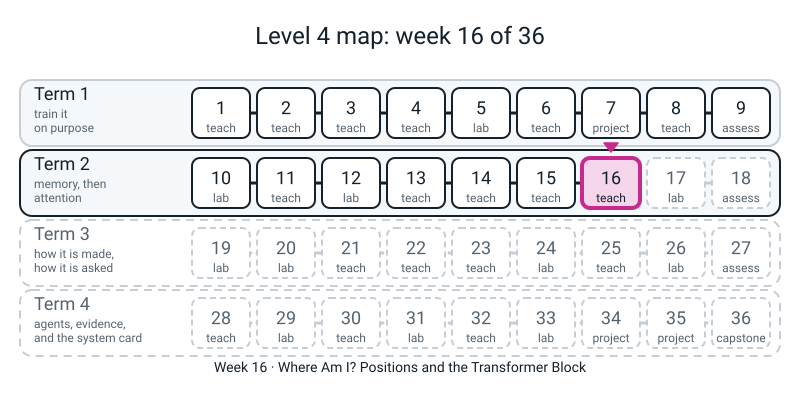
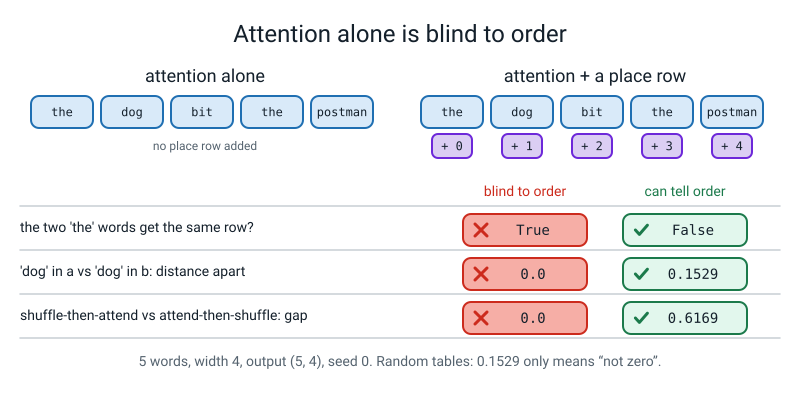
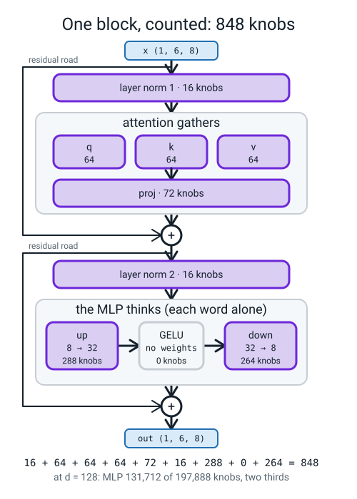

# Week 16 — Where Am I? Positions and the Transformer Block

[⬅ Week 15](week-15.md) · [Course Home](../README.md) · [Week 17 ➡](week-17.md) · [Student Guide](../student-guide/week-16.md) · [Workbook](../workbook/week-16.md)

---


*Figure 16.0 — Week 16 of 36, the position and block week, sits in term 2 (memory, then attention); weeks 1 to 15 are done and weeks 17 to 36 are still ahead.*

## 📋 At a Glance

This table is the week on one page: timing, vocabulary, what is new, and what you need to bring.

| | |
|---|---|
| **Duration** | 70 minutes in class, then the workbook (~60-75 min) |
| **Type** | 🟦 Teach — no new maths, three new constructs, and the **last piece of the machine**: Week 17 builds the whole GPT from what is on the table today. |
| **Big idea** | Attention looks at all the words **at once**, and a dot product does not know *where* a word came from, so attention alone cannot tell "the dog bit the postman" from "the postman bit the dog". The fix is to **add a position vector to every word vector** before attention. Then one **block** is: attention (words talk to each other) plus a **4x MLP** (each word thinks alone), each wrapped in layer norm and a residual add. **A GPT is a stack of these blocks.** |
| **New vocabulary** | position vector (position embedding) · permutation · block · MLP (feed-forward layer) · residual stream · stack · buffer |
| **New maths** | **None.** The only arithmetic is softmax on three numbers (Level 3 Week 13) and *counting parameters* (multiplication and addition). See the 🔢 box. |
| **New syntax** | `nn.ModuleList` · `register_buffer` · `torch.arange`. That is all three. |
| **Dataset** | Five typed word ids (`the dog bit the postman`, Week 8's pair); three cards with the numbers 2, 1, 0 for the relay; and, for the extension only, Week 8's 84 generated sentences. In `block.py`, 17 characters of the shared kit's `CORPUS` (`l4lib`). **Nothing downloads. No internet.** |
| **Model** | Real PyTorch on the CPU. **Nothing is trained today** (except the optional `flyer.py`, 300 steps, under a second). Every weight is a seeded random number. **There is no language model and no stand-in anywhere in this week.** |
| **Materials** | Laptop with Python 3 and torch (nothing new to install) · the folder that contains `l4lib/` · three index cards (`2`, `1`, `0`) and a calculator with an `e^x` key for the Seat Swap · workbook pages 16.1-16.6 · a timer |
| **Prep time** | 30 minutes the night before · 3 minutes on the day |
| **Expected runtime of the code** | Every file below finishes in **about a second**; the eight files together take about **4.4 seconds** including Python start-up, on the author's CPU. If anything takes over **10 seconds** something is wrong (see Fallback). |

> **⚠️ Watch out:** the sentence the student will want to leave with is *"a transformer cannot tell order without positions."* **That is true of attention without a mask, and today's `blind.py` shows it. It is only half-true of a GPT.** A GPT hides the future (Week 15's mask), and a mask is itself a weak clue about position: the first word can see only itself, the last can see everyone (`masked.py`, Prep file 6, shows it). In this course's own ablation a GPT with **no** position vectors is worse, not broken (ledger: best validation loss 1.632 against 1.278 with them; chance is about 3.33). Say **"attention on its own is blind to order, and positions are how a GPT is told the order on purpose"**, and keep the masked caveat for the student who asks. The second thing that goes wrong is a student who thinks the block "is" attention. The MLP is half the block and two thirds of its knobs; the nudge test in `block.py` shows it never looks at a neighbour.

---

## 🎯 Lesson Objectives

By the end of the lesson the student can:

1. **Show that attention without positions cannot tell order**: shuffle the words, attend, and get the same rows (shuffled the same way); and two copies of one word get identical answers.
2. **Add positions and show the blindness go away**: `emb(ids) + pos_table(torch.arange(T))`, then the two copies of `the` differ and the shuffle test prints `False`. Say what shape `torch.arange(T)` has and why the position table needs one row per place.
3. **Name the parts of one transformer block in order** (layer norm, attention, residual add, layer norm, MLP, residual add) and say what each is for in one sentence: *attention gathers, the MLP thinks, the adds keep the road open*.
4. **Count the knobs of one block by hand** (`d = 8`, 2 heads: **848**), and check against PyTorch.
5. **Say what `register_buffer` and `nn.ModuleList` are for**: a buffer is a tensor that belongs to the model without being a knob (the mask); a `ModuleList` is a list PyTorch can look inside (so a stack of blocks has its knobs counted and trained).

Observable evidence: `where.py` printing `False` where `blind.py` printed `True`; the Seat Swap relay on workbook page 16.2 matching the key (`1.8509` for both orders, then `1.7876` against `2.9832`); `block.py` printing `knobs in one block: 848` against the student's hand count on page 16.4; and the student's spoken answer to *"why is the position added and not stuck on the end?"*

---

## 🧑‍🏫 What YOU Need to Know First

This section is your own preparation. Read it before class so the maths, the limits of the demonstrations and the likely misconceptions are not new to you in the room.

> **📌 About the code blocks in this guide.** Every block in the **🧰 Prep Checklist** is a *whole file* and every one was run, from one folder next to `l4lib/`, on a CPU with `torch.set_num_threads(1)` and the seeds shown. Blocks in the **🐞 Debugging Clinic** are *deliberate mistakes* and each is marked; their tracebacks are real. Short snippets elsewhere carry on from the files. Outputs are real. **The whole set of eight files was run twice and every printed line was identical.** Comparisons between two routes to the same numbers are shown as `True`/`False` (`allclose`, `atol=1e-6`), because the last decimal place can differ on another PyTorch build. **Numbers quoted from the ground-truth ledger (the 1.278 / 1.632 ablation, the sinusoidal losses) were measured by the course author's reference scripts and were *not* run in this lesson;** each is labelled "ledger" where it appears.

### 1. What the student is doing today, in one paragraph

Last term the student built attention by hand (Week 14) and then gave it a scale, a mask and several heads (Week 15). Today it gets two jobs. **First**, find out what attention cannot do. In `blind.py` they push "the dog bit the postman" and "the postman bit the dog" through attention and see that the two `the`s get the *same* answer and the `dog` gets the *same* answer in both sentences; then they shuffle the words and see the answer shuffle with them. **Second**, fix it: add a *place vector* to every word (`torch.arange` gives the place numbers, a small `nn.Embedding` turns them into vectors), and the blindness goes. Then they put attention together with the other half of the machine, a small MLP, into one **block**, count its knobs by hand (848), and stack two of them. On paper they play attention for three index cards (the Seat Swap) so that they have *been* the blind reader and then the reader who is told where each card sits. **Nobody trains anything.** The GPT is Week 17.

### 2. 🔢 The maths you need — taught to you first

**There is no new mathematical idea this week.** There are two pieces of arithmetic, and you should do both before class.

**(a) The Seat Swap, which is softmax on three numbers** (Level 3 Week 13), done once per row. Three cards hold the numbers `2`, `1`, `0`. To keep it by hand: each card is its own query, key and value (`q = k = v = the number on the card`), so the score between two cards is their product, and there is no `sqrt(d)` to divide by because the width is 1 (`sqrt(1) = 1`). Follow **the card `2`**.

*Order A: the cards sit as `2, 1, 0` (card `2` is at seat 1).* Scores of card `2` against `[2, 1, 0]` are `[4, 2, 0]`.

| | `e^score` | weight = `e^score` / 62.9872 | weight x value |
|:--:|:--:|:--:|:--:|
| against `2` | `e^4 = 54.5982` | **0.8668** | 0.8668 x 2 = 1.7336 |
| against `1` | `e^2 = 7.3891` | **0.1173** | 0.1173 x 1 = 0.1173 |
| against `0` | `e^0 = 1.0000` | **0.0159** | 0.0159 x 0 = 0.0000 |
| | sum 62.9872 | sum 1.0000 | **answer 1.8509** |

*Order B: the same cards sit as `0, 1, 2` (card `2` is at seat 3).* Its scores are `[0, 2, 4]`: **the same three numbers in the other order**, so the weights are `0.0159, 0.1173, 0.8668` and the answer is `0 + 0.1173 + 1.7336 =` **1.8509 again**. The answer for the card `2` is `1.8509` whether it sits first or last. **That is blindness, in four lines.**

Now stamp each seat with a place number added to the card: **seat 1 adds 0, seat 2 adds 0.5, seat 3 adds 1.0**.

| Order | cards after stamping | the card `2`'s scores | weights | answer |
|:--:|:--:|:--:|:--:|:--:|
| A (`2, 1, 0`) | `[2.0, 1.5, 1.0]` | `2.0 x [2.0, 1.5, 1.0] = [4.0, 3.0, 2.0]` | 0.6652, 0.2447, 0.0900 (sum of `e^`: 54.5982 + 20.0855 + 7.3891 = 82.0727) | **1.7876** |
| B (`0, 1, 2`) | `[0.0, 1.5, 3.0]` | `3.0 x [0.0, 1.5, 3.0] = [0.0, 4.5, 9.0]` | 0.0001, 0.0110, 0.9889 (sum of `e^`: 1.0000 + 90.0171 + 8103.0839 = 8194.1011) | **2.9832** |

Same card, different seat, **different answer**: `1.7876` against `2.9832`. `key.py` (Prep file 7) prints all four lines. Check your own calculator gives the same to four places.

> **Be honest about what this toy is.** One number per card, `q = k = v`, no learned matrices, and a position that is *added by us* (0, 0.5, 1.0). It shows the *shape* of the idea: with no places the answer depends only on the card and on **which cards are in the room**, never on the seating; with places it depends on the seating. It is not a statement about what a trained model does with positions.

**(b) Counting parameters by hand.** For a layer, count *numbers*:

| Layer | Count | Why |
|---|:--:|---|
| `nn.Linear(a, b)` | `a x b + b` | a grid of weights, plus one bias per output (no `+ b` if `bias=False`) |
| `nn.LayerNorm(d)` | `2 x d` | one scale and one shift per feature |
| `nn.GELU()` | `0` | a fixed curve, nothing to learn |
| `nn.Embedding(V, d)` | `V x d` | one row per entry |

For one block at width `d` (the code in `block.py`: three `d x d` Linears **without** a bias for q, k, v; `proj` **with**; two layer norms; `up` is `d -> 4d`, `down` is `4d -> d`, both with a bias):

```text
attention : q + k + v + proj      = 3 x d x d  +  (d x d + d)           = 4 d^2 + d
MLP       : up + down             = (d x 4d + 4d) + (4d x d + d)        = 8 d^2 + 5 d
two norms : 2 x (2 x d)                                                  = 4 d
one block                                                                = 12 d^2 + 10 d
```

For `d = 8`: `4x64 + 8 = 264` attention, `8x64 + 40 = 552` MLP, `32` norms, **848** in all. For `d = 128` (the Week 17 size): `65,664 + 131,712 + 512 = 197,888`. **Two thirds** of a block's knobs are in the MLP (0.666 at `d = 128`). Note that **the number of words `T` and the number of heads `H` appear nowhere**: more words or more heads cost no extra knobs (heads just cut `d` into pieces).

> **Check your own arithmetic against the whole Week 17 model, now, so the number does not surprise you next week:** 28 characters x 128 + 64 places x 128 + 4 blocks x 197,888 + final norm 256 + output layer (128 x 28 + 28) = **807,196**. `count.py` prints it. (This is also the figure printed in the reference module, which is why the numbers can be trusted: it is the same by two routes.)


*Figure 16.1 — Attention alone cannot tell where a word sits; adding a place row makes the same words give different answers.*


*Figure 16.2 — One block is attention then an MLP, each on a residual road, and its nine parts add to 848 knobs.*

### 3. 🧭 Real vs stand-in — and what you must NOT claim

| Thing | Real or stand-in? |
|---|---|
| `nn.Embedding`, attention, `Block`, `ModuleList`, `register_buffer`, every printed shape and count, every `allclose` | **Real.** PyTorch on the CPU. |
| All weights and both embedding tables in `blind.py`, `where.py`, `masked.py`, `block.py` | **Random**, seeded by `torch.manual_seed(0)`. **Not learned.** `where.py`'s position table has random rows; they mean nothing yet. |
| The attention in `blind.py` / `where.py` | **Real** (the Week 14-15 recipe: scores, scale, softmax, blend) but **unmasked**, on purpose, so the order-blindness is exact. |
| The three Seat Swap cards (`2, 1, 0`) and the stamps (`0, 0.5, 1.0`) | **Chosen by us** so the arithmetic is easy. A toy, not a model. |
| The "ledger" figures (ablation 1.278 / 1.632; sinusoidal 1.383 / 1.866 / 2.220; learned positions 1.228) | **Real runs by the course author's reference scripts** on a 28-character corpus: one seed, 1,500 steps, CPU. **Not run today** and not quoted to the student unless you say where they come from. |
| The optional extension `flyer.py` | **Really trained** for 300 steps (about a second), on 60 training and 24 held-out generated sentences. A toy, not evidence about language. |
| Any language model | **Not present today.** No scripted backend. No stand-in. |

> **Say to the student, out loud:** *"Everything today is real PyTorch with random weights. Nothing has learned anything yet. What we show is what the machinery can and cannot do before it learns; learning is next week."*

> **🚫 What you must NOT claim.**
> 1. **"A transformer cannot tell order without positions."** Say "attention cannot", and know the mask caveat (`masked.py`).
> 2. **"Position vectors are the numbers 0, 1, 2, ..."** The *places* are 0, 1, 2 (they are row labels, like word ids). The position **vector** is the *row of a table* those labels pick, `d` numbers, learned like any weight. (Today's are random. Whether a *trained* table ends up smooth or meaningful we did **not** inspect.)
> 3. **"The 4x MLP and pre-norm are proven best."** The 4x is a convention and we did not test 2x or 8x. The layer norm sits *before* each sub-layer ("pre-norm") because that is what the reference module does and what Week 17 uses; we do **not** test post-norm this year. Week 19 deletes the residuals and the position vectors and measures; it does not test either of these.
> 4. **"This is what ChatGPT is."** It is the same *kind* of block, stacked many times at a vastly bigger width, trained on vastly more text. Today's block has 848 knobs. (Background, not measured. If asked what modern models use for positions, the reference module names *rotary* positions; we did not build or test them.)

### 4. The three new constructs, for somebody who has never seen them

**(a) `torch.arange(n)` — the whole numbers `0 .. n-1`, as a tensor.**

```python
import torch

places = torch.arange(5)          # tensor([0, 1, 2, 3, 4])
places = torch.arange(2, 6)       # tensor([2, 3, 4, 5])   start, then stop (the stop is not included)
```

Read as: *"`range`, but the answer is a tensor."* It is how a model labels **where** each word is: `torch.arange(T)` for a sentence of `T` words. Because the numbers given are whole, the tensor is **whole numbers** (`long`), which is exactly what `nn.Embedding` demands (Week 8). **`torch.arange(5.0)` is a float tensor and fails in the embedding** (Clinic 5). Say `T` aloud: the length of the *sentence*, not the number of sentences (Clinic 6).

The position table is just Week 8's table with a different meaning: `nn.Embedding(8, d)` has **one row per place** (places 0..7), so **no sentence longer than 8 words fits** (Clinic 4). That limit is the model's *context length*. In Week 17 it is 64.

**(b) `self.register_buffer("mask", tensor)` — a tensor that belongs to the model but is not a knob.**

```python
import torch
import torch.nn as nn


class WithBuffer(nn.Module):
    def __init__(self):
        super().__init__()
        self.lin = nn.Linear(3, 3)
        self.register_buffer("mask", torch.tril(torch.ones(3, 3)))
```

Read as: *"keep this tensor with the model: save it when the model is saved, move it when the model moves, but never train it."* `buffers.py` prints the proof: the model has **12** knobs (the `Linear`: 9 + 3) and **none** of them is the mask; but `state_dict()` lists `['mask', 'lin.weight', 'lin.bias']`, so the mask is saved. A plain `self.mask = ...` also *works* on a CPU, and is missing from the saved entries (Clinic 3, **silent**). The usual reason to care, **moving to a GPU, cannot be shown on this course's CPU-only setup, and we did not test it**; say it as "the buffer is the one that follows the model", not as something you saw.

**(c) `nn.ModuleList([...])` — a list PyTorch can look inside.**

```python
import torch.nn as nn

n = 4
layers = nn.ModuleList([nn.Linear(3, 3) for _ in range(n)])     # inside a class this is  self.layers = nn.ModuleList([...])
```

Read as: *"a Python list, except the model knows the things in it are its own layers."* A plain list is invisible to `.parameters()`: the optimizer then trains nothing (Clinic 1, loud: *optimizer got an empty parameter list*) or, if the model has *other* layers, trains **only those** while the listed layers stay frozen at their random start (Clinic 2, **silent and the most dangerous mistake this week**). `buffers.py` shows the good version: `Tower(4)` has `4 x (3x3 + 3) = 48` knobs, and the saved entries are named `layers.0.weight`, `layers.0.bias`, `layers.1.weight`, ... A `ModuleList` is itself a module, so `block.py` also uses one **on its own** to run two blocks one after the other, with no wrapper class. **Putting `Block`s inside a class of your own is nested `nn.Module`, which is Week 17's construct; do not write it today.**

### 5. The other code the student types — nothing new, but note these

- **A class that inherits `nn.Module`** with `__init__`, `super().__init__()` and `forward` (Level 3 Week 23). `Block` and `WithBuffer` are exactly that. `Block` is written **flat**: it holds `nn.LayerNorm`, `nn.Linear` and `nn.GELU` as attributes and writes attention inside `forward`. It does **not** hold other classes of ours.
- **Attention pieces from Weeks 14-15:** `nn.Linear(d, d, bias=False)` for q, k, v; `k.transpose(-2, -1)`; division by the square root of the width; `F.softmax(..., dim=-1)`; `masked_fill(mask == 0, float("-inf"))`; `torch.tril`; `.view(B, T, H, dh).transpose(1, 2)` to split into heads. Today's new twist is only `.transpose(1, 2).reshape(B, T, d)` to glue the heads back (`reshape` is Level 3's).
- **`nn.LayerNorm`, `nn.GELU`, residual `x = x + ...`** (Weeks 6 and 1).
- **`torch.randn(1, T, d)`** (Week 10) for a made-up input; `torch.zeros(...)` and item assignment `nudge[0, 3, 0] = 2.0` (Level 3).
- **In-place `fill_(0.0)` under `with torch.no_grad():`** (Week 11) to switch the add-ons off in `block.py`.
- **`lambda z: ...`** (Week 4) for `mlp_only` in `block.py`. **A list comprehension with an `if`** (Level 2).
- **`torch.allclose(a, b, atol=1e-6)`** (Level 3, Week 8).
- **`sum(p.numel() for p in model.parameters())`** (Week 1). **`.norm()`** (Week 2) for a distance.
- **`from l4lib.corpus import CORPUS`** (the shared kit): used only in the last part of `block.py`.

**Not used today, on purpose**, because they are later rungs: `class` inside `class` / blocks inside our own model (Week 17), `torch.randint` batching and `@torch.no_grad()` (Week 17), `nn.Parameter` (Week 31), `named_parameters`, `.clone()`, `.detach()` (Week 22). If a student has seen them elsewhere: *"yes, soon; today we do it the long way."*

### 6. What the numbers will say

These are all printed by the files below. Read them before class so nothing surprises you.

- **The blindness (`blind.py`).** `first 'the' and second 'the' get the same row: True`; `'dog' in a vs 'dog' in b: True`, distance `0.0`; `shuffle then attend == attend then shuffle: True`, difference `0.0`.
- **With positions (`where.py`).** The same three lines print `False`, `False`, `False`; the two dogs are `0.1529` apart; the shuffle difference is `0.6169`. The same two words at places 0-1 and at places 3-4 are not equal inputs. `torch.arange(5)` prints `tensor([0, 1, 2, 3, 4])`.
- **The buffer and the list (`buffers.py`).** 12 knobs and `['mask', 'lin.weight', 'lin.bias']`; `Tower(4)` has 48 knobs and output shape `(2, 3)`.
- **The block (`block.py`).** `in (1, 6, 8)`, `out (1, 6, 8)`: **same shape in and out**, which is why blocks stack. **848** knobs; `mask is a knob?: False`; **14** saved entries (13 knob tensors and the mask). Nudge the word at place 3: the **whole block** changes places `[3, 4, 5]` (attention carries the change forward, and the mask hides it from places 0-2); the **MLP alone** changes only `[3]`. With the two add-ons zeroed the block returns its input (`True`), the **residual road**. Two blocks have `1696 = 2 x 848` knobs. At `d = 128`: **197,888**. On real characters: 28 distinct characters in the corpus, a 17-character text, output `(1, 17, 8)`.
- **The count (`count.py`).** The nine parts add up to 848; the formula `12 d^2 + 10 d` gives 848, 3232 and 197,888 at `d` = 8, 16 and 128; at 128 attention is 65,664, the MLP 131,712, the norms 512; the whole Week 17 model is **807,196**.
- **The masked leak (`masked.py`).** With a causal mask and no positions: the two `the`s are **not** equal, the two dogs are **not** equal, the shuffle test is `False`. Row 0, which can see only itself, answers exactly `Wv(x0)`.
- **The optional extension (`flyer.py`).** Attention with no positions: train `0.650`, **val `0.125`**. Attention with positions: `1.000` and `1.000`. The `0.125` is not a typo; it is the Week 8 mirror effect again (see "Questions Students Ask").

### 7. The honest limits of today

1. **Random weights, one seed.** `blind.py` shows the blindness for **one** set of random weights and **one** shuffle. The reason is structural, not luck (each answer row is built from that word's own vector and the *set* of all the vectors, which a shuffle does not change), but we did not loop over many seeds. A student who wants to can; we did not run it.
2. **The mask leaks order, so "a GPT is blind without positions" is false** (`masked.py`). The reference ablation (ledger, one seed, 1,500 steps) shows the cost: best validation loss **1.632 without** position vectors against **1.278 with**, a gap of 0.354, and well below the 3.3 of a model that knows nothing. We say "worse", not "broken", and we did not test other seeds.
3. **We did not train anything about positions.** What a *trained* position table looks like was not inspected. `where.py` shows only that adding *some* position vectors changes the answers.
4. **The block is one design.** Pre-norm, 4x, GELU, bias-free q/k/v, a learned position table. Different choices exist; we did not test them (the reference module mentions sinusoidal and rotary positions). **Sinusoidal positions, ledger only:** at length 32 a learned table reached 1.228 and a sinusoidal one 1.383; **past the training length 32** the learned table raises `IndexError` and the sinusoidal one ran (1.866 at length 48, 2.220 at 64) only after the reference script's mask buffer was enlarged. We did not rerun that, and we do not teach it as a Week 16 construct.
5. **Parameter counts are arithmetic and layers; no claim about *which* knobs matter.**
6. **The GPU claim for buffers is not demonstrated.** CPU only.
7. **`flyer.py` is a 24-sentence held-out set, one seed.** `1.000` there means "all 24 right", not "solved order".

### 8. The misconceptions you will actually meet

1. **"Attention reads left to right, so it knows the order."** No: it looks at every word in one go (the RNN is the one that reads in order). Show `shuffle then attend == attend then shuffle`.
2. **"The position vector is a number, 0, 1, 2."** The place is a *label*; the position vector is the row of a table that label picks. Compare with Week 8: `bit = 2` is a label, not an amount.
3. **"The MLP and attention both mix the words."** Only attention does. The MLP treats every place on its own: nudge place 3 and the MLP changes **only** place 3 (`[3]`).
4. **"A residual is just a skip, it does nothing."** It is why the block can be made to do nothing at all (zero both add-ons and `block(x)` equals `x`), and it is the Week 6 road for the gradient. We measured the road's effect in Week 6, not today.

### 9. How deep to go, and where to stop

Stop at: *"attention is blind to order, so we add a place vector to every word; a block is attention plus a per-word MLP, each with a residual add; and the GPT is a stack of them."* Do **not** go into how the position table is trained, rotary or sinusoidal positions, key-value caches, the cost of attention growing with the square of the length, or why 4x. If the student asks *"so how does it learn the order?"*: *"next week it trains, and you will see a model that gets better at predicting the next letter because it can use positions."*

### 10. 🧭 Where Week 16 sits

```text
   W14  attention by hand            W16  positions + the block (today)
   W15  scale, mask, many heads      ------------------------------------------------
   attention can look anywhere  -->  but cannot tell WHERE: add a place vector
                                     attention + 4x MLP + 2 residuals + 2 layer norms = one block
                                     W17  Build TinyGPT: embedding + places + 4 blocks + an output layer
                                          (807,196 knobs, the number count.py predicts)
                                     W18  Review & Assessment 2 (weeks 9-17)
                                     W19  delete the mask, positions, residual, norm; watch what breaks
```

---

## 🧰 Prep Checklist

This section lists what to set up the night before and on the day. It holds the eight files you will run or type in class, each a whole file that was run as shown.

### 30 minutes the night before

- [ ] **Confirm the stack.** Run from the folder that contains `l4lib/`:

```bash
python3 -c "import torch; print(torch.__version__)"
python3 -c "from l4lib.corpus import CORPUS; print(len(set(CORPUS)))"
```

You must see (the first line's digits may differ on another PyTorch version; the second comes from the shared kit):

```text
2.2.1
28
```

`CORPUS` is used only by the last part of `block.py`. If `l4lib` is not found you are in the wrong folder. `pip` returning 403 is expected and not an error; **nothing this week installs anything.**

- [ ] **Type the files below into one working folder** (next to `l4lib/`). Each begins with a `#` comment naming it. Run each one, in order, and compare with the output printed here.

**File 1 — `blind.py`** (attention cannot tell where a word is)

```python
# blind.py - Week 16: attention cannot tell where a word is. Same words, any order, same rows.
import torch
import torch.nn as nn
import torch.nn.functional as F

torch.set_num_threads(1)
torch.manual_seed(0)

d = 4                                   # numbers per word
emb = nn.Embedding(4, d)                # ids: the = 0, dog = 1, bit = 2, postman = 3
Wq = nn.Linear(d, d, bias=False)
Wk = nn.Linear(d, d, bias=False)
Wv = nn.Linear(d, d, bias=False)


def attend(x):
    """Attention from Weeks 14-15 with no mask: x is (T, d), the answer is (T, d)."""
    q, k, v = Wq(x), Wk(x), Wv(x)
    scores = q @ k.transpose(-2, -1) / d ** 0.5
    weights = F.softmax(scores, dim=-1)
    return weights @ v


a = torch.tensor([0, 1, 2, 0, 3])       # the dog bit the postman
b = torch.tensor([0, 3, 2, 0, 1])       # the postman bit the dog
out_a = attend(emb(a))
out_b = attend(emb(b))

print("output shape:", tuple(out_a.shape))
print("first 'the' and second 'the' get the same row:", torch.allclose(out_a[0], out_a[3], atol=1e-6))
print("'dog' in a (row 1) vs 'dog' in b (row 4):      ", torch.allclose(out_a[1], out_b[4], atol=1e-6))
print("   distance between those two rows:", round((out_a[1] - out_b[4]).norm().item(), 4))

# Shuffle the five words, then attend. Compare with attending, then shuffling the answer.
perm = torch.tensor([4, 2, 0, 3, 1])
shuffled_in = attend(emb(a[perm]))
shuffled_out = attend(emb(a))[perm]
print("shuffle then attend == attend then shuffle:    ", torch.allclose(shuffled_in, shuffled_out, atol=1e-6))
print("size of the difference:", round((shuffled_in - shuffled_out).abs().max().item(), 6))
```

```text
output shape: (5, 4)
first 'the' and second 'the' get the same row: True
'dog' in a (row 1) vs 'dog' in b (row 4):       True
   distance between those two rows: 0.0
shuffle then attend == attend then shuffle:     True
size of the difference: 0.0
```

**File 2 — `where.py`** (add a place vector; `torch.arange`)

```python
# where.py - Week 16: add a position vector to every word, and the blindness goes away.
import torch
import torch.nn as nn
import torch.nn.functional as F

torch.set_num_threads(1)
torch.manual_seed(0)

d = 4
emb = nn.Embedding(4, d)                # what the word is
pos_table = nn.Embedding(8, d)          # where the word is: one row per place, 0..7
Wq = nn.Linear(d, d, bias=False)
Wk = nn.Linear(d, d, bias=False)
Wv = nn.Linear(d, d, bias=False)


def attend(x):
    q, k, v = Wq(x), Wk(x), Wv(x)
    scores = q @ k.transpose(-2, -1) / d ** 0.5
    weights = F.softmax(scores, dim=-1)
    return weights @ v


def with_positions(ids):
    places = torch.arange(len(ids))     # 0, 1, 2, ... one place number per word
    return emb(ids) + pos_table(places)


print("torch.arange(5):", torch.arange(5))

a = torch.tensor([0, 1, 2, 0, 3])       # the dog bit the postman
b = torch.tensor([0, 3, 2, 0, 1])       # the postman bit the dog
out_a = attend(with_positions(a))
out_b = attend(with_positions(b))

print("first 'the' and second 'the' get the same row:", torch.allclose(out_a[0], out_a[3], atol=1e-6))
print("'dog' in a (row 1) vs 'dog' in b (row 4):      ", torch.allclose(out_a[1], out_b[4], atol=1e-6))
print("   distance between those two rows:", round((out_a[1] - out_b[4]).norm().item(), 4))

perm = torch.tensor([4, 2, 0, 3, 1])
shuffled_in = attend(with_positions(a[perm]))
shuffled_out = attend(with_positions(a))[perm]
print("shuffle then attend == attend then shuffle:    ", torch.allclose(shuffled_in, shuffled_out, atol=1e-6))
print("size of the difference:", round((shuffled_in - shuffled_out).abs().max().item(), 4))

# The same two words in the same order, but at different places, are no longer the same input either.
x1 = emb(torch.tensor([0, 1])) + pos_table(torch.arange(0, 2))
x2 = emb(torch.tensor([0, 1])) + pos_table(torch.arange(3, 5))
print("same two words, places 0-1 vs places 3-4, equal inputs:", torch.allclose(x1, x2))
```

```text
torch.arange(5): tensor([0, 1, 2, 3, 4])
first 'the' and second 'the' get the same row: False
'dog' in a (row 1) vs 'dog' in b (row 4):       False
   distance between those two rows: 0.1529
shuffle then attend == attend then shuffle:     False
size of the difference: 0.6169
same two words, places 0-1 vs places 3-4, equal inputs: False
```

The two dogs are `0.1529` apart here. That number came from random tables and means nothing by itself; the point is that it is **not zero**.

**File 3 — `buffers.py`** (`register_buffer` and `nn.ModuleList`)

```python
# buffers.py - Week 16: two containers PyTorch needs to be told about.
import torch
import torch.nn as nn

torch.set_num_threads(1)
torch.manual_seed(0)


# --- (1) register_buffer: a tensor that belongs to the model but is not a knob
class WithBuffer(nn.Module):
    def __init__(self):
        super().__init__()
        self.lin = nn.Linear(3, 3)
        self.register_buffer("mask", torch.tril(torch.ones(3, 3)))   # saved with the model, never trained


m = WithBuffer()
print("knobs (parameters):", sum(p.numel() for p in m.parameters()))
print("saved entries     :", list(m.state_dict().keys()))
print("the mask:")
print(m.mask)

# --- (2) nn.ModuleList: a list PyTorch can see inside
class Tower(nn.Module):
    def __init__(self, n):
        super().__init__()
        self.layers = nn.ModuleList([nn.Linear(3, 3) for _ in range(n)])

    def forward(self, x):
        for layer in self.layers:
            x = torch.tanh(layer(x))
        return x


tower = Tower(4)
print("Tower(4) knobs:", sum(p.numel() for p in tower.parameters()), " = 4 x (3x3 + 3) =", 4 * (3 * 3 + 3))
print("Tower output shape:", tuple(tower(torch.ones(2, 3)).shape))
print("saved entries:", list(tower.state_dict().keys())[:4], "...")
```

```text
knobs (parameters): 12
saved entries     : ['mask', 'lin.weight', 'lin.bias']
the mask:
tensor([[1., 0., 0.],
        [1., 1., 0.],
        [1., 1., 1.]])
Tower(4) knobs: 48  = 4 x (3x3 + 3) = 48
Tower output shape: (2, 3)
saved entries: ['layers.0.weight', 'layers.0.bias', 'layers.1.weight', 'layers.1.bias'] ...
```

**File 4 — `block.py`** (one block, a stack, and real characters)

```python
# block.py - Week 16: one transformer block, written flat. Attention + 4x MLP, each wrapped in layer norm and a residual.
import torch
import torch.nn as nn
import torch.nn.functional as F

torch.set_num_threads(1)
torch.manual_seed(0)


class Block(nn.Module):
    def __init__(self, d, H, T):
        super().__init__()
        self.H = H
        self.ln1 = nn.LayerNorm(d)
        self.q = nn.Linear(d, d, bias=False)
        self.k = nn.Linear(d, d, bias=False)
        self.v = nn.Linear(d, d, bias=False)
        self.proj = nn.Linear(d, d)                                   # blends the heads back together
        self.register_buffer("mask", torch.tril(torch.ones(T, T)))    # the Week 15 mask, kept with the block
        self.ln2 = nn.LayerNorm(d)
        self.up = nn.Linear(d, 4 * d)                                 # the 4x MLP: widen,
        self.act = nn.GELU()                                          # bend,
        self.down = nn.Linear(4 * d, d)                               # narrow again

    def forward(self, x):
        B, T, d = x.shape
        dh = d // self.H
        h = self.ln1(x)
        q = self.q(h).view(B, T, self.H, dh).transpose(1, 2)          # (B, H, T, dh)
        k = self.k(h).view(B, T, self.H, dh).transpose(1, 2)
        v = self.v(h).view(B, T, self.H, dh).transpose(1, 2)
        scores = q @ k.transpose(-2, -1) / dh ** 0.5
        scores = scores.masked_fill(self.mask[:T, :T] == 0, float("-inf"))
        weights = F.softmax(scores, dim=-1)
        mixed = (weights @ v).transpose(1, 2).reshape(B, T, d)        # heads side by side again
        x = x + self.proj(mixed)                                      # residual 1: attention
        x = x + self.down(self.act(self.up(self.ln2(x))))             # residual 2: MLP
        return x


d, H, T = 8, 2, 6
block = Block(d, H, T)
x = torch.randn(1, T, d)
y = block(x)
print("in :", tuple(x.shape), " out:", tuple(y.shape))

knobs = sum(p.numel() for p in block.parameters())
print("knobs in one block:", knobs)
print("mask is a knob?   :", any(p.shape == (T, T) for p in block.parameters()))
print("saved entries     :", len(block.state_dict()), "(13 knob tensors + the mask)")

# Who talks to whom? Nudge the word at place 3 and see which places' answers move.
nudge = torch.zeros(1, T, d)
nudge[0, 3, 0] = 2.0
x_nudged = x + nudge
whole = [t for t in range(T) if not torch.allclose(block(x)[0, t], block(x_nudged)[0, t])]
mlp_only = lambda z: block.down(block.act(block.up(block.ln2(z))))
alone = [t for t in range(T) if not torch.allclose(mlp_only(x)[0, t], mlp_only(x_nudged)[0, t])]
print("nudge place 3 -> places that change in the whole block:", whole)
print("nudge place 3 -> places that change in the MLP alone  :", alone)

# The residual road: switch both "add-ons" off and the block hands x straight back.
with torch.no_grad():
    block.proj.weight.fill_(0.0)
    block.proj.bias.fill_(0.0)
    block.down.weight.fill_(0.0)
    block.down.bias.fill_(0.0)
print("add-ons zeroed, block(x) equals x:", torch.allclose(block(x), x))

# A stack: two blocks in an nn.ModuleList, the output of one is the input of the next.
blocks = nn.ModuleList([Block(d, H, T), Block(d, H, T)])
z = x
for b in blocks:
    z = b(z)
print("two blocks: out", tuple(z.shape), " knobs", sum(p.numel() for p in blocks.parameters()), "= 2 x", knobs)

# The size the TinyGPT of Week 17 will use: width 128, 4 heads, room for 64 positions.
big = Block(128, 4, 64)
print("one block at d = 128:", sum(p.numel() for p in big.parameters()))

# Real characters from the shared kit: letters -> ids -> (word row + place row) -> two blocks. Nothing is trained.
from l4lib.corpus import CORPUS

chars = sorted(set(CORPUS))
stoi = {c: i for i, c in enumerate(chars)}
text = "the sun rose over"
ids = torch.tensor([[stoi[c] for c in text]])                 # (1, 17): one sentence of 17 characters
tok_emb = nn.Embedding(len(chars), d)
pos_emb = nn.Embedding(32, d)                                 # room for 32 places
x = tok_emb(ids) + pos_emb(torch.arange(ids.shape[1]))        # (1, 17, 8) + (17, 8)
for b in nn.ModuleList([Block(d, H, 32), Block(d, H, 32)]):
    x = b(x)
print("characters in the corpus:", len(chars), " text length:", ids.shape[1], " out:", tuple(x.shape))
```

```text
in : (1, 6, 8)  out: (1, 6, 8)
knobs in one block: 848
mask is a knob?   : False
saved entries     : 14 (13 knob tensors + the mask)
nudge place 3 -> places that change in the whole block: [3, 4, 5]
nudge place 3 -> places that change in the MLP alone  : [3]
add-ons zeroed, block(x) equals x: True
two blocks: out (1, 6, 8)  knobs 1696 = 2 x 848
one block at d = 128: 197888
characters in the corpus: 28  text length: 17  out: (1, 17, 8)
```

Read the nudge lines slowly. **The nudge must not be the same on every feature.** The first version of this test added `1.0` to all eight numbers of place 3, and the block reported `[3]` and the MLP reported `[]` (nothing at all): layer norm subtracts a row's average, so a nudge that raises every feature equally is erased before the MLP sees it. The file uses `nudge[0, 3, 0] = 2.0` (one feature only). If a student tries the constant version, that is a real result and a good question (*"what does layer norm throw away?"* its row's average and spread, Week 6).

**File 5 — `count.py`** (the knobs of one block, by hand and by PyTorch)

```python
# count.py - Week 16: count the knobs of one block by hand, then let PyTorch check each part.
import torch.nn as nn

d = 8
parts = [
    ("ln1   LayerNorm(d)          ", nn.LayerNorm(d),            "2 x d"),
    ("q     Linear(d, d), no bias ", nn.Linear(d, d, bias=False), "d x d"),
    ("k     Linear(d, d), no bias ", nn.Linear(d, d, bias=False), "d x d"),
    ("v     Linear(d, d), no bias ", nn.Linear(d, d, bias=False), "d x d"),
    ("proj  Linear(d, d)          ", nn.Linear(d, d),            "d x d + d"),
    ("ln2   LayerNorm(d)          ", nn.LayerNorm(d),            "2 x d"),
    ("up    Linear(d, 4d)         ", nn.Linear(d, 4 * d),        "d x 4d + 4d"),
    ("act   GELU()                ", nn.GELU(),                  "nothing to learn"),
    ("down  Linear(4d, d)         ", nn.Linear(4 * d, d),        "4d x d + d"),
]
total = 0
for name, layer, how in parts:
    n = sum(p.numel() for p in layer.parameters())
    total = total + n
    print(f"{name} {how:<18} {n:5d}")
print("total", total)

# The same count as one formula, and a check at three widths.
for width in [8, 16, 128]:
    print(f"d = {width:3d}:  12 x d x d + 10 x d =", 12 * width * width + 10 * width)

# Where the knobs live at the Week 17 size (d = 128): attention against MLP.
D = 128
attention = 4 * D * D + D
mlp = 8 * D * D + 5 * D
norms = 4 * D
print("d = 128  attention", attention, " MLP", mlp, " two norms", norms, " one block", attention + mlp + norms)

# The whole TinyGPT of Week 17, by arithmetic only (28 characters, 64 places, 4 blocks):
tok, pos = 28 * D, 64 * D
final_norm, head = 2 * D, D * 28 + 28
print("whole model:", tok + pos + 4 * (attention + mlp + norms) + final_norm + head)
```

```text
ln1   LayerNorm(d)           2 x d                 16
q     Linear(d, d), no bias  d x d                 64
k     Linear(d, d), no bias  d x d                 64
v     Linear(d, d), no bias  d x d                 64
proj  Linear(d, d)           d x d + d             72
ln2   LayerNorm(d)           2 x d                 16
up    Linear(d, 4d)          d x 4d + 4d          288
act   GELU()                 nothing to learn       0
down  Linear(4d, d)          4d x d + d           264
total 848
d =   8:  12 x d x d + 10 x d = 848
d =  16:  12 x d x d + 10 x d = 3232
d = 128:  12 x d x d + 10 x d = 197888
d = 128  attention 65664  MLP 131712  two norms 512  one block 197888
whole model: 807196
```

**File 6 — `masked.py`** (teacher's honest limit; the fast student's extension)

```python
# masked.py - Week 16 (teacher's honest limit, and the fast student's extension):
# a CAUSAL mask leaks a little order, even with no position vectors at all.
import torch
import torch.nn as nn
import torch.nn.functional as F

torch.set_num_threads(1)
torch.manual_seed(0)

d = 4
emb = nn.Embedding(4, d)
Wq = nn.Linear(d, d, bias=False)
Wk = nn.Linear(d, d, bias=False)
Wv = nn.Linear(d, d, bias=False)


def attend_masked(x):
    T = x.shape[0]
    q, k, v = Wq(x), Wk(x), Wv(x)
    scores = q @ k.transpose(-2, -1) / d ** 0.5
    allowed = torch.tril(torch.ones(T, T))
    scores = scores.masked_fill(allowed == 0, float("-inf"))
    return F.softmax(scores, dim=-1) @ v


a = torch.tensor([0, 1, 2, 0, 3])       # the dog bit the postman
b = torch.tensor([0, 3, 2, 0, 1])       # the postman bit the dog
out_a = attend_masked(emb(a))
out_b = attend_masked(emb(b))
print("masked, no positions: first 'the' == second 'the':", torch.allclose(out_a[0], out_a[3], atol=1e-6))
print("masked, no positions: 'dog' in a == 'dog' in b:   ", torch.allclose(out_a[1], out_b[4], atol=1e-6))

perm = torch.tensor([4, 2, 0, 3, 1])
print("masked, no positions: shuffle-then-attend == attend-then-shuffle:",
      torch.allclose(attend_masked(emb(a[perm])), attend_masked(emb(a))[perm], atol=1e-6))

# Why: the first word can only look at itself, so the masked rows are NOT interchangeable.
print("row 0 only sees itself, so its answer is Wv(x0):", torch.allclose(out_a[0], Wv(emb(a))[0], atol=1e-6))
```

```text
masked, no positions: first 'the' == second 'the': False
masked, no positions: 'dog' in a == 'dog' in b:    False
masked, no positions: shuffle-then-attend == attend-then-shuffle: False
row 0 only sees itself, so its answer is Wv(x0): True
```

**File 7 — `key.py`** (every hand number in the workbook)

```python
# key.py - Week 16: every hand-arithmetic answer in the workbook, computed. Nothing here is new teaching.
import math
import torch
import torch.nn as nn

torch.set_num_threads(1)
torch.manual_seed(0)

# ---- Page 16.2: the Seat Swap. One number per card; q = k = v = the card itself; no scale needed (width 1).
def seat_swap(cards, who):
    """Attention output for card number `who` (a position), cards are plain numbers."""
    s = [cards[who] * c for c in cards]
    e = [math.exp(v) for v in s]
    w = [v / sum(e) for v in e]
    return w, sum(wi * c for wi, c in zip(w, cards))


for label, cards in [("A  2, 1, 0", [2.0, 1.0, 0.0]), ("B  0, 1, 2", [0.0, 1.0, 2.0])]:
    who = cards.index(2.0)
    w, out = seat_swap(cards, who)
    print(f"no places, order {label}: card 2 sits at seat {who + 1};",
          "scores", [round(2.0 * c, 4) for c in cards], "weights", [round(v, 4) for v in w], "answer", round(out, 4))

places = [0.0, 0.5, 1.0]
for label, cards in [("A  2, 1, 0", [2.0, 1.0, 0.0]), ("B  0, 1, 2", [0.0, 1.0, 2.0])]:
    stamped = [c + p for c, p in zip(cards, places)]
    who = cards.index(2.0)
    w, out = seat_swap(stamped, who)
    print(f"with places +0, +0.5, +1, order {label}: stamped cards", stamped,
          "weights", [round(v, 4) for v in w], "answer", round(out, 4))

# ---- Page 16.3: positions and torch.arange
pos_table = nn.Embedding(8, 4)
print("arange(5)            :", torch.arange(5).tolist())
print("arange(2, 6)         :", torch.arange(2, 6).tolist())
print("table shape          :", tuple(pos_table.weight.shape), " numbers:", pos_table.weight.numel())
print("pos_table(arange(5)) :", tuple(pos_table(torch.arange(5)).shape))
print("rows 0..4 of the table, same thing:", torch.equal(pos_table(torch.arange(5)), pos_table.weight[:5]))
print("whole table at width 128, 64 places:", 64 * 128)

# ---- Page 16.4: counting
def block_knobs(d, mult=4):
    attention = 4 * d * d + d                         # q, k, v without bias, proj with bias
    mlp = (d * mult * d + mult * d) + (mult * d * d + d)
    norms = 4 * d
    return attention + mlp + norms


print("d = 8, 4x   :", block_knobs(8))
print("d = 16, 4x  :", block_knobs(16))
print("d = 6, 4x   :", block_knobs(6))
print("d = 8, 2x   :", block_knobs(8, mult=2))
print("mask numbers for T = 6 (not knobs):", 6 * 6)

# the same, built from real layers, to make sure the formula is not just a formula
def built(d, mult=4):
    layers = [nn.LayerNorm(d), nn.Linear(d, d, bias=False), nn.Linear(d, d, bias=False), nn.Linear(d, d, bias=False),
              nn.Linear(d, d), nn.LayerNorm(d), nn.Linear(d, mult * d), nn.Linear(mult * d, d)]
    return sum(p.numel() for layer in layers for p in layer.parameters())


print("built from layers: d=8", built(8), " d=16", built(16), " d=6", built(6), " d=8 2x", built(8, 2))

# ---- Page 16.5: where the knobs of a stack live
print("2 blocks at d = 8      :", 2 * block_knobs(8))
print("4 blocks at d = 128    :", 4 * block_knobs(128))
print("share of one d=128 block in the MLP:", round((8 * 128 * 128 + 5 * 128) / block_knobs(128), 3))

# ---- Page 16.4, the usual slips at d = 8 (arithmetic from the correct 848)
d = 8
base = block_knobs(d)
print("correct                        :", base)
print("bias added on q, k and v       :", base + 3 * d)
print("each norm counted as d, not 2d :", base - 2 * d)
print("up bias forgotten              :", base - 4 * d)
print("proj bias forgotten            :", base - d)
print("down bias forgotten            :", base - d)
print("all three biases forgotten     :", base - d - 4 * d - d)
print("MLP at 2x                      :", block_knobs(d, 2))
```

```text
no places, order A  2, 1, 0: card 2 sits at seat 1; scores [4.0, 2.0, 0.0] weights [0.8668, 0.1173, 0.0159] answer 1.8509
no places, order B  0, 1, 2: card 2 sits at seat 3; scores [0.0, 2.0, 4.0] weights [0.0159, 0.1173, 0.8668] answer 1.8509
with places +0, +0.5, +1, order A  2, 1, 0: stamped cards [2.0, 1.5, 1.0] weights [0.6652, 0.2447, 0.09] answer 1.7876
with places +0, +0.5, +1, order B  0, 1, 2: stamped cards [0.0, 1.5, 3.0] weights [0.0001, 0.011, 0.9889] answer 2.9832
arange(5)            : [0, 1, 2, 3, 4]
arange(2, 6)         : [2, 3, 4, 5]
table shape          : (8, 4)  numbers: 32
pos_table(arange(5)) : (5, 4)
rows 0..4 of the table, same thing: True
whole table at width 128, 64 places: 8192
d = 8, 4x   : 848
d = 16, 4x  : 3232
d = 6, 4x   : 492
d = 8, 2x   : 576
mask numbers for T = 6 (not knobs): 36
built from layers: d=8 848  d=16 3232  d=6 492  d=8 2x 576
2 blocks at d = 8      : 1696
4 blocks at d = 128    : 791552
share of one d=128 block in the MLP: 0.666
correct                        : 848
bias added on q, k and v       : 872
each norm counted as d, not 2d : 832
up bias forgotten              : 816
proj bias forgotten            : 840
down bias forgotten            : 840
all three biases forgotten     : 800
MLP at 2x                      : 576
```

**File 8 — `flyer.py`** (optional extension: is the dog the biter? Week 8's task, now with attention)

```python
# flyer.py - Week 16 (optional, for the fast student): is the dog the biter? Week 8's task, now with attention.
# Attention alone is blind to order; attention plus positions can read it. Same data, same seed, 300 steps each.
import torch
import torch.nn as nn
import torch.nn.functional as F

torch.set_num_threads(1)
torch.manual_seed(0)

nouns = ["dog", "cat", "baker", "postman", "girl", "boy", "teacher", "fisherman"]
verbs = ["bit", "saw", "chased", "helped", "found", "called"]
vocab = ["the"] + nouns + verbs
ids = {w: i for i, w in enumerate(vocab)}

sentences, labels = [], []
for other in nouns[1:]:
    for v in verbs:
        sentences.append(f"the dog {v} the {other}")
        labels.append(1.0)                      # 1 = the dog did it
        sentences.append(f"the {other} {v} the dog")
        labels.append(0.0)                      # 0 = it was done to the dog

X = torch.tensor([[ids[w] for w in s.split()] for s in sentences])      # (84, 5)
y = torch.tensor(labels)
g = torch.Generator()
g.manual_seed(0)
order = torch.randperm(len(sentences), generator=g)
train_i, val_i = order[:60], order[60:]
train_set = set(train_i.tolist())
print("val sentences whose mirror is in train:", sum(1 for i in val_i.tolist() if (i + 1 if i % 2 == 0 else i - 1) in train_set))


class Reader(nn.Module):
    def __init__(self, use_positions):
        super().__init__()
        self.use_positions = use_positions
        self.emb = nn.Embedding(len(vocab), 8)
        self.pos = nn.Embedding(5, 8)
        self.q = nn.Linear(8, 8, bias=False)
        self.k = nn.Linear(8, 8, bias=False)
        self.v = nn.Linear(8, 8, bias=False)
        self.head = nn.Linear(8, 1)

    def forward(self, batch):                   # batch: (B, 5) word ids
        x = self.emb(batch)
        if self.use_positions:
            x = x + self.pos(torch.arange(batch.shape[1]))
        scores = self.q(x) @ self.k(x).transpose(-2, -1) / 8 ** 0.5
        x = x + F.softmax(scores, dim=-1) @ self.v(x)       # attention, no mask, plus the residual
        return self.head(x.mean(dim=1)).reshape(-1)         # average over the words, one number out


def accuracy(logits, target):
    return ((logits > 0).float() == target).float().mean().item()


for use_positions in [False, True]:
    torch.manual_seed(0)
    model = Reader(use_positions)
    opt = torch.optim.AdamW(model.parameters(), lr=0.01)
    for step in range(300):
        opt.zero_grad()
        loss = F.binary_cross_entropy_with_logits(model(X[train_i]), y[train_i])
        loss.backward()
        opt.step()
    label = "attention + positions" if use_positions else "attention, no positions"
    print(f"{label:<24}: train {accuracy(model(X[train_i]), y[train_i]):.3f}  val {accuracy(model(X[val_i]), y[val_i]):.3f}")
```

```text
val sentences whose mirror is in train: 18
attention, no positions : train 0.650  val 0.125
attention + positions   : train 1.000  val 1.000
```

The `0.125` for attention without positions is not a typo; see "Questions Students Ask". Attention with positions gets all 24 held-out sentences right, one seed, 300 steps.

- [ ] **Run them all once as a set**, from one folder, and check nothing fails: `for f in blind where buffers block count masked key flyer; do python3 $f.py > /dev/null || echo FAIL $f; done`. It should print nothing and take about 4-5 seconds.
- [ ] **Print** workbook pages 16.1-16.6 and cut three index cards: `2`, `1`, `0`. Have a calculator with an `e^x` key (a phone works; **airplane mode on**).
- [ ] **Do the Seat Swap yourself**, once, on paper (section 2a), so you hold the four answers (`1.8509`, `1.8509`, `1.7876`, `2.9832`).
- [ ] **Read the Debugging Clinic** and copy the nine `bad*.py` files to a scratch folder so they are ready to plant.

### 3 minutes on the day

- [ ] Open `blind.py` and `where.py` in the editor as **empty files**, for typing together.
- [ ] Put the three cards, a calculator and the timer on the desk.

### Fallback if the laptops fail

| Problem | What to do |
|---|---|
| `ModuleNotFoundError: l4lib` | Only the night-before check and the last part of `block.py` import `l4lib`. In `block.py`, delete everything from `from l4lib.corpus import CORPUS` down; the rest of the lesson is unaffected. |
| `ModuleNotFoundError: torch` | `python3 -m pip` is blocked; use a machine that already has torch. Fall back to the Seat Swap (page 16.2) and the counting (page 16.4), which need only paper and a calculator. |
| A `False` where this guide shows `True` (or the reverse) in `blind.py` | The attention was given a mask, or the position vectors were added. Re-type `attend` without `masked_fill`. |
| `block.py` prints a count other than 848 | A bias was added or dropped (`bias=False` on q, k, v only; `proj`, `up`, `down` keep theirs). Compare with `count.py`, line by line. |
| Different random numbers on another machine | Expected (different PyTorch builds). Nothing in the lesson depends on a particular value; use the `True`/`False` lines, the shapes and the counts. The `0.1529` and `0.6169` may differ, but they will not be zero. |
| No laptop at all | Run the lesson from the printed outputs in this guide, the Seat Swap, and page 16.4. |

---

## ⏱️ The Lesson, Minute by Minute

This section is the lesson plan, segment by segment.

| Segment | Minutes | What happens |
|---|:--:|---|
| 🪝 Hook | 8 | Week 8's two sentences again. *Does attention do better than a bag?* Predict, then `blind.py`. |
| 🧠 Concept | 14 | Why a dot product cannot see seats; the place vector; the block drawn; a stack; buffer and list in words |
| 💻 Live-code | 20 | `blind.py`, `where.py` (`torch.arange`), `buffers.py`, `block.py` (the count line and the nudge) |
| 🎲 Their turn | 23 | The Seat Swap with index cards; count the block by hand against `count.py`; their own shuffle test |
| 🔑 Wrap & assign | 5 | What was shown and what was not; homework |

### 🪝 Hook — The Dog and the Postman, Again (8 minutes)

**Do not open the laptop yet.**

1. **(2 min) Remind them of Week 8.** *"A bag of words could not tell 'the dog bit the postman' from 'the postman bit the dog'. The recurrent cell could, because it read in order. Since Week 14 you have a different reader: attention, which looks at **all** the words at once. Does it do better than a bag?"* Let them argue. Most will say yes ("it sees everything").
2. **(3 min) The prediction card.** On a card they write three predictions for `blind.py` (page 16.1): *In "the dog bit the postman", will the first `the` and the second `the` get the same answer from attention? Will `dog` get the same answer in "the dog bit the postman" as in "the postman bit the dog"? If I shuffle the five words first and then attend, is that the same as attending and then shuffling the answers?* Collect a guess for each. **Do not reveal.** (Typically "no, no, no".)
3. **(3 min) The question that frames the lesson.** *"What would attention need that a counter does not?"* Draw out: **to be told where each word is.** Write on the board:

> **"Attention sees which words are in the room, not where they are sitting."**

*If the student says "but attention reads the sentence from left to right":* hold that thought; `blind.py` will test it, and the answer is no.

### 🧠 Concept — Seats, a Block, a Stack (14 minutes)

**(4 min) Why attention cannot see seats.** Draw the room: five people, each holds a card, and each person's answer is *a blend of everyone's cards*, weighted by how well their own card matches. *"Your answer is built from your card, and from the set of cards in the room. Nothing in the recipe says who sits where. So if two people hold the same card, they get the same answer, and if we swap seats nothing changes except who holds which answer."* Write `shuffle, then attend  =  attend, then shuffle`. That is the Seat Swap's `1.8509` for both orders. **Do not run anything yet.**

**(3 min) The fix.** *"So tell each person their seat: add a second card, **the seat card**, to the first. The seat card is a row of a table, one row per seat. We have a table that looks up rows by number: `nn.Embedding`."* Write:

```text
what goes in  =  word row (from the word table)  +  place row (from the place table)
```

*"The seat numbers 0, 1, 2, ... are made by `torch.arange`. It is `range`, but it gives you a tensor."* Say the shape aloud: five words, so `torch.arange(5)` is five whole numbers and the place rows are `(5, d)`, added to word rows of `(5, d)`. *"Added, not stuck on the end, so the width stays the same and the next layer does not need a new shape."* (If asked why added rather than joined, see Questions.)

**(4 min) The block.** Draw it (this is the picture the student will keep):

```text
        x  (a sentence of T words, each d numbers wide)
        |
        +-----------------+
        |                 |
   layer norm             |
        |                 |
   attention  (words look at each other, behind the mask)
        |                 |
        +------- ( + ) ---+            <- residual add
        |
        +-----------------+
        |                 |
   layer norm             |
        |                 |
   MLP: d -> 4d -> d   (each word on its own)
        |                 |
        +------- ( + ) ---+            <- residual add
        |
        out  (same shape as x)
```

*"Two halves. **Attention gathers**: it is the only place words talk to each other. **The MLP thinks**: it works on each word separately, widens to four times the width, bends (GELU) and narrows again. Each half sits on a side road: the `+` adds the half's answer to what came in, so the main road, the line straight down the left, is never cut. You met that in Week 6. The layer norm is Week 6 too."* Stop there. **Do not** explain why four times or why the norm is before.

**(2 min) A stack.** *"The output has the same shape as the input, so it can go in as the input of another block. A GPT is that, N times: the words with their seats go in at the top, and come out of the Nth block."* Draw three boxes in a column. *"To keep N blocks in a model we need a list of them. A plain list will not do; PyTorch must be able to see inside, so it uses `nn.ModuleList`."*

**(1 min) Buffer, in words only.** *"The mask is a grid of ones and zeros. It is not something to learn, but it should travel with the block. PyTorch calls that a **buffer**."*

### 💻 Live-Code Together — `blind.py`, `where.py`, `buffers.py`, `block.py` (20 minutes)

The student types. You narrate. **Nobody pastes.**

**Step 1 (5 min) — `blind.py`.** Type the three tables (`Wq`, `Wk`, `Wv`) and `attend` (they have written this in Week 14). **Before running, hold up the prediction card.** Run. The three lines print `True` and `True` and `True`. *"So the first guess was..."* (Most were wrong on all three; say nothing, let them look.) Point at `distance between those two rows: 0.0`. *"The dog in the first sentence and the dog in the second sentence get exactly the same answer. Attention is not able to tell who bit whom."*

**Step 2 (5 min) — `where.py`.** Type `with_positions` only; copy `attend` and the tables from step 1. **Stop at `torch.arange(len(ids))` and print it** (`tensor([0, 1, 2, 3, 4])`). Before running, ask: *"Will the three lines still be `True`?"* Run. `False`, `False`, `False`, and the dogs are `0.1529` apart. *"Same words, same weights. The only thing we added is a place."*

**Step 3 (4 min) — `buffers.py`.** Type `WithBuffer` and `Tower`. **Predict first:** *"How many knobs does `WithBuffer` have?"* (The `Linear(3,3)`: 9 + 3 = 12; the mask is not a knob.) Run. Then read the `state_dict` line: the mask **is** saved. For the `Tower`: *"4 layers of `3 x 3 + 3`?"* (`48`.) **Show Clinic 2 if time:** the same tower with a plain list.

**Step 4 (6 min) — `block.py`.** Do **not** type the whole file. Read the `Block` class aloud top to bottom with the student (the attention half is Weeks 14-15: they know it). Have them **type** only the final residual lines and the `print` lines, and **predict `knobs in one block`** from the hand count they will do in a moment; hold the answer. Run it. Show the shapes (`in` and `out` equal), the nudge lines (`[3, 4, 5]` and `[3]`), and `add-ons zeroed, block(x) equals x: True`. Ask: *"Why did places 4 and 5 change when we nudged place 3, but place 3 only changed the MLP?"* (Attention carried it forward; the MLP never looks at a neighbour.) *"Why not places 0, 1, 2?"* (The mask hides place 3 from them.)

### 🎲 Their Turn — The Seat Swap, and the Count (23 minutes)

The student is the **attention**; you are the **reader**. Full rules in *The Activity, In Full* below. The shape:

1. **(10 min) The Seat Swap by hand.** Three cards, `2, 1, 0`. They follow the card `2` in order A (`2, 1, 0`), then order B (`0, 1, 2`), with a calculator, then again with the seat stamps `0, 0.5, 1.0` added. They get `1.8509` and `1.8509`, then `1.7876` and `2.9832`.
2. **(3 min) Run `key.py`** and compare. Any line that differs is a calculator slip; find it.
3. **(7 min) Count the block by hand** (page 16.4, `d = 8`): fill the nine rows before running `count.py`. Then run it. They should get **848**. Ask for `d = 16` using the formula `12 d^2 + 10 d` (**3232**), then run the line to check.
4. **(3 min) Their own shuffle test.** In `where.py`, they change the ids (`a`) to another sentence of their choosing (ids `0..3`, five words) and the `perm`. **No wrong answers**; the lesson is that the shuffle line is `False` with positions and `True` without, for *their* choice. Ask for a shuffle that *does* give `True` with positions (the identity, `perm = [0, 1, 2, 3, 4]`).

**Stop at 23 minutes.** If the count has not finished, show `count.py`'s output and move on. The student should leave having seen the same answer for both seatings, a different answer once seats are stamped, and 848.

### 🔑 Wrap & Assign (5 minutes)

1. **(2 min)** *"Three things we did. One: attention alone cannot tell where a word is, so shuffling the words only shuffles the answers. Two: we add a place vector to each word and then it can. Three: a block is attention plus a per-word MLP, each with a residual add, and a GPT is a stack of blocks. What did we **not** do?"* (Train anything.) *"Right. Next week we build the whole GPT out of these parts, and train it on real text."*
2. **(1 min)** *"How many knobs in a block at width 8? Do the number of words or the number of heads change it?"* (848; no, neither.)
3. **(1 min)** Hand out the workbook.
4. **(1 min)** One sentence ahead: *"Next week you write the whole thing. The count we did today predicts how many knobs it has: 807,196. We will check."*

---

## 🐞 The Debugging Clinic

This section lists the nine mistakes students are likely to make this week, with the real error text and the fix for each.

Every error below was produced by running the code. **Paths will differ on your machine**; here they are shown as `/home/you/l4/`. Tracebacks from PyTorch run through several of its own files; the long middle of those is replaced by a line reading `... frames inside torch (elided) ...`, and **the last line is the real, complete last line**. Each mistake is deliberate: you plant it, the student reads the traceback (or the odd number) aloud, and you refuse to fix it until they have said what it means. Each block is **self-contained** so you can drop it in a scratch folder. **Four of the nine are silent**, and the silent ones are the point.

### How to teach debugging without giving the answer

1. *"Read me the last line."* (It says what went wrong; the lines above say where.) For a silent mistake: *"What did you expect this to print?"*
2. *"Which of your files is on the line above it?"*
3. *"What did you expect that line to do?"*
4. Only then: *"What is different?"*

### Mistake 1 — a plain list of layers (loud)

```python
# DELIBERATE MISTAKE 1: a plain Python list of layers. PyTorch cannot see inside a list.
import torch
import torch.nn as nn

torch.manual_seed(0)


class Tower(nn.Module):
    def __init__(self, n):
        super().__init__()
        self.layers = [nn.Linear(3, 3) for _ in range(n)]      # <- should be nn.ModuleList([...])

    def forward(self, x):
        for layer in self.layers:
            x = torch.tanh(layer(x))
        return x


tower = Tower(4)
print("output shape:", tuple(tower(torch.ones(2, 3)).shape))   # works fine
opt = torch.optim.AdamW(tower.parameters(), lr=0.01)
```

```text
output shape: (2, 3)
Traceback (most recent call last):
  File "/home/you/l4/bad1.py", line 21, in <module>
    opt = torch.optim.AdamW(tower.parameters(), lr=0.01)
  ... frames inside torch (elided) ...
ValueError: optimizer got an empty parameter list
```

**Read it:** the model *ran* (`output shape: (2, 3)`), then the optimizer was handed `tower.parameters()` and said it got **nothing**. The layers are in a plain Python list, and PyTorch cannot see inside one, so the model has **no knobs**. **Fix:** `self.layers = nn.ModuleList([...])`. The clue is `empty parameter list`.

### Mistake 2 — the same list, with one real layer beside it (SILENT, and the most dangerous of the week)

```python
# DELIBERATE MISTAKE 2 (SILENT): the same plain list, but the model also has one real layer.
# Nothing complains. Count the knobs and compare with what you expected.
import torch
import torch.nn as nn

torch.manual_seed(0)


class Tower(nn.Module):
    def __init__(self, n):
        super().__init__()
        self.layers = [nn.Linear(3, 3) for _ in range(n)]      # <- the list PyTorch cannot see
        self.out = nn.Linear(3, 1)

    def forward(self, x):
        for layer in self.layers:
            x = torch.tanh(layer(x))
        return self.out(x)


tower = Tower(4)
print("knobs PyTorch can see:", sum(p.numel() for p in tower.parameters()))
print("knobs you meant      :", 4 * (3 * 3 + 3) + (3 + 1))
before = tower.layers[0].weight.sum().item()
opt = torch.optim.AdamW(tower.parameters(), lr=0.1)
for step in range(20):
    opt.zero_grad()
    loss = (tower(torch.ones(2, 3)) - 1.0).pow(2).mean()
    loss.backward()
    opt.step()
after = tower.layers[0].weight.sum().item()
print("did layer 0 move after 20 steps?", before != after)
```

```text
knobs PyTorch can see: 4
knobs you meant      : 52
did layer 0 move after 20 steps? False
```

**There is no error.** Because the model also has one real layer (`self.out`), the optimizer is happy: it sees **4** knobs, not the 52 the student meant, and trains only the output layer. The four listed layers stay at their random start forever; **layer 0 did not move in 20 steps**. The loss will still go down a little, which is what makes this treacherous. **The habit: count the knobs and compare with your hand count before you train.** (This is exactly why page 16.4 asks for a hand count.) **Fix:** `nn.ModuleList`.

### Mistake 3 — a mask that is not a buffer (SILENT on a CPU)

```python
# DELIBERATE MISTAKE 3 (SILENT on a CPU): the mask kept as an ordinary attribute, not a buffer.
import torch
import torch.nn as nn


class Masked(nn.Module):
    def __init__(self, T):
        super().__init__()
        self.lin = nn.Linear(3, 3)
        self.mask = torch.tril(torch.ones(T, T))               # <- should be register_buffer("mask", ...)


m = Masked(3)
print("works on a CPU :", m.mask.shape)
print("saved entries  :", list(m.state_dict().keys()))
print("'mask' saved?  :", "mask" in m.state_dict())
```

```text
works on a CPU : torch.Size([3, 3])
saved entries  : ['lin.weight', 'lin.bias']
'mask' saved?  : False
```

**There is no error and nothing is wrong on a CPU.** The mask works, but it is **not saved** with the model: `state_dict()` lists only the `Linear`, so a model saved and reloaded in a fresh process would have to rebuild its mask, and (we did **not** test this here) a model moved to a GPU would leave this tensor behind. **Fix:** `self.register_buffer("mask", ...)`. The habit: after writing a model, print `list(m.state_dict().keys())` and read it.

### Mistake 4 — a sentence longer than the position table (loud)

```python
# DELIBERATE MISTAKE 4: a sentence longer than the position table. The table has places 0..7 only.
import torch
import torch.nn as nn

torch.manual_seed(0)
pos_table = nn.Embedding(8, 4)             # eight places
ids = torch.arange(10)                     # a sentence ten words long -> places 0..9
vectors = pos_table(ids)
```

```text
Traceback (most recent call last):
  File "/home/you/l4/bad4.py", line 8, in <module>
    vectors = pos_table(ids)
  ... frames inside torch (elided) ...
IndexError: index out of range in self
```

**Read it:** `index out of range in self`. The table has places 0 to 7 (eight rows) and the sentence asked for place 8 and place 9. The model's **context length** is the number of rows in this table: past it, the model cannot be run at all. **Fix:** a longer table, or shorter text (in Week 17, cut the text to the block size). The message does not say which index; the student has to count.

### Mistake 5 — places with a decimal point (loud)

```python
# DELIBERATE MISTAKE 5: places made with a decimal point (a float tensor).
import torch
import torch.nn as nn

torch.manual_seed(0)
pos_table = nn.Embedding(8, 4)
places = torch.arange(5.0)                 # <- 5.0, not 5
print(places)
vectors = pos_table(places)
```

```text
tensor([0., 1., 2., 3., 4.])
Traceback (most recent call last):
  File "/home/you/l4/bad5.py", line 9, in <module>
    vectors = pos_table(places)
  ... frames inside torch (elided) ...
RuntimeError: Expected tensor for argument #1 'indices' to have one of the following scalar types: Long, Int; but got torch.FloatTensor instead (while checking arguments for embedding)
```

**Read it:** the last line says the ids must be `Long` or `Int` and got `FloatTensor`. `torch.arange(5.0)` is a float tensor: the decimal point is the whole bug. The printed `tensor([0., 1., 2., 3., 4.])` already shows it (the dots). Same lesson as Week 8, new function. **Fix:** `torch.arange(5)`.

### Mistake 6 — "how many sentences" where "how many words" belongs (SILENT)

```python
# DELIBERATE MISTAKE 6 (SILENT): the number of SENTENCES where the number of WORDS belongs.
# Shapes work out, nothing complains - and the model is as blind to order as before.
import torch
import torch.nn as nn
import torch.nn.functional as F

torch.manual_seed(0)
d = 4
emb = nn.Embedding(4, d)
pos_table = nn.Embedding(8, d)
Wq = nn.Linear(d, d, bias=False)
Wk = nn.Linear(d, d, bias=False)
Wv = nn.Linear(d, d, bias=False)


def attend(x):
    scores = Wq(x) @ Wk(x).transpose(-2, -1) / d ** 0.5
    return F.softmax(scores, dim=-1) @ Wv(x)


def with_positions(ids):                   # ids is (B, T): B sentences of T words
    B, T = ids.shape
    places = torch.arange(B)               # <- should be torch.arange(T)
    return emb(ids) + pos_table(places)    # (B, T, d) + (B, d): the same place for every word


a = torch.tensor([[0, 1, 2, 0, 3]])        # one sentence, five words: B = 1, T = 5
perm = torch.tensor([4, 2, 0, 3, 1])
print("positions added, shapes fine:", tuple(with_positions(a).shape))
print("still blind to order:", torch.allclose(attend(with_positions(a[:, perm])), attend(with_positions(a))[:, perm], atol=1e-6))
```

```text
positions added, shapes fine: (1, 5, 4)
still blind to order: True
```

**There is no error and the shapes are right** (`(1, 5, 4)`), and yet the output says `still blind to order: True`. The student wrote `torch.arange(B)` (the number of **sentences**, here 1) instead of `torch.arange(T)` (the number of **words**, 5). The one place row it makes is `place 0`, and it is added to **every** word, so no word is told where it is. **The shuffle test from `blind.py` is what catches it**: after adding positions the line must say `False`. The habit: always run the shuffle test after writing the position code. **Fix:** `places = torch.arange(T)`.

### Mistake 7 — the residual forgotten (SILENT)

```python
# DELIBERATE MISTAKE 7 (SILENT): the residual "x +" forgotten. The block runs and the shapes are right.
import torch
import torch.nn as nn

torch.manual_seed(0)
d = 8
ln2 = nn.LayerNorm(d)
up = nn.Linear(d, 4 * d)
act = nn.GELU()
down = nn.Linear(4 * d, d)
with torch.no_grad():                      # switch the MLP add-on off, as in block.py
    down.weight.fill_(0.0)
    down.bias.fill_(0.0)

x = torch.randn(1, 6, d)
right = x + down(act(up(ln2(x))))          # the residual way
wrong = down(act(up(ln2(x))))              # <- forgot "x +"
print("with the residual, output equals input   :", torch.allclose(right, x))
print("without it, output equals input          :", torch.allclose(wrong, x))
print("without it, the largest entry of output  :", wrong.abs().max().item())
```

```text
with the residual, output equals input   : True
without it, output equals input          : False
without it, the largest entry of output  : 0.0
```

**There is no error.** The shapes are right and the numbers are plausible. The test is the residual road: with the add-on switched off, a block *should* hand its input back, and without the `x +` it hands back zeros. **Fix:** `x = x + down(...)`. The habit: after writing a block, run the "zero the add-ons, output equals input" check from `block.py`. (The same silent-failure family as Week 6: removing the road does not crash the model, it makes it hard to train.)

### Mistake 8 — the layer norm made for the wrong width (loud)

```python
# DELIBERATE MISTAKE 8: layer norm made for the wide width, applied to the narrow one.
import torch
import torch.nn as nn

torch.manual_seed(0)
d = 8
ln2 = nn.LayerNorm(4 * d)                  # <- 32, but the stream is d = 8 wide
x = torch.randn(1, 6, d)
y = ln2(x)
```

```text
Traceback (most recent call last):
  File "/home/you/l4/bad8.py", line 9, in <module>
    y = ln2(x)
  ... frames inside torch (elided) ...
RuntimeError: Given normalized_shape=[32], expected input with shape [*, 32], but got input of size[1, 6, 8]
```

**Read it:** `normalized_shape=[32]` against an input whose last axis is `8`. The norm after the MLP's widening was copied over for the half that runs at width `d`. **Fix:** `nn.LayerNorm(d)`, both norms. The numbers `32` and `8` in the message are the whole story. (In the block, norms sit at width `d`; only `up`'s *output* is `4d`.)

### Mistake 9 — heads that do not divide the width (loud)

```python
# DELIBERATE MISTAKE 9: three heads asked to share a width of 8.
import torch
import torch.nn as nn

torch.manual_seed(0)
d, H = 8, 3
q = nn.Linear(d, d, bias=False)
x = torch.randn(1, 5, d)
B, T, _ = x.shape
heads = q(x).view(B, T, H, d // H).transpose(1, 2)    # d // H = 2, and 3 x 2 = 6, not 8
```

```text
Traceback (most recent call last):
  File "/home/you/l4/bad9.py", line 10, in <module>
    heads = q(x).view(B, T, H, d // H).transpose(1, 2)    # d // H = 2, and 3 x 2 = 6, not 8
RuntimeError: shape '[1, 5, 3, 2]' is invalid for input of size 40
```

**Read it:** `shape '[1, 5, 3, 2]' is invalid for input of size 40`. Three heads of width `8 // 3 = 2` is `6` numbers per word, not `8`: `1 x 5 x 3 x 2 = 30` against the `40` that are there. **Fix:** the width must be a multiple of the number of heads (`d = 8, H = 2` or `4`; `d = 12, H = 3`). The habit: say `d // H` aloud and check `H x (d // H) = d`.

---

## 🎲 The Activity, In Full

This section gives everything you need to run the Seat Swap: setup, rules, rounds and variations.

### The Seat Swap

**What it is:** the student plays attention for three cards, with a calculator, twice with no seat numbers and twice with them, so that they have **been** the blind reader and then the reader who is told where each card sits.

### Setup (2 minutes, during the live-code segment)

- Three index cards: `2`, `1`, `0`.
- A strip of paper per round with the rule written at the top: **score = (my card) x (their card)**, **weight = e^score / (sum of the three e^scores)**, **answer = sum of weight x (their card)**. "Follow card `2` only."
- A calculator with an `e^x` key (a phone works). If there is none, the teacher reads the `e^x` values from the table in 🔢 (a).

### The rules, read out loud before round one

1. The **reader** (you) lays the three cards in a row, left to right.
2. The **attention** (the student) follows **the card `2`**: three scores, three `e^score`, three weights that add to 1, one answer, **4 decimals**.
3. In rounds 3 and 4 the reader writes a **stamp** under each seat (**0, 0.5, 1.0**) and the student **adds the stamp to the card** before doing anything else. The stamp belongs to the *seat*, not the card.
4. The attention may not look at which seat a card sits in, **except through the stamp.** (This is the whole point: it is all the real attention can do.)

### The four rounds

| Round | Seating | Stamped cards | Answer for card `2` | What to draw out |
|:--:|---|:--:|:--:|---|
| 1 | `2, 1, 0` | (none) | `1.8509` | Weights `0.8668, 0.1173, 0.0159`. |
| 2 | `0, 1, 2` | (none) | `1.8509` | *"The cards are the same cards. Same answer. Where did card `2` sit?"* At the other end. Attention could not tell. |
| 3 | `2, 1, 0` | `[2.0, 1.5, 1.0]` | `1.7876` | Weights `0.6652, 0.2447, 0.0900`. |
| 4 | `0, 1, 2` | `[0.0, 1.5, 3.0]` | `2.9832` | Weights `0.0001, 0.0110, 0.9889`. *"Same card, a different seat, a different answer."* |

The full worked values (from `key.py`; this is the same data laid out for marking):

```text
round 1  scores [4, 2, 0]          weights [0.8668, 0.1173, 0.0159]   answer 1.8509
round 2  scores [0, 2, 4]          weights [0.0159, 0.1173, 0.8668]   answer 1.8509
round 3  scores [4.0, 3.0, 2.0]    weights [0.6652, 0.2447, 0.09]     answer 1.7876
round 4  scores [0.0, 4.5, 9.0]    weights [0.0001, 0.011, 0.9889]    answer 2.9832
```

### The question that makes the activity

*"In rounds 1 and 2, if I had only told you the three numbers on the cards, and not the order, could you have given a different answer for each round?"* (No: it is the same answer, so attention only ever used the cards, never the order.) And the honest second half: *"In round 4 the stamp is **big** for the last seat and the answer is close to the card's own value, `3.0`. Is `2.9832` the 'right' answer?"* (There is no right answer: we chose the stamps, and nothing has been trained. It just **depends on the seat** now.)

### What "finished" looks like

Four answers within `0.001` of the key, and the student saying "same cards, same answer, wherever they sit; stamp the seats and it changes".

### Variation — easier

Give the first row of weights (`0.8668, 0.1173, 0.0159`) and let the student do only the answer for rounds 1 and 2. Or use two cards (`2` and `1`; computing it yourself first with `key.py`'s `seat_swap` function, never quote a number you have not run).

### Variation — harder

Use the stamps `0, 5, 10` (large seat stamps) and redo round 4: the numbers are dominated by the stamp, and the card's own value hardly matters. **Compute the answers in `key.py` first; this guide did not run that variant.** Or run **`masked.py`** and ask: *"why is the answer different when the first card can only see itself?"* (The mask itself tells the first seat it is first.)

---

## ❓ Questions Students Ask This Week

This section gives short answers to questions that tend to come up, so you can reply without stopping the lesson.

**"Why add the position vector rather than stick it on the end?"** Adding keeps the width at `d`, so every later layer keeps the same shape. Joining the two (`torch.cat`) would make the vectors wider. The reference module adds, and we **did not test** joining, so we do not claim either is better.

**"Why is the position table learned and not just 0, 1, 2?"** A bare number `3` is one number; the network would have to learn to read it. A row of `d` numbers can carry much more. It is a convention, and the reference module compares it with a fixed pattern of sines and cosines. **Ledger, not run today:** at length 32 a learned table reached a validation loss of 1.228 and the sinusoidal one 1.383; the learned table fails with an `IndexError` as soon as the text is longer than it was built for, and the sinusoidal pattern can be extended (1.866 at length 48, 2.220 at 64, one seed). Do not teach sinusoidal formulas this week.

**"What if my sentence is longer than the table?"** It fails (Clinic 4). The number of rows is the model's context length.

**"Does a GPT without positions not work at all?"** It works worse. Attention alone cannot see order, but the causal mask does leak a little (the first word sees only itself); `masked.py` shows the shuffle test is `False` even with no positions. Reference ablation (ledger, one seed): best validation loss 1.632 without positions against 1.278 with.

**"Why `masked.py` printing `Wv(x0)` for row 0?"** The first word can look only at itself, so its softmax has one entry, `1.0`; its answer is its own value vector.

**"Why do the two `the`s get the same answer in `blind.py`?"** Each answer is built from *that word's* vector and the *set* of all the vectors. Both `the`s have the same vector and the room is the same, so they get the same answer.

**"Why is the block's output the same shape as its input?"** So blocks can be chained: the output of one is the input of the next. Nothing else forces it.

**"What does the MLP do that attention doesn't?"** Attention moves information **between** places; the MLP transforms the information **at** a place, on its own. The nudge test shows it. Why that division of labour works well is the reference module's claim ("attention gathers, the MLP thinks"); we did not test an alternative.

**"Why four times wider?"** A convention. We did not try other multiples. Do not say it has been proved.

**"Why does the layer norm come before attention, not after?"** The reference module and Week 17 use norm-first ("pre-norm"), and the module gives its reason (a cleaner road for the gradient). We did not test norm-last this year.

**"Why no bias on q, k and v?"** Convention again (the reference module says layer norm makes them redundant; that is too strong: only a bias on `k` is exactly redundant, because it adds the same amount to every score in a row and softmax ignores that, while biases on `q` and `v` are not redundant and GPT-2 uses them; not tested here). With a bias on all three the block at `d = 8` would have `848 + 3 x 8 = 872` knobs (arithmetic only, not run).

**"Why `self.mask[:T, :T]`?"** The mask was built for the longest sentence the block allows (`T` at construction); a shorter sentence uses the top-left corner.

**"Is the mask one of the knobs?"** No. It has `T x T` numbers (36 for `T = 6`) and none of them is counted: `block.py` prints `mask is a knob?: False`.

**"Why does the GELU have zero knobs?"** It is a fixed curve (a smooth cousin of ReLU, Week 1): there is nothing in it to change.

**"Why is the bag-of-words / no-positions model only 0.125 on the held-out sentences in `flyer.py`?"** Same reason as Week 8's 0.333. Every sentence has a mirror (the same words, the opposite label), and without positions a mirror pair gets **exactly the same answer**, so a no-positions model must give both the same label. The split sends the mirror of **18** of the 24 held-out sentences into the training set, so for those the model has memorised the **opposite** label. Below a coin flip is therefore what a model that cannot tell order, and has memorised a little, should get. (`flyer.py` prints it: `val sentences whose mirror is in train: 18`.)

**"Is attention with positions really 100%? That sounds too good."** It is 24 of 24, one seed, a task with two possible answers that depends only on whether `dog` is first or last. It shows a model **with positions can** do this; it is not a result about language. Say exactly that.

**"Is this what ChatGPT uses?"** The *kind* of block, yes. Chat models stack many of them at a much bigger width. (Background, not measured here.)

**"Will my numbers match yours?"** The Seat Swap numbers, `key.py` and `count.py` are plain arithmetic and will match exactly. The random tables in `blind.py`, `where.py`, `masked.py` and `block.py` come from `torch.manual_seed(0)` and matched on repeat on the same machine; another PyTorch build may give different tables. The `True`/`False` lines, the shapes and the counts do not change.

---

## ⚠️ Where This Lesson Goes Wrong

This section lists the ways the lesson tends to drift, each with a way back.

1. **The student leaves thinking "no positions, no order".** Return to `masked.py`: *"the mask also tells the first word it is first. Is that enough?"* (A little; the ablation says it is worse without positions.)
2. **Hand numbers off in the fourth decimal.** The student rounded each `e^x` to 2 decimals in the middle. Carry four. The answer is usually rounding.
3. **The student thinks the stamp is part of the card.** The stamp belongs to the *seat*. Move the card to another seat and the stamp stays behind.
4. **`torch.arange(B)` instead of `torch.arange(T)`** (Clinic 6). It is silent. Make them run the shuffle test.
5. **The count is not 848.** The usual slips are in the teacher-only map after page 16.4 (872 for a bias on q, k and v; 832 for norms counted as `d` instead of `2d`; 816 or 840 for a forgotten bias). Have them print each layer's count (`count.py`) and compare row by row.
6. **A constant nudge gives `[3]` and `[]`.** Not a bug: layer norm removes a constant added to every feature (see Prep file 4). It is a good question, not a failure.
7. **A hand-typed `Block` that holds another class of ours.** That is Week 17's construct. Keep today's `Block` flat.
8. **The student fixes the random table "to look nicer".** Stop. The numbers are meaningless until trained.
9. **The optional `flyer.py` eats the lesson.** It is for the fast student, after the main activity. If it is not reached, it is a Week 17 warm-up.

---

## 🧭 Differentiation

This section adjusts the lesson for a student who is struggling, flying or disengaged.

### If the student is struggling

- Do only the **no-stamp** half of the Seat Swap (rounds 1-2): one calculator, two answers that are the same, and the whole idea of blindness.
- Skip the formula for the count; do the **nine rows** of the table only, one per layer, and compare with `count.py`.
- Demo Clinic 6 (silent) instead of explaining `torch.arange(T)`: the `True` after "adding positions" teaches it faster.

### If the student is flying

- Run **`masked.py`** and explain why the mask leaks order. Then ask them to predict whether a **two-block** stack is more or less blind than one block. (We did not run that; let them find out and report what they measure.)
- Run **`flyer.py`**, then ask: *"what would make the no-position model succeed?"* (Give it positions; that is the second line of output.) Ask them what happens to the second model if the test sentences are **longer** than five words. (The position table has only five rows; it fails with an `IndexError`. We did not run that variant either.)
- Ask for the whole Week 17 count by arithmetic **before** Week 17: `count.py` prints `807196`; ask them to show where each part comes from (embeddings 3,584 + 8,192; 4 blocks 791,552; final norm 256; output layer 3,612).

### If the student won't engage today

Play the Seat Swap with **their** three numbers (ask them for three): the rule is yours, the cards are theirs. **Compute the answers in `key.py`'s `seat_swap` function first, with their numbers, so you can check them.**

---

## ✅ Assessing Understanding

Five questions, orally, during the activity. Not graded; they inform the mastery scale.

1. **"Why can't attention tell 'the dog bit the postman' from 'the postman bit the dog'?"** *Pass:* each answer is built from the word's own vector and the set of all the vectors, so the seating does not enter; shuffle the words and you only shuffle the answers.
2. **"What does adding a position vector do?"** *Pass:* it makes each word's vector depend on where it sits, so the same word in two places is no longer the same input.
3. **"What does the MLP in a block do that attention doesn't?"** *Pass:* it works on each place on its own, no mixing between words; attention is where words look at each other.
4. **"Why is it `nn.ModuleList` and not a list?"** *Pass:* PyTorch cannot see layers inside a plain list, so the optimizer would not train them (or would find no knobs).
5. **"Do our random blocks understand anything?"** *Pass:* no, the weights are random; we showed what the machinery can and cannot do before learning.

### Mastery scale for this week

| Level | What you see |
|---|---|
| **4 — Fluent** | Predicts all three `blind.py` lines; explains why the masked version still leaks; counts a block at a width they choose and gets `12 d^2 + 10 d`; says "attention alone cannot", not "a transformer cannot". |
| **3 — Secure** | Does the Seat Swap (four answers); sees `True` become `False` when positions are added; gets 848 by hand; names the six parts of the block in order. |
| **2 — Developing** | Gets the Seat Swap with help; lists the parts of the block but not which one mixes words; hand count is off by a bias or two. |
| **1 — Not yet** | Cannot say why shuffling the words does not change attention's answers. Repeat rounds 1 and 2 of the Seat Swap at the start of Week 17 before the build. |

---

## 📤 Homework to Assign

The workbook has six pages (16.1-16.6). The student does them in order, and writes **predictions before running anything**.

1. **16.1 Blind** — predict, then run, the three `blind.py` lines; then say what the output would be for two copies of the same word.
2. **16.2 Seat Swap** — the four rounds of the activity by hand (plus one of their own), checked with `key.py`.
3. **16.3 Places** — `torch.arange` calls, the shape of the position table and the sum, predicted first.
4. **16.4 Count the block** — the nine-row table at `d = 8` by hand, then `d = 16` and `d = 6` by the formula, and the 2x variant; checked with `count.py`.
5. **16.5 Who talks to whom** — predict the nudge test (`block.py`) and the shape out of a stack of three blocks.
6. **16.6 The build** — `my_where.py`: their own sentence (ids `0..3`, at least five words, a shuffle of their choice), the three test lines printed **without** positions and **with**, a distance, and one sentence about what was and was **not** shown.

**Every number in a write-up must have been printed by the student's own run in the last 24 hours**, with the seed stated.

Estimated time: 60-75 minutes.

---

## 🔑 Answer Key

This section is the teacher-only key for the workbook. Keep it away from the student.

> **The workbook pages 16.1-16.7 and its Bug Log follow this order.** The workbook uses its own numbers (a new sentence pair, practice cards, `d = 10`); the class numbers are kept here too, labelled *in class*. Where an answer is a number it comes from `key.py`, `blind.py`, `where.py`, `block.py` or `count.py` (Prep Checklist), or from the workbook's own check files (`check161.py` to `check165.py`), all run.

### Page 16.1 — Blind

**Workbook pair** (`the cat chased the mouse` against `the mouse chased the cat`, `perm = [3, 0, 4, 2, 1]`, `check161.py`, seed 0): the three lines are **True, True, True** for words only and **False, False, False** with places (the two controls print `True`). So the guesses are *True / False* for lines 1, 2 and 3. Why line 1 is `True` without places: both `the`s have the same vector and each answer is built from the word's own vector and the whole set of vectors, never the seating. The controls are `True` because the same input through the same weights gives the same output, and an identity shuffle moves nothing; neither contradicts the line above, which is about a shuffle that moves words. **Careful what you claim:** circle **(b)**; (a) is too big because the Week 15 mask is itself a weak clue to position (the first word sees only itself; `masked.py` shows the shuffle test is `False` even with no positions). Warm-up: W1 saturate (one weight near 1, the rest near 0); W2 `8`; W3 before, `-inf`; W4 no, `e^0 = 1`, the future leaks in; W5 `(B, H, T, dh)`.

*In class,* for the pair in the lesson,  with seed 0: **True, True, True**: the two `the`s get the same row; `dog` gets the same row in both sentences (distance `0.0`); shuffle-then-attend equals attend-then-shuffle. For two copies of the same word in any sentence: identical answers, because the answer depends only on the word's vector and the set of vectors. *Common error:* "no", on the grounds that the second `the` comes later. *What to draw out:* the answer to *"so which sentence did the dog bite in?"* is that attention alone cannot say.

### Page 16.2 — Seat Swap (from `key.py`)

| Round | Seating and stamps | Scores for card `2` | Weights | Answer |
|:--:|---|---|---|:--:|
| 1 | `2, 1, 0`, none | `4, 2, 0` | 0.8668, 0.1173, 0.0159 | **1.8509** |
| 2 | `0, 1, 2`, none | `0, 2, 4` | 0.0159, 0.1173, 0.8668 | **1.8509** |
| 3 | `2, 1, 0`, stamps `0, 0.5, 1.0` | `4.0, 3.0, 2.0` | 0.6652, 0.2447, 0.0900 | **1.7876** |
| 4 | `0, 1, 2`, stamps `0, 0.5, 1.0` | `0.0, 4.5, 9.0` | 0.0001, 0.0110, 0.9889 | **2.9832** |

Worked line for round 3: `e^4 + e^3 + e^2 = 54.5982 + 20.0855 + 7.3891 = 82.0727`; `0.6652 x 2.0 + 0.2447 x 1.5 + 0.0900 x 1.0 = 1.7875` (the printed `1.7876` carries more decimals in the weights). **Workbook questions.** S1: no, `1.8509` both times (the card `2` at the left end, then the right end). S2: no; attention used only which cards are in the room, never the order. S3: no "right" answer; we chose the stamps and nothing was trained. S4: only the seat stamps changed (`1.8509` to `1.7876` for round 3, `1.8509` to `2.9832` for round 4). In round 4 the card `2` sits at seat 3 with stamp 1.0, so "my card" is **3.0** and the scores are `0, 4.5, 9`.

**Practice cards** (follow the card `1`; stamps `0, 0.5, 1.0`; `check162.py`): P1 seat 1, cards `1, 2, 0`, scores `1, 2, 0`, weights `0.2447, 0.6652, 0.0900`, answer **1.5752**; P2 seat 3, cards `0, 2, 1`, weights `0.0900, 0.6652, 0.2447`, answer **1.5752**; P3 seat 1, cards `1.0, 2.5, 1.0`, weights `0.1543, 0.6914, 0.1543`, answer **2.0372**; P4 seat 3, cards `0.0, 2.5, 2.0` ("my card" is **2.0**), scores `0, 5, 4`, weights `0.0049, 0.7275, 0.2676`, answer **2.3539**. **Stretch (mask on, no stamps, follow the card `2`):** seating `2, 1, 0` gives **2.0000** (seat 1 sees only itself) and seating `0, 1, 2` gives **1.8509**: not the same, so the mask leaks *a little* order. Not shown: that this is enough to read order well.

*Common errors:* forgetting to add the stamp **before** multiplying; stamping the *card* (so the stamp moves with it) instead of the seat; using `2 x 2` as a score for the other cards too (the scores are `my card x their card`, where "my card" is always the card `2` for this question). *What to draw out:* **rounds 1 against 2** (same answer, wherever the card sits) and **3 against 4** (different answers).

### Page 16.3 — Places

**Workbook (`check163.py`, `nn.Embedding(10, 6)` as the position table):** `torch.arange(4)` is `[0, 1, 2, 3]`; `torch.arange(3, 7)` is `[3, 4, 5, 6]` (the stop is not included); `torch.arange(3.0)` prints `tensor([0., 1., 2.])` (the dots show floats); `nn.Embedding(10, 6)` holds `60` numbers; `pos_table(torch.arange(7))` is `(7, 6)`; `pos_table(torch.arange(3, 7))` is `(4, 6)`; the longest sentence the table serves is `10` words; rows 0 and 3 are equal without places (`True`) and different with places (`False`); the big model's table is `64 x 128 = 8192`. P2: one row per place because the table is indexed by place, so it needs as many rows as the longest sentence allowed (the context length). P3: `IndexError: index out of range in self`, the same kind of message as Week 8. P4: adding keeps the width `d`; joining would make every later layer wider (joining was not tested here, so neither is claimed better). *Common slip:* `torch.arange(3, 7)` read as 3 to 7 inclusive.

*In class (`where.py`):*

| Question | Answer |
|---|---|
| `torch.arange(5)` | `[0, 1, 2, 3, 4]` |
| `torch.arange(2, 6)` | `[2, 3, 4, 5]` (the stop, 6, is not included) |
| `torch.arange(5.0)` | `[0., 1., 2., 3., 4.]`, a **float** tensor; the embedding refuses it (Clinic 5) |
| `nn.Embedding(8, 4)` table shape and number of knobs | `(8, 4)`, **32** |
| `pos_table(torch.arange(5))` shape | **(5, 4)** |
| It equals which rows of the table? | rows 0 to 4 (`True` in `key.py`) |
| Longest sentence that fits an 8-row table | **8 words** (places 0-7); a ninth fails (Clinic 4) |
| Shape of `emb(ids) + pos_table(torch.arange(T))`, `ids` of shape `(T,)` | `(T, d)` + `(T, d)` = **`(T, d)`** |
| Position table at width 128 with 64 places | **8,192** |

*Common error:* shape `(8, 4)` for the lookup (that is the table, not the five rows picked).

### Page 16.4 — Count the block (from `count.py` and `key.py`)

For `d = 8`:

| Part | Working | Count |
|---|---|:--:|
| `ln1` `LayerNorm(8)` | 2 x 8 | **16** |
| `q` `Linear(8, 8, bias=False)` | 8 x 8 | **64** |
| `k` | 8 x 8 | **64** |
| `v` | 8 x 8 | **64** |
| `proj` `Linear(8, 8)` | 8 x 8 + 8 | **72** |
| `ln2` | 2 x 8 | **16** |
| `up` `Linear(8, 32)` | 8 x 32 + 32 | **288** |
| `act` `GELU` | nothing to learn | **0** |
| `down` `Linear(32, 8)` | 32 x 8 + 8 | **264** |
| **one block** | | **848** |

Formula: `12 d^2 + 10 d`. `d = 16`: `3072 + 160 =` **3232**. `d = 6`: `432 + 60 =` **492**. With a **2x** MLP at `d = 8` the block is **576** (`up` is 8 x 16 + 16 = 144, `down` is 16 x 8 + 8 = 136; attention 264 + norms 32 + MLP 280 = 576; `key.py`). The heads: `d = 8` with **2** or **4** heads has the same 848 (more heads do not add knobs). The mask is **36 numbers for `T = 6`, none counted**. Two blocks: **1,696**.

**Workbook Part B (`d = 10`, `check164.py`):** `ln1` 20, `q` 100, `k` 100, `v` 100, `proj` 110, `ln2` 20, `up` 440, `act` 0, `down` 410; total **1300** (`12 x 100 + 100`). More widths: `d = 6` **492**, `d = 12` **1848**, `d = 20` **5000**. Heads do not change the count (`H` is not in the formula); at `d = 10`, `d // 3 = 3` and `3 x 3 = 9`, not 10. **Part C** (wrong totals at `d = 8`): 872, 832, 816, 840 and 800 are the slips in the map below. **Part D:** `up` is `10 x 40 + 40`, `down` is `40 x 10 + 10`: the same 400 weights and biases of 40 against 10, a difference of **30**; a bias belongs to the **output** of a layer.

*Common errors:* a bias on q, k, v (872); the layer norm counted as `d` not `2d` (832); leaving out the `4d` bias of `up` (816); counting the GELU. *What to draw out:* the MLP is **552** of 848, about two thirds, and neither `T` nor `H` appears in the formula.

### Page 16.5 — The block, the stack, and where the knobs live

**Workbook:** the order is **1** first layer norm, **2** attention, **3** first residual add, **4** second layer norm, **5** the 4x MLP, **6** second residual add; attention **gathers** (words talk), the MLP **thinks** (each word alone), the adds keep the **road** open. Stack at `d = 10` (`check164.py`): one block **1300**, three blocks **3900**; attention **410**, MLP **850**, norms **40**; shares **0.315, 0.654, 0.031**; the MLP has the most knobs (about two thirds), although people call the whole thing "attention". TinyGPT (`check165.py`): token table **3584**, position table **8192**, one block **197888**, four blocks **791552**, final norm **256**, output layer **3612**, whole model **807196**; the 2-block, 32-place variant is **407324**.

*In class (`block.py`):*

| Question | Answer |
|---|---|
| Nudge one feature of place 3: places that change in the **whole block** | **`[3, 4, 5]`** (attention carries it forward; the mask hides it from places 0-2) |
| ... in the **MLP alone** | **`[3]`** |
| Shape out of a block for `(1, 6, 8)` in | **(1, 6, 8)** |
| Shape out of a stack of three blocks | **(1, 6, 8)** |
| With both add-ons zeroed, `block(x)` equals | **`x`** (`True`) |
| Knobs in two blocks at `d = 8` | **1,696** |

*Common error:* answering `[0, 1, 2, 3, 4, 5]` for the whole block (forgetting the mask), or `[3, 4, 5]` for the MLP alone (forgetting it never looks at a neighbour). *If they nudge **every** feature by the same amount*, the MLP-alone answer is `[]`: layer norm erases a constant.

### Page 16.6 — The build, `my_shuffle.py` (model answer and rubric)

Any sentence of **six or more words with a repeated word**. Sample (sentence `the big cat chased the mouse`, ids `[0, 4, 1, 2, 0, 3]`, `perm = [5, 3, 0, 1, 4, 2]`, seed 0) printed:

```text
words: 6  largest id: 4  rows in emb: 5
places needed: 0 to 5  rows in pos_table: 8
words only  shuffle-then-attend == attend-then-shuffle: True
with places shuffle-then-attend == attend-then-shuffle: False
with places, perm = 0,1,2,3,4,5 (nothing moves): True
knobs in the two tables: 20 + 32 = 52
```

Required: the word table has at least `largest id + 1` rows, the position table at least as many rows as words, and `perm` is a shuffle of `0..n-1`, each number once. Guesses: **True, False, True**. The identity shuffle gives `True` even with places.

| Criterion | Marks |
|---|:--:|
| Six or more words, with a repeated word | 1 |
| Table sizes large enough | 1 |
| Words only `True` | 1 |
| With places `False`, and the nothing-moves shuffle `True` | 1 |
| The sentence "attention on its own is blind to order; positions tell it the order on purpose" (or equivalent) | 2 |

A write-up that says "positions fix order" or "the model understands the sentence" loses the last two marks regardless of the rest. *In class,* the seed-0 results for the lesson pair were `True, True, True` then `False, False, False`, with the two dogs `0.0` and `0.1529` apart; **also accept** a student who notices that the answers are equal only in the unmasked version (the mask caveat).

### Page 16.7 — Break it on purpose (workbook Programs 1-9)

| Program | Loud / silent | Last line, or the printed tell | Fix |
|:--:|:--:|---|---|
| 1 | loud | `ValueError: optimizer got an empty parameter list` (the first `print` shows `output shape: (4, 2)`) | `nn.ModuleList([...])` |
| 2 | **silent** | `knobs PyTorch can see: 3`, `knobs I meant        : 21` | `nn.ModuleList`; count the knobs against the hand count |
| 3 | loud | `RuntimeError: Expected tensor for argument #1 'indices' to have one of the following scalar types: Long, Int; but got torch.FloatTensor instead (while checking arguments for embedding)` | `torch.arange(4)` |
| 4 | loud | `IndexError: index out of range in self` (6 rows allow 6 words) | a bigger table, or a shorter sentence |
| 5 | **silent** | `shape: (1, 5, 4)` and `same input row? True` (should be `False`) | places are `torch.arange(T)` with `T = 5` words, not `arange(B)` |
| 6 | **silent** | `MLP switched off, output equals input: False`, largest number `0.0` | `y = x + down(act(up(ln(x))))` |
| 7 | loud | `RuntimeError: Given normalized_shape=[6], expected input with shape [*, 6], but got input of size[1, 5, 24]` | norm the width-`d` stream (`nn.LayerNorm(d)` before `up`), or `LayerNorm(4 * d)` after it |
| 8 | loud | `RuntimeError: shape '[1, 5, 4, 2]' is invalid for input of size 50` (`1 x 5 x 4 x 2 = 40`, there are 50) | check `H x (d // H) = d`; pairs that work: `(8, 2)`, `(8, 4)`, `(12, 3)`, `(10, 5)`, `(10, 2)` |
| 9 | **silent** | `saved entries   : ['lin.weight', 'lin.bias']` (no mask) | `self.register_buffer("mask", torch.tril(torch.ones(T, T)))` |

The four no-traceback programs are 2, 5, 6 and 9; the matching checks are: count the knobs, the shuffle test, switch the add-ons off and expect `True`, print `state_dict().keys()`. The Clinic mistakes in this guide (1-9) are the teacher's versions of the same families, with their own numbers. **Bug Log:** any real entries are fine if the **last line** (not the whole traceback) was copied and the fix works; the habit blanks are *knobs, hand, shuffle, equals*. **Self-Check:** see the workbook's answers 1-7 (blind attention; places make a word's vector depend on its seat; the six-part block; `nn.ModuleList`; a buffer is not a knob; the mask leaks *a little* order, and the course's own ablation took best validation loss from `1.278` to `1.632` with one seed; adding against joining is untested here).

### Teacher-only: the map of wrong answers on page 16.4

Printed by the last lines of `key.py` (arithmetic from the correct 848):

| Their count | Likely cause |
|:--:|---|
| 872 | a bias added on q, k and v (3 x 8 = 24 extra) |
| 832 | each layer norm counted as `d` instead of `2d` (2 x 8 = 16 short) |
| 816 | the `up` bias (4 x 8 = 32) forgotten |
| 840 | the `proj` bias, or the `down` bias (8 each), forgotten |
| 800 | all three of those biases forgotten (8 + 32 + 8 = 48 short) |
| 576 | the MLP counted at 2x instead of 4x |

Use these as a prompt for conversation, not a certainty: another number is probably two slips; print the nine parts and compare.

### Answers to every question posed in the lesson

| Question | Answer |
|---|---|
| Does attention do better than a bag at order? (Hook) | Not on its own: it cannot tell order at all (`blind.py`). |
| First `the` and second `the`: same answer? | Yes (`True`). |
| `dog` in sentence a vs sentence b: same answer? | Yes (`True`, distance `0.0`). |
| Shuffle then attend, or attend then shuffle? | The same (`True`). |
| What would attention need that a counter does not? | To be told where each word is. |
| Shape of `torch.arange(5)`; what are the place rows' shape? | `(5,)`; `(5, d)`. |
| Will the three lines still be `True` with positions? | No: `False`, `False`, `False`. |
| How many knobs does `WithBuffer` have? | 12 (the mask is not one). |
| Is the mask saved with the model? | Yes, in `state_dict()` (`['mask', 'lin.weight', 'lin.bias']`). |
| Knobs in `Tower(4)` of `3 x 3` layers? | 48. |
| Why did places 4 and 5 change when place 3 was nudged? | Attention carries information forward; the mask lets later places read earlier ones. |
| Why not places 0, 1, 2? | The mask hides place 3 from them. |
| Why did the MLP alone change only place 3? | The MLP works on each place on its own. |
| Seat Swap answers | `1.8509`, `1.8509`, `1.7876`, `2.9832`. |
| Knobs in a block at `d = 8`? | 848. |
| Knobs in a block at `d = 16`? | 3,232. |
| Do the number of words or heads change the knob count? | No. |
| Knobs in the whole Week 17 model? | 807,196 (arithmetic; checked next week). |
| What did we **not** do today? | Train anything. |

---

## 🔮 Next Week Preview

This section says what the next week builds from today's parts.

**Week 17 — Build TinyGPT.** A lab. The student builds a decoder-only transformer, from `nn.Linear` up, out of exactly these parts: an embedding, **a position table, `torch.arange`**, a stack of **blocks in an `nn.ModuleList`**, a final layer norm and an output layer. Three new constructs: random window starts for training batches (`torch.randint`), the `@torch.no_grad()` decorator (used, not written), and **nested `nn.Module`** (a model that holds our own `Block`; this is the construct kept out of today). They train it on the shared kit's typed text (28 distinct characters) and check the first loss: **the initial loss should be within 0.05 of `ln(28) = 3.3322`**, a check, not a hope (the reference run started at 3.346 train / 3.339 validation). **For the student:** finish the workbook, especially 16.4 (the count). The count predicts the model's size: **807,196**, so they should expect `parameters: 807,196` next week. **For you:** make sure the student can say what each part of the block does, because Week 17 asks them to *write* it, not read it; and have them re-run `block.py`'s last part, since that shows the characters going in. Week 18 is Review and Assessment 2 on Weeks 9-17.
