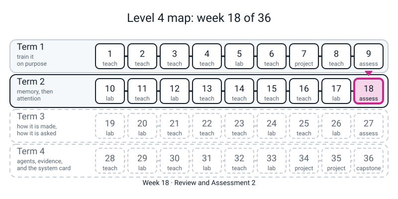
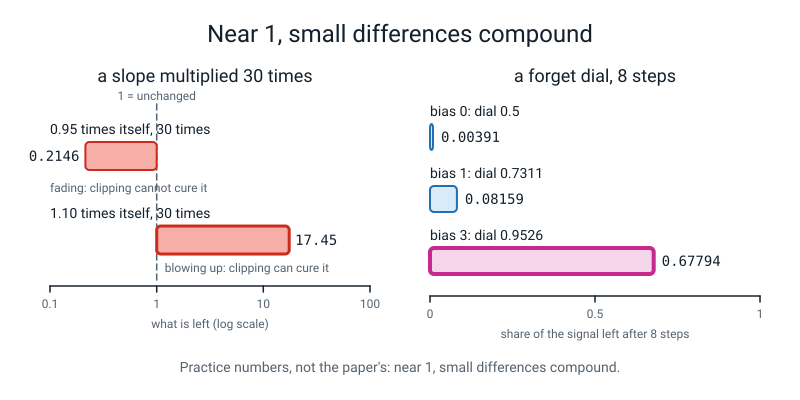
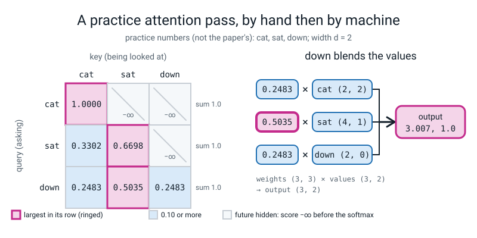

# Week 18 — Review and Assessment 2: What Did Term 2 Leave Behind?

[⬅ Week 17](week-17.md) · [Course Home](../README.md) · [Week 19 ➡](week-19.md) · [Student Guide](../student-guide/week-18.md) · [Workbook](../workbook/week-18.md)

---


*Figure 18.0 — Week 18 of 36, the Term 2 review and paper, sits at the end of term 2; weeks 1 to 17 are done and weeks 19 to 36 are still ahead.*

## 📋 At a Glance

| | |
|---|---|
| **Duration** | 75 minutes in class (2 to settle, 70 for the paper, 3 to hand in), then the marking homework (~45 min) |
| **Type** | 🟥 Assessment — **no new material at all.** Weeks 9-17 (Weeks 10-17 are the new ground; Week 9 was itself a review) on paper, no computer. |
| **Big idea** | Same as Week 9, one term later: the paper is not a grade; it is a **map**. It finds, week by week, what stuck and what did not, so that the per-week remediation table tells the student exactly which page to redo *before* Term 3 builds on it. **Week 19 takes the Week 17 model apart** — deletes the mask, the positions, the residual and the layer norm one at a time — so it leans directly on Weeks 15, 16 and 17, and through them on Week 6. |
| **New vocabulary** | **None.** (If you catch yourself teaching a word today, stop: it is not on the paper.) |
| **New maths** | **None.** The paper *tests* the hand-calculable ideas of Term 2 — compounding (W10), the forget dial as a slope (W11), scores to chances at a temperature (W13), the weighted average of the attention pass (W14) and the count of a block's knobs (W16). Each is in the 🔢 section below, worked for you first. |
| **New syntax** | **None.** Every line of code on the paper uses a construct from Weeks 1-17, listed in section 4. |
| **The paper** | 75 marks. **A** 20 multiple choice (1 each) · **B** 8 "what does this print" (2 each) · **C** 4 "find the bug" (3 each) · **D** 3 arithmetic (5 each) · **E** 1 extended question on real tables (12). Printed in full in [The Paper, in Full](#-the-paper-in-full) below; the key is at the bottom. |
| **Dataset** | None run by the student. Section E prints two real tables as numbers: the 231-name model of Week 12 and the TinyGPT of Week 17 (6,972 typed characters). **Nothing downloads. No internet.** |
| **Model** | Real PyTorch on the CPU, used by *you* in the prep to confirm the Section E tables. **There is no scripted backend and no stand-in anywhere in this week.** |
| **Materials** | The printed paper (one copy, single-sided) · the printed **marking sheet** (short answers only — the one page you may hand over afterwards) · a pen · a calculator with `ln`, `e^x` and a power key (a phone in calculator mode is fine; **airplane mode on**) · scrap paper · a timer · the per-week grid and remediation table (pages 18.2, 18.3) |
| **Prep time** | 30 minutes the night before (printing, reading the key, one 90-second training run) · 3 minutes on the day |
| **Expected runtime of the code** | Every block in the prep finishes in **under 5 seconds**, except `rerun17.py` (TinyGPT's 1,500 steps, about **85-110 seconds** on the author's CPU). Anything over **4 minutes** means something is wrong (see Fallback). The *student* runs no code today. |

> **⚠️ Watch out:** the thing that goes wrong this week is the same as in Week 9: **the teacher rescuing the student mid-paper.** A frown at question 7 changes a right answer. Your job for 70 minutes is to be a quiet adult in a chair. The second thing that goes wrong is **reading the Week 17 numbers as more than they are.** Section E(c) invites the student to say that a model which writes 60% real words "understands English". The key gives credit for the *opposite* reading, and the honest reading is narrower than either: the model has learned some letter-by-letter structure of a 7,000-character text, and has started to memorise it. The third is **marking by the final number only** (see the marking rules).

---

## 🎯 Lesson Objectives

By the end of the lesson the student has, **with no computer and no notes:**

1. **Multiply a slope through a loop** — `0.9` forty times, a forget dial of `0.88` ten times — and say which disease (fading or blowing up) the result is, and which of the two clipping can cure.
2. **Say what a gate does**: the slope of the memory track is the forget gate; a default dial sits near one half; the bias moves it.
3. **Choose a letter from scores** — temperature, top-k, top-p — and say what greedy, exposure bias and the novelty rate mean.
4. **Do the attention arithmetic** on a new set of numbers: scores, softmax by row, weighted average of the values — and say why the scores are divided by `sqrt(d)` and the future hidden *before* the softmax.
5. **Count and read the block**: the knobs in one block at `d = 16`, why positions are needed, and what the first-loss check (`ln 28`) and the train-against-validation gap tell you.

Observable evidence: a scored paper; a filled **per-week mark grid** (page 18.2); and, most important, **a remediation table with at most two weeks circled** for the student to redo during the following fortnight.

---

## 🧑‍🏫 What YOU Need to Know First

> **📌 About the code blocks in this guide.** Every block in the **🧰 Prep Checklist**, in the **🐞 Debugging Clinic** and in **The Paper** was run, in order, from one folder (`36-week-course/`), on a CPU, with one thread and the seeds shown; the outputs below are the real printed output. The Clinic blocks that are *deliberate mistakes* are marked and their tracebacks are real. The code inside the paper is the very same text as the code the key runs. **Timing lines vary run to run; every other number repeated exactly on a second full run on the same machine.** Different CPU or PyTorch build: the last digit of a loss can move. **The Section E tables that go on the paper are printed numbers, so they do not depend on your laptop at all** — print them, do not re-generate them on the day.

### 1. What the student is doing today, in one paragraph

Nothing new. For 70 minutes the student answers a paper about the last nine weeks: twenty multiple-choice questions (one each), eight short programs whose output they must say, four short programs with a bug they must find and fix, three pieces of arithmetic (a new three-word attention pass, a forget dial compounded over ten steps, the knob count of one block) and one longer question built on **two real tables printed from this course's own runs**. They may use a calculator. They may not use a computer, notes, or you. Afterwards they are handed the *marking sheet*, mark their own paper in a different colour of pen as homework, fill the per-week grid, and circle the (at most two) weeks to redo.

Why on paper? Because the standard of the whole year — *you can say what a program will print before you run it* — is best tested with the laptop closed. Why self-marking? Because the act of comparing their own working to the sheet is the best 45 minutes of review on offer, and it is why the marking sheet shows working and not just answers.

### 2. 🔢 The maths you need — taught to you first

**There is no new idea.** But you will mark five hand-calculations, so do each of these yourself, once, with a calculator, *before* class.

**(a) Compounding (Week 10) and the forget dial (Week 11), Question D2.** The forget bias is set to `2`. The dial is the sigmoid of 2: `1 / (1 + e^-2) = 1 / 1.1353 = 0.8808`. The slope back through the memory track is the dial at every step (Week 11), so through ten steps it is multiplied ten times: `0.8808 ^ 10 = 0.2810`. A dial at `0.5` (bias 0) gives `0.5 ^ 10 = 0.000977`. The ratio is `0.2810 / 0.000977 = 287.8`: **about 290 times more signal survives ten steps.** The student may also meet `0.9 ^ 40 = 0.0148` in Question A1; `0.9 ^ 40` is on their calculator as `0.9` then the power key then `40`.

**(b) Scores to chances at a temperature (Week 13), Question B2.** Scores `2, 1, 0` divided by `0.5` are `4, 2, 0`. The exponentials are `54.60, 7.39, 1.00`; the total is `62.99`; the first chance is `54.60 / 62.99 = 0.867`. At temperature `1` it would have been `0.665`. **Dividing by a small temperature sharpens** (Week 13's "T = 0.3 gives 0.958").

**(c) The attention pass on new numbers (Week 14), Question D1.** Three words and their invented 2-number vectors: `red = [1, 1]`, `dog = [2, 0]`, `ran = [0, 1]`. `Wq` and `Wk` are the identity (so `Q = K = X`), and `Wv = [[1, 0], [0, 2]]` doubles the second number. Then:

1. **Values.** Each row times `Wv`: `V = [[1, 2], [2, 0], [0, 2]]`.
2. **Scores for `dog`** (row 2): the dot product of `[2, 0]` with each word's row: `2·1 + 0·1 = 2`, `2·2 + 0 = 4`, `0 + 0 = 0`. So `[2, 4, 0]`.
3. **Softmax, by row.** `e^2 = 7.389`, `e^4 = 54.598`, `e^0 = 1`. Total `62.987`. Weights `0.1173, 0.8668, 0.0159` (they add to 1).
4. **Blend.** `0.1173 × [1, 2] + 0.8668 × [2, 0] + 0.0159 × [0, 2] = [0.1173 + 1.7336, 0.2346 + 0 + 0.0318] = [1.851, 0.266]`.

The rounding trap of Week 14 returns: with weights rounded to three places (`0.117, 0.867, 0.016`) the answer is also `[1.851, 0.266]` here, but tell the student to carry four places and round only the answer. **Accept any answer within `0.002`.** Note that `dog`'s weight on `dog` is 0.867: the word asks mostly about itself because its own vector is longest. That is arithmetic about these invented numbers, not "attention to the important word" (Week 14's warning).

**(d) Knobs in one block at `d = 16` (Week 16), Question D3.** Two layer norms, each `d` scales and `d` shifts: `2 × 2 × 16 = 64`. Attention: `q`, `k`, `v` are `d × d` with **no bias**: `3 × 256 = 768`; the output layer `proj` is `d × d` **plus** `d` bias: `256 + 16 = 272`; attention total `1,040`. The MLP: `up` is `d × 4d` plus `4d` bias: `1,024 + 64 = 1,088`; `down` is `4d × d` plus `d` bias: `1,024 + 16 = 1,040`; MLP total `2,128`. Sum: `64 + 1,040 + 2,128 = 3,232`, and the formula of Week 16, `12d² + 10d`, gives `3,072 + 160 = 3,232`. (The causal mask is a *buffer* and is not counted.)

**(e) The first-loss number (Week 17), Question A20.** `ln 28 = 3.332`. A model that knows nothing gives every one of 28 characters a chance of `1/28`, and the surprise `-ln(1/28)` is the same `3.332` everywhere.


*Figure 18.1 — Practice numbers, not the paper's: a slope near 1 fades or blows up when compounded, and a bigger forget bias keeps more signal.*


*Figure 18.2 — Practice numbers, not the paper's: scores become weights that sum to 1, hide the future, and blend the value rows.*

### 3. 🧭 Real vs stand-in — and what you must NOT claim

| Thing | Real or stand-in? |
|---|---|
| Every number in the two Section E tables | **Real.** Printed by the Week 12 and Week 17 guides' own `train.py` blocks; this guide's prep **re-runs both** and the numbers below are what it printed. |
| Every "what does this print" output (Section B) and every error (Section C, Clinic) | **Real.** Produced by running the code below. |
| The hand-arithmetic answers (Section D) | **Computed twice:** by hand in section 2, and by numpy, torch and `Block(16, 4, 8).parameters()` in the prep. They agree. |
| The vectors and tables in D1 | **Chosen by us** so the arithmetic is easy. Not learned. Nothing is a language model. |
| Any scripted client, `FakeClient`, or stand-in model | **Not present.** The scripted backend first appears in Week 23. |
| The pass mark (45 of 75) | **A proposal**, the same as Week 9's. The README leaves the pass mark to the owner (Open Questions). Change it if the owner has decided otherwise; nothing in this file depends on 45. |

> **Say to the student, out loud, before they start:** *"Everything on this paper is something you have already done with your own hands. It is not a race and it is not a grade. It is an X-ray. If a question looks strange, read it twice, write down what you do know, and move on."*

> **🚫 What you must NOT claim about Section E.** (1) **Not** "the TinyGPT understands English": `known = set(TEXT.split())` counts a word as real if it appears *anywhere* in the 6,972 typed characters (including the held-back tenth), so the "60% real words" score is a crude spelling check, not a comprehension test. (2) **Not** "the gap of 0.54 proves overfitting" by itself: the Week 17 run shows the validation loss **flat or rising slightly after step 1000** (1.417, 1.427, 1.437) while the training loss keeps falling, which is what memorising looks like; one run is one sample. (3) **Not** that the name model's 159 of 200 is "cheating": it is the honest finding that a model trained for 800 steps on 200 names mostly reproduces them.

### 4. The constructs the paper uses — all old, none new

Nothing is new this week. For your reference, here is **every** construct the paper leans on and the week it came from, so you can check "nothing is used before its week" at a glance:

| Week | Construct on the paper | Where |
|:--:|---|---|
| 1-8 | `for ... in range(...)` · `print` · `round` · `.item()` · `torch.tensor` · `torch.zeros` · `torch.ones` · `nn.Linear` | B1-B8, C1-C4 |
| 10 | `h.retain_grad()` · `.grad` · `.abs()` · `.backward()` | C3 |
| 11 | *(the forget gate, in words and numbers; no new code line)* | A4-A7, D2 |
| 12 | `F.cross_entropy(..., ignore_index=)` · `torch.cat` · `torch.full` | B7, B8 |
| 13 | `F.softmax(x, dim=-1)` · `torch.multinomial` · `torch.topk` · `torch.cumsum` · `torch.sort` *(described, not called)* | B2-B4, C2 |
| 14 | `nn.Linear(d, d, bias=False)` · `.transpose(-2, -1)` *(described)* | A15, A16, D1 |
| 15 | `masked_fill(mask, float("-inf"))` · `torch.tril` · `.view(B, T, H, dh).transpose(1, 2)` | B5, B6, C1 |
| 16 | `nn.ModuleList` · `register_buffer` *(described)* · `torch.arange` *(described)* | C4, A19, D3 |
| 17 | *(the model and its tables; no new code line)* | A20, E |

**Teacher-only code.** The prep blocks use `re`, `types.ModuleType`, `exec`, `contextlib.redirect_stdout` and `np.where` to re-run earlier guides' own code and to print only the lines the paper quotes. They are plumbing for *you*, **flagged `TEACHER-ONLY` where they appear,** and are not on the student's ladder. The paper's own code uses none of them.

Not on the paper, on purpose, because they are later rungs: tokenizers and BPE (Week 20), the log-log line (Week 21), KL divergence (Week 22), anything from Weeks 19 onwards. **If a student writes "ablation" or "scaling law" anywhere, do not mark it wrong and do not mark it extra; it is from next term.** Say so kindly on the sheet. Likewise "vanishing gradient" and "clipping" are *fine* on this paper: both are Week 6 and Week 10 words.

### 5. What the numbers will say

These are printed by the prep blocks. Read them before class so nothing surprises you.

- **Section D1, the new pass.** Scores `[[2, 2, 1], [2, 4, 0], [1, 0, 1]]`; the row for `dog`: weights `0.1173, 0.8668, 0.0159`, output `[1.851, 0.266]`. All three rows: `[[1.267, 1.155], [1.851, 0.266], [0.733, 1.689]]`. Torch and numpy agree.
- **Section D2.** Dial `0.8808`; `0.8808 ^ 10 = 0.2810`; `0.5 ^ 10 = 0.000977`; ratio `287.8`.
- **Section D3.** `64 + 1,040 + 2,128 = 3,232`, and `torch` counts `3,232`.
- **Section E(a), the name model** (Week 12, 200 names, 800 steps): validation `2.308` at step 100 (lowest printed), then `2.544, 2.880, 3.077, 3.314, 3.417`; train `1.960` down to `0.906`. At step 800 **159 of 200** generated names are in the training list (79.5%); stopped at step 100 it is **1 of 200**. `ln 28 = 3.332`: the step-800 validation `3.417` is **worse than a model that knows nothing.**
- **Section E(b)/(c), the TinyGPT** (Week 17): step 0 train `3.349`, val `3.351`; step 1000 train `0.999`, val `1.417` (lowest printed val); step 1499 train `0.894`, val `1.437` (gap `0.543`); real-word share `0% → 17% → 60%` at steps 0, 300, 1499. The three counting baselines on the same text: uniform `3.332`, letter frequencies `2.855`, previous letter `2.033`.
- **The shape facts behind B6.** `(2, 5, 8)` becomes `(2, 5, 4, 2)` and then `(2, 4, 5, 2)`: batch 2, 4 heads, 5 places, 2 numbers per head.

### 6. The honest limits of today

1. **One paper is one sample.** A student who is ill, hungry or anxious scores lower than they know. Treat 45 as a prompt for a conversation, never a verdict. The *pattern across weeks* carries the information; the total barely does.
2. **Multiple choice can be guessed.** Twenty 4-option questions guessed at random average 5 marks (`20 × 0.25`). That is why there are only 20 of 75 marks there, and why every option in Section A was built from a real wrong answer or a real tempting half-truth from the earlier weeks, so a wrong choice *means* something (the key names what).
3. **Every week's guide was on disk this time, but the student guides' exact wording was spot-checked, not read line by line.** A grep of the Week 10-17 student guides found the words the paper uses (*dial*, *forget bias*, *teacher forcing*, *exposure bias*, *top-p*, *temperature*, *compounding*, `ModuleList`, *first-loss*). **Before you print:** if a student guide says *"nucleus"* where the paper says *"top-p"*, or *"memory"* where it says *"cell state"*, change the paper and the key **together**; the numbers will not change.
4. **The Section E tables are from one dataset, one harness and one seed each.** They show a *shape* (validation falls, bottoms out, rises), not a law. The name model's validation loss moves by about 0.25 between seeds (Week 12 `T2`); the paper's claims are about the *shape*, not the third decimal.
5. **Three seeds are not enough to call small differences,** and the paper never asks the student to. The one place it asks "is this gap bigger than noise?" (a Week 7 question) is **not on this paper**; it was Week 9's. Term 2 has only one-seed tables, and E(b)/(c) ask the student to say *what one run can and cannot show*.
6. **The self-marking is honest only if the sheet gives working.** A sheet that shows only answers invites a student to "correct" their paper to match. The marking sheet in page 18.1 shows working for every arithmetic question for that reason.

### 7. The misconceptions you will actually see, and where

| On the paper | A student writes | What it tells you |
|---|---|---|
| A1 | "36" or "0.36" | Multiplied `0.9 × 40` instead of compounding. Week 10's whole lesson. |
| A3 | "clipping fixes both" | Believes clipping rescues a gradient of `1e-10`. It can only turn the volume down. |
| A4 | "the input gate" | Cannot say which gate carries the slope back. Week 11. |
| A7 | "the LSTM fixes vanishing gradients" | Week 11's warning: at default settings it does not. |
| A9 | "the validation names are broken" | Cannot read a validation loss above `ln 28`. Weeks 5 and 12. |
| A13 | "it reads the wrong letters" | Has not met *exposure bias*; thinks the model is mis-trained. Week 13. |
| A17 | "to make it faster" | Treats `sqrt(d)` as cosmetic. Week 15. |
| A18 | "set to 0" | The mask-with-zero mistake; the future still gets weight. Week 15. |
| B4 | "4" | Counted `<0.85` only, forgot the `+ 1` (the letter that *crosses* the line is kept). |
| B5 | a matrix with no zeros | Thinks `masked_fill` with `-inf` is the same as a small number. |
| B7 | "0.6932 0.6932" | Thinks `ignore_index` does nothing; or does not know the ignored row was nearly perfect. |
| C1 | "it is fine, the rows add to 1" | Checks the wrong axis: the *rows* of the printed weights do not add to 1; the column of row sums is `0.3333, 0.6667, 1.0`. |
| D1 | weights `[0.333, 0.333, 0.333]` | Forgot the exponential; averaged the scores. |
| D2 | "0.88 × 10 = 8.8" | Multiplied instead of compounding. |
| D3 | `12d²` only (3,072) | Forgot the biases and norms: the `10d`. |
| E(b) | "0.894 is the error, so it is 89% right" | Reads a loss as an accuracy. Weeks 1 and 17. |

### 8. How deep to go, and where to stop

Today you teach **nothing**. If, while they work, the student asks a question, the only legal answers are *"read it again"*, *"write what you know"*, and *"I can't help with that one, move on."* Afterwards, in the wrap, explain **no** wrong answers; promise to go through the pattern next time. Real explaining happens in the remediation fortnight, where it will stick because the student has just discovered the gap for themselves.

### 9. 🧭 Where Week 18 sits

```text
   TERM 2 — MEMORY, THEN ATTENTION                             TERM 3 — OPEN IT, TOKENISE IT, SCALE IT
   W10 forty multiplications   W11 gates      W12 names        W19 open the GPT: delete each part (needs W15, W16, W17, and W6)
   W13 sampling   W14 attention by hand   W15 scale + mask     W20 tokenizers (BPE)
   W16 positions + block      W17 TinyGPT                      W21 scaling arithmetic (new maths: the log-log line)
                          ┌───────────────┐
                          │  W18  PAPER   │  one week to find out what to redo BEFORE you take the model apart
                          └───────────────┘
```
Three weeks are load-bearing for Term 3: **Week 15** (the mask and the divide are two of the four things Week 19 deletes), **Week 16** (positions and the block are the other two, with Week 6's residual and layer norm) and **Week 17** (the first-loss check and the train-against-validation reading are how Week 19 decides that an ablation "broke" the model). If the grid shows Weeks 15, 16 or 17 under 60%, those are the ones to redo first; see the remediation table.

---

## 🧰 Prep Checklist

### 30 minutes the night before

**☐ 1. Smoke test and folder check (1 minute).** Open a terminal **in the `36-week-course/` folder** — the folder that *contains* both `l4lib/` and `teacher-guide/` — and run the first block. If it says `ModuleNotFoundError: No module named 'l4lib'` you are in the wrong folder (the commonest error of the whole year). If it says `FileNotFoundError: teacher-guide/week-17.md` you are in the wrong folder too. `pip` returning **403** is the proxy, and it is **not an error**: nothing is installed this year.

**Block P1 — set-up, and a loader for Week 17's model (TEACHER-ONLY plumbing)**

```python
# week18.py - Week 18 prep. Run the blocks below in order, in ONE session, from the folder that contains l4lib/ and teacher-guide/.
import math
import re
import sys
import types
import numpy as np
import torch
import torch.nn as nn
import torch.nn.functional as F
torch.set_num_threads(1)
from l4lib.corpus import TEXT

print("corpus      :", len(TEXT), "characters,", len(set(TEXT)), "distinct")
print("ln(28)      :", round(math.log(28), 3))


def guide_blocks(week):
    """Every fenced python block of one teacher guide, in order (this is TEACHER-ONLY plumbing, not on the student's ladder)."""
    text = open(f"teacher-guide/week-{week}.md", encoding="utf-8").read()
    fence = "`" * 3                                        # three backticks, spelled so this block does not contain a fence
    return re.findall(fence + r"python\n(.*?)" + fence, text, flags=re.S)


def block_named(blocks, first_line):
    found = [b for b in blocks if b.startswith(first_line)]
    assert len(found) == 1, (first_line, len(found))
    return found[0]


tinygpt = types.ModuleType("tinygpt")                      # lets 'from tinygpt import TinyGPT' work with no file on disk
exec(block_named(guide_blocks("17"), "# tinygpt.py"), tinygpt.__dict__)
sys.modules["tinygpt"] = tinygpt
print("TinyGPT and Block loaded from the Week 17 guide:", hasattr(tinygpt, "TinyGPT"), hasattr(tinygpt, "Block"))
```
```text
corpus      : 6972 characters, 28 distinct
ln(28)      : 3.332
TinyGPT and Block loaded from the Week 17 guide: True True
```

If `6972 characters, 28 distinct` differs, **stop**: you are not teaching from the same corpus and the Section E tables will not match what the paper says.

**☐ 2. Compute the key (2 minutes).** Every hand-arithmetic answer on the paper, from code. This file is *teaching* nothing new; it is there so that **you** can see the hand answers and the computer agree.

**Block P2 — `key.py`: Section D, every number**

```python
# key.py - Week 18: every hand-arithmetic answer on the paper, computed. (Uses P1's names.)
# D1: the new three-token pass. Tables are chosen to be easy; nothing is learned.
X = np.array([[1.0, 1.0], [2.0, 0.0], [0.0, 1.0]])         # red, dog, ran
Wq = np.array([[1.0, 0.0], [0.0, 1.0]])
Wk = np.array([[1.0, 0.0], [0.0, 1.0]])
Wv = np.array([[1.0, 0.0], [0.0, 2.0]])
Q, K, V = X @ Wq, X @ Wk, X @ Wv
scores = Q @ K.T
e = np.exp(scores)
weights = e / e.sum(axis=1).reshape(3, 1)
out = weights @ V
print("D1 V       =", V.tolist())
print("D1 scores  =", scores.tolist())
print("D1 exp row 2 (dog):", np.round(e[1], 3).tolist(), " total", round(float(e[1].sum()), 3))
print("D1 weights =", np.round(weights, 4).tolist())
print("D1 output  =", np.round(out, 3).tolist())
w3 = np.round(weights[1], 3)                               # the pen route: three-place weights
print("D1 pen route, row 2:", np.round(w3 @ V, 3).tolist(), " weights add to", round(float(w3.sum()), 3))

# and the same pass through torch, to see numpy and torch agree
def table_layer(table):
    layer = nn.Linear(2, 2, bias=False)
    layer.weight.data = torch.tensor(table.tolist()).transpose(0, 1)    # nn.Linear stores its table the other way round
    return layer


xt = torch.tensor(X.tolist())
ql, kl, vl = table_layer(Wq), table_layer(Wk), table_layer(Wv)
wt = F.softmax(ql(xt) @ kl(xt).transpose(-2, -1), dim=-1)
print("D1 torch agrees with numpy:", bool(np.allclose(wt.detach().numpy() @ vl(xt).detach().numpy(), out, atol=1e-5)))

# D2: a forget dial set by bias 2, and ten steps of compounding.
dial = 1 / (1 + math.exp(-2))
print("D2a dial        :", round(dial, 4))
print("D2b dial ** 10  :", round(dial ** 10, 4))
print("D2c 0.5 ** 10   :", round(0.5 ** 10, 6))
print("D2d ratio       :", round(dial ** 10 / 0.5 ** 10, 1))

# D3: the knobs of one block at d = 16 (H = 4, context 8), by hand and by counting.
d = 16
norms = 2 * (2 * d)
attention = 3 * d * d + (d * d + d)
mlp = (d * 4 * d + 4 * d) + (4 * d * d + d)
print("D3 norms, attention, mlp:", norms, attention, mlp, " total", norms + attention + mlp)
from tinygpt import Block
print("D3 counted by torch     :", sum(p.numel() for p in Block(16, 4, 8).parameters()), " formula 12d^2+10d =", 12 * d * d + 10 * d)
```
```text
D1 V       = [[1.0, 2.0], [2.0, 0.0], [0.0, 2.0]]
D1 scores  = [[2.0, 2.0, 1.0], [2.0, 4.0, 0.0], [1.0, 0.0, 1.0]]
D1 exp row 2 (dog): [7.389, 54.598, 1.0]  total 62.987
D1 weights = [[0.4223, 0.4223, 0.1554], [0.1173, 0.8668, 0.0159], [0.4223, 0.1554, 0.4223]]
D1 output  = [[1.267, 1.155], [1.851, 0.266], [0.733, 1.689]]
D1 pen route, row 2: [1.851, 0.266]  weights add to 1.0
D1 torch agrees with numpy: True
D2a dial        : 0.8808
D2b dial ** 10  : 0.281
D2c 0.5 ** 10   : 0.000977
D2d ratio       : 287.8
D3 norms, attention, mlp: 64 1040 2128  total 3232
D3 counted by torch     : 3232  formula 12d^2+10d = 3232
```

**☐ 3. Run Section B exactly as printed (1 minute).** The eight snippets below are the paper's Section B, pasted into one block. Each prints what the paper's answer line says.

**Block P3 — Section B, all eight**

```python
# B1
f = 0.5
slope = 1.0
for _ in range(10):
    slope = slope * f
print(slope)

# B2
scores = torch.tensor([2.0, 1.0, 0.0])
print(round(F.softmax(scores / 0.5, dim=-1)[0].item(), 2))

# B3
vals, idx = torch.topk(torch.tensor([0.1, 0.5, 0.2, 0.9, 0.3]), 2)
print(vals, idx)

# B4
p = torch.tensor([0.5, 0.3, 0.1, 0.06, 0.04])
c = torch.cumsum(p, dim=0)
print(c)
print((c < 0.85).sum().item() + 1)

# B5
s = torch.zeros(3, 3)
s = s.masked_fill(torch.tril(torch.ones(3, 3)) == 0, float("-inf"))
print(F.softmax(s, dim=-1))

# B6
x = torch.zeros(2, 5, 8)
print(x.view(2, 5, 4, 2).transpose(1, 2).shape)

# B7
logits = torch.tensor([[0.0, 0.0, 0.0, 0.0], [10.0, 0.0, 0.0, 0.0]])
target = torch.tensor([1, 0])
print(round(F.cross_entropy(logits, target).item(), 4), round(F.cross_entropy(logits, target, ignore_index=0).item(), 4))

# B8
names = torch.tensor([[2, 15, 10]])
start = torch.full((1, 1), 27)
print(torch.cat([start, names[:, :-1]], dim=1))
```
```text
0.0009765625
0.87
tensor([0.9000, 0.5000]) tensor([3, 1])
tensor([0.5000, 0.8000, 0.9000, 0.9600, 1.0000])
3
tensor([[1.0000, 0.0000, 0.0000],
        [0.5000, 0.5000, 0.0000],
        [0.3333, 0.3333, 0.3333]])
torch.Size([2, 4, 5, 2])
0.6932 1.3863
tensor([[27,  2, 15]])
```

**☐ 4. The three counting baselines for E(b) (1 minute).** The paper quotes `3.332`, `2.855` and `2.033`. These are what a "model" that only counts would score on Week 17's validation text.

**Block P4 — `baselines.py`**

```python
# baselines.py - Week 18: what would a model that only counts score on Week 17's text? (The three E(b) reference lines.)
chars = sorted(set(TEXT))
V = len(chars)
stoi = {c: i for i, c in enumerate(chars)}
ids = [stoi[c] for c in TEXT]
n = int(0.9 * len(ids))
train, val = ids[:n], ids[n:]

print("knows nothing (uniform)      :", round(math.log(V), 3))
one = np.ones(V)
for c in train:
    one[c] += 1
p1 = one / one.sum()
print("knows letter frequencies     :", round(float(np.mean([-math.log(p1[c]) for c in val[1:]])), 3))
two = np.ones((V, V))
for a, b in zip(train[:-1], train[1:]):
    two[a, b] += 1
p2 = two / two.sum(axis=1, keepdims=True)
print("knows the previous letter    :", round(float(np.mean([-math.log(p2[a, b]) for a, b in zip(val[:-1], val[1:])])), 3))
```
```text
knows nothing (uniform)      : 3.332
knows letter frequencies     : 2.855
knows the previous letter    : 2.033
```

**☐ 5. Re-run Week 12's name model and confirm the E(a) table (1 minute).** It re-runs the Week 12 guide's own blocks in one namespace and prints only the lines the paper quotes. **TEACHER-ONLY:** `exec` and a regular expression.

**Block P5 — `rerun12.py`**

```python
# rerun12.py - Week 18 prep. Re-runs Week 12's own blocks (names, pad, model, train, generate, novelty) from the Week 12 guide,
# in one namespace, and prints only the lines the paper quotes. About 5 seconds.
import contextlib
import io

blocks12 = guide_blocks("12")
space12 = {"__name__": "__main__"}
captured = io.StringIO()
with contextlib.redirect_stdout(captured):
    for first in ("# names.py", "# pad.py", "# model.py", "# train.py", "# generate.py", "# novelty.py"):
        exec(block_named(blocks12, first), space12)
for line in captured.getvalue().splitlines():
    if re.match(r"^(  step|final|200 names|stopped at|a model that knows)", line):
        print(line)
```
```text
a model that knows nothing scores ln(28) = 3.3322
  step    0  train 3.346  validation 3.349
  step  100  train 1.960  validation 2.308
  step  200  train 1.431  validation 2.544
  step  300  train 1.103  validation 2.880
  step  400  train 0.984  validation 3.077
  step  600  train 0.921  validation 3.314
  step  800  train 0.906  validation 3.417
final   train 0.906 | validation 3.417 | last training step (dropout on) 1.001
200 names | already in the TRAINING list: 159 (79.5%) | in the held-back list: 0 | in neither: 41
stopped at step 100: train 1.960, validation 2.308
200 names | in the TRAINING list: 1 (0.5%) | in the held-back list: 0 | in neither: 199
```

**☐ 6. Re-run Week 17's TinyGPT and confirm the E(b)/(c) table (about 90 seconds; start it and do something else).**

**Block P6 — `rerun17.py`**

```python
# rerun17.py - Week 18 prep. Re-runs Week 17's own train.py from the Week 17 guide (TinyGPT was loaded in P1).
# It writes no file. About 85 seconds; prints only the table lines the paper quotes.
blocks17 = guide_blocks("17")
captured = io.StringIO()
with contextlib.redirect_stdout(captured):
    exec(block_named(blocks17, "# train.py"), {"__name__": "__main__"})
for line in captured.getvalue().splitlines():
    if re.match(r"^(knobs|--- step|step +\d|FINAL|real words|step time)", line):
        print(line)
```
```text
knobs: 807196
--- step 0: train 3.349  val 3.351 ---
real words in a 1,000-character sample: 0%
step  250  train 1.964  val 1.944
--- step 300: train 1.873  val 1.892 ---
real words in a 1,000-character sample: 17%
step  500  train 1.558  val 1.647
step  750  train 1.181  val 1.470
step 1000  train 0.999  val 1.417
step 1250  train 0.905  val 1.427
--- step 1499: train 0.894  val 1.437 ---
real words in a 1,000-character sample: 60%
FINAL  train 0.907  val 1.447  gap 0.540
step time: 60 ms   total training: 90 s
```

Everything but the `step time` line repeated exactly in three runs here (Week 17's guide says the same of its own). **If your table differs by more than 0.01 in a loss** you are on a different PyTorch or CPU; still print the table in this guide, not yours, because the paper, the key and the marking sheet all quote these.

**☐ 7. Prepare the remediation redo numbers (1 minute).** The README's assignment for this week is *"redo the 3-token pass on a new set of numbers."* Block P2 is the paper's set. Block P7 is a **second** set, for the redo in the fortnight after, with **both** Week 15 dials switched on. Keep the output: it is the key for the redo.

**Block P7 — `redo.py` (TEACHER-ONLY; a second set, both dials)**

```python
# redo.py - Week 18: a SECOND set of numbers for the remediation redo of the three-token pass (both dials from Week 15 switched on).
X2 = np.array([[2.0, 0.0], [1.0, 1.0], [0.0, 1.0]])        # big, red, dog
Wv2 = np.array([[0.0, 1.0], [1.0, 0.0]])                   # swap the two numbers; Wq and Wk are the identity
raw = X2 @ X2.T
print("scores             :", raw.tolist())
scaled = raw / math.sqrt(2)                                # dial 1: divide by sqrt(d), d = 2
hidden = np.where(np.tril(np.ones((3, 3))) == 0, -np.inf, scaled)   # dial 2: hide the future, BEFORE the softmax
ex = np.exp(hidden)
wts = ex / ex.sum(axis=1).reshape(3, 1)
print("weights, both dials:", np.round(wts, 4).tolist())
print("output, both dials :", np.round(wts @ (X2 @ Wv2), 3).tolist())
print("row 3 exp triple   :", np.round(ex[2], 3).tolist(), " total", round(float(ex[2].sum()), 3))
```
```text
scores             : [[4.0, 2.0, 0.0], [2.0, 2.0, 1.0], [0.0, 1.0, 1.0]]
weights, both dials: [[1.0, 0.0, 0.0], [0.5, 0.5, 0.0], [0.1978, 0.4011, 0.4011]]
output, both dials : [[0.0, 2.0], [0.5, 1.5], [0.802, 0.797]]
row 3 exp triple   : [1.0, 2.028, 2.028]  total 5.056
```

The set: `big = [2, 0]`, `red = [1, 1]`, `dog = [0, 1]`, `Wq` and `Wk` the identity, `Wv` swaps the two numbers (`V = [[0, 2], [1, 1], [1, 0]]`). The scores are divided by `sqrt(2)`, and the scores above the diagonal are set to `-inf` **before** the softmax. Row 2 (`red`) sees only `big` and `red`: scaled scores `1.414, 1.414`, equal weights, output `[0.5, 1.5]`. Row 3 (`dog`) sees all three: scaled scores `0, 0.707, 0.707`, exponentials `1, 2.028, 2.028`, total `5.056`, weights `0.1978, 0.4011, 0.4011`, output `[0.802, 0.797]`.

**☐ 8. Check the grid adds up (10 seconds).**

**Block P8 — `grid.py` (checks Page 18.2)**

```python
# grid.py - Week 18: check that the per-week grid (Page 18.2) adds up to the paper's 75 marks.
marks = {                       # question: (week, marks)
    **{q: (10, 1) for q in ("A1", "A2", "A3")},
    **{q: (11, 1) for q in ("A4", "A5", "A6", "A7")},
    **{q: (12, 1) for q in ("A8", "A9", "A10")},
    **{q: (13, 1) for q in ("A11", "A12", "A13", "A14")},
    **{q: (14, 1) for q in ("A15", "A16")},
    **{q: (15, 1) for q in ("A17", "A18")},
    "A19": (16, 1), "A20": (17, 1),
    "B1": (10, 2), "B2": (13, 2), "B3": (13, 2), "B4": (13, 2), "B5": (15, 2), "B6": (15, 2), "B7": (12, 2), "B8": (12, 2),
    "C1": (15, 3), "C2": (13, 3), "C3": (10, 3), "C4": (16, 3),
    "D1": (14, 5), "D2b": (10, 3), "D2a": (11, 2), "D3": (16, 5),
    "E(a)": (12, 4), "E(b)": (17, 4), "E(c)": (17, 4),
}
per_week = {}
for q, (week, m) in marks.items():
    per_week[week] = per_week.get(week, 0) + m
print("marks per week      :", dict(sorted(per_week.items())))
print("total               :", sum(per_week.values()))
print("redo if marks <=    :", {w: math.floor(0.6 * m) for w, m in sorted(per_week.items())})
```
```text
marks per week      : {10: 11, 11: 6, 12: 11, 13: 13, 14: 7, 15: 9, 16: 9, 17: 9}
total               : 75
redo if marks <=    : {10: 6, 11: 3, 12: 6, 13: 7, 14: 4, 15: 5, 16: 5, 17: 5}
```

**☐ 9. Print.** Print **one** copy of [The Paper](#-the-paper-in-full) single-sided (so there is room to work), and **one** copy of the **marking sheet** (Page 18.1 of the key — *only* the block between the two "✂ PRINT" lines). Print the **per-week grid** (Page 18.2) and the **remediation table** (Page 18.3) on one page. **Do not print the rest of this file.** Never hand the student any page of this guide except those three.

**☐ 10. Check the student-guide wording (5 minutes).** See "Honest limits", item 3. Open the Week 11, 13 and 15 student guides and check the words *forget bias*, *top-p* and *dial*. If one differs, edit the paper and the key **together**.

**☐ 11. Decide the remediation slots.** The remediation table gives each weak week a 20-minute redo. Find two slots in the coming fortnight *now* (before Week 19 or in it) and write them on the table. A remediation plan with no time attached does not happen.

### 3 minutes on the day

**☐ 12.** Clear the desk: pen, calculator (airplane mode **on**), scrap paper, water. **The laptop is shut and out of reach**, because this paper's whole point is "no computer". Put the timer where you can both see it. Put the paper face down.

### Fallback if the laptops fail

**Nothing about the lesson needs a laptop.** The student's paper is printed numbers. If *your* laptop fails the night before, the Section E tables in the paper are already printed, and the key's numbers are in this file: the prep only confirms them. Do the lesson from the printed pages. If `rerun17.py` runs for more than 4 minutes, stop it (Ctrl-C): nothing downstream needs it.

---

## ⏱️ The Lesson, Minute by Minute

This week's lesson has the usual five-part shape, but four of the five parts are deliberately **empty**. That is the design: nothing is taught, so nothing can be "rescued".

| Segment | Minutes | Clock | What happens |
|---|:--:|:--:|---|
| 🪝 Hook — The Promise | 2 | 0:00-0:02 | Desk cleared, laptop away. You read the three rules and the X-ray sentence. |
| 🧠 Concept & Maths | 0 | — | **None.** There is nothing to explain. |
| 💻 Live-Code Together | 0 | — | **None.** No computer today. |
| 🎲 Their Turn — The Paper | 70 | 0:02-1:12 | Sections A to E, with five time-checks. You say the *time*, nothing else. |
| 🔑 Wrap & Assign | 3 | 1:12-1:15 | Paper in. Marking sheet out. Say what the homework is. Nothing about right or wrong answers. |

### 🪝 Hook — The Promise (2 minutes)

Say, slowly, *from the page, not from memory*:

> *"This is not a test you pass or fail. It is an X-ray of the last nine weeks. You have 70 minutes, a calculator and a pen. No computer, no notes, and I can't help, because the X-ray only works if I don't. If a question looks strange, write down what you do know and move on: partial working earns marks. When it is over you will mark it yourself, and the marks will tell us which two weeks to go back to before we start taking the model apart."*

Then: *"Questions?"* Answer **only** about logistics (where to write, the calculator, the toilet). Turn the paper over. Start the timer.

### 🎲 Their Turn — The Paper (70 minutes)

Sit **to the side and a little behind**. Do something quiet and boring: read, mark something else. Do not watch the page: a student who feels watched writes the answer they think you want.

**The five time-checks.** At each time below say *only* the sentence on the right, in a normal voice:

| Clock | Say | What it is for |
|:--:|---|---|
| **0:17** | *"Seventeen minutes. Section A is usually done by now."* | A is 20 one-mark questions; a student still on A at 0:17 will starve E. |
| **0:32** | *"Thirty-two minutes. Moving on from B is fine."* | B is 8 short programs, about 2 minutes each. |
| **0:44** | *"Forty-four minutes. Section C should be finished."* | C is 4 bugs, about 3 minutes each. |
| **0:59** | *"An hour. You have thirteen minutes for E. Start it now."* | E is 12 marks, **the largest single question on the paper**, and D is the slowest section; a student who is still on D at 0:59 should leave D3 for last and go to E. |
| **1:10** | *"Two minutes. Finish the sentence you are on."* | Stops the half-finished answer. |

**If they ask you something during the paper.** Three legal replies: *"Read it again."* / *"Write what you do know."* / *"I can't help with that one — move on."* Never a fourth. **If they say "I don't get it":** *"That is useful. Write 'did not get it' next to it and go on. It is the most useful thing you can write."* (Marking rule 4: an honest *"don't know"* is recorded on the grid and is worth more than a lucky guess.)

**If they finish early.** With more than 10 minutes left: *"Go back through, starting from the end, and check each one against your own working."* **Do not** let them leave; do not let them start the next week. If they finish with more than 20 minutes left something is wrong (blank sections? tell them to try every question, even by guessing in A).

**If they are visibly upset.** Stop the clock if you must. *"This is the X-ray, not the grade. Nobody here is keeping score but you."* A calm minute costs a mark or two and is worth it. If the student cannot continue, write the time on the paper, collect it, and mark only what is there; add the missing-section marks to the grid as *"not attempted — rest of paper"* (do not score it zero in the remediation table, see "Assessing Understanding").

### 🔑 Wrap & Assign (3 minutes)

1. **At 1:12: "Pens down."** Take the paper. Do not read it in front of them.
2. **Hand over the marking sheet** (the printed Page 18.1 and the grid, Page 18.2) and a pen of a *different colour* from the one used on the paper.
3. **Say the homework once:** *"Mark your own paper tonight against this sheet, in the other colour. Give yourself marks for working, not just answers: the sheet tells you how. Then fill in the grid, and circle at most two weeks. Bring it next time."*
4. **Say one true thing about the paper**, whatever the result: *"Whatever you got, the thing I care about is whether you can tell me, on the grid, where the marks went."*
5. Do **not** discuss any question. If they ask, *"Tonight, with the sheet. Then we'll talk about the pattern."*

---

## 🐞 The Debugging Clinic

This week the clinic is **short and different**: the four bugs the paper asks the student to find, produced by running them, with the real output you will want to hold in your head while you mark Section C. There is nothing to *plant* in class: the student has already met each of these in Weeks 10, 13, 15 and 16. Use this clinic **in the remediation fortnight**, on whichever bug the student missed. **Two of the four are silent** (nothing is raised; the output is just wrong): those are the ones that cost the most marks.

Every error below was produced by running the code. **Paths will differ on your machine**; they are shown as `/home/you/l4/`. Each block marked `DELIBERATE` is a mistake on purpose.

### How to teach debugging without giving the answer

1. *"Read me the last line."* (It says what went wrong; the lines above say where.)
2. *"Which of your files is on the line above it?"*
3. *"What did you expect that line to do?"*
4. Only then: *"What would you change, and what do you predict will happen?"* — and let them run it.

For a **silent** bug there is no last line to read, so the first question changes: *"What should be true of this output, and is it?"* (Rows add to 1? The same input gives the same answer? The count is what you worked out by hand?)

### Bug C1 — the mask applied after the softmax (SILENT, Week 15)

```python
# DELIBERATE BUG C1 (SILENT): the mask is applied AFTER the softmax.
import torch
import torch.nn.functional as F
scores = torch.zeros(3, 3)
future = torch.tril(torch.ones(3, 3)) == 0
weights = F.softmax(scores, dim=-1)
weights = weights.masked_fill(future, 0.0)
print(weights)
print(weights.sum(dim=-1))
```
```text
tensor([[0.3333, 0.0000, 0.0000],
        [0.3333, 0.3333, 0.0000],
        [0.3333, 0.3333, 0.3333]])
tensor([0.3333, 0.6667, 1.0000])
```

**Read it:** nothing is raised, and the top-right corner is a tidy `0.0000`. But the **rows do not add to 1**: the row sums are `0.3333, 0.6667, 1.0`. The softmax gave every word a share of `1/3` *including the future*, and only afterwards were the future entries overwritten with 0; the shares they held are simply gone. **Fix:** hide the future **before** the softmax, with `-inf`, so the softmax gives them a weight of exactly 0 and shares the whole 1 among the words that remain (block below). **Why it is the most instructive of the four:** the output *looks* masked. The cheap check is `weights.sum(dim=-1)`. Marking: 1 for "the mask is applied after the softmax / too late", 1 for the consequence ("rows do not add to 1" or "row sums 0.33, 0.67, 1.0"), 1 for the fix ("fill with `-inf` before the softmax"). *(Week 15's other wrong mask, `0` instead of `-inf` before the softmax, is a different bug and earns the mark for the fix only if the student says `-inf`.)*

And the fix (this block is **not** a mistake):

```python
import torch
import torch.nn.functional as F
scores = torch.zeros(3, 3)
future = torch.tril(torch.ones(3, 3)) == 0
weights = F.softmax(scores.masked_fill(future, float("-inf")), dim=-1)     # hide the future BEFORE the softmax
print(weights)
print(weights.sum(dim=-1))
```
```text
tensor([[1.0000, 0.0000, 0.0000],
        [0.5000, 0.5000, 0.0000],
        [0.3333, 0.3333, 0.3333]])
tensor([1., 1., 1.])
```

### Bug C2 — `torch.multinomial` given scores, not chances (loud, Week 13)

```python
# DELIBERATE BUG C2 (loud): torch.multinomial given raw scores, not probabilities.
import torch
torch.manual_seed(0)
scores = torch.tensor([[2.0, -1.0, 0.5]])
pick = torch.multinomial(scores, 1)
print(pick)
```
```text
Traceback (most recent call last):
  File "/home/you/l4/bad2.py", line 5, in <module>
    pick = torch.multinomial(scores, 1)
RuntimeError: probability tensor contains either `inf`, `nan` or element < 0
```

**Read it:** `torch.multinomial` draws from a list of **chances**, which cannot be negative. The raw scores contain `-1.0`, so PyTorch refuses: *"element < 0"* is the clue. **A trap in the marking:** had every score been positive, there would be **no error at all**; `multinomial` would treat `2.0, 0.5` as un-normalised weights and quietly give the wrong odds (`2 : 0.5` instead of the softmax `0.79 : 0.18`). So the mark for "what happens" is for the error *given these scores*. **Fix:** `F.softmax(scores, dim=-1)` first (the Week 13 pipeline: scores, then temperature, then softmax, then draw). Marking: 1 for "scores, not chances/probabilities", 1 for the error message in their own words, 1 for `softmax` before `multinomial`.

```python
import torch
import torch.nn.functional as F
torch.manual_seed(0)
scores = torch.tensor([[2.0, -1.0, 0.5]])
probs = F.softmax(scores, dim=-1)                   # scores -> chances first
print(probs)
print(torch.multinomial(probs, 1))
```
```text
tensor([[0.7856, 0.0391, 0.1753]])
tensor([[2]])
```

### Bug C3 — asking an in-between number for its gradient without `retain_grad()` (loud, Week 10)

```python
# DELIBERATE BUG C3 (loud, after a warning): asking an in-between note for its gradient without retain_grad().
import torch
torch.manual_seed(0)
w = torch.tensor(0.9, requires_grad=True)
h = w * 2.0
y = h * 3.0
y.backward()
print(h.grad.abs())
```
```text
/home/you/l4/bad3.py:8: UserWarning: The .grad attribute of a Tensor that is not a leaf Tensor is being accessed. Its .grad attribute won't be populated during autograd.backward(). If you indeed want the .grad field to be populated for a non-leaf Tensor, use .retain_grad() on the non-leaf Tensor. If you access the non-leaf Tensor by mistake, make sure you access the leaf Tensor instead. See github.com/pytorch/pytorch/pull/30531 for more informations. (Triggered internally at /Users/runner/work/pytorch/pytorch/pytorch/build/aten/src/ATen/core/TensorBody.h:494.)
  print(h.grad.abs())
Traceback (most recent call last):
  File "/home/you/l4/bad3.py", line 8, in <module>
    print(h.grad.abs())
AttributeError: 'NoneType' object has no attribute 'abs'
```

**Read it:** the first thing PyTorch prints is a *warning* (it is not the error): "`.grad` attribute of a Tensor that is not a leaf Tensor is being accessed", with the cure in the same sentence (`use .retain_grad()`). The error that follows is a **consequence**: `h.grad` is `None`, and `None` has no `.abs`. The habit to build is *read the warning first*; it is often the whole answer. **Fix:** call `h.retain_grad()` on the in-between note **before** `backward()` (block below). Marking: 1 for "`h` is not a leaf / an in-between value; its gradient is thrown away", 1 for `h.retain_grad()`, 1 for *before* the `backward()` call (the call does nothing afterwards). Week 10's lab is this bug repeated at every position.

```python
import torch
torch.manual_seed(0)
w = torch.tensor(0.9, requires_grad=True)
h = w * 2.0
h.retain_grad()                                     # ask the in-between note to keep its gradient
y = h * 3.0
y.backward()
print(h.grad.abs())
```
```text
tensor(3.)
```

### Bug C4 — the blocks kept in a plain list (SILENT, Week 16)

```python
# DELIBERATE BUG C4 (SILENT): the blocks kept in a plain list, so the parent cannot see them.
import torch.nn as nn
class Tower(nn.Module):
    def __init__(self, L):
        super().__init__()
        self.blocks = [nn.Linear(4, 4) for _ in range(L)]
        self.head = nn.Linear(4, 2)
model = Tower(3)
print(sum(p.numel() for p in model.parameters()))
```
```text
10
```

**Read it:** nothing is raised, and the programmer wrote three `Linear(4, 4)` (20 numbers each) and a head (10 numbers), so the count should be `3 × 20 + 10 = 70`. The model reports **10**: only the head. A plain Python list hides its contents from the parent module, so `.parameters()` cannot find them, and the optimizer would never be given them: **those three layers would never learn and nothing would complain.** **Fix:** `nn.ModuleList([...])` (block below). **The check** is the one Week 16 taught: count the knobs by hand first, then by code. Marking: 1 for "a plain list", 1 for the consequence ("the layers are not in `.parameters()`, so they are never trained" — the count `10` against `70` earns it), 1 for `nn.ModuleList`.

```python
import torch.nn as nn
class Tower(nn.Module):
    def __init__(self, L):
        super().__init__()
        self.blocks = nn.ModuleList([nn.Linear(4, 4) for _ in range(L)])
        self.head = nn.Linear(4, 2)
model = Tower(3)
print(sum(p.numel() for p in model.parameters()))
```
```text
70
```

---

## 🎲 The Activity, In Full

### The Paper, in Full

> **How to use this section.** Everything between the two lines marked `✂ PAPER STARTS` and `✂ PAPER ENDS` is what the student sees. Print exactly that. Everything *outside* them is for you. The code on the paper is the same text that the key runs (Blocks P3 and the Clinic), and the Section E tables are the printed numbers of Blocks P5 and P6 (with the baselines of Block P4).

✂ PAPER STARTS

# Term 2 Checkpoint — Review and Assessment 2

**Name: ____________________   Date: ______________   Time allowed: 70 minutes   Total: 75 marks**

**Rules.** Calculator allowed. No computer. No notes. Write on the paper. **Show your working** in Sections B-E: a wrong number with the right working still earns marks. If you do not know, write *"don't know"*: that is useful information and costs nothing extra. Every question is about something you have already done with your own hands. In the code, `torch`, `torch.nn as nn` and `torch.nn.functional as F` have already been imported.

| Section | What | Marks | Suggested time |
|:--:|---|:--:|:--:|
| **A** | 20 multiple choice (circle one letter) | 20 | 15 min |
| **B** | 8 "what does this print?" | 16 | 15 min |
| **C** | 4 "find the bug" (the programs are *deliberately* broken) | 12 | 10 min |
| **D** | 3 arithmetic | 15 | 15 min |
| **E** | 1 longer question on real tables | 12 | 13 min |

---

## Section A — Multiple choice (20 marks, 1 each). Circle ONE letter.

**A1.** A recurrent cell's slope back through each step is `0.9`. After 40 steps back, the signal is multiplied by about
A. 36  B. 0.9  C. 0.015  D. 0.36

**A2.** A probe finds that the gradient at the **first** position is `3.4e+03`, while at the **last** position it is `4`. This is
A. a vanishing gradient  B. an exploding gradient  C. healthy: a big number means strong learning  D. meaningless: gradients at different positions cannot be compared

**A3.** Clipping the gradient to length 1.0 does which of these?
A. Also enlarges tiny gradients, so it cures both diseases  B. Deletes the biggest entry of the gradient  C. Caps the recurrent weights at 1 for the rest of training  D. Shrinks that one update's gradient to length 1 if it is longer than that, and cannot enlarge a tiny one

**A4.** In an LSTM, the memory is updated as `c = f * c_old + i * g`. The slope of `c` with respect to `c_old` is
A. `f`, the forget gate  B. `i`, the input gate  C. the output gate  D. always exactly 1

**A5.** Before any training, with the forget bias at 0, a forget gate sits near
A. 0  B. 0.5  C. 1  D. 2

**A6.** Setting the forget bias to 2 before training puts the forget dial at about
A. 0.5  B. 2  C. 0.98  D. 0.88

**A7.** This table is the gradient at the first word divided by the gradient at the last word, `T = 40`, untrained cells:

```text
rnn                        1.99e-10
lstm (default)             2.05e-09
lstm (forget bias 2)       5.77e-02
```

Which sentence does it support?
A. An LSTM fixes vanishing gradients by itself  B. An RNN and an LSTM are the same; nothing helps  C. A default LSTM is still tiny; setting the forget bias to 2 lifts it by about seven orders of magnitude  D. The LSTM with bias 2 learns better than the RNN

**A8.** **Teacher forcing** means that during training the model is given
A. the true previous letter  B. its own previous guess  C. a random letter  D. nothing, only a start token

**A9.** A name model's validation loss at step 800 is `3.417`. A model that knows nothing about 28 symbols scores `ln 28 = 3.332`. Its validation loss was `2.308` at step 100. This means
A. there is a bug in the loss  B. the validation names are broken  C. it has memorised the training names, and does worse on new ones than a model that knows nothing  D. it has learned nothing at all since step 0

**A10.** Of 200 names generated by that model at step 800, 159 are already in the training list. This means
A. it invents mostly new names  B. 79.5% of its names are new  C. the loss is too high  D. it mostly reproduces names it was trained on

**A11.** Greedy decoding (always take the top score) on the name model gives
A. a different name each time  B. a random name each time  C. the same name every time  D. the most novel names

**A12.** Top-p with `p = 0.9` keeps
A. the smallest set of top letters whose chances add to at least 0.9  B. the nine best letters  C. only letters whose own chance is above 0.9  D. a random 90% of the letters

**A13.** **Exposure bias** is the problem that a model trained on
A. random letters is tested on real letters  B. true previous letters is, when generating, fed its own guesses, which it never practised on  C. short names is tested on long ones  D. names is tested on sentences

**A14.** In the copy task (chance `0.125`), the plain RNN scores `0.127` at a gap of 20. This means it
A. remembered 12.7% of the symbols  B. nearly solved the task  C. was broken by a bug  D. did no better than guessing

**A15.** In one row of attention weights,
A. the entries of each column add to 1  B. the entries add to 1 and none is negative  C. each entry is 0 or 1  D. the entries add to the number of words

**A16.** Which of the three tables (`Wq`, `Wk`, `Wv`) has **no** effect on the attention weights?
A. `Wq`  B. `Wk`  C. `Wv`  D. all three affect them

**A17.** The scores are divided by `sqrt(d)` because
A. it makes them positive  B. it makes the weights add to 1  C. it makes the computer faster  D. the spread of a dot product grows with `d`, and large scores push the softmax toward a hard pick

**A18.** In masked attention, the scores of the future words are set to
A. 0, after the softmax  B. minus infinity, before the softmax  C. 0, before the softmax  D. 1, before the softmax

**A19.** Attention with **no** position information is given the same words in a shuffled order. The output is
A. the same rows, shuffled in the same way, so it cannot see the order  B. completely different, because order matters to attention  C. the same as before, unshuffled  D. an error

**A20.** A TinyGPT over 28 characters has not been trained. Its first loss should be within 0.05 of
A. 0.0  B. 1.0  C. 3.33  D. 28.0

---

## Section B — What does this print? (16 marks, 2 each)

Write **exactly** what the program prints. Each snippet is separate. Where a snippet prints a tensor, write the numbers (you may round tensor numbers to 2 decimal places); where it prints a `round(...)`, write it as printed.

**B1.** *(Week 10)*
```python
f = 0.5
slope = 1.0
for _ in range(10):
    slope = slope * f
print(slope)
```

**B2.** *(Week 13)*
```python
scores = torch.tensor([2.0, 1.0, 0.0])
print(round(F.softmax(scores / 0.5, dim=-1)[0].item(), 2))
```

**B3.** *(Week 13)* Write both lines' worth of numbers.
```python
vals, idx = torch.topk(torch.tensor([0.1, 0.5, 0.2, 0.9, 0.3]), 2)
print(vals, idx)
```

**B4.** *(Week 13)* Two lines are printed. *(1 mark each)*
```python
p = torch.tensor([0.5, 0.3, 0.1, 0.06, 0.04])
c = torch.cumsum(p, dim=0)
print(c)
print((c < 0.85).sum().item() + 1)
```

**B5.** *(Week 15)*
```python
s = torch.zeros(3, 3)
s = s.masked_fill(torch.tril(torch.ones(3, 3)) == 0, float("-inf"))
print(F.softmax(s, dim=-1))
```

**B6.** *(Week 15)*
```python
x = torch.zeros(2, 5, 8)
print(x.view(2, 5, 4, 2).transpose(1, 2).shape)
```

**B7.** *(Week 12)* The first row has all four scores equal. The second row's scores strongly favour the letter with id `0`, which is the padding. Two numbers are printed. *(1 mark each)*
```python
logits = torch.tensor([[0.0, 0.0, 0.0, 0.0], [10.0, 0.0, 0.0, 0.0]])
target = torch.tensor([1, 0])
print(round(F.cross_entropy(logits, target).item(), 4), round(F.cross_entropy(logits, target, ignore_index=0).item(), 4))
```

**B8.** *(Week 12)*
```python
names = torch.tensor([[2, 15, 10]])
start = torch.full((1, 1), 27)
print(torch.cat([start, names[:, :-1]], dim=1))
```

---

## Section C — Find the bug (12 marks, 3 each)

Each program is *deliberately* broken. For each: **(1)** say what the bug is, **(2)** say what the program does (an error, or a wrong output), **(3)** write the fix. *(1 mark each.)*

**C1.** A programmer wants a 3-word causal attention: each row of weights should add to 1, and no word should get any weight from a later word. The program prints:

```python
# DELIBERATE: this program has a bug. Find it.
import torch
import torch.nn.functional as F
scores = torch.zeros(3, 3)
future = torch.tril(torch.ones(3, 3)) == 0
weights = F.softmax(scores, dim=-1)
weights = weights.masked_fill(future, 0.0)
print(weights)
print(weights.sum(dim=-1))
```
The program prints:

```text
tensor([[0.3333, 0.0000, 0.0000],
        [0.3333, 0.3333, 0.0000],
        [0.3333, 0.3333, 0.3333]])
tensor([0.3333, 0.6667, 1.0000])
```

**C2.** A programmer wants to pick one letter at random using the scores, and gets this:

```python
# DELIBERATE: this program has a bug. Find it.
import torch
torch.manual_seed(0)
scores = torch.tensor([[2.0, -1.0, 0.5]])
pick = torch.multinomial(scores, 1)
print(pick)
```
The program prints:

```text
Traceback (most recent call last):
  File "/home/you/l4/bad2.py", line 5, in <module>
    pick = torch.multinomial(scores, 1)
RuntimeError: probability tensor contains either `inf`, `nan` or element < 0
```

**C3.** A programmer wants to see how big the gradient is at the in-between number `h` (`h = w * 2`, `y = h * 3`). The program prints a warning and then an error:

```python
# DELIBERATE: this program has a bug. Find it.
import torch
torch.manual_seed(0)
w = torch.tensor(0.9, requires_grad=True)
h = w * 2.0
y = h * 3.0
y.backward()
print(h.grad.abs())
```
The program prints:

```text
/home/you/l4/bad3.py:8: UserWarning: The .grad attribute of a Tensor that is not a leaf Tensor is being accessed. Its .grad attribute won't be populated during autograd.backward(). If you indeed want the .grad field to be populated for a non-leaf Tensor, use .retain_grad() on the non-leaf Tensor. If you access the non-leaf Tensor by mistake, make sure you access the leaf Tensor instead. See github.com/pytorch/pytorch/pull/30531 for more informations. (Triggered internally at /Users/runner/work/pytorch/pytorch/pytorch/build/aten/src/ATen/core/TensorBody.h:494.)
  print(h.grad.abs())
Traceback (most recent call last):
  File "/home/you/l4/bad3.py", line 8, in <module>
    print(h.grad.abs())
AttributeError: 'NoneType' object has no attribute 'abs'
```

**C4.** A programmer builds a tower of 3 layers of `nn.Linear(4, 4)` plus a head `nn.Linear(4, 2)` and counts the knobs. They worked out by hand that there should be **70**. The program prints:

```python
# DELIBERATE: this program has a bug. Find it.
import torch.nn as nn
class Tower(nn.Module):
    def __init__(self, L):
        super().__init__()
        self.blocks = [nn.Linear(4, 4) for _ in range(L)]
        self.head = nn.Linear(4, 2)
model = Tower(3)
print(sum(p.numel() for p in model.parameters()))
```
The program prints:

```text
10
```

---

## Section D — Arithmetic (15 marks, 5 each)

**D1.** *(Week 14 · 5 marks)* One pass of attention on three words, with invented numbers. No divide and no mask.

```text
   red = [1, 1]      Wq = identity     Wk = identity     Wv = [[1, 0],
   dog = [2, 0]                                                 [0, 2]]
   ran = [0, 1]
```

Work out the answer for the word **dog** only (row 2). Carry **four** decimal places in the weights.
**(a)** Write `V`, the three value rows. *(1)*  **(b)** Write the three scores for `dog` (its question against each word's label). *(1)*  **(c)** Turn the scores into weights (show the exponentials and their total). The weights must add to 1. *(2)*  **(d)** Write the blended output for `dog`. *(1)*

**D2.** *(Weeks 10-11 · 5 marks)* An LSTM's forget bias is set to `2`.
**(a)** Write the forget dial, `1 / (1 + e^-2)`. *(1)*  **(b)** The slope back through the memory track is the dial at every step. By how much is the signal multiplied over **ten** steps back? Show the working. *(2)*  **(c)** A dial of `0.5` (bias 0) over ten steps? *(1)*  **(d)** How many times more signal survives ten steps with the bias at 2 than with the dial at 0.5? *(1)*

**D3.** *(Week 16 · 5 marks)* One transformer block of width `d = 16`. It has: two `LayerNorm(16)` (each has 16 scales and 16 shifts); `q`, `k`, `v`, each `Linear(16, 16, bias=False)`; an output layer `proj = Linear(16, 16)` **with** a bias; `up = Linear(16, 64)`; `down = Linear(64, 16)` (both with biases). The causal mask is a buffer and is not counted. Count the knobs in **(a)** the norms *(1)*, **(b)** attention: `q`, `k`, `v` and `proj` *(2)*, **(c)** the MLP: `up` and `down` *(1)*, **(d)** the whole block *(1)*.

---

## Section E — Reading real tables (12 marks)

The numbers are real. **Loss** here is the average surprise (`-ln` of the chance given to the true next letter). A model that knows nothing about 28 symbols scores `ln 28 = 3.332`.

**Table 1 — a name model (Week 12).** An LSTM, trained on 200 typed names for 800 steps. The validation names are 31 names it never trained on.

```text
step        0     100     200     300     400     600     800
train   3.346   1.960   1.431   1.103   0.984   0.921   0.906
val     3.349   2.308   2.544   2.880   3.077   3.314   3.417

200 names generated:   stopped at step 100 -> 1 is in the training list
                       trained to step 800 -> 159 are in the training list
```

**E(a)** *(4 marks, 1 each)* **(i)** At which printed step is the validation loss lowest, and what is it? **(ii)** After that step the training loss keeps falling and the validation loss rises. What is this called (a Week 5 word)? **(iii)** What does "159 of 200 are in the training list" tell you about what the step-800 model does when asked to invent? **(iv)** The step-800 validation loss is `3.417`. Compare it with `3.332` and say what that means.

**Table 2 — a TinyGPT (Week 17).** 807,196 knobs, trained 1,500 steps on 6,972 typed characters; the last tenth is held back for validation. "Real words" is the share of words in a 1,000-character sample that appear in the typed text.

```text
step            0     250     300     500     750    1000    1250    1499
train       3.349   1.964   1.873   1.558   1.181   0.999   0.905   0.894
val         3.351   1.944   1.892   1.647   1.470   1.417   1.427   1.437
real words     0%               17%                                     60%

Three models that only count, scored on the same validation text:
    knows nothing (uniform)    3.332
    knows letter frequencies   2.855
    knows the previous letter  2.033
```

**E(b)** *(4 marks, 1 each)* **(i)** Work out the gap (val minus train) at step 1499. **(ii)** At which printed step is the validation loss lowest? **(iii)** By how much does the step-1499 validation loss beat the "previous letter" counter? **(iv)** At step 0 the gap is only `0.002` even though the model knows nothing. Why is it about zero?

**E(c)** *(4 marks)* A classmate says: *"At step 1499, 60% of its words are real words. The model understands English."* Write a reply of three or four sentences that (1) says one thing the table **does** support, with a number; (2) says what the "real words" score measures and what it does not; (3) says what the gap tells you; and (4) names one more run or check you would want before saying more.

✂ PAPER ENDS

### Setup (2 minutes)

Nothing to set up beyond the desk. The paper is the entire activity.

### What "finished" looks like

Every section has *something* written in it, and at least two of the questions say *"don't know"* or show crossed-out working, which is a **good** sign: it means the student was honest. A paper with no crossed-out working and no "don't know" at all is either an excellent student or one who guessed everything and wrote it down cleanly — look at the Section D working to tell which.

### Variation — shorter (a 60-minute slot)

Sit **A, B, C, D** in class in 52 minutes (63 marks: 20 + 16 + 12 + 15; the 60% line scales to **38 of 63**), and give **E** as a *closed-book take-home*, timed by the student at **13 minutes**, within 24 hours, on the honour system. Say the rules aloud. The E marks (12) then join the grid on the usual rows. This is the only variation the grid supports without recomputing.

### Variation — an anxious or slow student

Split the paper into two 40-minute sittings on different days (A-C then D-E). **Not** more time on one day: fatigue is itself a distortion, and a long paper makes it worse.

### Variation — harder (a student who finishes in 40 minutes with 70+ marks)

Add **one** optional question afterwards, *not* on the paper, and said aloud: *"In D1 the scores are not divided by anything. Divide the scores for `dog` by `sqrt(2)` first, then redo the weights. Does the biggest weight go up or down, and why is that the point of the divide at larger widths?"* (Answer in the key's *Answers to every question posed in the lesson*; it uses only Week 15.)

---

## ❓ Questions Students Ask This Week

| They ask | Honest answer | Notes |
|---|---|---|
| "Why no computer?" | "Because the paper is asking what is in *your* head, not what the computer knows. Everything on it, you have done by hand at least once." | If they say "but nobody works without a computer" — *"True. And nobody can debug one who can't predict what it will print."* |
| "Is this for a grade?" | "No. It's an X-ray. The only person it reports to is you, and then me." | Mean it. Do not record a mark anywhere except the grid. |
| "Can I use my notes / the workbook?" | "Not today. The marking sheet tonight is your notes." | |
| "What if I get under 45?" | "Then we go back to the two weeks that need it, for 20 minutes each. It's a plan, not a punishment." | The 45 is a proposal (section 3). Never use the word "fail". |
| "Can I do it again?" | "After the fortnight there is a *new* paper of the same shape, not the same one: Assessment 3 re-tests the key ideas inside Weeks 19-26." | Do not write a re-sit paper. Weeks 19-26 recycle W15, W16 and W17 anyway. |
| "Why does the paper say the names model is *worse than knowing nothing*?" *(afterwards)* | "Because on names it had never seen, it put so much weight on the ones it had memorised that it did worse than spreading its bets evenly. That is what memorising costs." | The step-800 number is `3.417` against `3.332`. |
| "Is 60% real words good?" *(afterwards)* | "It is a start. It is a count of spelling, not of understanding. The text contains the words it is being checked against." | See the box in section 3. |
| "Why 70, not 72, for the knobs in C4?" | "Three layers of `4 × 4 + 4 = 20` is 60, plus the head's `4 × 2 + 2 = 10`." | Week 16 counting. |
| "What's `e^4`?" | "54.6. You have a calculator." | A student without an `e^x` key: tell them to write `e^4` and what they would do; give that step's mark if the setup is right. |
| "Can I write `-inf` as a big negative number?" | "In the fix, yes: `-1e9` does the same job here, as long as it goes in before the softmax." | Give the mark. |

---

## ⚠️ Where This Lesson Goes Wrong

1. **You help.** The commonest failure. A raised eyebrow changes an answer. Sit to the side.
2. **You hand over the wrong page.** The student must get only Page 18.1, 18.2 and 18.3. The rest of this file contains every answer *and the mistakes the student is expected to make*.
3. **The paper runs over.** Seventy minutes is *tight*; Section D is the slowest. The five time-checks exist so E is not left in the last four minutes. If E is not attempted at all, mark A-D and treat E as a take-home (see "Variation — shorter").
4. **Marking by the final number.** The marks are in the *working*. D1 (5 marks) has a blend at the end; a student who gets a weight wrong and then does the blend *correctly from their own weights* loses the weight marks, not the blend mark. Follow the key's "follow-through" notes.
5. **Treating 45 as pass/fail.** The only decision the total drives is how many weeks to redo (at most two). A 70 with a 2/6 on Week 11 means **redo Week 11**, whatever the total.
6. **Scoring the self-marking as the real mark.** Students mark generously or harshly. The teacher **re-marks D and E only** (about 10 minutes), because those are the judgment sections. A disagreement of more than 3 marks in total is a conversation, not an accusation.
7. **Teaching in the wrap.** Resist. The wrap is three minutes, and none of them is for a right answer.
8. **Student-guide wording drift** (Honest limits, item 3). If a guide says it differently, the student will lose a mark to *your* wording, not their own error.
9. **The TinyGPT table differs on your laptop.** It does not matter: the paper's table is printed. It would matter only if you re-generated the table on the day instead of printing it.
10. **Marking E(c) for "right conclusion".** The marks are for the four parts of the reply, not for whether the student agrees or disagrees with the classmate. A student who writes "it understands" but gives a correct supported number, an honest reading of the score and a sensible check still earns most of the marks; a student who writes "it doesn't understand" with no number earns one.

---

## 🧭 Differentiation

### If the student is struggling

- **Same paper, two sittings** (A-C, then D-E), on different days. Not extra time on one day.
- **Read Section E aloud** if reading, not maths, is the barrier. Do not paraphrase; read the words.
- **Calculators for everything** (already allowed). A student who spends 5 minutes on `e^4` by hand has been unfairly treated by the paper.
- **After the paper**, the remediation table is for *at most two* weeks, even if five are low. Pick the one that Term 3 needs most (priority order: **Week 16 → Week 15 → Week 17**), then the lowest remaining.
- **Do not repeat the paper.** Redo the *page* that went wrong (Page 18.3 names it) and ask the **teacher check question** from the table out loud afterwards. A spoken correct answer, in your own words, is the exit ticket.
- **If Weeks 10 and 11 are the low ones**, do not panic: nothing in Term 3 leans on them directly. Week 11's gate is the Week 6 residual road in a loop, and Week 19's residual ablation will re-teach the road from the other side.

### If the student is flying

- **70+ in under 55 minutes:** give the "harder" question from the Activity (divide by `sqrt(2)`), orally, afterwards.
- **Have them write two new Section C questions** — one *loud* bug and one *silent* one — for the **next** student, with the real output for the loud one, produced by running it. It is the best test of whether they understand the bug and the cheapest way to test whether the paper is any good. (Do not add them to this paper; they are a candidate for Assessment 3's bank.)
- **Have them redo the three-token pass on the second set** (Block P7's numbers) without being asked, then check with numpy. It is the README's stated extension for this week.
- **Not** more content from Week 19. Today is a review.

### If the student won't engage today

- A flat "I don't care" on the day usually means **one** of: tired, afraid, or "this isn't for a mark so why". Do not argue. Use the X-ray sentence again, shorter: *"Nobody sees this but us. Do the sections you like first."* **They may do the sections in any order.** Take Section D first if that is where the confidence is.
- If they sit 15 minutes with nothing on the page, stop. *"Today is not the day. We'll do it on Thursday."* A paper written under protest produces a map of the protest.
- **Never bribe.** Never threaten. A single "yes, but you can't unlearn what you learned" is enough.

---

## ✅ Assessing Understanding

### The marking rules

1. **Working earns marks.** Sections B-E are marked for *method first, number second*. A right number with no working: **half marks** on 2- and 3-mark questions, **at most 3** on a 5-mark question. (This is the rule that makes "show your working" real. Say it in the key, and mean it.)
2. **Follow-through.** If an early number is wrong, mark later lines *from the student's own number*. The key's "follow-through" notes say where it matters (D1, D2, D3, E(b)).
3. **Rounding.** In Section B, tensor numbers to 2 decimal places are fine; a `round(...)` must be as printed, so `0.87` is 2 marks and `0.9` is **1**. In Section D, accept any answer within **0.002** of the key for full marks (D1), and within **0.001** for D2 (a), (b), (c).
4. **"Don't know"** scores 0 *on that question* but is recorded as **"honest"** on the grid, and a paper with several honest "don't knows" and no wild guesses gets **a tick** (see "Reading the pattern").
5. **Vocabulary from next term** is neither penalised nor rewarded (section 4).

### Reading the pattern

- **The total** is the *least* informative number.
- **The per-week fraction** (page 18.2) tells you what to redo. **Under 60% of the marks in a week** goes in the "redo" column; **80% or over** is "secure".
- **Pairs that matter.** Weeks 15 and 16 together low means *the mask and the positions* have not landed, and those are two of the four things Week 19 deletes. Redo both before Week 19. Weeks 10 and 11 together low means *compounding* has not landed; that is the only idea they share, and it returns in Week 21's scaling arithmetic.
- **When the total and the pattern disagree, the pattern wins.** A made-up student, to practise the arithmetic (this is an illustration, **not** data from anyone): marks by week `W10 8/11, W11 2/6, W12 9/11, W13 11/13, W14 3/7, W15 7/9, W16 4/9, W17 7/9` for a total of **51**, which the scale below calls "Secure". The grid says otherwise: Week 11 is 33%, Week 14 is 43% and Week 16 is 44%, three weeks at or under their "redo" line (2 ≤ 3, 3 ≤ 4, 4 ≤ 5). The rule is **circle at most two**, with the priority order Week 16 → Week 15 → Week 17: so **circle Weeks 16 and 14** (Week 16 by priority; Week 14 is the lowest of the rest and the hand method of Week 15 depends on it) and write Week 11 on the side as "first thing to re-check in Assessment 3". The honest summary for this student is *"Getting there"*, not *"Secure"*, even though 51 says otherwise.
- **Section C versus Section B.** A student who can say what a program prints (B) but cannot find a bug in it (C) knows the *rule* but has not yet learned to ask what should be true of the output: a different remediation (do the "rows add to 1?" and "count the knobs by hand" checks aloud on two programs) from not knowing the rule.
- **Section A high, D low.** Knows the words; cannot do the sums. Redo the by-hand pages. **A low, D high:** does the sums and cannot name them — the vocabulary list from each week's guide.

### Mastery scale for this paper

| Level | Marks (of 75) | Looks like | What you do |
|---|:--:|---|---|
| **Flying** | 60-75 | Section D almost clean; E(c) has all four parts; at most one week under 80% | Offer the harder question; ask for two new bug questions; offer the second three-token set. |
| **Secure** | 45-59 | At most two weeks under 60%; D mostly right | Redo the circled weeks (20 min each), then move on. |
| **Getting there** | 30-44 | Three or four weeks under 60% | Redo **two** (priority order Week 16 → Week 15 → Week 17), spoken check, and **slow** Week 19 down by one session if needed. Tell the owner before Term 3 builds on shaky ground. |
| **Needs a conversation** | under 30 | Many blanks, or the paper was not attempted seriously | **Do not mark it as a result.** Talk first: tired? afraid? bored? A paper written under protest is a map of the protest. Then see "If the student won't engage". |

*(The 45 line is the proposal from section 3; it is 60% of 75. The scale is a guide, not a ruling.)*

### Teacher re-mark: only D and E

Self-marking covers A, B and C well: those answers are *checkable*. D and E need judgment (is the blend in D1 done with the student's own weights? does the E(c) reply really say what the "real words" score measures?). Re-mark D (15) and E (12) yourself, in about 10 minutes, **in front of the student if they are willing**. If your total for D+E differs from theirs by more than 3, talk about *why*.

---

## 📤 Homework to Assign

1. **Mark your own paper** against the printed sheet (Page 18.1), in the *other colour*. For D and E, mark the **working**, not only the answer. *(Estimated 30 minutes.)*
2. **Fill the per-week grid** (Page 18.2): the marks you got, out of the marks available, for each of the eight weeks, and the percentage. *(5 minutes.)*
3. **Circle at most two weeks** in the remediation table (Page 18.3): the lowest, but with the priority order Week 16, Week 15, Week 17 breaking ties. Write a day and time for each redo next to the circle. *(5 minutes.)*
4. **One sentence in the Bug Log**: *"The answer I was most surprised to get wrong was ___, because I thought ___."* *(5 minutes.)*

**Next time you bring:** the marked paper, the grid, the circled table. No new code. If a student comes back having *redone* a week's page already, that is a lovely surprise; do not insist on it.

---

## 🔑 Answer Key

> **How this key is laid out.** **Page 18.1** is the student's marking sheet: *print only the block between the two ✂ lines*. **Page 18.2** is the per-week grid. **Page 18.3** is the remediation table. Then comes everything for **you**: the wrong-option map for Section A, the marking notes for B-E, the model answers, and the answers to every question posed in the lesson. The B outputs come from Block P3; the C outputs from the Clinic; the D numbers from Block P2; the E numbers from Blocks P4-P6.

### Page 18.1 — The marking sheet (the one page the student may keep)

✂ PRINT FROM HERE

**Marking sheet — Term 2 Checkpoint.** Use a different colour. For every question, put the marks you earned in the margin. For B-E, mark the *working* too: the sheet says how many marks each step is worth.

**Section A (1 mark each).**

| Q | Ans | Why |
|:--:|:--:|---|
| A1 | **C** | Compounding: `0.9 ^ 40 = 0.0148`. (36 and 0.36 are `0.9 × 40`.) |
| A2 | **B** | `3.4e+03` against `4` is enormous: exploding. |
| A3 | **D** | Clipping only shrinks: a gradient longer than 1 is rescaled to length 1. A tiny gradient stays tiny. |
| A4 | **A** | The slope back along the memory track is the forget gate `f`. |
| A5 | **B** | `sigmoid(0) = 0.5`. |
| A6 | **D** | `sigmoid(2) = 0.881`. (`sigmoid(4) = 0.982`.) |
| A7 | **C** | The default LSTM (`2e-09`) is as tiny as the RNN (`2e-10`); bias 2 gives `5.8e-02`. The table is an untrained probe, so it says nothing about learning (D). |
| A8 | **A** | The true previous letter is fed in, so the whole batch runs in parallel. |
| A9 | **C** | Validation above `ln 28` and rising while train falls: memorising. |
| A10 | **D** | 159 of 200 are in the training list. |
| A11 | **C** | Greedy says `andrei` 200 times out of 200. |
| A12 | **A** | Top-p keeps the smallest set that adds to at least `p`. |
| A13 | **B** | Trained on true letters, generates from its own guesses. |
| A14 | **D** | `0.127` is chance (`0.125`). |
| A15 | **B** | Each row: no negatives, adds to 1. (The columns do not.) |
| A16 | **C** | `Wv` only changes what gets averaged, not the weights. |
| A17 | **D** | The spread of a dot product grows like `sqrt(d)`; divide by it. |
| A18 | **B** | `-inf` before the softmax gives exactly 0 weight and keeps rows at 1. |
| A19 | **A** | Attention without positions is blind to order: shuffle in, shuffle out. |
| A20 | **C** | `ln 28 = 3.332`. |

**Section B (2 marks each).** Exact output = 2. Right method, wrong last digit or format = 1.

| Q | Prints | Working |
|:--:|---|---|
| B1 | `0.0009765625` | `0.5` multiplied ten times is `0.5 ^ 10`. |
| B2 | `0.87` | scores `/ 0.5` are `4, 2, 0`; `54.6 / 62.99 = 0.867`, printed as `0.87`. |
| B3 | `tensor([0.9000, 0.5000]) tensor([3, 1])` | the two biggest, biggest first, and the places they came from. |
| B4 | `tensor([0.5000, 0.8000, 0.9000, 0.9600, 1.0000])` then `3` | running totals; two are below `0.85`, so `2 + 1 = 3` letters are kept. |
| B5 | `tensor([[1.0000, 0.0000, 0.0000], [0.5000, 0.5000, 0.0000], [0.3333, 0.3333, 0.3333]])` | `-inf` before the softmax gives exactly 0; every row still adds to 1. |
| B6 | `torch.Size([2, 4, 5, 2])` | `view` splits 8 into 4 heads of 2; `transpose(1, 2)` puts the heads before the places. |
| B7 | `0.6932 1.3863` | the ignored row (target 0) was nearly perfect, so counting it halves the loss: `(1.3863 + 0.0001) / 2`. Ignoring it leaves `ln 4`. |
| B8 | `tensor([[27,  2, 15]])` | the start token `27` slides in at the front; the last letter drops out. |

**Section C (3 marks each: bug 1, what happens 1, fix 1).**

| Q | The bug | What happens | The fix |
|:--:|---|---|---|
| C1 | The future is zeroed **after** the softmax | Nothing is raised. The rows add to `0.3333, 0.6667, 1.0`, not 1 | `scores.masked_fill(future, float("-inf"))` **before** the softmax |
| C2 | `torch.multinomial` was given scores, not chances | `RuntimeError: probability tensor contains either inf, nan or element < 0` | `probs = F.softmax(scores, dim=-1)`, then `multinomial(probs, 1)` |
| C3 | `h` is an in-between number; its gradient is not kept | A warning about non-leaf `.grad`, then `AttributeError: 'NoneType' object has no attribute 'abs'` | `h.retain_grad()` after `h` is made, **before** `y.backward()` |
| C4 | The layers are in a plain list | Nothing is raised. It counts `10`, not `70` | `self.blocks = nn.ModuleList([...])` |

**Section D (5 marks each).** Marks are in brackets.

*D1:* **(a)** `V = [[1, 2], [2, 0], [0, 2]]` [1]. **(b)** scores for `dog`: **`[2, 4, 0]`** [1]. **(c)** exponentials **`7.389, 54.598, 1.000`**, total **`62.987`**, weights **`0.1173, 0.8668, 0.0159`** [2: one for the exponentials and total, one for the weights, which add to 1]. **(d)** output **`[1.851, 0.266]`** [1] (`0.1173 × [1, 2] + 0.8668 × [2, 0] + 0.0159 × [0, 2]`).

*D2:* **(a)** **0.8808** [1]. **(b)** `0.8808 ^ 10 =` **0.281** [2: one for "multiply the dial ten times", one for the number]. **(c)** `0.5 ^ 10 =` **0.000977** [1]. **(d)** **about 288 times** (`0.281 / 0.000977`; accept 280-290) [1].

*D3:* **(a)** norms `2 × 2 × 16 =` **64** [1]. **(b)** attention: `3 × 256 = 768` for `q, k, v`, plus `256 + 16 = 272` for `proj`: **1,040** [2: one for 768, one for 272]. **(c)** MLP: `up` `16 × 64 + 64 = 1,088`, `down` `64 × 16 + 16 = 1,040`: **2,128** [1]. **(d)** **3,232** [1] (`64 + 1,040 + 2,128`; also `12d² + 10d`).

**Section E (12 marks).**

*E(a) (1 each).* **(i)** Step **100**, validation **2.308**. **(ii)** **Overfitting** (memorising). **(iii)** It mostly **reproduces** the names it was trained on (79.5%); it is a copying machine, not an inventor. **(iv)** `3.417` is **higher** than `3.332`: on names it has not seen, it does worse than a model that gives every symbol an equal chance.

*E(b) (1 each).* **(i)** `1.437 - 0.894 =` **0.543**. **(ii)** Step **1000** (`1.417`). **(iii)** `2.033 - 1.437 =` **0.596** better. **(iv)** At step 0 the model is equally bad at the text it has seen and the text it has not: both are near `ln 28 = 3.332`. The gap opens only once it has learned something specific to the training text.

*E(c) (4):* **[1]** one supported fact with a number (the real-word share went from 0% to 60%; or the validation loss `1.437` beats the best counter, `2.033`). **[1]** what "real words" measures: whether a word appears in the typed text, a crude spelling check; it does not measure understanding (the samples still contain `menthy witer`). **[1]** what the gap tells you: training `0.894` against validation `1.437` is a gap of `0.54`; it does better on text it studied, and the validation loss has stopped falling since step 1000. **[1]** one more check: another seed, a longer sample, or a held-out passage; a different seed to see whether the gap is stable.

✂ PRINT TO HERE

### Page 18.2 — The per-week grid (print this, with 18.3)

| Week | Topic | Questions | Marks available | Marks earned | % | Redo if marks ≤ | Circle? |
|:--:|---|---|:--:|:--:|:--:|:--:|:--:|
| 10 | Compounding; vanishing and exploding; clipping | A1-A3, B1, C3, D2(b, c) | **11** | | | 6 | |
| 11 | Gates; the forget dial | A4-A7, D2(a, d) | **6** | | | 3 | |
| 12 | Teacher forcing; padding; train against validation; novelty | A8-A10, B7, B8, E(a) | **11** | | | 6 | |
| 13 | Greedy, temperature, top-k, top-p; exposure bias | A11-A14, B2-B4, C2 | **13** | | | 7 | |
| 14 | Attention by hand; weighted average | A15, A16, D1 | **7** | | | 4 | |
| 15 | Divide by `sqrt(d)`; the mask; heads | A17, A18, B5, B6, C1 | **9** | | | 5 | |
| 16 | Positions; the block; counting knobs | A19, C4, D3 | **9** | | | 5 | |
| 17 | TinyGPT; the first-loss check; the gap | A20, E(b), E(c) | **9** | | | 5 | |
| | **Total** | | **75** | | | | |

*(11 + 6 + 11 + 13 + 7 + 9 + 9 + 9 = 75; Block P8 checks this. "Redo if marks ≤" is 60% of the week's marks, rounded down.)*

### Page 18.3 — The remediation table (print with 18.2)

Circle at most **two** weeks. Priority order if there is a tie: **Week 16, Week 15, Week 17**. Each redo is 20 minutes plus the spoken check. **One redo is always available in addition:** the three-token pass on a **new** set of numbers, which the teacher has (Block P7) — do it for any of Weeks 14, 15 or 16.

| Week | Redo this (20 min) | The teacher's spoken check (the student answers aloud, no paper) | Why Term 3 needs it |
|:--:|---|---|---|
| 10 | Workbook **Page 10.1** (compounding by hand) and **Page 10.4** (the grid, read the shape of each row) | "A slope of 0.9 for forty steps: roughly what is left? And which of the two diseases can clipping cure?" → *about 0.015; only exploding* | Week 21's log-log line and every "why does this train badly" question use compounding. |
| 11 | Workbook **Page 11.1** (dials by hand) and **Page 11.5** (three seeds and the forget bias) | "What is the slope back through the memory track, and what number is it at the start of training?" → *the forget gate; about one half* | The gate is Week 6's residual road in a loop; Week 19 deletes the residual. |
| 12 | Workbook **Page 12.4** (train against validation) and **Page 12.5** (the name audit) | "Validation 3.417, `ln 28` 3.332. What does it mean?" → *worse than knowing nothing: memorised* | The train-against-validation reading returns in Weeks 17, 19 and 21. |
| 13 | Workbook **Page 13.2** (scores to chances, by hand, at three temperatures) and **Page 13.3** (top-k and top-p by hand) | "What does a low temperature do to the top letter's chance? What does top-p 0.9 keep?" → *raises it; the smallest set adding to 0.9* | Every generation from Week 17 on is a choice rule. |
| 14 | Workbook **Page 14.1** (the pen pass) and **Page 14.4** (a second pass by hand) | "Which of `Wq`, `Wk`, `Wv` doesn't change the weights, and why?" → *`Wv`; it only changes what gets averaged* | **Week 19 reads head heatmaps**; those are these weights. |
| 15 | Workbook **Page 15.2** (variances add, a softmax before and after) and **Page 15.3** (the four settings, the mask built by hand) | "Mask before or after the softmax, and `-inf` or 0?" → *before; `-inf`, so the future gets exactly 0* | **Two of the four parts Week 19 deletes.** |
| 16 | Workbook **Page 16.2** (the seat swap) and **Page 16.4** (count the knobs of one block) | "Why can attention alone not tell `dog bit man` from `man bit dog`, and what fixes it?" → *it has no order; add a position vector* | **The other two parts Week 19 deletes** (positions and the block's layout). |
| 17 | Workbook **Page 17.3** (count the model) and **Page 17.4** (the first-loss check), then **Page 17.6** (what the gap means) | "What should the loss be at step 0 for 28 characters, and why?" → *about `ln 28 = 3.33`: every character equally likely* | The first-loss check is how Week 19 decides an ablation broke something. |

### Teacher-only: the map of wrong answers in Section A

| Q | Wrong option | It usually means |
|:--:|---|---|
| A1 | A (36) / D (0.36) | `0.9 × 40`: multiplied instead of compounding. |
| A1 | B (0.9) | Thinks the slope does not change with length. |
| A2 | A | Reads any extreme number as "vanishing". |
| A2 | C | A big number feels like a good one. |
| A2 | D | Does not know the probe compares the ends. |
| A3 | A | Believes clipping is a general cure. Week 10's last line. |
| A3 | B / C | Guess, or confuses clipping with weight clamping. |
| A4 | B (`i`) | Thinks the input gate is on the path from old memory. |
| A4 | D (always 1) | Over-generalises the residual road of Week 6. |
| A5 | A / C | Thinks a new gate starts closed or open. |
| A5 | D | Confuses the bias setting `2` with the dial. |
| A6 | A | Forgot to apply the sigmoid; uses the default. |
| A6 | B | Reads the bias as the dial. |
| A6 | C | Uses `sigmoid(4)` (`0.98`): off by a bias of 2. |
| A7 | A | The Week 11 "watch out" exactly: "the LSTM fixes vanishing gradients". |
| A7 | B | Over-corrects into "nothing helps". |
| A7 | D | Turns an untrained probe into a claim about learning. |
| A8 | B | Confuses training with generating. Week 12's big idea. |
| A8 | D | Confuses the start token with the whole input. |
| A9 | A | Cannot read a loss above `ln 28`. |
| A9 | D | Misses that train and validation moved in opposite directions. |
| A10 | A / B | Reads "not in the list" the wrong way round. |
| A11 | A / B | Thinks a language model is random by default. |
| A11 | D | Mixes greedy with high temperature. |
| A12 | B | Hears "9" in `p = 0.9`. |
| A12 | C | Hears "chance above 0.9" (a threshold on one letter). |
| A13 | A / C / D | Does not know the term; or guesses "distribution shift". |
| A14 | A | Reads a score as a percentage of symbols remembered. |
| A14 | B | Reads 0.127 as "nearly 1". |
| A15 | A | Columns, not rows (Week 14 mistake 8). |
| A15 | C / D | Mixes with hard lookup; or with the count of tokens. |
| A16 | A / B | Thinks all tables shape the weights equally. |
| A16 | D | Does not separate the weights from the values. |
| A17 | B | Confuses dividing with the softmax normalising. |
| A17 | A / C | Guess. |
| A18 | A | Zero after the softmax: Clinic C1. |
| A18 | C | Zero before: the future still gets weight. |
| A18 | D | Guess. |
| A19 | B | Thinks attention sees order by itself. |
| A19 | C | Does not see what "shuffled in, shuffled out" means. |
| A19 | D | Guess. |
| A20 | A | Thinks an untrained model has zero loss. |
| A20 | B | Thinks the first loss should be 1. |
| A20 | D | Reads 28 as the loss. |

### Teacher-only: marking notes for Section B

- **B1** `0.0009765625` (2). `0.000977` or `9.77e-4` is also 2; `0.001` is 1 (right idea, sloppy). The loop multiplies `1.0` by `0.5` ten times, which is `0.5 ^ 10`. A student who writes `5.0` has added.
- **B2** `0.87` (2). `0.867` is 2 (they did not use `round`); `0.9` is 1. The scores are divided by `0.5` first: `4, 2, 0`. A student who writes `0.67` forgot the `/ 0.5`.
- **B3** `tensor([0.9000, 0.5000]) tensor([3, 1])`: 1 for the values (the two biggest, in order, biggest first) and 1 for the indices (`3` is the 0.9, `1` is the 0.5). A student who writes `[1, 3]` has sorted by position.
- **B4** Line 1: `tensor([0.5000, 0.8000, 0.9000, 0.9600, 1.0000])` (1); line 2: `3` (1). The second line counts how many running totals are below `0.85` (two: `0.5`, `0.8`) and adds the letter that crosses it: three letters kept. A student who writes `2` forgot the `+ 1`.
- **B5** The printed matrix (2): row 1 `1, 0, 0`; row 2 `0.5, 0.5, 0`; row 3 `0.3333` each. `0.33` for `0.3333` is fine (still 2). 1 if the zeros are right and a non-zero entry is wrong. A matrix with no zeros earns 0.
- **B6** `torch.Size([2, 4, 5, 2])` (2); `[2, 5, 4, 2]` (before the transpose) earns 1.
- **B7** `0.6932 1.3863` (1 each). The first number is the mean over both rows (the first row is `ln 4 = 1.3863`, the second is almost 0 because the scores favour the true letter `0`). The second number ignores the row whose target is `0`, leaving only `ln 4`.
- **B8** `tensor([[27,  2, 15]])` (2): the start token slides in and the last letter drops out. `[[2, 15, 10]]` (unshifted) earns 0; `[[27, 2, 15, 10]]` (did not drop) earns 1.

### Teacher-only: follow-through notes for D and E

- **D1.** If a score is wrong in (b), mark (c) and (d) *from the student's own scores*: the exponentials and the blend are right if they follow from it. A weight row that does not add to 1 loses the weight mark in (c) even if every digit follows. If the student uses **three-place** weights, (d) is still `[1.851, 0.266]`; accept.
- **D2.** (b) is 2 for the method ("multiply by itself ten times" or `0.8808 ^ 10`); the number earns the second mark. If (a) is wrong, mark (b) from the student's own dial. (d) is the ratio of the student's (b) to (c). A student who writes `0.88 × 10 = 8.8` gets 0 of 2 for (b).
- **D3.** 1 mark per labelled part as marked; the attention mark is split (768 for the three bias-free tables, 272 for `proj`). If a student forgets `proj`'s bias (`256`), (b) loses one mark and (d) follows from their own numbers. The commonest wrong answer is `12d² = 3,072`: it means the biases and norms, the `10d`, were forgotten.
- **E(a)–(c).** Give each part its mark for the idea, not the wording. E(b)(i) accepts `0.54` (Week 17's `FINAL` line uses a second estimate, `0.540`). If the gap is miscalculated, (iv) is unaffected.

### Teacher-only: model answers and exemplars for E(c)

**A full-marks answer (4/4).** *"The table supports that it has learned something: the real-word share goes from 0% to 60%, and the validation loss, 1.437, beats the best counting model, 2.033. But the real-word score only counts whether each word appears in the typed text, so it is a spelling check, not understanding (the samples still have 'menthy witer'). The gap is 0.543: it does better on text it studied than on text it did not, and validation stopped improving after step 1000. I would want a second seed and a longer sample before saying more."*

**A 3/4 answer.** Supported fact with a number; a correct account of the score; a sensible check. Lost mark: nothing about the gap.

**A 2/4 answer.** *"Yes it learned, the loss went down a lot. But I don't think it understands English because it makes mistakes."* A supported fact (loosely, no number), a vague reason; no score explanation, no gap, no check. Be generous on whichever the student's words land closest to.

**A 1/4 answer.** *"No it doesn't understand."* A conclusion, no evidence. One mark at most, for stating the reservation.

### Answers to every question posed in the lesson

| In the lesson | Answer |
|---|---|
| *"Questions?"* (Hook) | Logistics only. |
| *"Read it again" / "Write what you do know"* | The only legal prompts; nothing else. |
| **Harder variation:** divide the `dog` scores by `sqrt(2)` and redo | Block below: the biggest weight goes **down** (`0.8668` to `0.7679`, nearer equal) because the scores shrink; at `d = 64` the same divide is what stops the softmax from collapsing to a hard pick (Week 15). |

```python
# harder.py - Week 18 (TEACHER-ONLY): the optional question. D1's scores for dog, divided by sqrt(2) before the softmax.
scaled = np.array([2.0, 4.0, 0.0]) / math.sqrt(2)
ex_scaled = np.exp(scaled)
print(np.round(ex_scaled / ex_scaled.sum(), 4))
```
```text
[0.1867 0.7679 0.0454]
```

*(The sentence a student should reach: "dividing makes the scores smaller, so the softmax is softer; at a bigger width the raw scores would be huge, and dividing keeps the softness the same.")*

---

## 🔮 Next Week Preview

**Week 19 — Open the GPT: Heads, Ablations, Synthetic Tasks** (🟩 lab). The Week 17 model is taken apart: the student deletes each component in turn (the mask, the positions, the residual, the layer norm) and watches what breaks, then uses synthetic copy, reverse and lookup tasks to name what a head does. There is no new maths and no new syntax. Nothing about the first-loss check or the train-against-validation gap is re-taught; both are used.

The parts of one block are the four things being deleted and their neighbours (teacher-only, `named_children`):

```python
# preview19.py - Week 18 (preview of Week 19): the parts of one TinyGPT block, by name. These are the things Week 19 deletes, one at a time.
from tinygpt import Block
print([name for name, _ in Block(16, 4, 8).named_children()])
print("mask is a knob?:", "mask" in dict(Block(16, 4, 8).named_parameters()), "| in the saved state:", "mask" in Block(16, 4, 8).state_dict())
```
```text
['ln1', 'q', 'k', 'v', 'proj', 'ln2', 'up', 'act', 'down']
mask is a knob?: False | in the saved state: True
```

**What from today carries over:** the mask and the divide (Week 15), the positions and the block (Week 16), the first-loss check and the gap (Week 17), and the residual road (Week 6, Week 11). **If the grid shows Weeks 15, 16 or 17 under 60%, those are the redos to do before Week 19.** Nothing else from Term 2 is on the critical path.
