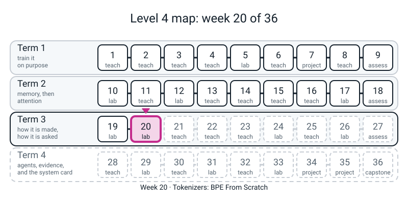
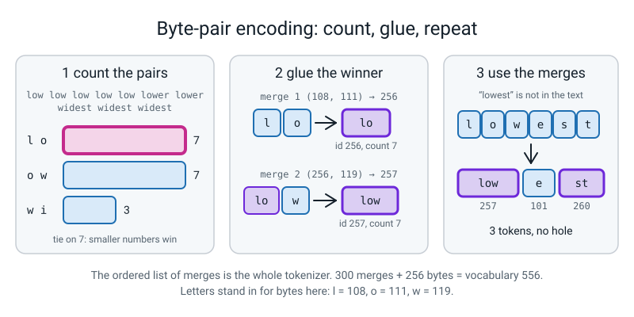
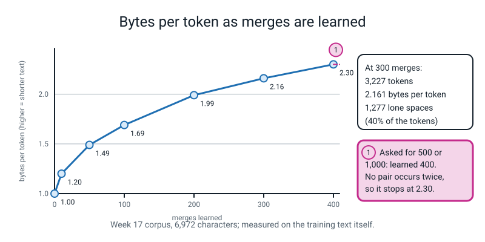

# Week 20 — Tokenizers: BPE From Scratch

[⬅ Week 19](week-19.md) · [Course Home](../README.md) · [Week 21 ➡](week-21.md) · [Student Guide](../student-guide/week-20.md) · [Workbook](../workbook/week-20.md)



*Figure 20.0 — Week 20, Tokenizers, is where the course stops feeding the model letters and starts cutting text into counted pieces.*

---

## 📋 At a Glance

| | |
|---|---|
| **Duration** | 70 minutes in class (nothing runs longer than 15 seconds), then the workbook (~60-75 min) |
| **Type** | 🟩 Lab — the student **writes a tokenizer**: `bpe.py`, about 60 lines of real code (81 with comments). They pass round-trip tests on emoji, Devanagari and the empty string, train it on the Week 17 corpus, diff it against the production BPE trainer in the `tokenizers` library (trained **locally**, on the same local text), and chart how bytes-per-token climbs as the training text grows |
| **Big idea** | A model needs its text cut into pieces. Letters are too few (sequences get long, and every "the" must be re-learned from `t`, `h`, `e`). Words are too many (`practised` was never seen, so it is a hole). **Byte-pair encoding** cuts the difference: start from the 256 byte values, find the most common adjacent pair, glue it into one new piece, repeat. Common things become one piece; rare things are spelled from smaller pieces; **anything** can be written, because everything is bytes. The list of merges, in the order they were learned, *is* the tokenizer. Today's numbers: 6,972 characters become **3,227 tokens** after 300 merges (**2.16 bytes per token**), the merges are English (`the`, `and`, `ing`, `river`, `old`) though nobody told the counter so, a tokenizer trained on English spends **one token per byte** on Devanagari and emoji, and the student's 63 lines of code produce **exactly the same tokens as the library** when both are told to cut the text the same way. |
| **New vocabulary** | token · byte · UTF-8 · merge · vocabulary (256 + merges) · chunk (pre-token) · round trip · bytes per token |
| **New maths** | **None.** Counting and dividing: bytes per token = bytes / tokens; a few products for the size of the embedding table. See the 🔢 box. |
| **New syntax** | **Four**, exactly the ladder row: `collections.Counter` · `str.encode("utf-8")` · `re.compile(...).findall` · `tokenizers` `BpeTrainer`. **Two mirrors ride along and are flagged, not counted:** `bytes.decode("utf-8")` is `encode` run backwards, and `bytes([n])` / `b"".join(...)` are how a list of numbers becomes bytes. See section 4. |
| **Dataset** | **Text already on the computer.** The Week 17 corpus `l4lib.corpus.TEXT` (6,972 characters, as in Weeks 17 and 19) for the first hour; then Python's own standard-library source (13 files, 323,880 characters) as "text that keeps growing", and `argparse.py` (first 30,000 characters) as text the tokenizer has **never seen**. Read with a plain `open(...).read()`. **Nothing downloads. No internet.** |
| **Model** | **There is no neural network this week and nothing is random.** The tokenizer is counting and gluing; the same input always gives the same merges, so there is no seed to set. The TinyGPT of Weeks 17 and 19 is not retrained. **No stand-in of any kind is used.** |
| **Materials** | Laptop with Python 3 and matplotlib · the folder containing `l4lib/` and the given file `samples.py` · one **Merge by Hand** card per student (Activity) · a timer · workbook pages 20.1-20.6 |
| **Prep time** | 25 minutes the night before · 3 minutes on the day |
| **Expected runtime of the code** | `bpe.py` 0.02 s · `trace.py` 0.03 s · `test_bpe.py` 0.1 s · `text_merges.py` 0.5 s · `compare.py` 0.2 s · `cost.py` 0.2 s · teacher-only `key.py` 0.9 s · **`grow.py` about 22-25 s in all** (the last of its seven trainings, 323,880 characters, takes **11-15 s in `bpe.py` and 0.2 s in `tokenizers`**; this is the only thing in the week over 10 s). If anything else takes over 5 s, something is wrong. |

> **⚠️ Watch out:** three things go wrong this week. **First, a round trip proves almost nothing about compression.** Three of the six clinic bugs below keep every round-trip test green (counting each word once, applying merges in the wrong order, splitting the text into one-character chunks); the tokenizer still writes the text back exactly, and is simply worse, or does nothing at all. The round trip tests *correctness*; the token count and the diff against `tokenizers` test *quality*. A student who says "it passes all 13 tests, so it is right" has checked half. **Second, "bytes per token" is a property of a tokenizer and a text together, not of either alone.** 2.16 is for a tokenizer trained on and measured on the same 6,972 characters; the same 300 merges give 1.00 on Devanagari; a tokenizer trained on Python source gives 1.47 on the stories and the one trained on the stories gives 1.27 on Python. **Third, the match with the library is by construction.** `tokenizers` gives identical tokens only after we tell it to cut the text into the same chunks as our regular expression; with its own default cutting it gives 2,111 tokens where ours gives 3,227. Neither is wrong. They are two tokenizers, and only the diff on *equal settings* tells you that your code does what the library does.

---

## 🎯 Lesson Objectives

By the end of the lesson the student can:

1. **Say why neither letters nor words will do**, with a number: the Week 17 corpus has 28 distinct characters and 362 distinct words, of which 189 occur once; a new sentence contains two words the corpus never saw.
2. **Run byte-pair encoding by hand** on a four-word card: count adjacent pairs, pick the commonest, glue it, recount (four merges), and say what a tie is and how the code breaks it.
3. **Write `bpe.py`** (chunks, `merge`, `train`, `encode`, `decode`) and pass the round-trip tests: English, Hindi, emoji, mixed scripts, the empty string, a single space, newlines, 6,972 characters of corpus.
4. **Say what the tests do and do not show**: a round trip proves nothing was lost, not that the tokens are good; the diff against `tokenizers` and the token count test the second thing.
5. **Read a bytes-per-token chart**: it climbs as the training text grows (1.73 to 2.76 on unseen text), it flattens because the vocabulary is limited by the text it came from, and it says nothing about how well a *language model* would do on these tokens.
6. **Say who pays** when a tokenizer meets a script it never saw: 13 characters of Hindi cost 37 tokens, three times the characters, against 0.68 tokens per character for English, and say what was and was not measured.

Observable evidence: `test_bpe.py` printing `13 of 13 round trips passed`; `text_merges.py` printing a merge list made of English pieces; `compare.py` printing `pieces that differ, position by position: 0`; `bytes_per_token.png` saved; the **Merge by Hand** card filled; and the workbook's written answer to *"which tests would you add to catch a tokenizer that round-trips and is still wrong?"*

---

## 🧑‍🏫 What YOU Need to Know First

> **📌 About the code blocks in this guide.** Every block in the **🧰 Prep Checklist** is a *whole file* and every one was run, from one folder next to `l4lib/`, on a CPU, with Python 3.10.10, `tokenizers` 0.21.1 and matplotlib 3.7.1. Blocks in the **🐞 Debugging Clinic** are *deliberate mistakes* and each is marked; their tracebacks and odd numbers are real. **There are no random numbers anywhere this week**, so there is no seed and every number below was identical on a repeat run; **only the `(N s)` timings change.** The ledger (the course author's reference run of Module 4) reproduced the module's printed BPE numbers exactly, but on the module's own 1,117-character corpus, which this week does not use; the ledger is quoted once, in section 7, as a comparison in direction.

### 1. What the student is doing today, in one paragraph

For four weeks the student's model has read **characters**: 28 of them, one number each. Today the characters go away. The student first does byte-pair encoding **on paper**, on a four-word card, until the rule is in their hands: count every neighbouring pair, glue the commonest, count again. Then they turn the rule into code: a regular expression that cuts the text into chunks (so a glued piece never spans a space), a `merge` function (replace every neighbouring pair of numbers with one new number), a `train` function that does the paper exercise 300 times on the Week 17 corpus, and `encode` and `decode` to go from text to numbers and back. The round-trip tests include a pizza emoji and a Devanagari word, which is where the word *byte* earns its keep. Then they compare their tokenizer, token for token, with the production trainer, and chart what happens to bytes-per-token as the text grows. **Nothing is trained in the neural-network sense, nothing is random, and nothing is scripted.** The tokenizer is not part of any model; it is a small program that sits in front of one.

### 2. 🔢 The maths you need — taught to you first

**There is no new mathematical idea this week.** Five pieces of arithmetic; do them before class.

**(a) Bytes per token.** `bytes / tokens`. The corpus is 6,972 characters and, because it is all plain English letters, 6,972 bytes. After 300 merges it is 3,227 tokens: `6,972 / 3,227 =` **2.16**. With no merges each byte is a token: 1.00. Higher means each token carries more text.

**(b) Vocabulary = 256 + merges.** The starting vocabulary is the 256 possible byte values, numbered 0-255; each merge adds one piece with the next free number (256, 257, ...). 300 merges give a vocabulary of **556**. (The 28 characters of the Week 17 model are a vocabulary of 28; this one is twenty times larger.)

**(c) What the vocabulary costs.** The model's embedding table has one row per token, so its size is `vocabulary x width`. With Week 17's width of 128: `556 x 128 =` **71,168** numbers, against `28 x 128 =` **3,584** for characters. A bigger vocabulary buys shorter sequences and costs a bigger table. (Week 16's formula; you will not be asked for it.)

**(d) Shorter sequences.** 64 places of characters cover 64 characters. 64 places of these tokens cover on average `64 x 6,972 / 3,227 =` **138** characters. Attention compares every place with every place (a `T x T` table, Week 14), so the same text as 2.16 times fewer tokens has a table about `2.16^2 =` **4.7** times smaller. **State this as arithmetic about sizes. We did not train a GPT on these tokens, so nothing is claimed about how well it would read.**

**(e) Tokens per character.** The other direction: `tokens / characters`. English through the 300-merge tokenizer: 26 tokens for 38 characters = **0.68**. Hindi: 37 tokens for 13 characters = **2.85**. Divide one by the other if asked "how much more does Hindi cost?": about 4.2 times per character. **That is a property of this tokenizer, trained on 6,972 characters of English; it is not a measurement of any product.**

### 3. 🧭 Real vs stand-in — and what you must NOT claim

| In the lesson | Status |
|---|---|
| `bpe.py`, every merge, every token count, every round trip | **Real**: ordinary Python counting, run on your computer. |
| The `tokenizers` BPE trainer | **Real, run locally.** It is a library already installed; it trains on text you give it and **downloads nothing**. (`tokenizers` is the only library of its kind allowed in Level 4, and only here.) |
| Any scripted stand-in (`FakeClient` or similar) | **None used this week.** |
| The texts | The author's typed Week 17 corpus (6,972 characters) and Python's own source files from the student's computer. |
| "GPT-2 and other production tokenizers get far more bytes per token" | **Quoted, not reproduced.** They are trained on gigabytes; ours on 7 KB to 324 KB. GPT-2's exact figure needs a download and was **not measured**. Say "much higher", never a number. |
| The Hindi and emoji costs | **Measured for one tokenizer trained on English only.** Not a statement about any named product. |
| "BPE finds the morphemes" | **Do not claim it.** The merges are frequent pairs. `er`, `ing`, `ed`, `old` look like English structure because English is made of them; `ro`, `ld`, `ad` are not words or endings. Counting found what was common. |

### 4. The constructs, for somebody who has never seen them

Four are new; two mirrors are flagged. Everything else is old: `while` loops, tuples as dictionary keys, `zip`, `lambda` (Week 4), `dict.get` (Week 17), `float("inf")` (Week 5), `max(..., key=...)`, list comprehensions, f-strings.

- **`Counter`** (`from collections import Counter`): a dictionary that counts. `Counter(["a","b","a"])` is `{"a": 2, "b": 1}`; `counter[key] += 1` works on a key that is not there yet (a plain dict would raise `KeyError`); `.most_common(10)` lists the top ten. Used twice in `bpe.py`: once to count how often each chunk occurs, once to count pairs.
- **`text.encode("utf-8")`**: text to bytes. One letter such as `h` is one number (104); a pizza is four (240, 159, 141, 149); a Devanagari letter is three. **The number of characters and the number of bytes are different things**, and bytes-per-token uses bytes. `list(text.encode("utf-8"))` is a list of integers 0-255.
- **`re.compile(pattern).findall(text)`**: make the pattern once, then list every match. `\s+` is a run of white space (spaces, tabs, newlines); `\S+` is a run of anything else; `\s+|\S+` means "one or the other". The chunks, joined, give back the text exactly. The student met `re.findall` in Level 3 Week 31; `compile` is only "keep the pattern", and `\s`/`\S` are the only pattern pieces that are new to them.
- **`tokenizers` `BpeTrainer`**: given to the student as a function (`make_theirs` in `compare.py`, `their_tokenizer` in `grow.py`). **They read it; they do not type it.** It is a recipe of five configuration lines, and the lesson is in what it returns, not in the recipe. The one line that matters: `Split(Regex(r"\s+|\S+"), behavior="isolated")` is our chunk rule written for the library.
- **Flagged mirror 1 — `bytes.decode("utf-8")`**: `encode` run backwards. Say both in the same breath: "encode goes to bytes, decode comes back." It is what makes the Clinic 4 error possible.
- **Flagged mirror 2 — `bytes([i])` and `b"".join([...])`**: `bytes([104])` is the one-byte string `b'h'`; `b"".join` glues byte strings together. Introduce them as "the way to write a list of numbers as bytes". They appear only in `make_vocab` and `decode`.
- **Teacher-only, flagged:** `import bpe` then `bpe.CHUNK = ...` (replacing a name in another module) in `key.py` and Clinic 3; `os.remove` in `key.py`. Neither is in any student file.

**One idea the student will not have met: a loop that changes the data it loops over.** In `train`, `words` is rebuilt at the end of every round. Draw it as a conveyor: counts come off the belt, the belt is rewritten, the belt comes round again.

### 5. The other code the student types — nothing new, but note these

- **`bpe.py` is functions only, not a class.** The shared kit's `tinytok.py` has the same algorithm as a class (`BPETokenizer`); **classes with `__init__` do not appear until Week 23**, so the student's version passes `merges` around as an ordinary dictionary. `key.py` proves the two are identical: same merges, same ids on the corpus. The student never opens `tinytok.py` this week.
- **The tie-break line is the one that looks odd:** `key=lambda p: (pair_counts[p], -p[0], -p[1])`. It says "largest count; on a tie, the smaller numbers". It exists so that two people (or two computers) get the same tokenizer. Without it, `max` takes whichever tied pair it met first, which depends on the order of the dictionary, which depends on the order the chunks came in.
- **`encode_chunk` picks the *earliest-learned* merge each time, not the most frequent and not the latest.** Clinic 2 shows what happens otherwise.
- **`train` stops early.** `if pair_counts[best] < 2: break` means it will not glue a pair that occurs once. That is why asking for 1,000 merges on 6,972 characters gives 400: there are no more pairs worth gluing. It is also why the chart's small corpora have fewer merges than asked (218 for 2,000 characters).
- **`samples.py` is given**, not typed: it holds Devanagari and emoji, which are awkward on a keyboard.
- **`grow.py` imports thirteen standard-library modules only to find where their source lives** (`module.__file__`). It is a trick of convenience; say "this is just a way to find Python's own text files".

### 6. What the numbers will say

**The hook numbers** (`text_merges.py`): the Week 17 corpus has 6,972 characters and 28 distinct ones; 1,389 words, 362 distinct, **189 of which occur once**; `the` alone is 234 of the 1,389. A new sentence, `the baker practised the cricket`, has two words (`practised`, `cricket`) the corpus never contains. A word-level model would need a hole for them.

**The merges** (300 merges, `text_merges.py`):

| Merge | Pieces learned |
|---|---|
| first 30 | `he` `the` `an` `er` `and` `in` `ed` `ro` `is` `or` `th` `at` `ld` `on` `ver` `en` `ri` `her` `to` `ad` `ar` `ing` `as` `man` `bo` `no` `it` `un` `old` `id` |
| 271 to 300 | `ber` `but` `cro` `cold` `card` `ched` `came` `day` `e.` `el` `flo` `g.` `gu` `gan` `grew` `ghed` `has` `ice` `ken` `lau` `lain` `m.` `mo` `mak` `mac` `mber` `ng.` `ol` `oar` `ool` |

Say: *the early merges are the common English pairs; the late merges are the corpus (`flo`, `grew`, `cold`, `e.`). Fragments like `ro`, `ld`, `ghed` are not morphemes.* The new sentence comes out as `the`, ` `, `baker`, ` `, `p`, `r`, `ac`, `t`, `is`, `ed`, ` `, `the`, ` `, `c`, `ri`, `c`, `ket`: `practised` is spelled from six pieces, and `cricket` from four. **Of the 3,227 tokens, 1,277 are lone spaces** (40%); the chunk rule gives every space its own chunk and nothing ever glues to it. The student will spot it; it is a real weakness (section 7) and the next bullet.

**Size against merges** (`text_merges.py`): merges asked for, learned, bytes per token: 0, 0, 1.00 · 10, 10, 1.20 · 50, 50, 1.49 · 100, 100, 1.69 · 200, 200, 1.99 · 300, 300, 2.16 · 500, **400**, 2.30 · 1000, **400**, 2.30. **At 400 merges training stops on its own**; the corpus has no pair left that occurs twice. The vocabulary is limited by the text, not by what you request.

**Round trips** (`test_bpe.py`): 13 of 13 pass, including the empty string (zero tokens), one space (one token), the pizza emoji three times over (12 tokens for 3 characters: four bytes each), the Devanagari greeting (13 characters, 37 bytes, 37 tokens) and the whole 6,972-character corpus (3,227 tokens).

**Against `tokenizers`** (`compare.py`, 300 merges, same corpus): ours 3,227 tokens; the library told to cut like us, **3,227 tokens and 0 differing pieces** position by position; the library with its default byte-level cutting, **2,111 tokens**, where a space sticks to the word after it (`the baker` becomes `the`, `Ġbaker`; the `Ġ` is how the library writes a leading space). The "space sticks to the word" rule needs about a third fewer tokens: with the same 300 merges, `key.py` measures **2,103 tokens, 3.32 bytes per token** when our regular expression is changed to ` ?\S+|\s+`, and it still round-trips. Also: the library round-trips the Hindi greeting and the emoji sentence, because its base alphabet is the 256 bytes.

**The chart** (`grow.py`): bytes per token on 30,000 characters of `argparse.py`, which no tokenizer trained on, as the training text grows, 1,000 merges asked for:

| Trained on (characters) | Merges actually learned | Mine | `tokenizers` | Seconds, mine / `tokenizers` |
|--:|--:|:--:|:--:|:--:|
| 2,000 | 218 | 1.728 | 1.728 | 0.0 / 0.0 |
| 5,000 | 458 | 1.927 | 1.927 | 0.1 / 0.0 |
| 10,000 | 665 | 2.131 | 2.131 | 0.3 / 0.1 |
| 20,000 | 1,000 | 2.441 | 2.441 | 0.8 / 0.1 |
| 50,000 | 1,000 | 2.628 | 2.628 | 2.3 / 0.1 |
| 100,000 | 1,000 | 2.708 | 2.708 | 4.4 / 0.1 |
| 323,880 | 1,000 | 2.761 | 2.761 | 11-15 / 0.2 |

The two lines are **identical at every point** (so the chart shows one line under another: tell the student to plot them differently, `"o-"` and `"x--"`, and to say why they cannot see the first). The curve climbs quickly and then flattens (2.628 to 2.761 for a six-fold increase of text). The timings are the only things that vary from machine to machine, and the ratio: **the library is 50-60 times faster at the largest size.**

**Who pays** (`cost.py`, tokenizer trained on the Week 17 corpus, 300 merges): English sentence 38 characters, 26 tokens (1.46 bytes per token, 0.68 tokens per character); Hindi greeting 13 characters, 37 bytes, **37 tokens** (1.00, **2.85**); three emoji 12 tokens (**4.00** per character); the mixed sentence 18 tokens for 15 characters. A tokenizer that *was* shown the Hindi phrase (the same 13 characters repeated 60 times, added to the corpus: **a contrived case**) writes it in 3 tokens; what that number says is that the vocabulary is whatever it was trained on, not that Hindi is "cheap" to fix.

**Domain** (`key.py`): a tokenizer trained on the stories gets 2.16 bytes per token on the stories and 1.27 on 10,000 characters of `textwrap.py`; one trained on `heapq.py` gets 1.77 on `textwrap.py` and 1.47 on the stories.

**Against the ledger (direction only).** The reference run of Module 4 used a different, 1,117-character corpus and printed: 0 merges 1.00, 50 merges 1.55, 100 merges 1.93, 138 merges **and no more** 2.22. Today's corpus is six times larger and the curve has the same three features: it starts at 1.00, climbs about linearly in merges at first, and **stops by itself** (at 400 merges rather than 138). The sizes are different because the text is different; nothing in the ledger was re-run today.



*Figure 20.1 — Byte-pair encoding is count, glue, repeat; the ordered list of merges is the whole tokenizer, and it can write words it never saw.*



*Figure 20.2 — More merges shorten the text until no pair occurs twice; asking for 500 or 1,000 merges still learns only 400.*

### 7. The honest limits of today

1. **One training corpus for the hour and one held-out file for the chart.** The curve is one curve. We did not repeat it with a different held-out file, a different pool, or a different vocabulary size, and we do not know its spread.
2. **The match with `tokenizers` is under settings we chose to make it match.** Two tokenizers with different chunk rules are two tokenizers. The zero-difference result shows our code implements the same algorithm *at these settings on this text*; it does not show that ties are always broken the same way (it held on the eight texts and vocabularies we ran: 300 merges on the corpus; 1,000 merges on seven sizes of source text).
3. **Bytes per token is not quality.** We never trained a GPT on these tokens, and we did not compare a character-level and a BPE-level model. Nothing today says BPE makes a model better; it says BPE makes the sequence shorter.
4. **The Hindi cost is for one small English-only tokenizer.** We did not measure any production tokenizer, and the course has none to measure. The "3 tokens after training on Hindi" number is a repeated phrase and shows the mechanism only.
5. **Our chunk rule is not the best one.** 40% of the corpus's tokens are lone spaces. The space-sticks-to-the-word rule gives 2,103 tokens instead of 3,227. Section 6 measured that one alternative; we tried no other rule (digits, punctuation, case).
6. **The vocabulary size was never tuned.** 300 and 1,000 merges are round numbers. We did not look for the best one, and the embedding-table cost (section 2c) was computed but no model was built with it.
7. **Pure Python is slow and `tokenizers` is fast.** 11-15 s against 0.2 s at 324,000 characters. Our trainer recounts every pair every round; the library does not. That is an engineering gap and not something we tested further.
8. **Speed on another machine will differ**, and the Python stdlib on a different version holds different text: the pool is 323,880 characters here (Python 3.10.10). On another version the chart's numbers move; the shape should not.
9. **"Derived from English" means from this English.** The corpus is the author's typed stories about bakers and rivers; the merges are its vocabulary, not English's.

### 8. The misconceptions you will actually meet

- **"It passes all the tests, so it is right."** The round trip tests one property. Clinic 1-3 pass all of them. *"Which test would have caught it?"* (A token count against a known good one.)
- **"More merges is always better."** Compression saturates (400), and the table grows (section 2c). *"What stopped it?"*
- **"BPE learned English spelling."** It counted pairs. *"Is `ro` a word? Is `ld`?"*
- **"vocab_size and merges are the same number."** `vocab = 256 + merges`; `train(TEXT, 300)` asks for 300 merges, a vocabulary of 556.
- **"A character is a byte."** For `h`, yes. For a pizza, four bytes; for a Devanagari letter, three. *"How many tokens for the pizza, before any merge?"*
- **"The tokenizer is part of the model."** It is a program in front of the model, trained separately, then frozen. The model sees only numbers.
- **"Hindi is just harder."** Not from this measurement: a tokenizer trained on English has no Hindi pieces. The cost follows from what the tokenizer was shown.
- **"The two curves must be the same because I plotted them wrong."** They are the same; that is the result.

### 9. How deep to go, and where to stop

Stop at: *"start from bytes; glue the commonest pair; repeat; the list of merges is the tokenizer; a round trip tests correctness and a token count tests quality; the vocabulary is the text's."* Do **not** go into: how GPT-2 or any named model's vocabulary is built (not measured here); unigram or WordPiece tokenizers; special tokens; the regular expression GPT-2 uses (the library's default cut is shown as a difference, not explained); byte-fallback; or why the embedding table matters to perplexity.

### 10. 🧭 Where Week 20 sits

| Week | What it gave | Used today |
|---|---|---|
| 1 | `def run(*, ...)`, printing like an engineer | Function habits |
| 4 | `lambda` | The tie-break key |
| 5 | `float("inf")` | "Not a merge" in `encode_chunk` |
| 16 | The embedding table and the knob formula | 556 x 128 against 28 x 128 |
| 17 | The TinyGPT, the 6,972-character corpus | The text; the "characters" baseline |
| 19 | A claim needs a test that could prove it wrong | "Round trip passes" is a test of one claim only |
| **20** | **BPE from scratch; tokens; the library diff** | |
| 21 | Pretraining and scaling: `tokens` in `C = 6ND` | What a token is |
| 23-36 | `tinytok.count_tokens` for cost, context and truncation | The shared kit's class is this week's algorithm, packaged |

---

## 🧰 Prep Checklist

### 25 minutes the night before

- [ ] **Confirm the stack.** Run from the folder that contains `l4lib/`:

```bash
python3 -c "import tokenizers, matplotlib; print(tokenizers.__version__, matplotlib.__version__)"
python3 -c "from l4lib.corpus import TEXT; print(len(TEXT), len(set(TEXT)))"
```

You should see (the digits may differ on another machine):

```text
0.21.1 3.7.1
6972 28
```

`pip` returning 403 is expected; **nothing this week installs anything.** If `import tokenizers` fails, the week still works without it: skip `compare.py` and `grow.py`'s `tokenizers` column, and use the diff against `l4lib/tinytok.py` in `key.py` as the check instead.

- [ ] **Type the files below into one working folder** (next to `l4lib/`). Each begins with a `#` comment naming it. Run each in order and compare with the output printed here.

**File 1 — `bpe.py`** (the student's deliverable; 81 lines, 63 of them code). Prints nothing. The student types it in five pieces (see Live-Code).

```python
# bpe.py - Week 20: a byte-level BPE tokenizer, in functions. Nothing here needs a network.
import re
from collections import Counter

# A chunk is a run of spaces/newlines OR a run of anything else. Merges never cross a chunk edge.
CHUNK = re.compile(r"\s+|\S+")


def chunks(text):
    return CHUNK.findall(text)


def merge(ids, pair, new_id):
    """Replace every adjacent `pair` in the list `ids` by the single number `new_id`."""
    out = []
    i = 0
    while i < len(ids):
        if i < len(ids) - 1 and ids[i] == pair[0] and ids[i + 1] == pair[1]:
            out.append(new_id)
            i += 2
        else:
            out.append(ids[i])
            i += 1
    return out


def train(text, n_merges, verbose=False):
    """Learn up to n_merges merges. Returns a dict {(a, b): new_id}, in the order learned."""
    counts = Counter(chunks(text))                       # chunk -> how many times it occurs
    words = [list(c.encode("utf-8")) for c in counts]    # each distinct chunk, as byte numbers
    freqs = list(counts.values())
    merges = {}
    for m in range(n_merges):
        pair_counts = Counter()
        for word, f in zip(words, freqs):
            for pair in zip(word, word[1:]):
                pair_counts[pair] += f
        if len(pair_counts) == 0:
            break
        # most frequent pair; on a tie, the pair with the smaller numbers
        best = max(pair_counts, key=lambda p: (pair_counts[p], -p[0], -p[1]))
        if pair_counts[best] < 2:
            break                                        # nothing left that happens twice
        new_id = 256 + m
        merges[best] = new_id
        words = [merge(w, best, new_id) for w in words]
        if verbose:
            print("merge", m + 1, best, "->", new_id, "count", pair_counts[best])
    return merges


def make_vocab(merges):
    """id -> the bytes that id stands for."""
    vocab = {i: bytes([i]) for i in range(256)}
    for (a, b), new_id in merges.items():
        vocab[new_id] = vocab[a] + vocab[b]
    return vocab


def encode_chunk(chunk, merges):
    ids = list(chunk.encode("utf-8"))
    while len(ids) >= 2:
        pairs = list(zip(ids, ids[1:]))
        best = min(pairs, key=lambda p: merges.get(p, float("inf")))   # earliest-learned first
        if best not in merges:
            break
        ids = merge(ids, best, merges[best])
    return ids


def encode(text, merges):
    ids = []
    for c in chunks(text):
        ids = ids + encode_chunk(c, merges)
    return ids


def decode(ids, merges):
    vocab = make_vocab(merges)
    raw = b"".join([vocab[i] for i in ids])
    return raw.decode("utf-8")
```

**File 2 — `trace.py`.** The whole algorithm on a text small enough to do by hand, and what a byte is.

```python
# trace.py - Week 20: the whole algorithm on a text small enough to do by hand. Then: what is a byte?
from bpe import train, encode, decode, make_vocab

tiny = "low low low low low lower lower widest widest widest"
merges = train(tiny, 8, verbose=True)
vocab = make_vocab(merges)
ids = encode("lowest", merges)
print(ids, [vocab[i] for i in ids])
print(decode(ids, merges))

print("the letter h is the number", list("h".encode("utf-8")))
print("a pizza is", len("🍕"), "character and", list("🍕".encode("utf-8")))
print("a Devanagari word is", len("चाय"), "characters and", len("चाय".encode("utf-8")), "bytes:", list("चाय".encode("utf-8")))
```

```text
merge 1 (108, 111) -> 256 count 7
merge 2 (256, 119) -> 257 count 7
merge 3 (100, 101) -> 258 count 3
merge 4 (105, 258) -> 259 count 3
merge 5 (115, 116) -> 260 count 3
merge 6 (119, 259) -> 261 count 3
merge 7 (261, 260) -> 262 count 3
merge 8 (101, 114) -> 263 count 2
[257, 101, 260] [b'low', b'e', b'st']
lowest
the letter h is the number [104]
a pizza is 1 character and [240, 159, 141, 149]
a Devanagari word is 3 characters and 9 bytes: [224, 164, 154, 224, 164, 190, 224, 164, 175]
```

**File 3 — `samples.py`** (GIVEN; the student does not type it).

```python
# samples.py - Week 20 (GIVEN to the student, not typed): strings from three scripts, and some tricky ones.
ENGLISH = "The cricket team practised on Tuesday."
HINDI = "नमस्ते दुनिया"            # "hello, world" in Devanagari
EMOJI = "I love 🍕 and 🙂!"
MIXED = "chai चाय 🍵 tea"
EDGE = ["", " ", "\n\n", "a", "   leading and trailing   ", "tabs\tand\nnewlines", "é ñ ü", "😀😀😀"]
```

**File 4 — `test_bpe.py`.** The round-trip tests.

```python
# test_bpe.py - Week 20: the round-trip tests. decode(encode(s)) must give back s, for ANY s.
from bpe import train, encode, decode
from samples import ENGLISH, HINDI, EMOJI, MIXED, EDGE
from l4lib.corpus import TEXT

merges = train(TEXT, 300)
cases = [ENGLISH, HINDI, EMOJI, MIXED] + EDGE + [TEXT]
passed = 0
for s in cases:
    ids = encode(s, merges)
    back = decode(ids, merges)
    ok = back == s
    passed = passed + ok
    print("ok  " if ok else "FAIL", repr(s[:28]).ljust(32), len(s), "chars", len(s.encode("utf-8")), "bytes", len(ids), "tokens")
print(passed, "of", len(cases), "round trips passed")
print("empty string gives", encode("", merges))
```

```text
ok   'The cricket team practised o'   38 chars 38 bytes 26 tokens
ok   'नमस्ते दुनिया'                  13 chars 37 bytes 37 tokens
ok   'I love 🍕 and 🙂!'                15 chars 21 bytes 18 tokens
ok   'chai चाय 🍵 tea'                 14 chars 23 bytes 21 tokens
ok   ''                               0 chars 0 bytes 0 tokens
ok   ' '                              1 chars 1 bytes 1 tokens
ok   '\n\n'                           2 chars 2 bytes 2 tokens
ok   'a'                              1 chars 1 bytes 1 tokens
ok   '   leading and trailing   '     26 chars 26 bytes 17 tokens
ok   'tabs\tand\nnewlines'            17 chars 17 bytes 12 tokens
ok   'é ñ ü'                          5 chars 8 bytes 8 tokens
ok   '😀😀😀'                            3 chars 12 bytes 12 tokens
ok   'the sun rose over the quiet '   6972 chars 6972 bytes 3227 tokens
13 of 13 round trips passed
empty string gives []
```

**File 5 — `text_merges.py`.** Words against letters against pieces, and what the merges look like.

```python
# text_merges.py - Week 20: what three kinds of "token" do to the Week 17 corpus, then what BPE learns from it.
from collections import Counter
from bpe import train, encode, decode, make_vocab
from l4lib.corpus import TEXT

words = TEXT.split()
seen = Counter(words)
print("characters:", len(TEXT), " distinct characters:", len(set(TEXT)))
print("words:", len(words), " distinct words:", len(seen), " words that occur once:", sum([1 for w in seen if seen[w] == 1]))
print("ten commonest words:", seen.most_common(10))

merges = train(TEXT, 300)
vocab = make_vocab(merges)
print("merges learned:", len(merges), " vocabulary:", 256 + len(merges))
pieces = [vocab[new_id].decode("utf-8") for new_id in merges.values()]
print("first 30 merges: ", pieces[:30])
print("merges 271-300:  ", pieces[270:300])

ids = encode(TEXT, merges)
print("tokens:", len(ids), " bytes per token:", round(len(TEXT.encode("utf-8")) / len(ids), 3))

sentence = "the baker practised the cricket"
print("words of the new sentence the corpus never saw:", [w for w in sentence.split() if w not in seen])
print("new sentence, pieces:", [vocab[i].decode("utf-8") for i in encode(sentence, merges)])

print("merges asked for -> merges learned -> bytes per token")
for n in [0, 10, 50, 100, 200, 300, 500, 1000]:
    m = train(TEXT, n)
    k = len(encode(TEXT, m))
    print(f"{n:6d} {len(m):6d} {len(TEXT.encode('utf-8')) / k:8.2f}")
```

```text
characters: 6972  distinct characters: 28
words: 1389  distinct words: 362  words that occur once: 189
ten commonest words: [('the', 234), ('and', 84), ('a', 49), ('old', 21), ('man', 21), ('is', 19), ('it', 18), ('not', 18), ('river', 17), ('in', 17)]
merges learned: 300  vocabulary: 556
first 30 merges:  ['he', 'the', 'an', 'er', 'and', 'in', 'ed', 'ro', 'is', 'or', 'th', 'at', 'ld', 'on', 'ver', 'en', 'ri', 'her', 'to', 'ad', 'ar', 'ing', 'as', 'man', 'bo', 'no', 'it', 'un', 'old', 'id']
merges 271-300:   ['ber', 'but', 'cro', 'cold', 'card', 'ched', 'came', 'day', 'e.', 'el', 'flo', 'g.', 'gu', 'gan', 'grew', 'ghed', 'has', 'ice', 'ken', 'lau', 'lain', 'm.', 'mo', 'mak', 'mac', 'mber', 'ng.', 'ol', 'oar', 'ool']
tokens: 3227  bytes per token: 2.161
words of the new sentence the corpus never saw: ['practised', 'cricket']
new sentence, pieces: ['the', ' ', 'baker', ' ', 'p', 'r', 'ac', 't', 'is', 'ed', ' ', 'the', ' ', 'c', 'ri', 'c', 'ket']
merges asked for -> merges learned -> bytes per token
     0      0     1.00
    10     10     1.20
    50     50     1.49
   100    100     1.69
   200    200     1.99
   300    300     2.16
   500    400     2.30
  1000    400     2.30
```

**File 6 — `compare.py`.** My tokenizer against the production trainer, trained locally. `make_theirs` is GIVEN (read it, do not type it).

```python
# compare.py - Week 20: my BPE against the production trainer in the `tokenizers` library, trained HERE on the same local text.
from bpe import train, encode, decode, make_vocab
from l4lib.corpus import TEXT
from samples import HINDI, EMOJI
from tokenizers import Tokenizer, models, trainers, pre_tokenizers, decoders, Regex

N = 300

def make_theirs(text, split_like_mine):
    tk = Tokenizer(models.BPE())
    if split_like_mine:
        # cut the text into the same chunks mine uses, then turn each chunk into bytes
        tk.pre_tokenizer = pre_tokenizers.Sequence([
            pre_tokenizers.Split(Regex(r"\s+|\S+"), behavior="isolated"),
            pre_tokenizers.ByteLevel(add_prefix_space=False, use_regex=False)])
    else:
        # the library's default byte-level cutting (the GPT-2 style: a space sticks to the word after it)
        tk.pre_tokenizer = pre_tokenizers.ByteLevel(add_prefix_space=False)
    tk.decoder = decoders.ByteLevel()
    trainer = trainers.BpeTrainer(vocab_size=256 + N, min_frequency=2, show_progress=False,
                                  initial_alphabet=pre_tokenizers.ByteLevel.alphabet())
    tk.train_from_iterator([text], trainer)
    return tk

merges = train(TEXT, N)
mine = encode(TEXT, merges)
print("mine:                         ", len(mine), "tokens")

same_cut = make_theirs(TEXT, True)
print("tokenizers, same chunk rule:  ", len(same_cut.encode(TEXT).ids), "tokens")

vocab = make_vocab(merges)
mine_pieces = [vocab[i] for i in mine]
their_pieces = [same_cut.decoder.decode([t]).encode("utf-8") for t in same_cut.encode(TEXT).tokens]
print("pieces that differ, position by position:", sum([1 for a, b in zip(mine_pieces, their_pieces) if a != b]))

default_cut = make_theirs(TEXT, False)
print("tokenizers, its default cut:  ", len(default_cut.encode(TEXT).ids), "tokens")
print("  'the baker' with mine:          ", [vocab[i] for i in encode("the baker", merges)])
print("  'the baker' with their default: ", default_cut.encode("the baker").tokens)

for s in [HINDI, EMOJI]:
    back = same_cut.decode(same_cut.encode(s).ids)
    print("round trip through tokenizers:", back == s, repr(back))
```

```text
mine:                          3227 tokens
tokenizers, same chunk rule:   3227 tokens
pieces that differ, position by position: 0
tokenizers, its default cut:   2111 tokens
  'the baker' with mine:           [b'the', b' ', b'baker']
  'the baker' with their default:  ['the', 'Ġbaker']
round trip through tokenizers: True 'नमस्ते दुनिया'
round trip through tokenizers: True 'I love 🍕 and 🙂!'
```

**File 7 — `cost.py`.** A tokenizer trained on English meets Hindi and emoji.

```python
# cost.py - Week 20: a tokenizer trained on English, asked to read other scripts. Tokens per character.
from bpe import train, encode
from l4lib.corpus import TEXT
from samples import ENGLISH, HINDI, EMOJI

merges = train(TEXT, 300)
print("script      characters  bytes  tokens  bytes/token  tokens per character")
for name, s in [("English", ENGLISH), ("Hindi", HINDI), ("emoji", "🍕🙂🍵"), ("mixed", EMOJI)]:
    k = len(encode(s, merges))
    print(f"{name:10s} {len(s):8d} {len(s.encode('utf-8')):7d} {k:7d} {len(s.encode('utf-8')) / k:11.2f} {k / len(s):14.2f}")

# the same question for a tokenizer that HAS seen Hindi: train on English plus a Hindi passage
hindi_text = (HINDI + " ") * 60
both = train(TEXT + hindi_text, 300)
k_before = len(encode(HINDI, merges))
k_after = len(encode(HINDI, both))
print("Hindi greeting: tokens before", k_before, " after training on Hindi too", k_after)
```

```text
script      characters  bytes  tokens  bytes/token  tokens per character
English          38      38      26        1.46           0.68
Hindi            13      37      37        1.00           2.85
emoji             3      12      12        1.00           4.00
mixed            15      21      18        1.17           1.20
Hindi greeting: tokens before 37  after training on Hindi too 3
```

**File 8 — `grow.py`.** Bytes per token on unseen text as the training text grows. `their_tokenizer` is GIVEN. **The last of the seven trainings takes 11-15 s in `bpe.py`; the whole file takes 22-25 s.** It saves `bytes_per_token.png`.

```python
# grow.py - Week 20: bytes per token on text the tokenizer has NEVER seen, as the training text grows.
import time
import textwrap, string, random, calendar, heapq, queue, csv, glob, pprint, gettext, fractions, statistics, shutil, argparse
import matplotlib
matplotlib.use("Agg")
import matplotlib.pyplot as plt
from bpe import train, encode
from tokenizers import Tokenizer, models, trainers, pre_tokenizers, decoders, Regex

# Python's own source files are already on this computer. A module's __file__ says where its source lives.
training_modules = [textwrap, string, random, calendar, heapq, queue, csv, glob, pprint, gettext, fractions, statistics, shutil]
pool = ""
for module in training_modules:
    pool = pool + open(module.__file__, encoding="utf-8").read()
test = open(argparse.__file__, encoding="utf-8").read()[:30000]
print("pool:", len(pool), "characters   test:", len(test), "characters")

def their_tokenizer(text, n_merges):
    tk = Tokenizer(models.BPE())
    tk.pre_tokenizer = pre_tokenizers.Sequence([
        pre_tokenizers.Split(Regex(r"\s+|\S+"), behavior="isolated"),
        pre_tokenizers.ByteLevel(add_prefix_space=False, use_regex=False)])
    tk.decoder = decoders.ByteLevel()
    trainer = trainers.BpeTrainer(vocab_size=256 + n_merges, min_frequency=2, show_progress=False,
                                  initial_alphabet=pre_tokenizers.ByteLevel.alphabet())
    tk.train_from_iterator([text], trainer)
    return tk

test_bytes = len(test.encode("utf-8"))
sizes = [2000, 5000, 10000, 20000, 50000, 100000, len(pool)]
mine_bpt, their_bpt = [], []
for n in sizes:
    piece = pool[:n]
    t0 = time.perf_counter(); merges = train(piece, 1000); t_mine = time.perf_counter() - t0
    t0 = time.perf_counter(); tk = their_tokenizer(piece, 1000); t_their = time.perf_counter() - t0
    a = test_bytes / len(encode(test, merges))
    b = test_bytes / len(tk.encode(test).ids)
    mine_bpt.append(a); their_bpt.append(b)
    print(f"train on {n:7d}: merges {len(merges):3d}  mine {a:.3f}  tokenizers {b:.3f}   ({t_mine:.1f} s, {t_their:.2f} s)")

fig, ax = plt.subplots()
ax.plot(sizes, mine_bpt, "o-", label="mine")
ax.plot(sizes, their_bpt, "x--", label="tokenizers")
ax.set_xscale("log")
ax.set_xlabel("characters of training text (log scale)")
ax.set_ylabel("bytes per token on unseen text")
ax.legend()
fig.savefig("bytes_per_token.png")
print("saved bytes_per_token.png")
```

```text
pool: 323880 characters   test: 30000 characters
train on    2000: merges 218  mine 1.728  tokenizers 1.728   (0.0 s, 0.06 s)
train on    5000: merges 458  mine 1.927  tokenizers 1.927   (0.1 s, 0.03 s)
train on   10000: merges 665  mine 2.131  tokenizers 2.131   (0.3 s, 0.04 s)
train on   20000: merges 1000  mine 2.441  tokenizers 2.441   (0.7 s, 0.07 s)
train on   50000: merges 1000  mine 2.628  tokenizers 2.628   (2.0 s, 0.09 s)
train on  100000: merges 1000  mine 2.708  tokenizers 2.708   (4.0 s, 0.12 s)
train on  323880: merges 1000  mine 2.761  tokenizers 2.761   (11.5 s, 0.18 s)
saved bytes_per_token.png
```

**File 9 — `key.py` (TEACHER ONLY).** Equivalence with the shared kit's `tinytok`, the by-hand card, domain mismatch, a different chunk rule, save and load. Never give it to the student.

```python
# key.py - Week 20 (TEACHER ONLY): equivalence with the shared kit, the by-hand card, domain mismatch, a different chunk rule.
import os, re
import textwrap, heapq
import bpe
from bpe import train, encode, decode, make_vocab
from l4lib.corpus import TEXT
from l4lib import tinytok

# ---- 1. The student's bpe.py against the shared kit's tinytok.BPETokenizer (later weeks use tinytok)
mine = train(TEXT, 300)
kit = tinytok.BPETokenizer().train(TEXT, 256 + 300)
print("same merges as tinytok:", kit.merges == mine, " same ids on TEXT:", kit.encode(TEXT) == encode(TEXT, mine))
tinytok.set_tokenizer(kit)
print("count_tokens with the tokenizer installed:", tinytok.count_tokens("the baker practised the cricket"))
tinytok.set_tokenizer(None)
print("count_tokens without (words x 1.3, rounded up):", tinytok.count_tokens("the baker practised the cricket"))

# ---- 2. The by-hand card
card = "the the the the the then then than than hat hat hat"
print("card merges:")
m = train(card, 7, verbose=True)
v = make_vocab(m)
print("pieces:", [v[i].decode() for i in m.values()])
print("'thathen' ->", [v[i].decode() for i in encode("thathen", m)])

# ---- 3. Domain mismatch: a tokenizer trained on the story text, used on Python source; and the reverse
code = open(textwrap.__file__, encoding="utf-8").read()[:10000]
code_merges = train(open(heapq.__file__, encoding="utf-8").read(), 300)
story_merges = train(TEXT, 300)
def bpt(s, mm):
    return round(len(s.encode("utf-8")) / len(encode(s, mm)), 3)
print("bytes/token on textwrap.py (10,000 chars): trained on stories", bpt(code, story_merges), " trained on heapq.py", bpt(code, code_merges))
print("bytes/token on the stories: trained on stories", bpt(TEXT, story_merges), " trained on heapq.py", bpt(TEXT, code_merges))

# ---- 4. A different chunk rule: a space sticks to the word after it (the GPT-2 habit)
mine_chunks = bpe.CHUNK
bpe.CHUNK = re.compile(r" ?\S+|\s+")
sticky = train(TEXT, 300)
k = len(encode(TEXT, sticky))
print("space-sticks-to-word rule: tokens", k, " bytes/token", round(len(TEXT.encode("utf-8")) / k, 3), " round trip:", decode(encode(TEXT, sticky), sticky) == TEXT)
print("  'the baker' ->", [make_vocab(sticky)[i] for i in encode("the baker", sticky)])
bpe.CHUNK = mine_chunks
print("back to the original rule:", len(encode(TEXT, train(TEXT, 300))))

# ---- 5. Save / load with the kit's format
kit.save("/tmp/w20_merges.json")
back = tinytok.BPETokenizer.load("/tmp/w20_merges.json")
print("save/load round trip:", back.encode(TEXT) == kit.encode(TEXT))
os.remove("/tmp/w20_merges.json")

# ---- 6. Hand numbers
print("vocab 556 x width 128 =", 556 * 128, " against 28 x 128 =", 28 * 128)
print("64 tokens cover on average", round(64 * len(TEXT) / len(encode(TEXT, mine)), 1), "characters (64 if characters)")
```

```text
same merges as tinytok: True  same ids on TEXT: True
count_tokens with the tokenizer installed: 17
count_tokens without (words x 1.3, rounded up): 7
card merges:
merge 1 (116, 104) -> 256 count 9
merge 2 (256, 101) -> 257 count 7
merge 3 (97, 116) -> 258 count 3
merge 4 (104, 258) -> 259 count 3
merge 5 (97, 110) -> 260 count 2
merge 6 (256, 260) -> 261 count 2
merge 7 (257, 110) -> 262 count 2
pieces: ['th', 'the', 'at', 'hat', 'an', 'than', 'then']
'thathen' -> ['th', 'a', 'then']
bytes/token on textwrap.py (10,000 chars): trained on stories 1.265  trained on heapq.py 1.768
bytes/token on the stories: trained on stories 2.161  trained on heapq.py 1.471
space-sticks-to-word rule: tokens 2103  bytes/token 3.315  round trip: True
  'the baker' -> [b'the', b' baker']
back to the original rule: 3227
save/load round trip: True
vocab 556 x width 128 = 71168  against 28 x 128 = 3584
64 tokens cover on average 138.3 characters (64 if characters)
```

- [ ] **Open `bytes_per_token.png`** after `grow.py`, once, and check that it has one visible line (the dashed line sits on top of the solid one). We opened the PNG once: the two markers coincide at every point, with the axis running from 1.73 to 2.76.
- [ ] **Print the Merge by Hand card** (Activity) and work it yourself; the answers are in the Answer Key.
- [ ] **Copy the six `bad*.py` files to a scratch folder** so they are ready to plant. Each runs in under a second.
- [ ] **Decide where the student types.** Plan: `bpe.py` in five pieces during Live-Code, testing after each piece with a one-line `print`.

### 3 minutes on the day

- [ ] Open `bpe.py` **empty** and `samples.py` **ready**. Laptop **plugged in**. Put the Merge by Hand card and the timer on the desk.

### Fallback if the laptops fail

| Problem | What to do |
|---|---|
| `ModuleNotFoundError: l4lib` | You are in the wrong folder. `test_bpe.py`, `text_merges.py`, `cost.py` and `compare.py` need it for `l4lib.corpus`. |
| `ModuleNotFoundError: tokenizers` | `pip` is blocked. Drop `compare.py` and the `tokenizers` column of `grow.py`; run `key.py`'s first block instead (same merges as `tinytok`). The student's own BPE is the deliverable. |
| `ModuleNotFoundError: bpe` | The file is not in the folder you are running from, or is misspelt `Bpe.py`. |
| `grow.py` takes over a minute | A busy laptop. Delete `323880` from the `sizes` list by writing `sizes = [2000, 5000, 10000, 20000, 50000, 100000]` (about 8 s in all). |
| Different Python version | The pool text differs, so the chart's numbers differ (it is Python's own source). The shape and the "two lines coincide" result should hold. `text_merges.py`, `test_bpe.py`, `cost.py`, `compare.py` use only the typed corpus and do not change. |
| A Devanagari or emoji string shows as boxes in the terminal | The terminal font. Counting still works; `repr(...)` will show the escape. |
| No laptop | Do the Merge by Hand card on paper and read the printed outputs in this guide. |

---

## ⏱️ The Lesson, Minute by Minute

| Segment | Minutes | What happens |
|---|:--:|---|
| 🪝 Hook | 8 | Three ways to cut one sentence; why each fails; the word *byte* |
| 🧠 Concept | 10 | The rule on a tiny text at the board; chunks; bytes; "the list of merges is the tokenizer" |
| 💻 Live-code | 27 | Type `bpe.py` in five pieces; `test_bpe.py`; `text_merges.py` |
| 🎲 Their turn | 20 | Merge by Hand; `compare.py`; `grow.py` and read the chart; `cost.py` |
| 🔑 Wrap & assign | 5 | What was shown, what was not; the tests that do not catch everything |

### 🪝 Hook — Three Ways to Cut a Sentence (8 minutes)

**Do not open the laptop yet.**

1. **(3 min) The frame.** Write on the board: `the baker practised the cricket`. *"Our TinyGPT reads this one character at a time: 31 numbers, from a list of 28. Here are two other ways to cut it. Words: 5 numbers, from a list of ... how many words would we need?"* Give them the number without the laptop: *"The corpus has 362 different words, 189 of them appear only once. And this sentence has two words that are not in it at all."* Ask: *"what does a word-cutter do with `practised`?"* (A hole. It cannot be written.)
2. **(2 min) The middle.** *"Characters: nothing is ever a hole, but the sequence is long, and the model has to re-learn that `t`, `h`, `e` go together every time. Words: the sequence is short, but there are too many and any new one is a hole. We want something in between: pieces. Common things in one piece; rare things spelled out."* Ask: *"If you were inventing the pieces, how would you pick them?"* Let them argue. Someone says "the commonest letters" or "the commonest words"; steer to **"the commonest pair of neighbours"**.
3. **(3 min) The word byte.** *"A computer does not store letters. It stores numbers from 0 to 255 called bytes. `h` is 104. A pizza emoji is four of them: 240, 159, 141, 149. A Devanagari letter is three. If our pieces are built from bytes, nothing can ever be a hole."* Ask: *"so what is the smallest set of pieces we could start with?"* (The 256 bytes.) Write: **"start from the 256 bytes; glue the commonest pair; repeat."** Say *tokenizer* once and write it under: the program that cuts text into pieces and back.

### 🧠 Concept — The Rule, by Hand (10 minutes)

**(5 min) One round at the board.** Write the tiny text and work it with letters, not numbers:

```text
low low low low low lower lower widest widest widest
```

*"Count every neighbouring pair of letters, inside each word (not across spaces). `l o` appears 7 times: five in `low`, two in `lower`. `o w` also 7. `w i` 3. `i d` 3. Which is the biggest?"* (`lo`, 7; it ties with `ow`, 7; the code breaks the tie, the first pick is `lo`.) *"Glue it: `lo` is a new piece. Recount."* Now `lo w` is 7: glue `low`. Then `d e` 3 (from widest), `i de`, `st`, `wide`, `widest`. Stop at eight merges and draw the list: it is the tokenizer. Then: **"encode `lowest`: apply the merges in the order they were learned."** `low`, `e`, `st`. (The real output is in `trace.py`: `[257, 101, 260]`.)

**(2 min) Why chunks.** *"We cut the text at spaces first (keeping the spaces as their own chunks), so that a piece like `e t` across two words can never be glued. The pattern is one line: `\s+|\S+`, a run of white space or a run of anything else."* Show that the chunks joined give the text back.

**(2 min) Why the order matters when you encode.** *"`thathen`: `th` was learned first, so the `h` is gone before `hat` gets a look. Order matters."* (`key.py` block 2: `th`, `a`, `then`.)

**(1 min) The warning in one sentence.** *"A tokenizer can write every text back exactly and still be a bad tokenizer. Keep that; we will meet it."*

### 💻 Live-Code Together — Type the Tokenizer (27 minutes)

The student types. You narrate. **Nobody pastes. `samples.py` is given.** Run a one-line check after each piece.

**Step 1 (5 min) — chunks and `merge`.** `CHUNK = re.compile(r"\s+|\S+")`, `chunks`, and `merge`. Say what `merge` does with a tiny call: `merge([1, 2, 3, 1, 2], (1, 2), 9)` gives `[9, 3, 9]`. Point at `i += 2` in the matching branch: *"we used up two numbers."*

**Step 2 (10 min) — `train`.** The big one. Build it in the order it is written: `Counter(chunks(text))` and the list of words as numbers; the pair counting (two loops: each distinct chunk, each neighbouring pair, weighted by how often the chunk occurs); the `max` with the tie-break; `merges[best] = new_id`; rewrite `words`. **Before writing the `max` line, ask: "two pairs have the same count. Which should win?"** Any rule works; the point is that *there is a rule*. Say what `+= f` means (a chunk that occurs 234 times counts 234 times); Clinic 1 is the version without it. Test with `trace.py`'s first lines: the eight merges must match the hand trace.

**Step 3 (6 min) — `make_vocab`, `encode_chunk`, `encode`, `decode`.** `make_vocab` says what each number stands for, as bytes. `encode_chunk` is the loop: find the pair with the earliest-learned merge, merge it, repeat until none applies. Show `merges.get(p, float("inf"))` as "a pair we never learned sorts last". `decode` glues the byte strings and turns the bytes back into text. **Say "encode goes to bytes, decode comes back."** Run the rest of `trace.py`.

**Step 4 (3 min) — `test_bpe.py`.** Give them `samples.py`. Read the output line by line: *"why is the empty string zero tokens? why is the pizza twelve tokens for three characters?"* End on `13 of 13 round trips passed`. **Ask: "if this printed 13 of 13 for a tokenizer that did nothing, would we know?"** (A tokenizer with no merges passes all 13. Write it on the board; the whole lesson of Clinic 3 is in this sentence.)

**Step 5 (3 min) — `text_merges.py`.** Run it. Read the first thirty merges aloud. Ask: *"how many of these are English words? Of the rest, which are English structure? Which are not?"* (`ro`, `ld`, `ad`.) Ask them to find the space problem in the token list: 1,277 of the 3,227 tokens are lone spaces. *"What rule made that happen?"* (The chunk rule; each space is its own chunk.) Park it for `compare.py`.

**Timing note.** If Step 2 runs over, type `train` with them line by line and skip the `verbose` print; the hand trace in `trace.py` is the check.

### 🎲 Their Turn — Merge by Hand, Compare, Chart, Cost (20 minutes)

Full rules in *The Activity, In Full*. The shape:

1. **(8 min) Merge by Hand.** The card, pencil, four merges, the tie, then encode `thathen`.
2. **(4 min) `compare.py`.** Read it with them (`make_theirs` is given). Ask before running: *"will the library give exactly our tokens?"* Collect a yes or a no, then run. Three lines: 3,227, 3,227, 0 differing pieces. Then the fourth, `2111`: *"what is different?"* (The cutting rule: a space sticks to the word.) Then the sentence: **"two tokenizers that cut differently are different tokenizers; equal settings give equal tokens."**
3. **(5 min) `grow.py`.** Start it (22-25 s). While it runs, ask: *"when the training text grows, what will happen to bytes per token on text the tokenizer never saw: up, down, or flat?"* Collect. Read the table. Open `bytes_per_token.png`: one line, with the second underneath it. *"Why can we only see one line?"* Then ask them to make the second visible. Ask: *"the last line of the table says 11-15 seconds against 0.2. What is the library doing that we are not?"* (We do not know; we did not read it. It recounts less. State it as a guess.)
4. **(3 min) `cost.py`.** Before running: *"How many tokens will `नमस्ते दुनिया` take, 13 characters?"* Write guesses. Run. 37. Read the two columns. Say: *"this is a tokenizer trained on English. It says nothing about any product."*

**Stop at 20 minutes.** If Merge by Hand runs long, do three merges and the tie, and skip `thathen`.

### 🔑 Wrap & Assign (5 minutes)

1. **(2 min)** *"Three things we did. One: we built a tokenizer out of a counting rule and a glue rule, and its list of merges is all it is. Two: we checked it two ways: that it writes every text back (the round trip), and that it agrees with a library that was told to do the same thing (the diff). Three: we found that both are needed, because a tokenizer can pass the first with no merges at all. What did we **not** do?"* (Train a model on these tokens; find the best vocabulary size; measure any production tokenizer; try other chunk rules; repeat the chart on other text.)
2. **(1 min)** *"What is the vocabulary of a tokenizer with 300 merges?"* (256 + 300 = 556.)
3. **(1 min)** Hand out the workbook.
4. **(1 min)** One sentence ahead: *"Next week we ask what happens when you train on much more text with much more compute: and the first thing to count is tokens."*

---

## 🐞 The Debugging Clinic

Every error and odd number below was produced by running the code. **Paths will differ on your machine**; here they appear as `/home/you/l4/`. Each mistake is deliberate: you plant it, the student reads the traceback (or the odd number) aloud, and you refuse to fix it until they have said what it means. Each block imports the finished `bpe.py`. **Four of the six are silent** (the round trip still passes, or nothing visibly happens), and the silent ones are the point.

### How to teach debugging without giving the answer

1. *"Read me the last line."* For a silent mistake: *"What did you expect this to print?"*
2. *"Which of your files is on the line above it?"*
3. *"What did you expect that line to do?"*
4. Only then: *"What is different?"*

### Mistake 1 — pairs counted once per chunk, not once per occurrence (SILENT: round trip passes)

```python
# DELIBERATE MISTAKE 1 (SILENT): pairs counted once per distinct chunk, not once per occurrence (the `f` is missing). Round trips still pass.
import re
from collections import Counter
import bpe
from bpe import merge, chunks, encode, decode, make_vocab
from l4lib.corpus import TEXT

def train_bad(text, n_merges):
    counts = Counter(chunks(text))
    words = [list(c.encode("utf-8")) for c in counts]
    freqs = list(counts.values())
    merges = {}
    for m in range(n_merges):
        pair_counts = Counter()
        for word, f in zip(words, freqs):
            for pair in zip(word, word[1:]):
                pair_counts[pair] += 1                      # <- should be += f
        if len(pair_counts) == 0:
            break
        best = max(pair_counts, key=lambda p: (pair_counts[p], -p[0], -p[1]))
        if pair_counts[best] < 2:
            break
        merges[best] = 256 + m
        words = [merge(w, best, 256 + m) for w in words]
    return merges

good = bpe.train(TEXT, 300)
bad = train_bad(TEXT, 300)
for name, m in [("right", good), ("wrong", bad)]:
    ids = encode(TEXT, m)
    v = make_vocab(m)
    print(name, "merges:", len(m), " tokens:", len(ids), " round trip:", decode(ids, m) == TEXT,
          " first five pieces:", [v[i].decode() for i in list(m.values())[:5]])
```

```text
right merges: 300  tokens: 3227  round trip: True  first five pieces: ['he', 'the', 'an', 'er', 'and']
wrong merges: 210  tokens: 3890  round trip: True  first five pieces: ['in', 'ed', 'er', 'th', 'ing']
```

The wrong version learns only **210** merges (the right one learns 300), writes the corpus in **3,890** tokens against 3,227, and picks `in`, `ed`, `er`, `th` first instead of `he`, `the`, `an`, `er`. Every round trip is `True`. The cause: `the` occurs 234 times but is one *distinct* chunk, so it is counted once; the pair counts are now "in how many different words", and most pairs tie at 1 or 2, so training stops early. *Ask:* "Which test would have caught this?" (A token count, or the diff against `tokenizers`.) The fix is `+= f`.

### Mistake 2 — the latest merge applied first (SILENT: round trip passes)

```python
# DELIBERATE MISTAKE 2 (SILENT): encode applies the LATEST-learned merge first (max instead of min). Round trips still pass.
from bpe import train, make_vocab, merge, decode, encode
from l4lib.corpus import TEXT

def encode_chunk_bad(chunk, merges):
    ids = list(chunk.encode("utf-8"))
    while len(ids) >= 2:
        pairs = list(zip(ids, ids[1:]))
        known = [p for p in pairs if p in merges]
        if len(known) == 0:
            break
        best = max(known, key=lambda p: merges[p])          # <- should be min
        ids = merge(ids, best, merges[best])
    return ids

merges = train(TEXT, 300)
v = make_vocab(merges)
for word in ["baker", "practised", "river"]:
    good = encode(word, merges)
    bad = encode_chunk_bad(word, merges)
    print(word.ljust(10), "right", [v[i].decode() for i in good], " wrong", [v[i].decode() for i in bad], " same text back:", decode(bad, merges) == word)
```

```text
baker      right ['baker']  wrong ['b', 'a', 'ke', 'r']  same text back: True
practised  right ['p', 'r', 'ac', 't', 'is', 'ed']  wrong ['p', 'r', 'ac', 'ti', 'se', 'd']  same text back: True
river      right ['river']  wrong ['river']  same text back: True
```

`baker` should be one piece and comes out as four. The later merge `ke` (learned 122nd) fires before the earlier merge `ak` (32nd) and uses up the `k` that `ak` needed, so `aker` and `baker` can never form. The text always comes back, because any order of merges is reversible. *Ask:* "Is `['b', 'a', 'ke', 'r']` a wrong answer?" (It is a legal tokenization and a bad one; the tokenizer defines *one* answer, and the answer is "earliest first".) The fix: `min`, with `float("inf")` for pairs that are not merges.

### Mistake 3 — a missing `+` in the pattern (SILENT: round trip passes, nothing is learned)

```python
# DELIBERATE MISTAKE 3 (SILENT): the chunk pattern is missing a `+` on the second half, so every non-space character is its own chunk.
import re
import bpe
from bpe import train, encode, decode
from l4lib.corpus import TEXT

bpe.CHUNK = re.compile(r"\s+|\S")               # <- should be \S+
m = train(TEXT, 300)
ids = encode(TEXT, m)
print("merges learned:", len(m), " tokens:", len(ids), " round trip:", decode(ids, m) == TEXT)
```

```text
merges learned: 0  tokens: 6972  round trip: True
```

Zero merges, 6,972 tokens, `round trip: True`. With `\S` (one character) each non-space character is its own chunk, so there is never a neighbouring pair inside a chunk to count. **This is the tokenizer that passes all 13 tests and does nothing.** *Ask:* "What single number on the screen tells you the tokenizer is not working?" (`merges learned: 0`, or tokens equal to bytes.) Add this line to the tests: `if len(encode(TEXT, merges)) >= len(TEXT.encode("utf-8")): print("no compression!")`.

### Mistake 4 — decoding one token of an emoji (loud)

```python
# DELIBERATE MISTAKE 4: decoding ONE token of an emoji. The four bytes of the pizza are not four characters.
from bpe import train, encode, decode
from l4lib.corpus import TEXT

merges = train(TEXT, 300)
ids = encode("🍕", merges)
print("ids:", ids)
print("decode all four together:", decode(ids, merges))
print("decode the first one alone:", decode(ids[:1], merges))
```

```text
ids: [240, 159, 141, 149]
decode all four together: 🍕
Traceback (most recent call last):
  File "/home/you/l4/bad4.py", line 9, in <module>
    print("decode the first one alone:", decode(ids[:1], merges))
  File "/home/you/l4/bpe.py", line 81, in decode
    return raw.decode("utf-8")
UnicodeDecodeError: 'utf-8' codec can't decode byte 0xf0 in position 0: unexpected end of data
```

The last line is the whole story: `unexpected end of data`. A pizza is four bytes, and one byte is not a character, so it cannot be turned into text. The same happens in real use: if a token boundary falls inside an emoji, you cannot print that token alone. *Ask:* "How many tokens is the pizza, with no merges that touch it?" (Four.) "So a tool that prints one token at a time must be ready for this." (Decode the whole list, or decode with `errors="replace"`; we did not use that argument in this week's code.)

### Mistake 5 — joining bytes with text (loud)

```python
# DELIBERATE MISTAKE 5: decode joins with "" (text) instead of b"" (bytes).
from bpe import train, encode, make_vocab
from l4lib.corpus import TEXT

def decode_bad(ids, merges):
    vocab = make_vocab(merges)
    raw = "".join([vocab[i] for i in ids])
    return raw.decode("utf-8")

merges = train(TEXT, 300)
print(decode_bad(encode("the baker", merges), merges))
```

```text
Traceback (most recent call last):
  File "/home/you/l4/bad5.py", line 11, in <module>
    print(decode_bad(encode("the baker", merges), merges))
  File "/home/you/l4/bad5.py", line 7, in decode_bad
    raw = "".join([vocab[i] for i in ids])
TypeError: sequence item 0: expected str instance, bytes found
```

`vocab[i]` is bytes (`b'the'`), and `"".join` wants text. The fix is `b"".join`: bytes glue to bytes, and `.decode` turns the finished bytes to text. *Ask:* "Which of the two kinds of thing is `vocab[i]`?" (Print `type(vocab[104])`.)

### Mistake 6 — a `tokenizers` BPE with no byte alphabet (SILENT: text vanishes)

```python
# DELIBERATE MISTAKE 6 (SILENT): a tokenizers BPE trained WITHOUT the byte alphabet. Letters seen in training survive; everything else vanishes.
from tokenizers import Tokenizer, models, trainers, pre_tokenizers
from l4lib.corpus import TEXT

tk = Tokenizer(models.BPE())
tk.pre_tokenizer = pre_tokenizers.Whitespace()
tk.train_from_iterator([TEXT], trainers.BpeTrainer(vocab_size=300, show_progress=False))   # <- no initial_alphabet, no ByteLevel
for s in ["the baker", "the 🍕 baker", "नमस्ते"]:
    out = tk.encode(s)
    print(repr(s).ljust(16), "->", out.tokens)
```

```text
'the baker'      -> ['the', 'baker']
'the 🍕 baker'    -> ['the', 'baker']
'नमस्ते'         -> []
```

Without `ByteLevel` and `initial_alphabet`, the library builds its starting alphabet from the training text; anything else is dropped: the pizza disappears, and the Devanagari word becomes an empty list, with no error. **This is why we start from the 256 bytes.** *Ask:* "What would a round trip through this tokenizer do to `the 🍕 baker`?" (It would come back as `the baker`.) The lesson is not about the library: a tokenizer with no bytes underneath can lose text without saying so.

---

## 🎲 The Activity, In Full

### Merge by Hand, then Pay the Bill

**What it is:** two short tasks. The first makes the rule something the student can do with a pencil. The second makes them predict the cost of a script before they measure it.

### Setup (1 minute)

- **The Merge by Hand card.** One per student:

```text
Four words, with how many times each occurs:

    the x 5      then x 2      than x 2      hat x 3

Rules:  count pairs of neighbouring letters INSIDE each word (weighted by how many times the word occurs).
        glue the commonest pair into one new piece. Recount with the new piece in place.
        On a tie, choose the pair that comes first in the alphabet (letters before made-up pieces).

   1. Fill in the first count table. Which pair wins? Glue it.
   2. Write the four words with the glue applied. Count again. Repeat until you have FOUR merges.
   3. Write your four merges in order.
   4. At merge 5, three pairs tie. Which did you choose? Does it change the tokens of "then"?
   5. Encode the made-up word  thathen  using your merges, earliest first.
```

### Part 1 — Merge by Hand (8 minutes)

Students work alone, then compare with a neighbour. **Walk the room with two questions:** *"Where did the `h` go in `than` after `th`?"* (It is part of `th`; `h a` is no longer a pair in `than`.) *"Did you count `hat` three times or once?"* (Three: weighted.) Then let them check with the code: `train("the the the the the then then than than hat hat hat", 7, verbose=True)` (this is `key.py` block 2; the student may type the string).

### Part 2 — Pay the Bill (part of the `cost.py` step)

Before `cost.py`: every student writes a guess for how many tokens `नमस्ते दुनिया` takes, and a guess for `🍕🙂🍵`. After: compare, and ask *"what would we have to change to make the Hindi cheap?"* (Show the tokenizer Hindi.) *"Who decides what the tokenizer was shown?"* (Whoever trained it.) **Do not let the discussion turn into a claim about any named product.**

### What "finished" looks like

The card done with the four merges correct; `bpe.py` passing 13 of 13; the diff printed as 0; the chart saved; a guess written before each measurement; and the student saying one sentence like *"it passes the round trip, but that doesn't tell me it compresses, so I also count the tokens."*

### Variation — easier

Give the first two merges on the card already filled in (`th`, `the`). Do not do `thathen`.

### Variation — harder

Ask the student to **predict** the token count when the chunk rule becomes ` ?\S+|\s+` (hint: a space sticks to the word that follows it) before running it. The answer is in `key.py` block 4 (**2,103 tokens, 3.32 bytes per token**, round trip still `True`). Then: *"which sentence in Week 19's rules do you need to say the new tokenizer is better?"* (We counted something; nothing says it would help a model.)

---

## ❓ Questions Students Ask This Week

**"Why bytes and not letters?"** Because a letter is not one size. `h` is one byte, a pizza is four, a Devanagari letter is three. If we start from bytes, every text in every script can be written; there is no "unknown". The 256 bytes are the whole starting alphabet.

**"Why 256 + merges?"** The first 256 numbers are the bytes. Each merge adds one piece, numbered from 256. 300 merges: numbers 256 to 555; vocabulary 556.

**"Why does training stop at 400 merges?"** No pair occurs twice any more, and `train` refuses to glue a pair that occurs once (`< 2`). It stops by itself; asking for 1,000 gives 400. On 20,000 characters it keeps going to 1,000.

**"Does BPE understand English?"** No; it counts. `er`, `ing`, `ed` and `old` look like English because English is made of them. `ro` and `ld` are not English anything.

**"Why does the library's default give fewer tokens?"** Its default cut sticks a space to the start of the next word, so `the`, `Ġbaker` is two tokens and ours is three. We measured 2,111 against 3,227 (and 2,103 with our own code and a space-sticking rule). We did not test more rules.

**"Why is the library so much faster?"** We do not know; we did not read it. Ours recounts all pairs every round. It took 11-15 s against 0.2 s at 324,000 characters.

**"What tokenizer do big models use?"** Byte-level BPE is one family; we did not measure any. GPT-2's vocabulary of 50,257 is quoted in the reference module, not reproduced here.

**"Can I make Hindi cheaper?"** Train on Hindi text. Measured: the same 13-character phrase repeated 60 times in the training text takes 3 tokens afterwards instead of 37. That is a contrived case; a real fix needs real Hindi text, which we do not have in the course.

**"Does a bigger vocabulary make a better model?"** Not measured. It makes sequences shorter and the embedding table bigger (556 x 128 = 71,168 numbers against 28 x 128 = 3,584 for characters).

**"Why do we need the round-trip test if it can pass with no merges?"** Because the opposite failure is worse: a tokenizer that loses a character. Clinic 6 shows one.

**"Will my numbers match yours?"** Yes, exactly for the corpus files (no randomness and a fixed tie-break). The source-text chart depends on your Python version's standard library. The timings differ.

---

## ⚠️ Where This Lesson Goes Wrong

1. **The student writes "it passes all the tests, so it works".** Ask for the token count.
2. **The tie-break is left out.** The output is then correct for round trips and may differ from the library, and from a neighbour, by one merge. Have them write the rule down before they code it.
3. **The student counts pairs across a space.** With no chunks (`CHUNK` missing), merges like `e t` appear. Ask what `the ` + `cat` could become.
4. **Characters and bytes are mixed.** `len(TEXT)` and `len(TEXT.encode("utf-8"))` are the same for the corpus and different for Hindi. A bytes-per-token figure that uses `len(text)` is right for English and wrong (by 2.85 times for the Hindi greeting) for everything else. Catch it in the workbook page 20.6.
5. **The two curves look like one.** They are. Make them distinguishable.
6. **`grow.py` taking too long.** Trim the sizes list (Fallback).
7. **A merge count above what the corpus supports** is read as a bug. Say that it is the stopping rule.
8. **Printing one token at a time.** The student decodes `ids[:1]` on an emoji and gets Clinic 4's error. Decode whole lists.
9. **The `tokenizers` comparison is read as "the library is the right answer".** Both agree because we made them; it says our code implements the same algorithm, not that the algorithm is best.
10. **Claiming anything about a named model's tokenizer.** We measured none.

---

## 🧭 Differentiation

### If the student is struggling

- Give `chunks` and `merge` whole; the student types `train` and `encode` only. Keep the by-hand card: it is the understanding.
- Drop to `vocab = 256 + 8` on the `low lower widest` text (`trace.py`) and skip the corpus until the trace matches the board.
- Skip `grow.py`; read the table aloud and do the one sentence: *"more text, more bytes per token, and it flattens."*

### If the student is flying

- Ask them to change the chunk rule to ` ?\S+|\s+` and **predict** the token count, then run it. (`key.py` block 4 has the answer; we tried this one rule.)
- Ask them to train on `heapq.py` and measure both texts (domain mismatch; `key.py` block 3), then to say what a "vocabulary for a mixed text" would have to be. **We did not run a mixed-text experiment; let them report.**
- Ask them to find a text where `tokenizers` and `bpe.py` **disagree** under equal settings. **We did not find one; if they do, it is a better result than ours. Probably a tie.**
- Ask: *"how would you make `train` faster?"* Keep a dictionary of pair counts and update it instead of recounting. **We did not implement it.**

### If the student won't engage today

Start from `cost.py`: give them `नमस्ते दुनिया` and ask how many tokens it costs. The answer (37 for 13 characters) is the hook; then show them the one line that caused it: the tokenizer never saw Hindi.

---

## ✅ Assessing Understanding

Five questions, orally, during the activity. Not graded; they inform the mastery scale.

1. **"What is the starting alphabet of byte-pair encoding, and why?"** *Pass:* the 256 byte values; so any text in any script can be written and nothing is unknown.
2. **"What does one merge do?"** *Pass:* finds the commonest adjacent pair (counting every occurrence), makes a new piece for it with the next free number, replaces every occurrence.
3. **"`train(TEXT, 300)`: what is the vocabulary size?"** *Pass:* 256 + 300 = 556.
4. **"My tokenizer passes the round trip for 13 texts. What else do I check?"** *Pass:* that it compresses (token count against bytes), and that it matches a trusted implementation under equal settings.
5. **"Why does a tokenizer trained on English spend one token per byte on Devanagari?"** *Pass:* it has no Hindi pieces; the vocabulary is whatever it was shown. (Not: "Hindi is harder".)

### Mastery scale for this week

| Level | What you see |
|---|---|
| **4 — Fluent** | Writes `bpe.py` with little help; explains why a passing round trip is not enough and proposes a test that catches a do-nothing tokenizer; says what was not measured (no model, no production tokenizer). |
| **3 — Secure** | Types the tokenizer with prompts; does the card; says what the diff showed; explains the Hindi number as "never shown Hindi". |
| **2 — Developing** | Gets the round trip to pass; reads it as "correct"; does the card with the tie-break wrong. |
| **1 — Not yet** | Cannot say what a merge does. Repeat the hand trace on `low lower widest` before Week 21. |

---

## 📤 Homework to Assign

The workbook has six pages (20.1-20.6). The student does them in order, and writes **predictions before running anything**.

1. **20.1 Three ways to cut** — count the characters, the distinct words and the words seen once in the Week 17 corpus (`text_merges.py`'s first lines), and say in a sentence why neither extreme will do.
2. **20.2 Merge by Hand** — the card, four merges, the tie, and `thathen`.
3. **20.3 Your `bpe.py`** — the 13 round trips, their own tokens-per-text table, **and one test they add** that would catch a tokenizer that round-trips and compresses nothing (Clinic 3).
4. **20.4 The diff** — `compare.py` with the three figures (3,227, 3,227, 0) and the fourth (2,111) and one sentence on why the fourth differs.
5. **20.5 The chart** — `grow.py`; the plot with both lines distinguishable; two sentences: what happens as the text grows, and what the plot does not say.
6. **20.6 Who pays** — `cost.py` on their own strings (one English, one from another script they choose, one emoji): bytes, tokens, tokens per character; **and a sentence saying what is and is not measured**.

**Every number in a write-up must have been printed by the student's own run in the last 24 hours.** There is no seed to state (nothing is random). Estimated time: 60-75 minutes, of which about a minute is the computer working.

---

## 🔑 Answer Key

> **The workbook pages 20.1-20.6 follow this order.** Where an answer is a number it comes from `trace.py`, `test_bpe.py`, `text_merges.py`, `compare.py`, `grow.py`, `cost.py` or `key.py`, all run from the Prep Checklist. **A student's own run gives the same numbers for the corpus files** (no randomness); only the source-text chart depends on the Python version. (If the workbook author has reordered the pages, match by title.)

### Page 20.1 — Three ways to cut

| Unit | Count on the Week 17 corpus | What breaks |
|---|---|---|
| characters | 6,972 units; 28 distinct | Long sequences; `t`, `h`, `e` relearned every time |
| words | 1,389 units; 362 distinct; **189 occur once** | A new word (`practised`, `cricket`) is a hole; too many pieces to learn from one occurrence |
| BPE pieces (300 merges) | 3,227 units; 556 in the vocabulary (270 of them used) | Nothing is a hole; weakness: 1,277 of the tokens are lone spaces |

Model sentence: *"Characters are never missing but the sequence is long. Words are short but any new word is a hole. Pieces sit between, and bytes mean nothing is ever a hole."* Marks for a number from the table in each row.

### Page 20.2 — Merge by Hand

First count table (pairs inside words, weighted): `th` **9** (the 5, then 2, than 2) · `he` 7 · `ha` 5 (than 2, hat 3) · `at` 3 (hat 3) · `en` 2 · `an` 2.

| Merge | Pair glued | Count when glued | New piece | Words now |
|:--:|---|:--:|---|---|
| 1 | `t` + `h` | 9 | `th` | th e · th e n · th a n · h a t |
| 2 | `th` + `e` | 7 | `the` | the · the n · th a n · h a t |
| 3 | `a` + `t` | 3 (`ha` ties at 3; `a` comes before `h`) | `at` | the · the n · th a n · h at |
| 4 | `h` + `at` | 3 | `hat` | the · the n · th a n · hat |
| 5 | three pairs tie at 2: `a`+`n`, `th`+`a`, `the`+`n` | 2 | `an` (letters first) | the · the n · th an · hat |

(The code's seven merges: `th`, `the`, `at`, `hat`, `an`, `than`, `then`.) Question 4: *"the tie at merge 5: whichever you take, `then` ends up as one piece after merge 7, and `than` ends up as one piece; the order of the last three merges changes the numbers, not the final pieces in this card."* Accept any choice with a reason. Question 5: **`thathen` becomes `th`, `a`, `then`** (`th` is learned first and uses the `h` that `hat` needed; `that` is not a piece). If the student gets `that`/`hen` pieces, they applied merges by eye and not in learned order.

| Marks | |
|---|:--:|
| First merge `th` with count 9 (weighted) | 1 |
| Merges 2-4 correct, with recounts | 1 |
| Says what a tie is and gives a rule | 1 |
| Encodes `thathen` using learned order, and explains `hat` is not found | 1 |

### Page 20.3 — Your `bpe.py`

The 13 round trips, for 300 merges on the corpus:

| Text | Characters | Bytes | Tokens |
|---|:--:|:--:|:--:|
| `The cricket team practised on Tuesday.` | 38 | 38 | 26 |
| Hindi greeting | 13 | 37 | 37 |
| `I love 🍕 and 🙂!` | 15 | 21 | 18 |
| `chai चाय 🍵 tea` | 14 | 23 | 21 |
| empty string | 0 | 0 | **0** |
| one space | 1 | 1 | 1 |
| two newlines | 2 | 2 | 2 |
| `a` | 1 | 1 | 1 |
| `   leading and trailing   ` | 26 | 26 | 17 |
| `tabs\tand\nnewlines` | 17 | 17 | 12 |
| `é ñ ü` | 5 | 8 | 8 |
| `😀😀😀` | 3 | 12 | 12 |
| the whole corpus | 6,972 | 6,972 | 3,227 |

The added test. Any of these is accepted: tokens for the corpus must be fewer than its bytes; the number of merges must be more than zero; the bytes per token on the corpus must exceed 1.5; the result must equal a trusted implementation on a fixed text. *Not accepted:* "another round trip" (Clinic 3 passes every round trip). A **complete** answer says which clinic bug the test would catch (1, 2, 3).

| Marks | |
|---|:--:|
| 13 of 13 pass, with the empty string giving 0 tokens | 1 |
| Explains 37 tokens for 13 Hindi characters (37 bytes, nothing merged) | 1 |
| Adds a test that is not a round trip | 1 |
| Says which failure it would catch | 1 |

### Page 20.4 — The diff

| Tokenizer | Tokens on the corpus (300 merges) |
|---|:--:|
| mine | 3,227 |
| `tokenizers`, told to cut like mine | 3,227 (0 pieces differ) |
| `tokenizers`, default cut | 2,111 |

Model answer: *"Equal settings give equal tokens, so my code does what the library does. The default cut sticks a space to the next word, which saves about a third of the tokens. They are two tokenizers; neither is wrong."* Marks: three numbers (1), the 0 (1), the reason the fourth differs (1), one sentence saying the match does not prove the algorithm is best (1).

### Page 20.5 — The chart

The table in section 6. Model answer: *"As the training text grew from 2,000 to 323,880 characters, bytes per token on text it had never seen climbed from 1.73 to 2.76; it climbed quickly at first and flattened. The two lines are identical. The plot does not say a model trained on these tokens would do better, and it is one held-out file."* Accept any reading that says *up, then flatter* and names one limit. **The two lines must both be visible in the student's chart** (different line styles). Marks: climbs (1), flattens with a number (1), both lines visible (1), a limit (1).

### Page 20.6 — Who pays

The reference figures for the given strings (300 merges, trained on the corpus):

| String | Characters | Bytes | Tokens | Bytes per token | Tokens per character |
|---|:--:|:--:|:--:|:--:|:--:|
| English sentence | 38 | 38 | 26 | 1.46 | 0.68 |
| Hindi greeting | 13 | 37 | 37 | 1.00 | 2.85 |
| three emoji | 3 | 12 | 12 | 1.00 | 4.00 |
| mixed sentence | 15 | 21 | 18 | 1.17 | 1.20 |

A student's own strings will give different numbers; accept any that match their own run with the right columns. **The measured / not-measured sentence** must say: a tokenizer trained on English text only; no production tokenizer measured; not a statement about any product or any language's difficulty. A student who writes bytes-per-token as `len(text) / tokens` for a non-English string has used characters (Where This Goes Wrong 4): give the correct figure and move on.

### Teacher-only: the map of wrong answers

| Their number | Likely cause |
|:--:|---|
| 210 merges instead of 300, 3,890 tokens | pairs counted without `f` (Mistake 1) |
| `baker` in 4 pieces | latest merge first (Mistake 2) |
| 0 merges, 6,972 tokens | `\S` with no `+` (Mistake 3) |
| `UnicodeDecodeError ... unexpected end of data` | decoding part of a character (Mistake 4) |
| `TypeError: sequence item 0: expected str instance, bytes found` | `"".join` on bytes (Mistake 5) |
| 3,227 for mine but a different count from the library at equal settings | a different tie-break |
| their chart has one visible line | correct; the lines coincide |
| their Python version gives different chart numbers | the stdlib text differs |
| merges stop below 300 on the corpus | wrong `< 2` test, or chunks mis-cut |

Use these as a prompt for conversation, not a certainty.

### Answers to every question posed in the lesson

| In the lesson | Answer |
|---|---|
| What does a word-cutter do with `practised`? | It cannot write it: a hole |
| How would you pick the pieces? | The commonest pair of neighbours (steered) |
| What is the smallest set of pieces we could start with? | The 256 bytes |
| Which pair is biggest in `low low ...`? | `lo` (7), tying with `ow` (7); `lo` by the tie-break |
| Why is the empty string zero tokens? | Nothing to encode |
| Why is the pizza twelve tokens for three characters? | Four bytes each, no merge touches them |
| If this printed 13 of 13 for a tokenizer that did nothing, would we know? | No; it would (Clinic 3) |
| How many of the first 30 merges are English words? Which are not? | `the`, `and`, `her`, `man`, `old`, `an`-ish; not: `ro`, `ld`, `ad`, `ver` |
| What rule made 1,277 lone spaces? | Each space is its own chunk |
| Will the library give exactly our tokens? | With equal settings, yes (0 differ); with its default, no (2,111) |
| What is different in the fourth number? | The cutting rule |
| Up, down or flat as the text grows? | Up, then flatter |
| Why can we see only one line? | The two coincide |
| What is the library doing that we are not? | We did not find out; a guess is that it recounts less |
| How many tokens for `नमस्ते दुनिया`? | 37 |
| What is the vocabulary of 300 merges? | 556 |
| What did we not do? | Train a model on these tokens; tune the vocabulary; measure a production tokenizer; try other chunk rules; repeat the chart on other text |

---

## 🔮 Next Week Preview

**Week 21 — Pretraining and the Scaling Arithmetic** (🟦 teach). Pretraining is the same next-token loss as Week 17, at a scale where the data pipeline and the compute budget matter. The student trains four model widths, fits loss against parameters on a log-log plot, extrapolates one point and checks it, and estimates `C = 6ND` for their own model. New syntax (teacher-only until taught): `np.polyfit`, `np.log10`, `hashlib.md5`. New maths: the **log-log straight line**. The tokens of this week are the `D` of next week: *how many tokens did the model see?*

**What from today carries over:** the habit of checking two different properties (a round trip is not a compression test), and the numbers 556 and 3,227. The shared kit's `tinytok.count_tokens` from Week 23 on is this week's algorithm with a class around it. **If the student cannot say what the vocabulary is for 300 merges, or why a tokenizer trained on English spends one token per Hindi byte, redo those first.**
