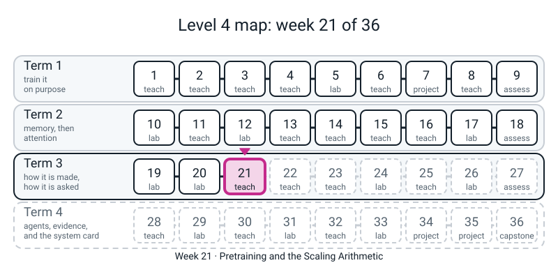
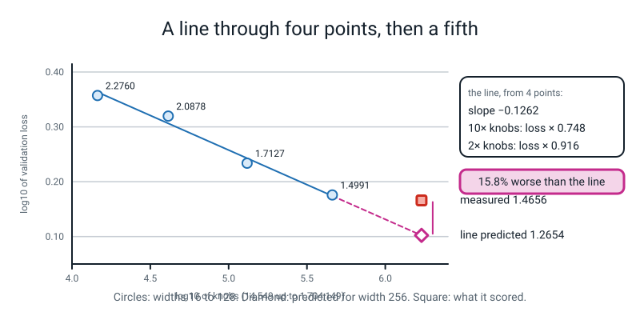
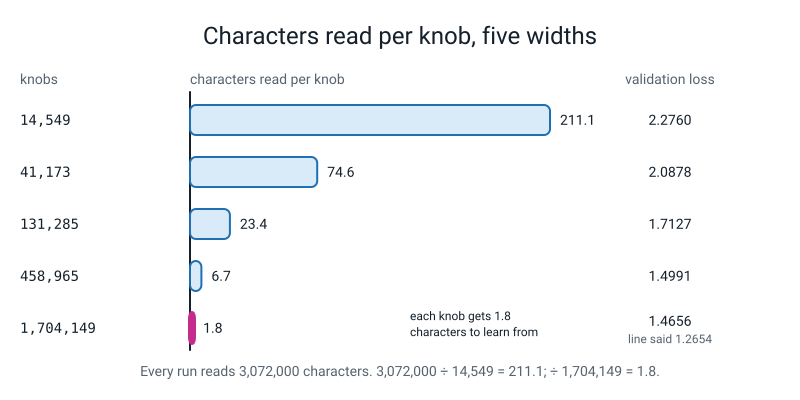

# Week 21 — Pretraining and the Scaling Arithmetic

[⬅ Week 20](week-20.md) · [Course Home](../README.md) · [Week 22 ➡](week-22.md) · [Student Guide](../student-guide/week-21.md) · [Workbook](../workbook/week-21.md)



*Figure 21.0 — Week 21, Pretraining and the scaling arithmetic, is the week the course asks what a line through small runs can say about a bigger one.*

---

## 📋 At a Glance

| | |
|---|---|
| **Duration** | 70 minutes in class (two runs of about 90 seconds each sit inside it), then the workbook (~60-75 min) |
| **Type** | 🟦 Teach — the student **trains four TinyGPTs that differ only in width**, fits a straight line to *loss against knobs* on log-log axes, **writes down a prediction for a fifth, bigger model, trains it, and checks**. Then they time their own CPU, estimate the training cost with `C = 6ND`, and fingerprint lines of text with `hashlib.md5` to find exact duplicates and training-to-validation leaks |
| **Big idea** | Pretraining is **the same next-token loss as Week 17**: average `-ln(probability of the true next character)`. What changes is scale, and at scale two things are engineering problems rather than ideas: **the data** (is it clean, is it duplicated, did the test leak into it?) and **the budget** (how many operations does the run cost, and how long does your machine take?). Loss falls as a **power law** in the number of knobs: multiply the knobs by 10 and the loss is multiplied by a fixed number; on log-log paper that is a **straight line**. Today's four widths lie on one: slope **-0.126**, every point within 3.1% of the line, and *10 times the knobs multiplies the loss by 0.748*. Then the lesson the day is built around: **the line predicted 1.265 for the next model up and the model scored 1.466, 15.8% worse than the line said.** A straight line through four points is a true description of four points. It is a prediction only while nothing else is limiting the result, and here something else is. Three seeds, four learning rates and twice the training text did **not** close the gap, so **the cause is not shown**. |
| **New vocabulary** | pretraining · power law · log-log · slope (of a line on log axes) · `C = 6ND` · FLOP (an operation on a number) · FLOP/s · extrapolate · deduplicate · fingerprint (hash) · contamination (leak) |
| **New maths** | **One idea:** the **log-log straight line**. A power law `y = a x^b` turns into a straight line when both axes are logged, and its slope is the exponent `b`. Met on `y = 100 / x` with three numbers before the word *power law* is used. See the 🔢 box. (Also used, not new: `10 ** x` undoes `log10`; percentages; products such as `6 x N x D`.) |
| **New syntax** | **Three**, exactly the ladder row: `np.polyfit(x, y, 1)` · `np.log10` · `hashlib.md5`. **One mirror rides along and is flagged, not counted:** `.hexdigest()` (what you call on the thing `md5` returns to see the 32 characters). Section 4. |
| **Dataset** | **Text already on the computer, 14 times bigger than Week 20's pool:** every `.py` file sitting directly in Python's own library folder: **170 files, 4,644,415 characters, 213 distinct characters**. The **first 90%** (4,179,973 characters) trains; the **last 10%** (464,442, different files) is the validation text. It is read by a GIVEN file, `textpool.py`, that the student does not type. **Nothing downloads. No internet.** |
| **Model** | **Real models, really trained, no stand-ins.** The Week 17 `TinyGPT` (student's own `tinygpt.py`) with **2 heads, 2 blocks, 64 places**, and width 16, 32, 64, 128 (then 256 for the check). Knobs: 14,549 · 41,173 · 131,285 · 458,965 · (1,704,149). Every run: **1,500 steps of 32 windows of 64 characters = 3,072,000 characters read**, AdamW, the Week 4 warm-up-and-cosine schedule, `lr` 3e-3, seed 0, one thread. **No scripted backend anywhere in this week.** |
| **Materials** | Laptop with Python 3, torch, numpy, matplotlib (all installed) · the folder containing `l4lib/`, the student's Week 17 `tinygpt.py`, and the GIVEN `textpool.py` and `trainer.py` · a ruler and the **Draw the Line** card and the **Fingerprint** card (Activity) · a timer · workbook pages 21.1-21.6 |
| **Prep time** | 35 minutes the night before (about 5 minutes of it is the computer running) · 3 minutes on the day |
| **Expected runtime of the code** | `pool_facts.py` 1 s · **`sweep.py` about 85-100 s** (11-13 + 14-16 + 21-25 + 37-45 s) · `fit.py` 1 s · **`check.py` about 90-105 s** (one width-256 model) · `flops.py` 1 s · `dedup.py` 2 s · teacher-only `key.py` 2 s · teacher-only `key_seeds.py` about 11 minutes, `key_lr.py` about 8 minutes, `key_steps.py` about 7 minutes. **The only two things in class that take over 10 s are `sweep.py` and `check.py`.** If `sweep.py` takes over 4 minutes, something else is using the CPU (see Fallback). |

> **⚠️ Watch out:** three things go wrong this week. **First, the line looks like a law and it is a description.** Four points, every one within 3.1% of the line, slope -0.126, and the next model up misses by 15.8% (three seeds: 15.5-17.4%, so it is not luck). The miss is the lesson; do not let anyone "fix" the prediction afterwards and call it a success. The honest sentence is: *"the line is true of these four; it was not true of the fifth; it is not luck, not only the learning rate, and not fixed by twice the text; I have not shown the cause."* **Second, the student will want to conclude that "scaling laws are wrong", or that "bigger is not better".** Neither follows. We trained five small models, one depth, one text, one learning rate, one seed per point, 1,500 steps. Published scaling laws (**quoted, not reproduced here**) are fitted on runs millions of times larger with tuned settings. What today shows is how a line through few points behaves when you push it, and that **the budget has two numbers, knobs and data, not one** (which of the two is limiting the fifth model, we have not shown). **Third, the FLOP/s timing is noisy and the "prediction" of training time is off by 4.5 to 78 times.** Both facts are the lesson: `6ND` counts the big matrix multiplies at their best speed; a tiny model spends most of its time on things `6ND` does not count. Use the rate to the nearest half, not the nearest digit (it was 1.5-1.6 trillion operations a second on a quiet laptop and 0.5-0.9 when the laptop was busy).

---

## 🎯 Lesson Objectives

This section lists what the student should be able to do at the end, and the evidence you can collect.

By the end of the lesson the student can:

1. **Say what pretraining is**: the Week 17 loss (`-ln` of the probability of the true next character, averaged), at a scale where the data and the budget are the hard parts. One sentence, no new formula.
2. **Turn a power law into a line** with three numbers: `y = 100 / x` at `x` = 10, 100, 1000 gives `y` = 10, 1, 0.1; their `log10` are 1, 0, -1 against 1, 2, 3: a line with slope -1.
3. **Train four widths, fit `log10(loss)` against `log10(knobs)` with `np.polyfit`, and read the slope**: -0.126, so 10 times the knobs multiplies the loss by `10 ** -0.126 = 0.748` and 2 times by 0.916.
4. **Write a prediction before running the check**, run it, and report the miss as a number with a sign (predicted 1.265, measured 1.466, 15.8% worse) rather than as a verdict.
5. **Give at least two candidate reasons for the miss and say which the course measured**: not luck (three seeds: 15.5-17.4%); not only the learning rate (four rates); not fixed by twice the text (3,000 steps: +17.3%). The data each knob gets, 1.8 characters at the top against 211 at the bottom, stays a candidate that we could not test properly; say which ones were **not** tested.
6. **Time their own CPU** with a matrix multiply, **estimate `C = 6ND`** for each of their five models, and **compare with the seconds that training took**: the estimate is between 4.5 and 78 times too fast, and say two reasons.
7. **Fingerprint a line of text with `hashlib.md5`**, count exact duplicates (10.4% of the training lines), find validation lines that also sit in the training text (5.2%), and name what an exact fingerprint **cannot** see (a trailing space; a renamed variable).

Observable evidence: `sweep.csv` written; `fit.py` printing a slope near -0.126 and a `PREDICTION` line; **a prediction written on the Draw the Line card before `check.py` ran**; `check.py` printing a signed miss; `flops.py` printing a table whose last column is bigger than 1; `dedup.py` printing a duplicate share and a leak share; the **Fingerprint** card filled; and the workbook's written answer to *"what did this week measure, and what did it not?"*

---

## 🧑‍🏫 What YOU Need to Know First

Read this before class. It covers the maths, what is real and what is not, the new code constructs, and the measured facts behind the lesson.

> **📌 About the code blocks in this guide.** Every block in the **🧰 Prep Checklist** is a *whole file* and every one was run, from one folder next to `l4lib/`, on a CPU with one thread, with Python 3.10.10, torch 2.2.1, numpy 1.26.4 and matplotlib 3.7.1. Blocks in the **🐞 Debugging Clinic** are *deliberate mistakes* and each is marked; their tracebacks and odd numbers are real. **Everything is seeded** (`torch.manual_seed(seed)` inside `train_one`; the validation windows are fixed, not random), and the losses were identical on a repeat run (the sweep was run three times and `check.py` three times; the five losses matched to all printed digits each time). **Only the `(N s)` timings and the `flops.py` rates change from run to run and machine to machine.** The ledger (the course author's reference run of Module 4) did not run a scaling experiment, so **there is no ledger number for today to compare with**; every figure below was measured for this guide. The module's one scaling-related passage (the `6ND` budget for a 7-billion-knob model) is arithmetic, not a measurement, and is checked in section 6.

### 1. What the student is doing today, in one paragraph

The student opens with a guess: *if I give a model 10 times as many knobs, how much lower is its loss?* Then they run the experiment the honest way. Four TinyGPTs, the Week 17 one with only its width changed (16, 32, 64, 128; two blocks, two heads, nothing else different), are trained for exactly the same 1,500 steps on the same 3,072,000 characters of Python's own source, and each is scored on the same validation windows. The four losses go on a card and the student draws a line through them with a ruler, on log-log axes, then does the same with `np.polyfit`. The line is the week's model: `loss = 7.74 x knobs^-0.126`. **Before anything else runs, the student writes down what the line says for a width-256 model, 1.7 million knobs.**

Then `check.py` trains it: 1.466, where the line said 1.265.

The rest of the hour is about what that means and the two engineering halves of pretraining: the **budget** (`C = 6ND`, timed on their own laptop) and the **data** (fingerprint the lines; how many are exact repeats; how many validation lines also sit in the training text). **Nothing is scripted, nothing is pretrained, and nothing comes from the internet.**

### 2. 🔢 The maths you need — taught to you first

**One new idea: the log-log straight line.** Everything else is arithmetic you did in Level 3. Do (a)-(c) before class; they take five minutes.

**(a) A power law, with no name yet.** Take `y = 100 / x`. At `x` = 10, 100, 1000 the `y` is 10, 1, 0.1: every time `x` is multiplied by 10, `y` is multiplied by 0.1, *the same fraction every time*. On ordinary axes that is a curve that bends. Now write down the `log10` of each number (how many zeros, roughly: `log10(1000) = 3`, `log10(1) = 0`, `log10(0.1) = -1`):

| `x` | `y` | `log10(x)` | `log10(y)` |
|--:|--:|--:|--:|
| 10 | 10 | 1 | 1 |
| 100 | 1 | 2 | 0 |
| 1,000 | 0.1 | 3 | -1 |

The last two columns are a straight line: each step right by 1 goes down by 1. Slope **-1**. `np.polyfit` on those three pairs gives slope -1.0 and intercept 2.0, which reads back as `y = 10^2 x^-1 = 100 / x`. **A power law is a straight line once both axes are logged, and the slope of the line is the exponent.** That is the whole idea. (Say "power law" only after the table.)

**(b) Our four points.** Knobs and validation loss, and their logs:

| Width | Knobs | `log10(knobs)` | Loss | `log10(loss)` |
|--:|--:|:--:|:--:|:--:|
| 16 | 14,549 | 4.1628 | 2.2760 | 0.3572 |
| 32 | 41,173 | 4.6146 | 2.0878 | 0.3197 |
| 64 | 131,285 | 5.1182 | 1.7127 | 0.2337 |
| 128 | 458,965 | 5.6618 | 1.4991 | 0.1758 |

Rise over run from the first point to the last (a Level 3 idea): `(0.1758 - 0.3572) / (5.6618 - 4.1628) = -0.1814 / 1.4990 =` **-0.121**. `np.polyfit`, which uses all four points, says **-0.1262**. Both say the same thing in words: *going right by 1 on the log axis (ten times the knobs) goes down by about 0.12 on the log loss axis.*

**(c) What a slope of -0.126 means.** `10 ** -0.1262 =` **0.748**: ten times the knobs multiplies the loss by about 0.75, a quarter off. `2 ** -0.1262 =` **0.916**: doubling the knobs takes about 8% off. (Not "a quarter off *each time*" in absolute terms: 2.276 becomes 1.70, not 1.70 minus a quarter of 2.276.) **Say it as a ratio, because that is the thing that stays the same.**

**(d) Reading a prediction off the line.** For width 256: knobs = 1,704,149, `log10 = 6.2315`. The ruler line (slope -0.121, anchored at the last point) gives `0.1758 + (-0.121)(6.2315 - 5.6618) = 0.1069`, and `10 ** 0.1069 =` **1.279**. `np.polyfit` gives **1.265**. Both are "about 1.27-1.28". The students' pencil answers will land between 1.25 and 1.30; accept that range.

**(e) `C = 6ND`.** `N` is the number of knobs, `D` the number of characters read, `C` the number of operations (additions and multiplications of ordinary numbers) in the whole run. One forward pass costs about `2ND` (a multiply and an add per knob per character); the backward pass about twice that, `4ND`; total **`6ND`**. For width 128: `6 x 458,965 x 3,072,000 =` **8.46 x 10^12**, eight and a half trillion operations. Here `D` is in **characters** (Week 20's "tokens" are what `D` counts in real pretraining; ours are single characters, one number each).

**(f) The speed of the machine.** Multiplying two `n x n` tables takes `2 x n^3` operations (`n` multiplies and `n` adds for each of `n x n` answers' worth of terms; just take the formula). Time it: `operations / seconds` is the **FLOP/s** ("floating-point operations per second"; say "operations a second"). Our laptop: about **1.5-1.6 x 10^12** (1.5 to 1.6 trillion a second) on one thread, best case, when nothing else was running. Then `C / rate` is the *predicted seconds* for a run. For width 128: `8.46e12 / 1.6e12 = 5.3 s`; it took **37-45 s**. That gap is a finding, not an error (section 6).

**(g) Characters per knob.** `D / N`: how much text each knob has to learn from. 3,072,000 / 14,549 = **211**; 3,072,000 / 1,704,149 = **1.8**. (Quoted, not reproduced: the published compute-optimal rule of thumb in Module 4 is about **20 tokens per parameter**. Ours are characters, not tokens, and our models are not tuned, so compare the *idea* and not the number.)

### 3. 🧭 Real vs stand-in — and what you must NOT claim

| In the lesson | Status |
|---|---|
| The five trained TinyGPTs, their losses, the knob counts, the seconds | **Real**: trained on your computer today, seeded, one thread. |
| The straight line, its slope, the prediction and the miss | **Real**: computed from those five numbers. |
| The 3-seed, 4-learning-rate, 2x-steps checks in the teacher key | **Real**, run for this guide. The student does not run them. |
| The FLOP/s rate | **Real for this laptop and this moment.** It changes with what else is running. It is *not* a figure for any GPU. |
| `C = 6ND` | The rule of thumb from Module 4, **used as arithmetic**. We check it against seconds; it fails by 4.5x to 78x and we say why. |
| "About 20 tokens per parameter" (compute-optimal) and "published scaling laws are straight over many orders of magnitude" | **Quoted, not reproduced.** Never an exercise and never a number to compare ours to: our units are characters, our runs are tiny and untuned. |
| Module 4's data funnel (100 TB to about 2 TB; dedup "often removes 50-70%") | **Illustrative numbers from the module, not measured here.** The one thing *we* measured is 10.4% of Python-source lines. |
| The 7-billion-knob, 1.4-trillion-token budget | **Module 4's hypothetical, checked as arithmetic.** The "years on this laptop" figure is the same arithmetic with our measured rate; it says nothing about whether that model would fit in memory, which it would not. |
| Any scripted stand-in (`FakeClient` or similar) | **None used this week.** |
| `md5` | A **fingerprint** for finding exact copies. **Not** a security tool, and nothing this week relies on it being hard to forge. |
| What a pretrained model "knows" because of the data | **Not measured.** We did not run a dedup-versus-no-dedup training. We measured how many lines repeat and how many leak; we did **not** measure what that does to the loss. |

### 4. The constructs, for somebody who has never seen them

Three are new; one mirror is flagged. Everything else is old: f-strings and format specs, `zip`, list comprehensions, `set`, `Counter` (Week 20), `open(...).read()`, `lambda` and `LambdaLR` (Week 4), `clip_grad_norm_` (Week 6), `time.perf_counter` (Week 17), `torch.manual_seed`, `a @ b` (Level 3), `.strip()` and `.split("\n")` (Level 2), `10 ** x`.

- **`np.log10(x)`**: the base-10 logarithm, element by element, of a number or an array. `np.log10(1000)` is 3.0; `np.log10(np.array([10, 100]))` is `[1., 2.]`. It is "how many factors of ten". **The student must say what it undoes:** `10 ** y`. (Mind `np.log`: that is the *natural* log, base e, which the student has not been told about in this form. The slope comes out the same either way, because it is a ratio of logs; the intercept differs. Mistake 2 is what happens if you mix the two.)
- **`np.polyfit(x, y, 1)`**: the best straight line through the points `(x, y)`, where the `1` means "a line" (degree 1). It **returns two numbers, the slope first and the intercept second**: `slope, intercept = np.polyfit(x, y, 1)`. "Best" means the line with the smallest total squared vertical miss (they met squared errors in Level 2). For today it is enough that it is "a ruler that uses all the points at once". Mistake 3 is the order of the two numbers.
- **`hashlib.md5(text.encode("utf-8")).hexdigest()`**: a fingerprint. Any text goes in (as bytes; the student met `.encode("utf-8")` in Week 20) and 32 letters-and-digits come out. **The same text always gives the same 32 characters; two different texts give different ones** (in practice; the chance of an accident is negligible for us). Change one character and the output changes completely. That is the entire use: *two lines are the same if and only if their fingerprints are the same*, and comparing 32 characters is quicker than comparing lines. `hashlib` must be imported. Mistake 5 is forgetting `.encode`.
- **Flagged mirror — `.hexdigest()`**: `hashlib.md5(b)` returns an object; `.hexdigest()` is the way you ask it for the 32 characters as a string. Say it as one phrase, "md5 of the bytes, as hex digits", and do not go further.
- **Teacher-only, flagged:** `np.log` and `np.exp` (Mistake 2 and `key.py`), `f"{x!s:5}"` (a format trick in `key.py`), `os.listdir` and `os.path.join` (inside the GIVEN `textpool.py`; the student is told it lists the files in a folder and nothing more). None is in any file the student types.

**One idea the student will not have met: a prediction is written down before the check.** It feels like a formality. It is the only thing that makes the check a check. Have them write the number on the card in ink.

### 5. The other code the student types — nothing new, but note these

- **`trainer.py` is Week 17's `train.py` turned into a function** (`train_one(d, steps, seed, lr, warmup)`). It is GIVEN; the student reads it for two minutes and sees that every line is from Week 17 (the schedule from Week 4, the clipping from Week 6). The only new idea is in what it returns: `(knobs, validation loss, seconds)`. It builds `TinyGPT(V, d, 2, 2, T)`: **two heads and two blocks for every width**, so width is the only thing that changes.
- **`textpool.py` is GIVEN.** It builds the pool from Python's own source files and provides `get_batch()` and `val_loss(model)`. The important fact is in `val_loss`: **it scores every model on the same 640 validation windows**. Without that, the differences between widths would include luck about which windows were drawn.
- **`sweep.py` writes a file (`sweep.csv`) with a plain `open(..., "w")`.** This is so the slow part (90 s) is done once and the fitting can be redone as often as you like. The student met file reading in Level 2 and writing is one line more; `f.write(...)` with a `\n`.
- **`fit.py` and `check.py` read that file back with `open("sweep.csv").read().split("\n")`** and `line.split(",")`. Say it is "the same thing in reverse".
- **`check.py` repeats three lines of `fit.py`** (the fit). That is on purpose: each file runs on its own.
- **The order of unpacking matters**: `slope, intercept = np.polyfit(...)`. Clinic 3.
- **`flops.py` uses `torch.randn(n, n)` and `a @ b`** (Weeks 10 and Level 3) and takes the fastest of five timings. "Fastest" is the least disturbed timing; say so.
- **`dedup.py` ends with a three-line experiment on `a`, `b`, `c`** (a line, the same with a trailing space, the same with a variable renamed). It is the picture of what an exact fingerprint can and cannot see.

### 6. What the numbers will say

**The pool** (`pool_facts.py`): 170 files; 4,644,415 characters; 213 distinct characters (the vocabulary is now 213, not Week 17's 28, because Python source has symbols and a few non-English characters); train 4,179,973, validation 464,442. One run of 1,500 steps reads 3,072,000 characters, **0.73 of a pass** over the training text, so **no run sees any training text twice on average** (windows are drawn at random, so a few are repeated by chance and many are never drawn). Week 17, for contrast, read its 6,274-character text 490 times. *This is why the validation loss is honest today: the model is never memorising.*

**The sweep** (`sweep.py`, seed 0):

| Width | Knobs | Validation loss | Characters per knob | Seconds |
|--:|--:|:--:|:--:|:--:|
| 16 | 14,549 | 2.2760 | 211 | 11-13 |
| 32 | 41,173 | 2.0878 | 75 | 14-16 |
| 64 | 131,285 | 1.7127 | 23 | 21-25 |
| 128 | 458,965 | 1.4991 | 6.7 | 37-45 |

**The fit** (`fit.py`): `log10(loss) = -0.1262 x log10(knobs) + 0.8886`, i.e. `loss = 7.737 x knobs^-0.1262`; 10 times the knobs x 0.748; 2 times the knobs x 0.916. The line against the points: **-1.4%, +3.1%, -2.1%, +0.4%**. **The prediction for width 256: 1.2654.**

**The check** (`check.py`): width 256, 1,704,149 knobs, **validation loss 1.4656** (81-104 s), a miss of **+15.8%** (the model is *worse* than the line said). Characters per knob at the top: **1.8**. The slope with the fifth point included is **-0.1008**: the line got flatter.

**Is the miss luck? Three seeds** (`key_seeds.py`, teacher-only):

| | Seed 0 | Seed 1 | Seed 2 | Mean | Spread (max - min) |
|---|:--:|:--:|:--:|:--:|:--:|
| width 16 | 2.2760 | 2.2848 | 2.2870 | 2.2826 | 0.011 |
| width 32 | 2.0878 | 2.0507 | 2.0366 | 2.0584 | 0.051 |
| width 64 | 1.7127 | 1.7114 | 1.7181 | 1.7141 | 0.007 |
| width 128 | 1.4991 | 1.5275 | 1.5003 | 1.5090 | 0.028 |
| width 256 | 1.4656 | 1.4892 | 1.4873 | 1.4807 | 0.024 |
| slope of the 4-point line | -0.1262 | -0.1205 | -0.1246 | | |
| line's prediction for 256 | 1.2654 | 1.2891 | 1.2667 | | |
| miss | +15.8% | +15.5% | +17.4% | | |

So **the slope is about -0.12 to -0.13 and the miss is 15-17% on every seed**. Two things to say out loud. *First:* the width-32 point moves by 0.051 between seeds, about 2.5% of its value, so the student's "+3.1%" at width 32 is the size of seed noise: the line fits **to within the noise** and no better. *Second:* **width 256 (mean 1.4807) is only 0.028 better than width 128 (mean 1.5090)**, about the size of the spread. At this budget, a model with 3.7 times the knobs is not clearly better. (We did not test more than three seeds.)

**Was it just the learning rate?** (`key_lr.py`, teacher-only; the course used 3e-3 for every width and never tuned it):

```text
width 128  lr 1e-03  validation loss 1.7084  (39 s)
width 128  lr 2e-03  validation loss 1.5425  (38 s)
width 128  lr 3e-03  validation loss 1.4991  (39 s)
width 128  lr 5e-03  validation loss 1.4784  (36 s)
width 256  lr 1e-03  validation loss 1.5035  (81 s)
width 256  lr 2e-03  validation loss 1.4564  (82 s)
width 256  lr 3e-03  validation loss 1.4656  (82 s)
width 256  lr 5e-03  validation loss 1.4976  (88 s)
```

The best rate is not the same for both widths (5e-3 for 128, 2e-3 for 256), so **a single rate for all widths is a limitation** (the line itself moves if width 128 improves to 1.4784). But the best width-256 loss across the four rates (1.4564) is far above the prediction of 1.2654, so the miss is **not just the learning rate**.

**Does twice the text close the gap?** (`key_steps.py`, teacher-only: 3,000 steps = 6,144,000 characters, twice the diet, everything else the same):

```text
width  16  knobs   14549  3000 steps  validation loss 2.1203  (24 s)
width  32  knobs   41173  3000 steps  validation loss 1.8555  (29 s)
width  64  knobs  131285  3000 steps  validation loss 1.5358  (46 s)
width 128  knobs  458965  3000 steps  validation loss 1.3762  (83 s)
width 256  knobs 1704149  3000 steps  validation loss 1.3387  (174 s)
```

Twice the characters lowers **every** model's loss, by 0.156, 0.232, 0.177, 0.123 and 0.127 (widths 16 to 256). **The biggest model did not gain more than width 128 did** (0.127 against 0.123). Fitting the same line through the four 3,000-step losses (same `np.polyfit` code, computed from the five numbers above) gives slope **-0.1287** and a prediction of **1.141** for width 256; width 256 scored 1.3387, a miss of **+17.3%**, the same size as before. So the hypothesis "the biggest model is starved of text" is **not supported by a doubling**; doubling takes it from 1.8 to 3.6 characters per knob, still far from the published rule of thumb (quoted: about 20), and the test that would settle it needs about 34 million characters, which this pool (4.2 million for training) cannot give. **Say that plainly: we ruled some things out and did not find the cause.**

**The budget** (`flops.py`, a quiet laptop):

```text
matrix multiply speed on one thread (2*n*n*n operations per multiply):
     32 x 32        0.001 ms per multiply    88.1 billion operations per second
    128 x 128       0.005 ms per multiply   918.5 billion operations per second
    512 x 512       0.173 ms per multiply  1553.1 billion operations per second
   1024 x 1024      1.595 ms per multiply  1346.5 billion operations per second

best-case rate used below: 1553 billion operations per second
characters per run D = 3072000

 width      N = knobs      C = 6*N*D    predicted s   measured s   measured / predicted
    16         14,549      2.682e+11          0.2         11.6           67.4
    32         41,173      7.589e+11          0.5         14.3           29.3
    64        131,285      2.420e+12          1.6         20.5           13.2
   128        458,965      8.460e+12          5.4         36.6            6.7
   256      1,704,149      3.141e+13         20.2         91.0            4.5

the worked example from Module 4 (hypothetical, arithmetic only): N = 7e9 knobs, D = 1.4e12 tokens
  C = 5.88e+22 operations;  on this laptop, one thread: 3.79e+10 s = 1,200 years
```

Say three things. *The speed depends on the size of the multiply*: tiny tables are slow (60-90 billion a second at 32 x 32), big ones fast (1.3-1.6 trillion). The models' own tables are small (16 to 256 wide). *`6ND` is a count of operations, not of time.* **Measured over predicted is about 67-78 for the smallest model and 4.5-4.7 for the largest (two runs): the bigger the model, the closer the arithmetic gets.** Reasons we believe (and did not separate): the small tables run far below the best-case speed; softmax, layer norm, GELU, the optimizer and Python's own bookkeeping are not multiplies; `6ND` ignores the attention table and counts embedding lookups as if they were multiplies. **We did not break down where the seconds went.** Then the hypothetical: Module 4's 7-billion-knob run on 1.4 trillion tokens is `6 x 7e9 x 1.4e12 =` **5.88 x 10^22** operations; at this laptop's rate that is about **1,150-1,200 years** (1,140-1,200 across our runs). *(With Module 4's own assumed sustained rate of 4 x 10^14 a second for one accelerator it works out to 1,701 days, 4.7 years, which is what the module prints; we did not measure any accelerator.)*

**The data** (`dedup.py`):

```text
29316ac3af62c94eaf8bd9267f2b3576 <- the river ran past the town
29316ac3af62c94eaf8bd9267f2b3576 <- the river ran past the town
d9d1ed4bcca4b4b8494ca96a2e355f88 <- the river ran past the towN

training lines (25+ characters): 55978   distinct fingerprints: 50155
exact repeats a dedup pass would delete: 5823 lines = 10.4% of the lines

the five most repeated lines:
    57 times: raise NotImplementedError
    56 times: a = _convert_other(a, raiseit=True)
    35 times: if __name__ == '__main__':
    22 times: return context._raise_error(InvalidOperation,
    20 times: Traceback (most recent call last):

validation lines (25+ characters): 6343   also found in the training text: 327 = 5.2%

same line, trailing space:  fingerprints match? False
  ... after .strip() on both:  fingerprints match? True
same line, variable renamed:  fingerprints match? False
```

Read it in three bites. *(1)* The fingerprint of the same line is identical; changing one letter to a capital gives a completely different 32 characters: that is the whole mechanism. *(2)* **10.4% of the training lines (5,823 of 55,978 that have 25 or more characters) are exact repeats**; the most repeated are `raise NotImplementedError` (57 times) and a pair of lines from one file. **This is Python source, where repeating boilerplate is normal; it is not a measurement of a web crawl.** The module says dedup "often removes 50-70%" of a crawl: quoted, not reproduced. *(3)* **327 of 6,343 validation lines (5.2%) also appear verbatim in the training text.** That is a small, real leak between the training and validation files, almost all boilerplate. *We did not remove those lines and did not measure what they do to the validation loss.* The last three lines are the limit of the tool: a trailing space defeats the fingerprint until you `.strip()`; a renamed variable defeats it always. Near-duplicates need a different tool (Module 4 names MinHash; **we did not build or run it**).

**The hand numbers** (`key.py`):

```text
1. y = 100 / x
   x    10  y   10.0   log10(x) 1   log10(y) +1
   x   100  y    1.0   log10(x) 2   log10(y) +0
   x  1000  y    0.1   log10(x) 3   log10(y) -1
   the line through the logs: slope -1.0, intercept 2.0  (y = 10^2 * x^-1 = 100 / x)

2. The four points, logged to 2 decimals (what the card shows):
   x 4.16   y 0.36
   x 4.61   y 0.32
   x 5.12   y 0.23
   x 5.66   y 0.18
   slope from the first and last point: (0.1758 - 0.3572) / (5.6618 - 4.1628) = -0.1210
   x for width 256 = log10(1704149) = 6.2315; ruler reads y = 0.1069; loss = 10^y = 1.279
   np.polyfit says slope -0.1262, loss 1.265
   natural-log slope -0.1262  (the same slope: it is a ratio of logs)

3. knob_count against the real model (blocks=2):
   width  16: formula    14549  real    14549  match True
   width  32: formula    41173  real    41173  match True
   width  64: formula   131285  real   131285  match True
   width 128: formula   458965  real   458965  match True
   width 256: formula  1704149  real  1704149  match True

4. D = 1500 * 32 * 64 = 3072000
   width  16: 6 * 14549 * 3072000 = 2.682e+11;  characters per knob 211.1;  20 per knob would ask for 290,980 characters
   width 128: 6 * 458965 * 3072000 = 8.460e+12;  characters per knob 6.7;  20 per knob would ask for 9,179,300 characters
   width 256: 6 * 1704149 * 3072000 = 3.141e+13;  characters per knob 1.8;  20 per knob would ask for 34,082,980 characters
   Week 17's TinyGPT (807196 knobs, same D): 6 * 807196 * 3072000 = 1.488e+13;  at 1.6e12 a second that is 9.3 s  (Week 17 measured 80 s)
   the whole training text has 4,179,973 characters: enough for 20 per knob up to 208,998 knobs

5. Module 4 budget: C = 5.880e+22
   at 4e14 operations per second (Module 4's assumed sustained rate): 1.470e+08 s = 1,701 days = 4.7 years
   on 1,024 of them: 1.66 days;  GPU-hours 40,833;  at $2 an hour: $81,667
   this laptop at 1.6e12: 3.68e+10 s = 1,165 years

6. 10 times the knobs multiplies the loss by 0.748 ; 2 times by 0.916
   from the smallest model (14,549 knobs) to 10 times that: loss 1.726
```



*Figure 21.1 — The line fitted the four models it was drawn through and missed the fifth by 15.8 percent; that is a measurement, not yet an explanation.*



*Figure 21.2 — Every run reads the same text, so the biggest model gets the least per knob; the budget has two numbers, knobs and data.*

### 7. The honest limits of today

1. **Five points, one depth, one width ratio, one text, one learning rate, 1,500 steps.** Three seeds for the teacher key; the student has one. The straight line is a summary of four points and the fifth point did not sit on it.
2. **The miss has several candidate causes and we separated only some.** Not luck (three seeds). Not only the learning rate (four rates, each for two widths). The models at the top are given few characters each (1.8 per knob); doubling the characters helped every model about equally and did not close the gap (section 6). **We did not give width 256 a "20 per knob" diet** (that needs about 34 million characters and the pool has 4.2 million), so we have not shown that data is the cause. We also did not vary the depth, the context length or the batch size.
3. **The learning rate was not tuned per width.** The best rate for width 128 (5e-3, 1.4784) is not the best for 256 (2e-3, 1.4564). Tuning per width would move the fitted line.
4. **Loss is for these windows of Python source, measured in nats per character.** It is not perplexity on English, not a score on any task, and not comparable to Week 17's numbers (a different text and a different vocabulary).
5. **The validation text is 5.2% leaked lines** (section 6). We did not clean it.
6. **The FLOP/s number is one laptop, one thread, one moment.** The same code gave 0.5-0.9 trillion operations a second while something else was running and 1.6 when quiet. Nothing here is about GPUs.
7. **We did not explain why `6ND` under-predicts the time.** We listed reasons and did not test them.
8. **`md5` finds exact copies only.** Near-duplicates were shown as a counter-example, never counted.
9. **Pretraining at scale was not done.** The biggest run read 3 million characters and took about 90 seconds. A sentence like "this is how it works at scale" is a quotation and not a result.
10. **A different Python version has different standard-library files.** The pool is 4,644,415 characters on Python 3.10.10 here. On another version every loss in this guide moves (a little), the duplicate percentages move, and the shapes (a falling line, a miss above it, a ratio bigger than 1) should not.

### 8. The misconceptions you will actually meet

- **"The line fits, so I know the next one."** It fits the four it was drawn through. *"What would make the fifth one not be on it?"*
- **"Bigger model, better model."** At this budget the mean loss moves from 1.509 (128) to 1.481 (256), about one spread. More text helped every model (by 0.12-0.23 for twice the text); bigger did not help much at this budget. We did not test a much larger diet.
- **"A straight line on the plot means the thing is linear."** It is a straight line on *log* axes. On ordinary axes it is a curve. The left-hand picture of `scaling.png` is that curve.
- **"The slope is -0.126, so the loss falls 12.6% per doubling."** It falls 8.4% per doubling (`1 - 2 ** -0.1262`), and 25.2% per ten-fold. The slope is an exponent, not a percentage.
- **"`log10` of the loss is the loss."** Mistake 4.
- **"Natural log and log10 give different slopes."** They give the *same* slope (-0.1262 both ways); only the intercept differs. The mistake is mixing them.
- **"`6ND` is how long training takes."** It is how many operations it needs. Time needs a rate, and the rate depends on the job.
- **"md5 finds copies, so dedup is solved."** It finds exact ones. Renamed, reformatted or reworded text sails through.
- **"5% leak is nothing."** We do not know. We did not measure its effect. The point is the habit of asking.
- **"pretraining = the model reading the whole internet."** Pretraining is the Week 17 loop at scale. Today's runs are a 1,500-step toy of it.

### 9. How deep to go, and where to stop

Stop at: *"same loss as Week 17; four widths on a log-log line; the line predicted the fifth and missed by 16%, and three things are true at once: the line fit the four, the miss is not luck (and not only the learning rate, and not fixed by twice the text), and we have not found its cause; `6ND` is a count of operations that under-predicts time for small models; md5 finds exact repeats and leaks."* Do **not** go into: fitting curves with an extra "floor" term (the loss cannot reach zero, and the line ignores that; say *"a real fit would need a floor and we did not fit one"* if asked); the compute-optimal frontier derivation; how real pipelines filter by quality or language; MinHash; the attention term in `C`; mixed precision; anything about a named lab's models.

### 10. 🧭 Where Week 21 sits

| Week | What it gave | Used today |
|---|---|---|
| 4 | `lambda`, `LambdaLR`, warm-up and cosine | Inside the GIVEN `trainer.py` |
| 7 | Mean and spread over seeds | The teacher's three-seed table; "one seed is one draw" |
| 16 | The knob-count formula | `knob_count(d)`, matched to the model's real count |
| 17 | The TinyGPT, cross-entropy, train/validation | The same model and loss, five widths |
| 19 | A claim needs a test that could prove it wrong | The prediction is such a test |
| 20 | Tokens, bytes, characters; the stdlib as a text pool | `D` counts characters today; the pool is 14 times bigger |
| **21** | **Pretraining; the log-log line; `6ND`; md5 dedup** | |
| 22 | SFT, a reward model and DPO | The same loss family, applied after this stage |
| 23-36 | A scripted backend begins (Week 23) | Everything today is real; nothing is scripted |

---

## 🧰 Prep Checklist

### 35 minutes the night before

- [ ] **Confirm the stack.** Run from the folder that contains `l4lib/` and the student's Week 17 `tinygpt.py`:

```bash
python3 -c "import torch, numpy, matplotlib; print(torch.__version__, numpy.__version__, matplotlib.__version__)"
python3 -c "import tinygpt; print(tinygpt.TinyGPT)"
```

You must see (digits may differ on another installation):

```text
2.2.1 1.26.4 3.7.1
<class 'tinygpt.TinyGPT'>
```

If `tinygpt` is not found you are in the wrong folder, or the student's Week 17 file is elsewhere: copy it in. **It must define `TinyGPT(V, d, H, L, T)` exactly as in Week 17** (the same signature, `calm_head` defaulting to `True`). `pip` returning 403 is expected and not an error; **nothing this week installs anything.**

- [ ] **Put the files below into one working folder** next to `l4lib/`. Each begins with a `#` comment naming it. Run them **in this order, one at a time, with nothing else running** (the timings and the FLOP/s rate are disturbed by other work) and compare with the output printed here. `textpool.py` and `trainer.py` are **GIVEN** to the student; the others are typed in class or for homework, as the lesson says.

**File 1 — `textpool.py`** (GIVEN, not typed). The text pool, the batches, and one fixed validation score. It prints nothing. **It contains `os.listdir`, `os.path.join` and a generator inside `join`, which are not on the ladder**; that is why it is given, and the student is told only "this reads every `.py` file in Python's own library folder".

```python
# textpool.py - Week 21 (GIVEN to the student, not typed): a text pool 14 times bigger than Week 20's, and one fixed validation score.
import os
import torch

folder = os.path.dirname(os.__file__)                                   # where Python keeps its own source files
names = sorted(f for f in os.listdir(folder) if f.endswith(".py"))      # every .py file directly in that folder, in order
pool = "".join(open(os.path.join(folder, f), encoding="utf-8", errors="replace").read() for f in names)

chars = sorted(set(pool))
V = len(chars)
stoi = {c: i for i, c in enumerate(chars)}
data = torch.tensor([stoi[c] for c in pool])
n = int(0.9 * len(data))
train_data, val_data = data[:n], data[n:]                               # the last tenth of the files is the validation text
T, B = 64, 32                                                           # places per window, windows per batch


def get_batch():
    starts = torch.randint(len(train_data) - T, (B,))
    x = torch.stack([train_data[s:s + T] for s in starts])
    y = torch.stack([train_data[s + 1:s + T + 1] for s in starts])
    return x, y


@torch.no_grad()
def val_loss(model):
    """The SAME 640 validation windows for every model (spread evenly over the validation text), averaged."""
    total = 0.0
    for i in range(20):
        starts = (torch.arange(32) + 32 * i) * 700
        x = torch.stack([val_data[s:s + T] for s in starts])
        y = torch.stack([val_data[s + 1:s + T + 1] for s in starts])
        _, loss = model(x, y)
        total += loss.item()
    return total / 20
```

**File 2 — `pool_facts.py`** (the teacher runs it in class from this copy and the student reads it; typed for homework; 1 s)

```python
# pool_facts.py - Week 21: how big is the pool, and how much of it will one training run actually read?
from textpool import names, pool, V, train_data, val_data, T, B

STEPS = 1500
print("files:", len(names), "  characters:", len(pool), "  distinct characters (vocab):", V)
print("train:", len(train_data), "  validation:", len(val_data))
tokens_seen = STEPS * B * T
print("one run of", STEPS, "steps reads", tokens_seen, "characters =", round(tokens_seen / len(train_data), 2), "passes over the training text")
print("Week 17, for comparison: 1500 steps read", 1500 * 32 * 64, "characters of a 6,274-character training text =", round(1500 * 32 * 64 / 6274), "passes")
```

```text
files: 170   characters: 4644415   distinct characters (vocab): 213
train: 4179973   validation: 464442
one run of 1500 steps reads 3072000 characters = 0.73 passes over the training text
Week 17, for comparison: 1500 steps read 3072000 characters of a 6,274-character training text = 490 passes
```

The last line is the contrast with Week 17: 490 passes then, 0.73 now.

**File 3 — `trainer.py`** (GIVEN, not typed). Week 17's `train.py` as a function, plus `knob_count` (Week 16's hand formula). The student reads it for two minutes and finds nothing new. It prints nothing.

```python
# trainer.py - Week 21: train ONE TinyGPT of a given width for a given number of steps; return (knobs, validation loss, seconds).
import math
import time
import torch
from tinygpt import TinyGPT
from textpool import V, T, get_batch, val_loss


def train_one(d, steps=1500, seed=0, lr=3e-3, warmup=100):
    torch.manual_seed(seed)
    model = TinyGPT(V, d, 2, 2, T)                                       # 2 heads, 2 blocks; only the width d changes
    knobs = sum(p.numel() for p in model.parameters())
    opt = torch.optim.AdamW(model.parameters(), lr=lr, weight_decay=0.1)
    sched = torch.optim.lr_scheduler.LambdaLR(opt, lambda s: (s + 1) / warmup if s < warmup
                                              else 0.5 * (1 + math.cos(math.pi * (s - warmup) / (steps - warmup))))
    t0 = time.perf_counter()
    for step in range(steps):
        x, y = get_batch()
        _, loss = model(x, y)
        opt.zero_grad(set_to_none=True)
        loss.backward()
        torch.nn.utils.clip_grad_norm_(model.parameters(), 1.0)
        opt.step()
        sched.step()
    seconds = time.perf_counter() - t0
    return knobs, val_loss(model), seconds


def knob_count(d, blocks=2):
    """Week 16's hand count for a TinyGPT of width d (vocabulary V, T places, `blocks` blocks)."""
    return V * d + T * d + blocks * (12 * d * d + 10 * d) + 2 * d + (d * V + V)
```

**File 4 — `sweep.py`** (typed; **about 90 s**; writes `sweep.csv`)

```python
# sweep.py - Week 21: train four widths with everything else the same, and save (width, knobs, validation loss, seconds) to sweep.csv.
from trainer import train_one

WIDTHS = [16, 32, 64, 128]
rows = []
for d in WIDTHS:
    knobs, loss, seconds = train_one(d)
    rows.append((d, knobs, loss, seconds))
    print(f"width {d:3d}  knobs {knobs:7d}  validation loss {loss:.4f}  ({seconds:.0f} s)")

with open("sweep.csv", "w") as f:
    for d, knobs, loss, seconds in rows:
        f.write(f"{d},{knobs},{loss},{seconds}\n")
print("saved sweep.csv")
```

```text
width  16  knobs   14549  validation loss 2.2760  (12 s)
width  32  knobs   41173  validation loss 2.0878  (14 s)
width  64  knobs  131285  validation loss 1.7127  (21 s)
width 128  knobs  458965  validation loss 1.4991  (37 s)
saved sweep.csv
```

(The `(N s)` figures change from run to run and machine to machine: 11-13, 14-16, 21-25 and 37-45 s on the author's laptop. **The losses are identical every run.**) The file written:

```text
16,14549,2.2759578347206117,11.6336238340009
32,41173,2.087807261943817,14.307826833013678
64,131285,1.7127478837966919,20.534980875003384
128,458965,1.4990659058094025,36.61203754201415
```

**File 5 — `fit.py`** (typed; 1 s; writes `scaling.png`)

```python
# fit.py - Week 21: a power law is a straight line on log-log paper. Fit it to the four widths, then PREDICT the width-256 model.
import numpy as np
import matplotlib
matplotlib.use("Agg")
import matplotlib.pyplot as plt
from trainer import knob_count

rows = [line.split(",") for line in open("sweep.csv").read().split("\n") if line]
N = np.array([float(r[1]) for r in rows])                # knobs
L = np.array([float(r[2]) for r in rows])                # validation loss

x, y = np.log10(N), np.log10(L)
print("   knobs    log10(knobs)   loss    log10(loss)")
for i in range(len(N)):
    print(f"{N[i]:8.0f}   {x[i]:.4f}      {L[i]:.4f}   {y[i]:.4f}")

slope, intercept = np.polyfit(x, y, 1)                   # the best straight line through the four points
a = 10 ** intercept
print(f"\nline: log10(loss) = {slope:.4f} * log10(knobs) + {intercept:.4f}")
print(f"same thing as a law: loss = {a:.3f} * knobs^({slope:.4f})")
print(f"so 10 times the knobs multiplies the loss by {10 ** slope:.3f}, and 2 times the knobs by {2 ** slope:.3f}")

fitted = 10 ** (slope * x + intercept)
for i in range(len(N)):
    print(f"  knobs {N[i]:7.0f}: measured {L[i]:.4f}  line says {fitted[i]:.4f}  off by {100 * (L[i] / fitted[i] - 1):+.1f}%")

N_big = knob_count(256)
predicted = 10 ** (slope * np.log10(N_big) + intercept)
print(f"\nPREDICTION for width 256 ({N_big} knobs, {N_big / N[-1]:.1f} times the biggest so far): validation loss {predicted:.4f}")

fig, (left, right) = plt.subplots(1, 2, figsize=(10, 4))
grid = np.linspace(x.min(), np.log10(N_big), 50)
left.plot(N, L, "o-")
left.plot(N_big, predicted, "*", markersize=14, label="prediction (width 256)")
left.set_xlabel("knobs")
left.set_ylabel("validation loss")
left.set_title("ordinary axes: a curve")
left.legend()
right.plot(x, y, "o")
right.plot(grid, slope * grid + intercept, "--", label=f"line, slope {slope:.3f}")
right.plot(np.log10(N_big), np.log10(predicted), "*", markersize=14)
right.set_xlabel("log10(knobs)")
right.set_ylabel("log10(validation loss)")
right.set_title("both axes logged: a line")
right.legend()
fig.savefig("scaling.png")
print("saved scaling.png")
```

```text
   knobs    log10(knobs)   loss    log10(loss)
   14549   4.1628      2.2760   0.3572
   41173   4.6146      2.0878   0.3197
  131285   5.1182      1.7127   0.2337
  458965   5.6618      1.4991   0.1758

line: log10(loss) = -0.1262 * log10(knobs) + 0.8886
same thing as a law: loss = 7.737 * knobs^(-0.1262)
so 10 times the knobs multiplies the loss by 0.748, and 2 times the knobs by 0.916
  knobs   14549: measured 2.2760  line says 2.3082  off by -1.4%
  knobs   41173: measured 2.0878  line says 2.0242  off by +3.1%
  knobs  131285: measured 1.7127  line says 1.7487  off by -2.1%
  knobs  458965: measured 1.4991  line says 1.4932  off by +0.4%

PREDICTION for width 256 (1704149 knobs, 3.7 times the biggest so far): validation loss 1.2654
saved scaling.png
```

**File 6 — `check.py`** (typed; **81-104 s**; writes `check.csv`). The prediction is recomputed inside the file (three lines of `fit.py` again) so that each file runs on its own.

```python
# check.py - Week 21: train the width-256 model and compare it with what the line PREDICTED. (About 2 minutes.)
import numpy as np
from trainer import train_one, knob_count

rows = [line.split(",") for line in open("sweep.csv").read().split("\n") if line]
N = np.array([float(r[1]) for r in rows])
L = np.array([float(r[2]) for r in rows])
slope, intercept = np.polyfit(np.log10(N), np.log10(L), 1)
predicted = 10 ** (slope * np.log10(knob_count(256)) + intercept)

knobs, measured, seconds = train_one(256)
print(f"width 256: knobs {knobs}  validation loss {measured:.4f}  ({seconds:.0f} s)")
print(f"line predicted {predicted:.4f}   measured {measured:.4f}   the line was too hopeful by {100 * (measured / predicted - 1):.1f}%")

with open("check.csv", "w") as f:
    f.write(f"256,{knobs},{measured},{seconds}\n")

print("\ncharacters read per knob (3,072,000 characters in every run):")
for n_i, l_i in zip(list(N) + [knobs], list(L) + [measured]):
    print(f"  knobs {n_i:8.0f}: {3072000 / n_i:6.1f} characters per knob   loss {l_i:.4f}")

N5 = np.array(list(N) + [knobs])
L5 = np.array(list(L) + [measured])
slope5, intercept5 = np.polyfit(np.log10(N5), np.log10(L5), 1)
print(f"\nslope with four points {slope:.4f}, with five points {slope5:.4f}")
```

```text
width 256: knobs 1704149  validation loss 1.4656  (91 s)
line predicted 1.2654   measured 1.4656   the line was too hopeful by 15.8%

characters read per knob (3,072,000 characters in every run):
  knobs    14549:  211.1 characters per knob   loss 2.2760
  knobs    41173:   74.6 characters per knob   loss 2.0878
  knobs   131285:   23.4 characters per knob   loss 1.7127
  knobs   458965:    6.7 characters per knob   loss 1.4991
  knobs  1704149:    1.8 characters per knob   loss 1.4656

slope with four points -0.1262, with five points -0.1008
```

The file written:

```text
256,1704149,1.4656328678131103,91.02051474998007
```

**File 7 — `flops.py`** (typed; 1 s). It reads `sweep.csv` and `check.csv`, so run it after File 6. **The rates (the second column of the first table) change every time you run it** (we saw best-case rates of 0.5-0.9 trillion a second when something else was running and 1.6 when quiet); the loss and knob columns and the characters per run do not.

```python
# flops.py - Week 21: how fast is THIS computer, and does C = 6 * N * D predict how long training took?
import time
import torch

torch.set_num_threads(1)                                  # the same single thread every training run used

print("matrix multiply speed on one thread (2*n*n*n operations per multiply):")
rate = {}
for n in (32, 128, 512, 1024):
    a, b = torch.randn(n, n), torch.randn(n, n)
    a @ b                                                 # one throw-away multiply to warm up
    best = 1e9
    for trial in range(5):                                # five timings; keep the fastest (the least disturbed)
        t0 = time.perf_counter()
        for _ in range(20):
            a @ b
        best = min(best, (time.perf_counter() - t0) / 20)
    secs = best
    rate[n] = 2 * n ** 3 / secs
    print(f"  {n:5d} x {n:<5d}  {secs * 1000:8.3f} ms per multiply  {rate[n] / 1e9:6.1f} billion operations per second")

RATE = max(rate.values())                                 # the fastest figure we saw: our best-case 'peak'
D = 1500 * 32 * 64                                        # characters read in one training run
print(f"\nbest-case rate used below: {RATE / 1e9:.0f} billion operations per second")
print(f"characters per run D = {D}")

rows = [line.split(",") for line in open("sweep.csv").read().split("\n") if line]
rows.append(open("check.csv").read().strip().split(","))
print("\n width      N = knobs      C = 6*N*D    predicted s   measured s   measured / predicted")
for r in rows:
    N, seconds = int(r[1]), float(r[3])
    C = 6 * N * D
    predicted = C / RATE
    print(f"{r[0]:>6} {N:14,d} {C:14.3e} {predicted:12.1f} {seconds:12.1f} {seconds / predicted:14.1f}")

print("\nthe worked example from Module 4 (hypothetical, arithmetic only): N = 7e9 knobs, D = 1.4e12 tokens")
C = 6 * 7e9 * 1.4e12
seconds = C / RATE
print(f"  C = {C:.2e} operations;  on this laptop, one thread: {seconds:.2e} s = {seconds / 86400 / 365:,.0f} years")
```

```text
matrix multiply speed on one thread (2*n*n*n operations per multiply):
     32 x 32        0.001 ms per multiply    88.1 billion operations per second
    128 x 128       0.005 ms per multiply   918.5 billion operations per second
    512 x 512       0.173 ms per multiply  1553.1 billion operations per second
   1024 x 1024      1.595 ms per multiply  1346.5 billion operations per second

best-case rate used below: 1553 billion operations per second
characters per run D = 3072000

 width      N = knobs      C = 6*N*D    predicted s   measured s   measured / predicted
    16         14,549      2.682e+11          0.2         11.6           67.4
    32         41,173      7.589e+11          0.5         14.3           29.3
    64        131,285      2.420e+12          1.6         20.5           13.2
   128        458,965      8.460e+12          5.4         36.6            6.7
   256      1,704,149      3.141e+13         20.2         91.0            4.5

the worked example from Module 4 (hypothetical, arithmetic only): N = 7e9 knobs, D = 1.4e12 tokens
  C = 5.88e+22 operations;  on this laptop, one thread: 3.79e+10 s = 1,200 years
```

**File 8 — `dedup.py`** (GIVEN in class, typed for homework; 2 s)

```python
# dedup.py - Week 21: an exact-duplicate detector made from a fingerprint. hashlib.md5 turns any text into 32 hex characters.
import hashlib
from collections import Counter
from textpool import pool

for text in ("the river ran past the town", "the river ran past the town", "the river ran past the towN"):
    print(hashlib.md5(text.encode("utf-8")).hexdigest(), "<-", text)


def fingerprint(line):
    return hashlib.md5(line.encode("utf-8")).hexdigest()


n_cut = int(0.9 * len(pool))                              # the same 90/10 cut as textpool.py (characters, not files)
train_text, val_text = pool[:n_cut], pool[n_cut:]


def long_lines(text):
    lines = [ln.strip() for ln in text.split("\n")]
    return [ln for ln in lines if len(ln) >= 25]          # ignore blank and very short lines: '}' and 'pass' repeat innocently


train_lines, val_lines = long_lines(train_text), long_lines(val_text)
counts = Counter(fingerprint(ln) for ln in train_lines)
print("\ntraining lines (25+ characters):", len(train_lines), "  distinct fingerprints:", len(counts))
print(f"exact repeats a dedup pass would delete: {len(train_lines) - len(counts)} lines = {100 * (len(train_lines) - len(counts)) / len(train_lines):.1f}% of the lines")

first_seen = {}
for ln in train_lines:
    if fingerprint(ln) not in first_seen:
        first_seen[fingerprint(ln)] = ln
print("\nthe five most repeated lines:")
for digest, times in counts.most_common(5):
    print(f"  {times:4d} times: {first_seen[digest][:70]}")

train_prints = set(counts)                                # a set remembers which fingerprints exist
leaked = [ln for ln in val_lines if fingerprint(ln) in train_prints]
print(f"\nvalidation lines (25+ characters): {len(val_lines)}   also found in the training text: {len(leaked)} = {100 * len(leaked) / len(val_lines):.1f}%")

a = "    return self._append(key, value, True)"
b = "    return self._append(key, value, True) "          # the same line with one trailing space
c = "    return self._append(key, val, True)"             # the same line with one variable renamed
print("\nsame line, trailing space:  fingerprints match?", fingerprint(a) == fingerprint(b))
print("  ... after .strip() on both:  fingerprints match?", fingerprint(a.strip()) == fingerprint(b.strip()))
print("same line, variable renamed:  fingerprints match?", fingerprint(a.strip()) == fingerprint(c.strip()))
```

```text
29316ac3af62c94eaf8bd9267f2b3576 <- the river ran past the town
29316ac3af62c94eaf8bd9267f2b3576 <- the river ran past the town
d9d1ed4bcca4b4b8494ca96a2e355f88 <- the river ran past the towN

training lines (25+ characters): 55978   distinct fingerprints: 50155
exact repeats a dedup pass would delete: 5823 lines = 10.4% of the lines

the five most repeated lines:
    57 times: raise NotImplementedError
    56 times: a = _convert_other(a, raiseit=True)
    35 times: if __name__ == '__main__':
    22 times: return context._raise_error(InvalidOperation,
    20 times: Traceback (most recent call last):

validation lines (25+ characters): 6343   also found in the training text: 327 = 5.2%

same line, trailing space:  fingerprints match? False
  ... after .strip() on both:  fingerprints match? True
same line, variable renamed:  fingerprints match? False
```

**File 9 — `card.py`** (typed in class; under 1 s). The Fingerprint card in code.

```python
# card.py - Week 21: the Fingerprint card. Which of these eight lines does md5 call 'the same as line 1'?
import hashlib

card = ["the baker opened her door", "the baker opened her door", "the Baker opened her door", "the baker opened her door ",
        "the baker opened the door", "  the baker opened her door", "the  baker opened her door", "THE BAKER OPENED HER DOOR"]


def fingerprint(line):
    return hashlib.md5(line.encode("utf-8")).hexdigest()


for k, line in enumerate(card, 1):
    raw = fingerprint(line) == fingerprint(card[0])
    stripped = fingerprint(line.strip()) == fingerprint(card[0].strip())
    print(f"line {k}: same as line 1?  raw: {raw}  after .strip(): {stripped}  |{line}|")
```

```text
line 1: same as line 1?  raw: True  after .strip(): True  |the baker opened her door|
line 2: same as line 1?  raw: True  after .strip(): True  |the baker opened her door|
line 3: same as line 1?  raw: False  after .strip(): False  |the Baker opened her door|
line 4: same as line 1?  raw: False  after .strip(): True  |the baker opened her door |
line 5: same as line 1?  raw: False  after .strip(): False  |the baker opened the door|
line 6: same as line 1?  raw: False  after .strip(): True  |  the baker opened her door|
line 7: same as line 1?  raw: False  after .strip(): False  |the  baker opened her door|
line 8: same as line 1?  raw: False  after .strip(): False  |THE BAKER OPENED HER DOOR|
```

**File 10 — `key.py`** (**TEACHER ONLY**, 2 s). The hand numbers, the ruler line, the Module 4 arithmetic. It uses `np.log`, which the student has not met. **Never show it to the student.**

```python
# key.py - Week 21 (TEACHER ONLY): hand numbers, the by-hand ruler line, and the Module 4 budget arithmetic.
import numpy as np
from tinygpt import TinyGPT
from textpool import V, T
from trainer import knob_count

rows = [line.split(",") for line in open("sweep.csv").read().split("\n") if line]
N = np.array([float(r[1]) for r in rows])
L = np.array([float(r[2]) for r in rows])

# ---- 1. A clean power law, by hand: y = 100 / x
print("1. y = 100 / x")
for x_val in (10, 100, 1000):
    y_val = 100 / x_val
    print(f"   x {x_val:5d}  y {y_val:6.1f}   log10(x) {np.log10(x_val):.0f}   log10(y) {np.log10(y_val):+.0f}")
s1, i1 = np.polyfit(np.log10([10, 100, 1000]), np.log10([10, 1, 0.1]), 1)
print(f"   the line through the logs: slope {s1:.1f}, intercept {i1:.1f}  (y = 10^{i1:.0f} * x^{s1:.0f} = 100 / x)")

# ---- 2. The Activity card: the ruler line through the four logged points
x, y = np.log10(N), np.log10(L)
print("\n2. The four points, logged to 2 decimals (what the card shows):")
for i in range(4):
    print(f"   x {x[i]:.2f}   y {y[i]:.2f}")
rise_run = (y[3] - y[0]) / (x[3] - x[0])
print(f"   slope from the first and last point: ({y[3]:.4f} - {y[0]:.4f}) / ({x[3]:.4f} - {x[0]:.4f}) = {rise_run:.4f}")
x_big = np.log10(knob_count(256))
y_hand = y[3] + rise_run * (x_big - x[3])
print(f"   x for width 256 = log10({knob_count(256)}) = {x_big:.4f}; ruler reads y = {y_hand:.4f}; loss = 10^y = {10 ** y_hand:.3f}")
slope, intercept = np.polyfit(x, y, 1)
print(f"   np.polyfit says slope {slope:.4f}, loss {10 ** (slope * x_big + intercept):.3f}")
print(f"   natural-log slope {np.polyfit(np.log(N), np.log(L), 1)[0]:.4f}  (the same slope: it is a ratio of logs)")

# ---- 3. The knob formula against the real model
print("\n3. knob_count against the real model (blocks=2):")
for d in (16, 32, 64, 128, 256):
    real = sum(p.numel() for p in TinyGPT(V, d, 2, 2, T).parameters())
    print(f"   width {d:3d}: formula {knob_count(d):8d}  real {real:8d}  match {knob_count(d) == real}")

# ---- 4. C = 6 N D by hand, and the 20-per-knob rule as arithmetic
D = 1500 * 32 * 64
print(f"\n4. D = 1500 * 32 * 64 = {D}")
for d in (16, 128, 256):
    n = knob_count(d)
    print(f"   width {d:3d}: 6 * {n} * {D} = {6 * n * D:.3e};  characters per knob {D / n:.1f};  20 per knob would ask for {20 * n:,} characters")
n17 = 807196
print(f"   Week 17's TinyGPT ({n17} knobs, same D): 6 * {n17} * {D} = {6 * n17 * D:.3e};  at 1.6e12 a second that is {6 * n17 * D / 1.6e12:.1f} s  (Week 17 measured 80 s)")
print(f"   the whole training text has {4179973:,} characters: enough for 20 per knob up to {4179973 // 20:,} knobs")

# ---- 5. Module 4's worked budget, checked (every input is Module 4's assumption, not a measurement)
N7, D7 = 7e9, 1.4e12
C7 = 6 * N7 * D7
print(f"\n5. Module 4 budget: C = {C7:.3e}")
sustained = 4e14
sec = C7 / sustained
print(f"   at 4e14 operations per second (Module 4's assumed sustained rate): {sec:.3e} s = {sec / 86400:,.0f} days = {sec / 86400 / 365:.1f} years")
print(f"   on 1,024 of them: {sec / 1024 / 86400:.2f} days;  GPU-hours {sec / 3600:,.0f};  at $2 an hour: ${sec / 3600 * 2:,.0f}")
print(f"   this laptop at 1.6e12: {C7 / 1.6e12:.2e} s = {C7 / 1.6e12 / 86400 / 365:,.0f} years")

# ---- 6. Loss arithmetic the workbook asks for
print("\n6. 10 times the knobs multiplies the loss by", round(10 ** slope, 3), "; 2 times by", round(2 ** slope, 3))
print("   from the smallest model (14,549 knobs) to 10 times that: loss", round(10 ** (slope * np.log10(145490) + intercept), 3))
```

```text
1. y = 100 / x
   x    10  y   10.0   log10(x) 1   log10(y) +1
   x   100  y    1.0   log10(x) 2   log10(y) +0
   x  1000  y    0.1   log10(x) 3   log10(y) -1
   the line through the logs: slope -1.0, intercept 2.0  (y = 10^2 * x^-1 = 100 / x)

2. The four points, logged to 2 decimals (what the card shows):
   x 4.16   y 0.36
   x 4.61   y 0.32
   x 5.12   y 0.23
   x 5.66   y 0.18
   slope from the first and last point: (0.1758 - 0.3572) / (5.6618 - 4.1628) = -0.1210
   x for width 256 = log10(1704149) = 6.2315; ruler reads y = 0.1069; loss = 10^y = 1.279
   np.polyfit says slope -0.1262, loss 1.265
   natural-log slope -0.1262  (the same slope: it is a ratio of logs)

3. knob_count against the real model (blocks=2):
   width  16: formula    14549  real    14549  match True
   width  32: formula    41173  real    41173  match True
   width  64: formula   131285  real   131285  match True
   width 128: formula   458965  real   458965  match True
   width 256: formula  1704149  real  1704149  match True

4. D = 1500 * 32 * 64 = 3072000
   width  16: 6 * 14549 * 3072000 = 2.682e+11;  characters per knob 211.1;  20 per knob would ask for 290,980 characters
   width 128: 6 * 458965 * 3072000 = 8.460e+12;  characters per knob 6.7;  20 per knob would ask for 9,179,300 characters
   width 256: 6 * 1704149 * 3072000 = 3.141e+13;  characters per knob 1.8;  20 per knob would ask for 34,082,980 characters
   Week 17's TinyGPT (807196 knobs, same D): 6 * 807196 * 3072000 = 1.488e+13;  at 1.6e12 a second that is 9.3 s  (Week 17 measured 80 s)
   the whole training text has 4,179,973 characters: enough for 20 per knob up to 208,998 knobs

5. Module 4 budget: C = 5.880e+22
   at 4e14 operations per second (Module 4's assumed sustained rate): 1.470e+08 s = 1,701 days = 4.7 years
   on 1,024 of them: 1.66 days;  GPU-hours 40,833;  at $2 an hour: $81,667
   this laptop at 1.6e12: 3.68e+10 s = 1,165 years

6. 10 times the knobs multiplies the loss by 0.748 ; 2 times by 0.916
   from the smallest model (14,549 knobs) to 10 times that: loss 1.726
```

**File 11 — `key_seeds.py`** (**TEACHER ONLY**, about 11 minutes). Three seeds, five widths. Run it once, now, and look at the table in section 6; you do not need to run it again.

```python
# key_seeds.py - Week 21 (TEACHER ONLY): how much of the table and the miss is luck? Seeds 0, 1, 2 for all five widths. (About 10 minutes.)
import numpy as np
from trainer import train_one, knob_count

WIDTHS = [16, 32, 64, 128, 256]
table = {}
for seed in (0, 1, 2):
    for d in WIDTHS:
        knobs, loss, seconds = train_one(d, seed=seed)
        table[(seed, d)] = (knobs, loss)
        print(f"seed {seed}  width {d:3d}  knobs {knobs:7d}  loss {loss:.4f}  ({seconds:.0f} s)", flush=True)

print("\nper seed: slope of the four-point line, its prediction for width 256, the measured width 256, the miss")
for seed in (0, 1, 2):
    N = np.array([table[(seed, d)][0] for d in WIDTHS[:4]], dtype=float)
    L = np.array([table[(seed, d)][1] for d in WIDTHS[:4]])
    slope, intercept = np.polyfit(np.log10(N), np.log10(L), 1)
    predicted = 10 ** (slope * np.log10(knob_count(256)) + intercept)
    measured = table[(seed, 256)][1]
    print(f"  seed {seed}: slope {slope:.4f}  predicted {predicted:.4f}  measured {measured:.4f}  miss {100 * (measured / predicted - 1):+.1f}%")

print("\nmean and spread (max - min) of the loss over the three seeds")
for d in WIDTHS:
    v = [table[(s, d)][1] for s in (0, 1, 2)]
    print(f"  width {d:3d}: mean {np.mean(v):.4f}  spread {max(v) - min(v):.4f}")
```

```text
seed 0  width  16  knobs   14549  loss 2.2760  (12 s)
seed 0  width  32  knobs   41173  loss 2.0878  (16 s)
seed 0  width  64  knobs  131285  loss 1.7127  (25 s)
seed 0  width 128  knobs  458965  loss 1.4991  (45 s)
seed 0  width 256  knobs 1704149  loss 1.4656  (86 s)
seed 1  width  16  knobs   14549  loss 2.2848  (12 s)
seed 1  width  32  knobs   41173  loss 2.0507  (15 s)
seed 1  width  64  knobs  131285  loss 1.7114  (21 s)
seed 1  width 128  knobs  458965  loss 1.5275  (37 s)
seed 1  width 256  knobs 1704149  loss 1.4892  (81 s)
seed 2  width  16  knobs   14549  loss 2.2870  (12 s)
seed 2  width  32  knobs   41173  loss 2.0366  (16 s)
seed 2  width  64  knobs  131285  loss 1.7181  (23 s)
seed 2  width 128  knobs  458965  loss 1.5003  (42 s)
seed 2  width 256  knobs 1704149  loss 1.4873  (91 s)

per seed: slope of the four-point line, its prediction for width 256, the measured width 256, the miss
  seed 0: slope -0.1262  predicted 1.2654  measured 1.4656  miss +15.8%
  seed 1: slope -0.1205  predicted 1.2891  measured 1.4892  miss +15.5%
  seed 2: slope -0.1246  predicted 1.2667  measured 1.4873  miss +17.4%

mean and spread (max - min) of the loss over the three seeds
  width  16: mean 2.2826  spread 0.0110
  width  32: mean 2.0584  spread 0.0512
  width  64: mean 1.7141  spread 0.0067
  width 128: mean 1.5090  spread 0.0284
  width 256: mean 1.4807  spread 0.0235
```

**File 12 — `key_lr.py`** (**TEACHER ONLY**, about 8 minutes). Four learning rates for widths 128 and 256.

```python
# key_lr.py - Week 21 (TEACHER ONLY): was the miss at width 256 just the learning rate? Three rates for widths 128 and 256. (About 10 minutes.)
from trainer import train_one

for d in (128, 256):
    for lr in (1e-3, 2e-3, 3e-3, 5e-3):
        knobs, loss, seconds = train_one(d, lr=lr)
        print(f"width {d}  lr {lr:.0e}  validation loss {loss:.4f}  ({seconds:.0f} s)", flush=True)
```

```text
width 128  lr 1e-03  validation loss 1.7084  (39 s)
width 128  lr 2e-03  validation loss 1.5425  (38 s)
width 128  lr 3e-03  validation loss 1.4991  (39 s)
width 128  lr 5e-03  validation loss 1.4784  (36 s)
width 256  lr 1e-03  validation loss 1.5035  (81 s)
width 256  lr 2e-03  validation loss 1.4564  (82 s)
width 256  lr 3e-03  validation loss 1.4656  (82 s)
width 256  lr 5e-03  validation loss 1.4976  (88 s)
```

**File 13 — `key_steps.py`** (**TEACHER ONLY**, about 7 minutes). Twice the characters (3,000 steps).

```python
# key_steps.py - Week 21 (TEACHER ONLY): give the models twice the characters (3,000 steps = 6,144,000 characters). Widths 16 to 256. (About 8 minutes.)
from trainer import train_one

for d in (16, 32, 64, 128, 256):
    knobs, loss, seconds = train_one(d, steps=3000)
    print(f"width {d:3d}  knobs {knobs:7d}  3000 steps  validation loss {loss:.4f}  ({seconds:.0f} s)", flush=True)
```

```text
width  16  knobs   14549  3000 steps  validation loss 2.1203  (24 s)
width  32  knobs   41173  3000 steps  validation loss 1.8555  (29 s)
width  64  knobs  131285  3000 steps  validation loss 1.5358  (46 s)
width 128  knobs  458965  3000 steps  validation loss 1.3762  (83 s)
width 256  knobs 1704149  3000 steps  validation loss 1.3387  (174 s)
```

- [ ] **Open `scaling.png` once** after `fit.py`, and check that it has two panels: on the left, a bending curve of four dots with a star (the prediction) lying below it to the right; on the right, four dots on a dashed line and a star on the line. We have not looked at the picture with a viewer in this guide; the file is written by the code above, and the only things it plots are the numbers in the printed tables.
- [ ] **Print the Draw the Line card and the Fingerprint card** (Activity) and work them yourself. The answers are in the Answer Key.
- [ ] **Copy the seven `mistake*.py` files to a scratch folder** so they are ready to plant (each runs in under 2 seconds; they need `sweep.csv` and `check.csv`, so run File 4 and File 6 first).
- [ ] **Print a ruler-friendly grid** for the card (x from 4.0 to 6.4, y from 0.10 to 0.40, graph paper is fine), and have rulers on the desk.
- [ ] **Decide the order on the laptop.** Plan: `pool_facts.py`, then `sweep.py` started early (it runs while you do the board work), then `fit.py`, then `check.py`, then `flops.py`, then `card.py`, then `dedup.py`.

### 3 minutes on the day

- [ ] Laptop **plugged in** and **nothing else running** (close browsers and video; the timings and `sweep.py` itself slow down). `textpool.py`, `trainer.py` and the student's `tinygpt.py` in the folder. The Draw the Line card, the Fingerprint card, rulers and the timer on the desk.

### Fallback if the laptops fail

| Problem | What to do |
|---|---|
| `ModuleNotFoundError: l4lib` or `tinygpt` | You are in the wrong folder, or the student's Week 17 `tinygpt.py` is not there. Copy it in. |
| `sweep.py` takes over 4 minutes | A busy or slow laptop. Delete `128` from `WIDTHS` by writing `WIDTHS = [16, 32, 64]` (about 50 s). The fit then has three points and the slope will differ slightly; say so. Or skip the training: type the four lines of `sweep.csv` (above) into a file by hand and go on. The losses are what the lesson is about. |
| `check.py` takes over 4 minutes | Change `256` to `192` in two places (`knob_count(192)` and `train_one(192)`); 192 is divisible by the 2 heads (96 per head). It will miss too; the numbers will differ from this guide (we did **not** run width 192 in the final guide), so read the student's signed miss as the result. Or start `check.py` at the beginning of the Concept segment and read it at minute 45. |
| Different Python version | The pool differs, so every loss, the duplicate share and the leak share differ. The shape (a line, a miss above it, a ratio above 1) should not. The *knob counts* do not change (they depend on 213 distinct characters, which may also change: `V` is printed by `pool_facts.py`). If `V` differs the knobs differ by `(2d + 1) x (V - 213)`; the student's `knob_count` still matches the real model, so use theirs. |
| `flops.py` rate looks absurd (under 50 billion a second) | Something else is using the CPU, or power saving is on. Plug in, close other programs, run it again. |
| `MemoryError` in `textpool.py` | 4.6 million characters as a torch tensor is about 37 MB; this means the laptop is very short of memory. Use `pool = pool[:1_000_000]` as a second line after the join (and tell the student the numbers will differ). |
| No laptop | Do the Draw the Line card on paper with the four printed losses, read `check.py`'s result from this guide, and do the Fingerprint card by hand. The experiment is on the card. |

---

## ⏱️ The Lesson, Minute by Minute

This section is the running order for the lesson, with what to say and ask at each step.

| Segment | Minutes | What happens |
|---|:--:|---|
| 🪝 Hook | 8 | A guess: ten times the knobs, what happens to the loss? The pool is 14 times bigger; type `sweep.py` and **start it** |
| 🧠 Concept | 12 | While it runs: `y = 100 / x` and its logs; the Draw the Line card |
| 💻 Live-code | 25 | `fit.py`; **the prediction in ink**; `check.py`; the miss; the picture |
| 🎲 Their turn | 20 | `flops.py` and `6ND`; the Fingerprint card; `dedup.py` |
| 🔑 Wrap & assign | 5 | What was shown, what was not; the guess revisited |

### 🪝 Hook — Ten Times the Knobs (8 minutes)

1. **(2 min) The guess, before any computer.** Write on the board: *"A model with 14,549 knobs scores a loss of 2.28 on some text. I train another one with 10 times as many knobs (about 145,000), same text, same steps. Its loss is: (a) 0.228 (ten times smaller) (b) about 1.7 (c) 2.28, no change."* Each student writes a letter and keeps it. **Do not say which is right.** (The answer, from the fit, is (b): `2.28 x 0.748 = 1.70`.)
2. **(1 min) What pretraining is.** *"Everything we have done since Week 14 is the real thing at toy size. The loss is the Week 17 loss: how surprised the model is by the true next character. The job is called pretraining: train on a lot of text, with no questions and answers, only 'what comes next'. At real scale two things become hard. The data: is it clean, is some of it copied, did the test leak in? And the budget: how many operations does the run need, and how long does your machine take? That is today."*
3. **(2 min) The pool.** Run `pool_facts.py` from your copy (seven lines; the student reads along). *"Last week's text was 324,000 characters. This pool is every Python file in Python's own library folder: 4.6 million. One training run reads 3 million characters, three-quarters of a pass. In Week 17 we read the same number of characters from a text about 670 times smaller, 490 times over. So today the model never has time to memorise, and the validation loss means what it says."* (`trainer.py` and `textpool.py` are given; say so.)
4. **(3 min) Type `sweep.py`** (fifteen lines; `trainer.py` is given and read in a sentence: *"Week 17's loop, in a function; the only thing that changes between runs is the width"*). **Start it.** It takes about 90 seconds. **Nobody touches the laptop until it prints `saved sweep.csv`**, because it is timing itself.

### 🧠 Concept — A Power Law Is a Line (12 minutes)

Do this at the board while `sweep.py` runs.

1. **(4 min) `y = 100 / x`.** Draw the three rows `x` = 10, 100, 1000; `y` = 10, 1, 0.1. Ask: *"what happens to y every time x is multiplied by 10?"* (Multiplied by 0.1: always the same fraction.) *"On ordinary paper this is a curve. Now write the log10: how many zeros."* Fill in the last two columns: 1, 2, 3 and 1, 0, -1. Ask: *"what shape is that?"* (A straight line, going down by 1 every time it goes right by 1.) **Now say the name:** *"A rule where multiplying x by a fixed number multiplies y by another fixed number is called a power law. On log-log paper (both axes logged) it is a straight line, and the slope of the line is the exponent."* Give one more: `y = 1 / x^2` at `x` = 1, 10, 100: `y` = 1, 0.01, 0.0001, logs 0, 1, 2 against 0, -2, -4: slope -2.
2. **(2 min) The claim.** *"People who train big models found that loss, plotted against the number of knobs with both axes logged, is close to a straight line. We are going to test that claim on five models we can afford, and we will do something risky: we will use four of them to predict the fifth."*
3. **(6 min) The Draw the Line card** (Activity, parts 1-3). By now `sweep.py` has printed. The student copies their four losses onto the card, plots the four `(log10 knobs, log10 loss)` points on the grid, lays the ruler, draws the line and extends it to `x = 6.23`. Then the slope by rise over run, the read-off, and `10 ** y`. **They write the prediction in ink in the box**, but do not yet run anything. *Walk the room:* *"Does your ruler go through all four? Which point is it furthest from?"* (The 32 or the 64; the line is +3.1% and -2.1% off them.) *"What is the slope?"* (-0.12 or so.)

### 💻 Live-Code Together — Fit, Predict, Check (25 minutes)

The student types. You narrate. **Nobody pastes.**

**Step 1 (10 min) — `fit.py`.** Build it in order. (a) Read `sweep.csv` back: *"the same thing as `sweep.py` wrote, in reverse"*; show `rows[0]`. (b) `x = np.log10(N)`, `y = np.log10(L)`; print the table and compare with the card. (c) **`slope, intercept = np.polyfit(x, y, 1)`**: *"a ruler that uses all four points; the `1` means a straight line; it hands back the slope first, then where the line crosses the axis."* Compare with the student's pencil slope. (d) The law written out: `loss = a x knobs^slope`, with `a = 10 ** intercept`. (e) The 'off by' loop: *"does the line fit the four it was drawn through?"* (Within 3.1%.) (f) The prediction for `knob_count(256)`. Compare with the student's ink: **"1.265. Was yours close?"** (1.25-1.30 is close.) The plotting block can be typed last or given; it is Level 2 matplotlib. **Ask: "ten times the knobs multiplies the loss by...?"** Read `0.748` and go back to the letters from the Hook. (b.)

**Step 2 (2 min) — Say what you are about to do.** *"I am going to train the width-256 model. Before I do, what are the ways this can go? Lower than the line? On the line? Higher?"* Write the three on the board. Then: *"we committed to 1.265 in ink. If we are far off, we will not change the number."*

**Step 3 (3 min) — `check.py`.** Type it (it is `fit.py`'s three lines, then `train_one(256)` and prints). Start it (**81-104 s**). *While it runs,* ask and collect without judging: *"If the real number is higher than the line, what could be the reason?"* Write every suggestion on the board. Likely: "it needs more time", "the line is wrong", "bigger models need more data", "luck". **Do not say which is right.**

**Step 4 (5 min) — Read it.** Line 1: knobs 1,704,149, loss 1.4656. Line 2: *predicted 1.2654, measured 1.4656, the line was too hopeful by 15.8%.* Then the table of **characters per knob**: 211, 75, 23, 6.7, **1.8**. Ask: *"look down that column. What changed for the biggest model?"* (Each knob has over a hundred times fewer characters to learn from.) Say: *"that is a suspect, not a verdict"*: we tested doubling the text (teacher key) and it did not close the gap. Then the last line: the slope went from -0.1262 to -0.1008 with the fifth point: *the line is flatter than it looked.* **Give the three sentences:** *(1) The line fitted the four. (2) The fifth was not on it, by 16%. (3) We have ideas about why, and we have measured some of them: it is not luck, and it is not just the learning rate. We have not shown the cause.*

**Step 5 (5 min) — `scaling.png`, once.** Open it. Left: ordinary axes, the four dots bend; the star (the prediction) sits below the curve's end. Right: both axes logged, the four dots lie near a dashed line; the star is on the line. *"The same four numbers. One picture is a curve; one is a line. The trick was only to take logs."* Ask: *"why did the second picture make us trust it more? Should it have?"*

**Timing note.** If `check.py` is still running when Step 4 is due, do Step 5 first. If Step 1 runs over, give them the plotting block.

### 🎲 Their Turn — The Bill and the Fingerprints (20 minutes)

Full rules in *The Activity, In Full*. The shape:

1. **(9 min) `flops.py` and `6ND`.** *Before typing:* write `C = 6ND` on the board. *"N is knobs, D is characters read, C is operations. Where does the 6 come from?"* (Forward is about 2 per knob per character, a multiply and an add; backward about twice that; total 6. Module 4's rule of thumb.) Ask: *"for the width-128 model, what is C?"* Let them compute `6 x 458,965 x 3,072,000` (8.46e12). *"If my laptop does a trillion operations a second, how long is that?"* (8.5 s.) Type and run `flops.py`. Read the first table (speed depends on the size of the multiply). Read the second: predicted about 5 s, measured 37-45 s. **Do not apologise for the gap.** Ask: *"the smallest model is about 70 times slower than predicted and the biggest only about 5 times. Why might the gap shrink as the model grows?"* Collect; say which reasons we believe and that we did not test them. Last block: *"how many years would this laptop need for the 7-billion-knob model on 1.4 trillion tokens?"* (Guess first; it is between 1,100 and 1,200, depending on the rate you measured.)
2. **(4 min) The Fingerprint card.** Working alone with pencil: for each of the eight lines, will `md5` call it the same as line 1? Two columns: as written; after `.strip()`. Then they type and run `card.py`.
3. **(7 min) `dedup.py`.** The teacher runs the given copy; the student reads along. Points: the three fingerprints at the top; 10.4% of the training lines are exact repeats; the five most repeated; **327 validation lines also appear in training**; the trailing-space line and the renamed-variable line. Ask: *"the validation loss we reported today, is it a little flattering? Why?"* (5.2% of the validation lines also appear in the training text; we did not measure what that does to the number.) Ask: *"what is a test we could run to find out?"* (Remove those lines from the validation windows and score again; we did not.)

**Stop at 20 minutes.** If `flops.py` runs long, skip the hypothetical and leave it as homework.

### 🔑 Wrap & Assign (5 minutes)

1. **(2 min)** *"Three things we did. One: we drew a straight line on log-log paper through four small models and read 'ten times the knobs, about a quarter off the loss'. Two: we used that line to predict a fifth model and it was 16% wrong, and we did not change the prediction afterwards. Three: we counted the operations and the duplicates. What did we **not** do?"* (Find the cause of the miss; give the big model a 20-per-knob diet; tune the learning rate per width; train anything at real scale; measure the effect of the repeats or the leak on the loss; use a near-duplicate finder; measure any GPU.)
2. **(1 min)** Return to the Hook letters. *"Ten times the knobs: (a), (b) or (c)?"* (b: times 0.748.) *"And twice the knobs?"* (Times 0.916: 8.4% off.)
3. **(1 min)** Hand out the workbook. The prediction must stay in ink on the card.
4. **(1 min)** One sentence ahead: *"Next week the model is already pretrained. We ask what happens when you keep training it on question-and-answer pairs, and how to measure that it moved too far."*

---

## 🐞 The Debugging Clinic

Every error and odd number below was produced by running the code. **Paths will differ on your machine**; here they appear as `/home/you/l4/`. Each mistake is deliberate: you plant it, the student reads the traceback (or the odd number) aloud, and you refuse to fix it until they have said what it means. Each block reads `sweep.csv` and `check.csv`, so run Files 4 and 6 first. **Six of the seven are silent** (nothing crashes; a number is just wrong), and the silent ones are the point. The checks that would have caught them are the same: *"can a loss be negative?"*, *"does the line reproduce the four points it was drawn through?"*, and *"what did the smallest model actually score?"*.

### How to teach debugging without giving the answer

1. *"Read me the last line."* For a silent mistake: *"What did you expect this to print?"*
2. *"Which of your files is on the line above it?"*
3. *"What did you expect that line to do?"*
4. Only then: *"What is different?"*

### Mistake 1 — the line is fitted to the raw numbers, not their logs (SILENT)

```python
# DELIBERATE MISTAKE 1 (SILENT): the line is fitted to the raw numbers, not their logs. It runs, and it is a line.
import numpy as np
from trainer import knob_count

rows = [line.split(",") for line in open("sweep.csv").read().split("\n") if line]
N = np.array([float(r[1]) for r in rows][:4])
L = np.array([float(r[2]) for r in rows][:4])

slope, intercept = np.polyfit(N, L, 1)                 # <- should be np.polyfit(np.log10(N), np.log10(L), 1)
print(f"slope {slope:.3e}  intercept {intercept:.4f}")
for n_i, l_i in zip(N, L):
    print(f"  knobs {n_i:7.0f}: measured {l_i:.4f}  line says {slope * n_i + intercept:.4f}")
print(f"width 256 ({knob_count(256)} knobs): the line predicts a validation loss of {slope * knob_count(256) + intercept:.4f}")
print(f"width 1024 ({knob_count(1024)} knobs): the line predicts {slope * knob_count(1024) + intercept:.4f}")
```

```text
slope -1.526e-06  intercept 2.1403
  knobs   14549: measured 2.2760  line says 2.1181
  knobs   41173: measured 2.0878  line says 2.0775
  knobs  131285: measured 1.7127  line says 1.9400
  knobs  458965: measured 1.4991  line says 1.4400
width 256 (1704149 knobs): the line predicts a validation loss of -0.4600
width 1024 (25690325 knobs): the line predicts -37.0595
```

The line is a line, it runs, and it looks sensible at the four points it was drawn through (off by up to 13%). Then it predicts a **negative loss** at width 256 and -37 at width 1024. A loss is an average of `-ln(probability)` and a probability is at most 1, so **a loss cannot be below zero**: the model is wrong, not the world. The fix is `np.polyfit(np.log10(N), np.log10(L), 1)` and `10 **` on the way back. *Ask:* "Why does a straight line on *ordinary* axes go below zero while the log-log line never can?" (A power law keeps shrinking by a fixed fraction, so it never reaches zero.)

### Mistake 2 — natural logs in, base 10 out (SILENT) — *teacher-only `np.log`*

```python
# DELIBERATE MISTAKE 2 (SILENT): the fit uses natural logs (np.log) but the answer is undone with 10 ** (base 10). Mixed bases.
import numpy as np
from trainer import knob_count

rows = [line.split(",") for line in open("sweep.csv").read().split("\n") if line]
N = np.array([float(r[1]) for r in rows][:4])
L = np.array([float(r[2]) for r in rows][:4])
N_big = knob_count(256)

slope, intercept = np.polyfit(np.log(N), np.log(L), 1)
print(f"natural logs: slope {slope:.4f}  intercept {intercept:.4f}")
print("undone with 10 **  (mixed):     ", round(10 ** (slope * np.log(N_big) + intercept), 4))   # <- should be np.exp(...)
print("undone with np.exp (consistent):", round(float(np.exp(slope * np.log(N_big) + intercept)), 4))

slope10, intercept10 = np.polyfit(np.log10(N), np.log10(L), 1)
print("base 10 all the way:            ", round(10 ** (slope10 * np.log10(N_big) + intercept10), 4))
```

```text
natural logs: slope -0.1262  intercept 2.0461
undone with 10 **  (mixed):      1.7194
undone with np.exp (consistent): 1.2654
base 10 all the way:             1.2654
```

Three predictions from the same data: 1.7194 (mixed), 1.2654 (natural logs undone with `np.exp`), 1.2654 (base 10 all the way). **The slope is the same under either base** (-0.1262 both ways); only the intercept differs, and undoing a natural-log line with `10 **` uses the wrong base. The lesson is *consistency*: whatever you log with, you undo with. The teacher is the only one with `np.log` in this guide; for the student, the mistake can be reproduced by typing `np.log10` on one line and `np.log` on another.

### Mistake 3 — slope and intercept swapped (SILENT)

```python
# DELIBERATE MISTAKE 3 (SILENT): np.polyfit hands back the slope FIRST and the intercept second. Here they are unpacked the other way round.
import numpy as np
from trainer import knob_count

rows = [line.split(",") for line in open("sweep.csv").read().split("\n") if line]
N = np.array([float(r[1]) for r in rows][:4])
L = np.array([float(r[2]) for r in rows][:4])

intercept, slope = np.polyfit(np.log10(N), np.log10(L), 1)      # <- should be  slope, intercept = ...
print(f"my 'slope' is {slope:.4f}, my 'intercept' is {intercept:.4f}")
predicted = 10 ** (slope * np.log10(knob_count(256)) + intercept)
print(f"prediction for width 256: {predicted:.4f}")
print(f"what my line says at the smallest model: {10 ** (slope * np.log10(N[0]) + intercept):.4f}   measured: {L[0]:.4f}")
```

```text
my 'slope' is 0.8886, my 'intercept' is -0.1262
prediction for width 256: 257667.5866
what my line says at the smallest model: 3739.8796   measured: 2.2760
```

`np.polyfit` returns the slope first. Unpacked the other way round, the "slope" is 0.8886 (really the intercept) and the "line" says a loss of **257,667** for width 256 and 3,740 for the smallest model, which scored 2.276. *Ask:* "What do you expect the line to say at the smallest model?" (About what it scored.) That one question catches Mistakes 1, 3 and 4.

### Mistake 4 — comparing `log10(loss)` with the loss (SILENT)

```python
# DELIBERATE MISTAKE 4 (SILENT): the line predicts log10 of the loss. Here it is compared with the loss itself.
import numpy as np
from trainer import knob_count

rows = [line.split(",") for line in open("sweep.csv").read().split("\n") if line]
N = np.array([float(r[1]) for r in rows][:4])
L = np.array([float(r[2]) for r in rows][:4])
slope, intercept = np.polyfit(np.log10(N), np.log10(L), 1)

predicted = slope * np.log10(knob_count(256)) + intercept       # <- a log10 of a loss, not a loss
measured = float(open("check.csv").read().split(",")[2])
print(f"predicted {predicted:.4f}   measured {measured:.4f}")
print(f"off by {100 * (measured / predicted - 1):.0f}%")
```

```text
predicted 0.1022   measured 1.4656
off by 1334%
```

The line predicts **a `log10` of a loss** (0.1022), and it is compared with a loss (1.4656): "off by 1334%". The fix is `10 ** (...)`. The number is so absurd that most students spot it; the point is *where in the pipeline the log is still on*. *Ask:* "What is `10 ** 0.1022`?" (1.265.)

### Mistake 5 — `md5` of text, not bytes (loud)

```python
# DELIBERATE MISTAKE 5: hashlib.md5 is handed text. It only takes bytes.
import hashlib

line = "the river ran past the town"
print(hashlib.md5(line).hexdigest())                            # <- needs line.encode("utf-8")
```

```text
Traceback (most recent call last):
  File "/home/you/l4/mistake5.py", line 5, in <module>
    print(hashlib.md5(line).hexdigest())                            # <- needs line.encode("utf-8")
TypeError: Strings must be encoded before hashing
```

`hashlib.md5` only takes bytes. `line.encode("utf-8")` (Week 20) turns text into bytes. *Ask:* "Which Week taught us that `encode` was needed to go from text to bytes?" (20.) The message is unusually plain: **read it to the student before they read it to you.**

### Mistake 6 — dedup without the length filter (SILENT)

```python
# DELIBERATE MISTAKE 6 (SILENT): the dedup count keeps EVERY line, including '}' and 'pass' and blank lines. The share 'removed' explodes.
import hashlib
from textpool import pool

n_cut = int(0.9 * len(pool))
lines = [ln.strip() for ln in pool[:n_cut].split("\n")]        # <- no  if len(ln) >= 25  filter
prints = set(hashlib.md5(ln.encode("utf-8")).hexdigest() for ln in lines)
print("lines:", len(lines), "  distinct:", len(prints))
print(f"'exact repeats': {100 * (len(lines) - len(prints)) / len(lines):.1f}% of the lines")
blank = sum(1 for ln in lines if ln == "")
print("of which blank lines:", blank, "  lines of fewer than 25 characters:", sum(1 for ln in lines if len(ln) < 25))
```

```text
lines: 117376   distinct: 72940
'exact repeats': 37.9% of the lines
of which blank lines: 17695   lines of fewer than 25 characters: 61398
```

Counting every line, including blank lines and lines such as `}` or `pass`, gives "**37.9% exact repeats**", against the honest 10.4% for lines of 25 or more characters. Most of the "duplicates" are 17,695 blank lines and 43,703 other short lines (61,398 lines under 25 characters, including the blanks). They repeat innocently; a dedup pass that deleted them would delete the structure of every file. The number is not wrong; it answers a different question. *Ask:* "Is `pass` a copied page?"

### Mistake 7 — `D` taken as the number of steps (SILENT)

```python
# DELIBERATE MISTAKE 7 (SILENT): D is taken to be the number of STEPS (1,500), not the number of characters read (3,072,000).
rows = [line.split(",") for line in open("sweep.csv").read().split("\n") if line]
RATE = 1.6e12                                                   # a rate like the one flops.py printed
D = 1500                                                        # <- should be 1500 * 32 * 64
for r in rows[:4]:
    N, seconds = int(r[1]), float(r[3])
    predicted = 6 * N * D / RATE
    print(f"width {r[0]:>3}: predicted {predicted:.5f} s   measured {seconds:.1f} s   ratio {seconds / predicted:,.0f}")
```

```text
width  16: predicted 0.00008 s   measured 11.6 s   ratio 142,154
width  32: predicted 0.00023 s   measured 14.3 s   ratio 61,779
width  64: predicted 0.00074 s   measured 20.5 s   ratio 27,807
width 128: predicted 0.00258 s   measured 36.6 s   ratio 14,181
```

`D` is the number of characters read: `1500 x 32 x 64 = 3,072,000`, not the 1,500 steps. With `D = 1500` the predicted time is 2,048 times too small and the "ratio" column goes to five figures. *Ask:* "How many characters does one step read?" (32 windows of 64 = 2,048.)

---

## 🎲 The Activity, In Full

This section gives the two cards, how to run each part, and what finished work looks like.

### Draw the Line, then Fingerprint

**What it is:** two short tasks. The first makes a log-log line something the student draws with a ruler and commits to in ink. The second makes "exact duplicate" something they do by eye and then test.

### Setup (2 minutes, during the Concept segment)

- **The Draw the Line card.** One per student, with a printed grid (x from 4.0 to 6.4 in steps of 0.2; y from 0.10 to 0.40 in steps of 0.05) and a ruler:

```text
Four models, same text, same number of steps. Fill in from YOUR sweep.py output:

   width   knobs      log10(knobs)   loss    log10(loss)
    16     14,549        4.16        ____       ____
    32     41,173        4.61        ____       ____
    64    131,285        5.12        ____       ____
   128    458,965        5.66        ____       ____

   1. Plot the four points on the grid (x = log10 of knobs, y = log10 of loss).
   2. Lay the ruler so it passes as close as you can to all four. Draw the line.
      Extend it to the right as far as x = 6.23 (that is width 256: log10(1,704,149)).
   3. Pick two points on YOUR line, far apart. Slope = rise / run = ______
   4. Read y on your line at x = 6.23:  y = ______    Loss = 10 ** y = ______
   5. WRITE IT IN INK:  "My line says width 256 scores ______."   (Do not change this later.)
   6. Ten times the knobs multiplies the loss by  10 ** slope = ______ .   Twice the knobs: 2 ** slope = ______ .
   7. AFTER check.py:  measured ______   my line was off by ______ %  (too hopeful / too gloomy)
```

- **The Fingerprint card.** One per student:

```text
Eight lines of text. Line 1 is:   the baker opened her door

   1  the baker opened her door
   2  the baker opened her door
   3  the Baker opened her door
   4  the baker opened her door␣          (one space at the end)
   5  the baker opened the door
   6  ␣␣the baker opened her door         (two spaces at the start)
   7  the␣␣baker opened her door          (two spaces in the middle)
   8  THE BAKER OPENED HER DOOR

   A. Tick the lines that md5 will call "the same as line 1", exactly as written.    ______
   B. Tick the lines that will match after .strip() is applied to both lines.       ______
   C. Which lines would a human call "the same thing" but md5 never will?            ______
```

### Part 1 — Draw the Line (6 minutes, with the Concept segment)

Students work alone. **Walk the room with three questions:** *"Which point is your line furthest from?"* (The 32 or the 64; the third point is 2.1% off and the second 3.1%.) *"Does your line go up or down as it goes right?"* (Down: bigger model, lower loss.) *"How far right do you have to go to reach width 256, and are you sure the line keeps going straight that far?"* (That is the prediction's whole risk.) The ink box is the point: **once written, the student does not touch it.** Collect the pencil slopes on the board before `fit.py`: they will be between -0.10 and -0.14; `np.polyfit` gives -0.1262.

### Part 2 — Fingerprint (4 minutes + the `card.py` run)

Students tick A, B and C with no computer. Then they type `card.py` and read it. The answer: **A** lines 1 and 2; **B** lines 1, 2, 4, 6; **C** lines 3, 7 and 8 (capitals, a doubled space, the shouting), and possibly 5 (a different word: that is a different sentence; accept a reasoned yes or no). *Ask:* "What would you do to catch line 7? And line 3?" (Make the text lowercase and squeeze spaces before fingerprinting: that is what real pipelines do, to a point; we did not do it.)

### What "finished" looks like

The card plotted, the ink box filled **before `check.py`**, box 7 filled after it with a signed percentage; `flops.py` run and the ratio column read; the Fingerprint card ticked and then checked; and the student saying one sentence such as *"the line fit the four and missed the fifth, so it is a description, not a prediction, until I know what else limits the bigger model."*

### Variation — easier

Give the student the four `log10` values already printed on the card and the slope (-0.12) as a hint; they only draw the line and read it off. Skip box 6 and the Fingerprint card's column C.

### Variation — harder

Ask the student to **predict** the miss before `check.py`, as a sentence: *"higher than the line, by more than 5%, because ..."*. Or run `train_one(16, seed=1)` and `train_one(32, seed=1)` (12 s and 15 s) and say how far each moves from the seed-0 number (the answers, 2.2848 and 2.0507, are from `key_seeds.py`; seed 0 gave 2.2760 and 2.0878) and whether that is bigger or smaller than the width-32 point's distance from the line (+3.1%, 0.064 in loss).

---

## ❓ Questions Students Ask This Week

Use these short answers when a student asks; each stays within what the week measured.

**"Why `log10`, and not just plot it?"** Because a power law bends on ordinary axes and is straight on log axes, and a ruler can only extend a straight line.

**"Is the slope the percentage the loss drops?"** No. It is an exponent: 10 times the knobs multiplies the loss by `10 ** slope = 0.748`. Per doubling that is 0.916, about 8.4% off.

**"Why did the big model miss?"** We do not know. We measured that it is not luck (three seeds: 15.5-17.4% every time) and not only the learning rate (four rates; the best is still far above the prediction). We know the biggest model saw 1.8 characters per knob and the smallest 211. Giving all five models twice the characters (3,000 steps) improved every model (by 0.12 to 0.23; the two biggest gained least) and left the miss at +17%. We did **not** run the decisive test, a width-256 model with something like 20 characters per knob (about 34 million), which this pool cannot supply.

**"So is the scaling law wrong?"** We did not test the published laws. We tested a line through four tiny models and extended it to a fifth. The published laws are quoted, not reproduced, and are fitted on vastly larger, tuned runs.

**"Is bigger better?"** At a fixed, small budget: a little better from 128 to 256 (mean 1.481 against 1.509 over three seeds) and the gap is as big as the seed spread. More text helped every model in our test (twice the text: by 0.12 to 0.23, the biggest two least); we did not run a 256-wide model with a 20-per-knob diet.

**"What is 6ND?"** The number of operations: about 2 per knob per character for the forward pass, 4 for the backward, 6 together. It is Module 4's rule of thumb; we used it as arithmetic.

**"Why is my computer so much slower than 6ND says?"** `6ND` counts the big table multiplies at their best possible speed. Small models spend most of their time elsewhere (softmax, layer norm, the optimizer, Python). We did not take the time apart.

**"What is FLOP/s?"** Operations per second on ordinary numbers. Ours was about 1.6 trillion on one thread when the laptop was quiet.

**"What is md5?"** A recipe that turns any text into 32 characters; the same text always gives the same 32 and different texts give different ones. We use it only to tell whether two lines are identical. Do not use it for passwords.

**"Why did you remove short lines in the duplicate count?"** Because `}` and `pass` and blank lines repeat innocently (Clinic 6: without the filter the share is 37.9%).

**"Is a 5% leak bad?"** We do not know what it does to the loss; we did not measure it. It is the kind of thing a careful person checks before trusting a number.

**"Did you train on all of Python's files?"** All `.py` files directly in the library folder (170 of them); not the subfolders.

**"Will my numbers match yours?"** The losses, the knob counts and the duplicate counts: exactly, if you have the same Python version (3.10.10). The seconds and the FLOP/s: no.

---

## ⚠️ Where This Lesson Goes Wrong

This section lists the common slips and how to respond to each.

1. **The student changes the prediction after seeing the result.** Point at the ink. The miss *is* the result.
2. **"The line was wrong, so scaling laws are wrong."** Repeat the limits: four points, tiny models, one text, one rate.
3. **The slope is read as a percentage.** Make them compute `10 ** slope`.
4. **`np.log` is mixed with `np.log10`** (Mistake 2). Only the student who looked something up will have `np.log`.
5. **`sweep.py` is run while something else is using the CPU,** and the timings and the FLOP/s are odd. Close other programs and run again. Losses do not change.
6. **The student runs `check.py` twice.** It overwrites `check.csv` (it does not append) so nothing is corrupted. The fit uses only the four rows in `sweep.csv`.
7. **The student reads "predicted seconds 0.2, measured 12" as a bug.** It is the finding. Ask what `6ND` counts and does not.
8. **Mistaking characters for tokens.** `D` today is characters. The published rule of thumb (quoted) is in tokens. Do not compare the numbers.
9. **The validation loss is treated as a quality score.** It is in nats per character for Python source. It says nothing about English, chat, or any task.
10. **"The leak is 5.2%, so the loss is 5.2% wrong."** No. We did not measure the effect.
11. **The data funnel in Module 4 (100 TB to 2 TB) is quoted as a result.** It is illustrative, not measured.
12. **Any claim about a named model.** We measured none.

---

## 🧭 Differentiation

This section adjusts the lesson for a student who is struggling, flying, or disengaged.

### If the student is struggling

- Drop to the three-number table (`y = 100 / x`) and the card only; skip the idea of `polyfit` and give `fit.py` whole. The understanding is "logs turn a bend into a line, and the slope tells you the ratio per ten-fold".
- Use three widths (16, 32, 64) if the laptop is slow; the line still exists.
- Skip `flops.py`; do the `6ND` arithmetic for one model by hand and read the rest from the table.

### If the student is flying

- Ask them to run `train_one(16, seed=1)` and `train_one(32, seed=1)` and say how big the seed noise is compared with their line's errors. (We ran three seeds; the spread is 0.011 at width 16 and 0.051 at 32.)
- Ask them to **predict** which of two changes would move width 256 closer to the line: doubling the characters (`train_one(256, steps=3000)`, about 3 minutes) or changing the learning rate to 2e-3. **The 3,000-step row and the learning-rate row are in section 6; let them run their own and report.** Neither reaches the prediction of 1.265 in our runs (3,000 steps: 1.3387; best learning rate: 1.4564).
- Ask: *"what would a fit with a floor look like?"* The loss cannot go below some level set by the text; the straight line ignores that. **We did not fit a floor; let them propose and reason.**
- Ask: *"how many characters would width 256 need at 20 per knob? How does that compare with the pool?"* (34.1 million; the pool is 4.6 million. So the test cannot be run on this pool. This is a good moment to say so.)

### If the student won't engage today

Start from the guess. Write the three letters on the board and ask for one. Then show the last line of `check.py` ("the line was too hopeful by 15.8%") and ask them to say what they would want to know before trusting a line.

---

## ✅ Assessing Understanding

This section gives five oral checks and a mastery scale.

Ask the five questions orally during the activity. They are not graded; they inform the mastery scale.

1. **"What does a straight line on log-log paper tell you about the thing you plotted?"** *Pass:* that it follows a power law: multiplying the horizontal quantity by a fixed number multiplies the vertical one by a fixed number; the slope is the exponent.
2. **"Your slope is -0.126. What happens to the loss if the knobs are multiplied by 10?"** *Pass:* multiplied by `10 ** -0.126`, about 0.75. (Not "it drops 12.6%".)
3. **"The line predicted 1.27 and the model scored 1.47. What do you say?"** *Pass:* a signed miss (about 16% worse), that it is not luck (three seeds), and that the cause has not been shown. *Not:* "scaling laws are wrong" or "the model is bad".
4. **"`6ND`: what are N, D and C, and did it predict your training time?"** *Pass:* knobs, characters read, operations; no (4.5 to 78 times too fast), because the count is at best-case speed and ignores everything but the big multiplies.
5. **"What can `md5` tell you about two lines, and what can it not?"** *Pass:* whether they are exactly the same; not whether they are similar (a trailing space or a renamed variable changes it completely).

### Mastery scale for this week

| Level | What you see |
|---|---|
| **4 — Fluent** | Explains why logs make the line, reads the slope as a ratio, writes the prediction first and reports a signed miss; names two candidate causes and says which were and were not tested; explains the `6ND` gap and the limits of `md5`. |
| **3 — Secure** | Runs the code, draws the line, reads the slope as a ratio with prompting, reports the miss as a number and does not change the prediction. |
| **2 — Developing** | Gets the line and the prediction; reads the miss as "the model is bad" or "the law is wrong"; reads the slope as a percentage. |
| **1 — Not yet** | Cannot say what the log of a number does. Repeat `y = 100 / x` with three numbers before Week 22. |

---

## 📤 Homework to Assign

This section lists the workbook pages to set and the rule for the numbers in the write-up.

The workbook has six pages (21.1-21.6). The student does them in order, and writes **predictions before running anything**.

1. **21.1 The straight-line trick** — `y = 100 / x` and `y = 1 / x^2` at three values of `x` each, their logs, the slope of each line, and one sentence on what the slope means.
2. **21.2 Your sweep** — `sweep.py` and `fit.py`: their table (knobs, loss, characters per knob), the slope, "10 times the knobs multiplies the loss by ___", and the prediction for width 256 **in ink before 21.3**.
3. **21.3 Predict, then check** — `check.py`, the signed miss, and **two candidate reasons** for it, with what each one would predict (and how they would test it); optionally `train_one(16, seed=1)` and `train_one(32, seed=1)` to see the noise.
4. **21.4 Your computer's speed** — `flops.py`: their rate, their table, the ratio column, two reasons for it, and `6ND` for the Week 17 TinyGPT (807,196 knobs, 1,500 steps, 3,072,000 characters) against the 80 seconds it took.
5. **21.5 Fingerprints** — type `dedup.py`; the duplicate share and the leak share; the Fingerprint card result; and one sentence on what `md5` cannot see.
6. **21.6 What was and was not measured** — a paragraph, with at least four things we **measured** and four we **did not**.

**Every number in a write-up must have been printed by the student's own run in the last 24 hours.** The seed is in `train_one` (default 0); a student who changes it must say so. Estimated time: 60-75 minutes, of which about four minutes is the computer working.

---

## 🔑 Answer Key

This section holds the answers for the workbook pages, with the script that produced each number.

> **The workbook pages 21.1-21.6 follow this order.** Where an answer is a number it comes from `fit.py`, `check.py`, `flops.py`, `dedup.py`, `card.py`, `key.py`, `key_seeds.py`, `key_lr.py` or `key_steps.py`, all run from the Prep Checklist. **A student's own run gives the same losses, knob counts and duplicate counts** (same Python version); only the seconds and the FLOP/s differ. (If the workbook author has reordered the pages, match by title.)

### Page 21.1 — The straight-line trick

| `x` | `y = 100 / x` | `log10(x)` | `log10(y)` |
|--:|--:|--:|--:|
| 10 | 10 | 1 | 1 |
| 100 | 1 | 2 | 0 |
| 1,000 | 0.1 | 3 | -1 |

Slope **-1** (down 1 for each 1 right). Second table: `y = 1 / x^2` at `x` = 1, 10, 100 gives `y` = 1, 0.01, 0.0001; `log10(x)` 0, 1, 2; `log10(y)` 0, -2, -4; slope **-2**. The slope is the power of `x`. Model sentence: *"When both axes are logged, a power law is a straight line and the slope is the exponent: -1 for 100/x and -2 for 1/x^2."*

| Marks | |
|---|:--:|
| Correct logs for the first table | 1 |
| Slope -1 and slope -2 | 1 |
| Says the slope is the exponent | 1 |
| Says it is a straight line only on log axes | 1 |

### Page 21.2 — Your sweep

Reference (seed 0):

| Width | Knobs | Loss | `log10(knobs)` | `log10(loss)` | Characters per knob |
|--:|--:|:--:|:--:|:--:|:--:|
| 16 | 14,549 | 2.2760 | 4.1628 | 0.3572 | 211.1 |
| 32 | 41,173 | 2.0878 | 4.6146 | 0.3197 | 74.6 |
| 64 | 131,285 | 1.7127 | 5.1182 | 0.2337 | 23.4 |
| 128 | 458,965 | 1.4991 | 5.6618 | 0.1758 | 6.7 |

`np.polyfit`: slope **-0.1262**, intercept **0.8886**, law `loss = 7.737 x knobs^-0.1262`; 10 times the knobs multiplies the loss by **0.748** and doubling multiplies it by **0.916**. The line is off by -1.4%, +3.1%, -2.1%, +0.4%. The prediction for width 256 (1,704,149 knobs): **1.2654**. By hand with the ruler: slope -0.11 to -0.13, prediction 1.25-1.30 (our end-point ruler line: -0.121 and 1.279). Accept any prediction written in ink before 21.3.

| Marks | |
|---|:--:|
| Table matches their own run (knobs exactly; losses to 4 decimals) | 1 |
| Slope in [-0.13, -0.12] | 1 |
| States the ratio for 10 times the knobs (0.75) | 1 |
| A prediction, in ink, before 21.3 | 1 |

### Page 21.3 — Predict, then check

`check.py`: width 256, 1,704,149 knobs, loss **1.4656**; predicted **1.2654**; the line was too hopeful by **15.8%**. Characters per knob 211 / 75 / 23 / 6.7 / **1.8**; the slope with five points is **-0.1008** (flatter).

Candidate reasons and what the course measured:

| Candidate | Would predict | What we measured |
|---|---|---|
| Luck of the seed | The miss changes sign or size with another seed | **No.** Three seeds: +15.8%, +15.5%, +17.4% |
| The learning rate was wrong for width 256 | A better rate closes the gap | **No.** Rates 1e-3, 2e-3, 3e-3, 5e-3 give 1.5035, 1.4564, 1.4656, 1.4976. The best, 1.4564, is far above 1.2654 |
| Not enough text for so many knobs (1.8 characters per knob) | Twice the characters would help the big model more than the small ones | **Not supported by a doubling:** 3,000 steps helped width 256 by 0.127 and width 128 by 0.123, and the miss stayed +17.3%. We did not give it a 20-per-knob diet (needs about 34 million characters) |
| The law is not a straight line past the points | A fifth point flattens the slope | **Consistent:** slope -0.126 to -0.101 |
| Depth, context length, batch size | Changing them changes the curve | **Not tested** |

Model answer: *"The line fitted the four models, predicted 1.265 for the fifth, and the fifth scored 1.466, 16% worse. It is not luck (three seeds) and not just the learning rate. The biggest model got 1.8 characters per knob against 211 for the smallest, which is my best guess, but twice the text did not close the gap and I cannot test it with enough text here."* **Not accepted:** "scaling laws are wrong"; "the model is bad"; a changed prediction. Optional noise check: `train_one(16, seed=1)` gives **2.2848** (seed 0: 2.2760); `train_one(32, seed=1)` gives **2.0507** (seed 0: 2.0878, a difference of 0.037). The line's error at width 32 is +3.1%, 0.064 in loss, which is about the size of the three-seed spread there (0.051): the line fits to within the noise.

| Marks | |
|---|:--:|
| Signed miss with the two numbers | 1 |
| Two candidate reasons, each with what it predicts | 1 |
| Says what was and was not tested | 1 |
| Does not overclaim or change the prediction | 1 |

### Page 21.4 — Your computer's speed

The student's own rates. Reference (quiet laptop, best case **1.55 x 10^12** operations a second; the seconds and ratios move by 10-15% from run to run, and a second run gave ratios 78, 34, 16, 8.7, 4.7):

| Width | Knobs | `C = 6ND` | Predicted s | Measured s | Measured / predicted |
|--:|--:|--:|--:|--:|--:|
| 16 | 14,549 | 2.682e11 | 0.2 | 11.6 | 67 |
| 32 | 41,173 | 7.589e11 | 0.5 | 14.3 | 29 |
| 64 | 131,285 | 2.420e12 | 1.6 | 20.5 | 13 |
| 128 | 458,965 | 8.460e12 | 5.4 | 36.6 | 6.7 |
| 256 | 1,704,149 | 3.141e13 | 20.2 | 91.0 | 4.5 |

`D = 1500 x 32 x 64 = 3,072,000`. Two reasons for the gap (any two): small tables run well below the best rate (60-90 billion a second at 32 x 32); the softmax, layer norm, GELU, optimizer and Python bookkeeping are not counted; `6ND` ignores the attention table. State that **none was tested**. Week 17's TinyGPT: `6 x 807,196 x 3,072,000 =` **1.488 x 10^13**; at 1.6 x 10^12 that is **9.3 s**; it took **80 s** (ratio 8.6, in line with the width-128 row). The 7-billion-knob example: `5.88 x 10^22` operations; at their rate, `5.88e22 / rate / 31,536,000` years; at 1.6e12: about **1,165 years** (`key.py`), at 1.55e12 about 1,200. Module 4's own assumed rate (4 x 10^14 a second, one accelerator) gives 1,701 days, 4.7 years; **quoted, not measured**.

| Marks | |
|---|:--:|
| Their rate, and that it was timed on their own machine | 1 |
| `6ND` for at least one model done correctly | 1 |
| Ratio column read as "slower than predicted", with two reasons | 1 |
| Week 17 TinyGPT or the 7B example done, with units | 1 |

### Page 21.5 — Fingerprints

`dedup.py` (reference): 55,978 training lines of 25 or more characters; 50,155 distinct fingerprints; **5,823 repeats = 10.4%**. Most repeated: `raise NotImplementedError` (57), `a = _convert_other(a, raiseit=True)` (56), `if __name__ == '__main__':` (35), `return context._raise_error(InvalidOperation,` (22), `Traceback (most recent call last):` (20). Validation: 6,343 lines, **327 also in the training text = 5.2%**. Trailing space: fingerprints differ; after `.strip()` they match. Renamed variable: differ always. Fingerprint card: A = lines 1 and 2; B = lines 1, 2, 4, 6; C = lines 3, 7, 8 (and 5 is a different sentence).

Model sentence: *"md5 finds lines that are exactly the same; it cannot see a line that is the same except for a space or a renamed variable, so near-duplicates slip through."*

| Marks | |
|---|:--:|
| 10.4% (or their own run's share) with the counts | 1 |
| The leak count and share | 1 |
| Fingerprint card A and B correct | 1 |
| Says what md5 cannot see, with an example | 1 |

### Page 21.6 — What was and was not measured

Measured (any four): the losses of five widths; the slope -0.126; the miss 15.8% (and 15.5-17.4% over three seeds); the learning-rate rows; the 3,000-step rows (every model better, miss still +17%); the FLOP/s on one laptop; `6ND` against seconds; 10.4% repeats; 5.2% leak. **Not measured** (any four): the cause of the miss; a 20-per-knob diet for width 256; any other depth, context or batch size; a learning rate tuned per width; a GPU; what the repeats or the leak do to the loss; near-duplicates; any real pretraining; any named model. **Not accepted:** a statement about "big models" or "AI" in general.

### Teacher-only: the map of wrong answers

| Their number | Likely cause |
|:--:|---|
| A negative predicted loss | Line fitted to raw numbers (Mistake 1) |
| Prediction 1.72 while slope is -0.126 | Natural log in, `10 **` out (Mistake 2) |
| Prediction in the thousands or more | `slope` and `intercept` swapped (Mistake 3) |
| Prediction near 0.10 | `log10` of a loss compared with a loss (Mistake 4) |
| `TypeError: Strings must be encoded before hashing` | Forgot `.encode("utf-8")` (Mistake 5) |
| About 38% of lines "duplicate" | No length filter (Mistake 6) |
| Ratio column in the tens of thousands | `D` = steps (Mistake 7) |
| Losses differ from this guide | Different Python version (different pool), a different seed, or a tinygpt.py that differs from Week 17's |
| `check.py` fit includes five points | Someone appended to `sweep.csv` by hand |
| FLOP/s 3 times lower | Other programs running |

Use these as a prompt for conversation, not a certainty.

### Answers to every question posed in the lesson

| In the lesson | Answer |
|---|---|
| Ten times the knobs: (a), (b) or (c)? | (b): the loss is multiplied by 0.748 (2.28 becomes about 1.70) |
| What happens to y each time x is multiplied by 10 (for 100/x)? | Multiplied by 0.1 |
| What shape are the logs? | A straight line, slope -1 |
| Does your ruler pass through all four points? | Nearly; the furthest is the 32 or the 64 |
| Ten times the knobs multiplies the loss by...? | 0.748 (slope -0.1262) |
| Twice the knobs? | 0.916, about 8.4% off |
| What could make the real number higher than the line? | Any of the candidates: data per knob, learning rate, luck (ruled out), shape of the curve, depth |
| What changed for the biggest model in the characters-per-knob column? | 1.8 against 211 for the smallest |
| Why did the second picture make us trust it more? Should it have? | It looks straight; a line through few points fits easily; no |
| Where does the 6 come from? | 2 for the forward pass per knob per character, 4 for the backward |
| C for the width-128 model? | 8.46e12 |
| At a trillion a second, how long? | 8.5 s |
| Why might the gap shrink as the model grows? | Bigger tables run closer to the best speed; a larger share of the work is the big multiplies (believed, not tested) |
| How many years for the 7-billion-knob model on this laptop? | About 1,150-1,200, depending on the measured rate |
| What does the validation loss hide? | A 5.2% overlap of lines with the training text (effect not measured) |
| A test to find out? | Remove those lines from validation and score again (not run) |
| What did we **not** do? | Find the cause; a 20-per-knob diet; tune the learning rate per width; train at scale; measure the effect of repeats or leak; near-duplicates; a GPU |

---

## 🔮 Next Week Preview

This section says what next week covers and what from today it relies on.

**Week 22 — After Pretraining: SFT, Reward Model, DPO** (🟦 teach). A pretrained model is a good continuer of text and a poor assistant. The student fine-tunes on prompt-and-answer pairs but masks the prompt from the loss, teaches a 5-feature reward model from preferences and finds a hacked feature, and runs DPO at two values of `beta`. New syntax (teacher-only until taught): `F.logsigmoid`, `F.log_softmax`, `torch.gather`, `.detach()`. New maths: **KL divergence**, "how far did the leash let you move". It is the same loss family as today, applied after pretraining.

**What from today carries over:** the habit of writing a prediction before a check; the knowledge that a loss is per character or per token on a particular text; and the warning that a toy result demonstrates a mechanism and not a rate. **If the student cannot say what `log10` does to a power law, or reads the slope as a percentage, redo the `y = 100 / x` table before Week 22.**
