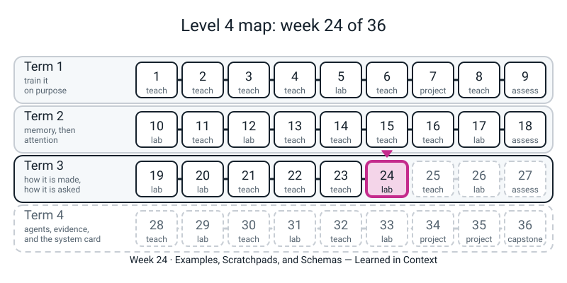
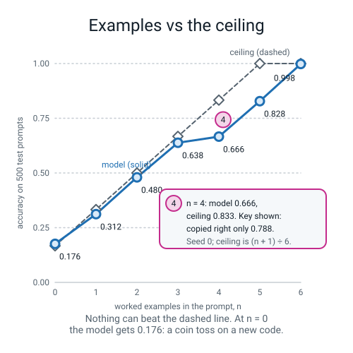
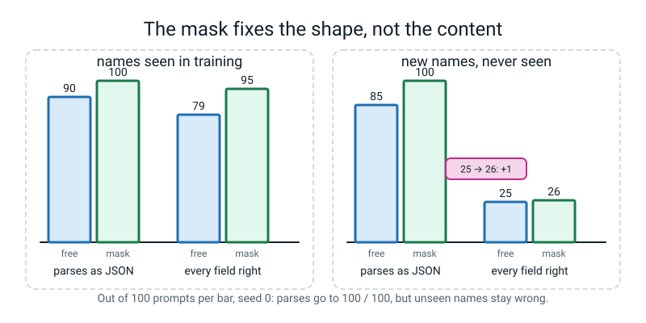

# Week 24 — Examples, Scratchpads, and Schemas: Learned in Context

[⬅ Week 23](week-23.md) · [Course Home](../README.md) · [Week 25 ➡](week-25.md) · [Student Guide](../student-guide/week-24.md) · [Workbook](../workbook/week-24.md)

---


*Figure 24.0 — Week 24 is the sixth lesson of Term 3: what changes when only the prompt changes.*

## 📋 At a Glance

| | |
|---|---|
| **Duration** | 70 minutes in class (about **four minutes of training** sit inside it, three runs: 103 s, 105 s and 30 s), then the workbook (~60-75 min) |
| **Type** | 🟩 Lab — **the first week since Week 19 in which no scripted "model" appears in any measured number.** Last week's stand-in gave examples a bonus because we wrote it to. Today the student trains three small transformers (their own Week 17 `TinyGPT`, unchanged) and measures three claims about prompts on models they own: *examples in the prompt help*, *showing the working helps*, and *a schema guarantees shape, never sense*. |
| **Big idea** | **(1) In-context learning.** A model whose knobs never change after training can still *use the examples in its prompt*, if training showed it thousands of different secret codes. Score it against the **ceiling**: with 6 keys and `n` of them shown, nobody can beat `(n + 1) / 6`. Ours follows that line from `0.176` (0 examples, chance) to `0.638` (3 examples, ceiling `0.667`). **(2) A scratchpad** (writing the working out before the answer) turns a job the model could not learn in 3,000 steps (direct 5-digit addition: exact-match `0.000`, and `0.000` to `0.082` on all five seeds) into one it learns every time (`1.000` on all five). **But the design of the working matters** (a leaner one works on only three seeds of five) **and the direct model is not incapable** (`0.994` after four times the steps). **(3) A logit mask** makes every reply parse (`100` of `100`, against `85` to `90`), **and leaves the content exactly as wrong as it was** (`26` of `100` fully right on names the model never saw). |
| **New vocabulary** | **in-context learning** · **zero-shot / few-shot** ("shot" = one worked example) · **best possible (ceiling)** for a task (met for a dataset in Week 23; today it is computed from the task) · **scratchpad** (working written out before the answer; "chain of thought" in miniature) · **schema** (the shape a reply must have) · **logit** (a score before softmax; the student has called these "scores" since Week 13) · **logit mask / constrained decoding** · **prefix** and **cache key**. (**Teacher forcing** is Week 12's, **seed** and **frozen test set** are Week 23's. Say so and use them.) |
| **New maths** | **None.** The ceiling is a proportion: `n/6` of the time the asked-for key was shown (certain), and `(6-n)/6` of the time it was not, and then it is a 1-in-`(6-n)` guess. `n/6 + (6-n)/6 x 1/(6-n) = (n+1)/6`. Nothing is named "expectation". |
| **New syntax** | `random.Random(seed)` (your own private dice) · `hashlib.sha256` (a fingerprint; `md5` was Week 21) · `torch.where(cond, a, b)` (choose, place by place). That is all three. |
| **Dataset** | **Generated in front of the student.** (a) Secret codes: 6 letters `a`-`f` paired with the digits `0`-`5` in a **fresh random order for every prompt**; (b) five-digit sums, 500 of them held out from training; (c) the 231 typed names from Weeks 8-13 (200 to train on, **31 held back**) and ages 10-40. Nothing downloads. **No internet.** |
| **Model** | **Real models, really trained, no stand-ins** in any number: the Week 17 `TinyGPT`, width 64, 4 heads, 2 blocks: **102,796** knobs (codes), **102,734** (direct addition), **104,078** (addition with working), **108,972** (JSON). They are about 1/8 the size of Week 17's model. **One stand-in** appears, in `cachekey.py`, for a 10-second demonstration of a cache key: `l4lib.fakellm.FakeClient`, labelled **stand-in, not a model**, where it is used and in the output. |
| **Materials** | Laptop with Python 3, torch and matplotlib · the working folder containing `l4lib/` **and the student's own Week 17 `tinygpt.py`** · workbook pages 24.1-24.6 printed · **12 index cards** (`a` to `f`, `0` to `5`) for the Secret Code Game · a timer · scrap paper |
| **Prep time** | 40 minutes the night before · 3 minutes on the day |
| **Expected runtime of the code** | **`incontext_run.py` 103 s** (8,000 steps) · **`scratchpad_run.py` 105 s** (35 s direct + 66 s with working, 3,000 steps each) · **`jsonmask_run.py` 30 s** (26 s of it training) · everything else under 1 s. Teacher-only files take 1.5 to 3.5 minutes each (section 6). All on one CPU thread, the author's machine, run one after another with nothing else running. **If `incontext_run.py` takes over 4 minutes, something is wrong** (see Fallback). |

> **⚠️ Watch out:** the sentence the student will want to leave with is *"examples make models better, scratchpads make models better, and the mask fixes JSON."* **Each of the three is true of today's models and each one needs its small print, which is the lesson.** **(1)** Examples help *a model that was trained on exactly this kind of task*; against the ceiling they help exactly as much as the arithmetic allows, and **a key that was never shown is a guess whatever you do** (`0.181` at one example, ceiling `0.200`). The copying itself is **not even reliable**: it is `1.000` for 1 to 3 examples and `0.788` at 4; the same recipe on five seeds ends with `0.686` to `0.998` at six examples. **(2)** "Direct addition failed" is a statement about **3,000 steps**, not about the model: 12,000 steps gives `0.994`. The scratchpad bought **speed and reliability**, not a capability, and a scratchpad that asks for too much per step fails on two seeds of five. **(3)** The mask guarantees the *grammar you wrote*; Mistake 7 shows a grammar that forgot a JSON rule and still let `"age":02` through. And **nothing a grammar can say** stops `{"name":"ukor",...}` for a child called `zora`. Six of the nine clinic mistakes print no error at all. **The lesson's refrain is Week 23's: one seed is one roll of the die.**

---

## 🎯 Lesson Objectives

By the end of the lesson the student can:

1. **Compute the best possible score before training anything**: `(n + 1) / 6` for `n` = 0 to 6 examples (`0.167, 0.333, 0.500, 0.667, 0.833, 1.000, 1.000`), by the two-case argument, and say what a score **above** it means (noise at 500 prompts: a simulated perfect player scored `0.640` to `0.688` at `n = 3` against `0.667`; or a leak).
2. **Train a model to use examples in its prompt and read the curve**: `incontext_run.py` prints `0.176, 0.312, 0.480, 0.638` at 0, 1, 2, 3 examples; the split into "key was shown" (`1.000`) and "key was not shown" (a guess); the frozen test set's fingerprint (`47d6a3db7a1a`).
3. **Compare direct answers with a scratchpad on the same model size and the same steps**, read the per-character accuracies (direct: `1.0, 0.98, 0.82, 0.11, 0.11, 0.13`), and say why a one-seed comparison is not enough (five seeds: direct `0.000` to `0.082`; working `1.000` x 5; compact working `1.000, 0.090, 0.974, 1.000, 0.000`).
4. **Write a logit mask with `torch.where`** and measure it: parses `100/100` against `90/100` (names seen in training) and `85/100` (names never seen), fully right `95` and `26`, and name the error that survives (**valid, well-shaped, wrong**).
5. **State what a schema does not guarantee**: content, agreement between fields, and that a grammar you wrote is only as good as what you remembered to write.

Observable evidence: `incontext_run.py` printing the ten-row table; the student's hand ceiling column *before* the run; `scratchpad_run.py` printing `exact 0.000` and `exact 1.000`; `jsonmask_run.py` printing `100 100 95` and `100 100 26`; and the student's spoken answer to *"the mask made every reply valid. Is the model better?"*

---

## 🧑‍🏫 What YOU Need to Know First

> **📌 About the code blocks in this guide.** Every block in the **🧰 Prep Checklist** was run, **as the file named at its top, from one working folder** (`python3 constructs.py`, then `cachekey.py`, and so on; `incontext_run.py` imports `icl.py`, `scratchpad_run.py` imports `addlib.py`, `jsonmask_run.py` imports `jsonlib.py` and `grammar.py`), on a CPU, one thread, with the seeds shown. The outputs printed below are the real printed outputs. The whole set was then **run a second time with every printed line identical** (training is deterministic on one machine: same seed, same numbers). Blocks in the **🐞 Debugging Clinic** are **deliberate mistakes**, each marked and each run on its own from the same folder; their tracebacks and odd numbers are real. **On another machine** the loss values and accuracies can differ in the last digit or two, and in a borderline seed the *story* can change (section 7, point 3 is exactly about that): every "this seed gave X" below is this machine, torch 2.2.1, Python 3.10.10. Numbers that come from a teacher-only file are labelled with the file. **Nothing in this guide is copied from a module or from the ledger**: Module 5's 59.4 to 90.6 % few-shot story needed a hosted model, is not reproducible offline, and is replaced by today's measurements.

### 1. What the student is doing today, in one paragraph

Last week the student built a harness around a script and learned to distrust its own table. The script had been *written* to reward examples, so the table could never answer the question *"do examples help a model?"* Today the student answers it on a model they trained. They first play a card game that makes the best possible score obvious (a secret code, `n` pairs shown, one key asked), then **train a small transformer on thousands of random codes**, so that at test time it meets a code it has never seen and must read the answer off the prompt. They plot its accuracy against the hand-computed ceiling. Then they ask a second question with the same tool: can the model add two five-digit numbers if it answers at once, and if it writes its working first? Last, they take a third tiny model that turns `mia 14>` into `{"name":"mia","age":14,"adult":false}.`, let it sample freely, then force it through a **mask** written with `torch.where`, and compare what the mask fixes (every reply parses) with what it cannot (which name, which age). Nothing is scripted and nothing is downloaded. The week is a **lab**: every claim ends in a number the student's own file printed.

### 2. 🔢 The maths you need — none, but one habit of arithmetic

There is no new maths idea this week. The habit to install, carried over from Week 23 and sharpened: **compute the best possible score first, then look at yours.**

- **The ceiling, by hand.** Six keys, six values, a secret code that changes every prompt, `n` pairs shown, then one key asked at random. **Case 1**, the asked key was among the shown ones: this happens `n` times in 6, and the answer is on the page, so a good player is right every time. **Case 2**, it was not: `(6 - n)` times in 6. The `n` values already used are ruled out (the code is a one-to-one pairing), so the answer is one of `6 - n` values, a guess at `1/(6 - n)`. Total: `n/6 x 1 + (6-n)/6 x 1/(6-n) = n/6 + 1/6 = (n + 1)/6`. For `n = 3`: `3/6 + 3/6 x 1/3 = 0.500 + 0.167 = 0.667`. For `n = 0`: `1/6 = 0.167`. For `n = 5`: the one unshown key has one value left: `1.000`. For `n = 6`: `1.000`. **Nothing a model does can beat this line.** A score above it is noise or a leak (point 4).
- **What "above the ceiling" means.** The frozen test has 500 prompts per `n`. `key_icl.py` simulates a *perfect player* on the frozen prompts: `0.178, 0.332, 0.502, 0.680, 0.800, 1.000, 1.000` for `n` = 0 to 6, against the formula's `0.167, 0.333, 0.500, 0.667, 0.833, 1.000, 1.000`. Five fresh sets of 500 at `n = 3` gave `0.666, 0.682, 0.688, 0.640, 0.688`. So a 500-prompt score wobbles by **about two and a half points either way**, and `0.686` for a trained model at `n = 3` (a different, earlier run) is **not** "above the ceiling". Say this before the student sees it. **Do not use the words "standard error" or "binomial"** (Week 33).
- **Chance loss.** A model that knows nothing about a six-way choice has cross-entropy `ln 6 = 1.792` (Week 17's "`ln` of the number of choices"). Mistake 1 sits exactly on it.
- **Carry arithmetic.** Column addition with a carry is Level 1 arithmetic: `1 + 9 = 10` is "write 0, carry 1". The workbook asks the student to do one sum by hand in the *scratchpad's own format*; nothing else is new.

### 3. 🧭 Real vs stand-in — and what you must NOT claim

| Thing | Real or stand-in? |
|---|---|
| The three models (codes, addition, JSON), their training, every loss, accuracy, parse count and fingerprint | **Real.** Trained from scratch on the CPU in front of the student; deterministic for a given seed on one machine. |
| The Week 17 `TinyGPT` | **Real and unchanged** (the student's own `tinygpt.py`). Only the sizes differ: width 64, 2 blocks, 12 to 56 places. |
| `grammar.py` (what may come next in the JSON) | **Real code**, hand-written, deterministic. It is **given to the student to read, not typed**; it is a lookup, not a model. |
| `FakeClient` in `cachekey.py` | **STAND-IN, NOT A MODEL.** It only *counts* tokens so the student can see a cache read. It never reads the prompt. Labelled in its output (`<FakeClient [stand-in, not a model] ...>`). **No number in the lesson's three experiments comes from it.** |
| Module 5's "59.4 → 78.1 → 90.6 %" few-shot story | **Not reproduced and not used.** It needed a hosted model. Today's curve is a different experiment on a different (tiny) model. **Do not quote the module's numbers.** |
| "A real language model behaves like this" | **Not measured.** |

> **Say to the student, out loud:** *"Last week the 'model' was a script. Today there is no script: these are real neural networks, about a hundred thousand knobs each, that you train in a couple of minutes. That makes the results real. It does not make them about ChatGPT. What we measure is what these three small models do on three made-up jobs."*

> **🚫 What you must NOT claim.**
> 1. **"This proves few-shot prompting works on large language models."** It shows that a 2-block transformer **trained on thousands of random codes** can learn to use the pairs in its prompt. A large language model was not trained on this one task family; whether and why it uses examples is **not measured here.**
> 2. **"The model understands addition."** It learned a column-by-column procedure for five-digit numbers. Not tested on six digits, on three, or on anything else.
> 3. **"A scratchpad is how reasoning models think."** Our scratchpad is a format the model was *shown in training* (every training example has its working in it). Nothing here says how any other system comes to show its working.
> 4. **"The direct model can't do addition."** It scored `0.000` at 3,000 steps and `0.994` at 12,000. It could; it had not learned yet.
> 5. **"The scratchpad model shows its reasoning, so its answer is checked."** Mistake 8 and the seed table: on the two failing seeds of the compact scratchpad the model writes a **wrong working and then copies it faithfully into the answer**. A faithful answer to a wrong working is still wrong.
> 6. **"A schema makes the output correct."** It makes it *shaped*.
> 7. **"100% valid JSON means the model is working."** `100 / 100` parsed, `26 / 100` right, on names it had not seen.
> 8. **"`n = 6` at `0.998` means the model always copies."** It is `0.998` for this seed. Section 6 has five seeds.
> 9. **"The cache demo shows how a real service bills."** It shows the word-by-word prefix counting of a labelled script. Real services' rules are not measured here.

### 4. The three new constructs, for somebody who has never seen them

**(a) `random.Random(seed)` — your own private dice.** The student knows `torch.manual_seed(0)` (Weeks 1-23) and numpy's `rng` (Level 3). Python's own `random` module has a *shared* dice (`random.choice(...)`) that nobody seeded, so two runs differ (Mistake 4 prints two different fingerprints for "the same" test set). `random.Random(7)` builds **a dice of your own**: `dice.randint(1, 6)`, `dice.choice("abcdef")`, `dice.sample("abcdef", 2)` (two different ones), `dice.shuffle(a_list)` (**in place**: it returns nothing, the list itself changes). Two `Random(7)` give the same rolls, and **neither disturbs torch's dice** (`constructs.py` (a) proves that). Today's whole design uses it: the test prompts come from `Random(1000 + n)`, training from `Random(seed)`, so **the test and the training never share dice** and the test set is the same on every run. Student says it as: *"a dice with my name on it."*

**(b) `hashlib.sha256(text.encode("utf-8")).hexdigest()[:12]` — a fingerprint.** The student has `hashlib.md5` (Week 21, duplicates) and Week 23's fingerprint of the frozen set; `sha256` is the same idea with a longer hash (64 hex characters, we keep 12). Two uses today: the **test-set fingerprint** `47d6a3db7a1a`, and the **cache key** of a prompt prefix (`cachekey.py`). The idea of the cache key: *the examples are the start of every prompt; if two prompts start with identical text, a service could file the work done on that start under the fingerprint of the start and not repeat it.* What a real service does is **not measured here**; the stand-in only counts tokens by the same rule (section 7, point 7). Do not say "md5 is broken"; say "sha256 is the longer one and it is the one people use for this".

**(c) `torch.where(condition, a, b)` — choose, place by place.** `condition` is a tensor of `True`/`False` (**not** of `0`/`1`: Mistake 5b); where it is `True` take the number from `a`, where `False` from `b`. The logit mask is `torch.where(allowed, scores, -inf)`: every character the grammar forbids gets `-inf`, and the softmax then gives it exactly `0.000`. **This is Week 15's `masked_fill(mask == 0, -inf)` with the choice written out.** `constructs.py` (c) shows both giving the same scores (`True`). Week 22 said `torch.where` "would have fixed Mistake 8"; it is the same tool as the causal mask, aimed at characters instead of future places. Then the one sentence that matters: *the mask is applied **before** the dice are rolled, so the model can never choose a forbidden character, and it has no idea it was stopped.*

> **Order to introduce them:** `Random(seed)` (when `make_prompt` is typed), `sha256` (when the fingerprint line is typed, and again in `cachekey.py` while the model trains), `torch.where` (in `decode`, after reading `grammar.py`), each with a prediction first.

### 5. The other code the student types — nothing new, but note these

- **`[:, 0::2]` and `[:, 1::2]`**: every second place (Level 2 slicing with a step). In `train_model` the places that hold a **key** predict the **value** that follows, so `logits[:, 0::2]` is compared with `x[:, 1::2]`. This is Week 12's "shift by one" done with a step; say so.
- **`F.cross_entropy(..., ignore_index=-100)`** and **`.masked_fill(scored == False, -100)`** (Week 12): only the JSON is scored, not the prompt and not the padding.
- **`torch.optim.lr_scheduler.LambdaLR`** with a warm-up-then-cosine `lambda` (Week 4).
- **Dictionary used as a "have I seen it" list**: `HELD_OUT = {p: True for p in TEST}` and `(a, b) in HELD_OUT` (the student has not met `set`; a dict does the job). Training **skips** any sum that is in the test set.
- **f-string format `{a:05d}`**: "five digits, padded with zeros" (Week 23 used `:5.1f`, `:14s`). Say it once.
- **`json.loads` and `json.JSONDecodeError`** (borrowed in Week 23; same call): a reply "parses" if `json.loads` does not raise.
- **`type(record) is not dict`** (Week 23's choice over `isinstance`).
- **`float("nan")`**: "not a number", printed where there was nothing to average (the `key-shown` cell at `n = 0`).
- **A function defined inside a function** (`mean` inside `evaluate`): read as "a helper only `evaluate` needs".
- **`@torch.no_grad()` written above a function**: the student met it in Week 17's `generate` ("used, not written"). **They copy the line**; writing decorators stays out of scope.
- **`torch.cat(..., dim=1)`** and **`argmax(dim=-1, keepdim=True)`**: Week 12's `cat`; `keepdim=True` keeps the answer as a column so it can be glued on (one sentence).
- **`matplotlib`**: `plt.plot`, `plt.savefig` (Level 2). `MPLBACKEND=Agg` is only needed on a laptop with no display.
- **`import time`** (Week 17); **`from l4lib.names import NAMES`** (Weeks 12-13); **`from l4lib.fakellm import FakeClient`** (Week 23).

**Teacher-only, not shown to the student:** `key_icl.py`, `key_icl_seed.py`, `key_add.py`, `key_json.py` (`sys.argv`, a simulated player, loops over seeds).

**Given, not typed:** `grammar.py` (two short functions; it uses `while`, tuple unpacking and tuples of `(characters, fewest, most)`, all Level 2). The student **reads** it for three minutes and types nothing in it. If the student wants to type it, let them in the workbook.

**Not used today, on purpose:** `json.dumps` (Week 29; the training strings are built by hand), `set` (Week 26), `isinstance` (Week 28), `sys.argv` (except inside the teacher-only `key_*.py` files), `torch.save` (nothing is saved to disk), attention pictures (Week 19 did them), and `transformers`.

### 6. What the numbers will say

These are all printed by the files in the Prep Checklist. Read them before class so nothing surprises you.

- **The constructs (`constructs.py`).** Two `Random(7)` give the same five rolls `[3, 2, 4, 6, 1]`; torch's dice are unmoved by a hundred private rolls (`True`); the fingerprint of `a3b1c0d2` is `4dd9459a127c` twice and `377bc58b5592` when one letter changes; `torch.where` turns scores `[2, 1, 0.5, 3]` with the last two forbidden into `[0.731, 0.269, 0.0, 0.0]`, equal to `masked_fill`.
- **The cache key (`cachekey.py`, stand-in).** The same six example pairs give key `65e96215c33b` for both prompts and `129dbb6d18a0` when one example changes. The stand-in reports the first query as `11` fresh input tokens and `0` read from cache, the second as `1` fresh and `10` read from cache.
- **The codes (`incontext_run.py`, seed 0, 8,000 steps, 103 s).** Frozen test fingerprint `47d6a3db7a1a` (500 prompts for each `n` from 0 to 6). The loss falls `2.550, 1.209, 0.812, 0.728, 0.688, 0.658, 0.656, 0.624, 0.614` and **stays above zero on purpose**: a key that has not appeared cannot be predicted, so the loss has a floor. The table (all / ceiling / key shown / key not shown):

```text
frozen test set fingerprint: 47d6a3db7a1a   prompts per n: 500
  step     0  loss 2.550
  step  1000  loss 1.209
  step  2000  loss 0.812
  step  3000  loss 0.728
  step  4000  loss 0.688
  step  5000  loss 0.658
  step  6000  loss 0.656
  step  7000  loss 0.624
  step  7999  loss 0.614
trained in 102 s
 n  all   ceiling  key-shown  key-unseen
 0  0.176  0.167    nan      0.176
 1  0.312  0.333    1.000      0.181
 2  0.480  0.500    1.000      0.240
 3  0.638  0.667    1.000      0.252
 4  0.666  0.833    0.788      0.474
 5  0.828  1.000    0.854      0.699
 6  0.998  1.000    0.998      nan
saved in_context.png
```

  Read it in four moves. **(i)** `n = 0`: `0.176` against `0.167`; nothing to copy, so nothing beats chance (**a prompt with no examples is a coin toss here, however good the model**). **(ii)** `n = 1, 2, 3`: within `0.03` of the ceiling, and **when the key was shown the model is right `1.000`**, every time. The remaining errors are all on keys that were never shown, where the model is guessing among the `6 - n` unused values and gets `0.181, 0.240, 0.252` against `0.200, 0.250, 0.333`. **(iii)** `n = 4, 5`: the model is now *below* the ceiling, and the column says why: when the key *was* shown it is right only `0.788` and `0.854` of the time, so it is **unreliable at copying when more pairs crowd the page**. We did not investigate why (an attention picture, Week 19's tool, is the obvious next step; the fast student can try it; **this guide did not**). **(iv)** `n = 6`: `0.998`. **Do not teach a mechanism; teach the gap between the two lines.**
- **Other training seeds (`key_icl_seed.py`, 8,000 steps, each ~107 s with five running at once).** All five seeds, accuracy for `n` = 0 to 6:

```text
                     n=0    n=1    n=2    n=3    n=4    n=5    n=6
seed 0  steps 8000  0.176  0.312  0.480  0.638  0.666  0.828  0.998   104 s
seed 1  steps 8000  0.182  0.354  0.498  0.666  0.826  1.000  0.998   103 s
seed 2  steps 8000  0.164  0.330  0.478  0.676  0.770  1.000  0.998   104 s
seed 3  steps 8000  0.158  0.324  0.504  0.630  0.632  0.722  0.686   104 s
seed 4  steps 8000  0.146  0.334  0.480  0.652  0.638  0.808  0.956   104 s
```

  `n = 0` to `3` is the same on all five (`0.146` to `0.182` at zero, `0.630` to `0.676` at three, ceiling `0.667`). **The top of the curve is where seeds disagree**: at six examples the five seeds score `0.998, 0.998, 0.998, 0.686, 0.956`. Seed 3 has not learned to copy reliably in 8,000 steps; it is unfinished training, not a different kind of model. At **5,000 steps** (the fallback, seeds 0, 1, 2) the same code gave:

```text
                     n=0    n=1    n=2    n=3    n=4    n=5    n=6
seed 0  steps 5000  0.156  0.330  0.502  0.686  0.798  0.998  1.000   106 s
seed 1  steps 5000  0.168  0.328  0.486  0.500  0.608  0.762  0.822   105 s
seed 2  steps 5000  0.174  0.320  0.474  0.590  0.552  0.566  0.592   106 s
```

  so **the shorter run is a lottery at `n = 3`** (`0.686, 0.500, 0.590`) and this guide does not recommend it. (It is in the Fallback table only because it saves 40 seconds.)
- **The perfect player (`key_icl.py`).** `0.178, 0.332, 0.502, 0.680, 0.800, 1.000, 1.000` on the frozen prompts; five other draws of 500 prompts at `n = 3`: `0.666, 0.682, 0.688, 0.640, 0.688`.
- **Addition (`scratchpad_run.py`, seed 0, 3,000 steps).** One sum both ways: `04211+00009=004220.` and `04211+00009=19011020202040400000#004220.`. Direct: training loss `2.666, 1.353, 1.119, 1.060`, held-out **exact match `0.000`**, per answer character `[1.0, 0.98, 0.82, 0.11, 0.11, 0.13]` (35 s). With working: loss `2.669` then `0.000` from step 1,000, **exact `1.000`**, every character `1.0` (66 s). Chance for one digit is `0.10`: the last three digits of the direct answer are at **chance**.
- **Five seeds of addition (`key_add.py`, 3,000 steps each; the five seeds of each mode ran 15 at a time, so the seconds below are 2 to 3 times the single-run times above).**

| mode | seed 0 | seed 1 | seed 2 | seed 3 | seed 4 |
|---|:--:|:--:|:--:|:--:|:--:|
| direct | 0.000 | 0.038 | 0.052 | 0.082 | 0.000 |
| with working (copy the two digits, then write digit and carry) | 1.000 | 1.000 | 1.000 | 1.000 | 1.000 |
| compact working (write only digit and carry; the clinic's Mistake 9) | 1.000 | **0.090** | 0.974 | 1.000 | **0.000** |

  And **direct for four times the steps (12,000, seed 0): exact `0.994`**, every character `1.0`.
- **The mask (`jsonmask_run.py`, seed 0, 800 steps, 26 s of training).**

```text
  step     0  loss 3.771
  step   200  loss 0.121
  step   400  loss 0.007
  step   600  loss 0.005
  step   799  loss 0.005
trained in 26 s
names     decoding  parses  right-shape  all-fields-right
seen      free       90      87           79
seen      mask      100     100           95
new       free       85      85           25
new       mask      100     100           26
valid JSON, right shape, still wrong (mask on, names the model never saw):
  bex 16>      -> {"name":"umele","age":40,"adult":true}.    wrong: ['name', 'age', 'adult']
  zora 16>     -> {"name":"ukor","age":16,"adult":false}.    wrong: ['name']
  zaid 19>     -> {"name":"usai","age":16,"adult":true}.     wrong: ['name', 'age']
  gero 40>     -> {"name":"gera","age":40,"adult":true}.     wrong: ['name']
```

  Read it as a 2 x 2. *Free* sampling: `90` and `85` parse (10 to 15 replies are broken JSON); *masked*: `100` and `100`. *Fully right*: `79 → 95` on seen names (the mask lifts parses by 10 and fully-right by 16; we did not look at which replies account for the other 6) and `25 → 26` on names never seen (**the mask does almost nothing for content**). The four examples are all well-formed and wrong: the model has memorised 200 names and does not copy an unfamiliar one letter by letter (`zora` becomes `ukor`). **This is a generalisation failure (Week 5), not a formatting failure, and the mask cannot see it.**
- **The mask over three training seeds (`key_json.py`, ~30 s each).** parses / fully right, out of 100:

```text
seed  names  free: parses / right     mask: parses / right   (out of 100)   seconds
  0   seen       90 /  79              100 /  95
  0   new        85 /  25              100 /  26          39
  1   seen       91 /  79              100 /  93
  1   new        83 /  36              100 /  44          39
  2   seen       91 /  78              100 /  92
  2   new        85 /  46              100 /  45          50
```

  The same picture every time: masked always `100` parses; on new names "fully right" is `26`, `44`, `45` masked against `25`, `36`, `46` free.
- **Clinic numbers.** Mistake 1: loss `1.790` against `ln 6 = 1.792`. Mistake 6: `0` of `100` parse. Mistake 7: `2` of `100` masked replies do not parse. Mistake 8: `1.0` with the true working handed over, `0.09` with the model's own. Mistake 9: `1.000` then `0.090`.


*Figure 24.1 — Accuracy can only follow the ceiling (n + 1) ÷ 6; the model tracks it up to n = 3 and falls short at n = 4 and 5.*


*Figure 24.2 — The grammar mask fixes the shape (parses go to 100) but not the content on names the model never saw (25 to 26).*

### 7. The honest limits of today

1. **Toy models, toy tasks.** 100k knobs, six keys, five digits, one JSON shape. What a frontier model does with examples, with "think step by step", or with a JSON schema is **not measured** and must not be inferred.
2. **The training is tailored to the test.** The in-context model saw thousands of random codes, exactly the family it is tested on. A model trained on text and only *then* shown a code is a different and harder experiment, and **not run here**.
3. **Seeds matter and some of today's conclusions are seed-sensitive.** The top of the in-context curve (`n = 4, 5, 6`), the compact scratchpad, and the fraction of free-sampled JSON that parses all change with the seed. **The class runs seed 0 only.** Two pieces of homework (page 24.2) run more seeds. The headline conclusions (chance at zero, the ceiling at 1 to 3, direct fails at 3,000 steps, working succeeds, the mask parses 100 and fixes no content) **hold on every seed this guide ran** (3 to 5 each).
4. **We did not explain the dip at `n = 4, 5`.** The "key shown" column falls to `0.788` and `0.854`. It may be an attention pattern that has not sharpened; it may be positions. **Unmeasured.**
5. **Direct addition is "not learned yet", not "impossible"** (`0.994` at 12,000 steps). The fair statement is about steps to learn.
6. **The per-character pattern of the direct model differs by seed.** Seed 0 is right on the first three characters and at chance on the last three; seed 2 fails most on the last; seed 3 on the last. The reason is **not investigated**. Do not tell a story about carries.
7. **The cache key is a demonstration of a *name*, not of a service.** The stand-in counts shared leading words (so it treats `query:` as shared because both prompts contain that word); a real service's rules are not measured here. Billing numbers from `FakeClient` are illustrative.
8. **The grammar is small and given.** Real constrained decoding has to handle grammars with recursion and token boundaries; ours is a fixed template over characters.
9. **The names are a weak test of copying.** Half a dozen of the 31 held-out names are short and unusual (`bex`, `pim`). The exact error rate depends on which 31. What generalises is the shape of the result: masked and free are about equally wrong on unfamiliar names.
10. **Masked decoding here is slow and single-sequence.** Each character is a full forward pass; a real system batches and caches. Timing is not a lesson.

### 8. The misconceptions you will actually meet

1. **"More examples is always better."** Up to the ceiling, and no further; a key that was never shown is a guess at any `n`. Beyond that, *this* model's copying got **worse** at `n = 4, 5`.
2. **"Zero examples should work if the model is good."** With a fresh secret code there is nothing to know. The right answer to `n = 0` is `1/6`, for every model.
3. **"`0.686` is above the ceiling, so the model is cheating."** 500 prompts wobble by about two and a half points (section 2). Above-ceiling by more than that would be a leak.
4. **"The model memorised the codes."** The code changes in every prompt (720 possible pairings); the answer is not determined by the question, only by the examples. (Ask: *"what would a memoriser score at `n = 0`?"* Chance.)
5. **"The scratchpad made the model smarter."** It made each step smaller. Direct needs the whole sum in one go; the working needs one column at a time.
6. **"If it wrote its working out, it reasoned."** Mistake 8: faithful copy of a wrong working.
7. **"Direct addition failed, so transformers can't add."** 12,000 steps.
8. **"The mask teaches the model JSON."** The model's knobs do not change. The mask throws away forbidden choices before the dice; the model has no idea.
9. **"If I give the mask a bigger grammar it gets safer."** It gets exactly as safe as the grammar is *correct* (Mistake 7, Mistake 6).
10. **"JSON mode means the data is right."** `26` of `100`.
11. **"The hash is a secret code."** A fingerprint is a short name for a text; you cannot run it backwards and you do not need to.
12. **"`shuffle` returns the shuffled list."** It returns `None` and changes the list in place (`constructs.py` prints the list after).

### 9. How deep to go, and where to stop

Stop at: *"A model can learn to use examples in its prompt, and the best it can do is a line you can compute. Writing the working out can turn an impossible-looking job into a learnable one, if each step is small, and one seed is one roll. A mask forces the shape, never the sense."* Do **not** go into induction heads as a named mechanism (Week 19 deliberately did not), into why chain-of-thought works in large models, into attention to explain the dip, into grammar formalisms (regular expressions, context-free grammars), into KV caches as an algorithm, or into prompt-injection (Week 29).

### 10. 🧭 Where Week 24 sits

```text
   W19  lookup task: the key IS on the page (hit rate 1.00)     W24  the key may or may not be on the page: a ceiling
   W12  teacher forcing: the true previous letter is given      W24  Mistake 8: the true working is given, so it looks perfect
   W17  TinyGPT (807k)                                          W24  the same class, 1/8 the size, three jobs
   W15  masked_fill(... == 0, -inf): the causal mask            W24  torch.where: the same move, aimed at forbidden letters
   W21  md5 to catch duplicates                                 W24  sha256 to name a prompt prefix (a cache key)
   W23  the stand-in gave examples +0.08 each, by design        W24  a real model gives examples what the task allows
   W23  one seed, one roll (31.2% to 59.4%)                     W24  five seeds: compact working 1.000 ... 0.000
                                                                     |
                                                               W25  embeddings: geometry for meaning
                                                               W26  RAG: retrieve, cite, refuse (the prompt is filled by a search)
                                                               W28  tools and the loop; W29 the prompt grows with every turn
                                                               W31  LoRA: changing a few knobs instead of the prompt
```

---

## 🧰 Prep Checklist

### 40 minutes the night before

- [ ] **Confirm the stack and the folder.** The lesson imports `l4lib` (names, and the stand-in for one demonstration) **and your student's own Week 17 `tinygpt.py`**, so run everything from one working folder that contains both:

```bash
python3 -c "import torch; print(torch.__version__, torch.get_num_threads())"
python3 -c "from l4lib.names import NAMES; print(len(NAMES))"
python3 -c "from tinygpt import TinyGPT; print('TinyGPT ok')"
```

You should see:

```text
2.2.1 10
231
TinyGPT ok
```

(The first number is your torch version and your thread count; every file below calls `torch.set_num_threads(1)` itself, so the thread count printed here does not matter.) **If `tinygpt.py` is missing**, copy the student's Week 17 file into the folder. If it is missing altogether, the file is the one printed as "File 1" in the Week 17 teacher guide (`Block` and `TinyGPT`, unchanged; **do not edit it**). `pip` returning 403 is expected and not an error; nothing this week installs anything.

- [ ] **Type the files below into one working folder.** Each begins with a `#` comment naming it. **Run them in order:** `constructs.py` and `cachekey.py` stand alone; `incontext_run.py` imports `icl.py`; `scratchpad_run.py` imports `addlib.py`; `jsonmask_run.py` imports `jsonlib.py`, which imports `grammar.py`. Set `MPLBACKEND=Agg` if the laptop has no display.

**File 1 — `constructs.py`** (the three new constructs, on toys small enough to read)

```python
# constructs.py - Week 24: the three new constructs, each on a toy small enough to read.
import hashlib
import random
import torch

# (a) random.Random(seed): a private dice. Two of them with the same seed roll the same numbers,
#     and neither touches torch's seed or anybody else's dice.
dice = random.Random(7)
print("roll five      :", [dice.randint(1, 6) for _ in range(5)])
twin = random.Random(7)
print("twin, same five:", [twin.randint(1, 6) for _ in range(5)])
torch.manual_seed(0)
expected = torch.rand(2)                                           # torch's own two numbers, with nothing in between
torch.manual_seed(0)
first = torch.rand(1)
_ = [random.Random(7).randint(1, 6) for _ in range(100)]          # a hundred rolls of a private dice ...
second = torch.rand(1)
print("torch unmoved  :", first.item() == expected[0].item() and second.item() == expected[1].item())   # ... did not disturb torch
letters = list("abcdef")
random.Random(3).shuffle(letters)                                  # shuffle changes the list IN PLACE
print("shuffled       :", letters)
print("choice, sample :", random.Random(3).choice("abcdef"), random.Random(3).sample("abcdef", 2))

# (b) hashlib.sha256: text in, a fixed-length fingerprint out. Same text, same fingerprint; one letter changed, a different one.
def fingerprint(text):
    return hashlib.sha256(text.encode("utf-8")).hexdigest()[:12]

print("fingerprint 1  :", fingerprint("a3b1c0d2"))
print("same text      :", fingerprint("a3b1c0d2"))
print("one letter off :", fingerprint("a3b1c0d3"))
print("length of full :", len(hashlib.sha256(b"x").hexdigest()), "hex characters; we keep 12")

# (c) torch.where(condition, a, b): for every place, take a where the condition is True, b where it is False.
scores = torch.tensor([2.0, 1.0, 0.5, 3.0])
allowed = torch.tensor([True, True, False, False])
print("plain softmax  :", [round(p, 3) for p in torch.softmax(scores, dim=0).tolist()])
masked = torch.where(allowed, scores, torch.tensor(float("-inf")))
print("masked scores  :", masked.tolist())
print("masked softmax :", [round(p, 3) for p in torch.softmax(masked, dim=0).tolist()])
print("same as Wk 15  :", torch.equal(masked, scores.masked_fill(allowed == False, float("-inf"))))
```

```text
roll five      : [3, 2, 4, 6, 1]
twin, same five: [3, 2, 4, 6, 1]
torch unmoved  : True
shuffled       : ['a', 'c', 'd', 'f', 'e', 'b']
choice, sample : b ['b', 'e']
fingerprint 1  : 4dd9459a127c
same text      : 4dd9459a127c
one letter off : 377bc58b5592
length of full : 64 hex characters; we keep 12
plain softmax  : [0.232, 0.085, 0.052, 0.631]
masked scores  : [2.0, 1.0, -inf, -inf]
masked softmax : [0.731, 0.269, 0.0, 0.0]
same as Wk 15  : True
```

Read the second line again: the twin dice give the same five rolls. Read `torch unmoved`: a hundred rolls of a private dice did not disturb torch's own random numbers. `shuffled` shows the list **after** `shuffle` changed it in place.

**File 2 — `cachekey.py`** (a fingerprint of a prompt's start; the second half uses the **stand-in**, which only counts tokens)

```python
# cachekey.py - Week 24: the examples are a PREFIX. A fingerprint of the prefix is the name a service could file its work under.
# STAND-IN, NOT A MODEL: FakeClient only counts tokens; it does not read the prompt.
import hashlib
from l4lib.fakellm import FakeClient


def cache_key(prefix):
    return hashlib.sha256(prefix.encode("utf-8")).hexdigest()[:12]


examples = "a3 b1 c0 d2 e5 f4 "
print("prompt 1 prefix key:", cache_key(examples))
print("prompt 2 prefix key:", cache_key(examples), " <- same examples, same key")
print("one example edited :", cache_key("a3 b1 c0 d2 e5 f5 "))

client = FakeClient(seed=0)
for query in ("query: c", "query: f"):
    r = client.messages.create(model="fake-small", max_tokens=20, system="",
                               messages=[{"role": "user", "content": examples + query}])
    u = r.usage
    print(f"{query}: fresh input tokens {u.input_tokens}, read from cache {u.cache_read_input_tokens}")
print(client)
```

```text
prompt 1 prefix key: 65e96215c33b
prompt 2 prefix key: 65e96215c33b  <- same examples, same key
one example edited : 129dbb6d18a0
query: c: fresh input tokens 11, read from cache 0
query: f: fresh input tokens 1, read from cache 10
<FakeClient [stand-in, not a model] seed=0 calls=2>
```

`FakeClient()` has its prefix cache **on** here (Week 23 turned it off so that a longer prompt visibly cost more). The second query shares the first ten tokens' worth of words with the first (the six pairs *and* the word `query:`), so the stand-in reports `10` read from cache and `1` fresh. **It is a stand-in that counts shared leading words; it does not read anything.**

**File 3 — `icl.py`** (the in-context experiment's library: the data, the training, the scoring; it prints nothing)

```python
# icl.py - Week 24: everything for the in-context experiment. It prints nothing; other files import it.
import hashlib
import math
import random
import torch
import torch.nn.functional as F
from tinygpt import TinyGPT                       # YOUR Week 17 file, unchanged

torch.set_num_threads(1)

KEYS, VALS = "abcdef", "012345"                   # six keys, six values
CHARS = KEYS + VALS
stoi = {c: i for i, c in enumerate(CHARS)}
K = len(KEYS)
PAIRS = 12                                        # a training stream is 12 pairs: 24 characters


def new_table(rng):
    vals = list(VALS)
    rng.shuffle(vals)                             # a fresh secret code for every prompt
    return dict(zip(KEYS, vals))


def stream(rng):
    """Training text: 12 pairs about ONE secret table. Keys repeat, so a value is guessable once its key has been seen."""
    table = new_table(rng)
    return "".join(k + table[k] for k in [rng.choice(KEYS) for _ in range(PAIRS)])


def make_prompt(rng, n):
    """n different example pairs, then one query key. Returns (prompt, right answer, was the query key shown?)."""
    table = new_table(rng)
    shown = rng.sample(KEYS, n)
    query = rng.choice(KEYS)
    return "".join(k + table[k] for k in shown) + query, table[query], query in shown


TEST = {}
for n in range(K + 1):
    rng = random.Random(1000 + n)                 # one private dice per n: the test never shares dice with training
    TEST[n] = [make_prompt(rng, n) for _ in range(500)]
TEST_FINGERPRINT = hashlib.sha256(repr(TEST).encode("utf-8")).hexdigest()[:12]


def train_model(seed, steps, batch=64, log_every=0, lr=2e-3):
    torch.manual_seed(seed)
    rng = random.Random(seed)                     # the training dice: different from every test dice
    model = TinyGPT(len(CHARS), 64, 4, 2, 2 * PAIRS)
    opt = torch.optim.AdamW(model.parameters(), lr=lr)
    sched = torch.optim.lr_scheduler.LambdaLR(opt, lambda s: min(1, (s + 1) / 200) * 0.5 * (1 + math.cos(math.pi * s / steps)))
    for step in range(steps):
        x = torch.tensor([[stoi[c] for c in stream(rng)] for _ in range(batch)])       # (64, 24)
        logits, _ = model(x)
        guess = logits[:, 0::2]                   # the places that hold a KEY predict the character after it: a value
        truth = x[:, 1::2]
        loss = F.cross_entropy(guess.reshape(-1, len(CHARS)), truth.reshape(-1))
        opt.zero_grad()
        loss.backward()
        opt.step()
        sched.step()
        if log_every and (step % log_every == 0 or step == steps - 1):
            print(f"  step {step:5d}  loss {loss.item():.3f}")
    return model


@torch.no_grad()
def evaluate(model, n):
    """Accuracy on the frozen prompts with n examples: (all, query was shown, query was not shown)."""
    cases = TEST[n]
    x = torch.tensor([[stoi[c] for c in p] for p, a, shown in cases])
    logits, _ = model(x)
    said = logits[:, -1].argmax(dim=-1)
    right = [int(said[i]) == stoi[a] for i, (p, a, shown) in enumerate(cases)]
    on_shown = [r for r, (p, a, shown) in zip(right, cases) if shown]
    on_unseen = [r for r, (p, a, shown) in zip(right, cases) if not shown]
    def mean(v):
        return sum(v) / len(v) if v else float("nan")
    return mean(right), mean(on_shown), mean(on_unseen)


def ceiling(n):
    """Best any player could do: copy when the key was shown, guess among the K - n unused values otherwise."""
    return 1.0 if n >= K else (n + 1) / K
```

**File 4 — `incontext_run.py`** (train, then score with 0 to 6 examples and plot; **103 s on the author's CPU**)

```python
# incontext_run.py - Week 24: train, then measure accuracy with 0 ... 6 examples in the prompt. (CPU, one thread.)
import time
import matplotlib.pyplot as plt
from icl import TEST, TEST_FINGERPRINT, train_model, evaluate, ceiling, K

print("frozen test set fingerprint:", TEST_FINGERPRINT, "  prompts per n:", len(TEST[0]))
t0 = time.time()
model = train_model(seed=0, steps=8000, log_every=1000)
print(f"trained in {time.time() - t0:.0f} s")

print(" n  all   ceiling  key-shown  key-unseen")
alls = []
for n in range(K + 1):
    a, s, u = evaluate(model, n)
    alls.append(a)
    print(f"{n:2d}  {a:.3f}  {ceiling(n):.3f}    {s:.3f}      {u:.3f}")

plt.plot(range(K + 1), [ceiling(n) for n in range(K + 1)], "k--", label="best possible")
plt.plot(range(K + 1), alls, "o-", label="your model")
plt.xlabel("examples in the prompt")
plt.ylabel("accuracy")
plt.legend()
plt.savefig("in_context.png")
print("saved in_context.png")
```

```text
frozen test set fingerprint: 47d6a3db7a1a   prompts per n: 500
  step     0  loss 2.550
  step  1000  loss 1.209
  step  2000  loss 0.812
  step  3000  loss 0.728
  step  4000  loss 0.688
  step  5000  loss 0.658
  step  6000  loss 0.656
  step  7000  loss 0.624
  step  7999  loss 0.614
trained in 102 s
 n  all   ceiling  key-shown  key-unseen
 0  0.176  0.167    nan      0.176
 1  0.312  0.333    1.000      0.181
 2  0.480  0.500    1.000      0.240
 3  0.638  0.667    1.000      0.252
 4  0.666  0.833    0.788      0.474
 5  0.828  1.000    0.854      0.699
 6  0.998  1.000    0.998      nan
saved in_context.png
```

It also writes `in_context.png`: the dashed line is the ceiling, the dots are the model. **Sanity checks before class:** the fingerprint is `47d6a3db7a1a` (if it differs, `make_prompt`, `KEYS`/`VALS` or the seeds `1000 + n` differ from this file); `nan` in the `key-shown` column at `n = 0` and in `key-unseen` at `n = 6` is **correct** (there was nothing to average: at zero examples no key is ever shown, at six every key is); `n = 0` is near `0.167` whatever the model.

**File 5 — `addlib.py`** (five-digit addition written two ways, and the trainer; it prints nothing)

```python
# addlib.py - Week 24: five-digit addition written two ways, and a trainer for each. It prints nothing; other files import it.
import math
import random
import torch
import torch.nn.functional as F
from tinygpt import TinyGPT

torch.set_num_threads(1)

ND = 5                                               # digits per number
CHARS = "0123456789+=#."
stoi = {c: i for i, c in enumerate(CHARS)}
itos = {i: c for c, i in stoi.items()}


def question(a, b):
    return f"{a:05d}+{b:05d}="                                  # 00042+00917=  (:05d = five digits, padded with zeros)


def working(a, b, mode="pad"):
    """The scratchpad, one column at a time, right to left. mode "pad": copy the two digits, then write (digit, carry): 7521.
    mode "pad_short" (the mistake in the clinic): skip the copy and write only (digit, carry): 21."""
    da, db = f"{a:05d}", f"{b:05d}"
    carry, out = 0, ""
    for i in range(ND - 1, -1, -1):
        total = int(da[i]) + int(db[i]) + carry
        out += (da[i] + db[i] if mode == "pad" else "") + str(total % 10) + str(total // 10)
        carry = total // 10
    return out


def answer(a, b):
    return f"{a + b:06d}"                                           # six characters: 000959


def full_text(a, b, mode):
    if mode != "direct":
        return question(a, b) + working(a, b, mode) + "#" + answer(a, b) + "."
    return question(a, b) + answer(a, b) + "."


def make_test(count=500):
    rng = random.Random(2024)
    pairs = {}                                       # a dict, used as a set: have we got this pair already?
    while len(pairs) < count:
        pairs[(rng.randrange(10 ** ND), rng.randrange(10 ** ND))] = True
    return list(pairs)


TEST = make_test()
HELD_OUT = {p: True for p in TEST}


def train_adder(mode, seed, steps, batch=64, log_every=0, lr=2e-3):
    torch.manual_seed(seed)
    rng = random.Random(seed)
    length = len(full_text(0, 0, mode))
    start = len(question(0, 0))
    model = TinyGPT(len(CHARS), 64, 4, 2, length)
    opt = torch.optim.AdamW(model.parameters(), lr=lr)
    sched = torch.optim.lr_scheduler.LambdaLR(opt, lambda s: min(1, (s + 1) / 200) * 0.5 * (1 + math.cos(math.pi * s / steps)))
    for step in range(steps):
        rows = []
        while len(rows) < batch:
            a, b = rng.randrange(10 ** ND), rng.randrange(10 ** ND)
            if (a, b) in HELD_OUT:
                continue                              # never train on a test sum
            rows.append([stoi[c] for c in full_text(a, b, mode)])
        x = torch.tensor(rows)
        logits, _ = model(x)
        guess = logits[:, start - 1:-1]              # places that come BEFORE the working/answer predict it
        truth = x[:, start:]                         # the question itself is given, so it is not scored
        loss = F.cross_entropy(guess.reshape(-1, len(CHARS)), truth.reshape(-1))
        opt.zero_grad()
        loss.backward()
        opt.step()
        sched.step()
        if log_every and (step % log_every == 0 or step == steps - 1):
            print(f"  [{mode}] step {step:5d}  loss {loss.item():.3f}")
    return model


@torch.no_grad()
def solve(model, a, b, mode):
    """Greedy: at every step write the single most likely next character."""
    length = len(full_text(a, b, mode))
    idx = torch.tensor([[stoi[c] for c in question(a, b)]])
    while idx.shape[1] < length:
        logits, _ = model(idx)
        idx = torch.cat([idx, logits[:, -1].argmax(dim=-1, keepdim=True)], dim=1)
    return "".join(itos[i] for i in idx[0].tolist())


def read_answer(text, mode):
    tail = text.split("#")[-1] if mode != "direct" else text[len(question(0, 0)):]
    return tail.rstrip(".")


def score(model, mode):
    """(exact-match accuracy, accuracy of each of the six answer characters)."""
    exact, per_place = 0, [0] * (ND + 1)
    for a, b in TEST:
        got = read_answer(solve(model, a, b, mode), mode)
        want = answer(a, b)
        exact += got == want
        for i in range(ND + 1):
            per_place[i] += i < len(got) and got[i] == want[i]
    return exact / len(TEST), [p / len(TEST) for p in per_place]
```

**File 6 — `scratchpad_run.py`** (same model size, same 3,000 steps: answer straight away, or write the working first; **35 s + 66 s on the author's CPU**)

```python
# scratchpad_run.py - Week 24: the same sums, the same model size, the same number of steps: answer straight away, or show the working first.
import time
from addlib import TEST, question, working, answer, full_text, train_adder, solve, score

print("one sum, both ways:")
print("  direct :", full_text(4211, 9, "direct"))
print("  pad    :", full_text(4211, 9, "pad"))
print("held-out sums:", len(TEST))

for mode in ("direct", "pad"):
    t0 = time.time()
    model = train_adder(mode, seed=0, steps=3000, log_every=1000)
    secs = time.time() - t0
    exact, per_place = score(model, mode)
    print(f"{mode:6s}: exact {exact:.3f}   per answer character {[round(p, 2) for p in per_place]}   ({secs:.0f} s)")
    a, b = TEST[0]
    print(f"        {a} + {b} = {a + b};  the model wrote: {solve(model, a, b, mode)}")
```

```text
one sum, both ways:
  direct : 04211+00009=004220.
  pad    : 04211+00009=19011020202040400000#004220.
held-out sums: 500
  [direct] step     0  loss 2.666
  [direct] step  1000  loss 1.353
  [direct] step  2000  loss 1.119
  [direct] step  2999  loss 1.060
direct: exact 0.000   per answer character [1.0, 0.98, 0.82, 0.11, 0.11, 0.13]   (35 s)
        61615 + 23816 = 85431;  the model wrote: 61615+23816=085791.
  [pad] step     0  loss 2.669
  [pad] step  1000  loss 0.000
  [pad] step  2000  loss 0.000
  [pad] step  2999  loss 0.000
pad   : exact 1.000   per answer character [1.0, 1.0, 1.0, 1.0, 1.0, 1.0]   (66 s)
        61615 + 23816 = 85431;  the model wrote: 61615+23816=56111130684113506280#085431.
```

`working` for `4211 + 9`: read it as five columns, right to left, four characters each: `1901` (digits `1` and `9`, write `0`, carry `1`), `1020` (`1` and `0` plus the carry: write `2`, carry `0`), `2020`, `4040`, `0000`. The answer is the digits written, read right to left, after the final carry: `004220`. **The example printed for the model is held-out sum `TEST[0]`**: the model wrote `085791.` for `85431` (direct) and the right answer (with working) after a working of its own.

**File 7 — `grammar.py`** (**given to the student to read, not typed**: which characters may come next)

```python
# grammar.py - Week 24 (GIVEN: read it, do not type it). Which characters may come next in
#   {"name":"mia","age":14,"adult":false}.
# A pattern is a list of pieces (allowed characters, fewest, most). The function walks every pattern at once.
LETTERS = "abcdefghijklmnopqrstuvwxyz"
DIGITS = "0123456789"
NONZERO = "123456789"                        # JSON does not allow a number like 02, so the first digit is never 0


def lit(s):
    return [(c, 1, 1) for c in s]            # a piece that allows exactly one character, once


HEAD = lit('{"name":"') + [(LETTERS, 1, 8)] + lit('","age":') + [(NONZERO, 1, 1), (DIGITS, 1, 1)] + lit(',"adult":')
PATTERNS = [HEAD + lit("true}."), HEAD + lit("false}.")]


def spots_after(pattern, text):
    """Every (piece, characters used in it) the text could have reached. Empty list = the text already broke the pattern."""
    spots = [(0, 0)]
    for ch in text:
        new = []
        for piece, used in spots:
            while piece < len(pattern):
                chars, lo, hi = pattern[piece]
                if ch in chars and used < hi and (piece, used + 1) not in new:
                    new.append((piece, used + 1))          # the character belongs to this piece
                if used >= lo:
                    piece, used = piece + 1, 0             # this piece is full enough: try the next one
                else:
                    break
        spots = new
    return spots


def allowed_after(text):
    """A string holding every character that may legally come next."""
    out = ""
    for pattern in PATTERNS:
        for piece, used in spots_after(pattern, text):
            while piece < len(pattern):
                chars, lo, hi = pattern[piece]
                if used < hi:
                    out += chars
                if used >= lo:
                    piece, used = piece + 1, 0
                else:
                    break
    return out
```

Check it alone before class:

```python
# check_grammar.py - Week 24: what the grammar allows after a few prefixes. Not a lesson file; your sanity check.
from grammar import allowed_after

for text in ['', '{"name":"mi', '{"name":"mia"', '{"name":"mia","age":0', '{"name":"mia","age":1', '{"name":"mia","age":14,"adult":', '{"name":"mia","age":14,"adult":tr', '{"name":"mia","age":14,"adult":true}.']:
    print(repr(text[-14:]).ljust(18), repr("".join(sorted(set(allowed_after(text))))))
```

```text
''                 '{'
'{"name":"mi'      '"abcdefghijklmnopqrstuvwxyz'
'{"name":"mia"'    ','
':"mia","age":0'   ''
':"mia","age":1'   '0123456789'
'e":14,"adult":'   'ft'
':14,"adult":tr'   'u'
'"adult":true}.'   ''
```

(The long line after `mi` is the 26 letters plus the closing quote, which sorts first. `age":0` allows nothing: **the first digit of an age is never `0`**, because JSON forbids `02`. That is the rule Mistake 7 forgets.)

**File 8 — `jsonlib.py`** (the third model: data, training, sampling with or without the mask, and the judge; it prints nothing)

```python
# jsonlib.py - Week 24: teach a TinyGPT to turn "mia 14>" into {"name":"mia","age":14,"adult":false}. and decode it with or without a mask.
import json
import math
import random
import torch
import torch.nn.functional as F
from tinygpt import TinyGPT
from l4lib.names import NAMES
from grammar import allowed_after

torch.set_num_threads(1)

CHARS = "".join(sorted(set("abcdefghijklmnopqrstuvwxyz0123456789 >{}\":,.")))
stoi = {c: i for i, c in enumerate(CHARS)}
TRAIN_NAMES, NEW_NAMES = NAMES[:200], NAMES[200:]          # 31 names the model never sees in training
T = 56


def prompt_of(name, age):
    return f"{name} {age}>"


def target_of(name, age):
    adult = "true" if age >= 18 else "false"
    return '{"name":"' + name + '","age":' + str(age) + ',"adult":' + adult + "}."


def train_json(seed, steps, batch=64, log_every=0):
    torch.manual_seed(seed)
    rng = random.Random(seed)
    model = TinyGPT(len(CHARS), 64, 4, 2, T)
    opt = torch.optim.AdamW(model.parameters(), lr=2e-3)
    sched = torch.optim.lr_scheduler.LambdaLR(opt, lambda s: min(1, (s + 1) / 100) * 0.5 * (1 + math.cos(math.pi * s / steps)))
    for step in range(steps):
        x = torch.zeros(batch, T, dtype=torch.long)
        scored = torch.zeros(batch, T, dtype=torch.bool)
        for b in range(batch):
            name, age = rng.choice(TRAIN_NAMES), rng.randint(10, 40)
            p = prompt_of(name, age)
            text = p + target_of(name, age)
            x[b, :len(text)] = torch.tensor([stoi[c] for c in text])
            scored[b, len(p):len(text)] = True                 # score only the JSON, not the prompt and not the padding
        logits, _ = model(x)
        truth = x[:, 1:].masked_fill(scored[:, 1:] == False, -100)
        loss = F.cross_entropy(logits[:, :-1].reshape(-1, len(CHARS)), truth.reshape(-1), ignore_index=-100)
        opt.zero_grad()
        loss.backward()
        opt.step()
        sched.step()
        if log_every and (step % log_every == 0 or step == steps - 1):
            print(f"  step {step:5d}  loss {loss.item():.3f}")
    return model


@torch.no_grad()
def decode(model, prompt, mask, gen):
    """Sample one reply, one character at a time. With mask=True, characters the grammar forbids get -inf before the softmax."""
    idx = torch.tensor([[stoi[c] for c in prompt]])
    reply = ""
    while len(prompt) + len(reply) < T:
        logits, _ = model(idx)
        last = logits[0, -1]
        if mask:
            ok = allowed_after(reply)
            if ok == "":
                break                                            # the grammar says the reply is complete
            allow = torch.tensor([c in ok for c in CHARS])
            last = torch.where(allow, last, torch.tensor(float("-inf")))
        nxt = torch.multinomial(F.softmax(last, dim=-1), 1, generator=gen).item()
        reply += CHARS[nxt]
        idx = torch.cat([idx, torch.tensor([[nxt]])], dim=1)
        if CHARS[nxt] == ".":
            break
    return reply


def judge(reply, name, age):
    """Returns (parses as JSON?, has the three keys?, the wrong fields)."""
    try:
        record = json.loads(reply.rstrip("."))
    except json.JSONDecodeError:
        return False, False, []
    if type(record) is not dict or sorted(record) != ["adult", "age", "name"]:
        return True, False, []
    wrong = []
    if record["name"] != name:
        wrong.append("name")
    if record["age"] != age:
        wrong.append("age")
    if record["adult"] != (age >= 18):
        wrong.append("adult")
    return True, True, wrong
```

**File 9 — `jsonmask_run.py`** (train 800 steps; then 100 questions each, free and masked, on seen and unseen names; **30 s on the author's CPU**)

```python
# jsonmask_run.py - Week 24: free sampling vs a grammar mask. The mask can fix the SHAPE. Can it fix the CONTENT?
import random
import time
import torch
from jsonlib import train_json, decode, judge, prompt_of, TRAIN_NAMES, NEW_NAMES

t0 = time.time()
model = train_json(seed=0, steps=800, log_every=200)
print(f"trained in {time.time() - t0:.0f} s")

print("names     decoding  parses  right-shape  all-fields-right")
examples = []
for label, names in (("seen", TRAIN_NAMES), ("new ", NEW_NAMES)):
    for mask in (False, True):
        gen = torch.Generator().manual_seed(5)          # the same dice for every row
        rng = random.Random(77)                         # the same 100 questions for every row
        parses = shaped = right = 0
        for _ in range(100):
            name, age = rng.choice(names), rng.randint(10, 40)
            reply = decode(model, prompt_of(name, age), mask, gen)
            ok_parse, ok_shape, wrong = judge(reply, name, age)
            parses += ok_parse
            shaped += ok_shape
            right += ok_shape and wrong == []
            if mask and ok_shape and wrong and len(examples) < 4 and label == "new ":
                examples.append((prompt_of(name, age), reply, wrong))
        print(f"{label}      {'mask' if mask else 'free':4s}      {parses:3d}     {shaped:3d}          {right:3d}")

print("valid JSON, right shape, still wrong (mask on, names the model never saw):")
for p, reply, wrong in examples:
    print(f"  {p:12s} -> {reply:42s} wrong: {wrong}")
```

```text
  step     0  loss 3.771
  step   200  loss 0.121
  step   400  loss 0.007
  step   600  loss 0.005
  step   799  loss 0.005
trained in 26 s
names     decoding  parses  right-shape  all-fields-right
seen      free       90      87           79
seen      mask      100     100           95
new       free       85      85           25
new       mask      100     100           26
valid JSON, right shape, still wrong (mask on, names the model never saw):
  bex 16>      -> {"name":"umele","age":40,"adult":true}.    wrong: ['name', 'age', 'adult']
  zora 16>     -> {"name":"ukor","age":16,"adult":false}.    wrong: ['name']
  zaid 19>     -> {"name":"usai","age":16,"adult":true}.     wrong: ['name', 'age']
  gero 40>     -> {"name":"gera","age":40,"adult":true}.     wrong: ['name']
```

- [ ] **Teacher-only files** (do **not** show the student; they give the spread and the hand numbers). Type them once and run them the night before if you have the time: `key_icl.py` (1 s), then `key_icl_seed.py SEED [STEPS]` (about 107 s each, five at once), `key_json.py` (about 95 s) and `key_add.py MODE SEED STEPS` (one training per command).

**File T1 — `key_icl.py`** (the best-possible player, simulated)

```python
# key_icl.py - Week 24 (TEACHER-ONLY): the best-possible player, simulated, and the spread over training seeds. Nothing here is new teaching.
import random
from icl import TEST, K, VALS, ceiling, make_prompt


def perfect_player(prompt, rng):
    """Copy when the query key was shown; otherwise guess uniformly among the values not yet used."""
    n = (len(prompt) - 1) // 2
    shown = {prompt[2 * i]: prompt[2 * i + 1] for i in range(n)}
    query = prompt[-1]
    if query in shown:
        return shown[query]
    unused = [v for v in VALS if v not in shown.values()]
    return rng.choice(unused)


print(" n  ceiling  perfect player on the frozen prompts")
rng = random.Random(0)
for n in range(K + 1):
    hits = sum(perfect_player(p, rng) == a for p, a, shown in TEST[n])
    print(f"{n:2d}   {ceiling(n):.3f}   {hits / len(TEST[n]):.3f}")

print("\nperfect player, five different dice for the 500 prompts at n = 3 (so what is one run worth?):")
scores = []
for s in range(5):
    r = random.Random(100 + s)
    cases = [make_prompt(r, 3) for _ in range(500)]
    scores.append(sum(perfect_player(p, r) == a for p, a, shown in cases) / 500)
print("  ", [round(x, 3) for x in scores], " ceiling 0.667")


print("\nthe ceiling split: when the key was shown the best player is right every time; when it was not, it guesses among the unused values:")
print("  n   unseen-key ceiling 1/(6-n)   whole ceiling (n+1)/6 = n/6 x 1 + (6-n)/6 x 1/(6-n)")
for n in range(K):
    print(f"  {n}        {1 / (K - n):.3f}                      {(n + 1) / K:.3f}")
```

```text
 n  ceiling  perfect player on the frozen prompts
 0   0.167   0.178
 1   0.333   0.332
 2   0.500   0.502
 3   0.667   0.680
 4   0.833   0.800
 5   1.000   1.000
 6   1.000   1.000

perfect player, five different dice for the 500 prompts at n = 3 (so what is one run worth?):
   [0.666, 0.682, 0.688, 0.64, 0.688]  ceiling 0.667

the ceiling split: when the key was shown the best player is right every time; when it was not, it guesses among the unused values:
  n   unseen-key ceiling 1/(6-n)   whole ceiling (n+1)/6 = n/6 x 1 + (6-n)/6 x 1/(6-n)
  0        0.167                      0.167
  1        0.200                      0.333
  2        0.250                      0.500
  3        0.333                      0.667
  4        0.500                      0.833
  5        1.000                      1.000
```

**File T2 — `key_icl_seed.py`** (one training seed of the in-context model; run it for `SEED` = 0 to 4)

```python
# key_icl_seed.py - Week 24 (TEACHER-ONLY): one training seed of the in-context model. python3 key_icl_seed.py SEED [STEPS]
import sys
import time
from icl import train_model, evaluate

seed = int(sys.argv[1])
steps = int(sys.argv[2]) if len(sys.argv) > 2 else 8000
t0 = time.time()
model = train_model(seed=seed, steps=steps)
row = [evaluate(model, n)[0] for n in range(7)]
print(f"seed {seed}  steps {steps}  " + "  ".join(f"{x:.3f}" for x in row) + f"   {time.time() - t0:.0f} s")
```

```bash
for s in 0 1 2 3 4; do python3 key_icl_seed.py $s & done; wait          # five at once: ~107 s each
for s in 0 1 2; do python3 key_icl_seed.py $s 5000 & done; wait          # the 5,000-step fallback
```

**File T3 — `key_add.py`** (one addition training per command line)

```python
# key_add.py - Week 24 (TEACHER-ONLY): one training run per command line. python3 key_add.py MODE SEED STEPS
import sys
import time
from addlib import train_adder, score

mode, seed, steps = sys.argv[1], int(sys.argv[2]), int(sys.argv[3])
t0 = time.time()
model = train_adder(mode, seed, steps)
exact, per_place = score(model, mode)
print(f"{mode:9s} seed {seed}  steps {steps:5d}  exact {exact:.3f}  per place {[round(p, 2) for p in per_place]}  {time.time() - t0:.0f} s")
```

```bash
for s in 0 1 2 3 4; do for m in direct pad pad_short; do python3 key_add.py $m $s 3000 & done; done; wait   # 15 at once
python3 key_add.py direct 0 12000                                                                          # direct, four times the steps
```

Expected: the table in section 6. A single `direct` run alone takes about **35 s**, a single `pad` about **66 s** (both measured inside `scratchpad_run.py`); `direct` at 12,000 steps took **125 s** with three jobs running and **203 s** with sixteen.

**File T4 — `key_json.py`** (the mask experiment over three training seeds)

```python
# key_json.py - Week 24 (TEACHER-ONLY): the mask experiment over three training seeds.
import random
import time
import torch
from jsonlib import train_json, decode, judge, prompt_of, TRAIN_NAMES, NEW_NAMES

print("seed  names  free: parses / right     mask: parses / right   (out of 100)   seconds")
for seed in (0, 1, 2):
    t0 = time.time()
    model = train_json(seed=seed, steps=800)
    for label, names in (("seen", TRAIN_NAMES), ("new ", NEW_NAMES)):
        cells = []
        for mask in (False, True):
            gen = torch.Generator().manual_seed(5)
            rng = random.Random(77)
            parses = right = 0
            for _ in range(100):
                name, age = rng.choice(names), rng.randint(10, 40)
                ok_parse, ok_shape, wrong = judge(decode(model, prompt_of(name, age), mask, gen), name, age)
                parses += ok_parse
                right += ok_shape and wrong == []
            cells.append(f"{parses:3d} / {right:3d}")
        print(f"  {seed}   {label}      {cells[0]}              {cells[1]}", end="")
        print(f"          {time.time() - t0:.0f}" if label == "new " else "")
```

**File T5 — `key_consistent.py`** (does the reply agree with itself?)

```python
# key_consistent.py - Week 24 (TEACHER-ONLY): a rule the schema cannot state: does the reply agree with ITSELF? (adult must equal age >= 18)
import json
import random
import torch
from jsonlib import train_json, decode, judge, prompt_of, NEW_NAMES

model = train_json(seed=0, steps=800)
gen = torch.Generator().manual_seed(5)
rng = random.Random(77)
wrong = contradict = caught = 0
for _ in range(100):
    name, age = rng.choice(NEW_NAMES), rng.randint(10, 40)
    reply = decode(model, prompt_of(name, age), True, gen)
    ok_parse, ok_shape, bad_fields = judge(reply, name, age)
    record = json.loads(reply.rstrip("."))
    selfish = record["adult"] != (record["age"] >= 18)          # the reply disagrees with itself
    wrong += bad_fields != []
    contradict += selfish
    caught += selfish and bad_fields != []
print(f"masked, new names: {wrong} of 100 wrong, {contradict} contradict themselves, {caught} of the wrong ones are caught by the self-check")
print(f"so a rule on the reply alone catches {caught} of {wrong} wrong replies; the other {wrong - caught} look perfectly consistent")
```

```text
masked, new names: 74 of 100 wrong, 3 contradict themselves, 3 of the wrong ones are caught by the self-check
so a rule on the reply alone catches 3 of 74 wrong replies; the other 71 look perfectly consistent
```

- [ ] **Print the ceiling grid** (workbook page 24.1 has it): rows `n = 0 ... 6`, columns `your guess`, `(n+1)/6`, `your model`.
- [ ] **Cut the 12 index cards**: `a b c d e f` and `0 1 2 3 4 5` (Secret Code Game).
- [ ] **Read the Debugging Clinic** and copy the ten `bad*.py` files to the working folder so they are ready to plant. They import `icl`, `addlib`, `jsonlib` and `grammar`, so they must sit beside those files.
- [ ] **Know the one sentence** for each of the five numbers on the face-down sheet: `0.167 / 0.638 / 0.000 / 1.000 / 100 and 26`.

### 3 minutes on the day

- [ ] Open `icl.py` and `jsonlib.py` in the editor as **empty files**, for typing together; have the others open in another tab. Pre-type `tinygpt.py`'s import line only.
- [ ] **Start nothing yet.** The first training run starts in the live-code segment, so that its 103 seconds are spent talking.
- [ ] Put the card deck and the timer on the desk; write `0.167 / 0.638 / 0.000 / 1.000 / 100 and 26` on a sheet **face down**.
- [ ] Say the label out loud once before you start: *"Today there is no script. These are real networks, and they are tiny."* and, when `cachekey.py` runs: *"this one line is a stand-in."*

### Fallback if the laptops fail

| Problem | What to do |
|---|---|
| `ModuleNotFoundError: tinygpt` | The student's Week 17 `tinygpt.py` is not in the folder. Copy it in (do not retype a different one; the week's numbers assume the Week 17 class). |
| `ModuleNotFoundError: l4lib` | Run from the folder containing `l4lib/`, or `export PYTHONPATH=/path/to/36-week-course`. Only `jsonlib.py` and `cachekey.py` use it. |
| `incontext_run.py` takes over 4 minutes | Another program is using the CPU, or the thread count was not set to 1 (each file calls `torch.set_num_threads(1)`; a `tinygpt.py` that does not will be slower on some machines). The code is single-thread by design: the cost is the Python loop, not the matrices. |
| The numbers differ from this guide | A different machine or torch version can change the last digits and, in a borderline seed, the top of the curve (`n = 4, 5, 6`). The fingerprint `47d6a3db7a1a` must match exactly (it depends only on `Random` and the two strings, not on torch). **If the fingerprint matches and the top of the curve differs, that is not a bug: it is Week 23's lesson. Say so and keep going.** |
| You need to save 40 seconds | `train_model(seed=0, steps=5000)` worked for seed 0 (`0.156 0.330 0.502 0.686 0.798 0.998 1.000`), but on seeds 1 and 2 at 5,000 steps `n = 3` was `0.500` and `0.590` (section 6). Prefer to cut the mask segment instead. |
| `nan` in a table | Correct where nothing was there to average (`n = 0` key-shown, `n = 6` key-unseen). |
| `ValueError: expected sequence of length ...` | Mistake 2: prompts of different lengths in one batch. `evaluate` is called once per `n`. |
| `IndexError` from `rng.choice(shown)` | Mistake 3: a query taken from the shown keys at `n = 0`. |
| `AssertionError` or a different fingerprint every run | Mistake 4: the shared `random` module was used instead of `Random(seed)`. |
| `RuntimeError: where expected condition to be a boolean tensor` | Mistake 5b: the mask was a tensor of `1`/`0`. Make it `True`/`False` (the code builds it with `c in ok`). |
| Replies in `jsonmask_run.py` are empty, or `0` parse with the mask | Mistake 6: `allowed_after` was given the prompt as well. Give it the reply only. |
| No laptop at all | Run the lesson from the printed outputs in section 6: the Secret Code Game, the ceiling by hand, the by-hand carry sum on page 24.3, and the mask by hand on `[2, 1, 0.5, 3]` (page 24.4). Say so to the student. |

---

## ⏱️ The Lesson, Minute by Minute

| Segment | Minutes | What happens |
|---|:--:|---|
| 🪝 Hook | 5 | Last week's examples helped because we wrote them to. What would you need to find out if they *really* help? Predict the best possible score at 0, 1, 3, 6 shown pairs. |
| 🧠 Concept + 🎲 Secret Code Game | 12 | In-context learning (3) · the ceiling by hand (2) · **play the card game** (5) · the scratchpad and the mask in one minute each (2) |
| 💻 Live-code A | 16 | `constructs.py` (a)(b) (3) · `icl.py`: `make_prompt`, `TEST`, the fingerprint (6) · `train_model` and the `0::2` slice (3) · **start `incontext_run.py`** and run `cachekey.py` while it trains (2) · read the table (2) |
| 🔬 Lab B — the scratchpad | 15 | predict (2) · `addlib.py` is handed over, type only `working` (4) · **start `scratchpad_run.py`** and do a sum both ways on paper while it trains (6) · read the per-character row (3) |
| 🎭 Lab C — the mask | 14 | `constructs.py` (c) (2) · read `grammar.py` (3) · type `decode`'s `torch.where` line (4) · **run `jsonmask_run.py`** (30 s) (1) · read the 2 x 2 and the four wrong replies (4) |
| 🔑 Wrap & assign | 8 | Five numbers; the three small prints; homework |

> **Timing note.** This is the week the plan called overloaded; the lesson is built so that **the three trainings run while you talk** (103 s, 105 s, 30 s). The order of things to drop if you are late: **(1)** Lab C becomes homework: read `grammar.py` and type `torch.where` in page 24.4 (the plan's own suggestion); **(2)** the per-character row in Lab B is read off the printed table; **(3)** `cachekey.py` is skipped and set as reading. **Never** drop the Secret Code Game, the hand ceiling, or the five-seed warning (it is one sentence).

### 🪝 Hook — Do Examples Help? (5 minutes)

**Do not open the laptop yet.**

1. **(2 min) The gap left by last week.** *"Last week our 'model' gave every example in the prompt a bonus of 0.08. Who decided that?"* (We did; it is in the file.) *"So the table could not tell us whether examples help a real model. Today there is no script. What do we need?"* Collect: a model we trained; a job where examples could matter; a way to say how good is good enough. Write: **MODEL · JOB · CEILING.**
2. **(2 min) The job, on the board.** A secret code, different every time:

```text
   examples:   b 3     e 0     a 4
   question:   e ?                       answer 0   (it is on the page)
   question:   c ?                       answer ?   (it is NOT on the page; the unused digits are 1, 2, 5)
```

   *"Six letters a to f, six digits 0 to 5, each digit used once. I show you some pairs, then ask about one letter. You have never seen this code before."*
3. **(1 min) The prediction card.** *"I will show 0 pairs, or 1, or 3, or all 6. What is the **best possible** accuracy for each? Not what you hope: the best anyone could do."* Write four guesses. **Do not reveal.** (Typical guesses: `0, 50, 90, 100`. The answers: `0.167, 0.333, 0.667, 1.000`.)

### 🧠 Concept — The Model Doesn't Change; The Prompt Does (12 minutes)

**(3 min) In-context learning.** Draw a model as a box with knobs. *"In Week 22 we changed the knobs: that was training. Today the knobs are frozen, and all that changes is the text we put in."* Name it: **in-context learning**: the model uses what is on the page to answer. *"Zero-shot" = no examples; "few-shot" = a few; a "shot" is one worked example.* The honest frame: *"It can only do this if training taught it to. Our model will train on thousands of random codes, and then be tested on codes it has never seen."* Contrast with Week 19's lookup: there the key was always on the page.

**(2 min) The ceiling, by hand.** Do `n = 3` on the board: *"Half the time the asked letter is one of the three shown: right every time. Half the time it isn't: three digits are left, a one-in-three guess. Half of 1 plus half of 1/3."* `0.500 + 0.167 = 0.667`. Then ask `n = 0` (`1/6`) and `n = 6` (`1`). Write the formula once: `(n + 1) / 6`. *"Nobody can beat this line. Not us, not a bigger model."* Then: *"If my model scores above the line, what happened?"* (Noise, or a leak; next: noise is about 2.5 points at 500 prompts.)

**(5 min) The Secret Code Game.** See *The Activity, In Full* below. Play it **now**, before any code. Four rounds each at `n` = 0, 1, 3, 6 is enough; keep the tally on the board. The result (about `0.7, 1.3, 2.7, 4` out of 4) will be noisy: **say so** (*"sixteen rounds is one roll of the die"*) and keep the sheet for the Wrap.

**(2 min) Two more questions, one minute each.** *Scratchpad:* *"Can you add 48,391 + 76,254 in your head and say only the answer? On paper you write the working. Does a small network get a scratchpad?"* We will test it, with one model that answers at once and one that writes the working first. *Schema:* *"Suppose you need the reply as JSON. I can ask nicely, or I can make it impossible to type a wrong character. What does the second one fix, and what can it not?"* Hold the answer; it is Lab C's.

### 💻 Live-Code A — `icl.py`, `incontext_run.py` (16 minutes)

The student types. You narrate. **Nobody pastes.** `tinygpt.py` is theirs from Week 17: *"same class, smaller sizes."*

**Step 1 (3 min) — the two constructs.** Run `constructs.py` (a) and (b) only (the lines up to the `shuffled`/`fingerprint` prints). **Predict first**: *"Two dice, both `Random(7)`. Same five rolls, or different?"* (Same.) *"If I roll a hundred times on a private dice, does torch's `manual_seed(0)` sequence move?"* (No.) For (b): *"change one letter of `a3b1c0d2`: how much of the fingerprint changes?"* (It looks completely different; it is not "close". A character or two may match by luck.)

**Step 2 (6 min) — `icl.py`, the data.** Type `KEYS`, `VALS`, `new_table` (**`rng.shuffle` changes the list in place**; the dict pairs keys with the shuffled values), `stream` (12 pairs about **one** table: *"keys repeat, so a value can be guessed once its key has been seen; that is the training signal"*) and `make_prompt` (`rng.sample(KEYS, n)` picks `n` different keys). Then the test set: the loop with `random.Random(1000 + n)`. **Say it:** *"one private dice per `n`, so the test prompts are the same every time, and different from everything training will roll."* Then the fingerprint line (the `sha256` from step 1). Print `TEST_FINGERPRINT`: `47d6a3db7a1a`. *"If anyone's differs, their test set differs, and their numbers are about a different test."*

**Step 3 (3 min) — `train_model`.** The student has typed training loops since Week 1; **narrate only the new line**: `guess = logits[:, 0::2]`, `truth = x[:, 1::2]`. *"The places that hold a key predict the character that follows: a value. That is Week 12's shift, with a step of two. Keys are never scored: a key is random."* Point at `rng = random.Random(seed)`: *"the training dice; it has a different name from every test dice."*

**Step 4 (2 min) — start it, then use the wait.** Type `incontext_run.py` (ten lines of plotting and printing are pre-typed) and **run it now**. While it trains (103 s): run `cachekey.py` (**say "stand-in, not a model" before you press enter**): *"The examples are the start of every prompt. If two prompts start with the same text, a service could remember the work done on that start under a fingerprint of the start. Same examples, same key; change one example, a different key."* Read the two token lines: *"`10` read from cache, `1` fresh: the stand-in counts words that two prompts share at the start. It is a counter, not a model."*

**Step 5 (2 min) — read the table.** Say the four moves (section 6). **Hold up the face-down sheet's `0.167` and `0.638`.** Ask only: *"At `n = 3` the ceiling is `0.667`. What is our model's weak point, by the last two columns?"* (The keys that were never shown. There is nothing to be done about them.) If it is going well, add: *"and at `n = 4` it is weaker at copying even when the key was shown: `0.788`. We did not explain that."*

### 🔬 Lab B — The Scratchpad (15 minutes)

1. **(2 min) Predict.** *"Two five-digit numbers. The 'direct' model gets the question and must write the six-digit answer at once. The 'working' model first writes, column by column, the two digits it is looking at, the digit it writes and the carry; then the answer. Same size, same 3,000 steps. Guess the exact-match score of each, out of 1."* Write them down. (Typical guesses: `0.5` and `0.9`. The measurement: `0.000` and `1.000`.)
2. **(4 min) `addlib.py` is handed over; the student types `working`** (the loop over columns from the right: `total = int(da[i]) + int(db[i]) + carry`, then `str(total % 10) + str(total // 10)`). Run the `4211 + 9` example: `full_text(4211, 9, "pad")` prints `04211+00009=19011020202040400000#004220.` Read the first four characters of the working aloud: `1901`. Then `train_adder`: *"the same training loop again; the only differences are that the question is given, not scored, and the targets start after the `=`."*
3. **(6 min) Start `scratchpad_run.py` (105 s), and do a sum on paper while it trains.** Give the student `48,391 + 76,254`. First **direct**: look at it and write the six-digit answer with no working, timed. **Then with working**: columns, right to left, carry. Compare speed and error. (People get the leading digits and the carries wrong when they go direct; that is a human observation, not a result about the model.) *"The model has the same choice. It has a fixed amount of thinking for each character it writes. The working lets it spread the sum over 20 characters of working."* (This is the intuition; the week measures the outcome, it does not test the explanation.)
4. **(3 min) Read the row.** `direct: exact 0.000 per answer character [1.0, 0.98, 0.82, 0.11, 0.11, 0.13]`. Ask: *"which characters is it getting right, and which is it guessing?"* (First three fine, last three at chance: `0.10` would be a pure guess at a digit.) Then `pad: exact 1.000`. **Immediately the five-seed warning**: *"that was seed 0. The direct model on five seeds scores 0.000 to 0.082. The working on five seeds: 1.000, five times. Would you believe it from one seed?"* and, briefly: *"Direct isn't impossible: four times the steps gives 0.994. Writing the working out bought us speed and reliability."* Keep the compact-working clinic (Mistake 9) for homework.

### 🎭 Lab C — The Mask (14 minutes)

1. **(2 min) The problem.** Open `jsonlib.py`'s `target_of` on the projector: the model should turn `mia 14>` into `{"name":"mia","age":14,"adult":false}.` *"It writes one character at a time, by rolling dice weighted by its scores. What could go wrong?"* (A missing quote; a letter where a digit belongs; `02`.)
2. **(2 min) `constructs.py` (c)**: `torch.where(allowed, scores, -inf)` on `[2, 1, 0.5, 3]`. **Predict** the softmax of `[2, 1, -inf, -inf]` (`0.731, 0.269, 0, 0`). *"Minus infinity is a score so low that `exp` of it is zero. That is the Week 15 mask again."*
3. **(3 min) Read `grammar.py`** (do not type it). The pieces: `lit('{"name":"')` = one allowed character per place; `(LETTERS, 1, 8)` = one to eight letters; `(NONZERO, 1, 1), (DIGITS, 1, 1)` = a two-digit number that does not start with 0. `allowed_after(text)` answers one question: *given what has been written so far, which characters may come next?* Run `check_grammar.py` (the printout under File 7) and read two lines.
4. **(4 min) Type `decode`'s mask.** Everything else in `decode` is Week 17's `generate` with a loop and a stop. The four new lines: `ok = allowed_after(reply)`; `allow = torch.tensor([c in ok for c in CHARS])`; `last = torch.where(allow, last, torch.tensor(float("-inf")))`; then the usual `softmax` and `multinomial`. **Say it:** *"the mask comes before the dice. The model is not told."*
5. **(1 min) Run `jsonmask_run.py`** (30 s).
6. **(4 min) Read it as a 2 x 2.** *Free* against *masked*, *seen names* against *new names*. Ask in order: *"Parses: who wins?"* (masked, 100 against 85 to 90) *"Fully right on new names?"* (25 against 26: nothing) *"Why not?"* (The error is in the content: the model memorised 200 names and copies an unfamiliar one wrongly.) Read the four wrong replies aloud; let the student say which field is wrong in each. Close with the question: *"The mask made every reply valid. Is the model better?"* (No. It is the same model; the knobs did not move. We threw away the illegal choices, and the legal wrong ones are still there.)

### 🔑 Wrap & Assign (8 minutes)

1. **(3 min)** Face-down sheet: *"Five numbers."* Turn it over: `0.167 / 0.638 / 0.000 / 1.000 / 100 and 26`. *"What was each?"* (The ceiling and the chance score at zero examples; our model at three examples, against a ceiling of `0.667`; direct addition, exact-match; addition with working; parses with the mask, and fully right on names it had never seen.) Then the Secret Code Game sheet: *"how far was your card score from the ceiling? Could sixteen rounds tell?"*
2. **(3 min) The three small prints.** One sentence each, said by the **student**: *a key that was never shown is a guess, so the ceiling is a line nobody can beat; one seed is one roll, and the compact scratchpad has a seed where it scores 0.000; a mask fixes the shape and never the sense.* If they stall, ask which of today's results would change if we used a different seed.
3. **(1 min)** Hand out the workbook (pages 24.1 to 24.6).
4. **(1 min)** One sentence ahead: *"The prompts we have built so far are just text we write. Next week we make text into geometry: numbers where similar things sit near each other. That is what lets a search decide what goes into a prompt."*

---

## 🐞 The Debugging Clinic

Every error below was produced by running the code. **Paths will differ on your machine**; here the student's folder is shown as `/home/you/l4/` and Python's own library as `/usr/lib/python3.10/`. Each mistake is deliberate: you plant it, the student reads the traceback (or the odd number) aloud, and you refuse to fix it until they have said what it means. Each block imports from `icl`, `addlib`, `jsonlib` or `grammar`, so **it must sit in the folder beside them**. Mistakes 1, 6, 7, 8 and 9 train a small model first (10 to 100 s, timed below); the rest are instant. **Six of the nine print no error at all** (1, 4, 6, 7, 8, 9), and the silent ones are the point.

### How to teach debugging without giving the answer

1. *"Read me the last line."* (It says what went wrong; the lines above say where.) For a quiet mistake: *"What did you expect this to print?"*
2. *"Which of your files is on the line above it?"*
3. *"What did you expect that line to do?"*
4. Only then: *"What is different?"*

### Mistake 1 — the targets are one place out (QUIET; 1,500 steps, about 20 s)

```python
# DELIBERATE MISTAKE 1 (QUIET): the targets are shifted by one place. The model is asked to predict a KEY from the character before it.
import math
import random
import torch
import torch.nn.functional as F
from icl import CHARS, PAIRS, stream, stoi, evaluate
from tinygpt import TinyGPT

torch.manual_seed(0)
rng = random.Random(0)
model = TinyGPT(len(CHARS), 64, 4, 2, 2 * PAIRS)
opt = torch.optim.AdamW(model.parameters(), lr=2e-3)
for step in range(1500):
    x = torch.tensor([[stoi[c] for c in stream(rng)] for _ in range(64)])
    logits, _ = model(x)
    guess = logits[:, 1::2]                           # <- the places that hold a VALUE ...
    truth = x[:, 2::2]                                #    ... are asked for the next KEY (random: it cannot be known)
    guess = guess[:, :truth.shape[1]]
    loss = F.cross_entropy(guess.reshape(-1, len(CHARS)), truth.reshape(-1))
    opt.zero_grad()
    loss.backward()
    opt.step()
    if step % 500 == 0 or step == 1499:
        print(f"step {step:4d}  loss {loss.item():.3f}")
print("ln(6) =", round(math.log(6), 3), "  <- the loss of a model that knows nothing")
print("accuracy with 3 examples:", round(evaluate(model, 3)[0], 3), "  (best possible 0.667)")
```

```text
step    0  loss 2.426
step  500  loss 1.794
step 1000  loss 1.796
step 1499  loss 1.790
ln(6) = 1.792   <- the loss of a model that knows nothing
accuracy with 3 examples: 0.0   (best possible 0.667)
```

**Read it aloud:** the loss is `1.79` from step 500 to the end, and the printout says why that number is familiar: `ln(6) = 1.792`, the loss of a model that is choosing among six things at random (Week 17). **The code ran; nothing in it raised; the model learned nothing.** The slip: `logits[:, 1::2]` (the places that hold a **value**) are being asked for `x[:, 2::2]` (the **next key**), and a key is a random pick, so it cannot be known. The accuracy `0.0` is not even the `0.167` of a coin toss (we did not look inside; the model was never trained to write a value at a key place). **The fix:** keys predict the value after them, `logits[:, 0::2]` against `x[:, 1::2]`. **The habit:** *before you look at your accuracy, compare your loss with `ln(number of choices)`.*

### Mistake 2 — prompts of different lengths in one batch (loud)

```python
# DELIBERATE MISTAKE 2 (loud): one batch made of prompts with DIFFERENT numbers of examples. Rows of different lengths cannot be a tensor.
import random
import torch
from icl import make_prompt, stoi

rng = random.Random(0)
prompts = [make_prompt(rng, n)[0] for n in (1, 2, 3)]
print(prompts)
x = torch.tensor([[stoi[c] for c in p] for p in prompts])
```

```text
['d0c', 'c4b0a', 'f4a5c3d']
Traceback (most recent call last):
  File "/home/you/l4/bad2.py", line 9, in <module>
    x = torch.tensor([[stoi[c] for c in p] for p in prompts])
ValueError: expected sequence of length 3 at dim 1 (got 5)
```

**Read it aloud:** `expected sequence of length 3 at dim 1 (got 5)` means "the first row has 3 numbers, and here is a row with 5". A tensor is a grid; every row must be as long as the first. **The fix** (and what `evaluate` does): one call per `n`, so every prompt in a batch has `2n + 1` characters. For training, `stream` always gives 24.

### Mistake 3 — the asked key is always a shown key (loud)

```python
# DELIBERATE MISTAKE 3 (loud): "the query is always one of the shown keys" - which cannot be true when nothing was shown.
import random
from icl import new_table, KEYS

def make_prompt_bad(rng, n):
    table = new_table(rng)
    shown = rng.sample(KEYS, n)
    query = rng.choice(shown)                       # <- a key from the examples. With n = 0 there are none.
    return "".join(k + table[k] for k in shown) + query, table[query]

rng = random.Random(0)
print(make_prompt_bad(rng, 3))
print(make_prompt_bad(rng, 0))
```

```text
('d0c1f3c', '1')
Traceback (most recent call last):
  File "/home/you/l4/bad3.py", line 13, in <module>
    print(make_prompt_bad(rng, 0))
  File "/home/you/l4/bad3.py", line 8, in make_prompt_bad
    query = rng.choice(shown)                       # <- a key from the examples. With n = 0 there are none.
  File "/usr/lib/python3.10/random.py", line 378, in choice
    return seq[self._randbelow(len(seq))]
IndexError: list index out of range
```

**Read it aloud:** `IndexError: list index out of range` on `rng.choice(shown)` with nothing to choose from. The first call worked (`n = 3`) and the second did not (`n = 0`). **The deeper point is the design, not the crash:** with this generator the asked key would **always** be on the page, so the ceiling would be `1.000` at every `n` and the question "do examples help?" could not be asked. The query must be drawn from **all** the keys (`rng.choice(KEYS)`), and some of the time it will not have been shown. *That is what the ceiling column is for.*

### Mistake 4 — the "frozen" test comes from a dice nobody seeded (QUIET)

```python
# DELIBERATE MISTAKE 4 (QUIET): the test prompts are drawn with the shared random module, which nobody seeded. Run this file twice.
import hashlib
import random
from icl import KEYS, VALS

def test_prompt(n):
    vals = list(VALS)
    random.shuffle(vals)                            # <- the shared dice, not a Random(seed) of our own
    table = dict(zip(KEYS, vals))
    shown = random.sample(KEYS, n)
    query = random.choice(KEYS)
    return "".join(k + table[k] for k in shown) + query, table[query]

test = [test_prompt(3) for _ in range(500)]
print("fingerprint of the 'frozen' test set:", hashlib.sha256(repr(test).encode("utf-8")).hexdigest()[:12])
```

Run it twice.

```text
fingerprint of the 'frozen' test set: c0febbd117e2
```

```text
fingerprint of the 'frozen' test set: f4f9e7243d43
```

**Read it aloud:** the same file, two runs, two fingerprints. **Nothing failed.** The shared `random` module starts from a fresh random seed on every run, so this "frozen" test set is a different one every run, and every number from it is about a different test. The fingerprint is what caught it; without a fingerprint, the scores would just have wobbled and been blamed on the model. **The fix:** a dice of your own with a seed, `rng = random.Random(1000 + n)`, and compare the fingerprint to `47d6a3db7a1a`. (Your two values will differ from the two printed here; that is the point.)

### Mistake 5 — `torch.where` with the wrong kinds of thing (loud, two ways)

```python
# DELIBERATE MISTAKE 5 (loud): torch.where wants tensors (or numbers) for BOTH choices; here the second is a string.
import torch

scores = torch.tensor([2.0, 1.0, 0.5, 3.0])
allowed = torch.tensor([True, True, False, False])
print(torch.where(allowed, scores, "-inf"))
```

```text
Traceback (most recent call last):
  File "/home/you/l4/bad5.py", line 6, in <module>
    print(torch.where(allowed, scores, "-inf"))
TypeError: where() received an invalid combination of arguments - got (Tensor, Tensor, str), but expected one of:
 * (Tensor condition)
 * (Tensor condition, Tensor input, Tensor other, *, Tensor out)
 * (Tensor condition, Number self, Tensor other)
      didn't match because some of the arguments have invalid types: (Tensor, !Tensor!, !str!)
 * (Tensor condition, Tensor input, Number other)
      didn't match because some of the arguments have invalid types: (Tensor, Tensor, !str!)
 * (Tensor condition, Number self, Number other)
      didn't match because some of the arguments have invalid types: (Tensor, !Tensor!, !str!)
```

**Read it aloud:** `invalid combination of arguments - got (Tensor, Tensor, str)` and then a list of what *would* have worked. Read the second line of the list: `(Tensor condition, Tensor input, Tensor other)`. The third argument was the **string** `"-inf"`; it must be a number or a tensor: `float("-inf")` or `torch.tensor(float("-inf"))`. (In torch 2.2 a plain number is accepted as the third argument; older versions wanted a tensor. The code in `jsonlib.py` uses the tensor form, which works in both.)

```python
# DELIBERATE MISTAKE 5b (loud): the condition is a list of 0/1 numbers, not a tensor of True/False.
import torch

scores = torch.tensor([2.0, 1.0, 0.5, 3.0])
allowed = torch.tensor([1, 1, 0, 0])
print(torch.where(allowed, scores, torch.tensor(float("-inf"))))
```

```text
Traceback (most recent call last):
  File "/home/you/l4/bad5b.py", line 6, in <module>
    print(torch.where(allowed, scores, torch.tensor(float("-inf"))))
RuntimeError: where expected condition to be a boolean tensor, but got a tensor with dtype Long
```

**Read it aloud:** `where expected condition to be a boolean tensor, but got a tensor with dtype Long`. A list of `1`s and `0`s is a tensor of **numbers**; the condition must be `True`/`False`. **The fix:** build it with a test (`c in ok`) or write `allowed == 1`.

### Mistake 6 — the grammar is asked about the prompt as well (SILENT; 300 steps, about 10 s)

```python
# DELIBERATE MISTAKE 6 (QUIET): the grammar is asked about prompt + reply instead of the reply alone. The mask then forbids everything.
import random
import torch
import jsonlib
from jsonlib import train_json, judge, prompt_of, TRAIN_NAMES, stoi, CHARS, T
from grammar import allowed_after
import torch.nn.functional as F

@torch.no_grad()
def decode_bad(model, prompt, gen):
    idx = torch.tensor([[stoi[c] for c in prompt]])
    reply = ""
    while len(prompt) + len(reply) < T:
        logits, _ = model(idx)
        ok = allowed_after(prompt + reply)              # <- prompt + reply: the grammar sees "mia 14>" and says nothing fits
        if ok == "":
            break
        allow = torch.tensor([c in ok for c in CHARS])
        last = torch.where(allow, logits[0, -1], torch.tensor(float("-inf")))
        nxt = torch.multinomial(F.softmax(last, dim=-1), 1, generator=gen).item()
        reply += CHARS[nxt]
        idx = torch.cat([idx, torch.tensor([[nxt]])], dim=1)
    return reply

model = train_json(seed=0, steps=300)
gen = torch.Generator().manual_seed(5)
rng = random.Random(77)
parses = 0
for _ in range(100):
    name, age = rng.choice(TRAIN_NAMES), rng.randint(10, 40)
    reply = decode_bad(model, prompt_of(name, age), gen)
    parses += judge(reply, name, age)[0]
print("replies that parse:", parses, "of 100")
print("last reply:", repr(reply))
```

```text
replies that parse: 0 of 100
last reply: ''
```

**Read it aloud:** `0 of 100` parse and the last reply is `''`, an empty string. **No error.** The grammar expects text that *starts with `{`*; it was handed `mia 14>{...`, decided that the text had already broken the rules, and said *nothing may come next*; the loop treated "nothing allowed" as "the reply is complete" and stopped at once. **Two lessons:** the mask is only ever asked about the reply; and `0 of 100` is a number you must look at before you trust anything after it. **The fix:** `allowed_after(reply)`.

### Mistake 7 — the grammar you wrote is not JSON (QUIET; 400 steps, about 15 s)

```python
# DELIBERATE MISTAKE 7 (QUIET): the mask enforces the grammar you WROTE, not JSON. This grammar lets a number start with 0, which JSON forbids.
import random
import torch
import grammar
from jsonlib import train_json, decode, judge, prompt_of, TRAIN_NAMES

LOOSE = grammar.lit('{"name":"') + [(grammar.LETTERS, 1, 8)] + grammar.lit('","age":') + [(grammar.DIGITS, 2, 2)] + grammar.lit(',"adult":')
grammar.PATTERNS = [LOOSE + grammar.lit("true}."), LOOSE + grammar.lit("false}.")]   # <- any two digits: "02" is allowed
model = train_json(seed=0, steps=400)
gen = torch.Generator().manual_seed(5)
rng = random.Random(77)
bad = []
for _ in range(100):
    name, age = rng.choice(TRAIN_NAMES), rng.randint(10, 40)
    reply = decode(model, prompt_of(name, age), True, gen)
    if not judge(reply, name, age)[0]:
        bad.append(reply)
print("masked replies that do not parse:", len(bad), "of 100")
for r in bad[:2]:
    print("  ", r)
```

```text
masked replies that do not parse: 2 of 100
   {"name":"malik","age":02,"adult":false}.
   {"name":"jcnas","age":09,"adult":true}.
```

**Read it aloud:** the mask is on, and `2 of 100` replies **still do not parse**. Look at them: `"age":02` and `"age":09`. JSON does not allow a number to start with `0`. The looser grammar allowed any two digits, so the mask enforced *exactly the grammar it was given*, including its mistake. **The fix is in `grammar.py` (which is why it was given to you working):** the first digit is `NONZERO`. **The point:** a mask guarantees the grammar, not the standard. Test the result with the real parser, always (`judge` does).

### Mistake 8 — the scratchpad model is scored with the working handed to it (SILENT; about 50 s)

```python
# DELIBERATE MISTAKE 8 (SILENT): the scratchpad model is scored with the TRUE working handed to it. It only has to copy, so it looks perfect.
import torch
from addlib import TEST, train_adder, score, question, working, answer, stoi, itos

model = train_adder("pad_short", seed=1, steps=3000)

@torch.no_grad()
def copy_only_score(model):
    """Give the model the question AND the correct working, up to the '#'; let it write only the answer."""
    right = 0
    for a, b in TEST:
        idx = torch.tensor([[stoi[c] for c in question(a, b) + working(a, b, "pad_short") + "#"]])
        for _ in range(6):
            logits, _ = model(idx)
            idx = torch.cat([idx, logits[:, -1].argmax(dim=-1, keepdim=True)], dim=1)
        right += "".join(itos[i] for i in idx[0, -6:].tolist()) == answer(a, b)
    return right / len(TEST)

print("true working handed over, model only copies:", copy_only_score(model))
print("model writes its own working, then the answer:", score(model, "pad_short")[0])
```

```text
true working handed over, model only copies: 1.0
model writes its own working, then the answer: 0.09
```

**Read it aloud:** `1.0` when the true working is handed over, `0.09` when the model writes its own. **Both numbers are right; only the first is the wrong measurement.** It is Week 12's teacher forcing again: feeding the true previous characters makes the hard part disappear, and the model only has to copy. *This* model (compact working, seed 1) is good at copying its working into the answer and bad at computing the working; the answer always agrees with the working it wrote, including when the working is wrong. **The fix:** score the whole generation (`score`), the thing a user would get.

### Mistake 9 — one seed, two conclusions (SILENT; about 100 s)

```python
# DELIBERATE MISTAKE 9 (SILENT): the code is right; the conclusion is wrong. One short-working run, two different seeds.
from addlib import train_adder, score

for seed in (0, 1):
    model = train_adder("pad_short", seed=seed, steps=3000)
    print(f"seed {seed}: exact {score(model, 'pad_short')[0]:.3f}")
print("Monday's run says: 'the compact scratchpad solves 5-digit addition'.")
print("Tuesday's run says: 'the compact scratchpad does not work'.")
```

```text
seed 0: exact 1.000
seed 1: exact 0.090
Monday's run says: 'the compact scratchpad solves 5-digit addition'.
Tuesday's run says: 'the compact scratchpad does not work'.
```

The code ran correctly. The **conclusion** is the mistake: the same recipe, two seeds. Across five seeds the compact scratchpad scored `1.000, 0.090, 0.974, 1.000, 0.000`, so Monday's and Tuesday's statements are both "true" and both useless. It is Week 23's Mistake 9 again, with a trained model instead of a script. **The fix:** run several seeds, report the range, and change the design before you change the story: the version that copies the two digits into the working first scored `1.000` on all five.

---

## 🎲 The Activity, In Full

### The Secret Code Game

**Purpose.** Three facts leave the room in the student's own hand: *the best possible score is a line, and I can compute it*; *a letter I was never shown is a guess, whoever I am*; and *sixteen rounds is one roll of the die.*

### Setup (2 minutes, before the Concept segment)

- Twelve index cards: letters `a` to `f`, digits `0` to `5`. The teacher (or a second student) is the **Keeper**; the student is the **Player**.
- A score sheet with four blocks of four rounds: `n = 0`, `n = 1`, `n = 3`, `n = 6`, and the ceiling written beside each block, **hidden** until the end.

### The rules, read out loud before round one

1. **The Keeper makes a code.** Shuffle the six digit cards face down and lay them, still face down, under the six letter cards (`a` to `f`). Nobody has seen the code; it is different every round.
2. **The Keeper shows `n` pairs**, flipping `n` digit cards (choose which `n` letters at random; do not help). The Player sees the shown pairs.
3. **The Keeper names one letter at random** (draw it from the letter cards, face down). The Player says a digit. The Keeper flips the card. Right or wrong goes on the sheet.
4. **Sixteen rounds**: four each at `n` = 0, 1, 3, 6. Then shuffle and start again.
5. **Scoring.** There is no winner. The sheet is the artefact.

### The four blocks

**`n = 0` (4 rounds).** The Player guesses a digit. Expected right out of 4: `4 x 1/6 = 0.67`. **Nothing can be done.** Say so when they are frustrated.

**`n = 1` (4 rounds).** If the asked letter is the shown one (1 time in 6) the Player is certain; otherwise it is one of the five unused digits. Expected: `4 x 2/6 = 1.33`.

**`n = 3` (4 rounds).** Half the time it is on the page; half the time it is a 1-in-3 guess. Expected: `4 x 4/6 = 2.67`.

**`n = 6` (4 rounds).** Everything was shown. Expected: `4`. If a Player misses one, read the pair aloud: **it is a copying error**, and it is instructive that people make them too.

### The question that makes the activity

*"After sixteen rounds you got, say, 6. The ceiling says the best player gets about 8.7. Were you bad, or unlucky?"* Both are possible; **sixteen rounds cannot tell**. (This is the model's test set in miniature: the model gets 500 prompts at each `n`, and the perfect player's score still wobbles by two and a half points.) The strong answer: *"I need many more rounds, and I need to know how much a perfect player would wobble."* **Then**: *"What will our model score at `n = 0`?"* (About `0.17`.) *"Why can't it do better?"* (The code is new; there is nothing to know.)

### What "finished" looks like

The score sheet with four block scores; the student's own `(n + 1) / 6` column written **before** `incontext_run.py` is run; and one sentence in their log: *"A model cannot beat the ceiling, because ..."*

### Variation — easier

Skip `n = 1`. Play `n = 0, 3, 6` only. The Keeper tells the Player the formula for the `n = 3` block after the round, not before.

### Variation — harder

The **Trick round**: the Keeper deals the Player two codes that **disagree** on the shown pairs (two separate sets of cards), one labelled "the earlier code" and one "the current code". Ask whether a player who *remembers* the earlier code does better or worse than one who uses only the current one. (Worse; the code changes every prompt. It is why the model must read the page instead of remembering.) **This guide did not run such a variant with a student;** try it and note what happens.

---

## ❓ Questions Students Ask This Week

**"Is this how ChatGPT works?"** We do not know how ChatGPT works inside, and nothing we ran measures it. What we measured is a 100,000-knob network that was trained on exactly this kind of task.

**"Why is `n = 0` only `0.176`?"** The code is new in every prompt, so there is no information. The best possible is `1/6 = 0.167`; `0.176` is the same within the wobble of 500 prompts.

**"Why did it score `0.686` once, above the ceiling of `0.667`?"** A test of 500 prompts wobbles by about two and a half points; a perfect player scored `0.640` to `0.688` in five draws. Above the line by more than that would be a leak.

**"What is `nan`?"** "Not a number": we tried to average zero things. At `n = 0` no key is ever shown, so there is no accuracy "when the key was shown".

**"Why does `key-shown` fall to `0.788` at four examples?"** We do not know. It is the model's copying getting worse when more pairs are on the page, on this seed. A good question for an attention picture; not answered here.

**"Why not just use more examples?"** You cannot show more than six here, and showing all six gives `1.000`. With a real prompt, more examples cost more (Week 23's dollars) and need more room on the page (Week 28).

**"Why did the direct model get the first digits right and the last ones wrong?"** On seed 0, yes; on other seeds the pattern is different (seed 2 and seed 3 are worst at the last place). We did not investigate.

**"Does the scratchpad mean the model is thinking?"** It means the model writes the working as part of its reply, the way we trained it to, and the answer agrees with the working. Mistake 8 shows that a faithful answer to a wrong working is still wrong.

**"If direct addition works after 12,000 steps, why bother with the working?"** It took four times as many steps (125 s instead of 35 s on the author's CPU for the direct run alone, against 66 s for the working), and the direct model's result on other seeds at 3,000 steps was `0.000` to `0.082` while the model with working was `1.000` on every seed. The working bought reliability and speed, not a capability.

**"Why does `shuffle` give me `None`?"** It changes the list itself and returns nothing. `random.sample` gives you a new list.

**"Why 12 hex characters of the fingerprint?"** Enough to tell two things apart by eye. The full hash is 64.

**"What is a 'logit'?"** The score the model gives a character before the softmax. We called them "scores" in Week 13. The mask sets the forbidden ones to `-inf`.

**"Why is the mask `True`/`False` and not 1/0?"** `torch.where` needs a boolean tensor (Mistake 5b).

**"Is the mask the same as `masked_fill`?"** The same effect, written with the choice spelled out. `constructs.py` prints `True` for the comparison.

**"Why does the mask help the names the model has seen more than the new ones?"** On seen names, 95 of 100 are fully right with the mask against 79 without. We did not look at which replies account for the extra six beyond the ten that now parse. On names it has never seen, the mask changes nothing worth noting (25 to 26) because the error is in the letters.

**"Can the mask check the adult field against the age?"** Not this mask: it allows `true` or `false` after any age. A rule written in Python can (the fast student's extension in Differentiation).

**"Can I use a real API to try this?"** Not in this course (no network).

**"So do examples help?"** For the model we trained, up to the ceiling, yes, by as much as the task allows. For other models: not measured here.

---

## ⚠️ Where This Lesson Goes Wrong

1. **The student skips the hand ceiling and reads the curve as "it works".** Put the ceiling on the board before the table, and refer to it in every row.
2. **The student reads `0.686` or `1.000` as proof of a law.** It is one seed. Say "one seed, one roll" and show the five-seed line.
3. **The top of the curve (`n = 4, 5`) is a surprise.** It is unexplained. Do not invent a mechanism. Ask the student what *test* would tell.
4. **A different seed shows a different top end on the student's machine.** Not a bug (section 7, point 3). If the fingerprint matches, go on.
5. **The student thinks direct addition failing means the model can't add.** `0.994` at four times the steps.
6. **The scratchpad story turns into "the model reasons".** Mistake 8 and the five-seed table.
7. **Three labs in 70 minutes is too many.** Drop Lab C to homework; the plan allows it.
8. **The student tries to type `grammar.py`.** Let them do it as homework; in class it is read.
9. **The student does not understand what a mask changes.** Do the hand version on `[2, 1, 0.5, 3]` before any code (page 24.4).
10. **The student says "100% valid JSON, so it's working."** `26`.
11. **The stand-in creeps back.** `cachekey.py` is the only place; say its label out loud.
12. **Time.** Trainings are 103 s and 105 s. Start them early and talk through the wait, or they eat the lesson.

---

## 🧭 Differentiation

### If the student is struggling

- Do the **Secret Code Game** and page 24.1 (the ceiling by hand) as the whole lesson; run `incontext_run.py` once and read `n = 0` and `n = 3` only.
- Skip typing `icl.py`: give it ready-typed; type only `make_prompt` and the fingerprint line.
- Lab B: read `scratchpad_run.py`'s output only (`0.000` and `1.000`); do the 48,391 + 76,254 sum both ways on paper; skip the per-character row.
- Lab C: the teacher runs it; the student does the hand softmax of `[2, 1, -inf, -inf]` and reads the four wrong replies.

### If the student is flying

- **Direct for four times the steps**: `python3 key_add.py direct 0 12000` (the teacher-only file; copy it or write the five lines) and report. This guide measured `0.994` (125 s with three jobs running). Ask what that says about "the model cannot".
- **A self-consistency rule**: write `consistent(reply)` that parses the reply and checks `record["adult"] == (record["age"] >= 18)`, and count how many masked replies on new names break it. The schema cannot see this; a rule in Python can. Of the four wrong replies in the table, the `zaid 19` one (`"age":16,"adult":true`) contradicts itself and the `bex 16` one (`"age":40,"adult":true`) does not. The teacher-only `key_consistent.py` (seed 0) measured it: **3 of the 74 wrong replies contradict themselves; the other 71 look perfectly consistent.** A rule on the reply alone catches almost nothing here; have the student find that out before you tell them.
- **An attention picture** for the in-context model at `n = 4` using Week 19's method, to look for the reason the copy gets unreliable. **This guide did not do it.** Expect them to find something or nothing; both are results.
- **Eight keys instead of six**: `KEYS = "abcdefgh"`, `VALS = "01234567"`, the ceiling `(n + 1)/8`. **Not run as a finished experiment**; an exploratory run of this task with eight keys learned the top of the curve slowly, so expect to need more steps.
- **Breaking the bijection**: let the code reuse digits (two keys can share a value). The ceiling changes; ask them to derive it first. **Not run.**

### If the student won't engage today

Make it personal: *"Pick five of your friends' phone numbers (or lockers) and make up a code for them. Show your partner three; ask about a fourth."* The whole lesson is in that game. Then run `incontext_run.py` and ask only: *"what did the model get right when the name was on the page?"* (`1.000`.)

---

## ✅ Assessing Understanding

Five questions, orally, during the activity. Not graded; they inform the mastery scale.

1. **"What is the best possible accuracy at three examples, and why?"** *Pass:* `0.667`; half the time the asked key was shown (certain), half the time it is a 1-in-3 guess.
2. **"Our model scored `0.176` with no examples. Is it bad?"** *Pass:* no; the ceiling at zero is `1/6 = 0.167`, so it is at the line. Nothing can be known.
3. **"Direct addition scored `0.000` and the scratchpad `1.000`. What else would you want before writing 'scratchpads work'?"** *Pass:* more seeds (five of five here; the compact version 3 of 5); and the direct model for more steps (`0.994`).
4. **"The mask gave 100 parses. Does the reply have the right name?"** *Pass:* not necessarily; `26` of `100` were fully right on names it had not seen.
5. **"What does the fingerprint of the test set protect you from?"** *Pass:* silently testing on a different set (Mistake 4) or editing it after seeing scores.

### Mastery scale for this week

| Level | What you see |
|---|---|
| **4 — Fluent** | Computes `(n + 1)/6` before the run, by the two-case argument; reads the key-shown and key-unseen columns; says "one seed is one roll" unprompted; explains why a faithful answer to a wrong working is still wrong; writes `Random(seed)`, the fingerprint and `torch.where` correctly; refuses to believe `100% valid` means right. |
| **3 — Secure** | Reproduces the curve and the two addition scores; explains the ceiling; says what the mask does and does not fix; reads the per-character row. |
| **2 — Developing** | Runs the code; reads the curve as "examples help"; says "the scratchpad is smarter"; cannot say what `torch.where` does. |
| **1 — Not yet** | Cannot say why nothing beats the ceiling. Replay the Secret Code Game at the start of Week 25 and do not build on today's words until the student can say "a letter I was never shown is a guess". |

---

## 📤 Homework to Assign

The workbook has six pages (24.1-24.6). The student does them in order, and writes **predictions before running anything**.

1. **24.1 The ceiling** — the table `n = 0 ... 6`: `(n + 1)/6` by the two-case argument and `1/(6 - n)` for the unshown key; the Secret Code Game sheet against its expected score (`8.67` of `16`); why a score of `0.686` at `n = 3` is not a leak.
2. **24.2 The curve** — their own `incontext_run.py` table, the plot, and the gap to the ceiling at each `n`; then train **seeds 1 and 2** (`train_model(seed=1, steps=8000)`, about 110 s each) and report `n = 0, 3, 6` for all three. Compare with this guide's five seeds.
3. **24.3 The scratchpad** — the sum `48,391 + 76,254` in the scratchpad's own format by hand, checked with `working(48391, 76254)`; the `scratchpad_run.py` table in the student's own numbers; which characters the direct model gets wrong; explain in a sentence why `0.000` is not "cannot".
4. **24.4 The mask** — the hand softmax of `[2, 1, -inf, -inf]`; type `decode`'s `torch.where` line (if not done in class); the 2 x 2 table in the student's own numbers; classify the four wrong replies by field; a sentence on why the mask cannot fix the name.
5. **24.5 The clinic** — plant and explain Mistakes 1, 4 and 6 in the student's own words (and the silent-ness of each).
6. **24.6 Write-up** — one page, "What examples, working and schemas do, measured on models I trained": the five numbers each with its seed, one sentence on each of the three small prints, and the three constructs in their own words (with `constructs.py` run and its outputs copied out).

**Every number in a write-up must have been printed by the student's own run in the last 24 hours**, with the seed stated.

Estimated time: 60-75 minutes (the trainings in 24.2 are most of it).

---

## 🔑 Answer Key

> **The workbook pages 24.1-24.6 follow this order.** Where an answer is a number it comes from the files in the Prep Checklist. Every number is this machine's, seed 0 unless stated; a student's last digits may differ, and the top of the in-context curve may differ more (section 7).

### Page 24.1 — The ceiling

| `n` | 0 | 1 | 2 | 3 | 4 | 5 | 6 |
|---|:--:|:--:|:--:|:--:|:--:|:--:|:--:|
| Best possible `(n + 1)/6` | 0.167 | 0.333 | 0.500 | 0.667 | 0.833 | 1.000 | 1.000 |
| Best possible when the key was **not** shown, `1/(6 - n)` | 0.167 | 0.200 | 0.250 | 0.333 | 0.500 | 1.000 | (none) |

| Question | Answer |
|---|---|
| `n = 2` by hand | `2/6 x 1 + 4/6 x 1/4 = 0.333 + 0.167 = 0.500`. |
| How many different codes are there? | `6! = 720` (one-to-one pairings of 6 digits with 6 letters). |
| Loss of a model that knows nothing about a six-way choice | `ln 6 = 1.792`. |
| Expected card score for the 16-round game | `4 x (1/6 + 2/6 + 4/6 + 1) = 8.67` of `16` (`0.67 + 1.33 + 2.67 + 4`). |
| Is `0.686` at `n = 3` a leak? | No. A simulated perfect player scored `0.640, 0.666, 0.682, 0.688, 0.688` on five sets of 500 prompts; two and a half points either way. |
| Why nothing beats the line | The unshown key's value is one of `6 - n` unused digits with nothing to choose between them. |
| Why is the test set generated with `Random(1000 + n)`? | A private dice per `n`: the same prompts every run, and not the dice training uses. |

### Page 24.2 — The curve (seed 0, 8,000 steps; `incontext_run.py`)

| `n` | 0 | 1 | 2 | 3 | 4 | 5 | 6 |
|---|:--:|:--:|:--:|:--:|:--:|:--:|:--:|
| All | 0.176 | 0.312 | 0.480 | 0.638 | 0.666 | 0.828 | 0.998 |
| Ceiling | 0.167 | 0.333 | 0.500 | 0.667 | 0.833 | 1.000 | 1.000 |
| Key was shown | nan | 1.000 | 1.000 | 1.000 | 0.788 | 0.854 | 0.998 |
| Key was not shown | 0.176 | 0.181 | 0.240 | 0.252 | 0.474 | 0.699 | nan |

| Question | Answer |
|---|---|
| Fingerprint | `47d6a3db7a1a`. |
| Where is the model at the ceiling? | `n` = 0 to 3 (within 0.03). |
| Where is it below, and which column shows why? | `n` = 4 and 5 (gaps 0.167 and 0.172); the key-shown column (`0.788`, `0.854`): it copies less reliably. Cause: not investigated. |
| Seeds 1 and 2 (`n` = 0, 3, 6) | Seed 1: `0.182, 0.666, 0.998`. Seed 2: `0.164, 0.676, 0.998`. (All five seeds in section 6.) |
| Does the model memorise the codes? | No. The answer is not fixed by the question; only the examples decide it. |
| What would an untrained model score at `n = 3`? | About chance for one of six digits, `0.167` (Mistake 1's model scored `0.0` because it was never trained to write a value there). |

### Page 24.3 — The scratchpad

| Question | Answer |
|---|---|
| `working(4211, 9, "pad")` | `19011020202040400000`; the answer is `004220`. |
| `48,391 + 76,254` in the scratchpad's format | `1450` `9541` `3260` `8641` `4721`, then `#`, then `124645` (working for the five columns, right to left; answer = final carry `1` then the digits written, read right to left: `2 4 6 4 5`). Check with `working(48391, 76254)`. |
| `scratchpad_run.py`, seed 0 | Direct: exact `0.000`, per character `[1.0, 0.98, 0.82, 0.11, 0.11, 0.13]`. With working: exact `1.000`, per character all `1.0`. |
| The last three characters of the direct answer | At chance (`0.10` for a digit). |
| Five seeds (3,000 steps) | Direct `0.000, 0.038, 0.052, 0.082, 0.000`. Working `1.000` x 5. Compact `1.000, 0.090, 0.974, 1.000, 0.000`. |
| Direct, 12,000 steps, seed 0 | `0.994`. The model could add; it had not learned to yet. |
| Why does the compact working fail on seeds 1 and 4? | On seed 1 the model writes a **wrong working and copies it faithfully** (Mistake 8: `1.0` with the true working, `0.09` with its own). On seed 4 the failure starts at the first digit (`[0.78, 0.09, 0.11, 0.1, 0.08, 1.0]`). A plausible reason is that writing the digit and the carry in one go from two digits it has to look up is too much for one step; **not tested**. The version that first copies the two digits scored `1.000` on all five. |
| What did the scratchpad buy? | Reliability and speed (66 s against 125 s for a model that eventually gets there), not a capability. |

### Page 24.4 — The mask

| Question | Answer |
|---|---|
| Softmax of `[2, 1, 0.5, 3]` | `0.232, 0.085, 0.052, 0.631` (`constructs.py`). |
| After forbidding the last two with `torch.where` | `[2, 1, -inf, -inf]` → `0.731, 0.269, 0.0, 0.0`. By hand: `e^2 = 7.389`, `e^1 = 2.718`, sum `10.107`. |
| The 2 x 2 (seed 0; parses / fully right of 100) | seen names, free `90 / 79`; masked `100 / 95`. New names, free `85 / 25`; masked `100 / 26`. |
| Over three seeds (`key_json.py`) | Masked always `100` parses; fully right on new names `26, 44, 45` (free `25, 36, 46`). |
| Classify the four wrong replies | `bex 16 -> {"name":"umele","age":40,"adult":true}`: name, age (and so `adult` against the prompt) wrong, but the reply **agrees with itself**. `zora 16 -> ukor`: name only. `zaid 19 -> usai, age 16, adult true`: name and age wrong, and the reply **contradicts itself** (16 and adult). `gero 40 -> gera`: name only. |
| Why can the mask not fix the name? | It only removes characters the *grammar* forbids. Every letter is allowed inside a name. |
| Mask before or after the dice? | Before: the forbidden characters never get a chance. |
| Is the model any better with the mask? | No; its knobs did not move. |

### Page 24.5 — The clinic

| Mistake | What to say |
|---|---|
| 1 | Loss `1.790` ≈ `ln 6 = 1.792`: the model learned nothing. Keys are random; the targets must be the values. Compare the loss with `ln(choices)` first. |
| 4 | Two runs, two fingerprints: the shared dice. Use `Random(seed)`. |
| 6 | `0 of 100` parse, empty reply: the grammar was asked about prompt + reply. |

### Page 24.6 — Write-up (rubric)

Full marks need: (1) the student's own five numbers with the seed (`0.167`-ish at zero examples, the curve at `n = 3`, direct `0.000`, working `1.000`, parses 100 and fully right); (2) **one sentence saying what each result cannot tell us** (a real language model; a longer sum; content versus shape); (3) the three small prints in their own words; (4) the three constructs correctly: `Random(seed)` is a dice of your own that nobody else disturbs and that gives the same rolls each time; `sha256` turns a text into a short fingerprint that changes if the text does; `torch.where(cond, a, b)` chooses place by place and, with `-inf`, is a mask. Deduct for "the model reasons", for a claim from one seed, for "the mask makes the model right", and for a number not printed by the student's own run.

### Teacher-only: the map of wrong answers

| Wrong answer | Likely cause |
|---|---|
| Ceiling at `n = 3` written as `0.5` | Counted only the shown case (`3/6`). |
| Ceiling at `n = 3` written as `0.75` | Treated the unseen guess as 1/2. |
| Ceiling at `n = 3` written as `1.0` | Assumed the model memorises the code (Misconception 4). |
| `n = 0` ceiling `0` or `0.5` | Thinks nothing can be guessed, or a coin. It is one of six. |
| "0.686 beats the ceiling" | Did not account for the 500-prompt wobble. |
| "Direct can't add" | Read `0.000` as a law (12,000 steps gives `0.994`). |
| "The compact scratchpad works" / "doesn't work" | One seed (Mistake 9). |
| "100 parses, so it's right" | Shape versus sense. |
| Mask list of `1`/`0` | Mistake 5b. |
| `None` from `shuffle` | Assigned the result: `x = rng.shuffle(x)`. |
| `KeyError` building a table | `dict(zip(KEYS, vals))` with a `vals` that was not a list of the right length. |

### Answers to every question posed in the lesson

| Question | Answer |
|---|---|
| Who decided last week that each example is worth 0.08? | We did; it is in the stand-in's file. |
| Best possible at 0, 1, 3, 6 shown pairs? | `0.167, 0.333, 0.667, 1.000`. |
| What happens if my model scores above the line? | Noise (about 2.5 points at 500 prompts) or a leak. |
| What is in-context learning? | The model uses what is on the page; the knobs do not change. |
| Why does the test use its own dice? | The same prompts every time, and never the training dice. |
| What is the fingerprint `47d6a3db7a1a` for? | Proof that two people are testing on the same 3,500 prompts. |
| At `n = 3`, what is our model's weak point? | Keys that were never shown (`0.252` against a `0.333` guess). |
| Which characters of the direct answer does it get right? | The first three; the last three are at chance (seed 0). |
| Would you believe it from one seed? | No. Five seeds: direct `0.000-0.082`, working `1.000` x 5. |
| Why does the mask come before the dice? | So the model cannot choose a forbidden character. |
| The mask made every reply valid. Is the model better? | No. |
| Which of today's results would change with another seed? | The top of the in-context curve, the compact scratchpad, the fraction of free replies that parse. |

---

## 🔮 Next Week Preview

**Week 25 — Embeddings: Geometry for Meaning.** TF-IDF has no geometry: `optimiser` and `optimizer` share nothing. Character n-grams plus SVD, or a contrastive model the student trains, put similar things near each other. New syntax (teacher-only until taught): `TruncatedSVD`, `TfidfVectorizer(analyzer="char_wb")`, `np.save` / `np.load`, `nn.EmbeddingBag`; **no new maths** (SVD is Level 3 Week 29's PCA applied to Week 32's TF-IDF; cosine is Level 3 Week 32's). It is a 🟦 teach. **What from today carries over:** the habit of writing the best possible first (next week: the hand cosines `1.000` and `0.283`, and a query that TF-IDF scores `0.000`), the private dice `Random(seed)` for a frozen test, and "one seed is one roll" for anything trained. **If the student cannot say why nothing beats the ceiling, or why `100% valid` is not `right`, redo those first.**
