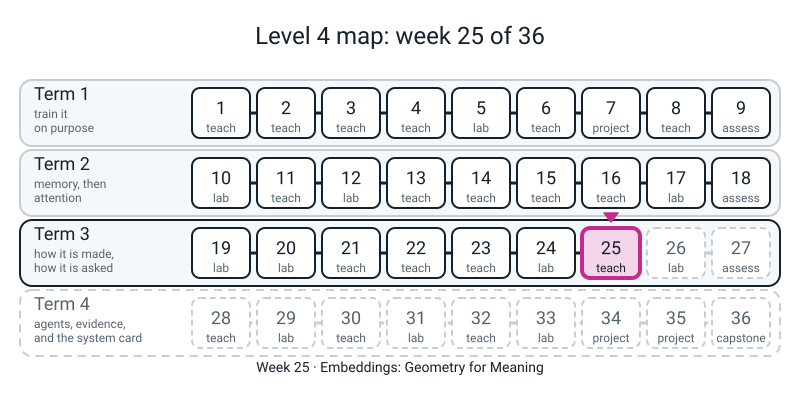
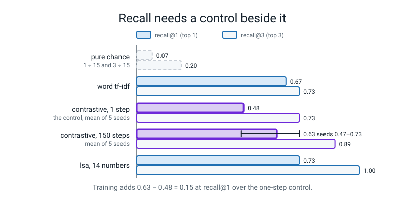
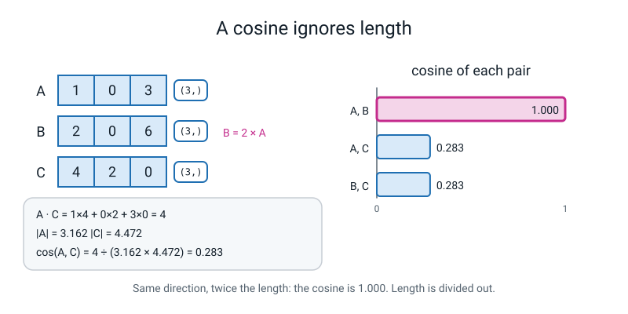

# Week 25 — Embeddings: Geometry for Meaning

[⬅ Week 24](week-24.md) · [Course Home](../README.md) · [Week 26 ➡](week-26.md) · [Student Guide](../student-guide/week-25.md) · [Workbook](../workbook/week-25.md)


*Figure 25.0 — Week 25 sits in the third lane, the term on how models are made and asked; it is the first of the retrieval weeks.*


---

## 📋 At a Glance

| | |
|---|---|
| **Duration** | 70 minutes in class, then the workbook (~55 min: 25 of pen and calculator, 30 at the computer) |
| **Type** | 🟦 Teach — one idea (put a note in a space where *near* means *similar*), met four ways: by hand with three numbers, by letter pieces, by squeezing with SVD, and by training |
| **Big idea** | A word table (TF-IDF, Level 3) has **no geometry**: `optimiser` and `optimizer` are two unrelated columns, exactly as unrelated as `optimiser` and `banana`. Cut the text into **letter pieces** and the two spellings share most of their pieces. Squeeze that big table down to a few dozen numbers with **SVD** (an **LSA** embedder), or **train** a tiny model so that two halves of one note land close (a **contrastive** embedder), and *near* starts to mean *about the same thing*. Then search is one normalise-once matrix multiply. **It is a mechanism, not a measurement of how good real sentence encoders are.** |
| **New vocabulary** | embedding · dense / sparse · character n-gram (letter piece) · SVD / latent dimension · LSA · index · normalise once · contrastive training · positive pair · recall@k |
| **New maths** | **None.** (The ladder row for Week 25 is empty on purpose: SVD is Level 3 Week 29's PCA idea applied to Level 3 Week 32's TF-IDF, and cosine is Level 3 Week 32.) The 🔢 box below re-does cosine by hand with three 3-number vectors (answers `1.000` and `0.283`) and says, in words, what the training loss is. |
| **New syntax** | `TruncatedSVD(n_components=…)` · `TfidfVectorizer(analyzer="char_wb")` · `np.save` / `np.load` · `nn.EmbeddingBag`. That is all four (the ladder allows four). |
| **Dataset** | The 15-note lab notebook that ships inside `l4lib/rag.py` (typed text, written as if by the learner about this course's own experiments) and 15 question-and-answer pairs the teacher typed. **Nothing downloads. No internet.** |
| **Model** | **No stand-in anywhere in this week.** The two "dense" embedders are real and tiny: one is an SVD of a table (no training at all), one is a real PyTorch model (an `nn.EmbeddingBag`, 150 training steps, about 1 second on a CPU). **They are trained or fitted on 15 notes, so they demonstrate the mechanism; they say nothing about how a pretrained sentence encoder behaves.** The MiniLM model in the reference module is not used and cannot be downloaded. |
| **Materials** | Laptop with Python 3, numpy, scikit-learn and torch (nothing new to install) · pen, calculator (phone in calculator mode is fine) · printed **Cosine Cards** (Activity) · workbook pages 25.1-25.5 · a timer |
| **Prep time** | 30 minutes the night before · 3 minutes on the day |
| **Expected runtime of the code** | The **whole** prep (every block in this guide, top to bottom, one session) ran in about **11 seconds** of wall time on the author's CPU with one thread. No single block takes more than about 5 seconds (`seeds.py`, five trainings of the contrastive tier). Nothing is over the 10-second mark that needs recording except the sum. **Anything over 2 minutes means something is wrong** (see Fallback). |

> **⚠️ Watch out:** three things go wrong this week. **First, "dense beats TF-IDF" is not what the numbers say, and you must not say it.** On the 15 questions the word table gets recall@1 `0.67`; the tiny contrastive tier gets `0.63` on average over five seeds (range `0.47` to `0.73`); the SVD tier `0.73`. What *does* move is recall@3 (`0.73`, `1.00`, `0.89`), and the one query where the word table scores exactly `0.000` on the right note. **Second, the loss falls to `0.002` in about fifty steps, and the student will read that as "it learned English".** It learned to tell 15 notes apart from their own halves. **Third, one seed is an anecdote.** A single run of the contrastive tier can be the best or the worst of the lot. The lesson is built so the student sees the five-seed table before writing a sentence about which embedder "wins".

---

## 🎯 Lesson Objectives

By the end of the lesson the student can:

1. **Compute a cosine by hand** for three 3-number vectors (`1.000` for two that point the same way, `0.283` for the others), and say why a raw dot product favours long vectors (Cosine Cards, Page 25.1-25.2).
2. **Say why TF-IDF has no geometry** — `optimiser` and `optimizer` are different columns, so their cosine is `0.0` — and show that cutting words into letter pieces (`analyzer="char_wb"`) gives them a cosine of `0.359`, and `optimise` and `optimiser` `0.670`, while `banana` stays at `0.000`.
3. **Build the whole index** in a dozen lines: letter-piece TF-IDF → `TruncatedSVD` → **normalise once** → a matrix multiply by the query → `np.argsort`, and **save it with `np.save`** and load it back identical.
4. **Say what `nn.EmbeddingBag` is** (a lookup table that also averages, with the "starts" list that says where each document begins) and read the contrastive training loop's one idea: *two halves of the same note should be nearer than halves of different notes.*
5. **Measure, not assert**: fill the recall table (word, SVD at four sizes, contrastive), say which numbers are a property of *this* notebook and *these* 15 questions, and name the control (one training step) that shows how much of the result is the letter pieces and how much is the training.

Observable evidence: the printed lines `same ranking as l4lib's lsa tier: True`, `identical: True`, the recall table, and the hook query where the word table scores the right note `0.000` and the student's own embedder does not; a filled Page 25.4 with one sentence that names a control.

---

## 🧑‍🏫 What YOU Need to Know First

This section is the background you need before class: what the student does, the maths to rehearse, what is real and what is not, the new constructs, the numbers, and where to stop.

> **📌 About the code blocks in this guide.** Every block in the **🧰 Prep Checklist**, in the **🐞 Debugging Clinic** and in the **🔑 Answer Key** was run, in order, from one folder, in one Python session, on a CPU with one thread and the seeds shown; the outputs below are the real printed output. The Clinic blocks that are *deliberate mistakes* are marked and their tracebacks are real (library paths are shortened to `/home/you/venv/lib/python3.x/site-packages`; line numbers inside libraries can differ on your version). **Timing lines (`seconds …`) vary run to run; every other number repeated exactly on a second run on the same machine.** A different CPU or scikit-learn / PyTorch build can move the last digit of a score, and a recall figure by one question (`0.07`). The prep blocks are the **live code** of the lesson: they are typed into one file, in this order.

### 1. What the student is doing today, in one paragraph

The student has met TF-IDF (Level 3 Week 32) and the 15-note lab notebook that ships in `l4lib`. Today they ask the notebook for `optimiser` and watch it answer with fifteen zeros, because the note is spelled `Optimizer`.

They compute a cosine by hand, discover with a pen that a longer vector wins a raw dot product it should not win, and fix it by making every row length 1 once. They cut words into letter pieces, squeeze the big table with `TruncatedSVD` into 14 numbers per note, build the normalise-once matrix-multiply index, save it with `np.save`, and search it. Then they meet a lookup table that averages (`nn.EmbeddingBag`), look at `l4lib`'s short training loop, run it, and measure three kinds of embedder against 15 questions with a control. The honest finishing sentence is small: *"the embedder puts notes with shared letter pieces near each other; training helps by a modest amount on 15 notes; and I can say how much because I ran a control."*

### 2. 🔢 The maths you need — taught to you first

**There is no new idea.** But you will mark two hand-calculations and you must be able to say what the training loss is without a formula, so do each of these once before class.

**(a) Cosine by hand (Level 3 Week 32), Page 25.1.** The cosine of two arrows is **(what they share) ÷ (how long they are)**. With `A = [1, 0, 3]`, `B = [2, 0, 6]`, `C = [4, 2, 0]`:

- `A · C = 1×4 + 0×2 + 3×0 = 4`. Lengths: `|A| = √(1+0+9) = √10 = 3.162`, `|C| = √(16+4+0) = √20 = 4.472`. `cos(A,C) = 4 / (3.162 × 4.472) = 4 / 14.142 = 0.283`.
- `B` is `A` doubled, so it points the same way: `cos(A,B) = 1.000`. (`B · C = 8`, `|B| = 6.325`, so `cos(B,C) = 8/(6.325×4.472) = 0.283` too: length cancels.)
- **The lesson in one line:** the cosine *ignores length*. That is why we want it for text — a long note and a short note on one topic should score alike.

**(b) Normalise once (Page 25.2).** Divide every row by its own length, **once**, when the index is built. Then a note's "cosine with the question" is just the dot product of two length-1 rows, and the whole search is `M @ q`. You do not need to normalise the *question* to get the right *order* (the question's length scales every score by the same amount — the key block proves it); you do need to if you later compare a score to a threshold such as `0.3`, which is Week 26's refusal rule.

**(c) What `TruncatedSVD` keeps, in words.** Level 3 Week 29's PCA found the direction in which the data is most spread out and measured along it. `TruncatedSVD(n)` does the same job *on a big mostly-empty table* and keeps the **best `n` directions**. The 15 × 3,906 table of letter pieces becomes a 15 × 14 table; each number is "how much of this direction is in this note". `svd.explained_variance_ratio_.sum()` says what share of the spread 14 directions keep: `0.941`.

**Teacher-only footnote:** PCA first subtracts each column's mean; `TruncatedSVD` does not (so it can work on a sparse table). You need not tell the student.

**A trap you do know:** a 15-note table has at most 15 directions (checked: `n_components=15` runs and keeps `1.000` of the spread; `l4lib` caps at `N - 1 = 14` by its own choice), so "14 numbers" is *almost no compression* in the number of directions; it is only a change of axes plus the dropping of the last one. `dim 2` is the only setting that really squeezes, and it is the worst in the table (`0.13`).

**(d) The training loss, in words (TEACHER-ONLY, and only in words to the student).** Take each note, split its words into two random halves, and embed both. Lay all the first-halves against all the second-halves in a table of cosines. Divide by a *temperature* (`0.1`, which makes the biggest cosine stand out), turn each row into chances with a softmax (Week 13), and ask: *what chance did each first-half give to its own second-half?* The loss is the average `-ln` of that chance (`F.cross_entropy` with the diagonal as the right answer, Week 12), taken in both directions. If a model knew nothing it would give every note a `1/15` chance and the loss would be `ln 15 = 2.708`; **the measured first-step loss is `1.755` for seed 0 and `3.54` for seed 1**, because it depends on the random start; by step 50 it is `0.002`. The student is told: *"the loss is small when a half finds its own other half among all fifteen."*

The by-hand version on three notes is in the key (`key2.py`), including the fact that two notes which point the same way (`A` and `B`) can never be told apart (`0.506` / `0.494`). The literature's name for it, "InfoNCE", is for you; the student does not need it.

### 3. 🧭 Real vs stand-in — and what you must NOT claim

| Thing | Real or stand-in? |
|---|---|
| The cosine, the letter pieces, the SVD, the index, the `np.save` file | **Real.** scikit-learn and numpy, to the digits printed. |
| The contrastive embedder | **Real and trained**, in PyTorch, on the CPU, for 150 steps on two random halves of each of the 15 notes. **Tiny:** 32 numbers per note, a table of about 3,906 × 32 numbers, and nothing else. |
| The 15 notes | **Typed text** inside `l4lib/rag.py`, written as if by the learner about this course's own experiments. Invented for the course; not a real lab's notebook. |
| The 15 questions and their right answers | **Typed by the teacher** (this guide), after reading the notes. Each is a paraphrase, but several keep a key word (`batch`, `tokeniser`, `emoji`), so they are not adversarial. **They are 15 questions; one question is `0.067` of recall.** |
| The vectors `A`, `B`, `C` and the four "notes" of the pen index | **Invented** to be easy to multiply. They are not embeddings of anything. |
| Any pretrained sentence encoder (MiniLM, etc.) | **Not present and not run.** The reference module's dense-encoder outputs were never reproduced here; anything you have heard about "0.62 for a paraphrase" is a claim about a model we do not have. If the student asks "is a real one better?", the honest answer is *"almost certainly, and we cannot measure it offline."* |
| A scripted generator (`ExtractiveGenerator`) | **Not used this week.** It appears in Week 26, labelled *stand-in, not a model*. |

> **Say to the student, out loud:** *"These two embedders are real, but each has seen only fifteen notes. They are a working model of how real embedders are built, not a measurement of how good real ones are."*

### 4. The four new constructs, for somebody who has never seen them

**`TfidfVectorizer(analyzer="char_wb", ngram_range=(3, 5))`.** The student knows `TfidfVectorizer()` (Level 3 Week 32): one column per whole word. `analyzer="char_wb"` changes what a column *is*: a run of 3, 4 or 5 letters **inside a word**, with a space added at each end of the word (`wb` is "word boundary"), so `opt` in the middle of a word and ` opt` at the start are different columns. `optimiser` gives ` opt`, ` opti`, `opt`, `opti`, `optim`, … and `iser`, `iser `, `ser`, `ser `. Those pieces are the geometry: `optimizer` and `optimiser` both have ` opt`, ` opti`, `opt`, `opti`, `optim`, and differ only near the `z`/`s`. The printed table: `0.359` for `optimizer`/`optimiser`, `0.670` for `optimise`/`optimiser`, `0.000` for `banana`.

**Say:** *"a column is a piece of a word now, so words that are spelled alike share columns."* The table gets wide: 15 notes × 3,906 pieces, 11% full.

**`TruncatedSVD(n_components=14, random_state=0)`.** Fit it on the big table with `svd.fit_transform(X)`; use it later on a new query with `svd.transform(...)`. `fit` learns the directions; `transform` only applies them. `random_state=0` because the algorithm starts from random numbers (the same reason as any seed). `n_components` must be **at most the number of columns** (Mistake 3) and, for a useful answer, below the number of notes.

**`np.save("notebook_index.npy", M)` / `np.load(...)`.** One array to one file and back, exactly (`identical: True`). The file holds **only the numbers**. It does *not* hold the vectorizer or the SVD that made them, so a query must still go through the *same fitted* objects (Mistake 4) — the costliest misunderstanding of the week. And a dictionary of arrays cannot be loaded back by default (Mistake 5); the fix for the student is *save one array per file*. **Never** set `allow_pickle=True` on a file you did not write yourself: a pickle can run code when it loads. `np.savez` (several arrays in one file) is the honest next step; it is not on the ladder, so it is for you.

**`nn.EmbeddingBag(V, d, mode="mean")`.** The student knows `nn.Embedding` (Week 8): id in, row of `d` numbers out. An `EmbeddingBag` takes a *bag* of ids and returns the **mean** of their rows, in one call. A batch of documents is handed over as one long list of ids plus a list of **starts** that says where each document begins: `[0, 1, 2, 3, 4]` and starts `[0, 3]` are the two documents `[0,1,2]` and `[3,4]`. The output has one row per document (shape `(2, 3)`). The block proves it equals "pick the rows and average them yourself".

**Teacher-only:** `l4lib` uses `mode="sum"` with `per_sample_weights` set to the TF-IDF value of each piece, so the embedding is a *weighted sum*, not a mean; the idea the student needs (a bag in, one row out) is the same, and the weights are a detail you may show in the source but need not teach.

### 5. The other code the student types — nothing new, but note these

- `normalize(V)` from `sklearn.preprocessing` (Level 3 Week 32): each row divided by its own length. The student also writes `length` and `cosine` by hand with `np.sqrt` and `.sum()`. `np.linalg.norm` is not on any ladder, so we do not type it (`l4lib` uses it inside; the student does not read that line).
- `np.argsort(-sims)[:k]` (Level 3 Week 33): the positions of the `k` biggest scores. The minus sign turns "smallest first" into "biggest first". Week 26 lists it as a construct, but it is Level 3's; say so once and move on.
- The f-string widths `{name:<22}` and `{x:>9.2f}` (left and right alignment) are plain f-string formatting from the earlier levels.
- `rag.VectorIndex`, `rag.TfidfEmbedder`, `rag.TinyDenseEmbedder`, `rag.recall_at_k` are `l4lib` — **imported, never copied, never edited** — and the student uses them exactly as a tool. Open `l4lib/rag.py` with the student at lines ~180–265 to read the training loop; do not make them type it.
- `np.allclose`, `torch.allclose` (Weeks 11 and 16), `torch.stack`, `.mean(dim=0)`.

### 6. What the numbers will say

All printed by the blocks in the Prep Checklist. Read them before class.

- **Hook.** On the 15 notes the word table has **288 columns** (stop words removed). `optimizer` scores the right note `0.131`; `optimiser` scores **0.000 on every one of the 15 notes**.
- **Cosine.** `cos(A,B) = 1.000`, `cos(A,C) = 0.283`, `cos(B,C) = 0.283`; after `normalize`, every length is `1.0`, and `U @ U.T` is the whole 3 × 3 table of cosines at once.
- **Letter pieces.** 52 pieces for the four words. `optimizer`/`optimiser` `0.359`, `optimiser`/`optimise` `0.670`, anything/`banana` `0.000`.
- **The index.** The letter-piece table is 15 × 3,906 (11% non-zero); after SVD it is 15 × 14 and keeps `0.941` of the spread. The hand-built index gives **exactly** the same matrix and ranking as `l4lib`'s LSA tier (`True`, `True`). On `which optimiser was best` the scores are `0.565` ([1] Learning rate sweep), `0.525` ([0] Optimizer bake-off, the right note), `0.482` ([2]). **The right note is second**; see "honest limits".
- **Saved and loaded.** 15 × 14 float64 = 1,680 bytes of numbers, identical after loading.
- **Contrastive.** about 1 second (0.8 to 1.0 on repeat runs) for 150 steps; the loss goes `1.755 → 0.004 → 0.002 → 0.002` at steps 0, 10, 50, 149.
- **The recall table** (15 questions): word tf-idf `0.67 / 0.73`; LSA dim 2 `0.13 / 0.27`, dim 4 `0.53 / 0.73`, dim 8 `0.67 / 0.87`, dim 14 `0.73 / 1.00`; contrastive seed 0 `0.67 / 0.87`.
- **Five seeds** of the contrastive tier: recall@1 `0.67, 0.73, 0.60, 0.67, 0.47` (mean `0.63`); recall@3 `0.87, 0.87, 0.93, 0.93, 0.87` (mean `0.89`); first-step loss from `1.57` to `3.54`.
- **The control** (one training step, five seeds): recall@1 mean `0.48`, recall@3 mean `0.73`. Training therefore adds about `+0.15` on recall@1 and `+0.16` on recall@3 over "almost random numbers for the letter pieces" (the one-step model is really a random projection of the letter-piece tf-idf vectors, which is why it matches the word table). That is about two of 15 questions on five seeds, and the per-seed ranges overlap (one step `0.33` to `0.60`, 150 steps `0.47` to `0.73`): call it modest, not a precise `0.15`, and it measures this 150-step recipe only. **Chance** is `0.07` and `0.20`.
- **The headline query.** `optimiser`: word table `0.000` on the right note (and on all 14 others — the "rank 1" is only list order, not a result); LSA `0.799`, rank 1; contrastive `0.429`, rank 1. `which optimiser was best`: word table `0.000`, rank 2 (another note matches "best"); LSA `0.525`, rank 2; contrastive `0.377`, rank 1.
- **Six typed pairs** (extension): mean recall@1 `0.63 → 0.59` and recall@3 `0.89 → 0.83`. Typed pairs did **not** help here. (Reason, which is a guess: six pairs for six topics pull those topics' notes toward their phrases and also make the other nine relatively less well placed; we did not test it.)


*Figure 25.2 — A recall number needs its control. One training step already reaches recall@3 0.73; 150 steps reach 0.89, so training added 0.63 − 0.48 = 0.15 at recall@1.*


### 7. The honest limits of today

1. **The result is a property of this notebook and these 15 questions.** One question is `0.067`; the gap between `0.63` and `0.67` is a single question. Nothing today ranks embedders in general.
2. **"Dense beats sparse" is not shown.** At recall@1 the word table (`0.67`) is level with the mean of the trained tier (`0.63`) and just behind LSA (`0.73`). At recall@3 the dense tiers are ahead (`0.89`, `1.00` against `0.73`) — the direction the reference module says, with much smaller margins than it suggests. The strongest single piece of evidence is the hook query, where the word table gets a hard zero: it is a *failure* of the word table, not a victory for a particular embedder.
3. **A lot of the gain is the letter pieces, not the training.** The one-step control already reaches recall@3 `0.73`, equal to the word table. Say it; it is the best lesson of the week in method.
4. **The SVD tier is fit on the same 15 notes it then searches.** That is fine for a fixed notebook; for a changing one you must re-fit *and* re-embed everything (Mistake 4). The contrastive tier is trained on the same 15 notes, so its loss of `0.002` says it can tell these notes apart, not that it has learned anything that would carry to other text.
5. **No pretrained encoder is run.** See the table above.
6. **Timing on another machine is not a result.** Nothing in the lesson depends on speed.

### 8. The misconceptions you will actually meet

1. **"An embedding knows what the words mean."** Ours knows which letter pieces co-occur in 15 notes. Ask: *"what would it do with `colour` against `color`?"* (near, by the same mechanism as `optimiser`) and *"with `big` against `large`?"* (no shared pieces; a tiny model trained on 15 notes has no reason to put them near.)
2. **"The score 0.525 means the note is 52% relevant."** It is a cosine. It ranks; it does not measure. Week 26 picks a threshold *by looking at the scores of answerable and unanswerable questions*.
3. **"A lower loss means a better embedder."** The loss reaches `0.002` for every seed, including the seed with recall@1 `0.47`.
4. **"More dimensions always helps."** From 2 to 14 it does, in this table; the right dimension is a measured quantity, not a rule, and 15 is the ceiling for 15 notes (where nothing is squeezed; `l4lib` stops at 14).
5. **"Normalising the query is required."** It changes every score by the same factor, so not for ranking (the key proves it); yes if you compare a score to a threshold.
6. **"`np.save` saves the model."** It saves the matrix. The query encoder is a separate object.
7. **"`fit_transform` and `transform` are two names for one thing."** `fit_transform` learns the columns; `transform` uses the ones already learned. Using the first on a query is Mistake 2.
8. **"The embedder got it wrong, so it is broken."** Look at the note it did pick: for `which optimiser was best` it picks "Learning rate sweep", which contains the word `best`. A ranking error is a reason to ask what was shared, not evidence of a bug.

### 9. How deep to go, and where to stop

Stop at: *"letter pieces give near-spellings a shared geometry; SVD squeezes the table; a normalise-once matrix multiply searches it; a contrastive loss can train the squeeze; and I can say how much training added because I ran a control."* Do **not** go into how real sentence encoders are built (transformers with masked-language pretraining, Week 21's scaling story applied to encoders), into approximate nearest-neighbour search (the matrix multiply is fine up to many thousands of notes), into the maths of the SVD (eigenvectors; not in this course), or into which pretrained model to buy. If the student asks "how big are real embeddings?", the one true sentence is *"commonly a few hundred to a few thousand numbers per text; ours has 14 or 32."* Do **not** say any specific model's recall.

### 10. 🧭 Where Week 25 sits

```text
   L3 W29  PCA: new axes, keep the biggest     W23-24  prompting as engineering: the harness, FakeClient
   L3 W32  TF-IDF + cosine                     W25     embeddings: geometry for meaning (today)
   W8      nn.Embedding: id -> row                      letter pieces + SVD, or a trained EmbeddingBag
   W12/13  cross_entropy, softmax              W26     RAG: chunk, embed, retrieve, number, cite, refuse
                                               W27     Review and Assessment 3 (cosine, recall@k)
   W28-29  the agent's search_notes tool reuses today's index;  W33-36  the capstone reuses it
```

---

## 🧰 Prep Checklist

This section is for the night before: the blocks you run, in order, so that every number in this guide is one you have seen yourself.

### 30 minutes the night before

**☐ 1. Smoke test and folder check (1 minute).** Open a terminal **in the `36-week-course/` folder** — the folder that *contains* `l4lib/` — and start a Python session there (`python3`, or a notebook; **one session for the whole prep**, because the blocks share names). Run Block P1. If it says `ModuleNotFoundError: No module named 'l4lib'` you are in the wrong folder (the commonest error of the year). Run from a scratch copy if you prefer: the blocks write two small files (`notebook_index.npy`, `bundle.npy`) into the current folder, and you may delete those two files afterwards — they are yours.

**Block P1 — set-up**

```python
# week25.py - Week 25 prep. Run every block in order, in ONE session, from the folder that contains l4lib/ and teacher-guide/.
import time
import numpy as np
import torch
import torch.nn as nn
torch.set_num_threads(1)
from sklearn.decomposition import TruncatedSVD
from sklearn.feature_extraction.text import TfidfVectorizer
from sklearn.preprocessing import normalize
from l4lib import rag

chunks = rag.notebook_chunks()
titles = rag.notebook_titles(chunks)
print(len(chunks), "notes")
print("note 0:", titles[0])
print("note 11:", titles[11])
```

```text
15 notes
note 0: 2026-01-14 - Optimizer bake-off
note 11: 2026-06-25 - Reward model toy
```

**☐ 2. The hook and the 15 questions (2 minutes).** Block P2 defines the 15 question-and-answer pairs the whole lesson measures against (`QA`) and shows the hook: the word table answers `optimizer` with the right note at `0.131` and `optimiser` with **nothing but zeros**. This is the moment the student should say "but that is the same word."

**Block P2 — `hook.py`**

```python
# hook.py - the notebook, 15 questions with their answers, and the word-table index (Level 3's TF-IDF, behind l4lib's one interface)
QA = [("which optimiser should I start with", 0),
      ("what made the loss blow up to not-a-number", 1),
      ("does randomly switching off units help", 2),
      ("why do names come out as junk when sampling hot", 3),
      ("which gated recurrent net was quicker to train", 4),
      ("why divide the scores by a square root", 5),
      ("how many layers did the small transformer have", 6),
      ("what happens if the model has no idea of order", 7),
      ("does a bigger batch hurt generalisation", 8),
      ("where should normalisation go in a block", 9),
      ("does the tokeniser handle emoji", 10),
      ("what is the cheapest way to raise the reward", 11),
      ("why did the policy collapse", 12),
      ("why did the constant guess matter", 13),
      ("how much does a call cost in dollars", 14)]

tfidf_ix = rag.VectorIndex(chunks, rag.TfidfEmbedder())
print("word columns:", tfidf_ix.M.shape[1], " (so each note is a row of", tfidf_ix.M.shape[1], "numbers)")
for query in ["optimizer", "optimiser"]:
    hits = tfidf_ix.search(query, k=3)
    print(f"query {query!r}:", [(h.id, round(h.score, 3)) for h in hits])

```

```text
word columns: 288  (so each note is a row of 288 numbers)
query 'optimizer': [(0, 0.131), (1, 0.0), (2, 0.0)]
query 'optimiser': [(0, 0.0), (1, 0.0), (2, 0.0)]
```

**☐ 3. Cosine by hand, then by machine (3 minutes).** Do Page 25.1 yourself with a calculator first (section 2a), then run P3. The 3 × 3 table of cosines is `U @ U.T`: one matrix multiply gives every pair. The two parallel vectors `A` and `B` show `1.000`.

**Block P3 — `cosine.py`**

```python
# cosine.py
A = np.array([1.0, 0.0, 3.0])
B = np.array([2.0, 0.0, 6.0])
C = np.array([4.0, 2.0, 0.0])

def length(v):
    return float(np.sqrt((v * v).sum()))

def cosine(x, y):
    return float((x * y).sum() / (length(x) * length(y)))

print("A.C =", (A * C).sum(), "  |A| =", round(length(A), 3), "  |C| =", round(length(C), 3))
print(f"cos(A,B) = {cosine(A, B):.3f}")
print(f"cos(A,C) = {cosine(A, C):.3f}")
print(f"cos(B,C) = {cosine(B, C):.3f}")

V = np.array([A, B, C])
U = normalize(V)
print("lengths after normalise:", [round(length(u), 3) for u in U])
G = U @ U.T
for row in G:
    print("  ".join(f"{x:.3f}" for x in row))
```

```text
A.C = 4.0   |A| = 3.162   |C| = 4.472
cos(A,B) = 1.000
cos(A,C) = 0.283
cos(B,C) = 0.283
lengths after normalise: [1.0, 1.0, 1.0]
1.000  1.000  0.283
1.000  1.000  0.283
0.283  0.283  1.000
```

**☐ 4. Letter pieces (2 minutes).** P4 shows word-level `0.0` against letter-piece `0.359`. Look at the list of pieces of `optimiser`: ` opt`, ` opti` (with a leading space — the word boundary), `opt`, `opti`, `optim`, `iser`, `iser `, `ser`, `ser `.

**Block P4 — `spelling.py`**

```python
# spelling.py
words = ["optimizer", "optimiser", "optimise", "banana"]

word_vec = TfidfVectorizer()                       # Level 3's: one column per whole word
W = word_vec.fit_transform(words)
print("word columns:", list(word_vec.get_feature_names_out()))
print("word-level cosine, optimizer vs optimiser:", round(float((W[0] @ W[1].T).toarray()[0, 0]), 3))

char_vec = TfidfVectorizer(analyzer="char_wb", ngram_range=(3, 5))     # NEW: columns are letter pieces
Cc = char_vec.fit_transform(words)
print("char columns:", len(char_vec.get_feature_names_out()))
print("some pieces of 'optimiser':", [g for g in char_vec.get_feature_names_out() if g.strip() in ("opt", "opti", "optim", "iser", "ser")])
Cn = normalize(Cc)
S = (Cn @ Cn.T).toarray()
for a, row in zip(words, S):
    print(f"{a:>10}", "  ".join(f"{x:.3f}" for x in row))
```

```text
word columns: ['banana', 'optimise', 'optimiser', 'optimizer']
word-level cosine, optimizer vs optimiser: 0.0
char columns: 52
some pieces of 'optimiser': [' opt', ' opti', 'iser', 'iser ', 'opt', 'opti', 'optim', 'ser', 'ser ']
 optimizer 1.000  0.359  0.353  0.000
 optimiser 0.359  1.000  0.670  0.000
  optimise 0.353  0.670  1.000  0.000
    banana 0.000  0.000  0.000  1.000
```

**☐ 5. The index: fit, encode, search (5 minutes).** P5 is the heart of the lesson: three small functions and a search. Note `normalize(...)` appears **once**, in `fit_embedder`, and once in `encode` for the query. The right note scores `0.525` and is **second**; the first is "Learning rate sweep" (`0.565`). Do not fix this — it is honest, and the student needs to see it.

**Block P5 — `lsa.py`**

```python
# lsa.py
def fit_embedder(docs, dim):
    vec = TfidfVectorizer(analyzer="char_wb", ngram_range=(3, 5), sublinear_tf=True)
    X = vec.fit_transform(docs)
    svd = TruncatedSVD(n_components=dim, random_state=0)
    M = normalize(svd.fit_transform(X))            # normalise ONCE, here
    return vec, svd, M

def encode(vec, svd, texts):
    return normalize(svd.transform(vec.transform(texts)))

def search(vec, svd, M, query, k=3):
    q = encode(vec, svd, [query])[0]
    sims = M @ q
    order = np.argsort(-sims)[:k]
    return [(int(i), float(sims[i])) for i in order]

t0 = time.time()
vec, svd, M = fit_embedder(chunks, 14)
print("tf-idf matrix:", vec.transform(chunks).shape, " index:", M.shape, " seconds:", round(time.time() - t0, 2))
print("share of the spread kept:", round(float(svd.explained_variance_ratio_.sum()), 3))

q = "which optimiser was best"
print("query:", q)
for i, s in search(vec, svd, M, q):
    print(f"  {s:.3f}  [{i}] {titles[i]}")
```

```text
tf-idf matrix: (15, 3906)  index: (15, 14)  seconds: 0.06
share of the spread kept: 0.941
query: which optimiser was best
  0.565  [1] 2026-01-21 - Learning rate sweep
  0.525  [0] 2026-01-14 - Optimizer bake-off
  0.482  [2] 2026-02-03 - Dropout and weight decay
```

**☐ 6. Compare with `l4lib`, save, load (3 minutes).** P6 proves the hand-built index is the library's: the same ranking and the same matrix. It then saves the 15 × 14 matrix with `np.save` and loads it back identical. Expect a file of 1,680 bytes of numbers plus a small header.

**Block P6 — `index.py`**

```python
# index.py - the hand-built index against the library's, then save and load
lib = rag.VectorIndex(chunks, rag.TinyDenseEmbedder("lsa", dim=14))
mine = [i for i, s in search(vec, svd, M, q, k=15)]
theirs = [h.id for h in lib.search(q, k=15)]
print("same ranking as l4lib's lsa tier:", mine == theirs)
print("same matrix:", bool(np.allclose(M, lib.M)))

np.save("notebook_index.npy", M)
M2 = np.load("notebook_index.npy")
print("loaded back:", M2.shape, M2.dtype, M2.nbytes, "bytes of numbers; identical:", bool(np.array_equal(M, M2)))
print("the 15 x 3906 letter-piece table, stored densely, would be", 15 * 3906 * 8, "bytes")
print("search with the loaded matrix:", [i for i, s in search(vec, svd, M2, q)])
```

```text
same ranking as l4lib's lsa tier: True
same matrix: True
loaded back: (15, 14) float64 1680 bytes of numbers; identical: True
the 15 x 3906 letter-piece table, stored densely, would be 468720 bytes
search with the loaded matrix: [1, 0, 2]
```

**☐ 7. `nn.EmbeddingBag` (2 minutes).** P7 is the four-line demo; the student predicts the shape `(2, 3)` before you run it.

**Block P7 — `bag.py`**

```python
# bag.py - nn.EmbeddingBag: a lookup table that also averages
torch.manual_seed(0)
bag = nn.EmbeddingBag(6, 3, mode="mean")          # 6 piece ids, 3 numbers each; the mean of the rows asked for
ids = torch.tensor([0, 1, 2,   3, 4])             # two documents laid end to end: [0, 1, 2] and [3, 4]
starts = torch.tensor([0, 3])                     # where each document begins in that long list
out = bag(ids, starts)
print("shape:", tuple(out.shape), "  (one row per document)")

by_hand = torch.stack([bag.weight[torch.tensor([0, 1, 2])].mean(dim=0),
                       bag.weight[torch.tensor([3, 4])].mean(dim=0)])      # pick the rows, then average them yourself
print("same as picking the rows and averaging:", bool(torch.allclose(out, by_hand)))
print(np.round(out.detach().numpy(), 3))
```

```text
shape: (2, 3)   (one row per document)
same as picking the rows and averaging: True
[[-0.225  0.433 -0.173]
 [ 0.616  0.706  0.565]]
```

**☐ 8. The trained tier (2 minutes).** P8 builds a `rag.TinyDenseEmbedder("contrastive")` and prints the loss at four steps. It takes under a second. The first-step loss (`1.755`) depends on the seed; the end loss is `0.002` for every seed.

**Block P8 — `contrastive.py`**

```python
# contrastive.py - the trained tier, from l4lib (the loop is in l4lib/rag.py; the teacher reads it with the student)
t0 = time.time()
cem = rag.TinyDenseEmbedder("contrastive", dim=32, seed=0)
cix = rag.VectorIndex(chunks, cem)
print("seconds to train on the 15 notes:", round(time.time() - t0, 1))
print("steps:", len(cem.loss_history), " loss at step 0, 10, 50, 149:",
      [round(cem.loss_history[i], 3) for i in (0, 10, 50, 149)])
print("first-step loss if it knew nothing (ln of 15 notes):", round(float(np.log(15)), 3))
print(f"recall@1 {rag.recall_at_k(cix, QA, 1):.2f}   recall@3 {rag.recall_at_k(cix, QA, 3):.2f}")
```

```text
seconds to train on the 15 notes: 1.0
steps: 150  loss at step 0, 10, 50, 149: [1.755, 0.004, 0.002, 0.002]
first-step loss if it knew nothing (ln of 15 notes): 2.708
recall@1 0.67   recall@3 0.87
```

**☐ 9. The recall table, the headline query, five seeds, the control (6 minutes).** P9 to P12. P9 defines `recall_with` (the same measurement as `rag.recall_at_k`, for a matrix you already hold; the later blocks need it). P10 is the headline (read the note about ties). P11 is the five-seed table. P12 is the **control**: the same embedder after one training step.

**Block P9 — `recall.py`**

```python
# recall.py - recall@1 and recall@3 of every embedder on the 15 questions in hook.py

def recall_with(embedder, M_, k):
    # the same measurement as rag.recall_at_k, for an embedder and a matrix you already have
    hit = 0
    for question, gold in QA:
        sims = M_ @ embedder.encode([question])[0]
        hit += gold in list(np.argsort(-sims)[:k])
    return hit / len(QA)

print(f"{'embedder':<22}{'recall@1':>9}{'recall@3':>9}")
print(f"{'word tf-idf':<22}{rag.recall_at_k(tfidf_ix, QA, 1):>9.2f}{rag.recall_at_k(tfidf_ix, QA, 3):>9.2f}")
for d in (2, 4, 8, 14):
    ix = rag.VectorIndex(chunks, rag.TinyDenseEmbedder("lsa", dim=d))
    print(f"{'lsa, dim ' + str(d):<22}{rag.recall_at_k(ix, QA, 1):>9.2f}{rag.recall_at_k(ix, QA, 3):>9.2f}")
```

```text
embedder               recall@1 recall@3
word tf-idf                0.67     0.73
lsa, dim 2                 0.13     0.27
lsa, dim 4                 0.53     0.73
lsa, dim 8                 0.67     0.87
lsa, dim 14                0.73     1.00
```

**Block P10 — `headline.py`**

```python
# headline.py - the query the word table cannot hear, and where each embedder puts the right note
lsa_ix = rag.VectorIndex(chunks, rag.TinyDenseEmbedder("lsa", dim=14))
for query in ["optimiser", "which optimiser was best"]:
    print("query:", query)
    for name, ix in [("word tf-idf", tfidf_ix), ("lsa (14 numbers)", lsa_ix), ("contrastive (seed 0)", cix)]:
        hits = ix.search(query, k=len(chunks))                 # all 15, best first
        right = [h for h in hits if h.id == 0][0]              # note 0, the optimizer note
        tied = sum(h.score == right.score for h in hits)       # how many notes share exactly its score
        rank = [h.id for h in hits].index(0) + 1
        print(f"  {name:<22} right note scores {right.score:.3f}; rank {rank:>2}; notes with exactly that score: {tied}")
```

```text
query: optimiser
  word tf-idf            right note scores 0.000; rank  1; notes with exactly that score: 15
  lsa (14 numbers)       right note scores 0.799; rank  1; notes with exactly that score: 1
  contrastive (seed 0)   right note scores 0.429; rank  1; notes with exactly that score: 1
query: which optimiser was best
  word tf-idf            right note scores 0.000; rank  2; notes with exactly that score: 14
  lsa (14 numbers)       right note scores 0.525; rank  2; notes with exactly that score: 1
  contrastive (seed 0)   right note scores 0.377; rank  1; notes with exactly that score: 1
```

> **Read the tie carefully.** For `optimiser` the word table gives the right note a score of `0.000` **and gives the same `0.000` to all 14 others**, so "rank 1" is just the list order (the index breaks ties by position, note 0 first). It is *not* a success. The sentence that matters is the last column: **15 notes share exactly that score**.

**Block P11 — `seeds.py`**

```python
# seeds.py - one seed is an anecdote: five seeds of the contrastive tier, and the lsa tier beside them
print(f"{'seed':<6}{'loss@0':>8}{'loss@149':>10}{'recall@1':>10}{'recall@3':>10}")
r1s, r3s = [], []
for s in range(5):
    e = rag.TinyDenseEmbedder("contrastive", dim=32, seed=s)
    ix = rag.VectorIndex(chunks, e)
    r1, r3 = rag.recall_at_k(ix, QA, 1), rag.recall_at_k(ix, QA, 3)
    r1s.append(r1); r3s.append(r3)
    print(f"{s:<6}{e.loss_history[0]:>8.2f}{e.loss_history[-1]:>10.3f}{r1:>10.2f}{r3:>10.2f}")
print(f"mean  {'':>18}{np.mean(r1s):>10.2f}{np.mean(r3s):>10.2f}   (range of recall@1: {min(r1s):.2f} to {max(r1s):.2f})")
```

```text
seed    loss@0  loss@149  recall@1  recall@3
0         1.75     0.002      0.67      0.87
1         3.54     0.001      0.73      0.87
2         2.29     0.001      0.60      0.93
3         3.16     0.001      0.67      0.93
4         1.57     0.001      0.47      0.87
mean                          0.63      0.89   (range of recall@1: 0.47 to 0.73)
```

**Block P12 — `untrained.py`**

```python
# untrained.py - the control: the same embedder after ONE training step, so it is almost a random squashing of the letter pieces
r1c, r3c = [], []
for s in range(5):
    e = rag.TinyDenseEmbedder("contrastive", dim=32, seed=s, steps=1)
    ix = rag.VectorIndex(chunks, e)
    r1c.append(rag.recall_at_k(ix, QA, 1)); r3c.append(rag.recall_at_k(ix, QA, 3))
print(f"1 step  : mean recall@1 {np.mean(r1c):.2f}  recall@3 {np.mean(r3c):.2f}   (recall@1 by seed: {[round(x, 2) for x in r1c]})")
print(f"150 steps: mean recall@1 {np.mean(r1s):.2f}  recall@3 {np.mean(r3s):.2f}   (from seeds.py)")
print(f"pure chance: recall@1 {1/15:.2f}  recall@3 {3/15:.2f}")
```

```text
1 step  : mean recall@1 0.48  recall@3 0.73   (recall@1 by seed: [0.6, 0.4, 0.53, 0.33, 0.53])
150 steps: mean recall@1 0.63  recall@3 0.89   (from seeds.py)
pure chance: recall@1 0.07  recall@3 0.20
```

**☐ 10. Extension: do six typed pairs help? (2 minutes).** P13 is for the fast student or the homework extension. It is an honest negative result; keep it that way.

**Block P13 — `pairs.py`**

```python
# pairs.py - EXTENSION: six typed pairs (a short phrase and the note it should land near). Do they help?
pairs = [("optimiser comparison", chunks[0]), ("learning rate experiments", chunks[1]),
         ("regularisation and dropout", chunks[2]), ("normalisation layer placement", chunks[9]),
         ("tokeniser for emoji text", chunks[10]), ("cost per call", chunks[14])]
plain, paired = [], []
for s in range(5):
    for store, extra in ((plain, None), (paired, pairs)):
        e = rag.TinyDenseEmbedder("contrastive", dim=32, seed=s)
        M_ = e.fit_encode(chunks, pairs=extra)
        store.append((recall_with(e, M_, 1), recall_with(e, M_, 3)))
print("no typed pairs : mean recall@1 %.2f  recall@3 %.2f" % tuple(np.mean(plain, axis=0)))
print("six typed pairs: mean recall@1 %.2f  recall@3 %.2f" % tuple(np.mean(paired, axis=0)))
```

```text
no typed pairs : mean recall@1 0.63  recall@3 0.89
six typed pairs: mean recall@1 0.59  recall@3 0.83
```

**☐ 11. Print the Cosine Cards (3 minutes).** See the Activity. Print **one** copy of the student sheet (only the block between the two "✂ PRINT" lines). **Do not print the rest of this file.**

**☐ 12. Read the Debugging Clinic (3 minutes).** Eight deliberate mistakes; three are silent. You will plant two or three of them, not all eight.

### 3 minutes on the day

**☐ 13.** Open the session, run P1 and P2 only (so the hook is one line away), put `l4lib/rag.py` open at the `TinyDenseEmbedder` class in a second window (for the "read the loop" moment), and check the laptop is on power. Start the timer.

### Fallback if the laptops fail

**The lesson is half pen.** If the laptop fails, do the hook from the printed hook lines above, the Cosine Cards (which need only a calculator), and the *reading* of Blocks P5 and P8 from the printed guide. The code is small enough that the student can type P3–P7 later as homework. If `seeds.py` runs for more than 2 minutes, stop it (Ctrl-C) and run it with `range(2)`: the claim it protects is "one seed is an anecdote", and two seeds already show it.

---

## ⏱️ The Lesson, Minute by Minute

This section is the running order of the lesson, with what to say and do in each segment.

| Segment | Minutes | Clock | What happens |
|---|:--:|:--:|---|
| 🪝 Hook — The Notebook That Cannot Spell | 6 | 0:00-0:06 | `optimizer` finds the note; `optimiser` scores zero on all fifteen. |
| 🧠 Concept & Maths — Geometry, Cosine, One Normalise | 10 | 0:06-0:16 | A space where near means similar; cosine ignores length; normalise once; how to measure. |
| 🎲 Their Turn — The Cosine Cards | 12 | 0:16-0:28 | Pen and calculator: Page 25.1 (three cosines), Page 25.2 (four notes, raw dot vs cosine). |
| 💻 Live-Code Together — `embed.py` | 36 | 0:28-1:04 | Parts 1-4: letter pieces; the SVD index and `np.save`; `EmbeddingBag` and the trained tier; the recall table and the control. |
| 🔑 Wrap & Assign | 6 | 1:04-1:10 | The sentence about a control; homework. |

### 🪝 Hook — The Notebook That Cannot Spell (6 minutes)

Run P1 and P2 live. Say: *"This is your notebook. Note 0 is called `Optimizer bake-off`. I am going to ask it twice."* Show `optimizer`: note 0 wins at `0.131`. Then: *"Now the way you'd spell it on the other side of the Atlantic."* Show `optimiser`: three zeros — and say that **all fifteen** are zero (`tfidf_ix.search("optimiser", k=15)` if they want to see). Ask: *"What does the word table think `optimiser` and `optimizer` are?"* Let them say "the same word". Then: *"To the table they are two different columns, like `optimiser` and `banana`. There is no idea of near. Today we build one."* Write on the board: **near = similar**.

### 🧠 Concept & Maths — Geometry, Cosine, One Normalise (10 minutes)

1. **A table row is an arrow (2 min).** Each note is a list of numbers; two notes are two arrows. Draw two arrows from a point with a small angle and a big one. *"If the angle is small, they point the same way: same topic. The cosine of the angle is `1.000` when they point exactly the same way and `0` when they are at a right angle."*
2. **Cosine by hand, one example (3 min).** Use Page 25.1's `A` and `C` on the board (section 2a). Write the three numbers (`4`, `3.162`, `4.472`) and the division. Say the lesson in one line: *"the cosine ignores length."*
3. **The trap of the raw dot product (2 min).** *"If I skip the lengths and just multiply and add, a long arrow beats a short one that points better."* Do not give the numbers; they will meet them on Page 25.2.
4. **Normalise once (1 min).** *"Make every note length 1 when I build the index, once. After that, searching is one matrix multiply."* Draw `M @ q`.
5. **How we will judge (2 min).** Hand the student `QA` (it is printed in P2) and say: *"fifteen questions, each with the one right note. recall@3 is the share of questions whose right note is in the top three. We will fill in a table and, before anyone says 'better', we will run a control."* Write **recall@k** and its definition on the board; **it is the first time the word appears.**


*Figure 25.1 — A cosine compares direction and ignores length. B is 2 × A, so cos(A, B) = 1.000; cos(A, C) = 4 ÷ (3.162 × 4.472) = 0.283.*


### 🎲 Their Turn — The Cosine Cards (12 minutes)

Hand over the printed sheet (see **The Activity, In Full**). 5 minutes for Page 25.1 (three cosines and one sentence), 7 for Page 25.2 (four notes against a question, twice: raw dot, then cosine). Sit back. At the end ask: *"which note won the raw dot product? which note won the cosine? which one points exactly the way the question points?"* (`D2`; `D3`; `D3`.) The reveal is that the winner changes when you stop rewarding length. Do not run the code for this; the check is in the key.

### 💻 Live-Code Together — `embed.py` (36 minutes)

The student types; you narrate. All of it goes in **one file**, `embed.py`, in this order. The blocks are exactly the prep blocks P1-P12 (skip P13). Narration cues:

**Part 1 (6 min) — P3 and P4, letter pieces.** Type `cosine.py` first if the pen pass left time (they have just done it by hand; this is the machine agreeing), then `spelling.py`. Ask them to **predict** `optimizer`/`optimiser` for the letter-piece table before running (most say 0.9). The answer `0.359` is a surprise: ask why it is not bigger (*"the pieces at the `z`/`s` differ, and there are many pieces"*). Point at `banana` at `0.000`: the geometry is real.

**Part 2 (14 min) — P5 and P6, the index.** Type `fit_embedder`, `encode`, `search`. Say what each line does: `fit_transform` learns the columns *and* gives the table; `TruncatedSVD(14)` keeps the best 14 directions; **`normalize` once**. Run it: `(15, 3906)` becomes `(15, 14)`, `0.941`. Search `which optimiser was best`. Point at the second place and say *"not perfect; we'll measure how imperfect."* Then P6: compare with the library, `np.save`, `np.load`, `identical: True`. Ask: *"what did `np.save` NOT save?"* (The vectorizer and the SVD. Plant **Mistake 4** here or at the end.) Plant **Mistake 2** if the student has typed `vec.fit_transform([query])` by instinct.

**Part 3 (10 min) — P7 and P8, the trained tier.** Type `bag.py` and predict the shape before running. Then open `l4lib/rag.py` at `_train_contrastive` and read it aloud *in three sentences*: *"Make two halves of every note. Embed all the first halves and all the second halves. Push each first half's cosine with its own second half up, and with every other note's second half down. That's the whole loss."* Run `contrastive.py`: the loss goes `1.755 → 0.002` in under a second. Ask: *"Did it learn English?"* Let them answer, then: *"Look at step 10 and step 149: it was already finished at step 10. It learned to tell fifteen notes from their halves."*

**Part 4 (6 min) — P9 to P12, the table and the control.** Run `recall.py`: the student reads the recall table aloud. Run `headline.py`. Then `seeds.py` (ask them to predict the range of recall@1 first). Then the **control** `untrained.py`: *"How much of this is the training, and how much is just the letter pieces?"* The sentence to leave on the board: **"On these 15 questions the trained tier scored about 0.15 higher on average than a one-step model with the same letter pieces."** Add the caveat aloud: about two questions, five seeds, overlapping ranges.

### 🔑 Wrap & Assign (6 minutes)

1. **One sentence each (3 min).** Ask for a sentence that uses the word *control*. A good one: *"The embedder looks better than the word table at recall@3, but after one training step it was already as good, so most of the gain is the letter pieces, and training adds about fifteen points."* A shaky one: "the dense one is better."
2. **Say what was and was not shown (1 min).** *"We did not run a real sentence encoder. These are tiny and fitted to fifteen notes."*
3. **Homework (1 min):** the three tasks below.
4. **Tease Week 26 (1 min):** *"Next week the index gets a job: it hands the right three notes to an answer-writer that must say which note it used, and say 'not in notes' when nothing is close."*

---

## 🐞 The Debugging Clinic

Every error below was produced by running the code. **Paths will differ on your machine**; here they are shown as `/home/you/l4/` and `/home/you/venv/…`. Each mistake is deliberate: you plant it, the student reads the traceback (or the surprising output) aloud, and you refuse to fix it until they have said what it means. **Four are silent** (1, 4, 7, 8): the program runs and prints something wrong. Those are the dangerous ones. Each block assumes the Prep blocks above were run in the same session; the blocks are also in this order in the session, so Mistake 2 leaves `vec` re-fitted on one sentence and Mistake 3's first line refits it on the notes again.

### How to teach debugging without giving the answer

1. *"Read me the last line."*
2. *"Which of your lines is on the line above it?"*
3. *"What did you expect that line to do?"*
4. Only then: *"What is different?"*

For the silent mistakes: *"Does anything look wrong?"* Make them check a property that must be true (a note's cosine with itself is `1.000`; the saved matrix and the encoder come from the same notes; the test questions were never in training; a claim about "better" has more than one seed).

### Mistake 1 — the rows were never made length 1 (SILENT)

```python
# DELIBERATE MISTAKE 1 (SILENT): the rows were never made unit length, so a dot product is not a cosine.
vec4, svd4, M4 = fit_embedder(chunks, 4)
raw4 = svd4.fit_transform(vec4.transform(chunks))       # the rows BEFORE normalise()
print("a note against itself (should be 1.000):", [round(float(r @ r), 2) for r in raw4[:6]])
def top1(rows, query):
    qv = svd4.transform(vec4.transform([query]))[0]
    return int(np.argmax(rows @ qv))
hit_raw = sum(top1(raw4, qq) == g for qq, g in QA) / len(QA)
hit_unit = sum(top1(M4, qq) == g for qq, g in QA) / len(QA)
print(f"recall@1 with raw rows {hit_raw:.2f}   with unit rows {hit_unit:.2f}")
```

```text
a note against itself (should be 1.000): [0.5, 0.31, 0.29, 0.44, 0.38, 0.17]
recall@1 with raw rows 0.47   with unit rows 0.53
```

**Read it:** the "cosine of a note with itself" prints `0.5`, `0.31`, `0.29`…: it should be `1.000`. Without `normalize`, `M @ q` is a dot product, not a cosine, and shorter rows score lower for no reason. recall@1 falls from `0.53` to `0.47` here (at four numbers per note, where the row lengths differ most; how much the bug costs depends on how different the row lengths are, so it can hide for a long time, but the scores are no longer cosines and any threshold set on them is meaningless). **Fix:** `normalize(svd.fit_transform(X))`, in one place. **The check:** `(M * M).sum(axis=1)` must be all ones.

### Mistake 2 — the query given to `fit_transform` (loud)

```python
# DELIBERATE MISTAKE 2 (loud): the query was given to fit_transform, which re-learns the columns from one sentence.
q_bad = vec.fit_transform(["which optimiser was best"])
print("the vectorizer now has", q_bad.shape[1], "columns")
print(svd.transform(q_bad))
```

```text
the vectorizer now has 51 columns
Traceback (most recent call last):
  File "/home/you/l4/block15.py", line 4, in <module>
    print(svd.transform(q_bad))
  File "/Library/Frameworks/Python.framework/Versions/3.10/lib/python3.10/site-packages/sklearn/utils/_set_output.py", line 316, in wrapped
    data_to_wrap = f(self, X, *args, **kwargs)
  File "/Library/Frameworks/Python.framework/Versions/3.10/lib/python3.10/site-packages/sklearn/decomposition/_truncated_svd.py", line 292, in transform
    X = validate_data(self, X, accept_sparse=["csr", "csc"], reset=False)
  File "/Library/Frameworks/Python.framework/Versions/3.10/lib/python3.10/site-packages/sklearn/utils/validation.py", line 2975, in validate_data
    _check_n_features(_estimator, X, reset=reset)
  File "/Library/Frameworks/Python.framework/Versions/3.10/lib/python3.10/site-packages/sklearn/utils/validation.py", line 2839, in _check_n_features
    raise ValueError(
ValueError: X has 51 features, but TruncatedSVD is expecting 3906 features as input.
```

**Read it:** the vectorizer, asked to `fit_transform` one sentence, forgot the 3,906 columns it had and learned 51 new ones, one per piece of that sentence. The SVD was fitted on 3,906 columns and refuses. **Fix:** `vec.transform([query])`. Say: *"`fit` is for the notes, once. A query only ever gets `transform`."* **Side effect to tell them:** this block has replaced `vec` in the session; Mistake 3's first line puts it back.

### Mistake 3 — more directions than there are columns (loud)

```python
# DELIBERATE MISTAKE 3 (loud): more directions asked for than there are columns.
X_ = vec.fit_transform(chunks)                           # refit on the notes, so the next cells are sound again
TruncatedSVD(n_components=5000, random_state=0).fit(X_)
```

```text
Traceback (most recent call last):
  File "/home/you/l4/block16.py", line 3, in <module>
    TruncatedSVD(n_components=5000, random_state=0).fit(X_)
  File "/Library/Frameworks/Python.framework/Versions/3.10/lib/python3.10/site-packages/sklearn/decomposition/_truncated_svd.py", line 206, in fit
    self.fit_transform(X)
  File "/Library/Frameworks/Python.framework/Versions/3.10/lib/python3.10/site-packages/sklearn/utils/_set_output.py", line 316, in wrapped
    data_to_wrap = f(self, X, *args, **kwargs)
  File "/Library/Frameworks/Python.framework/Versions/3.10/lib/python3.10/site-packages/sklearn/base.py", line 1365, in wrapper
    return fit_method(estimator, *args, **kwargs)
  File "/Library/Frameworks/Python.framework/Versions/3.10/lib/python3.10/site-packages/sklearn/decomposition/_truncated_svd.py", line 240, in fit_transform
    raise ValueError(
ValueError: n_components(5000) must be <= n_features(3906).
```

**Read it:** the message names both numbers. The SVD cannot keep 5,000 directions of a table with 3,906 columns. **Fix:** any `n_components` below the number of columns — and, for a useful result, below the number of notes (14 for 15 notes; `l4lib` clips to that for you: `k = min(dim, N - 1, columns - 1)`). Ask: *"what should `n_components` be for 15 notes?"* and have them say 14, then say why 15 would squeeze nothing (it keeps every direction, `1.000` of the spread; 14 is `l4lib`'s cap, not a hard limit).

### Mistake 4 — an index built from one set of notes, queried with an encoder fitted on another (SILENT)

```python
# DELIBERATE MISTAKE 4 (SILENT): the saved index was built from 15 notes, the encoder was re-fitted on 14.
vec_b, svd_b, _ = fit_embedder(chunks[:14], 14)            # "we dropped the newest note and rebuilt"
saved = np.load("notebook_index.npy")                       # 15 x 14, from the 15-note encoder
right = 0
for qq, g in QA:
    qv = encode(vec_b, svd_b, [qq])[0]                      # 14 numbers: the shape still fits
    right += int(np.argmax(saved @ qv)) == g
print(f"recall@1 with a mismatched encoder: {right / len(QA):.2f}   (matched encoder: 0.73)")
```

```text
recall@1 with a mismatched encoder: 0.07   (matched encoder: 0.73)
```

**Read it:** 14 numbers against 14 numbers — the shapes fit, so nothing complains — but the two encoders learned *different letter pieces from different notes*, so the 14 numbers mean different things. recall@1 collapses from `0.73` to `0.07` (about chance, `0.07`). **Fix:** save **every object that made the numbers** (`pickle` is the usual, and is not on the ladder; the honest course-level fix is *rebuild all of it from the same list of notes, in one function, every time*). **The check:** after any rebuild, the sanity query must give back the result it gave before (`[1, 0, 2]` for `which optimiser was best`). This is the mistake that the Week 26 and the capstone will meet again as a stale index.

### Mistake 5 — a dictionary saved with `np.save` (loud)

```python
# DELIBERATE MISTAKE 5 (loud): a dict saved with np.save, then loaded back.
np.save("bundle.npy", {"M": M, "titles": titles})
again = np.load("bundle.npy")
```

```text
Traceback (most recent call last):
  File "/home/you/l4/block18.py", line 3, in <module>
    again = np.load("bundle.npy")
  File "/Library/Frameworks/Python.framework/Versions/3.10/lib/python3.10/site-packages/numpy/lib/npyio.py", line 456, in load
    return format.read_array(fid, allow_pickle=allow_pickle,
  File "/Library/Frameworks/Python.framework/Versions/3.10/lib/python3.10/site-packages/numpy/lib/format.py", line 795, in read_array
    raise ValueError("Object arrays cannot be loaded when "
ValueError: Object arrays cannot be loaded when allow_pickle=False
```

**Read it:** `np.save` turned the dictionary into an "object array", which NumPy refuses to load by default, because loading one is allowed to run code hidden in the file. **Fix:** one array per file (`np.save("index.npy", M)`); the titles are rebuilt from the notes. **Do not** reach for `allow_pickle=True`: say why in one sentence (*"a file can carry a program"*). `bundle.npy` is a file you created; delete it afterwards.

### Mistake 6 — `EmbeddingBag` given one list and no starts (loud)

```python
# DELIBERATE MISTAKE 6 (loud): EmbeddingBag given one long list and no starts.
bag2 = nn.EmbeddingBag(6, 3, mode="mean")
print(bag2(torch.tensor([0, 1, 2, 3, 4])))
```

```text
Traceback (most recent call last):
  File "/home/you/l4/block19.py", line 3, in <module>
    print(bag2(torch.tensor([0, 1, 2, 3, 4])))
  File "/Library/Frameworks/Python.framework/Versions/3.10/lib/python3.10/site-packages/torch/nn/modules/module.py", line 1511, in _wrapped_call_impl
    return self._call_impl(*args, **kwargs)
  File "/Library/Frameworks/Python.framework/Versions/3.10/lib/python3.10/site-packages/torch/nn/modules/module.py", line 1520, in _call_impl
    return forward_call(*args, **kwargs)
  File "/Library/Frameworks/Python.framework/Versions/3.10/lib/python3.10/site-packages/torch/nn/modules/sparse.py", line 390, in forward
    return F.embedding_bag(input, self.weight, offsets,
  File "/Library/Frameworks/Python.framework/Versions/3.10/lib/python3.10/site-packages/torch/nn/functional.py", line 2389, in embedding_bag
    raise ValueError("offsets has to be a 1D Tensor but got None")
ValueError: offsets has to be a 1D Tensor but got None
```

**Read it:** the layer needs to know where one document ends and the next begins. **Fix:** `bag2(ids, starts)`, or hand it a 2-D batch (one document per row, same length). Ask: *"why does a bag of five ids need an extra list?"*

### Mistake 7 — the exam questions used as training pairs (SILENT)

```python
# DELIBERATE MISTAKE 7 (SILENT): the exam questions were also used as training pairs.
cheat = rag.TinyDenseEmbedder("contrastive", dim=32, seed=0)
cheat_M = cheat.fit_encode(chunks, pairs=[(qq, chunks[g]) for qq, g in QA])
print(f"recall@1 {recall_with(cheat, cheat_M, 1):.2f}   recall@3 {recall_with(cheat, cheat_M, 3):.2f}   (honest, same seed: 0.67 / 0.87)")
```

```text
recall@1 1.00   recall@3 1.00   (honest, same seed: 0.67 / 0.87)
```

**Read it:** `1.00` and `1.00`: perfect. It is also meaningless, because the model was trained on the exact question-and-answer pairs it was then tested on. **Fix:** test on questions that never appeared in training (in the extension `pairs.py`, the six pair phrases are *not* the exam questions). **The check:** *"could any of these questions have reached training by any route?"* Honest baseline from the same seed: `0.67 / 0.87`.

### Mistake 8 — one seed, one headline (SILENT)

```python
# DELIBERATE MISTAKE 8 (SILENT): one seed, one headline.
one = rag.VectorIndex(chunks, rag.TinyDenseEmbedder("contrastive", dim=32, seed=4))
lsa14 = rag.VectorIndex(chunks, rag.TinyDenseEmbedder("lsa", dim=14))
print(f"seed 4 contrastive recall@1 {rag.recall_at_k(one, QA, 1):.2f}  vs  lsa {rag.recall_at_k(lsa14, QA, 1):.2f}  -> 'the trained one is worse'?")
```

```text
seed 4 contrastive recall@1 0.47  vs  lsa 0.73  -> 'the trained one is worse'?
```

**Read it:** seed 4 gives the trained tier `0.47` against LSA's `0.73`: "the trained one is worse". Seed 1 gives it `0.73`. The honest table is `seeds.py`'s five rows (range `0.47` to `0.73`). **Fix:** report the range (or mean and range) over seeds, and treat differences smaller than that range as noise. **The check:** rerun with another seed before writing the sentence.

---

## 🎲 The Activity, In Full

### The Cosine Cards

**Purpose.** To let the student *feel* the two things the code will later hide: that a cosine is "share divided by length", and that dropping the division changes the winner.

### Setup (2 minutes before class)

Print the sheet below once, single-sided. A calculator with a square-root key. No computer.

### The sheet (print only the block between the two ✂ lines)

```text
✂ PRINT ------------------------------------------------------------------
Page 25.1  Cosine Cards        Name: ____________   Date: ________
  A = [1, 0, 3]    B = [2, 0, 6]    C = [4, 2, 0]
  (a) A . C  = (1 x 4) + (0 x 2) + (3 x 0) = ______
  (b) length of A = square root of (1x1 + 0x0 + 3x3) = ______
      length of C = square root of (4x4 + 2x2 + 0x0) = ______
  (c) cos(A, C) = ______ / ( ______ x ______ ) = ______   (3 places)
  (d) B is A doubled.  Without any arithmetic, cos(A, B) = ______.  Why?
      ______________________________________________________________
  (e) In one sentence: what does a cosine ignore?  ______________________

Page 25.2  Four notes and a question
  Three axes:  (optimizers, text, money).  Question q = [1, 2, 2]  (length 3)
            note         raw dot q     length    cosine = dot / (length x 3)
     D0  [ 3, 4, 0]     ______        5         ______
     D1  [ 0, 3, 4]     ______        5         ______
     D2  [12, 0, 5]     ______        13        ______
     D3  [ 2, 4, 4]     ______        6         ______
  Winner by RAW DOT: ____    Winner by COSINE: ____
  Which note points exactly the way the question points? ____
  One sentence: why did the winner change?  ______________________________
✂ PRINT ------------------------------------------------------------------
```

### The rules, read out loud before the first mark

*"A calculator is fine. Three decimals. Write your working. If a number is odd, say so in words; do not quietly fix it."*

### The reveal (the part with the learning in it)

Ask the student to look at Page 25.2. **`D2` wins the raw dot product (`22`) because it is long (13), not because it points well (cosine `0.564`, the worst of the four).** `D3`, exactly in the question's direction, scores `1.000` and wins the cosine. Say: *"That is why we make every note length 1 once."* The numbers are computed in the key (`key.py`).

### The key

See **Pages 25.1 and 25.2** in the Answer Key below.

### What "finished" looks like

Page 25.1 filled (`4`; `3.162`, `4.472`; `0.283`; `1.000`, "same direction, lengths cancel"; "length") and Page 25.2 with both winners and a sentence that says length rewarded `D2`.

### Variation — easier

Give (a) and (b) completed; the student does (c) and Page 25.2's cosine column only for `D2` and `D3`.

### Variation — harder

Ask the student to find a new note `D4` with whole numbers whose cosine with `q` is exactly `1.000` but whose raw dot is *less* than `D0`'s `11`. (Answer: `q` itself, `[1, 2, 2]`: dot `9`, cosine `1.000`; it would lose the raw-dot race to every other note and win the cosine race.)

---

## ❓ Questions Students Ask This Week

This section has short answers to the questions that come up most, so you can answer without improvising numbers.

**"Why `optimiser` and `optimizer` and not just fix the spelling?"** We can, for those two words. We cannot list every misspelling, plural, tense and typo. Letter pieces handle all of them with one mechanism. Honest cost: a word table of `288` columns becomes a letter-piece table of `3,906`.

**"What is an embedding?"** A list of numbers that stands for a piece of text, built so that similar texts get nearby lists. Ours: 14 or 32 numbers. **"Why is it called dense?"** Almost every entry is non-zero; the word and letter-piece tables are *sparse* (mostly zeros: the letter-piece table is 11% full).

**"Why 14 numbers?"** Because there are 15 notes: a 15-note table has at most 15 directions, and 15 would squeeze nothing, so `l4lib` stops at 14. `dim 2` keeps only the two biggest and is far worse (`0.13`). The right number is measured, as in the table.

**"Why normalise *once*?"** Because it is the same answer every time; do the division when you build the index and never again. The search is then a plain matrix multiply.

**"Why do I not have to normalise the question?"** Every score is multiplied by the same number (the question's length), so the *order* is unchanged. The key shows it. If you compare a score to a threshold, you do.

**"Is `np.argsort(-sims)` a trick?"** It is a one-liner: `argsort` sorts smallest first; the minus sign flips the order.

**"Does the trained one understand anything?"** It learned that two halves of one note belong together. On 15 notes that is enough to tell them apart (loss `0.002`); that is all we can claim.

**"Is a real embedder better?"** Almost certainly, and it would be a model somebody trained on a huge amount of text; we cannot download one or measure one. Our tiers are the right *shape*, small.

**"Why do the recall numbers change when I change the seed?"** The trained tier starts from random numbers; with only 15 questions, one question is `0.067`. The range for recall@1 over five seeds is `0.47` to `0.73`.

**"Why did it put 'Learning rate sweep' first for 'which optimiser was best'?"** That note contains the word `best`, and the letter pieces of `best` match. The right note is second (`0.525` against `0.565`). Rankings are from shared pieces, not from an understanding of the question.

**"What is a positive pair?"** Two texts we are told belong together (here, two halves of the same note). The loss pulls them closer than any other pairing.

**"What is the temperature in the loss?"** A divider (`0.1`) that makes the best cosine stand out before the softmax. It is the Week 13 idea, applied to the similarities.

**"Can I use the index for my own files?"** Yes, next week, and in the capstone: a list of chunks, `fit_embedder`, `M`, `search`. Remember to rebuild all of it together.

---

## ⚠️ Where This Lesson Goes Wrong

Use this table when something in class looks off: find the symptom, see what is happening, and do what the last column says.

| Symptom | What is happening | What to do |
|---|---|---|
| The student says "the trained embedder is best" | One seed, or the hook query only | `seeds.py` and the control; Mistake 8 |
| The student says "0.002 means it learned" | Loss falls for any seed | Compare recall of the seeds; the control |
| `ModuleNotFoundError: l4lib` | Wrong folder | Start Python in `36-week-course/` |
| `dimension mismatch` or `X has 51 features, but TruncatedSVD is expecting 3906` | The query went through `fit_transform` | Mistake 2 |
| `recall@1` is `0.07` after a "rebuild" | Index and encoder from different notes | Mistake 4; rebuild both together |
| Cosine of a note with itself is not 1 | Rows not normalised | Mistake 1 |
| `Object arrays cannot be loaded when allow_pickle=False` | Saved a dict | Mistake 5 |
| The hook query shows "rank 1" for the word table | A tie: all 15 scores are 0.000 | Read the last column of `headline.py` |
| The pen answer for `cos(A, C)` is `0.28` or `0.284` | Rounding of the lengths | Accept anything from `0.282` to `0.284`; carry three places |
| The student asks about transformers inside encoders | The reference module mentions them | Parking list; Week 21's story, applied to encoders, is not built in this course |
| The lesson overruns | Part 2 (the index) is the longest | Skip `pairs.py` and `seeds.py` live; keep the control and give the seeds table printed |

---

## 🧭 Differentiation

This section gives three paths through the lesson, depending on how the student is today.

### If the student is struggling

Stay with the hook, the cards and `spelling.py`: three ideas (*near = similar*; *cosine ignores length*; *letter pieces give near-spellings a shared geometry*). Give the completed `fit_embedder` and `encode`; the student types only `search` and runs it. Skip `EmbeddingBag` beyond the shape, skip the trained tier, keep the one-step control as a sentence. The minimum viable lesson: the student computes `0.283`, says why length is divided out, and says *"the word table has no notion of near; letter pieces give it one."*

### If the student is flying

Ask them to **predict, then run**: *"what will `cos(optimiser, color)` be?"* (zero; no shared pieces — run it); *"what does `optimise` against `optimiser` beat?"* (`0.670`). Then the challenge: *"make the LSA tier at dim 14 lose on a question you write."* (Find a question whose right note shares no letter pieces with it: a true synonym pair, such as `large` for `big`. It will fail; good. That is the limit of the mechanism.) Then the extension `pairs.py`, and the question *"why did six typed pairs not help?"* — insist they say what they would test, not what they believe.

### If the student won't engage today

Do the hook and the cards only; it is a pen lesson at heart. Then: *"you are the index: here are four cards; which one does the question want?"* The code can wait for the homework.

---

## ✅ Assessing Understanding

Ask these out loud near the end; do not rescue.

| Question | A good answer | A shaky answer |
|---|---|---|
| Why does TF-IDF score `optimiser` zero against `Optimizer`? | They are different columns, so they share nothing; there is no notion of near | "It is a different word" (no mention of columns or geometry) |
| What does a cosine ignore? | Length | "Nothing" / "the angle" |
| Why normalise once? | Every row is length 1, so a dot product is a cosine; search is one matrix multiply | "To make it faster" (only half) |
| What does `analyzer="char_wb"` change? | A column is a run of 3 to 5 letters inside a word, so near-spellings share columns | "It uses characters" |
| What did `np.save` not save? | The vectorizer and the SVD that made the numbers | "Nothing" |
| What is a control, and what was ours? | A run that keeps everything but the thing you are testing; one training step | "The baseline" with no explanation |
| Does loss `0.002` mean the embedder is good? | No; it tells 15 notes apart from their halves; recall is what we measure | "Yes, the loss is tiny" |
| Which embedder wins? | None by much; the range over seeds is wider than most gaps; the hook query is where the word table clearly fails | "The neural one" |

### Mastery scale for this week

| Level | Evidence |
|:--:|---|
| 🟥 Not yet | Cannot say what a cosine ignores; thinks the trained embedder is best because its loss is small. |
| 🟨 Emerging | Computes `0.283`; runs the code; says the word table has no geometry but cannot say what the control shows. |
| 🟩 Secure | Completes both pages; builds the index; saves and loads it; reads the recall table and names a control. |
| 🟦 Strong | Also predicts Mistake 4 before it runs, explains why 15 directions is the most a 15-note table can give (and 14 is `l4lib`'s cap), and reports the seed range without being asked. |

---

## 📤 Homework to Assign

~55 minutes, in the workbook, pages 25.1-25.5. The three tasks:

1. **Cosines by hand (page 25.1 and 25.2 redo).** With `A = [1, 0, 3]` and a new vector `D = [3, 1, 0]`, compute `cos(A, D)` by hand (answer `0.300`), then `cos(C, D)` for `C = [4, 2, 0]` (answer `0.990`); say which pair points nearest to the same way (`C` and `D`). Check both with `cosine(A, D)` from `cosine.py`. (These are in the key, Page 25.5.)
2. **Your own notes (page 25.3).** Write four short notes of your own (three sentences each), build an index with `fit_embedder(notes, 3)`, write two questions whose answers are in the notes, and report where the right note ranks. Then write one question the index *cannot* answer (no shared letter pieces) and say what you expected. Save the matrix with `np.save`; reload and check `identical`.
3. **The recall table (page 25.4) and the check (page 25.5).** Fill the table from `recall.py` and `seeds.py`, then write **three sentences**: one about the word table, one that uses the word *control*, one that says what the table does *not* show.

Extension for the fast student: run `pairs.py`, and write what you would test to find out *why* six typed pairs did not help.

---

## 🔑 Answer Key

Every number below comes from the blocks above or from `key.py`, `key2.py`, `key3.py` (teacher-only; below).

### Page 25.1 — Cosine Cards (class example)

| | |
|---|---|
| (a) `A . C` | `4` |
| (b) lengths | `|A| = sqrt(10) = 3.162`, `|C| = sqrt(20) = 4.472` |
| (c) `cos(A, C)` | `4 / (3.162 x 4.472) = 4 / 14.142 = 0.283` |
| (d) `cos(A, B)` | `1.000`: `B` is `A` doubled, so it points the same way; the length cancels |
| (e) a cosine ignores | **length** (only the direction counts) |

Also true: `cos(B, C) = 0.283` (same as `cos(A, C)`).

### Page 25.2 — Four notes and a question

| note | raw dot `q` | length | cosine |
|---|:--:|:--:|:--:|
| D0 `[3, 4, 0]` | `11` | 5 | `0.733` |
| D1 `[0, 3, 4]` | `14` | 5 | `0.933` |
| D2 `[12, 0, 5]` | `22` | 13 | `0.564` |
| D3 `[2, 4, 4]` | `18` | 6 | `1.000` |

Winner by raw dot: **D2** (`22`). Winner by cosine: **D3** (`1.000`). The note that points exactly the way the question points: **D3** (it is `q` doubled). The sentence: *"D2 is long, so the raw dot product rewarded its length; the cosine divides the length out."* Accept any sentence that names the length.

### Page 25.3 — The letter pieces (from `spelling.py`)

| pair | word-level cosine | letter-piece cosine |
|---|:--:|:--:|
| `optimizer` / `optimiser` | `0.0` | `0.359` |
| `optimiser` / `optimise` | `0.0` | `0.670` |
| anything / `banana` | `0.0` | `0.000` |

(The word-level column is `0.0` for all three pairs; `banana` shares no pieces either.) The student's own notes (homework 2) have no fixed answer; check that the rank is reported, that a failing question is honestly named, and that `identical` is `True`.

**Part 3 (the blank shapes figure, W25.5):** `(15, 3906)` · `(15, 14)` · `1.000` · `(14,)` · `(15,)` · three ids, `[1, 0, 2]` for `which optimiser was best`. Accept `(1, 14)` for box 4 only if the student says the `[0]` was not applied.

### Page 25.4 — The recall table (from `recall.py`, `seeds.py`, `untrained.py`)

| embedder | recall@1 | recall@3 |
|---|:--:|:--:|
| word tf-idf | `0.67` | `0.73` |
| LSA dim 2 | `0.13` | `0.27` |
| LSA dim 4 | `0.53` | `0.73` |
| LSA dim 8 | `0.67` | `0.87` |
| LSA dim 14 | `0.73` | `1.00` |
| contrastive, seed 0 | `0.67` | `0.87` |
| contrastive, mean of 5 seeds | `0.63` | `0.89` |
| contrastive after 1 step (control), mean of 5 | `0.48` | `0.73` |
| chance | `0.07` | `0.20` |

Full marks for the three sentences if: (1) says the word table scores `0.000` on the hook query (or has no geometry); (2) uses *control* correctly ("the one-step control already gets recall@3 of `0.73`, so most of the gain is the letter pieces; training adds about `0.15`"); (3) says the table is for 15 notes and 15 questions, one seed is not a result, or no pretrained encoder was run. Any claim that one embedder "wins" earns no credit unless it quotes the seed range.

### Page 25.5 — The homework check

`cosine(A, D)` for `D = [3, 1, 0]`: `A . D = 3`, `|A| = 3.162`, `|D| = 3.162`, cosine `3/10 = 0.300`. `cos(C, D)`: `C . D = 14`, `|C| = 4.472`, `|D| = 3.162`, `14/14.142 = 0.990`. Nearest pair: `C` and `D`. (Shown in the block `key4` below.)

### The workbook's own practice numbers (pages 25.1-25.3 and 25.6; the key above is the lesson's class example)

Page 25.1 uses `P = [2, 1, 2]`, `Q = [4, 2, 4]`, `R = [1, 2, 2]`, `S = [0, 3, 4]`: `P . R = 8`; lengths `3`, `3`, `5`; `cos(P, R) = 8/9 = 0.889`; `cos(P, Q) = 1.000`; `cos(R, S) = 14/15 = 0.933`; `cos(P, S) = 11/15 = 0.733`. By cosine `R` is nearer to `P` (`0.889` against `0.733`) but by raw dot `S` is bigger (`11` against `8`), because `S` is longer. Page 25.2 uses `q = [2, 1, 2]` (length 3) and notes `[6, 8, 0]`, `[0, 5, 12]`, `[4, 4, 2]`, `[1, 0, 1]`: raw dots `20, 29, 16, 4`; lengths `10, 13, 6, 1.414`; cosines `0.667, 0.744, 0.889, 0.943`. Raw-dot winner D1, cosine winner D3, and D3 (the shortest) is last by raw dot and first by cosine; normalised D3 is `[0.707, 0, 0.707]`, whose dot with `q` is `0.943 x 3 = 2.828`. Page 25.3 Part 1: `cats` gives ` ca`, `cat`, `ats`, `ts ` (4); ` cats` vs ` cat` share 2 pieces, cosine `2 / (sqrt(3) x sqrt(4)) = 0.577`; `colour` (6 pieces) and `color` (5) share 3, cosine `3 / sqrt(30) = 0.548`. Page 25.6 (the workbook's three bugs): **A** a missing `normalize` gives self-cosines `0.48, 0.77, 0.94, 0.93` instead of `1.000`; **B** `fit_transform` on a question gives `ValueError: X has 65 features, but TruncatedSVD is expecting 387 features as input` (a question gets `transform` only); **C** an index and an encoder built from different texts raise no error and score `2 of 4` against `4 of 4`.

### The teacher-only key: every number, and the two bits of reconciliation with the module

```python
# key.py - Page 25.2 (the pen index), computed. Four invented note-vectors on three invented axes: (optimizers, text, money).
docs = np.array([[3.0, 4.0, 0.0],      # D0
                 [0.0, 3.0, 4.0],      # D1
                 [12.0, 0.0, 5.0],     # D2  (long)
                 [2.0, 4.0, 4.0]])     # D3  (long; points the same way as the question)
qv = np.array([1.0, 2.0, 2.0])
lens = np.sqrt((docs * docs).sum(axis=1))
print("lengths:", lens, "  question length:", length(qv))
raw_dot = docs @ qv
cos_all = raw_dot / (lens * length(qv))
print("raw dot  :", raw_dot, "-> winner D%d" % int(np.argmax(raw_dot)))
print("cosine   :", np.round(cos_all, 3), "-> winner D%d" % int(np.argmax(cos_all)))
unit_docs = docs / lens.reshape(-1, 1)
print("unit rows @ question/|q| equals cosine:", bool(np.allclose(unit_docs @ (qv / length(qv)), cos_all)))
print("unit rows @ question (no need to normalise the question) :", np.round(unit_docs @ qv, 3), "-> same order:", bool(np.array_equal(np.argsort(-(unit_docs @ qv)), np.argsort(-cos_all))))
```

```text
lengths: [ 5.  5. 13.  6.]   question length: 3.0
raw dot  : [11. 14. 22. 18.] -> winner D2
cosine   : [0.733 0.933 0.564 1.   ] -> winner D3
unit rows @ question/|q| equals cosine: True
unit rows @ question (no need to normalise the question) : [2.2   2.8   1.692 3.   ] -> same order: True
```

> **Read it:** raw dot `[11, 14, 22, 18]` picks `D2`; cosine `[0.733, 0.933, 0.564, 1.0]` picks `D3`. The last two lines are the proof that you do not need to normalise the *question* for the order (the scores are the cosines multiplied by the question's length, 3, so `2.2 = 0.733 x 3`).

```python
# key2.py - TEACHER-ONLY: the contrastive loss on three notes, by hand, then by torch. Uses F.cross_entropy (Week 12), softmax (Week 13).
import torch.nn.functional as F
za = torch.tensor(normalize(np.array([[1.0, 0.0, 3.0], [2.0, 0.0, 6.0], [4.0, 2.0, 0.0]])), dtype=torch.float32)   # first halves
zb = torch.tensor(normalize(np.array([[1.1, 0.0, 2.9], [2.0, 0.5, 6.0], [4.0, 2.4, 0.0]])), dtype=torch.float32)  # second halves
temp = 0.1
logits = za @ zb.T / temp                      # row i: half i against every second half, sharpened by /0.1
print(np.round(logits.numpy(), 2))
probs = torch.softmax(logits, dim=1)
print("chance that half i picks its own partner:", np.round(np.diag(probs.numpy()), 3))
by_hand = float(-torch.log(torch.diag(probs)).mean())
target = torch.arange(3)
lib_loss = float((F.cross_entropy(logits, target) + F.cross_entropy(logits.T, target)) / 2)
print(f"one direction by hand {by_hand:.3f}; both directions (the library's) {lib_loss:.3f}")
```

```text
[[9.99 9.97 2.71]
 [9.99 9.97 2.71]
 [3.17 3.17 9.97]]
chance that half i picks its own partner: [0.506 0.494 0.998]
one direction by hand 0.463; both directions (the library's) 0.463
```

> **Read it (TEACHER-ONLY):** the first two rows of the table are almost identical (`9.99`, `9.97`): notes `A` and `B` point the same way, so a first half of either is equally near both second halves: the model cannot tell them apart (`0.506`/`0.494`), so those two rows cost about `0.69` each (`-ln 0.5`) whatever it learns. The third note is found with chance `0.998`. The loss `0.463` is the average `-ln` of the three right-answer chances: about `(0.69 + 0.69 + 0.00) / 3`. Real training notes contain near-duplicates and lose a little to exactly this.

```python
# key3.py - TEACHER-ONLY: why is the saved file a little bigger than its numbers? 15 x 14 numbers of 8 bytes, plus a header.
import os
print("numbers:", 15 * 14 * 8, "bytes; file:", os.path.getsize("notebook_index.npy"), "bytes")
print("for comparison, as dense arrays: word table", tfidf_ix.M.shape, tfidf_ix.M.nbytes, "bytes; letter-piece table (15, 3906)", 15 * 3906 * 8, "bytes")
```

```text
numbers: 1680 bytes; file: 1808 bytes
for comparison, as dense arrays: word table (15, 288) 34560 bytes; letter-piece table (15, 3906) 468720 bytes
```

**Homework 1 check (with the earlier blocks' names).** Run once:

```python
# key4.py - Homework 1 (Page 25.5): two more cosines by hand, checked by machine
D = np.array([3.0, 1.0, 0.0])
print(f"cos(A, D) = {cosine(A, D):.3f}   cos(C, D) = {cosine(C, D):.3f}")
```

```text
cos(A, D) = 0.300   cos(C, D) = 0.990
```

### Answers to every question posed in the lesson

- *"What does the word table think `optimiser` and `optimizer` are?"* Two different columns; nothing in common.
- *"What will `optimizer`/`optimiser` be with letter pieces?"* `0.359`. (Most predict about 0.9; that is the point.)
- *"Which note won the raw dot? the cosine? which points the way?"* `D2`, `D3`, `D3`.
- *"What did `np.save` not save?"* The vectorizer and the SVD.
- *"Shape of the bag's output?"* `(2, 3)`.
- *"Did it learn English?"* It learned to tell 15 notes from their own halves (loss `0.002` by step 50); recall is the measurement.
- *"How much is the training and how much the letter pieces?"* After one step: `0.48`/`0.73`. After 150 steps: `0.63`/`0.89`. Training added about `0.15`/`0.16` on average (two questions' worth; seed ranges overlap).
- *"What dim for 15 notes?"* 14 in this course (`l4lib`'s cap, so something is squeezed); 15 is the true maximum and squeezes nothing.

### Reconciliation with the reference module (`module-06-...`)

The reference module's **TF-IDF numbers** are unchanged (see its Patch log). Its **dense-encoder numbers** (MiniLM) were never reproduced offline and are not used; today's dense numbers are **our own tiers**, measured above. The module's "paraphrased wording, tf-idf: recall@1 `0.2`, recall@3 `0.5`" is a figure for *its* question set and does not compare with `0.67`/`0.73` here (a different, easier set of 15 questions). Do not cite one against the other.

---

## 🔮 Next Week Preview

**Week 26 — RAG: Retrieve, Cite, Refuse.** Today's index gets a job. The student chunks the notebook (by heading or by a fixed window, and measures the difference), retrieves the top three, **numbers the sources**, and asks a generator to write an answer that **names the number it used**. A line of code then checks the number is one of the three that were served. Below a similarity threshold the system answers `NOT IN NOTES`. The generator is `l4lib`'s **stand-in, not a model**: it copies the best-matching sentence and cites its source, with switches for the three ways a real one fails (wrong number, no number, ignoring the sources). The key skill is the one from this week: when an answer is wrong, **measure retrieval before blaming the generator** (`recall@k`, which the student already owns). New constructs are `np.argsort(-s)[:k]` (used today as Level 3's), `re.findall(r"\[(\d+)\]", t)`, set operations for the citation check, and `Path.glob`.
