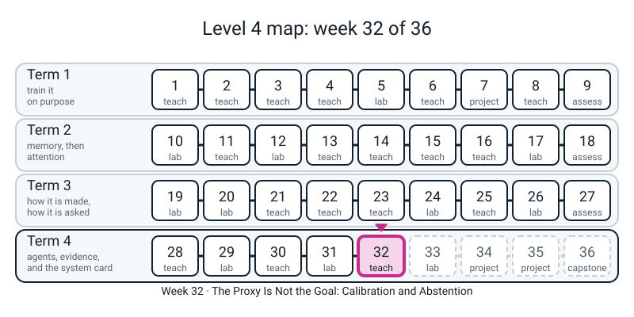
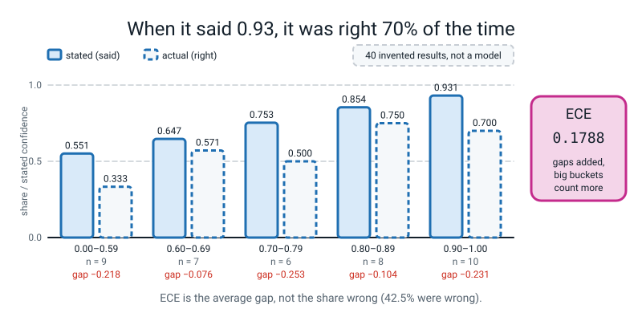
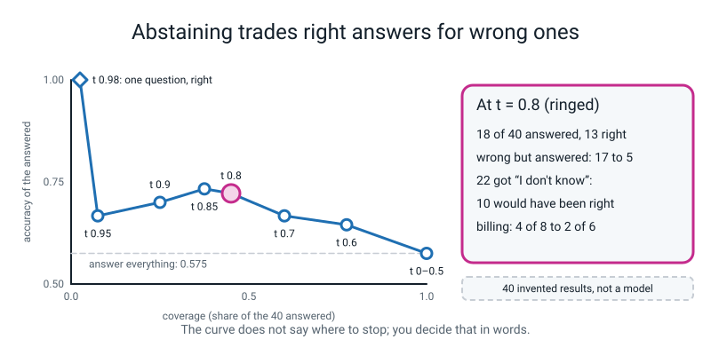

# Week 32 — The Proxy Is Not the Goal: Calibration and Abstention

[⬅ Week 31](week-31.md) · [Course Home](../README.md) · [Week 33 ➡](week-33.md) · [Student Guide](../student-guide/week-32.md) · [Workbook](../workbook/week-32.md)

---



*Figure 32.0 — Week 32 of 36: a teach week in term 4, agents, evidence and the system card.*

---

## 📋 At a Glance

| | |
|---|---|
| **Duration** | 70 minutes in class, then the workbook (~55 min: 30 of pen and paper, 25 at the computer) |
| **Type** | 🟦 Teach — a model can be wrong **and sure**. The student types 40 results, builds the **reliability table** (stated confidence against how often it was right), computes a **Brier score** and an **expected calibration error (ECE)** by hand on ten results and by code on forty, adds an **abstain threshold**, draws the **coverage-vs-accuracy curve**, and finds **a category that fell while the average rose** |
| **Big idea** | The score you optimise (accuracy) is a **proxy** for the thing you wanted (a system you can rely on when it sounds sure). Two numbers measure the gap between what a system *says* and what it *delivers*: **Brier** (squared gap, per result) and **ECE** (gap per bucket, averaged by bucket size). **Saying "I don't know" is a feature you build and measure**: an abstain threshold trades **coverage** (how many questions you answer) for **accuracy of the ones you answered**. And an average can rise while one of its parts falls — Week 31's habit, here with a reason you can read off eight rows. |
| **New vocabulary** | proxy · confidence · calibrated / overconfident · reliability table · bucket · Brier score · expected calibration error (ECE) · abstain · threshold (reused from Level 3) · coverage · "accuracy of the answered" |
| **New maths** | **The calibration gap** — Brier: square the gap between the stated probability and the outcome (1 or 0), average. ECE: bucket by stated confidence, take the gap between "said" and "was right" in each bucket, average with each bucket weighted by its size. By hand on **ten** results (Pages 32.1 and 32.2). Nothing else is new: no log-loss, no proper-scoring-rule theory, no decomposition, no confidence intervals (the standard deviation of a count is Week 33). |
| **New syntax** | `np.digitize` · `brier_score_loss` · `np.bincount`. That is three (the ladder allows up to four). *Notes:* `np.bincount(..., weights=)` is the same function used a second way, and is taught in the same breath as `minlength=`. Everything else (`zip`, f-strings with width and precision, boolean masks, `np.full`, `np.minimum`, `np.arange`, dict and list comprehensions, matplotlib) is Level 2 or 3. |
| **Dataset** | **40 typed results** (Block P0), eight in each of Week 30's five categories (`greeting`, `refund`, `technical`, `billing`, `out_of_scope`): each row is `(category, how sure the system said it was, right = 1 / wrong = 0)`. **The 40 rows are INVENTED for the lesson: written by the teacher to have a shape worth measuring. They are the log of no model. They stand in for the log of a ticket classifier and nothing measured on them says anything about a real one.** Nothing downloads. No internet. |
| **Model** | **None.** This week measures a *log*. No network is trained, no weights are loaded, no API is called. The threshold, the tables and the curve are real code on a stand-in log. |
| **Materials** | Laptop with Python 3, numpy, scikit-learn and matplotlib (nothing new) · the **40-row sheet** (Block P0 printed, one page) · the **Ten-Results Card** (Activity) · workbook pages 32.1-32.3 · a timer |
| **Prep time** | 20 minutes the night before · 2 minutes on the day |
| **Expected runtime of the code** | **Nothing in this guide takes more than a second.** Blocks P0-P6 together: about **0.9 s** (most of it importing matplotlib); the Clinic and the Answer Key, each under 0.2 s. **No block is over 10 s.** On a slow laptop expect up to 3x; **anything over 1 minute means something is wrong** (see Fallback). |

> **⚠️ Watch out:** four things go wrong this week. Each is set out below.

1. **The data are invented, and the student will forget.** Say it at the start and again at the end. The real finding the student takes away is a *method* (the table, the threshold, the per-category check); the numbers belong to a sheet of paper.
2. **Do not teach the module's story unchanged.** The reference module's data put the worst gap in the top bucket only. Ours are overconfident **in every bucket** (all five gaps negative, `-0.076` to `-0.253`; the largest is the `0.70-0.79` bucket, `-0.253`, not the top one at `-0.231`). Teach what the table says.
3. **A threshold does not make a system good: it makes it quiet.** At `t = 0.8` accuracy of the answered rises `0.575 → 0.722`, and the system has thrown away **10 right answers** to avoid 12 wrong ones (K5 prints the rows). The rule "pick the threshold with the best accuracy" picks `0.97`, which answers **1 question of 40** (Clinic D5). That bug is the lesson's title.
4. **Billing *falls* under abstention** (`0.500 → 0.333`): its confident answers are mostly wrong and its two right answers were the *unsure* ones, so abstaining discards its hits and keeps its misses. On eight rows that could be chance; say so, and say what the rows show (K5).

---

## 🎯 Lesson Objectives

By the end of the lesson the student can:

1. **Say what a proxy is** and name one for this week: *overall accuracy* stands in for *"I can rely on this when it sounds sure"*, and the two come apart (`accuracy 0.575`, average stated confidence `0.754`).
2. **Build the reliability table**: `np.digitize` puts each confidence in one of five buckets, `np.bincount` counts them (`9 7 6 8 10`), and the table shows stated against actual in each bucket (top bucket `0.931` said, `0.700` delivered).
3. **Compute Brier and ECE by hand on ten results** (Pages 32.1 and 32.2): squares and a mean; then two buckets and a size-weighted average.
4. **Compute both for all 40 by code** and check against `brier_score_loss`: Brier `0.2499`, ECE `0.1788`. Say what each number does **not** tell you.
5. **Beat a baseline for the score**: a system that says `0.575` every time scores Brier `0.2444` — *better* than ours (`0.2499`) — and is perfectly calibrated (ECE `0.0`) and useless. A score needs a comparison, as in Week 30.
6. **Add an abstain threshold** and read the coverage-vs-accuracy table: at `0.8`, coverage `0.450`, accuracy of the answered `0.722`; and say what was given up.
7. **Find the category that fell while the average rose** (billing `0.500 → 0.333` while overall rose `0.575 → 0.722`), say it in **tickets** (`4 of 8` right before; `2 of 6` answered), and say why one category of eight rows is a reason to look, not a verdict.

Observable evidence: the printed lines `[9 7 6 8 10]`-style bucket counts, `ECE = 0.1788`, `Brier, sklearn: 0.2499`, the abstain table, the `<-- FELL while the average rose` row, the saved `curve.png`, and a filled Page 32.3 with one sentence that contains a number of **results**.

---

## 🧑‍🏫 What YOU Need to Know First

This section is the background you need before teaching: the maths, what is real and what is a stand-in, the new constructs, and the limits of the lesson.

> **📌 About the code blocks in this guide.** Every block in the **🧰 Prep Checklist**, in the **🐞 Debugging Clinic** and in the **🔑 Answer Key** was run, in that order, from one scratch folder, in **one Python session**, seeded where anything is random (**nothing here is random**: the 40 rows are typed, so every number repeats exactly on every machine; a second complete run repeated every number). numpy 1.26.4, scikit-learn 1.7.1, matplotlib 3.7.1. The outputs below are the real printed output. The Clinic blocks that are *deliberate mistakes* are marked, and their tracebacks are real (paths are shortened to `/home/you/l4/`; the source line under each frame is the line that ran; library frame paths are as printed and may differ by version).

The Clinic and Key blocks continue the session of the Prep blocks, so they use names the Prep blocks defined (`conf`, `right`, `cat`, `edges`, `counts`, `stated`, `actual`, `brier`, `reliability`, `ece_of`). Nothing in this guide is **TEACHER-ONLY** in the sense of using an unlocked construct; Blocks K1-K7 are teacher-only because they hold answers.

### 1. What the student is doing today, in one paragraph

Week 31 ended with a table in which the average rose while one row fell. Today the student asks a different question of a different kind of log: *when the system says it is 90% sure, how often is it right?* They type a sheet of 40 results, and before any code they do the arithmetic on ten of them with a pencil: a Brier score and a two-bucket ECE.

Then the machine does all 40: five buckets, and a table in which **every** bucket says more than it delivers. Then the question that makes the number useful: *what if the system simply declined to answer when it was unsure?* They add a threshold, print coverage against accuracy, draw the curve, and read the per-category table **at `0.8`** — where overall accuracy has risen from `0.575` to `0.722` and billing has quietly fallen from `0.500` to `0.333`.

The honest finishing sentence: *"On these 40 invented results the system was more sure than right in every bucket (ECE 0.179); abstaining below 0.8 lifted accuracy of the answered from 0.575 to 0.722 but answered only 18 of 40; and billing went the other way, 4 of 8 to 2 of 6, because its confident answers were its wrong ones — which, on eight rows, is a reason to look, not a verdict."*

### 2. 🔢 The maths you need — taught to you first

**One idea: the calibration gap.** Three steps; do them on paper before class, on the ten results in Block K1 (every fourth row of the sheet).

**(a) Confidence and outcome.** A result is a pair: *how sure the system said it was* `p` (a number from 0 to 1) and *what happened* `y` (1 if it was right, 0 if wrong). "Calibrated" means: **of the results where it said about 0.8, about 8 in 10 were right.** Not every one, and not "it was right on average": *the stated number matches the hit rate, bucket by bucket.* A forecaster who says "80% chance of rain" on 100 days and sees rain on 55 of them is **overconfident**.

**(b) Brier: the squared gap, per result, averaged.** For each result take `(p - y)^2`. A right answer said at `0.97` costs `(0.97 - 1)^2 = 0.0009`. A wrong answer said at `0.96` costs `(0.96 - 0)^2 = 0.9216`. **Being sure and wrong costs about a thousand times more than being sure and right.**

The Brier score is the mean of these. Lower is better; `0.25` is what you get by saying `0.5` on everything (every result costs `0.25`, whatever happened). On ten results (K1): the ten squares add to `2.388`, so Brier `= 0.2388`. Do **not** say "proper scoring rule" or "quadratic". The student squares a gap and averages it.

**(c) ECE: bucket first, then compare.** Sort the results into buckets by `p`. In each bucket write down *stated* (the mean `p`) and *actual* (the share with `y = 1`), take the size of the gap, and average the gaps **with each bucket weighted by how many results it holds**. On the same ten with two buckets (`p >= 0.8` and `p < 0.8`): sure: `7` results, stated `0.9086`, actual `0.8571`, gap `0.0514`; unsure: `3` results, stated `0.68`, actual `0.0`, gap `0.68`. ECE `= 0.7 x 0.0514 + 0.3 x 0.68 = 0.24`.

**Three things to know before you are asked:**

- *ECE depends on the buckets.* On the 40 results: `2` buckets give `0.1787`, `5` give `0.1788`, `10` give `0.2123` (K3). More buckets mean fewer results per bucket, and the gaps get noisier.
- *ECE depends on which results.* The four "every fourth row" sets of ten give ECE `0.240, 0.270, 0.316, 0.165` (K1, K6): ten results is for learning the arithmetic, not for believing the answer.
- *When every bucket's gap has the same sign, ECE is just "average stated minus accuracy"*: here `0.754 - 0.575 = 0.179`. That is the mean overconfidence, and it is the only reason the 2-, 5- and 1-bucket numbers nearly agree. With gaps of both signs the buckets would cancel in the average of *signed* gaps but not in ECE, which takes the size first.

**Abstention is not new maths**, it is a comparison you already know: Week 30's precision and recall. Answer only when `p >= t`. *Coverage* is the share answered; *accuracy of the answered* is the share of those right. Raise `t`: coverage falls, and (if confidence means anything) accuracy of the answered rises.

### 3. 🧭 Real vs stand-in — and what you must NOT claim

| Thing | Status |
|---|---|
| The 40 results (Block P0) | **INVENTED.** Written by the teacher to be overconfident, with one category whose confident answers are its wrong ones. Not measured from any model. Say so when the sheet goes out and again at the wrap. |
| Brier, ECE, bucketing, the threshold, the per-category table, the curve | **Real code, exact arithmetic.** `brier_score_loss` agrees with the numpy version to four decimals. |
| "The system is overconfident" | A property of **this sheet**, not of classifiers in general. The reference module's own log (also typed, 40 results, four buckets) had ECE `0.1075`; ours is `0.1788`; neither tells you about a real model. |
| "Abstaining made the system better" | **Supported only in the narrow sense printed:** accuracy of the answered rose; the system answered less; 10 right answers were dropped. Whether that is better depends on what a wrong answer costs and a human's time costs. The code cannot say. |
| "Billing is the weak category" | **Do not say it.** Eight rows. What is supported: *in these eight rows* the confident answers were the wrong ones (K5). |
| Any real model | **Not measured.** No model exists in this lesson. |

### 4. The constructs — three new, the rest old

- **`np.digitize(values, edges)`**: for each value, which bucket it falls in, numbered from 0. With four edges there are **five** buckets: 0 is "below the first edge", 4 is "at or above the last". A value exactly on an edge goes to the **upper** bucket (`0.60 → 1`, `0.90 → 4`; Block P1). The edges must be in order (Clinic D1).
- **`np.bincount(bucket_numbers, minlength=5)`**: counts how many times each whole number 0, 1, 2, ... appears. **`minlength=5` makes the answer five long even if the top buckets are empty** (Clinic D2 is what happens without it). Used a second way with `weights=`: `np.bincount(bucket, weights=conf, minlength=5)` **adds up** the weights per bucket instead of counting, so dividing by the counts gives the mean confidence per bucket (P2). Tell the student: *"counting is adding ones; `weights` lets you add something else."*
- **`brier_score_loss(y_true, y_prob)`** from `sklearn.metrics`: the Brier score, with the **truth first**. The student has done it by hand (Page 32.1) and in numpy before this is shown; the function is for checking (Clinic D4 is the swapped call).
- **Old and used freely**: boolean masks (`conf >= t`), `.mean()` and `.sum()` on them, `np.full`, `np.minimum` (K2), `np.arange`, `zip`, f-strings with width and precision (`:>7.3f`, `:>+7.3f`), `float("nan")`, comprehensions, matplotlib `plt.subplots`, `ax.plot`, `fig.savefig`. The student writes `reliability` and `ece_of` as functions (Level 2 `def`).

### 5. What the numbers will say

| Quantity | Value | Note |
|---|--:|---|
| Accuracy of all 40 | `0.575` (23 right) | the proxy |
| Mean stated confidence | `0.754` | the claim |
| Bucket counts (`0.00-0.59`, `0.60-0.69`, `0.70-0.79`, `0.80-0.89`, `0.90-1.00`) | `9 7 6 8 10` | "about 8 each" |
| Stated → actual, per bucket | `0.551→0.333`, `0.647→0.571`, `0.753→0.500`, `0.854→0.750`, `0.931→0.700` | every gap negative |
| ECE | `0.1788` | mean overconfidence |
| Brier | `0.2499` | numpy and sklearn agree |
| Brier of "always `0.575`" / "always `0.5`" | `0.2444` / `0.2500` | the flat system is better on Brier |
| Abstain at `t = 0.8` | `18` of `40` answered, `0.722` accurate, `5` wrong but answered | coverage `0.450` |
| Abstain at `t = 0.9` | `10` answered, `0.700` | **lower** than at `0.8`: the curve is not a smooth climb |
| Billing at `t = 0.8` | `0.500 → 0.333` (`4/8` → `2/6`) | the category that fell; also falls at `0.7` and `0.9` |
| Confidence capped at `0.85` (K2) | ECE `0.1788 → 0.1560`, Brier `0.2499 → 0.2428` | same accuracy, no retraining |


*Figure 32.1 — In every bucket the system said more than it delivered; ECE is the average size of that gap, weighted by bucket.*


*Figure 32.2 — Raising the threshold removes wrong answers by also removing right ones; the curve cannot say where to stop.*

### 6. The honest limits of today

- **Invented data, forty rows, buckets of six to ten.** Everything measured is a property of a sheet of paper.
- **The threshold was looked at.** `0.8` was chosen because it is round and shows the effect; other thresholds are printed (P4, K7) so the student can see the choice. If a student picks the threshold with the best accuracy, that is Clinic D5, and the correct remark is that a threshold for a *real* system is chosen on one set of results and judged on a **second** set it has not seen (Week 30's frozen eval idea). We have no second set.
- **No error bars.** We say "one category of eight rows" and "ten results is noisy" and give the spread we measured (ECE from `0.165` to `0.316` on four sets of ten). We do not compute an uncertainty; Week 33 introduces the standard deviation of a count.
- **ECE is one of several ways to score calibration.** Say that; do not teach the others. Do not teach "temperature scaling" or "Platt scaling"; if asked, *"ways of adjusting the stated numbers after the fact; we do the simplest one, capping, in K2."*
- **A capped confidence is an admission, not an improvement.** K2 lowers ECE without changing a single answer. It fixes what the system *says*. It does not fix what it *gets right*.
- **The ledger's real defects are not this week's.** The redactor and probe scripts that failed to import (Module 9) belong to Week 33. The calibration script in the ledger ran exactly as written (ECE `0.1075`, Brier `0.2150`); this week's sheet is a different, bigger table on purpose.

### 7. The misconceptions you will actually see, and where

| Misconception | Where it appears | What to do |
|---|---|---|
| "High accuracy means it is calibrated" | Objective 1 | Accuracy is one number about *what*; calibration is about *how sure it said*. The flat system in K4 has a perfect ECE and `0.575` accuracy. |
| "Calibrated means right" | Hook | A system that says `0.6` and is right 6 times in 10 is calibrated and wrong 4 times in 10. |
| "Brier `0.25` is bad, so ours is bad" | P3 | `0.25` is the score of saying `0.5` every time; ours is `0.2499` — barely better than a coin's worth of confidence — and worse than the flat `0.2444`. Say what that *does* show: on Brier alone, these confidence numbers are worth no more than the overall hit rate. Then show that they still sort (P4 rises from `0.575` to `0.722`). Both are true. |
| "ECE `0.18` means it is wrong 18% of the time" | P2 | No: it is the average size of the gap between said and delivered. The system is wrong 42.5% of the time. |
| "Abstaining is free" | P4 | Coverage falls `1.000 → 0.450`; 22 questions get "I don't know"; 10 of them it would have got right. |
| "Pick the threshold that maximises accuracy" | P4 | D5. It answers one question. |
| "The average rose, so every part rose" | P5 | The billing row. Week 31's lesson again. |
| "Billing is bad at everything" | P5 | Its two unsure answers were right. Its confident ones were wrong. That is a *calibration* failure, not a weak category. |
| "`np.digitize` buckets start at 1" | P1 | They start at 0 — the "below the first edge" bucket. |
| "Confidence of `0.95` means 95% of answers are right" | P2 | Only if the system is calibrated — which is exactly what we are testing. |

### 8. How deep to go, and where to stop

Stop at: *"stated against actual, per bucket; square the gap for Brier; size-weighted gap for ECE; answer only above a threshold; read it per category."* Do **not** derive why squaring is used. Do **not** define calibration for multi-class outputs, do not mention "reliability diagram" beyond the student's table, and do not say "proper scoring rule". If a student asks why Brier squares: *"so a sure-and-wrong answer costs much more than an unsure-and-wrong one — `0.96` wrong costs `0.92`, `0.60` wrong costs `0.36`."* If they ask how to make a real model calibrated: *"you can rescale its numbers afterwards, or cap them, or show an independent signal next to the answer, like how close the retrieved note was (Week 26). We cap in K2. We did not build the rest."* If they ask about a real model's calibration: *"I have not measured one in this course."*

**A sentence you may use, not assessed:** *"when a number becomes the target, it stops being a good number."* The accuracy-of-the-answered curve ends at `1.000` on one question: a perfect score for a system that answers nothing.

### 9. 🧭 Where Week 32 sits

Week 30 built the frozen 30-ticket eval and the per-category table; Week 31 used them and found a regression. Week 32 asks a different question of a log — **not "how often is it right" but "how often is it right when it says it is sure"** — and reuses Week 30's precision/recall vocabulary for abstention. Week 33 attacks the system; its first question, *"how much does a count wobble?"*, is the honest answer to the "no error bars" above. The capstone's eval report (Week 35) asks for a per-category table, and its system card (Week 36) asks for a number and a sample size behind every claim: this week's **n = 8 and 40** habit is that.

---

## 🧰 Prep Checklist

This section is for the night before: it gets the typed sheet and the prep blocks running so you can check every number in the lesson.

### 20 minutes the night before

1. Make a scratch folder. Print Block P0 as the **40-row sheet** (one page). The student **types** it; do not hand them the file.
2. Type the blocks below, in order, into **one Python session**, from that folder. Blocks P1 to P6 use names from earlier blocks (`np`, `conf`, `right`, `cat`, `edges`).
3. Compare every printed number with this guide. Nothing is random, so **every** number should match exactly; if one does not, the sheet has a typo (compare `accuracy 0.575` first).
4. Print the **Ten-Results Card** (Activity) and workbook pages 32.1-32.3. Make one copy of your own K1 answer for the board.

```python
# p0_results.py - Week 32 block P0: the 40 typed results. A HANDED-OUT SHEET, typed by the student.
# INVENTED FOR THE LESSON: these 40 rows were written by the teacher to have a shape worth measuring.
# They are not the output of any model. They stand in for the log of a support-ticket classifier
# that reports its top label and how sure it is. Nothing measured on them says anything about a real model.
# Each row: (category, how sure it said it was, was it right: 1 or 0). Eight rows per category.
import numpy as np

RESULTS = [
    ("greeting", 0.97, 1), ("greeting", 0.95, 1), ("greeting", 0.92, 1), ("greeting", 0.88, 1),
    ("greeting", 0.91, 1), ("greeting", 0.85, 1), ("greeting", 0.62, 0), ("greeting", 0.55, 1),
    ("refund", 0.93, 1), ("refund", 0.89, 1), ("refund", 0.84, 1), ("refund", 0.78, 1),
    ("refund", 0.72, 0), ("refund", 0.66, 1), ("refund", 0.58, 0), ("refund", 0.52, 0),
    ("technical", 0.81, 1), ("technical", 0.76, 1), ("technical", 0.74, 0), ("technical", 0.68, 1),
    ("technical", 0.63, 0), ("technical", 0.59, 1), ("technical", 0.55, 0), ("technical", 0.51, 0),
    ("billing", 0.96, 0), ("billing", 0.94, 1), ("billing", 0.92, 0), ("billing", 0.90, 0),
    ("billing", 0.87, 1), ("billing", 0.83, 0), ("billing", 0.64, 1), ("billing", 0.57, 1),
    ("out_of_scope", 0.91, 1), ("out_of_scope", 0.86, 0), ("out_of_scope", 0.79, 1), ("out_of_scope", 0.73, 0),
    ("out_of_scope", 0.69, 0), ("out_of_scope", 0.61, 1), ("out_of_scope", 0.56, 0), ("out_of_scope", 0.53, 0),
]

cat = np.array([row[0] for row in RESULTS])
conf = np.array([row[1] for row in RESULTS])
right = np.array([row[2] for row in RESULTS], dtype=float)

print(len(RESULTS), "results")
print({name: int((cat == name).sum()) for name in ["greeting", "refund", "technical", "billing", "out_of_scope"]})
print(f"accuracy {right.mean():.3f}   average stated confidence {conf.mean():.3f}")
```
```text
40 results
{'greeting': 8, 'refund': 8, 'technical': 8, 'billing': 8, 'out_of_scope': 8}
accuracy 0.575   average stated confidence 0.754
```

```python
# p1_digitize.py - Week 32 block P1: the two new helpers on tiny inputs, before they touch the 40 results.
edges = [0.6, 0.7, 0.8, 0.9]            # four edges make five buckets: below 0.6, 0.6-0.7, 0.7-0.8, 0.8-0.9, 0.9 and up
print(np.digitize([0.55, 0.60, 0.65, 0.95, 0.90], edges))     # which bucket each number falls in
print(np.bincount([0, 1, 1, 4, 4, 4], minlength=5))           # how many landed in each bucket
```
```text
[0 1 1 4 4]
[1 2 0 0 3]
```

```python
# p2_reliability.py - Week 32 block P2: the reliability table (stated vs actual, per bucket) and ECE.
def reliability(conf, right, edges):
    bucket = np.digitize(conf, edges)                              # 0..len(edges): one number per result
    n_b = len(edges) + 1
    counts = np.bincount(bucket, minlength=n_b)                    # results per bucket
    safe = np.maximum(counts, 1)                                   # an empty bucket must not divide by zero
    stated = np.bincount(bucket, weights=conf, minlength=n_b) / safe     # mean stated confidence per bucket
    actual = np.bincount(bucket, weights=right, minlength=n_b) / safe    # share actually right per bucket
    return counts, stated, actual


def ece_of(counts, stated, actual):
    return float(np.sum(counts / counts.sum() * np.abs(stated - actual)))     # big buckets count for more


labels = ["0.00-0.59", "0.60-0.69", "0.70-0.79", "0.80-0.89", "0.90-1.00"]
counts, stated, actual = reliability(conf, right, edges)
print(f"{'bucket':<10} {'n':>3} {'stated':>7} {'actual':>7} {'gap':>7}")
for lab, k, s, a in zip(labels, counts, stated, actual):
    print(f"{lab:<10} {k:>3} {s:>7.3f} {a:>7.3f} {a - s:>+7.3f}")
print(f"ECE = {ece_of(counts, stated, actual):.4f}")
```
```text
bucket       n  stated  actual     gap
0.00-0.59    9   0.551   0.333  -0.218
0.60-0.69    7   0.647   0.571  -0.076
0.70-0.79    6   0.753   0.500  -0.253
0.80-0.89    8   0.854   0.750  -0.104
0.90-1.00   10   0.931   0.700  -0.231
ECE = 0.1788
```

```python
# p3_brier.py - Week 32 block P3: the Brier score, by hand-in-numpy and by sklearn, and two baselines to beat.
from sklearn.metrics import brier_score_loss

brier = float(np.mean((conf - right) ** 2))                        # mean of squared gaps
print(f"Brier, numpy:   {brier:.4f}")
print(f"Brier, sklearn: {brier_score_loss(right, conf):.4f}")      # argument order: the truth first, then the probabilities

flat = np.full(len(right), right.mean())                           # a system that says the same thing every time: its accuracy
print(f"Brier of always saying {right.mean():.3f}: {np.mean((flat - right) ** 2):.4f}")
print(f"Brier of always saying 0.5:   {np.mean((0.5 - right) ** 2):.4f}")
```
```text
Brier, numpy:   0.2499
Brier, sklearn: 0.2499
Brier of always saying 0.575: 0.2444
Brier of always saying 0.5:   0.2500
```

```python
# p4_abstain.py - Week 32 block P4: abstention. Answer only when conf >= t; otherwise say "I don't know".
print(f"{'t':>5} {'answered':>8} {'coverage':>8} {'accuracy of answered':>21} {'wrong but answered':>19}")
for t in [0.0, 0.5, 0.6, 0.7, 0.8, 0.85, 0.9, 0.95]:
    answered = conf >= t
    k = int(answered.sum())
    acc = right[answered].mean() if k > 0 else float("nan")
    print(f"{t:>5.2f} {k:>8} {answered.mean():>8.3f} {acc:>21.3f} {int((answered & (right == 0)).sum()):>19}")
```
```text
    t answered coverage  accuracy of answered  wrong but answered
 0.00       40    1.000                 0.575                  17
 0.50       40    1.000                 0.575                  17
 0.60       31    0.775                 0.645                  11
 0.70       24    0.600                 0.667                   8
 0.80       18    0.450                 0.722                   5
 0.85       15    0.375                 0.733                   4
 0.90       10    0.250                 0.700                   3
 0.95        3    0.075                 0.667                   1
```

```python
# p5_category.py - Week 32 block P5: the per-category table before and after abstaining at 0.8. Find what fell.
t = 0.8
answered = conf >= t
print(f"threshold {t}: overall accuracy {right.mean():.3f} -> {right[answered].mean():.3f}  "
      f"(answered {int(answered.sum())} of {len(conf)})")
print(f"{'category':<13} {'n':>2} {'before':>7} {'answered':>8} {'after':>7} {'change':>8}")
for name in ["greeting", "refund", "technical", "billing", "out_of_scope"]:
    mine = cat == name
    kept = mine & answered
    before = right[mine].mean()
    after = right[kept].mean() if kept.sum() > 0 else float("nan")
    flag = "   <-- FELL while the average rose" if after < before else ""
    print(f"{name:<13} {int(mine.sum()):>2} {before:>7.3f} {int(kept.sum()):>8} {after:>7.3f} {after - before:>+8.3f}{flag}")
```
```text
threshold 0.8: overall accuracy 0.575 -> 0.722  (answered 18 of 40)
category       n  before answered   after   change
greeting       8   0.875        6   1.000   +0.125
refund         8   0.625        3   1.000   +0.375
technical      8   0.500        1   1.000   +0.500
billing        8   0.500        6   0.333   -0.167   <-- FELL while the average rose
out_of_scope   8   0.375        2   0.500   +0.125
```

```python
# p6_curve.py - Week 32 block P6: the coverage-vs-accuracy curve. One point per threshold.
import matplotlib
matplotlib.use("Agg")                                   # draw to a file, not a window
import matplotlib.pyplot as plt

cov, acc = [], []
for t in np.round(np.arange(0.50, 0.981, 0.01), 2):
    answered = conf >= t
    if answered.sum() >= 1:
        cov.append(answered.mean())
        acc.append(right[answered].mean())

print(f"{len(cov)} points; first (coverage, accuracy) = ({cov[0]:.3f}, {acc[0]:.3f}); last = ({cov[-1]:.3f}, {acc[-1]:.3f})")
fig, ax = plt.subplots()
ax.plot(cov, acc, marker="o")
ax.set_xlabel("coverage (share of questions answered)")
ax.set_ylabel("accuracy of the answered ones")
ax.set_title("Coverage vs accuracy (40 invented results)")
fig.savefig("curve.png")
print("saved curve.png")
```
```text
48 points; first (coverage, accuracy) = (1.000, 0.575); last = (0.025, 1.000)
saved curve.png
```

### 2 minutes on the day

Open a terminal in the scratch folder. Run P0 only, to check the sheet has 40 rows and accuracy `0.575`. Leave everything else for the lesson.

### Fallback if the laptops fail

- **`accuracy` is not `0.575`**: a row is mistyped. Print `RESULTS[i]` next to the sheet, eight at a time.
- **`brier_score_loss` import fails**: scikit-learn is missing. Say the numpy line is the real definition and skip the sklearn check (it is a check, not a step).
- **matplotlib will not draw**: P6 prints the first and last points of the curve; the student can plot by hand from the P4 table on graph paper (`coverage` across, `accuracy` up). `curve.png` is the only file the lesson writes.
- **A student's table has the wrong number of rows**: Clinic D2 (`minlength`) is the likely cause.
- **No computers at all**: run the Hook, Pages 32.1 and 32.2, and read the P2, P4 and P5 tables from paper.

---

## ⏱️ The Lesson, Minute by Minute

This section is the running order of the lesson, with what to say, ask and expect in each segment.

| Time | Segment | What happens |
|---|---|---|
| 0:00-0:05 | 🪝 Hook | The forecaster: "80% chance of rain" and what you would check |
| 0:05-0:20 | 🧠 Teach | Proxy; Brier and ECE on the ten results, pen only (Pages 32.1 and 32.2) |
| 0:20-0:35 | 🎲 Their turn 1 | Type the sheet (P0); `digitize` and `bincount` (P1); the reliability table (P2) |
| 0:35-0:45 | 🎲 Their turn 2 | Brier by numpy and sklearn (P3); the flat baseline |
| 0:45-0:60 | 🎲 Their turn 3 | Abstain table (P4); per-category table at `0.8` (P5) |
| 0:60-0:67 | 🎲 Their turn 4 | The curve (P6); the honest sentences on Page 32.3 |
| 0:67-0:70 | 🔑 Wrap | One sentence that contains a number of results, and the words "invented" |

### 🪝 Hook — The Forecaster (5 minutes)

Say: *"A forecaster says '80% chance of rain' on a hundred different mornings. It rained on 55 of them. Is the forecaster wrong?"* Let them argue. (On any one morning you cannot say. Over the hundred, the forecaster said more than they delivered.) Then: *"If I tell you only how many mornings the forecaster got right out of a hundred, do you know whether they were honest about how sure they were?"* (No.) Write on the board: **right answers** and **honest about being sure**. *"Today those are two different numbers."*

### 🧠 Teach — The proxy, and ten results (15 minutes)

Three sentences for the whiteboard:

- *"We measure what we can: here, how often the answer was right. That is a stand-in — a proxy — for what we want, which is 'I can trust this when it sounds sure.'"*
- *"A result is: how sure it said it was, and whether it was right. Calibrated means: when it said about 0.8, about 8 in 10 were right."*
- *"Brier: square the gap for each result and average. ECE: sort into buckets by how sure, compare said with delivered in each bucket, and average the gaps with big buckets counting more."*

Hand out the **Ten-Results Card** (every fourth row of the sheet) and let them do **Page 32.1 (Brier) and 32.2 (two-bucket ECE) with a pencil** — 10 minutes. Circulate on the two costs: *a sure-and-wrong row costs `0.9216`, a sure-and-right one `0.0009`.* Ask: *"Which single row made the biggest difference to your Brier?"* (`billing 0.96, wrong`: `0.9216` of a total `2.388`.) Answers in K1. Tell them the computer will do the other 30 in a moment and that their number should match the one the code prints *for the same ten rows*, which K1 prints.

### 🎲 Their Turn 1 — The sheet and the reliability table (15 minutes)

1. **Type the 40 rows (P0).** 6 minutes; the sheet is the only typing of the lesson. Say, as they start: *"These rows are invented. They are not the output of a model. I wrote them to have something to find."* The check: `accuracy 0.575`.
2. **P1**: two tiny calls on a few numbers. Ask them to predict the output of `np.digitize([0.55, 0.60, 0.65, 0.95, 0.90], edges)` before running it. (`[0 1 1 4 4]`; many say `0.60` goes to bucket 0 — it goes to 1.) Then `np.bincount([0, 1, 1, 4, 4, 4], minlength=5)`: `[1 2 0 0 3]`.
3. **P2**: `reliability` and `ece_of`. The student writes the function one line at a time; ask at each line *"what is this array right now? how long is it?"* Read the table **row by row before reading the ECE**: *"Which bucket is the worst? Which way does every gap point?"* (All five negative; worst is `0.70-0.79`.) Ask them to say the top row in a sentence: *"When it said about 0.93 it was right 70% of the time."*

### 🎲 Their Turn 2 — Brier, and a baseline to beat (10 minutes)

Run P3. The numpy and sklearn numbers agree (`0.2499`). Then the two flat lines. Ask: *"A system that says `0.575` every single time scores `0.2444`. Ours scores `0.2499`. Which is better?"* (The flat one, by Brier.) *"So is our confidence worthless?"* Let them think. (Not quite: P4 will show it sorts — but not very well, and it overclaims. The flat system has a perfect ECE and cannot tell a sure question from an unsure one: K4.) Write the lesson of the ten minutes: **a score needs a comparison**, as Week 30's `0.833` did.

### 🎲 Their Turn 3 — "I don't know" (15 minutes)

1. **P4**: the student reads the table and says what each column means. Ask: *"At `0.8` the system answers 18 of 40 and gets 13 right. What happened to the other 22?"* (It says "I don't know"; 10 of those it would have got right.) *"Is that a good trade?"* (Depends on what a wrong answer costs. Ask the student for a case where it is, a case where it is not.)
2. **The accuracy-of-the-answered column does not rise forever**: `0.722` at `0.80`, `0.733` at `0.85`, `0.700` at `0.90`, `0.667` at `0.95`. *"Why would raising the bar make it worse?"* (Fewer answers, so a few sure-and-wrong ones weigh more; and the sure-and-wrong ones *are* the highest-confidence ones. 3 answers at `0.95`.)
3. **P5**: predict first. *"At `0.8` overall accuracy rose from `0.575` to `0.722`. Will every category rise?"* (Most students say yes.) Run it. Billing falls; read it in tickets: `4 of 8` right, then `2 of 6`. Ask *why* with the rows in view (K5): *"what do the two abstained billing results have in common?"* (Both right, both unsure.)

### 🎲 Their Turn 4 — The curve and the sentences (7 minutes)

Run P6; open `curve.png` (or draw by hand). Ask them to put a finger on the point for `t = 0.8` (`0.450, 0.722`) and on the last point (`0.025, 1.000`). *"One question answered, one right. Is that the best system?"* Then **Page 32.3**: the four sentences. Allow a pencil while the plot draws.

### 🔑 Wrap & Assign (3 minutes)

Each student says one sentence that contains a number of **results** and the word *invented*. For example: *"On these invented 40 results, abstaining below 0.8 took accuracy from 23 right of 40 to 13 right of 18, and billing went the other way, 4 of 8 to 2 of 6."* Collect Page 32.3. Assign the homework.

---

## 🐞 The Debugging Clinic

This section holds deliberate bugs, some loud and some silent, to run with the student and talk through.

### How to teach debugging without giving the answer

Run each block; ask *"what did you expect to see, and what did you see?"*; let them propose the one line that would have caught it. Two of the five are **silent** (D3, D5): the run completes and the number looks like a result. The habit to teach is the **sanity check**: the bucket counts add to 40; the array has as many entries as the table has rows; the numpy and sklearn Brier agree; and *"how many answers does this threshold leave?"* beside every accuracy.

### Bug D1 — edges out of order (loud)

Ask the student to type the edges in a different order as a dare.

```python
# DELIBERATE BUG D1 (loud): the edges are not in order, so digitize cannot tell which bucket is which.
np.digitize(conf, [0.9, 0.6, 0.8, 0.7])
```
```text
Traceback (most recent call last):
  File "/home/you/l4/d1_unsorted.py", line 2, in <module>
    np.digitize(conf, [0.9, 0.6, 0.8, 0.7])
  File "numpy/lib/function_base.py", line 5725, in digitize
    raise ValueError("bins must be monotonically increasing or decreasing")
ValueError: bins must be monotonically increasing or decreasing
```

*The message says what is wrong.* Keep the edges in a list named `edges` and never retype them; a sorted list is a thing to assert (`edges == sorted(edges)`).

### Bug D2 — a `bincount` too short (loud)

```python
# DELIBERATE BUG D2 (loud): bincount with no minlength. The technical rows never reach 0.9, so the array is too short.
mine = cat == "technical"
counts_t = np.bincount(np.digitize(conf[mine], edges))
print("counts:", counts_t, "  length", len(counts_t))
print("share in the top bucket:", counts_t[4] / counts_t.sum())
```
```text
counts: [3 2 2 1]   length 4
Traceback (most recent call last):
  File "/home/you/l4/d2_minlength.py", line 5, in <module>
    print("share in the top bucket:", counts_t[4] / counts_t.sum())
IndexError: index 4 is out of bounds for axis 0 with size 4
```

*Reading it:* the technical rows have confidences up to `0.81`, so bucket 4 is empty and `np.bincount` stops at the largest number it saw. The result has four entries, not five. Fix: `minlength=5`. Point out what would have happened in P2 without it: `zip` stops at the shorter list and the table **silently loses its last row**. That is why P2 says `minlength=n_b`.

### Bug D3 — an unweighted ECE (SILENT)

```python
# DELIBERATE BUG D3 (SILENT): ECE as a plain average of the five gaps, so a bucket of 6 counts as much as a bucket of 10.
print("ECE, unweighted:", round(float(np.mean(np.abs(stated - actual))), 4), "  (P2 printed", round(ece_of(counts, stated, actual), 4), ")")
```
```text
ECE, unweighted: 0.1763   (P2 printed 0.1788 )
```

*The difference is small here (`0.1763` against `0.1788`) and that is the danger.* Ask: *"which bucket should count for more, the one with 6 results or the one with 10?"* With 40 results nothing is visibly wrong; with uneven buckets (a bucket of 1) the unweighted version lets one result steer the score. The check: the weights `counts / counts.sum()` add to 1.

### Bug D4 — swapped arguments (loud)

```python
# DELIBERATE BUG D4 (loud): the arguments to brier_score_loss the wrong way round (probabilities first).
print(brier_score_loss(conf, right))
```
```text
Traceback (most recent call last):
  File "/home/you/l4/d4_swapped.py", line 2, in <module>
    print(brier_score_loss(conf, right))
  File "sklearn/utils/_param_validation.py", line 218, in wrapper
    return func(*args, **kwargs)
  File "sklearn/metrics/_classification.py", line 3609, in brier_score_loss
    transformed_labels, y_proba = _validate_binary_probabilistic_prediction(
  File "sklearn/metrics/_classification.py", line 3446, in _validate_binary_probabilistic_prediction
    raise ValueError(
ValueError: The type of the target inferred from y_true is continuous but should be binary according to the shape of y_prob.
```

*Reading it:* scikit-learn looked at the first argument, saw decimals, and said it is not a set of 0/1 answers. The truth comes first. The numpy line has no order to get wrong; this is why the student wrote that one first.

### Bug D5 — chasing the proxy (SILENT)

```python
# DELIBERATE BUG D5 (SILENT): "pick the threshold with the best accuracy". The score being chased is not the goal.
best = None
for t in np.round(np.arange(0.50, 0.981, 0.01), 2):
    answered = conf >= t
    if answered.sum() >= 1:
        acc = right[answered].mean()
        if best is None or acc > best[1]:
            best = (round(float(t), 2), float(acc), int(answered.sum()))
print(f"best threshold {best[0]}: accuracy of answered {best[1]:.3f} on {best[2]} of 40 answers")
```
```text
best threshold 0.97: accuracy of answered 1.000 on 1 of 40 answers
```

*Nothing failed. The run completes and prints an accuracy of `1.000`.* Ask: *"would you ship a system that answers one question in forty?"* This is the title of the week. The check is a second column: **always print the number answered next to the accuracy.** The repair is not a cleverer maximum but a decision made in words first: *"I need to answer at least half the questions"* (coverage at least `0.5`) and *then* find the threshold. For example `t = 0.7` answers `24` and scores `0.667` — and that would be chosen by looking at the same 40 results, which is its own small sin (section 6).

### One more, for discussion: a category of one

In P5 at `t = 0.9`, `technical` has **no** answers at all (K7) and at `0.8` it has **one**, so its "after" is `1.000` on a single result. A table that reports `+0.500` for a category of one answer is reporting nothing. Ask: *"what should the table print for a category with no answers?"* (`nan`, or better, `0 answered`; never `1.000`.)

---

## 🎲 The Activity, In Full

This section gives the pen-and-paper card used in the Teach and on the first two workbook pages, plus variations.

### The Ten-Results Card (10 minutes, pen and paper, used in the Teach and again for Pages 32.1 and 32.2)

Print the ten rows of Block K1's first printout (every fourth row of the sheet, starting at the first), one per line, with two blank columns: `(p - y)` and `(p - y)^2`.

- **Page 32.1 (Brier):** fill the ten squares (two decimals is enough), add them, divide by ten. Answer `2.388 / 10 = 0.2388`. Then circle the most expensive row (billing `0.96`, wrong: `0.9216`) and write one sentence.
- **Page 32.2 (ECE, two buckets):** split the ten rows into *sure* (`p >= 0.8`) and *unsure* (`p < 0.8`); for each write the count, the mean `p`, the share right. Then `ECE = (n_sure/10) x gap_sure + (n_unsure/10) x gap_unsure`. Answer `0.24`.
- **The swap:** pairs swap cards: the *other* fourth-row sets (K6) give Brier `0.1963, 0.2937, 0.2707` and ECE `0.270, 0.316, 0.165`. Ask: *"the same sheet, four answers for ECE. Which is the right one?"* (None. Ten results is not enough; forty is a little better.)

### Variation — shorter (a 60-minute slot)

Drop P6 (the plot) to homework; do the per-category table from P5 and the sentences.

### Variation — an anxious or slow student

Do Page 32.1 only; give them the typed `RESULTS` as a file; the grade is on the sentence *"a wrong answer said with 96% costs 0.92; a right one costs 0.0009."*

### Variation — harder

Cap the confidence at `0.85` (K2) *before* running P4 and predict whether the abstain table changes. (Yes: at `t = 0.85` and above it answers everything that was capped at `0.85`, and nothing above; use it to explain why a capped system has lost its ability to say "very sure".) Or: choose the threshold with a coverage floor of `0.5` *on the first 20 rows* and judge it on the last 20, and report both.

---

## ❓ Questions Students Ask This Week

This section lists the questions students ask most this week, with a short answer for each.

- **"Is the system real?"** No: the 40 rows are invented. The code is real; the sheet stands in for a log. Say it every time.
- **"Why are the 40 rows so overconfident?"** Because I wrote them that way, so there was something to measure. A real classifier may be better or worse; you have to measure it.
- **"Why square the gap for Brier?"** So a sure-and-wrong answer costs much more than an unsure-and-wrong one: `0.96` wrong costs `0.92`; `0.6` wrong costs `0.36`.
- **"What is a good ECE?"** There is no universal cutoff. `0.00` is perfect, and a flat system gets it for free (K4). Compare against another version of the *same* system, on the same results.
- **"Why not just use lots of buckets?"** With 40 results, ten buckets are three or four results each, and ECE rises to `0.2123` (K3) — partly real, partly noise. There is no answer without more results.
- **"Could the system fix itself by lowering its own numbers?"** That is capping (K2): ECE `0.1788 → 0.1560` with no change to any answer. It is a change to what the system says.
- **"Billing is bad. Should we retrain it?"** You do not know that from eight rows. You know its confident answers were wrong and its unsure ones were right. Collect more rows first.
- **"Does this work for the RAG system from Week 26?"** The same code works on any log of (confidence, right). The retrieval similarity is a candidate "confidence". Nobody has measured that here.

---

## ⚠️ Where This Lesson Goes Wrong

This section lists the failure points to watch for, with the fix for each.

1. **The student forgets the data are invented.** Put the word on the board. Ask it at the wrap.
2. **The student reads ECE as an error rate.** Ask for the error rate first (`1 - 0.575 = 0.425`).
3. **The student chooses the threshold with the best accuracy.** D5. Ask for coverage.
4. **The teacher says "abstention improves the system".** It improves one number about the answered ones and leaves 22 questions with no answer. Say what the trade is.
5. **The teacher says "billing is the problem category".** Eight rows; say what the rows show.
6. **Ten results, one ECE.** The Activity's swap shows the number moves from `0.165` to `0.316` with which ten you take. If a student quotes `0.24` as a property of the system, send them back to the swap.
7. **The P4 column is read as always rising.** It does not (`0.733` at `0.85`, `0.700` at `0.90`). Do not smooth it in the telling.
8. **The flat baseline is treated as a trick.** It is the honest comparison for Brier; it is what Week 30's rules baseline was for accuracy.

---

## 🧭 Differentiation

This section adapts the lesson for a student who is struggling, flying or disengaged.

### If the student is struggling

Drop ECE's second half: do Page 32.1 (Brier) and the one-line statement *"of the results where it said about 0.9, this many were right"* on the top bucket only. Give `reliability` as a file. The grade is on: *stated 0.93, delivered 0.70, invented data.*

### If the student is flying

- Build the 10-bucket version and explain in writing why ECE rose (K3).
- Compute the per-category table at every threshold from `0.5` to `0.95` and list every (category, threshold) where a category fell; then say which are n ≤ 2 (not evidence).
- Add a third option to the abstain rule: answer if `p >= t` **or** the category is `greeting`, and show what it does to coverage. (Discuss: this is using the category as a second signal.)
- Make the log for their own system: 20 results from the Week 26 RAG assistant, with the top retrieval similarity as "confidence", and run P2 and P5 on it. **Not run in this guide**: it depends on their notes. Report `n` next to every number.

### If the student won't engage today

Give them the P2 table on paper and ask one question: *"the system says 0.93. What should you believe?"* Then P5: *"which category went down, and how many results was that?"*

---

## ✅ Assessing Understanding

This section gives the marking rules, a table for reading the pattern in a student's work, and a mastery scale.

### The marking rules

Mark against the four sentences on Page 32.3; each is worth one.

1. *What was said against what was delivered*, with numbers (top bucket `0.931` said, `0.700` right; or ECE `0.179`).
2. *What Brier and ECE each measure* in words (squared gap per result; bucket gap weighted by size), and the hand numbers for ten (`0.2388`, `0.24`).
3. *What abstaining bought and cost*, both numbers (`0.575 → 0.722`; 18 of 40 answered).
4. *The category that fell*, in results (`4 of 8 → 2 of 6`), and why it is a reason to look and not a verdict (eight rows; invented).

### Reading the pattern

| Pattern | Likely cause |
|---|---|
| Writes "ECE is 18% error" | Confusing the gap with the error rate; ask for `1 - accuracy`. |
| Gets Brier right, ECE wrong | Weighting: ask "which bucket counts more and why?" |
| Picks `0.97` as the best threshold | D5; ask how many answers it leaves. |
| Says "billing is weak" | Reads a table as a verdict; ask for its unsure rows. |
| Never says "invented" | Reads the sheet as a result; ask what model produced it. |

### Mastery scale for this week

| Level | What it looks like |
|---|---|
| 🟥 Not yet | Says the system is good because accuracy is `0.575` and the confidences are high; cannot say what a bucket is. |
| 🟨 Emerging | Runs the code and reads the table; cannot do ECE on ten by hand or say why the top bucket is a problem. |
| 🟩 Secure | Hand Brier and ECE right; reads the table; states the abstain trade with both numbers; reads the billing row in results. |
| 🟦 Strong | Also notes the flat baseline beats the system on Brier, that the curve is not monotone, that ten-result ECE moves (`0.165-0.316`), and that the whole thing is invented data. |

---

## 📤 Homework to Assign

This section states the homework to hand out and its time estimate.

~55 minutes, in the workbook, pages 32.1-32.3. The three tasks:

1. **Another ten by hand (pages 32.1-32.2).** Take every fourth row **starting at the second row** (`RESULTS[1::4]`), and do Brier and the two-bucket ECE with a pencil. Then check with code. (K6: Brier `0.1963`, sure `n=6` actual `0.667`, unsure `n=4` actual `1.000`, ECE `0.2700`.) Finish with one sentence on why this ECE is not the same as the class's.
2. **Two more thresholds (page 32.3).** Print the per-category table at `t = 0.7` and `t = 0.9`. Report overall before and after, the **number answered**, and every category that fell. (K7: at `0.7`, `0.575 → 0.667` on 24 answered; at `0.9`, `0.575 → 0.700` on 10, with `technical` having **no** answers; billing falls both times.) Say which rows are n ≤ 2 and should not be read.
3. **The sentences (page 32.3).** Write the four sentences. Then write the one change you would make to a system like this, **where "make the model better" is not allowed** (cap the stated number; show the retrieval similarity beside the answer; abstain below a threshold chosen on a second set of results). K2 shows the first on these rows.

Extension for the fast student: the 20-result log from their own Week 26 assistant (see Differentiation). Report `n` next to every number and say what you could not conclude.

---

## 🔑 Answer Key

This section holds the teacher-only answers: checked code for each page, the model answer for the last workbook page, and answers to every question posed in the lesson.

### K0 — the data, in one line

40 rows, eight per category; 23 right (`0.575`); mean stated `0.754`. **Invented.** Block P0 prints these.

### K1 — Pages 32.1 and 32.2 (ten results, by hand)

```python
# k1_ten.py - Week 32 key: Page 32.1 (ten results, by hand) checked by machine. Every 4th row of the 40, starting at the first.
ten = RESULTS[::4]
for row in ten:
    print(row)
p = np.array([row[1] for row in ten])
y = np.array([row[2] for row in ten], dtype=float)
print("squared gaps:", np.round((p - y) ** 2, 4))
print("sum", round(float(np.sum((p - y) ** 2)), 4), "  Brier", round(float(np.mean((p - y) ** 2)), 4))
print("accuracy", y.mean(), "  mean stated", round(float(p.mean()), 4))
hi = p >= 0.8
print("sure (>= 0.8):   n", int(hi.sum()), " stated", round(float(p[hi].mean()), 4), " actual", round(float(y[hi].mean()), 4))
print("unsure (< 0.8):  n", int((~hi).sum()), " stated", round(float(p[~hi].mean()), 4), " actual", round(float(y[~hi].mean()), 4))
gap_hi = abs(p[hi].mean() - y[hi].mean())
gap_lo = abs(p[~hi].mean() - y[~hi].mean())
print("ECE on ten, two buckets:", round(float(hi.mean() * gap_hi + (~hi).mean() * gap_lo), 4))
print("one wrong-and-sure row costs:", round((0.96 - 0) ** 2, 4), "  one right-and-sure row costs:", round((0.97 - 1) ** 2, 4))
```
```text
('greeting', 0.97, 1)
('greeting', 0.91, 1)
('refund', 0.93, 1)
('refund', 0.72, 0)
('technical', 0.81, 1)
('technical', 0.63, 0)
('billing', 0.96, 0)
('billing', 0.87, 1)
('out_of_scope', 0.91, 1)
('out_of_scope', 0.69, 0)
squared gaps: [9.000e-04 8.100e-03 4.900e-03 5.184e-01 3.610e-02 3.969e-01 9.216e-01
 1.690e-02 8.100e-03 4.761e-01]
sum 2.388   Brier 0.2388
accuracy 0.6   mean stated 0.84
sure (>= 0.8):   n 7  stated 0.9086  actual 0.8571
unsure (< 0.8):  n 3  stated 0.68  actual 0.0
ECE on ten, two buckets: 0.24
one wrong-and-sure row costs: 0.9216   one right-and-sure row costs: 0.0009
```

Model answers. **32.1:** squares `0.0009, 0.0081, 0.0049, 0.5184, 0.0361, 0.3969, 0.9216, 0.0169, 0.0081, 0.4761`; sum `2.388`; Brier `0.2388`. The most expensive row is billing `0.96` wrong (`0.9216`, 39% of the total). **32.2:** sure (`p >= 0.8`): `7` results, stated `0.9086`, `6` right (`0.8571`), gap `0.0514`; unsure: `3` results, stated `0.68`, `0` right, gap `0.68`; ECE `0.7 x 0.0514 + 0.3 x 0.68 = 0.24`. Marking: accept Brier `0.239 ± 0.001` and ECE `0.24 ± 0.01` from two-decimal rounding; the method matters more than the last digit.

### K2 — cap what the system may say

```python
# k2_cap.py - Week 32 key: a fix that is not "a better model". Cap what the system is allowed to SAY at 0.85.
capped = np.minimum(conf, 0.85)
c2, s2, a2 = reliability(capped, right, edges)
print("accuracy unchanged:", right.mean())
print(f"ECE before {ece_of(counts, stated, actual):.4f}   after capping at 0.85: {ece_of(c2, s2, a2):.4f}")
print(f"Brier before {brier:.4f}   after: {np.mean((capped - right) ** 2):.4f}")
print("top two buckets after the cap (n, stated, actual):",
      [(int(k), round(float(s), 3), round(float(a), 3)) for k, s, a in zip(c2[3:], s2[3:], a2[3:])])
```
```text
accuracy unchanged: 0.575
ECE before 0.1788   after capping at 0.85: 0.1560
Brier before 0.2499   after: 0.2428
top two buckets after the cap (n, stated, actual): [(18, 0.846, 0.722), (0, 0.0, 0.0)]
```

The cap lowers ECE and Brier without changing one answer. The top two buckets merge into one: `18` results, said `0.846`, delivered `0.722`. Teach it as *"the system has stopped overclaiming"*, not *"the system got better"*: accuracy is `0.575` either way. (This is the reference module's own fix, there "merge `high` into `medium`".)

### K3 — ECE depends on the buckets

```python
# k3_edges.py - Week 32 key: ECE depends on where you put the edges. Same 40 results, three bucketings.
for name, e in [("2 buckets", [0.75]), ("5 buckets", [0.6, 0.7, 0.8, 0.9]), ("10 buckets", [0.55, 0.6, 0.65, 0.7, 0.75, 0.8, 0.85, 0.9, 0.95])]:
    c_, s_, a_ = reliability(conf, right, e)
    print(f"{name:<11} counts {c_}   ECE {ece_of(c_, s_, a_):.4f}")
one = reliability(conf, right, [])
print("1 bucket (no edges):", one[0], " ECE", round(ece_of(*one), 4))
```
```text
2 buckets   counts [19 21]   ECE 0.1787
5 buckets   counts [ 9  7  6  8 10]   ECE 0.1788
10 buckets  counts [3 6 4 3 3 3 3 5 7 3]   ECE 0.2123
1 bucket (no edges): [40]  ECE 0.1788
```

The `1 bucket` line is a trick to show that ECE collapses to `|mean stated - accuracy|` = `0.754 - 0.575 = 0.179` when there is nothing to split, and that the 2- and 5-bucket numbers barely differ because every gap has the same sign. The 10-bucket number (`0.2123`) is larger because buckets of three results are noisy and ECE takes the size of each gap.

### K4 — the flat system

```python
# k4_flat.py - Week 32 key: a system that says its own accuracy every time is PERFECTLY calibrated and useless.
flat_conf = np.full(40, right.mean())
c3, s3, a3 = reliability(flat_conf, right, [0.5])
print("flat system ECE:", round(ece_of(c3, s3, a3), 4), "  Brier:", round(float(np.mean((flat_conf - right) ** 2)), 4))
print("ours      ECE:", round(ece_of(counts, stated, actual), 4), "  Brier:", round(brier, 4))
print("the flat system cannot sort questions into sure and unsure; ours at 0.8 answers",
      int((conf >= 0.8).sum()), "and gets", int(right[conf >= 0.8].sum()), "right")
```
```text
flat system ECE: 0.0   Brier: 0.2444
ours      ECE: 0.1788   Brier: 0.2499
the flat system cannot sort questions into sure and unsure; ours at 0.8 answers 18 and gets 13 right
```

Perfect ECE, Brier `0.2444` (better than ours), accuracy `0.575`, and it can never say "I don't know" for a good reason. Calibration alone is not usefulness.

### K5 — billing in results

```python
# k5_tickets.py - Week 32 key: billing in tickets. What the threshold did to the one category that fell.
mine = cat == "billing"
for c_, r_ in zip(conf[mine], right[mine]):
    print(f"  {c_:.2f} {'right' if r_ == 1 else 'WRONG'} {'answered' if c_ >= 0.8 else 'abstained'}")
kept = mine & (conf >= 0.8)
print("billing answered", int(kept.sum()), "right", int(right[kept].sum()), "| abstained", int((mine & (conf < 0.8)).sum()),
      "of which right", int(right[mine & (conf < 0.8)].sum()))
```
```text
  0.96 WRONG answered
  0.94 right answered
  0.92 WRONG answered
  0.90 WRONG answered
  0.87 right answered
  0.83 WRONG answered
  0.64 right abstained
  0.57 right abstained
billing answered 6 right 2 | abstained 2 of which right 2
```

Billing's confident answers (`>= 0.8`): `6`, of which `2` right. Its two abstained rows (`0.64`, `0.57`) were both right. So abstaining removed two hits and no misses from this category: `4/8 → 2/6`. **One category of eight rows, invented.** The claim that is supported: in these rows, billing's sure answers were its wrong ones.

### K6 — the other three sets of ten (homework 1)

```python
# k6_offsets.py - Week 32 key: the homework's other three "every 4th row" sets of ten, Brier and two-bucket ECE.
for start in [1, 2, 3]:
    ten = RESULTS[start::4]
    p = np.array([row[1] for row in ten])
    y = np.array([row[2] for row in ten], dtype=float)
    hi = p >= 0.8
    ece2 = hi.mean() * abs(p[hi].mean() - y[hi].mean()) + (~hi).mean() * abs(p[~hi].mean() - y[~hi].mean())
    print(f"rows {start}, {start + 4}, ...: Brier {np.mean((p - y) ** 2):.4f}   sure n={int(hi.sum())} actual {y[hi].mean():.3f}   "
          f"unsure n={int((~hi).sum())} actual {y[~hi].mean():.3f}   ECE {ece2:.4f}")
```
```text
rows 1, 5, ...: Brier 0.1963   sure n=6 actual 0.667   unsure n=4 actual 1.000   ECE 0.2700
rows 2, 6, ...: Brier 0.2937   sure n=3 actual 0.667   unsure n=7 actual 0.286   ECE 0.3160
rows 3, 7, ...: Brier 0.2707   sure n=2 actual 0.500   unsure n=8 actual 0.500   ECE 0.1650
```

### K7 — the other thresholds (homework 2)

```python
# k7_thresholds.py - Week 32 key: the homework's per-category table at t = 0.7 and t = 0.9.
for t in [0.7, 0.9]:
    answered = conf >= t
    print(f"t = {t}: overall {right.mean():.3f} -> {right[answered].mean():.3f}  (answered {int(answered.sum())} of 40)")
    for name in ["greeting", "refund", "technical", "billing", "out_of_scope"]:
        mine = cat == name
        kept = mine & answered
        before = right[mine].mean()
        after = right[kept].mean() if kept.sum() > 0 else float("nan")
        flag = "  <-- FELL" if after < before else ("  (no answers at all)" if kept.sum() == 0 else "")
        print(f"  {name:<13} answered {int(kept.sum()):>2}  {before:.3f} -> {after:.3f}{flag}")
```
```text
t = 0.7: overall 0.575 -> 0.667  (answered 24 of 40)
  greeting      answered  6  0.875 -> 1.000
  refund        answered  5  0.625 -> 0.800
  technical     answered  3  0.500 -> 0.667
  billing       answered  6  0.500 -> 0.333  <-- FELL
  out_of_scope  answered  4  0.375 -> 0.500
t = 0.9: overall 0.575 -> 0.700  (answered 10 of 40)
  greeting      answered  4  0.875 -> 1.000
  refund        answered  1  0.625 -> 1.000
  technical     answered  0  0.500 -> nan  (no answers at all)
  billing       answered  4  0.500 -> 0.250  <-- FELL
  out_of_scope  answered  1  0.375 -> 1.000
```

### Page 32.3 — model answer

| Category | n | Before | Answered at 0.8 | After | Results moved |
|---|:-:|:-:|:-:|:-:|:-:|
| greeting | 8 | 0.875 | 6 | 1.000 | 7 of 8 → 6 of 6 |
| refund | 8 | 0.625 | 3 | 1.000 | 5 of 8 → 3 of 3 |
| technical | 8 | 0.500 | 1 | 1.000 | 4 of 8 → 1 of 1 (not evidence) |
| billing | 8 | 0.500 | 6 | 0.333 | 4 of 8 → 2 of 6 (**fell**) |
| out_of_scope | 8 | 0.375 | 2 | 0.500 | 3 of 8 → 1 of 2 |
| **overall** | 40 | 0.575 | 18 | 0.722 | 23 of 40 → 13 of 18 |

Four model sentences: *(1) On these invented 40 results the system said 0.93 in its top bucket and was right 0.70 of the time; ECE is 0.179. (2) Brier squares each result's gap (0.2499 overall; a sure-and-wrong row costs 0.92); ECE compares said with delivered per bucket and weights big buckets more. (3) Abstaining below 0.8 lifted accuracy of the answered from 0.575 to 0.722 but answered only 18 of 40, dropping 10 right answers. (4) Billing went from 4 of 8 to 2 of 6 because its sure answers were its wrong ones; that is eight invented rows, so it is a reason to look, not a verdict.*

### Answers to every question posed in the lesson

- *"Is the forecaster wrong?"* Over the hundred mornings, overconfident: said 80%, delivered 55%.
- *"Which row made the biggest difference to Brier?"* Billing `0.96`, wrong: `0.9216`.
- *"Where does `0.60` go?"* Bucket 1 (an edge goes to the upper bucket).
- *"Which bucket is worst?"* `0.70-0.79` (`-0.253`); the top bucket is `-0.231`.
- *"Which is better by Brier: ours or the flat system?"* The flat one (`0.2444` vs `0.2499`).
- *"What happened to the other 22?"* "I don't know": 12 would have been wrong, 10 right.
- *"Why would raising the bar make it worse?"* Fewer answers; the few left are highly confident, and some are wrong.
- *"Which category went down?"* Billing.
- *"What should the table print for a category with no answers?"* `nan` or "0 answered".

---

## 🔮 Next Week Preview

This section says what next week adds, so you can set up the closing question.

**Week 33 — Attack Your Own System** (🟩 lab). Red-teaming as a discipline: attack, evidence, mechanism, fix, re-test (including the happy path), residual risk — run against the course's **toy agent** and its scripted stand-in, never a real model. The new idea is the **binomial standard deviation** (`sqrt(n p (1-p))`, "how wobbly is a count"), the honest answer to this week's "no error bars"; the new syntax is `re.sub` with ordered patterns and `Path.stat().st_mtime`. **Week 33 is the overloaded week** (red-team, PII, retention, bias probe); its author times each toy on CPU and moves overflow to the workbook. Ask the student to bring one sentence for Monday: *"if I ran the same attack 20 times, how many times would I expect it to work — and would 7 out of 20 and 9 out of 20 really be different?"*
