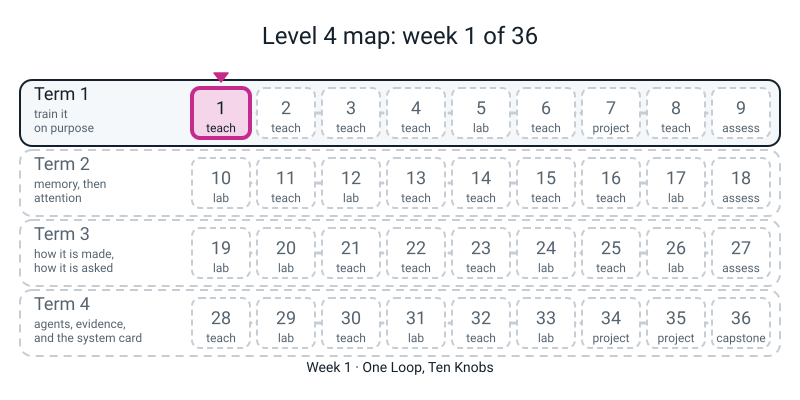

# Workbook — Week 1: One Loop, Ten Knobs

**Name:** ________________________________  **Date:** ______________

[⬅ Course Home](../README.md) · [📖 Read the chapter first](../student-guide/week-01.md) · [Next ➡](week-02.md)

---

> **Rules for this workbook.** Every number you write in a report this year must be one **your own run printed, with a seed, in the last 24 hours.** The digits below came from a real run on one CPU thread (`torch.set_num_threads(1)`, seed 0). If your third decimal differs from mine, that is fine. If the *shape* differs, tell your teacher.
>
> Run everything from inside `36-week-course/` so that `from l4lib.spirals import run` works. **Import `l4lib`. Never copy it.**

---


*Figure W1.0 — Where this fits: week 1 of 36 sits in term 1, "train it on purpose"; the tiles still dashed are the weeks to come.*

## ✅ Warm-Up (5 min)

This is week one of Level 4, so there is no last week. **These five are from last year**: the Level 3 habits you are about to use much harder.

**W1.** In `w -= lr * grad`, which of the three names is the **step size**? ____________

**W2.** A loss goes **down** over training. Is that good, bad, or "it depends"? ____________

**W3.** A model scores **0.99** on the rows it trained on and **0.61** on rows it has never seen. One word for that: ____________

**W4.** Why must the data be split into train and validation *before* you look at any score?

________________________________________________________________

**W5.** `random.seed(0)` / `torch.manual_seed(0)` are in every example you have ever run. What does a seed buy you?

________________________________________________________________

---

## 🔢 Page 1.3 — The Coin, by Hand

**There is no new maths this week.** The only maths object is a single number: the loss of a model that is guessing. Use a calculator that has an `ln` key. **No code for M1–M3.**

> A model for two classes that gives each class probability one half is *guessing*. The "surprise" of an event with probability `p` is `-ln(p)`. You have met this in Level 3 Week 14.

**M1.** Fill in the table. Four decimal places.

| Situation | Probability the model gives the right class | `-ln(p)` | Answer |
|---|:--:|---|---|
| two-class guesser | 0.5 | `-ln(0.5)` | ____________ |
| three-class guesser | 1/3 | `-ln(1/3)` | ____________ |
| four-class guesser | 0.25 | `-ln(0.25)` | ____________ |
| a model that is 90% sure and right | 0.9 | `-ln(0.9)` | ____________ |

**M1(a).** Which of the four rows is the number printed as `0.693` in this week's sweep? ____________

**M1(b).** Finish the sentence, using the words *one half*:

*0.693 is what a coin scores, because* ________________________________________

________________________________________________________________

**M1(c).** *Stretch.* Write the pattern for any number of equally likely classes `n`: the guessing loss is ____________ . Use it to predict the ten-class guesser: ____________

**M2 — the constant guesser's accuracy.** The validation set has 360 points. **169** belong to class 0 and **191** to class 1.

```
class 0 share = 169 ÷ 360 = ____________      as a percentage ____________
class 1 share = 191 ÷ 360 = ____________      as a percentage ____________
169 + 191     = ____________                  (should be 360: does it?)
```

**M2(a).** A model that answers "class 1" for **every** point scores what accuracy? ____________

**M2(b).** A model that answers "class 0" for **every** point scores what accuracy? ____________

**M2(c).** *A friend says "46.9% is below 50%, so that model is worse than guessing."* Do you agree? Write two sentences.

________________________________________________________________

________________________________________________________________

---

## 💻 Page 1.1 — The Six-Curve Grid

**Step 1 — predict (before you run anything).** The harness trains the same network on the same spirals six times and changes **only** `lr`. Which one do you think learns best? Circle: **A B C D E F** (the table below tells you the learning rate of each).

**Step 2 — run it.** Save this as `week01.py` in `36-week-course/` and run it.

```python
import torch
torch.set_num_threads(1)
from l4lib.spirals import run

for lr in (1e-6, 1e-5, 1e-4, 1e-3, 1e-2, 1e-1):
    run(f"lr={lr}", lr=lr)
```

**Step 3 — copy what it printed** (digits from your screen, not mine):

| Run | `lr` | final train loss | final val loss | val accuracy |
|:--:|:--:|:--:|:--:|:--:|
| A | `1e-6` | ________ | ________ | ________ |
| B | `1e-5` | ________ | ________ | ________ |
| C | `1e-4` | ________ | ________ | ________ |
| D | `1e-3` | ________ | ________ | ________ |
| E | `1e-2` | ________ | ________ | ________ |
| F | `1e-1` | ________ | ________ | ________ |

**Step 4 — label each curve.** Pick words from this list (or invent better ones): *flat · barely moving · slow but learning · healthy · healthy but rough · blew up then stuck*. Then write **one number that proves your label**, and say whether you would **keep** this learning rate.

| Run | My label | The number that proves it | Keep? (Y / N / maybe) |
|:--:|---|---|:--:|
| A | ______________________ | ______________________ | ____ |
| B | ______________________ | ______________________ | ____ |
| C | ______________________ | ______________________ | ____ |
| D | ______________________ | ______________________ | ____ |
| E | ______________________ | ______________________ | ____ |
| F | ______________________ | ______________________ | ____ |

**Step 5 — the trap.** Runs **A and F** end at the same loss. Fill in:

| | loss at **epoch 0** | final loss | what the curve did |
|:--:|:--:|:--:|---|
| A | ________ | ________ | ______________________ |
| F | ________ | ________ | ______________________ |

(To get the epoch-0 numbers, run with `verbose=False` and print `h["train"][0]`, where `h = run(...)`.)

Same final number. **Opposite stories.** In one sentence, how do you tell them apart?

________________________________________________________________

**Step 6 — your own sketch.** Draw the six loss curves, roughly, in the boxes. Label the axes: epoch across, loss up.

```
 loss                                    loss
  |                                       |
  |                                       |
  |                                       |
  +------------------ epoch               +------------------ epoch
        A  (lr = 1e-6)                          D  (lr = 1e-3)

 loss                                    loss
  |                                       |
  |                                       |
  |                                       |
  +------------------ epoch               +------------------ epoch
        B  (lr = 1e-5)                          E  (lr = 1e-2)

 loss                                    loss
  |                                       |
  |                                       |
  |                                       |
  +------------------ epoch               +------------------ epoch
        C  (lr = 1e-4)                          F  (lr = 1e-1)
```

---

## 🔮 Page 1.2 — Predict, Then Run

The harness's **default** is `lr=3e-3`. That sits between D (`1e-3`) and E (`1e-2`).

**Predict first.** Will it look more like **D** or more like **E**? Circle one: **D / E / neither.**

Because: ________________________________________________________________

**Run it:**

```python
from l4lib.spirals import run
run("lr=0.003", lr=3e-3)
```

I got: train ________  val ________  acc ________

**What I saw, in one honest sentence** (a right prediction and a wrong one are worth the same: the habit is what counts):

________________________________________________________________

---

## 🔟 Page 1.4 — Name the Knobs

Open `l4lib/spirals.py` and find `def run(`. Look only at the signature (the line or two inside the brackets).

**K1.** Copy out the **names** of every argument after the `*`. I count ____ of them. (The tag is not a knob; it is a label.)

| # | knob | # | knob |
|:--:|---|:--:|---|
| 1 | ____________ | 7 | ____________ |
| 2 | ____________ | 8 | ____________ |
| 3 | ____________ | 9 | ____________ |
| 4 | ____________ | 10 | ____________ |
| 5 | ____________ | 11 | ____________ |
| 6 | ____________ | 12 | ____________ |
| 13 | ____________ | 14 | ____________ |

(Leave blank any rows you do not need. The course speaks of "ten knobs"; the other four arguments are set-up, not knobs: how many blocks, how long, which random start, whether to print. Which four do you think they are? ____________ , ____________ , ____________ and ____________)

**K2.** Which **one** knob did this week turn? ____________

**K3.** Pick a knob you have *never* touched and guess what it does. Do not look it up. ____________________________________________

---

## 🐞 Page 1.5 — Break the Star

**Deliberate.** The `*` in `def run(tag, *, lr=..., ...)` means: *everything after here must be passed by name.* This page makes you break that rule on purpose and read the complaint.

**Part 1 — a toy, with no `l4lib` involved.** Predict what this prints, then run it.

```python
# DELIBERATE MISTAKE 1: no names. This is the call that "keyword-only" exists to stop.
def run_toy(*, lr, batch_size, seed):
    return f"lr={lr}  batch_size={batch_size}  seed={seed}"

print(run_toy(0.001, 64, 0))
```

My prediction: ________________________________________

Real **last line** of the error: ________________________________________

Now fix the call: `________________________________________`

**Part 2 — the real harness.** Run each *separately*. Write the **last line** of each traceback. (Read the last line first; then find the line with your own file name in it.)

```python
# DELIBERATE MISTAKE 2: a misspelt name, on the real harness.
from l4lib.spirals import run
run("typo", lrate=1e-3)
```

Last line: ________________________________________

What exactly is wrong, and what does the message **not** tell you? ________________________________________

```python
# DELIBERATE MISTAKE 3: the real harness, one bare number after the tag.
from l4lib.spirals import run
run("positional", 1e-3)
```

Last line: ________________________________________

Fix: `________________________________________`

```python
# DELIBERATE MISTAKE 5: no tag; the harness wants a label first.
from l4lib.spirals import run
run(lr=1e-3)
```

Last line: ________________________________________

Fix: `________________________________________`

**Part 3 — the commonest error of the week.** Save a file containing only `from l4lib.spirals import run` somewhere **outside** `36-week-course/` and run it.

Last line: ________________________________________

**What is the fix?** (*Hint: it is a `cd`, not a copy.*) ________________________________________

---

## 🔁 Page 1.6 — Same Seed, Twice

```python
import torch
torch.set_num_threads(1)
from l4lib.spirals import run

a = run("first",  lr=1e-3, verbose=False)
b = run("second", lr=1e-3, verbose=False)
print("same curve twice:", a["train"] == b["train"])
print("final train loss, both runs:", a["train"][-1], b["train"][-1])
```

I got: ________________________________________

**Now change** `seed=` on the second run (for example `seed=1`) and print the two final train losses again.

First run: ________  Second run (seed ____): ________

**What changed, and what did not?** (Think: the learning rate was identical.)

________________________________________________________________

**Why will this course stop trusting a single run in Week 7?** ________________________________________

---

## 📓 Page 1.7 — The Bug Log

Your notebook from Level 3 comes with you. One entry per error you meet.

**Tonight's required line**, copy it and then say it in your own words underneath:

> *The same final loss can hide opposite stories. Look at the first epoch.*

In my words: ________________________________________________________

| # | Date | What I typed (the line) | Last line of the error | What it means in plain words | Fix | Page I'll find this on again |
|:--:|---|---|---|---|---|:--:|
| 1 | ______ | ______________ | ______________ | ______________ | ______________ | ____ |
| 2 | ______ | ______________ | ______________ | ______________ | ______________ | ____ |
| 3 | ______ | ______________ | ______________ | ______________ | ______________ | ____ |
| 4 | ______ | ______________ | ______________ | ______________ | ______________ | ____ |
| 5 | ______ | ______________ | ______________ | ______________ | ______________ | ____ |

**A mistake with no traceback** (these matter more): write the one I made, or nearly made, this week. ________________________________________

---

## 🧠 Self-Check (do this last, from memory)

1. **In one sentence, why is 0.693 the loss of a guessing two-class model?**

________________________________________________________________

2. What does `*` do in `def run(tag, *, lr, ...)`?

________________________________________________________________

3. Runs A and F end at the same loss. How do you tell them apart?

________________________________________________________________

4. *Parking Lot.* D's validation loss (0.026) is lower than E's (0.059), but E's **training** loss is lower than D's. Do **not** answer it. Write your best guess and the one thing you would measure.

________________________________________________________________

**Mark yourself.** Tick the first line you can honestly say.

- [ ] **Not yet:** I can read a final loss but cannot say what 0.693 means.
- [ ] **Getting there:** I label A-F correctly, or I explain 0.693, but not both.
- [ ] **Secure:** all six labelled with a number each; 0.693 explained with *one half*; I can explain the star.
- [ ] **Beyond:** I noticed the two constant-guesser accuracies are the class shares (M2).

---

[⬅ Course Home](../README.md) · [📖 Chapter](../student-guide/week-01.md) · [Next ➡](week-02.md)

---
---

# ✂️ ANSWERS — keep this page folded until you have finished

*Numbers come from real runs: CPU, one thread, seed 0, `l4lib.spirals.run`. Within ±0.005 on a loss and ±0.5 points on an accuracy is a match.*

### Warm-Up

- **W1.** `lr` (learning rate).
- **W2.** It depends: it is good on validation data, but training loss falling alone can be memorising.
- **W3.** Overfitting.
- **W4.** So that nothing you learn from validation scores leaks into the choices you make about training; the validation pile must stay unseen.
- **W5.** The same random numbers every run, so you can rerun and get the same digits and compare one change at a time.

### Page 1.3 — the coin

**M1.**

| Situation | Answer |
|---|:--:|
| two-class guesser, `-ln(0.5)` | **0.6931** |
| three-class guesser, `-ln(1/3)` | **1.0986** |
| four-class guesser, `-ln(0.25)` | **1.3863** |
| 90% sure and right, `-ln(0.9)` | **0.1054** |

- **M1(a).** The first row, 0.6931.
- **M1(b).** *"...the model gives each class probability one half, and ln 2 is the surprise of a one-in-two event."* "0.693 is ln 2" without the one-half reason is only partial.
- **M1(c).** `ln n`. Ten classes: **2.3026**.

**M2.** 169/360 = **0.4694** (46.9%). 191/360 = **0.5306** (53.1%). 169 + 191 = **360**, yes.

- **M2(a).** 53.1%. **M2(b).** 46.9%.
- **M2(c).** Disagree. 46.9% is exactly what answering "class 0" every time scores, so it is a *constant guesser*, not a model worse than one. A constant guesser's accuracy is just a class share, and it can fall below 50% when the classes are uneven.

### Page 1.1 — the six curves

The sweep printed (your digits should match within the tolerance):

```text
lr=1e-06                     train 0.693  val 0.692  acc  53.1%
lr=1e-05                     train 0.683  val 0.679  acc  55.3%
lr=0.0001                    train 0.077  val 0.063  acc  98.1%
lr=0.001                     train 0.018  val 0.026  acc  99.4%
lr=0.01                      train 0.013  val 0.059  acc  99.2%
lr=0.1                       train 0.693  val 0.702  acc  46.9%
```

| Run | Label (any equivalent) | Proving number | Keep? |
|:--:|---|---|:--:|
| A | Flat, stuck | final train 0.693; acc 53.1% (constant guesser) | No |
| B | Barely moving | 0.694 to 0.683; acc 55.3% | No (too slow) |
| C | Slow but learning | 0.694 to 0.077, still falling; acc 98.1% | Maybe (needs more epochs) |
| D | Healthy | 0.691 to 0.018; val 0.026; acc 99.4% | **Yes** |
| E | Healthy but rougher | 0.658 at epoch 0, 0.013 final; val 0.059; acc 99.2% | Maybe |
| F | Blew up, then collapsed to a coin | epoch 0 loss 12.786; final 0.693; acc 46.9% | No |

**Step 5.** A: epoch 0 = **0.694**, final **0.693**, a flat line that never moved. F: epoch 0 = **12.786**, final **0.693**, a huge spike that fell all the way back to a coin. Tell them apart by looking at epoch 0 (or at the curve). Also A is the constant-"class 1" guesser (53.1%) and F the constant-"class 0" guesser (46.9%).

**Step 6.** A and B: nearly flat lines near 0.69. C: a slow steady slope down, still falling at the end. D: a fast smooth drop to near zero. E: a faster drop, a little bumpier. F: starts very high, then drops and lies flat at 0.693.

### Page 1.2 — predict `lr=3e-3`

Either answer is right **if you predicted before you ran**. Real run: **train 0.007, val 0.037, acc 98.9%**. Its train loss is lower than both D's (0.018) and E's (0.013), and its val loss sits between D's (0.026) and E's (0.059), so "between, nearer E on train" is a good sentence. Do not mark a third-decimal difference wrong.

### Page 1.4 — the knobs

The signature is `run(tag, *, depth, lr, batch_size, epochs, optimizer, weight_decay, dropout, norm, residual, schedule, warmup_frac, clip, seed, verbose)`.

- **K1.** There are 14 arguments after the `*`: `depth, lr, batch_size, epochs, optimizer, weight_decay, dropout, norm, residual, schedule, warmup_frac, clip, seed, verbose`. Ten are knobs (`lr, batch_size, optimizer, weight_decay, dropout, norm, residual, schedule, warmup_frac, clip`); accept any six of them. The four set-up arguments are **`depth`, `epochs`, `seed`** and **`verbose`**. Do not mark a student wrong for calling `depth` a knob; ask which they believe change how it learns and which are bookkeeping.
- **K2.** `lr`.
- **K3.** Any honest guess is full marks. This is a Week 2-6 preview.

### Page 1.5 — break the star

- **Part 1.** Last line: `TypeError: run_toy() takes 0 positional arguments but 3 were given`. Fix: `run_toy(lr=0.001, batch_size=64, seed=0)`.
- **Part 2, mistake 2.** `TypeError: run() got an unexpected keyword argument 'lrate'`. There is no knob called `lrate`. The message quotes what you typed but does not tell you the right name; the **signature** does. Fix: `lr=`.
- **Part 2, mistake 3.** `TypeError: run() takes 1 positional argument but 2 were given`. Fix: `run("positional", lr=1e-3)`.
- **Part 2, mistake 5.** `TypeError: run() missing 1 required positional argument: 'tag'`. Fix: `run("my label", lr=1e-3)`.
- **Part 3.** `ModuleNotFoundError: No module named 'l4lib'`. The terminal is not in the folder that *contains* `l4lib`. Fix: `cd` into `36-week-course/` and check with `ls`. **Not** "copy `l4lib` next to my file": that breaks "import it; never copy it".

Bug Log: any real entries are fine if the **last line** (not the whole traceback) was copied and the fix works.

### Page 1.6 — same seed, twice

```text
same curve twice: True
final train loss, both runs: 0.018484133488247886 0.018484133488247886
```

With `seed=1` the second final train loss is **0.0061** (about 0.006). Seed 2 gives about 0.008. The learning rate is the same; the **starting weights and the shuffling** are not. The shape of the curve is the same; the digits move, by up to a factor of three here. Do **not** conclude that seed 1 is "best". That is why Week 7 uses three seeds and a mean and spread. If your digits are further than 0.005 away, check that `torch.set_num_threads(1)` ran first and that the same PyTorch version is installed as last year's.

### Page 1.7 and Self-Check

1. *"A guessing two-class model gives each class probability 1/2; the surprise of a one-in-two event is -ln(0.5) = ln 2 = 0.693."*
2. Everything after the `*` must be passed **by name**.
3. Look at epoch 0: A never moves (0.694); F starts at 12.786. Accuracies differ too (53.1% against 46.9%).
4. Possibly the start of overfitting (E fits the training points a little more tightly), but it was **not checked** this week. A good "one thing to measure": the gap between train and validation loss as epochs go on. Parked for Week 5.

---

[⬅ Course Home](../README.md) · [📖 Chapter](../student-guide/week-01.md) · [Next ➡](week-02.md)
