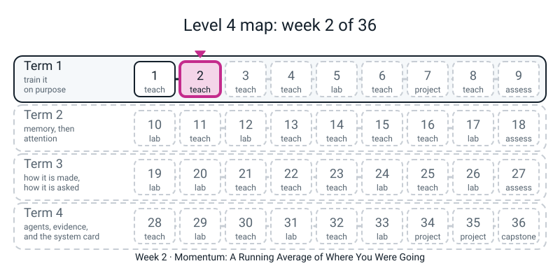

# Workbook — Week 2: Momentum, a Running Average of Where You Were Going

**Name:** ________________________________  **Date:** ______________

[⬅ Week 1](week-01.md) · [Course Home](../README.md) · [📖 Read the chapter first](../student-guide/week-02.md) · [Next ➡ Week 3](week-03.md)

---

> **Rules for this workbook.** Every number you write in a report this year must be one **your own run printed, with a seed, in the last 24 hours.** The digits in the answer pages came from real runs on one CPU thread (`torch.set_num_threads(1)`, seed 0). If your third decimal differs, that is fine. If the *shape* differs, tell your teacher.
>
> Run everything from inside `36-week-course/` so that `from l4lib.spirals import run` works. **Import `l4lib`. Never copy it.**
>
> **Pages 2.1, 2.3 and 2.8 are pencil-and-calculator pages. No code until the box says "now check".** The by-hand number comes first; the computer is the referee, not the author.

---


*Figure W2.0 — Where this fits: week 2 of 36 sits in term 1, "train it on purpose"; the tiles still dashed are the weeks to come.*

## ✅ Warm-Up (5 min)

Last week's habits, used again today.

**W1.** A model that gives each of two classes probability one half has a loss of ____________ (three decimals).

**W2.** In `def run(tag, *, lr=...)`, what does the `*` force you to do when you call `run`?

________________________________________________________________

**W3.** Write the plain-SGD update rule for a weight `w` with gradient `g` and learning rate `lr`: `w = ______________________`

**W4.** Last week runs A and F ended on the same loss, 0.693. What single thing did you look at to tell them apart? ____________

**W5.** If you run the same code twice with the same seed, what do you expect? ____________

---

## 🔢 Page 2.1 — The Hand Table (the page the whole week hangs on)

**No code yet.** Function `f(w) = w * w`. Its gradient is `g = 2w`. Start at `w = 1.0`, learning rate `lr = 0.1`. Four decimal places. A calculator is fine.

**Rule A — plain SGD.** `w = w - 0.1 x g`

| step | w before | g = 2w | step = 0.1 g | w after |
|:--:|:--:|:--:|:--:|:--:|
| 1 | 1.0000 | 2.0000 | ________ | ________ |
| 2 | ________ | ________ | ________ | ________ |
| 3 | ________ | ________ | ________ | ________ |

**Rule B — momentum.** Keep one extra number, the velocity `v`, which starts at 0. Each step, in this order:

```text
g = 2w              (the slope where you stand now)
v = 0.9 x v + g     (old velocity, mostly kept, plus the new slope)
w = w - 0.1 x v     (step by the velocity, not by g)
```

| step | w before | g = 2w | v = 0.9 v + g | step = 0.1 v | w after |
|:--:|:--:|:--:|:--:|:--:|:--:|
| 1 | 1.0000 | 2.0000 | 0.9 x 0 + 2.0 = ________ | ________ | ________ |
| 2 | ________ | ________ | 0.9 x ____ + ____ = ________ | ________ | ________ |
| 3 | ________ | ________ | 0.9 x ____ + ____ = ________ | ________ | ________ |

**H1.** After step 3: plain SGD has `w =` ________ and momentum has `w =` ________. Which is closer to zero? ____________ Roughly how many times closer? ____________

**H2.** After **step 1** the two rules land on the same `w`. Why? (Hint: what is `v` before step 1?)

________________________________________________________________

**H3 — the extension step.** Do a **4th** step for both rules.

| rule | step 4: g | step 4: v (momentum only) | step 4: w after |
|:--:|:--:|:--:|:--:|
| SGD | ________ | — | ________ |
| momentum | ________ | ________ | ________ |

Momentum's `w` is now (circle) **positive / negative**. The minimum of `w * w` is at `w = 0`. Finish the sentence with the word *overshoot*: *Momentum ________________________________________ because ________________________________________*

**Now check.** Save as `week02_hand.py` and run:

```python
import torch

for name, m in (("plain SGD", 0.0), ("momentum 0.9", 0.9)):
    w = torch.tensor([1.0], requires_grad=True)
    opt = torch.optim.SGD([w], lr=0.1, momentum=m)
    path = []
    for step in range(4):
        opt.zero_grad(set_to_none=True)
        (w ** 2).sum().backward()
        opt.step()
        path.append(round(w.item(), 4))
    print(f"{name:13}", path)
```

I got:  plain SGD ________________________________   momentum ________________________________

**Did torch agree with your table?** Circle: **yes / no**. If no: find the first step where they part. Which column had my slip? ____________

---

## 📊 Page 2.2 — Helps or Hurts

Last week you turned **one** knob (`lr`). This week one more knob moves: `optimizer=`. Same data, same seed, same starting weights. Only the rule for a step changes.

**Step 1 — predict (before you run).** For each learning rate, circle what you think momentum does to the **final training loss** compared with plain SGD: **H**elps, **U**rts, or **=** about equal. (The rule for the words: a difference of more than **0.05** in final train loss counts; smaller is "about equal".)

| `lr` | 0.01 | 0.03 | 0.1 | 0.3 | 1.0 |
|---|:--:|:--:|:--:|:--:|:--:|
| my prediction | H / U / = | H / U / = | H / U / = | H / U / = | H / U / = |

**Step 2 — run it.** Save as `week02.py` in `36-week-course/`:

```python
import torch
torch.set_num_threads(1)
from l4lib.spirals import run

for lr in (0.01, 0.03, 0.1, 0.3, 1.0):
    a = run(f"sgd lr={lr:g}", lr=lr, optimizer="sgd", verbose=False)
    b = run(f"momentum lr={lr:g}", lr=lr, optimizer="momentum", verbose=False)
    print(f"{lr:>5g} | sgd {a['train'][-1]:.3f} {a['acc'][-1]*100:5.1f}% | momentum {b['train'][-1]:.3f} {b['acc'][-1]*100:5.1f}%")
```

**Step 3 — copy what your screen printed** (write `nan` if it printed `nan`; **never** write `0` for it).

| `lr` | SGD final train loss | SGD val acc | Momentum final train loss | Momentum val acc | Helps / hurts / about equal |
|:--:|:--:|:--:|:--:|:--:|:--:|
| 0.01 | ________ | ________ | ________ | ________ | ____________ |
| 0.03 | ________ | ________ | ________ | ________ | ____________ |
| 0.1 | ________ | ________ | ________ | ________ | ____________ |
| 0.3 | ________ | ________ | ________ | ________ | ____________ |
| 1.0 | ________ | ________ | ________ | ________ | ____________ |

**P1.** How many predictions in Step 1 were right? ____ out of 5. Which row surprised you most? ____________

**P2.** Momentum helps the **small** learning rates and hurts the **big** ones. Finish, using "longer steps":

*A momentum step is up to ten times ______________, so* ________________________________________

________________________________________________________________

**P3.** Which Week 1 card (A-F) is "**sgd at 0.03**" closest to? ______ And "**momentum at 0.3**"? ______ (They are cousins of a card, not twins. What is different about the second one's first epoch? It is 0.697, not 12.8.)

**P4.** A friend reads the `lr = 1.0` momentum row and says, "The code must be wrong: it printed `nan`." Write two sentences in reply. What does `nan` mean, and what does it say about the numbers just before?

________________________________________________________________

________________________________________________________________

---

## 🧮 Page 2.3 — An Average on Your Own Numbers

**New idea, on paper first.** An **exponential moving average** is a running average that counts recent values more and forgets old values by a fixed share each step. One rule:

```text
new average = 0.9 x old average + 0.1 x new value          (the average starts at 0)
```

**Part A — warm-up, numbers given to you.** Values: **5, 5, 5, 0, 0**. Three decimals is enough.

| step | new value | 0.9 x old average | 0.1 x new value | new average |
|:--:|:--:|:--:|:--:|:--:|
| 1 | 5 | 0.9 x 0 = ________ | ________ | ________ |
| 2 | 5 | ________ | ________ | ________ |
| 3 | 5 | ________ | ________ | ________ |
| 4 | 0 | ________ | ________ | ________ |
| 5 | 0 | ________ | ________ | ________ |

**E1.** The first average is `0.1 x` the first value, not the first value itself. Why? ________________________________________

**E2.** At step 4 the value dropped to 0 but the average did not drop to 0. Why not?

________________________________________________________________

**Part B — fade by a fixed share.** Imagine one early value and nothing after. Each step its share of the average is multiplied by 0.9. Fill in how much of it is still counted:

| steps later | 1 | 2 | 3 | 4 | 5 | 6 | 7 |
|:--:|:--:|:--:|:--:|:--:|:--:|:--:|:--:|
| share left (3 decimals) | 0.900 | ______ | ______ | ______ | ______ | ______ | ______ |

**E3.** The **half-life** is how many steps until the share first falls below 0.5. Read it off your row: ____ steps.

**E4.** *Stretch.* If the fade share were **0.5** instead of 0.9, write the first three entries of the row: ______ , ______ , ______ . Would the memory be longer or shorter than 0.9's? ____________

**Part C — your own five numbers.** Choose **five numbers that are not 10, 0, 0, 0, 0 and not 5, 5, 5, 0, 0.** (Mix them: some big, some small, maybe one that goes up and then down.)

My numbers: ______ , ______ , ______ , ______ , ______

| step | new value | new average (by hand, 4 decimals) | new average (from code) |
|:--:|:--:|:--:|:--:|
| 1 | ______ | ________ | ________ |
| 2 | ______ | ________ | ________ |
| 3 | ______ | ________ | ________ |
| 4 | ______ | ________ | ________ |
| 5 | ______ | ________ | ________ |

**Now check.** Put your five numbers in the list:

```python
old = 0.0
for step, value in enumerate([__, __, __, __, __], start=1):
    old = 0.9 * old + 0.1 * value
    print(f"step {step}: value {value:>4}   average {old:.4f}")
```

**E5.** Do hand and code agree to four places? **yes / no**. If no, where did they first differ? ____________

**E6.** Spot the line: the average is being pulled toward the recent values. Put a mark next to the step where your average was **furthest from** your newest value. What did that tell you about the average's memory?

________________________________________________________________

---

## ⚖️ Page 2.4 — Steady Pushes Add, Flip-Flops Cancel

Momentum's velocity is `v = 0.9 x v + g`. Here are two gradient lists. Work out `v` for each by hand (3 decimals). `v` starts at 0.

**Steady:** `g = 1, 1, 1, 1`

| step | g | v = 0.9 v + g |
|:--:|:--:|:--:|
| 1 | 1 | ________ |
| 2 | 1 | ________ |
| 3 | 1 | ________ |
| 4 | 1 | ________ |

**Flip-flop:** `g = +1, -1, +1, -1`

| step | g | v = 0.9 v + g |
|:--:|:--:|:--:|
| 1 | +1 | ________ |
| 2 | -1 | ________ |
| 3 | +1 | ________ |
| 4 | -1 | ________ |

**T1.** After four steps, which velocity is bigger in size? ____________ By roughly what factor? ____________

**T2.** A narrow valley makes the gradient point one way, then the other, across the valley, and steadily one way along it. Which of the two lists is "across the valley"? ____________ And "along the valley"? ____________ Which direction does momentum therefore speed up? ____________

**T3.** Write the trolley sentence in your own words (use the words *add* and *cancel*):

________________________________________________________________

________________________________________________________________

---

## 🔟 Page 2.5 — The x10

The week's trap. PyTorch's `momentum=0.9` computes `v = 0.9 v + g`, **not** `v = 0.9 v + 0.1 g`.

**X1.** On a steady slope of `g = 2.0`, your average form (`0.9 avg + 0.1 x 2.0`) gives `avg = 0.2` at step 1 and the momentum form (`0.9 v + 2.0`) gives `v = 2.0`. Fill in step 2 for both:

| step | average form | momentum form `v` | `v` divided by the average |
|:--:|:--:|:--:|:--:|
| 1 | 0.2000 | 2.0000 | ________ |
| 2 | ________ | ________ | ________ |

**X2.** So `v` is always ________ times the average (when both start at 0).

**X3.** A step is `lr x v`. Momentum at `lr = 0.03` therefore steps about like plain SGD at `lr = ________` on a steady slope.

**Predict first.** Will momentum at `lr = 0.03` and plain SGD at `lr = 0.3` end at similar losses? **yes / no**

**Run it:**

```python
import torch
torch.set_num_threads(1)
from l4lib.spirals import run

A = run("momentum lr=0.03", lr=0.03, optimizer="momentum")
B = run("sgd      lr=0.3 ", lr=0.3, optimizer="sgd")
```

| run | train | val | acc |
|---|:--:|:--:|:--:|
| momentum `lr = 0.03` | ________ | ________ | ________ |
| sgd `lr = 0.3` | ________ | ________ | ________ |

**X4.** In one sentence, why do they match? ________________________________________

________________________________________________________________

**X5.** "Momentum is just a bigger learning rate." Half true. When is it true, and when is it false? (Use *steady* and *flip*.)

________________________________________________________________

________________________________________________________________

---

## 🐞 Page 2.6 — Break It on Purpose

**Deliberate.** Pick **one** of these. Type it exactly, run it, and paste the **last line** on the Bug Log (page 2.9). Then fix it and run it again.

```python
# DELIBERATE MISTAKE A: taking the length of a gradient that was already removed.
import torch
w = torch.tensor([3.0, 4.0], requires_grad=True)
opt = torch.optim.SGD([w], lr=0.1)
(w ** 2).sum().backward()
opt.zero_grad(set_to_none=True)
print("gradient length:", w.grad.norm())
```

```python
# DELIBERATE MISTAKE B: a tensor instead of a list of tensors.
import torch
w = torch.tensor([1.0], requires_grad=True)
opt = torch.optim.SGD(w, lr=0.1, momentum=0.9)
```

```python
# DELIBERATE MISTAKE C: a negative momentum.
import torch
w = torch.tensor([1.0], requires_grad=True)
opt = torch.optim.SGD([w], lr=0.1, momentum=-0.9)
```

I chose: **A / B / C**

Last line of the error: ________________________________________

In plain words, what does it mean? ________________________________________

My fix: `________________________________________`

**Two mistakes that print no error.** Run each, read the output, and say what is wrong. Both are deliberate.

```python
# DELIBERATE MISTAKE D: forgetting the brackets.
import torch
w = torch.tensor([3.0, 4.0], requires_grad=True)
(w ** 2).sum().backward()
print("gradient length:", w.grad.norm)
```

It printed: ________________________________________   The missing piece: ________

```python
# DELIBERATE MISTAKE E: no zero_grad.
import torch
w = torch.tensor([1.0], requires_grad=True)
opt = torch.optim.SGD([w], lr=0.1)
for step in range(1, 4):
    (w ** 2).sum().backward()
    opt.step()
    print(f"step {step}: w {w.item():.4f}   stored gradient {w.grad.item():.4f}")
```

The stored gradient at step 2 is ________. The true slope `2w` at that `w` is ________. What happened to the old gradient? ________________________________________

**Fix for E:** add `opt.zero_grad(set_to_none=True)` on which line? ________________________________________

**A tidy habit.** Fill in: `set_to_none=False` leaves a tensor of ________ in `w.grad`; `set_to_none=True` leaves the value ________.

---

## 📏 Page 2.7 — The Length of a Gradient (`.norm()`)

The **length** (norm) of a list of numbers is: square every one, add them up, take the square root.

**N1.** By hand: length of `[6, 8]` = sqrt(____ + ____) = sqrt(____) = ________

**N2.** By hand: length of `[5, 12]` = sqrt(____ + ____) = ________

**N3.** For `w = [1.0, 2.0, 2.0]` and the loss `(w ** 2).sum()`, the gradient is `2w` = [____ , ____ , ____]. Its length by hand is ________

**Now check:**

```python
import torch
w = torch.tensor([1.0, 2.0, 2.0], requires_grad=True)
(w ** 2).sum().backward()
print("gradient:", w.grad)
print("its length:", w.grad.norm())
print("length of [5, 12]:", torch.tensor([5.0, 12.0]).norm())
```

I got: ________________________________________

**N4.** *Deliberate mistake.* What happens with `torch.tensor([6, 8]).norm()` (no decimal points)? Predict, then try it. The last line: ________________________________________ Fix: ________________

---

## ➕ Page 2.8 — A Second Hand Table (new numbers)

Same two rules, **new start**: `f(w) = w * w`, start at `w = 2.0`, `lr = 0.1`. Four steps, every number, 4 decimals. (Fresh numbers, so you cannot copy page 2.1.)

| step | SGD g | SGD w after | Momentum g | v | step = 0.1 v | Momentum w after |
|:--:|:--:|:--:|:--:|:--:|:--:|:--:|
| 1 | ______ | ______ | ______ | ______ | ______ | ______ |
| 2 | ______ | ______ | ______ | ______ | ______ | ______ |
| 3 | ______ | ______ | ______ | ______ | ______ | ______ |
| 4 | ______ | ______ | ______ | ______ | ______ | ______ |

**S1.** On which step does momentum's `w` first go negative? ____ Does plain SGD ever go negative in these four steps? ____________

**S2.** Check with torch: copy page 2.1's check block, change `1.0` to `2.0`, and set `range(4)` to stay at 4. I got: SGD ______________________________ momentum ______________________________

**S3.** *Stretch (why did SGD never overshoot?).* Each SGD step multiplies `w` by ________ (because `w - 0.1 x 2w = w x ____`). A number between 0 and 1 cannot change sign. In the week 1 parking lot, `lr = 1.1` gave `w x (1 - 2.2) =` `w x ________`. Is that number between 0 and 1? ____ What does its size tell you about how far each jump lands?

________________________________________________________________

---

## 📓 Page 2.9 — The Bug Log

One entry per error you meet, loud or silent.

**Tonight's required line.** Copy it, then say it in your own words underneath:

> *Momentum is ten times a running average; longer steps help a crawler and wreck a sprinter.*

In my words: ________________________________________________________

| # | Date | What I typed (the line) | Last line of the error (or "no error, but...") | What it means in plain words | Fix | Page I'll find this on again |
|:--:|---|---|---|---|---|:--:|
| 1 | ______ | ______________ | ______________ | ______________ | ______________ | ____ |
| 2 | ______ | ______________ | ______________ | ______________ | ______________ | ____ |
| 3 | ______ | ______________ | ______________ | ______________ | ______________ | ____ |
| 4 | ______ | ______________ | ______________ | ______________ | ______________ | ____ |
| 5 | ______ | ______________ | ______________ | ______________ | ______________ | ____ |

**A mistake with no traceback** (these matter more): the one I made, or nearly made, this week. ________________________________________

**The misspelt-optimizer trap.** The Week 1 harness quietly accepts any `optimizer=` name it does not know. Try it (deliberate):

```python
# DELIBERATE MISTAKE F: a misspelt optimizer name on the harness.
import torch
torch.set_num_threads(1)
from l4lib.spirals import run
run("typo: momentun", lr=0.03, optimizer="momentun")
run("spelt right: momentum", lr=0.03, optimizer="momentum")
```

Line 1: train ________ acc ________   Line 2: train ________ acc ________

Did the typo raise an error? ____ Then how would you ever know? ________________________________________

(Hint: open `l4lib/spirals.py` and read the lines that pick the optimizer. Which optimizer did the `else` branch build? ____________)

---

## 🧠 Self-Check (do this last, from memory)

1. **In one sentence, what does momentum remember, and what does it do with it?**

________________________________________________________________

2. Write the exponential moving average rule, and say what "exponential" means here.

________________________________________________________________

3. After three steps on `w * w` from 1.0 at `lr = 0.1`, SGD is at ________ and momentum is at ________. Which overshoots on step 4?

4. In PyTorch, `v` is ________ times the average. So momentum at `lr = L` on a steady slope is like SGD at `lr = ______`.

5. Give one `lr` where momentum helped and one where it hurt, each with its two loss numbers (from **your** run).

Helped at `lr =` ____ : SGD ________ , momentum ________

Hurt at `lr =` ____ : SGD ________ , momentum ________

6. *Parking Lot (do not answer; guess).* Momentum fixed the **direction**: a step that remembers. It did not fix the **size** problem: some knobs have gradients near 0.0001 and others near 10, but there is one `lr`. What would you try? ________________________________________

**Mark yourself.** Tick the first line you can honestly say.

- [ ] **Not yet:** I can do the SGD column of the hand table but not the momentum column.
- [ ] **Getting there:** both tables are right, or I can explain the average, but not both.
- [ ] **Secure:** both tables right and matching torch; average done by hand and in code; helps/hurts rows each with a number; the trolley sentence.
- [ ] **Beyond:** I explained why PyTorch's `v` is ten times my average, and I used it to predict page 2.5 before running it.

---

[⬅ Week 1](week-01.md) · [Course Home](../README.md) · [📖 Chapter](../student-guide/week-02.md) · [Next ➡ Week 3](week-03.md)

---
---

# ✂️ ANSWERS — keep this page folded until you have finished

*Numbers come from real runs: CPU, one thread, seed 0, torch 2.2.1, `l4lib.spirals.run`. Within 0.0001 on hand-table figures, within ±0.005 on a loss and ±0.5 points on an accuracy is a match.*

### Warm-Up

- **W1.** 0.693 (`-ln 0.5`, which is `ln 2`).
- **W2.** Pass everything after the tag **by name**: `run("A", lr=0.03)`, not `run("A", 0.03)`.
- **W3.** `w = w - lr * g`.
- **W4.** The first epoch: A started at 0.694 and never moved; F started at 12.786 and fell back to a coin.
- **W5.** The same numbers, digit for digit.

### Page 2.1 — the hand table

Plain SGD:

| step | w before | g | step | w after |
|:--:|:--:|:--:|:--:|:--:|
| 1 | 1.0000 | 2.0000 | 0.2000 | 0.8000 |
| 2 | 0.8000 | 1.6000 | 0.1600 | 0.6400 |
| 3 | 0.6400 | 1.2800 | 0.1280 | 0.5120 |

Momentum:

| step | w before | g | v | step | w after |
|:--:|:--:|:--:|:--:|:--:|:--:|
| 1 | 1.0000 | 2.0000 | 0.9 x 0 + 2.0 = 2.0000 | 0.2000 | 0.8000 |
| 2 | 0.8000 | 1.6000 | 0.9 x 2.0 + 1.6 = 3.4000 | 0.3400 | 0.4600 |
| 3 | 0.4600 | 0.9200 | 0.9 x 3.4 + 0.92 = 3.9800 | 0.3980 | 0.0620 |

- **H1.** SGD **0.512**, momentum **0.062**. Momentum is closer, about **8 times** (0.512 / 0.062 is about 8.3).
- **H2.** `v` starts at 0, so `v = 0.9 x 0 + g = g`: the step equals plain SGD's step.
- **H3.**

| rule | g | v | w after step 4 |
|:--:|:--:|:--:|:--:|
| SGD | 1.0240 | — | 0.4096 |
| momentum | 0.1240 | 3.7060 | -0.3086 |

Negative. *"Momentum overshoots zero because it is still carrying the earlier steps (v = 3.706 pushes it past the minimum)."*

Torch check, verbatim:

```text
plain SGD     [0.8, 0.64, 0.512, 0.4096]
momentum 0.9  [0.8, 0.46, 0.062, -0.3086]
```

If a student's torch and table disagree, the usual cause is the step order (updating `w` before `v`, or using `g` where `v` belongs) or `0.1 x g` in the velocity (page 2.5).

### Page 2.2 — helps or hurts

| `lr` | SGD loss / acc | Momentum loss / acc | Verdict |
|:--:|---|---|---|
| 0.01 | 0.692 / 46.9% | 0.440 / 59.2% | helps |
| 0.03 | 0.690 / 52.8% | 0.018 / 98.6% | helps (a lot) |
| 0.1 | 0.387 / 80.0% | 0.025 / 99.2% | helps |
| 0.3 | 0.016 / 98.9% | 0.659 / 46.9% | hurts |
| 1.0 | 0.528 / 66.4% | `nan` / 46.9% | hurts |

- **P1.** No wrong answers; the check is that the predictions were made before the run.
- **P2.** *"...a momentum step is up to ten times longer than a plain step, so a crawling learning rate gets rescued and a learning rate that was already as fast as SGD could stand becomes too fast."*
- **P3.** sgd at 0.03 (loss 0.690): **A** (stuck at a coin). Momentum at 0.3 (loss 0.659): cousin of **F** (collapse to a coin), but its first epoch is a mild 0.697 rather than 12.8.
- **P4.** *`nan` means "not a number": the weights grew so large that the arithmetic broke (infinity minus infinity). The code did what it was told; the step was too long. In this run the loss was 0.705, 0.648, 0.702, then `nan` in the fourth epoch.* If a student's machine does not print `nan` for that row, that is a different PyTorch or CPU: mark the reasoning (blew up or hovered at a coin), not the word.

### Page 2.3 — the average

**Part A** (values 5, 5, 5, 0, 0; code output):

```text
ema step 1: value 5 avg 0.5000
ema step 2: value 5 avg 0.9500
ema step 3: value 5 avg 1.3550
ema step 4: value 0 avg 1.2195
ema step 5: value 0 avg 1.0976
```

| step | 0.9 x old | 0.1 x new | new average |
|:--:|:--:|:--:|:--:|
| 1 | 0.000 | 0.500 | 0.500 |
| 2 | 0.450 | 0.500 | 0.950 |
| 3 | 0.855 | 0.500 | 1.355 |
| 4 | 1.2195 | 0.000 | 1.2195 (1.220) |
| 5 | 1.0976 | 0.000 | 1.0976 (1.098) |

- **E1.** The average started at 0, so step 1 is `0.9 x 0 + 0.1 x 5`. (Do not fix it this week; the fix is Week 3's topic.)
- **E2.** The average keeps 0.9 of its old self: 0.9 x 1.355 = 1.2195. A single zero only removes a tenth of the pull; it cannot wipe the memory in one step.

**Part B** (share left): 0.900, 0.810, 0.729, 0.656, 0.590, 0.531, 0.478.

- **E3.** About **7** steps: 0.531 after 6, 0.478 after 7, so it crosses one half between them (the exact crossing is 6.58). Accept 6, 7, or "about 7".
- **E4.** 0.5, 0.25, 0.125. **Shorter** memory: the old value fades by half each step.

**Part C.** No single answer. Check: (a) the first average is `0.1 x` the first number; (b) each row is `0.9 x previous + 0.1 x new`; (c) hand and code agree to four places. **E6.** Any honest step with a reason: the average lags behind a sudden change, which is what remembering means. Starting the average at the first value is a legitimate alternative; accept it if the student said so (their numbers then differ from the guide's).

### Page 2.4 — add and cancel

Steady `g = 1`: v = **1.000, 1.900, 2.710, 3.439**.
Flip-flop `+1, -1, +1, -1`: v = **+1.000, -0.100, +0.910, -0.181**.

- **T1.** Steady: 3.439 against 0.181 in size, about **19 times** (accept "about 20" or "many times").
- **T2.** Across the valley = the flip-flop list. Along the valley = the steady list. Momentum speeds up the steady direction and dampens the flip-flop one.
- **T3.** Full marks: *"Steady pushes add up and flip-flops cancel."* Partial: "it remembers past gradients" with no add/cancel.

### Page 2.5 — the x10

- **X1.** Step 2: average form 0.3800, momentum form 3.8000, ratio 10. (Step 1 ratio: 10.)
- **X2.** **10.**
- **X3.** **0.3.**
- Prediction: yes. The real run:

```text
momentum lr=0.03             train 0.018  val 0.034  acc  98.6%
sgd      lr=0.3              train 0.016  val 0.041  acc  98.9%
```

- **X4.** *On a steady slope the velocity is ten times the average gradient, so a momentum step at `lr = 0.03` is about as long as a plain step at `lr = 0.3`.*
- **X5.** True on a steady straight slope (velocity is ten times the gradient). False when the gradient flips: momentum **cancels** the flip, while a bigger `lr` **amplifies** it.

### Page 2.6 — break it on purpose

| Mistake | Last line | Meaning / fix |
|:--:|---|---|
| A | `AttributeError: 'NoneType' object has no attribute 'norm'` | The gradient was removed by `zero_grad(set_to_none=True)` before use. Call `.norm()` after `backward()` and **before** `zero_grad`. |
| B | `TypeError: params argument given to the optimizer should be an iterable of Tensors or dicts, but got torch.FloatTensor` | `SGD` wants a list: `[w]`. |
| C | `ValueError: Invalid momentum value: -0.9` | Momentum is a share between 0 and 1: `momentum=0.9`. |

- **D (silent).** It prints `gradient length: <bound method Tensor.norm of tensor([6., 8.])>`. It printed a description of the method, not a number. The missing piece is the brackets: `w.grad.norm()`.
- **E (silent).** Output:

```text
step 1: w 0.8000   stored gradient 2.0000
step 2: w 0.4400   stored gradient 3.6000
step 3: w -0.0080   stored gradient 4.4800
```

Stored gradient at step 2 is **3.6000**; the true slope `2w` at `w = 0.8` is **1.6000**. Each `backward()` **adds** to the stored gradient (2.0 + 1.6 = 3.6). Fix: put `opt.zero_grad(set_to_none=True)` just before `(w ** 2).sum().backward()`, inside the loop.
- **Tidy habit.** `set_to_none=False` leaves a tensor of **zeros**; `set_to_none=True` leaves **`None`**. (In torch 2.2.1 the default is already `True`; writing it out makes the choice visible, and a `None` is easier to spot than a zero that quietly stayed.)

### Page 2.7 — the length

- **N1.** sqrt(36 + 64) = sqrt(100) = **10**.
- **N2.** sqrt(25 + 144) = sqrt(169) = **13**.
- **N3.** Gradient `[2, 4, 4]`; length sqrt(4 + 16 + 16) = sqrt(36) = **6**.

```text
gradient: tensor([2., 4., 4.])
its length: tensor(6.)
length of [5, 12]: tensor(13.)
```

- **N4.** `RuntimeError: linalg.vector_norm: Expected a floating point or complex tensor as input. Got Long`. Whole numbers are integers; lengths need decimals. Fix: `torch.tensor([6.0, 8.0])`.

### Page 2.8 — second hand table (start `w = 2.0`)

| step | SGD g | SGD w after | Mom g | v | step | Mom w after |
|:--:|:--:|:--:|:--:|:--:|:--:|:--:|
| 1 | 4.0000 | 1.6000 | 4.0000 | 4.0000 | 0.4000 | 1.6000 |
| 2 | 3.2000 | 1.2800 | 3.2000 | 6.8000 | 0.6800 | 0.9200 |
| 3 | 2.5600 | 1.0240 | 1.8400 | 7.9600 | 0.7960 | 0.1240 |
| 4 | 2.0480 | 0.8192 | 0.2480 | 7.4120 | 0.7412 | -0.6172 |

- **S1.** Step 4. SGD never goes negative (0.8192 after four steps).
- **S2.** Torch, three steps: SGD `[1.6, 1.28, 1.024]`, momentum `[1.6, 0.92, 0.124]`. Both match the table's first three rows.
- **S3.** Each SGD step multiplies `w` by **0.8** (`w - 0.1 x 2w = 0.8 w`). A number between 0 and 1 shrinks `w` without changing its sign, so no overshoot. With `lr = 1.1`: `w x (1 - 2.2) =` `w x (-1.2)`. Not between 0 and 1: it flips the sign **and** makes `w` 1.2 times bigger, so each jump lands farther away than the last (1.0, -1.2, 1.44, -1.728, ...).

### Page 2.9 — Bug Log and the misspelt optimizer

Any real entries are fine if the **last line** (not the whole traceback) was copied and the fix works. Silent mistakes (D, E, F, the x10 slip) are written as "no error, but...".

**Mistake F.** Output:

```text
typo: momentun               train 0.658  val 0.684  acc  46.9%
spelt right: momentum        train 0.018  val 0.034  acc  98.6%
```

The typo raised **no error**; the harness's `else` branch quietly built AdamW, and the result is a different experiment (an AdamW run at `lr = 0.03` gives the same 0.658 line). You only notice by comparing with a properly spelt run, or by reading the branch in `l4lib/spirals.py`. Habit: spell-check the strings, and compare a surprising result against a known good one.

### Self-Check

1. *"It remembers a running average of its past steps (as a running total, ten times the average) and steps by that, so steady pushes add and flip-flops cancel."*
2. `new average = 0.9 x old average + 0.1 x new value`. "Exponential" only means the old stuff is multiplied by the same share again and again.
3. SGD **0.512**, momentum **0.062**; momentum overshoots on step 4 (-0.3086).
4. **10**; SGD at `lr = 10 x L` (so 0.03 goes with 0.3).
5. Check that the numbers come from the student's own run. Typical: helped at 0.03 (0.690 to 0.018); hurt at 0.3 (0.016 to 0.659).
6. Any honest guess. The real answer is next week: give each knob its own step size, by dividing by a running typical size of its own gradient.

---

[⬅ Week 1](week-01.md) · [Course Home](../README.md) · [📖 Chapter](../student-guide/week-02.md) · [Next ➡ Week 3](week-03.md)
