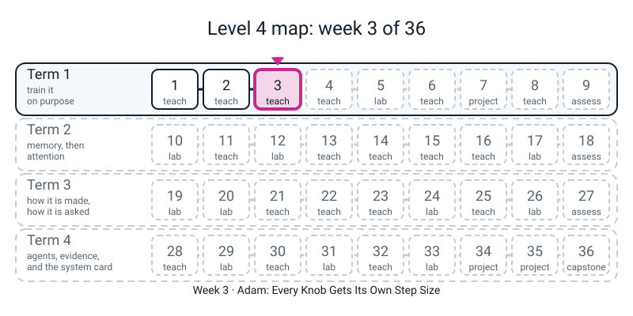

# Workbook — Week 3: Adam, Every Knob Gets Its Own Step Size

**Name:** ________________________________  **Date:** ______________

[⬅ Week 2](week-02.md) · [Course Home](../README.md) · [📖 Read the chapter first](../student-guide/week-03.md) · [Next ➡ Week 4](week-04.md)

---

> **Rules for this workbook.** Every number you write in a report this year must be one **your own run printed, with a seed, in the last 24 hours.** The digits in the answer pages came from real runs on one CPU thread (`torch.set_num_threads(1)`, seed 0, torch 2.2.1). If your third decimal differs, that is fine. If the *shape* differs, tell your teacher.
>
> Run everything from inside `36-week-course/` so that `from l4lib.spirals import run` works. **Import `l4lib`. Never copy it.**
>
> **Pages 3.1, 3.3 and 3.8 are pencil-and-calculator pages. No code until the box says "now check".** The by-hand number comes first; the computer is the referee, not the author.
>
> **The one new maths idea this week is the root-mean-square (RMS):** *square every number, take the mean of the squares, take the square root.* Say the three steps out loud before you start page 3.3.

---


*Figure W3.0 — Where this fits: week 3 of 36 sits in term 1, "train it on purpose"; the tiles still dashed are the weeks to come.*

## ✅ Warm-Up (5 min)

Last week's habits, used again today.

**W1.** Write the momentum rule in three lines (use `g`, `v`, `w`, `lr`, and the 0.9). In PyTorch, `v` is ______ times the average.

`g = ______________`   `v = ______________`   `w = ______________`

**W2.** After step 3 on `w * w` from `w = 1.0` at `lr = 0.1`, plain SGD is at ________ and momentum is at ________ (four decimals). Which one overshoots on step 4? ____________

**W3.** A loss that stays at about **0.693** after 60 epochs on two balanced classes means the model is doing what? ____________________________

**W4.** True or false: *a loss of 0.693 is a reason to check the learning rate first (and the weight decay too).* Circle: **true / false**. (You will meet this again on page 3.4.)

**W5.** `nan` means ________________________________________. When you see one, which two operations do you look for just before it? ____________ and ____________

---

## 🔢 Page 3.1 — The Three-Optimizer Table (the page the whole week hangs on)

**No code yet.** Function `f(w) = w * w`. Gradient `g = 2w`. Start at `w = 1.0`, `lr = 0.1`. Four decimal places. A calculator is fine.

The first two columns are **last week's**: copy them if you still have them, or recompute (they take two minutes).

| step | SGD `w` after | Momentum `w` after |
|:--:|:--:|:--:|
| 1 | ________ | ________ |
| 2 | ________ | ________ |
| 3 | ________ | ________ |
| 4 | ________ | ________ |

**Adam, by hand.** Adam keeps **two** running averages per knob. Both start at 0. `t` is the step number (1, 2, 3, 4). Each step, in this order:

```text
g = 2w                         (the slope where you stand now)
m = 0.9   x old m + 0.1   x g        (the average gradient: last week's idea)
s = 0.999 x old s + 0.001 x g x g    (the average of the gradient SQUARED)
m_fix = m / (1 - 0.9 ^ t)            (divide by how much of m has arrived)
s_fix = s / (1 - 0.999 ^ t)          (divide by how much of s has arrived)
root  = square root of s_fix         (the third step of RMS)
step  = 0.1 x m_fix / root           (epsilon is 0.00000001: too small to matter here)
w     = w - step
```

| t | w before | g = 2w | m | s | m_fix | s_fix | root | step | w after |
|:--:|:--:|:--:|:--:|:--:|:--:|:--:|:--:|:--:|:--:|
| 1 | 1.0000 | ______ | ______ | ______ | ______ | ______ | ______ | ______ | ______ |
| 2 | ______ | ______ | ______ | ______ | ______ | ______ | ______ | ______ | ______ |
| 3 | ______ | ______ | ______ | ______ | ______ | ______ | ______ | ______ | ______ |
| 4 | ______ | ______ | ______ | ______ | ______ | ______ | ______ | ______ | ______ |

(Give `m` six decimals, `s` seven, the rest four, and `step` five. Row 1 is the one to walk slowly: `m` is a tenth of `g`, `s` is a thousandth of `g x g`, and the two "arrived" shares are 0.1 and 0.001.)

**A1.** For `t = 1`, what are `1 - 0.9^1` and `1 - 0.999^1`? ________ and ________. After dividing, `m_fix` equals `g` exactly. True or false? ________

**A2.** Look at your **step** column. Does it stay near 0.1, grow, or shrink a lot? ________________. Now look at SGD's steps (0.2000, 0.1600, ...). Which one shrinks faster? ____________

**A3.** Which row has a step smaller than `lr = 0.1`, and by roughly how much? Row ____, step ________.

**A4 (an honest question).** After four steps, which of the three columns is **closest to zero**? ____________. Which is the **slowest**? ____________. Write one sentence: *On this one-knob toy, Adam is not the fastest because* ________________________________________________________________

**Now check.** Save as `week03_hand.py` and run:

```python
import torch

for name, cls, kw in (("plain SGD", "SGD", {}),
                      ("momentum 0.9", "SGD", {"momentum": 0.9}),
                      ("Adam", "Adam", {})):
    w = torch.tensor([1.0], requires_grad=True)
    opt = getattr(torch.optim, cls)([w], lr=0.1, **kw)
    path = []
    for step in range(4):
        opt.zero_grad(set_to_none=True)
        (w ** 2).sum().backward()
        opt.step()
        path.append(round(w.item(), 4))
    print(f"{name:13}", path)
```

I got:

plain SGD ________________________________   momentum ________________________________   Adam ________________________________

**Did torch agree with your table?** Circle: **yes / no**. If no: find the first step where they part. Which column had my slip? ____________ (Hint: the two classic slips are a missing "arrived" division and typing `0.9` where `0.999` goes.)

**Peek inside Adam.** Add these lines under the loop, after the three-step version (change `range(4)` to `range(3)`, and use the Adam line only):

```python
print("exp_avg    (my m):", round(opt.state[w]["exp_avg"].item(), 5))
print("exp_avg_sq (my s):", round(opt.state[w]["exp_avg_sq"].item(), 7))
```

I got: `exp_avg` ____________ and `exp_avg_sq` ____________. Do they match **row 3** of my `m` and `s`? ____

---

## 🧮 Page 3.2 — The First Step

Two knobs. One has gradient **1**. The other has gradient **1000**. `lr = 0.1`. Think of a loss `g x w`, so the gradient is just `g`.

**First, by hand.** Fill in the plain-SGD row (it is `lr x g`). For Adam, use what you learned on page 3.1, row 1: `m_fix = g`, `s_fix = g x g`, `root = |g|`, so the step is `0.1 x g / |g| = ____`.

| Knob gradient | SGD moves | Adam moves |
|:--:|:--:|:--:|
| 1 | ________ | ________ |
| 1000 | ________ | ________ |
| 2000 (predict, no code) | ________ | ________ |

**Now check:**

```python
import torch

for gr in (1.0, 1000.0):
    for cls in ("SGD", "Adam"):
        w = torch.tensor([5.0], requires_grad=True)
        opt = getattr(torch.optim, cls)([w], lr=0.1)
        (w * gr).sum().backward()
        opt.step()
        print(f"gradient {gr:>6g}  {cls:5} moved {5.0 - w.item():.6f}")
```

I got: ________________________________________________________________

**B1.** Write the one sentence. *Adam's first step is the same for gradients of 1 and of 1000 because* ________________________________________________________________

________________________________________________________________

**B2.** If a knob's gradient is **tiny** (say 0.001), will Adam's first step still be about `lr`? ____ (Page 3.7 measures this.)

---

## 🧮 Page 3.3 — Root-Mean-Square on Your Own Lists (new maths: pencil first)

The three steps, in this order: **1. square every number. 2. take the mean of the squares. 3. take the square root.**

**R1. Worked pair (do it with me).** List `[3, -4]`.

| | your answer |
|---|:--:|
| plain mean | ________ |
| squares | ________ , ________ |
| mean of squares | ________ |
| root of that (RMS), 4 decimals | ________ |

Is the RMS between 3 and 4? ____ Why does the plain mean fail as a "typical size"? ________________________________________

**R2.** The same list, a hundred times bigger: `[300, -400]`.

RMS = ________   `300 / RMS` = ________   `-400 / RMS` = ________

Compare with `3 / 3.5355 = 0.8485` and `-4 / 3.5355 = -1.1314`. Same or different? ________

**R3. Your own list.** Pick **three numbers**. They must not be 3 and -4, and **at least one must be negative.**

My list: [ ________ , ________ , ________ ]

| step | working |
|---|---|
| 1. squares | ________ , ________ , ________ |
| 2. mean of squares (divide by ____, because there are ____ numbers) | ________ |
| 3. root, 4 decimals | ________ |
| plain mean, for comparison | ________ |

**Now check, then scale it:**

```python
import torch

g = torch.tensor([0.0, 0.0, 0.0])        # replace with YOUR three numbers, with decimal points
for scale in (1, 100):
    h = g * scale
    rms = torch.sqrt((h ** 2).mean())
    print(f"list {h.tolist()}  rms {rms.item():.4f}  list / rms {[round(x, 4) for x in (h / rms).tolist()]}")
```

(Careful: if every number you leave in is `0.0` you will divide `0 / 0`. Replace them. That `nan` is **page 3.7's** whole topic.)

By hand: ________   By code: ________   Agree to four places? ____

My list divided by its RMS: [ ________ , ________ , ________ ]  Same for scale 1 and scale 100? ____

**R4.** Two lists. No calculator; estimate, then check.

(a) `[5, 5, 5, 5]`: every number has size 5, so the RMS must be ________ . Check by the three steps: ________

(b) `[0, 0, 0, 10]`: guess first, 0, 2.5, 5 or 10? ____ Compute it (use a calculator): ________  (Hint: the mean of squares is 100 / 4.)

(c) `[6, -8]`. Plain mean ________   RMS ________   *Length* (norm, from Week 2) ________. The RMS is the length divided by ________.

**R5 (a mistake to name).** A friend says the RMS of `[3, -4]` is `12.5`. Which step did they leave out? ________________ A different friend says `-0.5`. Which step did *they* leave out? ________________

---

## 📊 Page 3.4 — Adam's Rate: Good or Coin?

Same data, same seed, same starting weights as Week 1. Only the rule and the rate change.

**Step 1 — predict (before you run).** Last week SGD's winner was `lr = 0.3`. Circle what you think happens to **Adam at `lr = 0.3`**: **good / coin**. And **Adam at `lr = 0.003`**: **good / coin**. A "coin" is a final train loss near **0.693** (or just above it) and about 47% accuracy.

**Step 2 — run it.** Save as `week03.py` in `36-week-course/`:

```python
import torch
torch.set_num_threads(1)
from l4lib.spirals import run

for lr in (0.0001, 0.001, 0.003, 0.01, 0.03, 0.1, 0.3):
    a = run(f"adam lr={lr:g}", lr=lr, optimizer="adam", verbose=False)
    s = run(f"sgd lr={lr:g}", lr=lr, optimizer="sgd", verbose=False)
    print(f"{lr:>7g} | adam {a['train'][-1]:.3f} {a['acc'][-1]*100:5.1f}% | sgd {s['train'][-1]:.3f} {s['acc'][-1]*100:5.1f}%")
```

**Step 3 — copy what your screen printed** (write `nan` if it printed `nan`; never write `0` for it). Then write **good** or **coin** against each.

| `lr` | Adam final train loss | Adam val acc | Adam: good / coin | SGD final train loss | SGD val acc | SGD: good / coin |
|:--:|:--:|:--:|:--:|:--:|:--:|:--:|
| 0.0001 | ________ | ________ | ________ | ________ | ________ | ________ |
| 0.001 | ________ | ________ | ________ | ________ | ________ | ________ |
| 0.003 | ________ | ________ | ________ | ________ | ________ | ________ |
| 0.01 | ________ | ________ | ________ | ________ | ________ | ________ |
| 0.03 | ________ | ________ | ________ | ________ | ________ | ________ |
| 0.1 | ________ | ________ | ________ | ________ | ________ | ________ |
| 0.3 | ________ | ________ | ________ | ________ | ________ | ________ |

**C1.** How many predictions in Step 1 were right? ____ out of 2.

**C2.** Adam's good rates run from ________ to ________. SGD's one good rate is ________ . Which rule works over a **wider** range of rates? ____________ (Be careful with the words: you may write "wider", you may not write "has no rate to tune".)

**C3.** Each rule has its own good rate: SGD ________ , Adam ________ . Which is the bigger number, and by how many zeros? ________________

**C4.** A friend says, "Adam at `lr = 0.3` printed a loss of 0.701. The code is broken." Write two sentences in reply. What does 0.701 mean, and what is the real problem?

________________________________________________________________

________________________________________________________________

**C5.** Honest limits. *All of this is **one** seed and **one** dataset.* Which later week will tell you whether a gap between two runs is real? Week ____. Can you say "Adam is best" from your table? ____ Why not? ________________________________________________

**Cards.** Put two new cards beside your Week 1 and Week 2 cards: **adam lr=0.003** and **adam lr=0.03**. Which is a good run and which is a coin? ____________ and ____________. Do **not** force one of the letters A to F onto the coin: that was not plotted this week.

---

## 🔬 Page 3.5 — Break It on Purpose

**Deliberate.** Pick **one** of these. Type it exactly, run it, and paste the **last line** on the Bug Log (page 3.9). Then fix it and run it again.

```python
# DELIBERATE MISTAKE A: a plain number handed to torch.sqrt.
import torch
mean_of_squares = 12.5
print("rms:", torch.sqrt(mean_of_squares))
```

```python
# DELIBERATE MISTAKE B: a misspelt optimizer class.
import torch
w = torch.tensor([1.0], requires_grad=True)
opt = torch.optim.adamw([w], lr=0.1)
```

```python
# DELIBERATE MISTAKE C: a negative weight decay.
import torch
w = torch.tensor([1.0], requires_grad=True)
opt = torch.optim.AdamW([w], lr=0.1, weight_decay=-0.1)
```

```python
# DELIBERATE MISTAKE D: giving the optimizer the model, not its parameters.
import torch
from l4lib.spirals import make_model
model = make_model()
opt = torch.optim.Adam(model, lr=0.003)
```

I chose: **A / B / C / D**

Last line of the error: ________________________________________

In plain words, what does it mean? ________________________________________

My fix: `________________________________________`

**Three mistakes that print no error (or only a wrong number).** Run each, read the output, say what is wrong. All three are deliberate.

```python
# DELIBERATE MISTAKE E: forgetting to square before averaging.
import torch
g = torch.tensor([3.0, -4.0])
print("mean          :", g.mean().item())
print("sqrt of mean  :", torch.sqrt(g.mean()).item())
print("what it should be:", torch.sqrt((g ** 2).mean()).item())
```

It printed: ________________________________________  There was no exception. Which sentence from Warm-Up W5 does this prove? ________________

```python
# DELIBERATE MISTAKE F: Adam by hand, without dividing by what has arrived.
import torch
torch.set_num_threads(1)
w_hand, m, s = 1.0, 0.0, 0.0
w = torch.tensor([1.0], requires_grad=True)
opt = torch.optim.Adam([w], lr=0.1)
(w * w).sum().backward()
opt.step()
g = 2 * w_hand
m = 0.9 * m + 0.1 * g
s = 0.999 * s + 0.001 * g * g
w_hand = w_hand - 0.1 * m / (s ** 0.5 + 1e-8)        # no "arrived" correction
print("my hand step 1 :", round(w_hand, 4))
print("torch step 1   :", round(w.item(), 4))
```

My hand step 1: ________  torch step 1: ________   Which number do you suspect first? ________ (Rule from Week 2: when a hand number and a torch number disagree, suspect the hand number.)

Without the division, `m` is ________ (a tenth of `g`) and `sqrt(s)` is ________ (the root of 0.004), so the step is `0.1 x ____ / ____ =` ________ instead of 0.1.

```python
# DELIBERATE MISTAKE G: epsilon set to zero, gradient zero.
import torch
w = torch.tensor([1.0], requires_grad=True)
opt = torch.optim.Adam([w], lr=0.1, eps=0.0)
(w * 0).sum().backward()          # a gradient of exactly 0
opt.step()
print("w after one step:", w.item())
```

It printed: ________________  Why? Adam's step was `0 / (0 + 0)`, and that is ________________. What is epsilon *for*? ________________________________________

(You are not meant to type `eps=` yourself this week. This mistake is here so epsilon has a face. Leave `eps` alone.)

---

## 🧯 Page 3.6 — AdamW and the Quiet Bug

**Weight decay** means every weight shrinks a little on every step. Here there is **no loss at all**: the gradient is exactly zero, so *only decay* acts. Two weights, one small (1.0) and one big (100.0), ten steps, `lr = 0.1`, `weight_decay = 0.1`.

**D1 — predict with SGD (pencil).** Plain SGD loses `lr x weight_decay x w` each step, so each step multiplies `w` by `1 - 0.1 x 0.1 =` ________. After ten steps (use a calculator: that number to the power 10) the small weight is ________ and the big weight is ________.

**D2 — predict the other two.** Circle one in each row. Under **Adam**, the weight that is hurt *most* is **the small one / the big one**. Under **AdamW**, both lose about the **same amount / the same share**.

**Now run it:**

```python
import torch

for cls in ("SGD", "Adam", "AdamW"):
    w = torch.tensor([1.0, 100.0], requires_grad=True)
    opt = getattr(torch.optim, cls)([w], lr=0.1, weight_decay=0.1)
    for _ in range(10):
        opt.zero_grad(set_to_none=True)
        (w * 0).sum().backward()
        opt.step()
    print(f"{cls:6} weight_decay=0.1  after 10 steps:", [round(x, 4) for x in w.tolist()])
```

| rule | small weight (started 1.0) | big weight (started 100.0) |
|:--:|:--:|:--:|
| SGD | ________ | ________ |
| Adam | ________ | ________ |
| AdamW | ________ | ________ |

**D3.** Which of the three rows are the same, to four decimals? ________ and ________

**D4.** In one or two sentences, say **which weight each of Adam and AdamW hurt, and why**. Use the words "divide" and "share".

*Adam:* ________________________________________________________________

*AdamW:* ________________________________________________________________

**D5 (on the spirals).** Run this, at `lr = 0.003`:

```python
import torch
torch.set_num_threads(1)
from l4lib.spirals import run

for opt_name in ("adam", "adamw"):
    for wd in (0.0, 0.1):
        h = run(f"{opt_name} wd={wd}", lr=0.003, optimizer=opt_name, weight_decay=wd, verbose=False)
        print(f"{opt_name:6} wd={wd:<4}  train {h['train'][-1]:.3f}  val {h['val'][-1]:.3f}  acc {h['acc'][-1]*100:5.1f}%")
```

| run | train | val | acc |
|:--:|:--:|:--:|:--:|
| adam, wd = 0 | ________ | ________ | ________ |
| adamw, wd = 0 | ________ | ________ | ________ |
| adam, wd = 0.1 | ________ | ________ | ________ |
| adamw, wd = 0.1 | ________ | ________ | ________ |

Two things to notice, with numbers. (1) With `wd = 0` the two rules print ______________ lines. (2) With `wd = 0.1`, which finishes at a coin? ________ Is `adamw wd=0.1` **better** than `adamw wd=0` on validation? ____ (Weight decay is not free. Whether it helps is Week 5's question.)

**D6 (a trap in the name).** `AdamW` has a default `weight_decay` that is **not zero**. Predict: if you write `torch.optim.AdamW([w], lr=0.1)` with no `weight_decay=`, do the weights shrink? ____ Check, then fill in the last column:

```python
import torch

for cls in ("Adam", "AdamW"):
    w = torch.tensor([1.0, 100.0], requires_grad=True)
    opt = getattr(torch.optim, cls)([w], lr=0.1)              # no weight_decay typed
    for _ in range(10):
        opt.zero_grad(set_to_none=True)
        (w * 0).sum().backward()
        opt.step()
    print(f"{cls:6} no weight_decay typed:", [round(x, 4) for x in w.tolist()])
```

Adam: ________________  AdamW: ________________  So the default `weight_decay` of `AdamW` is (circle) **zero / not zero**.

---

## 🪙 Page 3.7 — What Epsilon Is For

Adam's step is `lr x g / (|g| + epsilon)` on the first step, where `epsilon = 0.00000001` (written `1e-8`). Use `lr = 0.1`.

**E1 (pencil).** For `g = 1`: the denominator is `1 + 0.00000001`, which is so close to 1 that the step is ________ (to five decimals).

**E2 (pencil).** For `g = 0.00000001` (that is, `1e-8`, **equal** to epsilon): the denominator is `g + g = ` ________ times `g`, so the step is `0.1 x g / (2g) =` ________ .

**E3 (predict).** For `g = 1e-9`, the gradient is ______ times smaller than epsilon. The step will be (circle) **about 0.1 / about 0.05 / much less than 0.05**.

**Now compute them with this loop:**

```python
for gradient in (1000, 1, 1e-3, 1e-6, 1e-8, 1e-9):
    step = 0.1 * gradient / (gradient + 1e-8)
    print(f"{gradient:>10g}   {step:.6f}")
```

| gradient | first step (`lr = 0.1`) |
|:--:|:--:|
| 1000 | ________ |
| 1 | ________ |
| 0.001 | ________ |
| 1e-06 | ________ |
| 1e-08 | ________ |
| 1e-09 | ________ |

**E4.** For which gradients is the first step `lr` to five decimals? ________________________________. At what gradient does epsilon start to cost something? ________

**E5.** Epsilon does two jobs: it stops ________ and it costs ________ . (Say **both**.)

---

## ➕ Page 3.8 — A Second Hand Table (new numbers)

Same Adam rule as page 3.1, **new start**: `f(w) = w * w`, start at `w = 2.0`, `lr = 0.1`. Three steps (a fourth for the brave). Fresh numbers so you cannot copy page 3.1. Remember the rule and the order: `g`, `m`, `s`, `m_fix`, `s_fix`, `root`, `step`, `w`.

| t | w before | g = 2w | m | s | m_fix | s_fix | root | step | w after |
|:--:|:--:|:--:|:--:|:--:|:--:|:--:|:--:|:--:|:--:|
| 1 | 2.0000 | ______ | ______ | ______ | ______ | ______ | ______ | ______ | ______ |
| 2 | ______ | ______ | ______ | ______ | ______ | ______ | ______ | ______ | ______ |
| 3 | ______ | ______ | ______ | ______ | ______ | ______ | ______ | ______ | ______ |
| 4 (brave) | ______ | ______ | ______ | ______ | ______ | ______ | ______ | ______ | ______ |

**F1.** Before you finish row 1: the gradient is now 4 instead of 2. Predict the first **step** without calculating. ________ Then check it against your row. Same as page 3.1's row-1 step? ____ Why? ________________________________________

**F2.** On this table, the `g` column is about **twice** the `g` column on page 3.1, and so are `m` and `root`. What cancelled? ________________________________________

**F3.** Check with torch: copy the page 3.1 check block, keep only the Adam line, change `1.0` to `2.0`, keep `range(4)`.  I got: ________________________________________

**F4 (stretch).** Compare the two Adam tables, step 4. Page 3.1 ended at `w =` ________, which is a total move of ________ . This page ended at `w =` ________, a total move of ________. Are the two total moves about the same? ____ What does that say about Adam on a loss whose slope is twice as steep? ________________________________________

---

## 📓 Page 3.9 — The Bug Log

One entry per error you meet, loud or silent.

**Tonight's required line.** Copy it, then say it in your own words underneath:

> *Adam = Week 2's average, divided by the running RMS of the gradient; first step is `lr`; its `lr` is on a smaller scale than SGD's; decay goes with AdamW.*

In my words: ________________________________________________________

| # | Date | What I typed (the line) | Last line of the error (or "no error, but...") | What it means in plain words | Fix | Page I'll find this on again |
|:--:|---|---|---|---|---|:--:|
| 1 | ______ | ______________ | ______________ | ______________ | ______________ | ____ |
| 2 | ______ | ______________ | ______________ | ______________ | ______________ | ____ |
| 3 | ______ | ______________ | ______________ | ______________ | ______________ | ____ |
| 4 | ______ | ______________ | ______________ | ______________ | ______________ | ____ |
| 5 | ______ | ______________ | ______________ | ______________ | ______________ | ____ |

**A mistake with no traceback** (these matter more): the one I made, or nearly made, this week. ________________________________________

**A line to keep.** *RMS: square, mean, root. Adam's first step is `lr` for any gradient. AdamW for decay.*

**A mistake I nearly made with `Adam(`:** a different `lr` (copied from SGD), a `weight_decay=` on `Adam`, the model instead of `model.parameters()`, or reading `opt.state[w]` before any step. Which one was closest? ________________

**Reading Adam's memory too early (deliberate).** Predict first: what happens?  ________________

```python
# DELIBERATE MISTAKE H: reading Adam's memory before any step has happened.
import torch
w = torch.tensor([1.0], requires_grad=True)
opt = torch.optim.Adam([w], lr=0.1)
print(opt.state[w]["exp_avg"])
```

Last line: ________________________________________  Adam makes its two averages on the ________ call to `opt.step()`. Fix: ________________________________________

---

## 🧠 Self-Check (do this last, from memory)

1. **Say the three steps of root-mean-square, in order, and what it measures in one phrase.**

________________________________________________________________

2. The RMS of `[3, -4]` is ________ ; the plain mean is ________ . Which one deserves the name "typical size", and why?

________________________________________________________________

3. **In one sentence, what does Adam divide by, and why does that make every knob move about the same distance?**

________________________________________________________________

________________________________________________________________

4. For a gradient of 1 and a gradient of 1000, SGD moves ________ and ________ on the first step; Adam moves ________ and ________ .

5. Give one `lr` where Adam was good and one where it was a coin, each with its loss (from **your** run).

Good at `lr =` ____ : train ________   Coin at `lr =` ____ : train ________

6. Which optimizer do you pick if you want weight decay with an adaptive step size? ________ Why not the other? ________________________________________

7. Name two things this week that **looked** wrong but weren't wrong (hint: Adam on the toy; 0.003 against 0.3). ________________________________________

8. *Parking Lot (do not answer; guess).* Adam's first step is `lr` the moment training starts, when its averages have only just begun. Is the first step of a real run always a good one? What would you try? ________________________________________

**Mark yourself.** Tick the first line you can honestly say.

- [ ] **Not yet:** I can do the SGD and momentum columns of page 3.1 but not Adam's.
- [ ] **Getting there:** the Adam table is right, or I can explain the RMS, but not both.
- [ ] **Secure:** the three-optimizer table is right and matches torch; RMS done by hand and in code on my own list; the first step is 0.1 for gradients 1 and 1000; the good/coin labels come from my own screen; the Adam sentence.
- [ ] **Beyond:** I explained the epsilon table and why AdamW's decay survives the division, and I predicted page 3.8's first step before calculating.

---

[⬅ Week 2](week-02.md) · [Course Home](../README.md) · [📖 Chapter](../student-guide/week-03.md) · [Next ➡ Week 4](week-04.md)

---
---

# ✂️ ANSWERS — keep this page folded until you have finished

> All numbers below were printed by real runs (CPU, one thread, seed 0, torch 2.2.1). Accept hand figures within 0.0001. For anything from the spirals accept about 0.005 on a loss and 0.5 points on an accuracy.

### Warm-Up

- **W1.** `g = 2w`, `v = 0.9 x v + g`, `w = w - lr x v`. In PyTorch `v` is **ten** times the average (0.9 and 1, against 0.9 and 0.1).
- **W2.** SGD 0.5120, momentum 0.0620. Momentum overshoots on step 4 (-0.3086, below zero).
- **W3.** Guessing: each class gets probability one half, loss `-log(0.5) = 0.693`.
- **W4.** True. (Page 3.4's Adam at `lr = 0.3` and SGD at `lr = 0.003` are both about 0.693 because of the rate.)
- **W5.** `nan` means "not a number": something like `0 / 0` or the square root of a negative number happened. Look for a **square root** or a **division** just before it.

### Page 3.1 — the three-optimizer table

| step | SGD w after | Momentum w after |
|:--:|:--:|:--:|
| 1 | 0.8000 | 0.8000 |
| 2 | 0.6400 | 0.4600 |
| 3 | 0.5120 | 0.0620 |
| 4 | 0.4096 | -0.3086 |

| t | w before | g | m | s | m_fix | s_fix | root | step | w after |
|:--:|:--:|:--:|:--:|:--:|:--:|:--:|:--:|:--:|:--:|
| 1 | 1.0000 | 2.0000 | 0.200000 | 0.0040000 | 2.0000 | 4.0000 | 2.0000 | 0.10000 | 0.9000 |
| 2 | 0.9000 | 1.8000 | 0.360000 | 0.0072360 | 1.8947 | 3.6198 | 1.9026 | 0.09959 | 0.8004 |
| 3 | 0.8004 | 1.6008 | 0.484082 | 0.0097914 | 1.7863 | 3.2671 | 1.8075 | 0.09883 | 0.7016 |
| 4 | 0.7016 | 1.4032 | 0.575991 | 0.0117505 | 1.6749 | 2.9420 | 1.7152 | 0.09765 | 0.6039 |

Torch printed `[0.8, 0.64, 0.512, 0.4096]`, `[0.8, 0.46, 0.062, -0.3086]` and `[0.9, 0.8004, 0.7016, 0.6039]`.

- **A1.** 0.1 and 0.001. Yes: `0.2 / 0.1 = 2.0 = g`, and `s_fix = 0.004 / 0.001 = 4.0 = g x g`. That is why the first step is exactly `lr`.
- **A2.** Stays near 0.1 (0.1000, 0.0996, 0.0988, 0.0977). SGD's steps (0.2000, 0.1600, 0.1280, 0.1024) shrink faster, because the gradient shrinks and SGD steps by it. Adam divides the shrinking out.
- **A3.** Row 2, step 0.09959: the new gradient (1.8) is smaller than the running typical size of the gradient (1.9026), so the ratio is a little under 1.
- **A4.** Closest to zero in size: SGD (0.4096) is the nearest without overshooting; momentum's -0.3086 is nearer in size but has gone past zero. Slowest: **Adam** (0.6039). Sentence: *its step is fixed at about 0.1 from the start, and the gradient on this one-knob toy is gentle, so SGD's bigger early steps win.* **Full marks require the honest answer.** The point of Adam is many knobs with very different gradient scales, not this toy. Partial marks: the numbers only.
- **Peek inside:** `exp_avg` 0.48408, `exp_avg_sq` 0.0097914: yes, the same as row 3's `m` and `s` (0.484082 and 0.0097914).

### Page 3.2 — the first step

| Knob gradient | SGD moves | Adam moves |
|:--:|:--:|:--:|
| 1 | 0.1 | 0.1 |
| 1000 | 100.0 | 0.1 |
| 2000 | 200.0 | 0.1 |

The code printed: SGD 0.100000 and 100.000000; Adam 0.100000 and 0.100000.

- **B1.** *Adam divides by the typical size of that knob's own gradient, so the gradient's size cancels; the step is `lr`.* Partial: "Adam normalises the gradient" with no mention of the division.
- **B2.** Yes: a gradient of 0.001 gives a first step of 0.099999 (page 3.7 shows it).

### Page 3.3 — root-mean-square

**R1.** Plain mean -0.5. Squares 9, 16. Mean of squares 12.5. RMS 3.5355. Yes, between 3 and 4 (a little nearer the 4, because squaring makes big numbers count for more). The plain mean fails because the 3 and the -4 **cancel**: the signs disappear only if you square first.

**R2.** RMS 353.55 (353.5534). `300 / RMS = 0.8485`, `-400 / RMS = -1.1314`. **Same.** The list divided by its RMS did not change when the list got 100 times bigger. That is the week's trick: *divide by the typical size and the scale disappears.*

**R3.** No single answer. Check: (a) squares first, so signs are gone; (b) divided by the count of numbers; (c) root last; (d) hand and code agree to four places; (e) at scale 100 the RMS is 100 times bigger **and `list / RMS` is unchanged**. A sample to check the method, `[2, -2, 4]`: squares 4, 4, 16; mean of squares 8 (divide by 3); RMS **2.8284**; plain mean 1.3333; list / RMS `[0.7071, -0.7071, 1.4142]`, the same at scale 100 (RMS 282.8427). Another: `[1, 2, 2]` has RMS 1.7321. Common wrong answers: the plain mean; dividing by the wrong count; leaving out the root (that is the *mean of squares*, 8, not 2.8284).

**R4.**
(a) `[5, 5, 5, 5]` has RMS exactly **5** (squares 25, mean 25, root 5).
(b) `[0, 0, 0, 10]`: the answer is **5** (mean of squares 100 / 4 = 25, root 5), not the plain mean 2.5: squaring keeps the 10 loud. Any guess is fine; the check is that they computed it.
(c) `[6, -8]`: plain mean **-1.0**, RMS **7.0711**, length **10**. The RMS is the length divided by **the square root of how many numbers**, here `sqrt(2) = 1.4142` (10 / 1.4142 = 7.0711). (Nice-to-have, not required.)

**R5.** The first friend (12.5) left out the **root** (that is the mean of squares). The second (-0.5) left out the **squaring**.

### Page 3.4 — Adam's rate

My run (seed 0):

| `lr` | Adam train | Adam acc | Adam | SGD train | SGD acc | SGD |
|:--:|:--:|:--:|:--:|:--:|:--:|:--:|
| 0.0001 | 0.077 | 98.1% | good | 0.694 | 53.1% | coin |
| 0.001 | 0.018 | 99.4% | good | 0.693 | 35.6% | coin |
| 0.003 | 0.007 | 98.9% | good | 0.693 | 46.9% | coin |
| 0.01 | 0.013 | 99.2% | good | 0.692 | 46.9% | coin |
| 0.03 | 0.658 | 46.9% | coin | 0.690 | 52.8% | coin |
| 0.1 | 0.693 | 46.9% | coin | 0.387 | 80.0% | not good, not a coin (80.0%) |
| 0.3 | 0.701 | 46.9% | coin | 0.016 | 98.9% | good |

(The SGD 0.1 row is neither: loss 0.387 and 80.0% is learning that is not finished. Accept "coin" only if they say why; the better word is "slow". The pair that matters most is **Adam 0.003 good (0.007) against Adam 0.03 coin (0.658)**.)

- **C1.** No wrong answers; the check is that they predicted. The expected surprise: Adam at 0.3 is a coin and Adam at 0.003 is good.
- **C2.** Adam good from **0.0001 to 0.01** (four rates in a row, 98.1% or better; a factor of 100). SGD's one good rate is **0.3** (neighbours 0.1 at 80.0% and, from Week 2, 1.0 at 66.4%). Adam has the **wider** range.
- **C3.** SGD 0.3, Adam 0.003. SGD's is bigger, by a factor of 100 (two zeros). Week 2's momentum sat between them at 0.03: the three rules sit at 0.3, 0.03 and 0.003. Accept any wording that names the numbers.
- **C4.** Full marks: *0.701 is about the coin-flip loss (0.693), and nothing crashed, so nothing says the rate is wrong. The code is fine; 0.3 is a rate that suits SGD, not Adam (Adam's own good rate is near 0.003).* Habit: a loss near 0.693 is a reason to check the learning rate first (and the weight decay too).
- **C5.** Week **7** (three seeds). No: one seed, and the validation numbers of the three rules (SGD 0.041, momentum 0.034, Adam 0.037, each at its own rate) are not distinguishable. All three reach about the same place.
- **Cards:** adam 0.003 is a good run; adam 0.03 is a coin (0.658). No letter forced.

### Page 3.5 — break it on purpose

Any one, with the last line pasted and a fix.

- **A.** `TypeError: sqrt(): argument 'input' (position 1) must be Tensor, not float`. `torch.sqrt` needs a tensor. Fix: `torch.sqrt(torch.tensor(12.5))`, or `12.5 ** 0.5`.
- **B.** `AttributeError: module 'torch.optim' has no attribute 'adamw'. Did you mean: 'AdamW'?` Fix: `torch.optim.AdamW`. (A *class name* fails loudly; the harness's *string* `"adamw"` would quietly build AdamW for any unknown name, as Week 2 page 2.9 showed.)
- **C.** `ValueError: Invalid weight_decay value: -0.1`. A shrink that grows the weights makes no sense. Fix: `weight_decay=0.1`.
- **D.** `TypeError: 'MLP' object is not iterable`. The optimizer wants a list of things to adjust. Fix: `model.parameters()`.

**Silent ones.**
- **E.** Printed `mean : -0.5`, `sqrt of mean : nan`, `what it should be: 3.535533905029297`. A square root of a negative number returns `nan` with no complaint. W5: *look for a square root or a division just before it.* Fix: square, then mean, then root.
- **F.** Hand step 1 **0.6838**, torch step **0.9**. Suspect the **hand** number. Without the division, `m` is 0.2, `sqrt(s)` is 0.0632 (the root of 0.004), so the step is `0.1 x 0.2 / 0.0632 = 0.316`, not 0.1, and `1.0 - 0.316 = 0.6838`. Fix: divide `m` by `1 - 0.9 ** t` and `s` by `1 - 0.999 ** t`.
- **G.** `w after one step: nan`. The step was `0 / (0 + 0)`, which is not a number. Epsilon is there so you never divide by zero (the default `1e-8` turns it into `0 / 0.00000001 = 0`). Fix: leave `eps` alone.

### Page 3.6 — AdamW

- **D1.** `1 - 0.1 x 0.1 = 0.99`. `0.99 ^ 10 = 0.9044`. Small weight **0.9044**, big weight **90.44** (90.4382; the same share, 9.56% lost, so 100 loses 9.56 and 1 loses 0.096).
- **D2.** Under Adam the **small one** is hurt most. Under AdamW both lose the **same share**.

| rule | small weight | big weight |
|:--:|:--:|:--:|
| SGD | 0.9044 | 90.4382 |
| Adam | 0.0762 | 99.0003 |
| AdamW | 0.9044 | 90.4382 |

- **D3.** SGD and AdamW are identical. (AdamW's decay is applied to the weight directly, so it behaves like SGD's.)
- **D4.** Full marks name the weight **and** give the reason. *Adam:* the small weight was nearly wiped out (1.0 to 0.0762) and the big one barely moved (100 to 99.0003): the decay was added to the gradient and then **divided** by the RMS, so every weight is pushed by about `lr` per step, whatever its size (ten steps of 0.1 is 1.0 in total). *AdamW:* decay is applied to the weight outside the division, so both lose the same **share** (about 10%), and the big weight loses more in absolute terms. Partial: the numbers only. **Do not** claim this is measured on a real network's weights: it is a two-weight test with no loss.
- **D5.** Real run:

| run | train | val | acc |
|:--:|:--:|:--:|:--:|
| adam, wd = 0 | 0.007 | 0.037 | 98.9% |
| adamw, wd = 0 | 0.007 | 0.037 | 98.9% |
| adam, wd = 0.1 | 0.693 | 0.694 | 46.9% |
| adamw, wd = 0.1 | 0.011 | 0.077 | 98.9% |

(1) identical lines. (2) `adam wd=0.1` finishes at a coin. `adamw wd=0.1` is **worse** on validation than `wd = 0` (0.077 against 0.037): decay is not free. One seed, one dataset.
- **D6.** Printed `Adam [1.0, 100.0]` and `AdamW [0.99, 99.0045]`. Adam's default is 0; **AdamW's default is not zero** (it is 0.01), so the weights shrank even though the student typed nothing. Habit: always type `weight_decay=` explicitly.

### Page 3.7 — epsilon

- **E1.** 0.10000.
- **E2.** `g + g = 2` times `g`; step **0.05** (half of `lr`).
- **E3.** Ten times smaller than epsilon (`1e-9` against `1e-8`). **Much less than 0.05** (it is 0.009091).

| gradient | first step |
|:--:|:--:|
| 1000 | 0.100000 |
| 1 | 0.100000 |
| 0.001 | 0.099999 |
| 1e-06 | 0.099010 |
| 1e-08 | 0.050000 |
| 1e-09 | 0.009091 |

- **E4.** `lr` to five decimals for gradients from 1000 down to 1; at 0.001 it is 0.099999 (accept "about lr"). Epsilon starts to cost something at about **1e-06** (0.099010) and bites hard at **1e-08**.
- **E5.** It stops **dividing by zero** (`0 / 0` gives `nan`, mistake G) and it **costs** a smaller step when the gradient is as small as epsilon itself. Both.

### Page 3.8 — second hand table (start `w = 2.0`)

| t | w before | g | m | s | m_fix | s_fix | root | step | w after |
|:--:|:--:|:--:|:--:|:--:|:--:|:--:|:--:|:--:|:--:|
| 1 | 2.0000 | 4.0000 | 0.400000 | 0.0160000 | 4.0000 | 16.0000 | 4.0000 | 0.10000 | 1.9000 |
| 2 | 1.9000 | 3.8000 | 0.740000 | 0.0304240 | 3.8947 | 15.2196 | 3.9012 | 0.09983 | 1.8002 |
| 3 | 1.8002 | 3.6003 | 1.026033 | 0.0433560 | 3.7861 | 14.4665 | 3.8035 | 0.09954 | 1.7006 |
| 4 | 1.7006 | 3.4012 | 1.263555 | 0.0548811 | 3.6742 | 13.7409 | 3.7069 | 0.09912 | 1.6015 |

- **F1.** The step is **0.1**. Yes, the same as page 3.1: `m_fix = g`, `root = |g|`, so the ratio is 1 whatever `g` is.
- **F2.** The doubling cancelled: `m_fix` is twice as big and `root` is twice as big, so the ratio is unchanged. (This is the whole week in one table.)
- **F3.** Torch printed `[1.9, 1.8002, 1.7006, 1.6015]`.
- **F4.** Page 3.1 ended at 0.6039 (total move 0.3961); this page at 1.6015 (total move 0.3985). About the same: Adam's progress hardly depends on how steep the loss is. (SGD would have moved twice as far on the steeper loss.)

### Page 3.9 — Bug Log and mistake H

Any honest entries. Typical:

```text
AttributeError: module 'torch.optim' has no attribute 'adamw'. Did you mean: 'AdamW'?
```

Mistake H: the last line is `KeyError: 'exp_avg'`. Adam creates its two averages on the **first** call to `opt.step()`; before that the record for `w` is empty. Fix: run at least one step before looking.

### Self-Check

1. Square every number; take the mean of the squares; take the square root. It measures **the typical size of the numbers, ignoring sign.**
2. RMS 3.5355; plain mean -0.5. The RMS, because the signs cancel in the plain mean.
3. Full marks: *"It divides the average gradient by the running root-mean-square of the gradient, so the size cancels and every knob moves about `lr`."* Partial: "it adapts the step size" with no "divide".
4. SGD 0.1 and 100.0; Adam 0.1 and 0.1.
5. From their screen; the reference (seed 0): good at 0.003 (train 0.007); coin at 0.03 (train 0.658).
6. **AdamW.** `Adam`'s `weight_decay=` is added to the gradient and divided away by the RMS (page 3.6: small weight 0.0762, big 99.0003).
7. Any two, for example: Adam is the *slowest* on the one-knob toy (0.6039 against SGD's 0.4096), which is fine because that toy has one knob; the rate that is best for SGD (0.3) is a coin for Adam, which is the rate and not a bug; AdamW at `wd = 0.1` was worse on validation than `wd = 0` (decay is not free).
8. Parking Lot. Any guess. The intended seed: Adam's estimates start at zero, so the first steps may not be reliable, and one might start with a smaller `lr` and grow it. That is **Week 4** (warmup). Say nothing more.

---

[⬅ Week 2](week-02.md) · [Course Home](../README.md) · [📖 Chapter](../student-guide/week-03.md) · [Next ➡ Week 4](week-04.md)
