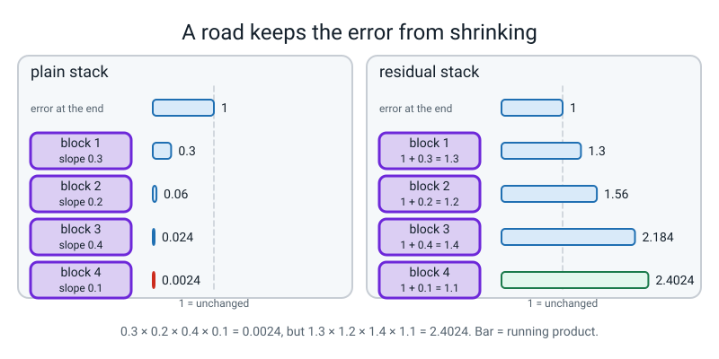
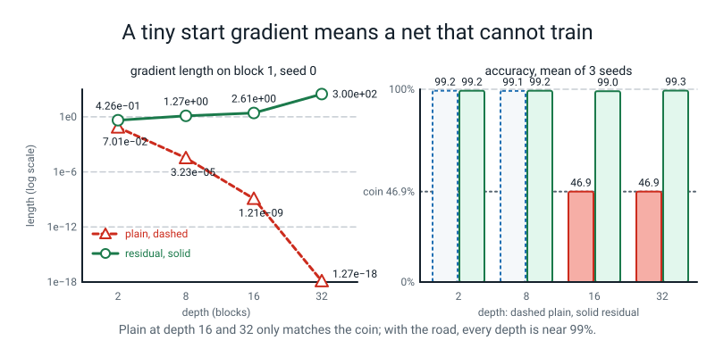

# Workbook — Week 6: Norms, Residuals, and the Gradient Highway

**Name:** ________________________________  **Date:** ______________

[⬅ Week 5](week-05.md) · [Course Home](../README.md) · [📖 Read the chapter first](../student-guide/week-06.md) · [Next ➡ Week 7](week-07.md)

---

> **Rules for this workbook.** Every number you write in a report must be one **your own run printed, with a seed, in the last 24 hours.** The digits in the Answers were produced by real runs on one CPU thread (`torch.set_num_threads(1)`, torch 2.2.1, numpy 1.26.4). If your third decimal differs, that is fine. If the *shape* differs, tell your teacher.
>
> Run everything from inside `36-week-course/` (with `export PYTHONPATH="$PWD"`) so that `from l4lib.spirals import ...` works. **Import `l4lib`. Never copy it.** Pages 6.4 and 6.5 also use the `lab6.py` you typed in the lesson.
>
> **New this week: one maths idea, the slope of a sum.** You meet it with a tiny nudge and a calculator. **Pages 6.3 and 6.4 (parts a to c) are paper and calculator only. No code.**
>
> **The sentence of the week:** *"Does this layer look at one example, or at the neighbours too?"* Say it out loud before you write any conclusion about a norm.

---


*Figure W6.0 — Where this fits: week 6 of 36 sits in term 1, "train it on purpose"; the tiles still dashed are the weeks to come.*

## ✅ Warm-Up (5 min)

This section checks what you kept from **last week** and earlier. Answer from memory, with no looking back.

**W1.** Dropout in `train()` mode with `p = 0.5`: a survivor is multiplied by ______ . In `eval()` mode it returns ____________ .

**W2.** Why does the snapshot of the best epoch need `copy.deepcopy`?

________________________________________________________________

**W3.** `model.eval()` and `model.train()` are about *modes*. Name one layer whose behaviour changes between them: ____________

**W4.** The validation set has 360 points and 46.9% of them are class 0. What accuracy does a network get if it *always* answers class 0? ______ % (You will meet this number again today.)

**W5.** Which of these can the computer tell you about your program: a `ValueError`, a silent wrong answer? Circle one. ____________ How do you catch the other?

________________________________________________________________

---

## 📖 Page 6.1 — Match the Word to the Thing

This page checks that you can tell this week's words apart. Write the letter of the meaning beside each word.

| Word | Letter | | Meaning |
|---|:--:|---|---|
| layer norm | ____ | **A** | A layer that returns its input and has no parameters. |
| batch norm | ____ | **B** | The error reaching the first layers is tiny, because every layer on the way multiplied it by something under 1. |
| running statistics | ____ | **C** | Normalise each example (each row) by its own mean and spread. |
| residual connection | ____ | **D** | If the gradient's length is over a limit, shrink it to the limit (same direction). |
| vanishing gradient | ____ | **E** | Normalise each feature (each column) by the mean and spread across the batch. |
| `nn.Identity()` | ____ | **F** | A block hands back `x + f(x)` instead of `f(x)`. |
| gradient clipping | ____ | **G** | Stored averages that batch norm uses in `eval()` mode, updated slowly in `train()` mode. |

**Two in your own words.** A *gradient highway* is: ______________________________________________

*Gradient length* is: __________________________________________________________________

**One that is easy to mix up.** Layer norm and batch norm both have 64 scales and 64 shifts when built for 64 features. So what *is* different about them? (Hint: the direction of the arithmetic.)

________________________________________________________________

**Count the stored numbers.** `nn.LayerNorm(64)`: ______ parameters, ______ stored running numbers. `nn.BatchNorm1d(64)`: ______ parameters, ______ stored running numbers. `nn.Identity()`: ______ parameters.

---

## 🔮 Page 6.2 — Predict the Output

This page trains you to guess before you run. Write your prediction **in pen, before** you run anything. Then run it and write what happened beside it.

**P1.** One example, batch norm, **train** mode (this one is *deliberately* broken; it may raise an error). Run this block and compare it with your prediction.

```python
import torch
import torch.nn as nn
bn = nn.BatchNorm1d(4)
print(bn(torch.tensor([[2.0, 4.0, 6.0, 8.0]])))
```

My prediction: ______________________ Real: ______________________

**P2.** The same layer, but `bn.eval()` first, then the same one-row input. Does it raise an error? ______ Roughly what does it print? (Hint: a new layer's stored mean is 0 and its stored variance is 1.) ______________________ Real: ______________________

**P3.** Layer norm built for **4** features, shown the row `[5.0, 5.0, 5.0, 5.0]`. Every distance from the mean is ______, so the spread is ______ . What stops the division by zero? ______________ My prediction for the output: ______________ Real: ______________

**P4.** Clipping, on a gradient of `[6.0, 8.0]` with `max_norm=5.0`. This block clips the gradient and prints the length it measured, then the clipped gradient.

```python
import torch
w = torch.tensor([1.0, 1.0], requires_grad=True)
(6 * w[0] + 8 * w[1]).backward()
r = torch.nn.utils.clip_grad_norm_([w], max_norm=5.0)
print(r.item(), w.grad.tolist())
```

Length of `[6, 8]` is `sqrt(36 + 64)` = ______ . So `r.item()` prints ______ . The gradient after clipping is `[______, ______]`. (Same direction, new length ______ .)

**P5.** Same call, gradient `[1.0, 2.0]`, `max_norm=5.0`. Length = sqrt(______) = about ______ . Is it over 5? ______ So the gradient afterwards is ________________ and `r.item()` prints ______ .

**P6.** Which layer is built to do nothing? ______________ How many numbers does it learn? ______

**Check P1 to P6 by running them.** Write down any prediction you got wrong, and why: ______________________________________________

---

## 🔢 Page 6.3 — Normalise by Hand

This page builds the normalising recipe by hand so you know exactly what the layers compute. **Pencil, paper and calculator. No code.**

The recipe for **one row** of numbers (this is layer norm without the learnt scale and shift):

1. **Mean**: add them up, divide by how many.
2. **Distances**: each number minus the mean.
3. **Spread**: square the distances, average the squares, take the square root.
4. **Divide** each distance by the spread.

**Worked example.** Row `[4, 8]`. Mean = 6. Distances = `−2, 2`. Squares `4, 4`, average 4, spread = 2. Answer: `[−1, 1]`. *(Torch's `nn.LayerNorm(2)` prints `−0.99999…` and `0.99999…`; the tiny shortfall is the safety number epsilon, added so the spread can never be exactly zero.)*

### (a) Four numbers

Row `[0, 0, 6, 6]`. Mean ______ . Distances: ______ , ______ , ______ , ______ . Spread ______ . Answer: [ ______ , ______ , ______ , ______ ]

### (b) Does adding a number matter?

Row `[1, 3, 5, 7]` : mean ______ , distances ______ , ______ , ______ , ______ , spread ______ (use `sqrt(5)` = 2.236). Answer: [ ______ , ______ , ______ , ______ ] (3 decimals)

Now row `[2, 4, 6, 8]` : answer [ ______ , ______ , ______ , ______ ]. Same or different? ______ So adding 1 to every entry ________________ the answer.

### (c) Does multiplying matter?

Row `[20, 40, 60, 80]` is `[2, 4, 6, 8]` multiplied by 10. Predict its layer-norm answer **without calculating**: ____________________________ Why? ____________________________________________

### (d) The all-the-same row

Row `[5, 5, 5, 5]`. Distances all ______, spread ______ . What would `0 / 0` do on paper? ______________ What does torch print? ______________ (see P3)

### (e) Batch norm normalises the other way

Batch norm takes a **batch of two examples** and normalises each **column** using just those two numbers.

```text
            feature 1   feature 2
example A       1           5
example B       3           9
```

Feature 1: column is `[1, 3]`, mean ______ , distances ______ and ______ , spread ______ , answer ______ and ______ .

Feature 2: column is `[5, 9]`, mean ______ , distances ______ and ______ , spread ______ , answer ______ and ______ .

Fill the result: A = [ ______ , ______ ]  B = [ ______ , ______ ]

Now try a different pair: A = `[10, 0]`, B = `[20, 4]`. Answer without calculating: A = [ ______ , ______ ]  B = [ ______ , ______ ]

**The collapse, in a sentence.** With only two examples, batch norm always hands back ______________ no matter what numbers went in, so ______________________________________________

**Layer norm on the same two examples.** Does layer norm for example A need example B? ______ So does the answer for A depend on who else is in the batch? ______

---

## 🛣️ Page 6.4 — The Slope of a Sum, and the Depth Table

### (a) Nudge it (calculator)

This part finds the slope of a sum with a tiny nudge. A block does only a little: `f(x) = 0.1 × x × x`. We stand at **x = 3** and nudge `x` up by **0.001**.

| | value at 3 | value at 3.001 | change | change ÷ 0.001 (the slope) |
|---|---|---|---|---|
| `f(x) = 0.1x²` | 0.9 | 0.9006001 | | |
| `x` | 3 | 3.001 | | |
| `x + f(x)` | | | | |

*(Check your first row: the change is 0.0006001, so the slope is about 0.6.)*

The slope of `x` alone is ______ . The slope of `f` is about ______ . The slope of `x + f(x)` is about ______ . **Write the pattern:** the slope of a sum is ____________________________________________

**If the block *subtracted* a little instead:** `f(x) = −0.5 × x`. The slope of `f` is ______ , so the slope of `x + f(x)` is ______ . Is the road still open? ______

### (b) Many blocks multiply (calculator)

When blocks are stacked, the slope all the way through is the **product** of each block's slope.

**Worked example.** Four blocks with slopes `0.3, 0.2, 0.4, 0.1`.
Plain stack: `0.3 × 0.2 × 0.4 × 0.1 = 0.0024`.
Road stack (each block gives `1 + slope`): `1.3 × 1.2 × 1.4 × 1.1 = 2.4024`.

| Slopes | Plain (multiply slopes) | Residual (multiply `1 + slope`) |
|---|---|---|
| `0.5, 0.5, 0.2` | | |
| ten blocks, every slope `0.5` | | |
| five blocks, every slope `0` | | |

*(Ten times 0.5: use the calculator's power key, `0.5^10` and `1.5^10`.)*

**Read the table.** The plain column ______________ as blocks are added. The residual column ______________ . Which one reaches block 1 with a usable signal? ______________

**One honest warning.** In the residual column with slopes of 0.5, the answer is 57.665: not "near 1" but a big number. Write why in a sentence: ______________________________________________


*Figure W6.1 — With a road each block's slope is 1 plus its old slope, so the error's running product stays near or above 1 instead of shrinking to 0.0024.*

### (c) Scientific notation (calculator)

Write each as an ordinary number or in `e` form. `3.23e-05` means *3.23 times ten to the minus five*: five places after the point, then 3.23.

| `e` form | Ordinary number |
|---|---|
| `7.01e-02` | |
| `3.23e-05` | |
| | 0.0000000012 |
| `3.00e+02` | |

Which is bigger, `1.27e-18` or `7.01e-02`? ______ By about how many powers of ten? ______

### (d) The depth table (needs `lab6.py`)

Run `probe.py` for the **top number** in each cell (first-block gradient length, seed 0, untrained). Run `depth_train.py` for the **bottom number** (accuracy after 30 epochs, mean of seeds 0 to 2). Use three colours if you have them: one for "tiny (under 0.01)", one for "middling (0.01 to 1)", one for "big (over 1)".

**First, predict** each gradient as tiny / middling / big (pen, before running): put T, M or B in the small box.

| Depth | Plain | Residual | Layer norm | Layer norm + residual |
|:--:|---|---|---|---|
| 2 | [ ] gradient ________<br>accuracy ______ % | [ ] gradient ________<br>accuracy ______ % | [ ] gradient ________<br>accuracy ______ % | [ ] gradient ________<br>accuracy ______ % |
| 8 | [ ] gradient ________<br>accuracy ______ % | [ ] gradient ________<br>accuracy ______ % | [ ] gradient ________<br>accuracy ______ % | [ ] gradient ________<br>accuracy ______ % |
| 16 | [ ] gradient ________<br>accuracy ______ % | [ ] gradient ________<br>accuracy ______ % | [ ] gradient ________<br>accuracy ______ % | [ ] gradient ________<br>accuracy ______ % |
| 32 | [ ] gradient ________<br>accuracy ______ % | [ ] gradient ________<br>accuracy ______ % | [ ] gradient ________<br>accuracy ______ % | [ ] gradient ________<br>accuracy ______ % |

**Circle the coin cells** (accuracy 46.9%). How many? ______ Which of them did the **gradient** columns warn you about? ______________________ Which did they **not** warn you about? ______________________

**The three observations** (one sentence each):

(i) The plain column: ____________________________________________________________

(ii) The residual column: _________________________________________________________

(iii) The thing measured and **not explained** (hint: layer norm alone): _______________________________

**Five seeds.** Run `probe_seeds.py`. For the residual stack at 32 blocks, the five gradient lengths are: ________ ________ ________ ________ ________ . Do they stay near each other? ______ So is a single seed enough to quote this cell? ______

**Predict, do not look it up:** "Does a residual stack at 64 blocks still train?" My guess: ______ . *We have not run that. If you run it, write it here as **your** result:* ______________________________


*Figure W6.2 — The first-block gradient at the start predicts which plain stacks never train; the road keeps every depth at about 99%.*

---

## 🎲 Page 6.5 — Read the Message

This page practises reading error messages and spotting bugs that raise no error. Read the **last line** first, then the line with **your** filename in it. Fill the gaps.

| Message | What it means | Fix |
|---|---|---|
| `ValueError: Expected more than 1 value per channel when training, got input size torch.Size([1, 4])` | | |
| `RuntimeError: Given normalized_shape=[8], expected input with shape [*, 8], but got input of size[3, 4]` | | |
| `TypeError: clip_grad_norm_() missing 1 required positional argument: 'max_norm'` | | |
| `TypeError: 'NoneType' object is not callable` | | |

**Which fix is *not* "use a bigger batch"?** The first message has three fixes. Write all three: ____________________ / ____________________ / ____________________ **Careful:** "bigger batch" alone earns no mark unless you give the reason.

### Two programs to repair

**F1.** *Deliberate error.* The program is meant to normalise a batch of three 4-feature rows. Run it and read the last line.

```python
# DELIBERATE ERROR
import torch
import torch.nn as nn
ln = nn.LayerNorm(8)
print(ln(torch.randn(3, 4)))
```

The size to give `LayerNorm` is the size of the ______ dimension of the data, which here is ______ . Corrected line: ________________________

**F2.** *Deliberate error.* "No norm" is written as `None`. Run it and read the last line.

```python
# DELIBERATE ERROR
import torch
import torch.nn as nn
net = nn.Sequential(None, nn.Linear(4, 4))
print(net(torch.randn(2, 4)))
```

Does *building* the network complain? ______ When does it? ______ Corrected: ________________________

### Three silent mistakes (no error, believable number)

**S1.** This clip is "working". Is it? Run the block and look at the number printed.

```python
# SILENT mistake: no error is raised
import torch
torch.manual_seed(0)
net = torch.nn.Linear(3, 1)
x, y = torch.randn(8, 3), torch.randn(8, 1)
loss = ((net(x) - y) ** 2).mean()
size = torch.nn.utils.clip_grad_norm_(net.parameters(), max_norm=0.1)
loss.backward()
print("length returned:", size.item())
```

Predict the printed number: ______ Real: ______ . Why? ______________________________________________ The one number that gives it away: ______________ Fix: ________________________________

**S2.** A batch-norm model has validation loss 2.002 when you measure it on four points and 0.014 when you measure it again later. Nothing was trained between. What did you forget? ______________________________ Which line fixes it? ______________________

**S3.** Where must `clip_grad_norm_` sit? Number these four lines 1 to 4 in the right order: ____ `opt.step()` ____ `loss.backward()` ____ `clip_grad_norm_(model.parameters(), max_norm=1.0)` ____ `opt.zero_grad(set_to_none=True)`

What goes wrong if clip is **after** `opt.step()`? ______________________________________________

---

## 📓 Page 6.6 — The Bug Log

This page is your record of what went wrong this week. Copy the **last line** of every error or surprise you meet, not the whole traceback.

| # | Last line (copied) | What it meant | The fix | Caught by (message / print / nobody) |
|:-:|---|---|---|:-:|
| 1 | | | | |
| 2 | | | | |
| 3 | | | | |
| 4 | | | | |
| 5 | | | | |

**Your sentence for this week:** *"A deep plain stack that sits at 0.693 is not necessarily ______ , it may be ______ ."* Complete it from memory: ______________________________

**Which bug was silent (no error, wrong answer)?** What is the one number you could have printed to find it? ______________________________________________

**Report (three sentences, from your own table).** What the plain column did in each table; what the residual column did in each table; the one thing we measured and could not explain.

________________________________________________________________

________________________________________________________________

________________________________________________________________

---

## 🧠 Self-Check (do this last, from memory)

This section tests the week's main ideas in seven short gaps. Fill them without looking back.

1. Layer norm works on each ______ ; batch norm works on each ______ across the batch.
2. Batch norm at batch size 1 in `train()` mode raises a ______ ; in `eval()` mode it ______ because it uses ______ .
3. The slope of `x + f(x)` is ______ plus ______ .
4. A plain network's first block hears almost nothing because each layer's slope is ______ 1, and slopes are ______ together.
5. Does a residual road keep the gradient "near 1" with no norm? ______ (what happened at 32 blocks?) ______________
6. `clip_grad_norm_` returns the length ______ the clip. It goes after ______ and before ______ .
7. Which cell was a coin that the gradient did *not* warn about? ______________________

---

## ✂️ ANSWERS — keep this page folded until you have finished

### Warm-Up

- **W1.** 2.0 (`1 / (1 − 0.5)`); the input unchanged.
- **W2.** `state_dict()` returns live tensors; without a copy the "snapshot" keeps changing with the model.
- **W3.** Dropout or batch norm (either).
- **W4.** 46.9 %.
- **W5.** The `ValueError` is the loud one; a silent wrong answer is caught by printing one number that should be a known value (a returned length, a loss in `eval()` mode).

### Page 6.1

- Matches: layer norm **C**, batch norm **E**, running statistics **G**, residual connection **F**, vanishing gradient **B**, `nn.Identity()` **A**, gradient clipping **D**.
- In your own words: a gradient highway is the `x + f(x)` path that lets the error walk back to the first layers with a slope of exactly 1 from the road itself (the block's own slope is then added to that 1); gradient length is the size (length) of all the gradient numbers taken together.
- Difference between the norms: layer norm normalises across each **row** (one example), batch norm across each **column** (the batch).
- Counts: `LayerNorm(64)` **128** parameters, **0** stored numbers; `BatchNorm1d(64)` **128** parameters, **129** stored numbers (64 means, 64 variances, 1 counter); `Identity` **0**.

### Page 6.2
- **P1.** Raises **`ValueError: Expected more than 1 value per channel when training, got input size torch.Size([1, 4])`**.
- **P2.** No error. Very nearly the input: `[2.0, 4.0, 6.0, 8.0]`, because the stored mean is 0 and variance is 1.
- **P3.** Distances 0, spread 0; `eps` stops the division by zero; output `[0.0, 0.0, 0.0, 0.0]`.
- **P4.** `sqrt(100)` = 10; prints `10.0`; gradient `[3.0, 4.0]`, new length 5.
- **P5.** `sqrt(1 + 4) = sqrt(5)` = about 2.236; not over 5; unchanged `[1.0, 2.0]`; prints `2.236`.
- **P6.** `nn.Identity()`; 0 numbers.

### Page 6.3
- **Worked example check.** `[−1, 1]`.
- **a.** Mean 3; distances `−3, −3, 3, 3`; spread 3; **`[−1, −1, 1, 1]`**.
- **b.** Mean 4; distances `−3, −1, 1, 3`; squares `9, 1, 1, 9`, average 5, spread `sqrt(5)` = 2.236; **`[−1.342, −0.447, 0.447, 1.342]`**. `[2, 4, 6, 8]` gives the same. Adding the same number to every entry **leaves the answer unchanged**.
- **c.** The same `[−1.342, −0.447, 0.447, 1.342]` (every distance and the spread both grow ten times, so the ratio is the same; real run: `[-1.342, -0.447, 0.447, 1.342]`).
- **d.** Distances 0, spread 0; `0 / 0` is undefined; torch prints **`[0.0, 0.0, 0.0, 0.0]`** (epsilon keeps the division legal). Accept "undefined" with a note that torch returns zeros.
- **e.** Feature 1: mean 2, distances `−1, 1`, spread 1, answers `−1, 1`. Feature 2: mean 7, distances `−2, 2`, spread 2, answers `−1, 1`. **A = [−1, −1], B = [1, 1].** For A = `[10, 0]`, B = `[20, 4]`: **A = [−1, −1], B = [1, 1]** (real run: `[[-1.0, -1.0], [1.0, 1.0]]`).
 *Different numbers, same answer: the collapse.* With two examples batch norm always hands back `−1` and `+1`, so the network can no longer tell the examples apart (and the output depends on the *neighbour*, not on the example). Layer norm for A needs only A; so **no**, A's answer does not depend on who else is in the batch.

### Page 6.4
**(a)** `f`: change 0.0006001, slope about **0.6**. `x`: change 0.001, slope **1.0**. `x + f(x)`: 3.9 to 3.9016001, slope about **1.6**. Pattern: **the slope of a sum is the sum of the slopes: 1 plus whatever `f` does** (that is `1 + 0.6`). For `f = −0.5x`: slope −0.5, so `x + f` has slope **0.5**; the road is still open (it is positive, but shrunk; a road of exactly 1 needs `f` flat).

**(b)** Real calculator values (from a run):

| Slopes | Plain | Residual |
|---|---|---|
| `0.5, 0.5, 0.2` | **0.05** | **2.7** |
| ten blocks, every slope `0.5` | **0.000977** | **57.665** |
| five blocks, every slope `0` | **0** | **1** |

Plain shrinks to nothing as blocks are added; the residual does not shrink (here it grows); the residual one reaches block 1. Warning sentence: *"Each block gives `1 + slope`, and a number over 1 multiplied again and again grows; the road keeps the signal from vanishing, it does not keep it near 1. A norm layer is what keeps it from growing too much."* **Full credit** also for "the road adds 1 to each slope, so the product cannot shrink to nothing". Method accepted: nudge by `0.001` and divide.

**(c)** `0.0701` ; `0.0000323` ; `1.2e-09` ; `300`. `7.01e-02` is bigger, by about **16 powers of ten**.

**(d)** The depth table, as printed in the teacher guide (gradient: seed 0, one batch, untrained; accuracy: mean of seeds 0 to 2):

| Depth | Plain | Residual | Layer norm | Layer norm + residual |
|:--:|---|---|---|---|
| 2 | 7.01e-02 / 99.2% | 4.26e-01 / 99.2% | 2.46e-01 / 98.9% | 5.40e-01 / 98.9% |
| 8 | 3.23e-05 / 99.1% | 1.27e+00 / 99.2% | 5.29e-01 / 98.7% | 1.42e+00 / 98.6% |
| 16 | 1.21e-09 / **46.9%** | 2.61e+00 / 99.0% | 2.01e+00 / **46.9%** | 1.37e+00 / 97.6% |
| 32 | 1.27e-18 / **46.9%** | 3.00e+02 / 99.3% | 7.90e+00 / **46.9%** | 3.58e+00 / 98.8% |

Accept any gradient within a factor of two of the printed one **at your own seed**, and accuracies within about two points. **Four** coin cells: plain and layer-norm-only at depths 16 and 32. The gradient warned about the **two plain** ones; it did **not** warn about the **two layer-norm-only** ones (their gradient is healthy and the network still does not learn).

The three observations: **(i)** the plain gradient collapses (`7e-02` to `1e-18`) and the network is stuck at 46.9% from 16 blocks; **(ii)** the residual gradient *grows* (to about `3e+02` at 32 blocks, seed 0) and the network trains at every depth; **(iii)** layer norm alone has a healthy gradient and does **not** train at 16 or 32 blocks, for a reason we did not find.

Five seeds, residual, 32 blocks: **3.00e+02, 2.02e+01, 6.23e+01, 7.47e+01, 2.63e+01**. They are not near each other (a factor of about 15); so **no**, one seed is not enough to quote this cell (the plain column's first cell is the same every time; the residual one jumps around). The 64-block question is **unanswered**: nobody has run it, so any result you found is yours.

### Page 6.5
| Message | What it means | Fix |
|---|---|---|
| ValueError ... `[1, 4]` | Batch norm in train mode got one example and cannot compute a spread from one number. | Batch of at least 2; or `model.eval()`; or layer norm. |
| RuntimeError ... `[8]` ... `[3, 4]` | The norm layer was built for 8 features and the data has 4. | `nn.LayerNorm(4)`. |
| TypeError ... `max_norm` | The limit was not given. | Add `max_norm=1.0`. |
| `'NoneType' object is not callable` | A layer in the chain is `None`; you cannot call it. | `nn.Identity()`. |

Three fixes for the first: batch of at least 2 / `model.eval()` / layer norm. A student who writes "batch norm has no running average" is *half* right: the running statistics exist and are what `eval()` uses.

**F1.** The **last** dimension; 4; `ln = nn.LayerNorm(4)`. **F2.** Building does **not** complain (Python only checks you gave it things); using the network does; the first layer is the `None`; replace with `nn.Identity()`.

**S1.** Predicted: 0.0. Real run: **`length returned: 0.0`** (and after `loss.backward()`, the same net measured **1.323**). The clip ran **before** `backward()`, when no gradient existed. The tell-tale: the returned length is exactly `0.0`. Fix: put the clip after `loss.backward()`.
**S2.** `model.eval()` (and then `torch.no_grad()`): in train mode batch norm used only four examples. The model did not get worse; the measuring instrument changed. (Real measurement in the lesson: 2.002 in train mode, 0.014 in eval mode.)
**S3.** Order: `zero_grad` (1), `backward` (2), `clip_grad_norm_` (3), `opt.step()` (4). Clip after the step: the update already used the big gradient (in the lesson, loss on the next batch was **3741** instead of **10.5**).

### Page 6.6 and Self-Check
Bug Log: any real entries are fine if the **last line** (not the whole traceback) was copied and the fix works. Sentence: *"A deep plain stack that sits at 0.693 is not necessarily **broken** (a bug), it may be **a vanishing gradient** (a design problem); check the gradient length and the loss first."* Accept any answer that says the code may be fine and the depth has no road. (Not every 0.693 or 46.9% is a vanishing gradient: layer norm alone sat at 46.9% with a healthy gradient, and SGD without clipping sat there because the loss became nan.) Silent bug: S1 (the number `0.0`), S2 (the loss in `eval()` mode), S3 (the loss on the next batch).
Report marking: plain column collapses and sticks at 46.9% from 16 blocks; residual grows and trains at every depth; layer norm alone is healthy yet does not train at 16 or 32 blocks, unexplained.

1. **row** (one example); **column** (one feature).
2. **`ValueError`**; **returns a result**; **running statistics** (stored averages).
3. **1**; **the slope of `f`**.
4. **under** 1; **multiplied**.
5. **No.** At 32 blocks the gradient grew to 20 to 300 over five seeds.
6. **before**; **`backward()`**; **`opt.step()`**.
7. **Layer norm alone at depth 16 or 32** (gradient 2.01 or 7.90, accuracy 46.9%).

---

[⬅ Week 5](week-05.md) · [Course Home](../README.md) · [📖 Chapter](../student-guide/week-06.md) · [Next ➡ Week 7](week-07.md)
