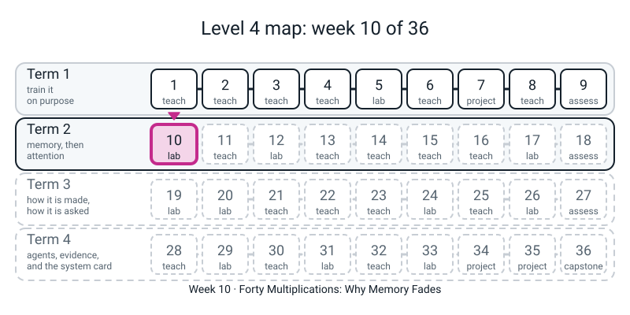
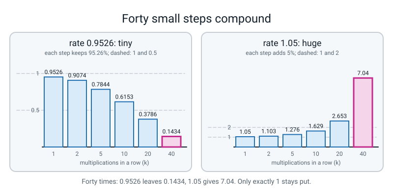
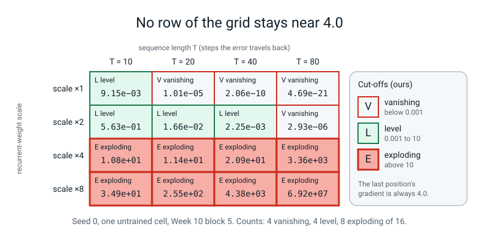

# Workbook — Week 10: Forty Multiplications: Why Memory Fades

**Name:** ________________________________  **Date:** ______________

[⬅ Week 9](week-09.md) · [📖 Read the chapter first](../student-guide/week-10.md) · [Course Home](../README.md) · [Next ➡](week-11.md)

---

> **Rules for this workbook.** Six pages and a Bug Log: **by hand first** (compounding, then slopes in a chain), then **your own run** (the parked cell, the grid, one explosion), then a short report. Pages 10.1 and 10.2 need only a calculator **with a power key** (`x^y`). Pages 10.3 to 10.5 copy numbers that **your own `week10.py` printed**.
>
> **Pen first, then run.** Write every prediction before you run anything. Use **one colour of pen for predictions and another for measurements** on page 10.4.
>
> **Where the numbers came from.** Every worked example and every answer was printed by a real CPU run (PyTorch, `torch.manual_seed(0)` unless a page says another seed). By-hand numbers are plain arithmetic and match exactly. On another computer or PyTorch build the **last digit** of a gradient such as `2.06e-10` can move; the **exponent** and the shape of every table will not.
>
> **Copy exponents in full.** `2.5e-03` means `0.0025`. If you drop the `e-03` you are wrong by a factor of a thousand.
>
> **There is no language model and no stand-in in this workbook.** The cell is real PyTorch with **untrained, seeded random weights**. Nothing is downloaded and nothing needs the internet.
>
> Carry **four decimals** in every calculation. Run any check file from a folder of your own, and delete what it writes.

---


*Figure W10.0 — Week 10 is the first lesson of Term 2 on memory: why a loop forgets.*

## ✅ Warm-Up (5 min, before anything else)

**W1.** In Week 8 the recurrent weight `W_hh` was `0.5`. After one step the old note is multiplied by about `0.5` (times a slope of at most 1). After three steps, roughly how much of it is left? Guess, no calculator: ____________

**W2.** In Week 6 a residual highway added the input to `f(x)`. What was the slope of `x + f(x)` when the slope of `f` was `0.5`? ____________

**W3.** What does `clip_grad_norm_` do to a gradient that is **too long**? ____________ To one that is **too short**? ____________

**W4.** Circle one. A number below 1 multiplied by itself again and again gets **smaller / bigger**. A number above 1 gets **smaller / bigger**.

---

## 🧮 Page 10.1 — Compounding by Hand (15 min)

**Compounding** means multiplying a number by *itself* again and again: `r ** k` is `r` multiplied `k` times. Use the power key. Write the **predicted size** first (**tiny**, **near 1** or **large**), then the answer.

**Worked example (done for you).** `0.8 ** 10`. Predict: tiny, because 0.8 is below 1 and ten multiplications is a lot. Calculate: **`0.1074`**. Doubling the count to `0.8 ** 20` gives **`0.0115`**: not half of `0.1074`, but about its *square* (`0.1074 x 0.1074 = 0.0115`). And `1.2 ** 5 =` **`2.4883`**: above 1 grows, and five steps already more than doubles it.

| Part | Question | My prediction (tiny / near 1 / large) | My answer (4 decimals) |
|:--:|---|:--:|:--:|
| a | `0.9 ** 10` | | |
| b | `0.9 ** 20` | | |
| c | `1.1 ** 10` | | |
| d | `1.1 ** 20` | | |
| e | `0.99 ** 40` | | |
| f | `1.01 ** 40` | | |

**g. The telephone.** Forty people pass a message. Each passes on **95%** of what they heard. How much of it reaches person 40? Write the calculation: ______________ Answer: ____________ (about ______ %)

**h. A loop that halves.** Every multiplication is by `0.9`. **How many multiplications** until the value first falls **below one half**? Count by repeated multiplication, writing each value (you need four decimals):

| k | 1 | 2 | 3 | 4 | 5 | 6 | 7 |
|:--:|:--:|:--:|:--:|:--:|:--:|:--:|:--:|
| `0.9 ** k` | | | | | | | |

First below one half at k = ____________ .

**i. Look at e and f together.** One is a hair under 1 and one is a hair over 1. Neither answer is "about 1". In one sentence, what does that tell you about forty multiplications? ___________________________________________

**j. Look at a and b together.** Did doubling the count from 10 to 20 halve the answer? ____________ What happened to it instead? ___________________________________________

**Check file** (run it only after the table is written). It prints each power and the first count below one half:

```python
# check101.py - Week 10 workbook page 10.1: check the compounding answers.
for label, rate, k in [("a", 0.9, 10), ("b", 0.9, 20), ("c", 1.1, 10), ("d", 1.1, 20), ("e", 0.99, 40), ("f", 1.01, 40), ("g", 0.95, 40)]:
    print(f"  {label}) {rate} ** {k} = {rate ** k:.4f}")
value, k = 1.0, 0
while value > 0.5:
    value = value * 0.9
    k = k + 1
print(f"  h) 0.9 first below 0.5 after {k} multiplications ({value:.4f})")
```

Which parts did my hand answer miss by more than `0.0005`? ____________ The slip (calculator key, a rounded step, mixing up `9 x 10` with `0.9 ** 10`)? ___________________________________________

---


*Figure W10.1 — Multiplying by a number below 1 forty times leaves almost nothing, above 1 gives a big number; only exactly 1 stays put.*

## ⛓️ Page 10.2 — Slopes in a Chain (Week 8's cell · 20 min)

This page is for multiplying the slopes along a short chain of notes by hand, for two recurrent weights.

Week 8's cell: `new note = tanh( W_xh x + W_hh (old note) )`, no bias. The slope of `tanh` at a note `h` is `1 - h x h` (the note, **squared**). So **the slope from an old note to the new note** is

> **slope into a note = W_hh x (1 - new note x new note).** Use the **new** note, the one just made.

**Worked example (done for you).** `W_hh = 0.5` and a new note of `0.5`. Slope `= 0.5 x (1 - 0.5 x 0.5) = 0.5 x 0.75 =` **`0.3750`**.

**This page uses a bigger recurrent weight: `W_hh = 1.0`, `W_xh = 1.0`**, and a spike at step 1: `x = [1, 0, 0, 0]`, start note `0`. The four notes are

> **0.7616, 0.6420, 0.5663, 0.5126**

(the first is `tanh(1.0)`; the rest are already worked out for you.)

| Into note | New note | `1 - (new note)²` | times `W_hh = 1.0` = slope |
|:--:|:--:|:--:|:--:|
| 2 | 0.6420 | | |
| 3 | 0.5663 | | |
| 4 | 0.5126 | | |

**a.** The slope from note 1 all the way to note 4 is the three slopes **multiplied**: ______ x ______ x ______ = ____________

**b.** Last week's cell had `W_hh = 0.5`, and its three slopes were `0.4340, 0.4839, 0.4960`. Multiply them: ____________ (a calculator, four decimals; because these three slopes are themselves rounded, you may get `0.1041` or `0.1042`, and both are right).

**c.** Which recurrent weight lost **less** between note 1 and note 4? ____________ By roughly what factor? (divide your a by your b) ____________

**d.** Does that agree with Week 8's workbook, where the note **faded more slowly** with the bigger recurrent weight? ____________ Say why in one sentence: ___________________________________________

**e. Predict.** If the chain were **40** notes long and every slope were about `0.6`, would the product from note 1 to note 40 be closer to `0.5`, `0.01` or `0.000000001`? My guess: ____________ Test it with `0.6 ** 39` (leave the digits here): ____________

**Check file.** It prints the four notes, the three slopes and their product:

```python
# check102.py - Week 10 workbook page 10.2: the Week 8 cell with W_hh = 1.0, a spike at step 1.
import math

h, notes = 0.0, []
for x in [1.0, 0.0, 0.0, 0.0]:
    h = math.tanh(1.0 * x + 1.0 * h)
    notes.append(round(h, 4))
print("notes:", notes)
slopes = [1.0 * (1 - n * n) for n in notes[1:]]
print("slopes into notes 2, 3, 4:", [round(s, 4) for s in slopes])
print("note 1 -> note 4:", round(slopes[0] * slopes[1] * slopes[2], 4))
```

Compare with your part a. Write what it printed for the last line: ____________ Did it match part a? ____________

---

## 🅿️ Page 10.3 — The Parked Cell (from block 3 · 15 min)

This page is for comparing hand-computed powers of one slope with the gradients your own run printed.

Block 3 of your `week10.py` built a cell with **one number** whose note is *parked* near `0.2177`, so **every slope is the same**: `1 - 0.2177 x 0.2177 = 0.9526`. It printed the gradient at several positions of a chain of **41** notes.

**Worked example (done for you).** Position 40 is **one** step back from position 41, so the gradient there is `0.9526 ** 1 = 0.9526`. Position 39 is **two** steps back: `0.9526 ** 2 =` **`0.9074`**.

**Step 1: the exponent.** Fill in the steps back, then the calculator value. **Before you look at your run.**

| Position `p` | Steps back from 41 (`41 - p`) | `0.9526 ** (41 - p)` by hand |
|:--:|:--:|:--:|
| 41 | | |
| 40 | 1 | 0.9526 |
| 39 | 2 | 0.9074 |
| 31 | | |
| 21 | | |
| 11 | | |
| 1 | | |

**Step 2: run block 3** and copy the **measured gradient** for the same positions:

| Position `p` | Measured gradient (from my run) | Agrees with my hand value to two decimals? (Y / N) |
|:--:|:--:|:--:|
| 41 | | |
| 40 | | |
| 39 | | |
| 31 | | |
| 21 | | |
| 11 | | |
| 1 | | |

**a.** Finish the sentence from the table: *"The gradient at position `p` is the slope multiplied ______ times."* (The exponent is **not** `p`.)

**b.** A chain of 41 notes has ______ slopes between the last note and the first.

**c.** The two columns agree closely but **not exactly** at position 1. Block 3 printed the note at positions 1, 2 and 41 as `0.2177, 0.2176, 0.217`. In one sentence, why do the columns drift apart a little? ___________________________________________

**d.** This cell has a slope of `0.9526`, very close to 1, and yet the gradient at position 1 is only about ______ of the last one's. What does that say about a slope that "only loses 5%"? ___________________________________________

---

## 🎲 Page 10.4 — The Forty-Multiplications Grid (block 5 · 30 min)

This page is for recording a grid of measurements and comparing it with your predictions.

The experiment: the **size of the gradient at position 1**, for four sequence lengths `T` and four settings of the recurrent weight (`x1` is the ordinary cell; `x2`, `x4`, `x8` multiply its recurrent weights by 2, 4 and 8). The gradient at the *last* position is always `4.0`, so compare everything to that.

**Three letters** (the cut-offs are ours, chosen so you can commit):

- **V** vanishing: below `0.001`
- **L** level: between `0.001` and `10`
- **E** exploding: above `10`

**Worked example (done for you; a length your grid does not use, seed 0).** At `T = 5`, scale 1, a run printed `2.84e-01`, which is `0.284`: above `0.001` and below `10`, so **L**. At `T = 30`, scale 1, it printed `3.25e-08`, which is `0.0000000325` (seven zeros after the point, then the 3): **V**. At `T = 30`, scale 8, it printed `1.19e+02`, which is `119`: **E**.

### Step 1 — predict all 16 cells before running anything (first colour of pen)

Write one letter in each cell.

| scale | T = 10 | T = 20 | T = 40 | T = 80 |
|:--:|:--:|:--:|:--:|:--:|
| x1 | | | | |
| x2 | | | | |
| x4 | | | | |
| x8 | | | | |

### Step 2 — run block 5 and copy the numbers **with their exponents** (second colour of pen)

| scale | T = 10 | T = 20 | T = 40 | T = 80 |
|:--:|:--:|:--:|:--:|:--:|
| x1 | | | | |
| x2 | | | | |
| x4 | | | | |
| x8 | | | | |

### Step 3 — colour in which predictions were right

Correct predictions: ______ / 16. **The score is not the point. The pattern of the misses is.** My misses were mostly in row(s): ____________ and in the direction of (too hopeful / too gloomy / mixed): ____________

### Step 4 — one sentence per row

Each sentence gives a **direction** (falls, rises, hovers) and **one number copied with its exponent**.

- **x1:** ___________________________________________
- **x2:** ___________________________________________
- **x4:** ___________________________________________
- **x8:** ___________________________________________

**a.** Is there any row where the number stays level for every `T`? ____________ Complete the sentence: *"No setting stays level for ______."* (Scale 4 is the closest; say in a few words how it moves.) ___________________________________________

**b. Did you change your mind?** After seeing the scale-4 row, which earlier prediction would you now change, and to what? ___________________________________________

**c. One lucky seed?** Block 6 ran five seeds (0 to 4) at `T = 40`. Copy the two lines it printed:

scale 1: ___________________________________________

scale 8: ___________________________________________

Which seed broke the rule at scale 8 (a tiny number instead of a huge one)? Seed ______ , value ____________ . Why do we not conclude that scale 8 "sometimes works"? ___________________________________________

---


*Figure W10.2 — No setting of the grid keeps the gradient near the 4.0 of the last position: it vanishes or explodes by orders of magnitude.*

## 💥 Page 10.5 — One Explosion, With and Without Clipping (block 7 · 15 min)

This page is for recording one update with and without clipping, and comparing the before and after numbers.

Block 7 did **one** update of the knobs (learning rate `0.1`, `T = 40`, seed 0) in four ways. *Weight size* is the length of the recurrent weight matrix; *notes pinned* is the share of the 40 x 16 notes above `0.99` in size (the flat ends of `tanh`).

**Worked example (done for you; a shorter chain, `T = 20`, seed 0, so your numbers will be different).** At scale 1 the weight size went from `2.23` to `2.29` plain: a change of `0.06`, a small step. At scale 8 it went from `17.87` to `491.94` plain: roughly **28 times** bigger (`491.94 / 17.87`). Divide after over before to get a factor.

Copy from your run:

| scale | run | weight size before | after | notes pinned before | after |
|:--:|---|:--:|:--:|:--:|:--:|
| 1 | plain | | | | |
| 1 | clipped | | | | |
| 8 | plain | | | | |
| 8 | clipped | | | | |

**a.** At scale 8, plain: by what rough factor did the weight size change? ____________ Did clipping stop that? ____________

**b.** At scale 8, clipped: compare the weight size before and after, then look at the *notes pinned* column. Did clipping un-pin the notes? ____________ What share was already pinned **before** the update? ____________

**c.** At scale 1, where nothing was wrong, did clipping still change the step? ____________ In which direction (bigger / smaller)? ____________ What does that say about clipping when the gradient is small? ___________________________________________

**d. The question that makes the activity.** *"Can clipping bring `2e-10` back?"* Answer **no** or **yes**, and say why in two sentences. Use the words *multiplies everything by one number*. ___________________________________________

___________________________________________

**e.** Finish with the sentence of the week: *"Clipping is a seatbelt, not ______."*

---

## 📝 Page 10.6 — The Report (20 min)

This page is for reporting the week's measurements in four sentences.

Write **four sentences**, in your own words, to someone who has not done this week.

**Rules.** Every number must have been printed by **your own run in the last 24 hours**; copy it **with its exponent**; state the **seed**.

1. The gradient at position 1 at scale 1 and at scale 8, both at `T = 40`, with the seed: ___________________________________________
2. **Why** that happens, in one sentence (what is being multiplied?): ___________________________________________
3. What clipping **does** and does **not** do: ___________________________________________
4. What this week did **not** show. (Hint: what was the cell doing when you measured it: trained or not?) ___________________________________________

**Self-marking** (tick what your report has):

- ☐ Two numbers with exponents, one tiny and one huge, from my own run, seed stated (2 marks)
- ☐ The cause in one sentence: the same kind of number multiplied many times (1 mark)
- ☐ What clipping does **not** do (1 mark)
- ☐ What was **not** shown: an **untrained** cell, not "RNNs can't remember" (2 marks)

**Marks: ______ / 6.** A sentence that says "RNNs can't remember long sequences" loses the last two marks, because this week measured a random cell at the start.

---

## 📓 Page 10.7 — The Bug Log

This page is for recording what went wrong this week and how you found out.

The Bug Log is the most useful page of the course. Copy only the **last line** of a traceback, not all of it.

**Copy this sentence in your own handwriting:**

> **"Forty small multiplications are not a small change, and clipping is a seatbelt, not an engine."**

___________________________________________________________________________

**Entry 1: Break It On Purpose, block 1 (`torch.stack(a, b)`).** I predicted it would: ____________ . Actually it: ____________ . The last line of the error: ___________________________________________ . What `stack` wanted in position 1, and what it got: ___________________________________________ . The fix: ___________________________________________

**Entry 2: the silent one.** Clipping called **before** `backward()` prints no error but changes nothing. In your words, how would you *notice* a clip that did nothing? (Hint: what does `clip_grad_norm_` return?) ___________________________________________

**Entry 3: the prediction I got most wrong** on page 10.4 was the cell at scale ______ and `T = ______` . I predicted ______ , the number was ____________ . The reason I was wrong: ___________________________________________

| Date | Where it happened | The symptom | What I thought it was | What it really was | The check that proved it |
|---|---|---|---|---|---|
| | | | | | |
| | | | | | |

---

## 🧠 Self-Check (do this last, from memory)

This section is for testing, without notes, what you can still do and say.

- ☐ Work out `0.95 ** 40` on a calculator and say, before pressing the key, whether it is tiny, near 1, or large.
- ☐ Say why a loop makes compounding matter (the same slope is used at every step back).
- ☐ Say how many slopes lie between the last note and the first in a chain of 41 notes.
- ☐ Say what the gradient at position 1 was at scale 1 and at scale 8, in powers of ten.
- ☐ Say what clipping does **and** what it does not do.
- ☐ Say what this week did **not** show.

**Ticks:** ______ / 6 . **The one I could not tick, and when I will redo it:** ___________________________________________

**Next week.** Week 11 brings in **gates**: a memory that *adds* instead of multiplying, which is the tiny side's answer. You will measure the same table again, and **page 10.4 is what it is compared with**. **If page 10.4 is blank, do it before Week 11.**

---

## ✂️ ANSWERS - keep this page folded until you have finished

> Real printed outputs below. By-hand numbers are exact. Measured gradients may differ in the last digit on another CPU or PyTorch build; the exponents and the shape of each table will not. These answers are for the pages in **this workbook**.

### Warm-Up

**W1.** About a tenth or less: `0.5 x 0.5 x 0.5 = 0.125`, and the `tanh` slope (at most 1) makes it smaller still. (Week 10's page 10.2 gives `0.1041`.) **W2.** `1 + 0.5 =` **1.5**. **W3.** Too long: **scales it down** to the limit. Too short: **leaves it alone** (it turns the volume down, never up). **W4.** **Smaller**; **bigger**.

### Page 10.1

| Part | Prediction | Answer |
|:--:|:--:|:--:|
| a `0.9 ** 10` | near 1 to tiny (a third) | **0.3487** |
| b `0.9 ** 20` | tiny | **0.1216** |
| c `1.1 ** 10` | large-ish (over 2) | **2.5937** |
| d `1.1 ** 20` | large | **6.7275** |
| e `0.99 ** 40` | not "about 1" | **0.6690** |
| f `1.01 ** 40` | not "about 1" | **1.4889** |

**g.** `0.95 ** 40 =` **0.1285**, about **13%** reaches person 40. **h.** `0.9000, 0.8100, 0.7290, 0.6561, 0.5905, 0.5314, 0.4783`: first below one half at **k = 7** (`0.4783`). (Real output of the check file: `h) 0.9 first below 0.5 after 7 multiplications (0.4783)`.)

**i.** A hair under 1 and a hair over 1 are **not** "about 1" after forty multiplications: `0.669` and `1.4889`. **j.** No. It did not halve; it was **squared** (`0.3487` to `0.1216`). *Common errors:* `0.9 x 10 = 9`; rounding `0.99 ** 40` to `1`; saying "5% of 40 is 200% lost".

### Page 10.2

Real output of the check file:

```text
notes: [0.7616, 0.642, 0.5663, 0.5126]
slopes into notes 2, 3, 4: [0.5878, 0.6793, 0.7372]
note 1 -> note 4: 0.2944
```

| Into note | `1 - (new note)²` | slope (times 1.0) |
|:--:|:--:|:--:|
| 2 | `1 - 0.4122 = 0.5878` | **0.5878** |
| 3 | `1 - 0.3207 = 0.6793` | **0.6793** |
| 4 | `1 - 0.2628 = 0.7372` | **0.7372** |

**a.** `0.5878 x 0.6793 x 0.7372 =` **0.2944**. **b.** `0.4340 x 0.4839 x 0.4960 =` **0.1041**. **c.** The **bigger** recurrent weight (`W_hh = 1.0`) lost less: `0.2944 / 0.1041` is about **2.8** times as much survives. **d.** Yes: the bigger recurrent weight makes each slope bigger, so less is lost at each step and the note fades more slowly. **e.** `0.6 ** 39` is about `2.2e-09`, so **closest to `0.000000001`**. *(Run yourself: `0.6 ** 39` printed by Python.)* *Common errors:* using the **old** note in `1 - h x h`; forgetting `W_hh`; rounding each slope to one decimal.

### Page 10.3

| Position `p` | Steps back | By hand `0.9526 ** (41 - p)` | Measured gradient |
|:--:|:--:|:--:|:--:|
| 41 | 0 | 1.0000 | 1.0000 |
| 40 | 1 | 0.9526 | 0.9529 |
| 39 | 2 | 0.9074 | 0.9080 |
| 31 | 10 | 0.6153 | 0.6173 |
| 21 | 20 | 0.3786 | 0.3809 |
| 11 | 30 | 0.2330 | 0.2348 |
| 1 | 40 | 0.1434 | 0.1447 |

**a.** "...the slope multiplied **`41 - p`** times." **b.** **40** slopes. **c.** The note is not perfectly parked: it drifts from `0.2177` to `0.217`, so the slope creeps up a hair, and the tiny differences compound too. **d.** About **`0.14`** (measured `0.1447`). A slope that "only loses 5%" leaves only about **14%** after 40 steps. *Common error:* reading the exponent as `p`; it is the distance from the **last** position.

### Page 10.4

The measured grid (seed 0; seeds for block 6 below) with the letters the cut-offs give:

| scale | T = 10 | T = 20 | T = 40 | T = 80 |
|:--:|:--:|:--:|:--:|:--:|
| x1 | 9.15e-03 (L) | 1.01e-05 (V) | 2.06e-10 (V) | 4.69e-21 (V) |
| x2 | 5.63e-01 (L) | 1.66e-02 (L) | 2.25e-03 (L) | 2.93e-06 (V) |
| x4 | 1.08e+01 (E) | 1.14e+01 (E) | 2.09e+01 (E) | 3.36e+03 (E) |
| x8 | 3.49e+01 (E) | 2.55e+02 (E) | 4.38e+03 (E) | 6.92e+07 (E) |

Model sentences:

- **x1:** falls by a large factor every few steps: `9e-03` at 10, `2e-10` at 40, `5e-21` at 80. Vanishing.
- **x2:** falls, but slower: `0.56` at 10 and `3e-06` at 80. Vanishing, later.
- **x4:** about `10` to `20` up to 40, then `3.4e+03` at 80. Neither, then exploding.
- **x8:** rises every time: `35` at 10, `7e+07` at 80. Exploding.

**Marking:** a sentence that gives the direction **and** one number copied with its exponent. The V/L/E predictions are **not scored**. **a.** No: *"No setting stays level for every `T`."* Scale 4 stays within about a factor of two from `T = 10` to `T = 40` (`10.8`, `11.4`, `20.9`) and then jumps to `3.36e+03`. **b.** Yours: most often someone who predicted V or L for scale 4 and sees `1.08e+01` at `T = 10`. **c.** Real output:

```text
scale 1: position-1 gradient over seeds 0-4: ['2.1e-10', '8.4e-11', '9.8e-10', '4.7e-09', '1.9e-14']
scale 8: position-1 gradient over seeds 0-4: ['4.4e+03', '8.8e+04', '9.7e+05', '5.5e-07', '1.1e+05']
```

**Seed 3** broke the rule at scale 8 (`5.5e-07`). Four of five seeds exploded; `5.5e-07` is a vanished gradient, which is another failure, not a working cell; and one random cell is still **one** run, so the rule is about what usually happens with these weights.

### Page 10.5

| scale | run | weight size before | after | notes pinned before | after |
|:--:|---|:--:|:--:|:--:|:--:|
| 1 | plain | 2.23 | 2.40 | 0.000 | 0.000 |
| 1 | clipped | 2.23 | 2.24 | 0.000 | 0.000 |
| 8 | plain | 17.87 | **8548.25** | 0.484 | **0.997** |
| 8 | clipped | 17.87 | **17.87** | 0.484 | 0.494 |

**a.** About **480 times** bigger (`17.87` to `8548.25`; `8548.25 / 17.87` is 478). Clipping (the clipped row) **did** stop this jump: the weight size stayed `17.87`. **b.** **No**: `0.484` before and `0.494` after. About **half (48%)** of the notes were already pinned before the update. **c.** Yes; **smaller** (the weight went `2.23` to `2.24`, against `2.23` to `2.40` plain). Clipping shrinks a step whenever the gradient is longer than the limit, even when nothing was wrong. **d.** **No.** Clipping multiplies everything by one number, so it can shrink a step but cannot bring back a signal that was `2e-10` in the first place, and it cannot make a tiny gradient bigger. **e.** "...not **an engine**."

Full-marks sentence: *"Clipping stopped one update from sending the weights from 18 to 8,500, but about half the notes were already pinned before, and it did not change that."* Also accept "it limits the damage of one huge step but does not cure the cause". *Common error:* "clipping fixed the explosion".

### Page 10.6

A model report: *"With seed 0 and T = 40, the gradient at position 1 was `2.06e-10` at scale 1 and `4.38e+03` at scale 8 (the last position's was `4.0`). A number below 1 multiplied forty times is almost zero, and above 1 it is huge; clipping only helps with the second. I measured a random cell at the start of training, so this does not show that a trained cell can't remember."*

Your numbers should be your own, with your seed. Marks are as in the self-marking list; the last two are lost by anyone who writes "RNNs can't remember".

### Page 10.7 and Self-Check

**Entry 1.** It stops with an error (no output). The last line is `TypeError: stack(): argument 'tensors' (position 1) must be tuple of Tensors, not Tensor`. `stack` wanted **one** list (or tuple) of tensors in position 1 and got a single tensor (`a`). Fix: `torch.stack([a, b])`.

**Entry 2.** `clip_grad_norm_` returns the length of the gradient **it measured**. Called before `backward()` it returns `0.0` (the block prints `clip_grad_norm_ returned: 0.0`, and the gradient afterwards is `8.548e+04`): there was no gradient yet, so nothing was clipped and no error was raised. Print the return value, and call it after `backward()`, before `step()`.

**Entry 3.** Your own; a good one names the row and the exponent, and says what you assumed (usually "scale 4 would still vanish").

**Self-Check:** if you could tick fewer than four, redo pages 10.1 and 10.3 first.
