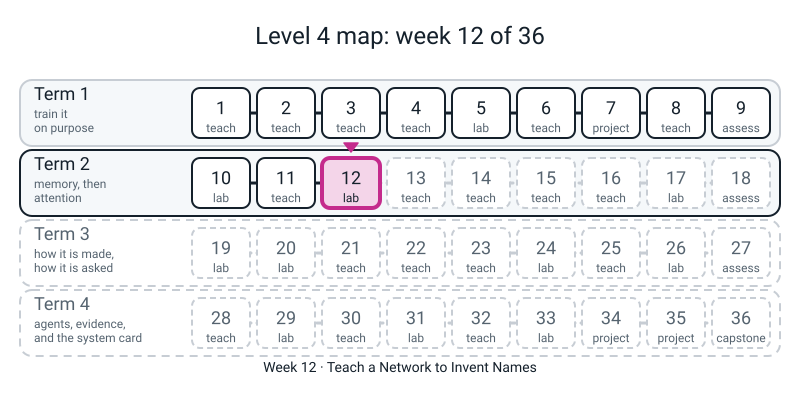
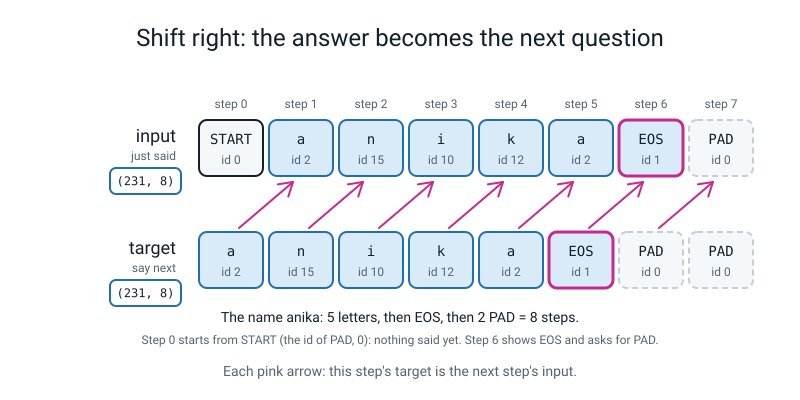
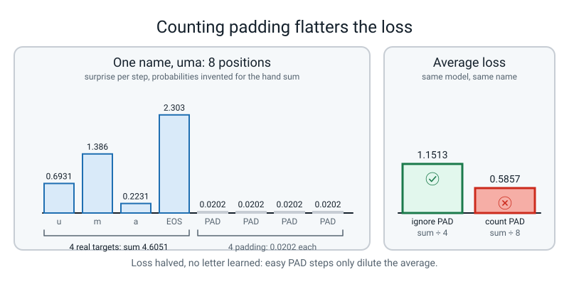
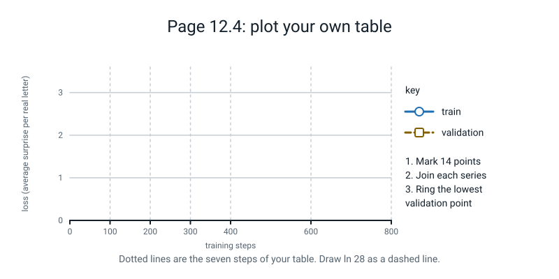

# Workbook — Week 12: Teach a Network to Invent Names

**Name:** ________________________________  **Date:** ______________

[⬅ Week 11](week-11.md) · [📖 Read the chapter first](../student-guide/week-12.md) · [Course Home](../README.md) · [Next ➡](week-13.md)

---

> **Rules for this workbook.** Six pages and a Bug Log. **By hand first** (names as numbers and the shift, how much of a batch is padding, a loss with and without the blanks), **then your own run** (train against validation, the name audit), **then a short report**. Pages 12.1 to 12.3 need only a pen and a calculator with an `ln` key. Pages 12.4 to 12.6 copy numbers that **your own `week12.py` printed**.
>
> **Pen first, then run.** Write every prediction before you run anything. Use **one colour of pen for predictions and another for measurements** on pages 12.4 and 12.5.
>
> **Where the numbers came from.** Every worked example and every answer came from a real CPU run (PyTorch, `torch.manual_seed(0)` for training unless a page says another seed; generator seeds are stated). By-hand numbers are plain arithmetic and match exactly. On another computer or PyTorch build the **last digit** of a loss and a **count of names** can move by a little; the shape of every table will not.
>
> **Copy every digit.** `0.906` is not `0.9`, and `3.417` is not `3.4`.
>
> **There is no stand-in in this workbook.** The model is a real small LSTM, trained for real on the CPU. The 231 names were typed by the course author. Nothing is downloaded and nothing needs the internet.
>
> **Nothing new to install.** Run any check file from the folder that contains `l4lib/`. Carry **four decimals** in every calculation. Delete any file you create for a check.

---


*Figure W12.0 — Week 12 trains a gated loop on real names, the first sequence model that writes.*

## ✅ Warm-Up (5 min, before anything else)

**W1.** Last week an LSTM cell kept a pair of things. Name them: ____________ and ____________ .

**W2.** The loss is the average of `-ln p`, where `p` is the probability the model gave to the **true** answer. If `p = 1` the surprise is ____________ . If `p` is small the surprise is **small / large** (circle one).

**W3.** Week 5: one of the two losses tells the truth about names the model has not seen. Which: **train / validation** (circle one). Dropout is **on / off** (circle one) when you measure it.

**W4.** A model that knows nothing about names gives each of 28 ids the same chance. Its loss is `ln 28 =` ____________ (three decimals; you may use a calculator).

---

## 🔢 Page 12.1 — Names as Numbers, and the Shift (block 1 · 15 min)

Every id you need is in this table (`0` is PAD, `1` is EOS, letters start at `2`). You can check any of them with `STOI` from block 1.

| a | b | c | d | e | f | g | h | i | j | k | l | m |
|:-:|:-:|:-:|:-:|:-:|:-:|:-:|:-:|:-:|:-:|:-:|:-:|:-:|
| 2 | 3 | 4 | 5 | 6 | 7 | 8 | 9 | 10 | 11 | 12 | 13 | 14 |

| n | o | p | q | r | s | t | u | v | w | x | y | z |
|:-:|:-:|:-:|:-:|:-:|:-:|:-:|:-:|:-:|:-:|:-:|:-:|:-:|
| 15 | 16 | 17 | 18 | 19 | 20 | 21 | 22 | 23 | 24 | 25 | 26 | 27 |

Every name becomes **8** numbers: its letters, then one EOS (`1`), then PAD (`0`) up to 8. The **inputs** row is the targets row moved one place to the right, with a START (`0`) in front; the last column is dropped.

**Worked example (done for you).** `iris` is `i, r, i, s`.

| | step 0 | 1 | 2 | 3 | 4 | 5 | 6 | 7 |
|---|:-:|:-:|:-:|:-:|:-:|:-:|:-:|:-:|
| targets | 10 | 19 | 10 | 20 | 1 | 0 | 0 | 0 |
| inputs | 0 | 10 | 19 | 10 | 20 | 1 | 0 | 0 |

Read down any column from step 1: the input is the **previous** column's target. At step 4 the target is `1` (EOS: the name ends) and the input is `20` (`s`, the last thing said).

**a. Fill in the targets and the inputs for three names.** Do all three before you look at anything.

| Name | | step 0 | 1 | 2 | 3 | 4 | 5 | 6 | 7 |
|---|---|:-:|:-:|:-:|:-:|:-:|:-:|:-:|:-:|
| `uma` | targets | | | | | | | | |
| | inputs | | | | | | | | |
| `bex` | targets | | | | | | | | |
| | inputs | | | | | | | | |
| `kaia` | targets | | | | | | | | |
| | inputs | | | | | | | | |

**b. Check your own table.** Tick each one that holds:

- ☐ Every name got an EOS (`1`) right after its last letter.
- ☐ The **first** input of every name is `0`.
- ☐ Every inputs row stops one step before the targets row would (the final target column never appears as an input).

**c. Generating is different.** A trained model is asked to write a name. At step 0 it is given START. Suppose it picks `o`, then `r`, then `a`, then EOS. Fill in **the input the model was given** at each step:

| step | 0 | 1 | 2 | 3 |
|---|:-:|:-:|:-:|:-:|
| input given | | | | |
| what it picked | `o` | `r` | `a` | EOS |

**d. Could you have written row (c) before the model ran?** Could you have written the **inputs** row for `uma` in part (a) before any model ran? ____________ Could you have written the input at step 2 of part (c) before the model had picked `r`? ____________ In one sentence, what is the difference, and which of the two has every input known before the model runs? ___________________________________________

**e. Which word is which?** Match with a line: *the true previous letter goes in* · *the model's own last pick goes in* .   ◯ **training** ◯ **generating**

**Check file** (run it only after the tables are written):

```python
# check121.py - Week 12 workbook page 12.1: check the encoded names and the shifted inputs.
from l4lib.names import PAD, EOS, STOI, encode

for name in ["uma", "bex", "kaia"]:
    ids = encode(name)                    # letters, then EOS (1), then PAD (0) up to 8 steps
    shifted = [PAD] + ids[:-1]            # START (0) in front, last column dropped
    print(f"{name:5s} targets {ids}  inputs {shifted}")

print("ids of o, r, a:", STOI["o"], STOI["r"], STOI["a"])
picks = [STOI["o"], STOI["r"], STOI["a"], EOS]
print("picks", picks, "| inputs while generating", [PAD] + picks[:-1])
```

Printed by a real run:

```text
uma   targets [22, 14, 2, 1, 0, 0, 0, 0]  inputs [0, 22, 14, 2, 1, 0, 0, 0]
bex   targets [3, 6, 25, 1, 0, 0, 0, 0]  inputs [0, 3, 6, 25, 1, 0, 0, 0]
kaia  targets [12, 2, 10, 2, 1, 0, 0, 0]  inputs [0, 12, 2, 10, 2, 1, 0, 0]
ids of o, r, a: 16 19 2
picks [16, 19, 2, 1] | inputs while generating [0, 16, 19, 2]
```

Marks: ______ / 7 (each name 2: targets right, inputs right; part c, 1).

---


*Figure W12.1 — Shift right: every step is asked for the letter that comes next, and each answer becomes the following question.*

## 🧱 Page 12.2 — How Much of a Batch Is Padding? (block 3 · 10 min)

A name with `n` letters has `n + 1` **real** targets (the letters and the EOS). Everything else out of 8 is padding.

**Worked example (done for you).** Three names: `iris`, `noor`, `zuri`. Real targets: `4 + 1`, `4 + 1`, `4 + 1` `= 15`. Grid: `3 x 8 = 24`. Padding: `24 - 15 =` **`9`**. Share of padding: `9 / 24 =` **`37.5%`**.

**a. Your turn.** Four names: `uma`, `bex`, `wren`, `kajsa`.

| Name | letters | real targets (letters + 1) |
|---|:-:|:-:|
| `uma` | | |
| `bex` | | |
| `wren` | | |
| `kajsa` | | |

Total real: ____________ . Grid (`4 x 8`): ____________ . Padding: ____________ . Share: ____________ %

**b. The real data.** Copy from block 3's printout: positions ____________ , real ____________ , padding ____________ . The share of padding is `padding / positions =` ____________ %. Mean letters per name (`real` is letters plus one EOS per name, so letters are `real - 231`, divided by 231): ____________

**c. A trap.** A classmate says the four real targets of `uma` are `u, m, a` and so the total is 3. What did they leave out, and what happens to the answer in (a) if you do the same? ___________________________________________

**d. Why it matters.** About a quarter of the grid is padding. In one sentence, why would a loss that **included** that quarter look better than it should? ___________________________________________

**Check file:**

```python
# check122.py - Week 12 workbook page 12.2: how much of a batch is padding.
from l4lib.names import NAMES, MAXLEN

four = ["uma", "bex", "wren", "kajsa"]
real = sum(len(n) + 1 for n in four)      # letters plus one EOS each
total = len(four) * MAXLEN
print("four names: real", real, "| total", total, "| padding", total - real, f"| share {(total - real) / total:.1%}")

real_all = sum(len(n) + 1 for n in NAMES)
total_all = len(NAMES) * MAXLEN
print("all names : real", real_all, "| total", total_all, "| padding", total_all - real_all, f"| share {(total_all - real_all) / total_all:.1%}")
```

```text
four names: real 19 | total 32 | padding 13 | share 40.6%
all names : real 1404 | total 1848 | padding 444 | share 24.0%
```

Marks: ______ / 5.

---

## ➗ Page 12.3 — A Loss by Hand, With and Without the Blanks (block 2 · 15 min)

Four real steps of one name. The model gave the **true** next letter these probabilities. The loss is the average of `-ln p` over the steps that count.

**Worked example (done for you).** `p = 0.2, 0.6, 0.5, 0.8`.

| Step | `p` on the true letter | surprise `-ln p` |
|:--:|:--:|:--:|
| 1 | 0.2 | 1.6094 |
| 2 | 0.6 | 0.5108 |
| 3 | 0.5 | 0.6931 |
| 4 | 0.8 | 0.2231 |

Sum `= 3.0364`, average over 4 `=` **`0.7591`**. Now add four **blank** steps that the model is 97% sure of. One blank costs `-ln 0.97 =` `0.0305`. Four of them `= 0.1218`. New average over 8: `(3.0364 + 0.1218) / 8 =` **`0.3948`**. The model learned **nothing** more about names, and the number fell from `0.7591` to `0.3948`.

**a. Your turn.** `p = 0.4, 0.5, 0.25, 0.9`.

| Step | `p` on the true letter | surprise `-ln p` (4 decimals) |
|:--:|:--:|:--:|
| 1 | 0.4 | |
| 2 | 0.5 | |
| 3 | 0.25 | |
| 4 | 0.9 | |

Sum: ____________ . **Average over the 4 real steps:** ____________

**b. Now count the blanks.** Add four blank steps the model is **99%** sure of. One blank costs `-ln 0.99 =` ____________ . Four blanks: ____________ . New average over **8**: `(sum + four blanks) / 8 =` ____________

**c. Compare.** The number in (b) is about ____________ **of** the number in (a) (circle: *a quarter / a half / three quarters*). Did the model get better at names between (a) and (b)? ____________ What did change? ___________________________________________

**d. What `ignore_index=` does.** In your own words, using the words *top* and *bottom* of the average: ___________________________________________

**e. Which average?** Two students print a loss. One used `ignore_index`, one did not. Their numbers are `0.78` and `0.39`. Can you tell who is the better student from these two numbers alone? ____________ What must you check first? ___________________________________________

**Check file:**

```python
# check123.py - Week 12 workbook page 12.3: a loss by hand, with and without the blanks.
import math

p = [0.4, 0.5, 0.25, 0.9]
each = [-math.log(x) for x in p]
print("surprise per step:", [round(s, 4) for s in each], "| average:", round(sum(each) / 4, 4))
blank = -math.log(0.99)
print("one blank step costs:", round(blank, 4))
print("blanks counted (4 real + 4 blank):", round((sum(each) + 4 * blank) / 8, 4))
```

```text
surprise per step: [0.9163, 0.6931, 1.3863, 0.1054] | average: 0.7753
one blank step costs: 0.0101
blanks counted (4 real + 4 blank): 0.3927
```

Accept hand answers within `0.001`. Marks: ______ / 5 (four surprises 2, average 1, blanks-counted 1, sentence 1).

---


*Figure W12.2 — Counting the padding halves the loss without the model learning anything; ignore it.*

## 📉 Page 12.4 — Train Against Validation (block 4 · 20 min)

### Step 1 — three predictions, in pen, **before** you run block 4

1. After 800 steps the validation loss will be **bigger / smaller** than the train loss (circle one).
2. From step 100 to step 800 the validation loss will go: **up / down / down and then up** (circle one).
3. The Hook's number. A program reads 200 names and writes 200 of its own. How many of its 200 are names it was given? ____________ (0 to 200)

Do not change them afterwards.

**Worked example (done for you).** A classmate trained the same block 4 recipe with **training seed 1** (the only change was `seed=1` in `train(...)`). Their table:

| step | train | validation |
|:--:|:--:|:--:|
| 0 | 3.332 | 3.330 |
| 100 | 1.919 | 2.331 |
| 200 | 1.379 | 2.595 |
| 400 | 0.977 | 3.218 |
| 800 | 0.906 | 3.668 |

Their sentence: *"Train fell from 3.332 to 0.906; validation fell to 2.331 at step 100 and then rose to 3.668, above the 3.332 of a model that knows nothing."* Notice: **same shape as yours will be, different last digits**. Their train loss at 800 is the same to three places; their validation moved by about a quarter.

### Step 2 — run block 4 (seed 0) and copy **every digit** (second colour of pen)

| step | train | validation |
|:--:|:--:|:--:|
| 0 | | |
| 100 | | |
| 200 | | |
| 300 | | |
| 400 | | |
| 600 | | |
| 800 | | |

Last line of the printout, `last training step (dropout on)`: ____________ . Why is it **different** from the train loss in the table? ___________________________________________

**Plot your table on the axes below: mark both series, join the points, and ring the lowest validation point.**


*Figure W12.6 — Axes for your own table: 7 points for train, 7 for validation.*

### Step 3 — read it

**a.** `ln 28 =` ____________ . At step 800, is your validation loss above or below it? ____________ What does that say about how the model does on names it has not seen? ___________________________________________

**b.** Was prediction 1 right? ____________ Prediction 2? ____________ **What surprised you**, even if you were right? ___________________________________________

**c. The gap.** Train minus validation at step 800: ____________ . In one sentence with **two numbers from your table**: ___________________________________________

**d. Where would you stop?** Pick a step **from your own table** and give a reason: step ____________ because ___________________________________________

**e.** Two of your rows show that the validation loss is already climbing while train still falls. Which two steps? ____________ and ____________

Marks: ______ / 7 (table 5, sentence with two numbers 1, stopping point with a reason 1). **The predictions are not scored.** A wrong prediction, kept and explained, is worth more than a right one you rewrote.

---

## 🔎 Page 12.5 — The Name Audit (blocks 5 and 6 · 25 min)

### Step 1 — read before you count (block 5)

Block 5 printed twenty names. Copy them below. For each, mark **Y** if it *could be a name* to you and **N** if it could not. Then, in the last column, guess **L** if you think it is in the training list, **–** if not. Do this **before** you run the counting line.

| # | name | could be a name? (Y/N) | my guess (L / –) |
|:-:|---|:-:|:-:|
| 1 | | | |
| 2 | | | |
| 3 | | | |
| 4 | | | |
| 5 | | | |
| 6 | | | |
| 7 | | | |
| 8 | | | |
| 9 | | | |
| 10 | | | |
| 11 | | | |
| 12 | | | |
| 13 | | | |
| 14 | | | |
| 15 | | | |
| 16 | | | |
| 17 | | | |
| 18 | | | |
| 19 | | | |
| 20 | | | |

Now run `print(sum(n in train_names for n in twenty))` and write it: ____________ of 20 are in the training list. My guesses said: ____________ . Two names appear **twice** in the twenty: ____________ and ____________ .

### Step 2 — worked example (done for you)

The same 800-step model, but with **generator seed 5** instead of seed 1 (`rng = np.random.default_rng(5)`), 200 names:

| 200 generated names | stopped at 800 |
|---|:--:|
| in the training list | 148 (74.0%) |
| in the held-back list | 0 |
| in neither | 52 |
| distinct strings | 161 |

Different generator seed, different count (your seed-1 count will differ), **same story**: about three quarters or more are names the model was shown.

### Step 3 — run block 6 (generator seed 1) and fill the table

| 200 generated names | stopped at step 800 | stopped at step 100 |
|---|:--:|:--:|
| in the training list | | |
| in the held-back list | | |
| in neither | | |
| distinct strings | | |

Check: the first three rows of each column add to ____________ . If one does not, find the slip.

**Read the eight "in neither" examples that block 6 printed for each column.** For the step-800 column: ____________ For the step-100 column: ____________ How many of the eight in each column could be a name, by your eye? Step 800: ______ / 8 . Step 100: ______ / 8 . (Your judgement; there is no key.)

### Step 4 — say it

**a.** The Hook's question was: *out of 200, how many were names it was given?* My guess was ______ . The real number at step 800 is ______ .

**b.** The 800-step model has **0** in the held-back list. Does that prove it cannot make good names? ____________ (One sentence why or why not: ___________________________________________ )

**c.** Someone says "the 100-step model is better because it is more novel". Complete two sentences. *It is more novel in the sense that ___________________________________ .* *But my reading of its names says ___________________________________ .*

**d. One sentence** on what the count shows and what it does not: ___________________________________________

Marks: ______ / 7 (table 4, eye-marks done 1, sentence 2). **The twenty-name judgement is not keyed.**

---

## 📝 Page 12.6 — The Report (20 min)

Write **five sentences**, in your own words, to someone who has not done this week.

**Rules.** Every number must have been printed by **your own run in the last 24 hours**; copy it **with every digit**; state the **seed** (training seed 0, generator seed 1 if you followed the chapter).

1. One loss from page 12.4, train and validation, at step 800, with the seed: ___________________________________________
2. **Why** the two are so far apart, in one sentence: ___________________________________________
3. One count from page 12.5, at step 800 and at step 100: ___________________________________________
4. What that count **shows**, and what it does **not**: ___________________________________________
5. One **limit** of today (one list, one size, one recipe, 31 held-back names, one seed): ___________________________________________

**Self-marking** (tick what your report has):

- ☐ Two numbers **with every digit**, from my own run, seed stated: one loss and one count (2 marks)
- ☐ The cause of the gap in one sentence: it memorised the 200 names (1 mark)
- ☐ What the count shows **and** what it does not: *not in the list* is not *good* (2 marks)
- ☐ One limit (1 mark)

**Marks: ______ / 6.** A report that says "the model invents names" loses the last three marks, whatever else it says.

---

## 📓 Page 12.6 (continued) — The Bug Log

This page records what went wrong this week and how you found it. The Bug Log is the most useful page of the course. Copy only the **last line** of a traceback, not all of it.

**Copy this sentence in your own handwriting:**

> **"Training hands the model the true previous letter; generating hands it its own last guess; and when I count, most of what it 'invents' is a name it was trained on."**

___________________________________________________________________________

**Entry 1: Break It On Purpose, mistake 1 (`torch.full(len(NAMES), PAD)`).** I predicted it would: ____________ . Actually it: ____________ . The last line of the error: ___________________________________________ . What `torch.full` wanted in position 1, and what it got: ___________________________________________ . The fix: ___________________________________________

**Entry 2: Break It On Purpose, mistake 2 (the shift forgot to drop a column).** The error gave two numbers. Copy them: ____________ and ____________ . Divide each by 231: ____________ and ____________ . What does that tell you about the shape of the inputs? ___________________________________________

**Entry 3: the silent kind.** A loss can look **healthier** without the model being any better (page 12.3, part b). In your words, what is the one thing to check before you compare two loss numbers? ___________________________________________

**Entry 4: the prediction I got most wrong** this week was on page ______ . I predicted ____________ , the number was ____________ . The reason I was wrong: ___________________________________________

| Date | Where it happened | The symptom | What I thought it was | What it really was | The check that proved it |
|---|---|---|---|---|---|
| | | | | | |
| | | | | | |

---

## 🧠 Self-Check (do this last, from memory)

- ☐ Say what goes into the model at each step **during training** and **during generating**.
- ☐ Build the shifted input for a name on paper, with the START token and the EOS.
- ☐ Say what `ignore_index=` does, using the words *top* and *bottom* of the average.
- ☐ Say why the toy loss fell from `1.1513` to `0.5857` without the model learning anything (page 12.3 shows the same effect with your own numbers).
- ☐ Say what the gap between train and validation at step 800 means, with two numbers from your own table.
- ☐ Say what "159 of 200 in the list" (or your own count) shows, and what it does not.

**Ticks:** ______ / 6 . **The one I could not tick, and when I will redo it:** ___________________________________________

**Next week.** Week 13 keeps your model and changes only **how the next letter is chosen**: the dice-roll `draw` gets opened. You will be asked to predict, before each run, how many names are new and how many are nonsense. It needs **your table from page 12.5** and a `week12.py` whose block 7 prints `1.026`. **If page 12.4 or 12.5 is blank, do it before Week 13.**

---

## ✂️ ANSWERS - keep this page folded until you have finished

> Real printed outputs below. By-hand numbers are exact. Loss tables and counts may differ in the last digit, or by a name or two, on another CPU or PyTorch build. These answers are for the pages in **this workbook**.

### Warm-Up

**W1.** The note `h` and the memory `c` (the pair `(h, c)`). **W2.** `-ln 1 =` **0**; a small `p` gives a **large** surprise. **W3.** **Validation**; dropout is **off** (`model.eval()`). **W4.** `ln 28 =` **3.332** (`3.3322`).

### Page 12.1

| Name | | 0 | 1 | 2 | 3 | 4 | 5 | 6 | 7 |
|---|---|:-:|:-:|:-:|:-:|:-:|:-:|:-:|:-:|
| `uma` | targets | 22 | 14 | 2 | 1 | 0 | 0 | 0 | 0 |
| | inputs | 0 | 22 | 14 | 2 | 1 | 0 | 0 | 0 |
| `bex` | targets | 3 | 6 | 25 | 1 | 0 | 0 | 0 | 0 |
| | inputs | 0 | 3 | 6 | 25 | 1 | 0 | 0 | 0 |
| `kaia` | targets | 12 | 2 | 10 | 2 | 1 | 0 | 0 | 0 |
| | inputs | 0 | 12 | 2 | 10 | 2 | 1 | 0 | 0 |

*Common slips:* forgetting the EOS; putting the START token in the targets; copying the targets as the inputs (no shift).

**c.** Inputs given: **0, 16, 19, 2** (START, then `o`, `r`, `a`: each is the model's own previous pick). **d.** Yes, the `uma` inputs were known before any model ran. No, the input at step 2 was the pick `r`, which did not exist until the model had run step 1. That is the difference: training inputs are all known, so **training** has every input up front; generating does not (its next input is the last answer). **e.** True previous letter: **training**. The model's own last pick: **generating**.

### Page 12.2

**a.** `uma` 4, `bex` 4, `wren` 5, `kajsa` 6. Total real **19**. Grid `4 x 8 = 32`. Padding **13**. Share `13 / 32 =` **40.6%**.

**b.** Positions **1848**, real **1404**, padding **444**; share `444 / 1848 =` **24.0%**. Letters per name: `(1404 - 231) / 231 =` **5.08**.

**c.** They left out the **EOS** (a real target). The four names would give `3 + 3 + 4 + 5 = 15` real instead of 19, and the padding share would come out wrong. **d.** The model gets an easy, nearly free "correct" answer on every blank, so averaging them in pulls the loss down without any better guess at a real letter.

### Page 12.3

**a.**

| Step | `p` | surprise |
|:--:|:--:|:--:|
| 1 | 0.4 | 0.9163 |
| 2 | 0.5 | 0.6931 |
| 3 | 0.25 | 1.3863 |
| 4 | 0.9 | 0.1054 |

Sum `3.1011`; average over 4 **0.7753**.

**b.** One blank costs `-ln 0.99 =` **0.0101**; four blanks **0.0402**; new average `(3.1011 + 0.0402) / 8 =` **0.3927**.

**c.** About **a half** of (a). No, the model did not get better at names. What changed is **which positions were averaged**: four easy blanks were added. **d.** `ignore_index` takes the blank rows out of the **top** of the average (the sum) and out of the **bottom** (the count), so the average is over real steps only. **e.** No. First check that **both averaged the same positions** (whether the padding was ignored). Here `0.39` is probably the flattered number, not the better model.

### Page 12.4

Seed 0 table:

| step | train | validation |
|:--:|:--:|:--:|
| 0 | 3.346 | 3.349 |
| 100 | 1.960 | 2.308 |
| 200 | 1.431 | 2.544 |
| 300 | 1.103 | 2.880 |
| 400 | 0.984 | 3.077 |
| 600 | 0.921 | 3.314 |
| 800 | 0.906 | 3.417 |

`last training step (dropout on)` is **1.001**: it is the number the training loop computed with dropout **on**, while the table is measured with dropout **off** (`model.eval()`).

*Figure W12.6:* train points `(0, 3.346) (100, 1.960) (200, 1.431) (300, 1.103) (400, 0.984) (600, 0.921) (800, 0.906)`; validation points `(0, 3.349) (100, 2.308) (200, 2.544) (300, 2.880) (400, 3.077) (600, 3.314) (800, 3.417)`; ring the validation point at step 100 (`2.308`); a dashed line at `3.332` (`ln 28`) passes just above the step-600 point (`3.314`) and below the step-800 point (`3.417`).

**a.** `ln 28 = 3.332`. The step-800 validation loss `3.417` is **above** it, so on names it has not seen the model does worse than a model that knows nothing: it is confident and wrong. **b.** Prediction 1: validation is bigger. Prediction 2: **down and then up** (lowest among the rows at step 100). The "what surprised you" line is yours; a student who predicted "keeps falling" and says so is doing it right. **c.** `3.417 - 0.906 = ` **2.511**. Model sentence: *"Train fell from 3.346 to 0.906 while validation fell to 2.308 at step 100 and then rose to 3.417, above the 3.332 of a model that knows nothing. The program has memorised the 200 names."* **d.** "Around step 100" is the answer the table supports (the lowest validation among the printed rows, `2.308`). Any step with a reason from the table is fine; the recipe keeps 800 because next week's model needs it, and that is **not** the best stopping point. **e.** Any two of steps 200, 300, 400, 600, 800 (validation at 200 is already above step 100's `2.308`).

### Page 12.5

**Step 1.** The twenty (block 5, generator seed 0) are: `olen, vito, tatiana, felix, naya, oona, leena, maren, deepak, alina, alina, pavel, willem, yash, serge, rusha, yash, katya, juno, argek`. **17 of 20** are in the training list. `alina` and `yash` appear twice. Not in the list: `naya`, `rusha`, `argek`. Y/N marks are your judgement.

**Step 3.** Seed 0 training, generator seed 1:

| 200 generated names | stopped at 800 | stopped at 100 |
|---|:--:|:--:|
| in the training list | 159 (79.5%) | 1 (0.5%) |
| in the held-back list | 0 | 0 |
| in neither | 41 | 199 |
| distinct strings | 147 | 199 |

Rows add: `159 + 0 + 41 = 200`, `1 + 0 + 199 = 200`. The "in neither" examples printed were: step 800 `gmeo, koori, nunia, jekori, gemra, ferix, domitana, sagna`; step 100 `luesa, taran, gmana, dareltl, lagun, nios, leanpa, teno`. Look for a student who says the step-800 "new" names look like near-copies of names in the list and the step-100 names are mostly **not names**.

**Step 4.** **a.** The real number at step 800: **159**. **b.** No. 200 draws from a model that is copying its *training* list will hardly ever land on a held-back name, and 31 names are too few to test by matching. **c.** *More novel in the sense that only 1 of 200 is in the training list (199 distinct). But my reading says most are not names* (`gmana`, `dareltl`). **d.** Model: *"159 of 200 (79.5%) are in the training list and only 147 are different, so most of the output is remembered. The count does not say the rest are good names, and it is one recipe on 231 names."*

### Page 12.6

A model report: *"With training seed 0, the model trained on 200 names reached a train loss of 0.906 and a validation loss of 3.417 after 800 steps. The validation loss was lowest, 2.308, at step 100 among the steps I printed; the gap is Week 5's memorising. Of 200 names it generated at 800 steps (generator seed 1), 159 (79.5%) were already in the training list; at step 100, 1 was. 'Not in the list' does not mean 'a good name': the names at step 100 were mostly not names. This is one recipe on 231 typed names with 31 held back."* Full marks need two numbers with every digit, the cause, show and not-show, and one limit.

### The Bug Log and Self-Check

**Entry 1:** `TypeError: full(): argument 'size' (position 1) must be tuple of ints, not int`; `torch.full` wanted the **shape as a tuple**, `(231, 1)`, and got the number 231. Fix: `torch.full((len(NAMES), 1), PAD)`. **Entry 2:** `ValueError: Expected input batch_size (2079) to match target batch_size (1848).` `2079 / 231 = 9` and `1848 / 231 = 8`: the inputs have **9** steps per name and the targets have **8**. The glue kept all 8 columns of `data` plus the START column; drop the last column with `data[:, :-1]`. **Entry 3:** check that both losses **average the same positions** (both ignore padding, or both do not). **Entry 4:** your own.

**Self-Check:** fewer than four ticks means redo pages 12.1 and 12.3; they are the two the rest of the week stands on.
