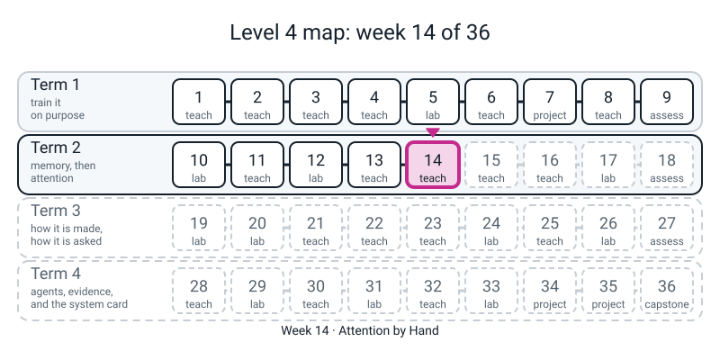
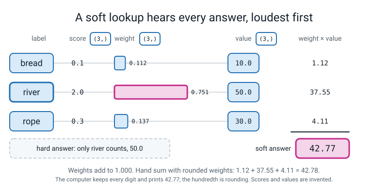
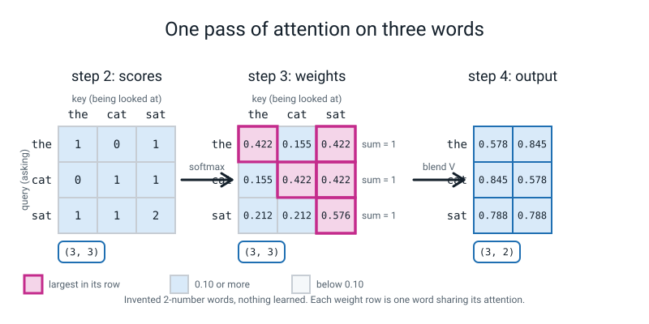

# Workbook — Week 14: Attention by Hand

**Name:** ________________________________  **Date:** ______________

[⬅ Week 13](week-13.md) · [📖 Read the chapter first](../student-guide/week-14.md) · [Course Home](../README.md) · [Next ➡](week-15.md)

---

> **Rules for this workbook.** Pages 14.1 to 14.5 are the week's homework (about 60 minutes, almost all of it pen and calculator; the computer is used for about 10 minutes of checking). Page 14.6 (break it on purpose) and page 14.7 (the Bug Log) are the extra pages that make the week stick; do them in the same sitting if you can.
>
> **Pen first, then run.** Write your answer **before** you open the check file. The numbers in the worked examples and in the answers came from real CPU runs (numpy, and PyTorch with one thread; the one place anything is random, `torch.manual_seed` is set). By-hand numbers are plain arithmetic and will match. Different CPU or PyTorch build: the **last digit** of a torch number can move, and the tiny gap on page 14.3 (about `4e-08`) can be a different tiny number. Anything below `1e-05` is fine.
>
> **There is no model this week, and no stand-in.** Nothing is trained and nothing is learned. The three word vectors and the tables are **invented by us** to be easy to multiply. The words `the`, `cat`, `sat` are only labels on rows. A weight on these pages says what the arithmetic did, never what a language model pays attention to.
>
> **Nothing new to install, no internet.** Check files `check141.py` to `check144.py` need only numpy (and torch for `check143.py`); page 14.5 is typed at the bottom of your own `attention.py`. Carry **four decimals** in the weights, and round only the answer to **three**. One wrong exponent ruins every number after it, so after every weight row **add the row**.
>
> **Only this week's tools are used:** `k.transpose(-2, -1)`, `nn.Linear(d, d, bias=False)` and `unsqueeze`, plus the softmax and matrix multiply you already have.


*Figure 14.0 — Where this week fits: week 14 of 36, in term 2 (memory, then attention).*

---

## ✅ Warm-Up (5 min, before anything else)

These five questions bring back the words and steps the pages below rely on.

**W1.** A **hard** lookup hears (circle one) **only the best match / every key equally / every key, in proportion**. A **soft** lookup hears (circle one) **only the best match / every key equally / every key, in proportion**.

**W2.** Weights `[0.5, 0.25, 0.25]` on the values `4, 8, 12`. Do the weights add to 1? ____________ The weighted average is ____________ .

**W3.** The softmax you wrote in Week 13 turns **scores** into ____________ that add to ____________ . In attention they are called ____________ .

**W4.** Name the four steps of one attention pass, in order: ____________ , ____________ , ____________ , ____________ .

**W5.** A weighted average of the numbers `10, 50, 30` with non-negative weights that add to 1 can be bigger than 50: **yes / no** (circle one). Why? ___________________________________________

---

## 🎲 Page 14.1 — The Pen Pass, Again (25 min)

This page is for doing one full attention pass by hand on the class sheet (Part A), then again on numbers of your own (Part B).

**Part A. Your class sheet, once more.** Use a fresh copy. Three words, two numbers each: `the = [1, 0]`, `cat = [0, 1]`, `sat = [1, 1]`. The three tables are `Wq = [[1, 0], [0, 1]]`, `Wk = [[1, 0], [0, 1]]` and `Wv = [[0, 1], [1, 0]]`. Use `exp(0) = 1.0000`, `exp(1) = 2.7183`, `exp(2) = 7.3891`.

```text
STEP 1  make.     Q = X times Wq     K = X times Wk     V = X times Wv
        Q = [ __ , __ ]  [ __ , __ ]  [ __ , __ ]        (the, cat, sat)
        K = [ __ , __ ]  [ __ , __ ]  [ __ , __ ]
        V = [ __ , __ ]  [ __ , __ ]  [ __ , __ ]

STEP 2  score.    score(i, j) = (row i of Q) dot (row j of K)
                  key:  the   cat   sat
        question the  [ __    __    __ ]
                 cat  [ __    __    __ ]
                 sat  [ __    __    __ ]

STEP 3  share.    For each ROW: exp of each score, the row total, each exp / total.
        row the:  exps __ __ __   total ______   weights ______ ______ ______   add to ______
        row cat:  exps __ __ __   total ______   weights ______ ______ ______   add to ______
        row sat:  exps __ __ __   total ______   weights ______ ______ ______   add to ______

STEP 4  blend.    output row = (weight 1)(row 1 of V) + (weight 2)(row 2 of V) + (weight 3)(row 3 of V)
        the ->  [ ______ , ______ ]
        cat ->  [ ______ , ______ ]
        sat ->  [ ______ , ______ ]                 (three places)
```

Did every weight row add to 1? ____ Is every output number between 0 and 1? ____ Why must it be? ___________________________________________

Which word pays the **most** attention to itself, and which number says so? ___________________________________________

If you carried only **three** places in the weights, what is the row sum for the first row? ____________ Which output number moves because of it? ____________

**Part B. A two-token pass on numbers that are not from class (10 min).** Two tokens: `a = [1, 0]` and `b = [0, 1]`. The tables: `Wq` and `Wk` are both `[[1, 0], [0, 1]]`, and `Wv = [[2, 0], [0, 4]]` (it doubles the first number and quadruples the second). Use `exp(0) = 1.0000` and `exp(1) = 2.7183`.

| Step | Your working |
|---|---|
| `V` (one row per token) | `a`: [ ____ , ____ ]   `b`: [ ____ , ____ ] |
| Scores (2 rows by 2 columns) | row `a`: [ ____ , ____ ]   row `b`: [ ____ , ____ ] |
| Exps, and the row total | row `a`: ____ , ____ , total ________   row `b`: ____ , ____ , total ________ |
| Weights (four places) | row `a`: ________ , ________   row `b`: ________ , ________ |
| Do both rows add to 1? | ______ |
| Output (three places) | `a`: [ ________ , ________ ]   `b`: [ ________ , ________ ] |

Before you calculate, **predict**: will the output for `a` lean towards `a`'s own value `[2, 0]` or towards `b`'s value `[0, 4]`? ____________ . Why? ___________________________________________

**Run the check:** `check141.py`. It repeats Part B in numpy and prints each step.

```python
# check141.py - Week 14 workbook page 14.1: a two-token pass on PRACTICE numbers. Numpy only.
import numpy as np

X  = np.array([[1.0, 0.0],
               [0.0, 1.0]])               # two tokens, "a" and "b"
Wq = np.array([[1.0, 0.0],
               [0.0, 1.0]])
Wk = np.array([[1.0, 0.0],
               [0.0, 1.0]])
Wv = np.array([[2.0, 0.0],
               [0.0, 4.0]])

Q, K, V = X @ Wq, X @ Wk, X @ Wv
scores = Q @ K.T
e = np.exp(scores)
totals = e.sum(axis=1)
weights = e / totals.reshape(2, 1)
out = weights @ V
print("V =", V.tolist())
print("scores =", scores.tolist())
print("exps =", np.round(e, 4).tolist(), " row totals =", np.round(totals, 4).tolist())
print("weights (4 places) =", np.round(weights, 4).tolist(), " row sums =", weights.sum(axis=1).tolist())
print("output (3 places) =", np.round(out, 3).tolist())
print("same, from weights rounded to 3 places:", np.round(np.round(weights, 3) @ V, 3).tolist())
```

```text
V = [[2.0, 0.0], [0.0, 4.0]]
scores = [[1.0, 0.0], [0.0, 1.0]]
exps = [[2.7183, 1.0], [1.0, 2.7183]]  row totals = [3.7183, 3.7183]
weights (4 places) = [[0.7311, 0.2689], [0.2689, 0.7311]]  row sums = [1.0, 1.0]
output (3 places) = [[1.462, 1.076], [0.538, 2.924]]
same, from weights rounded to 3 places: [[1.462, 1.076], [0.538, 2.924]]
```

Did your pen match? ____ If not, which step did the first wrong number appear in? ____________

---

## ⚖️ Page 14.2 — The Soft Lookup and the Weighted Average (10 min)

This page is for practising the soft lookup as a weighted average, and for checking whether a set of weights qualifies.

**Worked example (from `lookup.py`).** Three answers, with values `10, 50, 30`. Scores `0.1, 2.0, 0.3` gave weights `0.112, 0.751, 0.137`, and the soft lookup `42.77`. The hard lookup gave `50`. By hand, with three-place weights, you get `42.78`; the machine kept every digit. One hundredth of a difference is **rounding**, not a mistake.

**Part A. New scores, same values.** Names: `bread, river, rope`. Values: `10, 50, 30`. Scores: `1.0, 0.0, 2.0`.

1. The hard lookup picks ____________ and returns ____________ .
2. Exps (`exp(1) = 2.7183`, `exp(0) = 1`, `exp(2) = 7.3891`): ____________ , ____________ , ____________ . Total: ____________ .
3. Weights (three places): ____________ , ____________ , ____________ . They add to ____________ .
4. The soft lookup, by hand: ( ______ × 10 ) + ( ______ × 50 ) + ( ______ × 30 ) = ____________ .
5. Is the soft answer bigger or smaller than the hard answer? ____________ Why does it not simply match it? ___________________________________________

**Part B. Weights you choose yourself.** Values `10, 50, 30` again.

| Weights | Add to | Is it a weighted average? | Result |
|---|:--:|:--:|:--:|
| `[0.5, 0.25, 0.25]` | | | |
| `[0, 1, 0]` | | | |
| `[0.7, 0.2, 0.2]` | | | |

One row of the table is **not** a weighted average. Which one, and how do you know without computing the result? ___________________________________________

Fix it by dividing each weight by their total (do the division): fixed weights ____________ , ____________ , ____________ . New result: ____________ .

What does the row `[0, 1, 0]` turn the soft lookup into? ___________________________________________

**Run the check:** `check142.py`.

```python
# check142.py - Week 14 workbook page 14.2: a soft lookup on new scores, and weights that need fixing. Numpy only.
import numpy as np

names  = ["bread", "river", "rope"]
values = np.array([10.0, 50.0, 30.0])
scores = np.array([1.0, 0.0, 2.0])         # practice scores (invented)

print("hard lookup:", names[scores.argmax()], "->", values[scores.argmax()])
e = np.exp(scores)
weights = e / e.sum()
print("exps:", np.round(e, 4), " total:", round(e.sum(), 4))
print("weights:", np.round(weights, 3), " add up to", round(weights.sum(), 3))
print("soft lookup:", round((weights * values).sum(), 2))

for w in ([0.5, 0.25, 0.25], [0.0, 1.0, 0.0], [0.7, 0.2, 0.2]):
    w = np.array(w)
    print(w.tolist(), "adds to", round(w.sum(), 2), "-> result", round((w * values).sum(), 3))
bad = np.array([0.7, 0.2, 0.2])
print("fixed by dividing by the total:", round(((bad / bad.sum()) * values).sum(), 3))
```

```text
hard lookup: rope -> 30.0
exps: [2.7183 1.     7.3891]  total: 11.1073
weights: [0.245 0.09  0.665]  add up to 1.0
soft lookup: 26.91
[0.5, 0.25, 0.25] adds to 1.0 -> result 25.0
[0.0, 1.0, 0.0] adds to 1.0 -> result 50.0
[0.7, 0.2, 0.2] adds to 1.1 -> result 23.0
fixed by dividing by the total: 20.909
```


*Figure 14.1 — A soft lookup is a weighted average: mostly the best match, with a trace of the others.*

---

## 🤝 Page 14.3 — Do the Three Agree? (10 min)

This page is for comparing your pen output with numpy and torch on the same pass.

Copy your **output table** from page 14.1 Part A into the first row (three places). Then run `check143.py` and copy the other two.

| | `the` | `cat` | `sat` |
|---|:--:|:--:|:--:|
| Pen (from page 14.1) | | | |
| numpy | | | |
| torch | | | |

**Type your own pen table** into the `pen = ...` lines of the file below (the numbers shown are the ones a careful pen pass gives; replace them with yours).

```python
# check143.py - Week 14 workbook page 14.3: pen vs numpy vs torch. Type YOUR pen numbers into `pen`.
import numpy as np
import torch
import torch.nn.functional as F

torch.set_num_threads(1)
pen = np.array([[0.578, 0.845],
                [0.845, 0.578],
                [0.788, 0.788]])          # replace with YOUR output table from the sheet

X = np.array([[1.0, 0.0], [0.0, 1.0], [1.0, 1.0]])
Wv = np.array([[0.0, 1.0], [1.0, 0.0]])
e = np.exp(X @ X.T)
w_np = e / e.sum(axis=1).reshape(3, 1)
out_np = w_np @ (X @ Wv)

xt = torch.tensor(X.tolist())
wt = F.softmax(xt @ xt.transpose(-2, -1), dim=-1)
out_t = wt @ (xt @ torch.tensor(Wv.tolist()))
out_t = np.array(out_t.tolist())

print("numpy :", np.round(out_np, 3).tolist())
print("torch :", np.round(out_t, 3).tolist())
print("pen vs numpy, biggest gap:", round(np.abs(pen - out_np).max(), 4))
print("numpy vs torch, biggest gap:", np.abs(out_np - out_t).max())
print("the three agree to 0.002:", bool(np.abs(pen - out_np).max() < 0.002 and np.abs(out_np - out_t).max() < 0.002))
```

```text
numpy : [[0.578, 0.845], [0.845, 0.578], [0.788, 0.788]]
torch : [[0.578, 0.845], [0.845, 0.578], [0.788, 0.788]]
pen vs numpy, biggest gap: 0.0004
numpy vs torch, biggest gap: 4.222880078952329e-08
the three agree to 0.002: True
```

1. My pen vs numpy biggest gap: ____________ . My numpy vs torch biggest gap: ____________ .
2. The pen-vs-numpy gap is **much bigger** than the numpy-vs-torch gap. The reason is ___________________________________________ (hint: how many places did the pen carry?)
3. **If the pen and the computer disagree by about `0.1` or more, which of the two is probably wrong, and what do you do first?** ___________________________________________
4. Write one sentence that says what it means that three different ways give one answer: ___________________________________________


*Figure 14.2 — One pass of attention on three words: scores, then weights that add to 1 in every row, then the blended output.*

---

## 🔀 Page 14.4 — Two Tables, and a Second Pass by Hand (15 min)

This page is for a second pen pass with only the question table changed.

Same `X` (`the = [1, 0]`, `cat = [0, 1]`, `sat = [1, 1]`), same `Wk = [[1, 0], [0, 1]]`, same `Wv = [[0, 1], [1, 0]]`. **Only the question table changes:** `Wq = [[0, 0], [1, 0]]`. (Reading a row times this table: the first number of the result is the token's **second** number; the second number of the result is always 0.)

**Predict first, before any arithmetic.**

1. Which row of weights will be **the same three numbers** (all equal) and why? ___________________________________________
2. With one table for both questions and labels, "`cat` asks about `sat`" always equals "`sat` asks about `cat`". With this new `Wq`, will they still be equal? ____________

**Now calculate.**

| Step | Your working |
|---|---|
| `Q` | `the`: [ ____ , ____ ]  `cat`: [ ____ , ____ ]  `sat`: [ ____ , ____ ] |
| `K`, `V` | the same as page 14.1: `K` = `X`, `V` = `[[0,1],[1,0],[1,1]]` |
| Scores | `the`: [ ____ , ____ , ____ ]  `cat`: [ ____ , ____ , ____ ]  `sat`: [ ____ , ____ , ____ ] |
| Weights (four places) | `the`: ________ ________ ________   `cat`: ________ ________ ________   `sat`: ________ ________ ________ |
| Row sums | ______ , ______ , ______ |
| Output (three places) | `the`: [ ________ , ________ ]  `cat`: [ ________ , ________ ]  `sat`: [ ________ , ________ ] |
| "`cat` asks about `sat`" (row `cat`, column `sat`) | ________ |
| "`sat` asks about `cat`" (row `sat`, column `cat`) | ________ |

3. Was your prediction in 1 right? ____ The output for `the` equals the ordinary mean of the three value rows. Check it: `(0 + 1 + 1) / 3 = ` ______ and `(1 + 0 + 1) / 3 = ` ______ .
4. Why does one word with "no preference" give the plain mean? ___________________________________________
5. Is the score table symmetric now? ____ What does that tell you about why there are **two** tables? ___________________________________________

**Run the check:** `check144.py`.

```python
# check144.py - Week 14 workbook page 14.4: the second pass, question table changed. Numpy only.
import numpy as np

X  = np.array([[1.0, 0.0], [0.0, 1.0], [1.0, 1.0]])
Wq = np.array([[0.0, 0.0], [1.0, 0.0]])
Wk = np.array([[1.0, 0.0], [0.0, 1.0]])
Wv = np.array([[0.0, 1.0], [1.0, 0.0]])

Q = X @ Wq
scores = Q @ (X @ Wk).T
e = np.exp(scores)
weights = e / e.sum(axis=1).reshape(3, 1)
out = weights @ (X @ Wv)
print("Q =", Q.tolist())
print("scores =", scores.tolist())
print("weights (4 places) =", np.round(weights, 4).tolist())
print("output (3 places) =", np.round(out, 3).tolist())
print("cat asks about sat:", scores[1][2], "  sat asks about cat:", scores[2][1])
print("score table symmetric:", bool((scores == scores.T).all()))
```

```text
Q = [[0.0, 0.0], [1.0, 0.0], [1.0, 0.0]]
scores = [[0.0, 0.0, 0.0], [1.0, 0.0, 1.0], [1.0, 0.0, 1.0]]
weights (4 places) = [[0.3333, 0.3333, 0.3333], [0.4223, 0.1554, 0.4223], [0.4223, 0.1554, 0.4223]]
output (3 places) = [[0.667, 0.667], [0.578, 0.845], [0.578, 0.845]]
cat asks about sat: 1.0   sat asks about cat: 0.0
score table symmetric: False
```

---

## 🔥 Page 14.5 — The Same Second Pass in Torch, and an Extension (10 min)

This page is for running the second pass in your own `attention.py`, then testing a change to `Wv`.

Type this at the **bottom of your `attention.py`** (it needs `linear_from`, `weights_of`, `attend`, `show` and `xt` from the file). It re-assigns `lin_q`, so everything that comes after it in the file uses the new table.

```python
# hw.py - Week 14 homework check, at the bottom of attention.py: swap the question table and ask again.
lin_q = linear_from([[0.0, 0.0], [1.0, 0.0]])     # the page 14.4 question table; lin_k and lin_v stay as they were
print("weights =")
show(weights_of(xt))
print("output =")
show(attend(xt))
```

```text
weights =
[[0.333 0.333 0.333]
 [0.422 0.155 0.422]
 [0.422 0.155 0.422]]
output =
[[0.667 0.667]
 [0.578 0.845]
 [0.578 0.845]]
```

1. Biggest gap between my **pen** output from page 14.4 and this one: ____________ . (If it is over `0.002`, find out which of the two is wrong before you go on.)
2. Did the torch weights equal your pen weights to three places? ____

**Extension (for the curious; 5 min).** *Predict first.* If you change **only** `Wv`, which printed numbers change: the weights, the output, or both? ____________ Why? ___________________________________________

Now test it. Put the class question table back and change `Wv` to the identity, then double the swap. Type this below the lines above; it prints the weights once and the output twice.

```python
# ext.py - Week 14 workbook page 14.5: hw.py, then the Wv extension. (Type at the bottom of attention.py.)
lin_q = linear_from(Wq.tolist())                     # put the class question table back
lin_v = linear_from([[1.0, 0.0], [0.0, 1.0]])        # Wv = identity
print("Wv = identity, weights =")
show(weights_of(xt))
print("Wv = identity, output =")
show(attend(xt))
lin_v = linear_from([[0.0, 2.0], [2.0, 0.0]])        # Wv = the swap, doubled
print("Wv doubled, output =")
show(attend(xt))
```

```text
Wv = identity, weights =
[[0.422 0.155 0.422]
 [0.155 0.422 0.422]
 [0.212 0.212 0.576]]
Wv = identity, output =
[[0.845 0.578]
 [0.578 0.845]
 [0.788 0.788]]
Wv doubled, output =
[[1.155 1.689]
 [1.689 1.155]
 [1.576 1.576]]
```

3. The weights are the same as the class example's: ____ . The output rows are the class example's with the two numbers ______ . Doubling `Wv` ______ the output and leaves the weights alone.
4. In one sentence: why can `Wv` never change the weights? (Look at the four steps: where does `V` first appear?) ___________________________________________

---

## 🐞 Page 14.6 — Break It on Purpose (25 min)

This page is for practising how to find bugs, including ones that print numbers without any error.

**Each program below is deliberately broken.** Do **not** run it first. For each: write **(i)** what the bug is, **(ii)** what you think happens when it runs (an error, or quietly wrong numbers), **(iii)** the fixed line, and **(iv)** a *check* that would have caught it. *Then* run it.

**The reading method:** read the **last line** of the error; find **your own file's** line just above it; ask what you expected that line to do. For a bug that prints numbers without complaint, ask: *what must be true of these numbers?*

**Bug 14.6-A. (SILENT)** Each row of scores is one word's. Two words.

```python
# DELIBERATE BUG 14.6-A (SILENT): one total for the whole table.
import numpy as np

scores = np.array([[2.0, 0.0],
                   [0.0, 2.0]])
e = np.exp(scores)
weights = e / e.sum()
print(np.round(weights, 3))
print("row sums:", np.round(weights.sum(axis=1), 3))
```

(i) ___________________ (ii) ___________________ (iii) ___________________ (iv) ___________________

**Bug 14.6-B. (SILENT)** The programmer wants the blend of two value rows for two words. Two words, two numbers each, so the shapes **fit**. The file prints the right way first, then the way that was typed by mistake.

```python
# DELIBERATE BUG 14.6-B (SILENT): the blend written values-first. Two tokens, two numbers each.
import torch

weights = torch.tensor([[0.9, 0.1],
                        [0.2, 0.8]])
v = torch.tensor([[10.0, 0.0],
                  [0.0, 20.0]])
print(weights @ v)
print(v @ weights)
```

(i) ___________________ (ii) The two tables will be (circle) **equal / different** ___________________ (iii) ___________________ (iv) What the weighted average of the **second** column `0, 20` with weights `[0.9, 0.1]` must give: ________ . Which of the two printed tables has it in the top-right corner? ________

**Bug 14.6-C. (loud)** The programmer wants the blend of three value rows using three weights, by `unsqueeze` and a sum.

```python
# DELIBERATE BUG 14.6-C (loud): unsqueeze on the wrong end. Three tokens, two numbers each.
import torch

v = torch.tensor([[10.0, 0.0], [0.0, 20.0], [5.0, 5.0]])
w = torch.tensor([0.6, 0.3, 0.1])
blend = (w.unsqueeze(0) * v).sum(dim=0)
print(blend)
```

(i) ___________________ (ii) The shape of `w.unsqueeze(0)` is ________ and the shape of `v` is ________ . (iii) ___________________ (iv) ___________________

**Bug 14.6-D. (SILENT)** A layer meant to be a pure table (the identity), applied to `[3, 4]`.

```python
# DELIBERATE BUG 14.6-D (SILENT): nn.Linear meant to be a pure table, left with its default bias.
import torch
import torch.nn as nn

torch.manual_seed(1)
lin = nn.Linear(2, 2)
lin.weight.data = torch.tensor([[1.0, 0.0], [0.0, 1.0]])
x = torch.tensor([[3.0, 4.0]])
print(lin(x).tolist())
print("x times the identity table should be:", x.tolist())
```

(i) ___________________ (ii) ___________________ (iii) ___________________ (iv) ___________________

**Bug 14.6-E. (SILENT)** The table is **not** its own transpose this time. The pen answer for the row `[0, 1]` times `[[1, 2], [0, 1]]` is the second row of the table, written in full: ________ .

```python
# DELIBERATE BUG 14.6-E (SILENT): a table given to nn.Linear without turning it over.
import torch
import torch.nn as nn

table = [[1.0, 2.0],
         [0.0, 1.0]]
x = torch.tensor([[0.0, 1.0]])
lin = nn.Linear(2, 2, bias=False)
lin.weight.data = torch.tensor(table)
print("nn.Linear says:", lin(x).tolist())
print("pen says (row times table):", (x @ torch.tensor(table)).tolist())
```

(i) ___________________ (ii) ___________________ (iii) ___________________ (iv) ___________________ Why did the class example (identity and swap) never show this bug? ___________________

**After you have written all five predictions, run them.** Save each as its own file (`bad_a.py` ... `bad_e.py`), run it, and copy the **last line** (for B, D and E copy every line that prints numbers).

| Bug | Real output (last line, or the lines asked for) | Did my prediction match? |
|:--:|---|:--:|
| A | | |
| B | | |
| C | | |
| D | | |
| E | | |

---

## 📓 Page 14.7 — The Bug Log

This page is for recording what went wrong this week and the habit you will take forward.

**Entry 1: the one row that would not add to 1.** Which row, which page, and what was wrong with it? (If none this week, write the first number that was wrong on any page, and how you found it.) ___________________________________________

**Entry 2: the rounding trap.** Write in your own words why a hand pass that carries three places in the weights gives `0.577` where the machine gives `0.578`, and why that is **not** a mistake: ___________________________________________

**Entry 3: the silent ones.** Bugs A, B, D and E ran **without an error**. For each, write the property that must be true and which the bug broke.

| Bug | The property that must be true | What the output showed instead |
|:--:|---|---|
| A | | |
| B | | |
| D | | |
| E | | |

**Entry 4: a bug I mispredicted** (skip if you got all five).

| What I predicted | What actually happened | The sentence that would have told me |
|---|---|---|
| | | |

**Entry 5: the rule I will follow next week.** One sentence (a habit, not a fact): ___________________________________________

| Date | Where it happened | The symptom | What I thought it was | What it really was | The check that proved it |
|---|---|---|---|---|---|
| | | | | | |
| | | | | | |

---

## 🧠 Self-Check (do this last, from memory)

This check is for finding out what you can do without the page in front of you.

Seven things, no scrolling up. Tick only if you could do it **now**.

- ☐ Say what a hard lookup hears and what a soft lookup hears.
- ☐ Compute a weighted average by hand, and say why weights that add to 1.1 do not give one.
- ☐ Name the four steps of one attention pass, and say which table each of Q, K and V comes from.
- ☐ Say why the softmax is applied to each **row**, and write the line that does it.
- ☐ Say what `k.transpose(-2, -1)` does and what `unsqueeze` does, each with a shape.
- ☐ Say why a token gets a question **and** a label, using the words "symmetric" and "two tables".
- ☐ Say what today's weights do **not** tell you about a trained model.

**Ticks:** ______ / 7 . **The one I could not tick, and when I will redo it:** ___________________________________________

**Next week.** Week 15 is **Scale, Mask, and Many Heads**. Today's scores were small whole numbers. Next week they get big, and you will see the softmax collapse onto one word, and then fix it with one division. You will also hide the future from each word, and split the work into several heads. **Bring your `attention.py` and your Pen Pass sheet.**

---

## ✂️ ANSWERS - keep this page folded until you have finished

> Real printed outputs below. By-hand numbers are exact to the places stated. The last digit of a torch number can differ on another CPU or PyTorch build; the tiny numpy-vs-torch gap can be a different tiny number (anything below `1e-05` is fine). **Mark the method and the row sums, not the last digit.**

### Warm-Up

**W1.** Hard: **only the best match**. Soft: **every key, in proportion**. **W2.** Yes (`0.5 + 0.25 + 0.25 = 1`). `0.5×4 + 0.25×8 + 0.25×12 = 2 + 2 + 3 =` **7**. **W3.** **Chances** (probabilities) that add to **1**; in attention they are called **weights**. **W4.** **Make** (Q, K, V), **score**, **share** (softmax, row by row), **blend**. **W5.** **No.** A weighted average with non-negative weights that add to 1 cannot leave the range of the values; the biggest it can be is the biggest value, 50.

### Page 14.1

**Part A.**

| | |
|---|---|
| `Q` (= `K`, identity tables) | `the` [1, 0], `cat` [0, 1], `sat` [1, 1] |
| `V` (`Wv` swaps) | `the` [0, 1], `cat` [1, 0], `sat` [1, 1] |
| Scores | `the` [1, 0, 1], `cat` [0, 1, 1], `sat` [1, 1, 2] |
| Exps and row totals | `the` 2.7183, 1, 2.7183, total **6.4366** (6.437); `cat` 1, 2.7183, 2.7183, total **6.437**; `sat` 2.7183, 2.7183, 7.3891, total **12.8257** (12.826) |
| Weights, four places | `the` **0.4223, 0.1554, 0.4223**; `cat` **0.1554, 0.4223, 0.4223**; `sat` **0.2119, 0.2119, 0.5761**. Every row adds to 1. |
| Output, three places | `the` **[0.578, 0.845]**, `cat` **[0.845, 0.578]**, `sat` **[0.788, 0.788]** |

Every output number is between 0 and 1 **because the values are all 0s and 1s** and a weighted average cannot leave the range of its values. `sat` pays most attention to **itself, weight 0.576** (any sentence naming the word and the number is fine). With **three** places the first row is `0.422 + 0.155 + 0.422 =` **0.999**, and the output becomes `[0.577, 0.844]` for `the` and `[0.844, 0.577]` for `cat` (accept it); `sat` stays `[0.788, 0.788]`.

**Part B.** `V`: `a` [2, 0], `b` [0, 4]. Scores: row `a` [1, 0], row `b` [0, 1]. Exps: row `a` 2.7183, 1.0000, total **3.7183**; row `b` 1.0000, 2.7183, total **3.7183**. Weights: row `a` **0.7311, 0.2689**; row `b` **0.2689, 0.7311**. Both rows add to 1. Output (printed by `check141.py`): `a` **[1.462, 1.076]**, `b` **[0.538, 2.924]**. Check row `a` by hand: `0.7311×[2,0] + 0.2689×[0,4] = [1.4622, 0] + [0, 1.0756] = [1.4622, 1.0756]`.

Prediction: `a` leans towards **its own value** `[2, 0]` because its score with itself (1) beats its score with `b` (0). (The output `[1.462, 1.076]` has a bigger first number than a plain mean `[1, 2]` would, which is the lean.) Three-place weights (`0.731, 0.269`) give the same output to three places here.

### Page 14.2

**Part A.** 1. **rope**, **30**. 2. Exps **2.7183, 1.0000, 7.3891**; total **11.1073**. 3. Weights **0.245, 0.090, 0.665**; they add to **1.000**. 4. `(0.245 × 10) + (0.090 × 50) + (0.665 × 30) = 2.450 + 4.500 + 19.950 =` **26.90** by hand; the machine prints **26.91** (it kept every digit of the weights). 5. **Smaller** than 30 (26.9): every key is consulted, so the other two values pull the answer towards them in proportion to their weights (`0.245` and `0.090`). It would match the hard answer only if the other weights were 0.

**Part B.**

| Weights | Add to | Weighted average? | Result |
|---|:--:|:--:|:--:|
| `[0.5, 0.25, 0.25]` | 1.0 | yes | **25.0** |
| `[0, 1, 0]` | 1.0 | yes | **50.0** |
| `[0.7, 0.2, 0.2]` | **1.1** | **no** | 23.0 |

The third: its weights add to 1.1, not 1 (you see it without computing). Fixed: divide each by 1.1, giving `0.6364, 0.1818, 0.1818`; new result `23.0 / 1.1 =` **20.909**. The row `[0, 1, 0]` turns the soft lookup into the **hard** lookup (all weight on one key): a hard lookup is a soft lookup with all the weight on one place.

### Page 14.3

The three rows of the table are the same to three places: `the` [0.578, 0.845], `cat` [0.845, 0.578], `sat` [0.788, 0.788].

1. Pen vs numpy about `0.0004` or less if your pen carried four places; numpy vs torch about `4e-08` (printed `4.222880078952329e-08`; anything below `1e-05` is fine). 2. The pen rounded the weights to a few places, so it is off in the third or fourth decimal; numpy and torch both keep every digit and differ only in the 32-bit against 64-bit arithmetic underneath. 3. A gap near `0.1` or more means a real mistake somewhere, not rounding. Add each weight row first (does it reach 1?), then check the steps in order. On the computer side, check that the keys were transposed and the softmax runs along rows (see page 14.6). 4. Any sentence that says the three differ only by rounding, so the recipe was understood rather than copied.

### Page 14.4

Prediction 1: row **`the`**, because its question is all zeros, so every score is 0 and every exp is 1. Prediction 2: **not equal** (that is the point of the page).

| | |
|---|---|
| `Q` | `the` [0, 0], `cat` [1, 0], `sat` [1, 0] |
| Scores | `the` [0, 0, 0], `cat` [1, 0, 1], `sat` [1, 0, 1] |
| Weights | `the` **0.3333, 0.3333, 0.3333**; `cat` **0.4223, 0.1554, 0.4223**; `sat` **0.4223, 0.1554, 0.4223** |
| Row sums | 1, 1, 1 |
| Output | `the` **[0.667, 0.667]**, `cat` **[0.578, 0.845]**, `sat` **[0.578, 0.845]** |
| `cat` asks about `sat` | **1.0** |
| `sat` asks about `cat` | **0.0** |

3. `(0 + 1 + 1) / 3 = 0.667` and `(1 + 0 + 1) / 3 = 0.667`. 4. With a question of all zeros every key scores the same, so the weights are equal, and equal weights give the ordinary mean (page 14.2). Attention with no preference is the plain average. 5. **No**, the table is not symmetric (`False`). With two tables, what a word looks for and what it offers can differ, so "`cat` asks `sat`" (1.0) need not equal "`sat` asks `cat`" (0.0). With one table the scores would always be symmetric.

### Page 14.5

1. The gap is zero to three places (the pen and torch show the same `0.333`, `0.422`, `0.155` and the same output). 2. Yes.

**Extension prediction:** only the **output** changes. The weights do not, because the weights are made from `Q` and `K` only (steps 1 to 3); `V` first appears in step 4, the blend. The printed result is above: the weights are the class example's, the output rows are the class example's with the **two numbers swapped** (`Wv` = identity instead of swap: `[0.845, 0.578]` where the class gave `[0.578, 0.845]`), and doubling `Wv` **doubles** the output (the exact `0.5776` doubled is `1.1552`, printed `1.155`; doubling the rounded `0.578` would give `1.156`, which is why the last digit is not the point) and leaves the weights alone.

4. `Wv` is not in the recipe for the weights: the weights come from scoring `Q` against `K`, and `V` is only used afterwards, in the blend.

### Page 14.6

**14.6-A (silent).** (i) `e.sum()` is **one** total for all four numbers; it should be one total per row. (ii) It runs and prints; nothing complains. The printed output:

```text
[[0.44 0.06]
 [0.06 0.44]]
row sums: [0.5 0.5]
```

Each **row** adds to 0.5, not 1 (the whole table adds to 1). (iii) `weights = e / e.sum(axis=1).reshape(2, 1)`. (iv) `weights.sum(axis=1)` must be all ones.

**14.6-B (silent).** (i) The blend is written `v @ weights`; it should be `weights @ v` (the weights are the shares, so they come first). (ii) **Different**, and no error, because two words and two numbers make both products `2x2`. The printed output:

```text
tensor([[ 9.,  2.],
        [ 2., 16.]])
tensor([[ 9.,  1.],
        [ 4., 16.]])
```

(iii) `weights @ v`. (iv) Work **one entry by hand**. The top-right number is the weighted average of the second column `0, 20` with weights `[0.9, 0.1]`: `0.9×0 + 0.1×20 =` **2**. The first table has 2 there and the second has 1, so the second is wrong. (The top-left, `9`, is the same in both, so it cannot tell them apart. With three tokens and two numbers, `v @ weights` would be a shape error; here the shapes hide it.)

**14.6-C (loud).** (i) `w.unsqueeze(0)` makes the weights `(1, 3)`; we wanted `(3, 1)`, one weight standing beside each **row** of `v`, so it should be `unsqueeze(-1)`. (ii) An error: shape `(1, 3)` against `(3, 2)`. The printed output:

```text
Traceback (most recent call last):
  File "/private/tmp/wb14/bad_c.py", line 6, in <module>
    blend = (w.unsqueeze(0) * v).sum(dim=0)
RuntimeError: The size of tensor a (3) must match the size of tensor b (2) at non-singleton dimension 1
```

(The path on your machine will differ.) (iii) `blend = (w.unsqueeze(-1) * v).sum(dim=0)`. (iv) Print `w.unsqueeze(-1).shape`: it must be `(3, 1)`. With this fix the blend is `0.6×[10,0] + 0.3×[0,20] + 0.1×[5,5] = [6.5, 6.5]`; check it against `w @ v`.

**14.6-D (silent).** (i) `nn.Linear(2, 2)` creates a **bias** of two random numbers that is added to every row; the table is the identity but the layer is not a pure table. (ii) It runs; the answer is close to, not equal to, `[3, 4]`. The printed output (seed 1):

```text
[[2.334303617477417, 4.4240641593933105]]
x times the identity table should be: [[3.0, 4.0]]
```

(iii) `nn.Linear(2, 2, bias=False)`. (iv) Compare with the pen answer, every time: `x` times the identity must give `x` back. (The last digits may differ on your machine.)

**14.6-E (silent).** The pen answer is **`[0, 1]`** (the row `[0, 1]` picks the second row of the table). (i) `nn.Linear` stores its table the other way round, and the code forgot `.transpose(0, 1)`. (ii) It runs. The printed output:

```text
nn.Linear says: [[2.0, 1.0]]
pen says (row times table): [[0.0, 1.0]]
```

(iii) `lin.weight.data = torch.tensor(table).transpose(0, 1)`. (iv) The three-way check from page 14.3, **with a table that is not its own transpose**. The class example (identity, swap) never showed it because each of those tables is its own transpose, so turning it over changes nothing.

### Page 14.7 and Self-Check

Your own words. A good **Entry 2** says: the three-place weights `0.422 + 0.155 + 0.422` add to 0.999, not 1, so the blend is a tiny bit short; carrying four places (or using the machine) removes it. A good **Entry 3** uses the property for each: A, every row adds to 1; B, every output number is a weighted average of its own column (check one by hand); D, the identity table gives back what was put in (no bias); E, the layer agrees with the pen, with a table that is not symmetric. A good **Entry 5** is short and about a habit ("add the row before the next step", "compare with the pen using a non-symmetric table").

**Self-Check:** if you could tick fewer than five, redo pages 14.1 and 14.4 first. Week 15 changes this exact pass (a divide and a mask), and you will need to land on the same numbers afterwards.
