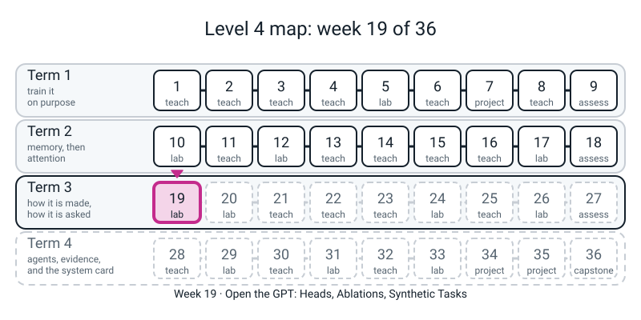
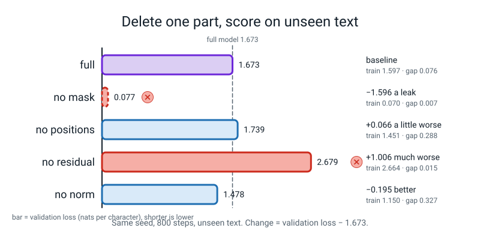
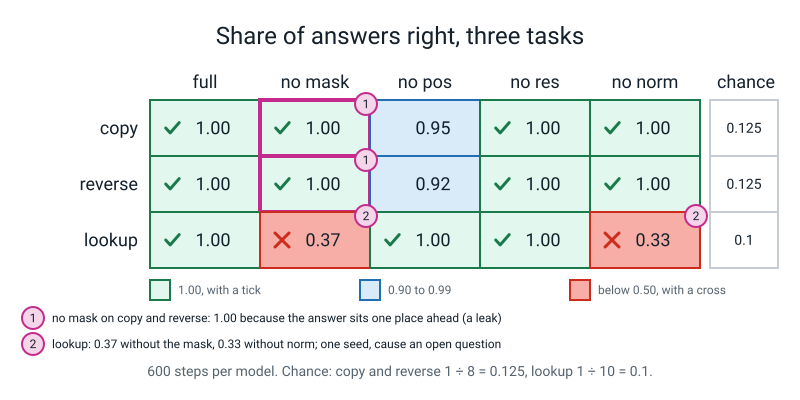

# Workbook — Week 19: Open the GPT

**Name:** ________________________________  **Date:** ______________

[⬅ Week 18](week-18.md) · [📖 Read the chapter first](../student-guide/week-19.md) · [Course Home](../README.md) · [Next ➡](week-20.md)

---

> **Rules for this workbook.** Every number you write in a report this year must be one **your own run printed, with a seed, in the last 24 hours.** The digits in the worked examples and in the answers came from real CPU runs (PyTorch 2.2.1, one thread, `torch.manual_seed(0)` wherever anything is random). By-hand numbers are plain arithmetic and will match exactly. On another CPU or PyTorch build the **last digit** of a loss can move, and a bar such as `0.95` can become `0.94`, but not the shape of the story.
>
> **Predict first, then run.** On pages 19.1, 19.2, 19.4, 19.5 and 19.6 you write your guess *before* you run anything. A wrong guess is useful. A guess written after the run is not a guess.
>
> **Two kinds of page.** Pages **19.2, 19.4, 19.5 and 19.6 each have a PRACTICE part** (small, fast, on numbers I ran for you, so you can check your reading) **and a YOURS part** (the table your own class files print). The practice parts are not your results and must not be pasted into your report.
>
> **Everything is real and small. There is no stand-in and no scripted backend anywhere in this workbook.** The models are trained on your CPU on text or made-up numbers. What they do says something about *these* models and nothing about larger ones.
>
> **Keep your class files.** You need `ablate_model.py`, `text_ablate.py`, `tasks.py`, `task_table.py` and `heads.py` from class. The practice pages add **one** small file you type yourself (`pattern.py`, page 19.5). Run everything from the folder that contains `l4lib/`. The longest run is `text_ablate.py` (about 3.6 minutes); every other file here finishes in under 10 seconds. Nothing downloads anything.
>
> Use a **calculator with an `ln` key** (a phone will do, in airplane mode) and carry **three decimals**.



*Figure 19.0 — Week 19, Open the GPT, sits in term 2 on the road from memory to attention. Everything before it is built; everything after it is still ahead.*

---

## ✅ Warm-Up (5 min)

Five quick questions about **Weeks 15 to 17**.

**W1.** A model that knows nothing about **8** symbols gives each `1/8`. Its loss on one answer should be `ln 8` = ____________ (three decimals).

**W2.** What is the mask *for*? Finish: *it stops a place from* ________________________________

**W3.** A model's loss on text it trained on is 1.0 and on text it did not train on is 1.4. What is the **gap**? ____________ What does the gap tell you, and what does it *not* tell you? ________________________________________________

**W4.** The residual road is the line `x = x + ...`. In one line of code, what does **removing** it look like? ________________________________

**W5.** Two models have validation losses 1.70 and 1.68. Is the second one "better"? What one more thing would you want to know? ________________________________

---

## 🔮 Page 19.1 — Predict Before You Delete (10 min, pen only)

Your model has four parts you can delete, one at a time: the **mask**, the **place table** (positions), the **residual road**, and the **layer norms**. Everything else stays the same: the same text, the same seed, the same 800 steps.

**Step 1. Rank them.** Write 1 for "deleting this hurts the most" to 4 for "hurts the least or helps". Write a **reason** in a few words. No ranking is wrong today; a ranking with no reason is.

| Part deleted | Rank (1-4) | My reason | I think the validation loss will be... (circle) |
|---|:--:|---|---|
| mask | ____ | ____________________ | better / same / worse than the full model |
| positions | ____ | ____________________ | better / same / worse |
| residual road | ____ | ____________________ | better / same / worse |
| layer norms | ____ | ____________________ | better / same / worse |

**Step 2.** Circle **the one deletion you are most sure will make things worse**: mask · positions · residual · norms. Why? ________________________________

**Step 3.** Would you be **surprised** if any deletion made the model *better* on text it did not study? Yes / No. Which one, and why? ________________________________

*After page 19.2*, come back and write, under this line, which prediction you got wrong and what you did not foresee: ________________________________________________

---

## 📊 Page 19.2 — Reading an Ablation Table (25 min)

**An ablation is a fair deletion:** delete one thing, change nothing else (same seed, same steps, same data), and compare the models on text **none of them trained on**. Three columns matter: **train** loss, **validation** loss, and the **gap** (validation minus train).

### Part A — PRACTICE (a small table that is *not* yours)

I ran the same five-row table on a **much smaller** model (width 32, 2 blocks, 2 heads, 32 places), on the first 3,000 characters of the corpus, for only **150 steps** each. Type it as `check192.py` **only if you want to reproduce it** (your class `ablate_model.py` is the model; the file is 50 lines, so it is in the answers section). What it printed:

```text
               train    val    gap
full           1.782  2.041  0.259
no mask        0.385  0.461  0.075
no positions   1.681  2.041  0.360
no residual    2.335  2.451  0.116
no norm        1.746  2.055  0.309
```

**A1. Fill in the last column by hand.** The difference in validation loss from the full model is `(this row's val) - (full row's val)`. A **minus** means the deleted model did **better**.

| Row | Val | Val minus full val | Better / same / worse |
|---|:--:|:--:|---|
| full | 2.041 | 0.000 | (baseline) |
| no mask | 0.461 | ________ | ____________ |
| no positions | 2.041 | ________ | ____________ |
| no residual | 2.451 | ________ | ____________ |
| no norm | 2.055 | ________ | ____________ |

**A2. Recompute the gap** for the **no mask** row from its train and val columns: `0.461 - 0.385` = ________ . The printed gap is 0.075. Why might they differ in the last digit? ________________________________

**A3.** The no-norm row is `+0.014` from the full one. A different seed moves a validation loss by **0.01 to 0.03** (that is what Week 19's class run measured). Can you say "the norms helped" from this row? Yes / No, because ________________________________

**A4.** The no-positions row has **exactly the same validation loss** as the full row (2.041) but a bigger gap. Write one honest sentence that does **not** say "positions do nothing". ________________________________________________

**A5.** Which row is a **leak**, not a result? ____________ How can you tell from the **train** column alone? ________________________________

### Part B — YOURS (`text_ablate.py`, about 3.6 minutes)

**Predict first.** Before you run, write the *validation* loss you expect for **full**: ________ . Then run `text_ablate.py` with your own `SEED`. While it runs (3.6 minutes), do page 19.3 by hand.

**My seed:** ______ . **Steps:** ______ . **Date and time of the run:** ______________

| Model | Train | Validation | Gap | Val minus full val |
|---|:--:|:--:|:--:|:--:|
| full | ______ | ______ | ______ | 0.000 |
| no mask | ______ | ______ | ______ | ______ |
| no positions | ______ | ______ | ______ | ______ |
| no residual | ______ | ______ | ______ | ______ |
| no norm | ______ | ______ | ______ | ______ |

**B1. One sentence per row.** Say what the row shows **and** what it does not.

- full: ________________________________________________
- no mask: ________________________________________________
- no positions: ________________________________________________
- no residual: ________________________________________________
- no norm: ________________________________________________

**B2.** Copy the first 60 characters of the **no mask** sample: `________________________________________________________________`. What do you notice about it? ________________________________

**B3.** Which deletion did you expect to hurt most (page 19.1)? ____________ Which hurt most? ____________ Did a deletion help? ____________ (A row where the deleted model is *better* needs **two** sentences: the number, and what you do **not** know.)

**B4. What did you not test?** Tick what applies to your table: ☐ only one seed ☐ only 800 steps ☐ only one model size ☐ only one text ☐ no dropout. Write **one more** thing: ________________________________



*Figure 19.1 — Deleting a part can make the score look better; a very low number needs a leak check before it is believed.*

---

## 🚰 Page 19.3 — The Leak (20 min, by hand first)

The no-mask model has the lowest loss in the whole table, and its sample is a line of `t` and `a`. Both facts have the same cause.

**3.1. The cause, in your own words.** Without the mask, the place that must predict character 6 can look at place ______ . What does place ______ hold? ________________________________ So the model is ________________________________ instead of predicting.

**3.2. Chance, by hand.** A model that knows nothing about the 8 symbols of the made-up tasks gives each one `1/8`.

- Chance of a right answer: ______ . Loss on one answer: `ln 8` = ______ (three decimals).
- The lookup answer is one digit, 0 to 9. Chance of a right answer: ______ .

**3.3. A loss floor you can calculate.** In the copy task from class, a window has 12 places to score and **5** of them are random symbols nobody can predict. If the loss is taken over *every* place, the best possible average is `5 x ln 8 / 12`.

**Worked example (done for you):** `5 x 2.0794 / 12 = 10.397 / 12 = 0.866`.

**Now you.** A copy task with **4** symbols (symbols, then a separator, then the four answers) has **9** tokens, so **8** places to score. The first symbol is an input, so **3** of the 8 are random symbols; the separator and the four answers can be predicted.

`3 x ln 8 / 8` = ____ x ____ / ____ = ____________ (three decimals)

A loss that sits near this number and **will not go lower** is a correct result, not a bug, if the loss was taken over every place.

**3.4. Check (Part A).** Type `check193.py` (answers section) or just read what it printed:

```text
ln(8) = 2.0794
floor, 6 symbols: 0.8664   floor, 4 symbols: 0.7798
mask_on=True: largest change at places 0-11 = 0.000000   at places 12-19 = 0.142275
mask_on=False: largest change at places 0-11 = 0.002955   at places 12-19 = 0.139264
copy of 4 symbols, loss over all 8 places, after 600 steps: 0.7791
```

**(a)** With the mask, the scores at places 0-11 moved by ________ when I changed place 12. Without it, by ________ . The second number is tiny because the model is ________________ ; what matters is zero against ________________ .

**(b)** The scores at places **12 to 19** moved in **both** runs (0.142 and 0.139). Why is that fine, and why does it not show a leak? ________________________________

**(c)** The 4-symbol model's loss after 600 steps is 0.7791. Compare with your hand number. How close? ________ What does that tell you about a loss "stuck" at this level? ________________________________

**3.5. The sentence.** Finish it, from memory: *"A loss is not a score if the model can* ________________ ."

**3.6. Your answer for the report** (4 marks: says the model can see the answer; links it to the sample or the too-low loss; describes the change-a-later-token test; says it is not a finding about the mask):

________________________________________________________________

________________________________________________________________

________________________________________________________________

---

## 🎯 Page 19.4 — The Three Tasks (20 min)

Every token in these tasks is a **number**; nothing is text. **Copy:** `s s s s s s SEP` then the same six. **Reverse:** the six backwards. **Lookup:** `k v k v k v k v SEP k` then the value for that key `v`.

### Part A — PRACTICE: what do *guessers* score?

**4.1. Predict** the share right for each guesser, by reasoning. Write the fraction first.

| Guesser | My fraction | My guess (3 decimals) |
|---|:--:|:--:|
| copy: guess any of 8 symbols at each answer place | ____ | ______ |
| lookup: guess any digit 0-9 | ____ | ______ |
| lookup: guess **one of the four values on the page** (at random) | ____ | ______ |

**4.2. Check.** `check194.py` (answers section) draws 20,000 sequences and lets each guesser answer. Nothing is trained. It printed:

```text
copy: guess any of 8 symbols      0.124
lookup: guess any digit 0-9       0.101
lookup: guess one of the 4 values 0.327
one sequence: [11, 9, 15, 4, 14, 9, 13, 3, 16, 11, 9]
```

**4.3.** The third guesser is **not** 0.25. Explain, with the digits of the printed sequence `[11, 9, 15, 4, 14, 9, 13, 3, 16, 11, 9]` (counting places from 0: keys 10-15 on places 0, 2, 4, 6 and values on places 1, 3, 5, 7): **the four values can repeat**, so picking one at random can hit the answer when it is a *different* pair that holds the same digit. Work it out: the chosen value is the right pair with chance `1/4`; otherwise (chance `3/4`) it still equals the answer with chance `1/10`.

`1/4 + 3/4 x 1/10` = ______ + ______ = ______ . Compare with the printed 0.327: ________________________________

### Part B — YOURS (`task_table.py`, about 46 seconds)

**Predict first.** Circle the cells where you think the share will be **below 0.5**:

| Task | full | no mask | no positions | no residual | no norm |
|---|:--:|:--:|:--:|:--:|:--:|
| copy | | | | | |
| reverse | | | | | |
| lookup | | | | | |

**My seed:** ______ (the file uses 0 unless you changed it). Fill your own numbers:

| Task | full | no mask | no pos | no res | no norm | Chance |
|---|:--:|:--:|:--:|:--:|:--:|:--:|
| copy | ______ | ______ | ______ | ______ | ______ | ______ |
| reverse | ______ | ______ | ______ | ______ | ______ | ______ |
| lookup | ______ | ______ | ______ | ______ | ______ | ______ |

**4.4.** Mark the two **leak** cells with an **L**. Why are they leaks and the lookup no-mask cell is not? (Look at where the window stops.) ________________________________________________

**4.5.** Which cells are *below* what the "one of four values" guesser scored on page 4.3 (0.327)? ________________ Which are close to it? ________________ (**Do not** say the model is guessing from the page; we did not test that. Say "close to" and stop.)

**4.6.** Positions were deleted. On copy and reverse, what happened? ________ On lookup? ________ Write **one** sentence that is true for all three tasks and does **not** say "positions are not needed". ________________________________



*Figure 19.2 — A perfect score can be a leak; the lookup column is where deleting a part shows up, and its cause is still an open question.*

---

## 👁️ Page 19.5 — Name a Head (25 min)

A **head card** has four things: **the name**, **the claim in a sentence**, **the table or picture it rests on**, and **the test that could prove it wrong**. A name with no such test is a story.

### Part A — PRACTICE: a task that is not in the chapter

**Repeat the pattern.** Each sequence is three random symbols (0-7) repeated to twelve tokens: `a b c a b c a b c a b c`. At every place from place 2 on, the right next token is **already on the page** (place 2 holds `c` and must say `a`, which is at place 0). Type this file (it uses your class `ablate_model.py`):

```python
# pattern.py - Week 19 workbook: the "repeat the pattern" task and its trainer. 3 random symbols (0-7), repeated to 12 tokens: a b c a b c a b c a b c.
import torch
import torch.nn.functional as F
from ablate_model import TinyGPT

PERIOD, LEN = 3, 12


def batch(B):
    s = torch.randint(0, 8, (B, PERIOD))
    return s.repeat(1, LEN // PERIOD)                              # (B, 12)


def accuracy(model, B=1000):
    seq = batch(B)
    with torch.no_grad():
        logits, _ = model(seq[:, :-1])
    guess = logits[:, PERIOD - 1:, :].argmax(dim=-1)                # places 2..10 predict tokens 3..11
    return (guess == seq[:, PERIOD:]).float().mean().item()


def train_pattern(steps=600, seed=0, first=PERIOD - 1):
    torch.manual_seed(seed)
    model = TinyGPT(8, 64, 2, 2, LEN - 1)
    opt = torch.optim.AdamW(model.parameters(), lr=1e-3, weight_decay=0.0)
    for step in range(steps):
        seq = batch(64)
        logits, _ = model(seq[:, :-1])
        loss = F.cross_entropy(logits[:, first:, :].reshape(-1, 8), seq[:, first + 1:].reshape(-1))
        opt.zero_grad(set_to_none=True)
        loss.backward()
        opt.step()
    return model, loss.item()
```

Then `check195.py` trains a two-layer, two-head model on it for 600 steps (about 4 seconds) and prints where each head looks, in this form: `2->0 (0.90)` means *"the place 2 looks most at place 0, with weight 0.90"*. This is the printout of the answer section's `check195.py`:

```text
repeat-the-pattern model: final loss 0.0017   accuracy 1.00

where does each head look? (average over 500 sequences)
layer 0 head 0:  2->0 (0.90)  3->1 (0.98)  4->2 (0.99)  5->3 (0.62)  6->4 (0.85)  7->2 (0.51)  8->0 (0.51)  9->4 (0.73)
layer 0 head 1:  2->0 (0.89)  3->1 (0.99)  4->2 (0.97)  5->3 (0.57)  6->1 (0.47)  7->2 (0.62)  8->0 (0.39)  9->1 (0.45)
layer 1 head 0:  2->0 (0.99)  3->1 (0.96)  4->2 (0.88)  5->0 (0.91)  6->1 (0.86)  7->2 (0.50)  8->0 (0.82)  9->1 (0.80)
layer 1 head 1:  2->0 (0.99)  3->1 (0.97)  4->2 (0.88)  5->0 (0.94)  6->1 (0.93)  7->2 (0.48)  8->0 (0.85)  9->1 (0.87)
```

**5.1. Read the table.** Use layer 1 head 1.

- Places 2, 3, 4 look at places ____ , ____ , ____ . How far back is each? ____ , ____ , ____
- Place 5 holds the same symbol as place 2 (the pattern repeated). It looks at place ____ (how far back? ____ ). Where would a "look exactly two back" head have looked? ____
- Is the head looking *the same distance back everywhere*? Yes / No. What is the same about every cell? (Hint: compare the symbol at the place looked at with the symbol it must say next.) ________________________________________________

**5.2. Name it** (three words or fewer): ________________________ **The claim, one sentence:** ________________________________________________

**5.3. The kill-test.** Write **a result that would prove your name wrong**. "Look at the table again" is not a test. ________________________________________________

Pick one of the three accepted kinds: (a) *switch it off and see whether accuracy falls*; (b) *run it on a different input and see whether it still looks where you said*; (c) *see whether another head shows the same stripe*. Mine is kind ( ___ ).

**5.4.** Layer 0 head 0 has weights 0.51 at place 7 and 0.62 at place 5, but 0.99 at place 4. Would you write a name for layer 0 head 0 with the same confidence as for layer 1 head 1? Yes / No, because ________________________________

### Part B — YOURS: the lab deliverable (copy model, `heads.py`)

Run `heads.py` with your own seed. Open `copy_heads.png`: four small grids, each row a "looking" place and each column a "looked at" place.

**My seed:** ______ **Final loss:** ______ **Accuracy:** ______ (should be above 0.95)

Head I will name: layer ____ head ____

| Looking place | 6 | 7 | 8 | 9 | 10 | 11 |
|---|:--:|:--:|:--:|:--:|:--:|:--:|
| Looks most at | ____ | ____ | ____ | ____ | ____ | ____ |
| Weight | ____ | ____ | ____ | ____ | ____ | ____ |
| How many back | ____ | ____ | ____ | ____ | ____ | ____ |

**Describe the picture.** In rows 6 to 11 I see ________________________________ . Above the main diagonal I see ________________ because ________________ .

**Draw it.** A sketch of what you see in that head's panel (rows down, columns across; shade the bright squares):

```text
         looked at:  0  1  2  3  4  5  6  7  8  9 10 11
looking place  6   [  ][  ][  ][  ][  ][  ][  ][  ][  ][  ][  ][  ]
               7   [  ][  ][  ][  ][  ][  ][  ][  ][  ][  ][  ][  ]
               8   [  ][  ][  ][  ][  ][  ][  ][  ][  ][  ][  ][  ]
               9   [  ][  ][  ][  ][  ][  ][  ][  ][  ][  ][  ][  ]
              10   [  ][  ][  ][  ][  ][  ][  ][  ][  ][  ][  ][  ]
              11   [  ][  ][  ][  ][  ][  ][  ][  ][  ][  ][  ][  ]
```

**HEAD CARD**

| | |
|---|---|
| **Name** (3 words or fewer) | ____________________ |
| **Claim** (one sentence: what it looks at) | ________________________________ |
| **Evidence** (the table above / the picture) | ________________________________ |
| **A result that would prove my name wrong** | ________________________________ |

---

## 🔌 Page 19.6 — Switch It Off (20 min)

`silence` is the switch. Setting `model.blocks[0].silence = [1]` makes head 1 of layer 0 mix in nothing. It is for **testing a trained model** (chapter, section 10) and **never for training**.

### Part A — PRACTICE: the repeat-the-pattern model

**Predict first.** For the model from page 19.5, write the accuracy you expect **before** reading the printout.

| Switch-off | My prediction | Measured |
|---|:--:|:--:|
| nothing | ______ | |
| layer 1 head 1 alone | ______ | |
| both heads of layer 1 | ______ | |
| all four heads | ______ | |

Then read what `check195.py` printed for the switch-off test (it is the second half of the same run):

```text
  nothing switched off: 1.00
  only layer 0 head 0 off: 1.00
  only layer 0 head 1 off: 1.00
  both heads of layer 0 off: 1.00
  only layer 1 head 0 off: 1.00
  only layer 1 head 1 off: 1.00
  both heads of layer 1 off: 1.00
  all four heads off:   0.12
```

**6.1.** Write the measured values in the table above. Which of your predictions was wrong? ________________

**6.2.** Chance on this task is 1 in 8 = ______ . What does the last line (0.12) say? ________________________________

**6.3.** Your name from 5.2 was ________________ . After the switch-off test, does it **survive as a description** (the picture still shows it)? Yes / No. Does it survive as a claim that **the model needs this head**? Yes / No. Why? ________________________________________________

**6.4.** Four heads, and switching off *any one* changes nothing, and *any two of the same layer* changes nothing, but *all four* gives chance. Complete: *"The model needs* ________________ *of the heads, but no* ________________ *head in particular."*

### Part B — YOURS: `copy_off.py` on the copy model

**Predict before you run** (then run `copy_off.py`):

| Switch-off (copy, my seed) | My prediction | Measured |
|---|:--:|:--:|
| nothing | | |
| layer 0 head 0 only | | |
| layer 0 head 1 only | | |
| layer 1 head 0 only | | |
| layer 1 head 1 only | | |
| both heads of layer 0 | | |
| both heads of layer 1 | | |

**6.5. Write up** (4 marks: a single-head number · a both-heads number · what the result does to the name · what was *not* tested):

________________________________________________________________

________________________________________________________________

________________________________________________________________

________________________________________________________________

**6.6.** The chapter says a stripe in a picture shows where a head *looked*, and the switch-off shows whether the model *needed it*. Give one case from today where the stripe was there and the head was not needed, and one case where switching off a single head mattered (for the second, use the lookup lines of `heads_more.py`). ________________________________________________

---

## 🐞 Page 19.7 — Break It on Purpose (25 min)

Three bugs on the repeat-the-pattern model, using `pattern.py` from page 19.5. **Write what you expect before you run each.** Two of them **run and print a plausible number**: those are the ones that matter.

### Bug A (SILENT): a switch-off test that never switches anything back

```python
# DELIBERATE BUG 19.7-A (SILENT): the switch-off test, but heads are ADDED to `silence` and never taken out again.
from pattern import train_pattern, accuracy

model, _ = train_pattern()
print(f"nothing off:          {accuracy(model):.2f}")
model.blocks[0].silence.append(0)
print(f"only layer 0 head 0:  {accuracy(model):.2f}")
model.blocks[0].silence.append(1)
print(f"only layer 0 head 1:  {accuracy(model):.2f}")
model.blocks[1].silence.append(0)
print(f"only layer 1 head 0:  {accuracy(model):.2f}")
model.blocks[1].silence.append(1)
print(f"only layer 1 head 1:  {accuracy(model):.2f}")
```

**Expected (write it first):** ________________________________

**Printed:**

```text
nothing off:          1.00
only layer 0 head 0:  1.00
only layer 0 head 1:  1.00
only layer 1 head 0:  0.86
only layer 1 head 1:  0.13
```

**A1.** The page 19.6 practice run said that no single head matters here, but the last two lines are far from 1.00. The code says "only layer 1 head 1". How many heads are **really** off on that line? ____ Which? ________________ **A2.** Which line of the loop is the mistake, and what belongs there? ________________________________ **A3.** Why is this bug silent? ________________________________ **A4.** A check that catches it: print `model.blocks[0].silence` and `model.blocks[1].silence` ________________________________ .

### Bug B (SILENT): the loss over every place

```python
# DELIBERATE BUG 19.7-B (SILENT): the loss is taken over EVERY place, including the two random symbols nobody can predict.
import math
from pattern import train_pattern, accuracy

model, loss = train_pattern(first=0)
print(f"final loss {loss:.4f}   accuracy {accuracy(model):.2f}")
print(f"2 of the 11 places are unpredictable:  2 x ln(8) / 11 = {2 * math.log(8) / 11:.4f}")
```

**Expected (write it first):** ________________________________

**Printed:**

```text
final loss 0.3840   accuracy 1.00
2 of the 11 places are unpredictable:  2 x ln(8) / 11 = 0.3781
```

**B1.** The loss stops at 0.384, not near 0. Is the model broken? Yes / No. The accuracy printed is ______ . **B2.** Use the hand number printed in the last line to say **why** 0.384 is the right answer for this loss. `2 x ln 8 / 11`: of the three random symbols, the first is only an ____________ , so the number of unpredictable places is ____ . Why not 3? ________________________________ **B3.** On page 19.3 you did this sum for the copy task. What did the 5 count there? ________________________________

### Bug C (loud): a head number that does not exist

```python
# DELIBERATE BUG 19.7-C (loud): a head number that does not exist. The model has 2 heads, numbered 0 and 1.
from pattern import train_pattern, accuracy

model, _ = train_pattern(steps=50)
model.blocks[0].silence = [2]
print(accuracy(model))
```

**Expected (write it first):** ________________________________

**Printed (the last line is the one to copy; the frames inside torch are shortened):**

```text
Traceback (most recent call last):
  ... frames inside torch (elided) ...
IndexError: index 2 is out of bounds for dimension 1 with size 2
```

**C1.** The error says the index 2 is out of bounds for a dimension of size 2. The dimension is the number of ________ in the model. The valid numbers are ____ and ____ . **C2.** Would this error have appeared if you had typed `[1]` by mistake for `[0]`? Yes / No. Why is a wrong-but-valid number more dangerous? ________________________________ **C3.** One line you would add to `Block.forward` so the error says "this model has 2 heads"? ________________________________

---

## 📓 Page 19.8 — The Bug Log

Copy the **last line** of each error, not the whole traceback. Add a row for every real error you hit this week, not only the deliberate ones.

| # | Date | What I typed (the line) | Last line of the error | What it means in plain words | Fix | Page I'll find this on again |
|:--:|---|---|---|---|---|:--:|
| 1 | ______ | ______________ | ______________ | ______________ | ______________ | ____ |
| 2 | ______ | ______________ | ______________ | ______________ | ______________ | ____ |
| 3 | ______ | ______________ | ______________ | ______________ | ______________ | ____ |
| 4 | ______ | ______________ | ______________ | ______________ | ______________ | ____ |
| 5 | ______ | ______________ | ______________ | ______________ | ______________ | ____ |

**A mistake with no traceback** (these matter more; this week there were two in the workbook): write the one I made, or nearly made. ________________________________________________

**The habit for silent mistakes.** Fill in the blanks: *when a loss is too good I ask whether the model can see the* ____________ ; *when a test switches something off I print its* ____________ *before and after*; *when a loss will not go below a number I work out the* ____________ *by hand.*

Write this sentence in your own handwriting:

> **"A stripe shows where a head looked. Only switching it off shows whether it was needed."**

________________________________________________________________

---

## 🧠 Self-Check (do this last, from memory)

1. **What makes an ablation fair? Name three things you must keep the same.**

________________________________________________________________

2. **The no-mask model has the lowest validation loss. Explain why that is not a finding about the mask, and describe the test that catches it.**

________________________________________________________________

3. **The no-norm text model was better than the full one on validation. Write two sentences: one about the number, one about what you do not know.**

________________________________________________________________

4. **Copy, reverse and lookup: what does chance score on each? Which cells of the task grid were leaks?**

________________________________________________________________

5. **Four heads all look six places back. Switching off one changes nothing. What does that say about the name "the head that copies"?**

________________________________________________________________

6. **Name one thing today's results do not tell you about a large model.**

________________________________________________________________

Tick what you can do without looking: ☐ fill a table and write one sentence per row ☐ compute `k x ln 8 / n` ☐ run the leak test ☐ read `6->0 (0.99)` ☐ write a head card with a kill-test ☐ spot a switch that was never put back

---

# ✂️ ANSWERS - keep this page folded until you have finished

> Numbers in this section marked "practice" come from the small models of this workbook. Numbers marked "class run" are from the chapter's runs (seed 0, one thread). **Your own run uses your own seed: for the YOURS parts only the structure of the answer is fixed.**

### Warm-Up

**W1.** `ln 8` = **2.079**. **W2.** Look at places **later** than itself (the future). **W3.** Gap = 1.4 - 1.0 = **0.4**. It tells you the model does better on text it studied than on text it did not (consistent with memorising, not proof); it does not tell you whether the model is good. **W4.** `x = self.proj(mixed)` instead of `x = x + self.proj(mixed)`, and the same for the second line of the block. **W5.** Not necessarily: the gap of 0.02 is inside the seed-to-seed wobble (0.01-0.03); you would want a second seed.

### Page 19.1

No wrong ranking; marks for a reason. The class run's ranking by damage on validation: **no residual (+1.006) > no positions (+0.066) > full > no norm (-0.195) > no mask (-1.596, a leak)**. The thing that was hard to predict is that a deletion *helped*. For the reflection line: a good one names which prediction was wrong and says what it did not foresee (usually "I didn't think removing something could help" or "I didn't think of the mask as a cheat").

### Page 19.2

**Part A (practice).**

| Row | Val minus full val | Better / same / worse |
|---|:--:|---|
| no mask | **-1.580** | better (but see A5: a leak) |
| no positions | **0.000** | same |
| no residual | **+0.410** | worse |
| no norm | **+0.014** | slightly worse / about the same |

**A2.** `0.461 - 0.385` = **0.076**. The printed gap (0.075) was worked out from the unrounded losses, so the last digit can differ by one. **A3.** **No**: +0.014 is inside the 0.01-0.03 run-to-run wobble; you would need other seeds. **A4.** For example: *"At this tiny size and 150 steps, deleting the place table left the validation loss unchanged to three decimals, but it fits the training text better (1.681 against 1.782) and the gap is bigger (0.360 against 0.259); I cannot say positions are not needed."* **A5.** **No mask.** Its train loss (0.385) is far below every other row at the same step count; the model is reading the answer.

The small run is the file below (type it only to reproduce the table; it is `text_ablate.py` with four changes: width 32, 2 blocks, 32 places, 150 steps on the first 3,000 characters):

```python
# check192.py - Week 19 workbook page 19.2: a SMALL ablation table (width 32, 2 blocks, 150 steps) on the first 3,000 characters. PRACTICE run.
import torch
from ablate_model import TinyGPT
from l4lib.corpus import TEXT

chars = sorted(set(TEXT))
V = len(chars)
stoi = {c: i for i, c in enumerate(chars)}
data = torch.tensor([stoi[c] for c in TEXT[:3000]])
n = int(0.9 * len(data))
train_data, val_data = data[:n], data[n:]
d, H, L, T, B, STEPS = 32, 2, 2, 32, 32, 150


def get_batch(src):
    starts = torch.randint(len(src) - T, (B,))
    return (torch.stack([src[s:s + T] for s in starts]),
            torch.stack([src[s + 1:s + T + 1] for s in starts]))


@torch.no_grad()
def estimate(model, src):
    saved = torch.get_rng_state()
    torch.manual_seed(123)
    total = 0.0
    for _ in range(10):
        x, y = get_batch(src)
        total += model(x, y)[1].item()
    torch.set_rng_state(saved)
    return total / 10


def run(name, **switch):
    torch.manual_seed(0)
    model = TinyGPT(V, d, H, L, T, **switch)
    opt = torch.optim.AdamW(model.parameters(), lr=3e-3, weight_decay=0.0)
    for step in range(STEPS):
        x, y = get_batch(train_data)
        _, loss = model(x, y)
        opt.zero_grad(set_to_none=True)
        loss.backward()
        opt.step()
    tr, va = estimate(model, train_data), estimate(model, val_data)
    print(f"{name:<13}{tr:>7.3f}{va:>7.3f}{va - tr:>7.3f}")


print(f"{'':<13}{'train':>7}{'val':>7}{'gap':>7}")
run("full")
run("no mask", mask_on=False)
run("no positions", pos_on=False)
run("no residual", res_on=False)
run("no norm", ln_on=False)
```

**Part B (yours).** Structure of the answer: five rows filled; column five = each validation loss minus the full row's. The class run (seed 0, 800 steps):

| | Train | Validation | Gap | Val minus full |
|---|:--:|:--:|:--:|:--:|
| full | 1.597 | 1.673 | 0.076 | 0.000 |
| no mask | 0.070 | 0.077 | 0.007 | -1.596 |
| no positions | 1.451 | 1.739 | 0.288 | +0.066 |
| no residual | 2.664 | 2.679 | 0.015 | +1.006 |
| no norm | 1.150 | 1.478 | 0.327 | -0.195 |

Model one-sentences (**B1**): *full: "the baseline."* *No mask: "the model can see the answer; the number is a leak."* *No positions: "it fits the training text better and the unseen text worse; the gap is about four times the baseline's."* *No residual: "it hardly learned anything, so train and validation agree."* *No norm: "better on validation at 800 steps, with a bigger gap, and we do not know why."* **B2.** The sample is a line of `t`s and `a`s (`tatattt...`). **B3.** Honest answers vary. A student who names "no mask" as the best model has missed the lesson. **B4.** Any honest list; "only one seed" is nearly always true.

### Page 19.3

**3.1.** Place **6** (or "the next place"). It holds the **character that place 5 must predict**, so the model is **reading the answer** instead of predicting. **3.2.** `1/8 =` **0.125**; `ln 8 =` **2.079**; lookup chance **0.1**. **3.3.** `3 x 2.0794 / 8 = 6.2382 / 8 =` **0.780** (0.7798 unrounded). **3.4 (a)** **0.000000**; **0.002955**; untrained; **zero against not zero**. **(b)** A change at place 12 is *supposed* to move the scores at 12 and later; the test only looks at places **before** the change. **(c)** 0.7791 against 0.7798: within 0.001. A loss stuck there is the floor, not a bug, **when the loss is taken over every place**. **3.5** "...*can see the answer*." **3.6** Model answer: *"With no mask, place 5 can look at place 6, and place 6 holds the character place 5 is supposed to predict. So the model reads the answer. The sample is `tatat...` and the loss is far below everything else. The test: change one later token and see whether earlier scores move; with the mask they don't (0.000000), without it they do. So the low number is not a finding about the mask."* Marks: 1 each for the four items.

```python
# check193.py - Week 19 workbook page 19.3: the leak test on a small model, and a loss floor for a copy task with FOUR symbols. PRACTICE numbers.
import math
import torch
import torch.nn.functional as F
from ablate_model import TinyGPT

print("ln(8) =", round(math.log(8), 4))
print("floor, 6 symbols:", round(5 * math.log(8) / 12, 4), "  floor, 4 symbols:", round(3 * math.log(8) / 8, 4))

# ---- the leak test, on an untrained model: width 32, 2 blocks, 20 places, 10 characters
torch.manual_seed(0)
x = torch.randint(0, 10, (4, 20))
x2 = x.clone()
x2[:, 12] = (x2[:, 12] + 1) % 10                       # change the character at place 12 only
for mask_on in (True, False):
    torch.manual_seed(0)
    model = TinyGPT(10, 32, 2, 2, 20, mask_on=mask_on)
    with torch.no_grad():
        a, _ = model(x)
        b, _ = model(x2)
    print(f"mask_on={mask_on}: largest change at places 0-11 = {(a[:, :12] - b[:, :12]).abs().max().item():.6f}"
          f"   at places 12-19 = {(a[:, 12:] - b[:, 12:]).abs().max().item():.6f}")

# ---- a copy task with 4 symbols (8 symbols 0-7, separator 8), the loss taken over EVERY place (the Clinic-2 mistake, on purpose)
def batch(B):
    s = torch.randint(0, 8, (B, 4))
    return torch.cat([s, torch.full((B, 1), 8), s], dim=1)      # 9 tokens

torch.manual_seed(0)
model = TinyGPT(9, 64, 2, 2, 8)
opt = torch.optim.AdamW(model.parameters(), lr=1e-3, weight_decay=0.0)
for step in range(600):
    seq = batch(64)
    _, loss = model(seq[:, :-1], seq[:, 1:])
    opt.zero_grad(set_to_none=True)
    loss.backward()
    opt.step()
print(f"copy of 4 symbols, loss over all 8 places, after 600 steps: {loss.item():.4f}")
```

### Page 19.4

**4.1.** `1/8 = 0.125`; `1/10 = 0.1`; a careless guess is `1/4 = 0.25`. **4.2.** Printed in the page. **4.3.** `1/4 + 3/4 x 1/10 = 0.25 + 0.075 =` **0.325**, against 0.327 printed: the small difference (0.002) is the wobble of sampling 20,000 sequences. The `1/10` term is the repeated-digit effect: in the sequence shown, the digit 9 sits at places 1 and 5. **Lesson: "one in four" is only right if the four values are all different.** (This is for the guesser; it is not a claim about any trained model.)

```python
# check194.py - Week 19 workbook page 19.4: what do guessers score on the three tasks? No model, no training. PRACTICE numbers.
import torch
from tasks import copy_batch, lookup_batch

torch.manual_seed(0)
B = 20000
seq = copy_batch(B)
guess = torch.randint(0, 8, (B, 6))
print(f"copy: guess any of 8 symbols      {(guess == seq[:, -6:]).float().mean().item():.3f}")

seq = lookup_batch(B)
guess = torch.randint(0, 10, (B,))
print(f"lookup: guess any digit 0-9       {(guess == seq[:, -1]).float().mean().item():.3f}")
values = seq[:, 1:8:2]                                      # the four values on the page (places 1, 3, 5, 7)
guess = values[torch.arange(B), torch.randint(0, 4, (B,))]
print(f"lookup: guess one of the 4 values {(guess == seq[:, -1]).float().mean().item():.3f}")
print("one sequence:", lookup_batch(1)[0].tolist())
```

**Part B (yours).** Class run (seed 0, 600 steps):

| Task | full | no mask | no pos | no res | no norm | Chance |
|---|:--:|:--:|:--:|:--:|:--:|:--:|
| copy | 1.00 | 1.00 (L) | 0.95 | 1.00 | 1.00 | 0.125 |
| reverse | 1.00 | 1.00 (L) | 0.92 | 1.00 | 1.00 | 0.125 |
| lookup | 1.00 | 0.37 | 1.00 | 1.00 | 0.33 | 0.1 |

**4.4.** Copy and reverse no-mask are leaks: the input contains the answer one place ahead. In lookup the window stops **before** the answer, so there is nothing to read; its 0.37 is a real failure and we did **not** find out why. **4.5.** Lookup no mask (0.37) and no norm (0.33) are *close to* 0.327; no other cell is. The no-norm 0.33 is **not stable**: it is 1.00 on other seeds, and a student's own seed may give 1.00; accept it. **4.6.** No positions: copy and reverse lose a few percent (0.95, 0.92); lookup is unchanged (1.00). A true sentence: *"Deleting positions cost a little on the two tasks that need an order and nothing on lookup, at this size and training length."*

### Page 19.5

**Part A (practice).** **5.1.** Layer 1 head 1: places 2, 3, 4 look at 0, 1, 2, so **2, 2, 2 back**. Place 5 looks at place **0**, **5 back**; a "two back" head would have looked at place 3. It is **not** the same distance everywhere. What is the same: **every cell looks at a place that holds the symbol the current place must say next** (place 5 must say the token that sits at places 0 and 3). **5.2.** Sample names: "finds the next symbol" / "looks at the start" / "earlier copy". **Not** "looks two back" (the table says otherwise from place 5 on). **5.3.** Accepted: (a) switch it off and see whether accuracy falls; (b) try a pattern of period 4 (or random symbols), see whether it still looks at an earlier copy; (c) look at the other three heads: layer 1 head 0 shows the same cells. Not accepted: "look at the picture again". **5.4.** **No**: its weights fall to 0.51 and 0.62, and it picks places 4 and 2 where the others pick 0 and 1; a smaller table of evidence, so a less confident name.

**Part B (yours).** Class run, copy model, seed 0, layer 0 head 0: `6->0, 7->1, 8->2, 9->3, 10->4, 11->5`, weights 0.95-0.99, all **6 back**. In the picture, rows 6-11 have **one bright square each**, in columns 0-5, a stripe parallel to the main diagonal; **nothing above the main diagonal**, because of the mask. Acceptable names: "looks 6 back" / "the copy-across head" / "6-back head" (anything that says *what it looks at*). The kill-test is one of (a), (b), (c) with a stated result that would count against the name. Accuracy above 0.95.

The practice model file:

```python
# check195.py - Week 19 workbook pages 19.5 and 19.6: a NEW made-up task, "repeat the pattern". PRACTICE model, not the copy model.
import torch
from pattern import batch, accuracy, train_pattern

model, loss = train_pattern()
print(f"repeat-the-pattern model: final loss {loss:.4f}   accuracy {accuracy(model):.2f}")

with torch.no_grad():
    model(batch(500)[:, :-1])
print("\nwhere does each head look? (average over 500 sequences)")
for layer in range(2):
    for head in range(2):
        w = model.blocks[layer].last_weights[:, head].mean(dim=0)       # (11, 11)
        cells = []
        for q in range(2, 10):
            src = int(w[q].argmax())
            cells.append(f"{q}->{src} ({w[q, src]:.2f})")
        print(f"layer {layer} head {head}:  " + "  ".join(cells))

print("\nswitch-off test")
print(f"  nothing switched off: {accuracy(model):.2f}")
for layer in range(2):
    for head in range(2):
        model.blocks[layer].silence = [head]
        print(f"  only layer {layer} head {head} off: {accuracy(model):.2f}")
        model.blocks[layer].silence = []
    model.blocks[layer].silence = [0, 1]
    print(f"  both heads of layer {layer} off: {accuracy(model):.2f}")
    model.blocks[layer].silence = []
for layer in range(2):
    model.blocks[layer].silence = [0, 1]
print(f"  all four heads off:   {accuracy(model):.2f}")
```

### Page 19.6

**Part A.** Measured values: nothing **1.00**; layer 1 head 1 alone **1.00**; both heads of layer 1 **1.00**; all four heads **0.12**. **6.2.** Chance is `1/8 =` **0.125**; 0.12 is **chance**: with all four heads off nothing can carry a symbol forward. **6.3.** Yes it survives as a description (the picture shows it); it does **not** survive as "needed", because switching the head off changed nothing. **6.4.** "*The model needs* **at least one** *of the heads, but no* **single** *head in particular.*" (Another layer's heads can do the same job; both layers off at once is the only thing that breaks it.)

**Part B (yours).** Class run, copy model, seed 0: nothing 1.00; L0 H0 only 1.00; L0 H1 only 1.00; L1 H0 only 1.00; L1 H1 only 1.00; both heads of layer 0 **0.75**; both heads of layer 1 **1.00**. **6.5.** Model answer: *"My name was 'looks 6 back' and the picture still shows it. But switching the head off changed nothing (1.00), because the other three do the same. With both layer-0 heads off accuracy was 0.75, with both layer-1 heads off 1.00. So the name survives as a description and fails as a claim about importance. I tried one seed and one size."* Marks: single-head number · both-heads number · what it does to the name · what was not tested. **6.6.** Stripe but not needed: the copy heads (all four look 6 back; any one, and both of layer 1, can go). A single head mattering: lookup layer 0 head 0 off takes accuracy from 1.00 to 0.48, or layer 1 head 0 off to 0.80.

### Page 19.7

**Bug A.** Printed: nothing 1.00, l0h0 1.00, l0h1 1.00, l1h0 **0.86**, l1h1 **0.13**. **A1.** By the last line **four**: `append` adds, nothing takes out, so layer 0 heads 0 **and** 1 and layer 1 heads 0 **and** 1 are off, which is the "all four off" case (chance). **A2.** The `append` lines: reset with `model.blocks[0].silence = []` after each test (or assign `= [head]` instead of appending). **A3.** It runs and prints numbers between 0 and 1; a falling accuracy looks like a discovery ("layer 1 head 1 matters!"). **A4.** Print the `silence` lists before each test.

**Bug B.** Printed: `final loss 0.3840   accuracy 1.00` and the hand number `0.3781`. **B1.** **No**, the model is not broken; accuracy 1.00. **B2.** The first symbol is an **input** (never predicted); **2** places are unpredictable. **Why not 3:** token 0 is an input, tokens 1 and 2 are random, and from token 3 on the pattern repeats. `2 x 2.0794 / 11 = 0.378`, and the run gives 0.384. **B3.** The 5 on page 19.3 counted the random symbols 2-6 of a 6-symbol copy window (the first is an input); the separator and answers are predictable.

**Bug C.** `IndexError: index 2 is out of bounds for dimension 1 with size 2`. **C1.** Heads; **0 and 1**. **C2.** **No**: `1` is a valid head, so the run goes on and silently switches off the wrong one. Only numbers outside 0 and 1 are caught. **C3.** Any sensible answer: an `if` that compares each number in `silence` with `self.H` and raises an error whose message says how many heads the model has.

### Page 19.8 and Self-Check

Model entries for the Bug Log: `TypeError: train_task() got an unexpected keyword argument 'pos_off'` (chapter); `IndexError: index 2 is out of bounds for dimension 1 with size 2` (Bug C); `RuntimeError: one of the variables needed for gradient computation has been modified by an inplace operation` (chapter, switch-off before training). A good "no traceback" entry is Bug A or B. Blanks: *the **answer** / **switches** (the `silence` lists) / **floor***.

Self-Check, short answers: (1) same seed, same steps, same data (and the same validation batches); compare on text the model was not trained on. (2) Without the mask a place can see the next character, which is the answer; the test changes one later token and watches whether earlier scores move (0.000000 with the mask, not zero without). (3) "No-norm's validation loss was 1.478 against 1.673 for the full model at 800 steps, with a larger gap (0.327). We do not know why." (4) copy and reverse 0.125, lookup 0.1; the two no-mask cells of copy and reverse. (5) It survives as a description of where it looks, and fails as "the head that does the copying", since any single head can go. (6) Anything true, for example: whether heads of large models look like these (we looked at none), or whether their layer norms matter.
