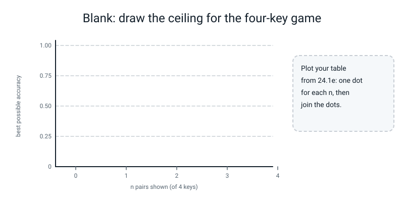

# Workbook — Week 24: Examples, Scratchpads, and Schemas: Learned in Context

**Name:** ________________________________  **Date:** ______________

[⬅ Week 23](week-23.md) · [📖 Read the chapter first](../student-guide/week-24.md) · [Course Home](../README.md) · [Next ➡](week-25.md)

---


*Figure 24.0 — Week 24 is the sixth lesson of Term 3: what changes when only the prompt changes.*

> **Rules for this workbook.** Six pages, a Bug Log and a Self-Check. **Write your prediction or your hand answer first, then run.** A guess written after the run is not a guess. Every number you write in the write-up (page 24.6) must have been printed by **your own** run in the last 24 hours, with the seed stated.
>
> **The models today are real, and they are tiny.** The three models you trained in class (secret codes, addition, JSON) are real neural networks of about a hundred thousand knobs each, trained from scratch on the CPU. That makes the numbers real. **It does not make them about ChatGPT**: nothing here says how a large language model behaves. Wherever you write "model", check you meant "my small model on this made-up job".
>
> **No stand-in appears in any number on these pages.** The only stand-in this week is `FakeClient` inside `cachekey.py` (it only counts words and is labelled *stand-in, not a model*), and nothing in this workbook uses it.
>
> **Real numbers, and what to expect.** Every printed output below came from a real CPU run with the seeds shown (one thread, `torch 2.2.1`). Plain-Python pages (24.1e, 24.1h, 24.3, the grammar lines) will match **exactly**. Anything that **trains** can differ from yours in the last digit or two on another machine, and the top of the in-context curve (`n = 4, 5, 6`) can differ more: that is the lesson, not a fault. By-hand numbers are plain arithmetic and match exactly. The tables on pages 24.2, 24.3 and 24.4 marked **a neighbour's run** are real runs of the same files with a different training seed than your class run.
>
> **Files you need.** Your own `icl.py`, `addlib.py`, `grammar.py`, `jsonlib.py` and your Week 17 `tinygpt.py`, in one folder that also contains `l4lib/` (only `jsonlib.py` needs it). Name the practice scripts as shown (`p1.py`, `p2.py`, ...) so they do not overwrite your class files. Training pages tell you how long to wait: **start the run, then do the hand part of the next question while you wait.**
>
> **Calculator.** A phone is fine, airplane mode on. Carry four decimals and round only the answer.

---

## ✅ Warm-Up (5 min, before anything else)

**W1.** Four keys, two of them shown, and the asked key is **not** one of the two. The value is one of the ____ values not used yet, so a guess is right ____ of the time (a fraction).

**W2.** Six keys, four shown. The best possible score is `(n + 1) / 6` = ____________ (three decimals).

**W3.** A model that knows nothing about a six-way choice has cross-entropy loss `ln 6` = ____________ (three decimals).

**W4.** `torch.where(cond, a, b)` takes the number from `a` where `cond` is **True / False** (circle one), and the condition must be a tensor of **True/False / 1 and 0** (circle one).

**W5.** Change one letter of a text. Its `sha256` fingerprint changes **a little / completely** (circle one). `rng.shuffle(some_list)` returns **the shuffled list / `None`** (circle one).

---

## 🃏 Page 24.1 — The Ceiling (pen first · 25 min)

This page is for working out, by hand, the best score anyone can get in the Secret Code Game, and for checking that figure against runs.

**The rule, in your own words.** Six keys `a` to `f`, six values `0` to `5`, each used once, a **new** secret code every prompt. `n` pairs are shown, then one key is asked.

**24.1a. Fill in the table by hand before you run anything.** The first column is your **guess from the start of class** (copy it from your prediction card).

| `n` shown | My guess from class | Best possible `(n + 1)/6` | If the key was **not** shown, best possible `1/(6 - n)` |
|:--:|:--:|:--:|:--:|
| 0 | | | |
| 1 | | | |
| 2 | | | |
| 3 | | | |
| 4 | | | |
| 5 | | | |
| 6 | | | |

(At `n = 6` there is no unshown key: write "none".)

**24.1b. The two-case argument for `n = 2`.** Case 1: the asked key was shown, which happens ____ times in 6, and a good player is right every time. Case 2: it was not shown, ____ times in 6, and then it is a 1-in-____ guess.

Total: ____ / 6 × 1 + ____ / 6 × 1 / ____ = ____________ + ____________ = ____________

**24.1c. How many different secret codes are there?** (Six values go under six letters, one each. The first letter has 6 choices, the next has 5, and so on.) ____ × ____ × ____ × ____ × ____ × ____ = ____________ .

**24.1d. Your Secret Code Game sheet.** Write what you scored (right out of 4) in each block, and the expected score `4 × (n + 1)/6` beside it.

| Block | `n = 0` | `n = 1` | `n = 3` | `n = 6` | Total |
|---|:--:|:--:|:--:|:--:|:--:|
| Expected (out of 4) | | | | | |
| What I scored | | | | | |

Expected total out of 16: ____________ . Were you bad, or unlucky? Say what you would have to do to tell the difference, in one sentence: ___________________________________________

### A different game: four keys (a hand table, then a run)

**24.1e.** The same game with **four** keys `a` to `d` and four values `0` to `3`. Write the best possible for each `n` by the same argument, **by hand** (hint: the first row is `1/4`; write the formula you are using): ______________________

| `n` shown | 0 | 1 | 2 | 3 | 4 |
|---|:--:|:--:|:--:|:--:|:--:|
| Best possible | | | | | |

**Draw it.** Plot your table from 24.1e on the blank chart: one dot for each `n`, then join the dots.


*Figure W24.1 — Blank chart for 24.1e: the best possible accuracy at each `n` in the four-key game.*

Now type this file as `p1.py` and run it. It plays the game 2,000 times at each `n` with a **perfect player** (copy when the key was shown, otherwise guess among the unused values), using `random.Random(11)`.

```python
# p1.py - Workbook 24.1 (PRACTICE game): FOUR keys a-d and FOUR values 0-3. The same argument, different numbers.
import random

KEYS, VALS = "abcd", "0123"
K = len(KEYS)


def one_round(rng, n):
    vals = list(VALS)
    rng.shuffle(vals)                                   # a fresh secret code every round
    table = dict(zip(KEYS, vals))
    shown = rng.sample(KEYS, n)
    query = rng.choice(KEYS)
    if query in shown:
        guess = table[query]                            # it is on the page: copy it
    else:
        used = [table[k] for k in shown]
        guess = rng.choice([v for v in VALS if v not in used])   # a guess among the values not used yet
    return guess == table[query]


rng = random.Random(11)
print(" n   best possible   a perfect player over 2000 rounds")
for n in range(K + 1):
    hits = sum(one_round(rng, n) for _ in range(2000))
    print(f"{n:2d}      {min(1, (n + 1) / K):.3f}          {hits / 2000:.3f}")
```

```text
 n   best possible   a perfect player over 2000 rounds
 0      0.250          0.254
 1      0.500          0.500
 2      0.750          0.736
 3      1.000          1.000
 4      1.000          1.000
```

**24.1f.** The `min(1, ...)` in the last line caps the formula. At `n = 4` the formula gives ____________ , which is impossible for a score. Why is `n = 3` already `1.000` with four keys? ___________________________________________

**24.1g.** The perfect player scored `0.736` at `n = 2`, not `0.750`. Is the player not perfect? One sentence: ___________________________________________

### How much does a perfect player's score wobble?

**24.1h.** Predict: five sets of **500** prompts at `n = 3` (best possible `0.667`) are scored by a perfect player. The lowest score will be about ________ and the highest about ________ .

Type and run `p1b.py` (it needs your `icl.py`).

```python
# p1b.py - Workbook 24.1: how much does a PERFECT player's score wobble on 500 prompts? Needs your icl.py and tinygpt.py.
import random
from icl import make_prompt, VALS

def perfect_player(prompt, rng):
    n = (len(prompt) - 1) // 2
    shown = {prompt[2 * i]: prompt[2 * i + 1] for i in range(n)}
    query = prompt[-1]
    if query in shown:
        return shown[query]
    return rng.choice([v for v in VALS if v not in shown.values()])

scores = []
for s in range(5):
    rng = random.Random(200 + s)                        # five different private dice
    cases = [make_prompt(rng, 3) for _ in range(500)]
    scores.append(sum(perfect_player(p, rng) == a for p, a, shown in cases) / 500)
print("five sets of 500 prompts at n = 3:", scores)
print("best possible: 0.667   lowest", min(scores), "  highest", max(scores))
```

```text
five sets of 500 prompts at n = 3: [0.656, 0.668, 0.678, 0.664, 0.636]
best possible: 0.667   lowest 0.636   highest 0.678
```

**24.1i.** The five scores are all different and the player is the same perfect player. Write the distance of the lowest and the highest from `0.667`: ____________ and ____________ .

**24.1j.** A trained model scored `0.686` at `n = 3` on 500 prompts. Is that "above the ceiling, so it is cheating"? Use your answer to 24.1i, then say what you would **check** if you still suspected a leak. ___________________________________________

**24.1k.** The class test prompts come from `random.Random(1000 + n)`, and training from `random.Random(seed)`. Give the **two** reasons for giving each its own dice. ___________________________________________

---

## 📈 Page 24.2 — The Curve (needs `icl.py` and your own `incontext_run.py` run · 40 min, mostly waiting)

This page is for recording your own in-context results, reading a neighbour's run beside them, and comparing seeds.

**24.2a. Predict first** (before you run `incontext_run.py` a second time, or look at your class table). Your model's `all` score at **`n = 0`**: ________ , at **`n = 3`**: ________ , at **`n = 6`**: ________ . Which of the three do you trust least, and why? ___________________________________________

**24.2b. Your own table.** Copy it from your own run (seed 0, 8,000 steps; it takes about 100 seconds). The gap is `best possible − all` (a negative gap means you were above the line).

Frozen test set fingerprint (must be `47d6a3db7a1a` if your files match the class files): ______________

| `n` | Best possible | All | Gap | Key was shown | Key was not shown |
|:--:|:--:|:--:|:--:|:--:|:--:|
| 0 | | | | | |
| 1 | | | | | |
| 2 | | | | | |
| 3 | | | | | |
| 4 | | | | | |
| 5 | | | | | |
| 6 | | | | | |

**24.2c. Read your own table.** (i) The `n` where your model is within 0.03 of the line: ____________ . (ii) The `n` where it is clearly below, and the column that shows why: ____________ . (iii) At `n = 0` your model scored ________ against `0.167`. Why can **no** model do better than that, however well it is trained? ___________________________________________

(iv) Two cells in your table print `nan`. Which ones, and why is `nan` the correct thing to print there? ___________________________________________

### A neighbour's run: seed 3, 8,000 steps

Someone ran `train_model(seed=3, steps=8000)` on the same files and printed the table below (it took 111 s). The questions below use it.

```text
 n  all   ceiling  key-shown  key-unseen
 0  0.158  0.167    nan      0.158
 1  0.324  0.333    1.000      0.195
 2  0.504  0.500    1.000      0.275
 3  0.630  0.667    0.992      0.244
 4  0.632  0.833    0.827      0.325
 5  0.722  1.000    0.803      0.313
 6  0.686  1.000    0.686      nan
```

**24.2d. Pen and calculator.** Fill in the gap (`ceiling − all`, three decimals, using `n/6` to four decimals before you round).

| `n` | 0 | 1 | 2 | 3 | 4 | 5 | 6 |
|---|:--:|:--:|:--:|:--:|:--:|:--:|:--:|
| Gap | | | | | | | |

**24.2e.** (i) At `n = 6` the key was always shown, yet the model is right only ____________ of the time. Which column tells you the problem is **copying** and not **guessing**? ___________________________________________

(ii) Is this the same kind of model as the one in your table (same recipe, same size, same number of steps, only the seed differs)? ____________ . One sentence on what you would run to find out whether it simply had not finished learning to copy. Write what you would change and what you expect: ___________________________________________

(iii) **Do not explain the dip.** Nobody measured why the key-shown column falls at `n = 4` and `5` on your seed and on this one. Write one thing that would be a **measurement** (not a story): ___________________________________________

### Two more seeds (homework · about 110 s each)

**24.2f. Predict, then run.** Type and run `p2.py`. It trains seeds 1 and 2 for 8,000 steps and prints three columns each.

```python
# p2.py - Workbook 24.2: two more training seeds, about 110 seconds each. Needs your icl.py and tinygpt.py.
import time
from icl import train_model, evaluate

for seed in (1, 2):
    t0 = time.time()
    model = train_model(seed=seed, steps=8000)
    row = [evaluate(model, n)[0] for n in (0, 3, 6)]
    print(f"seed {seed}: n=0 {row[0]:.3f}   n=3 {row[1]:.3f}   n=6 {row[2]:.3f}   ({time.time() - t0:.0f} s)")
```

My prediction for `n = 3` on seeds 1 and 2: ________ and ________ . Printed:

| Seed | `n = 0` | `n = 3` | `n = 6` |
|:--:|:--:|:--:|:--:|
| 0 (your class run) | | | |
| 1 | | | |
| 2 | | | |
| 3 (the neighbour) | 0.158 | 0.630 | 0.686 |

**24.2g.** Which column agrees best across the four seeds, and which disagrees most? Give the lowest and the highest in each: `n = 0`: ________ to ________ ; `n = 3`: ________ to ________ ; `n = 6`: ________ to ________ .

**24.2h. One seed, one roll.** Finish the sentence with numbers from this table: *"If I had only run seed ____ I would have said that at six examples the model copies with accuracy ______; if I had only run seed ____ I would have said ______."* ___________________________________________

**24.2i. Does the model memorise the codes?** The code changes every prompt and the answer is not fixed by the question. What would a memoriser score at `n = 0`, and what does your table say your model scored? ___________________________________________

---

## ➕ Page 24.3 — The Scratchpad (hand calculation first · 40 min)

This page is for writing the step-by-step working for two sums by hand, then reading what three neighbour-trained models printed.

**How the working is written.** For each of the five columns, **right to left**, write four characters: the two digits you are looking at, the digit you write down, and the carry you pass on. After a `#` comes the answer: first the **final carry**, then the digits you wrote, **read from the last column back to the first**.

**Worked example (done for you): `04211 + 00009`.**

| Column (from the right) | Digit of the first | Digit of the second | Carry in | Total | Write | Carry out | Block |
|:--:|:--:|:--:|:--:|:--:|:--:|:--:|:--:|
| 1 | 1 | 9 | 0 | 10 | 0 | 1 | `1901` |
| 2 | 1 | 0 | 1 | 2 | 2 | 0 | `1020` |
| 3 | 2 | 0 | 0 | 2 | 2 | 0 | `2020` |
| 4 | 4 | 0 | 0 | 4 | 4 | 0 | `4040` |
| 5 | 0 | 0 | 0 | 0 | 0 | 0 | `0000` |

Working: `19011020202040400000`. Final carry `0`, then the digits written, last column first: `0 4 2 2 0`: answer `004220`.

**24.3a. Your turn: `48391 + 76254`.** Fill in the table. (`total % 10` is the last digit of the total; `total // 10` is the carry out.)

| Column | Digit of the first | Digit of the second | Carry in | Total | Write | Carry out | Block |
|:--:|:--:|:--:|:--:|:--:|:--:|:--:|:--:|
| 1 | | | 0 | | | | |
| 2 | | | | | | | |
| 3 | | | | | | | |
| 4 | | | | | | | |
| 5 | | | | | | | |

Answer: the final carry ____ , then the digits written (last column first): ____ ____ ____ ____ ____ . So `48391 + 76254 =` ____________ . Check with plain arithmetic: ____________ .

**24.3b. A second sum: `70805 + 29596`.** Write the five blocks directly, without a table: ____ ____ ____ ____ ____ . Answer: ____________ . (Watch the zeros and the carry that travels three columns.)

Now type and run `p3.py` (it needs your `addlib.py`), then compare it with your blocks.

```python
# p3.py - Workbook 24.3: the scratchpad for two sums, one column per line. Needs your addlib.py.
from addlib import question, working, answer

for a, b in ((48391, 76254), (70805, 29596)):
    w = working(a, b)
    print(question(a, b), "answer", answer(a, b))
    print("  columns, right to left:", [w[i:i + 4] for i in range(0, len(w), 4)])
    print("  compact (digit, carry) :", working(a, b, "pad_short"))
```

```text
48391+76254= answer 124645
  columns, right to left: ['1450', '9541', '3260', '8641', '4721']
  compact (digit, carry) : 5041604121
70805+29596= answer 100401
  columns, right to left: ['5611', '0901', '8541', '0901', '7201']
  compact (digit, carry) : 1101410101
```

**24.3c.** Did your blocks match? If one did not, write the column and what you did: ___________________________________________

**24.3d. The compact working.** The "compact" form leaves out the two digits it is looking at and keeps only `(digit, carry)`. Take your five blocks for `70805 + 29596` and cross out the first two characters of each. What is left, joined together? ____________ (it should be the compact line printed above).

**24.3e. Error hunt.** Someone's working for `70805 + 29596` has **one block wrong**:

```text
5611  0901  8431  0901  7201     #
```

(i) The first wrong block is number ____ . What should it say? ____________ (ii) The blocks after it are all correct. Does the wrong block change **any later block**? ____________ Why not? ___________________________________________ (iii) A faithful model copies the answer from its working. What answer does this working give? ____________ . The true answer is ____________ . (iv) Is a faithful answer to a wrong working right? ____________

### Reading what a model did: direct, seed 3, 3,000 steps

A neighbour trained the **direct** model (answer at once, no working) with seed 3 for 3,000 steps and scored it on the 500 held-out sums. It printed:

```text
direct seed 3 steps 3000: exact 0.082  per character [1.0, 1.0, 0.99, 0.96, 0.93, 0.09]  (38 s)
  95455 + 75805 = 171260;  the model wrote: 95455+75805=171268.
```

In class (seed 0) the same recipe printed `exact 0.000  per answer character [1.0, 0.98, 0.82, 0.11, 0.11, 0.13]`.

**24.3f.** (i) A digit chosen at random is right one time in ____ , so "at chance" for a digit is ____________ . (ii) On **this** seed, which answer character is at chance? ____________ On seed 0, which three? ____________ (iii) Multiply this seed's six per-character numbers together (carry four decimals): ____________ . The printed exact match is `0.082`. Why do these come out about the same? ___________________________________________ (They need not match exactly, because the characters are not independent.)

**24.3g.** The neighbour's model wrote `171268` for `171260`. Which character is wrong, and did it fail on the first character, the last, or in the middle? ____________ Can you say **why** that character is the one that fails on this seed, from what is printed? ____________ (Circle: **yes / no / not from this**.)

### Does "exact 0.000" mean "cannot"?

Same recipe, **four times the steps** (12,000 instead of 3,000), seed 0, direct, on the same 500 held-out sums:

```text
direct seed 0 steps 12000: exact 0.994  per character [1.0, 1.0, 1.0, 1.0, 1.0, 1.0]  (140 s)
```

**24.3h.** In class seed 0 at 3,000 steps scored `0.000`. Write one sentence that is **true** about direct addition, using the word *steps*, and one sentence that is **false** that a careless reader would write: True: ___________________________ False: ___________________________

**24.3i. With working, seed 3, 3,000 steps** (79 s, the same neighbour, the same sums):

```text
pad seed 3 steps 3000: exact 1.000  per character [1.0, 1.0, 1.0, 1.0, 1.0, 1.0]  (79 s)
```

Say what the scratchpad **bought**, using the four numbers `3,000 steps`, `12,000 steps`, `79 s` and `140 s`: ___________________________________________ (The two times come from different runs, so treat them as rough.) Was it a capability the direct model could never have? ____________

### The compact working: a model that copies a wrong working faithfully

A neighbour trained the **compact** working (`pad_short`) with seed 1 for 3,000 steps. It printed:

```text
pad_short seed 1 steps 3000: exact 0.090  per character [1.0, 0.98, 0.77, 0.09, 1.0, 1.0]  (58 s)
  95455 + 75805 = 171260;  the model wrote: 95455+75805=0160900171#170960.
```

A check script printed the **true** compact working for this sum in pairs, `01 60 21 11 71`, and the model's own working in pairs, `01 60 90 01 71`.

**24.3j.** (i) Which pair is the first one the model got wrong? ____ . Check it by hand: `4 + 8 =` ____ , which writes digit ____ and carry ____ , so the pair should be ____ and the model wrote ____ . (ii) Read the model's own working and build the answer the way a faithful copier would (final carry, then digits, last column first): ____________ . The model wrote `170960`. Did it copy faithfully? ____________ (iii) Is the answer right? ____________ . Circle: **the answer is checked because it matches the working / matching the working proves nothing about the working**.

**24.3k.** Scored with the **true working handed over**, a model like this scores near `1.0`; scored on its **own** working, `0.090`. Which of the two is the measurement a user would experience, and which course week named the trick of handing over the truth? ___________________________________________

---

## 🎭 Page 24.4 — The Mask (hand softmax first · 40 min)

This page is for applying a mask to softmax by hand, reading what the grammar allows, and recording mask results on the JSON job.

**24.4a. The hand mask.** A model gives five scores to five possible characters. The grammar allows only the **1st, 3rd and 5th**.

| Place | 1 | 2 | 3 | 4 | 5 |
|---|:--:|:--:|:--:|:--:|:--:|
| Score | 1.5 | 0.5 | 2.0 | -1.0 | 0.0 |
| Allowed? | yes | no | yes | no | yes |
| Score after the mask (`-inf` where forbidden) | | | | | |

Use `e^1.5 = 4.4817`, `e^2.0 = 7.3891`, `e^0 = 1`. What is `e^(-inf)`? ____________

Sum of the allowed `e^` values: ____________ . Chances after the mask:

| Place | 1 | 2 | 3 | 4 | 5 |
|---|:--:|:--:|:--:|:--:|:--:|
| Chance | | | | | |

**24.4b. Write the one line** that does this with `scores` (a tensor) and `allowed` (a tensor of `True`/`False`):

`masked = ________________________________________________________________`

Type and run `p4.py`, then compare it with your table.

```python
# p4.py - Workbook 24.4 (PRACTICE numbers): a mask by hand, then by torch.where.
import torch

scores = torch.tensor([1.5, 0.5, 2.0, -1.0, 0.0])
allowed = torch.tensor([True, False, True, False, True])
print("plain softmax :", [round(p, 3) for p in torch.softmax(scores, dim=0).tolist()])
masked = torch.where(allowed, scores, torch.tensor(float("-inf")))
print("masked scores :", masked.tolist())
print("masked softmax:", [round(p, 3) for p in torch.softmax(masked, dim=0).tolist()])
print("e to the 1.5, 2.0, 0.0:", [round(torch.exp(torch.tensor(x)).item(), 4) for x in (1.5, 2.0, 0.0)])
```

```text
plain softmax : [0.301, 0.111, 0.496, 0.025, 0.067]
masked scores : [1.5, -inf, 2.0, -inf, 0.0]
masked softmax: [0.348, 0.0, 0.574, 0.0, 0.078]
e to the 1.5, 2.0, 0.0: [4.4817, 7.3891, 1.0]
```

**24.4c.** (i) Without the mask, the chance that the model picks one of the two **forbidden** characters at this place is ____ + ____ = ____________ , about one time in ____ . (ii) With the mask: ____________ . (iii) The model's knobs: **moved / did not move** (circle). Does the model "know" it was stopped? ____________ (iv) The mask is applied **before / after** the dice are rolled (circle), so ___________________________________________

### Reading the grammar

You read `grammar.py` in class and did not type it. Type `p4g.py`, but **write your prediction for each line first** (what characters may come next: write them, or "26 letters and a quote", or "one character", or "nothing").

```python
# p4g.py - Workbook 24.4: what does the grammar allow next? Predict each line BEFORE you run. Needs your grammar.py.
from grammar import allowed_after

for text in ['{"name":"', '{"name":"zo', '{"name":"abcdefgh', '{"name":"zo","age":', '{"name":"zo","age":3', '{"name":"zo","age":35', '{"name":"zo","age":35,"adult":f']:
    ok = "".join(sorted(set(allowed_after(text))))
    print(repr(text[-12:]).ljust(16), repr(ok if len(ok) < 12 else ok[:5] + "... (" + str(len(ok)) + " characters)"))
```

| Text so far (last 12 characters) | My prediction | What it printed |
|---|---|---|
| `{"name":"` | | |
| `{"name":"zo` | | |
| `{"name":"abcdefgh` | | |
| `{"name":"zo","age":` | | |
| `{"name":"zo","age":3` | | |
| `{"name":"zo","age":35` | | |
| `{"name":"zo","age":35,"adult":f` | | |

```text
'{"name":"'      'abcde... (26 characters)'
'{"name":"zo'    '"abcd... (27 characters)'
'e":"abcdefgh'   '"'
':"zo","age":'   '123456789'
'"zo","age":3'   '0123456789'
'zo","age":35'   ','
'35,"adult":f'   'a'
```

**24.4d.** (i) After eight letters the grammar allows only `"`. Which piece of `HEAD` in `grammar.py` made that happen? ____________ (ii) After `"age":` the grammar offers `123456789` and **not** `0`. Which JSON rule is that, and which clinic mistake showed what happens without it? ____________ (iii) The grammar writes an age with **exactly two digits**. Could a reply ever say `"age":7`? ____________ . Why was that fine for this job, and what does it tell you about **a grammar you wrote**? ___________________________________________

### Your own 2 × 2 (from `jsonmask_run.py`)

**24.4e. Predict first**: on **new** names, the number fully right out of 100 with the mask will be ________ , against the free number ________ .

| Names | Decoding | Parses (out of 100) | Right shape | All fields right |
|---|---|:--:|:--:|:--:|
| seen | free | | | |
| seen | mask | | | |
| new | free | | | |
| new | mask | | | |

Class numbers on seed 0 were `90 / 87 / 79`, `100 / 100 / 95`, `85 / 85 / 25`, `100 / 100 / 26`. If yours differ, write which cell differs most: ____________ . **Did the mask lift the new-name "all right" number by much?** ____________

### A neighbour's mask: seed 1 (800 steps of training, about 30 s)

Someone trained `train_json(seed=1, steps=800)`, decoded 100 **new** names free and masked with the same dice as class, and printed:

```text
names     decoding  parses  all-fields-right
new       free       83          36
new       mask      100          44
masked, new names, well-formed and wrong:
  suvi 18>   -> {"name":"suev","age":18,"adult":true}.     wrong: ['name']                 agrees with itself: True
  bex 16>    -> {"name":"ue","age":19,"adult":true}.       wrong: ['name', 'age', 'adult'] agrees with itself: True
  zora 16>   -> {"name":"joor","age":16,"adult":false}.    wrong: ['name']                 agrees with itself: True
  zaid 19>   -> {"name":"daai","age":19,"adult":true}.     wrong: ['name']                 agrees with itself: True
  zora 14>   -> {"name":"phor","age":14,"adult":false}.    wrong: ['name']                 agrees with itself: True
```

("Agrees with itself" means the reply's `adult` equals whether its own `age` is at least 18.)

**24.4f.** (i) With the mask, ____ replies of 100 **parse but are not fully right**. (ii) Mask on: parses went from ____ to ____ (a gain of ____ ), but "all right" only from ____ to ____ . (iii) In `bex 16>` the reply says `"age":19,"adult":true`. A rule that says "adult must match age" would call that reply **fine**. Which field can only be caught by checking against the **prompt**? ____________ (iv) Does any of the five replies break a rule the **schema** could state? ____________ (v) The model has seen 200 names. `zora` became `joor`. Is this a *formatting* failure or a *generalisation* failure (Week 5)? ____________ Say why a mask cannot see it: ___________________________________________

**24.4g.** Finish: *"The mask made every reply ______ . It did not make the model ______ , because ______ ."*

___________________________________________

---

## 🐞 Page 24.5 — Break It on Purpose (six bugs · 40 min)

This page is for practising how to find faults, including ones that raise no error.

Each file is **deliberately broken**. For each: (i) say what is wrong, (ii) **predict** what it prints, (iii) run it, (iv) write the fix. **Four of the six print no error at all.** Bugs E and F train a small model first (about 20 s and 10 s).

### Bug 24.5-A (loud)

```python
# DELIBERATE BUG 24.5-A (loud): shuffle changes the list in place and hands back nothing.
import random
from icl import KEYS, VALS

rng = random.Random(0)
vals = rng.shuffle(list(VALS))
print("vals is:", vals)
table = dict(zip(KEYS, vals))
print(table)
```

(i) The bug: ___________________ (ii) I predict the first line prints: ___________________ (iii) Fix: ___________________

### Bug 24.5-B (loud)

```python
# DELIBERATE BUG 24.5-B (loud): sha256 wants bytes, and this is text.
import hashlib

text = "a3b1c0d2"
print(hashlib.sha256(text).hexdigest()[:12])
```

(i) The bug: ___________________ (ii) The last line of the traceback will be: ___________________ (iii) Fix: ___________________

### Bug 24.5-C (SILENT)

```python
# DELIBERATE BUG 24.5-C (SILENT): the two choices in torch.where are the wrong way round.
import torch

scores = torch.tensor([2.0, 1.0, 0.5, 3.0])
allowed = torch.tensor([True, True, False, False])
masked = torch.where(allowed, torch.tensor(float("-inf")), scores)     # <- which side is "allowed"?
print("masked scores :", masked.tolist())
print("masked softmax:", [round(p, 3) for p in torch.softmax(masked, dim=0).tolist()])
print("chance of the two ALLOWED characters:", round(torch.softmax(masked, dim=0)[:2].sum().item(), 3))
```

(i) The bug: ___________________ (ii) I predict the last line says: ___________________ (iii) Fix: ___________________

**Which one would you catch without a table?** The softmax printed numbers that **add up to 1**, and nothing raised. What single check on the output would catch it? ___________________

### Bug 24.5-D (SILENT; run it **twice**)

```python
# DELIBERATE BUG 24.5-D (SILENT): the test prompts come from the shared random module, which nobody seeded. Run this file TWICE.
import hashlib
import random
from icl import KEYS, VALS

def test_prompt(n):
    vals = list(VALS)
    random.shuffle(vals)
    table = dict(zip(KEYS, vals))
    shown = random.sample(KEYS, n)
    query = random.choice(KEYS)
    return "".join(k + table[k] for k in shown) + query, table[query]

test = [test_prompt(3) for _ in range(500)]
print("fingerprint of the 'frozen' test set:", hashlib.sha256(repr(test).encode("utf-8")).hexdigest()[:12])
```

(i) The bug: ___________________ (ii) The two fingerprints will be: **the same / different** (circle) (iii) Fix: ___________________ (iv) What would you compare the fingerprint to? ___________________

### Bug 24.5-E (SILENT; about 20 s)

```python
# DELIBERATE BUG 24.5-E (SILENT): the targets are one place out. About 20 seconds.
import math
import random
import torch
import torch.nn.functional as F
from icl import CHARS, PAIRS, stream, stoi, evaluate
from tinygpt import TinyGPT

torch.manual_seed(0)
rng = random.Random(0)
model = TinyGPT(len(CHARS), 64, 4, 2, 2 * PAIRS)
opt = torch.optim.AdamW(model.parameters(), lr=2e-3)
for step in range(1500):
    x = torch.tensor([[stoi[c] for c in stream(rng)] for _ in range(64)])
    logits, _ = model(x)
    guess = logits[:, 1::2]                    # <- which places are these?
    truth = x[:, 2::2]                         # <- and what are they being asked for?
    guess = guess[:, :truth.shape[1]]
    loss = F.cross_entropy(guess.reshape(-1, len(CHARS)), truth.reshape(-1))
    opt.zero_grad()
    loss.backward()
    opt.step()
    if step % 500 == 0 or step == 1499:
        print(f"step {step:4d}  loss {loss.item():.3f}")
print("ln(6) =", round(math.log(6), 3))
print("accuracy with 3 examples:", round(evaluate(model, 3)[0], 3), "  (best possible 0.667)")
```

(i) The bug (which places predict what?): ___________________ (ii) I predict the loss at step 1499 will be near: ____________ (hint: what is `ln 6`, and what does a loss of exactly `ln 6` mean?) (iii) Fix: ___________________

### Bug 24.5-F (SILENT; about 10 s)

```python
# DELIBERATE BUG 24.5-F (SILENT): the grammar is asked about the prompt AND the reply. About 10 seconds.
import random
import torch
import torch.nn.functional as F
from jsonlib import train_json, judge, prompt_of, TRAIN_NAMES, stoi, CHARS, T
from grammar import allowed_after

@torch.no_grad()
def decode_bad(model, prompt, gen):
    idx = torch.tensor([[stoi[c] for c in prompt]])
    reply = ""
    while len(prompt) + len(reply) < T:
        logits, _ = model(idx)
        ok = allowed_after(prompt + reply)             # <- what does the grammar make of "mia 14>"?
        if ok == "":
            break
        allow = torch.tensor([c in ok for c in CHARS])
        last = torch.where(allow, logits[0, -1], torch.tensor(float("-inf")))
        nxt = torch.multinomial(F.softmax(last, dim=-1), 1, generator=gen).item()
        reply += CHARS[nxt]
        idx = torch.cat([idx, torch.tensor([[nxt]])], dim=1)
    return reply

model = train_json(seed=0, steps=300)
gen = torch.Generator().manual_seed(5)
rng = random.Random(77)
parses = 0
for _ in range(100):
    name, age = rng.choice(TRAIN_NAMES), rng.randint(10, 40)
    reply = decode_bad(model, prompt_of(name, age), gen)
    parses += judge(reply, name, age)[0]
print("replies that parse:", parses, "of 100")
print("last reply:", repr(reply))
```

(i) The bug: ___________________ (ii) I predict the number that parse: ____________ and the last reply: ____________ (iii) Fix: ___________________

**The silent ones.** Of A to F, the loud ones are ____ and ____ . For each silent bug, write the **one number or check** that would have told you something was wrong, without waiting for a table of results: C: ____________ D: ____________ E: ____________ F: ____________

---

## ✍️ Page 24.6 — Write-Up: What Examples, Working and Schemas Do, Measured on Models I Trained (30 min)

One page, in your own words. **Every number must have been printed by your own run in the last 24 hours, with the seed stated.** Nothing here is about a large language model; the word "model" below means one of your three small models.

**1. My five numbers.** (Run the files again if you need to.)

| What | My number | Seed |
|---|:--:|:--:|
| In-context accuracy at `n = 0` (and the best possible there) | | |
| In-context accuracy at `n = 3` (and the best possible there) | | |
| Direct addition, exact match, 3,000 steps | | |
| Addition with working, exact match, 3,000 steps | | |
| JSON with the mask, on new names: parses / all fields right (out of 100) | | |

**2. What each result cannot tell us.** One sentence each.

- In-context: ___________________________________________
- Addition: ___________________________________________
- The mask: ___________________________________________

**3. The three small prints, in your own words** (the three lines from your Bug Log, but not copied):

- A key that was never shown: ___________________________________________
- One seed: ___________________________________________
- A mask and a schema: ___________________________________________

**4. The three new constructs.** Run `constructs.py` and copy out the line that proves each:

- `random.Random(7)`: ______________________________ (the line that shows the twin dice agree) ______________________________ (the line that shows torch was not disturbed)
- `hashlib.sha256`: ______________________________ (the fingerprint of `a3b1c0d2`) ______________________________ (after changing one letter)
- `torch.where(cond, a, b)`: ______________________________ (the masked softmax) ______________________________

In one sentence each, what it does: `Random(seed)` ___________________________ `sha256` ___________________________ `torch.where(cond, a, b)` ___________________________

**5. Checklist before you hand it in.**

☐ Every number came from my run, with a seed. ☐ I wrote "not a large language model" somewhere. ☐ I did not write "the model reasons" or "understands". ☐ I did not claim anything from one seed. ☐ I did not write "the mask makes the model right".

---

## 📓 Page 24.7 — The Bug Log

Every entry needs a line from a **real** run of yours this week.

**Entry 1: a prediction I got wrong.** *"I predicted ______________, and the run printed ______________, because ____________________."*

_______________________________________________________________________________

**Entry 2: the one I was most tempted to believe.** The sentence *"the scratchpad makes the model smarter"* is tempting. Write the **two numbers** from the page 24.3 runs that stop you (the direct model at 12,000 steps, and the compact working on seed 1) and a sentence of your own.

Number 1: ____________ Number 2: ____________

_______________________________________________________________________________

**Entry 3: a slip, not a gap.** A digit or a count you lost that you knew how to get (a carry dropped, `n/6` rounded too early, `1/(6 - n)` used for the whole ceiling). What was it, and what is the one habit that would have saved it?

Slip: ____________________ Habit: ___________________________________________

**Entry 4: the silent ones.** Name the check you will use after each of these: a loss of `1.79` after training → ____________ . A "frozen" test whose fingerprint changes → ____________ . A mask that makes `0 of 100` replies parse → ____________ . A model that scores `1.0` when handed the true working → ____________ .

**Entry 5: the honest limits.** One thing today's three small models *cannot* tell you about a real language model, in your own words:

_______________________________________________________________________________

Copy these three sentences in your own handwriting (they are also in the chapter):

> *A key that was never shown is a guess, so the best possible score is a line nobody can beat.*
> *One seed is one roll of the dice; the compact scratchpad has a seed where it scores 0.000.*
> *A mask fixes the shape of a reply and never its sense.*

| Date | Where it happened | The symptom | What I thought it was | What it really was | The check that proved it |
|---|---|---|---|---|---|
| | | | | | |
| | | | | | |
| | | | | | |

---

## 🧠 Self-Check (from memory, no notes)

1. With 6 keys and `n` shown, nobody can beat ____________ . At `n = 3` that is ____________ , from ____ / 6 × 1 + ____ / 6 × 1 / ____ .
2. A score a little above the line at 500 prompts means ____________ ; a score **far** above it would mean ____________ .
3. The direct model scored `0.000` at 3,000 steps and ____________ at 12,000, so "direct addition fails" is a sentence about ____________ , not about the model.
4. A faithful answer to a wrong working is still ____________ , because ____________ .
5. `torch.where(allowed, scores, -inf)` is applied **before / after** the dice, and the model's knobs ____________ .
6. "100 of 100 parse" and "26 of 100 right" together say: ___________________________________________
7. One sentence: *a small model I trained showed me ________________ but not ________________ .*

---

## ✂️ ANSWERS - keep this page folded until you have finished

> Real printed outputs below. By-hand numbers are exact. For anything that trains, your last digits may differ from these (this machine, `torch 2.2.1`, one thread, seed shown); on the in-context curve at `n = 4, 5, 6` a different machine can differ by more, and that is the point of page 24.2. Everything here is about three small models on three made-up jobs, **not** about a large language model.

### Warm-Up

**W1.** Four values in all, two used by the shown pairs, so **2** values are not used yet and a guess is right **1/2** of the time. **W2.** `5/6 =` **0.833**. **W3.** `ln 6 =` **1.792**. **W4.** **True**; a tensor of **True/False**. **W5.** **completely**; **`None`**.

### Page 24.1

**24.1a.**

| `n` | 0 | 1 | 2 | 3 | 4 | 5 | 6 |
|:--:|:--:|:--:|:--:|:--:|:--:|:--:|:--:|
| Best possible `(n + 1)/6` | 0.167 | 0.333 | 0.500 | 0.667 | 0.833 | 1.000 | 1.000 |
| Key **not** shown, `1/(6 - n)` | 0.167 | 0.200 | 0.250 | 0.333 | 0.500 | 1.000 | none |

Your own guesses are yours (typical guesses in class were `0, 50, 90, 100` percent; the best possible at 0, 1, 3, 6 is `0.167, 0.333, 0.667, 1.000`).

**24.1b.** Case 1: **2** times in 6 (right every time). Case 2: **4** times in 6, a 1-in-**4** guess (four values left). `2/6 × 1 + 4/6 × 1/4 = 0.333 + 0.167 =` **0.500**.

**24.1c.** `6 × 5 × 4 × 3 × 2 × 1 =` **720**. (There are only 720 codes, so the model has very likely met every one in training. Knowing all the codes still does not answer the question: which code is in play is decided by the examples on the page, not by the question.)

**24.1d.** Expected: `0.67, 1.33, 2.67, 4`, total `0.67 + 1.33 + 2.67 + 4 =` **8.67** of 16 (exactly `8 2/3`). What you scored is yours. **Bad or unlucky?** Sixteen rounds cannot tell: even a perfect player wobbles. To tell you need **many more rounds** and to know **how much a perfect player's score wobbles** over that many (page 24.1h-j does exactly that for the model's 500 prompts).

**24.1e.** With `K = 4`: `(n + 1)/K`:

| `n` shown | 0 | 1 | 2 | 3 | 4 |
|---|:--:|:--:|:--:|:--:|:--:|
| Best possible | 0.250 | 0.500 | 0.750 | 1.000 | 1.000 |

On the blank chart (Figure W24.1) the dots are at **(0, 0.250), (1, 0.500), (2, 0.750), (3, 1.000), (4, 1.000)**: a straight climb of `0.25` per step that levels off at `1.000` from `n = 3`.

The `p1.py` output is printed above (`0.254, 0.500, 0.736, 1.000, 1.000`). If your `p1.py` printed something different, you changed the seed `11` or the order of the dice calls: the plain-Python numbers must match exactly.

**24.1f.** At `n = 4` the formula gives `5/4 = 1.25`. `n = 3`: the one key left over has **one** unused value, so it is not a guess (`3/4 × 1 + 1/4 × 1/1 = 1`).

**24.1g.** The player is perfect; the score is from **2,000 random rounds**, and 2,000 rounds wobble (here by `0.014` at `n = 2`). The best possible is the **long-run** average, not what a short run prints.

**24.1h.** (Your guess is yours.) **24.1i.** `0.636 - 0.667 = -0.031` and `0.678 - 0.667 = +0.011` (the scores run `0.656, 0.668, 0.678, 0.664, 0.636`).

**24.1j.** **No.** The same perfect player lands anywhere from `0.031` below to `0.011` above the line from one set of 500 to the next (a different five sets will land slightly differently), so `0.686`, only `0.019` above `0.667`, is inside the wobble. A leak would show as a **large** margin, or a `key unseen` score above `1/(6 - n)` (here `0.333`). **Checks:** rerun on a **fresh** test set from a different dice and compare the fingerprint; look at the `key unseen` column against `1/(6 - n)`. (The class model's `key unseen` at `n = 3` was `0.252`, below `0.333`.)

**24.1k.** (1) **The test is the same prompts every run** (so a score can be compared with yesterday's, and the fingerprint `47d6a3db7a1a` can be checked); (2) **the test never shares dice with training** (`Random(1000 + n)` for the test, `Random(seed)` for training), so the training stream cannot contain a test prompt.

### Page 24.2

**24.2a, 24.2b.** Your own numbers. For seed 0 the class table was `all`: `0.176, 0.312, 0.480, 0.638, 0.666, 0.828, 0.998`; `key was shown`: `nan, 1.000, 1.000, 1.000, 0.788, 0.854, 0.998`; `key not shown`: `0.176, 0.181, 0.240, 0.252, 0.474, 0.699, nan`; the fingerprint `47d6a3db7a1a`. The gap column for those: `-0.009, 0.021, 0.020, 0.029, 0.167, 0.172, 0.002` (best possible to four decimals minus `all`).

**24.2c.** (i) `n = 0` to `3` (within 0.03). (ii) `n = 4` and `5`; the **key was shown** column falls to `0.788` and `0.854`: it copies less reliably when more pairs crowd the page. **The reason was not investigated.** (iii) With a new code and nothing shown, there is nothing to know, so every model scores about `1/6 = 0.167` (`0.176` for ours). (iv) **`key shown` at `n = 0`** (no key is ever shown, so there is nothing to average) and **`key not shown` at `n = 6`** (every key was shown). `nan` means "nothing to average", which is the truth.

**24.2d.** Gap `= ceiling − all`: **0.009, 0.009, -0.004, 0.037, 0.201, 0.278, 0.314**.

**24.2e.** (i) Right only **0.686** of the time (the `key-shown` column at `n = 6`, `0.686`): the key **was** on the page and it still did not copy it, so the trouble is **copying**, not guessing (the `key-unseen` column is `nan` there: there is nothing to guess). (ii) Same recipe, size and steps: **only the seed differs**, so it is the same kind of model. A test: train seed 3 for more steps (for example `train_model(seed=3, steps=16000)`) and see whether `n = 6` rises towards `0.998`. **This guide did not run that**; "unfinished learning" is a hypothesis, not a result. (iii) A **measurement** is, for example, "print which place the model attends to when it fails to copy a shown key" (Week 19's tool), or "score the failing prompts only and compare the keys' positions". "The model gets confused" is a story.

**24.2f / 24.2g.** `p2.py` printed (the seconds depend on the machine):

```text
seed 1: n=0 0.182   n=3 0.666   n=6 0.998   (92 s)
seed 2: n=0 0.164   n=3 0.676   n=6 0.998   (94 s)
```

Table (seed 0 is the class table; seed 3 is the neighbour's):

| Seed | `n = 0` | `n = 3` | `n = 6` |
|:--:|:--:|:--:|:--:|
| 0 | 0.176 | 0.638 | 0.998 |
| 1 | 0.182 | 0.666 | 0.998 |
| 2 | 0.164 | 0.676 | 0.998 |
| 3 | 0.158 | 0.630 | 0.686 |

`n = 0`: `0.158` to `0.182`; `n = 3`: `0.630` to `0.676`; `n = 6`: `0.686` to `0.998`. **`n = 0` and `n = 3` agree best; `n = 6` disagrees most.** (Seed 4, which was also run, gave `0.146, 0.652, 0.956`.)

**24.2h.** For example: *"If I had only run seed 0 I would have said that at six examples the model copies with accuracy 0.998; if I had only run seed 3 I would have said 0.686."* Any two seeds from the table that disagree are fine, with the right numbers.

**24.2i.** A memoriser has nothing to recall at `n = 0`, so it scores about **chance**, `0.167`; ours scored about `0.17` (`0.176` on seed 0). There are only 720 codes, so the model has probably met each one in training; but which code is in play changes every prompt and is fixed only by the examples, so at `n = 0` nothing can beat chance and otherwise the model must read the page.

### Page 24.3

**24.3a. `48391 + 76254`:**

| Column | First | Second | Carry in | Total | Write | Carry out | Block |
|:--:|:--:|:--:|:--:|:--:|:--:|:--:|:--:|
| 1 | 1 | 4 | 0 | 5 | 5 | 0 | `1450` |
| 2 | 9 | 5 | 0 | 14 | 4 | 1 | `9541` |
| 3 | 3 | 2 | 1 | 6 | 6 | 0 | `3260` |
| 4 | 8 | 6 | 0 | 14 | 4 | 1 | `8641` |
| 5 | 4 | 7 | 1 | 12 | 2 | 1 | `4721` |

Final carry **1**, digits written last column first: **2 4 6 4 5**. Answer **124645**; plain arithmetic `48391 + 76254 = 124645`. The whole working, joined: `14509541326086414721`.

**24.3b.** `5611 0901 8541 0901 7201`; answer **100401** (final carry `1`, then `0 0 4 0 1`). The carry travels from column 2 through column 5.

**24.3c.** (Own answer.) The most common slip is a carry that is not added into the next column.

**24.3d.** Cross out the first two characters of each block: `11 01 41 01 01` → **`1101410101`**.

**24.3e.** (i) Block **3**; it should say **`8541`** (`8 + 5 + 1 = 14`: write `4`, carry `1`; the wrong block wrote `3`, as if the carry in had been left out). (ii) **No.** The wrong block still passes on a carry of `1` (`13` and `14` both carry `1`), so blocks 4 and 5 are unchanged; **only the digit written in that column is wrong**. (iii) Final carry `1`, then `0 0 3 0 1`: **100301**. The true answer is **100401**. (iv) **No.**

**24.3f.** (i) 1 in **10**, so `0.10`. (ii) On seed 3 the **last** character (`0.09`); on seed 0 the **last three** (`0.11, 0.11, 0.13`). (iii) `1.0 × 1.0 × 0.99 × 0.96 × 0.93 × 0.09 =` **0.0795**, close to `0.082`: **an answer is exact only if all six characters are right, so the exact match is about the product of the six** (the characters are not independent, so it is not exact).

**24.3g.** `171268` against `171260`: the **last** character. **Not from this**: the table shows where it fails, not why (on seed 0 it was the last three characters). Do not tell a story about carries.

**24.3h.** True: *"Direct five-digit addition did not get learned in 3,000 steps (exact match `0.000` on seed 0); at 12,000 steps it scored `0.994`."* False: *"Transformers cannot add"* or *"the direct model cannot add"*.

**24.3i.** At 3,000 steps the scratchpad reached `1.000` in `79 s`; the direct model needed **four times the steps** (12,000) and about `140 s` to reach `0.994`. On this task, with this model, it bought **speed and reliability**: the direct model got there too, with four times the steps (one seed). **No**, not a capability it could never have, here; we did not test harder tasks.

**24.3j.** (i) Pair **3**. `4 + 8 = 12`, digit **2**, carry **1**, so the pair should be **`21`**; the model wrote **`90`**. (ii) The model's pairs: `01 60 90 01 71`. Final carry `1`, then digits last column first `7, 0, 9, 6, 0`: **170960**. It wrote `170960`: **yes, faithfully**. (iii) **No**, the true answer is `171260`. **Matching the working proves nothing about the working.** (The pair after, `01` against the true `11`, is also wrong: the carry was lost.)

**24.3k.** **Its own working** is what a user gets (`0.090`); handing over the true working lets the model just **copy**, which makes the hard part vanish. The trick was named in **Week 12: teacher forcing**.

### Page 24.4

**24.4a.**

| Place | 1 | 2 | 3 | 4 | 5 |
|---|:--:|:--:|:--:|:--:|:--:|
| Score after the mask | 1.5 | `-inf` | 2.0 | `-inf` | 0.0 |

`e^(-inf) = 0`. Sum `4.4817 + 7.3891 + 1 =` **12.8708**. Chances: `4.4817 / 12.8708 =` **0.348**, `0`, `7.3891 / 12.8708 =` **0.574**, `0`, `1 / 12.8708 =` **0.078** (they add to `1.000`).

**24.4b.** `masked = torch.where(allowed, scores, torch.tensor(float("-inf")))`

**24.4c.** (i) `0.111 + 0.025 =` **0.136**, about **1 time in 7** (`1/0.136 = 7.35`). (ii) **0**. (iii) **Did not move**; **no**, it has no idea it was stopped. (iv) **Before**, so the model can never choose a forbidden character.

**24.4d.** (i) The piece `(LETTERS, 1, 8)` ends after 8 letters, and then `lit('","age":')` starts with the quote. (ii) JSON does not allow a number like `02`; the first digit is `NONZERO`. A grammar that allowed any two digits (the clinic's Mistake 7) let `"age":02` through; the mask enforces **the grammar you wrote, not JSON**. (iii) **No**: the age is exactly two digits and the first is not zero, so ages 10 to 99. That was fine because the ages in training are 10 to 40; **a grammar is exactly as good as what you remembered to write**, and a real parser (`judge`) must still check the result.

**24.4e.** Class (seed 0): `90 / 87 / 79`, `100 / 100 / 95`, `85 / 85 / 25`, `100 / 100 / 26`. The mask moves new-name "all right" **barely** (`25 → 26`) and moves parses from `85` to `100`.

**24.4f.** (i) **56** (`100 - 44`; every one of them parses, because the mask guaranteed it). (ii) Parses `83 → 100` (a gain of **17**), "all right" `36 → 44` (a gain of **8**). (iii) The `name` (and the `age` that the prompt gave): only a check against the **prompt** can catch them. `bex 16>` came back `age 19, adult true`: consistent inside the reply, **wrong against the prompt**. (iv) **No**: all five are valid JSON with the three right keys and agree with themselves; the **schema** has nothing to complain about. (v) A **generalisation** failure (Week 5): the model memorised 200 names and does not copy an unfamiliar one letter by letter. Every letter is allowed inside a name, so **the grammar has nothing to forbid**, and the mask never sees a problem.

**24.4g.** *"The mask made every reply **valid** (100 of 100 parse). It did not make the model **right** (26 of 100 on new names on seed 0, 44 of 100 on seed 1), because **it only removes characters the grammar forbids; the knobs did not move and the wrong choices that are legal are still there.**"*

### Page 24.5

**A.** `rng.shuffle(...)` changes its list **in place** and returns **`None`**, so `vals` is `None`. Prints `vals is: None`, then `TypeError: 'NoneType' object is not iterable` from `zip`. Fix: `vals = list(VALS)` then `rng.shuffle(vals)` on its own line.

**B.** `sha256` takes **bytes**, not text. Last line: `TypeError: Strings must be encoded before hashing`. Fix: `hashlib.sha256(text.encode("utf-8"))`.

**C.** `torch.where(allowed, -inf, scores)` takes `-inf` where it is **allowed**, so it forbids the characters it should allow. Printed:

```text
masked scores : [-inf, -inf, 0.5, 3.0]
masked softmax: [0.0, 0.0, 0.076, 0.924]
chance of the two ALLOWED characters: 0.0
```

Nothing raised, and the chances add up to 1. **The check:** print the chance of the allowed set (it must be `1.0`, here `0.0`) or run the reply through the real parser. Fix: `torch.where(allowed, scores, torch.tensor(float("-inf")))`.

**D.** The test prompts use the **shared** `random` module (nobody seeded it, so it starts from a fresh random seed every run). Run twice, **different** fingerprints (this machine printed `f91bc925edc0` and `d3b0e88146ad`; yours will be two other values). Fix: `rng = random.Random(1000 + n)` and use `rng.shuffle`, `rng.sample`, `rng.choice`; compare with `47d6a3db7a1a`.

**E.** `logits[:, 1::2]` are the places that hold a **value** and they are being asked for `x[:, 2::2]`, the **next key**, which is random. Printed:

```text
step    0  loss 2.426
step  500  loss 1.794
step 1000  loss 1.796
step 1499  loss 1.790
ln(6) = 1.792
accuracy with 3 examples: 0.0   (best possible 0.667)
```

The loss `1.790` is `ln 6`: the model is choosing among six things at random, i.e. it learned **nothing**. Fix: `guess = logits[:, 0::2]` against `truth = x[:, 1::2]`. The check: **compare the loss with `ln(number of choices)` before you look at accuracy.**

**F.** The grammar is asked about `prompt + reply`. The grammar expects text that starts with `{`, finds `mia 14>` instead, says nothing may come next, and the loop reads "nothing allowed" as "the reply is complete". Printed:

```text
replies that parse: 0 of 100
last reply: ''
```

Fix: `allowed_after(reply)`. The check: **`0 of 100` is a number you must look at before you trust anything after it.**

**The silent ones.** Loud: **A and B**. Checks: C the allowed chances must add to `1.0` (here `0.0`); D the fingerprint against `47d6a3db7a1a` (run twice); E loss near `ln 6 = 1.792`; F the count of replies that parse and the last reply (`''`).

### Page 24.6

Full marks need: (1) **your own five numbers with the seed** (about `0.17` at zero examples against `0.167`; the `n = 3` accuracy against `0.667`; direct `0.000`; working `1.000`; parses `100` and all-right about a quarter on new names, seed 0: `26`); (2) **one sentence saying what each result cannot tell us** (for example: a real language model; a sum longer than five digits or a different job; content versus shape); (3) the three small prints in your own words; (4) the three constructs correctly: `Random(seed)` is **a dice of your own that nobody else disturbs and that gives the same rolls each time**; `sha256` turns a text into **a short fingerprint that changes completely if the text changes by a letter**; `torch.where(cond, a, b)` **chooses place by place** and, with `-inf`, is a mask. The `constructs.py` lines to copy out: `twin, same five: [3, 2, 4, 6, 1]` and `torch unmoved  : True`; `fingerprint 1  : 4dd9459a127c` and `one letter off : 377bc58b5592`; `masked softmax : [0.731, 0.269, 0.0, 0.0]`. **Deduct** for "the model reasons", for a claim from one seed, for "the mask makes the model right", and for a number your run did not print.

### Page 24.7 and Self-Check

**Entry 2** (the two numbers): direct at 12,000 steps, **`0.994`**, and the compact working on seed 1, **`0.090`**: the scratchpad made each step **smaller**, it did not make the model smarter, and a leaner working can fail on a seed. **Entry 4:** loss `1.79` → compare with `ln 6`; a changing fingerprint → the shared dice, use `Random(seed)`; `0 of 100` parse → the grammar was asked about the prompt; `1.0` with the true working → score the whole generation (teacher forcing hid the hard part).

**Self-Check.** 1. **`(n + 1)/6`**; **0.667**; `3/6 × 1 + 3/6 × 1/3`. 2. **Noise** (about 2.5 points at 500 prompts); a **leak**. 3. **0.994**; **steps** (how long it takes to learn). 4. **wrong**; matching the working proves nothing about the working. 5. **Before**; **did not move**. 6. The mask fixed the **shape** (every reply parses) and left the **content** exactly as wrong as it was (on names the model never saw, 26 of 100 right on seed 0). 7. (Own answer.) A good one: *"a small model I trained showed me that a mask forces a shape, but not whether the content is right."*
