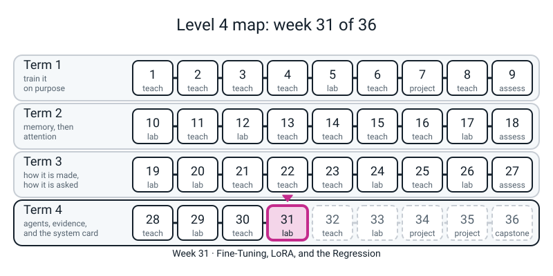
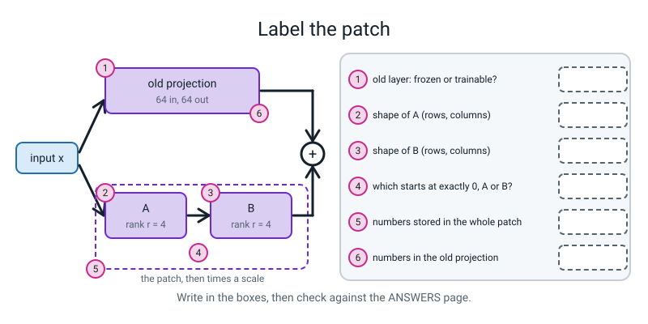
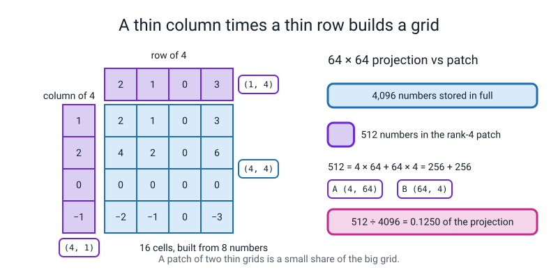
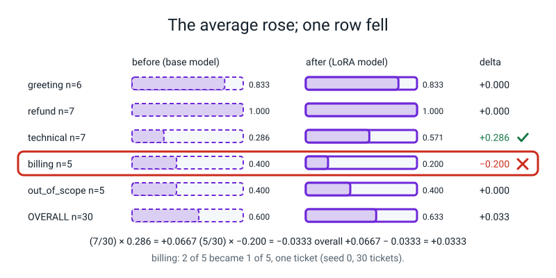

# Workbook — Week 31: Fine-Tuning, LoRA, and the Regression

**Name:** ________________________________  **Date:** ______________

[⬅ Week 30](week-30.md) · [📖 Read the chapter first](../student-guide/week-31.md) · [Course Home](../README.md) · [Next ➡](week-32.md)

---



*Figure 31.0 — Week 31 of 36: a lab week in term 4, agents, evidence and the system card.*

---

> **Rules for this workbook.** The new idea this week is **low-rank**: a big grid written as a thin grid times a thin grid. The pen-and-paper pages count numbers and read a table; the computer pages run *your own* model from the chapter. **Write your answer by hand first, then run.** A guess written after the run is not a guess.
>
> **Real numbers.** Every number printed below came from a real run of the code shown, on CPU, with the seeds in the code. Pages 31.1 and 31.3 (the hand part) use **PRACTICE** shapes and tables that are invented for this workbook, so they are **not** your model's numbers and **not** results from any run. By-hand numbers are plain arithmetic.
>
> **Nothing here is a real pretrained model.** Your encoder read template sentences made for this course; it did not learn English. Nothing you measure says anything about a real language model. Week 30's free rules, which this course uses as the baseline, are a scripted stand-in for "what you would ship if you did nothing clever"; they are **not a model**.
>
> **Files you need.** Page 31.1 needs only Python. Pages 31.2 to 31.4 run **in the same Python session as your `week31.py`, straight after it**, because the blocks use its names: `torch`, `nn`, `F`, `copy`, `EVAL`, `X_eval`, `X_train`, `Y_train`, `base`, `rb`, `make_base`, `fit`, `add_lora`, `LoRALinear`, `trainable`, `count`, `predict`, `score` and `compare`. Run from your week folder. Nothing needs the internet.
>
> **Calculator.** Plain arithmetic is enough. Round only the answer.

---

## ✅ Warm-Up (5 min, before anything else, from memory)

This page is for recalling last week's and this chapter's ideas before you open anything. Answer from memory.

1. In pretraining, what is hidden, and what are the labels? ____________________________________________________
2. Which numbers move when you train the **base model**? ______________________  Which stay frozen? ______________________
3. In `LoRALinear`, which of `A` and `B` starts at exactly zero? ______  Why does the patch add nothing at step 0? ____________________________________________________
4. Week 30: a model's average rises. What must you look at before saying it got better? ____________________________________________________

---

## 🧮 Page 31.1 — Counting a Patch, Low-Rank by Hand (25 min · pen, then one check)

This page is for building a low-rank grid by hand and counting the numbers a patch stores. Work A to D on paper, then run the check.

**A. The grid.** A column `(2, 0, 1, -1)` and a row `(1, 3, -2, 0)`. Multiply every column number by every row number.

```text
row 1 (column number  2):   ____   ____   ____   ____
row 2 (column number  0):   ____   ____   ____   ____
row 3 (column number  1):   ____   ____   ____   ____
row 4 (column number -1):   ____   ____   ____   ____
```

Cells in the grid: ______ · Numbers you had to store to build it: ______ · Its rank (how many column-times-row layers): ______

**B. The row test.** *Pick the first row that is not all zeros; is every other row a multiple of it?* Now take the grid above but change the cell in **row 2, column 4** from `0` to `1`. Is every row still a multiple of the first non-zero row? ______  So the rank is now (circle): 1 / 2. Can you still build it from one column and one row? ______

**C. The counting rule.** A patch for a projection with `in` inputs and `out` outputs, at rank `r`, stores `r × in + out × r` numbers. The whole projection stores `in × out`.

| in | out | r | patch = `r × in + out × r` | whole = `in × out` | patch ÷ whole |
|:-:|:-:|:-:|:-:|:-:|:-:|
| 64 | 64 | 2 | ________ | ________ | ________ |
| 64 | 64 | 8 | ________ | ________ | ________ |
| 32 | 96 | 4 | ________ | ________ | ________ |
| 100 | 100 | 5 | ________ | ________ | ________ |

**D. Your model's projection: 64 × 64 = 4,096.**

| r | 1 | 2 | 4 | 8 | 16 | 32 | 64 |
|:-:|:-:|:-:|:-:|:-:|:-:|:-:|:-:|
| patch | ______ | ______ | ______ | ______ | ______ | ______ | ______ |
| share of 4,096 | ______ | ______ | ______ | ______ | ______ | ______ | ______ |

At what rank does the patch stop saving anything? `r =` ______ . Say why in one line (hint: `2rd` against `d²`). ____________________________________________________

**Label the parts of a rank-4 patch beside a 64 × 64 projection: write in all six boxes of Figure 31.5.**


*Figure 31.5 — Blank: the patch beside one projection, to be labelled with shapes and counts.*

Now run the check below. It uses only lists and loops.

```python
# check311.py - Page 31.1: every hand answer, computed. PRACTICE shapes (not your model's).
for n_in, n_out, r in [(64, 64, 2), (64, 64, 8), (32, 96, 4), (100, 100, 5)]:
    patch = r * n_in + n_out * r
    whole = n_in * n_out
    print(f"in {n_in:3d} out {n_out:3d} r {r}: patch {patch:5d}  whole {whole:6d}  share {patch / whole:.4f}")

print()
print("your model: one 64 x 64 projection, whole =", 64 * 64)
for r in [1, 2, 4, 8, 16, 32, 64]:
    patch = r * 64 + 64 * r
    print(f"  r = {r:2d}   patch {patch:5d}   share {patch / 4096:.4f}")

print()
col = [2, 0, 1, -1]
row = [1, 3, -2, 0]
for c in col:
    print([c * x for x in row])
```

```text
in  64 out  64 r 2: patch   256  whole   4096  share 0.0625
in  64 out  64 r 8: patch  1024  whole   4096  share 0.2500
in  32 out  96 r 4: patch   512  whole   3072  share 0.1667
in 100 out 100 r 5: patch  1000  whole  10000  share 0.1000

your model: one 64 x 64 projection, whole = 4096
  r =  1   patch   128   share 0.0312
  r =  2   patch   256   share 0.0625
  r =  4   patch   512   share 0.1250
  r =  8   patch  1024   share 0.2500
  r = 16   patch  2048   share 0.5000
  r = 32   patch  4096   share 1.0000
  r = 64   patch  8192   share 2.0000

[2, 6, -4, 0]
[0, 0, 0, 0]
[1, 3, -2, 0]
[-1, -3, 2, 0]
```

Mark your answers in the other colour. Every mistake goes in the Bug Log (Page 31.6), with the reason.


*Figure 31.1 — A grid built from one column and one row stores 8 numbers for 16 cells, so a rank-4 patch is 0.1250 of the projection.*

---

## 🧮 Page 31.2 — Your Model's Percentage, and Step 0 (20 min · pen, then computer)

This page is for counting your own model's trainable numbers by hand, then checking the count and the patch's starting behaviour on the computer.

Your encoder has **121,152** numbers. The head is `64 × 5 + 5 =` ______ numbers. `LoRALinear` patches `q` and `v` in each of the **two** Blocks: **four** patches.

**A. By hand, at r = 8** (one patch is `1,024`, from Page 31.1):

- Numbers in the four patches: ______ · plus the head: ______ = **trainable** ______
- All numbers in the model: `121,152 +` ______ `+` ______ `=` ______
- Trainable percentage = trainable ÷ all × 100 = ______ %

**B. By hand, at r = 2** (one patch is `256`):

- Trainable: ______ · All: ______ · Percentage: ______ %

**C. Predict.** At step 0 the patched model is run on the 30 eval tickets and compared with the base model. The biggest difference between their outputs will be: ______ . (A number, not "small".) Would your answer change if `r` were 2 or 8? ______

Now run the check for this page.

```python
# check312.py - Page 31.2: the trainable percentage at r = 2 and r = 8, and the step-0 check at r = 8.
# Run in the same session as week31.py (it needs base, add_lora, trainable, count, X_eval).
for r in [2, 8]:
    m = add_lora(copy.deepcopy(base), r=r, alpha=2 * r)
    with torch.no_grad():
        gap = (m(X_eval) - base(X_eval)).abs().max().item()
    print(f"r = {r}: trainable {trainable(m)} of {count(m)} = {100 * trainable(m) / count(m):.2f}%   step-0 gap {gap}")
```

```text
r = 2: trainable 1349 of 122501 = 1.10%   step-0 gap 0.0
r = 8: trainable 4421 of 125573 = 3.52%   step-0 gap 0.0
```

Compare with Parts A to C. If your hand percentage is slightly off, which did you forget: the head, or a patch? ____________________

**D. One sentence.** The check must print `0.0` and not "small" because ____________________________________________________________________________

---

## 🧮 Page 31.3 — Reading a Table Honestly (35 min · pen, then computer)

This page is for reading a before-and-after table by category, first on an invented table, then on your own run.

**A. By hand, on a PRACTICE table.** These counts are **invented** for this page. They are not a run of anything. Fill the blanks. "Tickets" is after-right minus before-right. "Contribution" is `delta × n / 30`.

| Category | n | Before (right) | After (right) | Delta | Tickets | Contribution |
|---|:-:|:-:|:-:|:-:|:-:|:-:|
| greeting | 6 | 5 | 6 | ______ | ______ | ______ |
| refund | 7 | 6 | 6 | ______ | ______ | ______ |
| technical | 7 | 3 | 4 | ______ | ______ | ______ |
| billing | 5 | 1 | 0 | ______ | ______ | ______ |
| out_of_scope | 5 | 4 | 3 | ______ | ______ | ______ |
| **overall** | 30 | ______ | ______ | ______ | ______ | ______ |

- Which rows would Week 30's `compare` flag (drop of 0.10 or more on `n ≥ 5`)? ______________________
- Overall moved by ______ . Is "nothing changed" a true sentence about this table? ______ Why? ____________________________________________________

Run this block to check your hand work on the PRACTICE table.

```python
# check313.py - Page 31.3 hand part: deltas, tickets and contributions for the PRACTICE table (invented numbers, not a run).
names = ["greeting", "refund", "technical", "billing", "out_of_scope"]
n = [6, 7, 7, 5, 5]
before = [5, 6, 3, 1, 4]
after = [6, 6, 4, 0, 3]
for i in range(5):
    d = after[i] / n[i] - before[i] / n[i]
    print(f"{names[i]:13s} {before[i]}/{n[i]} -> {after[i]}/{n[i]}  delta {d:+.3f}  tickets {after[i] - before[i]:+d}  contribution {d * n[i] / 30:+.4f}")
print("overall:", sum(before), "->", sum(after), f" {sum(before) / 30:.3f} -> {sum(after) / 30:.3f}")
```

```text
greeting      5/6 -> 6/6  delta +0.167  tickets +1  contribution +0.0333
refund        6/7 -> 6/7  delta +0.000  tickets +0  contribution +0.0000
technical     3/7 -> 4/7  delta +0.143  tickets +1  contribution +0.0333
billing       1/5 -> 0/5  delta -0.200  tickets -1  contribution -0.0333
out_of_scope  4/5 -> 3/5  delta -0.200  tickets -1  contribution -0.0333
overall: 19 -> 19  0.633 -> 0.633
```

**B. Your own run, seed 1 (not seed 0).** Seed 1 gives a different head and different batches, so a different table from the one in the chapter. The extra `torch.manual_seed(201)` fixes the patch's random start too, so your numbers should match ours.

**Predict first:** overall for the base ______ / 30; overall for the LoRA model ______ / 30; will a category be flagged? ______ Which? ______

Run this block to train the second-seed base and LoRA models and print the comparison.

```python
# table31.py - Page 31.3: base -> LoRA on seed 1 (not 0). Needs make_base, fit, add_lora, score, predict, compare.
b1 = make_base(1)
b1.enc.requires_grad_(False)
fit(b1, steps=100, lr=3e-3, seed=1)
rb1 = score(predict(b1), "base, seed 1")

torch.manual_seed(201)                             # A starts random: fix that start too
l1 = add_lora(copy.deepcopy(b1))
fit(l1, steps=100, lr=3e-3, seed=101)
rl1 = score(predict(l1), "LoRA, seed 1")
print(f"{rb1['name']}: {rb1['correct']}/30   {rl1['name']}: {rl1['correct']}/30")
compare(rb1, rl1)
```

```text
base, seed 1: 15/30   LoRA, seed 1: 18/30

category         n   before    after    delta
----------------------------------------------
greeting         6    0.667    0.833   +0.167
refund           7    0.857    1.000   +0.143
technical        7    0.286    0.429   +0.143
billing          5    0.000    0.200   +0.200
out_of_scope     5    0.600    0.400   -0.200  <-- REGRESSION
----------------------------------------------
OVERALL         30    0.500    0.600   +0.100

contribution of each category to the overall delta:
  greeting       (n/N = 6/30) x +0.167 = +0.0333
  refund         (n/N = 7/30) x +0.143 = +0.0333
  technical      (n/N = 7/30) x +0.143 = +0.0333
  billing        (n/N = 5/30) x +0.200 = +0.0333
  out_of_scope   (n/N = 5/30) x -0.200 = -0.0333

1 REGRESSION(S) - do not ship on the average alone:
   out_of_scope: 0.600 -> 0.400 (-20.0% on n=5)
```

Fill in from your run:

| Category | n | Base | LoRA | Delta | Tickets moved (net) |
|---|:-:|:-:|:-:|:-:|:-:|
| greeting | 6 | ______ | ______ | ______ | ______ |
| refund | 7 | ______ | ______ | ______ | ______ |
| technical | 7 | ______ | ______ | ______ | ______ |
| billing | 5 | ______ | ______ | ______ | ______ |
| out_of_scope | 5 | ______ | ______ | ______ | ______ |
| **overall** | 30 | ______ | ______ | ______ | ______ |

**C. Which tickets?** A net count hides movement inside a row. Run this block, which prints every ticket whose prediction changed, and list what you see.

```python
# flips31.py - Page 31.3: which tickets changed between the seed-1 base and the seed-1 LoRA model.
pb1, pl1 = predict(b1), predict(l1)
moved = 0
for (text, gold), a, b in zip(EVAL, pb1, pl1):
    if a != b:
        moved += 1
        verdict = "fixed" if b == gold else "BROKEN" if a == gold else "still wrong"
        print(f"{gold:12s} base {a:12s} -> lora {b:12s} {verdict}   {text!r}")
print("tickets whose prediction changed:", moved)
```

```text
greeting     base refund       -> lora greeting     fixed   'hey! quick one for you'
greeting     base technical    -> lora billing      still wrong   'hello - first time using this'
refund       base billing      -> lora refund       fixed   'cancel order 7781 and put the money back on my card'
technical    base out_of_scope -> lora technical    fixed   'clicking save does absolutely nothing'
technical    base refund       -> lora billing      still wrong   'my csv download has headers but no rows'
billing      base refund       -> lora technical    still wrong   'took the money twice on the 3rd'
billing      base out_of_scope -> lora billing      fixed   'need a proper tax invoice for accounting'
out_of_scope base out_of_scope -> lora billing      BROKEN   'how tall is Mount Kilimanjaro?'
tickets whose prediction changed: 8
```

- Fixed: ______ · Broken: ______ · Still wrong (changed, but not to the right label): ______ · Net: ______
- The flagged row is one ticket on five. Is that a verdict or a tripwire? ______ What is the next thing you look at? ____________________________________________________
- Does this table agree with the seed-0 table in the chapter (overall +1 ticket, billing down one)? ______ What do the two tables together tell you about trusting one seed? ____________________________________________________________________
- Week 30's free rules scored **25 of 30**. What do you ship? ______ Why? ____________________________________________________

*Stand-in note.* This is the toy encoder on 64 template tickets; the comparison says nothing about a real pretrained model.


*Figure 31.2 — The overall score rose by 0.0333 while billing fell by one ticket: read the rows before you read the average.*

---

## 🐞 Page 31.4 — Break It on Purpose (three bugs · 30 min)

This page is for three deliberately broken blocks. For each, write your expectation first, then run it.

Each block is **DELIBERATE**. Before you run it, write what you expect, and what one printed line would catch it. Two are **silent**: nothing crashes and the numbers look fine. Run them after Page 31.3 (they use `b1`, `l1` and `rb1`).

### 31.4-A (SILENT) — the parameter list made too early

**Expect:** the patch trains / the patch does not train. Circle one. What line will show it? ____________________

Run this deliberately broken block.

```python
# DELIBERATE BUG 31.4-A (SILENT): the parameter list is made before the patch exists, so the patch never trains.
def fit_too_early(model, steps, lr, seed):
    params = [p for p in model.parameters() if p.requires_grad]
    model = add_lora(model)
    opt = torch.optim.AdamW(params, lr=lr)
    torch.manual_seed(seed)
    model.train()
    for _ in range(steps):
        pick = torch.randperm(len(X_train))[:16]
        loss = F.cross_entropy(model(X_train[pick]), Y_train[pick])
        opt.zero_grad()
        loss.backward()
        opt.step()
    return model


stuck = fit_too_early(copy.deepcopy(b1), 100, 3e-3, 101)
print("biggest |B| after 100 steps, this version: ", stuck.enc.blocks[0].q.B.abs().max().item())
print("biggest |B| after 100 steps, Page 31.3 run:", round(l1.enc.blocks[0].q.B.abs().max().item(), 4))
```

```text
biggest |B| after 100 steps, this version:  0.0
biggest |B| after 100 steps, Page 31.3 run: 0.2126
```

What is the rule for the order of three things? First ______ , then ______ , then ______ . Write the fix in one line: ____________________________________________________

### 31.4-B (SILENT) — no `deepcopy`

**Expect:** will the "before" and "after" scores be equal or different? ______ Will `compare` flag anything? ______

Run this deliberately broken block.

```python
# DELIBERATE BUG 31.4-B (SILENT): no deepcopy, so the "before" model and the "after" model are one object.
b2 = make_base(1)
b2.enc.requires_grad_(False)
fit(b2, steps=100, lr=3e-3, seed=1)
alias = add_lora(b2)                                   # the bug: should be add_lora(copy.deepcopy(b2))
fit(alias, steps=100, lr=3e-3, seed=101)
print("alias is b2?", alias is b2)
r_b2 = score(predict(b2), "before")
r_alias = score(predict(alias), "after")
print(f"'before' {r_b2['correct']}/30   'after' {r_alias['correct']}/30   (the real base scored {rb1['correct']}/30)")
```

```text
alias is b2? True
'before' 18/30   'after' 18/30   (the real base scored 15/30)
```

Two things are wrong, not one. (1) ____________________________________ (2) ____________________________________ Which single line would have caught both? ____________________

### 31.4-C (loud) — the thin grid built the wrong way round

**Expect:** an error or a quiet wrong answer? ______ Read the traceback **from the bottom**.

Run this deliberately broken block.

```python
# DELIBERATE BUG 31.4-C (loud): A is built the wrong way round, (in, r) instead of (r, in).
class WrongA(LoRALinear):
    def __init__(self, base, r=4, alpha=8):
        super().__init__(base, r, alpha)
        self.A = nn.Parameter(torch.zeros(base.in_features, r))     # the bug: should be (r, in_features)


wrong = WrongA(nn.Linear(64, 64, bias=False))
wrong(torch.randn(3, 16, 64))
```

```text
Traceback (most recent call last):
  ...                                   (middle lines shortened; your paths will differ)
RuntimeError: mat1 and mat2 shapes cannot be multiplied (48x64 and 4x64)
```

`48` is `3 × 16` (batch times length, flattened). Which two shapes failed to multiply? ______ and ______ . Which is `A.T` here, and what shape does `x @ A.T` need `A.T` to have? ____________________ Write the fixed line: ____________________________________________________

---

## 📓 Page 31.5 — Stop and Think (10 min · pen only)

This page is for questions that need a sentence, not a calculation. Answer on paper.

1. The LoRA model has **123,525** numbers, more than the encoder's 121,152. So what exactly did LoRA make smaller? ____________________________________________________________________________
2. If `A` and `B` both started at zero, neither could ever move. Why? (One clause: what multiplies what in the gradient.) ____________________________________________________
3. Overall rises by one ticket and one category falls by one ticket. Write the sentence that is true. ____________________________________________________________________________
4. A row reads `+0.000`. Could tickets have changed inside it? Give an example of how (fixed and broken tickets in one row). ____________________________________________________
5. You are tempted to change the learning rate "until out_of_scope recovers". Which earlier week's sin is that? ____________________

---

## 📓 Page 31.6 — The Bug Log

This page is for recording every mistake from this week, with the check that caught it and the rule you will keep.

| # | What went wrong (your words) | Loud or silent? | The one line or check that caught it | The rule I will keep |
|:-:|---|:-:|---|---|
| 1 | | | | |
| 2 | | | | |
| 3 | | | | |
| 4 | | | | |

Checks to keep: **step 0 equals the base (`0.0`) · trainable count against my hand count · `lora is base` is `False` · biggest `|B|` after training is not `0.0` · a base weight did not move · the table by category, with tickets.**

Then write this sentence in your own handwriting, with your own numbers:

> "LoRA trained ______ of ______ numbers (______ %) and got ______ of 30; the average moved by ______ ticket(s) while ______ moved by ______; one ticket on five is a reason to look and not a verdict; and the free rules still score ______."

---

## 🧠 Self-Check (from memory, no notes)

This section is for ticking only what you can do without notes.

- [ ] I can build a rank-1 grid from a column and a row, and say what rank means.
- [ ] I can count a patch with `r × in + out × r` and say where it stops saving.
- [ ] I can state the trainable percentage of my model and name what is in the top and bottom of the fraction.
- [ ] I can say why `B` starts at zero and `A` does not.
- [ ] I can list three checks that catch three different silent bugs.
- [ ] I can say how many tickets a flagged row is, and why one seed cannot settle it.

---

## ✂️ ANSWERS - keep this page folded until you have finished

This page is for checking your work after you have written every answer.

### Warm-Up
1. Some words in the text are hidden (about 20%) and the model guesses them; there are **no labels** (the text itself is the answer).
2. Base model: only the new head trains; the encoder is frozen.
3. `B` starts at zero. The patch is `x @ A.T @ B.T`, so with `B = 0` it adds exactly zero.
4. The table by category (and how many tickets each change is).

### Page 31.1
- **A.** Rows: `[2, 6, -4, 0]`, `[0, 0, 0, 0]`, `[1, 3, -2, 0]`, `[-1, -3, 2, 0]`. 16 cells, 8 numbers stored, rank 1.
- **B.** With row 2, column 4 changed to `1`, row 2 is `[0, 0, 0, 1]`, not a multiple of row 1 (`[2, 6, -4, 0]`): rank **2**, so no, it cannot be built from one column and one row.
- **C.** `256 / 4096 = 0.0625`; `1024 / 4096 = 0.25`; `512 / 3072 = 0.1667` (`4 × 32 + 96 × 4 = 128 + 384`); `1000 / 10000 = 0.1`.
- **D.** Patches `128, 256, 512, 1024, 2048, 4096, 8192`; shares `0.0312, 0.0625, 0.125, 0.25, 0.5, 1.0, 2.0`. The patch stops saving at **r = 32** (half of 64): `2rd = d²` when `r = d/2`; past it the patch is bigger than the grid it corrects.
- **Figure 31.5 (blank).** (1) The old projection is **frozen**: it takes part in every forward pass but does not move. (2) `A` is `(4, 64)`: `r` rows by `in` columns. (3) `B` is `(64, 4)`: `out` rows by `r` columns. (4) **`B`** starts at exactly zero (`A` starts small and random). (5) The patch stores `256 + 256 =` **512** numbers. (6) The old projection stores `64 × 64 =` **4,096**; `512 / 4096 = 0.125`.

### Page 31.2
- Head: `64 × 5 + 5 = 325`.
- **A.** `4 × 1,024 = 4,096`; plus `325` = **4,421**. All: `121,152 + 325 + 4,096 = 125,573`. `4,421 / 125,573 = 3.52%`.
- **B.** `4 × 256 = 1,024`; plus `325` = **1,349**. All: `121,152 + 325 + 1,024 = 122,501`. **1.10%**.
- Forgetting the head gives `4,096 / 125,573 = 3.26%` (r = 8), half right. Forgetting that there are four patches (counting one or two) is the other usual slip.
- **C.** Exactly `0.0`, and no, it does not change with `r`: `B` is zero whatever the rank.
- **D.** Any variant of: "the patch is defined to add nothing, so any non-zero gap means the model is not the thing I am claiming to compare against; `small` cannot tell a rounding error from a wrong start (Bug D1 of the chapter: `0.027`)."

### Page 31.3
- **A.** Deltas `+0.167, +0.000, +0.143, -0.200, -0.200`; tickets `+1, 0, +1, -1, -1`; contributions `+0.0333, 0, +0.0333, -0.0333, -0.0333`; overall `19 → 19`, delta `0.000`, tickets `0`, contribution sum `0`. Flagged: **billing and out_of_scope** (each `-0.200` on `n = 5`). "Nothing changed" is false: the average is identical while two categories lost a ticket each and two gained; the average hid it.
- **B.** The printed table above; tickets moved (net) are greeting `+1`, refund `+1`, technical `+1`, billing `+1`, out_of_scope `-1`, overall `+3`. Base 15/30, LoRA 18/30 (your predictions may differ; that is the point of writing them).
- **C.** Fixed **4** (hey! quick one, cancel order 7781, clicking save, tax invoice), broken **1** (Kilimanjaro), still wrong **3**; changed in all **8**. Net `+4 - 1 = +3`, which matches the overall `+0.100`. The flagged row is **one ticket on five: a tripwire, not a verdict.** Next look at which ticket (`'how tall is Mount Kilimanjaro?'` now predicted `billing`) and at other seeds.
- Compared with seed 0 (overall `+1`, billing `-1`): **no, different** (+3, and a different category flagged). Together they say one seed tells you how one run went, not what LoRA does; the flagged category moves from seed to seed (the chapter's six-seed run flags some category in five of the six seeds). Ship the **rules** (25/30 against 18/30 here): a model that does not beat the free baseline is not shipped.

### Page 31.4
- **A.** The patch does **not** train: biggest `|B|` is `0.0` against `0.2126` in the honest run. Order: **build the whole model first, then collect the parameters, then make the optimiser.** Fix: move `model = add_lora(model)` above the `params = [...]` line. Catch: print `len(params)` against the trainable count, or the biggest `|B|`.
- **B.** `alias is b2?` is `True`, so "before" and "after" are one object and both read 18/30; every delta would be `+0.000` and `compare` would print the tick ("no category dropped"). (1) the before and the after are the same model, so the table compares a model with itself; (2) the "before" is wrong, as the real base was 15/30 (the fitting moved it). One line that catches both: `print(alias is b2)` (must be `False`), and score the base **before** patching. Fix: `add_lora(copy.deepcopy(b2))`.
- **C.** Loud. It fails on `(48x64)` and `(4x64)`. `A` was built `(64, 4)`, so `A.T` is `(4, 64)`; `x @ A.T` needs `A.T` to be `(in, r) = (64, 4)`, so `A` has to be `(r, in) = (4, 64)`. Fix: `torch.zeros(r, base.in_features)` (just delete the override).

### Page 31.5
1. The **trainable** numbers: 2,373 of 123,525 at r = 4 (1.92%); the model itself got bigger.
2. The gradient of `A` is multiplied by `B`, and the gradient of `B` by `A`; if both are zero, both gradients are zero, and nothing moves.
3. "Overall rose by one ticket while one category lost a ticket (one ticket on five), so the average alone would have hidden a loss."
4. Yes: if one ticket is fixed and another is broken in the same row, the count is unchanged and the row prints `+0.000`.
5. Tuning on the test set (Week 30), at small size.

### Page 31.6 and Self-Check
Your words, your numbers. Check that the sentence uses your own run: for the chapter's seed-0 run it reads *2,373 of 123,525 numbers (1.92%) and got 19 of 30; the average moved by one ticket while billing lost one; ... the free rules still score 25 of 30.* If a tick is not earned, go back to the page that trains it: low-rank (31.1), the percentage (31.2), the table (31.3), the three checks (31.4).
