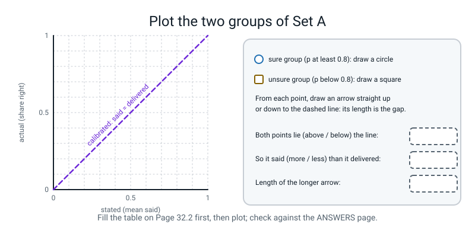

# Workbook — Week 32: The Proxy Is Not the Goal: Calibration and Abstention

**Name:** ________________________________  **Date:** ______________

[⬅ Week 31](week-31.md) · [📖 Read the chapter first](../student-guide/week-32.md) · [Course Home](../README.md) · [Next ➡](week-33.md)

---


*Figure 32.0 — Week 32 of 36: a teach week in term 4, agents, evidence and the system card.*

---

> **Rules for this workbook.** The new idea this week is **the calibration gap**: how far a stated probability is from how often it came true. **Brier** squares each result's gap; **ECE** compares "said" with "delivered" bucket by bucket. The pen-and-paper pages do both on **ten** results; the computer pages do them on the **forty** you typed. **Write your answer by hand first, then run.** A guess written after the run is not a guess.
>
> **The 40 results are invented.** Your teacher wrote the sheet you typed in the chapter to have a shape worth measuring. It is **not the output of any model.** It stands in for the log of a support-ticket classifier that says its top label and how sure it is. **Nothing you measure on it says anything about a real model.** What you take away is a *method*: the table, the threshold, the per-category check.
>
> **Real numbers.** Every number printed below came from a real run of the code shown, on CPU. **Nothing in this week is random**: the sheet is typed, so your numbers should match these exactly. Page 32.3 Part A uses a **PRACTICE** table that is invented for this workbook; it is not your sheet and not the result of any run. By-hand numbers are plain arithmetic.
>
> **Files you need.** Pages 32.1 and 32.2 need pen and paper, plus Python for one check each. Pages 32.3 and 32.4 run **in the same Python session as your `week32.py`, straight after it**, because the blocks use its names: `np`, `RESULTS`, `cat`, `conf`, `right`, `edges`, `reliability`, `ece_of` and `brier`. Run from your week folder. Nothing needs the internet.
>
> **Calculator.** Plain arithmetic is enough. Four decimals while you work, round only the answer.

---

## ✅ Warm-Up (5 min, before anything else, from memory)

This page checks what you remember from the previous week and the chapter. Answer from memory, then check in the Answers.

1. A system says "80% sure" on 100 questions and is right on 55. Is it calibrated, overconfident or underconfident? ______________________
2. Which costs more in Brier: being sure and wrong, or being sure and right? ______________________  Roughly how many times more? ______________________
3. Week 31: a model's average rises. What must you look at before saying it got better? ____________________________________________________
4. `np.digitize(values, edges)` numbers the buckets starting from which number? ______  Which bucket does a value *exactly on* an edge go to, the lower or the upper? ______________________

---

## 🧮 Page 32.1 — Brier by Hand: Square the Gap (25 min · pen, then one check)

This page is for computing Brier by hand on ten results, so that you know what each number in the score is made of.

Brier is the **mean of `(p - y)²`**, where `p` is how sure the system said it was (0 to 1) and `y` is `1` if it was right, `0` if it was wrong.

**A. Ten results.** These are `RESULTS[0::4]` (every fourth row, starting at the first), as printed by your Section 3 block. Fill in the gap `p - y` (keep its sign) and the square.

| # | category | said `p` | right `y` | `p - y` | `(p - y)²` |
|:-:|---|:-:|:-:|:-:|:-:|
| 1 | greeting | 0.97 | 1 | ________ | ________ |
| 2 | greeting | 0.91 | 1 | ________ | ________ |
| 3 | refund | 0.93 | 1 | ________ | ________ |
| 4 | refund | 0.72 | 0 | ________ | ________ |
| 5 | technical | 0.81 | 1 | ________ | ________ |
| 6 | technical | 0.63 | 0 | ________ | ________ |
| 7 | billing | 0.96 | 0 | ________ | ________ |
| 8 | billing | 0.87 | 1 | ________ | ________ |
| 9 | out_of_scope | 0.91 | 1 | ________ | ________ |
| 10 | out_of_scope | 0.69 | 0 | ________ | ________ |

Sum of the ten squares: ____________ · Brier = sum ÷ 10 = ____________

Circle the most expensive row. Its square is ____________ , which is ______ % of the sum. One sentence: why does that one row cost so much?
____________________________________________________________________________

**B. A table of costs.** Fill in `(p - y)²` for each. No set is needed, only the two numbers.

| said `p` | outcome `y` | cost |
|:-:|:-:|:-:|
| 0.99 | 0 (wrong) | ________ |
| 0.60 | 0 (wrong) | ________ |
| 0.50 | 0 (wrong) | ________ |
| 0.50 | 1 (right) | ________ |
| 0.90 | 1 (right) | ________ |
| 0.70 | 1 (right) | ________ |
| 0.30 | 0 (wrong) | ________ |

What cost does a system pay on *every* result if it says `0.5` whatever happens? ______ . So a Brier score of `0.25` means: ____________________________________________________

**C. A second set (homework).** These are `RESULTS[1::4]` (every fourth row, starting at the **second**). Do the whole of Part A again, but write only the squares.

| # | category | said `p` | right `y` | `(p - y)²` |
|:-:|---|:-:|:-:|:-:|
| 1 | greeting | 0.95 | 1 | ________ |
| 2 | greeting | 0.85 | 1 | ________ |
| 3 | refund | 0.89 | 1 | ________ |
| 4 | refund | 0.66 | 1 | ________ |
| 5 | technical | 0.76 | 1 | ________ |
| 6 | technical | 0.59 | 1 | ________ |
| 7 | billing | 0.94 | 1 | ________ |
| 8 | billing | 0.83 | 0 | ________ |
| 9 | out_of_scope | 0.86 | 0 | ________ |
| 10 | out_of_scope | 0.61 | 1 | ________ |

Sum: ____________ · Brier: ____________ · The two sets of ten give different Briers. Which one would you believe about the whole sheet, and why? ____________________________________________________

Now run the check. The next block prints the squares for both sets and the practice costs; run it after `week32.py`.

```python
# check321.py - Page 32.1: the ten squared gaps for both sets of ten, and the practice costs. Needs RESULTS from week32.py.
for label, start in [("set A, RESULTS[0::4]", 0), ("set B, RESULTS[1::4]", 1)]:
    print(label)
    squares = []
    for i, (name, p, y) in enumerate(RESULTS[start::4]):
        sq = (p - y) ** 2
        squares.append(sq)
        print(f"  {i + 1:>2}  {name:<13} said {p:.2f}  right {y}  gap {p - y:+.2f}  square {sq:.4f}")
    print(f"  sum {sum(squares):.4f}   Brier {sum(squares) / len(squares):.4f}   most expensive {max(squares):.4f} = {100 * max(squares) / sum(squares):.0f}% of the sum")

print()
print("practice costs (p - y)^2:")
for p, y in [(0.99, 0), (0.60, 0), (0.50, 0), (0.50, 1), (0.90, 1), (0.70, 1), (0.30, 0)]:
    print(f"  said {p:.2f}, outcome {y}: {(p - y) ** 2:.4f}")
```

```text
set A, RESULTS[0::4]
   1  greeting      said 0.97  right 1  gap -0.03  square 0.0009
   2  greeting      said 0.91  right 1  gap -0.09  square 0.0081
   3  refund        said 0.93  right 1  gap -0.07  square 0.0049
   4  refund        said 0.72  right 0  gap +0.72  square 0.5184
   5  technical     said 0.81  right 1  gap -0.19  square 0.0361
   6  technical     said 0.63  right 0  gap +0.63  square 0.3969
   7  billing       said 0.96  right 0  gap +0.96  square 0.9216
   8  billing       said 0.87  right 1  gap -0.13  square 0.0169
   9  out_of_scope  said 0.91  right 1  gap -0.09  square 0.0081
  10  out_of_scope  said 0.69  right 0  gap +0.69  square 0.4761
  sum 2.3880   Brier 0.2388   most expensive 0.9216 = 39% of the sum
set B, RESULTS[1::4]
   1  greeting      said 0.95  right 1  gap -0.05  square 0.0025
   2  greeting      said 0.85  right 1  gap -0.15  square 0.0225
   3  refund        said 0.89  right 1  gap -0.11  square 0.0121
   4  refund        said 0.66  right 1  gap -0.34  square 0.1156
   5  technical     said 0.76  right 1  gap -0.24  square 0.0576
   6  technical     said 0.59  right 1  gap -0.41  square 0.1681
   7  billing       said 0.94  right 1  gap -0.06  square 0.0036
   8  billing       said 0.83  right 0  gap +0.83  square 0.6889
   9  out_of_scope  said 0.86  right 0  gap +0.86  square 0.7396
  10  out_of_scope  said 0.61  right 1  gap -0.39  square 0.1521
  sum 1.9626   Brier 0.1963   most expensive 0.7396 = 38% of the sum

practice costs (p - y)^2:
  said 0.99, outcome 0: 0.9801
  said 0.60, outcome 0: 0.3600
  said 0.50, outcome 0: 0.2500
  said 0.50, outcome 1: 0.2500
  said 0.90, outcome 1: 0.0100
  said 0.70, outcome 1: 0.0900
  said 0.30, outcome 0: 0.0900
```

Did your hand sum match to two decimals? If not, which row did you add wrongly? ______ . Was your "most expensive row" in set B the one you expected? ______

---

## 🧮 Page 32.2 — ECE by Hand, and the Bucket Helpers (30 min · pen, then one check)

This page is for building ECE by hand with two buckets, then practising the two numpy helpers that make buckets, `np.digitize` and `np.bincount`.

ECE in two buckets: `ECE = (n_sure / 10) × gap_sure + (n_unsure / 10) × gap_unsure`. **Sure** means `p` at least 0.8. **Unsure** means below 0.8. A **gap** is the size of `stated - actual` (drop the sign).

**A. Set A (`RESULTS[0::4]`, the table of Page 32.1).**

| group | which rows (by #) | n | stated (mean `p`) | actual (share right) | gap |
|---|---|:-:|:-:|:-:|:-:|
| sure (`p ≥ 0.8`) | ________________ | ____ | ________ | ________ | ________ |
| unsure (`p < 0.8`) | ________________ | ____ | ________ | ________ | ________ |

ECE = ______ × ______ + ______ × ______ = ____________

**B. Read it.** In the unsure group, every answer was ______ (right / wrong). Is that what a calibrated system looks like? ______ . The group's stated value is ______ and its actual value is ______ ; with only ______ results in it, is that strong evidence? ____________________________________________________

**Plot the two groups of Set A from your table in Part A, one point each, and draw each gap to the dashed line.**


*Figure 32.5 — Blank: the sure and the unsure group of Set A, to be plotted against the calibrated line.*

**C. Set B (`RESULTS[1::4]`, homework).** Same table, from your Page 32.1 Part C.

| group | n | stated | actual | gap |
|---|:-:|:-:|:-:|:-:|
| sure (`p ≥ 0.8`) | ____ | ________ | ________ | ________ |
| unsure (`p < 0.8`) | ____ | ________ | ________ | ________ |

ECE = ____________ · One sentence: why is this ECE not the same as set A's, and what is unusual about the unsure group here? ____________________________________________________

**D. Buckets, with `np.digitize`.** The edges are `[0.6, 0.7, 0.8, 0.9]`, which make **five** buckets numbered `0` to `4`. Write the bucket number for each value *before* you run.

| value | 0.59 | 0.60 | 0.699 | 0.70 | 0.85 | 0.90 | 0.99 |
|:-:|:-:|:-:|:-:|:-:|:-:|:-:|:-:|
| bucket | ____ | ____ | ____ | ____ | ____ | ____ | ____ |

**E. Counting, with `np.bincount`.** Write the answer of each call before you run.

- `np.bincount([2, 2, 0, 3, 2, 4, 4], minlength=6)` → `[` ____ ____ ____ ____ ____ ____ `]`
- `np.bincount([0, 0, 1], weights=[0.5, 0.7, 0.9], minlength=3)` → `[` ____ ____ ____ `]`

Say what `weights=` does, in your words: ____________________________________________________

Now run the check. The next block prints the two-bucket ECE for both sets and the `np.digitize` and `np.bincount` calls above.

```python
# check322.py - Page 32.2: the two-bucket ECE for both sets of ten, and digitize / bincount on practice lists.
for label, start in [("set A, RESULTS[0::4]", 0), ("set B, RESULTS[1::4]", 1)]:
    ten = RESULTS[start::4]
    p = np.array([row[1] for row in ten])
    y = np.array([row[2] for row in ten], dtype=float)
    hi = p >= 0.8
    gap_hi = abs(p[hi].mean() - y[hi].mean())
    gap_lo = abs(p[~hi].mean() - y[~hi].mean())
    print(label)
    print(f"  sure   n {int(hi.sum())}  stated {p[hi].mean():.4f}  actual {y[hi].mean():.4f}  gap {gap_hi:.4f}")
    print(f"  unsure n {int((~hi).sum())}  stated {p[~hi].mean():.4f}  actual {y[~hi].mean():.4f}  gap {gap_lo:.4f}")
    print(f"  ECE {hi.mean() * gap_hi + (~hi).mean() * gap_lo:.4f}")

print()
print("digitize:", np.digitize([0.59, 0.60, 0.699, 0.70, 0.85, 0.90, 0.99], [0.6, 0.7, 0.8, 0.9]))
print("bincount:", np.bincount([2, 2, 0, 3, 2, 4, 4], minlength=6))
print("weighted:", np.bincount([0, 0, 1], weights=[0.5, 0.7, 0.9], minlength=3))
```

```text
set A, RESULTS[0::4]
  sure   n 7  stated 0.9086  actual 0.8571  gap 0.0514
  unsure n 3  stated 0.6800  actual 0.0000  gap 0.6800
  ECE 0.2400
set B, RESULTS[1::4]
  sure   n 6  stated 0.8867  actual 0.6667  gap 0.2200
  unsure n 4  stated 0.6550  actual 1.0000  gap 0.3450
  ECE 0.2700

digitize: [0 1 1 2 3 4 4]
bincount: [1 0 3 1 2 0]
weighted: [1.2 0.9 0. ]
```

Compare with your hand work. Which of the seven buckets did you get wrong, if any, and which rule did you forget (numbering from 0, or a value on an edge goes up)? ____________________


*Figure 32.1 — In every bucket the system said more than it delivered; ECE is the average size of that gap, weighted by bucket.*

---

## 🧮 Page 32.3 — Thresholds, and Who Fell (40 min · pen, then computer)

This page is for reading a per-category table at a threshold: first on an invented practice table, then on your own sheet.

**A. Read a table by hand (PRACTICE numbers, invented for this page; not your sheet and not a run).** A system answers only when it is sure. Four categories of ten results each.

| category | n | right before | answered | right of the answered |
|---|:-:|:-:|:-:|:-:|
| alpha | 10 | 6 | 4 | 3 |
| beta | 10 | 5 | 2 | 2 |
| gamma | 10 | 4 | 1 | 1 |
| delta | 10 | 7 | 6 | 3 |

| category | before (right ÷ n) | after (right of answered ÷ answered) | change |
|---|:-:|:-:|:-:|
| alpha | ________ | ________ | ________ |
| beta | ________ | ________ | ________ |
| gamma | ________ | ________ | ________ |
| delta | ________ | ________ | ________ |
| **overall** | ________ | ________ | ________ |

- Overall coverage (answered ÷ 40): ________
- Which category **fell** while the overall number rose? ______________________
- Which rows have two answers or fewer and should **not** be read? ______________________
- The overall "after" has ______ answers behind it. If you had to report one sentence, it would start: "Of the ______ questions it answered, ______ were right; it declined ______ of 40."

```python
# check323.py - Page 32.3 hand part: PRACTICE table (invented numbers, not a run). Which category fell, and which rows are too small to read?
PRACTICE = [("alpha", 10, 6, 4, 3), ("beta", 10, 5, 2, 2), ("gamma", 10, 4, 1, 1), ("delta", 10, 7, 6, 3)]   # name, n, right before, answered, right of answered
tot_n = tot_r = tot_a = tot_ra = 0
for name, n, rb, a, ra in PRACTICE:
    before, after = rb / n, ra / a
    note = "FELL" if after < before else ("too few to read" if a <= 2 else "")
    print(f"{name:<6} before {rb}/{n} = {before:.3f}   after {ra}/{a} = {after:.3f}   change {after - before:+.3f}  {note}")
    tot_n += n; tot_r += rb; tot_a += a; tot_ra += ra
print(f"overall before {tot_r}/{tot_n} = {tot_r / tot_n:.3f}   after {tot_ra}/{tot_a} = {tot_ra / tot_a:.3f}   coverage {tot_a / tot_n:.3f}")
```

```text
alpha  before 6/10 = 0.600   after 3/4 = 0.750   change +0.150  
beta   before 5/10 = 0.500   after 2/2 = 1.000   change +0.500  too few to read
gamma  before 4/10 = 0.400   after 1/1 = 1.000   change +0.600  too few to read
delta  before 7/10 = 0.700   after 3/6 = 0.500   change -0.200  FELL
overall before 22/40 = 0.550   after 9/13 = 0.692   coverage 0.325
```

**B. Your sheet, two more thresholds (homework 2).** In Week 32's chapter you read the table at `t = 0.8`. Before you run, use the printed sheet in your `week32.py` to predict:

- At `t = 0.7`, the overall accuracy of the answered will be about ______ on about ______ answered of 40.
- At `t = 0.9`, the overall accuracy of the answered will be about ______ on about ______ answered of 40.
- The category you expect to fall at both thresholds: ______________________
- The category you expect to have the fewest answers at `t = 0.9`: ______________________

```python
# table32.py - Page 32.3: the per-category table at any threshold. Needs cat, conf, right from week32.py.
def by_category(t):
    answered = conf >= t
    print(f"t = {t}: overall {right.mean():.3f} -> {right[answered].mean():.3f}   answered {int(answered.sum())} of {len(conf)}")
    for name in ["greeting", "refund", "technical", "billing", "out_of_scope"]:
        mine = cat == name
        kept = mine & answered
        k = int(kept.sum())
        after = f"{right[kept].mean():.3f}" if k > 0 else "  nan"
        note = ""
        if k > 0 and right[kept].mean() < right[mine].mean():
            note = "  <-- FELL"
        elif k <= 2:
            note = "  (n <= 2: do not read)"
        print(f"  {name:<13} answered {k:>2}  {right[mine].mean():.3f} -> {after}{note}")

for t in [0.7, 0.9]:
    by_category(t)
```

```text
t = 0.7: overall 0.575 -> 0.667   answered 24 of 40
  greeting      answered  6  0.875 -> 1.000
  refund        answered  5  0.625 -> 0.800
  technical     answered  3  0.500 -> 0.667
  billing       answered  6  0.500 -> 0.333  <-- FELL
  out_of_scope  answered  4  0.375 -> 0.500
t = 0.9: overall 0.575 -> 0.700   answered 10 of 40
  greeting      answered  4  0.875 -> 1.000
  refund        answered  1  0.625 -> 1.000  (n <= 2: do not read)
  technical     answered  0  0.500 ->   nan  (n <= 2: do not read)
  billing       answered  4  0.500 -> 0.250  <-- FELL
  out_of_scope  answered  1  0.375 -> 1.000  (n <= 2: do not read)
```

Use the run above to fill in this table:

| t | overall before → after | answered | categories that fell | rows with n ≤ 2 |
|:-:|:-:|:-:|---|---|
| 0.7 | ________ → ________ | ______ | ______________ | ______________ |
| 0.9 | ________ → ________ | ______ | ______________ | ______________ |

The accuracy at `t = 0.9` (`0.700`) is **lower** than at `t = 0.8` (`0.722`, from the chapter). Does "more sure" always mean "more accurate" on this sheet? ____________________________________________________

**C. The four sentences.** Use your own numbers from the chapter and from this page. Write each in full, with its sample size.

1. The top bucket said ______ and was right ______ of the time; ECE is ______ (invented results).
   ____________________________________________________________________________
2. In one line each: what Brier measures, and what ECE measures.
   ____________________________________________________________________________
3. Abstaining below `0.8` moved accuracy of the answered from ______ to ______, but it answered only ______ of 40, and dropped ______ right answers.
   ____________________________________________________________________________
4. The category that fell was ______ , from ______ of ______ to ______ of ______ ; because ____________________________________________________________ ; and since that is ______ results, it is a reason to look and not a verdict.
   ____________________________________________________________________________

**D. One change, and "make the model better" is not allowed.** Write one change you would make to a system like this, and say what it fixes (what the system *says*, or what it *gets right*): ____________________________________________________________________________


*Figure 32.2 — Raising the threshold removes wrong answers by also removing right ones; the curve cannot say where to stop.*

---

## 🐞 Page 32.4 — Break It on Purpose (three bugs · 30 min)

This page is for running three broken blocks and finding the one line or check that catches each.

Each block is **broken on purpose.** Run it in the session of `week32.py`, write what you expected and what you saw, then find the one line that would have caught it. Two of the three are **silent**: nothing fails, and the number looks like a result.

### 32.4-A (loud) — a `bincount` too short

```python
# DELIBERATE BUG 32.4-A (loud): bincount with no minlength. The technical rows never reach 0.9, so the array is too short.
mine = cat == "technical"
counts_t = np.bincount(np.digitize(conf[mine], edges))
print("counts:", counts_t, "  length", len(counts_t))
print("share in the top bucket:", counts_t[4] / counts_t.sum())
```

Expected: ____________________________________________________________  Saw: ____________________________________________________________

```text
counts: [3 2 2 1]   length 4
Traceback (most recent call last):
  File "/home/you/l4/wb_a.py", line 5, in <module>
    print("share in the top bucket:", counts_t[4] / counts_t.sum())
IndexError: index 4 is out of bounds for axis 0 with size 4
```

The array has ______ entries where the table has ______ buckets. The highest `technical` confidence is `0.81`, so bucket ______ is empty and `np.bincount` stops at the ______ number it saw. **Fix:** add `minlength=` ______ . What would have happened to the Page-32.2 table if the error had *not* been loud (hint: `zip` stops at the shorter list)? ____________________________________________________

### 32.4-B (SILENT) — an unweighted ECE

```python
# DELIBERATE BUG 32.4-B (SILENT): ECE as a plain average of the gaps, so a bucket of 3 counts as much as a bucket of 10.
ten_edges = [0.55, 0.6, 0.65, 0.7, 0.75, 0.8, 0.85, 0.9, 0.95]
c10, s10, a10 = reliability(conf, right, ten_edges)
print("bucket sizes:", c10, "  sum", c10.sum())
print("ECE, unweighted:", round(float(np.mean(np.abs(s10 - a10))), 4))
print("ECE, weighted:  ", round(ece_of(c10, s10, a10), 4))
print("weights add to", (c10 / c10.sum()).sum())
```

```text
bucket sizes: [3 6 4 3 3 3 3 5 7 3]   sum 40
ECE, unweighted: 0.2403
ECE, weighted:   0.2123
weights add to 1.0
```

Prediction before you ran: the two ECEs will be (same / different) ______ . Which bucket should count for more, the one of 3 results or the one of 7? ______ . The unweighted number is too (high / low) by ______ . **The check:** the weights `counts / counts.sum()` must add to ______ , and the sizes must add to ______ .

### 32.4-C (SILENT) — chasing the proxy

```python
# DELIBERATE BUG 32.4-C (SILENT): "pick the threshold with the best accuracy". The score being chased is not the goal.
best = None
for t in np.round(np.arange(0.50, 0.981, 0.01), 2):
    answered = conf >= t
    if answered.sum() >= 1:
        acc = right[answered].mean()
        if best is None or acc > best[1]:
            best = (round(float(t), 2), float(acc), int(answered.sum()))
print(f"best threshold {best[0]}: accuracy of answered {best[1]:.3f} on {best[2]} of 40 answers")
```

```text
best threshold 0.97: accuracy of answered 1.000 on 1 of 40 answers
```

Nothing failed. Would you ship a system that answers one question in forty? ______ . Write the sentence that this result is the proof of: ____________________________________________________

**The repair is a decision made in words first.** "I need to answer at least half the questions" means coverage at least `0.5`. Then look:

```python
# The repair for 32.4-C: decide in words first ("answer at least half"), then look. Coverage is printed beside accuracy.
best = None
for t in np.round(np.arange(0.50, 0.981, 0.01), 2):
    answered = conf >= t
    if answered.mean() >= 0.5:
        acc = right[answered].mean()
        if best is None or acc > best[1]:
            best = (round(float(t), 2), float(acc), int(answered.sum()))
print(f"best threshold with coverage >= 0.5: {best[0]}: accuracy of answered {best[1]:.3f} on {best[2]} of 40 answers")
```

```text
best threshold with coverage >= 0.5: 0.75: accuracy of answered 0.762 on 21 of 40 answers
```

This is better, but it still has a small sin. The threshold `0.75` was chosen by looking at the **same 40 results** it is judged on. What would a sound version need? ____________________________________________________  (Hint: Week 30's frozen eval.)

---

## 📓 Page 32.5 — Stop and Think (10 min · pen only)

This page is for answering five questions in writing, pen only, about what the numbers do and do not say.

1. ECE is `0.179` on the forty. Does that mean the system is wrong 17.9% of the time? If not, what does it mean, and how often *is* it wrong? ____________________________________________________
2. A system that says "57.5%" on every question, its own accuracy, has an ECE of exactly `0`. Why is it still no use for deciding which answers to trust? ____________________________________________________
3. Capping every stated confidence at `0.85` lowers ECE without changing one answer. In one sentence, say the difference between "the system stopped overclaiming" and "the system got better". ____________________________________________________
4. Abstaining at `0.8` raised accuracy of the answered. Name the cost in two numbers (how many questions it declined, and how many of those it would have got right). ____________________________________________________
5. Which earlier week's sin is "pick the threshold with the best accuracy"? ______________________ And what is the proxy, and what is the goal, in this week's data? proxy: ______________________ goal: ______________________

---

## 📓 Page 32.6 — The Bug Log

This page is for recording each mistake from this week with the check that would have caught it.

| # | What went wrong (your words) | Loud or silent? | The one line or check that caught it | The rule I will keep |
|:-:|---|:-:|---|---|
| 1 | | | | |
| 2 | | | | |
| 3 | | | | |
| 4 | | | | |

Checks to keep: **bucket counts add to 40 · `minlength` so the array is as long as the table · the weights add to 1 · my numpy Brier and `brier_score_loss(right, conf)` agree, truth first · the number answered printed beside every accuracy · the per-category table, with its `n`.**

Then write this sentence in your own handwriting, with your own numbers:

> "On these invented 40 results the system was more sure than right in every bucket (ECE ______); abstaining below ______ lifted accuracy of the answered from ______ to ______ but answered only ______ of 40; and ______ went the other way, ______ of ______ to ______ of ______, which, on so few rows, is a reason to look and not a verdict."

---

## 🧠 Self-Check (from memory, no notes)

Tick each line only if you can do it without looking anything up.

- [ ] I can compute a Brier score on ten results and say why a sure-and-wrong row costs so much.
- [ ] I can build a two-bucket ECE by hand and say why the buckets are weighted by their size.
- [ ] I can say which bucket number a value goes to in `np.digitize`, and what `minlength=` and `weights=` do in `np.bincount`.
- [ ] I can say why a threshold makes a system quiet, and not good.
- [ ] I can find a category that fell while the average rose, and say how many results were behind it.
- [ ] I can say why "pick the threshold with the best accuracy" is the wrong rule.

---

## ✂️ ANSWERS - keep this page folded until you have finished

### Warm-Up
1. Overconfident: it said 80% and delivered 55%.
2. Sure and wrong costs more: `(0.96 - 0)² = 0.9216` against `(0.97 - 1)² = 0.0009`, roughly **a thousand times** more.
3. The table by category (and how many results are behind each row).
4. From **0** (the "below the first edge" bucket). A value exactly on an edge goes to the **upper** bucket.

### Page 32.1
- **A.** Gaps `-0.03, -0.09, -0.07, +0.72, -0.19, +0.63, +0.96, -0.13, -0.09, +0.69`; squares `0.0009, 0.0081, 0.0049, 0.5184, 0.0361, 0.3969, 0.9216, 0.0169, 0.0081, 0.4761`; sum **2.388**; Brier **0.2388**. Most expensive: billing `0.96`, wrong, `0.9216`, **39%** of the sum. It costs so much because the system was nearly certain and it was wrong, and squaring makes a big gap count for a lot. Accept Brier `0.239 ± 0.001` from two-decimal rounding; the method matters more than the last digit.
- **B.** `0.9801, 0.3600, 0.2500, 0.2500, 0.0100, 0.0900, 0.0900`. Saying `0.5` on everything costs `0.25` on every result whatever happens, so a Brier of `0.25` means "no better than always saying 50-50". (On the forty, the sheet's Brier is `0.2499`.)
- **C.** Squares `0.0025, 0.0225, 0.0121, 0.1156, 0.0576, 0.1681, 0.0036, 0.6889, 0.7396, 0.1521`; sum **1.9626**; Brier **0.1963**. Neither set of ten is "the right one": ten results is for learning the arithmetic. The forty-row Brier (`0.2499`) is the one to believe, and even that is a property of an invented sheet.

### Page 32.2
- **A.** Sure (`p ≥ 0.8`): rows **1, 2, 3, 5, 7, 8, 9**: n = **7**, stated **0.9086**, actual `6/7 =` **0.8571**, gap **0.0514**. Unsure: rows **4, 6, 10**: n = **3**, stated **0.68**, actual **0.0**, gap **0.68**. ECE `= 0.7 × 0.0514 + 0.3 × 0.68 =` **0.24**. Accept `0.24 ± 0.01`.
- **Figure 32.5 (blank).** Plot the sure group at (stated `0.909`, actual `0.857`) as a circle and the unsure group at (`0.68`, `0.0`) as a square. Both lie **below** the dashed line (actual is less than stated), so the system said **more** than it delivered. The arrows are `0.051` (sure) and `0.680` (unsure); the longer one is **0.68**, and it rests on only 3 results.
- **B.** Every unsure answer was **wrong**. No: a calibrated system that said about `0.68` would be right about two times in three. Three results is far too few to be strong evidence; it is a reason to look, not a verdict.
- **C.** Sure: n = **6**, stated **0.8867**, actual `4/6 =` **0.6667**, gap **0.2200**. Unsure: n = **4**, stated **0.6550**, actual **1.0000**, gap **0.3450**. ECE `= 0.6 × 0.22 + 0.4 × 0.345 =` **0.27**. It differs because a different ten results are in it, and here the unsure group was **all right** (the gap goes the *other* way: the system said `0.655` and delivered `1.0`), whereas set A's unsure group was all wrong. The sign of the gap flips between the two sets of ten; ECE takes the size, so both count. Both sets of ten are noisy; the forty-row ECE is `0.1788`.
- **D.** `0, 1, 1, 2, 3, 4, 4`. (`0.60` goes to bucket 1, `0.70` to bucket 2, `0.90` to bucket 4: an edge goes to the **upper** bucket.)
- **E.** `[1 0 3 1 2 0]` (one 0, no 1s, three 2s, one 3, two 4s, no 5s; `minlength=6` keeps the last empty place). Weighted: `[1.2 0.9 0. ]` (`0.5 + 0.7 = 1.2` in bucket 0, `0.9` in bucket 1, nothing in bucket 2). `weights=` adds up a number per item instead of adding ones: counting is adding ones; weights lets you add something else.

### Page 32.3
- **A.** Before `0.600, 0.500, 0.400, 0.700`; after `0.750, 1.000, 1.000, 0.500`; changes `+0.150, +0.500, +0.600, -0.200`; overall before `22/40 = 0.550`, after `9/13 = 0.692`, change `+0.142`. Coverage `13/40 = 0.325`. **Delta fell** while the overall rose. **Beta** (2 answers) and **gamma** (1 answer) should not be read. The sentence: "Of the 13 questions it answered, 9 were right; it declined 27 of 40." (The `+0.500` and `+0.600` are reports of nothing.)
- **B.** Predictions are yours; what counts is that you wrote them first. The run: at `0.7`, `0.575 → 0.667`, **24** answered, billing fell (`0.500 → 0.333`), no row with n ≤ 2. At `0.9`, `0.575 → 0.700`, **10** answered, billing fell (`0.500 → 0.250`), rows with n ≤ 2: refund (1), technical (0, so `nan`), out_of_scope (1). Technical has the fewest answers at `0.9`. No: `0.700` at `0.9` is lower than `0.722` at `0.8`; the curve is not a smooth climb, and at small `n` one result moves it.
- **C.** Model sentences, with your own numbers checked against these. *(1) The top bucket (0.90-1.00) said 0.931 and was right 0.700 of the time; ECE is 0.179, on 40 invented results. (2) Brier squares each result's gap between what it said and what happened (0.2499 overall); ECE compares said with delivered per bucket and weights the bigger buckets more. (3) Abstaining below 0.8 moved accuracy of the answered from 0.575 to 0.722, but it answered only 18 of 40, and dropped 10 right answers. (4) The category that fell was billing, from 4 of 8 to 2 of 6, because its sure answers were its wrong ones and its two right answers were the unsure ones; that is eight invented results, so a reason to look and not a verdict.* Cross-check: of the 22 declined, 12 would have been wrong and 10 right.
- **D.** Any of: cap the stated confidence (ECE `0.1788 → 0.1560`, Brier `0.2499 → 0.2428` at `0.85`, same accuracy); show the retrieval similarity beside the answer; abstain below a threshold chosen on a second set of results. All of these change what the system **says**; none changes what it **gets right**.

### Page 32.4
- **A.** Expected: a count of five buckets and a share. Saw: `IndexError` on `counts_t[4]`. The array has **4** entries where the table has **5** buckets; `technical` tops out at `0.81`, so bucket **4** is empty and `np.bincount` stops at the **largest** number it saw. Fix `minlength=5`. If it had not been loud, `zip` would have stopped at the shorter list and the table would **silently have lost its last row**.
- **B.** The two ECEs differ: unweighted `0.2403`, weighted `0.2123`. The bucket of 7 should count for more. The unweighted number is too **high** by `0.0280`, because the small noisy buckets count as much as the big ones. Weights add to **1.0**, sizes add to **40**. (On the five buckets of the chapter, the gap is small: `0.1763` against `0.1788`, and that is the danger: a small difference hides the bug.)
- **C.** No, you would not ship a system that answers one question in forty. "When a number becomes the target, it stops being a good number": the accuracy of the answered reaches `1.000` on one answer. The repair, with coverage of at least `0.5`, picks `t = 0.75`, `0.762` on 21 of 40. The small sin is that the threshold was chosen on the same forty results it is judged on; a sound version chooses on one set of results and judges on a **second, frozen set** it has not seen (Week 30's frozen eval). We do not have a second set.

### Page 32.5
1. No. ECE is the average size of the gap between what it said and what it delivered (here mostly "said more than delivered": `0.754 - 0.575 = 0.179`). It is wrong **42.5%** of the time (17 of 40).
2. It cannot tell a sure question from an unsure one: it says the same number every time, so it can never say "I don't know" for a good reason. Perfect ECE, Brier `0.2444`, accuracy `0.575`. Calibration alone is not usefulness.
3. Capping changes what the system says, not what it gets right: the accuracy is `0.575` either way. "Stopped overclaiming" is an honest statement about the number; "got better" would need the answers to improve.
4. It declined **22** of 40, and **10** of those it would have got right.
5. Tuning on the test set (Week 30), or chasing a number until it stops meaning anything. Proxy: **accuracy of the answered** (or accuracy). Goal: **a system you can rely on when it sounds sure, that still answers enough questions to be useful.**

### Page 32.6 and Self-Check
Your words, your numbers. Check that the sentence uses your own run: for the chapter's sheet it reads *... more sure than right in every bucket (ECE 0.179); abstaining below 0.8 lifted accuracy of the answered from 0.575 to 0.722 but answered only 18 of 40; and billing went the other way, 4 of 8 to 2 of 6, ... a reason to look and not a verdict.* If a tick is not earned, go back to the page that trains it: Brier (32.1), ECE and the bucket helpers (32.2), thresholds and categories (32.3), the three checks (32.4).
