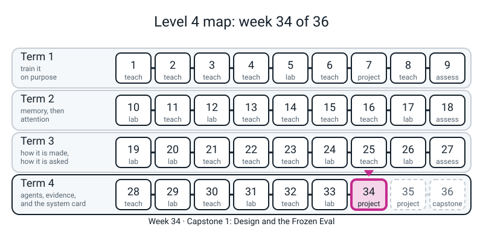
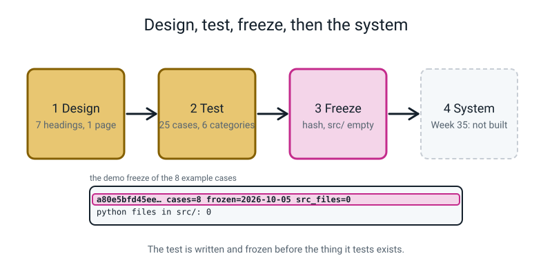
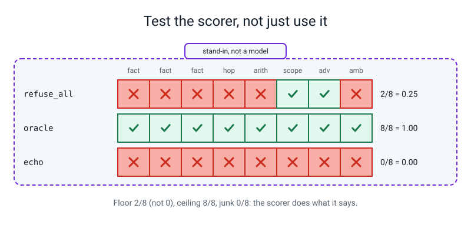

# Workbook — Week 34: Capstone 1, Design and the Frozen Eval

**Name:** ________________________________  **Date:** ______________

[⬅ Week 33](week-33.md) · [📖 Read the chapter first](../student-guide/week-34.md) · [Course Home](../README.md) · [Next ➡](week-35.md)

---

> **Rules for this workbook.** There is **no new maths and no new syntax** this week. The one reuse is Week 33's wobble, `sqrt(n p (1-p))`, used once on the eval itself: a score is a count of passes in `n` cases. Pages 34.1 to 34.3 are **pen first**: write your answer by hand, then run the check. **A guess written after the run is not a guess.**
>
> **Nothing here calls a model.** The only "systems" that appear are numbers typed into a table. Every dollar is a **stand-in dollar** (Week 28's illustrative price table) and every millisecond is a **stand-in millisecond** made up for the exercise. *Stand-in, not a model:* none of it says anything about any real model. What is real is the method: the ranking, the tally, the whole-token scorer, the fingerprint and the headroom.
>
> **Real numbers.** Every number printed below came from running the code shown, on CPU, with nothing random in it (there is no random number in this workbook). Hand-calculation numbers are plain arithmetic. "Leo" and "Asha" are invented people; the tables about them are invented for practice and describe no real project.
>
> **Files you need.** Every "check" block below is **self-contained**: it defines every name it uses, needs only Python 3 and (on Page 34.1) numpy, and can be run from any folder. Pages 34.1 to 34.3 need a pen and a calculator. The last box on Page 34.3 and the Case Card in Part A of 34.2 are about **your own project**; keep the chapter open beside you. Whole workbook at the computer: under 5 seconds.
>
> **Calculator.** Plain arithmetic. Four decimals while you work, round only the answer.

---


*Figure 34.0 — Week 34 is the first of three capstone weeks, the design-and-frozen-eval step at the end of term 4.*

## ✅ Warm-Up (5 min, before anything else, from memory)

1. In which order are the design doc's failure modes written: most *likely* first, or *worst* first? ______________
2. Week 30: what is a fingerprint, and what is it a fingerprint *of*? ____________________________________________________
3. A system that says "I don't know" to every question scores how many of your 25 cases? Write the formula, not a number: ____________________________________________________
4. Week 33: a count of weighted-coin flips strays from `n p` by about ______________ . With `n = 25` and `p = 0.7` is that bigger than 1 or smaller than 1? ______
5. Name one thing the chapter says you may **not** do with your cases once they are frozen, and one thing you **may** do. may not: ______________________ may: ______________________


*Figure 34.1 — The test is written and frozen while src/ is still empty; the system comes after.*

---

## 🧮 Page 34.1 — Severity, Likelihood, and the Wobble of a Score (30 min · pen, then one check)

**A. Five failure modes, two orders.** These are from the chapter's worked design for Asha. The likelihoods (1 = rare, 5 = common) are **invented guesses** for this exercise; the severities (1 = mild, 5 = someone loses something) are the design's.

| # | failure mode | likelihood | severity | rank by **likelihood** (1 = first) | rank by **severity** (1 = first) |
|:-:|---|:-:|:-:|:-:|:-:|
| 1 | an injected note makes the agent write outside its folder | 1 | 5 | ______ | ______ |
| 2 | a confident wrong answer with a real-looking citation | 3 | 4 | ______ | ______ |
| 3 | personal data in the notes ends up in the logs | 2 | 4 | ______ | ______ |
| 4 | a sum is copied from a note instead of computed | 3 | 3 | ______ | ______ |
| 5 | it refuses so often that Asha stops using it | 4 | 2 | ______ | ______ |

Two ties exist in this table. Where? ______________________ . Break each tie by the order written (lower number first) and say so on the page. First in the likelihood list: # ______ . First in the severity list: # ______ . Which order goes on the design doc? ______________

**The product trap.** Someone says: "multiply the two columns and sort by that; it is fairer." Work out likelihood × severity for each row: #1 ______ #2 ______ #3 ______ #4 ______ #5 ______ . Which comes first by the product? # ______ . Where does the injected write (#1) land? ______ . Why is a single number a bad way to decide what to read first? ____________________________________________________

**B. Your turn, Leo.** Leo is 13 and will use a helper over his own history notes. Below are five failure modes with invented numbers. Rank them both ways, then work out the products.

| # | failure mode | likelihood | severity | rank by likelihood | rank by severity | product |
|:-:|---|:-:|:-:|:-:|:-:|:-:|
| 1 | a planted line in a note makes the tool write a file outside its folder | 1 | 5 | ______ | ______ | ______ |
| 2 | it quotes a date from the wrong note, with a real citation | 3 | 4 | ______ | ______ | ______ |
| 3 | a classmate's name in the notes ends up in the saved logs | 2 | 3 | ______ | ______ | ______ |
| 4 | it refuses a question it could have answered | 4 | 2 | ______ | ______ | ______ |
| 5 | it is so slow that Leo stops using it | 5 | 1 | ______ | ______ | ______ |

What do you notice about the two rank columns? ____________________________________________________ Which row has the largest product? # ______ . Write who is harmed, as a *person* (not "the system"), for rows 1 and 3: row 1: ______________________ row 3: ______________________

**C. The wobble of a score.** A score is a count of passes in `n` cases. Fill the table: expected passes `n p`, wobble `sqrt(n p (1−p))` in cases, the wobble as a share of the score (wobble ÷ `n`), and the **bound for a gap between two versions**: `2 × sqrt(2 × wobble²)`. The first row is worked.

| `n` | `p` | expected `n p` | wobble (cases) | wobble ÷ `n` | one case = 1 ÷ `n` | gap bound (cases) | gap bound ÷ `n` |
|:-:|:-:|:-:|:-:|:-:|:-:|:-:|:-:|
| 25 | 0.70 | 17.5 | 2.29 | 0.092 | 0.040 | 6.5 | 0.26 |
| 25 | 0.50 | ______ | ______ | ______ | ______ | ______ | ______ |
| 6 | 0.50 | ______ | ______ | ______ | ______ | ______ | ______ |
| 50 | 0.70 | ______ | ______ | ______ | ______ | ______ | ______ |
| 100 | 0.70 | ______ | ______ | ______ | ______ | ______ | ______ |

Your v1 passed 17 of 25 and your v2 passed 19 of 25. Is the gap of 2 more than noise, using row 1's bound? ______ . A six-case category goes from `1/6` to `3/6` after a change. Is a gap of 2 cases bigger than the bound in row 3? ______ . The chapter's sentence, finished from memory: *one case is never a finding; a ______________ moving, with the ______________ named, is.*

Now run the check.

```python
# check341.py - Page 34.1: the same failure modes ranked two ways, and the wobble of a score. (Needs numpy only.)
import numpy as np
asha = [("injected note makes the agent write outside its folder", 1, 5), ("confident wrong answer with a real-looking citation", 3, 4),
        ("personal data in the notes ends up in the logs", 2, 4), ("a sum is copied from a note instead of computed", 3, 3),
        ("it refuses so often that Asha stops using it", 4, 2)]
leo = [("a planted line in a note makes the tool write a file outside its folder", 1, 5), ("it quotes a date from the wrong note, with a real citation", 3, 4),
       ("a classmate's name in the notes ends up in the saved logs", 2, 3), ("it refuses a question it could have answered", 4, 2),
       ("it is so slow that Leo stops using it", 5, 1)]
for name, modes in [("Part A (Asha)", asha), ("Part B (Leo)", leo)]:
    print(name)
    print("  by severity  :", [m[2] for m in sorted(modes, key=lambda m: -m[2])], "first =", sorted(modes, key=lambda m: -m[2])[0][0][:40])
    print("  by likelihood:", [m[1] for m in sorted(modes, key=lambda m: -m[1])], "first =", sorted(modes, key=lambda m: -m[1])[0][0][:40])
    print("  likelihood x severity:", [m[1] * m[2] for m in modes], "(in the order written); largest product first =", max(modes, key=lambda m: m[1] * m[2])[0][:40])
print("Part C: wobble of a count of passes = sqrt(n p (1-p)); gap bound = 2 x sqrt(2 x wobble^2)")
for n, p in [(25, 0.70), (25, 0.50), (6, 0.50), (50, 0.70), (100, 0.70)]:
    w = np.sqrt(n * p * (1 - p))
    b = 2 * np.sqrt(2 * w ** 2)
    print(f"  n={n:3d} p={p:.2f}: expected {n * p:5.1f}, wobble {w:.2f} cases = {w / n:.3f} of the score, one case = {1 / n:.3f}, bound for a gap {b:4.1f} cases = {b / n:.2f}")
```

```text
Part A (Asha)
  by severity  : [5, 4, 4, 3, 2] first = injected note makes the agent write outs
  by likelihood: [4, 3, 3, 2, 1] first = it refuses so often that Asha stops usin
  likelihood x severity: [5, 12, 8, 9, 8] (in the order written); largest product first = confident wrong answer with a real-looki
Part B (Leo)
  by severity  : [5, 4, 3, 2, 1] first = a planted line in a note makes the tool 
  by likelihood: [5, 4, 3, 2, 1] first = it is so slow that Leo stops using it
  likelihood x severity: [5, 12, 6, 8, 5] (in the order written); largest product first = it quotes a date from the wrong note, wi
Part C: wobble of a count of passes = sqrt(n p (1-p)); gap bound = 2 x sqrt(2 x wobble^2)
  n= 25 p=0.70: expected  17.5, wobble 2.29 cases = 0.092 of the score, one case = 0.040, bound for a gap  6.5 cases = 0.26
  n= 25 p=0.50: expected  12.5, wobble 2.50 cases = 0.100 of the score, one case = 0.040, bound for a gap  7.1 cases = 0.28
  n=  6 p=0.50: expected   3.0, wobble 1.22 cases = 0.204 of the score, one case = 0.167, bound for a gap  3.5 cases = 0.58
  n= 50 p=0.70: expected  35.0, wobble 3.24 cases = 0.065 of the score, one case = 0.020, bound for a gap  9.2 cases = 0.18
  n=100 p=0.70: expected  70.0, wobble 4.58 cases = 0.046 of the score, one case = 0.010, bound for a gap 13.0 cases = 0.13
```

Did your two ranks for Asha match? Which rank did you get wrong, if any? ______ . Your Part C row for `n = 6` gave a bound of ______ cases; the printout says a gap of 2 is ______ (below / above) it, so ____________________________________________________

---

## 🧮 Page 34.2 — The Case Card, the Floor, and an Honest Scorer (40 min · pen, then computer)

**A. Leo's card, and the floor.** Below is the tally from Leo's finished Case Card. Compare each count to the target and write **ok** or **OUT** in the last column. (Targets: `factual 8-10`, `multi_hop 3-4`, `arithmetic 3-4`, `out_of_scope 3`, `adversarial 2-3`, `ambiguous 2`.)

| category | Leo has | target | ok / OUT |
|---|:-:|:-:|:-:|
| `factual` | 11 | 8-10 | ______ |
| `multi_hop` | 2 | 3-4 | ______ |
| `arithmetic` | 4 | 3-4 | ______ |
| `out_of_scope` | 3 | 3 | ______ |
| `adversarial` | 3 | 2-3 | ______ |
| `ambiguous` | 2 | 2 | ______ |

Leo's total: ______ . Six of Leo's cases are refusal cases. A system that refuses everything scores ______ / ______ = ______ . A system that never refuses can score at most ______ / ______ = ______ . In one sentence: why are refusal cases *not* free points? ____________________________________________________

**Your own card.** Fill in from your project (homework). Category counts: factual ______ multi_hop ______ arithmetic ______ out_of_scope ______ adversarial ______ ambiguous ______ . Total ______ . Refusal cases ______ . Your floor: ______ / ______ = ______ . Cases you **expect to fail** (hard): ______ (at least 2).

**B. The honest scorer.** A needle is one lowercase token. The lazy scorer asks "is the needle *inside* the text?"; the careful one asks "is the needle one of the text's whole tokens?" (The chapter's `words` splits on anything that is not a letter, digit, `.` or `-`, then trims dots and dashes from the ends.) Predict both verdicts for each row, **then** run.

| needle | answer | lazy (`in`) True/False | careful (whole token) True/False |
|---|---|:-:|:-:|
| `300` | readable by step 3000 | ______ | ______ |
| `adamw` | Start with AdamW. | ______ | ______ |
| `pre-norm` | It uses pre norm layers | ______ | ______ |
| `pre-norm` | Pre-norm, then AdamW | ______ | ______ |
| `2` | version 1.2.3 | ______ | ______ |
| `0.5` | lr 0.55 | ______ | ______ |

Which row is a *correct* answer in other words that the careful scorer marks wrong? Row ______ . What does the chapter say protects you from that? ____________________________________________________

**C. Pooled or mean-of-rates?** Leo's run on his 25 cases, counted by category (invented for practice):

| category | passed | of | rate (2 decimals) |
|---|:-:|:-:|:-:|
| `factual` | 8 | 11 | ______ |
| `multi_hop` | 1 | 2 | ______ |
| `arithmetic` | 3 | 4 | ______ |
| `out_of_scope` | 3 | 3 | ______ |
| `adversarial` | 2 | 3 | ______ |
| `ambiguous` | 0 | 2 | ______ |

**Pooled** = total passed ÷ total cases = ______ / ______ = ______ . **Mean of the six rates** = (sum of the rates) ÷ 6 = ______ . Leo's report says "overall: 0.75", typed by hand. Is that either number? ______ . Which number is the overall, and why does the other one weight a 2-case category like an 11-case one? ____________________________________________________

```python
# check342.py - Page 34.2: Leo's card, the floor and the ceiling, whole-token against substring, and pooled against mean-of-rates.
import re
target = {"factual": (8, 10), "multi_hop": (3, 4), "arithmetic": (3, 4), "out_of_scope": (3, 3), "adversarial": (2, 3), "ambiguous": (2, 2)}
leo_card = {"factual": 11, "multi_hop": 2, "arithmetic": 4, "out_of_scope": 3, "adversarial": 3, "ambiguous": 2}
print("Part A: Leo's card")
for cat, (lo, hi) in target.items():
    print(f"  {cat:13s} have {leo_card[cat]:2d}   wanted {lo}-{hi}   {'ok' if lo <= leo_card[cat] <= hi else 'OUT OF RANGE'}")
refusals, total = 6, sum(leo_card.values())
print(f"  total {total}; refusal cases {refusals}: refuse-everything scores {refusals}/{total} = {refusals / total:.2f}; answer-everything scores at most {total - refusals}/{total} = {(total - refusals) / total:.2f}")
WORD = re.compile(r"[a-z0-9.\-]+")
def words(text):
    return [t.strip(".-") for t in WORD.findall(text.lower())]
def has_word(needle, text):
    return needle.lower() in words(text)
print("Part B: substring against whole token")
for needle, ans in [("300", "readable by step 3000"), ("adamw", "Start with AdamW."), ("pre-norm", "It uses pre norm layers"),
                    ("pre-norm", "Pre-norm, then AdamW"), ("2", "version 1.2.3"), ("0.5", "lr 0.55")]:
    print(f"  needle {needle!r:11} in {ans!r:28}: substring {str(needle in ans.lower()):5s} token {has_word(needle, ans)}")
print("Part C: Leo's run, counted")
got = {"factual": (8, 11), "multi_hop": (1, 2), "arithmetic": (3, 4), "out_of_scope": (3, 3), "adversarial": (2, 3), "ambiguous": (0, 2)}
p = sum(g for g, _ in got.values()); n = sum(t for _, t in got.values())
print("  rates:", [round(g / t, 2) for g, t in got.values()])
print(f"  pooled {p}/{n} = {p / n:.2f}   mean of the six rates = {sum(g / t for g, t in got.values()) / 6:.2f}   typed by hand: 0.75")
```

```text
Part A: Leo's card
  factual       have 11   wanted 8-10   OUT OF RANGE
  multi_hop     have  2   wanted 3-4   OUT OF RANGE
  arithmetic    have  4   wanted 3-4   ok
  out_of_scope  have  3   wanted 3-3   ok
  adversarial   have  3   wanted 2-3   ok
  ambiguous     have  2   wanted 2-2   ok
  total 25; refusal cases 6: refuse-everything scores 6/25 = 0.24; answer-everything scores at most 19/25 = 0.76
Part B: substring against whole token
  needle '300'       in 'readable by step 3000'     : substring True  token False
  needle 'adamw'     in 'Start with AdamW.'         : substring True  token True
  needle 'pre-norm'  in 'It uses pre norm layers'   : substring False token False
  needle 'pre-norm'  in 'Pre-norm, then AdamW'      : substring True  token True
  needle '2'         in 'version 1.2.3'             : substring True  token False
  needle '0.5'       in 'lr 0.55'                   : substring True  token False
Part C: Leo's run, counted
  rates: [0.73, 0.5, 0.75, 1.0, 0.67, 0.0]
  pooled 17/25 = 0.68   mean of the six rates = 0.61   typed by hand: 0.75
```

Did your pooled and mean numbers match the printout? ______ . The card's rule for the overall: *computed from the ______ , never ______ .*


*Figure 34.2 — A scorer is tested on answers typed by hand: the floor is not zero, the ceiling is all cases, junk scores nothing.*

---

## 🧮 Page 34.3 — The Budget Before the Build (30 min · pen, then computer)

Everything here is **stand-in dollars** and **stand-in milliseconds**. The chapter measured one retrieve task at `$0.00035` and one agent task at `$0.00135` (rounded), and planned a 25-case run as 21 retrieve tasks and 4 agent tasks (15 retrieve cases, 4 agent cases and 6 refusals, each refusal paying for a retrieve task).

**A. By hand.** `21 × 0.00035 =` ______ . `4 × 0.00135 =` ______ . One run = ______ . Per task (divide by 25) = ______ . **Headroom** = committed line ÷ measured number. Fill in:

| line | measured | committed | headroom |
|---|:-:|:-:|:-:|
| mean per task | ______ | under `$0.001` | ______ x |
| worst single task | `$0.00135` | under `$0.003` | ______ x |
| one 25-case run | ______ | under `$0.03` | ______ x |

Why is a budget with `1.0x` headroom a bad promise? ____________________________________________________

**B. What if the mix changes?** Suppose your design sends 8 cases to the agent and 17 to retrieve. One run = `17 × 0.00035 + 8 × 0.00135 =` ______ + ______ = ______ . Per task = ______ . Headroom on the mean line (`$0.001`): ______ x . Headroom on the run line (`$0.03`): ______ x . Does the design still keep its promise? ______ . Which choice in the *design* (not the price) would you look at first? ____________________________________________________

**C. p95 by hand.** Here are 25 task times in stand-in milliseconds (invented for the exercise): `0.4 0.5 0.5 0.6 0.4 0.5 0.7 0.5 0.6 0.4 0.5 0.5 0.6 0.5 0.4 0.5 0.6 0.5 0.7 0.5 0.4 0.5 0.6 0.5 2.9`. The rule: sort them, then take the one at index `int(0.95 * n)` (counting from 0). For `n = 25`: `0.95 × 25 =` ______ , so the index is ______ . The sorted list ends `... 0.6 0.6 0.6 0.6 0.7 0.7 2.9`. p95 = ______ ms . The slowest is ______ ms . Add **one more** 2.9 (now 26 times): the index is ______ and p95 is ______ ms . Remove the slow task (24 times): the index is ______ and p95 is ______ ms . In a sentence: what does p95 tell you that the mean does not? ____________________________________________________

```python
# check343.py - Page 34.3: the budget by hand, headroom, and p95. STAND-IN dollars and STAND-IN milliseconds (made up for the exercise).
r, a = 0.00035, 0.00135
run = 21 * r + 4 * a
print(f"Part A: 21 x {r} = {21 * r:.5f}; 4 x {a} = {4 * a:.5f}; run = {run:.5f}; per task = {run / 25:.5f}")
for name, measured, committed in [("mean per task", run / 25, 0.001), ("worst single task", a, 0.003), ("one eval run", run, 0.03)]:
    print(f"  {name:18s} measured {measured:.5f} committed {committed:.3f} headroom {committed / measured:.1f}x")
run2 = 17 * r + 8 * a
print(f"Part B: 17 retrieve + 8 agent: {17 * r:.5f} + {8 * a:.5f} = {run2:.5f}; per task {run2 / 25:.5f}; headroom on 0.001 = {0.001 / (run2 / 25):.1f}x; on 0.03 = {0.03 / run2:.1f}x")
times = [0.4, 0.5, 0.5, 0.6, 0.4, 0.5, 0.7, 0.5, 0.6, 0.4, 0.5, 0.5, 0.6, 0.5, 0.4, 0.5, 0.6, 0.5, 0.7, 0.5, 0.4, 0.5, 0.6, 0.5, 2.9]
s = sorted(times)
i = int(0.95 * len(s))
print(f"Part C: {len(s)} times; index int(0.95 x {len(s)}) = {i}; p95 = {s[i]} ms; slowest = {s[-1]} ms; mean = {sum(s) / len(s):.2f} ms")
s2 = sorted(times + [2.9])
j = int(0.95 * len(s2))
print(f"        with one more slow task: {len(s2)} times; index {j}; p95 = {s2[j]} ms")
s3 = sorted(times[:-1])
k = int(0.95 * len(s3))
print(f"        without the slow task: {len(s3)} times; index {k}; p95 = {s3[k]} ms")
```

```text
Part A: 21 x 0.00035 = 0.00735; 4 x 0.00135 = 0.00540; run = 0.01275; per task = 0.00051
  mean per task      measured 0.00051 committed 0.001 headroom 2.0x
  worst single task  measured 0.00135 committed 0.003 headroom 2.2x
  one eval run       measured 0.01275 committed 0.030 headroom 2.4x
Part B: 17 retrieve + 8 agent: 0.00595 + 0.01080 = 0.01675; per task 0.00067; headroom on 0.001 = 1.5x; on 0.03 = 1.8x
Part C: 25 times; index int(0.95 x 25) = 23; p95 = 0.7 ms; slowest = 2.9 ms; mean = 0.61 ms
        with one more slow task: 26 times; index 24; p95 = 2.9 ms
        without the slow task: 24 times; index 22; p95 = 0.7 ms
```

If your scripted answerers finish in half a millisecond, a promise of "p95 under 1 s" is easy to keep. What is it still good for? ____________________________________________________

**D. The four sentences.** Write them in your own handwriting with **your** project's words and numbers. Each is worth one point.

1. My design is for ______________ (a named person), uses ______________ for ______________ and ______________ for ______________, and will not ______________ .
   ____________________________________________________
2. I ranked ______________ first because ______________ , even though it is ______________ (more / less) likely than ______________ .
   ____________________________________________________
3. My ______ cases are frozen: I wrote them before any file existed in `src/`, the first 12 characters of the fingerprint are ______________ , and if I think a case is unfair I will ______________ .
   ____________________________________________________
4. A system that refuses everything scores ______ on my cases, so I must beat it; and I promised a mean cost under ______________ stand-in dollars before I knew whether I could keep it.
   ____________________________________________________

---

## 🐞 Page 34.4 — Break It on Purpose (three bugs · 30 min)

Run each as written. Predict first. Then say what went wrong and how you would have known. Each is **deliberate**.

### 34.4-A (loud) — a set in a case

A student wrote "the order does not matter" and used a set for `must_contain`.

```python
# DELIBERATE BUG 34.4-A (loud): a set in a case. json.dumps cannot write a set, so the fingerprint cannot be made.
import hashlib, json
def fingerprint(cases):
    return hashlib.sha256(json.dumps(cases, sort_keys=True).encode("utf-8")).hexdigest()
cases = [{"id": "x01", "q": "which optimizer does the note recommend", "must_contain": {"adamw", "200"}}]
print(fingerprint(cases)[:12])
```

Prediction (which error, and which line will it name as the cause?): ____________________________________________________

```text
Traceback (most recent call last):
  File "/home/you/l4/b_a.py", line 6, in <module>
    print(fingerprint(cases)[:12])
  File "/home/you/l4/b_a.py", line 4, in fingerprint
    return hashlib.sha256(json.dumps(cases, sort_keys=True).encode("utf-8")).hexdigest()
  File "/usr/lib/python3.10/lib/python3.10/json/__init__.py", line 238, in dumps
    **kw).encode(obj)
  File "/usr/lib/python3.10/lib/python3.10/json/encoder.py", line 199, in encode
    chunks = self.iterencode(o, _one_shot=True)
  File "/usr/lib/python3.10/lib/python3.10/json/encoder.py", line 257, in iterencode
    return _iterencode(o, 0)
  File "/usr/lib/python3.10/lib/python3.10/json/encoder.py", line 179, in default
    raise TypeError(f'Object of type {o.__class__.__name__} '
TypeError: Object of type set is not JSON serializable
```

The frames above the last line are the standard library. Only the ______________ line matters. JSON knows lists, not ______________ . The fix: ____________________________________________________ Why is a list fine even though "the order does not matter"? ____________________________________________________

### 34.4-B (SILENT) — `needle in text`

```python
# DELIBERATE BUG 34.4-B (SILENT): a scorer that checks `needle in text`.
def lazy_pass(needles, text):
    return all(n in text.lower() for n in needles)
answer = "The learning rate was 0.55 and the run took 3000 steps."
print("lazy scorer, needles ['0.5', '300']:", lazy_pass(["0.5", "300"], answer))
```

Predict: the line prints ______ . Is that the right verdict? ______ . The answer says `0.55` and `3000`.

```text
lazy scorer, needles ['0.5', '300']: True
```

Nothing crashed. **What did the scorer check, and what should it have checked?** ____________________________________________________ Which row of Page 34.2 Part B is this? Row ______ . The test that would have caught it is: ____________________________________________________

### 34.4-C (SILENT) — edit, then "re-freeze"

A student freezes a case, writes the first 12 characters on paper, then decides the question "was worded unfairly".

```python
# DELIBERATE BUG 34.4-C (SILENT): edit a frozen case, then "re-freeze" so the check goes green again.
import hashlib, json
def fingerprint(cases):
    return hashlib.sha256(json.dumps(cases, sort_keys=True).encode("utf-8")).hexdigest()
cases = [{"id": "x01", "q": "which optimizer does the note recommend", "must_contain": ["adamw"]}]
paper = fingerprint(cases)[:12]                      # what you wrote on paper on freeze day
cases[0]["q"] = "which optimiser is advised"         # "the question was worded unfairly, so I fixed it"
saved = fingerprint(cases)                           # ...and re-froze
print("check_frozen after re-freeze:", fingerprint(cases) == saved)
print("the paper says:", paper, " the file now says:", saved[:12])
```

Predict the two lines: the first prints ______ ; the second shows ______________ .

```text
check_frozen after re-freeze: True
the paper says: 162e2d762241  the file now says: 6d9a2435ea87
```

The check is green. **Why is it green, and what is it not telling you?** ____________________________________________________ What stops this in real life is not the code. It is: ____________________________________________________

```python
# The repair for 34.4-C: a new case in its own list with its own fingerprint; the first case stays as frozen.
import hashlib, json
def fingerprint(cases):
    return hashlib.sha256(json.dumps(cases, sort_keys=True).encode("utf-8")).hexdigest()
cases = [{"id": "x01", "q": "which optimizer does the note recommend", "must_contain": ["adamw"]}]
extra = [{"id": "x26", "q": "which optimiser is advised", "must_contain": ["adamw"]}]
print("frozen:", fingerprint(cases)[:12], " extra:", fingerprint(extra)[:12], " different files, different fingerprints:", fingerprint(cases) != fingerprint(extra))
```

```text
frozen: 162e2d762241  extra: 39de9c5fa131  different files, different fingerprints: True
```

The repair is not "a better freeze". It is: ____________________________________________________

---

## 📓 Page 34.5 — Stop and Think (10 min · pen only)

1. You wrote three cases, all three pass on your first run, and you say "ship it". What is the one thing you do not know? ____________________________________________________
2. `refuse_all` scores `0.24` on the 25-case design (6 of 25). Is that an achievement? What is it? ____________________________________________________
3. In Week 35 a case fails and you are sure it was unfair. List what you do, in order: ____________________________________________________
4. Version 1 passes 17 of 25 and version 2 passes 19 of 25. Write the two numbers you need before saying "v2 is better", and the one honest thing you can say instead. ____________________________________________________
5. Why is the budget written **before** you build, when you have no idea yet whether you can keep it? ____________________________________________________
6. A §7 line says "it will not do anything risky". What is wrong with it, and what would a stranger be able to hold you to instead? ____________________________________________________

---

## 📓 Page 34.6 — The Bug Log

| # | What went wrong (your words) | Loud or silent? | The one line or check that caught it | The rule I will keep |
|:-:|---|:-:|---|---|
| 1 | | | | |
| 2 | | | | |
| 3 | | | | |
| 4 | | | | |

Checks to keep: **severity written beside likelihood, and the list sorted by severity · the checker run on the cases before the freeze · the scorer compared on whole tokens · the overall computed from the counts · the first 12 characters of the fingerprint on paper, held by someone else · the budget written first, with headroom, with "stand-in" in the line · `n` written next to every score.**

Then write this sentence in your own handwriting, with your own numbers, and keep the words *stand-in* and *n*:

> "My eval has ______ cases in six categories, ______ of them refusals, so refusing everything scores ______ ; one case is worth ______ of the score, so a gap of fewer than about ______ cases between two versions is not a finding; I froze it at ______________ (12 characters) before `src/` held any Python file, and I promised a mean cost under ______ stand-in dollars, which says nothing about a real model."

---

## 🧠 Self-Check (from memory, no notes)

- [ ] I can rank failure modes by severity, not likelihood, and say why the two orders differ.
- [ ] I can name the six categories and say what each one tests.
- [ ] I can work out the floor of a refuse-everything system and the ceiling of a never-refuse one.
- [ ] I can say why `needle in text` is wrong and what the scorer does instead.
- [ ] I can compute an overall from counts and say why it is not the mean of the rates.
- [ ] I can say why "edit and re-freeze" is the same as not freezing, and what to do with an unfair case.
- [ ] I can work out a run's cost by hand, a headroom, and a p95 by sorting and an index.
- [ ] I can say what a score on 25 cases can and cannot show, with the wobble.

---

# ✂️ ANSWERS - keep this page folded until you have finished

### Warm-Up
1. **Worst first** (severity), not most likely first.
2. A short code (the first 12 characters of a SHA-256 hash) of the **data** of the frozen cases: change one word and it changes.
3. The number of refusal cases divided by the total number of cases (`refusal cases / 25` in the chapter; `6 / 25 = 0.24`).
4. About `sqrt(n p (1−p))`; for `n = 25`, `p = 0.7` that is `2.29`, **bigger** than 1.
5. May not: edit, reword or remove a case because the system failed it (and "re-freeze" to make it green). May: add a **new** case in its own file with its own fingerprint, leave the old one failing with a note. (Accept writing cases from the notes and the user before the freeze, as another "may".)

### Page 34.1
- **A.** Rank by likelihood: #5 is **1**, #2 and #4 tie for **2** (3 each; by written order #2 is 2 and #4 is 3), #3 is **4**, #1 is **5**. Rank by severity: #1 **1**, #2 and #3 tie at 4 (by written order #2 is 2 and #3 is 3), #4 **4**, #5 **5**. Ties: likelihood of #2 and #4 (both 3), severity of #2 and #3 (both 4). First by likelihood: **#5** (refuses too often). First by severity: **#1** (the injected write). **Severity** goes on the design doc. The product: #1 **5**, #2 **12**, #3 **8**, #4 **9**, #5 **8**; first by product: **#2**; the injected write (#1) lands **last**. A single number hides which kind of problem you have: the rare-and-terrible one (#1) and the likely-and-mild one (#5) are both buried in the middle or at the bottom, and the first is the one that must be read first, because when it happens someone loses something. Do not multiply.
- **B.** Rank by likelihood: #5 **1**, #4 **2**, #2 **3**, #3 **4**, #1 **5**. Rank by severity: #1 **1**, #2 **2**, #3 **3**, #4 **4**, #5 **5**. Products: **5, 12, 6, 8, 5**. The two rank columns are exactly **opposite** (the worst is the rarest and the mildest the commonest). Largest product: **#2** (the wrong date with a real citation). Who is harmed: row 1: Leo (he loses a file or his homework notes); row 3: the classmate whose name is in the logs. (Accept any *person*, not "the system".)
- **C.** `n = 25, p = 0.50`: expected **12.5**, wobble **2.50**, wobble ÷ `n` **0.100**, one case **0.040**, bound **7.1** cases, bound ÷ `n` **0.28**. `n = 6, p = 0.50`: **3.0**, **1.22**, **0.204**, one case **0.167**, bound **3.5**, **0.58**. `n = 50, p = 0.70`: **35.0**, **3.24**, **0.065**, **0.020**, bound **9.2**, **0.18**. `n = 100, p = 0.70`: **70.0**, **4.58**, **0.046**, **0.010**, bound **13.0**, **0.13**. v1 17 against v2 19: gap **2**, bound **6.5**, **not** more than noise. Six-case category: gap of 2 against a bound of **3.5**: **not** more than noise either (the printout: 2 is *below* 3.5). The sentence: *one case is never a finding; a **category** moving, with the **failing cases** named, is.* (Rule of thumb only: it treats your cases as a sample of what the user might ask and ignores that both versions see the same 25.)

### Page 34.2
- **A.** `factual` **OUT** (11 is over 10), `multi_hop` **OUT** (2 is under 3), the other four **ok**. Total **25**. Refuse-everything: `6 / 25 = 0.24` (3 out_of_scope + 3 adversarial). Never-refuse: at most `19 / 25 = 0.76`. Refusal cases are not free points because a system that refuses everything already scores the floor, and a system that never refuses has a ceiling of three quarters or so; a real system has to beat the floor and be right about *which* questions to answer. Your own card: your numbers; the floor is your refusal cases over 25, and at least 2 cases must be ones you expect to fail.
- **B.** Row 1 (`300`, "3000"): lazy **True**, careful **False**. Row 2 (`adamw`): **True**, **True**. Row 3 (`pre-norm`, "pre norm"): **False**, **False**. Row 4 (`pre-norm`, "Pre-norm,"): **True**, **True**. Row 5 (`2`, "1.2.3"): **True**, **False**. Row 6 (`0.5`, "0.55"): **True**, **False**. The correct answer in other words that the careful scorer fails is **row 3** ("pre norm" is right but has no dash). The defence is `any_of` with the alternatives written into the case, and reading **every** failing case in Week 35 before blaming the system.
- **C.** Rates **0.73, 0.50, 0.75, 1.00, 0.67, 0.00**. Pooled `17 / 25 = 0.68`. Mean of the six rates `0.61` (sum `3.64`). `0.75` typed by hand is **neither**. The overall is the **pooled** `17 / 25 = 0.68`; the mean of rates lets the 2-case `ambiguous` category (rate 0.00) pull as hard as the 11-case `factual` category. The rule: *computed from the **counts**, never **typed**.* And say which one you printed, with `n = 25`.

### Page 34.3
- **A.** `0.00735`; `0.00540`; one run `0.01275`; per task `0.00051`. Headroom: mean `0.001 / 0.00051 = ` **2.0x**; worst task `0.003 / 0.00135 =` **2.2x**; run `0.03 / 0.01275 =` **2.4x**. With `1.0x` any one longer answer breaks the promise the first time it happens, so the budget would be broken by ordinary variation; `2x` is the rule of thumb the chapter used (any value above `1.0x` is allowed, if you say why). All stand-in dollars.
- **B.** `17 × 0.00035 = 0.00595`; `8 × 0.00135 = 0.01080`; one run **0.01675**; per task **0.00067**; headroom on the mean line **1.5x**; on the run line **1.8x**. It still keeps its promise (both are above `1.0x`) but the room shrank. Look first at the **routing rule**: how many questions go to the agent, which costs about `3.9x` a retrieve task because every turn re-sends the history (Week 29).
- **C.** `0.95 × 25 = 23.75`, index **23**. p95 = **0.7** ms; slowest **2.9** ms. With 26 times: index **24**, p95 = **2.9** ms (one more slow task and p95 jumps to it). With 24 times (slow task removed): index **22**, p95 = **0.7** ms. The mean (`0.61`) hides the one slow task; p95 says "95 of every 100 tasks were faster than this". With 25 tasks it is nearly the slowest. The promise is still good for making you decide what "too slow" and "too dear" mean **before** you have a feeling about the result.
- **D.** Your words and numbers. Model answers: (1) *My design is for Asha, a 14-year-old who reads my lab notes; it uses retrieval for questions with one short answer and the agent for sums, and it will not answer from anything but the 15 notes or write outside its own folder.* (2) *I ranked the injected write first because it is the worst thing, even though it is the least likely; refusing too often is the most likely and the least bad.* (3) *My 25 cases are frozen: I wrote them before any file existed in `src/`, I wrote down the fingerprint, and if I think a case is unfair I will add a new one and leave it failing.* (4) *A system that refuses everything scores 0.24 on my cases, so I must beat 0.24, and I promised a mean cost under 0.001 stand-in dollars before I knew whether I could keep it.* Any wording works if the numbers are your own and *stand-in* appears.

### Page 34.4
- **A.** `TypeError: Object of type set is not JSON serializable`. Only that **last** line matters (the frames above are the standard library). JSON knows lists, not **sets**. Fix: `"must_contain": ["adamw", "200"]`. The scorer already does not care about order, so a list loses nothing.
- **B.** It prints **True**: wrong. Neither `0.5` nor `300` appears as a word: `0.55` and `3000` are different tokens. The scorer checked whether the needle was **inside** the text; it should have checked whether it was a **whole token** of the text (`has_word`). It is the same mistake as Page 34.2 Part B rows 1, 5 and 6 (row 1 for `300` in `3000`, row 6 for `0.5` in `0.55`). The test that catches it: an answer that contains a longer number on purpose, in the ten hand-made answers for the scorer.
- **C.** The first line prints **True**; the second shows the paper says `162e2d762241` and the file now says `6d9a2435ea87`. The check is green because it compares the cases to a fingerprint **you just wrote from the edited cases**: it can only tell you the file matches itself. It is silent about the fact that the question changed. What stops it is **not the code**: it is the first 12 characters on paper, held by someone else (the teacher), compared at the start of Week 35. The repair: never edit a frozen case. Leave it failing, write a note, and put the new case in its own file with its own fingerprint (the two fingerprints differ: `162e2d762241` and `39de9c5fa131`).

### Page 34.5
1. What it does on questions **you did not think of**: you chose the three; three of three measures nothing about the rest.
2. No. It is the **floor**: 6 of the 25 cases are refusals, so a system that says nothing scores `6 / 25`. A real system must beat it.
3. (1) Leave the case as it is, failing. (2) Write a note saying why you think it was unfair. (3) Add a **new** case in `cases_extra.py` with its own fingerprint. (4) Never re-freeze the first file.
4. The gap **and** its bound (here 2 against about 6.5) and `n = 25`. Honest: "v2 passed two more cases of 25; that is inside the noise, so I cannot say it is better; here are the categories that moved and the cases that failed."
5. Because a budget written after you know the answer can never be broken; a promise is only worth something if it could have failed. It forces you to decide what "too dear" and "too slow" are before you have a feeling.
6. "Anything risky" names nothing a stranger could catch it doing. Better: "it will not write to any file outside `capstone34/` and will not answer a question from anything but the 15 notes."

### Page 34.6 and Self-Check
Your words, your numbers. For the chapter's worked example the sentence reads: *"My eval has 25 cases in six categories, 6 of them refusals, so refusing everything scores 0.24; one case is worth 0.04 of the score, so a gap of fewer than about 6.5 cases between two versions is not a finding; I froze it at (your 12 characters) before `src/` held any Python file, and I promised a mean cost under 0.001 stand-in dollars, which says nothing about a real model."* If a tick is not earned, go back to the page that trains it: ranking and the wobble of a score (34.1), the card, the floor, the scorer and the overall (34.2), the budget, headroom and p95 (34.3), the three bugs (34.4).
